# GENERALIZATION IN DIFFUSION MODELS ARISES FROM GEOMETRY -ADAPTIVE HARMONIC REPRESENTATION  

Zahra Kadkhodaie   
Ctr. for Data Science, New York University   
zk388@nyu.edu  

Florentin Guth Ctr. for Data Science, New York University Flatiron Institute, Simons Foundation florentin.guth@nyu.edu  

Eero P. Simoncelli   
New York University   
Flatiron Institute, Simons Foundation eero.simoncelli@nyu.edu   
Stéphane Mallat   
Collège de France   
Flatiron Institute, Simons Foundation   
stephane.mallat@ens.fr  

# A BSTRACT  

High-quality samples generated with score-based reverse diffusion algorithms provide evidence that deep neural networks (DNN) trained for denoising can learn high-dimensional densities, despite the curse of dimensionality. However, recent reports of memorization of the training set raise the question of whether these networks are learning the “true” continuous density of the data. Here, we show that two denoising DNNs trained on non-overlapping subsets of a dataset learn nearly the same score function, and thus the same density, with a surprisingly small number of training images. This strong generalization demonstrates an alignment of powerful inductive biases in the DNN architecture and/or training algorithm with properties of the data distribution. We analyze these, demonstrating that the denoiser performs a shrinkage operation in a basis adapted to the underlying image. Examination of these bases reveals oscillating harmonic structures along contours and in homogeneous image regions. We show that trained denoisers are inductively biased towards these geometry-adaptive harmonic representations by demonstrating that they arise even when the network is trained on image classes such as low-dimensional manifolds, for which the harmonic basis is suboptimal. Additionally, we show that the denoising performance of the networks is nearoptimal when trained on regular image classes for which the optimal basis is known to be geometry-adaptive and harmonic.  

# 1 I NTRODUCTION  

Deep neural networks (DNNs) have demonstrated ever-more impressive capabilities for learning and sampling from high-dimensional image densities, most recently through the development of diffusion methods. These methods operate by training a denoiser, which provides an estimate of the score (the log of the noisy image distribution). The score is then used to sample from the corresponding estimated density, using an iterative reverse diffusion procedure ( Sohl-Dickstein et al. ,2015 ;Song & Ermon ,2019 ;Ho et al. ,2020 ). However, approximating a continuous density in a high-dimensional space is notoriously difficult: how do these networks achieve this feat, learning from a relatively small training set to generate high-quality samples, in apparent defiance of the curse of dimensionality? The answer to this question must lie in the restrictions that the DNN architecture and optimization place on the learned denoising function. But the approximation class associated with these models is not well understood. Here, we take several steps toward elucidating this mystery.  

Several recently reported results show that, when the training set is small relative to the network capacity, diffusion generative models memorize samples of the training set, which are then reproduced (or recombined) to generate new samples ( Somepalli et al. ,2023 ;Carlini et al. ,2023 ). This is a form of overfitting, implying that the learned score model does not provide a good approximation of the “true” continuous density. Here, we demonstrate that these models do not memorize images when trained on sufficiently large sets. Specifically, we show that two denoisers trained on non-overlapping training sets converge to essentially the same denoising function. As a result, when used for image generation, these networks produce nearly identical samples. These results provide stronger and more direct evidence of generalization than standard comparisons of average performance on train and test sets. The fact that this generalization is achieved with a small train set relative to the network capacity and the image size implies that the network’s inductive biases are well-matched to the underlying distribution of photographic images ( Wilson & Izmailov ,2020 ).  

We exploit the relationship between denoising and density estimation to study these inductive biases. We find that DNN denoisers trained on photographic images perform a shrinkage operation in an orthonormal basis consisting of harmonic functions that are adapted to the geometry of features in the underlying image. We refer to these as geometry-adaptive harmonic bases (GAHBs). This observation, taken together with the generalization performance of DNN denoisers, suggests that optimal bases for denoising photographic images are GAHBs and, moreover, that inductive bias of DNN denoisers encourage such bases. To test this more directly, we examine a particular class of images whose intensity variations are regular over regions separated by regular contours. A particular type of GAHB, known as “bandlets” ( Peyré & Mallat ,2008 ), have been shown to be near-optimal for denoising these images ( Dossal et al. ,2011 ). We observe that the DNN denoiser operates within a GAHB similar to a bandlet basis, also achieving near-optimal performance. Thus the inductive bias enables the network to appropriately estimate the score in these cases.  

If DNN denoisers have inductive biases towards the GAHB approximation class, then they should perform poorly for distributions whose optimal bases are not GAHB. To investigate this, we train DNN denoisers on image classes supported on low-dimensional manifolds, for which the optimal denoising basis is only partially constrained. In these cases, an optimal denoiser (for small noise) should project a noisy image on the tangent space of the manifold. We observe that the DNN denoiser projects onto a close approximation of this subspace, but also partially retains content lying within a subspace spanned by a set of additional GAHB vectors. These suboptimal components reflect the GAHB inductive bias. Finally, we train the DNN on a dataset of face images whose pixels are shuffled according to a random but fixed permutation. The optimal basis in this case is the shuffled optimal basis from the original face dataset, and the minimum MSE is equal to that of the unshuffled case. We find that the DNN denoiser has poor performance on the shuffled dataset, indicating that its score estimates are poor for classes whose optimal bases are outside the GAHB class.  

# 2 DIFFUSION MODEL VARIANCE AND DENOISING GENERALIZATION  

Consider an unknown image probability density $p(x)$ . Rather than approximating this density directly, diffusion models ( Sohl-Dickstein et al. ,2015 ;Song & Ermon ,2019 ;Ho et al. ,2020 ) learn the scores of the distributions of noise-corrupted images. Here, we show that the denoising error provides a bound on the density modeling error, and use this to analyze the convergence of the density model.  

# 2.1 DIFFUSION MODELS AND DENOISING  

Let $y=x+z$ where $z\sim\mathcal{N}(0,\sigma^{2}\mathrm{Id})$ . The density $p_{\sigma}(y)$ of noisy images is then related to $p(x)$ through marginalization over x:  

$$
p_{\sigma}(y)=\int p(y|x)\,p(x)\,\mathrm{d}x=\int g_{\sigma}(y-x)\,p(x)\,\mathrm{d}x,
$$  

where $g_{\sigma}(z)$ is the distribution of Gaussian noise with variance $\sigma^{2}$ . Hence, $p_{\sigma}(y)$ is obtained by convolving $p(x)$ with a Gaussian, thus blurring the density function, and the extent of blur is determined by noise level $\sigma$ . The family of densities $\{p_{\sigma}(y)\}$ thus forms a scale-space representation of $p(x)$ , analogous to the temporal evolution of a diffusion process.  

Diffusion models learn an approximation $s_{\theta}(y)$ (dropping the $\sigma$ dependence for simplicity) of the scores $\nabla\log{p_{\sigma}(y)}$ of the blurred de $p_{\sigma}(y)$ at all noise levels $\sigma$ . The ction of these score models implicitly defines a model $p_{\theta}(x)$ of the density of clean images $p(x)$ through a reverse diffusion process. The error of the generative model, as measured by the KL divergence between $p(x)$  

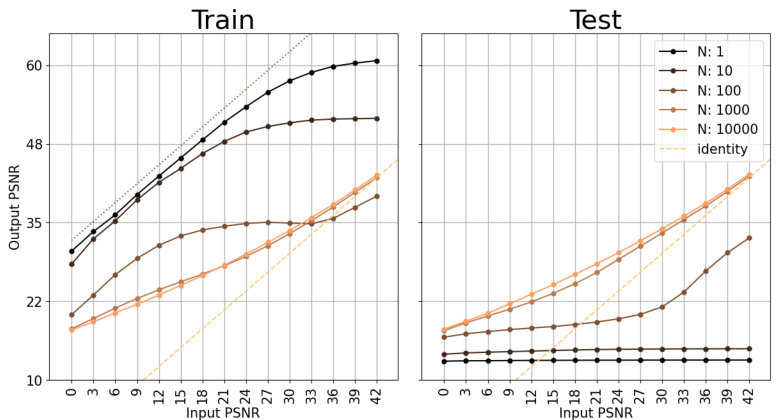  
Figure 1: Transition from memorization to generalization, for a DNN denoiser trained on face images. Each curve shows the denoising MSE (output PSNR) as a function of noise level (input PSNR), for a training set of size $N$ . As $N$ increases, performance on the train set generally declines (left), while performance on the test set improves (right). For $N=1$ , the train PSNR performance improves with unit slope, but is suboptimal (optimal performance indicated with dotted line)—this case is analyzed in Appendix B.4. Test PSNR is poor, independent of noise level. The peculiar shape of the train curve at $N=100$ , where test performance on small noise levels significantly increases, is indicative of the transition phase from memorization to generalization. For $N={10}^{4}$ , test and train PSNR are essentially identical, and the model is no longer overfitting the training data.  

and $p_{\theta}(x)$ , is then controlled by the integrated score error across all noise levels ( Song et al. ,2021 ):  

$$
D_{\mathrm{KL}}(p(x)\,\Vert\,p_{\theta}(x))\leq\int_{0}^{\infty}\mathbb{E}\Bigl[\Vert\nabla\log p_{\sigma}(y)-s_{\theta}(y)\Vert^{2}\Bigr]\,\sigma\,\mathrm{d}\sigma.
$$  

The key to learning the scores is an equation due to Miyasawa (1961 ) (proved in Appendix C.1 for completeness) that relates them to the mean of the corresponding posterior densities:  

$$
\nabla\log p_{\sigma}(y)=(\mathbb{E}[x\,|\,y]-y)/\sigma^{2}.
$$  

The score is learned by training a denoiser $f_{\theta}(\boldsymbol{y})$ to minimize the mean-squared error ( Vincent ,2011 ):  

$$
\mathrm{MSE}(f_{\theta},\sigma^{2})=\mathbb{E}\Big[\|x-f_{\theta}(y)\|^{2}\Big],
$$  

so that $f_{\theta}(y)\approx\mathbb{E}[x\,|\,y]$ . This estimated conditional mean is used to recover the estimated score using 3): $s_{\theta}(y)=\bar{(f_{\theta}(y)}-y)/\sigma^{2}$ . As we show in Appendix C.2, the error in estimating the density $p(x)$ is then controlled by the integrated optimality gap of the denoiser across noise levels:  

$$
D_{\mathrm{KL}}(p(x)\,\|\,p_{\theta}(x))\leq\int_{0}^{\infty}\Bigl(\mathrm{MSE}(f_{\theta},\sigma^{2})-\mathrm{MSE}(f^{\star},\sigma^{2})\Bigr)\,\sigma^{-3}\,\mathrm{d}\sigma,
$$  

where $f^{\star}(y)=\mathbb{E}[x\,|\,y]$ is the optimal denoiser. Thus, learning the true density model is equivalent to performing optimal denoising at all noise levels. Conversely, a suboptimal denoiser introduces a score approximation error, which in turn results in an error on the modeled density.  

# 2.2 TRANSITION FROM MEMORIZATION TO GENERALIZATION  

In general, DNNs are susceptible to overfitting, because the number of training examples is typically small relative to the model size. An overfitted denoiser performs well on train images but fails to generalize to test images. Recently, several papers have reported that score-based diffusion models can memorize their training data ( Somepalli et al. ,2023 ;Carlini et al. ,2023 ;Dar et al. ,2023 ), indicating overfitting. To directly assess this, we compare denoising performance on train and test data as a function of training set size $N$ . We train 5 denoisers on subsets of the (downsampled) CelebA dataset ( Karras et al. ,2018 ) of size $N\,=\,1,10,10^{2},10^{3},10^{4}$ . We use the BF-CNN architecture (Mohan\* et al. ,2020 ), which is composed of 21 convolution layers with batch normalization and ReLU non-linearities. These denoisers are universal and blind: they operate on all noise levels without Figure 2: Convergence of model variance. Diffusion models are trained on non-overlapping subsets $S_{1}$ and $S_{2}$ of a face dataset. The subset size $N$ varies from 1 to $\mathrm{10^{4}}$ . We then generate a sample from each model with a deterministic reverse diffusion initialized with the same noise image. Top. For training sets of size $N=1$ and $N=10$ , the networks memorize, producing samples drawn from the training set. For $N=100$ , generated samples do not match any training set images, but are highly corrupted. This corresponds to a regime where the networks transition from memorization to generalization (see the corresponding curve in Figure 1). For $N={10}^{4}$ , the two networks generate nearly identical images. Bottom. The distribution of cosine similarity (normalized inner product) between pairs of generated images (blue) shifts from left to right with increasing $N$ , showing vanishing model variance. Conversely, the distribution of cosine similarity between each generated sample and the most similar image in the corresponding train set (orange) shifts from right to left. Additionally, Appendix B.1 shows the distribution of cosine similarities of closest pairs between the two training subsets. Similar results are shown in Appendix B.2 for the LSUN bedroom dataset ( Yu et al. ,2015 ).  

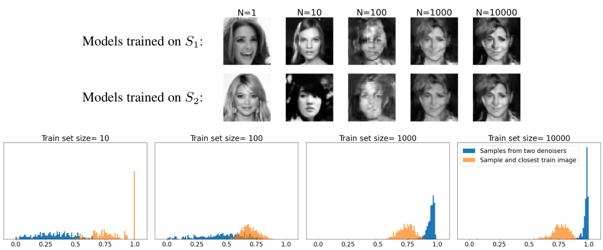  

having noise level as an input. Networks are trained to denoise images by minimizing mean-squared error (Eq. 4). See Appendix A for architecture and training details.  

Results are shown in Figure 1. When $N=1$ , the denoiser essentially memorizes the single training image, leading to a high test error. Increasing $N$ substantially increases the performance on the test set while worsening performance on the train set, as the network transitions from memorization to generalization. At $\bar{N}={{10}^{4}}$ , empirical test and train error are matched for all noise levels.  

The generalization of the denoising performance suggests that the model variance vanishes when $N$ increases, so that the density implicitly represented by the DNN becomes independent of the training set. To investigate this, we train denoisers on non-overlapping subsets of CelebA of various size $N$ .We then generate samples using the scores learned by each denoiser, through the deterministic reverse diffusion algorithm of Kadkhodaie & Simoncelli (2020 )—see Appendix A for details. Figure 2 shows samples generated by these denoisers, starting from the same initial noise sample. For small $N$ , the networks memorize their respective training images. For large $N$ , however, the networks converge to the same score function (and thus sample from the same model density), generating nearly identical samples. This surprising behavior, which is much stronger than convergence of average train and test performance, shows that the model variance tends to zero at a train set size that is quite small relative to the sizes of the network ( $700k$ parameters) and the image ( $40\times40$ pixels).  

# 3 I NDUCTIVE BIASES  

The number of samples needed for estimation of an arbitrary probability density grows exponentially with dimensionality. As a result, estimating high-dimensional distributions without a strong implicit prior over the hypothesis space is infeasible. The network architecture and the optimization algorithm induce a prior over the space of functions. This implicit prior over the hypothesis space is refereed to as inductive bias ( Wilson & Izmailov ,2020 ). In Section 2.2, we demonstrated that DNN denoisers can learn scores, and thus a density, from relatively small train sets. This generalization result is evidence that the inductive biases of network are well-matched to the “true” distribution of images, allowing the model to rapidly converge to a good solution through learning. On the contrary, when inductive biases are not aligned with the “true” distribution, the model will converge to a poor solution.  

For diffusion methods, learning the right density model is equivalent to performing optimal denoising at all noise levels, as shown in Section 2.1. The inductive biases on the density model thus arise directly from inductive biases in the denoiser. This connection offers a means of evaluating the accuracy of the learned probability models, which is generally difficult in high-dimensions.  

# 3.1 DENOISING AS SHRINKAGE IN AN ADAPTIVE BASIS  

In this subsection, we explain how the inductive biases of the DNN denoiser can be studied from the perspective of an eigendecomposition of its Jacobian. We explain the general properties that are expected of the Jacobian eigenvalues and eigenvectors if they are optimal, and discuss several specific cases from classical analyses for which the optimal solution is known.  

Jacobian eigenvectors. To analyze inductive biases, we perform a local analysis of a denoising estimator ${\hat{x}}(y)=f(y)$ by looking at its Jacobian $\nabla f(y)$ . For simplicity, we assume that the Jacobian is symmetric and non-negative (we show below that this holds for the optimal denoiser, and it is approximately true of the network Jacobian ( Mohan\* et al. ,2020 )). We can then diagonalize it to obtain eigenvalues $(\lambda_{k}(y))_{1\leq k\leq d}$ and eigenvectors $(e_{k}(y))_{1\leq k\leq d}$ .  

If $f(y)$ is computed with a DNN denoiser with no additive “bias” parameters, its input-output mapping is piecewise linear (as opposed to piecewise affine, Mohan\* et al. (2020 )). It follows that the denoiser mapping can be rewritten in terms of the Jacobian eigendecomposition as  

$$
f(y)=\nabla f(y)\,y=\sum_{k}\lambda_{k}(y)\,\langle y,e_{k}(y)\rangle\,e_{k}(y).
$$  

The denoiser can thus be interpreted as performing shrinkage with factors $\lambda_{k}(y)$ along axes of a basis specified by $\boldsymbol{e}_{\boldsymbol{k}}(\boldsymbol{y})$ . Note that both the eigenvalues and eigenvectors depend on the noisy image $y$ (i.e., both the basis and shrinkage factors are adaptive ).  

Small eigenvalues $\lambda_{k}(y)$ reveal local invariances of the denoising function: small perturbations in the noisy input along the corresponding eigenvectors $\boldsymbol{e}_{\boldsymbol{k}}(\boldsymbol{y})$ do not affect the denoised output. Intuitively, such invariances are a desirable property for a denoiser, and they are naturally enforced by minimizing mean-squared error (MSE) as expressed with Stein’s Unbiased Risk Estimate (proved in Appendix C.3 for completeness):  

$$
\mathrm{MSE}(f,\sigma^{2})=\mathbb{E}\Big[\|y-f(y)\|^{2}+2\sigma^{2}\operatorname{tr}\nabla f(y)-\sigma^{2}d\Big].
$$  

To minimize this MSE, the denoiser must trade off the approximate “rank” of the Jacobian (equal to the trace, which is the sum of the eigenvalues) against the squared magnitude of the denoising step. The denoiser thus locally behaves as a (soft) projection on a subspace whose dimension corresponds to the rank of the Jacobian. As we now explain, this subspace approximates the support of the posterior distribution $p(x|y)$ , and thus gives a local approximation of the support of $p(x)$ .  

It is shown in Appendix C.1 that the optimal minimum MSE denoiser and its Jacobian are given by  

$$
\begin{array}{r l}&{\quad f^{\star}(y)=y+\sigma^{2}\nabla\log p_{\sigma}(y)=\mathbb{E}[x\,|\,y],}\\ &{\nabla f^{\star}(y)=\mathrm{Id}+\sigma^{2}\nabla^{2}\log p_{\sigma}(y)=\sigma^{-2}\mathrm{Cov}[x\,|\,y].}\end{array}
$$  

That is, the Jacobian of the optimal denoiser is proportional to the posterior covariance matrix, which is symmetric and non-negative. This gives us another interpretation of the adaptive eigenvector basis as providing an optimal approximation of the unknown clean image $x$ given the noisy observation $y$ .Further, the optimal denoising error is then given by  

$$
\mathrm{MSE}(f^{\star},\sigma^{2})=\mathbb{E}[\mathrm{tr}\,\mathrm{Cov}[x\,|\,y]]=\sigma^{2}\mathbb{E}\big[\mathrm{tr}\,\nabla f^{\star}(y)\big]=\sigma^{2}\mathbb{E}\Bigg[\sum_{k}\lambda_{k}(y)\Bigg].
$$  

A small denoising error thus implies an approximately low-rank Jacobian (with many small eigenvalues) and thus an efficient approximation of $x$ given $y$ . We can study the inductive bias of the network by evaluating if and how the eigenvectors $\boldsymbol{e}_{\boldsymbol{k}}(\boldsymbol{y})$ and Jacobian rank deviate from the optimal ones.  

Denoising in a basis. than aiming for exact optimality, classical analyses ( In most cases, the optimal adaptive basis Donoho ,1995 $(e_{k}^{\star}(y))_{1\le k\le d}$ ) thus focus on the asymptotic ≤≤is not known. Rather decay of the denoising error when the noise level $\sigma^{2}$ vanishes, up to multiplicative constants. This corresponds to finding a basis $(e_{k}(y))_{1\leq k\leq d}$ which captures the asymptotic slope of the PSNR plots in Figure 1 but not necessarily the intercept. This weaker notion of optimality is obtained by showing matching upper and lower-bounds for the asymptotic behavior of the denoising error.  

To understand how the basis depends on the properties of the distribution of clean images $x$ , it is helpful to consider a simpler case by restricting the parametric form of $\boldsymbol{e}_{\boldsymbol{k}}(\boldsymbol{y})$ . For instance, for the case of a fixed orthonormal basis $\boldsymbol{e}_{\boldsymbol{k}}(\boldsymbol{y})=\boldsymbol{e}_{\boldsymbol{k}}$ , one can define shrinkage factors $\lambda_{k}(y)$ that achieve the optimal PSNR slope as follows.  

An unreachable lower-bound on the denoising error (and thus an upper-bound on the slope) is obtained by evaluating the performance of an “oracle” denoiser where the shrinkage factors $\lambda_{k}$ depend on the unknown clean image $x$ rather than the noisy observation $y$ (Mallat ,2008 ) . The denoising error of this oracle is then equal to  

$$
\mathbb{E}\left[\sum_{k}\Bigl(\bigl(1-\lambda_{k}(x)\bigr)^{2}\langle x,e_{k}\rangle^{2}+\lambda_{k}(x)^{2}\sigma^{2}\Bigr)\right],
$$  

which is minimized when $\begin{array}{r}{\lambda_{k}(x)=\frac{\left\langle x,e_{k}\right\rangle^{2}}{\left\langle x,e_{k}\right\rangle^{2}+\sigma^{2}}}\end{array}$ .We see that the multiplication with $\lambda_{k}(x)$ acts as a soft threshold: $\lambda_{k}(x)\approx1$ when the signal dominates the noise and ⟨⟩$\lambda_{k}(x)\approx0$ when the signal is much weaker than the noise. The error of this oracle denoiser is the expectation of  

$$
\sigma^{2}\sum_{k}\lambda_{k}(x)=\sum_{k}\frac{\sigma^{2}\langle x,e_{k}\rangle^{2}}{\langle x,e_{k}\rangle^{2}+\sigma^{2}}\sim\sum_{k}\operatorname*{min}(\langle x,e_{k}\rangle^{2},\sigma^{2})=M\sigma^{2}+\|x-x_{M}\|^{2},
$$  

$\begin{array}{r}{x_{M}=\sum_{|\langle x,e_{k}\rangle|>\sigma}\langle x,e_{k}\rangle e_{k}}\end{array}$ Pis the $M$ -term approximation of $x$ with the $M$ basis coefficients $\langle x,e_{k}\rangle$ ⟨⟩above the noise level, and $\sim$ means that two terms re of the same order up to a multiplicative constant (here between 0 .5 and 1 ). The error is small if xhas a sparse representation in the basis, so that both $M$ and the approximation error are small. For example, if the coefficients decay as $\left\langle x,e_{k}\right\rangle^{2}\sim k^{-(\alpha+1)}$ then  

$$
M\sigma^{2}+\left\|x-x_{M}\right\|^{2}\sim\sigma^{-2\alpha/(\alpha+1)}.
$$  

Thus, a larger sparsity/regularity exponent $\alpha$ , which corresponds to a faster decay of the small coefficients of $x$ in the basis $(e_{k})_{1\leq k\leq d}$ , leads to a faster decay of the MSE with decreasing $\sigma$ .To minimize the oracle denoising error, th basis $(e_{k})_{1\leq k\leq d}$ should thus be chosen to provide the sparsest representation of the clean images x. The decay (13) corresponds to an asymptotic slope of $\bar{\alpha}/(\alpha+1)$ in the PSNR curve when input PSNR increases.  

The minimum oracle denoising error is nearly reached with a soft-thresholding estimator, which computes the shrinkage factors $\lambda_{k}(y)$ by comparing $|\langle y,e_{k}\rangle|$ with a threshold proportional to $\sigma$ (Donoho & Johnstone ,1994 ). This estimator achieves an MSE that approaches the decay of the oracle lower-bound given by eq. (13), up to a $\log\sigma$ factor. It is thus an almost-optimal denoising estimator algorithm among fixed-basis algorithms. Such algorithms are for example optimal for bounded variation images, where the best basis is a wavelet basis ( Donoho & Johnstone ,1998 ).  

Geometry-adaptive harmonic bases. Denoising estimators calculated with DNNs may be interpreted as best-basis estimators that adapt the basis $(e_{k})_{1\leq k\leq d}$ to the noisy image $y$ in order to obtain a sparser representation of the unknown clean image x. We now evaluate the inductive biases of the DNN trained on ${10}^{4}$ images used in Section 2.  

Figure 3 shows the shrinkage factors $(\lambda_{k}(y))$ , adaptive basis vectors $(e_{k}(y))$ , and signal coefficients $(\langle\bar{x},e_{k}(y)\rangle)$ . The eigenvectors have oscillating patterns both along the contours and in uniformly regular regions and thus adapt to the geometry of the input image. The coefficients are seen to be sparse in this basis, and the fast rate of decay of eigenvalues exploits this sparsity. The strong generalization results of Section 2 show that the network inductive biases are well-aligned to the data distribution in the case of celebrity faces. All of this suggests that DNN denoisers might be inductively biased towards such geometry-adaptive harmonic bases (GAHBs). In the next two subsections, we provide evidence supporting this conjecture, by analyzing networks trained on synthetic datasets where the optimal solution is (approximately) known.  

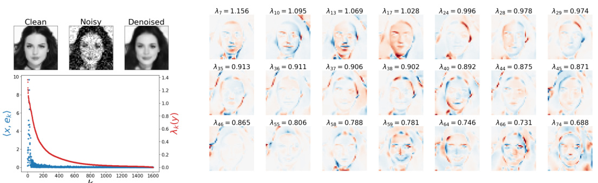  

Figure 3: Analysis of a denoiser, trained on $\mathrm{10^{4}}$ face images, evaluated on a noisy test image. Top left. Clean, noisy $(\sigma=0.15)$ ) and denoised images. Bottom left. Decay of shrinkage values $\lambda_{k}(y)$ (red), and corresponding coefficients $\langle x,e_{k}(y)\rangle$ (blue), evaluated for the noisy image $y$ . The rapid decay of the coefficients indicates that the image content is highly concentrated within the preserved subspace Right. The adaptive basis vectors $e_{k}(y)$ contain oscillating patterns, adapted to lie along the contours and within smooth regions of the image, whose frequency increases as $\bar{\lambda}_{k}(y)$ decreases.  

# 3.2 A LIGNED INDUCTIVE BIASES AND OPTIMALITY  

Best bases and inductive bias. Suppose that the adaptive basis $(e_{k}(y))$ is selected within a dictionary, which may include an exponential number of orthonormal bases, but which are all constructed from a number of vectors $e_{k}$ which is polynomial in $d$ . One can then prove ( Dossal et al. ,2011 ) that a best-basis selection from the noisy image $y$ can achieve an MSE of the same order as the oracle best-basis estimated from the clean image $x$ . This near-optimality despite the presence of noise comes from the limited choice of possible basis vectors $e_{k}$ in the dictionary, which limits the variance of the best-basis estimation. This is equivalent to the inductive bias of a DNN, which restricts the class of denoising estimators $f(y)$ to avoid the curse of dimensionality. The main difficulty is to have an inductive bias that leads to an MSE that is close to the minimum MSE. If DNNs are inductively biased towards GAHBs, we expect that they generalize and converge to the optimal denoising performance when such bases are indeed optimal. We now verify this conjecture on a class of synthetic images.  

$\mathbf{C}^{\alpha}$ & Tsybakov regions that are separated by uniformly Lipschitz images and bandlet bases. ,1993 ;Donoho ,1999 We consider the so-called geometric ;Peyré & Mallat $\mathbf{C}^{\alpha}$ ,2008 contours. A uniformly Lipschitz ) which are uniformly Lipschitz $\mathbf{C}^{\alpha}$ class of images ( $\alpha$ Korostelev function $\mathbf{C}^{\alpha}$ over has (partial) derivatives of degree smaller than $\alpha$ which are uniformly bounded. Examples of these images are shown in Figure 4 and Appendix B.3.  

One can prove ( Korostelev & Tsybakov ,1993 ) that the optimal denoiser on geometrically $\mathbf{C}^{\alpha}$ images has a PSNR which asymptotically increases with a slope $\alpha/(\alpha+1)$ as a function of input PSNR. This optimal slope $\alpha/(\alpha+1)$ is also obtained by best “bandlet” basis denoising estimators ( Peyré & Mallat ,2008 ;Dossal et al. ,2011 ). Bandlets are harmonic functions oscillating at different frequencies, whose geometry is adapted to take advantage of the directional regularity of images along contours. Sparse representation of $\mathbf{C}^{\alpha}$ images are obtained with few bandlets having low-frequency oscillations in regular regions and along contours but sharp variations across contours.  

Figure 4 shows that DNN denoisers trained on $10^{4}~\mathbf{C}^{\alpha}$ images also achieve this optimal rate and learns GAHBs adapted to the level of regularity $\alpha$ , similarly to bandlets but with a more flexible geometry. This generalization performance confirms that inductive biases of DNNs are aligned towards learning GAHBs.  

# 3.3 MIS -ALIGNED INDUCTIVE BIASES AND SUBOPTIMALITY  

If the generalization of DNNs is enabled by inductive biases favoring GAHBs, then we expect these bases to emerge even in cases where they are suboptimal. In this section, we consider synthetic image classes that test this prediction.  

Low-dimensional manifolds. We consider a dataset of disk images with varying positions, sizes, and foreground/background intensities. This defines a five-dimensional curved manifold, with a tangent space evaluated at a disk image $x$ that is spanned by deformations of $x$ along these five dimensions.  

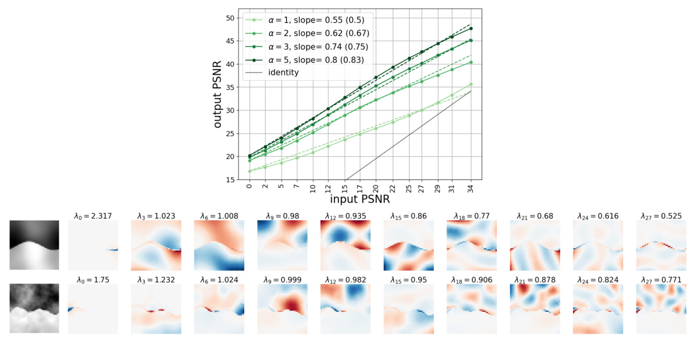  

Figure 4: DNN denoisers trained on $\mathbf{C}^{\alpha}$ images achieve near-optimal performance. Top. PSNR values of curves of trained networks for various regularity levels $\alpha$ closely match the optimal slopes (dashed lines). $\alpha$ . The empirical slopes achieved for different Bottom. Eigenvectors for two $\mathbf{C}^{\alpha}$ images (top row: $\alpha=4$ , bottom row: $\alpha=2$ ), which consist of harmonics on the two regions and harmonics along the boundary. The frequency of the harmonics increases with $k$ . For less regular images, the harmonics are more localized along the contours. More examples are given in Appendix B.3.  

When the noise level $\sigma$ is much smaller than the radius of curvature of the manifold, the posterior distribution $p(x|y)$ is supported on an approximately flat region of the manifold, and the optimal denoiser is approximately a projection onto the tangent space. Thus, the optimal Jacobian should have only five non-negligible eigenvalues, whose corresponding eigenvectors span the tangent space. The remaining eigenvectors should have shrinkage factors of $\lambda=0$ but are otherwise unconstrained. The optimal MSE is then asymptotically equal to $5\sigma^{2}$ , leading to a unit PSNR slope.  

Figure 5 shows an analysis of a denoiser trained on ${10}^{4}$ disk images. We observe additional basis vectors with non-negligible eigenvalues that have a GAHB structure, with oscillations on the background region and along the contour of the disk. We also find that the number of non-zero eigenvalues increases as the noise level decreases, and this leads to a suboptimal PSNR slope of approximately 0 .9 . We obtain similar results on two additional examples of a distribution supported on a low-dimensional manifold, given in Appendix B.4. These results reveal that the inductive biases of the DNN are not perfectly aligned with low-dimensional manifolds, and that in the presence of the curvature, the suboptimality due to these biases increases as the noise level decreases.  

Shuffled images. We now turn to a high-dimensional distribution whose optimal basis does not have harmonic structures. We construct a dataset of shuffled faces by permuting the pixels of $\mathrm{10^{4}}$ face images in the CelebA dataset. The permutation was chosen randomly, and does not preserve locality, as neighboring pixels are mapped to independent positions. By construction, the optimal denoiser on shuffled faces has the same performance as the optimal denoiser on ordinary faces (unshuffling the image pixels, optimally denoising the face image, and then shuffling the pixels back).  

Figure 6 shows the behavior of a denoiser trained on this dataset. The first basis vectors are partially harmonic and are adapted to the global geometry of the face, but are significantly corrupted. The eigenvalues decay much more slowly than for the denoiser trained on non-shuffled faces, which is also indicative of suboptimality. The MSE is also much higher (with a much lower PSNR slope) than that of the denoiser trained on ordinary faces. The mismatch between the inductive biases of the architecture and the properties of the distribution thus results in substantially worse performance.  

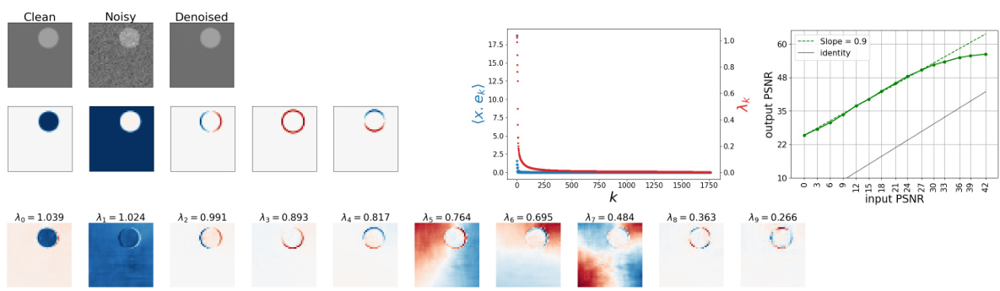  

Figure 5: DNN denoiser trained on a dataset of translating and dilating disk images, with variable foreground/background intensity. Top left. Clean, noisy $\sigma=0.04)$ , and denoised images. Top center. achieves and preserves a sparse representation of the true image. The decay of shrinkage factors $\lambda_{k}(y)$ and coefficients $\langle x,e_{k}(y)\rangle$ Top right. indicates that the network The network achieves a sub-optimal denoising performance with a PSNR slope of 0 .9 (optimal slope is 1 .0 ). Middle left. An optimal basis (in the small-noise limit) spanning the 5-dimensional tangent space of the image manifold. Bottom. Top eigenvectors of the adaptive basis. The first five basis vectors closely match the basis of the tangent space of the manifold evaluated at the clean image. In contrast, the next five are GAHBs that lie along contours and within background regions of the clean image.  

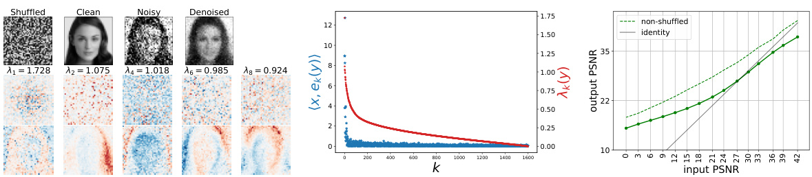  

Figure 6: DNN denoiser trained on a shuffled face dataset. For visualization purposes, we “unshuffle” the pixels by applying the inverse of the permutation to the images before display. Top left. Clean (shuffled then unshuffled), noisy (unshuffled, $\sigma=0.3)$ ), and denoised (unshuffled) images. Middle. The shrinkage factors $\lambda_{k}(y)$ decay more slowly than when the denoiser is trained on non-shuffled faces (Figure 3). Right. The denoiser performs significantly worse than the denoiser trained on unshuffled faces. Bottom left. Basis vectors (top row: shuffled, bottom row: unshuffled). After unshuffling, we observe GAHBs adapted to the geometry of the face, although these are noisier and less precisely aligned with the image features than the non-shuffled examples in Figure 3.  

# 4 DISCUSSION  

Diffusion generative models, which operate through iterative application of a trained DNN denoiser, have recently surpassed all previous methods of learning probability models from images. They are easily trained, and generate samples of impressive quality, often visually indistinguishable from those in the training set. In this paper, we introduce a methodology to elucidate the approximation properties that underlie this success, by evaluating the properties of the trained denoiser, which is directly related to the score function, and to the density from which the data are drawn.  

Here, we showed empirically that diffusion models can achieve a strong form of generalization, converging to a unique density model that is independent of the specific training samples, with an amount of training data that is small relative to the size of the parameter or input spaces. The convergence exhibits a phase transition between memorization and generalization as training data grows. The amount of data needed to cross this phase transition depends on both the image complexity and the neural network capacity ( Yoon et al. ,2023 ), and it is of interest to extend both the theory and the empirical studies to account for these. The framework we introduced to assess memorization versus generalization may be applied to any generative model.  

We also examined the inductive biases that enable this rapid convergence. Using a well-established mathematical framework, we showed that DNN denoisers perform shrinkage of noisy coefficients in a best basis. When trained on photographic images, this best basis is a geometry-adaptive harmonic basis (GAHB) which is shaped by geometric features of the image. For the $\mathbf{C}^{\alpha}$ class of images, such geometric bases are known to be optimal, and DNN denoisers achieve near-optimal performance on this class. Previous mathematical literature has shown that bandlet bases, which are a specific type of GAHB, are near-optimal for this class, but the GAHBs learned by the DNN denoiser are more general and more flexible. For images drawn from low-dimensional manifolds, for which the optimal basis spans the tangent subspace of the manifold, we find that DNN denoisers achieve good denoising within a basis adapted to this subspace, but also incorporate GAHB vectors in the remaining unconstrained dimensions. The non-suppressed noise along these additional GAHB components leads to suboptimal denoising performance. This surprising finding hints that rather than low-dimensional structures, DNNs favor high-dimensional structures with regularity among dimensions, and this allows them to be inferred from small amounts of data. The example of permuted face images shows that the basis learned by the network may not be a GAHB but the resulting denoiser remains very far from optimal. We do not provide a formal mathematical definition of this larger class of GAHB bases which underlie the inductive biases of DNN, nor do we understand how they result from the DNN computational architecture. Both are important open questions. Nevertheless, our results provide strong evidence that GAHBs reflect the inductive biases of these networks.  

# REFERENCES  

Nicolas Carlini, Jamie Hayes, Milad Nasr, Matthew Jagielski, Vikash Sehwag, Florian Tramer, Borja Balle, Daphne Ippolito, and Eric Wallace. Extracting training data from diffusion models. In 32nd USENIX Security Symposium (USENIX Security 23) , pp. 5253–5270, 2023.   
Salman Ul Hassan Dar, Arman Ghanaat, Jannik Kahmann, Isabelle Ayx, Theano Papavassiliou, Stefan O Schoenberg, and Sandy Engelhardt. Investigating data memorization in 3d latent diffusion models for medical image synthesis. arXiv preprint arXiv:2307.01148 , 2023.   
D Donoho. Denoising by soft-thresholding. IEEE Trans Information Theory , 43:613–627, 1995.   
David L Donoho. Wedgelets: Nearly minimax estimation of edges. the Annals of Statistics , 27(3): 859–897, 1999.   
David L Donoho and Iain M Johnstone. Ideal spatial adaptation by wavelet shrinkage. biometrika , 81 (3):425–455, 1994.   
David L Donoho and Iain M Johnstone. Minimax estimation via wavelet shrinkage. The annals of Statistics , 26(3):879–921, 1998.   
Ch. Dossal, E. Le Pennec, and S. Mallat. bandlet image estimation with model selection. Signal Processing , 91:2743–2753, 2011.   
J Ho, A Jain, and P Abbeel. Denoising diffusion probabilistic models. Adv Neural Information Processing Systems (NeurIPS) , 33, 2020.   
Z Kadkhodaie and E P Simoncelli. Solving linear inverse problems using the prior implicit in a denoiser. arXiv preprint arXiv:2007.13640 , Jul 2020.   
T Karras, T Aila, S Laine, and J Lehtinen. Progressive growing of gans for improved quality, stability, and variation. arXiv preprint arXiv:1710.10196 , 2018.   
A. P. Korostelev and A. B. Tsybakov. Minimax theory of image reconstruction . Springer New York, NY, 1993.   
S Mallat. A wavelet tour of signal processing: The sparse way . Academic Press, 2008.   
K Miyasawa. An empirical Bayes estimator of the mean of a normal population. Bull. Inst. Internat. Statist. , 38:181–188, 1961.   
S Mohan\*, Z Kadkhodaie\*, E P Simoncelli, and C Fernandez-Granda. Robust and interpretable blind image denoising via bias-free convolutional neural networks. In Int’l Conf on Learning Representations (ICLR) , Addis Ababa, Ethiopia, Apr 2020. URL https://arxiv.org/abs/ 1906.05478 .  
G. Peyré and S. Mallat. Orthogonal bandlet bases for geometric images approximation. Comm. on Pure and Applied Math. , 61(9):1173–1212, 2008.   
J Sohl-Dickstein, E Weiss, N Maheswaranathan, and S Ganguli. Deep unsupervised learning using nonequilibrium thermodynamics. In Francis Bach and David Blei (eds.), Proc 32nd Int’l Conf on Machine Learning (ICML) , volume 37 of Proceedings of Machine Learning Research , pp. 2256– 2265, Lille, France, 07–09 Jul 2015. PMLR. URL https://proceedings.mlr.press/ v37/sohl-dickstein15.html .  
Gowthami Somepalli, Vasu Singla, Micah Goldblum, Jonas Geiping, and Tom Goldstein. Diffusion art or digital forgery? investigating data replication in diffusion models. In Proceedings of the IEEE/CVF Conference on Computer Vision and Pattern Recognition , pp. 6048–6058, 2023.   
Y Song and S Ermon. Generative modeling by estimating gradients of the data distribution. Adv Neural Information Processing Systems (NeurIPS) , 32, 2019.   
Yang Song, Conor Durkan, Iain Murray, and Stefano Ermon. Maximum likelihood training of score-based diffusion models. Advances in Neural Information Processing Systems , 34:1415–1428, 2021.   
P Vincent. A connection between score matching and denoising autoencoders. Neural Computation ,23(7):1661–1674, 2011.   
Andrew G Wilson and Pavel Izmailov. Bayesian deep learning and a probabilistic perspective of generalization. Advances in neural information processing systems , 33:4697–4708, 2020.   
TaeHo Yoon, Joo Young Choi, Sehyun Kwon, and Ernest K Ryu. Diffusion probabilistic models generalize when they fail to memorize. In ICML 2023 Workshop on Structured Probabilistic Inference $\{\backslash\mathcal{E}\}$ Generative Modeling , 2023.   
Fisher Yu, Ari Seff, Yinda Zhang, Shuran Song, Thomas Funkhouser, and Jianxiong Xiao. LSUN: Construction of a large-scale image dataset using deep learning with humans in the loop. arXiv preprint arXiv:1506.03365 , 2015.  

# A EXPERIMENTAL DETAILS  

Architecture . All the denoisers are “bias-free”: we remove all additive constants from convolution and batch-normalization operations (i.e., the batch normalization does not subtract the mean), following Mohan\* et al. (2020 ). All networks contain 21 convolutional layers with no subsampling, each consisting of 64 channels. Each layer, except for the first and the last, is followed by a ReLU non-linearity and bias-free batch-normalization. Thus, the transformation is both homogeneous (of order 1) and translation-invariant (apart from handling of boundaries), at each scale. All convolutional kernels in the low-pass DNN are of size $3\times3$ , resulting in 665 ,856 parameters in total.  

Training . For experiments shown in Figures 1 and 2, we use the CelebA HQ dataset ( Karras et al. ,2018 ) downsampled to $40\times40$ resolution. For experiments shown in Appe , we use images drawn from the LSUN bedroom dataset ( follow the training procedure described in Mohan\* et al. Yu et al. ,2015 () downsampled to 2020 ), minimizing the mean-squared error $32\times32$ ×resolution. We in denoising images corrupted by i.i.d. Gaussian noise with standard deviations drawn from the range $[0,1]$ (relative to image intensity range $[0,1];$ ). Training is carried out on batches of size 512 . Note that all denoisers are universal and blind: they are trained to handle a range of noise, and the noise level is not provided as input to the denoiser. These properties are exploited by the sampling algorithm, which can operate without manual specification of the step size schedule ( Kadkhodaie & Simoncelli ,2020 ).  

# A.2 SAMPLING ALGORITHM  

Sampling from both the DNN denoisers is achieved using the deterministic form of the algorithm presented in Kadkhodaie & Simoncelli (2020 ), which is specified below in Algorithm 1. Aside from initial and final noise levels $(\sigma_{0},\sigma_{\infty})$ , this method uses only one step size hyperparameter $h\in[0,1]$ ,which controls the trade-off between computational efficiency and visual quality. We chose $h=0.01$ ,$\sigma_{0}=1$ , and $\sigma_{\infty}=0.01$ . Sampling here is deterministic, once the initial noise sample has been chosen.  

# Algorithm 1 Sampling via ascent of the log-likelihood gradient from a denoiser residual  

# Req denoiser $f$ , step size $h$ , initial noise level $\sigma_{0}$ , final noise level $\sigma_{\infty}$  

1: t= 0   
2: Draw $x_{0}\sim\mathcal{N}(0,\sigma_{0}^{2}\mathrm{Id})$   
4: 5: 3: wh $s_{t}\gets f(x_{t-1})-x_{t-1}$ $t\gets t+1$ ←$\sigma_{t}\geq\sigma_{\infty}$ ∞do   
6: σ2   
7: $x_{t}\gets x_{t-1}+h s_{t}$ ←−  

$\triangleright$ Compute the score from the denoiser residual ▷Compute the current noise level for stopping criterion $\triangleright$ Perform a partial denoiser step  

# 8: end while  

BA DDITIONAL NUMERICAL RESULTS B.1 SIMILARITY OF SUBSETS OF CELEB A  

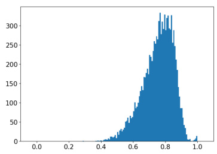  

Figure 7: Histogram of cosine similarity between pairs of closest images in the non-overlapping subsets $S_{1}$ and $S_{2}$ of CelebA. This should be compared with the histograms in Figure 2.  

B.2 GENERALIZATION RESULT ON LSUN BEDROOMS DATASET Figure 8: Convergence of model variance on LSUN bedroom dataset ( Yu et al. ,2015 ). A dataset of bedroom images is partitioned into two non-overlapping datasets, $S_{1}$ and $S_{2}$ , each containing $N=20,000$ images down-sa led to ze $32\times32$ . We train two networks (BF-CNN architecture described in Appendix A) on $S_{1}$ and $S_{2}$ . Each network is then used in an iterative deterministic reverse diffusion algorithm to generate a sample, with both networks initialized with the same noise image. Samples generated by each denoiser are shown in separate rows, where each column shows same initialization across the networks. The networks generate nearly identical samples, showing convergence to the same function.  

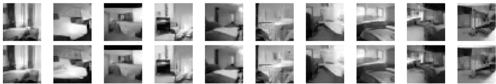  

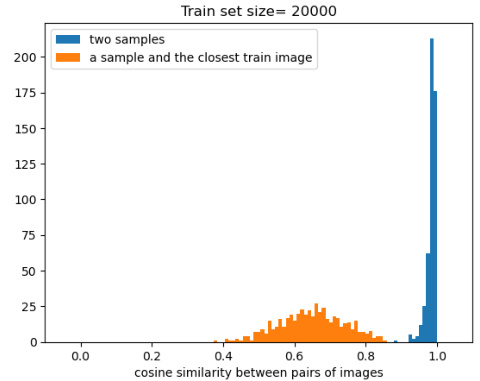  
Figure 9: Blue histograms: cosine similarity between samples generated by two denoisers trained on non-overlapping train sets of size $N=20000$ from LSUN bedroom dataset. Orange histograms: cosine similarity between generated samples and the closest image from the corresponding train set. Images drawn from the two denoisers are very similar to each other, compared to the closest image in their respective training sets.  

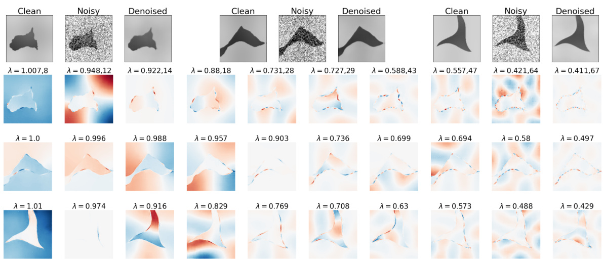  

Figure 10: Geometric-adaptive harmonic basis shown for three test images from $\mathbf{C}^{\alpha}$ class. Here the regularity of the one-dimensional contours $\alpha_{1}$ is different from the regularity of the two-dimensional background $\alpha_{2}$ .Top. Three example images. The regularity of the contour increases from left to right: $\alpha_{1}=1.5,2,4$ . Background regularity is the same in all three examples, $\alpha_{2}=8$ , and $\sigma=0.2$ .Bottom. Top 10 basis vectors for each image are shown. With increasing $\alpha_{1}$ , the contours become more regular, and the harmonics along the boundaries become less localized. This allows for a faster decay of coefficients and a lower denoising error.  

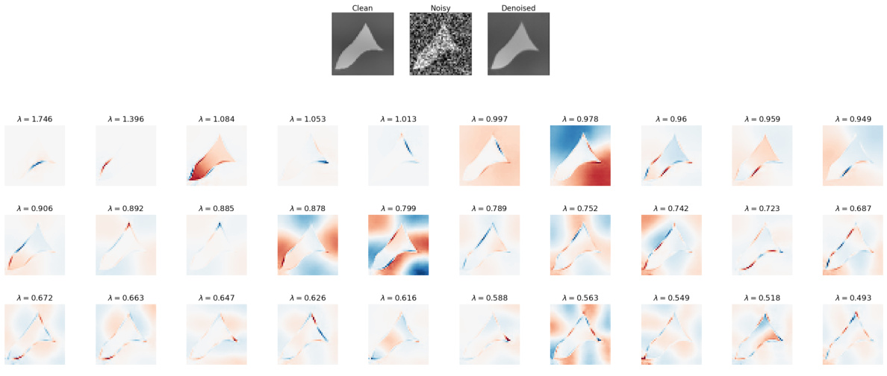  

Figure 11: Top. An additional example of a $C^{\alpha}$ test image with $\alpha=3$ .Bottom. Top eigenvectors of the geometric harmonic adaptive basis.  

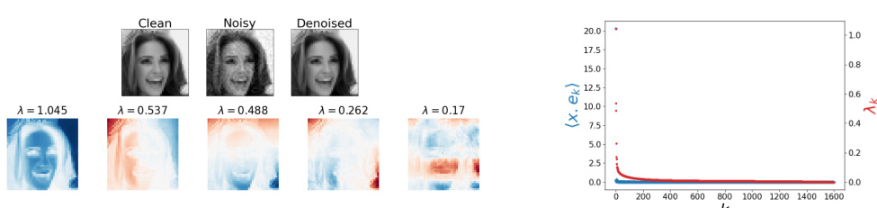  

Figure 12: DNN denoiser trained on a single face image, with intensity rescaling. We consider an image class consisting of a single image $\boldsymbol{x}\in\mathbb{R}^{d}$ and its positive rescalings $s\,x$ for $s>0$ . The resulting images lie on a ray emanating from the origin, and optimal denoising corresponds to projecting the noisy image onto this ray. The optimal denoising basis should therefore include the normalized vector $x/\|x\|$ with associa rinkage factor $\lambda=1$ , whereas the remaining basis vectors should have shrinkage factors of $\lambda=0$ but are otherwise unconstrained. This optimal denoiser achieves an MSE of $\sigma^{2}$ , and thus a linear PSNR curve with unit slope and intercept $10\log_{10}(d)$ .Top left . Denoising of $\lambda_{k}$ . The DNN denoiser exhibits a slower decay of shrinkage factors than the optimal solution, which training image with $\sigma=0.04$ .Right . Decay of the coefficients $\langle x,e_{k}\rangle$ and the shrinkage factors results in suboptimal performance. Bottom left . Top 5 basis vectors $\boldsymbol{e}_{\boldsymbol{k}}(\boldsymbol{y})$ . The first basis vector is nearly identical to the (normalized) train image. The next vectors, which have non-zero shrinkage factors, exhibit 2D harmonics. These GAHB components underlie the non-optimal behavior of the denoiser. Specifically, the $N=1$ curve in the left panel of Figure 1 shows that performance as a function of noise level falls below the optimal solution (dotted line). The DNN performance has a unit slope over most of the noise range but has a less-than-optimal intercept (the flattening of the curve at small noise levels is a result of de-emphasis of small noise levels during training).  

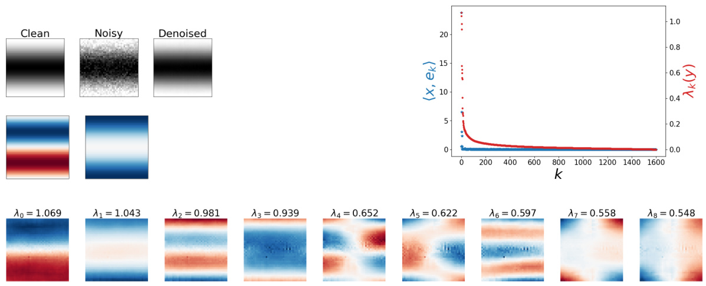  

Figure 13: A BF-CNN denoiser is trained on a set of 2D sine wave images with unit frequency and varying phases and intensities. The train images thus lie on a 2D cone manifold with low curvature. For small $\sigma$ , the manifold can be assumed to be locally flat, so that the optimal denoising is achieved by projecting the noisy image on the two-dimensional subspace tangent to the manifold. This subspace is spanned by two sine waves with unit frequency and a $\pi/2$ phase shift. Top left. Clean, noisy $\sigma\,=\,0.08)$ ), and denoised test image. Middle left. The unit vectors spanning the tangent subspace. The optimal denoising results from projection onto this subspace. Bottom row. Empirical basis obtained from the network Jacobian. The empirical solution has a slower decay than optimal (i.e., $\langle x,e_{k}(y)\rangle>0$ for $k\geq2$ , as seen in the right panel), with harmonic patterns. This sub-optimality reveals the nature of the inductive bias.  

# CMATHEMATICAL DERIVATIONS  

# C.1 MIYASAWA RELATIONSHIPS  

The relationship of MMSE estimation of a signal corrupted by additive Gaussian noise to the score was first published in Miyasawa (1961 ). For completeness, and notational consistency, we provide a derivation here. We begin by expressing the score $\nabla\log{p(y)}$ (dropping the $\sigma$ dependence to simplify notation) and its Jacobian $\nabla^{2}\log{p(y)}$ in terms of the measurement density $p(y|x)$ (which is Gaussian) and the posterior density images writes $p(x|y)$ |. Using the chain rule, the probability density of the noisy  

$$
p(y)=\int p(x)\,p(y|x)\,\mathrm{d}x.
$$  

Taking the logarithm and differentiating with respect to $y$ , and using the fact that for any function $h$ ,$\nabla h(y)=h(y)\,\nabla\log h(y)$ , we find  

$$
\begin{array}{l}{\nabla\log p(y)=\displaystyle\int p(x)\,p(y|x)\,\nabla_{y}\log p(y|x)\,\mathrm{d}x\displaystyle\int p(y)}\\ {\displaystyle\qquad\qquad=\displaystyle\int p(x|y)\,\nabla_{y}\log p(y|x)\,\mathrm{d}x}\\ {\displaystyle\qquad\qquad=\mathbb{E}\big[\nabla_{y}\log p(y|x)\,\big|\,y\big],}\end{array}
$$  

which can be thought of as an equivalent of the chain rule on the scores as opposed to the densities. Differentiating again with respect to $y$ , we have  

$$
\nabla^{2}\log p(y)=\int p(x|y)\Big(\nabla_{y}\log p(x|y)\nabla_{y}\log p(y|x)^{\mathrm{T}}+\nabla^{2}\log p(y|x)\Big)\mathrm{d}x.
$$  

The term $\nabla_{y}\log{p(x|y)}$ can be calculated by differentiating the logarithm of Bayes rule:  

$$
\begin{array}{r}{\log p(x|y)=\log p(y|x)-\log p(y)+\log p(x),\qquad}\\ {\nabla_{y}\log p(x|y)=\nabla_{y}\log p(y|x)-\nabla\log p(y),\qquad}\end{array}
$$  

so that when injected into eq. (15) we obtain  

$$
\begin{array}{r l}&{\nabla^{2}\log p(y)=\displaystyle\int p(x|y)\Big(\big(\nabla_{y}\log p(y|x)-\nabla\log p(y)\big)\nabla_{y}\log p(y|x)^{\mathrm{T}}+\nabla^{2}\log p(y)\Big)\mathrm{d}x}\\ &{\qquad\qquad=\mathbb{E}\Big[\big(\nabla_{y}\log p(y|x)-\nabla\log p(y)\big)\nabla_{y}\log p(y|x)^{\mathrm{T}}\,\Big|\,x\Big]+\mathbb{E}\Big[\nabla^{2}\log p(y|x)\,\Big|\,y\Big]}\\ &{\qquad\qquad=\mathrm{Cov}\big[\nabla_{y}\log p(y|x)\,\big|\,x\big]+\mathbb{E}\Big[\nabla^{2}\log p(y|x)\,\Big|\,x\Big],}\end{array}
$$  

where the last line used $\nabla\log p(y)=\mathbb{E}\!\left[\nabla_{y}\log p(y|x)\,\middle|\,x\right]$ .  

We then use the fact that $y$ is obtained from $x$ by adding Gaussian white noise of variance $\sigma^{2}\mathrm{Id}$ :  

$$
\begin{array}{r l}&{\displaystyle\log p(\boldsymbol{y}|\boldsymbol{x})=-\frac{1}{2\sigma^{2}}\|\boldsymbol{y}-\boldsymbol{x}\|^{2}+\mathrm{cst},}\\ &{\displaystyle\nabla_{\boldsymbol{y}}\log p(\boldsymbol{y}|\boldsymbol{x})=-\frac{1}{\sigma^{2}}(\boldsymbol{y}-\boldsymbol{x}),}\\ &{\displaystyle\nabla_{\boldsymbol{y}}^{2}\log p(\boldsymbol{y}|\boldsymbol{x})=-\frac{1}{\sigma^{2}}\mathrm{Id},}\end{array}
$$  

so that eqs. (14) and (17) become  

$$
\begin{array}{l}{\displaystyle\nabla\log p(\boldsymbol{y})=\frac{1}{\sigma^{2}}(\mathbb{E}[\boldsymbol{x}\,|\,\boldsymbol{y}]-\boldsymbol{y}),}\\ {\displaystyle\nabla^{2}\log p(\boldsymbol{y})=\frac{1}{\sigma^{4}}\mathrm{Cov}[\boldsymbol{x}\,|\,\boldsymbol{y}]-\frac{1}{\sigma^{2}}\mathrm{Id}.}\end{array}
$$  

Finally, the above identities can be rearranged to yield the first- and second-order Miyasawa relationships:  

$$
\begin{array}{r l}&{\quad\mathbb{E}[x\,|\,y]=y+\sigma^{2}\nabla\log p(y),}\\ &{\quad\mathrm{Cov}[x\,|\,y]=\sigma^{2}\Bigl(\mathrm{Id}+\sigma^{2}\nabla^{2}\log p(y)\Bigr).}\end{array}
$$  

Equation (2) results from Theorem 1 of Song et al. (2021 ), considering the so-called “varianceexploding” SDE $\mathrm{d}x_{t}=\mathrm{d}w_{t}$ where $(w_{t})_{t\geq0}$ i a Brownian motion ( $\mathit{\Omega}^{\leftmoon}\left(t=\bar{\sigma}^{\bar{2}}\right)$ then corresponds to the noise variance), and letting the stopping time Tgo to infinity.  

To reformulate the score-matching error as a denoising objective, we insert the Miyasawa equation (3) as well as the expression of the score model $s_{\theta}(y)=(f_{\theta}(y)-y)/\sigma^{2}$ into the score-matching error:  

$$
\mathbb{E}\Big[\|\nabla\log p_{\sigma}(y)-s_{\theta}(y)\|^{2}\Big]=\frac{1}{\sigma^{4}}\mathbb{E}\Big[\|\mathbb{E}[x\,|\,y]-f_{\theta}(y)\|^{2}\Big].
$$  

We recall the decomposition of the denoising error when conditioning on $y$ :  

$$
{\ensuremath{\mathbb E}}\Big[\|x-f_{\theta}(y)\|^{2}\Big]={\ensuremath{\mathbb E}}\Big[\|x-{\ensuremath{\mathbb E}}[x\,|\,y]\|^{2}\Big]+{\ensuremath{\mathbb E}}\Big[\|{\ensuremath{\mathbb E}}[x\,|\,y]-f_{\theta}(y)\|^{2}\Big],
$$  

so that inserting eq. (24) into eq. (23) yields  

$$
\begin{array}{r l}&{\mathbb{E}\Big[\big\|\nabla\log p_{\sigma}(y)-s_{\theta}(y)\big\|^{2}\Big]=\frac{1}{\sigma^{4}}\Big(\mathbb{E}\Big[\big\|x-f_{\theta}(y)\big\|^{2}\Big]-\mathbb{E}\Big[\big\|x-\mathbb{E}[x\,|\,y]\big\|^{2}\Big]\Big)}\\ &{\qquad\qquad\qquad\qquad=\frac{1}{\sigma^{4}}\Big(\mathrm{MSE}(f_{\theta},\sigma^{2})-\mathrm{MSE}(f^{\star},\sigma^{2})\Big).}\end{array}
$$  

Combined with eq. (2), this proves eq. (5).  

# C.3 SURE OBJECTIVE  

We decompose the MSE as follows:  

$$
\begin{array}{r l}&{\mathbb{E}\Big[\|x-f(y)\|^{2}\Big]=\mathbb{E}\Big[\|(y-f(y))-(y-x)\|^{2}\Big]}\\ &{\qquad\qquad\qquad=\mathbb{E}\Big[\|y-f(y)\|^{2}\Big]-2\mathbb{E}[\langle y-x,y-f(y)\rangle]+\mathbb{E}\Big[\|y-x\|^{2}\Big].}\end{array}
$$  

The last term is the total variance of the noise and is thus equal to $\sigma^{2}d$ . The middle term can be rewritten with an integration by parts, using the fact that $y-\dot{x}=-\sigma^{2}\nabla_{y}\log p(y|x)$ :  

$$
\begin{array}{r l}&{\mathbb{E}[\langle y-x,y-f(y)\rangle]=-\sigma^{2}\displaystyle\int\!\!\int\langle\nabla_{y}\log p(y|x),y-f(y)\rangle\,p(x)\,p(y|x)\,\mathrm{d}x\,\mathrm{d}y,}\\ &{\qquad\qquad\qquad=-\sigma^{2}\displaystyle\int\!\!\int\langle\nabla_{y}p(y|x),y-f(y)\rangle\,p(x)\,\mathrm{d}x\,\mathrm{d}y,}\\ &{\qquad\qquad\quad=\sigma^{2}\displaystyle\int\!\!\int\mathrm{tr}(\mathrm{Id}-\nabla f(y))\,p(x)\,p(y|x)\,\mathrm{d}x\,\mathrm{d}y,}\\ &{\qquad\qquad\quad=\sigma^{2}\mathbb{E}[d-\mathrm{tr}\,\nabla f(y)].}\end{array}
$$  

Inserting eq. (26) into eq. (25), we then obtain  

$$
\begin{array}{r}{\mathbb{E}\Big[\|x-f(y)\|^{2}\Big]=\mathbb{E}\Big[\|y-f(y)\|^{2}\Big]+2\sigma^{2}\mathbb{E}[\mathrm{tr}\,\nabla f(y)]-\sigma^{2}d,}\end{array}
$$  

proving the Stein’s Unbiased Risk Estimator of the MSE.  

# DGEOMETRIC $\mathbf{C}^{\alpha}$ IMAGES  

A continuous image $x\colon\left[0,1\right]^{2}\rightarrow\mathbb{R}$ is part of the geometric $\mathbf{C}^{\alpha}$ class ( Korostelev & Tsybakov ,1993 ;Donoho ,1999 ;Peyré & Mallat ,2008 ) if it is uniformly Lipschitz $\mathbf{C}^{\alpha}$ over $[0,1]^{2}\setminus\{\gamma_{i}\}$ , where the $\gamma_{i}$ are uniformly Lipschitz $\mathbf{C}^{\alpha}$ curves in $\lbrack0,1\rbrack^{2}$ which do not intersect tangentially. A function $f$ is uniformly Lipschitz $\alpha$ over a do n$\Omega$ if there exis nstant $C$ such that for all $x\in\Omega$ , there exists a polynomial $q_{x}$ of degree ⌊$\lfloor\alpha\rfloor$ ⌋such that for all $y\in\Omega$ ∈,  

$$
|f(y)-q_{x}(y)|\leq C\left|x-y\right|^{\alpha}\!.
$$  

We explain how to generate numerically such images in Algorithm 2.  

# Algorithm 2 Synthesis of a $\mathbf{C}^{\alpha}$ image via integration  

Require: regularity $\alpha$ , Fast Fourier Transform FFT   
1: Make a contour   
2: Define a 1D filter $f_{1}(\omega)=|\omega|^{-\alpha}$   
3: Draw a random 1D $\mathbf{C}^{0}$ function with i.i.d. uniform entries $c(t)\sim\mathcal{U}([-0.5,0.5])$   
4: Integrate in the Fourier domain to define $C=\mathrm{FFT}^{-1}(f_{1}\times\mathrm{FFT}(c))$   
5: Make the background   
6: Define a 2D filter $f_{2}(\omega)_{.}=(\omega_{1}^{2}+\omega_{2}^{2})^{-\alpha/2}$   
7: Draw two random 2D $\mathbf{C}^{0}$ function with i.i.d. uniform entries $b_{1}(x,y),b_{2}(x,y)\sim\mathcal{U}([-0.5,0.5])$   
8: Integrate in the Fourier domain to define $B_{i}=\mathrm{FFT}^{-1}(f_{2}\times\mathrm{FFT}(\dot{b}_{i}))\;(i=1,2)$   
9: Make a mask and combine   
10: Define a binary mask $M=\mathbb{1}_{y>C}$   
11: Let $\boldsymbol{x}=\boldsymbol{M}\times\boldsymbol{B}_{1}+(1-\boldsymbol{M})\overset{*}{\times}\boldsymbol{B}_{2}$   
12: return x  