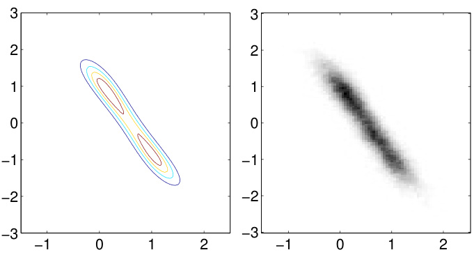
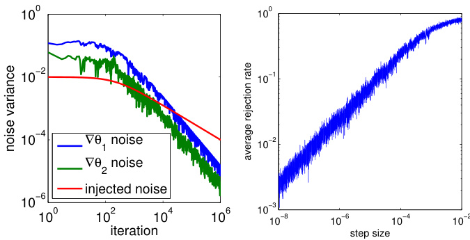
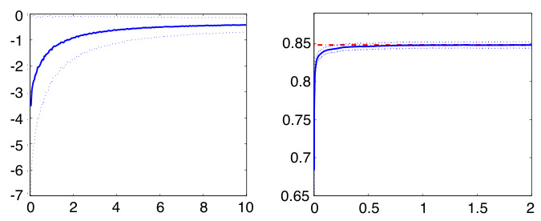
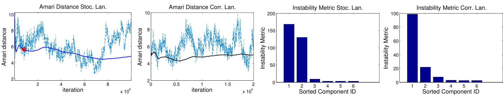
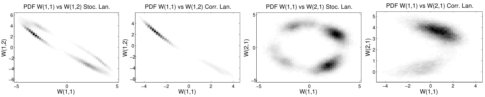
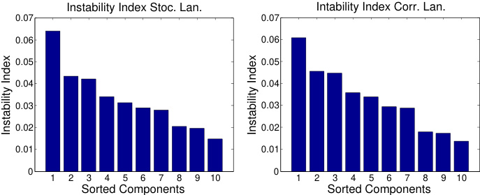

# Bayesian Learning via Stochastic Gradient Langevin Dynamics  

# Max Welling  

welling@ics.uci.edu  

D. Bren School of Information and Computer Science, University of California, Irvine, CA 92697-3425, USA  

Yee Whye Teh  

ywteh@gatsby.ucl.ac.uk  

Gatsby Computational Neuroscience Unit, UCL, 17 Queen Square, London WC1N 3AR, UK  

# Abstract  

In this paper we propose a new framework for learning from large scale datasets based on iterative learning from small mini-batches. By adding the right amount of noise to a standard stochastic gradient optimization algorithm we show that the iterates will converge to samples from the true posterior distribution as we anneal the stepsize. This seamless transition between optimization and Bayesian posterior sampling provides an inbuilt protection against overfitting. We also propose a practical method for Monte Carlo estimates of posterior statistics which monitors a “sampling threshold” and collects samples after it has been surpassed. We apply the method to three models: a mixture of Gaussians, logistic regression and ICA with natural gradients.  

)batches of data at each iteration, updating model parameters by taking small gradient steps in a cost function. Often these algorithms are run in an online setting, where the data batches are discarded after processing and only one pass through the data is performed, reducing memory requirements drastically.  

One class of methods “left-behind” by the recent advances in large scale machine learning are the Bayesian methods. This has partially to do with the negative results in Bayesian online parameter estimation ( Andrieu et al. ,1999 ), but also the fact that each iteration of typical Markov chain Monte Carlo (MCMC) algorithms requires computations over the whole dataset. Nevertheless, Bayesian methods are appealing in their ability to capture uncertainty in learned parameters and avoid overfitting. Arguably with large datasets there will be little overfitting. Alternatively, as we have access to larger datasets and more computational resources, we become interested in building more complex models, so that there will always be a need to quantify the amount of parameter uncertainty.  

# 1. Introduction  

In recent years there has been an increasing amount of very large scale machine learning datasets, ranging from internet traffic and network data, computer vision, natural language processing, to bioinformatics. More and more advances in machine learning are now driven by these large scale data, which offers the opportunity to learn large and complex models for solving many useful applied problems. Recent successes in large scale machine learning have mostly been optimization based approaches. While there are sophisticated algorithms designed specifically for certain types of models, one of the most successful class of algorithms are stochastic optimization, or Robbins-Monro, algorithms. These algorithms process small (miniIn this paper, we propose a method for Bayesian learning from large scale datasets. Our method combines Robbins-Monro type algorithms which stochastically optimize a likelihood, with Langevin dynamics which injects noise into the parameter updates in such a way that the trajectory of the parameters will converge to the full posterior distribution rather than just the maximum a posteriori mode. The resulting algorithm starts offbeing similar to stochastic optimization, then automatically transitions to one that simulates samples from the posterior using Langevin dynamics.  

In Section 2 we introduce the two ingredients of our method: stochastic optimization and Langevin dynamics. Section 3 describes our algorithm and how it converges to the posterior distribution. Section 4 describes a practical method of estimating when our algorithm will transition from stochastic optimization to Langevin dynamics. Section 5 demonstrates our algorithm on a few models and Section 6 concludes.  

# 2. Preliminaries  

Let $\theta$ denote a parameter vector, with $p(\theta)$ a prior distribution, and $p(x|\theta)$ the probabil ty of data item $x$ given our model parameterized by θ. The posterior distribution of a set of $N$ data items $X~=~\{x_{i}\}_{i=1}^{N}$ is: $\begin{array}{r}{p(\theta|X)\,\propto\,p(\theta)\prod_{i=1}^{N}p(x_{i}|\theta)}\end{array}$ |).In the optimizationliterature the prior regularizes the parameters while the likelihood terms constitute the cost function to be optimized, and the task is to find the maximum a posteriori (MAP) parameters $\theta^{*}$ . A popular class of methods called stochastic optimization (Robbins $\&$ Monro ,1951 ) operates as follows. At each iteration $t$ ,a subset of $n$ data items $X_{t}=\{x_{t1},\ldots,x_{t n}\}$ is given, and the parameters are updated as follows:  

$$
\Delta\theta_{t}=\frac{\epsilon_{t}}{2}\bigg(\nabla\log p(\theta_{t})+\frac{N}{n}\sum_{i=1}^{n}\nabla\log p(x_{t i}|\theta_{t})\bigg)
$$  

where $\epsilon_{t}$ is a sequence of step sizes. The general idea is that the gradient computed on the subset is used to approximate the true gradient over the whole dataset. Over multiple iterations the whole dataset is used and the noise in the gradient caused by using subsets rather than the whole dataset averages out. For large datasets where the subset gradient approximation is accurate enough, this can give significant computational savings over using the whole dataset to compute gradients at each iteration.  

To ensure convergence to a local maximum, in addition to other technical assumptions, a major requirement is for the step sizes to satisfy the property  

$$
\sum_{t=1}^{\infty}\epsilon_{t}=\infty~~~~~~~~~~~~\sum_{t=1}^{\infty}\epsilon_{t}^{2}<\infty
$$  

Intuitively, the first constraint ensures that parameters will reach the high probability regions no matter how far away it was initialized to, while the second ensures that the parameters will converge to the mode instead of just bouncing around it. Typically, step sizes $\epsilon_{t}=$ $a(b+t)^{-\gamma}$ are decayed polynomially with $\gamma\in(0.5,1]$ .  

The issue with ML or MAP estimation, as stochastic optimization aims to do, is that they do not capture parameter uncertainty and can potentially overfit data. The typical way in which Bayesian approaches capture parameter uncertainty is via Markov chain Monte Carlo (MCMC) techniques ( Robert & Casella ,2004 ). In this paper we will consider a class of MCMC techniques called Langevin dynamics ( Neal ,2010 ). As before, these take gradient steps, but also injects Gaussian noise into the parameter updates so that they do not collapse to just the MAP solution:  

$$
\begin{array}{r l}&{\Delta\theta_{t}=\displaystyle\frac{\epsilon}{2}\bigg(\nabla\log p(\theta_{t})+\sum_{i=1}^{N}\nabla\log p(x_{i}|\theta_{t})\bigg)+\eta_{t}}\\ &{\quad\eta_{t}\sim N(0,\epsilon)}\end{array}
$$  

The gradient step sizes and the variances of the injected noise are balanced so that the variance of the samples matches that of the posterior. Langevin dynamics is motivated and originally derived as a discretization of a stochastic differential equation whose equilibrium distribution is the posterior distribution. To correct for discretization error, one can take ( 3 )to just be a proposal distribution and correct using Metropolis-Hastings. Interestingly, as we decrease $\epsilon$ the discretization error decreases as well so that the rejection rate approaches zero. However typical MCMC practice is to allow an initial adaptation phase where the step sizes are adjusted, followed by fixing the step sizes to ensure a stationary Markov chain thereafter.  

More sophisticated techniques use Hamiltonian dynamics with momentum variables to allow parameters to move over larger distances without the inefficient random walk behaviour of Langevin dynamics ( Neal ,2010 ). However, to the extent of our knowledge all MCMC methods proposed thus far require computations over the whole dataset at every iteration, resulting in very high computational costs for large datasets.  

# 3. Stochastic Gradient Langevin Dynamics  

Given the similarities between stochastic gradient algorithms ( 1 ) and Langevin dynamics ( 3 ), it is natural to consider combining ideas from the two approaches. This allows efficient use of large datasets while allowing for parameter uncertainty to be captured in a Bayesian manner. The approach is straightforward: use Robbins-Monro stochastic gradients, add an amount of Gaussian noise balanced with the step size used, and allow step sizes to go to zero. The proposed update is simply:  

$$
\begin{array}{r}{\Delta\theta_{t}=\frac{\epsilon_{t}}{2}\bigg(\nabla\log p(\theta_{t})+\frac{N}{n}\sum_{i=1}^{n}\nabla\log p(x_{t i}|\theta_{t})\bigg)+\eta_{t}}\\ {\eta_{t}\sim N(0,\epsilon_{t})\qquad\qquad\qquad\qquad\quad(4.\
$$  

where the step sizes decrease towards zero at rates satisfying ( 2 ). This allows averaging out of the stochasticity in the gradients, as well as MH rejection rates that go to zero asymptotically, so that we can simply ignore the MH acceptance steps, which require evaluation of probabilities over the whole dataset, all together.  

In the rest of this section we will give an intuitive argument for why $\theta_{t}$ will approach samples from the posterior distribution as $t\,\rightarrow\,\infty$ . In particular, we will show that for large $t$ , the updates ( 4 ) will approach Langevin dynamics ( 3 ), which converges to the posterior distribution. Let  

$$
g(\theta)=\nabla\log p(\theta)+\sum_{i=1}^{N}\nabla\log p(x_{i}|\theta)
$$  

be the true gradient of the log probability at $\theta$ and  

$$
h_{t}(\theta)=\nabla\log p(\theta)+\frac{N}{n}\sum_{i=1}^{n}\nabla\log p(x_{t i}|\theta)-g(\theta)
$$  

The stochastic gradient is then $g(\theta)\!+\!h_{t}(\theta)$ , with $h_{t}(\theta)$ a zero mean random variable (due to the stochasticity of the data items chosen at step $t$ ) with finite variance $V(\theta)$ , and ( 4 ) is,  

$$
\Delta\theta_{t}=\frac{\epsilon_{t}}{2}(g(\theta_{t})+h_{t}(\theta_{t}))+\eta_{t},\quad\eta_{t}\sim N(0,\epsilon_{t})
$$  

There are two sources of stochasticity in ( 7 ): the injected Gaussian noise with variance $\epsilon_{t}$ , and the noise in the stochastic gradient, which has variance $\textstyle{\left({\frac{\epsilon_{t}}{2}}\right)}^{2}V(\theta_{t})$ ). The first observation is that for large $t$ ,$\epsilon_{t}\,\rightarrow\,0$ , and the injected noise will dominate the stochastic gradient noise, so that ( 7 ) will be effectively Langevin dynamics ( 3 ). The second observation is that as $\epsilon_{t}\ \to\ 0$ ,the discretization error of Langevin dynamics will be negligible so that the MH rejection probability will approach 0 and we may simply ignore this step.  

In other words, ( 4 ), ( 7 ) effectively define a nonstationary Markov chain such that the $t$ th step transition operator, for all large $t$ , will have as its equilibrium distribution the posterior over $\theta$ . The next question we address is whether the sequence of parameters $\theta_{1},\theta_{2},\ldots$ will converge to the posterior distribution. Because the Markov chain is not stationary and the step sizes reduce to $0$ , it is not immediately clear that this is the case. To see that this is indeed true, we will show that a subsequence $\theta_{t_{1}},\theta_{t_{2}},\ldots$ will converge to the posterior as intended so the whole sequence will also converge.  

First fix an $\epsilon_{\mathrm{0}}$ such that $0<\epsilon_{0}\ll1$ . Since $\{\epsilon_{t}\}$ satisfy the step size property ( 2 ), we can find a subsequence $t_{1}\,<\,t_{2}\,<\,\cdot\,\cdot$ $\sum_{t=t_{s}+1}^{t_{s+1}}\epsilon_{t}\;\to\;\epsilon_{0}$ as $s\rightarrow\infty$ .Since the injected noise at each step is independent, for large enough se tota ected noi $\|\sum_{t=t_{s}+1}^{t_{s+1}}\eta_{t}\|_{2}$ ,between steps t$t_{s}$ and t$t_{s+1}$ will be $O(\sqrt{\epsilon_{0}})$ √). We now show that the total noise due to the stochasticity of the gradients among these steps will be dominated by the total injected noise. Since $\epsilon_{0}\ll1$ , we may take $\lVert\boldsymbol{\theta}_{t}-\boldsymbol{\theta}_{t_{s}}\rVert_{2}\,\ll\,1$ for $t$ between $t_{s}$ $t_{s+1}$ . Making the assumption that the gradient g$g(\cdot)$ ·) vary smoothly (e.g. they are Lipschitz continuous in the models in Section 5 ), the total stochastic gradient is:  

$$
\begin{array}{c}{{\displaystyle\sum_{t=t_{s}+1}^{t_{s+1}}\frac{\epsilon_{t}}{2}(g(\theta_{t})+h_{t}(\theta_{t}))}}\\ {{\displaystyle=\frac{\epsilon_{0}}{2}g(\theta_{t_{s}})+O(\epsilon_{0})+\sum_{t=t_{s}+1}^{t_{s+1}}\frac{\epsilon_{t}}{2}h_{t}(\theta_{t})}}\end{array}
$$  

Since the parameters did not vary much between $t_{s}$ and $t_{s+1}$ , the stochasticity in $h_{t}(\theta_{t})$ will be dominated by the randomness in the choice of the mini-batches. Assuming that these are chosen randomly and independently, $h_{t}(\theta_{t})$ for each $t$ will be basically iid (if mini-batches were chosen by random partitioning of the whole dataset, $h_{t}(\theta_{t})$ will be negatively correlated instead and will not change the results here). Thus the variance of $\begin{array}{r}{\sum_{t=t_{s}+1}^{t_{s+1}}\frac{\epsilon_{t}}{2}h_{t}(\theta_{t})}\end{array}$ ) is $O(\sum_{t}\frac{\epsilon_{t}^{2}}{4})$ ) and  

$$
\begin{array}{l}{{=\displaystyle\frac{\epsilon_{0}}{2}g(\theta_{t_{s}})+O(\epsilon_{0})+O\bigg(\sqrt{\sum_{t=t_{s}+1}^{t_{s+1}}\frac{\epsilon_{t}^{2}}{4}}\bigg)}}\\ {{=\displaystyle\frac{\epsilon_{0}}{2}g(\theta_{t_{s}})+O(\epsilon_{0})}}\end{array}
$$  

The last equation says that the total stochastic gradient step is approximately the exact gradient step at $\theta_{t_{s}}$ with a step size of $\epsilon_{\mathrm{0}}$ , with a deviation dominated by $O(\epsilon_{0})$ . Since this is in turn dominated by the total injected noise which is $O(\sqrt{\epsilon_{0}})$ , this means that the sequence $\theta_{t_{1}},\theta_{t_{2}},\ldots$ will approach a sequence generated by Langevin dynamics with a fixed step size $\epsilon_{\mathrm{0}}$ , so it will converge to the posterior distribution. Note also that it will have infinite effective sample size.  

The implication of this argument is that we can use stochastic gradient Langevin dynamics as an “anytime” and general-purpose algorithm. In the initial phase the stochastic gradient noise will dominate and the algorithm will imitate an efficient stochastic gradient ascent algorithm. In the later phase the injected noise will dominate, so the algorithm will imitate a Langevin dynamics MH algorithm, and the algorithm will transition smoothly between the two. However a disadvantage is that to guarantee the algorithm to work it is important for the step sizes to decrease to zero, so that the mixing rate of the algorithm will slow down with increasing number of iterations. To address this, we can keep the step size constant once it has decreased below a critical level where the MH rejection rate is considered negligible, or use this algorithm for burn-in, but switch to a different MCMC algorithm that makes more efficient use of the whole dataset later. These alternatives can perform better but will require further hand-tuning and are beyond the scope of this paper. The point of this paper is to demonstrate a practical algorithm that can achieve proper Bayesian learning using only mini-batch data.  

# 4. Posterior Sampling  

In this section we consider the use of our stochastic gradient Langevin dynamics algorithm as one which produces samples from the posterior distribution. We first derive an estimate of when the algorithm will transition from stochastic optimization to Langevin dynamics. The idea is that we should only start collecting samples after it has entered its posterior sampling phase, which will not happen until after it becomes Langevin dynamics. Then we discuss how the algorithm scales with the dataset size $N$ and give a rough estimate of the number of iterations required for the algorithm to traverse the whole posterior. Finally we discuss how the obtained samples can be used to form Monte Carlo estimates of posterior expectations.  

# 4.1. Transition into Langevin dynamics phase  

We first generalize our method to allow for preconditioning, which can lead to significant speed ups by better adapting the step sizes to the local structure of the posterior ( Roberts & Stramer ,2002 ;Girolami $\&$ Calderhead ,2011 ). For instance, certain dimensions may have a vastly larger curvature leading to much bigger gradients. In this case a symmetric preconditioning matrix $M$ can transform all dimensions to the same scale. The preconditioned stochastic gradient Langevin dynamics is simply,  

$$
\Delta\theta_{t}=\frac{\epsilon_{t}}{2}M\bigg(g(\theta_{t})+h_{t}(\theta_{t})\bigg)+\eta_{t},\quad\eta_{t}\sim N(0,\epsilon_{t}M)
$$  

As noted previously, whether the algorithm is in the stochastic optimization phase or Langevin dynamics phase depends on the variance of the injected noise, which is simply $\epsilon_{t}M$ , versus that of the stochastic gradient. Since the stochastic gradient is a sum over the current mini-batch, if its size $n$ is large enough the central limit theorem will kick in and the variations $h_{t}(\theta_{t})$ around the true gradient $g(\theta_{t})$ will become normally distributed. Its covariance matrix can then be estimated from the empirical covariance:  

$$
V(\theta_{t})\equiv V[h_{t}(\theta_{t})]\approx\frac{N^{2}}{n^{2}}\sum_{i=1}^{n}(s_{t i}-\overline{{s_{t}}})(s_{t i}-\overline{{s_{t}}})^{\top}
$$  

where $\begin{array}{r}{s_{t i}=\nabla\log p(x_{t i}|\theta_{t})+\frac{1}{N}\nabla\log p(\theta_{t})}\end{array}$ ∇ore of data item $i$ at iteration $t$ and s$\begin{array}{r}{\overline{{s_{t}}}\;=\;\frac{1}{n}\sum_{i=1}^{n}s_{t i}}\end{array}$ is the empirical mean. Note that $\begin{array}{r}{V(\theta_{t})\,=\,\frac{N^{2}}{n}V_{s}}\end{array}$ , where $V_{s}$ is the empirical covariance of the scores $\left\{s_{t i}\right\}$ , so scales as $\frac{N^{2}}{n}$ . From this we see that the variance of the stochastic gradient step is $\frac{\epsilon_{t}^{2}N^{2}}{4n}M V_{s}M$ , so that to get the injected noise to dominate in all directions, we need the condition  

$$
\frac{\epsilon_{t}N^{2}}{4n}\lambda_{\mathrm{max}}(M^{\frac{1}{2}}V_{s}M^{\frac{1}{2}})=\alpha\ll1
$$  

where $\lambda_{\operatorname*{max}}(A)$ is the largest eigenvalue of $A$ . In other words, if we choose a stepsize such that the sample threshold $\alpha\ll1$ , the algorithm will be in its Langevin dynamics phase and will be sampling approximately from the posterior.  

We can now relate the step size at the sampling threshold to the posterior variance via the Fisher information, which is rela $V_{s}$ as $I_{F}\approx N V_{s}$ , and to the posterior variance Σ as well as ( 10 ), we see that the step size at the sam$\Sigma_{\theta}\approx I_{F}^{-1}$ ≈. Using these relationships pling threshold is $\begin{array}{r}{\epsilon_{t}\,\approx\,\frac{4\alpha n}{N}\lambda_{\mathrm{min}}(\Sigma_{\theta})}\end{array}$ ). Since Langevin dynamics explores the posterior via a random walk, using this step size implies that we need on the order of $N/n$ steps to traverse the posterior, i.e. we process the whole dataset. So we see this method is not a silver bullet. However, the advantage of the method is its convenience: stochastic optimization smoothly and automatically transitions into posterior sampling without changing the update equation. Even without measuring the sampling threshold one will enjoy the benefit of protection against overfitting and the ability to perform Bayesian learning. Measuring the sampling threshold will only be important if one needs to faithfully represent the posterior distribution with a finite collection of samples.  

# 4.2. Estimating Posterior Expectations  

Since $\theta_{1},\theta_{2},\ldots$ converges to the posterior distribution, we can estimate the posterior expectation $E[f(\theta)]$ of some function $f(\theta)$ by simply taking the sample average $\textstyle{\frac{1}{T}}\sum_{t=1}^{T}f(\theta_{t})$ ∑) (as typically in MCMC, we may remove the initial burn-in phase, say estimated using the sampling threshold). Since $f(\theta_{t})$ is an asymptotically unbiased estimator for $E[f(\theta)]$ , this sample average will be consistent. Observe however that because the step size decreases, the mixing rate of the Markov chain decreases as well, and the simple sample average will over-emphasize the tail end of the sequence where there is higher correlation among the samples, resulting in higher variance in the estimator. Instead we propose to use the step sizes to weight the samples:  

$$
E[f(\theta)]\approx\frac{\sum_{t=1}^{T}\epsilon_{t}f(\theta_{t})}{\sum_{t=1}^{T}\epsilon_{t}}
$$  

  
Figure 1. True and estimated posterior distribution.  

  
Figure 2. Left: variances of stochastic gradient noise and injected noise. Right: rejection probability versus step size. We report the average rejection probability per iteration in each sweep through the dataset.  

Since as well. The intuition is that the rate at which the $\textstyle\sum_{t=1}^{\infty}\epsilon_{t}\,=\,\infty$ ∞, this estimator will be consistent Markov chain mixes is proportional to the step size, so that we expect the effective sample size of $\{\theta_{1},\hdots,\theta_{T}\}$ to be proportional to $\textstyle\sum_{t=1}^{T}\epsilon_{t}$ , and that each $\theta_{t}$ will contribute an effective sample size proportional to $\epsilon_{t}$ .  

# 5. Experiments  

# 5.1. Simple Demonstration  

We first demonstrate the workings of our stochastic gradient Langevin algorithm on a simple example involving only two parameters. To make the posterior multimodal and a little more interesting, we use a mixture of Gaussians with tied means:  

  
Figure 3. Average log joint probability per data item (left) and accuracy on test set (right) as functions of the number of sweeps through the whole dataset. Red dashed line represents accuracy after 10 iterations. Results are averaged over 50 runs; blue dotted lines indicate 1 standard deviation.  

size of 1 and using 10000 sweeps through the whole dataset. The step sizes are $\epsilon_{t}~=~a(b+t)^{-\gamma}$ where $\gamma\,=\,.55$ and $a$ and $b$ are set such that $\epsilon_{t}$ decreases from .01 to .0001 over the duration of the run. We see from Figure 1 that the estimated posterior distribution is very accurate. In Figure 2 we see that there are indeed two phases to the stochastic gradient Langevin algorithm: a first phase where the stochastic gradient noise dominates the injected noise, and a second phase where the converse occurs. To explore the scaling of the rejection rate as a function of step sizes, we reran the experiment with step sizes exponentially decreasing from $10^{-2}$ to $10^{-8}$ . In the original experiment the dynamic range of the step sizes is not wide enough for visual inspection. Figure $2(\mathrm{right})$ shows the rejection probability decreasing to zero as step size decreases.  

# 5.2. Logistic Regression  

We applied our stochastic gradient Langevin algorithm to a Bayesian logistic regression model. The probability of the $i$ th output $y_{i}\;\in\;\{-1,+1\}$ given the corresponding input vector $x_{i}$ is modelled as:  

$$
p(\boldsymbol{y}_{i}|\boldsymbol{x}_{i})=\sigma(\boldsymbol{y}_{i}\beta^{\top}\boldsymbol{x}_{i})
$$  

where $\beta$ are the parameters, and $\begin{array}{r}{\sigma(z)\,=\,\frac{1}{1+\exp(-z)}}\end{array}$ .The bias parameter is absorbed into $\beta$ by including −$^{1}$ as an entry in $x_{i}$ . We use a Laplace prior for $\beta$ with a scale of 1. The gradient of the log likelihood is:  

$$
\begin{array}{l}{{\theta_{1}\sim N(0,\sigma_{1}^{2})~;~~~~~~\theta_{2}\sim N(0,\sigma_{2}^{2})}}\\ {{x_{i}\sim{\frac{1}{2}}N(\theta_{1},\sigma_{x}^{2})+{\frac{1}{2}}N(\theta_{1}+\theta_{2},\sigma_{x}^{2})}}\end{array}
$$  

where $\sigma_{1}^{2}=10$ $\sigma_{2}^{2}=1$ = 1 and $\sigma_{x}^{2}=2$ = 2. 100 data points are drawn from the model with $\theta_{1}\,=\,0$ and $\theta_{2}\,=\,1$ .There is a mode at this parameter setting, but also a secondary mode at $\theta_{1}=1$ ,$\theta_{2}=-1$ , with strong negative correlation between the parameters. We ran the stochastic gradient Langevin algorithm with a batch  

$$
\frac{\partial}{\partial\beta}\log p(\boldsymbol{y}_{i}|\boldsymbol{x}_{i})=\sigma(-\boldsymbol{y}_{i}\beta^{\top}\boldsymbol{x}_{i}){y}_{i}\boldsymbol{x}_{i}
$$  

while the gradient of the prior is simply $-\mathrm{sign}(\beta)$ ,which is applied elementwise.  

We applied our inference algorithm to the a9a dataset derived by ( Lin et al. ,2008 ) from the UCI adult dataset. It consists of 32561 observations and 123 features, and we used batch sizes of 10. Results from 50 runs are shown in Figure 3 , with the model trained on a random $80\%$ of the dataset and tested on the other $20\%$ in each run. We see that both the joint probability and the accuracy increase rapidly, with the joint probability converging after at most 10 iterations, while the accuracy converging after less than 1 iteration through the dataset, demonstrating the efficiency of the stochastic gradient Langevin dynamics.  

# 5.3. Independent Components Analysis  

In the following we will briefly review a popular ICA algorithm based on stochastic (natural) gradient optimization ( Amari et al. ,1996 ). We start from a probabilistic model that assumes independent, heavy tailed marginal distributions,  

$$
p(\mathbf{x},W)=|\operatorname*{det}(W)|\left[\prod_{i}p_{i}(\mathbf{w}_{i}^{T}\mathbf{x})\right]\prod_{i j}{\mathcal{N}}(W_{i j};0,\lambda)
$$  

where we have used a Gaussian prior over the weights. It has been found that the efficiency of gradient descent can be significantly improved if we use a natural gradient. This is implemented by post-multiplication of the gradient with the term $W^{T}W$ (Amari et al. ,1996 ). If we choose $\begin{array}{r}{p_{i}(y_{i})=\frac{1}{4\cosh^{2}\left(\frac{1}{2}y_{i}\right)}}\end{array}$ with $y_{i}=\mathbf{w}_{i}^{T}\mathbf{x}$ , we get  

$$
\begin{array}{l}{\displaystyle\mathcal{D}_{W}\doteq\nabla_{W}\log[p(X,W)]~W^{T}W=}\\ {\displaystyle\left(N\mathbf{I}-\sum_{n=1}^{N}\operatorname{tanh}(\frac{1}{2}\mathbf{y}_{n})\mathbf{y}_{n}^{T}\right)W-\lambda W W^{T}W}\end{array}
$$  

The term $W^{T}W$ acts like a preconditioning matrix (see section 4.1 ), $M_{i j,k l}=\delta_{i k}(W^{T}W)_{j l}$ which is symmetric under the exchange $\,\,i\,\leftrightarrow\,k,j\,\leftrightarrow\,l\,)$ ). It can be shown and the matrix square root as that the inverse of $M$ is given by $\sqrt{M}=\delta\sqrt{W^{T}W}$ $M^{-1}=\delta(W^{L}W)^{-1}$ √with ,${\sqrt{W^{T}W}}=U\Lambda^{\frac{1}{2}}U^{T}$ if $W^{L^{\prime}}W=U\Lambda U^{L^{\prime}}$ .  

The update equation for Langevin dynamics thus becomes,  

$$
W_{t+1}=W_{t}+\frac{1}{2}\varepsilon_{t}D_{W}+\eta_{t}\sqrt{W^{T}W}
$$  

where every element of $\pmb{\eta}_{t}$ is normally distributed with variance $\varepsilon_{t}$ :$\eta_{i j,t}\,\sim\mathcal{N}[0,\varepsilon_{t}]$ . Our stochastic version simply approximates the part of the gradient that sums over data-cases with a sum over a small minibatch of size $n$ and multiplies the result with $N/n$ to bring it back to the correct scale. We also anneal the stepsizes according to $\varepsilon_{t}\propto a(b+t)^{-\gamma}$ .  

To assess how well our stochastic Langevin approach compares against a standard Bayesian method we implemented the ”corrected Langevin” MCMC sampler.  

This sampler, proposes a new state $W^{*}$ , as in Eqn. 16 .Note however that we sum over all data-cases and that we do not anneal the stepsize. Secondly, we need to accept or reject the proposed step based on all the data-cases in order to guarantee detailed balance. The proposal distribution is given by (suppressing dependence on $t$ ),  

$$
q(W\rightarrow W*)=\mathcal{N}\left[W^{*};W+\frac{1}{2}\varepsilon\mathcal{D}_{W};\varepsilon M\right]
$$  

where the quadratic function in the exponent is conveniently computed as,  

$$
\frac{-1}{2\varepsilon}\mathbf{tr}[(\delta W-\frac{1}{2}\varepsilon\mathcal{D}_{W})(W^{T}W)^{-1}(\delta W-\frac{1}{2}\varepsilon\mathcal{D}_{W})^{T}]
$$  

with $\delta W=W^{*}-W$ and the normalization constant requires the quantity $\operatorname*{det}M=\operatorname*{det}(W^{T}W)^{D}$ . The accept/reject step is then given by the usual Metropolis Hastings rule:  

$$
p(\mathrm{accept})=\mathrm{min}\left[1,\frac{p(W^{*})q(W^{*}\rightarrow W)}{p(W)q(W\rightarrow W^{*})}\right]
$$  

Finally, to compute the sampling threshold of Eqn. 10 ,we can use  

$$
\begin{array}{c}{{M^{\frac{1}{2}}\mathcal{V}(s)M^{\frac{1}{2}}=\phantom{\left(\frac{1}{N}\right)}}}\\ {{c o v_{n}\left[\left(\displaystyle\frac{1}{N}\nabla\log p(W)+\nabla\log p(x_{i}|W)\right)(W^{T}W)^{\frac{1}{2}}\right]}}\end{array}
$$  

with $c o v_{n}$ the sample covariance over the mini-batch of $n$ data-cases.  

To show the utility of our Bayesian variant of ICA we define the following “instability” metric for independent components:  

$$
\mathcal{T}_{i}=\sum_{j}v a r(W_{i j})v a r(x_{j})
$$  

where $v a r(W_{i j})$ is computed over the posterior samples and $v a r(x_{j})$ is computed over the data-cases. The reason that we scale the variance of the weight entry $W_{i j}$ with the variance of $x_{j}$ is that the varis$\begin{array}{r}{y_{i}\,=\,\sum_{j}W_{i j}x_{j}}\end{array}$ is approximately equal for all i because they are fit to the distribution $\begin{array}{r}{p_{i}(y_{i})=\frac{1}{4\cosh^{2}\left(\frac{1}{2}y_{i}\right)}}\end{array}$ .  

# 5.3.1. Artificial Data  

In the first experiment we generated 1000 data-cases IID in six channels. Three channels had high kurtosis distributions while three others where normally distributed. We ran stochastic Langevin dynamics with a batch-size of 100 for a total of 500,000 iterations and a polynomial annealing schedule $\begin{array}{r}{\varepsilon_{t}~=~\frac{4}{N}t^{-0.55}}\end{array}$ .After around 10,000 iterations the sampling threshold at $\alpha\,=\,0.1$ was met. At that point we recorded the “mixing distance” as only whe he sum $\sum_{t}\varepsilon_{t}$ $D_{0}\,=\,\varepsilon_{t}$ from the last sample time and collected samples exceeded D(in other words, as $\varepsilon_{t}$ decreases we collect fewer samples per unit time). We note that simply collecting all samples had no noticeable impact on the final results. The last estimate of $W$ was used to initialize corrected Langevin dynamics (this was done to force the samplers into the same local maximum) after which we also collected 500 ,000 samples. For corrected Langevin we used a constant stepsize of $\begin{array}{r}{\varepsilon=\frac{0.1}{N}}\end{array}$ .  

  
Figure 4. Left two figures: Amari distance over time for stochastic Langevin dynamics and corrected Langevin dynamics. Thick line represents the online average. First few hundred iterations were removed to show the scale of the fluctuations. Right two figures: Instability index for the 6 independent components computed in section 5.3.1 for stochastic Langevin dynamics and corrected Langevin dynamics.  

  
Figure 5. Posterior density estimates for artificial dataset for stochastic Langevin and corrected Langevin dynamics measured across the $W_{11}-W_{12}$ and $W_{1,1}-W_{2,1}$ axes.  

The two left figures of Figure 4 show the Amari distance ( Amari et al. ,1996 ) over time for stochastic and corrected Langevin dynamics respectively. The right two figures show the sorted values of our proposed instability index. Figures 5 show two dimensional marginal density estimates of the posterior distribution of $W$ . ICA cannot determine the Gaussian components and this fact is verified by looking at the posterior distribution. In fact, the stochastic Langevin algorithm has mixed over a number of modes that presumably correspond to different linear combinations of the Gaussian components. To a lesser degree the corrected Langevin has also explored two modes. Due to the complicated structure of the posterior distribution the stability index varies strongly between the two sampling algorithms for the Gaussian components (and in fact also varies across different runs). We verified that the last three components correspond to stable, high kurtosis components.  

# 5.3.2. MEG Data  

We downloaded the MEG dataset from http://www.cis.hut.fi/projects/ica/eegmeg/MEG data.html There are 122 channels and 17730 time-points, from which we extracted the first 10 channels for our experiment. To initialize the sampling algorithms, we first ran fastICA ( Hyvarinen ,1999 ) to find an initial estimate of the de-mixing matrix $W$ .We then ran stochastic Langevin and corrected Langevin dynamics to sample from the posterior. The settings were very similar to the previous experiment with a schedule of $\begin{array}{r}{\varepsilon_{t}=\frac{0.1}{N}t^{-0.55}}\end{array}$ for stochastic Langevin and a constant stepsize of $1/N$ for corrected Langevin. We obtained 500 ,000 samples for stochastic Langevin in 800 seconds and 100,000 samples for corrected Langevin in 9000 seconds. We visually verified that the two dimensional marginal distributions of stochastic Langevin and corrected Langevin dynamics were very similar. The instability values are shown in figure 6 . Due to the absence of Gaussian components we see that the stability indices are very similar across the two sampling algorithms. It was verified that the most stable component corresponded to a highly kurtotic source (kurtosus = 15.4), while the most unstable component was closer to Gaussian noise with a kurtosis of 3 .4 (2 corresponds to Gaussian). These findings verify that the stochastic Langevin procedure produces accurate posterior distributions that are in full agreement with a well established MCMC procedure.  

  
Figure 6. Instability indices of 10 components for MEG dataset for stochastic Langevin (left) and corrected Langevin (right) respectively.  

# 6. Discussion  

Stochastic gradient optimization is among the most effective algorithms if we measure “predictive accuracy obtained per unit of computation” ( Bottou & Bousquet ,2008 ). Due to subsampling noise, the parameter estimates fluctuate around their MAP values. The common wisdom is that one must anneal these stepsizes to zero to reach the fixed point. However, we argue that one should not optimize beyond the scale of the posterior distribution. The posterior represents the intrinsic statistical scale of precision and trying to determine parameter values with more precision runs the risk of overfitting at additional computational cost.  

MCMC sampling from the posterior distribution does of course address the overfitting issue. However, general MCMC algorithms need to see all the data at every iteration, and thus lose the benefits of the stochastic approximation approaches. This paper offers for the first time a surprisingly simple solution that represents the best of both worlds: stick with stochastic gradients but sample from the posterior nevertheless.  

But perhaps the biggest advantage of stochastic gradient Langevin dynamics is the fact that stochastic optimization seamlessly transitions into posterior sampling. By simply adding Gaussian noise with the correct variance our method performs “early stopping” automatically without ever having to worry about it. In fact, we have shown that with a polynomial annealing schedule the obtained samples will asymptotically represent the posterior distribution faithfully.  

We believe that this work represents only a tentative first step to further work on efficient MCMC sampling based on stochastic gradients. Interesting directions of research include stronger theory providing a solid proof of convergence, deriving a MH rejection step based on mini-batch data, extending the algorithm to the online estimation of dynamical systems, and deriving algorithms based on more sophisticated Hamiltonian Monte Carlo approaches which do not suffer from random walk behaviour.  

# Acknowledgements  

This material is based upon work supported by the National Science Foundation under Grant No. 0447903, 1018433 (MW) and the Gatsby Charitable Foundation (YWT).  

# References  

Amari, S., Cichocki, A., and Yang, H.H. A new algorithm for blind signal separation. In Neural Information Processing Systems , volume 8, pp. 757–763, 1996.   
Andrieu, C., de Freitas, N., and Doucet, A. Sequential MCMC for Bayesian model selection. In Proceedings of the IEEE Signal Processing Workshop on Higher-Order Statistics , pp. 130–134, 1999.   
Bottou, L. and Bousquet, O. The tradeoffs of large scale learning. In Advances in Neural Information Processing Systems , volume 20, pp. 161–168, 2008.   
Girolami, M. and Calderhead, B. Riemann manifold Langevin and Hamiltonian Monte Carlo methods. Journal of the Royal Statistical Society B , 73:1–37, 2011.   
Hyvarinen, A. Fast and robust fixed-point algorithms for independent component analysis. IEEE Transactions on Neural Networks , 10(3):626–634, 1999.   
Lin, C.-J., Weng, R. C., and Keerthi, S. S. Trust region Newton method for large-scale logistic regression. Journal of Machine Learning Research , 9:627–650, 2008.   
Neal, R. M. MCMC using Hamiltonian dynamics. In Brooks, S., Gelman, A., Jones, G., and Meng, X.-L. (eds.), Handbook of Markov Chain Monte Carlo . Chapman & Hall / CRC Press, 2010.   
Robbins, H. and Monro, S. A stochastic approximation method. Annals of Mathematical Statistics , 22(3):400– 407, 1951.   
Robert, C. P. and Casella, G. Monte Carlo statistical methods . Springer Verlag, 2004.   
Roberts, G. O. and Stramer, O. Langevin diffusions and metropolis-hastings algorithms. Methodology and Computing in Applied Probability , 4:337–357, 2002.  