# The Statistical Accuracy of Neural Posterior and Likelihood Estimation  

David T. Frazier $^*1$ , Ryan Kelly $^4$ , Christopher Drovandi $^4$ , and David J. Warne 4  

1 Department of Econometrics and Business Statistics, Monash University, Clayton VIC 3800, Australia   
4 School of Mathematical Sciences, Queensland University of Technology, Brisbane 4000 Australia  

# Abstract  

Neural posterior estimation (NPE) and neural likelihood estimation (NLE) are machine learning approaches that provide accurate posterior, and likelihood, approximations in complex modeling scenarios, and in situations where conducting amortized inference is a necessity. While such methods have shown significant promise across a range of diverse scientific applications, the statistical accuracy of these methods is so far unexplored. In this manuscript, we give, for the first time, an in-depth exploration on the statistical behavior of NPE and NLE. We prove that these methods have similar theoretical guarantees to common statistical methods like approximate Bayesian computation (ABC) and Bayesian synthetic likelihood (BSL). While NPE and NLE methods are just as accurate as ABC and BSL, we prove that this accuracy can often be achieved at a vastly reduced computational cost, and will therefore deliver more attractive approximations than ABC and BSL in certain problems. We verify our results theoretically and in several examples from the literature.  

# 1 Introduction  

Neural conditional density approximation approaches have emerged as powerful machine learning techniques for conducting simulation-based Bayesian inference (SBI) in complex models with intractable or computationally expensive likelihoods. These methods can approximate the likelihood through neural likelihood estimation (NLE) (Papamakarios et al., 2019) or directly target the posterior distribution with neural posterior estimation (NPE) (Greenberg et al., 2019; Lueckmann et al., 2017; Papamakarios and Murray, 2016), with NLE requiring subsequent Markov Chain Monte Carlo (MCMC) steps to produce posterior samples. The hallmark of these neural methods is their ability to accurately approximate complex posterior distributions using only forward simulations from the assumed model. While sequential methods iteratively refine the posterior estimate through multiple rounds of simulation, one-shot NPE and NLE methods perform inference in a single round, enabling amortized inference where a trained model can be reused for multiple datasets without retraining (see, e.g., Radev et al., 2020; Gloeckler et al., 2024). In particular, like the statistical methods of approximate Bayesian computation (ABC), see, e.g., Sisson et al. (2018) for a handbook treatment, and Martin et al. (2023) for a recent summary, and Bayesian synthetic likelihood (BSL), see, e.g., Wood (2010), Price et al. (2018) and Frazier et al. (2023), NPE and NLE first reduce the data down to a vector of statistics and then build an approximation to the resulting partial posterior by substituting likelihood evaluation with forward simulation from the assumed model.  

In contrast to the statistical methods for likelihood-free inference like ABC and BSL, NPE (respectively, NLE) approximates the posterior (resp., the likelihood) directly by fitting flexible conditional density estimators, usually neural- or flow-based approaches, using training data that is simulated from the assumed model space. The approximation that results from this training step is then directly used as a posterior in the context of NPE or as a likelihood in the case of NLE, with MCMC for this trained likelihood then used to produce draws from an approximate posterior.  

While NPE/NLE methods have been shown to be just as accurate as ABC and BSL in certain experiments, while requiring a greatly reduced computational cost (Lueckmann et al., 2021), virtually nothing is known about the underlying statistical behavior of these methods. Herein, we make three fundamental contributions to the literature on SBI methods. Our first contribution is to provide the first rigorous study on the statistical behavior of NPE and NLE methods, and to rigorously show that these methods can deliver posterior approximations that have well-behaved statistical properties such as posterior concentration and Bernstein-von Mises phenomena.  

Our second contribution is to use our theoretical results to analyze the validity of the existing hypothesis in the machine learning literature that NPE/NLE methods are more accurate than statistical methods like ABC and BSL for a given computational budget (see, e.g., Lueckmann et al., 2021). We rigorously prove that, under certain tuning regimes, and similar regularity conditions to methods like ABC, asymptotically NPE/NLE can be as accurate as ABC, but the accuracy of NPE/NLE can be far less impacted by the dimension of the summaries and parameters than methods like ABC. This latter finding is particularly important as it is well-known that ABC encounters a curse of dimensionality in the number of summaries used in the analysis (see, e.g., Blum, 2010 for a discussion).  

Our last contribution is to use these theoretical results to compare the behavior of NPE and NLE. The current literature exhibits a preference for NPE methods in most empirical examples, but to date no theoretical comparison of the two methods exist. We show that, under similar regularity conditions, NPE and NLE methods have similar statistical behavior. Hence, recalling that NLE must first estimate the likelihood, and then use this within some form of MCMC sampling, our results suggest that, NPE is preferable to NLE since it has similar theoretical guarantees but does not require further MCMC sampling to produce posterior draws.  

The remainder of the paper is organized as follows. Section 2 contains a motivating example that highlights the importance of studying the behavior of NPE/NLE methods. Section 3 gives the general setup needed to study NPE methods, while Section 4 gives an account of the theoretical behavior of NPE, and Section 5 contains discussion on several features that drive the statistical behavior of NPE. Section 6 gives the setup and theoretical results for NLE methods, and Section 7 concludes the paper with directions for further study.  

# 2 Motivating Example  

Before presenting our theoretical results we briefly motivate our analysis by numerically illustrating one of our main findings with a simulated data example. To date, the accuracy of NPE methods as a function of the number of training datasets used in fitting the approximation, denoted generically as $N$ , and relative to the number of observed data points, denoted by $n$ , has not been explored in the literature. In most cases, applications of NPE use a few thousand training datasets regardless of the example under study. In the following example, we show if NPE is to deliver accurate posterior inferences, then the number of model simulations used in training, $N$ , must diverge to infinity faster than the number of observed data points; in subsequent sections we formally show that the precise rate at which $N$ must diverge depends on $n$ and the dimension of the problem. However, before giving formal results on the link between $N$ and $n$ , we explore this link empirically in a commonly encountered example from the SBI literature.  

# 2.1 Stereological Example  

During the production of steel or other metals, microscopic particles, called inclusions, can occur within the metal that fundamentally weaken the structure. As fatigue is often believed to develop from inclusions within the material, over time the number of inclusions within the metal has become a useful gauge with which to measure the quality of metal production.  

To model the number of inclusions in a given block of steel, Bortot et al. (2007) used a model of stereological extremes that generates a random number of elliptical inclusions, where the number of inclusions is governed by a homogeneous Poisson process with rate $\lambda$ , and where the shape and scale size of the inclusion is governed by a Pareto distribution with shape and size parameters $(\sigma,\xi)$ .  

While relatively simple to explain, the resulting likelihood for this model is intractable, and inference is generally carried out using SBI methods. In this example, we show that in order for NPE to deliver accurate posterior inferences, we must choose the number of model simulations $N$ such that as $n\rightarrow\infty$ ,$n/N\,\rightarrow\,0$ . To this end, in the experiments that follow we consider implementing NPE according to four possible choices of $N$ :$N\in$ $\{n,n\log(n),n^{3/2},n^{2}\}$ . The specific reasoning behind these choices are explained in detail within Section 5.  

To keep the analysis as simple as possible, we only present results for the rate parameter   
$\lambda$ , while results for $\sigma$ and $\xi$ are reported in Appendix B. First, we compare the accuracy   
of NPE under our choices of $N$ against the ABC posterior on a single dataset, where the   
ABC posterior is sampled using the ABC-SMC algorithm in Simola et al. (2021). These   
results are plotted visually in Figure 1. On these results, the ABC-SMC algorithm required 2 See Appendix B for further details on this model.  

over ten million simulations, which is more than an order of magnitude greater than the highest number of simulations considered for NPE at $N=n^{2}$ with $n=1000$ . Since, in this example, simulations dominate the computation time, this results in an order of magnitude longer runtime for ABC-SMC compared to NPE. These results demonstrate that NPE is quite close to the benchmark ABC posterior for larger choices of $N$ , but for $N<n$ the NPE is much more diffuse than the ABC posterior. However, once we let $N\,>\,n$ , the accuracy of the NPE increases dramatically.  

To further illustrate the increase in accuracy of the NPE that results from taking $N>n$ ,in Figure 1 we plot the bias of the posterior mean from NPE across 100 replicated datasets and analyze the behavior of this bias as $N$ and $n$ increase. The results suggest that both the bias and the variance of the posterior mean decrease as $N$ becomes larger for any fixed $n$ . However, the results are roughly similar for $N\in\{n^{3/2},n^{2}\}$ .  

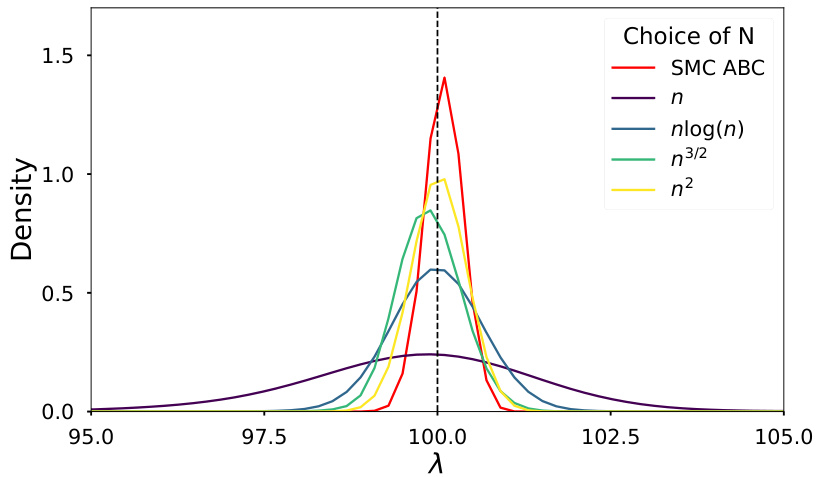  
Figure 1: Univariate posterior approximations of the rate parameter $\lambda$ (true value $\lambda=100$ , shown by the dashed vertical line) for a dataset generated from the stereological model with $n\,=\,1000$ observations. The NPE approximations are compared across varying numbers of simulations against the posterior obtained via ABC-SMC.  

In Table 1, across 100 replicated runs, we compare the realized coverage of the corresponding NPE for $\lambda$ across different choices of $N$ and different sample sizes $n$ . The results in Table 1 clearly show that the most accurate levels of coverage are obtained by choosing $N\geq n^{3/2}$ regardless of the value of $n$ .  

Panels (a)-(d) in Figure 2 and the results in Table 1 suggest that concentration of the NPE requires that $N$ diverges sufficiently fast, as a function of $n$ , so the impact of using simulated data within the approximation is smaller than the natural variability in the posterior we are attempting to target. In the following sections, we formalize this link between $N$ and $n$ and discuss the requirements on $N$ needed to ensure that the NPE concentrates at the standard parametric rate. We also show that if the summaries are not chosen carefully, or if the NPE is not trained well-enough, then there is no reason to suspect that the accuracy of the NPE shown in this example will remain valid.  

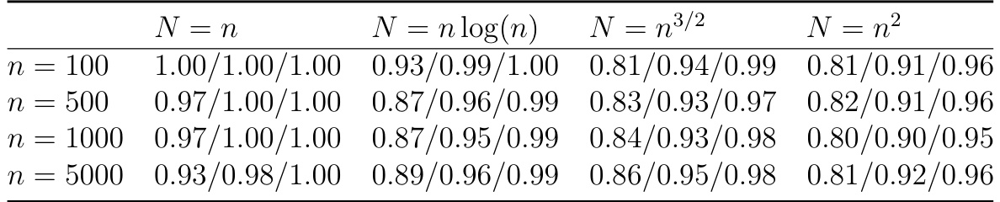  
Table 1: Monte Carlo coverage of $80\%$ ,$90\%$ , and $95\%$ credible intervals for $\lambda$ across different choices of $N$ and sample sizes $n$ , based on 100 repeated runs.  

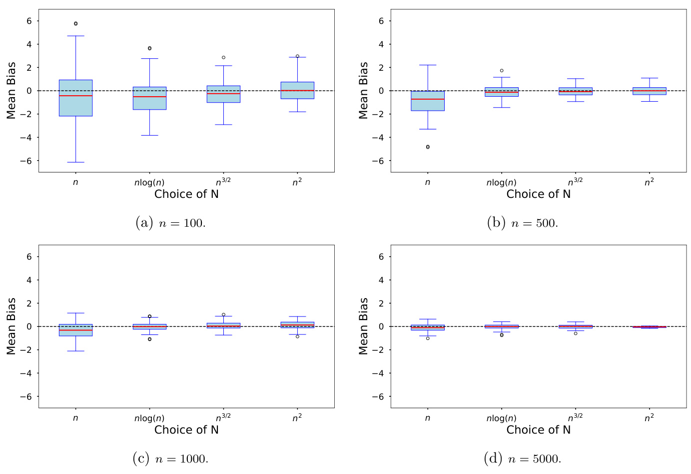  
Figure 2: Bias of the posterior mean for $\lambda$ visualized through boxplots across varying $n$ and $N$ .  

# 3 Setup: Neural Posterior Estimation  

Let $y=(y_{1},...,y_{n})$ denote the observed data and define $P_{0}^{(n)}$ as the true distribution of $y$ .We assume the observed data is generated from an intractable class of parametric models $\{P_{\theta}^{(n)}:\theta\in\Theta\subseteq\mathbb{R}^{d_{\theta}}\}$ ∈⊆}from which we can easily simulate pseudo-data $z=(z_{1},\ldots,z_{n})$ for any $\theta\in\Theta$ . Denote the prior density for $\theta$ as $p(\theta)$ .  

Since the likelihood is intractable, we conduct inference using approximate Bayesian methods, also known as simulation-based Bayesian inference (SBI). The main idea of SBI is to build an approximation to the posterior by leveraging our ability to simulate data under $P_{\theta}^{(n)}$ . To make the problem computationally practical the approximation is generally carried out using summaries rather than the full dataset $y$ . Let $S_{n}:\mathbb{R}^{n}\rightarrow S$ ,$S\subseteq\mathbb{R}^{d_{s}}$ ,$d\geq d_{\theta}$ , denote the vector summary statistic mapping employed in the analysis. When no confusion is likely to result, we write $S_{n}(\cdot)$ for the mapping and $S_{n}$ its value when $S_{n}(\cdot)$ is evaluated at the observed data $y$ , i.e., $S_{n}=S_{n}(y)$ .  

Denote by $G_{n}(\cdot\mid\theta)$ the distribution of $S_{n}(z)$ under $P_{\theta}^{(n)}$ . Since we have reduced the data down to $S_{n}$ , the inferential ideal shifts from the standard Bayes posterior to the “partial” posterior:  

$$
\mathrm{d}\Pi(\theta\mid S_{n})=\frac{\mathrm{d}G_{n}(S_{n}\mid\theta)p(\theta)}{\int_{\Theta}\mathrm{d}G_{n}(S_{n}\mid\theta)p(\theta)\mathrm{d}\theta}.
$$  

When $G_{n}(\cdot\mid\theta)$ admits a density with respect to (wrt) the Lebesgue measure, we let $g_{n}(\cdot\mid\theta)$ denotes its density, and state the posterior more compactly as $\pi(\theta\mid S_{n})\propto g_{n}(S_{n}\mid\theta)p(\theta)$ .Throughout the remainder, to simplify notations, we use this more compact notation.  

Since $\Pi(\cdot\mid S_{n})$ is intractable, we resort to conducting inference via an approximate posterior. Two classes of powerful posterior approximations used in the machine learning literature are neural posterior estimation (NPE) (see, e.g., Lueckmann et al., 2017), and neural likelihood (NLE) (see, e.g., Papamakarios et al., 2019).  

NPE learns an approximation to $\Pi(\cdot\mid S)$ by simulating data pairs $(\theta^{\top},S_{n}(z)^{\top})^{\top}\stackrel{\imath\imath d}{\sim}$ ∼$p(\theta)g_{n}(S\mid\theta)$ and then minimizing a certain criterion function over a chosen class of conditional density approximations for $\theta\mid S$ (more precise details are given in Definition 2, Section 4). The goal of NPE is not to directly approximate $\Pi(\cdot\mid S_{n})$ , but to approximate the entire distribution of $\theta\mid S$ , i.e., $\Pi(\cdot\mid S)$ at any $S\in S$ . This last point is crucial to note and is a consequence of the training data used in NPE, which does not include the observed summaries $S_{n}$ . Algorithm 1 provides an algorithmic formulation of NPE.  

In contrast to NPE, NLE learns an approximation of the intractable likelihood $g_{n}(\cdot\mid\theta)$ by simulating pairs $(\theta^{\top},S_{n}(z)^{\top})^{\top}\overset{i i d}{\sim}p(\theta)g_{n}(S\mid\theta)$ ∼|), and then minimizing a certain criterion function over a chosen class of conditional density approximations for $S\mid\theta$ (see Definition  

Input :prior $p(\ensuremath{\boldsymbol{\theta}})$ , number of simulations $N$   
Ou roximate posterior $\widehat{q}_{N}(\theta\mid S)$   
Set D$\mathcal{D}=\emptyset$ ∅  
for j$j=1:N$ do sample $\theta^{j}\sim p(\theta)$ simulate $S^{j}\sim g_{n}(S\mid\theta^{j})$ add $(S^{j},\theta^{j})$ i oD  
train $q(\theta\mid S)$ Dto obtain $\widehat{q}_{N}(\theta\mid S)$   
return $\widehat{q}_{N}(\theta\mid S)$ |  
Input :$S_{n}$ , prior $p(\theta)$ , number of simulations $N$   
Ou roximate posterior $\widehat{\pi}_{N}(\theta\mid S_{n})$   
Set D$\mathcal{D}=\emptyset$ ∅  
for j$j=1:N$ do sam $\theta^{j}\sim\widehat{q}_{r-1}(\theta\mid S_{n})$ with MCMC simulate $S^{j}\sim g_{n}(S\mid\theta^{j})$ ∼|ad $(S^{j},\theta^{j})$ ) i oD  
train b$\widehat{q}(S\mid\theta)$ $\mathcal{D}$ and set $\widehat{\pi}_{r}(\theta\mid S_{n})\propto\widehat{q}(S_{n}\mid\theta)p(\theta)$   
return $\widehat{\pi}_{N}(\theta\mid S_{n})$ |  

3 in Section 6 for further details). This approximation replaces the intractable likelihood $g_{n}(S_{n}\mid\theta)$ in $\pi(\theta\mid S_{n})$ and MCMC is used to produce draws from an approximate posterior. Algorithm 2 gives the single round version of the neural likelihood posterior estimator (NLE).  

Both NPE and NLE can sequentially update their approximations over multiple rounds in an attempt to deliver more accurate approximations. Indeed, there exists a diverse set of sequential extensions to NPE and NLE with each having specific features that have been designed to deliver more accurate approximations. However, if our goal is to present results that articulate the underlying behavior of NPE and NLE methods, this diversity detracts from our intended purpose, as our results would have to cater for the various differences in the sequential algorithms.  

Therefore, to ensure that we can present the most general results, we do not directly analyze the sequential versions of NPE and NLE herein, and instead focus only on oneshot implementations. This will allow us the necessary flexibility to state general results without getting bogged down in specific implementation details. That being said, so long as the sequential versions of these approaches deliver more accurate approximations than their one-shot counterparts, $^4$ the results presented herein can be viewed as upper bounds on those achievable by sequential versions of these algorithms, was subsequent rounds of the algorithms will likely deliver sharper results than those obtained from the one-shot versions.  

While NPE and NLE have been shown to deliver accurate posterior approximations in certain empirical problems, the statistical behavior of these resulting approximate posteriors have not been formally studied. In Section 4 we develop general theoretical results for NPE; while Section 6 provides similar results for NLE.  

# 4 Neural Posterior Estimation  

# 4.1 Definitions and preliminaries  

We first introduce several definitions that we use to study to NPE.  

Definition 1. Let $P$ and $Q$ be two probability measures with support $\Theta\times S$ , and which admit densities - wrt the Lebesgue measure $\lambda\{\bf\mu-\nabla p\}$ and $q$ . Define the total variation $(T V)$ ,and Hellinger distance as  

$$
2)=\!\frac{1}{\sqrt{2}}\left\{\int\left(\sqrt{p(\theta,S)}-\sqrt{q(\theta,S)}\right)^{2}\mathrm{d}\lambda\right\}^{\frac{1}{2}},\,\,\mathrm{d}_{\mathrm{TV}}\left(P,Q\right)=\int\left|p(\theta,S)-q(\theta,S)\right|^{2}\mathrm{d}\lambda\right\}^{-1}.
$$  

4 Formally stating such a condition would require extending a version of Assumptions 5 and 8 to these sequential versions of NPE and NLE.  

The Kullback-Leibler divergence (KLD) is defined as  

$$
\mathrm{KLD}(P\|Q)=\int_{\Theta}\int_{\cal S}p(\theta,S)\log\frac{p(\theta,S)}{q(\theta,S)}\mathrm{d}\lambda.
$$  

We will make often use of the following well-known relationships between these distances.  

Lemma 1 (Pinsker) .For probability measures $P,Q$ ,  

$$
\mathrm{d}_{\mathrm{H}}\left(P,Q\right)^{2}\leq\mathrm{d}_{\mathrm{TV}}\left(P,Q\right)\leq\sqrt{2}\mathrm{d}_{\mathrm{H}}(P,Q)~a n d~\mathrm{d}_{\mathrm{TV}}\left(P,Q\right)\leq\sqrt{\frac{1}{2}\mathrm{KLD}(P||Q)}.
$$  

Let $\mathcal{Q}$ be a class of conditional probability measures for $\theta\mid S$ . NPE attempts to find the closest $Q\in\mathcal{Q}$ to $\Pi(\cdot\mid S)$ , where closeness is defined in terms of KLD $(\Pi\|Q)$ . However, since $\Pi(\cdot\mid S)$ is intractable, so is KLD $(\Pi\|Q)$ . NPE circumvents this intractability by replacing KLD $(\Pi\|Q)$ with a Monte Carlo approximation based on $N$ iid simulated datasets where $(\theta^{i},S^{i})\stackrel{i i d}{\sim}p(\theta)g_{n}(S\mid\theta).$ ).  

Definition 2 (NPE) .Let $\mathcal{Q}$ be a family of conditional distributions for $\theta\mid S$ . At termination of the algorithm, ${\widehat{Q}}_{N}$ denotes the $Q\in\mathcal{Q}$ with density $q=\mathrm{d}Q/\mathrm{d}\lambda$ that satisfies  

$$
-\frac{1}{N}\sum_{i=1}^{N}\log\widehat{q}_{N}(\theta^{i}\mid S^{i})K(\theta^{i})\le\operatorname*{inf}_{Q\in\mathcal{Q}}-\frac{1}{N}\sum_{i=1}^{N}\log q(\theta^{i}\mid S^{i})K(\theta^{i}),
$$  

a known importance function $K(\theta)$ . Given observed summaries $S_{n}$ , the NPE is $\widehat{Q}_{N}(\cdot\,|\$ $S_{n}$ ).  

Remark 1 .$\widehat{Q}_{N}$ is the solution to a variational optimization problem that seek mize a Monte Carlo estimate of the (possibly weighted) forward KLD between Π( $\Pi(\cdot\mid S)$ · | ) and $Q(\cdot\mid S)$ over $(\theta,S)$ . In contrast to standard variational Bayesian inference, NPE minimizes  

the forward KLD rather than the reverse KLD, i.e., KLD $(Q||\Pi)$ , using simulations from the assumed model. Definition 2 clarifies that as $N\rightarrow\infty$ it is the difference between $\Pi(\cdot\mid S)$ and $Q(\cdot\mid S)\in\mathcal{Q}$ in forward KLD that NPE attempts to control.  

Definition 2 clarifies that NPE learns a flexible approximation to the conditional distribution  

$$
\pi(\theta\mid S)=g_{n}(S\mid\theta)p(\theta)/p(S),\quad p(S)=\int_{\Theta}g_{n}(S\mid\theta)p(\theta)\mathrm{d}\theta,
$$  

and evaluates this approximati $S\;=\;S_{n}$ to produce $\widehat{Q}_{n}(\cdot\mid S_{n})$ . Hen NPE may not recover the exact posterior Π( $\Pi(\cdot\mid S_{n})$ · | ) for at least two reasons. First, if Qis not rich enough, it may be th $\mathrm{d}_{\mathrm{TV}}(\widehat{Q}_{N},\Pi)>0$ even s$N\rightarrow\infty$ , which some have referred to as the expressiveness of Q. However, so long as Qis a class of universal conditional density mators and if $\Pi(\cdot\mid S)$ is well-behaved, then NPE will satisfy $\mathrm{d}_{\mathrm{TV}}(\Pi,\widehat{Q}_{N})\to0$ as →∞ .  

More critically, $S\mapsto{\widehat{Q}}_{N}(\cdot\mid S)$ is a glo roximation to ap $S\mapsto\Pi(\cdot\ |\ S)$ ,and so it may be a poor approximation to Π( $\Pi(\cdot\mid S)$ · | ) at the point S$S=S_{n}$ . To see why this can be the case, note tha if $S_{n}$ is in the t of $g_{n}(S\mid\theta)$ , then $S\mapsto{\widehat{Q}}_{N}(\cdot\mid S)$ will be trained on many values of Sthat are unlike $S_{n}$ , and NPE will encounter the classical issue of “extrapolation bias”. The way in which $\widehat{Q}_{N}(\cdot\mid S)$ rained represents a fundamental difference with other SBI m hods like ABC: $\widehat{Q}_{N}(\cdot\mid S_{n})$ b· | ) is train d on samples from the entire prior predictive space S; ABC is trained only on values of Sin the restricted prior predictive space $S_{\delta}=\{S\in\mathcal{S}:\mathrm{d}(S_{n},S)\leq\delta\}$ , for some known tolerance $\delta\geq0$ . Hence, if $_S$ has little mass near $S_{n}$ under the assumed model density $g_{n}(\cdot\mid\theta)$ for any $\theta\in\Theta$ , then $\widehat{Q}_{N}(\cdot\mid S_{n})$ will be less accurate than ABC methods fo g$\Pi(\cdot\mid S_{n})$ .  

To minim tial for extrapolation bias, $S\mapsto{\widehat{Q}}_{N}(\cdot\mid S)$ b· | ) must be trained on samples from $g_{n}(S\mid\theta)p(\theta)$ |) where Sis sufficiently close to $S_{n}$ . One way to minimize possible extrapolation bias is to modify NPE training to include a large number of data points for which $(\theta,S)\,\sim\,p(\theta)g_{n}(S\mid\theta)1(S\,\in\,S_{\delta})$ for some $\delta\,>\,0$ ; the latter idea has been termed preconditioned NPE by Wang et al. (2024).  

The above discussion clarifies that to ensure NPE is not corrupted by extrapolation bias the observed summary $S_{n}$ cannot be far in the tail of the assumed model density $g_{n}(S\mid\theta)$ for some $\theta\:\in\:\Theta$ . Heuristically, this will require that the summaries can be matched by the assumed model, for some value of $\theta$ , for all $n$ large enough. This condition has been called model compatibility by Marin et al. (2014), Frazier et al. (2020), and Frazier et al. (2024). When model compatibility is satisfied, and under further regularity conditions, we can derive general results on the statistical accuracy of $\widehat{Q}_{N}(\cdot\mid S_{n})$ .  

# 4.2 Statistical Guarantees for NPE  

Before presenting the theoretical behavior of $\widehat{Q}_{n}(\cdot\mid S_{n})$ , we present several notations used throughout the remainder of the paper. The letter Cdenotes a generic positive constant (independent of $n$ ), whose value may change from one occurrence to the next, but whose precise value is unimportant. For two sequences $\{a_{n}\},\{b_{n}\}$ of real numbers, $a_{n}\lesssim b_{n}$ (resp. $\gtrsim)$ means $a_{n}\leq C b_{n}$ (resp. $a_{n}\geq C b_{n}$ ) for all $n$ large enough. Similarly, $a_{n}\sim b_{n}$ means that  

# $1/C\leq\operatorname*{lim}_{n\to\infty}\operatorname*{inf}_{\substack{}}|a_{n}/b_{n}|\leq\operatorname*{lim}_{n\to\infty}|a_{n}/b_{n}|\leq C\;.$  

For two sequences $a_{n},b_{n}\to0$ , the notation $a_{n}\ll b_{n}$ means that $b_{n}/a_{n}\to0$ . Recall that $P_{0}^{(n)}$ denotes the true distribution of the data and let $F_{0}^{(n)}$ denote the implied distribution of the summaries $S_{n}(y)$ , with density $f_{0}^{(n)}=\mathrm{d}F_{0}^{(n)}/\mathrm{d}\lambda$ . The symbol $\Rightarrow$ denotes convergence in distribution under $P_{0}^{(n)}$ . For sequences $a_{n}$ , the notation $O_{p}(a_{n})$ and $O_{p}(a_{n})$ have their usual connotations. We let $N(x;\mu,\Sigma)$ denote the Gaussian density at $x$ with mean $\mu$ and variance $\Sigma$ . Expectations under $P_{0}^{(n)}$ are denoted by $\mathbb{E}_{0}^{(n)}$ .  

The following regularity conditions on the observed and simulated summaries are used to deduce posterior concentration. These conditions are similar to those maintained in Marin et al. (2014) and Frazier et al. (2018) to derive the behavior of ABC posteriors.  

Assumption 1. There exist a positive sequence $\nu_{n}\to\infty$ as $n\to\infty$ , a vector $\mu_{0}\in\mathbb{R}^{d_{s}}$ ,and a covariance matrix $V$ such that $\nu_{n}(S_{n}-b_{0})\Rightarrow\mathcal{N}(0,V)$ . For some $\alpha\geq d_{s}+1$ ,$x_{0}>0$ ,and all $x$ such that $0<x<\nu_{n}x_{0}$ ,  

$$
F_{0}^{(n)}\left[\nu_{n}\|S_{n}-b_{0}\|>x\right]\leq C x^{-\alpha}\,.
$$  

Assumption 2. The mean of the summaries under $(\cdot\mid\theta),\,b_{n}(\theta)=\mathbb{E}_{S\sim g_{n}(S\mid\theta)}(S)$ , exists. For $\alpha$ as in Assumption 1, and some $x_{0}>0$ ,  

$G_{n}\left\{\nu_{n}\|S_{n}(z)-b_{n}(\theta)\|>x\mid\theta\right\}\leq C(\theta)x^{-\alpha}$  

where $C(\theta)$ satisfies $\begin{array}{r}{\int_{\Theta}C(\theta)p(\theta)\mathrm{d}\theta<\infty}\end{array}$ .  

Remark 2 .Assumptions 1-2 are general regularity conditions that are satisfied for many different choices of summaries and are discussed in detail in Marin et al. (2014) and Frazier et al. (2018). Essentially, Assumption 1 requires that the observed summaries satisfy a central limit theorem and have at least a polynomial tail; Assumption 2 requires that, uniformly over $\Theta$ , the mean of the simulated summaries exists, and that the summaries on which the NPE are trained have a polynomial tail. The tail concentration in Assumptions 1-2 is what will ultimately drive the concentration of the NPE. These assumptions are common in the literature on SBI, and satisfied for many different choices of summaries. Given this, we defer to Marin et al. (2014) and Frazier et al. (2018) for further details.  

Assumptions 1-2 do not directly link the assumed model, $g_{n}(\cdot\mid\theta)$ , and the observed summaries in Assumption 1. To do so, we rely on the following condition that ensures the assumed model is ‘compatible’ with the value of the observed summary statistic at some $\theta\in\Theta$ .  

Assumption 3. There exist $\theta_{0}\,\in\,\Theta$ such that $\begin{array}{r}{\operatorname*{lim}_{n\to\infty}\operatorname*{inf}_{\theta\in\Theta}\left\|b_{n}(\theta)-b_{0}\right\|=0}\end{array}$ . For any $\epsilon>0$ there exist $\delta>0$ and a set ${\mathcal{E}}_{n}$ such that for all $\theta\in\Theta$ with $\mathrm{d}(\theta,\theta_{0})\leq\epsilon$ ,  

$$
\mathcal{E}_{n}\subseteq\{S\in\mathcal{S}:g_{n}(S\mid\theta)\geq\delta f_{0}^{(n)}(S)\},\quad P_{0}^{(n)}\left(\mathcal{E}_{n}^{c}\right)<\epsilon.
$$  

Remark 3 .Assumption 3 essentially requires that the assumed model and the true DGP are similar, and that the observed summaries can be replicated under the assumed model. In particular, the second part of the assumption states that, for all values of $\theta$ that are close to $\theta_{0}$ , the assumed and true model densities must also be close. Note, that Assumption 3 does not require that the true DGP $P_{0}^{(n)}$ is equal to $P_{\theta_{0}}^{(n)}$ , which is a sufficient condition, but stronger than necessary, only that the density of the summaries under the true model is close enough to that of the assumed model for the summaries. A version of Assumption 3 has been used in all theoretical studies of SBI methods of which we are aware.  

Remark 4 .Assumption 3 orous our earlier discussion that for $\widehat{Q}_{N}(\cdot\mid S_{n})$ to be an accurate approximation of Π( $\Pi(\cdot\mid S_{n})$ · | ) it must be trained on samples from the prior predictive that are sufficiently close to $S_{n}$ . With equirem e is no hope that $\widehat{Q}_{N}(\cdot\mid S_{n})$ will be an accurate approximation to Π( $\Pi(\cdot\mid S_{n})$ · | ). When $g_{n}(\cdot\mid\theta)$ · | ) has little support near S$S_{n}$ ,we suggest to apply the preconditioned NPE approach of Wang et al. (2024).  

We also require that the prior places sufficient mass on the value $\theta_{0}\in\Theta$ under which the assumed model can match the observed summaries, and that the prior does not put proportionally more mass on values away from $\theta_{0}$ . Let $\epsilon_{n}=o(1)$ be such that $\epsilon_{n}\gtrsim\nu_{n}^{-1}$ ,take $M>0$ , and define $\Theta_{n}=\{\theta\in\Theta:\mathrm{d}(\theta,\theta_{0})\leq M\epsilon_{n}\}$ .  

Assumption 4. There are constants $\tau$ and $d$ , with $\tau\geq d+1$ , such that  

$$
\int_{\Theta_{n}^{c}}p(\theta)\mathrm{d}\theta\lesssim M^{\tau}\epsilon_{n}^{\tau},\quad\int_{\Theta_{n}}p(\theta)\mathrm{d}\theta\gtrsim M^{d}\epsilon_{n}^{d}.
$$  

Assumptions 1-4 allow us to control the behavior of the (infeasible) partial posterior $\Pi(\cdot\mid S_{n})$ , but do not control the accuracy with which $\widehat{Q}_{N}(\cdot\mid S_{n})$ approximates $\Pi(\cdot\mid S_{n})$ .To understand how we can control the accuracy of this approximation, first recall that NPE is trained using $N$ randomly simulated datasets each generated independent from $g_{n}(\cdot\ \mid\ \theta)p(\theta)$ $\widehat{Q}_{N}(\cdot\mid S_{n})$ contains two sepa e sources of mness: one source from S, with law $P_{0}^{(n)}$ , and one source from the Niid datasets ( $(S^{i},\theta^{i})$ ) generated from $g_{n}(\cdot\ |\ \theta)p(\theta)$ . To accommodate the randomness of this synthetic training data, we must integrate out its influence within $\widehat{Q}_{N}(\cdot\mid S_{n})$ To this end, we let $\mathbb{E}_{0}^{(N,n)}$ denote expectations calculated under the training data {$\{(\theta^{i},S^{i})\stackrel{i i d}{\sim}g_{n}(\cdot\mid\theta)p(\theta):i\leq N\}$ ∼· | ≤}and $P_{0}^{(n)}$ .  

While it is possible to entertain several different assumptions regarding the accuracy with which $\widehat{Q}_{N}(\cdot\mid S_{n})$ pproximates $\Pi(\cdot\mid S_{n})$ , we note that the concentration in Assumption 1 implies that as nbecomes large we do not require an accurate approximation to $\Pi(\cdot\mid S_{n})$ over the entirety of $\boldsymbol{S}$ , but only in a neighborhood of $b_{0}=\mathbb{E}_{0}^{(n)}(S_{n})$ ). This observation, and the representation of NPE as a variational optimizer based on forward KLD motivates the following assumption.  

Assumption 5. For s $o m e\ \gamma_{N}=o(1),\ \mathbb{E}_{0}^{(N,n)}\mathrm{KLD}\{\Pi(\cdot\ |\ b_{0})||\widehat{Q}_{N}(\cdot\ |\ b_{0})\}\leq\gamma_{N}^{2}.$  

5 .Assumptio aces a condition on the rate at which $\widehat{Q}_{N}(\cdot\mid S)$ learns about $\Pi(\cdot\mid S)$ · | ), at the point S$S=b_{0}$ . Note that if Assumption 3 is not satisfied, there is no hope that Assumption 5 can be satisfied: if Assumption 3 is violated, $b_{0}\not\in{\cal S}$ , then $b_{0}$ is not in the support of $g_{n}(S\mid\theta)$ for any $\theta\in\Theta$ , and NPE cannot learn about $b_{0}\mapsto\Pi(\cdot\mid b_{0})$ . This clarifies that witho mption 3 there is no reason to suspect $\widehat{Q}_{N}(\cdot\mid S_{n})$ will be a useful approximation to Π( $\Pi(\cdot\mid S_{n})$ · | ).  

Up to a constant, and for $n$ large, KLD $\{\Pi(\cdot\mid b_{0})||Q(\cdot\mid b_{0})\}$ is the term we minimize in NPE when $N\rightarrow\infty$ .That is, KLD $\{\Pi(\cdot\mid b_{0})||Q(\cdot\mid b_{0})\}$ is precisely the criterion that NPE would minimize if $b_{0}$ were known. Hence, Assumption 5 is both intuitive and natural to maintain.  

Remark 6 .While Assumption 5 may be natural to maintain given the definition of NPE, it can be cumbersome to check in practice. Equivalent theoretical results to those presented later can be obtained if Assumption 5 is replaced with a similar condition in Hellinger distance; e.g., $\begin{array}{r}{\mathbb{E}_{0}^{(N,n)}\mathrm{d}_{\mathrm{H}}\{\Pi(\cdot\mid b_{0})\vert\vert\widehat{Q}_{N}(\cdot\mid b_{0})\}\le\gamma_{N}}\end{array}$ {· | || b· | } ≤ . See Appendix E.2 and Corollary 2 for further details.  

The last assumption we maintain guarantees that the mappings $S\,\mapsto\,\Pi(\cdot\,\mid\,S)$ and $S\,\mapsto\,Q(\cdot\,\mid\,S)$ have sufficient regularity in terms of their conditioning argument $S$ , and requires smoothness of the conditional density, wrt the conditioning argument, in the total variation distance. This condition has been referred to as total-variation smoothness by Neykov et al. (2021) and Li et al. (2022), and was shown by the latter authors to be valid for smooth densities of the form $p(\theta,s)/\int p(\theta,s)\mathrm{d}\theta$ R.  

Assumption 6. For some $\delta>0$ , all $\theta\in\Theta$ and $s,s^{\prime}\in S_{\delta}(b_{0})$ : for $p(\theta\mid s)$ denoting $\pi(\theta\mid s)$ or $q(\theta\mid s)$ ,$\begin{array}{r}{\int|p(\theta\mid s)-p(\theta\mid s^{\prime})|\mathrm{d}\theta\leq C\left\|s-s^{\prime}\right\|}\end{array}$ ||−||≤∥−∥,for some sufficiently large $C>0$ such 6 This constant term depends purely on the assumed model, and is independent of the class $\mathcal{Q}$ .  

that $C\perp(\theta,s,s^{\prime})$ and $\mathbb{E}_{0}^{(N,n)}(C)<\infty$ ∞.  

Under Assumptions 1-6 we prove that, for a generic approximating class $\mathcal{Q}$ , the NPE $\widehat{Q}_{N}(\cdot\mid S_{n})$ has theoretical behavior that makes it useful as a posterior approximation.  

Theorem 1. Let $\epsilon_{n}=o(1)$ be a positive sequence such that $\nu_{n}\epsilon_{n}\rightarrow\infty$ . Under Assumptions 1-6, for any positive sequence $M_{n}\to\infty$ , and any loss function :$L:S\times S\to\mathbb{R}_{+}$ ,  

$$
\mathbb{E}_{0}^{(N,n)}\widehat{Q}_{N}\left[L\{b_{n}(\theta),b_{0}\}>M_{n}(\epsilon_{n}+\gamma_{N})\mid S_{n}\right]=o(1)\quad(a s\ n,N\to\infty).
$$  

Remark 7 .Theorem 1 implies $\widehat{Q}_{N}(\cdot\mid S_{n})$ to concentrate t rate $\epsilon_{n}$ we must asymptotically learn the map S$S\ \mapsto\ \Pi(\cdot\ \mid\ S)$ 7→ · | ) fast enough so that γ$\gamma_{N}$ in Assumption 5 satisfies $\gamma_{N}\,\lesssim\,\epsilon_{n}$ . For instance, if $\gamma_{N}\,\lesssim\,1/\nu_{n}$ , then Theorem 1 implies that NPE will concentrate at the usual rate. That is, if the practitioner chooses $N$ large enough so that $\nu_{n}\gamma_{N}=o(1)$ as $n,N\to\infty$ , then $\widehat{Q}_{N}(\cdot\mid S_{n})$ att ns the standard posterior concentration rate. To obtain precise conclusions on how large Nmust be to achieve this rate, we require more structure on $\mathcal{Q}$ , which we analyze in Section 5.  

If $\Pi(\cdot\mid S_{n})$ correctly quantifies uncertainty, then the regularity conditions in Assumptions 1-6 are sufficient to prove that NPE correctly quantifies uncertainty. Let $\theta_{n}\ =$ $\begin{array}{r}{\operatorname*{argmin}_{\theta\in\Theta}-\log g_{n}(S_{n}\mid\theta),\;t\;=\;\nu_{n}(\theta-\theta_{n}),\;\mathcal{B}\;=\;\operatorname*{lim}_{n}\partial b_{n}(\theta_{0})/\partial\theta^{\top},}\end{array}$ $\Sigma\,=\,B^{\top}V^{-1}B$ , and let $\pi(t\mid S_{n})$ denote the posterior for $t$ .  

Theorem 2. Under Assumptions 1-6, if $\boldsymbol{\mathrm{\Sigma}}_{\boldsymbol{B}}$ is non-singular, $\nu_{n}\gamma_{N}\,=\,o(1)$ , and $\textstyle\int|\pi(t~|$ ||$S_{n})-N\{t;0,\Sigma^{-1}\}|\mathrm{d}\theta=o_{p}(1)$ , then $\begin{array}{r}{\int|\widehat{q}_{N}(t\mid S_{n})-N\{t;0,\Sigma^{-1}\}|\mathrm{d}t=o_{p}(1).}\end{array}$ ||−{.  

Theorem 2 demonstrates that if the intractable posterior Π( $\Pi(\cdot\mid S_{n})$ · | ) is asymptotically Gaussian and calibrated, then so long as $\nu_{n}\gamma_{N}\,=\,o(1)$ , the NPE is also asymptotically Gaussian and calibrated. Theorem 2 implies that NPE behaves similarly to other SBI methods like ABC and BSL under model compatibility, and gives a rigorous basis for their continued use as inference engines.  

# 4.3 The Impact of Compatibility on NPE  

As discussed in Remarks 4-5, the statistical behavior of NPE depends on the validity of the compatibility condition in Assumption 3: if NPE does not see training data like $S_{n}$ , which occurs when Assumption 3 is violated, then Assumption 5 will not be satisfied in practice and NPE will not be an accurate approximation to $\Pi(\cdot\mid S_{n})$ in general. In this section, we illustrate that even when $N$ is very large, if $S_{n}$ differ e values under which $\tilde{Q}_{N}$ was trained, then NPE will not accurately approximate Π( $\Pi(\cdot\mid S_{n})$ · | ).  

We illustrate this phenomenon using a simple moving average model of order two: the observed data $y_{t}$ is generated according to the model  

$$
y_{t}=\theta_{1}\epsilon_{t-1}+\theta_{2}\epsilon_{t-2}+\epsilon_{t},\quad\epsilon_{t}\stackrel{i i d}{\sim}N(0,1),\quad(t=1,\ldots,T),
$$  

where the unknown parameters $\theta_{1}$ and $\theta_{2}$ control the autocorrelation in the observed data, and the prior on $\theta=(\theta_{1},\theta_{2})^{\top}$ is uniform over  

$$
\begin{array}{r l r}{-1<\theta_{1}<1,}&{{}\theta_{1}+\theta_{2}>-1,}&{\theta_{1}-\theta_{2}<1.}\end{array}
$$  

The uniform prior over the above triangular region is enforced to ensure the model generates a process that is invertible, so that the true unknown value of $\theta$ can be recovered from the data. Consider as our observed summaries for inference on $\theta$ the sample variance, the first and second order auto-covariances: $S_{n}(y)\,=\,(\delta_{0}(y),\delta_{1}(y),\delta_{2}(y))^{\top}$ where $\delta_{0}(y)\,=$ $T^{-1}\sum_{t=1}^{T}y_{t}^{2}$ ,$\begin{array}{r}{\delta_{1}(y)\,=\,T^{-1}\sum_{t=2}^{T}y_{t}y_{t-1}\,\mathrm{~and~}\,\delta_{2}(y)\,=\,T^{-1}\sum_{t=3}^{T}y_{t}y_{t-2}.}\end{array}$ P. Under the assumed  

# $b_{n}(\theta)=b(\theta)=(b_{0}(\theta),b_{1}(\theta),b_{2}(\theta))^{\top}=((1+\theta_{1}^{2}+\theta_{2}^{2}),\theta_{1}(1+\theta_{2}),\theta_{2})^{\top}.$  

The term $b_{0}(\theta)$ is lower bounded by unity. Therefore, in large samples, if we encounter a value of $\delta_{0}(y)$ that is below unity, we will enter a situation of incompatibility (i.e., Assumption 3 is invalid), and Assumptions 5 is likely violated. To illustrate the impact of incompatibility on NPE, and its relevance for Assumption 5, we fix the value of $\delta_{0}(y)$ and compare KLD $\{\Pi(\cdot\mid S_{n})\|\widehat{Q}_{N}(\cdot\mid S_{n})\}$ fo oices of $N$ . We set $\delta_{0}(y)=0.01$ to mimic a case of extreme incompatibility and δ$\delta_{0}(y)=0.99$ 99 to represent minor incompatibility.  

In Figure 3, we plot the KLD between the exact posterior $\Pi(\cdot\mid S_{n})$ and the NPE $\widehat{Q}_{n}(\cdot\mid S_{n})$ of our choices of $\delta_{0}(y)$ , and for our four difference choices of $N\ \in$ $\{n,n\log(n),n^{3/2},n^{2}\}$ {}. Details on the computation of the KLD and the exact partial posterior sampling are provided in Appendix C. The results clearly show that under major incompatibility, larger choices of $N$ do not deliver a more accurate approximation of the posterior, which violates Assumption 5. However, in the case of minor incompatibility we see that the value of the KLD between $\Pi(\cdot\mid S_{n})$ and $\widehat{Q}_{N}(\cdot\mid S_{n})$ decreases as $N$ increases, suggesting that Assumption 5 is satisfied, or is close to being satisfied. These results empirically demonstrate that for Assumption 5 to be satisfied NPE must be trained on data that is close to the observed summaries $S_{n}$ .  

# 5 The Choice of $\mathcal{Q}$ and its Implications  

Theorem 1 implies that for NPE to deliver reliable inference on $\theta$ , it must be that: 1) the assumed model is compatible with $S_{n}$ (Assumption 3); 2) elements in $\mathcal{Q}$ must be a good approximation to $\Pi(\cdot\mid S_{n})$ mption 5). In our fr ework the accuracy of $\widehat{Q}_{N}(\cdot\mid S_{n})$ ,as an approximation to Π( $\Pi(\cdot\mid S_{n})$ · | ), is encapsulated by γ$\gamma_{N}$ , and depends on the smoothness of $\Pi(\cdot\mid S)$ and the complexity of $\Theta\times S$ . To obtain specific requirements on $N$ to ensure that $\widehat{Q}_{N}(\cdot\mid S_{n})$ attains the usual poste entration rate, we must choose $\mathcal{Q}$ and make assumptions about the smoothness of Π( $\Pi(\cdot\mid S_{n})$ · | ).  

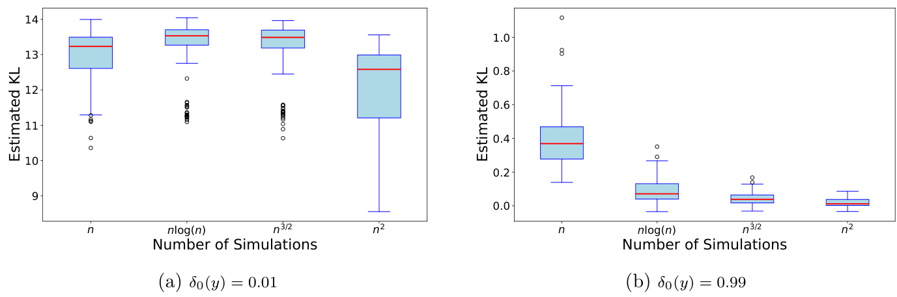  
Figure 3: Comparison of $\mathrm{KLD}\{\Pi(\cdot\mid S_{n})\|\widehat{Q}_{n}(\cdot\mid S_{n})\}$ across different choices of $N$ for extreme (a) and minor (b) cases of incompatibility. Please note that the scales in Panels (a) and (b) differ markedly.  

While neural methods and normalizing flows are common choices for the approximating class $\mathcal{Q}$ , the diversity of such methods, along with their complicated tuning and training regimes, makes establishing theoretical results on the rate of convergence, $\gamma_{N}$ in Assumption 5, for such methods difficult. Without such a result, obtaining a specific requirement on $N$ is infeasible. We circumvent this issue and obtain concrete requirements on the value of $N$ for NPE by making a high-level assumption that the chosen conditional density estimation method used to approximate $\Pi(\cdot\mid S_{n})$ attain the minimax rate of convergence for conditional density estimation in the class of locally $\beta$ -H¨older functions: for any $\beta>$ $0,\tau_{0}\geq0$ and a non-negative function $L:\mathbb R^{d}\to\mathbb R_{+}$ , let ${\mathcal{C}}^{\beta,L,\tau_{0}}(\ensuremath{\mathbb{R}}^{d})$ be the set  

# $\mathcal{C}^{\beta,L,\tau_{0}}(\mathbb{R}^{d})=\{f:|(\partial^{k}f)(x+y)-(\partial^{k}f)(x)|\le L(x)\exp\{\tau_{0}\|y\|^{2}\}\|y\|^{\beta-|\beta|}\ (y,x\cdot y)\},$ ∈Rd)},  

where $\partial^{k}f$ denotes mixed partial derivatives up to order $k$ , and $\lfloor x\rfloor$ the largest integer strictly smaller than $x$ .When $\Pi(\theta\ \mid\ S)\ \in\ {\mathcal{C}}^{\beta,L,\tau_{0}}(\mathbb{R}^{d_{\theta}+d_{s}})$ , there are different possible choices of $\mathcal{Q}$ that one could obtain to deduce a specific rate for $\gamma_{N}$ . In what follows, we assume that $\mathcal{Q}$ is chose $\widehat{Q}_{N}(\cdot\mid S_{n})$ in Definition 2 achieves the minimax rate for density estimation over C$\mathcal{C}^{\beta,L,\tau_{0}}(\mathbb{R}^{d_{\theta}+d_{s}})$ ).  

Assumption 7. For all nlarge enough, $\pi(\theta\mid S_{n})\in\mathcal{C}^{\beta,L,0}(\mathbb{R}^{d_{\theta}+d_{s}})$ . For $\gamma_{N}$ as in Assumption $\it5$ , the class $\mathcal{Q}$ is such that, for some $\beta\,>\,0$ ,$\gamma_{N}\,\asymp\,N^{-\beta/(2\beta+d_{\theta}+d_{s})}\log(n)^{\kappa}$ for some $\kappa>0$ .  

The rate in Assumption 7, without the $\log(n)^{\kappa}$ term, is minimax for estimation when $\Pi(\cdot\mid S_{n})\in\mathcal{C}^{\beta,L,0}(\mathbb{R}^{d_{\theta}+d_{s}})$ (Barron et al., 1999); see, also Theorem 1 of Efromovich (2010) and Theorem 1 of Shen et al. (2013) for further examples. That is, Assumption 7 is a high-level assumption on the class $\mathcal{Q}$ and the estimator $\widehat{Q}_{N}\in\mathcal{Q}$ deliver the best possible estimator when all that is known is that Π( $\Pi(\cdot\mid S_{n})\in\mathcal{C}^{\beta,L,0}(\mathbb{R}^{d_{\theta}+d_{s}})$ · | ∈C ). While we are unaware of any theoretical results which state that the classes of neural-nets and normalizing flows commonly used for NPE satisfy Assumption 7, in practice the accuracy of these methods suggests that such an assumption is reasonable to maintain.  

The following result, which is a direct consequence of Theorem 1, Assumption 7 and some algebra, provides an explicit requirement on the number of simulations, $N$ , required for NPE to attain the usual posterior concentration rate.  

y 1. -7, $\widehat{Q}_{N}(\cdot\mid S_{n})$ concentrates at rate $\epsilon_{n}$ so long as $N\gtrsim$ $\nu_{n}^{\alpha}\log(n)^{\kappa}$ , for $\alpha>(2\beta+d_{\theta}+d_{s})/\beta$ .  

# 5.1 The impact of dimension and computational efficiency  

Corollary 1 makes clear, for the first time, the impact of dimension on the behavior of NPE. In the absence of any modeling guidance on the choice of $\mathcal{Q}$ for NPE to concentrate at the standard rate we must train $\widehat{Q}_{N}(\cdot\mid S_{n})$ using at least $N\gtrsim\nu_{n}^{\alpha}\log(n)^{\kappa}$ model simulations.  

To see how dimension impacts this requirement, consider that we have $d_{\theta}=5$ parameters and $d_{s}~=~10\$ summaries, and that the summaries converge at the $\sqrt{n}$ rate (i.e., $\nu_{n}\ =\ {\sqrt{n}}$ ). hen $\Pi(\cdot\ \ |\ \ S_{n})\ \in\ {\mathcal{C}}^{\beta,L,0}(\mathbb{R}^{d_{\theta}+d_{s}})$ , for $\widehat{Q}_{N}(\cdot\mid S_{n})$ to co $\epsilon_{n}=\log(n)/\sqrt{n}$ √our theoretical results suggest that we require at least $N\gtrsim\log(n)n^{\frac{2\beta+15}{2\beta}}$ simulated datasets to train the NPE. For example, if $n=1000$ , and $\beta=10$ , this requires simulating at least $N\gtrsim178,000$ simulated datasets.  

The above requirement on $N$ is much larger than the number of simulations routinely employing in NPE, e.g., Lueckmann et al. (2021) report good results using $N\,\approx\,10K$ datasets in NPE, albeit in experiments with fewer than 1000 observations. That being said, the requirement that NPE must simulate $N\asymp10^{4}$ datasets is orders of magnitude smaller than the requirement in ABC where it is not uncommon to simulate $10^{6}$ or $10^{7}$ datasets to obtain reliable posterior approximations.  

If one is willing to impose more onerous smoothness conditions, lower requirements on $N$ can be achieved. If we assume $\beta\,\geq\,d_{s}+d_{\theta}$ , then NPE must only simulate $N\gtrsim$ $\log(n)n^{3/2}$ datasets to achieve the parametric concentration rate. Considering this bound, it is then clear that our choices of $N$ used throughout the numerical experiments, $N\in$ $\{n,\log(n)n,n^{3/2},n^{2}\}$ , directly reflect the assumed smoothness of the approximation class, with larger choices of $N$ correlating to a lower degree of assumed smoothness.  

Corollary 1 also allows us to compare the computational requirements of NPE to those of ABC. For the ABC posterior to concentrate at the $\sqrt{n}$ -rate, as $n$ diverges, we require at least $N_{\mathrm{ABC}}\,\gtrsim\,\log(n)n^{d_{\theta}/2}$ simulated draws (Corollary 1, Frazier et al., 2018). If the posterior we are approximating is smooth, so that we may take $\beta\geq\left(d_{\theta}+d_{s}\right)$ , then for $n$ large NPE will be more efficient than ABC so long as $d_{\theta}\geq3$ .Critically, this latter result is irrespective of the dimension of the summaries $d_{s}$ , and we note that in practice obtaining samples from the ABC posterior when $d_{s}$ is large is computationally cumbersome.  

Lastly, we would like to clarify that Corollary 1 can deliver a larger value than necessary for $N$ in certain cases. In particular, as we discuss in Section A in the supplementary material, if we are willing to entertain that $\Pi(\cdot\mid S_{n})\in\,\mathcal{Q}$ , then to obtain the parametric rate of posterior concentration we only need to train NPE on $N\gtrsim\log(n)n$ datasets. We refer the interested reader to Section A in the supplementary material for further details.  

# 5.2 Example: Illustrating the impact of dimensional on NPE  

In the following example, we use a relatively simple model to illustrate the impact of dimension (for parameters and summaries) on the accuracy of NPE (as predicted by Corollary 1). The g-and-k distribution is a flexible univariate distribution that is popular as an illustrative example in SBI. The g-and-k distribution is defined via the quantile function,  

$$
Q_{\mathrm{gk}}(z(p);A,B,g,k)=A+B\left(1+c\operatorname{tanh}\left(\frac{g z(p)}{2}\right)\right)\times(1+z(p)^{2})^{k}z(p),
$$  

where $z(p)$ is the $p$ th quantile of the standard normal distribution. Typically, we fix $c=0.8$ and conduct inference over the model parameters $\theta=(A,B,g,k)$ . It is trivial to simulate pseudo-data for a given $\theta$ by simulating $z(p)\sim\mathcal{N}(0,1)$ and computing $Q_{\mathrm{gk}}$ .  

Herein we take $n=1000$ and $n=5000$ and set the true parameter values as $A=3,B=$ $1,g=2$ and $k=0.5$ . We set the summary statistics to be the octiles of the sample data 7 Plugging $\beta=(d_{\theta}+d_{s})$ into the requirement in Corollary 1 yields the bound $N\gtrsim\log(n)n^{3/2}$ .  

as in Drovandi and Pettitt (2011).  

We focus attention on the $g$ parameter, which corresponds to the skewness of the distribution, and is known to be the most challenging parameter to infer. In Figure 4, we illustrate the bias between the posterior mean and the true parameter value across 100 replicated datasets. Similar to the motivating example, we again see more accurate results as we increase $n$ , or for fixed $n$ as $N$ is increased. However, unlike the motivating example, we see that improvements are still obtainable, in terms of decreased bias and variance of the posterior mean, when choosing $N>n^{3/2}$ .  

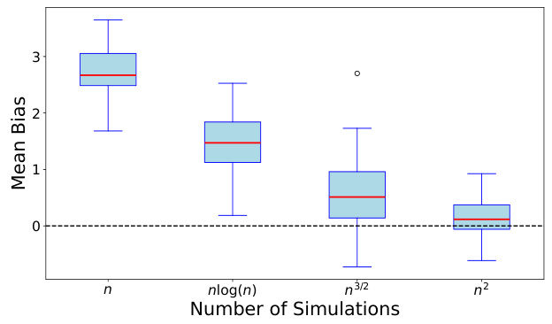  
(a) Boxplot of Mean Biases for $n=1000$ .  
Figure 4: Bias of the posterior mean for $g$ visualized through boxplots for $n=1000$ and $n=5000$ across varying $N$ .  

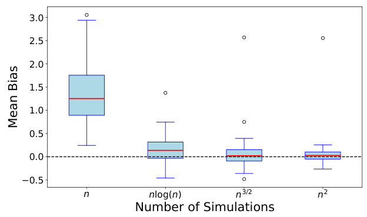  
(b) Boxplot of Mean Biases for $n=5000$ .  

A similar story is given in Table 2, which presents the marginal Monte Carlo coverage for the 80%, 90% and 95% NPE credible intervals based on 100 replicated datasets. Unlike the stereological example, which for $N\geq n^{3/2}$ produced reasonably accurate coverage results, the results under the g-and-k are more mixed: reliable coverage seems only to be delivered when we choose $N=n^{2}$ .  

The reason why a higher value of $N$ is required to deliver accurate posteriors in this example has already been elucidated in Corollary 1: all else equal, the larger the dimension of the summaries, $d_{s}$ , and/or the parameters, $d_{\theta}$ , the higher $N$ must be to obtain an accurate approximation. The motivating example in Section 2 featured three unknown parameters and four summaries, so that $d_{s}+d_{\theta}\,=\,7$ , while in the g-and-k example, $d_{s}+d_{\theta}\,=\,11$ .All else equal, this increase in dimension necessitates a higher number of simulations in order to accurately approximate the posterior, and so appreciable gains in accuracy are still achievable when we use $N=n^{3/2}$ simulations with NPE.  

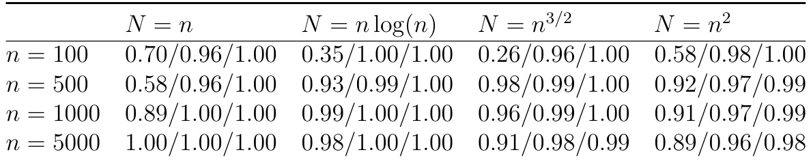  
Table 2: Monte Carlo coverage of 80%, $90\%$ , and 95% credible intervals for $g$ across different choices of $N$ and sample sizes $n$ , based on 100 repeated runs.  

Before concluding this section, we further illustrate the impact of dimension on the accuracy of NPE by comparing KLD $\{\Pi(\cdot\mid S_{n})\|\widehat{Q}(\cdot\mid S_{n})\}$ for two difference choices of summaries and across the four different choices of Nin the g-and-k model. Specifics on the computation of the KLD and the exact partial posterior sampling are detailed in Appendix D. The first set of summaries is the octiles used previously, for which $d_{s}\,=\,7$ ,while we also consider inferences based on the hexadeciles, for which $d_{s}=15$ summaries. Figure 5 shows that for our choices of $N$ and summaries, the KLD, relative to the respective partial posterior, based on the smaller number of summaries is always smaller than that based on the larger number of summaries. This clearly illustrates the behavior described in Corollary 1: to obtain an accurate NPE approximation, all else equal, as the dimension of the summaries increases so must the number of simulations used to train NPE.  

# 6 Neural Likelihood  

In contrast to NPE, neural likelihood estimation (NLE) uses an estimated density within MCMC to produce posterior samples. As such, the theoretical results obtained for NPE  

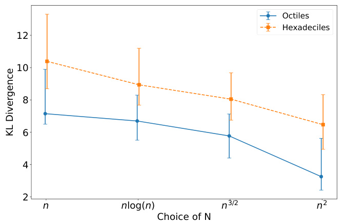  
(a) Number of observations $n=100$  

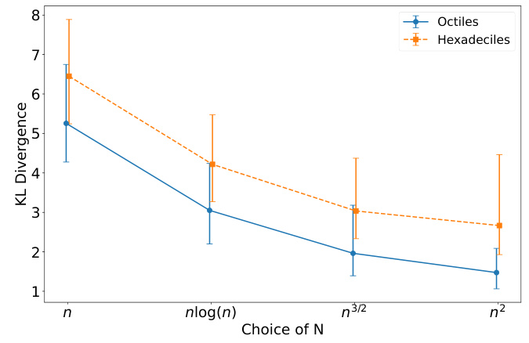  
Figure 5: Comparison of KLD $\{\Pi(\cdot\mid S_{n})\|\widehat{Q}_{n}(\cdot\mid S_{n})\}$ across different choices of $N$ , for summaries using octiles and hexadeciles.   
(b) Number of observations $n=1000$  

do not directly transfer to NLE. We formally define the neural likelihood (NL) and NLE below.  

Definition 3 (NLE) .Let $\mathcal{Q}$ be a family of conditional density estimators for $S\mid\theta$ . At termination of the algorithm, the estimator $\widehat{q}_{N}(S\mid\theta)$ satisfies  

$$
-\frac{1}{N}\sum_{i=1}^{n}K(\theta^{i})\log\widehat{q}_{N}(S^{i}\mid\theta^{i})\le\operatorname*{inf}_{Q\in\mathcal Q}-\frac{1}{N}\sum_{i=1}^{n}K(\theta^{i})\log q(S^{i}\mid\theta^{i}),
$$  

for some known function $K(\theta)$ $\widehat{q}_{N}(S_{n}\mid\theta)$ the neural likelihood (NL) and define posterior as $\widehat{\pi}_{N}(\theta\mid S_{n})\propto\widehat{q}_{N}(S_{n}\mid\theta)p(\theta)$ |∝|.  

As N→∞ , NLE obtains an estimator of the intractable $g_{n}(S\mid\theta)$ as the minimizer of the conditional KL divergence (up to a constant that does not depend on $q$ )  

$$
\mathrm{KLD}_{\theta\sim p(\theta)}\{g_{n}(\cdot\mid\theta)\|q(\cdot\mid\theta)\}=\int_{\Theta}\int_{S}p(\theta)g_{n}(s\mid\theta)\log\frac{p(\theta)g_{n}(s\mid\theta)}{q(s\mid\theta)p(\theta)}\mathrm{d}\theta\mathrm{d}s.
$$  

Consequently, to formalize the accuracy of NLE, we must maintain an assumption on the accuracy with which $\widehat{q}_{N}(S\mid\theta)$ approximates $g_{n}(S\mid\theta)$ at $S=S_{n}$ .  

Assumption 8. For some $\epsilon_{n},\gamma_{N}>0$ ,$\gamma_{N}=o(1)$ ,$\epsilon_{n}=o(1)$ , and $\epsilon_{n}\gtrsim\gamma_{N}$ , with probability at least $1-\epsilon_{n}$ ,$\begin{array}{r}{\mathrm{KLD}_{\theta\sim p(\theta)}\{g_{n}(S_{n}\mid\cdot)||\widehat{q}_{N}(S_{n}\mid\cdot)\}\leq\gamma_{N}^{2}}\end{array}$ .  

Remark 8 .Assumption 8 bounds the accuracy of the corresponding NLE and is the NLE equivalent to Assumption 5 for NPE. The requirement in Assumption 8 is precisely the quantity that NLE seeks to minimize when $N\rightarrow\infty$ , and as such is a natural requirement to maintain. Furthermore, depending on the class of approximations used, the rate of for $\widehat{q}_{N}(S_{n}\mid\theta)$ can be the same sumption 7, or as fast as $\gamma_{N}\,\asymp$ $\log(N)/N^{1/2}$ if we are willing to assume that Π( $\Pi(\cdot\mid S_{n})\in\mathcal{Q}$ · | ∈Q (see, e.g., Theorem 2 in Nguyen et al., 2024 for an example of this latter assumption). We refer the interested reader to Section 5 for further details.  

Under Assumption 8, we obtain the following result on the concentration of the NLE.  

Theorem 3. Assumptions 1-4 are satisfied. If Assumption $\boldsymbol{\vartheta}$ is also satisfied, then with prob ng to one the NLE, ${\widehat{\pi}}_{N}(\theta\mid S_{n})\propto p(\theta){\widehat{q}}_{N}(S_{n}\mid\theta)$ co onto $\theta_{0}$ rate $\epsilon_{n}=\log(n)/\nu_{n}$ . If, in addition, Assumption 7 is also satisfied for $g_{n}(S_{n}\mid\theta)$ |and $q(S_{n}\mid$ |$\theta$ ), then the result is valid so long as we train NLE on at least $N\gtrsim\nu_{n}^{(2\beta+d_{\theta}+d_{s})/\beta}\log(n)^{\kappa}$ datasets.  

Remark 9 .Both Bayesian synthetic likelihood (BSL) and NLE use an approximate likelihood estimator within MCMC to produce samples from a posterior approximation: BSL uses a Gaussian parametric approximation that is updated at each MCMC iteration; NLE learns a flexible approximation that is fixed across MCMC iterations. To see how the two  

9 Similar to the discussion after Assumption 5, the requirement in KLD maintained in Assumption 8 can be replaced with a version based on Hellinger distance without altering the conclusions of the stated results. 10 In particular, the discussion in Section 5 is also applicable when phrased in terms of the conditional density estimator of $q(S\mid\theta)$ , and so the rates described in that section remain applicable to the case of NLE.  

methods compare in terms of computational cost, note that BSL simulates $m$ independent sets of data at each MCMC evaluation, and runs $N_{\mathrm{MCMC}}$ evaluations, which requires $N_{\mathrm{BSL}}=m\times N_{\mathrm{MCMC}}$ total model simulations. If we take $m={\sqrt{n}}$ datasets, when running BSL we then generate ${\sqrt{n}}\times N_{\mathrm{BSL}}$ datasets (of size $n$ ) across the entire MCMC chain. The computational cost of BSL, in terms of generated datasets, will then be more costly than NLE whenever  

$$
\begin{array}{r l}{N_{\mathrm{BSL}}=\sqrt{n}N_{\mathrm{MCMC}}>n^{\frac{2\beta+d_{s}+d_{\theta}}{2\beta}}}&{{}\implies N_{\mathrm{MCMC}}>n^{\frac{\beta+d_{s}+d_{\theta}}{2\beta}}.}\end{array}
$$  

If $n=1000$ ,$\beta\,=\,10$ ,$d_{\theta}\,=\,5$ and $d_{s}\,=\,10$ , BSL will be more costly than NPE, in terms of model simulations, when we must run more than $6,000$ MCMC evaluations, which will almost always be the case in practice. This result implies that in many settings, NLE will be much more computationally efficient than BSL.  

Similar to NPE, if $\pi(\theta\mid S_{n})$ is asymptotically Gaussian, and if $N$ is chosen large enough, he ${\widehat{\pi}}(\theta\mid S_{n})$ l also be asymptotically Gaussian. Recall that $\theta_{n}=\arg\operatorname*{min}_{\theta\in\Theta}-\log g_{n}(S_{n}\mid$ θ), $t=\nu_{n}(\theta-\theta_{n})$ −), and consider the posterior  

$$
\pi(t\mid S_{n})={\frac{1}{\nu_{n}^{d_{\theta}}}}\pi(\theta_{n}+t/\nu_{n}\mid S_{n})={\frac{g_{n}(S_{n}\mid\theta_{n}+t/\nu_{n})p(\theta_{n}+t/\nu_{n})}{\int g_{n}(S_{n}\mid\theta_{n}+t/\nu_{n})p(\theta_{n}+t/\nu_{n})\mathrm{d}t}}.
$$  

Theorem 4. If Assumptions 1-4, and $\boldsymbol{\&}$ are satisfied, and if  

$$
\int\left|g_{n}(S_{n}\mid\theta_{n}+t/\sqrt{n})\frac{p(\theta_{n}+t/\sqrt{n})}{p(\theta_{n})}-\exp{\left(-t^{\top}\Sigma t/2\right)}\right|\mathrm{d}t=o_{p}(1),
$$  

with $p(\theta_{n})>0$ for all $n$ , then $\begin{array}{r}{\int|\widehat{\pi}_{N}(t\mid S_{n})-N\{t;0,\Sigma^{-1}\}|\mathrm{d}t=o_{p}(1).}\end{array}$ Theorems 2 and 4 provide the first rigorous basis for the literature’s existing preference for NPE over NLE. Both approaches require similar regularity conditions and requirements on $N$ , and both ultimately deliver posterior approximations with the same level of theoretical accuracy. However, NLE requires additional MCMC steps to produce a posterior approximation, whereas NPE produces a posterior approximation directly and does not require any additional sampling. Therefore, based on these considerations of computation and theoretical accuracy, and when the smoothness assumptions that underpin Assumptions 5 and 8 are satisfied, NPE should be preferable to NLE in most cases where practitioners employ SBI methods.  

# 7 Discussion  

We have shown that there is a clear link between the number of simulations used in NPE and the resulting accuracy of the posterior. While there are clear choices for too small a number of simulations one should use, we have shown that for the posterior to deliver reliable inferences the number of simulations must depend on the dimension of the problem - the number of parameters and summaries used in the analysis - as well as the flexibility of the chosen posterior approximation class. We have also shown that after choosing an appropriate number of simulations for the problem at hand, there are little to no benefits from using a larger number of simulations.  

An essential insight from our study is the critical importance of the compatibility assumption in ensuring the reliability of the NPE posterior. When this assumption is violated, it does not appear feasible to deliver theoretical guarantees on the accuracy or trustworthiness of the NPE approximation, even as the number of observations ( $n$ ) and simulations ($N$ ) increase. This observation aligns with existing empirical findings that demonstrate the poor performance of NPE under model misspecification (Cannon et al., 2022; Schmitt et al., 2023). While some robust methods have been proposed to mitigate these issues (Huang et al., 2024; Kelly et al., 2024; Ward et al., 2022), there remains a lack of rigorous theoretical treatment of the impact of incompatibility and model misspecification on NPE. In future work, we plan to explore the theoretical behavior of the NPE when the compatibility assumption is violated, and the ability of the proposed robust methods to mitigating the poor behavior of the NPE in these settings.  

While our current analysis focuses on NPE methods, we conjecture that these results may serve as an upper bound for SNPE methods. Since SNPE iteratively refines the posterior estimate through multiple rounds of simulation, it is plausible that the required number of simulations $N$ can be reduced in subsequent rounds without sacrificing accuracy. This iterative refinement could potentially lead to more efficient inference compared to NPE, especially in complex models. However, formalizing this relationship and determining optimal strategies for adjusting $N$ across rounds necessitates further investigation, which we leave for future work.  

# References  

An, Z., D. J. Nott, and C. Drovandi (2020). Robust Bayesian synthetic likelihood via a semi-parametric approach. Statistics and Computing 30 (3), 543–557. 39   
Barron, A., L. Birg´e, and P. Massart (1999). Risk bounds for model selection via penalization. Probability Theory and Related Fields 113 , 301–413. 23   
Blum, M. G. (2010). Approximate Bayesian computation: A nonparametric perspective. Journal of the American Statistical Association 105 (491), 1178–1187. 3   
Bortot, P., S. G. Coles, and S. A. Sisson (2007). Inference for stereological extremes. Journal of the American Statistical Association 102 (477), 84–92. 5, 38   
Cannon, P., D. Ward, and S. M. Schmon (2022). Investigating the impact of model misspecification in neural simulation-based inference. arXiv preprint arXiv:2209.01845. 31   
Chopin, N., O. Papaspiliopoulos, et al. (2020). An introduction to sequential Monte Carlo ,Volume 4. Springer. 43   
Doss, N., Y. Wu, P. Yang, and H. H. Zhou (2023). Optimal estimation of high-dimensional Gaussian location mixtures. The Annals of Statistics 51 (1), 62–95. 36   
Drovandi, C. C. and A. N. Pettitt (2011). Likelihood-free Bayesian estimation of multivariate quantile distributions. Computational Statistics & Data Analysis 55 (9), 2541–2556. 26   
Efromovich, S. (2010). Dimension reduction and adaptation in conditional density estimation. Journal of the American Statistical Association 105 (490), 761–774. 23   
Frazier, D. T., G. M. Martin, C. P. Robert, and J. Rousseau (2018). Asymptotic properties of approximate Bayesian computation. Biometrika 105 (3), 593–607. 15, 25   
Frazier, D. T., D. J. Nott, and C. Drovandi (2024). Synthetic likelihood in misspecified models. Journal of the American Statistical Association (just-accepted), 1–23. 14   
Frazier, D. T., D. J. Nott, C. Drovandi, and R. Kohn (2023). Bayesian inference using synthetic likelihood: Asymptotics and adjustments. Journal of the American Statistical Association 118 (544), 2821–2832. 2   
Frazier, D. T., C. P. Robert, and J. Rousseau (2020). Model misspecification in approximate Bayesian computation: consequences and diagnostics. Journal of the Royal Statistical Society: Series B (Statistical Methodology) $\vartheta\mathcal{Q}\big(2\big)$ , 421–444. 14   
Ghosal, S. and A. W. Van Der Vaart (2001). Entropies and rates of convergence for maximum likelihood and Bayes estimation for mixtures of normal densities. The Annals of Statistics 29 (5), 1233–1263. 36   
Gloeckler, M., M. Deistler, C. D. Weilbach, F. Wood, and J. H. Macke (2024, 21–27 Jul). All-in-one simulation-based inference. In R. Salakhutdinov, Z. Kolter, K. Heller, A. Weller, N. Oliver, J. Scarlett, and F. Berkenkamp (Eds.), Proceedings of the 41st International Conference on Machine Learning , Volume 235 of Proceedings of Machine Learning Research , pp. 15735–15766. PMLR. 2   
Greenberg, D., M. Nonnenmacher, and J. Macke (2019). Automatic posterior transformation for likelihood-free inference. In International Conference on Machine Learning , pp. 2404–2414. PMLR. 2   
Ho, N., C.-Y. Yang, and M. I. Jordan (2022). Convergence rates for Gaussian mixtures of experts. Journal of Machine Learning Research 23 (323), 1–81. 37   
Huang, D., A. Bharti, A. Souza, L. Acerbi, and S. Kaski (2024). Learning robust statistics for simulation-based inference under model misspecification. Advances in Neural Information Processing Systems 36 . 32   
Jacobs, R. A., M. I. Jordan, S. J. Nowlan, and G. E. Hinton (1991). Adaptive mixtures of local experts. Neural Computation 3 (1), 79–87. 36   
Kelly, R. P., D. J. Nott, D. T. Frazier, D. J. Warne, and C. Drovandi (2024). Misspecification-robust sequential neural likelihood for simulation-based inference. Transactions on Machine Learning Research . 32   
Li, M., M. Neykov, and S. Balakrishnan (2022). Minimax optimal conditional density estimation under total variation smoothness. Electronic Journal of Statistics 1 $6(2)$ ,3937–3972. 18   
Lueckmann, J.-M., J. Boelts, D. Greenberg, P. Goncalves, and J. Macke (2021). Benchmarking simulation-based inference. In International conference on artificial intelligence and statistics , pp. 343–351. PMLR. 3, 24   
Lueckmann, J.-M., P. J. Goncalves, G. Bassetto, K. Ocal, M. Nonnenmacher, and J. H. Macke (2017). Flexible statistical inference for mechanistic models of neural dynamics. Advances in Neural Information Processing Systems 30 . 2, 9   
Marin, J.-M., N. S. Pillai, C. P. Robert, and J. Rousseau (2014). Relevant statistics for Bayesian model choice. Journal of the Royal Statistical Society: Series B: Statistical Methodology 76 (5), 833–859. 14, 15   
Martin, G. M., D. T. Frazier, and C. P. Robert (2023). Approximating Bayes in the 21st century. Statistical Science 1 (1), 1–26. 2   
Neykov, M., S. Balakrishnan, and L. Wasserman (2021). Minimax optimal conditional independence testing. The Annals of Statistics 49 (4), 2151–2177. 18   
Nguyen, H. D., T. Nguyen, and F. Forbes (2024). Bayesian likelihood free inference using mixtures of experts. In 2024 International Joint Conference on Neural Networks (IJCNN) , pp. 1–8. 29   
Papamakarios, G. and I. Murray (2016). Fast $\varepsilon$ -free inference of simulation models with Bayesian conditional density estimation. Advances in Neural Information Processing Systems 29 . 2   
Papamakarios, G., D. Sterratt, and I. Murray (2019). Sequential neural likelihood: Fast likelihood-free inference with autoregressive flows. In The 22nd international conference on artificial intelligence and statistics , pp. 837–848. PMLR. 2, 9   
Perez-Cruz, F. (2008). Kullback-Leibler divergence estimation of continuous distributions. In 2008 IEEE International Symposium on Information Theory , pp. 1666–1670. 43, 44   
Price, L. F., C. C. Drovandi, A. Lee, and D. J. Nott (2018). Bayesian synthetic likelihood. Journal of Computational and Graphical Statistics 27 (1), 1–11. 2   
Radev, S. T., U. K. Mertens, A. Voss, L. Ardizzone, and U. K¨othe (2020). Bayesflow: Learning complex stochastic models with invertible neural networks. IEEE Transactions on Neural Networks and Learning Systems 33 (4), 1452–1466. 2   
Saha, S. and A. Guntuboyina (2020). On the nonparametric maximum likelihood estimator for Gaussian location mixture densities with application to Gaussian denoising. The Annals of Statistics 48 (2), 738–762. 36   
Schmitt, M., P.-C. B¨urkner, U. K¨othe, and S. T. Radev (2023). Detecting model misspecification in amortized Bayesian inference with neural networks. In DAGM German Conference on Pattern Recognition , pp. 541–557. Springer. 31   
Shen, W., S. T. Tokdar, and S. Ghosal (2013). Adaptive Bayesian multivariate density estimation with Dirichlet mixtures. Biometrika 100 (3), 623–640. 23   
Shumway, R. H. and D. S. Stoffer (2000). Time series analysis and its applications , Volume 3. Springer. 43   
Simola, U., J. Cisewski-Kehe, M. U. Gutmann, and J. Corander (2021). Adaptive approximate Bayesian computation tolerance selection. Bayesian Analysis 16 (2), 397 – 423. 5   
Sisson, S. A., Y. Fan, and M. Beaumont (2018). Handbook of Approximate Bayesian Computation . New York: Chapman and Hall/CRC. 2   
Van der Vaart, A. W. (2000). Asymptotic statistics , Volume 3. Cambridge university press. 44   
Wang, X., R. P. Kelly, D. J. Warne, and C. Drovandi (2024). Preconditioned neural posterior estimation for likelihood-free inference. Transactions on Machine Learning Research . 14, 16   
Ward, D., P. Cannon, M. Beaumont, M. Fasiolo, and S. Schmon (2022). Robust neural posterior estimation and statistical model criticism. Advances in Neural Information Processing Systems 35 , 33845–33859. 32   
Wood, S. N. (2010). Statistical inference for noisy nonlinear ecological dynamic systems. Nature 466 (7310), 1102–1104. 2  

# A Accurate QImplies Faster Convergence Rates  

If one is willing to assume that $\pi(\theta\mid S_{n})\in\mathcal{Q}$ for all $n$ large enough, then even faster rates for $\gamma_{N}$ than those obtained in Corollary 1 are feasible, which will entail that NPE is even more computational efficient than ABC . However, to work out such cases, we will need an explicit guarantee on the rate at which consistent density estimation is feasible in a chosen class $\mathcal{Q}$ . Since these rates are not yet known for many classes of neural-based conditional density approximations, we restrict our analysis in this section to simpler choices but note that similar results would follow once such rates become available.  

Consider that $\pi(\theta\mid S_{n})\;\in\;{\mathcal{M}}_{k}$ , where $\mathcal{M}_{k}$ is the class of $k$ -component multivariate Gaussian location-scale mixtures: for $\boldsymbol{\vartheta}=(\boldsymbol{\theta},\boldsymbol{S})$ ,  

$$
\mathcal{M}_{k}=\left\{\Gamma_{k}=\sum_{j=1}^{k}\pi_{j}\delta_{\phi_{j}},~\phi_{j}\in\Phi_{j},~\Phi=\cup_{j=1}^{k}\Phi_{j}:q(\vartheta)=\sum_{j=1}^{k}\pi_{j}\mathcal{N}(\vartheta;\mu_{j},\Sigma_{j})\right\},
$$  

where $\Sigma_{1},\ldots,\Sigma_{d}$ satisfy  

$$
\sigma_{\mathrm{min}}^{2}\le\operatorname*{min}_{j=1,\ldots,d}\lambda_{\mathrm{min}}(\Sigma_{j})\le\operatorname*{max}_{j=1,\ldots,d}\lambda_{\mathrm{max}}(\Sigma_{j})\le\sigma_{\mathrm{max}}^{2},
$$  

and where $\lambda_{\mathrm{min}}(\Sigma)$ is the smallest eigenvalue of $\Sigma$ . The results of Theorem 2.5 in Saha and Guntuboyina (2020), and Theorem 1.2 in Doss et al. (2023), imply that $\gamma_{N}^{2}\asymp(k/N)\log(N)^{d+1}C_{d}$ ≍where $C_{d}$ is a constant that depends on $d$ . While these results require that the value of $k$ is known, if instead only an upper bound on $k$ , say $k$ , is known, the results of Ghosal and Van Der Vaart (2001) imply that the rate of convergence remains similar, namely $\gamma_{N}^{2}\,\asymp\,\log(N)^{2\kappa}/N$ ≍, for some $\kappa\,>\,0$ .Therefore, if $\pi(\theta\ |\ S_{n})\,\in\,\mathcal{M}_{k}$ for some $k$ large, and we consider over-fitted mixtures, then the parametric rate of concentration - for the approximation itself - will be achieved so long as we take $N\gtrsim\log(n)n$ in NPE. Moreover, this rate requirement is true regardless the value of $d_{\theta}$ and $d_{s}$ .  

A secondary class of useful posterior approximations that come with known theoretical guarantees on the possible rate of convergence of the approximation, i.e., $\gamma_{N}$ , is the class of Gaussian mixtures of experts (Jacobs et al., 1991). This class can be viewed as conditional Gaussian location-scale mixtures, $\mathcal{M}_{k}$ , but where the component means and variances are  

covariate dependent:  

# GM k=$:\left\{\Gamma_{k}=\sum_{j=1}^{k}\pi_{j}\delta_{\phi_{j}},\;\phi_{j}\in\Phi_{j},\;\Phi=\cup_{j=1}^{k}\Phi_{j}:q(\theta\mid S)=\sum_{j=1}^{k}\pi_{j}{\mathcal N}[\theta;\mu(S,\phi_{1j}),\Sigma(S,\phi_{1j})]\right\}$ )  

where $\mu(S,\phi_{1j})$ and $\Sigma(S,\phi_{2j})$ are known functions of the unknown parameters $\phi_{1j},\ \phi_{2j}$ ,which are usually taken as regression functions.  

As shown in Proposition 3 of Ho et al. (2022), under weak smoothness conditions on $\mu(\cdot)$ and $\Sigma(\cdot)$ , wh $\widehat{q}_{N}(\theta\mid S)\in\mathcal{G}\mathcal{M}_{k}$ $\pi(\theta\mid S)\in\mathcal{G M}_{\bar{k}}$ $k\geq\bar{k}$ , with probability converging to o $\mathrm{d}_{\mathrm{H}}\{\widehat{q}_{N}(\theta\mid S),\pi(\theta\mid S)\}\le\gamma_{N}=\log(N)^{1/2}/N^{1/2}$ |} ≤ . Hence, if we are willing to assume that $\pi(\theta\mid S)\in\mathcal{G M}_{\bar{k}}$ |∈GM , the NPE will concentrate at the parametric rate so long as we take $N\gtrsim\log(n)n$ , regardless of $d_{s}$ or $d_{\theta}$ .  

The above discussion clarifies that the rate $\gamma_{N}$ can decay very fast to zero if we assume that $\pi(\theta\ \ |\ \ S_{n})\ \in\ Q$ for a particular class $\mathcal{Q}$ .In such cases, NPE will require orders of magnitude fewer model simulations than ABC, and will deliver the same theoretical guarantees. For example, if $\pi(\theta\mid S_{n})\,\in\,\mathcal{Q}$ and $d_{\theta}\,=\,3$ , ABC must generate a reference table of size $N_{\mathrm{ABC}}\gtrsim n^{3/2}$ , while NPE must only generate a table of size $N\gtrsim\log(n)n$ .  

We do remark, however, that if one is only willing to assume a general form of regularity for the posterior, namely that $\pi(\theta\ \mid\ S_{n})\ \in\ C^{\beta,L,0}(\mathbb{R}^{d})$ , then the slower rate of $\gamma_{N}\asymp N^{-\beta/(2\beta+(d_{\theta}+d_{s}))}\log(n)$ should be assumed. The latter would be important in situations where the dependence of the posterior cannot be easily speculated on, such as, e.g., situations where the parameters have differing supports, non-elliptical dependence, or when some of the summary statistics have discrete support.  

# BFurther Details and Results for the Stereological  

# Example  

We provide additional details here on the stereological example described in Section 2. Direct observation of the three-dimensional inclusions within steel is not possible; instead, only their two-dimensional cross-sections can be observed in practice. Consequently, a mathematical model is required to relate the observed cross-sectional diameter, denoted by $S$ , to the true latent diameter of the inclusion, denoted by $V$ .  

We follow the mathematical model described in Bortot et al. (2007). Since the largest inclusions are primarily responsible for fatigue in the material, modeling focuses on inclusions larger than a threshold $\nu_{0}$ (which we set $\nu_{0}=5$ ). These large inclusions are modeled using a generalized Pareto distribution:  

$$
P(V\leq\nu\mid V>\nu_{0})=1-\left\{1+\frac{\xi(\nu-\nu_{0})}{\sigma}\right\}_{+}^{-1/\xi},
$$  

where $\sigma\,>\,0$ is the scale parameter, $\xi$ is the shape parameter, and $\{\cdot\}_{+}$ denotes the positive part function, ensuring the distribution is defined for $\nu\,\geq\,\nu_{0}$ . We assume that inclusions occur independently.  

Early work on this problem assumed that inclusions are spherical in shape. However, following the approach of Bortot et al. (2007), we model the inclusions as ellipsoids to more accurately reflect their geometric properties. In this model, each inclusion is characterized by its three principal diameters $\left(V_{1},V_{2},V_{3}\right)$ , where we can assume without loss of generality that $V_{3}$ is the largest. The smaller diameters are proportional to $V_{3}$ , defined as $V_{1}=U_{1}V_{3}$ and $V_{2}=U_{2}V_{3}$ , where $U_{1}$ and $U_{2}$ are independent random variables uniformly distributed on $(0,1)$ . When an ellipsoid is intersected by a random two-dimensional plane (the crosssection), the resulting shape is an ellipse. The observed quantity $S$ is then the largest principal diameter of this elliptical cross-section.  

We use the same four-dimensional vector of summaries as in An et al. (2020) to conduct inference on the unknown parameters. These summaries are the number of inclusions, and the logarithms of the mean, minimum, and maximum of the two-dimensional crosssectional diameters of the inclusions. We specify uniform prior distributions for the model parameters, $\lambda\sim\mathcal{U}(30,200)$ ,$\sigma\sim\mathcal{U}(0,15)$ and $\xi\sim\mathcal{U}(-3,3)$ .  

Additional results for the parameters $\sigma$ and $\xi$ are provided in Tables 3 and 4, which present the Monte Carlo coverage of the 80%, 90%, and 95% credible intervals across different choices of $N$ and $n$ , based on 100 repeated runs. Figures 6 and 7 display the bias of the posterior mean for $\sigma$ and $\xi$ , respectively, visualized through boxplots across varying $n$ and $N$ . Univariate posterior approximations of $\sigma$ and $\xi$ for a single dataset with $n=1000$ observations are shown in Figures 8 and 9, comparing NPE approximations using different numbers of simulations.  

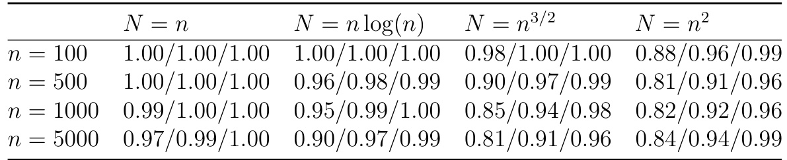  

Table 3: Monte Carlo coverage of 80%, $90\%$ , and 95% credible intervals for $\sigma$ across different choices of $N$ and $n$ , based on 100 repeated runs.   

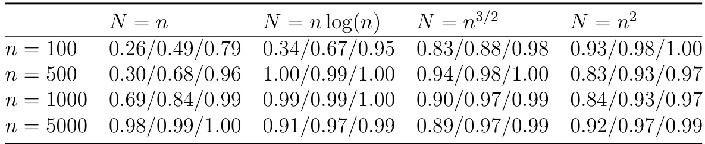  
Table 4: Monte Carlo coverage of $80\%$ ,$90\%$ , and $95\%$ credible intervals for $\xi$ across different choices of $N$ and $n$ , based on 100 repeated runs.  

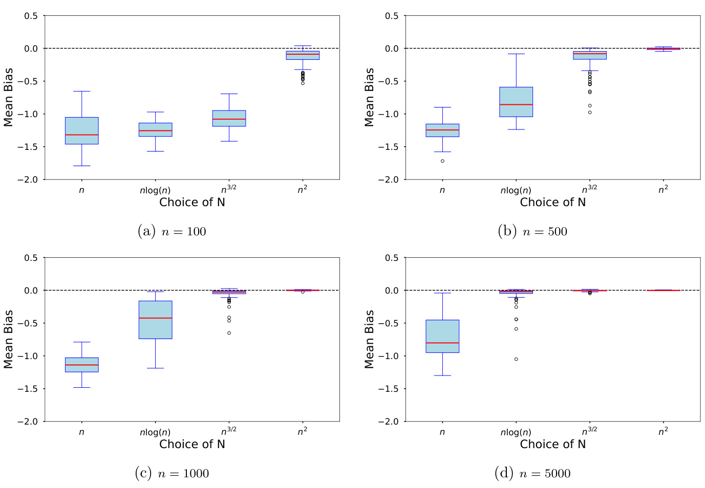  
Figure 6: Bias of the posterior mean for $\sigma$ visualized through boxplots across varying $n$ and $N$ .  

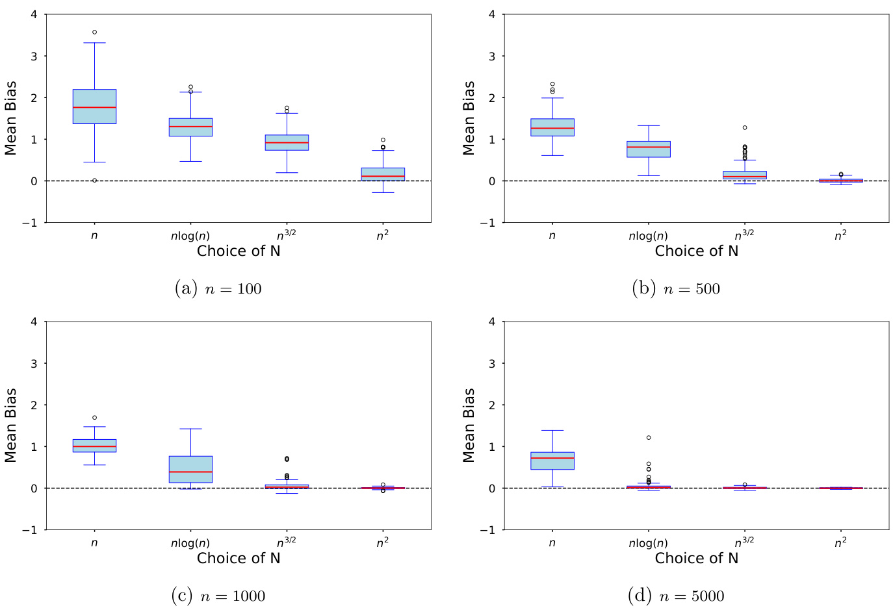  
Figure 7: Bias of the posterior mean for $\xi$ visualized through boxplots across varying $n$ and $N$ .  

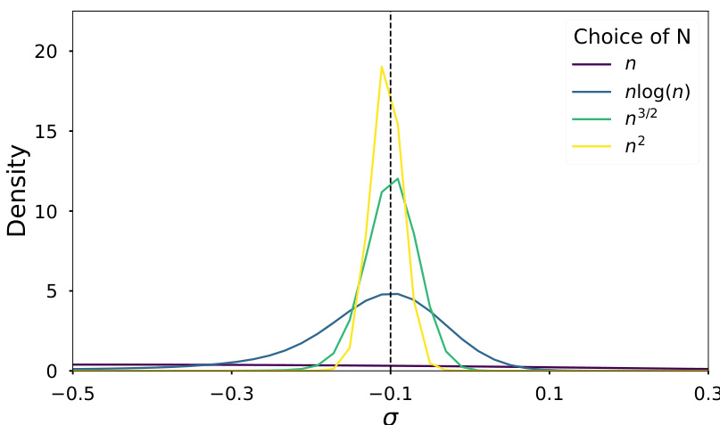  
Figure 8: Univariate posterior approximations of $\sigma$ for a single dataset generated from the stereological model with $n=1000$ observations, comparing NPE approximations using different numbers of simulations.  

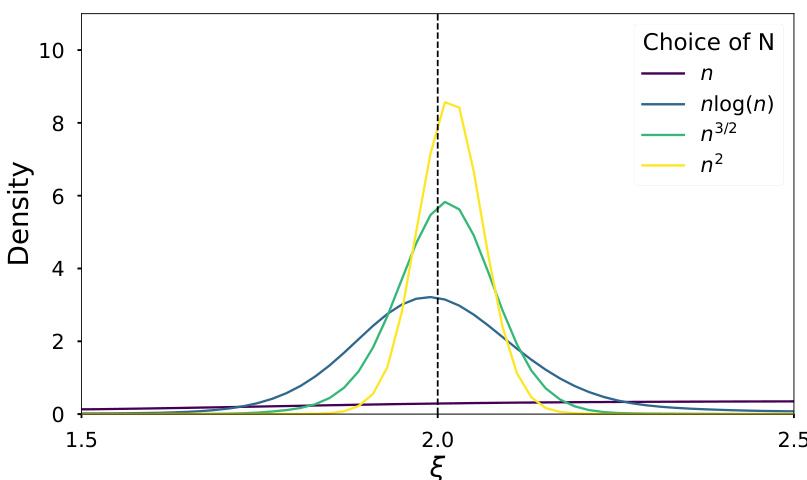  
Figure 9: Univariate posterior approximations of $\xi$ for a single dataset generated from the stereological model with $n=1000$ observations, comparing NPE approximations using different numbers of simulations.  

# CFurther Details and Results for the MA(2) example  

In Figure 3, we estimated the KLD using the estimator proposed by Perez-Cruz (2008), which computes the KLD from samples of two distributions via a $k$ -nearest neighbor density estimation method. Samples from the approximate posterior are straightforwardly obtained from our NPE posterior. For the exact posterior, we sampled from the partial posterior using tempered sequential Monte Carlo (see Chopin et al., 2020, chap. 17), which is able to handle the bi-modality present in this example when the summaries have high incompatibility. The exact partial posterior is asymptotically given as follows.  

The observed summaries—the sample autocovariances of lags 1 and 2 and the sample variance—are asymptotically normally distributed. Specifically, the means of these summaries, for a white noise variance of one, are: $S_{n}(y)\,=\,[\delta_{0}(y),\delta_{1}(y),\delta_{2}(y)]\,=\,[1\,+\,\theta_{1}^{2}\,+\,$ $\theta_{2}^{2},\theta_{1}+\theta_{1}\theta_{2},\theta_{2}]$ ]. The variance of the summaries are computed using asymptotic results for the variance of sample autocovariances (Shumway and Stoffer, 2000). The large sample covariance between the sample autocovariances at lags $k_{1}$ and $k_{2}$ :  

$$
\operatorname{Cov}(\widehat{\delta}_{k_{1}},\widehat{\delta}_{k_{2}})=\frac{1}{n}\left[\sum_{h=-q}^{q}\delta_{h}\delta_{h+k_{1}-k_{2}}+\sum_{i=-q}^{q}\delta_{k_{1}+i}\delta_{k_{2}-i}\right],
$$  

where we set $q=2$ is the order of the MA(2) model, and $\delta_{h}=0$ for $h\notin\{0,1,2\}$ .  

# DFurther Details and Results for the g-and-k Example  

Tables 5, 6, and 7 present the Monte Carlo coverage of the 80%, 90%, and 95% credible intervals for the parameters $A$ ,$B$ , and $k$ , respectively, across different choices of $N$ and  

sample sizes $n$ , based on 100 repeated runs.  

To evaluate the performance of the posterior approximation, we estimate the KLD between samples drawn from the exact partial posterior and the NPE posterior approximation. Since the summary statistics used are order statistics, which are asymptotically normal (see Van der Vaart, 2000, chap. 21), we assume normality and conduct sampling using MCMC. The mean vector of the multivariate normal distribution is obtained by evaluating the g-and-k quantile function at the chosen quantile levels. The covariance matrix entries are given by the asymptotic variances and covariances of the order statistics, calculated using:  

$$
\operatorname{Var}(X_{(i)})={\frac{p_{i}(1-p_{i})}{n[f(Q(p_{i}))]^{2}}},
$$  

and for $i\neq j$ :  

$$
\operatorname{Cov}(X_{(i)},X_{(j)})=\frac{\operatorname*{min}(p_{i},p_{j})-p_{i}p_{j}}{n\,f(Q(p_{i}))f(Q(p_{j}))},
$$  

where $f(Q(p_{i}))$ is the density of the g-and-k distribution evaluated at the quantile $Q(p_{i})$ ,and $n$ is the sample size.  

To compute the KLD, we again employ the Perez-Cruz (2008) sample-based estimator between samples from the NPE approximation $\hat{\mathcal{Q}}(\cdot\mid S_{n})$ and the exact posterior, $\Pi(\cdot\mid S_{n})$ .Table 8 reports the estimated KLD values, illustrating that the divergence tends to decrease as both $n$ and $N$ increase, indicating improved posterior approximation accuracy with larger sample sizes and more simulations.  

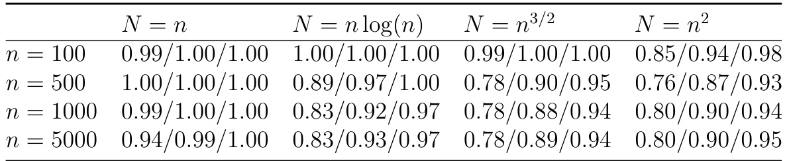  
Table 5: Monte Carlo coverage of $80\%$ ,$90\%$ , and $95\%$ credible intervals for $A$ across different choices of $N$ and $n$ , based on 100 repeated runs.  

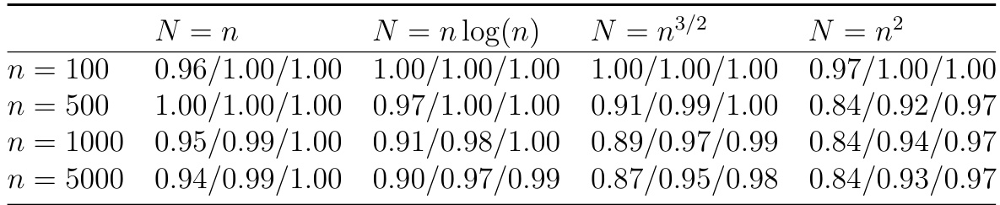  
Table 6: Monte Carlo coverage of $80\%$ ,$90\%$ , and $95\%$ credible intervals for $B$ across different choices of $N$ and $n$ , based on 100 repeated runs.  

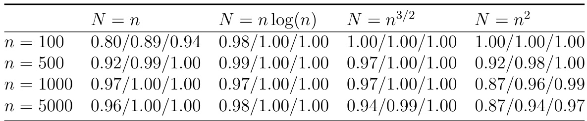  

Table 7: Monte Carlo coverage of $80\%$ ,$90\%$ , and $95\%$ credible intervals for $k$ across different choices of $N$ and $n$ , based on 100 repeated runs.   

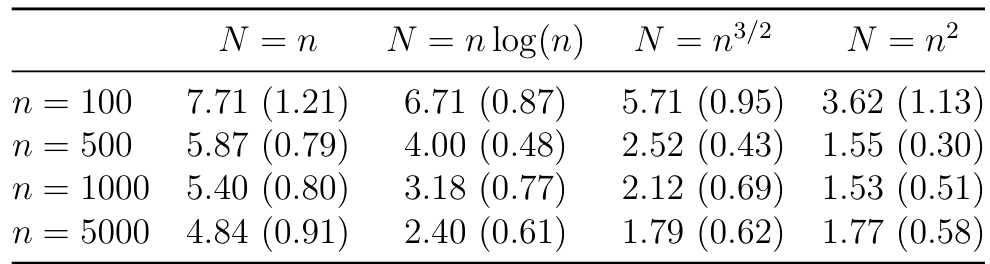  

Table 8: Estimated KL divergence between $\Pi(\cdot\ |\ \ S_{n})$ and $\hat{\mathcal{Q}}(\cdot\mid S_{n})$ for the g-and-k example. The table shows the mean of the estimated KL across repeated runs and its standard deviation in parentheses.  

# EProofs of Technical Results  

# E.1 Lemmas  

In this section, we give several lemmas that are used to help prove the main results. The following result bounds the expectation of the NPE.  

Lemma 2. For $\widehat{Q}_{N}(\cdot\mid S_{n})$ defined in (1) ,  

$$
\begin{array}{r l}&{\mathbb{E}_{0}^{(N,n)}\widehat{Q}_{N}\left[L\{b_{n}(\theta),b_{0}\}>M_{n}(\epsilon_{n}+\gamma_{N})\mid S_{n}\right]}\\ &{\ \leq\Big[\mathbb{E}_{0}^{(N,n)}\mathrm{KLD}\{\Pi(\cdot\mid b_{0}),\widehat{Q}_{N}(\cdot\mid b_{0})\}\Big]^{1/2}+\sqrt{\operatorname{tr}\!\mathbb{E}_{0}^{(n)}\{(S_{n}-b_{0})(S_{n}-b_{0})^{\top}\}}}\\ &{\ +\,\mathbb{E}_{0}^{(n)}\Pi[L\{b_{n}(\theta),b_{0}\}>M_{n}(\epsilon_{n}+\gamma_{N})\vert S_{n}].}\end{array}
$$  

Proof. Write  

$$
\begin{array}{r l}&{\widehat{Q}_{N}\left[L\{b_{n}(\theta),b_{0}\}>M_{n}(\epsilon_{n}+\gamma_{N})\mid S_{n}\right]}\\ &{=\Pi[L\{b_{n}(\theta),b_{0}\}>M_{n}(\epsilon_{n}+\gamma_{N})|S_{n}]}\\ &{+\widehat{Q}_{N}\left[L\{b_{n}(\theta),b_{0}\}>M_{n}(\epsilon_{n}+\gamma_{N})\mid S_{n}\right]-\Pi[L\{b_{n}(\theta),b_{0}\}>\epsilon_{n}|S_{n}],}\end{array}
$$  

so that  

$$
\begin{array}{r l}&{\phantom{\leq}\widehat{Q}_{N}\left[L\{b_{n}(\theta),b_{0}\}>M_{n}(\epsilon_{n}+\gamma_{N})\mid S_{n}\right]}\\ &{\leq\!\!\mathrm{d}_{\mathrm{TV}}\{\Pi(\cdot\mid S_{n}),\widehat{Q}_{N}(\cdot\mid S_{n})\}+\Pi[L\{b_{n}(\theta),b_{0}\}>M_{n}(\epsilon_{n}+\gamma_{N})\vert S_{n}].}\end{array}
$$  

$$
\begin{array}{r l}{\boldsymbol{\mathrm{l}}_{\mathrm{TV}}\{\Pi(\cdot\mid S_{n}),\widehat Q_{N}(\cdot\mid S_{n})\}\le\mathrm{d}_{\mathrm{TV}}\{\Pi(\cdot\mid S_{n}),\Pi(\cdot\mid b_{0})\}+\mathrm{d}_{\mathrm{TV}}\{\widehat Q_{N}(\cdot\mid S_{n}),\widehat Q_{N}(\cdot\mid b_{0})\}}&{{}}\\ {+\mathrm{d}_{\mathrm{TV}}\{\Pi(\cdot\mid b_{0}),\widehat Q_{N}(\cdot\mid b_{0})\}}&{{}}\\ {\le2C\|S_{n}-b_{0}\|+\mathrm{d}_{\mathrm{TV}}\{\Pi(\cdot\mid b_{0}),\widehat Q_{N}(\cdot\mid b_{0})\}}&{{}}\\ {\le2C\|S_{n}-b_{0}\|+\sqrt{\mathrm{KLD}\{\Pi(\cdot\mid b_{0})\}\|\widehat Q_{N}(\cdot\mid b_{0})\}.}&{{}}\end{array}
$$  

Hence, we have the following bound for (6):  

$$
\begin{array}{r l}&{\widehat{Q}_{N}\left[L\{b_{n}(\theta),b_{0}\}>M_{n}(\epsilon_{n}+\gamma_{N})\ |\ S_{n}\right]}\\ &{\leq\sqrt{\mathrm{KLD}\{\Pi(\cdot\ |\ b_{0}),\widehat{Q}_{N}(\cdot\ |\ b_{0})\}}+2C\|S_{n}-b_{0}\|}\\ &{\ +\,\Pi[L\{b_{n}(\theta),b_{0}\}>M_{n}(\epsilon_{n}+\gamma_{N})|S_{n}].}\end{array}
$$  

Write ∥$\|x\|={\sqrt{\|x\|^{2}}}={\sqrt{\operatorname{tr}(x x^{\top})}}$ ), and apply Jensen’s inequality to both terms to obtain  

$$
\begin{array}{r l}&{\quad\mathbb{E}_{0}^{(N,n)}\widehat{Q}_{N}\left[L\{b_{n}(\theta),b_{0}\}>M_{n}(\epsilon_{n}+\gamma_{N})\ |\ S_{n}\right]}\\ &{\lesssim\!\mathbb{E}_{0}^{(N,n)}\mathrm{KLD}\{\Pi(\cdot\ |\ b_{0}),\widehat{Q}_{N}(\cdot\ |\ b_{0})\}^{1/2}+\mathbb{E}_{0}^{(n)}\|S_{n}-b_{0}\|}\\ &{\quad+\mathbb{E}_{0}^{(n)}\Pi[L\{b_{n}(\theta),b_{0}\}>M_{n}(\epsilon_{n}+\gamma_{N})|S_{n}]}\\ &{\lesssim\left[\mathbb{E}_{0}^{(N,n)}\mathrm{KLD}\{\Pi(\cdot\ |\ b_{0}),\widehat{Q}_{N}(\cdot\ |\ b_{0})\}\right]^{1/2}+\sqrt{\operatorname{tr}\mathbb{E}_{0}^{(n)}(S_{n}-b_{0})(S_{n}-b_{0})^{\top}}}\\ &{\quad+\mathbb{E}_{0}^{(n)}\Pi[L\{b_{n}(\theta),b_{0}\}>M_{n}(\epsilon_{n}+\gamma_{N})|S_{n}].}\end{array}
$$  

For a given $\epsilon_{n}\,\geq\,0$ and $\epsilon_{n}=o(1)$ , recall the definition $\Theta_{n}:=\{\theta\in\Theta:L\{b_{n}(\theta),b_{0}\}\leq$ ${M\epsilon_{n}}\}$ . For $A\subseteq\Theta$ , let $\begin{array}{r}{P(A)=\int_{A}p(\boldsymbol{\theta})\mathrm{d}\boldsymbol{\theta}}\end{array}$ R. The next result gives a posterior concentration  

result for $\Pi(\Theta_{n}^{c}\mid S_{n})$ |).  

Lemma 3. Let $\epsilon_{n}\,=\,o(1)$ be a positive sequence such that, for $\nu_{n}$ as in Assumption 1, $\nu_{n}\epsilon_{n}\rightarrow\infty$ . Under Assumptions 1-3, for any $M_{n}\to\infty$ ,$\mathbb{E}_{0}^{(n)}\Pi\left[L\{b_{n}(\theta),b_{0}\}>M_{n}\epsilon_{n}\ |\ S_{n}\right]\lesssim$ $M_{n}\epsilon_{n}$ .  

Proof of Lemma 3. Consider that  

$$
\begin{array}{r l}{\lefteqn{\colon(\Theta_{n}^{\varepsilon}\mid S_{n})\le\frac{\int_{\Theta_{n}^{\varepsilon}}g_{n}(S_{n}\mid\theta)p(\theta)\mathrm{d}\theta}{\int_{\Theta_{n}}g_{n}(S_{n}\mid\theta)p(\theta)\mathrm{d}\theta}}}\\ &{\le\frac{\int_{\Theta_{n}}g_{n}(S_{n}\mid\theta)p(\theta)\mathrm{d}\theta}{\int_{\Theta_{n}}g_{n}(S_{n}\mid\theta)p(\theta)\mathrm{d}\theta}\times1\left\{\int_{\Theta_{n}}g_{n}(S_{n}\mid\theta)p(\theta)\mathrm{d}\theta>P(\Theta_{n})c_{\epsilon_{n}}f_{0}^{(n)}(S_{n}\mid\theta)p(\theta)\mathrm{d}\theta\right.}\\ &{\quad\left.+\,1\left\{\int_{\Theta_{n}}g_{n}(S_{n}\mid\theta)p(\theta)\mathrm{d}\theta\le c_{\epsilon_{n}}P(\Theta_{n})f_{0}^{(n)}(S_{n})\right\}}\\ &{\le\frac{\int_{\Theta_{n}}g_{n}(S_{n}\mid\theta)p(\theta)\mathrm{d}\theta}{P(\Theta_{n})c_{\epsilon_{n}}f_{0}^{(n)}(S_{n})}+1\left\{\int_{\Theta_{n}}g_{n}(S_{n}\mid\theta)p(\theta)\mathrm{d}\theta\le P(\Theta_{n})c_{\epsilon_{n}}f_{0}^{(n)}(S_{n}\mid\theta)\mathrm{d}\theta\right\}}\end{array}
$$  

Recall that $f_{0}^{(n)}(S)$ ) is the true density of $S_{n}$ , and take expectations on both sides wrt $S_{n}$ to obtain  

$$
\begin{array}{r l}&{\mathbb{E}_{0}^{(n)}\Pi(\Theta_{n}^{c}\mid S_{n})\leq\displaystyle\int_{S}\frac{\int_{\Theta_{n}^{c}}g_{n}(s\mid\theta)p(\theta)\mathrm{d}\theta}{P(\Theta_{n})c_{\epsilon_{n}}f_{0}^{(n)}(s)}f_{0}^{(n)}(s)\mathrm{d}s}\\ &{\phantom{\sum_{\theta_{0}=\lfloor\pi\rfloor}^{\lfloor\pi\rfloor}}+P_{0}^{(n)}\left\{\displaystyle\int_{\Theta_{n}}g_{n}(S_{n}\mid\theta)p(\theta)\mathrm{d}\theta\leq P(\Theta_{n})c_{\epsilon_{n}}f_{0}^{(n)}(S_{n})\right\}}\\ &{\phantom{\sum_{\theta_{0}=\lfloor\pi\rfloor}^{\lfloor\pi\rfloor}}\leq\frac{1}{c_{\epsilon_{n}}P(\Theta_{n})}\displaystyle\int_{S}\int_{\Theta_{n}^{c}}g_{n}(s\mid\theta)p(\theta)\mathrm{d}\theta\mathrm{d}s+M_{n}\epsilon_{n},}\end{array}
$$  

where the second inequality follows by Lemma 4. Consider the first term on the RHS. For  

$M_{n}\to\infty$ , and $M_{n}\lesssim\nu_{n}$ , let $\mathcal{B}_{n}(\theta):=\{s\in\ensuremath{\mathcal{S}}:\|s-b(\theta)\|\leq M_{n}\}.$ ,  

$$
\begin{array}{r l}{\displaystyle\int_{\mathcal{S}}\frac{\int_{\Theta_{\varepsilon}}g_{\theta}(s)\left\langle\theta\right\rangle\partial|\phi|\partial|\phi|}{P(\Theta_{\varepsilon})\gamma_{\phi_{\varepsilon}}f_{\theta}^{(n)}(s)}\int_{\Theta_{\varepsilon}}^{\infty}(s)\mathrm{d}s\leq\frac{1}{c_{\mathrm{e},\rho}P(\Theta_{\varepsilon})}\int_{\Theta_{\varepsilon}}\int_{S_{\varepsilon}(s)}g_{n}(s)\left\langle\theta\right\rangle p(\theta)\mathrm{d}\theta\mathrm{d}s}\\ &{\quad+\frac{1}{c_{\mathrm{e},\rho}P(\Theta_{\varepsilon})}\int_{\Theta_{\varepsilon}}\int_{S_{\varepsilon}(s)}g_{n}(s\mid\theta)p(\theta)\mathrm{d}\theta\mathrm{d}s}\\ &{\leq\frac{1}{c_{\mathrm{e},\rho}P(\Theta_{\varepsilon})}\int_{\Theta_{\varepsilon}}G_{n}\{S_{\varepsilon}(\theta)^{c}\mid\theta\}p(\theta)\mathrm{d}\theta}\\ &{\quad+\frac{1}{c_{\mathrm{e},\rho}P(\Theta_{\varepsilon})}\int_{\Theta_{\varepsilon}}\int_{S_{\varepsilon}(\theta)}g_{n}(s\mid\theta)p(\theta)\mathrm{d}\theta\mathrm{d}s}\\ &{\leq\frac{1}{c_{\mathrm{e},\rho}P(\Theta_{\varepsilon})}\int_{\Theta_{\varepsilon}}G_{n}\{S_{\varepsilon}(\theta)^{c}\mid\theta\}p(\theta)\mathrm{d}\theta}\\ &{\quad+\frac{1}{c_{\mathrm{e},\rho}P(\Theta_{\varepsilon})}\int_{\Theta_{\varepsilon}}\int_{S_{\varepsilon}}g_{n}(s\mid\theta)p(\theta)\mathrm{d}\theta\mathrm{d}s.}\end{array}
$$  

The last term in equation (7) can be rewritten as  

$$
\frac{1}{c_{\epsilon_{n}}P(\Theta_{n})}\int_{\Theta_{n}^{c}}\int_{\cal S}g_{n}({\cal S}\mid\theta)p(\theta)\mathrm{d}\theta\mathrm{d}{\cal S}=\frac{1}{c_{\epsilon_{n}}}\frac{P(\Theta_{n}^{c})}{P(\Theta_{n})}.
$$  

Under Assumption 2, the first term in equation (7) can be upper bounded as  

$$
\begin{array}{r}{\frac{1}{c_{\epsilon_{n}}P(\Theta_{n})}\displaystyle\int_{\Theta_{n}^{c}}G_{n}\{\mathcal{B}_{n}(\theta)^{c}\mid\theta\}p(\theta)\mathrm{d}\theta\leq\!\!\frac{1}{c_{\epsilon_{n}}P(\Theta_{n})}\displaystyle\int_{\Theta}G_{n}\{\mathcal{B}_{n}(\theta)^{c}\mid\theta\}p(\theta)\mathrm{d}\theta}\\ {\leq\!\!\frac{1}{c_{\epsilon_{n}}P(\Theta_{n})}\frac{1}{(\nu_{n}M_{n})^{\alpha}}\displaystyle\int_{\Theta}C(\theta)p(\theta)\mathrm{d}\theta.}\end{array}
$$  

Applying equations (8) and (9) into (7) yields the upper bound  

$$
\mathbb{E}_{0}^{(n)}\Pi(\Theta_{n}^{c}\mid S_{n})\mathrm{d}\theta\lesssim\frac{1}{c_{\epsilon_{n}}P(\Theta_{n})}\frac{1}{(\nu_{n}M_{n})^{\alpha}}+\frac{1}{c_{\epsilon_{n}}}\frac{P(\Theta_{n}^{c})}{P(\Theta_{n})}.
$$  

Apply Assumption 4, and the fact that $\epsilon_{n}\gtrsim1/\nu_{n}$ to obtain  

$$
\begin{array}{r l}&{\mathbb{E}_{0}^{(n)}\Pi(\Theta_{n}^{c}\mid S_{n})\mathrm{d}\theta\lesssim\frac{1}{c_{\epsilon_{n}}M_{n}^{d}\epsilon_{n}^{d}}\frac{1}{(\nu_{n}M_{n})^{\alpha}}+\frac{M_{n}^{\tau-d}\epsilon_{n}^{\tau-d}}{c_{\epsilon_{n}}}}\\ &{\qquad\qquad\lesssim\frac{1}{c_{\epsilon_{n}}}\frac{\nu_{n}^{d}}{M_{n}^{d}}\frac{1}{M_{n}^{\alpha}\nu_{n}^{\alpha}}+\frac{M_{n}^{\tau-d}\epsilon_{n}^{\tau-d}}{c_{\epsilon_{n}}}}\\ &{\qquad\qquad\lesssim\frac{1}{c_{\epsilon_{n}}}(M_{n}\epsilon_{n})^{(\tau-d)\wedge(\alpha-d)},}\end{array}
$$  

where the second line uses the fact that $\epsilon_{n}\gtrsim1/\nu_{n}$ and the last line uses the fact that, by Assumptions 1, $\alpha\geq d+1$ and by Assumption 4, $\tau\geq d+1$ . It follows that  

$$
\mathbb{E}_{0}^{(n)}\Pi(\Theta_{n}^{c}\mid S_{n})\lesssim(\epsilon_{n}/M_{n})^{(\tau-d)\wedge(\alpha-d)}\leq\epsilon_{n}M_{n}.
$$  

This following result gives an in-probability bound for the denominator of $\Pi(\cdot\mid S_{n})$ .  

Lemma 4. Let $M_{n}>0$ ,$M_{n}\to\infty$ be such that $\epsilon_{n}=M_{n}/\nu_{n}=o(1)$ , and recall $\Theta_{n}=\{\theta\in$ $\Theta:L\{b(\theta),b_{0}\}\leq M_{n}\epsilon_{n}\}$ . Under Assumption 3,  

$$
P_{0}^{(n)}\left\{\int_{\Theta_{n}}g_{n}(S_{n}\mid\theta)p(\theta)\mathrm{d}\theta\le c_{\epsilon_{n}}f_{0}^{(n)}(S_{n})P(\Theta_{n})\right\}\le\epsilon_{n}.
$$  

Proof of Lemma 4. For any $\epsilon>0$ let $c_{\epsilon}>0$ , be as defined in Assumption 3. For all $S_{n}\in{\mathcal{E}}_{n}$ ,and for all $\theta\in\Theta_{n}$ , by Assumption 3,  

$$
P_{0}^{(n)}\left\{S_{n}\in\mathcal{E}_{n}:g_{n}(S_{n}\mid\theta)\geq c_{\epsilon}f_{0}^{(n)}(S_{n})\right\}\geq1-\epsilon.
$$  

Hence, for any $\epsilon>0$ ,  

$$
P_{0}^{(n)}\left\{S_{n}\in\mathcal{E}_{n}:\int_{\Theta_{n}}g_{n}(S_{n}\mid\theta)p(\theta)\mathrm{d}\theta\ge c_{\epsilon}f_{0}^{(n)}(S_{n})\int_{\Theta_{n}}p(\theta)\mathrm{d}\theta\right\}\ge1-\epsilon.
$$  

Since $\epsilon_{n}$ is arbitrary, and $c_{\epsilon}>0$ exists for all $\epsilon>\,0$ , take $\epsilon=\epsilon_{n}=M_{n}/\nu_{n}$ , and take the complement of the event in equation (10) to see that  

$$
P_{0}^{(n)}\left\{S_{n}\in\mathcal{E}_{n}:\int_{\Theta_{n}}g_{n}(S_{n}\mid\theta)p(\theta)\mathrm{d}\theta\le c_{\epsilon}f_{0}^{(n)}(S_{n})\int_{\Theta_{n}}p(\theta)\mathrm{d}\theta\right\}\le\epsilon_{n}.
$$  

The following result is used in deriving the rate of posterior concentration for the NLE, and is similar to Lemma 4.  

Lemma 5. Under the conditions in Theorem 3, for any $M_{n}\to\infty$ such that $\epsilon_{n}M_{n}\to0$ ,  

$$
P_{0}^{(n)}\left\{\int_{\Theta_{n}}\widehat{q}_{N}(S_{n}\mid\theta)p(\theta)\mathrm{d}\theta\leq c_{\epsilon_{n}}f_{0}^{(n)}(S_{n})P(\Theta_{n})(1-\epsilon_{n})\right\}\leq\epsilon_{n}.
$$  

Proof of Lemma 5. Fix an event $S_{n}\in{\mathcal{E}}_{n}$ , and bound $\begin{array}{r}{\int_{\Theta_{n}}\widehat{q}_{N}(S_{n}\mid\theta)p(\theta)\mathrm{d}\theta}\end{array}$ as  

$$
\begin{array}{r l r}&{}&{\underset{\rtimes}{\widehat{q}}_{N}(S_{n}\mid\theta)p(\theta)\mathrm{d}\theta\ge\int_{\Theta_{n}}g_{n}(S_{n}\mid\theta)p(\theta)\mathrm{d}\theta-\int_{\Theta}|g_{n}(S_{n}\mid\theta)-\widehat{q}_{N}(S_{n}\mid\theta)|p(\theta)\mathrm{d}\theta}\\ &{}&{\ge\int_{\Theta_{n}}g_{n}(S_{n}\mid\theta)p(\theta)\mathrm{d}\theta-\sqrt{\mathrm{KLD}\{g_{n}(S_{n}\mid\theta)p(\theta)\}\|\widehat{q}_{N}(S_{n}\mid\theta)p\}}\end{array}
$$  

From the choice of $N$ in Theorem 3, $\gamma_{N}~\lesssim~\epsilon_{n}$ .With probability at least $1\,-\,\epsilon_{n}$ , by Assumption 8,  

$$
\int_{\Theta_{n}}\widehat{q}_{N}(S_{n}\mid\theta)p(\theta)\mathrm{d}\theta\ge\int_{\Theta_{n}}g_{n}(S_{n}\mid\theta)p(\theta)\mathrm{d}\theta-\epsilon_{n}.
$$  

Following the arguments in equation (10) of Lemma 4, it follows that with probability at least $1-\epsilon_{n}$ , for $n$ large enough,  

$$
\int_{\Theta_{n}}\widehat{q}_{N}(S_{n}\mid\theta)p(\theta)\mathrm{d}\theta\ge\int_{\Theta_{n}}g_{n}(S_{n}\mid\theta)p(\theta)\mathrm{d}\theta-\epsilon_{n}\ge P(\Theta_{n})f_{0}^{(n)}(S_{n})(1-\epsilon_{n}).
$$  

Taking the probability of the compliment of the above event yields the stated result.  

# E.2 Proofs of Main results  

Proof of Theorem 1. For $\epsilon_{n}=o(1)$ positive and such that $\nu_{n}\epsilon_{n}\rightarrow\infty$ . By Lemma 2, for some $M_{n}>0$ ,  

$$
\begin{array}{r l}&{{\mathbb E}_{0}^{(N,n)}\widehat Q_{N}[L\{b(\theta),b_{0}\}>M_{n}(\epsilon_{n}+\gamma_{N})\mid S_{n}]\leq\sqrt{{\mathbb E}_{0}^{(N,n)}\mathrm{KLD}\{\Pi(\cdot\mid b_{0}),\widehat Q_{N}(\cdot\mid b_{0})\}}}\\ &{\phantom{=\;\;}+\sqrt{\mathrm{tr}{\mathbb E}_{0}^{(n)}\{(S_{n}-b_{0})(S_{n}-b_{0})^{\top}\}}}\\ &{\phantom{=\;\;}+{\mathbb E}_{0}^{(n)}\Pi[L\{b_{n}(\theta),b_{0}\}>M_{n}(\epsilon_{n}+\gamma_{N})\vert}\end{array}
$$  

From Lemma 3,  

$$
\mathbb{E}_{0}^{(n)}\Pi[L\{b(\theta),b_{0}\}>M_{n}(\epsilon_{n}+\gamma_{N})|S_{n}]\le M_{n}(\epsilon_{n}+\gamma_{N}),
$$  

while by Assumption 5  

$$
\mathbb{E}_{0}^{(N,n)}\mathrm{KLD}\{\Pi(\cdot\mid b_{0}),\widehat{Q}_{N}(\cdot\mid b_{0})\}\le\gamma_{N}^{2}.
$$  

By Assumption 1,  

$$
\mathrm{tr}[\mathbb{E}_{0}^{(n)}\{(S_{n}-b_{0})(S_{n}-b_{0})^{\top}\}]\le d_{s}\cdot\lambda_{\mathrm{max}}(V)/\nu_{n}^{2}.
$$  

Applying equations (12)-(14) into equation (11), for $M_{n}>0$ large enough,  

$$
\begin{array}{r l}&{\mathbb{E}_{0}^{(N,n)}\widehat{Q}_{N}[L\{b(\theta),b_{0}\}>M_{n}(\epsilon_{n}+\gamma_{N})\mid S_{n}]\leq M_{n}\epsilon_{n}+M_{n}\gamma_{N}+d\cdot\lambda_{\operatorname*{max}}(V)/\nu_{n}}\\ &{\qquad\qquad\qquad\qquad\qquad\qquad\quad\lesssim M_{n}(\epsilon_{n}+\gamma_{N}).}\end{array}
$$  

The proofs of Theorem 1 and Lemma 3 suggest that Theorem 1 will remain true if we replace Assumption 5 with the following alternative assumption.  

Assumption 9. For some $\gamma_{N}=o(1)$ ,$\begin{array}{r}{\mathbb{E}_{0}^{(N,n)}\mathrm{d}_{\mathrm{H}}\{\Pi(\cdot\mid b_{0}),\widehat{Q}_{N}(\cdot\mid b_{0})\}\le\gamma_{N}.}\end{array}$ {· | ≤.  

Corollary 2. Let $\epsilon_{n}=o(1)$ be a positive sequence such that $\nu_{n}\epsilon_{n}\rightarrow\infty$ →∞ . Under Assumptions 1-4, 6, and Assumption $\boldsymbol{\mathscr{g}}$ , for any positive sequence $M_{n}\to\infty$ ,  

$$
\mathbb{E}_{0}^{(N,n)}\widehat{Q}_{N}\left[L\{b_{n}(\theta),b_{0}\}>M_{n}(\epsilon_{n}+\gamma_{N})\mid S_{n}\right]=o(1).
$$  

for any loss function such that $:L:S\times S\to\mathbb{R}_{+}$ .  

Proof of Corollary 2. From the proof of Lemma 3, we have the upper bound  

$$
\begin{array}{r l}&{\widehat{Q}_{N}\left[L\{b_{n}(\theta),b_{0}\}>M_{n}(\epsilon_{n}+\gamma_{N})\mid S_{n}\right]\leq\mathrm{d}_{\mathrm{TV}}\{\Pi(\cdot\mid S_{n}),\widehat{Q}_{N}(\cdot\mid S_{n})\}}\\ &{\~~~~~~~~~~~~~~~~~~~~~~~~~~~~~~~~~~~~~~~~~~~~~~~~~~~~~~~~~~~~~~~~~~~~~}\\ &{~~~~~~~~~~~~~~~~~~~~~~~~~~~~~~~~~~~~~~~~~~~~~~~~~~~~~~~~~~~~~~~~~~~+\Pi[L\{b_{n}(\theta),b_{0}\}>M_{n}(\epsilon_{n}+\gamma_{N})|S_{n}].}\end{array}
$$  

$$
\begin{array}{r l}&{\mathrm{d}_{\mathrm{TV}}\{\Pi(\cdot\mid S_{n}),\widehat Q_{N}\}\leq\mathrm{d}_{\mathrm{TV}}\{\Pi(\cdot\mid S_{n}),\Pi(\cdot\mid b_{0})\}+\mathrm{d}_{\mathrm{TV}}\{\widehat Q_{N}(\cdot\mid S_{n}),\widehat Q_{N}(\cdot\mid b_{0})\}}\\ &{\ \ \ \ \ \ \ \ \ \ \ \ \ \ \ \ \ +\mathrm{d}_{\mathrm{TV}}\{\Pi(\cdot\mid b_{0}),\widehat Q_{N}(\cdot\mid b_{0})\}}\\ &{\ \ \ \ \ \ \ \ \ \ \ \ \ \ \ \ \ \ \ \ \ \ \ \ \ \ \ \ \ \ \ \ \ \ \ \ \ \ \ \ \ \ \ \ \ \ \ \ \ \ \ \ \ \ \le2C\Vert S_{n}-b_{0}\Vert+\mathrm{d}_{\mathrm{TV}}\{\Pi(\cdot\mid b_{0}),\widehat Q_{N}(\cdot\mid b_{0})\},}\end{array}
$$  

where the second inequality uses Assumption 6. Hence,  

$$
\begin{array}{r l r}&{}&{\widehat{Q}_{N}\left[L\{b_{n}(\theta),b_{0}\}>M_{n}(\epsilon_{n}+\gamma_{N})\mid S_{n}\right]\leq=>\!O(|S_{n}-b_{0}||+\mathrm{d}_{\mathrm{TV}}\{\Pi(\cdot\mid b_{0}),\widehat{Q}_{N}(\cdot\mid b_{0})\}}\\ &{}&{\quad\quad\quad\quad\quad\quad\quad\quad\quad\quad\quad\quad\quad\quad\quad\quad+\Pi[L\{b_{n}(\theta),b_{0}\}>M_{n}(\epsilon_{n}+\gamma_{N})|S_{n}].}\end{array}
$$  

Applying Lemma 1 to ${\mathrm{d}}_{\mathrm{TV}}\{\Pi(\cdot\mid b_{0}),\widehat{Q}_{N}(\cdot\mid b_{0})\}$ yields  

$$
\begin{array}{r l r}&{}&{\widehat{Q}_{N}\left[L\{b_{n}(\theta),b_{0}\}>M_{n}(\epsilon_{n}+\gamma_{N})\mid S_{n}\right]\leq=>\!O(|S_{n}-b_{0}||+2\mathrm{d}_{\mathrm{H}}\{\Pi(\cdot\mid b_{0}),\widehat{Q}_{N}(\cdot\mid b_{0})\})}\\ &{}&{\quad\quad\quad\quad\quad\quad\quad\quad\quad\quad\quad\quad\quad\quad\quad\quad\quad\quad\quad+\Pi[L\{b_{n}(\theta),b_{0}\}>M_{n}(\epsilon_{n}+\gamma_{N})|S_{n}].}\end{array}
$$  

The remainder of the proof follows that of Theorem 1.  

Proof of Theorem 2. By the triangle inequality,  

$$
t\mid S_{n})-N\{t;0,\Sigma^{-1}\}|\mathrm{d}t\leq\int|\pi(t\mid S_{n})-N\{t;0,\Sigma^{-1}\}|\mathrm{d}t+\int|\widehat{q}_{N}(t\mid S_{n})-\pi(t
$$  

The first term is $o_{p}(1)$ under the stated assumptions of the result. Recall that $\mathrm{d}_{\mathrm{TV}}(\cdot,\cdot)$ is invariant to scale and location transformations. Using this fact and the triangle inequality  

we obtain  

$$
\begin{array}{r l}&{\Big(\left|\widehat{q}_{N}(t\mid S_{n})-\pi(t\mid S_{n})\right|\!\mathrm{d}t=\mathrm{d}_{\mathrm{TV}}\{\Pi(\cdot\mid S_{n}),\widehat{Q}_{N}(\cdot\mid S_{n})\}}\\ &{\qquad\qquad\qquad\qquad\leq\mathrm{d}_{\mathrm{TV}}\{\Pi(\cdot\mid S_{n}),\Pi(\cdot\mid b_{0})\}+\mathrm{d}_{\mathrm{TV}}\{\widehat{Q}_{N}(\cdot\mid S_{n}),\widehat{Q}_{N}(\cdot\mid b_{0})\}+}\\ &{\qquad\qquad\qquad\qquad+\operatorname{d}_{\mathrm{TV}}\{\Pi(\cdot\mid b_{0}),\widehat{Q}_{N}(\cdot\mid b_{0})\}.}\end{array}
$$  

Apply Assumption 6 twice, and Lemma 1 to obtain  

$$
\begin{array}{r l}&{\mathrm{d}_{\mathrm{TV}}\{\Pi(\cdot\mid S_{n}),\widehat{Q}_{N}\}\le2C\|S_{n}-b_{0}\|+\mathrm{d}_{\mathrm{TV}}\{\Pi(\cdot\mid b_{0}),\widehat{Q}_{N}(\cdot\mid b_{0})\}}\\ &{\qquad\qquad\qquad\qquad\le2C\|S_{n}-b_{0}\|+\sqrt{\mathrm{KLD}\{\Pi(\cdot\mid b_{0})\|\widehat{Q}_{N}(\cdot\mid b_{0})\}}.}\end{array}
$$  

Fix $\epsilon>0$ . By Assumption 1, Assumption 5, and Markov’s inequality, we obtain  

$$
\begin{array}{r l}&{P_{0}^{(n)}\left\{\mathrm{d}_{\mathrm{TV}}\{\Pi(\cdot\mid S_{n}),\widehat Q_{N}\}\ge\epsilon\right\}\le\displaystyle\frac{4\mathbb{E}_{0}^{(n)}C\|S_{n}-b_{0}\|}{\epsilon}+\displaystyle\frac{\sqrt{\mathbb{E}_{p}^{(N)}\mathrm{KLD}\{\Pi(\cdot\mid b_{0})\|\widehat Q_{N}\|}}}{\epsilon}}\\ &{\qquad\qquad\qquad\qquad\lesssim\displaystyle\frac{1}{\nu_{n}}\frac{1}{\epsilon}+\frac{\gamma_{N}}{\epsilon}}\\ &{\qquad\qquad\qquad\qquad\le\displaystyle\frac{2}{\nu_{n}\epsilon},}\end{array}
$$  

where the last line follows since, by the assumptions of the result, $\gamma_{N}\lesssim\nu_{n}^{-1}$ so that $\gamma_{N}\lesssim\epsilon_{n}$ .  
Hence, the result follows for any $\epsilon\geq\epsilon_{n}$ such that $\epsilon\nu_{n}\rightarrow\infty$ .  

Proof of Theorem 3. The proof follows a similar argument to Lemma 3. In particular, we  

start from the upper bound  

$$
\begin{array}{r l}{\underset{n}{\overset{c}{\geq}}\mid S_{n})\leq\frac{\int_{\Theta_{n}^{\varepsilon}}\widehat{q}_{N}(S_{n}\mid\theta)p(\theta)\mathrm{d}\theta}{\int_{\Theta_{n}}\widehat{q}_{N}(S_{n}\mid\theta)p(\theta)\mathrm{d}\theta}}\\ &{\leq\frac{\int_{\Theta_{n}}\widehat{q}_{N}(S_{n}\mid\theta)p(\theta)\mathrm{d}\theta}{\int_{\Theta_{n}}\widehat{q}_{N}(S_{n}\mid\theta)p(\theta)\mathrm{d}\theta}\times1\left\{\int_{\Theta_{n}}\widehat{q}_{N}(S_{n}\mid\theta)p(\theta)\mathrm{d}\theta>P(\Theta_{n})c_{\epsilon_{n}}f_{0}^{(n)}(S_{n})(\theta)\mathrm{d}\theta\right\}}\\ &{+\,1\left\{\int_{\Theta_{n}}\widehat{q}_{N}(S_{n}\mid\theta)p(\theta)\mathrm{d}\theta\leq c_{\epsilon_{n}}P(\Theta_{n})f_{0}^{(n)}(S_{n})(1-\epsilon_{n})\right\}}\\ &{\leq\frac{\int_{\Theta_{n}}\widehat{q}_{N}(S_{n}\mid\theta)p(\theta)\mathrm{d}\theta}{P(\Theta_{n})c_{\epsilon_{n}}f_{0}^{(n)}(S_{n})(1-\epsilon_{n})}+1\left\{\int_{\Theta_{n}}\widehat{q}_{N}(S_{n}\mid\theta)p(\theta)\mathrm{d}\theta\leq P(\Theta_{n})c_{\epsilon_{n}}f_{0}^{(n)}(S_{n})(1-\epsilon_{n})\right\}}\end{array}
$$  

Consider the first term. Recall that $f_{0}^{(n)}(S)$ ) is the true density of $S_{n}$ , and take expectations on both sides to obtain  

$$
\begin{array}{r l}&{\mathbb{E}_{0}^{(n)}\widehat{\Pi}(\Theta_{n}^{c}\mid S_{n})\leq\displaystyle\int_{S}\frac{\int_{\Theta_{n}^{c}}\widehat{q}_{N}(s\mid\theta)p(\theta)\mathrm{d}\theta}{P(\Theta_{n})c_{\epsilon_{n}}f_{0}^{(n)}(s)(1-\epsilon_{n})}f_{0}^{(n)}(s)\mathrm{d}s}\\ &{\phantom{\sum_{=0}^{\lfloor\theta\rfloor}}+P_{0}^{(n)}\left\{\displaystyle\int_{\Theta_{n}}\widehat{q}_{N}(S_{n}\mid\theta)p(\theta)\mathrm{d}\theta\leq P(\Theta_{n})c_{\epsilon_{n}}f_{0}^{(n)}(S_{n})(1-\epsilon_{n})\right\}.}\end{array}
$$  

Analyzing the first term we see that, under Assumption 4,  

$$
\begin{array}{r l r}{\lefteqn{\int_{\mathcal{S}}\frac{\int_{\Theta_{n}^{c}}\widehat{q}_{N}(s\mid\theta)p(\theta)\mathrm{d}\theta}{P(\Theta_{n})c_{\epsilon_{n}}f_{0}^{(n)}(s)(1-\epsilon_{n})}f_{0}^{(n)}(s)\mathrm{d}s=\frac{1}{c_{\epsilon_{n}}(1-\epsilon_{n})}\frac{P(\Theta_{n})}{P(\Theta_{n}^{c})}}}\\ &{}&{\quad\quad\quad\quad\quad\quad\quad\quad\quad\quad\quad\quad\times M_{n}^{(\tau-d)}\epsilon_{n}^{(\tau-d)}}\\ &{}&{\quad\quad\quad\quad\quad\quad\quad\quad\quad\lesssim M_{n}\epsilon_{n}.}\end{array}
$$  

Applying Lemma 5 to the second term then yields the stated result.  

Proof of Theorem 4. By the triangle inequality,  

$$
\mathrm{:}_{N}(t\mid S_{n})-N\{t;0,\Sigma^{-1}\}|\mathrm{d}t\leq\int|\pi(t\mid S_{n})-N\{t;0,\Sigma^{-1}\}|\mathrm{d}t+\int|\widehat{\pi}_{N}(t\mid S_{n})-\widetilde{\Sigma}|\,d\hat{\pi}_{N}(t).
$$  

Let $\begin{array}{r}{Z_{n,t}=\int_{\Theta}g_{n}(S_{n}\mid\theta_{n}+t/\nu_{n})\pi(\theta_{n}+t/\nu_{n})\mathrm{d}t}\end{array}$ R. To see that the first term is $o_{p}(1)$ , note that the maintained assumption in the result implies that  

$$
Z_{n,t}=(2\pi)^{d_{\theta}/2}p(\theta_{n})|\Sigma|^{-1/2}+o_{p}(1).
$$  

Hence, writing  

$$
t\mid S_{n})-N\{t;0,\Sigma^{-1}\}|\mathrm{d}t=\int\left|\frac{g_{n}(S_{n}\mid\theta_{n}+t/\nu_{n})p(\theta_{n}+t/\nu_{n})}{Z_{n,t}}-\frac{\exp\{-t^{\top}\Sigma t\}}{(2\pi)^{d/2}|\Sigma|^{-1/2}}\right|
$$  

since $Z_{n,t}=(2\pi)^{d_{\theta}/2}p(\theta_{n})|\Sigma|^{-1/2}+o_{p}(1)$ . The first term is then $o_{p}(1)$ if  

$$
\int\left|g_{n}(S_{n}\mid\theta_{n}+t/\nu_{n})\frac{p(\theta_{n}+t/\nu_{n})}{p(\theta_{n})}-\exp(-t^{\top}\Sigma t/2)\right|\mathrm{d}t=o_{p}(1),
$$  

which is precisely the maintained condition in the stated result.  

Now, focus on the second term and write  

$$
\begin{array}{r l}&{\widehat{\pi}_{N}(\theta_{n}+t/\nu_{n}\mid S_{n})-\pi(\theta_{n}+t/\nu_{n}\mid S_{n})}\\ &{\ =\frac{\widehat{q}_{N}(S_{n}\mid\theta_{n}+t/\nu_{n})p(\theta_{n}+t/\nu_{n})}{\int_{\Theta}\widehat{q}_{N}(S_{n}\mid\theta_{n}+t/\nu_{n})p(\theta_{n}+t/\nu_{n})\mathrm{d}t}-\frac{g_{n}(S_{n}\mid\theta_{n}+t/\nu_{n})p(\theta_{n}+t/\nu_{n})}{\int_{\Theta}g_{n}(S_{n}\mid\theta_{n}+t/\nu_{n})p(\theta_{n}+t/\nu_{n})\mathrm{d}t}}\\ &{\ =\frac{\left\{\widehat{q}_{N}(S_{n}\mid\theta_{n}+t/\nu_{n})-g_{n}(S_{n}\mid\theta_{n}+t/\nu_{n})\right\}p(\theta_{n}+t/\nu_{n})}{Z_{N,t}}}\\ &{\ -\,g_{n}(S_{n}\mid\theta_{n}+t/\nu_{n})p(\theta_{n}+t/\nu_{n})\left(\frac{1}{Z_{n,t}}-\frac{1}{Z_{N,t}}\right),}\end{array}
$$  

where $\begin{array}{r}{Z_{N,t}=\int_{\Theta}\widehat{q}_{N}(S_{n}\mid\theta_{n}+t/\nu_{n})\pi(\theta_{n}+t/\nu_{n})}\end{array}$ . Hence,  

$$
\begin{array}{l}{\displaystyle\int|\widehat{\pi}_{N}(\theta_{n}+t/\nu_{n}\mid S_{n})-\pi(\theta_{n}+t/\nu_{n}\mid S_{n})|\mathrm{d}t}\\ {\displaystyle\leq\int\frac{|\widehat{q}_{N}(S_{n}\mid\theta_{n}+t/\nu_{n})-g_{n}(S_{n}\mid\theta_{n}+t/\nu_{n})|\,p(\theta_{n}+t/\nu_{n})}{Z_{N,t}}\mathrm{d}t+\left|1-\frac{Z_{n,t}}{Z_{N,t}}\right|}\\ {\displaystyle\leq2\int_{\Theta}\frac{|\widehat{q}_{N}(S_{n}\mid\theta_{n}+t/\nu_{n})-g_{n}(S_{n}\mid\theta_{n}+t/\nu_{n})|\,p(\theta_{t}+t/\nu_{n})}{Z_{N,t}}\mathrm{d}t.}\end{array}
$$  

By Lemma 1 and Assumption 8,  

$$
\begin{array}{r l r}{\lefteqn{\int_{\Theta}g_{n}(S_{n}\mid\theta)p(\theta)\mathrm{d}\theta-\int_{\Theta}\widehat{q}_{N}(S_{n}\mid\theta)p(\theta)\mathrm{d}\theta\bigg|\leq\int_{\Theta}|\widehat{q}_{N}(S_{n}\mid\theta)-g_{n}(S_{n}\mid\theta)|p(\theta)\mathrm{d}\theta}}\\ &{}&{\leq\sqrt{\mathrm{KLD}\{g_{n}(S_{n}\mid\theta)p(\theta)\|\widehat{q}_{N}(S_{n}\mid\theta)p(\theta)\}}}\\ &{}&{\leq\gamma_{N}}\\ &{}&{\lesssim\epsilon_{n}}\end{array}
$$  

where the second to last inequality holds with probability at least $1-\epsilon_{n}$ under Assumption 8, and the last holds since $\gamma_{N}~\lesssim~\epsilon_{n}$ by hypothesis. Since $\mathrm{d}_{\mathrm{TV}}(\cdot,\cdot)$ and KLD( ·∥· ) are invariant to affine transformations, applying (16) to the above implies that, as $n,N\to\infty$ ,$|Z_{n,t}-Z_{N,t}|\leq\epsilon_{n}$ with probability at least $1-\epsilon_{n}$ , and we can conclude that, as $n\to\infty$ ,  

$$
Z_{N,t}=(2\pi)^{d_{\theta}/2}p(\theta_{n})|\Sigma|^{-1/2}+o_{p}(1).
$$  

Applying the above into equation (15), and again using the invariance of KLD( ·∥· )  

$$
\begin{array}{r l}&{\int|\hat{\pi}_{N}(\theta_{n}+t/\nu_{n}\mid S_{n})-\pi(\theta_{n}+t/\nu_{n}\mid S_{n})|\mathrm{d}t}\\ &{\le2\frac{\left[\displaystyle{\mathrm{KLD}}\left\{g_{n}(S_{n}\mid\theta_{n}+t/\nu_{n})p(\theta_{n}+t/\nu_{n})\right\}\right]\left\{\hat{\eta}_{N}(S_{n}\mid\theta_{n}+t/\nu_{n})p(\theta_{n}+t/\nu_{n})\right\}\left\{|1/2\right.}\\ &{=2\frac{\left[\displaystyle{\mathrm{KLD}}\left\{g_{n}(S_{n}\mid\theta)p(\theta)\right\|\hat{q}_{N}(S_{n}\mid\theta)p(\theta)\right\}\right]^{1/2}}{\left[\left(2\pi\right)^{d_{\theta}/2}p(\theta_{n})\right]\left\{\Sigma\right\}^{-1/2}\left\{1+o_{p}(1)\right\}\right\}}}\\ &{\le\frac{2\gamma_{N}}{\left\{\left(2\pi\right)^{d_{\theta}/2}p(\theta_{n})\left\vert\Sigma\right\vert^{-1/2}\right\}}\left\{1+o_{p}(1)\right\}}\\ &{\le\frac{2\epsilon_{n}}{\left\{\left(2\pi\right)^{d_{\theta}/2}p(\theta_{n})\left\vert\Sigma\right\vert^{-1/2}\right\}}\left\{1+o_{p}(1)\right\}.}\end{array}
$$  