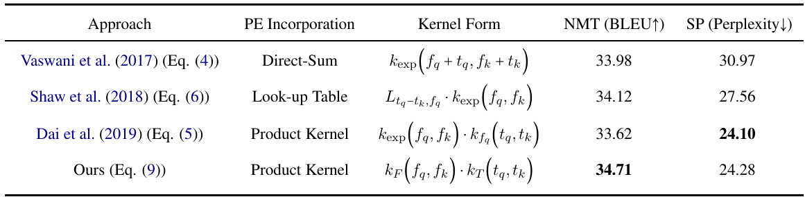
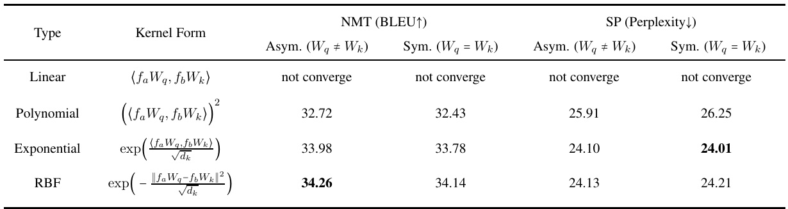
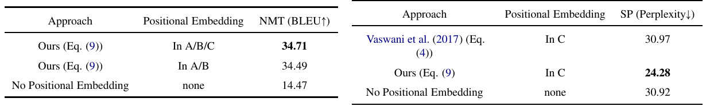
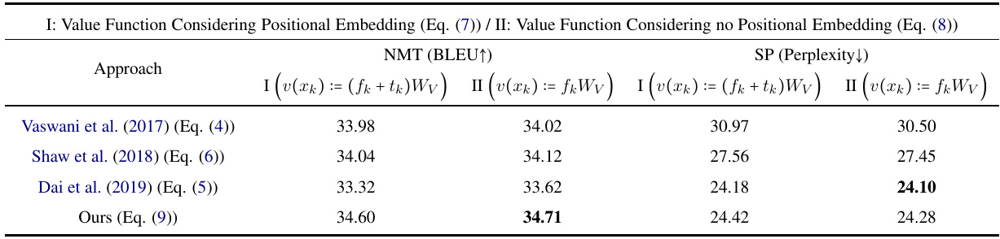

# Transformer Dissection: A Unified Understanding of Transformer’s Attention via the Lens of Kernel  

Yao-Hung Hubert Tsai 1 Shaojie Bai 1 Makoto Yamada 34 Louis-Philippe Morency 2 Ruslan Salakhutdinov 1  

{1 Machine Learning Department, Language Technology Institute}, Carnegie Mellon University 3 Kyoto University 4 RIKEN AIP  

{yaohungt, shaojieb, morency, rsalakhu}@cs.cmu.edu, myamada@i.kyoto-u.ac.jp https://github.com/yaohungt/TransformerDissection  

# Abstract  

Transformer is a powerful architecture that achieves superior performance on various sequence learning tasks, including neural machine translation, language understanding, and sequence prediction. At the core of the Transformer is the attention mechanism, which concurrently processes all inputs in the streams. In this paper, we present a new formulation of attention via the lens of the kernel. To be more precise, we realize that the attention can be seen as applying kernel smoother over the inputs with the kernel scores being the similarities between inputs. This new formulation gives us a better way to understand individual components of the Transformer’s attention, such as the better way to integrate the positional embedding. Another important advantage of our kernel-based formulation is that it paves the way to a larger space of composing Transformer’s attention. As an example, we propose a new variant of Transformer’s attention which models the input as a product of symmetric kernels. This approach achieves competitive performance to the current state of the art model with less computation. In our experiments, we empirically study different kernel construction strategies on two widely used tasks: neural machine translation and sequence prediction.  

# 1 Introduction  

Transformer ( Vaswani et al. ,2017 ) is a relative new architecture which outperforms traditional deep learning models such as Recurrent Neural Networks (RNNs) (Sutskever et al. ,2014 )and Temporal Convolutional Networks (TCNs) ( Bai et al. ,2018 ) for sequence modeling tasks across neural machine translations (Vaswani et al. ,2017 ), language understanding (Devlin et al. ,2018 ), sequence prediction (Dai et al. ,2019 ), image generation ( Child et al. ,2019 ), video activity classification (Wang et al. ,2018 ), music generation (Huang et al. ,2018a ), and multimodal sentiment analysis ( Tsai et al. ,2019a ). Instead of performing recurrence (e.g., RNN) or convolution (e.g., TCN) over the sequences, Transformer is a feed-forward model that concurrently processes the entire sequence. At the core of the Transformer is its attention mechanism, which is proposed to integrate the dependencies between the inputs. There are up to three types of attention within the full Transformer model as exemplified with neural machine translation application ( Vaswani et al. ,2017 ): 1) Encoder self-attention considers the source sentence as input, generating a sequence of encoded representations, where each encoded token has a global dependency with other tokens in the input sequence. 2) Decoder self-attention considers the target sentence (e.g., predicted target sequence for translation) as input, generating a sequence of decoded representations 1 ,where each decoded token depends on previous decoded tokens. 3) Decoder-encoder attention considers both encoded and decoded sequences, generating a sequence with the same length as the decoded sequence. It should be noted that some applications has only the decoder self-attention such as sequence prediction ( Dai et al. ,2019 ). In all cases, the Transformer’s attentions follow the same general mechanism.  

At the high level, the attention can be seen as a weighted combination of the input sequence, where the weights are determined by the similarities between elements of the input sequence. We note that this operation is orderagnostic to the permutation in the input sequence (order is encoded with extra positional embedding ( Vaswani et al. ,2017 ;Shaw et al. ,2018 ;Dai et al. ,2019 )). The above observation inspires us to connect Transformer’s attention to kernel learning ( Scholkopf and Smola ,2001 ): they both concurrently and order-agnostically process all inputs by calculating the similarity between the inputs. Therefore, in the paper, we present a new formulation for Transformer’s attention via the lens of kernel. To be more precise, the new formulation can be interpreted as a kernel smoother ( Wasserman ,2006 ) over the inputs in a sequence, where the kernel measures how similar two different inputs are. The main advantage of connecting attention to kernel is that it opens up a new family of attention mechanisms that can relate to the well-established literature in kernel learning ( Scholkopf and Smola ,2001 ). As a result, we develop a new variant of attention which simply considers a product of symmetric kernels when modeling non-positional and positional embedding.  

Furthermore, our proposed formulation highlights naturally the main components of Transformer’s attention, enabling a better understanding of this mechanism: recent variants of Transformers ( Shaw et al. ,2018 ;Huang et al. ,2018b ;Dai et al. ,2019 ;Child et al. ,2019 ;Lee et al. ,2018 ;Wang et al. ,2018 ;Tsai et al. ,2019a ) can be expressed through these individual components. Among all the components, we argue that the most important one is the construction of the kernel function. We empirically study multiple kernel forms and the ways to integrate positional embedding in neural machine translation (NMT) using IWSLT’14 GermanEnglish (De-En) dataset ( Edunov et al. ,2017 )and sequence prediction (SP) using WikiText-103 dataset ( Merity et al. ,2016 ).  

# 2 Attention  

This section aims at providing an understanding of attention in Transformer via the lens of kernel. The inspiration for connecting the kernel ( Scholkopf and Smola ,2001 ) and attention instantiates from the observation: both operations concurrently processes all inputs and calculate the similarity between the inputs. We first introduce the background (i.e., the original formulation) of attention and then provide a new reformulation within the class of kernel smoothers ( Wasserman ,2006 ). Next, we show that this new formulation allows us to explore new family of attention while at the same time offering a framework to categorize previous attention variants ( Vaswani et al. ,2017 ;Shaw et al. ,2018 ;Huang et al. ,2018b ;Dai et al. ,2019 ;Child et al. ,2019 ;Lee et al. ,2018 ;Wang et al. ,2018 ;Tsai et al. ,2019a ). Last, we present a new form of attention, which requires fewer parameters and empirically reaches competitive performance as the state-of-the-art models.  

For notation, we use lowercase representing a vector (e.g., $x)$ , bold lowercase representing a matrix (e.g., space (e.g., $\chi_{,}$ ), and ${\bf x})$ , calligraphy letter denoting a $S$ denoting a set. To relate the notations in sequence to sequence learning ( Vaswani et al. ,2017 ), $x$ represents a specific element of a sequence, notes a sequence of features, $\textbf{x}=~\left[x_{1},x_{2},\cdots,x_{T}\right]$ $S_{\mathbf{x}}=\{x_{1},x_{2},\cdots,x_{T}\}$ = { }-represents the set with its elements being the features in sequence x, and we refer the space of set $S_{\mathbf{x}}$ as $\mathcal{S}$ .  

# 2.1 Technical Background  

Unlike recurrent computation ( Sutskever et al. ,2014 ) (i.e., RNNs) and temporal convolutional computation ( Bai et al. ,2018 ) (i.e., TCNs), Transformer’s attention is an order-agnostic operation given the order in the inputs ( Vaswani et al. ,2017 ). Hence, in the presentation of the paper, we consider the inputs as a set instead of a sequence. When viewing sequence as a set, we lose the temporal (positional) information in inputs which is often crucial for sequence modeling ( Sutskever et al. ,2014 ). As a result, Transformer ( Vaswani et al. ,2017 ) introduced positional embedding to indicate the positional relation for the inputs. Formally, a setemporal feature at time as que x$\begin{array}{l l l}{x_{i}}&{=}&{\left(f_{i},t_{i}\right)}\end{array}$ = ( $\mathbf{x}\,=\,\left[x_{1},x_{2},\cdots,x_{T}\right]$ )with i $f_{i}\ \ \in\ \mathcal F$ and ∈$t_{i}\in\mathcal{T}$ ∈T es each element as an tempoing the nonral feature (or we called it positional embedding). Note that $f_{i}$ can be the word representation (in neural machine translation ( Vaswani et al. ,2017 )), a frame in a video (in video activity recognition ( Wang et al. ,2018 )), or a music unit (in music generation ( Huang et al. ,2018b )). $t_{i}$ can be a mixture of sine and cosine functions ( Vaswani et al. ,2017 ) or parameters that can be learned during back-propagation ( Dai et al. ,2019 ;Ott et al. ,2019 space ). The feature vector are defined over a joint $\mathcal{X}:=\,(\mathcal{F}\times\mathcal{T})$ . The resulting permutation $\left\{(f_{1},t_{1}),(f_{2},t_{2}),\cdots,(f_{T},t_{T})\right\}$ {(invariant set is:)() $\begin{array}{r l r}{S_{\mathbf{x}}}&{{}=}&{\left\{x_{1},x_{2},\cdots,x_{T}\right\}}\end{array}$ (=)}.}=  

Followed the definition by Vaswani et al. (2017 ), we use queries $(\mathrm{q})/\mathrm{keys(k)/values(v)}$ to represent the inputs for the attention. To be more precise, $x_{\{q/k/v\}}$ is used for denoting a query/key/value sequence $\begin{array}{r l r}{{\bf x}_{\{q/k/v\}}\!}&{{}(x_{\{q/k/v\}}\;\;\;\in\;\;S_{{\bf x}_{\{q/k/v\}}})}\end{array}$ data in the ∈query/key/value //}) with $S_{\mathbf{x}_{\{q/k/v\}}}$ being its set representation. We note that the input sequences are the sam $({\bf x}_{q}\;=\;{\bf x}_{k})$ )for self-attention and are different ( $(\mathbf{x}_{q}$ from decoder and $\mathbf{x}_{k}$ from encoder) for encoder-decoder attention.  

Given the introduced notation, the attention mechanism in original Transformer ( Vaswani et al. ,2017 ) can be presented as:  

$$
\begin{array}{r l}&{\mathrm{Attention}(x_{q}\ ;\ S_{\mathbf{x}_{k}})}\\ &{=\mathrm{softmax}\left(\frac{x_{q}W_{q}(\mathbf{x}_{k}W_{k})^{\top}}{\sqrt{d_{k}}}\right)\mathbf{x}_{k}W_{v}}\end{array}
$$  

with $x_{q}\ =\ f_{q}+t_{q},\ \mathbf{x}_{k}\ =\ \mathbf{f}_{k}+\mathbf{t}_{k},\ W_{q/k/v}$ being the weight, and $d_{k}$ being the feature dimension of $\mathbf{x}_{k}W_{k}$ . Decoder self-attention further introduces a mask to block the visibility of elements in $S_{\mathbf{x}_{k}}$ to $x_{q}$ . Particularly, decoder self-attention considers the decoded sequence as nputs $(\mathbf{x}_{k}\,=\,\mathbf{x}_{q})$ ), where the decoded token at time tis not allowed to access the future decoded tokens (i.e., tokens decoded at time greater than $t$ ). On the contrary, encoder selfattention and decoder-encoder attention consider no additional mask to Eq. ( 1 ).  

Recent work ( Shaw et al. ,2018 ;Dai et al. ,2019 ;Huang et al. ,2018b ;Child et al. ,2019 ;Lee et al. ,2018 ;Parmar et al. ,2018 ;Tsai et al. ,2019a ) proposed modifications to the Transformer for the purpose of better modeling inputs positional relation ( Shaw et al. ,2018 ;Huang et al. ,2018b ;Dai et al. ,2019 ), appending additional keys in $S_{\mathbf{x}_{k}}$ (Dai et al. ,2019 ), modifying the mask applied to Eq. (1 ) ( Child et al. ,2019 ), or applying to distinct feature types ( Lee et al. ,2018 ;Parmar et al. ,2018 ;Tsai et al. ,2019a ). These works adopt different designs of attention as comparing to the original form (Eq. ( 1 )). In our paper, we aim at providing an unified view via the lens of kernel.  

# 2.2 Reformulation via the Lens of Kernel  

We now provide the intuition to reformulate Eq. (1 ) via the lens of kernel. First, the softmax function can be realized as a probability function for $x_{q}$ observing the keys $\{x_{k}\}\mathbf{s}$ in $S_{\mathbf{x}_{k}}$ ($\boldsymbol{S}_{\mathbf{x}_{k}}$ is the set representation of sequence $\mathbf{x}_{k}$ ). The probability is determined by the dot product between $x_{q}$ and $x_{k}$ with additional mappings $W_{q}/W_{k}$ and scaling by $d_{k}$ , which we note the dot-product operation is an instance of kernel function. We also introduce a set filtering function $M(x_{q},S_{\mathbf{x}_{k}})\,:\,\mathcal{X}\times\mathcal{S}\,\rightarrow\,\mathcal{S}$ which returns a set with its elements that operate with (or are connected/visible to) $x_{q}$ . The filtering function $M(\cdot,\cdot)$ plays as the role of the mask in decoder self-attention ( Vaswani et al. ,2017 ). Putting these altogether, we re-represent Eq. ( 1 ) into the following definition.  

Definition 1. Given a non-negative kernel function tion $k(\cdot,\cdot)\,:\,\mathcal{X}\times\mathcal{X}\,\rightarrow\,\mathbb{R}^{+},$ (⋅ ⋅) ∶X × S →S , and a value function , a set filtering func$v(\cdot):\mathcal{X}\,\rightarrow\,\mathcal{Y}$ , the Attention function taking the input of a query feature $x_{q}\in\mathcal{X}$ is defined as  

$$
\begin{array}{r l}&{\quad\mathrm{Attention}\Big(x_{q}\;;\;M(x_{q},S_{\mathbf{x}_{k}})\Big)}\\ &{=\displaystyle\sum_{x_{k}\in M(x_{q},S_{\mathbf{x}_{k}})}\frac{k(x_{q},x_{k})}{\sum_{x_{k}^{\prime}\in M(x_{q},S_{\mathbf{x}_{k}})}k(x_{q},x_{k}^{\prime})}v(x_{k}).}\end{array}
$$  

The Definition 1 is a class of linear smoothers (Wasserman ,2006 )with kernel smoothing:  

$$
\sum_{x_{k}\in M\left(x_{q},S_{\mathbf{x}_{k}}\right)}\frac{k(x_{q},x_{k})}{\sum_{x_{k^{\prime}}\in M\left(x_{q},S_{\mathbf{x}_{k}}\right)}k(x_{q},x_{k^{\prime}})}v(x_{k})
$$  

where $\ensuremath{\boldsymbol{v}}(\ensuremath{\boldsymbol{{x}}}_{k})$ outputs the “values” and $\begin{array}{r}{p\big(x_{k}|x_{q}\big)=\frac{k\big(x_{q},x_{k}\big)}{\sum_{x_{k}}\prime\in M(x_{q},S_{\mathbf{x}_{k}})\,k\left(x_{q},x_{k}\prime\right)}}\end{array}$ is a probability function depends on $k$ and $N$ when $k(\cdot,\cdot)$ is always positive. In the prior work ( Vaswani et al. ,and 2017 v$\begin{array}{r l r}{{\boldsymbol v}({\boldsymbol x}_{k})}&{{}=}&{x_{k}W_{v}}\end{array}$ ($\begin{array}{r c l}{k(x_{q},x_{k})}&{=}&{\exp\left(\langle x_{q}W_{q},x_{k}W_{k}\rangle/\sqrt{d_{k}}\right)}\end{array}$ )=.Note that the kernel form $k(x_{q},x_{k})$ in the original Transformer ( Vaswani et al. ,2017 ) is a asymmetric exponential kernel with additional mapping $W_{q}$ and $W_{k}$ (Wilson et al. ,2016 ;Li et al. ,$2017)^{2}$ .  

The new formulation defines a larger space for composing attention by manipulating its individual components, and at the same time it is able to categorize different variants of attention in prior work ( Shaw et al. ,2018 ;Huang et al. ,2018b ;Dai et al. ,2019 ;Child et al. ,2019 ;Lee et al. ,2018 ;Wang et al. ,2018 ;Tsai et al. ,2019a ). In the following, we study these components by dissecting Eq. ( 2 ) into: 1) kernel feature space $\mathcal{X}$ , 2) kernel construction $k(\cdot,\cdot),\,3)$ value function $v(\cdot)$ ,and 4) set filtering function $M(\cdot,\cdot)$ .  

# 2.2.1 Kernel Feature Space $\mathcal{X}$  

In Eq. (2 ), to construct a kernel on $\mathcal{X}$ , the first thing is to identify the kernel feature space $\mathcal{X}$ .In addition to modeling sequences like word sentences ( Vaswani et al. ,2017 ) or music signals ( Huang et al. ,2018b ), the Transformer can also be applied to images ( Parmar et al. ,2018 ), sets ( Lee et al. ,2018 ), and multimodal sequences ( Tsai et al. ,2019a ). Due to distinct data types, these applications admit various kernel feature space:  

(i) Sequence Transformer ( Vaswani et al. ,2017 ;Dai et al. ,2019 ):  

$$
\mathcal{X}:=\left(\mathcal{F}\times\mathcal{T}\right)
$$  

# 2.2.2 Kernel Construction and the Role of Positional Embedding $k(\cdot,\cdot)$  

The kernel construction on $\begin{array}{r l r}{\mathcal{X}}&{{}=}&{(\mathcal{F}\,\times\,\mathcal{T})}\end{array}$ =(F × T ) has distinct design in variants of Transformers (Vaswani et al. ,2017 ;Dai et al. ,2019 ;Huang et al. ,2018b ;Shaw et al. ,2018 ;Child et al. ,2019 ). Since now the kernel feature space considers a joint space, we will first discuss the kernel construction on $\mathcal{F}$ (the non-positional feature space) and then discuss how different variants integrate the positional embedding (with the positional feature space $\tau$ ) into the kernel.  

Kernel construction on $\mathcal{F}$ .All the work considered the scaled asymmetric exponential kernel with the mapping $W_{q}$ and $W_{k}$ (Wilson et al. ,2016 ;Li et al. ,2017 ) for non-positional features $f_{q}$ and $f_{k}$ :  

with $\mathcal{F}$ being non-positional feature space and $\tau$ being the positional embedding space of the position in the sequence.  

(ii) Image Transformer ( Parmar et al. ,2018 ):  

$$
\mathcal{X}:=\left(\mathcal{F}\times\mathcal{H}\times\mathcal{W}\right)
$$  

$$
k_{\mathrm{exp}}(f_{q},f_{k})=\exp\left(\frac{\langle f_{q}W_{q},f_{k}W_{k}\rangle}{\sqrt{d_{k}}}\right).
$$  

Note that the usage of asymmetric kernel is also commonly used in various machine learning tasks ( Yilmaz ,2007 ;Tsuda ,1999 ;Kulis et al. ,2011 ), where they observed the kernel form can be flexible and even non-valid (i.e., a kernel that is not symmetric and positive semi-definite). In Section 3 , we show that symmetric design of the kernel has similar performance for various sequence learning tasks, and we also examine different kernel choices (i.e., linear, polynomial, and rbf kernel).  

with $\mathcal{F}$ being non-positional feature space, $\mathcal{H}$ being the positional space of the height in an image, and $\mathcal{W}$ being the positional space of the width in an image.  

(iii) Set Transformer ( Lee et al. ,2018 ) and NonLocal Neural Networks ( Wang et al. ,2018 ):  

$$
\mathcal{X}:=(\mathcal{F})
$$  

with no any positional information present.  

$(i\nu)$ Multimodal Transformer ( Tsai et al. ,2019a ):  

$$
\mathcal{X}:=(\mathcal{F}^{\ell}\times\mathcal{F}^{v}\times\mathcal{F}^{a}\times\mathcal{T})
$$  

Kernel construction on $\mathcal{X}\,=\,(\mathcal{F}\times\mathcal{T})$ .The designs for integrating the positional embedding $t_{q}$ and $t_{k}$ are listed in the following.  

(i) Absolute Positional Embedding ( Vaswani et al. ,2017 ;Dai et al. ,2019 ;Ott et al. ,2019 ): For the original Transformer ( Vaswani et al. ,2017 ), each $t_{i}$ is represented by a vector with each dimension being sine or cosine functions. For learned positional embedding ( Dai et al. ,2019 ;Ott et al. ,2019 ), each $t_{i}$ is a learned parameter and is fixed for the same position for different sequences. These works defines the feature space as the direct sum of its temporal and non-temporal space: $\mathcal{X}=\mathcal{F}\oplus\mathcal{T}$ . Via the lens of kernel, the kernel similarity is defined as  

${\mathcal{F}}^{v}$ Fresenting the audio feature space, and hrepresenting the vision feature sp $\mathcal{F}^{\ell}$ representing the language featur Trepresente, F${\mathcal{F}}^{a}$ pace, reping the temporal indicator space.  

setting for sequence Transformer For the rest of the paper, we will focus on the $\mathcal{X}\ =\ (\mathcal{F}\times\mathcal{T})$ and discuss the kernel construction on it.  

$$
k\Big(x_{q},x_{k}\Big):=k_{\mathrm{exp}}\Big(f_{q}+t_{q},f_{k}+t_{k}\Big).
$$  

(ii) Relative Positional Embedding in Transformer$X L$ (Dai et al. ,2019 ): $t$ represents the indicator of  

the position in the sequence, and the kernel is chosen to be asymmetric of mixing sine and cosine functions:  

$$
k\Big(x_{q},x_{k}\Big):=k_{\mathrm{exp}}\Big(f_{q},f_{k}\Big)\cdot k_{f_{q}}\Big(t_{q},t_{k}\Big)
$$  

with $k_{f_{q}}\Big(t_{q},t_{k}\Big)$ being an asymmetric kernel with coefficients inferred by $f_{q}$ :$\begin{array}{r l}{\log k_{f_{q}}\Big(t_{q},t_{k}\Big)}&{{}=}\end{array}$ $\begin{array}{r}{\sum_{p=0}^{\lfloor d_{k}/2\rfloor-1}c_{2p}\,\sin({\frac{t_{q}-t_{k}}{10000^{\frac{2p}{512}}}})+c_{2p+1}\,\cos({\frac{t_{q}-t_{k}}{10000^{\frac{2p}{512}}}})}\end{array}$ with $\begin{array}{r c l}{{\left[c_{0},\cdots,c_{d_{k}-1}\right]}}&{{=}}&{{f_{q}W_{q}W_{R}}}\end{array}$ where $W_{R}$ is an learned weight matrix. We refer readers to Dai et al. (2019 ) for more details.  

(iii) Relative Positional Embedding of Shaw et al. (2018 ) and Music Transformer ( Huang et al. ,2018b ): $t$ ⋅represents the indicator of the position in the sequence, and the kernel is modified to be indexed by a look-up table:  

$$
k\Big(x_{q},x_{k}\Big):=L_{t_{q}-t_{k},f_{q}}\cdot k_{\mathrm{exp}}\Big(f_{q},f_{k}\Big),
$$  

where $L_{t_{q}-t_{k},f_{q}}~=~\exp(f_{q}W_{q}a_{t_{q}-t_{k}})$ with $a$ ⋅being a learnable matrix having matrix width to be the length of the sequence. We refer readers to Shaw et al. (2018 ) for more details.  

Dai et al. (2019 ) showed that the way to integrate positional embedding is better through Eq. (5 ) than through Eq. ( 6 ) and is better through Eq. (6 ) than through Eq. ( 4 ). We argue the reason is that if viewing $f_{i}$ and $t_{i}$ as two distinct spaces $\left(\boldsymbol{\mathcal{X}}:=\left(\boldsymbol{\mathcal{F}}\times\boldsymbol{\mathcal{T}}\right)\right)$ , the direct sum $x_{i}\,=\,f_{i}+t_{i}$ may not be optimal when considering the kernel score between $x_{q}$ and $x_{k}$ . In contrast, Eq. ( 5 ) represents the kernel as a product of two kernels (one for $f_{i}$ and another for $t_{i}$ ), which is able to capture the similarities for both temporal and non-temporal components.  

# 2.2.3 Value Function $v(\cdot)$  

The current Transformers consider two different value function construction:  

(i) Original Transformer ( Vaswani et al. ,2017 )and Sparse Transformer ( Child et al. ,2019 ):  

$$
v(x_{k})=v((f_{k},t_{k})):=(f_{k}+t_{k})W_{v}.
$$  

(ii) Transformer-XL ( Dai et al. ,2019 ), Music Transformer ( Huang et al. ,2018b ), Self-Attention with Relative Positional Embedding ( Shaw et al. 2018 ):  

$$
v(x_{k})=v((f_{k},t_{k})):=f_{k}W_{v}.
$$  

Compared Eq. ( 7 ) to Eq. ( 8 ), Eq. ( 7 ) takes the positional embedding into account for constructing the value function. In Section 3 , we empirically observe that constructing value function with Eq. ( 8 ) constantly outperforms the construction with Eq. ( 7 ), which suggests that we do not need positional embedding for value function.  

# 2.2.4 Set Filtering Function $M(\cdot,\cdot)$  

In Eq. (2 ), the returned set by the set filtering function $M(x_{q},S_{\mathbf{x}_{k}})$ defines how many keys and which keys are operating with $x_{q}$ . In the following, we itemize the corresponding designs for the variants in Transformers:  

(i) Encoder Self-Attention in original Transformer ( Vaswani et al. ,2017 ): For each query $x_{q}$ in the encoded sequence, $M(x_{q},S_{\mathbf{x}_{k}})\,=\,S_{\mathbf{x}_{k}}$ contains the keys being all the tokens in the encoded sequence. Note that encoder self-attention considers $\mathbf{x}_{q}=\mathbf{x}_{k}$ with $\mathbf{x}_{q}$ being the encoded sequence.  

(ii) Encoder-Decoder Attention in original Transformer ( Vaswani et al. ,2017 ): For each query $x_{q}$ in decoded sequence, $M\!\left(x_{q},S_{\mathbf{x}_{k}}\right)=S_{\mathbf{x}_{k}}$ contains the keys being all the tokens in the encoded sequence. Note that encode-decoder attention considers $\mathrm{~\bf~x~}_{q}~\ne~\mathrm{~\bf~x~}_{k}$ with $\mathbf{x}_{q}$ being the decoded sequence and $\mathbf{x}_{k}$ being the encoded sequence.  

(iii) Decoder Self-Attention in original Transformer ( Vaswani et al. ,2017 ): For each query $x_{q}$ in the decoded sequence, $M(x_{q},S_{\mathbf{x}_{k}})$ returns a subset of $S_{\mathbf{x}_{k}}$ $(M(x_{q},S_{\mathbf{x}_{k}})\ \subset\ S_{\mathbf{x}_{k}})$ ). Note that decoder self-attention considers $\mathbf{x}_{q}\,=\,\mathbf{x}_{k}$ with $\mathbf{x}_{q}$ being the decoded sequence. Since the decoded sequence is the output for previous timestep, the query at position $i$ can only observe the keys being the tokens that are decoded with position $<i$ . For convenience, let us define $S_{1}$ as the set returned by original Transformer ( Vaswani et al. ,2017 ) from $M(x_{q},S_{\mathbf{x}_{k}})$ , which we will use it later.  

$(i\nu)$ Decoder Self-Attention in Transformer$X L$ (Dai et al. ,2019 ): For each query $x_{q}$ in the decoded sequence, $M(x_{q},S_{\mathbf{x}_{k}})$ returns a set containing $S_{1}$ and additional memories $(M(x_{q},S_{\bf x}_{k}\,)\ =\ S_{1}\,+\,S_{m e m},M(x_{q},S_{\bf x}_{k}\,)\ >\,S_{1})$ $S_{m e m}$ refers to additional memories.  

(v) Decoder Self-Attention in Sparse Transformer ( Child et al. ,2019 ): For each query $x_{q}$ in the d ded sentence, $M(x_{q},S_{\mathbf{x}_{k}})$ returns a subset of $S_{1}$ $(M(x_{q},S_{\mathbf{x}_{k}})\subset S_{1})$ ).  

To compare the differences for various designs, we see the computation time is inversely proportional to the number of elements in $M(x_{q},S_{\mathbf{x}_{k}})$ .For performance-wise comparisons, TransformerXL ( Dai et al. ,2019 ) showed that, the additional memories in $M(x_{q},S_{\mathbf{x}_{k}})$ are able to capture longer-term dependency than the original Transformer ( Vaswani et al. ,2017 ) and hence results in better performance. Sparse Transformer ( Child et al. ,2019 ) showed that although having much fewer elements in $M(x_{q},S_{\mathbf{x}_{k}})$ , if the elements are carefully chosen, the attention can still reach the same performance as TransformerXL ( Dai et al. ,2019 ).  

# 2.3 Exploring the Design of Attention  

So far, we see how Eq. ( 2 ) connects to the variants of Transformers. By changing the kernel construction in Section 2.2.2 , we can define a larger space for composing attention. In this paper, we present a new form of attention with a kernel that is 1) valid (i.e., a kernel that is symmetric and pos(F × T ) itive semi-definite) and 2) delicate in the sense of ): ing a kernel on a joint space (i.e., $\raisebox{\depth}{\(\chi\)}=$  

$$
\begin{array}{r l}&{k(x_{q},x_{k}):=k_{F}\Big(f_{q},f_{k}\Big)\cdot k_{T}\Big(t_{q},t_{k}\Big)}\\ &{\mathrm{with~}k_{F}\big(f_{q},f_{k}\big)=\exp\Bigl(\frac{\big<f_{q}W_{F},f_{k}W_{F}\big>}{\sqrt{d_{k}}}\Bigr)}\\ &{\mathrm{and~}\ k_{T}\big(t_{q},t_{k}\big)=\exp\Bigl(\frac{\big<t_{q}W_{T},t_{k}W_{T}\big>}{\sqrt{d_{k}}}\Bigr),}\end{array}
$$  

where $W_{F}$ and $W_{T}$ are weight matrices. The new form considers product of kernels with the first kernel measuring similarity between non-temporal features and the second kernel measuring similarity between temporal features. Both kernels are symmetric exponential kernel. Note that $t_{i}$ here is chosen as the mixture of sine and cosine functions as in the prior work ( Vaswani et al. ,2017 ;Ott et al. ,2019 ). In our experiment, we find it reaching competitive performance as comparing to the current state-of-the-art designs (Eq. (5 ) by Dai et al. (2019 )). We fix the size of the weight matrices $W.$ ⋅in Eq. ( 9 ) and Eq. ( 5 ) which means we save $33\%$ of the parameters in attention from Eq. ( 9 ) to Eq. ( 5 ) (Eq. ( 5 ) has weights $W_{Q}/W_{K}/W_{R}$ and Eq. ( 9 ) has weights $W_{F}/W_{T})$ .  

# 3 Experiments  

By viewing the attention mechanism with Eq. ( 2 ), we aims at answering the following questions regarding the Transformer’s designs:  

Q1. What is the suggested way for incorporating positional embedding in the kernel function?  

Q2. What forms of kernel are recommended to choose in the attention mechanism? Can we replace the asymmetric kernel with the symmetric version?  

Q3. Is there any exception that the attention mechanism is not order-agnostic with respect to inputs? If so, can we downplay the role of positional embedding?  

Q4. Is positional embedding required in value function?  

We conduct experiments on neural machine translation (NMT) and sequence prediction (SP) tasks since these two tasks are commonly chosen for studying Transformers ( Vaswani et al. ,2017 ;Dai et al. ,2019 ). Note that NMT has three different types of attentions (e.g., encoder selfattention, decoder-encoder attention, decoder selfattention) and SP has only one type of attention (e.g., decoder self-attention). For the choice of datasets, we pick IWSLT’14 German-English (De-En) dataset ( Edunov et al. ,2017 ) for NMT and WikiText-103 dataset ( Merity et al. ,2016 ) for SP as suggested by Edunov et al. (Edunov et al. ,2017 ) and Dai et al. (Dai et al. ,2019 ). For fairness of comparisons, we train five random initializations and report test accuracy with the highest validation score. We fix the position-wise operations in Transformer 3 and only change the attention mechanism. Similar to prior work ( Vaswani et al. ,2017 ;Dai et al. ,2019 ), we report BLEU score for NMT and perplexity for SP.  

# 3.1 Incorporating Positional Embedding  

In order to find the best way to integrate positional embedding (PE), we study different PE incorporation in the kernel function $k(\cdot,\cdot)$ in Eq. ( 2 ). Referring to Sections 2.2.2 and 2.3 , we consider four cases: 1) PE as direct sum in the feature space (see Eq. ( 4 )), 2) PE as a look-up table (see Eq. (6 )), 3) PE in product kernel with asymmetric kernel (see Eq. ( 5 )), and 4) PE in product kernel with symmetric kernel (see Eq. ( 9 )). We present the results in Table 1 .  

First, we see that by having PE as a look-up table, it outperforms the case with having PE as direct-sum in feature space, especially for SP task. Note that the look-up table is indexed by the relative position (i.e., $t_{q}-t_{k})$ instead of absolute position. Second, we see that PE in the product kernel proposed by Dai et al. (Dai et al. ,2019 ) may not constantly outperform the other integration types (it has lower BLEU score for NMT). Our proposed product kernel reaches the best result in NMT and is competitive to the best result in SP.  

Table 1: Incorporating Positional Embedding (PE). NMT stands for neural machine translation on IWSLT’14 De-En dataset ( Edunov et al. ,2017 ) and SP stands for sequence prediction on WikiText-103 dataset ( Merity et al. ,2016 ). $\uparrow$ means the upper the better and $\downarrow$ means the lower the better.   

  

Table 2: Kernel Types. Other than manipulating the kernel choice of the non-positional features, we fix the configuration by Vaswani et al. (2017 ) for NMT and the configuration by Dai et al. (2019 ) for SP.   

  

# 3.2 Kernel Types  

To find the best kernel form in the attention mechanism, in addition to the exponential kernel (see Eq. ( 3 )), we compare different kernel forms (i.e., linear, polynomial, and rbf kernel) for the non-positional features. We also provide the results for changing asymmetric to the symmetric kernel, when forcing $W_{q}\,=\,W_{k}$ , so that the resulting kernel is a valid kernel ( Scholkopf and Smola ,2001 ). The numbers are shown in Table 2 . Note that, for fairness, other than manipulating the kernel choice of the non-positional features, we fix the configuration by Vaswani et al. (Vaswani et al. ,2017 ) for NMT and the configuration by Dai et al. (Dai et al. ,2019 ) for SP.  

We first observe that the linear kernel does not converge for both NMT and SP. We argue the reason is that the linear kernel may have negative value and thus it violates the assumption in kernel smoother that the kernel score must be positive ( Wasserman ,2006 ). Next, we observe the kernel with infinite feature space (i.e., exponential and rbf kernel) outperforms the kernel with fi- nite feature space (i.e., polynomial kernel). And we see rbf kernel performs the best for NMT and exponential kernel performs the best for SP. We conclude that the choice of kernel matters for the design of attention in Transformer. Also, we see no much performance difference when comparing asymmetric to symmetric kernel. In the experiment, we fix the size of W⋅in the kernel, and thus adopting the symmetric kernel benefits us from saving parameters.  

# 3.3 Order-Invariance in Attention  

The need of the positional embedding (PE) in the attention mechanism is based on the argument that the attention mechanism is an order-agnostic (or, permutation equivariant) operation ( Vaswani et al. ,2017 ;Shaw et al. ,2018 ;Huang et al. ,2018b ;Dai et al. ,2019 ;Child et al. ,2019 ). However, we show that, for decoder self-attention, the operation is not order-agnostic. For clarification, we are not attacking the claim made by the prior work ( Vaswani et al. ,2017 ;Shaw et al. ,2018 ;Huang et al. ,2018b ;Dai et al. ,2019 ;Child et al. ,2019 ), but we aim at providing a new look at the order-invariance problem when considering the attention mechanism with masks (masks refer to the set filtering function in our kernel formulation). In other words, previous work did not consider the mask between queries and keys when discussing the order-invariance problem ( Pérez et al. ,2019 ).  

Table 3: Order-Invariance in Attention. To save the space, we denote Encoder Self-Attention / Encoder-Decoder Attention / Decoder Self-Attention as A/B/C. Note that SP only has decoder self-attention.   

  

Table 4: Positional Embedding in Value Function.   

  

To put it formally, we first present the definition by Lee et al. (2018 ) for a permutation equivariance function:  

$\mathcal{X}^{n}\,\rightarrow\,\mathcal{Y}^{n}$ Definition 2. Xpermutation →Y ri $\pi\in\Pi$ $[n]\;=\;\{1,\cdots,n\}$ Denote ∈m,$f u n c(\pi x)=\pi f u n c(x)$ Πas the set of all permu(. A function ) = (func )or any .∶  

Lee et al. (2018 ) showed that the standard attention (encoder self-attention ( Vaswani et al. ,2017 ;Dai et al. ,2019 ) ) is permutation equivariant. Here, we present the non-permutation-equivariant problem on the decoder self-attention:  

Proposition 1. Decoder selfattention ( Vaswani et al. ,2017 ;Dai et al. ,2019 )is not permutation equivariant.  

To proceed the proof, we need the following definition and propositions.  

Definition 3. Denote $\Pi$ as the set of all permutations over $[n]=\{1,\cdots,n\}$ and $S_{\mathbf{x}_{k}}^{\pi}$ as performing permutation $\pi$ over $S_{\mathbf{x}_{k}}$ .Attention $(x_{q};S_{{\bf x}_{k}})$ is said to be permutation equivariant w.r.t. and only if for any $\pi\in\Pi$ ,Attention $(x_{q};S_{\mathbf{x}_{k}}^{\pi})\mathbf{\alpha}=$ $S_{\mathbf{x}_{k}}~i f$ ) = Attention $(x_{q};S_{\mathbf{x}_{k}})$ .  

Proposition 2. Attention with the set filtering function $M(x_{q},S_{\mathbf{x}_{k}})=S_{\mathbf{x}_{k}}$ is permutation equivariant w.r.t. $S_{\mathbf{x}_{k}}$ .  

Proof. It is easy to show that if $M(x_{q},S_{{\bf x}_{k}})\;=\;$ $S_{\mathbf{x}_{k}}$ tation , Eq. ( $\pi$ performed on 2 ) remains unchanged for any permu$S_{\mathbf{x}_{k}}$ .∎Proposition 3. Attention with the set difference $S_{\mathbf{x}_{k}}\setminus M(x_{q},S_{\mathbf{x}_{k}})\,\neq\,\phi$ is not permutation equivariant w.r.t. $S_{\mathbf{x}_{k}}$ .  

Proof. First, suppose that $\hat{x}\in S_{{\bf x}_{k}}\setminus M(x_{q},S_{{\bf x}_{k}})$ $\hat{x}$ Then, we construct a permutation ∈$M(x_{q},S_{\mathbf{x}_{k}}^{\pi})$ ).It is obvious that Eq. πsuch that (2 ) changes after this permutation and thus Attention $\left(x_{q}\;;\;M(x_{q},S_{{\mathbf{x}}_{k}})\right)$ is not permutation equivariant w.r.t. $S_{\mathbf{x}_{k}}$ .∎Proof. [Proof for Proposition 1 ] First, we have $x_{q}\;\sim\;S_{{\bf x}_{k}}$ . Hence, showing Attenti $(x_{q};S_{\mathbf{x}_{k}})$ not permutation equivariant w.r.t. $S_{\mathbf{x}_{k}}$ equals to showing Attention not permutation equivariant. Then, since the decoder self-attention considers masking (i.e., $M(x_{q},S_{\mathbf{x}_{k}})$ returns a subset of $S_{\mathbf{x}_{k}})$ is not permutation equivariant. ), by Proposition 3 , the decoder self-attention ∎  

In fact, not only being a permutation inequivariant process, the decoding process in the decoder self-attention already implies the order information from the data. To show this, take the decoded sequence $\textbf{y}=\,\left[\operatorname{init},y_{1},y_{2},y_{3},y_{4}\right]$ as an example. init stands for the initial token. When determining the output $y_{1}$ from init , the set filtering function is $M(\mathrm{init},S_{\bf y})\;=\;\{\mathrm{init}\}$ . Similarly, we will have $M(y_{1},S_{\mathbf{y}}),M(y_{2},S_{\mathbf{y}}),M(y_{3},S_{\mathbf{y}})$ to be $\{\operatorname{init},y_{1}\}$ ,$\{\operatorname{init},y_{1},y_{2}\}$ ,$\{\mathrm{init},y_{1},y_{2},y_{3}\}$ .Then, it raises a concern: do we require PE in decoder self-attention? By removing PE in decoder selfattention, we present the results in Table 3 . From the table, we can see that, for NMT, removing PE only in decoder self-attention results in slight performance drop (from 34 .71 to 34 .49 ). However, removing PE in the entire model greatly degrades the performance (from 34 .71 to 14 .47 ). On the other hand, for SP, removing PE from our proposed attention variant dramatically degrades the performance (from 24 .28 to 30 .92 ). Nonetheless, the performance is slightly better than considering PE from the original Transformer ( Vaswani et al. ,2017 ).  

# 3.4 Positional Embedding in Value Function  

To determine the need of positional embedding (PE) in value function, we conduct the experiments by adopting Eq. ( 7 ) or Eq. ( 8 ) in the attention mechanism. The results are presented in Table 4 . From the table, we find that considering PE in value function (Eq. ( 7 )) does not gain performance as compared to not considering PE in value function (Eq. ( 8 )).  

# 3.5 Take-Home Messages  

Based on the results and discussions, we can now answer the questions given at the beginning of this section. The answers are summarized into the takehome messages in the following.  

A1. We show that integrating the positional embedding in the form of product kernel (Eq. ( 5 )or Eq. ( 9 )) gives us best performance.  

A2. The kernel form does matter. Adopting kernel form with infinite feature dimension (i.e., exponential kernel or rbf kernel) gives us best results. The symmetric design of the kernel may benefit us from saving parameters and barely sacrifice the performance as compared to the non-symmetric one.  

A3. The decoder self-attention is not an orderagnostic operation with respect to the order of inputs. However, incorporating positional embedding into the attention mechanism may still improve performance.  

A4. We find that there is no much performance difference by considering or not considering the positional embedding in value function.  

# 4 Related Work  

Other than relating Transformer’s attention mechanism with kernel methods, the prior work (Wang et al. ,2018 ;Shaw et al. ,2018 ;Tsai et al. ,2019b ) related the attention mechanism with graph-structured learning. For example, Non-Local Neural Networks ( Wang et al. ,2018 )made a connection between the attention and the non-local operation in image processing ( Buades et al. ,2005 ). Others ( Shaw et al. ,2018 ;Tsai et al. ,2019b ) linked the attention to the message passing in graphical models. In addition to the fundamental difference between graph-structured learning and kernel learning, the prior work ( Wang et al. ,2018 ;Shaw et al. ,2018 ;Tsai et al. ,2019b ) focused on presenting Transformer for its particular application (e.g., video classification (Wang et al. ,2018 )and neural machine translation ( Shaw et al. ,2018 )). Alternatively, our work focuses on presenting a new formulation of Transformer’s attention mechanism that gains us the possibility for understanding the attention mechanism better.  

# 5 Conclusions  

In this paper, we presented a kernel formulation for the attention mechanism in Transformer, which allows us to define a larger space for designing attention. As an example, we proposed a new variant of attention which reaches competitive performance when compared to previous state-of-the-art models. Via the lens of the kernel, we were able to better understand the role of individual components in Transformer’s attention and categorize previous attention variants in a unified formulation. Among these components, we found the construction of the kernel function acts the most important role, and we studied different kernel forms and the ways to integrate positional embedding on neural machine translation and sequence prediction. We hope our empirical study may potentially allow others to design better attention mechanisms given their particular applications.  

# Acknowledgments  

We thank Zhilin Yang for helpful discussion on the positional encoding in Transformer’s Attention. This work was supported in part by the DARPA grant FA875018C0150, Office of Naval Research grant N000141812861, AFRL CogDeCON, NSF Awards #1734868 #1722822, National Institutes of Health, JST PRESTO program JPMJPR165A, and Apple. We would also like to acknowledge NVIDIA’s GPU support.  

# References  

Shaojie Bai, J Zico Kolter, and Vladlen Koltun. 2018. An empirical evaluation of generic convolutional and recurrent networks for sequence modeling. arXiv preprint arXiv:1803.01271 .  
Antoni Buades, Bartomeu Coll, and J-M Morel. 2005. A non-local algorithm for image denoising. In 2005 IEEE Computer Society Conference on Computer Vision and Pattern Recognition (CVPR’05) , volume 2, pages 60–65. IEEE.   
Rewon Child, Scott Gray, Alec Radford, and Ilya Sutskever. 2019. Generating long sequences with sparse transformers. arXiv preprint arXiv:1904.10509 .  
Zihang Dai, Zhilin Yang, Yiming Yang, William W Cohen, Jaime Carbonell, Quoc V Le, and Ruslan Salakhutdinov. 2019. Transformer-xl: Attentive language models beyond a fixed-length context. arXiv preprint arXiv:1901.02860 .  
Jacob Devlin, Ming-Wei Chang, Kenton Lee, and Kristina Toutanova. 2018. Bert: Pre-training of deep bidirectional transformers for language understanding. arXiv preprint arXiv:1810.04805 .  
Sergey Edunov, Myle Ott, Michael Auli, David Grangier, and Marc’Aurelio Ranzato. 2017. Classical structured prediction losses for sequence to sequence learning. arXiv preprint arXiv:1711.04956 .  
Cheng-Zhi Anna Huang, Ashish Vaswani, Jakob Uszkoreit, Noam Shazeer, Curtis Hawthorne, Andrew M Dai, Matthew D Hoffman, and Douglas Eck. 2018a. An improved relative self-attention mechanism for transformer with application to music generation. arXiv preprint arXiv:1809.04281 .  
Cheng-Zhi Anna Huang, Ashish Vaswani, Jakob Uszkoreit, Ian Simon, Curtis Hawthorne, Noam Shazeer, Andrew M Dai, Matthew D Hoffman, Monica Dinculescu, and Douglas Eck. 2018b. Music transformer: Generating music with long-term structure.   
Brian Kulis, Kate Saenko, and Trevor Darrell. 2011. What you saw is not what you get: Domain adaptation using asymmetric kernel transforms. In CVPR 2011 , pages 1785–1792. IEEE.   
Juho Lee, Yoonho Lee, Jungtaek Kim, Adam R Kosiorek, Seungjin Choi, and Yee Whye Teh. 2018. Set transformer. arXiv preprint arXiv:1810.00825 .  
Chun-Liang Li, Wei-Cheng Chang, Yu Cheng, Yiming Yang, and Barnabás Póczos. 2017. Mmd gan: Towards deeper understanding of moment matching network. In Advances in Neural Information Processing Systems , pages 2203–2213.   
Stephen Merity, Caiming Xiong, James Bradbury, and Richard Socher. 2016. Pointer sentinel mixture models. arXiv preprint arXiv:1609.07843 .  
Myle Ott, Sergey Edunov, Alexei Baevski, Angela Fan, Sam Gross, Nathan Ng, David Grangier, and Michael Auli. 2019. fairseq: A fast, extensible toolkit for sequence modeling. In Proceedings of NAACL-HLT 2019: Demonstrations .  
Niki Parmar, Ashish Vaswani, Jakob Uszkoreit, Łukasz Kaiser, Noam Shazeer, Alexander Ku, and Dustin Tran. 2018. Image transformer. arXiv preprint arXiv:1802.05751 .  
Jorge Pérez, Javier Marinkovi´c, and Pablo Barceló. 2019. On the turing completeness of modern neural network architectures. arXiv preprint arXiv:1901.03429 .  
Bernhard Scholkopf and Alexander J Smola. 2001. Learning with kernels: support vector machines, regularization, optimization, and beyond . MIT press.   
Peter Shaw, Jakob Uszkoreit, and Ashish Vaswani. 2018. Self-attention with relative position representations. arXiv preprint arXiv:1803.02155 .  
Ilya Sutskever, Oriol Vinyals, and Quoc V Le. 2014. Sequence to sequence learning with neural networks. In Advances in neural information processing systems , pages 3104–3112.   
Yao-Hung Hubert Tsai, Shaojie Bai, Paul Pu Liang, Louis-Philippe Morency, and Ruslan Salakhutdinov. 2019a. Multimodal transformer for unaligned multimodal language sequences. ACL .  
Yao-Hung Hubert Tsai, Santosh Divvala, LouisPhilippe Morency, Ruslan Salakhutdinov, and Ali Farhadi. 2019b. Video relationship reasoning using gated spatio-temporal energy graph. CVPR .  
Koji Tsuda. 1999. Support vector classifier with asymmetric kernel functions. In in European Symposium on Artificial Neural Networks (ESANN . Citeseer.   
Ashish Vaswani, Noam Shazeer, Niki Parmar, Jakob Uszkoreit, Llion Jones, Aidan N Gomez, Łukasz Kaiser, and Illia Polosukhin. 2017. Attention is all you need. In Advances in Neural Information Processing Systems , pages 5998–6008.   
Xiaolong Wang, Ross Girshick, Abhinav Gupta, and Kaiming He. 2018. Non-local neural networks. In Proceedings of the IEEE Conference on Computer Vision and Pattern Recognition , pages 7794–7803.   
Larry Wasserman. 2006. All of nonparametric statistics . Springer Science & Business Media.   
Andrew Gordon Wilson, Zhiting Hu, Ruslan Salakhutdinov, and Eric P Xing. 2016. Deep kernel learning. In Artificial Intelligence and Statistics , pages 370– 378.   
Alper Yilmaz. 2007. Object tracking by asymmetric kernel mean shift with automatic scale and orientation selection. In 2007 IEEE Conference on Computer Vision and Pattern Recognition , pages 1–6. IEEE.  