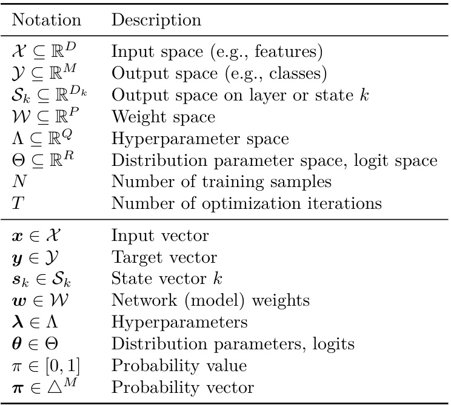
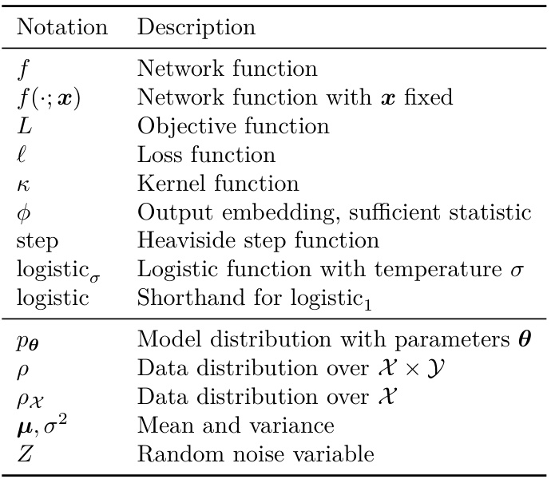
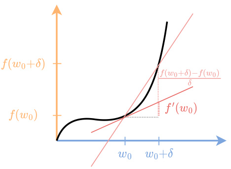
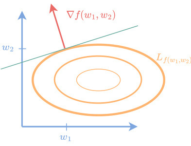
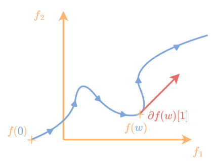
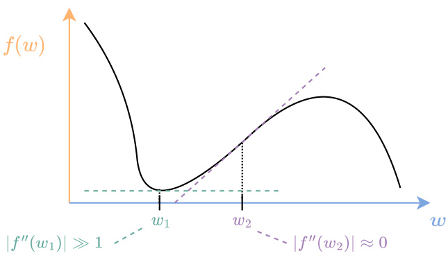

# The Elements of Di!erentiable Programming  

Mathieu Blondel Google DeepMind mblondel@google.com  

Vincent Roulet Google DeepMind vroulet@google.com  

# Contents  

Introduction 4   
1.1 What is di!erentiable programming? . . . . . . . . . . . . 4   
1.2 Book goals and scope . . . . . . . . . . . . . . . . . . . . 6   
1.3 Intended audience . . . . . . . . . . . . . . . . . . . . . . 7   
1.4 How to read this book? . . . . . . . . . . . . . . . . . . . 7   
1.5 Related work . . . . . . . . . . . . . . . . . . . . . . . . . 7  

# I Fundamentals 9  

# 2 Di!erentiation 10  

2.1 Univariate functions . . . . . . . . . . . . . . . . . . . . . 10   
2.1.1 Derivatives . . . . . . . . . . . . . . . . . . . . . . 10   
2.1.2 Calculus rules . . . . . . . . . . . . . . . . . . . . 13   
2.1.3 Leibniz’s notation . . . . . . . . . . . . . . . . . . 15   
2.2 Multivariate functions . . . . . . . . . . . . . . . . . . . . 16   
2.2.1 Directional derivatives . . . . . . . . . . . . . . . . 16   
2.2.2 Gradients . . . . . . . . . . . . . . . . . . . . . . 17   
2.2.3 Jacobians . . . . . . . . . . . . . . . . . . . . . . 20   
2.3 Linear di!erentiation maps . . . . . . . . . . . . . . . . . 26   
2.3.1 The need for linear maps . . . . . . . . . . . . . . 26   
2.3.2 Euclidean spaces . . . . . . . . . . . . . . . . . . . 27   
2.3.3 Linear maps and their adjoints . . . . . . . . . . . 28   
2.3.4 Jacobian-vector products . . . . . . . . . . . . . . 29   
2.3.5 Vector-Jacobian products . . . . . . . . . . . . . . 30   
2.3.6 Chain rule . . . . . . . . . . . . . . . . . . . . . . 31   
2.3.7 Functions of multiple inputs (fan-in) . . . . . . . . 32   
2.3.8 Functions of multiple outputs (fan-out) . . . . . . 34   
2.3.9 Extensions to non-Euclidean linear spaces . . . . . 34   
2.4 Second-order di!erentiation . . . . . . . . . . . . . . . . . 36   
2.4.1 Second derivatives . . . . . . . . . . . . . . . . . . 36   
2.4.2 Second directional derivatives . . . . . . . . . . . . 36   
2.4.3 Hessians . . . . . . . . . . . . . . . . . . . . . . . 37   
2.4.4 Hessian-vector products . . . . . . . . . . . . . . . 39   
2.4.5 Second-order Jacobians . . . . . . . . . . . . . . . 39   
2.5 Higher-order di!erentiation . . . . . . . . . . . . . . . . . 40   
2.5.1 Higher-order derivatives . . . . . . . . . . . . . . . 40   
2.5.2 Higher-order directional derivatives . . . . . . . . . 41   
2.5.3 Higher-order Jacobians . . . . . . . . . . . . . . . 41   
2.5.4 Taylor expansions . . . . . . . . . . . . . . . . . . 42   
2.6 Di!erential geometry . . . . . . . . . . . . . . . . . . . . 43   
2.6.1 Di!erentiability on manifolds . . . . . . . . . . . . 43   
2.6.2 Tangent spaces and pushforward operators . . . . . 44   
2.6.3 Cotangent spaces and pullback operators . . . . . 45   
2.7 Generalized derivatives . . . . . . . . . . . . . . . . . . . 48   
2.7.1 Rademacher’s theorem . . . . . . . . . . . . . . . 49   
2.7.2 Clarke derivatives . . . . . . . . . . . . . . . . . . 49   
2.8 Summary . . . . . . . . . . . . . . . . . . . . . . . . . . . 52  

# 3 Probabilistic learning 54  

3.1 Probability distributions . . . . . . . . . . . . . . . . . . . 54   
3.1.1 Discrete probability distributions . . . . . . . . . . 54   
3.1.2 Continuous probability distributions . . . . . . . . 55   
3.2 Maximum likelihood estimation . . . . . . . . . . . . . . . 56   
3.2.1 Negative log-likelihood . . . . . . . . . . . . . . . 56   
3.2.2 Consistency w.r.t. the Kullback-Leibler divergence .56   
3.3 Probabilistic supervised learning . . . . . . . . . . . . . . 57   
3.3.1 Conditional probability distributions . . . . . . . . 57   
3.3.2 Inference . . . . . . . . . . . . . . . . . . . . . . . 57   
3.3.3 Binary classification . . . . . . . . . . . . . . . . . 58   
3.3.4 Multiclass classification . . . . . . . . . . . . . . . 60   
3.3.5 Regression . . . . . . . . . . . . . . . . . . . . . . 61   
3.3.6 Multivariate regression . . . . . . . . . . . . . . . 62   
3.3.7 Integer regression . . . . . . . . . . . . . . . . . . 63   
3.3.8 Loss functions . . . . . . . . . . . . . . . . . . . . 63   
3.4 Exponential family distributions . . . . . . . . . . . . . . . 65   
3.4.1 Definition . . . . . . . . . . . . . . . . . . . . . . 65   
3.4.2 The log-partition function . . . . . . . . . . . . . . 67   
3.4.3 Maximum entropy principle . . . . . . . . . . . . . 68   
3.4.4 Maximum likelihood estimation . . . . . . . . . . . 69   
3.4.5 Probabilistic learning with exponential families . . . 69   
3.5 Summary . . . . . . . . . . . . . . . . . . . . . . . . . . . 71  

# II Di!erentiable programs 72  

# 4 Parameterized programs 73  

4.1 Representing computer programs . . . . . . . . . . . . . . 73   
4.1.1 Computation chains . . . . . . . . . . . . . . . . . 73   
4.1.2 Directed acylic graphs . . . . . . . . . . . . . . . . 74   
4.1.3 Computer programs as DAGs . . . . . . . . . . . . 76   
4.1.4 Arithmetic circuits . . . . . . . . . . . . . . . . . . 78   
4.2 Feedforward networks . . . . . . . . . . . . . . . . . . . . 79   
4.3 Multilayer perceptrons . . . . . . . . . . . . . . . . . . . . 79   
4.3.1 Combining a!ne layers and activations . . . . . . . 79   
4.3.2 Link with generalized linear models . . . . . . . . . 80   
4.4 Activation functions . . . . . . . . . . . . . . . . . . . . . 81   
4.4.1 Scalar-to-scalar nonlinearities . . . . . . . . . . . . 81   
4.4.2 Vector-to-scalar nonlinearities . . . . . . . . . . . . 81   
4.4.3 Scalar-to-scalar probability mappings . . . . . . . . 82   
4.4.4 Vector-to-vector probability mappings . . . . . . . 83   
4.5 Residual neural networks . . . . . . . . . . . . . . . . . . 85   
4.6 Recurrent neural networks . . . . . . . . . . . . . . . . . . 86   
4.6.1 Vector to sequence . . . . . . . . . . . . . . . . . 86   
4.6.2 Sequence to vector . . . . . . . . . . . . . . . . . 88   
4.6.3 Sequence to sequence (aligned) . . . . . . . . . . . 88   
4.6.4 Sequence to sequence (unaligned) . . . . . . . . . 88   
4.7 Summary . . . . . . . . . . . . . . . . . . . . . . . . . . . 89  

# 5 Control flows 90  

5.1 Comparison operators . . . . . . . . . . . . . . . . . . . . 90   
5.2 Soft inequality operators . . . . . . . . . . . . . . . . . . 92   
5.2.1 Heuristic definition . . . . . . . . . . . . . . . . . 92   
5.2.2 Stochastic process perspective . . . . . . . . . . . 92   
5.3 Soft equality operators . . . . . . . . . . . . . . . . . . . 93   
5.3.1 Heuristic definition . . . . . . . . . . . . . . . . . 93   
5.3.2 Gaussian process perspective . . . . . . . . . . . . 94   
5.4 Logical operators . . . . . . . . . . . . . . . . . . . . . . 95   
5.5 Continuous extensions of logical operators . . . . . . . . . 96   
5.5.1 Probabilistic continuous extension . . . . . . . . . 96   
5.5.2 Triangular norms and co-norms . . . . . . . . . . . 98   
5.6 If-else statements . . . . . . . . . . . . . . . . . . . . . . 98   
5.6.1 Di!erentiating through branch variables . . . . . . 99   
5.6.2 Di!erentiating through predicate variables . . . . . 100   
5.6.3 Continuous relaxations . . . . . . . . . . . . . . . 101   
5.7 Else-if statements . . . . . . . . . . . . . . . . . . . . . . 102   
5.7.1 Encoding $K$ branches . . . . . . . . . . . . . . . . 103   
5.7.2 Conditionals . . . . . . . . . . . . . . . . . . . . . 104   
5.7.3 Di!erentiating through branch variables . . . . . . 105   
5.7.4 Di!erentiating through predicate variables . . . . . 106   
5.7.5 Continuous relaxations . . . . . . . . . . . . . . . 106   
5.8 For loops . . . . . . . . . . . . . . . . . . . . . . . . . . . 108   
5.9 Scan functions . . . . . . . . . . . . . . . . . . . . . . . . 109   
5.10 While loops . . . . . . . . . . . . . . . . . . . . . . . . . 110   
5.10.1 While loops as cyclic graphs . . . . . . . . . . . . 110   
5.10.2 Unrolled while loops . . . . . . . . . . . . . . . . . 111   
5.10.3 Markov chain perspective . . . . . . . . . . . . . . 113   
5.11 Summary . . . . . . . . . . . . . . . . . . . . . . . . . . . 116  

117  

# 6 Finite di!erences 118  

6.1 Forward di!erences . . . . . . . . . . . . . . . . . . . . . 118   
6.2 Backward di!erences . . . . . . . . . . . . . . . . . . . . 119   
6.3 Central di!erences . . . . . . . . . . . . . . . . . . . . . . 120   
6.4 Higher-accuracy finite di!erences . . . . . . . . . . . . . . 121   
6.5 Higher-order finite di!erences . . . . . . . . . . . . . . . . 122   
6.6 Complex-step derivatives . . . . . . . . . . . . . . . . . . 123   
6.7 Complexity . . . . . . . . . . . . . . . . . . . . . . . . . . 124   
6.8 Summary . . . . . . . . . . . . . . . . . . . . . . . . . . . 124  

# 7 Automatic di!erentiation 126  

7.1 Computation chains . . . . . . . . . . . . . . . . . . . . . 126   
7.1.1 Forward-mode . . . . . . . . . . . . . . . . . . . . 127   
7.1.2 Reverse-mode . . . . . . . . . . . . . . . . . . . . 129   
7.1.3 Complexity of entire Jacobians . . . . . . . . . . . 134   
7.2 Feedforward networks . . . . . . . . . . . . . . . . . . . . 136   
7.2.1 Computing the adjoint . . . . . . . . . . . . . . . 136   
7.2.2 Computing the gradient . . . . . . . . . . . . . . . 137   
7.3 Computation graphs . . . . . . . . . . . . . . . . . . . . . 139   
7.3.1 Forward-mode . . . . . . . . . . . . . . . . . . . . 139   
7.3.2 Reverse-mode . . . . . . . . . . . . . . . . . . . . 140   
7.3.3 Complexity, the Baur-Strassen theorem . . . . . . . 140   
7.4 Implementation . . . . . . . . . . . . . . . . . . . . . . . 141   
7.4.1 Primitive functions . . . . . . . . . . . . . . . . . 141   
7.4.2 Closure under function composition . . . . . . . . 142   
7.4.3 Examples of JVPs and VJPs . . . . . . . . . . . . 143   
7.4.4 Automatic linear transposition . . . . . . . . . . . 144   
7.5 Checkpointing . . . . . . . . . . . . . . . . . . . . . . . . 145   
7.5.1 Recursive halving . . . . . . . . . . . . . . . . . . 146   
7.5.2 Dynamic programming . . . . . . . . . . . . . . . 148   
7.5.3 Online checkpointing . . . . . . . . . . . . . . . . 150   
7.6 Reversible layers . . . . . . . . . . . . . . . . . . . . . . . 151   
7.6.1 General case . . . . . . . . . . . . . . . . . . . . . 151   
7.6.2 Case of orthonormal JVPs . . . . . . . . . . . . . 151   
7.7 Randomized forward-mode estimator . . . . . . . . . . . . 152   
7.8 Summary . . . . . . . . . . . . . . . . . . . . . . . . . . . 152  

# 8 Second-order automatic di!erentiation 154  

8.1 Hessian-vector products . . . . . . . . . . . . . . . . . . . 154   
8.1.1 Four possible methods . . . . . . . . . . . . . . . 154   
8.1.2 Complexity . . . . . . . . . . . . . . . . . . . . . . 155   
8.2 Gauss-Newton matrix . . . . . . . . . . . . . . . . . . . . 159   
8.2.1 An approximation of the Hessian . . . . . . . . . . 159   
8.2.2 Gauss-Newton chain rule . . . . . . . . . . . . . . 160   
8.2.3 Gauss-Newton vector product . . . . . . . . . . . . 160   
8.2.4 Gauss-Newton matrix factorization . . . . . . . . . 161   
8.2.5 Stochastic setting . . . . . . . . . . . . . . . . . . 162   
8.3 Fisher information matrix . . . . . . . . . . . . . . . . . . 162   
8.3.1 Definition using the score function . . . . . . . . . 162   
8.3.2 Link with the Hessian . . . . . . . . . . . . . . . . 163   
8.3.3 Equivalence with the Gauss-Newton matrix . . . . 163   
8.4 Inverse-Hessian vector product . . . . . . . . . . . . . . . 165   
8.4.1 Definition as a linear map . . . . . . . . . . . . . . 165   
8.4.2 Implementation with matrix-free linear solvers . . . 165   
8.4.3 Complexity . . . . . . . . . . . . . . . . . . . . . . 166   
8.5 Second-order backpropagation . . . . . . . . . . . . . . . 167   
8.5.1 Second-order Jacobian chain rule . . . . . . . . . . 167   
8.5.2 Computation chains . . . . . . . . . . . . . . . . . 169   
8.5.3 Fan-in and fan-out . . . . . . . . . . . . . . . . . 170   
8.6 Block diagonal approximations . . . . . . . . . . . . . . . 171   
8.6.1 Feedforward networks . . . . . . . . . . . . . . . . 171   
8.6.2 Computation graphs . . . . . . . . . . . . . . . . . 173   
8.7 Diagonal approximations . . . . . . . . . . . . . . . . . . 173   
8.7.1 Computation chains . . . . . . . . . . . . . . . . . 174   
8.7.2 Computation graphs . . . . . . . . . . . . . . . . . 175   
8.8 Randomized estimators . . . . . . . . . . . . . . . . . . . 176   
8.8.1 Girard-Hutchinson estimator . . . . . . . . . . . . 176   
8.8.2 Bartlett estimator for the factorization . . . . . . . 177   
8.8.3 Bartlett estimator for the diagonal . . . . . . . . . 178   
8.9 Summary . . . . . . . . . . . . . . . . . . . . . . . . . . . 179  

# 9 Inference in graphical models as di!erentiation 180  

9.1 Chain rule of probability . . . . . . . . . . . . . . . . . . . 180   
9.2 Conditional independence . . . . . . . . . . . . . . . . . . 181   
9.3 Inference problems . . . . . . . . . . . . . . . . . . . . . . 182   
9.3.1 Joint probability distributions . . . . . . . . . . . . 182   
9.3.2 Likelihood . . . . . . . . . . . . . . . . . . . . . . 182   
9.3.3 Maximum a-posteriori inference . . . . . . . . . . . 182   
9.3.4 Marginal inference . . . . . . . . . . . . . . . . . . 183   
9.3.5 Expectation, convex hull, marginal polytope . . . . 183   
9.3.6 Complexity of brute force . . . . . . . . . . . . . . 185   
9.4 Markov chains . . . . . . . . . . . . . . . . . . . . . . . . 185   
9.4.1 The Markov property . . . . . . . . . . . . . . . . 186   
9.4.2 Time-homogeneous Markov chains . . . . . . . . . 188   
9.4.3 Higher-order Markov chains . . . . . . . . . . . . . 189   
9.5 Bayesian networks . . . . . . . . . . . . . . . . . . . . . . 189   
9.5.1 Expressing variable dependencies using DAGs . . . 189   
9.5.2 Parameterizing Bayesian networks . . . . . . . . . 190   
9.5.3 Ancestral sampling . . . . . . . . . . . . . . . . . 191   
9.6 Markov random fields . . . . . . . . . . . . . . . . . . . . 191   
9.6.1 Expressing factors using undirected graphs . . . . . 191   
9.6.2 MRFs as exponential family distributions . . . . . . 192   
9.6.3 Conditional random fields . . . . . . . . . . . . . . 194   
9.6.4 Sampling . . . . . . . . . . . . . . . . . . . . . . . 194   
9.7 Inference on chains . . . . . . . . . . . . . . . . . . . . . 194   
9.7.1 The forward-backward algorithm . . . . . . . . . . 195   
9.7.2 The Viterbi algorithm . . . . . . . . . . . . . . . . 196   
9.8 Inference on trees . . . . . . . . . . . . . . . . . . . . . . 198   
9.9 Inference as di!erentiation . . . . . . . . . . . . . . . . . 199   
9.9.1 Inference as gradient of the log-partition . . . . . . 199   
9.9.2 Semirings and softmax operators . . . . . . . . . . 200   
9.9.3 Inference as backpropagation . . . . . . . . . . . . 202   
9.10 Summary . . . . . . . . . . . . . . . . . . . . . . . . . . . 204  

# 10 Di!erentiating through optimization 205  

10.1 Implicit functions . . . . . . . . . . . . . . . . . . . . . . 205   
10.1.1 Optimization problems . . . . . . . . . . . . . . . 206   
10.1.2 Nonlinear equations . . . . . . . . . . . . . . . . . 206   
10.1.3 Application to bilevel optimization . . . . . . . . . 206   
10.2 Envelope theorems . . . . . . . . . . . . . . . . . . . . . . 207   
10.2.1 Danskin’s theorem . . . . . . . . . . . . . . . . . . 208   
10.2.2 Rockafellar’s theorem . . . . . . . . . . . . . . . . 209   
10.3 Implicit function theorem . . . . . . . . . . . . . . . . . . 210   
10.3.1 Univariate functions . . . . . . . . . . . . . . . . . 210   
10.3.2 Multivariate functions . . . . . . . . . . . . . . . . 211   
10.3.3 JVP and VJP of implicit functions . . . . . . . . . 213   
10.3.4 Proof of the implicit function theorem . . . . . . . 214   
10.4 Adjoint state method . . . . . . . . . . . . . . . . . . . . 214   
10.4.1 Di!erentiating nonlinear equations . . . . . . . . . 214   
10.4.2 Relation with envelope theorems . . . . . . . . . . 216   
10.4.3 Proof using the method of Lagrange multipliers . . 216   
10.4.4 Proof using the implicit function theorem . . . . . 217   
10.4.5 Reverse mode as adjoint method with backsubstitution 217   
10.5 Inverse function theorem . . . . . . . . . . . . . . . . . . 220   
10.5.1 Di!erentiating inverse functions . . . . . . . . . . 220   
10.5.2 Link with the implicit function theorem . . . . . . 220   
10.5.3 Proof of inverse function theorem . . . . . . . . . 221   
10.6 Summary . . . . . . . . . . . . . . . . . . . . . . . . . . . 222  

# 11 Di!erentiating through integration 224  

11.1 Di!erentiation under the integral sign . . . . . . . . . . . 224   
11.2 Di!erentiating through expectations . . . . . . . . . . . . 225   
11.2.1 The easy case . . . . . . . . . . . . . . . . . . . . 226   
11.2.2 Exact gradients . . . . . . . . . . . . . . . . . . . 226   
11.2.3 Application to expected loss functions . . . . . . . 227   
11.2.4 Application to experimental design . . . . . . . . . 228   
11.3 Score function estimators, REINFORCE . . . . . . . . . . 229   
11.3.1 Scalar-valued functions . . . . . . . . . . . . . . . 229   
11.3.2 Variance reduction . . . . . . . . . . . . . . . . . . 231   
11.3.3 Vector-valued functions . . . . . . . . . . . . . . . 233   
11.3.4 Second derivatives . . . . . . . . . . . . . . . . . . 234   
11.4 Path gradient estimators, reparametrization trick . . . . . 235   
11.4.1 Location-scale transforms . . . . . . . . . . . . . . 235   
11.4.2 Inverse transforms . . . . . . . . . . . . . . . . . . 236   
11.4.3 Pushforward operators . . . . . . . . . . . . . . . 238   
11.4.4 Change-of-variables theorem . . . . . . . . . . . . 240   
11.5 Stochastic programs . . . . . . . . . . . . . . . . . . . . . 240   
11.5.1 Stochastic computation graphs . . . . . . . . . . . 241   
11.5.2 Examples . . . . . . . . . . . . . . . . . . . . . . 243   
11.5.3 Unbiased gradient estimators . . . . . . . . . . . . 245   
11.5.4 Local vs. global expectations . . . . . . . . . . . . 247   
11.6 Di!erential equations . . . . . . . . . . . . . . . . . . . . 248   
11.6.1 Parameterized di!erential equations . . . . . . . . 248   
11.6.2 Continuous adjoint method . . . . . . . . . . . . . 251   
11.6.3 Gradients via the continuous adjoint method . . . . 252   
11.6.4 Gradients via reverse-mode on discretization . . . . 254   
11.6.5 Reversible discretization schemes . . . . . . . . . . 255   
11.6.6 Proof of the continuous adjoint method . . . . . . 257   
11.7 Summary . . . . . . . . . . . . . . . . . . . . . . . . . . . 259  

# IV Smoothing programs 261  

# 12 Smoothing by optimization 262  

12.1 Primal approach . . . . . . . . . . . . . . . . . . . . . . . 262   
12.1.1 Infimal convolution . . . . . . . . . . . . . . . . . 262   
12.1.2 Moreau envelope . . . . . . . . . . . . . . . . . . 263   
12.2 Legendre–Fenchel transforms, convex conjugates . . . . . . 265   
12.2.1 Definition . . . . . . . . . . . . . . . . . . . . . . 265   
12.2.2 Closed-form examples . . . . . . . . . . . . . . . . 266   
12.2.3 Properties . . . . . . . . . . . . . . . . . . . . . . 267   
12.2.4 Conjugate calculus . . . . . . . . . . . . . . . . . 269   
12.2.5 Fast Legendre transform . . . . . . . . . . . . . . 270   
12.3 Dual approach . . . . . . . . . . . . . . . . . . . . . . . . 270   
12.3.1 Duality between strong convexity and smoothness .270   
12.3.2 Smoothing by dual regularization . . . . . . . . . . 271   
12.3.3 Equivalence between primal and dual regularizations 273   
12.4 Examples . . . . . . . . . . . . . . . . . . . . . . . . . . . 273   
12.4.1 Smoothed ReLU functions . . . . . . . . . . . . . 273   
12.4.2 Smoothed max operators . . . . . . . . . . . . . . 274   
12.4.3 Relaxed step functions (sigmoids) . . . . . . . . . 276   
12.4.4 Relaxed argmax operators . . . . . . . . . . . . . . 277   
12.5 Summary . . . . . . . . . . . . . . . . . . . . . . . . . . . 278  

# 13 Smoothing by integration 279  

13.1 Convolution . . . . . . . . . . . . . . . . . . . . . . . . . 279   
13.1.1 Convolution operators . . . . . . . . . . . . . . . . 279   
13.1.2 Convolution with a kernel . . . . . . . . . . . . . . 280   
13.1.3 Discrete convolution . . . . . . . . . . . . . . . . . 281   
13.1.4 Di!erentiation . . . . . . . . . . . . . . . . . . . . 283   
13.1.5 Multidimensional convolution . . . . . . . . . . . . 283   
13.1.6 Link between convolution and infimal convolution .283   
13.2 Fourier and Laplace transforms . . . . . . . . . . . . . . . 284   
13.2.1 Convolution theorem . . . . . . . . . . . . . . . . 284   
13.2.2 Link between Fourier and Legendre transforms . . . 285   
13.2.3 The soft Legendre-Fenchel transform . . . . . . . . 285   
13.3 Examples . . . . . . . . . . . . . . . . . . . . . . . . . . . 289   
13.3.1 Smoothed step function . . . . . . . . . . . . . . . 289   
13.3.2 Smoothed ReLU function . . . . . . . . . . . . . . 290   
13.4 Perturbation of blackbox functions . . . . . . . . . . . . . 291   
13.4.1 Expectation in a location-scale family . . . . . . . 291   
13.4.2 Gradient estimation by reparametrization . . . . . 292   
13.4.3 Gradient estimation by SFE, Stein’s lemma . . . . 293   
13.4.4 Link between reparametrization and SFE . . . . . . 294   
13.4.5 Variance reduction and evolution strategies . . . . 295   
13.4.6 Zero-temperature limit . . . . . . . . . . . . . . . 296   
13.5 Gumbel tricks . . . . . . . . . . . . . . . . . . . . . . . . 296   
13.5.1 The Gumbel distribution . . . . . . . . . . . . . . 296   
13.5.2 Perturbed comparison . . . . . . . . . . . . . . . . 297   
13.5.3 Perturbed argmax . . . . . . . . . . . . . . . . . . 298   
13.5.4 Perturbed max . . . . . . . . . . . . . . . . . . . . 300   
13.5.5 Gumbel trick for sampling . . . . . . . . . . . . . . 301   
13.5.6 Perturb-and-MAP . . . . . . . . . . . . . . . . . . 301   
13.5.7 Gumbel-softmax . . . . . . . . . . . . . . . . . . . 303   
13.6 Summary . . . . . . . . . . . . . . . . . . . . . . . . . . . 304  

306  

# 14 Optimization basics 307  

14.1 Objective functions . . . . . . . . . . . . . . . . . . . . . 307   
14.2 Oracles . . . . . . . . . . . . . . . . . . . . . . . . . . . . 308   
14.3 Variational perspective of optimization algorithms . . . . . 309   
14.4 Classes of functions . . . . . . . . . . . . . . . . . . . . . 309   
14.4.1 Lipschitz functions . . . . . . . . . . . . . . . . . 309   
14.4.2 Smooth functions . . . . . . . . . . . . . . . . . . 310   
14.4.3 Convex functions . . . . . . . . . . . . . . . . . . 312   
14.4.4 Strongly-convex functions . . . . . . . . . . . . . . 314   
14.4.5 Nonconvex functions . . . . . . . . . . . . . . . . 315   
14.5 Performance guarantees . . . . . . . . . . . . . . . . . . . 316   
14.6 Summary . . . . . . . . . . . . . . . . . . . . . . . . . . . 319  

# 15 First-order optimization 320  

15.1 Gradient descent . . . . . . . . . . . . . . . . . . . . . . . 320   
15.1.1 Variational perspective . . . . . . . . . . . . . . . 320   
15.1.2 Convergence for smooth functions . . . . . . . . . 321   
15.1.3 Momentum and accelerated variants . . . . . . . . 323   
15.2 Stochastic gradient descent . . . . . . . . . . . . . . . . . 323   
15.2.1 Stochastic gradients . . . . . . . . . . . . . . . . . 324   
15.2.2 Vanilla SGD . . . . . . . . . . . . . . . . . . . . . 325   
15.2.3 Momentum variants . . . . . . . . . . . . . . . . . 326   
15.2.4 Adaptive variants . . . . . . . . . . . . . . . . . . 327   
15.3 Projected gradient descent . . . . . . . . . . . . . . . . . 328   
15.3.1 Variational perspective . . . . . . . . . . . . . . . 328   
15.3.2 Optimality conditions . . . . . . . . . . . . . . . . 329   
15.3.3 Commonly-used projections . . . . . . . . . . . . . 329   
15.4 Proximal gradient method . . . . . . . . . . . . . . . . . . 330   
15.4.1 Variational perspective . . . . . . . . . . . . . . . 331   
15.4.2 Optimality conditions . . . . . . . . . . . . . . . . 331   
15.4.3 Commonly-used proximal operators . . . . . . . . . 332   
15.5 Summary . . . . . . . . . . . . . . . . . . . . . . . . . . . 333  

# 16 Second-order optimization  

16.1 Newton’s method . . . . . . . . . . . . . . . . . . . . . . 334   
16.1.1 Variational perspective . . . . . . . . . . . . . . . 334   
16.1.2 Regularized Newton method . . . . . . . . . . . . 335   
16.1.3 Approximate direction . . . . . . . . . . . . . . . . 336   
16.1.4 Convergence guarantees . . . . . . . . . . . . . . . 336   
16.1.5 Linesearch . . . . . . . . . . . . . . . . . . . . . . 336   
16.1.6 Geometric interpretation . . . . . . . . . . . . . . 337   
16.1.7 Stochastic Newton’s method . . . . . . . . . . . . 338   
16.2 Gauss-Newton method . . . . . . . . . . . . . . . . . . . 339   
16.2.1 With exact outer function . . . . . . . . . . . . . . 340   
16.2.2 With approximate outer function . . . . . . . . . . 341   
16.2.3 Linesearch . . . . . . . . . . . . . . . . . . . . . . 342   
16.2.4 Stochastic Gauss-Newton . . . . . . . . . . . . . . 342   
16.3 Natural gradient descent . . . . . . . . . . . . . . . . . . 343   
16.3.1 Variational perspective . . . . . . . . . . . . . . . 343   
16.3.2 Stochastic natural gradient descent . . . . . . . . . 344   
16.4 Quasi-Newton methods . . . . . . . . . . . . . . . . . . . 345   
16.4.1 BFGS . . . . . . . . . . . . . . . . . . . . . . . . 345   
16.4.2 Limited-memory BFGS . . . . . . . . . . . . . . . 346   
16.5 Approximate Hessian diagonal inverse preconditionners . . 346   
16.6 Summary . . . . . . . . . . . . . . . . . . . . . . . . . . . 346  

# 17 Duality  

17.1 Dual norms . . . . . . . . . . . . . . . . . . . . . . . . . 348   
17.2 Fenchel duality . . . . . . . . . . . . . . . . . . . . . . . . 349   
17.3 Bregman divergences . . . . . . . . . . . . . . . . . . . . 352   
17.4 Fenchel-Young loss functions . . . . . . . . . . . . . . . . 355   
17.5 Summary . . . . . . . . . . . . . . . . . . . . . . . . . . . 356  

# The Elements of Di!erentiable Programming  

Mathieu Blondel $^{1}$ and Vincent Roulet 1  

$^{1}$ Google DeepMind  

# ABSTRACT  

Artificial intelligence has recently experienced remarkable advances, fueled by large models, vast datasets, accelerated hardware, and, last but not least, the transformative power of di!erentiable programming. This new programming paradigm enables end-to-end di!erentiation of complex computer programs (including those with control flows and data structures), making gradient-based optimization of program parameters possible.  

As an emerging paradigm, di!erentiable programming builds upon several areas of computer science and applied mathematics, including automatic di!erentiation, graphical models, optimization and statistics. This book presents a comprehensive review of the fundamental concepts useful for di!erentiable programming. We adopt two main perspectives, that of optimization and that of probability, with clear analogies between the two.  

Di!erentiable programming is not merely the di!erentiation of programs, but also the thoughtful design of programs intended for di!erentiation. By making programs di!erentiable, we inherently introduce probability distributions over their execution, providing a means to quantify the uncertainty associated with program outputs.  

# Notation  

Table 1: Naming conventions   

  

Table 2: Naming conventions (continued)   

  

# Introduction  

# 1.1 What is di!erentiable programming?  

A computer program is a sequence of elementary instructions for performing a task. In traditional programming, the program is typically hand-written by a programmer. However, for certain tasks, such as image recognition or text generation, hand-writing a program to perform such tasks is nearly impossible.  

This has motivated the need for statistical approaches based on machine learning. With di!erentiable programming, while the overall structure of the program is typically designed by a human, parameters of the program (such as weights in a neural network) can be automatically adjusted to achieve a task or optimize a criterion. This paradigm has also been referred to as “software 2.0”. We give an informal definition.  

Definition 1.1 (Di!erentiable programming) .Di!erentiable programming is a programming paradigm in which complex computer programs (including those with control flows and data structures) can be di!erentiated end-to-end automatically, enabling gradient-based optimization of parameters in the program.  

In di!erentiable programming, a program is also defined as the composition of elementary operations, forming a computation graph .The key di!erence with classical computer programming is that the program can be di!erentiated end-to-end, using automatic di!erentiation (autodi!). Typically, it is assumed that the program defines a mathematically valid function (a.k.a. pure function): the function should return identical values for identical arguments and should not have any side e!ects. Moreover, the function should have well-defined derivatives , ensuring that it can be used in a gradient-based optimization algorithm. Therefore, di!erentiable programming is not only the art of di!erentiating through programs but also of designing meaningful di!erentiable programs.  

# Why are derivatives important?  

Machine learning typically boils down to optimizing a certain objective function, which is the composition of a loss function and a model (network) function. Derivative-free optimization is called zero-order optimization . It only assumes that we can evaluate the objective function that we wish to optimize. Unfortunately, it is known to su!er from the curse of dimensionality , i.e., it only scales to small dimensional problems, such as less than 10 dimensions. Derivative-based optimization, on the other hand, is much more e"cient and can scale to millions or billions of parameters. Algorithms that use first and second derivatives are known as first-order and second-order algorithms, respectively.  

# Why is autodi! important?  

Before the autodi! revolution, researchers and practitioners needed to manually implement the gradient of the functions they wished to optimize. Manually deriving gradients can become very tedious for complicated functions. Moreover, every time the function is changed (for example, for trying out a new idea), the gradient needs to be rederived. Autodi! is a game changer because it allows users to focus on quickly and creatively experimenting with functions for their tasks.  

# Di!erentiable programming is not just deep learning  

While there is clearly overlap between deep learning and di!erentiable programming, their focus is di!erent. Deep learning studies artificial neural networks composed of multiple layers, able to learn intermediate representations of the data. Neural network architectures have been proposed with various inductive biases . For example, convolutional neural networks are designed for images and transformers are designed for sequences. On the other hand, di!erentiable programming studies the techniques to di!erentiate through complex programs. It is useful beyond deep learning: for instance in reinforcement learning, probabilistic programming and scientific computing in general.  

# Di!erentiable programming is not just autodi!  

While autodi! is a key ingredient of di!erentiable programming, this is not the only one. Di!erentiable programming is also concerned with the design of principled di!erentiable operations. In fact, much research on di!erentiable programming has been devoted to make classifical computer programming operations compatible with autodi!. As we shall see, many di!erentiable relaxations can be interpreted in a probabilistic framework. A core theme of this book is the interplay between optimization, probability and di!erentiation. Di!erentiation is useful for optimization and conversely, optimization can be used to design di!erentiable operators.  

# 1.2 Book goals and scope  

The present book aims to provide an comprehensive introduction to di!erentiable programming with an emphasis on core mathematical tools .  

•In Part I , we review fundamentals : di!erentiation and probabilistic learning. •In Part II , we review di!erentiable programs . This includes neural networks, sequence networks and control flows.  

•In Part III , we review how to di!erentiate through programs .This includes automatic di!erentiation, but also di!erentiating through optimization and integration (in particular, expectations).   
•In Part IV , we review smoothing programs . We focus on two main techniques: infimal convolution, which comes from the world of optimization and convolution, which comes from the world of integration. We also strive to spell out the connections between them.   
•In Part V, we review optimizing programs : basic optimization concepts, first-order algorithms, second-order-algorithms and duality.  

Our goal is to present the fundamental techniques useful for di!erentiable programming, not to survey how these techniques have been used in various applications.  

# 1.3 Intended audience  

This book is intended to be a graduate-level introduction to di!erentiable programming. Our pedagogical choices are made with the machine learning community in mind. Some familiarity with calculus, linear algebra, probability theory and machine learning is beneficial.  

# 1.4 How to read this book?  

This book does not need to be read linearly chapter by chapter. When needed, we indicate at the beginning of a chapter what chapters are recommended to be read as a prerequisite.  

# 1.5 Related work  

Di!erentiable programming builds upon a variety of connected topics.   
We review in this section relevant textbooks, tutorials and software.  

Standard textbooks on backpropagation and automatic di!erentiation are that of Werbos ( 1994 ) and Griewank and Walther ( 2008 ).  

A tutorial with a focus on machine learning is provided by Baydin et al. (2018 ). Automatic di!erentiation is also reviewed as part of more general textbooks, such as those of Deisenroth et al. (2020 ), Murphy (2022 ) (from a linear algebra perspective) and Murphy ( 2023 ) (from a functional perspective; autodi! section authored by Roy Frostig). The present book was also influenced by Peyré ( 2020 )’s textbook on data science. The history of reverse-mode autodi! is reviewed by Griewank (2012 ).  

A tutorial on di!erent perspectives of backpropagation is “There and Back Again: A Tale of Slopes and Expectations” ( link ), by Deisenroth and Ong. A tutorial on implicit di!erentiation is “Deep Implicit Layers - Neural ODEs, Deep Equilibirum Models, and Beyond” ( link ), by Kolter, Duvenaud, and Johnson.  

The standard reference on inference in graphical models and its connection with exponential families is that of Wainwright and Jordan ( 2008 ). Di!erential programming is also related to probabilistic programming; see, e.g., Meent et al. (2018 ).  

A review of smoothing from the infimal convolution perspective is provided by Beck and Teboulle ( 2012 ). A standard textbook on convex optimization is that of Nesterov ( 2018 ). A textbook on first-order optimization methods is that of Beck ( 2017 ).  

Autodi! implementations that accelerated the autodi! revolution in machine learning are Theano (Bergstra et al. ,2010 ) and Autograd (Maclaurin et al. ,2015 ). Major modern implementations of autodi! include Tensorflow (Abadi et al. ,2016 ), JAX (Bradbury et al. ,2018 ), and PyTorch (Paszke et al. ,2019 ). We in particular acknowledge the JAX team for influencing our view of autodi!.  

# Part I  

# Fundamentals  

# Di!erentiation  

In this chapter, we review key di!erentiation concepts. In particular, we emphasize on the fundamental role played by linear maps.  

# 2.1 Univariate functions  

# 2.1.1 Derivatives  

Before studying derivatives, we briefly recall the definition of function continuity .  

Definition 2.1 (Continuous function) .A function $f:\mathbb{R}\ \to\ \mathbb{R}$ is continuous at a point $w\in\mathbb{R}$ if  

$$
\operatorname*{lim}_{v\to w}f(v)=f(w).
$$  

A function $f$ is said to be continuous if it is continuous at all points in its domain.  

In the following, we use Landau’s little $o$ notation. We write  

$$
g(v)=o(f(v)){\mathrm{~as~}}v\to w
$$  

if  

$$
\operatorname*{lim}_{v\to w}{\frac{|g(v)|}{|f(v)|}}=0.
$$  

That is, the function $f$ dominates $g$ in the limit $v\rightarrow w$ . For example, $f$ is continuous at $w$ if and only if  

$$
f(w+\delta)=f(w)+o(1){\mathrm{~as~}}\delta\to0.
$$  

We now explain derivatives. Consider a function $f:\mathbb{R}\rightarrow\mathbb{R}$ . As illustrated in Fig. 2.1 , its value on an interval $[w_{0},w_{0}+\delta]$ can be approximated by the secant between its values $f(w_{0})$ and $f(w_{0}+\delta)$ ,a linear function with slope $(f(w_{0}+\delta)-f(w_{0}))/\delta$ . In the limit of an infinitesimal variation $\delta$ around $w_{0}$ , the secant converges to the tangent of $f$ at $w_{0}$ and the resulting slope defines the derivative of $f$ at $w_{0}$ . The definition below formalizes this intuition.  

Definition 2.2 (Derivative) .The derivative of $f:\mathbb{R}\rightarrow\mathbb{R}$ at $w\in$ $\mathbb{R}$ is defined as  

$$
f^{\prime}(w):=\operatorname*{lim}_{\delta\to0}{\frac{f(w+\delta)-f(w)}{\delta}},
$$  

provided that the limit exists. If $f^{\prime}(w)$ is well-defined at a particular $w$ , we say that the function $f$ is di!erentiable at $w$ .  

Here, and in the following definitions, if $f$ is di!erentiable at any $w\in\mathbb{R}$ , we say that it is di!erentiable everywhere or di!erentiable for short. If $f$ is di!erentiable at a given $w$ , then it is necessarily continuous at $w$ .  

Proposition 2.1 (Di!erentiability implies continuity) .If $f:\mathbb{R}\rightarrow\mathbb{R}$ is di!erentiable at $w\in\mathbb{R}$ , then it is continuous at $w\in\mathbb{R}$ .  

Proof. In little ${\cal O}$ notation, $f$ is di!erentiable at $w$ if there exists $f^{\prime}(w)\in$ $\mathbb{R}$ , such that  

$$
f(w+\delta)=f(w)+f^{\prime}(w)\delta+o(\delta){\mathrm{~as~}}\delta\to0.
$$  

Since $f^{\prime}(w)\delta+o(\delta)=o(1)$ as $\delta\rightarrow0$ ,$f$ is continuous at $w$ .  

  

Figure 2.1: A function $f$ can be locally approximated around a point $w_{0}$ by a secant, a linear function $w\mapsto a w+b$ with slope $a$ and intercept $b$ , crossing $f$ at $w_{0}$ with value $y_{0}=f(w_{0})$ and crossing at $w_{0}+\delta$ with value $u_{\delta}=f(w_{0}+\delta)$ . Using $u_{0}=a w_{0}+b$ and $u_{\delta}=a(w_{0}+\delta)+b$ , we find that its slope is $a=(f(w_{0}+\delta)-f(w_{0}))/\delta$ and the intercept is $b=f(w_{0})-a w_{0}$ . The derivative $f^{\prime}(w)$ of a function $f$ at a point $w_{0}$ is then defined as the limit of the slope $a$ when $\delta\rightarrow0$ . It is the slope of the tangent of $f$ at $w_{0}$ . The value $f(w)$ of the function at $w$ can then be locally approximated around $w_{0}$ by $w\mapsto f^{\prime}(w_{0})w+f(w_{0})-f^{\prime}(w_{0})w_{0}=f(w_{0})+f^{\prime}(w_{0})(w-w_{0})$ .  

In addition to enabling the construction of a linear approximation of $f$ in a neighborhood of $w$ , since it is the slope of the tangent of $f$ at $w$ , the derivative $f^{\prime}$ informs us about the monotonicity of $f$ around $w$ . If $f^{\prime}(w)$ is positive, the function is increasing around $w$ . Conversely, if $f^{\prime}(w)$ is negative, the function is decreasing. Such information can be used to develop iterative algorithms seeking to minimize $f$ by computing iterates of the form $w_{t+1}=w_{t}-\gamma f^{\prime}(w_{t})$ for $\gamma>0$ , which move along descent directions of $f$ around $w_{t}$ .  

For several elementary functions such as $w^{n}$ ,$e^{w}$ ,$\ln w$ ,$\mathrm{cos}\,w$ or $\sin w$ ,their derivatives can be obtained directly by applying the definition of the derivative in Eq. ( 2.1 ) as illustrated in Example 2.1 .  

Example 2.1 (Derivative of power function) .Consider $f(w)\,=\,w^{n}$ for $w\in\mathbb{R}$ ,$n\in\mathbb{N}\setminus\{0\}$ . For any $\delta\in\mathbb R$ , we have  

$$
\begin{array}{r l}{\lefteqn{\frac{f(w+\delta)-f(w)}{\delta}=\frac{(w+\delta)^{n}-w^{n}}{\delta}}}\\ &{=\frac{\sum_{k=0}^{n}\binom{n}{k}\delta^{k}w^{n-k}-w^{n}}{\delta}}\\ &{=\displaystyle\sum_{k=1}^{n}\binom{n}{k}\delta^{k-1}w^{n-k}}\\ &{=\binom{n}{1}w^{n-1}+\displaystyle\sum_{k=2}^{n}\binom{n}{k}\delta^{k-1}w^{n-k},}\end{array}
$$  

${\binom{n}{1}}=n$ where, in the second line, we used the binomial theorem. Since #=and $\begin{array}{r}{\operatorname*{lim}_{\delta\rightarrow0}\sum_{k=2}^{n}\binom{n}{k}\delta^{k-1}w^{n-k}=0}\end{array}$ ↑!"#= 0, we get $f^{\prime}(w)=n w^{n-1}$ .  

Remark 2.1 sented the definition of the derivative for a function defined on the (Functions on a subset $\mathcal{U}$ of $\mathbb{R}$ ).For simplicity, we prewhole set of real numbers $\mathbb{R}$ . If a function $f:\mathcal{U}\to\mathbb{R}$ is defined on a subset $\mathcal{U}\subseteq\mathbb{R}$ of the real numbers, as it is the case for $f(w)=\sqrt{w}$ defined on $\mathcal{U}\,=\,\mathbb{R}_{+}$ , the derivative of $f$ at $w\,\in\,\mathcal{U}$ is defined by the limit in (2.1 )provided that the function $f$ is well defined on a neighborhood of $w$ , that is, there exists $r>0$ such that $w+\delta\in\mathcal{U}$ for any $|\delta|\leq r$ . The function $f$ is then said di!erentiable everywhere or di!erentiable for short if it is di!erentiable at any point $w$ in the interior of $\boldsymbol{\mathcal{U}}$ , the set of points $w\in\mathcal{U}$ such that $\{w+\delta:|\delta|\leq r\}\subseteq\mathcal{U}$ for $r$ su"ciently small. For points lying at the boundary of $\boldsymbol{\mathcal{U}}$ (such as $a$ and $b$ if $\mathcal{U}=[a,b]$ ), one may define the right and left derivatives of $f$ at $a$ and $b$ , meaning that the limit is taken by approaching $a$ from the right or $b$ from the left.  

# 2.1.2 Calculus rules  

For a given $w\in\mathbb R$ and two functions $f:\mathbb{R}\rightarrow\mathbb{R}$ and $g:\mathbb{R}\to\mathbb{R}$ , the derivative of elementary operations on $f$ and $g$ such as their sums, products or compositions can easily be derived from the definition of the derivative, under appropriate conditions on the di!erentiability properties of $f$ and $g$ at $w$ . For example, if the derivative of $f$ and $g$ exist at $w$ then the derivative of their weighted sum or the derivatives or their products exist and lead to the following rules  

$$
\begin{array}{r}{\begin{array}{c c}{\forall a,b\in\mathbb{R},\ (a f+b g)^{\prime}(w)=a f^{\prime}(w)+b g^{\prime}(w)}&{(\mathrm{Linearity})}\\ {(f g)^{\prime}(w)=f^{\prime}(w)g(w)+f(w)g^{\prime}(w),}&{(\mathrm{Product~rule})}\end{array}}\end{array}
$$  

where $(f g)(w)=f(w)g(w)$ . The linearity can be verified directly from the linearity of the limits. For the product rule, in little $o$ notation, we have, as $\delta\rightarrow0$ ,  

$$
\begin{array}{r}{(f g)(w+\delta)=(f(w)+f^{\prime}(w)\delta+o(\delta))(g(w)+g^{\prime}(w)\delta+o(\delta))}\\ {=f(w)g(w)+f^{\prime}(w)g(w)\delta+f(w)g^{\prime}(w)\delta+o(\delta),}\end{array}
$$  

hence the result.  

If the derivatives of $g$ at $w$ and of $f$ at $g(w)$ exist, then the derivative of the composition $(f\circ g)(w):=f(g(w))$ at $w$ exist and is given by  

$$
(f\circ g)^{\prime}(w)=f^{\prime}(g(w))g^{\prime}(w).
$$  

We prove this result more generally in Proposition 2.2 . As seen in the sequel, the linearity and the product rule can be seen as byproducts of the chain rule, making the chain rule the cornerstone of di!erentiation.  

For now, consider a function that can be expressed as sums, products or compositions of elementary functions such as $f(w)=e^{w}\ln w+\cos w^{2}$ .Its derivative can be computed by applying the aforementioned rules on the decomposition of $f$ into elementary operations and functions, as illustrated in Example 2.2 .  

Example 2.2 (Applying rules of di!erentiation) .Consider $f(w)~=$ $e^{w}\ln w+\cos w^{2}$ . The derivative of $f$ on $w>0$ can be computed step by step as follows, denoting sq $\mathsf{i}(w):=w^{2}$ ,  

$$
\begin{array}{r l r}&{}&{f^{\prime}(w)=(\exp\cdot\ln)^{\prime}(w)+(\cos\circ\mathrm{sq})^{\prime}(w)\qquad\qquad\mathrm{(Linearity)}}\\ &{}&{\mathrm{(exp\cdotln)^{\prime}}(w)=\exp^{\prime}(w)\cdot\ln(w)+\exp(w)\cdot\ln^{\prime}(w)\quad\mathrm{(Product~rule)}}\\ &{}&{\mathrm{(cos\,oq)^{\prime}}(w)=\cos^{\prime}(\mathsf{s q}(w))\,\mathsf{s q}^{\prime}(w)\qquad\qquad\qquad\mathrm{(Chain~rule)}}\\ &{}&{\exp^{\prime}(w)=\exp(w),\qquad\mathrm{ln^{\prime}}(w)=1/w,\qquad\qquad\mathrm{(Elem.~func.)}}\\ &{}&{\mathrm{sq}^{\prime}(w)=2w,\qquad\qquad\cos^{\prime}(w)=-\sin(w).\qquad\mathrm{(Elem.~func.)}}\end{array}
$$  

Such a process is purely mechanical and lends itself to an automated procedure, which is the main idea of automatic di!erentiation presented in Chapter 7 .  

# 2.1.3 Leibniz’s notation  

The notion of derivative was first introduced independently by Newton and Leibniz in the $18^{\mathrm{th}}$ century (Ball, 1960 ). The latter considered derivatives as the quotient of infinitesimal variations. Namely, denoting $u=f(w)$ a variable depending on $w$ through $f$ , Leibniz considered the derivative of $f$ as the quotient  

$$
f^{\prime}=\frac{d u}{d w}\quad\mathrm{with}\quad f^{\prime}(w)=\left.\frac{d u}{d w}\right|_{w}
$$  

where $d u$ and $d w$ denote infinitesimal variations of $u$ and $w$ respectively and the symbol $\lvert_{w}$ denotes the evaluation of the derivative at a given point $w$ . This notation simplifies the statement of the chain rule first discovered by Leibniz (Rodriguez and Lopez Fernandez, 2010 ) as we have for $v=g(w)$ and $u=f(v)$  

$$
{\frac{d u}{d w}}={\frac{d u}{d v}}\cdot{\frac{d v}{d w}}.
$$  

This hints that derivatives are multiplied when considering compositions. At evaluation, the chain rule in Leibniz notation recovers the formula presented above as  

$$
{\frac{d u}{d w}}{\bigg|}_{w}=\left.{\frac{d u}{d v}}{\right|}_{g(w)}\left.{\frac{d v}{d w}}{\bigg|}_{w}=f^{\prime}(g(w))g^{\prime}(w)=(f\circ g)^{\prime}(w).
$$  

The ability of Leibniz’s notation to capture the chain rule as a mere product of quotients made it popular throughout the centuries, especially in mechanics (Ball, 1960 ). The rationale behind Leibniz’s notation, that is, the concept of “infinitesimal variations” was questioned by later mathematicians for its potential logical issues (Ball, 1960 ). The notation $f^{\prime}(w)$ first introduced by Euler and further popularized by Lagrange (Cajori, 1993 ) has then taken over in numerous mathematical textbooks. The concept of infinitesimal variations has been rigorously defined by considering the set of hyperreal numbers. They extend the set of real numbers by considering each number as a sum of a non-infinitesimal part and an infinitesimal part (Hewitt, 1948 ). The formalism of infinitesimal variations further underlies the development of automatic di!erentiation algorithms through the concept of dual numbers.  

# 2.2 Multivariate functions  

# 2.2.1 Directional derivatives  

Let us now consider a function $f:\mathbb{R}^{P}\rightarrow\mathbb{R}$ of multiple inputs ${\textbf{\em w}}=$ $(w_{1},\hdots,w_{P})\in\mathbb{R}^{P}$ . The most important example in machine learning is a function which, to the parameters $\pmb{w}\in\mathbb{R}^{P}$ of a neural network, associates a loss value in $\mathbb{R}$ . Variations of $f$ need to be defined along specific directions, such as the variation $f({\pmb w}+\delta{\pmb v})\!-\!f({\pmb w})$ of $f$ around $\pmb{w}\in\mathbb{R}^{P}$ in the direction $\pmb{v}\in\mathbb{R}^{P}$ by an amount $\delta>0$ . This consideration naturally leads to the definition of the directional derivative.  

Definition 2.3 (Directional derivative) .The directional derivative of $f$ at $\mathbf{\nabla}w$ in the direction $\pmb{v}$ is given by  

$$
\partial f(\pmb{w})[\pmb{v}]:=\operatorname*{lim}_{\delta\rightarrow0}\frac{f(\pmb{w}+\delta\pmb{v})-f(\pmb{w})}{\delta},
$$  

provided that the limit exists.  

One example of directional derivative consists in computing the derivative of a function $f$ at $\mathbf{\nabla}w$ in any of the canonical directions  

$$
\pmb{e}_{i}:=(0,\ldots,0,\underbrace{1}_{i},0,\ldots,0).
$$  

This allows us to define the notion of partial derivatives , denoted for $i\in[P]$  

$$
\partial_{i}f(\pmb{w}):=\partial f(\pmb{w})[\pmb{e}_{i}]=\operatorname*{lim}_{\delta\rightarrow0}\frac{f(\pmb{w}+\delta\pmb{e}_{i})-f(\pmb{w})}{\delta}.
$$  

This is also denoted in Leibniz’s notation as $\begin{array}{r}{\partial_{i}f(\pmb{w})=\frac{\partial f(\pmb{w})}{\partial\pmb{w}_{i}}}\end{array}$ or $\partial_{i}f(w)=$ $\partial_{w_{i}}f(w)$ . By moving along only the $i^{\mathrm{th}}$ coordinate of the function, the partial derivative is akin to using the function $\phi(\omega_{i})=f(w_{1},\dots,\omega_{i},\dots,w_{P})$ around $\omega_{i}$ , letting all other coordinates fixed at their values $\mathbf{\nabla}w_{i}$ .  

# 2.2.2 Gradients  

We now introduce the gradient vector, which gathers the partial derivatives. We first recall the definitions of linear map and linear form.  

Definition 2.4(Linear map, linear form).A function $l:\mathbb{R}^{P}\rightarrow\mathbb{R}^{M}$ is a linear map if for any $a_{1},a_{2}\in\mathbb{R}$ ,$\pmb{v}_{1},\pmb{v}_{2}\in\mathbb{R}^{D}$ ,  

$$
l[a_{1}{\pmb v}_{1}+a_{2}{\pmb v}_{2}]=a_{1}l({\pmb v}_{1})+a_{2}l[{\pmb v}_{2}].
$$  

A linear map with values in $\mathbb{R}$ ,$l:\mathbb{R}^{P}\rightarrow\mathbb{R}$ , is called a linear form .  

Linearity plays a crucial role in the di!erentiability of a function.  

Definition 2.5 (Di!erentiability, single-output case) .A function $f:$ $\mathbb{R}^{P}\rightarrow\mathbb{R}$ is di!erentiable at $\pmb{w}\in\mathbb{R}^{P}$ if its directional derivative is defined along any direction, linear in any direction, and if  

$$
\operatorname*{lim}_{\|\pmb{v}\|_{2}\rightarrow0}\frac{|f(\pmb{w}+\pmb{v})-f(\pmb{w})-\partial f(\pmb{w})[\pmb{v}]|}{\|\pmb{v}\|_{2}}=0.
$$  

We can now introduce the gradient.  

Definition 2.6 (Gradient) .The gradient of a di!erentiable function $f:\mathbb{R}^{P}\rightarrow\mathbb{R}$ at a point $\pmb{w}\in\mathbb{R}^{P}$ is defined as the vector of partial derivatives  

$$
\nabla f(\pmb{w}):=\left(\begin{array}{c}{\partial_{1}f(\pmb{w})}\\ {\vdots}\\ {\partial_{P}f(\pmb{w})}\end{array}\right)=\left(\begin{array}{c}{\partial f(\pmb{w})[e_{1}]}\\ {\vdots}\\ {\partial f(\pmb{w})[e_{P}]}\end{array}\right).
$$  

By linearity, the directional derivative of $f$ at $\mathbf{\nabla}w$ in the direction $\pmb{v}=\textstyle\sum_{i=1}^{P}v_{i}\pmb{e}_{i}$ is then given by  

$$
\partial f(\pmb{w})[\pmb{v}]=\sum_{i=1}^{P}v_{i}\partial f(\pmb{w})[\pmb{e}_{i}]=\langle\pmb{v},\nabla f(\pmb{w})\rangle.
$$  

In the definition above, the fact that the gradient can be used to compute the directional derivative is a mere consequence of the linearity. However, in more abstract cases presented in later sections, the gradient is defined through this property.  

As a simple example, any linear function of the form $f(\pmb{w})=\pmb{a}^{\top}\pmb{w}=$ $\textstyle\sum_{i=1}^{P}a_{i}w_{i}$ is di!erentiable as we have $(\pmb{a}^{\top}(\pmb{w}+\pmb{v})-\pmb{a}^{\top}\pmb{w}-\pmb{a}^{\top}\pmb{v})/\|\pmb{v}\|_{2}=$ 0 for any $\pmb{v}$ and in particular for $\|\pmb{v}\|\rightarrow0$ . Moreover, its gradient is naturally given by $\nabla f(\pmb{w})=\pmb{a}$ .  

Generally, to show that a function is di!erentiable and find its gradient, one approach is to approximate $f(\boldsymbol{w}+\boldsymbol{v})$ around $\pmb{v}=0$ . If we can find a vector $\pmb{g}$ such that  

$$
f(\boldsymbol{w}+\boldsymbol{v})=f(\boldsymbol{w})+\langle\boldsymbol{g},\boldsymbol{v}\rangle+o(\|\boldsymbol{v}\|_{2}),
$$  

then $f$ is di!erentiable at $\mathbf{\nabla}w$ since $\langle\pmb{g},\cdot\rangle$ is linear. Moreover, $\pmb{g}$ is then the gradient of $f$ at $\mathbf{\nabla}w$ .  

Remark 2.2(Gateaux and Fréchet di!erentiability).Multiple defini-tions of di!erentiability exist. The one presented in Definition 2.5 is about Fréchet di!erentiable functions. Alternatively, if $f:\mathbb{R}^{P}\rightarrow$ $\mathbb{R}$ has well-defined directional derivatives along any directions then the function is Gateaux di!erentiable . Note that the existence of directional derivatives in any directions is not a su"cient condition for the function to be di!erentiable. In other words, any Fréchet di!erentiable function is Gateaux di!erentiable, but the converse is not true. As a counter-example, one can verify that the function $f(x_{1},x_{2})\,=\,x_{1}^{3}/(x_{1}^{2}+x_{2}^{2})$ ) is Gateaux di!erentiable at 0 but not (Fréchet) di!erentiable at 0 (because the directional derivative at 0 is not linear).  

Some authors also require Gateaux di!erentiable functions to have linear directional derivatives along any direction. These are still not Fréchet di!erentiable functions. Indeed, the limit in Definition 2.5 is over any vectors tending to 0 (potentially in a pathological way), while directional derivatives look at such limits uniquely in terms of a single direction.  

In the remainder of this chapter, all definitions of di!erentiability are in terms of Fréchet di!erentiability.  

Example 2.3 illustrates how to compute the gradient of the logistic loss and validate its di!erentiability.  

Example 2.3 (Gradient of logistic loss) .Consider the logistic loss $\boldsymbol{\ell}(\pmb{\theta},\pmb{y}):=-\pmb{y}^{\top}\pmb{\theta}+\log\sum_{i=1}^{M}e^{\theta_{i}}$ , that measures the prediction error of the logits $\pmb\theta\in\mathbb R^{M}$ ↑w.r.t. the correct label $\pmb{y}\in\{e_{1},\dots,e_{M}\}$ . Let us compute the gradient of this loss w.r.t. $\pmb{\theta}$ for fixed $\mathbf{\deltay}$ , i.e., we want to compute the gradient of $f(\pmb\theta):=\ell(\pmb\theta,\pmb y)$ . Let us decompose $f$ as $f=l+1$ ogsumexp with $l(\pmb\theta):=\langle-\pmb y,\pmb\theta\rangle$ and  

$$
\mathrm{logsumexp}(\pmb\theta):=\log\sum_{i=1}^{M}e^{\theta_{i}},
$$  

the log-sum-exp function. The function $l$ is linear so di!erentiable with gradient ing $\exp(\pmb\theta)=(\exp(\theta_{1}),\dots,\exp(\theta_{M}))$ $\nabla l(\theta)=-\pmb{y}$ . We therefore focus on , and using that logsumexp $\exp(1+x)=$ . Denot$1+x+o(x)$ , and $\log(1+x)=x+o(x)$ , we get  

$$
\begin{array}{l}{\mathrm{logsumexp}(\pmb\theta+\pmb v)=\log(\langle\exp(\pmb\theta+\pmb v),\mathbf{1}\rangle)}\\ {=\log(\langle\exp(\pmb\theta),\mathbf{1}\rangle+\langle\exp(\pmb\theta),\pmb v\rangle+o(\|\pmb v\|_{2}))}\\ {=\log(\langle\exp(\pmb\theta),\mathbf{1}\rangle)+\left\langle\frac{\exp(\pmb\theta)}{\langle\exp(\pmb\theta),\mathbf{1}\rangle},\pmb v\right\rangle+o(\|\pmb v\|_{2}),}\end{array}
$$  

The above decomposition of logsumexp $(\theta+v)$ shows that it is di!erentiable, and that $\nabla\mathrm{logsumexp}(\pmb\theta)=\mathrm{softargmax}(\pmb\theta)$  

$$
\operatorname{softargmax}(\theta):=\left(e^{\theta_{1}}/\left(\sum_{j=1}^{M}e^{\theta_{j}}\right),\dots,e^{\theta_{M}}/\left(\sum_{j=1}^{M}e^{\theta_{j}}\right)\right).
$$  

In total, we then get that $\nabla f(\pmb\theta)=-\pmb y+\mathrm{softargmax}(\pmb\theta)$ .  

# Linearity of gradients  

The notion of di!erentiability for multi-inputs functions naturally inherits from the linearity of derivatives for single-input functions. For any $u_{1},\dotsc,u_{M}\in\mathbb{R}$ and any multi-inputs functions $f_{1},\ldots,f_{M}$ di!erentiable at w, the function $u_{1}f_{1}+\ldots+u_{M}f_{M}$ is di!erentiable at $\mathbf{\nabla}^{\prime}\mathbf{w}$ and its gradient is  

$$
\nabla(u_{1}f_{1}+...+u_{M}f_{M})({\pmb w})=u_{1}\nabla f_{1}({\pmb w})+...+u_{M}\nabla f_{M}({\pmb w}).
$$  

# Why is the gradient useful?  

The gradient defines the steepest ascent direction of $f$ from $\mathbf{\nabla}^{\prime}\mathbf{w}$ . To see why, notice that  

$$
\begin{array}{r l}&{\underset{v\in\mathbb{R}^{P},\|v\|_{2}\leq1}{\arg\operatorname*{max}}\partial f(w)[v]=\underset{v\in\mathbb{R}^{P},\|v\|_{2}\leq1}{\arg\operatorname*{max}}\langle v,\nabla f(w)\rangle=\nabla f(w)/\|\nabla f(w)\|_{2},}\end{array}
$$  

where we assumed the level set of the function (the set of points $\nabla f(\mathbf{\boldsymbol{w}})\neq\mathbf{0}$ . The gradient $\nabla f(\pmb{w})$ $\mathbf{\nabla}w$ sharing the same is orthogonal to value $f(w)\,,$ ) and points towards higher values of $f$ as illustrated in Fig. 2.2 . Conversely, the negated gradient $-\nabla f(\pmb{w})$ points towards lower values of $f$ . This observation motivates the development of optimization algorithms such as gradient descent. It is based on iteratively performing the update $\pmb{w}_{t+1}=\pmb{w}_{t}-\gamma\nabla f(\pmb{w}_{t})$ , for $\gamma>0$ . It therefore seeks for a minimizer of $f$ by moving along the direction of steepest descent around $\pmb{w}_{t}$ given, up to a multiplicative factor, by $-\nabla f(\pmb{w}_{t})$ .  

# 2.2.3 Jacobians  

Let us now consider a multi-output function $f:\mathbb{R}^{P}\to\mathbb{R}^{M}$ defined by $f(\pmb{w}):=(f_{1}(\pmb{w}),\dots,f_{M}(\pmb{w}))$ , where $f_{j}\colon\ensuremath{\mathbb{R}}^{P}\to\ensuremath{\mathbb{R}}$ . A typical example in machine learning is a neural network. The notion of directional derivative can be extended to such function by defining it as the vector composed of the coordinate-wise directional derivatives:  

$$
\mathcal{\partial}f(\pmb{w})[\pmb{v}]:=\operatorname*{lim}_{\delta\rightarrow0}\frac{f(\pmb{w}+\delta\pmb{v})-f(\pmb{w})}{\delta}=\operatorname*{lim}_{\delta\rightarrow0}\left(\begin{array}{c}{\frac{f_{1}(\pmb{w}+\delta\pmb{v})-f_{1}(\pmb{w})}{\delta}}\\ {\vdots}\\ {\frac{f_{M}(\pmb{w}+\delta\pmb{v})-f_{M}(\pmb{w})}{\delta}}\end{array}\right)\in\mathbb{R}^{M},
$$  

  
Figure 2.2: The gradient of a function $f:\mathbb{R}^{2}\,\rightarrow\,\mathbb{R}$ at $(w_{1},w_{2})$ is the normal vector to the tangent space of the level set $L_{f(w_{1},w_{2})}=\{(w_{1}^{\prime},w_{2}^{\prime}):f(w_{1}^{\prime},w_{2}^{\prime})=$ $f(w_{1},w_{2})\}$ and points towards points with higher function values.  

  
Figure 2.3: The directional derivative of a parameterized curve $f:\mathbb{R}\rightarrow\mathbb{R}^{2}$ at $t$ is the tangent to the curve at the point $f(w)\in\mathbb{R}^{2}$ .  

where the limits (provided that they exist) are applied coordinate-wise. The directional derivative of $f$ in the direction $\pmb{v}\in\mathbb{R}^{P}$ is therefore the vector that gathers the directional derivative of each $f_{j}$ , i.e., $\partial f({\pmb w})[{\pmb w}]=$ $(\partial f_{j}(\pmb{v})[\pmb{v}])_{j=1}^{M}$ . In particular, we can define the partial derivatives of $f$ at $\mathbf{\nabla}w$ as the vectors  

$$
\partial_{i}f(\pmb{w}):=\partial f(\pmb{w})[e_{i}]=\left(\begin{array}{c}{\partial_{i}f_{1}(\pmb{w})}\\ {\vdots}\\ {\partial_{i}f_{M}(\pmb{w})}\end{array}\right)\in\mathbb{R}^{M}.
$$  

As for the usual definition of the derivative, the directional derivative can provide a linear approximation of a function around a current input as illustrated in Fig. 2.3 for a parameterized curve $f:\mathbb{R}\rightarrow\mathbb{R}^{2}$ .  

Just as in the single-output case, di!erentiability is defined not only as the existence of directional derivatives in any direction but also by the linearity in the chosen direction.  

Definition 2.7 (Di!erentiability, multi-output case) .A function $f:$ $\mathbb{R}^{P}\to\mathbb{R}^{M}$ is (Fréchet) di!erentiable at a point $\pmb{w}\in\mathbb{R}^{P}$ if its directional derivative is defined along any directions, linear along  

any directions, and,  

$$
\operatorname*{lim}_{\|\pmb{v}\|_{2}\rightarrow0}\frac{\|\pmb{f}(\pmb{w}+\pmb{v})-\pmb{f}(\pmb{w})-\partial\b{f}(\pmb{w})[\pmb{v}]\|_{2}}{\|\pmb{v}\|_{2}}=0.
$$  

The partial derivatives of all function coordinates are gathered in the Jacobian matrix .  

Definition 2.8 (Jacobian) .The Jacobian of a di!erentiable function $f:\mathbb{R}^{P}\,\rightarrow\,\mathbb{R}^{M}$ at $\mathbf{\nabla}w$ is defined as the matrix of all partial derivatives of all coordinate functions provided they exist,  

$$
\partial f(\pmb{w}):=\left(\begin{array}{c c c}{\partial_{1}f_{1}(\pmb{w})}&{\dots}&{\partial_{P}f_{1}(\pmb{w})}\\ {\vdots}&{\ddots}&{\vdots}\\ {\partial_{1}f_{M}(\pmb{w})}&{\dots}&{\partial_{P}f_{M}(\pmb{w})}\end{array}\right)\in\mathbb{R}^{M\times P}.
$$  

The Jacobian can be represented by stacking columns of partial derivatives or rows of gradients,  

$$
\partial f(\pmb{w})=\left(\partial_{1}f(\pmb{w}),\dots,\partial_{P}f(\pmb{w})\right)=\left(\begin{array}{c}{\nabla f_{1}(\pmb{w})^{\top}}\\ {\vdots}\\ {\nabla f_{M}(\pmb{w})^{\top}}\end{array}\right).
$$  

By linearity, the directional derivative of $f$ at $\mathbf{\nabla}w$ along any input direction $\begin{array}{r}{\pmb{v}=\sum_{i=1}^{P}v_{i}\pmb{e}_{i}\in\mathbb{R}^{P}}\end{array}$ ↔is then given by  

$$
\partial f(\pmb{w})[\pmb{v}]=\sum_{i=1}^{P}v_{i}\partial_{i}f(\pmb{w})=\partial f(\pmb{w})\pmb{v}\in\mathbb{R}^{M}.
$$  

Notice that we use bold $\partial$ to indicate the Jacobian matrix. The Jacobian matrix naturally generalizes the concepts of derivatives and gradients presented earlier. As for the single input case, to show that a function is di!erentiable, one approach is to approximate $f(\boldsymbol{w}+\boldsymbol{v})$ around $\pmb{v}=\mathbf{0}$ . If we find a linear map $l$ such that  

$$
f(\pmb{w}+\pmb{v})=f(\pmb{w})+l[\pmb{v}]+o(\|\pmb{v}\|_{2}),
$$  

then $f$ is di!erentiable at $\mathbf{\delta}^{\prime}\mathbf{\delta}w$ . Moreover, if $l$ is represented by matrix $_{J}$ such that $l[{\pmb v}]=J{\pmb v}$ then ${\pmb J}=\partial f({\pmb w})$ .  

As a simple example, any linear function $f(\pmb{w})=A\pmb{w}$ for $\pmb{A}\in\mathbb{R}^{M\times P}$ is di!erentiable, since all its coordinate-wise components are singleoutput linear functions, and the Jacobian of $f$ at any $\mathbf{\nabla}w$ is given by $\partial f(\pmb{w})=\pmb{A}$ .  

Remark 2.3 (Special cases of the Jacobian) .For single-output functions $f:\mathbb{R}^{P}\rightarrow\mathbb{R}$ , i.e., $M=1$ , the Jacobian matrix reduces to a row vector identified as the transpose of the gradient, i.e.,  

$$
\partial f(\pmb{w})=\nabla f(\pmb{w})^{\top}\in\mathbb{R}^{1\times P}.
$$  

For a single-input function $f:\mathbb{R}\to\mathbb{R}^{M}$ , the Jacobian reduces to a single column vector of directional derivatives, denoted  

$$
\pmb{\partial}f(\boldsymbol{w})=f^{\prime}(\boldsymbol{w}):=\left(\begin{array}{c}{f_{1}^{\prime}(\boldsymbol{w})}\\ {\vdots}\\ {f_{M}^{\prime}(\boldsymbol{w})}\end{array}\right)\in\mathbb{R}^{M\times1}.
$$  

For a single-input single-output function $f:\mathbb{R}\rightarrow\mathbb{R}$ , the Jacobian reduces to the derivative of $f$ , i.e.,  

$$
\partial f(w)=f^{\prime}(w)\in\mathbb{R}.
$$  

Example 2.4 illustrates the form of the Jacobian matrix for the element-wise application of a di!erentiable function such as the softplus activation. This example already shows that the Jacobian takes a simple diagonal matrix form. As a consequence, the directional derivative associated with this function is simply given by an element-wise product rather than a full matrix-vector product as suggested in Definition 2.8 .We will revisit this point in Section 2.3 .  

Example 2.4 (Jacobian matrix of the softplus activation) .Consider the element-wise application of the softplus defined for $\pmb{w}\in\mathbb{R}^{P}$ by  

$$
f(\pmb{w}):=\left(\begin{array}{c}{\sigma(w_{1})}\\ {\vdots}\\ {\sigma(w_{P})}\end{array}\right)\in\mathbb{R}^{P}\quad\mathrm{where}\quad\sigma(w):=\log(1+e^{w}).
$$  

Since $\sigma$ is di!erentiable, each coordinate of this function is di!erentiable and the overall function is di!erentiable. The $j^{\mathrm{th}}$ coordinate of $f$ is independent of the $i^{\mathrm{th}}$ coordinate of $\mathbf{\nabla}^{\prime}\mathbf{w}$ for $i\neq j$ , so $\partial_{i}f_{j}({\pmb w})=0$ for $i\neq j$ . For $i=j$ , the result boils down to the derivative of $\sigma$ at $w_{j}$ . That is, $\partial_{j}f_{j}({\pmb w})=\sigma^{\prime}(w_{j})$ , where $\sigma^{\prime}(w)=e^{w}/(1+e^{w})$ . The Jacobian of $f$ is therefore a diagonal matrix  

$$
\partial f(w)=\mathbf{diag}(\sigma^{\prime}(w_{1}),\dots,\sigma^{\prime}(w_{P})):=\left(\begin{array}{c c c c c}{\sigma^{\prime}(w_{1})}&{0}&{\dots}&{0}\\ {0}&{\ddots}&{\ddots}&{\vdots}\\ {\vdots}&{\ddots}&{\ddots}&{0}\\ {0}&{\dots}&{0}&{\sigma^{\prime}(w_{P})}\end{array}\right).
$$  

# Variations along outputs  

Rather than considering variations of $f$ along an input direction $\pmb{v}\in\mathbb{R}^{P}$ ,we may also consider the variations of $f$ along an output direction $\pmb{u}\in\mathbb{R}^{M}$ functions, where we defined , namely, computing the gradients $\nabla(\pmb{u}^{\top}f)(\pmb{w})$ of single-output  

$$
({\pmb u}^{\top}f)({\pmb w}):={\pmb u}^{\top}f({\pmb w})\in\mathbb{R}.
$$  

In particular, we may consider computing the gradients function coordinate $f_{j}=e_{j}^{\top}f$ at $\mathbf{\nabla}w$ , where $e_{j}$ is the $j^{\mathrm{th}}$ canonical vector $\nabla f_{j}(w)$ of each in $\mathbb{R}^{M}$ . The infinitesimal variations of $f$ at $\mathbf{\nabla}^{\prime}\mathbf{w}$ along any output direction $\begin{array}{r}{\pmb{u}=\sum_{j=1}^{M}u_{j}\pmb{e}_{j}\in\mathbb{R}^{M}}\end{array}$ are given by  

$$
\nabla(\pmb{u}^{\top}f)(\pmb{w})=\sum_{j=1}^{M}u_{j}\nabla f_{j}(\pmb{w})=\partial f(\pmb{w})^{\top}\pmb{u}\in\mathbb{R}^{P},
$$  

where $\partial f(\boldsymbol{w})^{\top}$ is the Jacobian’s transpose. Using the definition of derivative as a limit, we obtain for $i\in[P]$  

$$
\nabla_{i}(u^{\top}f)(w)=[\partial f(w)^{\top}u]_{i}=\operatorname*{lim}_{\delta\rightarrow0}\frac{u^{\top}(f(w+\delta e_{i})-f(w))}{\delta}.
$$  

# Chain rule  

Equipped with a generic definition of di!erentiability and the associated objects, gradients and Jacobians, we can now generalize the chain rule, previously introduced for single-input single-output functions.  

n 2.2 (Chain rule) .Consider $f\,:\,\mathbb{R}^{P}\,\rightarrow\,\mathbb{R}^{M}$ and $g:$ $\mathbb{R}^{M}\,\rightarrow\,\mathbb{R}^{R}$ →. If $f$ is di!erentiable at $\pmb{w}\,\in\,\mathbb{R}^{P}$ and $g$ is di!erentiable at $f(\pmb{w})\in\mathbb{R}^{M}$ , then the composition $g\circ f$ is di!erentiable at $\pmb{w}\in\mathbb{R}^{P}$ and its Jacobian is given by  

$$
\pmb{\partial}(g\circ f)(\pmb{w})=\pmb{\partial}g(f(\pmb{w}))\pmb{\partial}f(\pmb{w}).
$$  

Proof. We progressively approximate $g\circ f(w+v)$ using the di!erentiability of $f$ at $\mathbf{\nabla}w$ and $g$ at $f(w)$ ,  

$$
\begin{array}{r l}&{g(f(w+v))=g(f(w)+\partial f(w)v+o(\|v\|))}\\ &{\qquad\qquad\qquad=g(f(w))+\partial g(f(w))\partial f(w)v+o(\|v\|).}\end{array}
$$  

Hence, $g\circ f$ is di!erentiable at $w$ with Jacobian $\partial g(f(w))\partial f(w)$ .$\sqcup$  

Proposition 2.2 can be seen as the cornerstone of any derivative computations. For example, it can be used to rederive the linearity or the product rule associated to the derivatives of single-input single-outptut functions.  

When $g$ is scalar-valued, combined with Remark 2.3 , we obtain a simple expression for $\nabla(g\circ f)$ .  

Proposition 2.3 (Chain rule, scalar-valued case) .Consider $f:\mathbb{R}^{P}\rightarrow$ $\mathbb{R}^{M}$ and $g:\mathbb{R}^{M}\to\mathbb{R}$ . The gradient of the composition is given by  

$$
\nabla(g\circ f)({\pmb w})=\partial f({\pmb w})^{\top}\nabla g(f({\pmb w})).
$$  

This is illustrated with linear regression in Example 2.5 .  

Example 2.5 (Linear regression) .Consider the squared residuals of a linear regression of $N$ input $\pmb{x}_{1},\ldots,\pmb{x}_{N}\in\mathbb{R}^{D}$ onto $N$ targets $y_{1},\dotsc,y_{N}\in\mathbb{R}$ with a vector w$\pmb{w}\in\mathbb{R}^{D}$ ↑, that is, $f(\pmb{w})\,=\,\|\pmb{X}\pmb{w}\mathrm{~-~}$ $\pmb{y}\|_{2}^{2}\,=\,\textstyle\sum_{i=1}^{N}(\pmb{x}_{i}^{\top}\pmb{w}\,-\,y_{i})^{2}$ !for ${\pmb X}\,=\,({\pmb x}_{1},...\,,{\pmb x}_{N})^{\top}\,\in\,\mathbb{R}^{N\times D}$ and $\pmb{y}=(y_{1},\dots,y_{N})^{\top}\in\mathbb{R}^{N}$ .  

The function $f$ can be decomposed into a linear mapping $f_{1}(w)\;=\;X w$ and a squared error $f_{2}(p)~=~\|p\,-\,\pmb{y}\|_{2}^{2}$ , so that $f=f_{2}\circ f_{1}$ . We can then apply the chain rule in Proposition 2.3 to  

get  

$$
\nabla f(\pmb{w})=\partial f_{1}(\pmb{w})^{\top}\nabla f_{2}(f_{1}(\pmb{w}))
$$  

provided that $f_{1}$ ,$f_{2}$ are di!erentiable at $\mathbf{\nabla}^{\prime}\mathbf{w}$ and $f_{1}(w)$ , respectively. The function $f_{1}$ is linear so di!erentiable with Jacobian $\partial f_{1}(\pmb{w})=$ $\boldsymbol{X}$ . On the other hand the partial derivatives of $f_{2}$ are given by $\partial_{j}f_{2}(\pmb{p})=2(p_{j}-y_{j})$ for $j\in\{1,\ldots,N\}$ . Therefore, $f_{2}$ is di!erentiable at any $\pmb{p}$ and its gradient is $\nabla f_{2}(\pmb{p})=2(\pmb{p}-\pmb{y})$ . By combining the computations of the Jacobian of $f_{1}$ and the gradient of $f_{2}$ , we then get the gradient of $f$ as  

$$
\nabla f(\pmb{w})=2\pmb{X}^{\top}(f_{1}(\pmb{w})-\pmb{y})=2\pmb{X}^{\top}(\pmb{X}\pmb{w}-\pmb{y}).
$$  

# 2.3 Linear di!erentiation maps  

The Jacobian matrix is useful as a representation of the partial derivatives. However, the core idea underlying the definition of di!erentiable functions, as well as their implementation in an autodi! framework, lies in the access to two key linear maps . These two maps encode infinitesimal variations along input or output directions and are referred to, respectively, as Jacobian-vector product (JVP) and Vectorjacobian product (VJP). This section formalizes these notions, in the context of Euclidean spaces.  

# 2.3.1 The need for linear maps  

So far, we have focused on functions $f\colon\ensuremath{\mathbb{R}}^{P}\to\ensuremath{\mathbb{R}}^{M}$ , that take a vector as input and produce a vector as output. However, functions that use matrix or even tensor inputs/outputs are common place in neural networks. For example, consider the function of matrices of the form $f(\pmb{W})=\pmb{W}\pmb{x}$ ,where $\pmb{x}\in\mathbb{R}^{D}$ and $W\in\mathbb{R}^{M\times D}$ . This function takes a matrix as input, not a vector. Of course, a matrix $W\in\mathbb{R}^{M\times D}$ can always be “flattened” into a vector $\pmb{w}\in\mathbb{R}^{M D}$ , by stacking the columns of $W$ . We denote this operation by $w=\mathrm{vec}(W)$ and its inverse by ${\pmb W}=\mathrm{vec}^{-1}({\pmb w})$ . We can then equivalently write $f(\boldsymbol{W})$ as $\ddot{f}(\pmb{w})=f(\mathrm{vec}^{-1}(\pmb{w}))=\mathrm{vec}^{-1}(\pmb{w})\pmb{x}$ ,so that the previous framework applies. However, we will now see that this would be ine"cient.  

Indeed, the resulting Jacobian of $\tilde{f}$ at any $\mathbf{\nabla}^{\prime}\mathbf{w}$ consists in a matrix of size $\mathbb{R}^{M\times M D}$ , which, after some computations, can be observed to be mostly filled with zeros. Getting the directional derivative of $f$ at $W\in\mathbb{R}^{M\times D}$ in a direction $V\in\mathbb{R}^{M\times D}$ would consist in (i) vectorizing $V$ into $\pmb{v}=\mathrm{vec}(\pmb{V})$ , (ii) computing the matrix-vector product $\partial\tilde{f}({\pmb w}){\pmb v}$ at a cost of $M^{3}D^{2}$ computations (ignoring the fact that the Jacobian has zero entries), (iii) re-shaping the result into a matrix.  

On the other hand, since $f$ is linear in its matrix input, we can infer that the directional derivative of $f$ at any $\pmb{W}\in\mathbb{R}^{M\times D}$ in any direction $V\in\mathbb{R}^{M\times D}$ is simply given by the function itself applied on $V$ . Namely, we have $\partial f(W)[V]\,=\,f(V)\,=\,V x$ , which is simple to implement and clearly only requires $M D^{2}$ operations. Note that the cost would have been the same, had we ignored the non-zero entries of $\partial\widetilde{f}(\pmb{w})$ . The point here is that by considering the operations associated to the di!erentiation of a function as linear maps rather than using the associated representation as a Jacobian matrix, we can streamline the associated implementations and exploit the structures of the underlying input or output space. To that end, we now recall the main abstractions necessary to extend the previous definitions in the context of Euclidean spaces.  

# 2.3.2 Euclidean spaces  

Linear spaces , a.k.a. vector spaces , are spaces equipped (and closed under) an addition rule compatible with multiplication by a scalar (we limit ourselves to the field of reals). Namely, in a vector space $\mathcal{E}$ ,there exists the operations $^+$ and ·, such that for any $\mathbf{\deltau}$ ,$\pmb{v}\in\mathcal{E}$ , and $a\in\mathbb R$ , we have $\pmb{u}+\pmb{v}\in\mathcal{E}$ and $a\cdot u\in\mathcal{E}$ .Euclidean spaces are linear spaces equipped with a basis $e_{1},\ldots,e_{P}\in\mathcal{E}$ . Any element $\pmb{v}\in\mathcal{E}$ can be ecomposed as $\pmb{v}=\textstyle\sum_{i=1}^{P}v_{i}\pmb{e}_{i}$ for some unique s rs $v_{1},\ldots,v_{P}\in\mathbb{R}$ . A canonical example of Euclidean space is the set R$\mathbb{R}^{P}$ of all vectors of size $P$ that we already covered. The set of matrices $\mathbb{R}^{P_{1}\times P_{2}}$ of size $P_{1}\times P_{2}$ is also naturally a Euclidean space generated by the set of canonical matrices $E_{i j}\in\{0,1\}^{P_{1}\times P_{2}}$ for $i\in[P_{1}],j\in[P_{2}]$ fil except at the $(i,j)^{\mathrm{th}}$ entry filled with one. For example, W$W\in\mathbb{R}^{P_{1}\times P_{2}}$ →can be written $\begin{array}{r}{{\cal W}=\sum_{i,j=1}^{P_{1},P_{2}}W_{i j}{\cal E}_{i j}}\end{array}$ .  

Euclidean spaces are naturally equipped with a notion of inner product defined below.  

Definition 2.9 (Inner product) .An inner product on a vector   
space $\mathcal{E}$ is a function $\langle\cdot,\cdot\rangle:\mathcal{E}\times\mathcal{E}\to\mathbb{R}$ that is •bilinear, that is, ${\pmb x}\mapsto\langle{\pmb x},{\pmb w}\rangle$ and ${\pmb y}\mapsto\langle{\pmb v},{\pmb y}\rangle$ are linear for any $\pmb{w},\pmb{v}\in\mathcal{E}$ • symmetric, that is, $\langle{\pmb w},{\pmb v}\rangle=\langle{\pmb w},{\pmb v}\rangle$ for any $\pmb{w},\pmb{v}\in\mathcal{E}$ •positive definite, that is, $\langle\boldsymbol{w},\boldsymbol{w}\rangle\;\geq\;0$ for any $\pmb{w}\,\in\,\mathcal{E}$ , and $\langle{\pmb w},{\pmb w}\rangle=0$ if and only if $w=0$ .  

An inner product defines a norm ⇐$\|\pmb{w}\|:=\sqrt{\langle\pmb{w},\pmb{w}\rangle}$ ⇐→↑.  

The norm induced by an inner product defines a distance $\lVert\boldsymbol{w}-\boldsymbol{v}\rVert$ between $\pmb{w},\pmb{v}\in\mathcal{E}$ , and therefore a notion of convergence.  

$\begin{array}{r}{\langle{\pmb w},{\pmb v}\rangle=\sum_{i=1}^{P}w_{i}v_{i}}\end{array}$ For vectors, where .For matrices, where $\mathcal{E}\,=\,\mathbb{R}^{P}$ , the inner product is the usual one $\mathcal{E}=\mathbb{R}^{P_{1}\times P_{2}}$ , the inner product is the so-called Frobenius inner product. It is defined for any $W,V\in$ $\mathbb{R}^{P_{1}\times P_{2}}$ by  

$$
\langle W,V\rangle:=\langle{\mathrm{vec}}(W),{\mathrm{vec}}(V)\rangle=\sum_{i,j=1}^{P_{1},P_{2}}W_{i j}V_{i j}={\mathrm{tr}}(W^{\top}V),
$$  

$\textstyle\operatorname{tr}(Z):=\sum_{i=1}^{P}Z_{i i}$ is the trace operator defined for square matrices $\boldsymbol{Z}\in\mathbb{R}^{P\times P}$ ↘. For tensors of order $R$ , which generalize matrices to $\mathcal{E}=$ $\mathbb{R}^{P_{1}\times\ldots\times P_{R}}$ , the inner product is defined similarly for $\mathbf{w},\mathbf{v}\in\mathbb{R}^{P_{1}\times\dots\times P_{R}}$ by  

$$
\left\langle\mathsf{W},\mathsf{V}\right\rangle:=\left\langle\mathrm{vec}(\mathsf{W}),\mathrm{vec}(\mathsf{V})\right\rangle=\sum_{i_{1},\ldots,i_{R}=1}^{P_{1},\ldots,P_{R}}\mathsf{W}_{i_{1}\ldots i_{R}}\mathsf{V}_{i_{1}\ldots i_{R}},
$$  

where $\pmb{W}_{i_{1}...i_{R}}$ is the $(i_{1},\ldots,i_{R})^{\mathrm{th}}$ entry of $\boldsymbol{\mathsf{W}}$ .  

# 2.3.3 Linear maps and their adjoints  

The notion of linear map defined in Definition 2.4 naturally extends to Euclidean spaces. Namely, a function $l:{\mathcal{E}}\rightarrow{\mathcal{F}}$ from a Euclidean space $\mathcal{E}$ onto a Euclidean space $\mathcal{F}$ is a linear map if for any $\pmb{w},\pmb{v}\in\mathcal{E}$ and $a,b\in\mathbb{R}$ , we have $l[a{\pmb w}+b{\pmb v}]=a\cdot l[{\pmb w}]+b\cdot l[{\pmb v}]$ . When $\mathcal{E}=\mathbb{R}^{P}$ and $\mathcal{F}=\mathbb{R}^{M}$ , there always exists a matrix $\boldsymbol{A}\in\mathbb{R}^{M\times P}$ such that $l[\pmb{x}]=A\pmb{x}$ .Therefore, we can think of $\pmb{A}$ as the “materialization” of $l$ .  

We can define the adjoint operator of a linear map.  

Definition 2.10 (Adjoint operator) .Given two Euclidean spaces $\mathcal{E}$ and $\mathcal{F}$ equipped with inner products $\langle\cdot,\cdot\rangle_{\mathcal{E}}$ and $\langle\cdot,\cdot\rangle_{\mathcal{F}}$ , the adjoint of a linear map $l:{\mathcal{E}}\rightarrow{\mathcal{F}}$ is the unique linear map $l^{*}:\mathcal{F}\rightarrow\mathcal{E}$ such that for any $\pmb{v}\in\mathcal{E}$ and $\pmb{u}\in\mathcal{F}$ ,  

$$
\langle l[\pmb{v}],\pmb{u}\rangle_{\mathcal{F}}=\langle\pmb{v},l^{*}[\pmb{u}]\rangle_{\mathcal{E}}.
$$  

The adjoint can be thought as the counterpart of the matrix transpose for linear maps. When $l[{\pmb v}]=A{\pmb v}$ , we have $l^{*}[\pmb{u}]=\pmb{A}^{\top}\pmb{u}$ since  

$$
\langle l[\pmb{v}],\pmb{u}\rangle_{\mathcal{F}}=\langle\pmb{A}\pmb{v},\pmb{u}\rangle_{\mathcal{F}}=\langle\pmb{v},\pmb{A}^{\top}\pmb{u}\rangle_{\mathcal{E}}=\langle\pmb{v},l^{\ast}[\pmb{u}]\rangle_{\mathcal{E}}.
$$  

# 2.3.4 Jacobian-vector products  

We now define the directional derivative using linear maps, leading to the notion of Jacobian-vector product (JVP). This can be used to facilitate the treatment of functions on matrices or be used for further extensions to infinite-dimensional spaces. In the following, $\mathcal{E}$ and $\mathcal{F}$ denote two Euclidean spaces equipped with norms $\langle\cdot,\cdot\rangle_{\mathcal{E}}$ and $\langle\cdot,\cdot\rangle_{\mathcal{F}}$ . We start by defining di!erentiability in general Euclidean spaces.  

Definition 2.11 (Di!erentiability in Euclidean spaces) .A function $f$ :$\mathcal{E}\rightarrow\mathcal{F}$ is di!erentiable at a point $\pmb{w}\in\mathcal{E}$ if the directional derivative along $\pmb{v}\in\mathcal{E}$  

$$
\partial f(\pmb{w})[\pmb{v}]:=\operatorname*{lim}_{\delta\rightarrow0}\frac{f(\pmb{w}+\delta\pmb{v})-f(\pmb{w})}{\delta}=l[\pmb{v}],
$$  

is well-defined for any $\pmb{v}\in\mathcal{E}$ , linear in $\pmb{v}$ and if  

$$
\operatorname*{lim}_{\|\pmb{v}\|_{2}\rightarrow0}\frac{\|\pmb{f}(\pmb{w}+\pmb{v})-\pmb{f}(\pmb{w})-\pmb{l}[\pmb{v}]\|_{2}}{\|\pmb{v}\|_{2}}=0.
$$  

We can now formally define the Jacobian-vector product.  

Definition 2.12 (Jacobian-vector product) .For a di!erentiable function $f:{\mathcal{E}}\rightarrow{\mathcal{F}}$ , the linear map $\partial f(\pmb{w}):\mathcal{E}\rightarrow\mathcal{F}$ , mapping $\pmb{v}$ to $\partial f({\pmb w})[{\pmb v}]$ is called the Jacobian-vector product (JVP) by analogy with Definition 2.8 . Note that $\partial f\colon{\mathcal{E}}\to({\mathcal{E}}\to{\mathcal{F}})$ .  

Strictly speaking, $\pmb{v}$ belongs to $\mathcal{E}$ . Therefore it may not be a vector, if for instance $\mathcal{E}$ is the set of real matrices. We adopt the name JVP, as it is standard in the literature.  

# Recovering the gradient  

Previously, we saw that for di!erentiable functions with vector input and scalar output, the directional derivative is equal to the inner product between the direction and the gradient. The same applies when considering di!erentiable functions from a Euclidean space with single outputs, except that the gradient is now an element of the input space and the inner product is the one associated with the input space.  

Proposition 2.4 (Gradient) .If a function $f:\mathcal{E}\,\rightarrow\,\mathbb{R}$ is di!erentiable at $\pmb{w}\in\mathcal{E}$ , then there exists $\nabla f(\pmb{w})\in\mathcal{E}$ , called the gradient of $f$ at $\mathbf{\nabla}w$ such that the directional derivative of $f$ at $\mathbf{\nabla}^{\prime}\mathbf{w}$ along any input direction $\pmb{v}\in\mathcal{E}$ is given by  

$$
\partial f(\pmb{w})[\pmb{v}]=\langle\nabla f(\pmb{w}),\pmb{v}\rangle_{\mathcal{E}}.
$$  

In Euclidean spaces, the existence of the gradient can simply be shown by decomposing the partial derivative along a basis of $\mathcal{E}$ . Such a definition generalizes to infinite-dimensional (e.g., Hilbert spaces) spaces as seen in Section 2.3.9 .  

# 2.3.5 Vector-Jacobian products  

For functions with vector input and vector outputs, we already discussed infinitesimal variations along output directions. The same approach applies for Euclidean spaces and is tied to the adjoint of the JVP as detailed in Proposition 2.5 .  

Proposition 2.5 (Vector-Jacobian product) .If a function $f:\mathcal{E}\rightarrow$ $\mathcal{F}$ is di!erentiable at $\pmb{w}\in\mathcal{E}$ , then its infinitesimal variation along an output direction $\pmb{u}\in\mathcal{F}$ is given by the adjoint map $\partial f(\pmb{w})^{*}\colon\mathcal{F}\rightarrow$ $\mathcal{E}$ of the JVP, called the vector-Jacobian product (VJP). It satisfies  

$$
\nabla\langle{\pmb u},f\rangle_{\mathcal{F}}({\pmb w})=\partial f({\pmb w})^{*}[{\pmb u}],
$$  

where we denoted $\langle{\pmb u},f\rangle_{\mathcal F}({\pmb w}):=\langle{\pmb u},f({\pmb w})\rangle_{\mathcal F}$ . Note that $\partial f(\cdot)^{*}\colon\mathcal{E}\rightarrow$ $(\mathcal{F}\rightarrow\mathcal{E})$ ).  

Proof. The chain rule presented in Proposition 2.2 naturally generalizes to Euclidean spaces (see Proposition 2.6 ). Since $\langle u,\cdot\rangle$ is linear, its directional derivative is itself. Therefore, the directional derivative of $\langle u,f\rangle_{\mathcal{F}}$ is  

$$
\begin{array}{r l r}{\lefteqn{\partial(\langle u,f\rangle_{\mathcal{F}})(w)[v]=\langle u,\partial f(w)[v]\rangle_{\mathcal{F}}}}\\ &{}&{=\langle\partial f(w)^{*}[u],v\rangle_{\mathcal{F}}.}\end{array}
$$  

As this is true for any $v\in\mathcal{E}$ ,$\partial f(w)^{*}\lfloor u\rfloor$ is the gradient of $\langle u,f\rangle_{\mathcal{F}}$ per Proposition 2.4 .$\sqcup$  

# 2.3.6 Chain rule  

The chain rule presented before in terms of Jacobian matrices can readily be formulated in terms of linear maps to take advantage of the implementations of the JVP and VJP as linear maps.  

Proposition 2.6 (Chain rule, general case) .Consider $f:\,\varepsilon\,\rightarrow\,\mathcal{F}$ and $g:{\mathcal{F}}\rightarrow{\mathcal{G}}$ for $\mathcal{E},\mathcal{F},\mathcal{G}$ some Euclidean spaces. If $f$ is di!erentiable at $\pmb{w}\in\mathcal{E}$ and $g$ is di!erentiable at $f(w)\in{\mathcal{F}}$ , then the composition $g\circ f$ is di!erentiable at $\pmb{w}\in\mathcal{E}$ . Its JVP is given by  

$$
\partial(g\circ f)(\pmb{w})[\pmb{v}]=\partial g(f(\pmb{w}))[\partial f(\pmb{w})[\pmb{v}]]
$$  

and its VJP is given by  

$$
\partial(g\circ f)(\pmb{w})^{*}[\pmb{u}]=\partial f(\pmb{w})^{*}[\partial g(f(\pmb{w}))^{*}[\pmb{u}]].
$$  

The proof follows the one of Proposition 2.2 . When the last function is scalar-valued, which is often the case in machine learning, we obtain the following simplified result.  

Proposition 2.7 (Chain rule, scalar case) .Consider $f:\mathcal{E}\rightarrow\mathcal{F}$ and $g:{\mathcal{F}}\rightarrow\mathbb{R}$ , the gradient of the composition is given by  

$$
\nabla(g\circ f)({\pmb w})=\partial f({\pmb w})^{*}[\nabla g(f({\pmb w}))].
$$  

# 2.3.7 Functions of multiple inputs (fan-in)  

Oftentimes, the inputs of a function do not belong to only one Euclidean space but to a product of them. An example is $f(\pmb{x},\pmb{W})=\pmb{W}\pmb{x}$ , which is defined on generalize the notion of partial derivatives to handle blocks of inputs. $\mathcal{E}\,=\,\mathbb{R}^{D}\,\times\,\mathbb{R}^{M\times D}$ . In such a case, it is convenient to  

Consider a function $f(\pmb{w}_{1},\dots,\pmb{w}_{S})$ defined on $\mathcal{E}=\mathcal{E}_{1}\times...\times\mathcal{E}_{S}$ ,ere $w_{i}\in\mathcal{E}_{i}$ . We denote the partial derivative with respect to the $i^{\mathrm{th}}$ input $\pmb{w}_{i}$ along $\pmb{v}_{i}\in\mathcal{E}_{i}$ as $\partial_{i}f(\pmb{w}_{1},\ldots,\pmb{w}_{S})[\pmb{v}_{i}]$ . Equipped with this notation, we can analyze how JVPs or VJPs are decomposed along several inputs.  

Proposition 2.8 (Multiple inputs) .Consider a di!erentiable function of the form $f(\pmb{w})=f(\pmb{w}_{1},\dots,\pmb{w}_{S})$ with signature $f\colon\mathcal{E}\rightarrow\mathcal{F}$ ,where $\pmb{w}:=(\pmb{w}_{1},\dots,\pmb{w}_{S})\,\in\,\mathcal{E}$ and $\mathcal{E}:=\mathcal{E}_{1}\times\cdots\times\mathcal{E}_{S}$ . Then the JVP with the input direction $\pmb{v}=(\pmb{v}_{1},\dots,\pmb{v}_{S})\in\mathcal{E}$ is given by  

$$
\begin{array}{r l}&{\displaystyle\partial f(\pmb{w})[\pmb{v}]=\partial f(\pmb{w}_{1},\dots,\pmb{w}_{S})[\pmb{v}_{1},\dots,\pmb{v}_{S}]\in\mathcal{F}}\\ &{\quad\quad\quad\quad=\displaystyle\sum_{i=1}^{S}\partial_{i}f(\pmb{w}_{1},\dots,\pmb{w}_{S})[\pmb{v}_{i}].}\end{array}
$$  

The VJP with the output direction $\pmb{u}\in\mathcal{F}$ is given by  

$$
\begin{array}{r l}&{\partial f(\pmb{w})^{*}[\pmb{u}]=\partial f(\pmb{w}_{1},\dots,\pmb{w}_{S})^{*}[\pmb{u}]\in\mathcal{E}}\\ &{\qquad\qquad=(\partial_{1}f(\pmb{w}_{1},\dots,\pmb{w}_{S})^{*}[\pmb{u}],\dots,\partial_{S}f(\pmb{w}_{1},\dots,\pmb{w}_{S})^{*}[\pmb{u}]).}\end{array}
$$  

Example 2.6 (Matrix-vector product) .Consider ${f(\pmb{x},\pmb{W})\,=\,\pmb{W}\pmb{x}}$ ,where $\pmb{W}\ \in\ \mathbb{R}^{M\times D}$ and $\textbf{\em x}\in\mathbb{R}^{D}$ orresponds to setting $\mathcal{E}=\mathcal{E}_{1}\times\mathcal{E}_{2}=\mathbb{R}^{D}\times\mathbb{R}^{M\times D}$ $\pmb{v}\in\mathbb{R}^{D}$ →and $\pmb{V}\in\mathbb{R}^{M\times D}$ →, we obtain and F$\mathcal{F}=\mathbb{R}^{M}$ . For the JVP, letting  

$$
\partial f(\pmb{x},\pmb{W})[\pmb{v},\pmb{V}]=\pmb{W}\pmb{v}+\pmb{V x}\in\mathcal{F}.
$$  

We can also access the individual JVPs as  

$$
\begin{array}{r}{\partial_{1}f(\pmb{x},\pmb{W})[\pmb{v}]=\pmb{W}\pmb{v}\in\mathcal{F},}\\ {\partial_{2}f(\pmb{x},\pmb{W})[\pmb{V}]=\pmb{V}\pmb{x}\in\mathcal{F}.}\end{array}
$$  

For the VJP, letting $\pmb{u}\in\mathbb{R}^{M}$ , we obtain  

$$
\partial f(\pmb{x},\pmb{W})^{*}[\pmb{u}]=(\pmb{W}^{\top}\pmb{u},\pmb{u}\pmb{x}^{\top})\in\mathcal{E}.
$$  

We can access the individual VJPs by  

$$
\begin{array}{r l}&{\partial_{1}f({\pmb x},W)^{*}[{\pmb u}]=W^{\top}{\pmb u}\in\mathcal{E}_{1},}\\ &{\partial_{2}f({\pmb x},W)^{*}[{\pmb u}]={\pmb u}{\pmb x}^{\top}\in\mathcal{E}_{2}.}\end{array}
$$  

Remark 2.4 (Nested inputs) .It is sometimes convenient to group inputs in meaningful parts. For instance, if the input is naturally broken down into two parts $\pmb{x}~=~(\pmb{x}_{1},\pmb{x}_{2})$ , where $x_{1}$ is a text part and $\mathbf{\nabla}x_{2}$ is an image part, and the network parameters are naturally grouped into three layers $\pmb{w}=(\pmb{w}_{1},\pmb{w}_{2},\pmb{w}_{3})$ , we can write $f(\pmb{x},\pmb{w})=f((\pmb{x}_{1},\pmb{x}_{2}),(\pmb{w}_{1},\pmb{w}_{2},\pmb{w}_{3}))$ . This is mostly a convenience and we can again reduce it to a function of a single input, thanks to the linear map perspective in Euclidean spaces.  

Remark 2.5 (Hiding away inputs) .It will often be convenient to ignore inputs when di!erentiating. We use the semicolon for this purpose. For instance, a function of the form $L(w;x,y)$ (notice the semicolon) has signature $L\colon\mathcal{W}\rightarrow\mathbb{R}$ because we treat $\textbf{\em x}$ and $\mathbf{\deltay}$ as constants. Therefore, the gradient is $\nabla L(\pmb{w};\pmb{x},\pmb{y})\in\mathcal{W}$ . On the other hand, the function $L(w,x,y)$ (notice the comma) has signature $L\colon\mathcal{W}\times\mathcal{X}\times\mathcal{Y}\rightarrow\mathbb{R}$ so its gradient is $\nabla L({\pmb w},{\pmb x},{\pmb y})\in$ $W\times\mathcal{X}\times\mathcal{Y}$ . If we need to access partial gradients, we use indexing, e.g., ambiguity. $\nabla_{1}L({\pmb w},{\pmb x},{\pmb y})\in\mathcal{W}$ or $\nabla_{w}L({\pmb w},{\pmb x},{\pmb y})\in\mathcal{W}$ when there is no  

# 2.3.8 Functions of multiple outputs (fan-out)  

Similarly, it is often convenient to deal with functions of multiple outputs.  

Proposition 2.9 (Multiple outputs) .Consider a di!erentiable function of the form $f(\pmb{w})=(f_{1}(\pmb{w}),\dots,f_{T}(\pmb{w}))$ , with signatures $f\colon\mathcal{E}\rightarrow$ $\mathcal{F}$ and $f_{i}\colon\mathcal{E}\rightarrow\mathcal{F}_{i}$ ,$\mathcal{F}:=\mathcal{F}_{1}\times\cdots\times\mathcal{F}_{T}$ . Then the JVP with the input direction v$\pmb{v}\in\mathcal{E}$ ↓E is given by  

$$
\partial f(\pmb{w})[\pmb{v}]=(\partial f_{1}(\pmb{w})[\pmb{v}],\dots,\partial f_{T}(\pmb{w})[\pmb{v}])\in\mathcal{F}.
$$  

The VJP with the output direction ${\pmb u}=({\pmb u}_{1},...,{\pmb u}_{T})\in\mathcal{F}$ is  

$$
\begin{array}{r l}&{\partial f(\pmb{w})^{*}[\pmb{u}]=\partial f(\pmb{w})^{*}[\pmb{u}_{1},\dots,\pmb{u}_{T}]\in\mathcal{E}}\\ &{\qquad\qquad\qquad=\displaystyle\sum_{i=1}^{T}\partial f_{i}(\pmb{w})^{*}[\pmb{u}_{i}].}\end{array}
$$  

Combined with the chain rule, we obtain that the Jacobian of  

$$
h(w):=g(f(w))=g(f_{1}(w),\dots,f_{T}(w))
$$  

is $\begin{array}{r}{\partial h(\pmb{w})=\sum_{i=1}^{T}\partial_{i}f(g(\pmb{w}))\circ\partial g_{i}(\pmb{w})}\end{array}$ and therefore the JVP is  

$$
\partial h(\pmb{w})[\pmb{v}]=\sum_{i=1}^{T}\partial_{i}f(g(\pmb{w}))[\partial g_{i}(\pmb{w})[\pmb{v}]].
$$  

# 2.3.9 Extensions to non-Euclidean linear spaces  

We focused on Euclidean spaces, i.e., linear spaces with a finite basis. However, the notions introduced earlier can be defined in more generic  

spaces.  

For example, directional derivatives (see Definition 2.11 ) can be defined in any linear space equipped with a norm and complete with respect to this norm. Such spaces are called Banach spaces .Completeness is a technical assumption that requires that any Cauchy sequence converges (a Cauchy sequence is a sequence whose elements become arbitrarily close to each other as the sequence progresses). A function $f:{\mathcal{E}}\rightarrow{\mathcal{F}}$ defined from a Banach space $\mathcal{E}$ onto a Banach space $\mathcal{F}$ is then called Gateaux di!erentiable if its directional derivative is defined along any direction (where limits are defined w.r.t. the norm in $\mathcal{F}$ ). Some authors also require the directional derivative to be linear to define a Gateaux di!erentiable function.  

Fréchet di!erentiability can also naturally be generalized to Banach spaces. The only di!erence is that, in generic Banach spaces, the linear map $l$ satisfying Definition 2.11 must be continuous, i.e., there must exist $C>0$ , such that $l|\pmb{v}|\leq C\|\pmb{v}\|$ , where $\|\cdot\|$ is the norm in the Banach space $\mathcal{E}$ .  

The definitions of gradient and VJPs require in addition a notion of inner product. They can be defined in Hilbert spaces , that is, linear spaces equipped with an inner product and complete with respect to the norm induced by the inner product (they could also be defined in a Banach space by considering operations in the dual space, see, e.g. (Clarke et al. ,2008 )). The existence of the gradient is ensured by Riesz’s representation theorem which states that any continuous linear form in a Hilbert space can be represented by the inner product with a vector. Since for a di!erentiable function $f:\mathcal{E}\rightarrow\mathbb{R}$ , the JVP $\partial f(\pmb{w}):\mathcal{E}\rightarrow\mathbb{R}$ is a linear form, Riesz’s representation theorem ensures the existence of the gradient as the element $g\in\mathcal{E}$ such that $\partial f({\pmb w}){\pmb v}=$ $\langle g,v\rangle$ for any $\pmb{v}\in\mathcal{E}$ . The VJP is also well-defined as the adjoint of the JVP w.r.t. the inner product of the Hilbert space.  

As an example, the space of squared integrable functions on $\mathbb{R}$ is a Hilbert space equipped with the inner product ↗$\textstyle\langle a,b\rangle:=\int a(x)b(x)d x$ ↘.Here, we cannot find a finite number of functions that can express all possible functions on $\mathbb{R}$ . Therefore, this space is not a mere Euclidean space. Nevertheless, we can consider functions on this Hilbert space (called functionals to distinguish them from the elements of the space).  

The associated directional derivatives and gradients, can be defined and are called respectively, functional derivative and functional gradient , see, e.g., Frigyik et al. (2008 ) and references therein.  

# 2.4 Second-order di!erentiation  

# 2.4.1 Second derivatives  

For a single-input, single-output di!erentiable function $f:\mathbb{R}\,\rightarrow\,\mathbb{R}$ ,its derivative at any point is itself a function $f^{\prime}:\mathbb{R}\,\rightarrow\,\mathbb{R}$ . We may then consider the derivative of the derivative at any point: the second derivative .  

Definition 2.13 (Second derivative) .The second derivative $f^{(2)}(w)$ of a di!erentiable function $f:\mathbb{R}\rightarrow\mathbb{R}$ at $w\in\mathbb{R}$ is defined as the derivative of $f^{\prime}$ at $w$ , that is,  

$$
f^{(2)}(w):=\operatorname*{lim}_{\delta\to0}{\frac{f^{\prime}(w+\delta)-f^{\prime}(w)}{\delta}},
$$  

provided that the limit is well-defined. If the second derivative of a function $f$ is well-defined at $w$ , the function is said twice di!erentiable at $w$ .  

If $f$ has a small second derivative at a given $w$ , the derivative around $w$ is almost constant. That is, the function behaves like a line around $w$ , as illustrated in Fig. 2.4 . Hence, the second derivative is usually interpreted as the curvature of the function at a given point.  

# 2.4.2 Second directional derivatives  

For a multi-input function $f:\mathbb{R}^{P}\rightarrow\mathbb{R}$ , we saw that the directional derivative encodes infinitesimal variations of $f$ along a given direction. To analyze the second derivative, the curvature of the function at a given point $\mathbf{\nabla}w$ , we can consider the variations along a pair of directions, as defined below.  

Definition 2.14 (Second directional derivative) .The second directional derivative of $f:\mathbb{R}^{P}\rightarrow\mathbb{R}$ at $\pmb{w}\in\mathbb{R}^{P}$ along $\pmb{v},\pmb{v}^{\prime}\in\mathbb{R}^{P}$ is defined as the directional derivative of ${\pmb w}\mapsto\partial f({\pmb w})[{\pmb v}]$ along $\pmb{v}^{\prime}$ ,that is,  

  
Figure 2.4: Points at which the second derivative is small are points along which the function is well approximated by its tangent line. On the other hand, point with large second derivative tend to be badly approximated by the tangent line.  

$$
\partial^{2}f(\pmb{w})[\pmb{v},\pmb{v}^{\prime}]:=\operatorname*{lim}_{\delta\rightarrow0}\frac{\partial f(\pmb{w}+\delta\pmb{v}^{\prime})[\pmb{v}]-\partial f(\pmb{w})[\pmb{v}]}{\delta},
$$  

provided that $\partial f({\pmb w})[{\pmb v}]$ is well-defined around $\mathbf{\delta}^{\prime}\mathbf{\delta}w$ and that the limit exists.  

Of particular interest are the variations of a function around the canonical directions: the second partial derivatives , defined as  

$$
\partial_{i j}^{2}f(\pmb{w}):=\partial^{2}f(\pmb{w})[e_{i},\pmb{e}_{j}]
$$  

for $e_{i}$ ,$e_{j}$ the $i^{\mathrm{th}}$ and $j^{\mathrm{th}}$ canonical directions in $\mathbb{R}^{P}$ , respectively. In Leibniz notation, the second partial derivatives are denoted  

$$
\partial_{i j}^{2}f(\pmb{w})=\frac{\partial^{2}f(\pmb{w})}{\partial w_{i}\partial w_{j}}.
$$  

# 2.4.3 Hessians  

For a multi-input function, twice di!erentiability is simply defined as the di!erentiability of any directional derivative $\partial f({\pmb w})[{\pmb v}]$ w.r.t. $\mathbf{\nabla}w$ .  