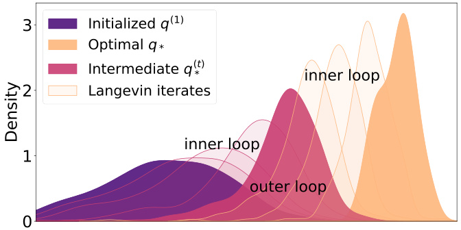
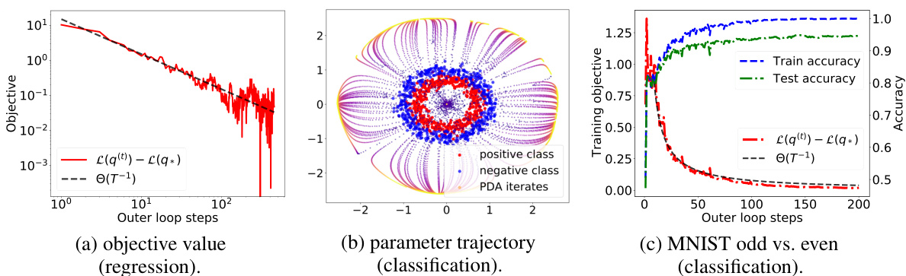

# Particle Dual Averaging: Optimization of Mean Field Neural Network with Global Convergence Rate Analysis  

Atsushi Nitanda Denny Wu  

Kyushu Institute of Technology University of Toronto RIKEN Center for Advanced Intelligence Project Vector Institute for Artificial Intelligence nitanda@ai.kyutech.ac.jp dennywu@cs.toronto.edu  

Taiji Suzuki University of Tokyo RIKEN Center for Advanced Intelligence Project taiji@mist.i.u-tokyo.ac.jp  

# Abstract  

We propose the particle dual averaging (PDA) method, which generalizes the dual averaging method in convex optimization to the optimization over probability distributions with quantitative runtime guarantee. The algorithm consists of an inner loop and outer loop: the inner loop utilizes the Langevin algorithm to approximately solve for a stationary distribution, which is then optimized in the outer loop. The method can thus be interpreted as an extension of the Langevin algorithm to naturally handle nonlinear functional on the probability space. An important application of the proposed method is the optimization of neural network in the mean field regime, which is theoretically attractive due to the presence of nonlinear feature learning, but quantitative convergence rate can be challenging to obtain. By adapting finite-dimensional convex optimization theory into the space of measures, we analyze PDA in regularized empirical / expected risk minimization, and establish quantitative global convergence in learning two-layer mean field neural networks under more general settings. Our theoretical results are supported by numerical simulations on neural networks with reasonable size.  

# 1 Introduction  

Gradient-based optimization can achieve vanishing training error on neural networks, despite the apparent non-convex landscape. Among various works that explains the global convergence, one common ingredient is to utilize overparameterization to translate the training dynamics into function spaces, and then exploit the convexity of the loss function with respect to the function. Such endeavors usually consider models in one of the two categories: the mean field regime or the kernel regime.  

On one hand, analysis in the kernel (lazy) regime connects gradient descent on wide neural network to kernel regression with respect to the neural tangent kernel ( Jacot et al. ,2018 ), which leads to global convergence at linear rate ( Du et al. ,2019 ;Allen-Zhu et al. ,2019 ;Zou et al. ,2020 ). However, key to the analysis is the linearization of the training dynamics, which requires appropriate scaling of the model such that distance traveled by the parameters vanishes ( Chizat and Bach ,2018a ). Such regime thus fails to explain the feature learning of neural networks ( Yang and Hu ,2020 ), which is believed to be an important advantage of deep learning; indeed, it has been shown that deep learning can outperform kernel models due to this adaptivity ( Suzuki ,2018 ;Ghorbani et al. ,2019a ).  

In contrast, the mean field regime describes the gradient descent dynamics as Wasserstein gradient flow in the probability space ( Nitanda and Suzuki ,2017 ;Mei et al. ,2018 ;Chizat and Bach ,2018b ), which captures the potentially nonlinear evolution of parameters travelling beyond the kernel regime. While the mean field limit is appealing due to the presence of “feature learning”, its characterization is more challenging and quantitative analysis is largely lacking. Recent works established convergence rate in continuous time under modified dynamics ( Rotskoff et al. ,2019 ), strong assumptions on the target function ( Javanmard et al. ,2019 ), or regularized objective ( Hu et al. ,2019 ), but such result can be fragile in the discrete-time or finite-particle setting — in fact, the discretization error often scales exponentially with the time horizon or dimensionality, which limits the applicability of the theory. Hence, an important research problem that we aim to address is  

  
Figure 1: 1D visualization of parameter distribution of mean field two-layer neural network (tanh) optimized by PDA. The inner loop uses the Langevin algorithm to solve an approximate stationary distribution outer loop $q_{*}^{(t)}$ ⇤, which is then optimized in the towards the true target $q_{*}$ .  

Can we develop optimization algorithms for neural networks in the mean field regime with more accurate quantitative guarantees the kernel regime enjoys?  

We address this question by introducing the particle dual averaging (PDA) method, which globally optimizes an entropic regularized nonlinear functional. For two-layer mean field network which is an important application, we establish polynomial runtime guarantee for the discrete-time algorithm; to our knowledge this is the first quantitative global convergence result under similar settings.  

# 1.1 Contributions  

We propose the PDA algorithm, which draws inspiration from the dual averaging method originally developed for finite-dimensional convex optimization ( Nesterov ,2005 ,2009 ;Xiao ,2009 ). We iteratively optimize a probability distribution in the form of a Boltzmann distribution, samples from which can be obtained from the Langevin algorithm (see Figure 1 ). The resulting algorithm has comparable per-iteration cost as gradient descent and can be efficiently implemented.  

For optimizing two-layer neural network in the mean-field regime, we establish quantitative global convergence rate of PDA in minimizing an KL-regularized objective: the algorithm requires $\bar{\tilde{O}}(\epsilon^{-3})$ steps and $\tilde{O}(\epsilon^{-2})$ particles to reach an $\epsilon_{}$ -accurate solution, where $\tilde{O}$ hides logarithmic factors. Importantly, our analysis does not couple the learning dynamics with certain continuous time limit, but directly handles the discrete update. This leads to a simpler analysis that covers more general settings. We also derive the generalization bound on the solution obtained by the algorithm. From the viewpoint of the optimization, PDA is an extension of Langevin algorithm to handle entropicregularized nonlinear functionals on the probability space. Hence we believe our proposed method can also be applied to other distribution optimization problems beyond the training of neural networks.  

# 1.2 Related Literature  

Mean field limit of two-layer NNs. The key observation for the mean field analysis is that when the number of neurons becomes large, the evolution of parameters is well-described by a nonlinear partial differential equation (PDE), which can be viewed as solving an infinite-dimensional convex problem (Bengio et al. ,2006 ;Bach ,2017 ). Global convergence can be derived by studying the limiting PDE ( Mei et al. ,2018 ;Chizat and Bach ,2018b ;Rotskoff and Vanden-Eijnden ,2018 ;Sirignano and Spiliopoulos ,2020 ), yet quantitative convergence rate generally requires additional assumptions.  

Javanmard et al. (2019 ) analyzed a particular RBF network and established linear convergence (up to certain error 1 ) for strongly concave target functions. Rotskoff et al. (2019 ) provided a sublinear rate in continuous time for a modified gradient flow. In the regularized setting, Chizat (2019 ) obtained local linear convergence under certain non-degeneracy assumption on the objective. Wei et al. (2019 )also proved polynomial rate for a perturbed dynamics under weak $\ell_{2}$ regularization.  

Our setting is most related to Hu et al. (2019 ), who studied the minimization of a nonlinear functional with KL regularization on the probability space, and showed linear convergence (in continuous time) of a particle dynamics named mean field Langevin dynamics when the regularization is sufficiently strong. Chen et al. (2020 ) also considered optimizing a KL-regularized objective in the infinite-width and continuous-time limit, and derived NTK-like convergence guarantee under certain parameter scaling. Compared to these prior works, we directly handle the discrete time update in the mean-field regime, and our analysis covers a wider range of regularization parameters and loss functions.  

Langevin algorithm. Langevin dynamics can be viewed as optimization in the space of probability measures ( Jordan and Kinderlehrer ,1996 ;Jordan et al. ,1998 ); this perspective has been explored in Wibisono (2018 ); Durmus et al. (2019 ). It is known that the continuous-time Langevin diffusion converges exponentially fast to target distributions satisfying certain growth conditions ( Roberts and Tweedie ,1996 ;Mattingly et al. ,2002 ). The discretized Langevin algorithm has a sublinear convergence rate that depends on the numerical scheme ( Li et al. ,2019 ) and has been studied under various metrics ( Dalalyan ,2014 ;Durmus and Moulines ,2017 ;Cheng and Bartlett ,2017 ).  

The Langevin algorithm can also optimize certain non-convex objectives ( Raginsky et al. ,2017 ;Xu et al. ,2018 ;Erdogdu et al. ,2018 ), in which one finite-dimensional “particle” can attain approximate global convergence due to concentration of Boltzmann distribution around the true minimizer. However, such result often depends on the spectral gap that grows exponentially in dimensionality, which renders the analysis ineffective for neural net optimization in the high-dimensional parameter space .  

Very recently, convergence of Hamiltonian Monte Carlo in learning certain mean field models has been analyzed in Bou-Rabee and Schuh (2020 ); Bou-Rabee and Eberle (2021 ). Compared to these concurrent results, our formulation covers a more general class of potentials, and in the context of two-layer neural network, we provide optimization guarantees for a wider range of loss functions.  

# 1.3 Notations  

$f:\mathbb{R}^{p}\rightarrow\mathbb{R}$ Let divergence: $\mathbb{R}_{+}$ d!$q:\mathbb{R}^{p}\to\mathbb{R}_{+}$ $\begin{array}{r}{\mathrm{KL}(q\|q^{\prime})\stackrel{\mathrm{def}}{=}\int q(\theta)\log\left(\frac{q(\theta)}{q^{\prime}(\theta)}\right)\mathrm{d}\theta.}\end{array}$ , we define !of non-negative real numbers and ,$\begin{array}{r}{\mathbb{E}_{q}[f]=\int f(\theta)\dot{q}(\theta)\mathrm{d}\theta}\end{array}$ RR⇣⌘. Let ion wit when $\mathcal{P}_{2}$ $f$ denote the set of positive densities is integrable. respect to $\|\cdot\|_{2}$ the E $q(\theta)\mathrm{d}\theta$ KL an n is the Kullback-Leibler by $\mathbb{E}_{q}[\cdot]$ ·Given a density . For a function $q$ on $\mathbb{R}^{p}$ such tha defined. N${\mathcal{N}}(0,I_{p})$ nd-order moment is the Gaussian distribution on $\mathbb{E}_{q}[\|\theta\|_{2}^{2}]<\infty$ kk1 Rnd entropy with mean $-\infty<-\mathbb{E}_{q}[\log(q)]<+\infty$ 0 and covariance matrix $I_{p}$ are well .  

# 2 Problem Setting  

We consider the problem of risk minimization with neural networks in the mean field regime. For simplicity, we focus on supervised learning. We here formalize the problem setting and models. Let $\boldsymbol{\chi}\doteq\mathbb{R}^{d}$ and $\mathcal{V}\subset\mathbb{R}$ be the inp spaces, respectively. For given $x\in\mathscr{X}$ , we predict a corresponding output $\boldsymbol{y}=\boldsymbol{h}(\boldsymbol{x})\in\mathcal{D}$ 2 Y through a hypothesis function $h:\mathcal{X}\to\mathcal{Y}$ X ! Y .  

# 2.1 Neural Network and Mean Field Limit  

We adopt a neural network in the mean field regime as a hypothesis function. Let $\Omega=\mathbb{R}^{p}$ be a parameter space and $h_{\theta}:\mathcal{X}\rightarrow\mathcal{Y}\left(\theta\in\Omega\right)$ func ich will be a component of a neural network. We sometimes denote $h(\theta,x)=h_{\theta}(x)$ . Let $q(\theta)\mathrm{d}\theta$ be a probability distribution on the parameter space $\Omega$ and $\Theta=\{\theta_{r}\}_{r=1}^{M}$ be the set of parameters $\theta_{r}$ sampled from $q(\theta)\mathrm{d}\theta$ . A hypothesis is defined as an ensemble of $h_{\theta_{r}}$ as follows:  

$$
h_{\Theta}(x)\stackrel{\mathrm{def}}{=}\frac1M\sum_{r=1}^{M}h_{\theta_{r}}(x).
$$  

A typical example in the literature of the above formulation is a two-layer neural network.  

Example 1 (Two-layer Network) .Let $a_{r}\in\mathbb{R}$ and $b_{r}\in\mathbb{R}^{d}$ $\mathit{\Pi}^{'}r\in\{1,2,\ldots,M\})$ be parameters for output and inpu respectively. We set $\theta_{r}=\left(a_{r},b_{r}\right)$ and $\Theta=\{\theta_{r}\}_{r=1}^{M}$ . Denote $h_{\theta_{r}}(x)\ \stackrel{\mathrm{def}}{=}$ $\sigma_{2}(a_{r}\sigma_{1}(b_{r}^{\top}x))$ )) ( $(x\in\mathcal{X})$ 2 X ), where $\sigma_{1}$ and $\sigma_{2}$ are smooth activation functions. Then the hypothesis $h_{\Theta}$ is a two-layer neural network composed of neurons $h_{\theta_{r}}$ $\begin{array}{r}{\mathbf{\Pi}_{r}\colon h_{\Theta}(x)=\frac{1}{M}\sum_{r=1}^{M}\sigma_{2}\big(a_{r}\sigma_{1}\big(b_{r}^{\top}x\big)\big)}\end{array}$ P.  

Remark. The purpose of $\sigma_{2}$ in the last layer is to ensure the boundedness of output (e.g., see Assumption 2 in Mei et al. (2018 )); this nonlinearity can also be removed if parameters of output layer are fixed. In addition, although we mainly focus on the optimization of two-layer neural network, our proposed method can also be applied to ensemble $h_{\Theta}$ of deep neural networks $h_{\theta_{r}}$ .  

Suppose the parameters $\theta_{r}$ follow a probability distribution $q(\theta)\mathrm{d}\theta$ , then $h_{\Theta}$ can be viewed as a finite-particle discretization of the following expectation,  

$$
h_{q}(x)=\mathbb{E}_{q}[h_{\theta}(x)].
$$  

which we refer to as the mean field limit of the neural network $h_{\Theta}$ . As previously discussed, when $h_{\Theta}$ is overparameterized, optimizing $h_{\Theta}$ becomes “close” to directly optimizing the probability distribution on the parameter space $\Omega$ , for which convergence to the optimal solution may be established under appropriate conditions ( Nitanda and Suzuki ,2017 ;Mei et al. ,2018 ;Chizat and Bach ,2018b ). Hence, the study of optimization of $h_{q}$ with respect to the probability distribution $q(\theta)\mathrm{d}\theta$ may shed light on important properties of overparameterized neural networks.  

# 2.2 Regularized Empirical Risk Minimization  

We briefly outline our setting for regularized expected / empirical risk minimization. The prediction erro easured by the loss function $\bar{\ell}(z,y)~(z,y~\in~y)$ ared loss binary classific the d take independently sampled from the data distribution. We aim to minimize the expected / empirical D$\ell(z,y)\,\stackrel{\cdot}{=}\,0.5(z\,-\,y)^{2}$ tribution to be the empirical distribution defined by training data Don. Let is set to the true data distribution; whereas for −Dbe a data distribution over for regression, or the logist X ⇥Y $\ell(z,y)\,=\,\log(1+\exp(-y z))$ . For expected risk minimization, {$\{(\bar{x_{i}},y_{i})\}_{i=1}^{n}~(x_{i}\,\in\,\mathcal{X},y_{i}\,\in\,\mathcal{Y})$ }2 X −2 Y for risk together with a regularization term, which controls the model complexity and also stabilizes the optimization. The regularized objective can be written as follows: for $\lambda_{1},\lambda_{2}>0$ ,  

$$
\operatorname*{min}_{q\in\mathcal{P}_{2}}\left\{\mathcal{L}(q)\overset{\mathrm{def}}{=}\mathbb{E}_{(X,Y)\sim\mathcal{D}}[\ell(h_{q}(X),Y)]+R_{\lambda_{1},\lambda_{2}}(q)\right\},
$$  

where $R_{\lambda_{1},\lambda_{2}}$ is a regularization term composed of the weighted sum of the second-order moment and negative entropy with regularization parameters $\lambda_{1},\lambda_{2}$ :  

$$
R_{\lambda_{1},\lambda_{2}}(q)\stackrel{\mathrm{def}}{=}\lambda_{1}\mathbb{E}_{q}[\|\theta\|_{2}^{2}]+\lambda_{2}\mathbb{E}_{q}[\log(q)].
$$  

Note that this regularization is the KL divergence of $q$ from a Gaussian distribution. In our setting, such regularization ensures that the Gibbs distributions $q_{*}^{(t)}$ ⇤specified in Section 3 are well defined.  

While our primary focus is the optimization of the objective (3 ), we can also derive a generalization error bound for the empirical risk minimizer of order of $O(n^{-1/2})$ for both the regression and binary classification settings, following Chen et al. (2020 ). We defer the details to Appendix D.  

# 2.3 The Langevin Algorithm  

Before presenting our proposed method, we briefly review the Langevin algorithm. For a given smooth p $f:\Omega\to\mathbb{R}$ , the Langevin algorithm pe wing update: given the initial $\theta^{(1)}\sim q^{(1)}(\theta)\mathrm{d}\theta$ ⇠, step size $\eta>0$ , and Gaussian noise $\zeta^{(k)}\sim\mathcal{N}(0,I_{p})$ ⇠N ,  

$$
\theta^{(k+1)}\gets\theta^{(k)}-\eta\nabla_{\theta}f(\theta^{(k)})+\sqrt{2\eta}\zeta^{(k)}.
$$  

Under appropriate conditions on $f$ , it is known that ${\boldsymbol\theta}^{(t)}$ converges to a stationary distribution proportional t $\exp(-f(\cdot))$ in terms of $\mathrm{KL}$ divergence at a linear rate e.g., Vempala and Wibisono (2019 )) up to ${\cal O}(\eta)$ -error, where we hide additional factors in the big$O$ notation.  

Alternatively, note that when the normalization constant $\textstyle\int\exp(-f(\theta))\mathrm{d}\theta$ Rexists, the Boltzmann distribution in proportion to $\exp(-f(\cdot))$ is the solution of the following optimization problem,  

$$
\operatorname*{min}_{q:{\mathrm{density}}}\left\{\mathbb{E}_{q}[f]+\mathbb{E}_{q}[\log(q)]\right\}.
$$  

Hence we may interpret the Langevin algorithm as approximately solving an entropic regularized linear functional (i.e., free energy functional) on the probability space. This connection between sampling and optimization (see Dalalyan (2017 ); Wibisono (2018 ); Durmus et al. (2019 )) enables us to employ the Langevin algorithm to obtain (samples from) the closed-form Boltzmann distribution which is the minimizer of (6 ); for example, many Bayesian inference problems fall into this category.  

However, the objective (3 )that we aim to optimize is beyond the scope of Langevin algorithm – due to the nonlinearity of loss $\ell(z,y)$ with respect to $z$ , the stationary distribution cannot be described as a closed-form solution of (6 ). To overcome this limitation, we develop the particle dual averaging (PDA) algorithm which efficiently solves ( 3 ) with quantitative runtime guarantees.  

# 3 Proposed Method  

We now propose the particle dual averaging method to approximately solve the problem ( 3 ) by optimizing a two-layer neural network in the mean field regime; we also introduce the mean field limit of the proposed method to explain the algorithmic intuition and develop the convergence analysis.  

# 3.1 Particle Dual Averaging  

Our proposed particle dual averaging method (Algorithm 1 ) is an optimization algorithm on the space of probability measures. The algorithm consists of an inner loop and outer loop; we run Langevin algorithm in inner loop to approximate a Gibbs distribution, which is optimized in the outer loop so that it converges to the optimal distribution $q_{*}$ . This outer loop update is designed to extend the classical dual averaging scheme ( Nesterov ,2005 ,2009 ;Xiao ,2009 ) to infinite dimensional optimization problems (described in Section 3.2 ). Below we provide a more detailed explanation.  

•$\partial_{z}\ell(h_{\tilde{\Theta}^{(t)}}(x_{t}),y_{t})$ , which is a component of the Gibbs potential , the last iterate $\tilde{\Theta}^{(t)}$ of the previous inner loop is given. 2 , and initialize a set of partiWe compute cles $\Theta^{(1)}$ at $\tilde{\Theta}^{(t)}$ . In Appendix Bwe introduce a different “restarting” scheme for the initialization.  

•In the inner loop, we run the Langevin algorithm (noisy gradient descent) starting from $\Theta^{(1)}$ , where the gradient at the $k$ -th inner step is given by $\nabla_{\theta}\overline{{g}}^{(t)}(\theta_{r}^{(k)})$ , which is a sum of weighted average of $\partial_{z}\ell(h_{\tilde{\Theta}^{(s)}}(x_{s}),y_{s})\partial_{\theta}h(\theta_{r}^{(k)},x_{s})$ and the gradient of $\ell_{2}$ -regularization (see Algorithm 1 ).  

# Algorithm 1 Particle Dual Averaging (PDA)  

Input: data distribution $\mathcal{D}$ ,ensity $q^{(1)}$ , number of outer-iterations $T$ , learning rates $\{\eta_{t}\}_{t=1}^{T}$ ,  
number of inner-iterations {$\{T_{t}\}_{t=1}^{T}$ }  
$\tilde{\Theta}^{(1)}\gets\{\tilde{\theta}_{r}^{(1)}\}_{r=1}^{M}$ Randomly draw i.i.d. initial parameters $\tilde{\theta}_{r}^{(1)}\sim q^{(1)}(\theta)\mathrm{d}\theta\left(r\in\{1,2,...\,,M\}\right)$ ⇠2 { }  
for $t=1$ to $T$ do Randomly draw data $\left({{x}_{t}},{{y}_{t}}\right)$ from $\mathcal{D}$   
$\Theta^{(1)}=\{\dot{\theta}_{r}^{(1)}\}_{r=1}^{M}\leftarrow\ddot{\Theta}^{(t)}$ for $k=1$ to $T_{t}$ do Run inexact noisy gradient descent for $r\in\{1,2,\ldots,M\}$ $\begin{array}{r}{\nabla_{\theta}\overline{{g}}^{(t)}(\theta_{r}^{(k)})\leftarrow\frac{2}{\lambda_{2}(t+2)(t+1)}\sum_{s=1}^{t}s\partial_{z}\ell(h_{\tilde{\Theta}^{(s)}}(x_{s}),y_{s})\partial_{\theta}h(\theta_{r}^{(k)},x_{s})+\frac{2\lambda_{1}t}{\lambda_{2}(t+2)}\theta_{r}^{(k)}(\theta_{r}^{(k)},x_{s})}\end{array}$ Pend for $\theta_{r}^{(k+1)}\gets\theta_{r}^{(k)}-\eta_{t}\nabla_{\theta}\overline{{g}}^{(t)}(\theta_{r}^{(k)})+\sqrt{2\eta_{t}}\zeta_{r}^{(k)}$ −rp(i.i.d. Gaussian noise $\zeta_{r}^{(k)}\sim\mathcal{N}(0,I_{p}))$ ⇠N )  
$\tilde{\Theta}^{(t+1)}\gets\Theta^{(T_{t}+1)}=\{\theta_{r}^{(T_{t}+1)}\}_{r=1}^{M}$   
end for   
Randomly pick up $t\in\{2,3,\ldots,T+1\}$ following the probability $\begin{array}{r}{\mathbb P[t]=\frac{2t}{T(T+3)}}\end{array}$ and return $h_{\tilde{\Theta}^{(t)}}$  

Figure 1 provides a pictorial illustration of Algorithm 1 . Note that this procedure is a slight modification of the normal gradient descent algorithm: the first term of the loss $\partial_{\theta_{r}}\ell(h_{\Theta^{(k)}}(x),y)\sim\partial_{z}\ell(h_{\Theta^{(k)}}(x),y)\partial_{\theta}h(\theta_{r}^{(k)},x)$ where $\nabla_{\theta}\overline{{g}}^{(t)}$ $\bar{\Theta^{(k)}}=\{\theta_{r}^{(k)}\}_{r=1}^{M}$ is similar to the gradient of }. Indeed, if we set number of inner-iterations $T_{t}=1$ and replace the direction $\nabla_{\theta}\overline{{g}}^{(t)}(\theta_{r}^{(k)})$ with the gradient of the $L_{2}$ -regularized loss, then PDA exactly reduces to the standard noisy gradient descent algorithm considered in Mei et al. (2018 ). Algorithm 1 can be extended to the minibatch variant in the obvious manner; for efficient implementation in the empirical risk minimization setting see Appendix E. 1 .  

# 3.2 Mean Field View of PDA  

In this subsection we discuss the mean field limit of PDA and explain its algorithmic intuition. Note that the inner loop of Algorithm 1 is the Langevin algorithm with $M$ particles, which optimizes the potential function given by the weighted sum:  

$$
\overline{{g}}^{(t)}(\theta)=\frac{2}{\lambda_{2}(t+2)(t+1)}\sum_{s=1}^{t}s\left(\partial_{z}\ell(h_{\tilde{\Theta}^{(s)}}(x_{s}),y_{s})h(\theta,x_{s})+\lambda_{1}\|\theta\|_{2}^{2}\right).
$$  

Due to the rapid convergence of Langevin algorithm outlined in Subsection 2.3 , the particles $\theta_{r}^{(k+1)}$ $(r\,\,\in\,\{1,\ldots,M\})$ exp $\left(-{\overline{{g}}}^{(t)}\right)$ ). Hence, the inner loop of PDA returns an can be regarded as (approximate M-particle approximation of some stationary amples from the Boltzmann distribution: distribution, which is then modified in the outer loop. Importantly, the update on the stationary distribution is designed so that the algorithm converges to the optimal solution of the problem ( 3 ).  

We now introduce the mean field limit of DA, i.e., taking the number of particles $M\to\infty$ and directly optimizing the problem ( 3 ) over q. We refer to this mean field limit simply as the dual averaging (DA) algorithm. The dual averaging method was originally developed for the convex optimization in finite-dimensional spaces ( Nesterov ,2005 ,2009 ;Xiao ,2009 ), and here we adapt it to optimization on the probability space. The detail of the DA algorithm is described in Algorithm 2 .  

# Algorithm 2 Dual Averaging (DA)  

Input: data distribution $\mathcal{D}$ and initial density $q^{(1)}$ for $t=1$ to $T$ do  

Randomly draw a data $\left({{x}_{t}},{{y}_{t}}\right)$ from $\mathcal{D}$   
$g^{(t)}\gets\partial_{z}\ell(h_{q^{(t)}}(x_{t}),y_{t})h(\cdot,x_{t})+\lambda_{1}\|\cdot\|_{2}^{2}$   
Obtain an approximation $q^{(t+1)}$ of the density function $\begin{array}{r}{q_{*}^{(t+1)}\propto\exp\left(-\frac{\sum_{s=1}^{t}2s g^{(s)}}{\lambda_{2}(t+2)(t+1)}\right)}\end{array}$ ⇣⌘  

Randomly pick up $t\in\{2,3,\ldots,T+1\}$ following the probability $\begin{array}{r}{\mathbb P[t]=\frac{2t}{T(T+3)}}\end{array}$ and return $h_{q^{(t)}}$  

Algorithm 2 iteratively updates the density function $q_{*}^{(t+1)}\in\mathcal{P}_{2}$ ⇤which is a solution to the objective:  

$$
\operatorname*{min}_{q\in\mathcal{P}_{2}}\left\{\mathbb{E}_{q}\Big[\sum_{s=1}^{t}s g^{(s)}\Big]+\frac{\lambda_{2}}{2}(t+2)(t+1)\mathbb{E}_{q}[\log(q)]\right\},
$$  

where the function $g^{(t)}\ =\ \partial_{z}\ell(h_{q^{(t)}}(x_{t}),y_{t})h(\cdot,x_{t})\,+\,\lambda_{1}\|\,\cdot\,\|_{2}^{2}$ is the functional derivative of $\ell(h_{q}(x_{i_{i}}),y_{t})+\lambda_{1}\mathbb{E}_{q}[\|\theta\|_{2}^{2}]$ with respect to $q$ at $\boldsymbol{q}^{(t)}$ . In other words, the objective ( 7 ) is the sum of weighted average of linear approximations of loss function and the entropic regularization in the space of probability distributions. In this sense, the DA method can be seen as an extension of the Langevin algorithm to handle entropic regularized nonlinear functionals on the probability space by iteratively linearizing the objective.  

To sum up, we may interpret the DA method as approximating the optimal distribution $q_{*}$ by iteratively optimizing algorithm, we obtain PDA can be viewed as a finite-particle approximation of DA – indeed, the stationary distributions $q_{*}^{(t)}$ ⇤, which takes the form of a Boltzmann distribution. In the inner loop of the PDA $M$ (approximate) samples from $q_{*}^{(t)}$ ⇤via the Langevin algorithm. In other words, obtained in PDA converges to the convergence rate of the DA method, and also take into account the iteration complexity of the $q_{*}^{(t+1)}$ ⇤by taking $M\to\infty$ . In the following section, we present Langevin algorithm; we defer the finite-particle approximation error analysis to Appendix C.  

# 4 Convergence Analysis  

We now provide quantitative global convergence guarantee for our proposed method in discrete time. We first derive the outer loop complexity, assuming approximate optimality of the inner loop iterates, which we then verify in the inner loop analysis. The total complexity is then simply obtained by combining the outer- and inner-loop runtime.  

# 4.1 Outer Loop Complexity  

We first analyze the convergence rate of the dual averaging (DA) method (Algorithm 2 ). Our analysis will be made under the following assumptions.  

# Assumption 1.  

(A1) $\mathcal{V}\subset[-1,1].\;\ell(z,y)$ is a smooth convex function w.r.t. $z$ and $|\partial_{z}\ell(z,y)|\leq2$ for $y,z\in\mathcal{D}$ .(A2) $|h(\theta,x)|\leq1$ and $h(\theta,x)$ is smooth with respect to $\theta$ for $x\in\mathscr{X}$ .  
(A3) $\mathrm{KL}(q^{(t+1)}\|q_{*}^{(t+1)})\leq1/t^{2}.$  

Remark. (A2) is satisfied by smooth activation functions such as sigmoid and tanh. Many loss functions including the squared loss and logistic loss satisfy (A1) under the boundedness assumptions ${\mathcal{V}}\subset[-1,1]$ can be relaxed to any value. and $|h_{\theta}(x)|\le1$ (A3) . Note that constants in specifies the precision of approximate solutions of sub-problems (A1) and (A2) are defined for simplicity and (7 ) to guarantee the global convergence of Algorithm 2 , which we verify in our inner loop analysis.  

We first introduce the following quantity for $q\in\mathcal{P}_{2}$ ,  

$$
e(q)\stackrel{\mathrm{def}}{=}\mathbb{E}_{q}[\log(q)]-\frac{4}{\lambda_{2}}-\frac{p}{2}\left(\exp\left(\frac{4}{\lambda_{2}}\right)+\log\left(\frac{3\pi\lambda_{2}}{\lambda_{1}}\right)\right).
$$  

Assumption Observe that the expression consists of the negative entropy minus its lower bound for (A1) ,(A2) ; in other words $e(q_{*}^{(t)})\bar{\geq}\,0$ ⇤≥. We have the following convergence rate of $q_{*}^{(t)}$ ⇤under $\mathrm{DA}^{3}$ .  

Theorem 1 (C vergence of DA) .Under Assumptions (A1) ,(A2) , and (A3) , for arbitrary $q_{*}\in\mathcal{P}_{2}$ ,iterates of the DA method (Algorithm 2 ) satisfies  

$$
\begin{array}{r l}&{\displaystyle\frac{2}{T(T+3)}\sum_{t=2}^{T+1}t\left(\mathbb{E}[\mathcal{L}(q^{(t)})]-\mathcal{L}(q_{*})\right)}\\ &{\displaystyle\qquad\leq O\Big(\frac{1}{T^{2}}\left(1+\lambda_{1}\mathbb{E}_{q_{*}}\left[\|\theta\|_{2}^{2}\right]\right)+\frac{\lambda_{2}e(q_{*})}{T}+\frac{\lambda_{2}}{T}(1+\exp(8/\lambda_{2}))p^{2}\log^{2}(T+2)\Big),}\end{array}
$$  

where the expectation $\mathbb{E}\big[\mathcal{L}(q^{(t)})\big]$ is taken with respect to the history of examples.  

Theorem 1 demonstrates the convergence rate of Algorithm 2 to the optimal value of the regularized objective (3 )in expectation. Note that $\begin{array}{r}{\frac{2}{T(T+3)}\sum_{t=2}^{\bar{T}+1}t\mathbb{E}[\mathcal{L}(q^{(t)})]}\end{array}$ Pis the expectation of $\mathbb{E}[\mathcal{L}(q^{(t)})]$ according to the probability $\begin{array}{r}{\mathcal{P}[t]=\frac{2t}{T(T+3)}\;(t\in\{2,...\,,T+1\})}\end{array}$ as specified in Algorithm 2 . If we take $p,\lambda_{1},\lambda_{2}$ as constants and use $\tilde{O}$ to hide the logarithmic terms, we can deduce that after $\tilde{O}(\epsilon^{-1})$ iterations, an $\epsilon$ -accurate solution of the optimal distribution: $\mathcal{L}(q)\leq\operatorname*{inf}_{q\in\mathcal{P}_{2}}\mathcal{L}(q)+\epsilon$ is achieved in expectation. Importantly, this convergence rate applies to any choice of regularization parameters, in contrast to the strong regularization required in Hu et al. (2019 ); Jabir et al. (2019 ).  

On the other hand, due to the exponential dependence on $\lambda_{2}^{-1}$ , our convergence rate is not informative under weak regularization $\lambda_{2}\to0$ . Such dependence follows from the classical LSI perturbation lemma ( Holley and Stroock ,1987 ), which is likely unavoidable for Langevin-based methods in the most general setting ( Menz and Schlichting ,2014 ), unless additional assumptions are imposed (e.g., a student-teacher setup); we intend to further investigate these conditions in future work.  

# 4.2 Inner Loop Complexity  

In order to derive the total complexity (i.e., taking both the outer loop and inner loop into account) towards a required accuracy, we also need to estimate the iteration complexity of Langevin algorithm. We utilize the following convergence result under the log-Sobolev inequality (Definition A ):  

Theorem 2 (Vempala and Wibisono (2019 )) .Co sider a proba ility density $q(\theta)\propto\exp(-f(\theta))$ satis onstant ↵, and assume $f$ is smooth and r$\nabla f$ is L-Lipschitz, $\begin{array}{r}{0<\eta\le\frac{\alpha}{4L^{2}}}\end{array}$ i.e., kr $\|\nabla_{\bar{\theta}}f(\theta)-\nabla_{\theta}f(\theta^{\prime})\|_{2}\le L\|\dot{\theta}-\theta^{\prime}\|_{2}$ and let −r ${q^{(k)}}(\theta)\mathrm{d}\theta$ be a probability distribution that k−k. If we run the Langev $\theta^{(k)}$ follows, then we have, gorithm ( 5 ) with learning rate  

$$
\begin{array}{r}{\mathrm{KL}(q^{(k)}\|q)\leq\exp(-\alpha\eta k)\mathrm{KL}(q^{(1)}\|q)+8\alpha^{-1}\eta p L^{2}.}\end{array}
$$  

Theorem algorithm with 2 implies that a $\begin{array}{r}{\eta\leq\frac{\alpha}{4L^{2}}\operatorname*{min}\left\{1,\frac{\delta}{4p}\right\}}\end{array}$ $\delta$ -accurate solution in KL divergence can be obtained by the Langevin noand $\begin{array}{r}{\frac{1}{\alpha\eta}\log\frac{2\mathrm{KL}\left(q^{(1)}\|q\right)}{\delta}}\end{array}$ -iterations.  

$\begin{array}{r}{\exp\left(-\frac{\sum_{s=1}^{t}2s g^{(s)}}{\lambda_{2}(t+2)(t+1)}\right)}\end{array}$ Since the optimal solution of a sub-problem in DA (Algorithm ⇣⌘, we can verify the LSI and determine the constant for 2 ) takes the forms of $q_{*}^{(t+1)}(\theta)\mathrm{d}\theta$ ⇤$q_{*}^{(t+1)}\,\propto\,$ based on ⇤/the LSI perturbation lemma from Holley and Stroock (1987 ) (see Lemma Band Example 2 in $\bar{\nabla_{\theta}}\log{q_{*}^{(t+1)}}$ Appendix ⇤A. 2 is Lipschitz continuous, which motivates us to introduce the following assumption. ). Consequently, we can apply Theorem 2 to $q_{*}^{(t+1)}$ ⇤for the inner loop complexity when  

# Assumption 2.  

(A4) $\partial_{\theta}h(\cdot,x)$ is 1 -Lipschitz continuous: $\begin{array}{r}{\|\partial_{\theta}h(\theta,x)\!-\!\partial_{\theta}h(\theta^{\prime},x)\|_{2}\leq\|\theta\!-\!\theta^{\prime}\|_{2},\forall x\in\mathcal{X},\theta,\theta^{\prime}\in\Omega.}\end{array}$ Remark. (A4) is parallel to ( Mei et al. ,2018 , Assumption A3), and is satisfied by two-layer neural network in Example 1 when the output or input layer is fixed and the ce $\mathcal{X}$ is compact. We remark that this assumption can be relaxed to H of Erdogdu and Hosseinzadeh (2020 ), which allows us to extend Theorem older continuity of $\bar{\partial_{\theta}h(\cdot,\bar{x})}$ ·1 via the rec to general $L_{p}$ result -norm regularizer for $p>1$ . For now we work with (A4) for simplicity of the presentation and proof.  

Set $\delta_{t+1}$ to be the desired accuracy of an approximate solution $q^{(t+1)}$ specified in (A3) :$\delta_{t+1}\,=$ $1/(t+1)^{2}$ , we have the following guarantee for the inner loop.  

Corollary 1 rithm with step size (Inner Loop Complexity) $\begin{array}{r}{\eta_{t}=O\left(\frac{\lambda_{1}\lambda_{2}\delta_{t+1}}{p(1+\lambda_{1})^{2}\exp(8/\lambda_{2})}\right)}\end{array}$ ⇣.Under (A1) ⌘on ( ,(A2) 7 ), then an approximate solution satisfying , and (A4) , if we run the Langevin algo$\mathrm{KL}(q^{(t+1)}\|q_{*}^{(t+1)})\leq\delta_{t+1}$ ⇤can be obtained within $\begin{array}{r}{O\left(\frac{\lambda_{2}\exp(8/\lambda_{2})}{\lambda_{1}\eta_{t}}\log\frac{2\mathrm{KL}\left(q^{(t)}\|q_{*}^{(t+1)}\right)}{\delta_{t+1}}\right)}\end{array}$ ⇣⌘-iterations. Mas $q^{(1)}$ ver, is a Gaussian distribution and $\mathrm{KL}(q^{(t)}\|q_{*}^{(t+1)})$ ⇤)$(t\in\{1,2,\ldots,T+1\})$ (A3) is satisfied. are uniformly bounded with respect to $t$ as long We comment that for the inner loop we utilized the overdamped Langevin algorithm, since it is the most standard and commonly used sampling method for the objective (7 ). Our analysis can easily incorporate other inner loop updates such as the underdamped Langevin algorithm ( Cheng et al. ,2018 ;Eberle et al. ,2019 ) or the Metropolis-adjusted Langevin algorithm ( Roberts and Tweedie ,1996 ;Dwivedi et al. ,2018 ), which may improve the iteration complexity.  

# 4.3 Total Complexity  

Combining Theorem 1 and Corollary 1 , we can now derive the total complexity of our proposed algorithm. For simplicity, we take $p,\lambda_{1},\lambda_{2}$ as constants and hide logarithmic terms in $\tilde{O}$ and $\Tilde{\Theta}$ . The following corollary establishes a $\tilde{O}(\epsilon^{-3})$ total iteration complexity to obtain an $\epsilon$ -accurate solution in expectation because $T_{t}=\tilde{\Theta}(t^{2})=\tilde{O}(\epsilon^{-2})$ for $t\leq T$ .  

Corollary 2 (Total Complexity) .Let $\epsilon>0$ be an arbitrary desired accuracy and $q^{(1)}$ be a Gaussian distribution. Under assumptions iterations on the outer loop, and the Langevin algorithm with step size (A1) ,(A2) ,(A3) , and (A4) ,$i f$ we run Algorithm $\begin{array}{r}{\eta_{t}=\Theta\left(\frac{\lambda_{1}\lambda_{2}\delta_{t+1}}{p(1+\lambda_{1})^{2}\exp(8/\lambda_{2})}\right)}\end{array}$ ⇣2 for $T=\tilde{\Theta}(\epsilon^{-1})$ ⌘for $T_{t}=\tilde{\Theta}(\eta_{t}^{-1})$ iterations on the inner loop, then an ✏-accurate solution: $\begin{array}{r}{\mathcal{L}(q)\leq\operatorname*{inf}_{q\in\mathcal{P}_{2}}\mathcal{L}(q)+\epsilon}\end{array}$ of the objective (3 )is achieved in expectation.  

Quantitative convergence guarantee. To translate the above convergence rate result to the finiteparticle PDA (Algorithm 1 ), we also characterize the finite-particle discretization error in Appendix C.For the particle complexity analysis, we consider two versions of particle update: $(i)$ the warmstart scheme described in Algorithm 1 , in which $\Theta^{(1)}$ is initialized at the last iterate $\tilde{\Theta}^{(t)}$ of the previous inner loop, and $(i i)$ the resampling scheme, in which $\Theta^{(1)}$ is initialized from the initial distribution $q^{(1)}(\theta)\mathrm{d}\theta$ (see Appendix Bfor details). Remarkably, for the resampling scheme, we provide convergence rate guarantee in time- and space-discretized settings that is polynomial in both the iterations and particle size ; specifically, the particle complexity of $\tilde{O}(\epsilon^{-2})$ , together with the total iteration complexity of $\tilde{O}(\epsilon^{-3})$ , suffices to obtain an $\epsilon$ -accurate solution to the objective (3 )(see Appendix Band Cfor precise statement).  

# 5 Experiments  

# 5.1 Experiment Setup  

We employ our proposed algorithm in both synthetic student-teacher settings (see Figure 2 (a)(b)) and real-world dataset (see Figure 2 (c)). For the student-teacher setup, the labels are generated as $y_{i}\,=\,f_{*}(x_{i})+\varepsilon_{i}$ , where $f_{*}$ is the teacher model (target function), and $\varepsilon$ is zero-mean i.i.d. label noise. For the student model $f$ , we follow Mei et al. (2018 , Section 2.1) and parameterize a two-layer neural network with fixed second layer as:  

$$
f(x)=\frac{1}{M^{\alpha}}\sum_{r=1}^{M}\sigma(w_{r}^{\top}x+b_{r}),
$$  

which we train to minimize the objective (3 )using PDA. Note that $\alpha=1$ corresponds to the mean field regime (which we are interested in), whereas setting $\alpha=1/2$ leads to the kernel (NTK) regime 4 .  

Synthetic student-teacher setting. For Figure 2 (a)(b) we design synthetic experiments for both regression and classification tasks, where the student model is a two-layer tanh network with $M=500$ .$\textstyle\frac{1}{\sqrt{m}}\sum_{i=1}^{\sqrt{m}}\sigma_{*}(\langle w_{i}^{*},x\rangle)$ For regression, we take the target function P, and the input is drawn from a unit Gaussian $f_{*}$ to be a multiple-index model with $\mathcal{N}(0,I_{p})$ $m$ . For binary classifi- neurons: $f_{*}(x)=$ cation, we consider a simple two-dimensional dataset from sklearn.datasets.make circles (Pedregosa et al. ,2011 ), in which the goal is to separate two groups of data on concentric circles (red and blue in Figure 2 (b)). We include additional experimental results in Appendix F.  

PDA hyperparameters. We optimize the squared loss for regression and the logistic loss for binary classification. The model is trained by PDA with batch size 50. We scale the number of inner loop steps $T_{t}$ with $t$ , and the step size $\eta_{t}$ with $1/\sqrt{t}$ , where $t$ is the outer loop iteration; this heuristic is consistent with the required inner-loop accuracy in Theorem 1 and Proposition 2 .  

  
Figure 2: (a) Iteration complexity of PDA: the $O(T^{-1})$ rate on the outer loop agrees with Theorem 1 . (b) Parameter trajectory of PDA: darker color (purple) indicates earlier in training, and vice versa. (c) odd vs. even classification on MNIST; we report the training loss (red) as well as the train and test accuracy (blue and green).  

# 5.2 Empirical Findings  

Convergence rate. In Figure 2 (a) we verify the $O(T^{-1})$ iteration complexity of the outer loop in Theorem 1 . We apply PDA to optimize the expected risk (analogous to one-pass SGD) in the regression setting, in which the input dimensionality $p=1$ and the target function is a single-index model ( $[m=1]$ ) with tanh activation. We employ the resampled update (i.e., without warm-start; see Appendix B) with hyperparameters $\lambda_{1}=10^{\dot{-}2},\dot{\lambda}_{2}=10^{-\dot{3}}$ . To compute the entropy in the objective (3 ), we adopt the $k$ -nearest neighbors estimator ( Kozachenko and Leonenko ,1987 ) with $k=10$ .  

Presence of feature learning. In Figure 2 (b) we visualize the evolution of neural network parameters optimized by PDA in a 2-dimensional classification problem. Due to structure of the input data (concentric rings), we expect that for a two-layer neural network to be a good separator, its parameters should also distribute on a circle. Indeed the converged solution of PDA (bright yellow) agrees with this intuition and demonstrates that PDA learns useful features beyond the kernel regime.  

Binary classification on MNIST. In Figure 2 (c) we report the training and test performance of PDA in separating odd vs. even digits from the MNIST dataset. We subsample $n=2500$ training examples with binary labels, and learn a two-layer tanh network with width $M=2500$ . We use the resampled update of PDA to optimize the cross entropy loss, with hyperparameters $\lambda_{1}=10^{-2},\lambda_{2}=1\dot{0}^{-4}$ .Observe that the algorithm achieves good generalization performance (green) and roughly maintains 5 the $O(T^{-1})$ iteration complexity (red) in optimizing the training objective ( 3 ).  

# Conclusion  

We proposed the particle dual averaging (PDA) algorithm for optimizing two-layer neural networks in the mean field regime. Leveraging tools from finite-dimensional convex optimization developed in the original dual averaging method, we established quantitative convergence rate of PDA for regularized empirical and expected risk minimization. We also provided particle complexity analysis and generalization bounds for both regression and classification problems. Our theoretical findings are aligned with experimental results on neural network optimization. Looking forward, we plan to investigate specific problem instances in which convergence rate can be obtained under vanishing regularization. It is also important to consider accelerated variants of PDA to further improve the convergence rate in the empirical risk minimization setting. Another interesting direction would be to explore other applications of PDA beyond two-layer neural networks, such as deep models ( Ara ujo et al. ,2019 ;Nguyen and Pham ,2020 ;Lu et al. ,2020 ;Pham and Nguyen ,2021 ), as well as other optimization problems for entropic regularized nonlinear functional.  

# Acknowledgment  

The authors would like to thank Murat A. Erdogdu and anonymous NeurIPS reviewers for their helpful feedback. AN was partially supported by JSPS Kakenhi (19K20337) and JST-PRESTO (JPMJPR1928). DW was partially supported by NSERC and LG Electronics. TS was partially supported by JSPS KAKENHI (18H03201), Japan Digital Design and JST CREST.  

# References  

Allen-Zhu, Z. and Li, Y. (2019). What can resnet learn efficiently, going beyond kernels? In Advances in Neural Information Processing Systems , pages 9017–9028.   
Allen-Zhu, Z. and Li, Y. (2020). Backward feature correction: How deep learning performs deep learning. arXiv preprint arXiv:2001.04413 .  
Allen-Zhu, Z., Li, Y., and Song, Z. (2019). A convergence theory for deep learning via overparameterization. In Proceedings of International Conference on Machine Learning $36$ , pages 242–252.   
Ara ujo, D., Oliveira, R. I., and Yukimura, D. (2019). A mean-field limit for certain deep neural networks. arXiv preprint arXiv:1906.00193 .  
Bach, F. (2017). Breaking the curse of dimensionality with convex neural networks. The Journal of Machine Learning Research , 18(1):629–681.   
Bai, Y. and Lee, J. D. (2019). Beyond linearization: On quadratic and higher-order approximation of wide neural networks. arXiv preprint arXiv:1910.01619 .  
Bakry, D. and Emery, M. (1985). Diffusions hypercontractives in sem. probab. xix lnm 1123.   
Bengio, Y., Le Roux, N., Vincent, P., Delalleau, O., and Marcotte, P. (2006). Convex neural networks. Advances in neural information processing systems , 18:123.   
Bou-Rabee, N. and Eberle, A. (2021). Mixing time guarantees for unadjusted hamiltonian monte carlo. arXiv e-prints , pages arXiv–2105.   
Bou-Rabee, N. and Schuh, K. (2020). Convergence of unadjusted hamiltonian monte carlo for mean-field models. arXiv preprint arXiv:2009.08735 .  
Cao, Y. and Gu, Q. (2019). Generalization bounds of stochastic gradient descent for wide and deep neural networks. In Advances in Neural Information Processing Systems , pages 10836–10846.   
Chen, Z., Cao, Y., Gu, Q., and Zhang, T. (2020). A generalized neural tangent kernel analysis for two-layer neural networks. arXiv preprint arXiv:2002.04026 .  
Cheng, X. and Bartlett, P. (2017). Convergence of langevin mcmc in kl-divergence. arXiv preprint arXiv:1705.09048 .  
Cheng, X., Chatterji, N. S., Bartlett, P. L., and Jordan, M. I. (2018). Underdamped langevin mcmc: A non-asymptotic analysis. In Conference on Learning Theory , pages 300–323. PMLR.   
Chizat, L. (2019). Sparse optimization on measures with over-parameterized gradient descent. arXiv preprint arXiv:1907.10300 .  
Chizat, L. (2021). Convergence rates of gradient methods for convex optimization in the space of measures. arXiv preprint arXiv:2105.08368 .  
Chizat, L. and Bach, F. (2018a). A note on lazy training in supervised differentiable programming. arXiv preprint arXiv:1812.07956 .  
Chizat, L. and Bach, F. (2018b). On the global convergence of gradient descent for over-parameterized models using optimal transport. In Advances in Neural Information Processing Systems 31 , pages 3040–3050.   
Chu, C., Blanchet, J., and Glynn, P. (2019). Probability functional descent: A unifying perspective on gans, variational inference, and reinforcement learning. In Proceedings of International Conference on Machine Learning 36 , pages 1213–1222.   
Dai, B., He, N., Dai, H., and Song, L. (2016). Provable bayesian inference via particle mirror descent. In Proceedings of International Conference on Artificial Intelligence and Statistics 19 , pages 985–994.   
Dalalyan, A. S. (2014). Theoretical guarantees for approximate sampling from smooth and logconcave densities. arXiv preprint arXiv:1412.7392 .  
Dalalyan, A. S. (2017). Further and stronger analogy between sampling and optimization: Langevin monte carlo and gradient descent. arXiv preprint arXiv:1704.04752 .  
Daniely, A. and Malach, E. (2020). Learning parities with neural networks. arXiv preprint arXiv:2002.07400 .  
Ding, Z. and Li, Q. (2019). Ensemble kalman sampling: Mean-field limit and convergence analysis. arXiv preprint arXiv:1910.12923 .  
Du, S. S., Zhai, X., Poczos, B., and Singh, A. (2019). Gradient descent provably optimizes overparameterized neural networks. International Conference on Learning Representations 7 .  
Durmus, A., Majewski, S., and Miasojedow, B. (2019). Analysis of langevin monte carlo via convex optimization. Journal of Machine Learning Research , 20(73):1–46.   
Durmus, A. and Moulines, E. (2017). Nonasymptotic convergence analysis for the unadjusted langevin algorithm. The Annals of Applied Probability , 27(3):1551–1587.   
Dwivedi, R., Chen, Y., Wainwright, M. J., and Yu, B. (2018). Log-concave sampling: Metropolishastings algorithms are fast! In Conference on Learning Theory , pages 793–797. PMLR.   
Eberle, A., Guillin, A., Zimmer, R., et al. (2019). Couplings and quantitative contraction rates for langevin dynamics. Annals of Probability , 47(4):1982–2010.   
Erdogdu, M. A. and Hosseinzadeh, R. (2020). On the convergence of langevin monte carlo: The interplay between tail growth and smoothness. arXiv preprint arXiv:2005.13097 .  
Erdogdu, M. A., Mackey, L., and Shamir, O. (2018). Global non-convex optimization with discretized diffusions. In Advances in Neural Information Processing Systems , pages 9671–9680.   
Garbuno-Inigo, A., Hoffmann, F., Li, W., and Stuart, A. M. (2020). Interacting langevin diffusions: Gradient structure and ensemble kalman sampler. SIAM Journal on Applied Dynamical Systems ,19(1):412–441.   
Ghorbani, B., Mei, S., Misiakiewicz, T., and Montanari, A. (2019a). Limitations of lazy training of two-layers neural network. In Advances in Neural Information Processing Systems , pages 9111–9121.   
Ghorbani, B., Mei, S., Misiakiewicz, T., and Montanari, A. (2019b). Linearized two-layers neural networks in high dimension. arXiv preprint arXiv:1904.12191 .  
Ghorbani, B., Mei, S., Misiakiewicz, T., and Montanari, A. (2020). When do neural networks outperform kernel methods? arXiv preprint arXiv:2006.13409 .  
Holley, R. and Stroock, D. (1987). Logarithmic sobolev inequalities and stochastic ising models. Journal of statistical physics , 46(5-6):1159–1194.   
Hsieh, Y.-P., Liu, C., and Cevher, V. (2019). Finding mixed nash equilibria of generative adversarial networks. In Proceedings of International Conference on Machine Learning 36 , pages 2810–2819.   
Hu, K., Ren, Z., Siska, D., and Szpruch, L. (2019). Mean-field langevin dynamics and energy landscape of neural networks. arXiv preprint arXiv:1905.07769 .  
Imaizumi, M. and Fukumizu, K. (2020). Advantage of deep neural networks for estimating functions with singularity on curves. arXiv preprint arXiv:2011.02256 .  
Jabir, J.-F., Si ska, D., and Szpruch, Ł. (2019). Mean-field neural odes via relaxed optimal control. arXiv preprint arXiv:1912.05475 .  
Jacot, A., Gabriel, F., and Hongler, C. (2018). Neural tangent kernel: Convergence and generalization in neural networks. In Advances in Neural Information Processing Systems 31 , pages 8580–8589.   
Javanmard, A., Mondelli, M., and Montanari, A. (2019). Analysis of a two-layer neural network via displacement convexity. arXiv preprint arXiv:1901.01375 .  
Ji, Z. and Telgarsky, M. (2019). Polylogarithmic width suffices for gradient descent to achieve arbitrarily small test error with shallow relu networks. arXiv preprint arXiv:1909.12292 .  
Jordan, R. and Kinderlehrer, D. (1996). 18. an extended variational. Partial differential equations and applications: collected papers in honor of Carlo Pucci , 177:187.   
Jordan, R., Kinderlehrer, D., and Otto, F. (1998). The variational formulation of the fokker–planck equation. SIAM journal on mathematical analysis , 29(1):1–17.   
Kent, C., Blanchet, J., and Glynn, P. (2021). Frank-wolfe methods in probability space. arXiv preprint arXiv:2105.05352 .  
Kozachenko, L. and Leonenko, N. N. (1987). Sample estimate of the entropy of a random vector. Problemy Peredachi Informatsii , 23(2):9–16.   
Laurent, B. and Massart, P. (2000). Adaptive estimation of a quadratic functional by model selection. The Annals of statistics , 28(5):1302–1338.   
Li, X., Wu, Y., Mackey, L., and Erdogdu, M. A. (2019). Stochastic runge-kutta accelerates langevin monte carlo and beyond. In Advances in Neural Information Processing Systems , pages 7748–7760.   
Li, Y., Ma, T., and Zhang, H. R. (2020). Learning over-parametrized two-layer neural networks beyond ntk. In Proceedings of Conference on Learning Theory 33 , pages 2613–2682.   
Liu, Q. and Wang, D. (2016). Stein variational gradient descent: A general purpose bayesian inference algorithm. In Advances in neural information processing systems , pages 2378–2386.   
Lu, J., Lu, Y., and Nolen, J. (2019). Scaling limit of the stein variational gradient descent: The mean field regime. SIAM Journal on Mathematical Analysis , 51(2):648–671.   
Lu, Y., Ma, C., Lu, Y., Lu, J., and Ying, L. (2020). A mean-field analysis of deep resnet and beyond: Towards provable optimization via overparameterization from depth. arXiv preprint arXiv:2003.05508 .  
Mattingly, J. C., Stuart, A. M., and Higham, D. J. (2002). Ergodicity for sdes and approximations: locally lipschitz vector fields and degenerate noise. Stochastic processes and their applications ,101(2):185–232.   
Mei, S., Montanari, A., and Nguyen, P.-M. (2018). A mean field view of the landscape of two-layer neural networks. Proceedings of the National Academy of Sciences , 115(33):E7665–E7671.   
Menz, G. and Schlichting, A. (2014). Poincar e and logarithmic sobolev inequalities by decomposition of the energy landscape. The Annals of Probability , 42(5):1809–1884.   
Mohri, M., Rostamizadeh, A., and Talwalkar, A. (2012). Foundations of Machine Learning . The MIT Press.  
Nesterov, Y. (2005). Smooth minimization of non-smooth functions. Mathematical programming ,103(1):127–152.   
Nesterov, Y. (2009). Primal-dual subgradient methods for convex problems. Mathematical programming , 120(1):221–259.   
Nguyen, P.-M. and Pham, H. T. (2020). A rigorous framework for the mean field limit of multilayer neural networks. arXiv preprint arXiv:2001.11443 .  
Nitanda, A., Chinot, G., and Suzuki, T. (2019). Gradient descent can learn less over-parameterized two-layer neural networks on classification problems. arXiv preprint arXiv:1905.09870 .  
Nitanda, A. and Suzuki, T. (2017). Stochastic particle gradient descent for infinite ensembles. arXiv preprint arXiv:1712.05438 .  
Nitanda, A. and Suzuki, T. (2020). Optimal rates for averaged stochastic gradient descent under neural tangent kernel regime. arXiv preprint arXiv:2006.12297 .  
Otto, F. and Villani, C. (2000). Generalization of an inequality by talagrand and links with the logarithmic sobolev inequality. Journal of Functional Analysis , 173(2):361–400.   
Pedregosa, F., Varoquaux, G., Gramfort, A., Michel, V., Thirion, B., Grisel, O., Blondel, M., Prettenhofer, P., Weiss, R., Dubourg, V., Vanderplas, J., Passos, A., Cournapeau, D., Brucher, M., Perrot, M., and Duchesnay, E. (2011). Scikit-learn: Machine learning in Python. Journal of Machine Learning Research , 12:2825–2830.   
Pham, H. T. and Nguyen, P.-M. (2021). Global convergence of three-layer neural networks in the mean field regime. In International Conference on Learning Representations .  
Raginsky, M., Rakhlin, A., and Telgarsky, M. (2017). Non-convex learning via stochastic gradient langevin dynamics: a nonasymptotic analysis. arXiv preprint arXiv:1702.03849 .  
Roberts, G. O. and Tweedie, R. L. (1996). Exponential convergence of langevin distributions and their discrete approximations. Bernoulli , 2(4):341–363.   
Rotskoff, G. M., Jelassi, S., Bruna, J., and Vanden-Eijnden, E. (2019). Global convergence of neuron birth-death dynamics. In Proceedings of International Conference on Machine Learning 36 , pages 9689–9698.   
Rotskoff, G. M. and Vanden-Eijnden, E. (2018). Trainability and accuracy of neural networks: An interacting particle system approach. arXiv preprint arXiv:1805.00915 .  
Schmidt-Hieber, J. (2020). Nonparametric regression using deep neural networks with relu activation function. The Annals of Statistics , 48(4):1875–1897.   
Shalev-Shwartz, S. and Ben-David, S. (2014). Understanding machine learning: From theory to algorithms . Cambridge university press.   
Sirignano, J. and Spiliopoulos, K. (2020). Mean field analysis of neural networks: A central limit theorem. Stochastic Processes and their Applications , 130(3):1820–1852.   
Suzuki, T. (2018). Adaptivity of deep relu network for learning in besov and mixed smooth besov spaces: optimal rate and curse of dimensionality. arXiv preprint arXiv:1810.08033 .  
Suzuki, T. (2020). Generalization bound of globally optimal non-convex neural network training: Transportation map estimation by infinite dimensional langevin dynamics. arXiv preprint arXiv:2007.05824 .  
Suzuki, T. and Nitanda, A. (2019). Deep learning is adaptive to intrinsic dimensionality of model smoothness in anisotropic besov space. arXiv preprint arXiv:1910.12799 .  
Vempala, S. and Wibisono, A. (2019). Rapid convergence of the unadjusted langevin algorithm: Isoperimetry suffices. In Advances in Neural Information Processing Systems , pages 8094–8106.   
Wei, C., Lee, J. D., Liu, Q., and Ma, T. (2019). Regularization matters: Generalization and optimization of neural nets vs their induced kernel. In Advances in Neural Information Processing Systems , pages 9712–9724.   
Wibisono, A. (2018). Sampling as optimization in the space of measures: The langevin dynamics as a composite optimization problem. In Proceedings of Conference on Learning Theory 31 , pages 2093–3027.   
Xiao, L. (2009). Dual averaging method for regularized stochastic learning and online optimization. In Advances in Neural Information Processing Systems 22 , pages 2116–2124.   
Xu, P., Chen, J., Zou, D., and Gu, Q. (2018). Global convergence of langevin dynamics based algorithms for nonconvex optimization. In Advances in Neural Information Processing Systems ,pages 3122–3133.   
Yang, G. and Hu, E. J. (2020). Feature learning in infinite-width neural networks. arXiv preprint arXiv:2011.14522 .  
Yehudai, G. and Shamir, O. (2019). On the power and limitations of random features for understanding neural networks. In Advances in Neural Information Processing Systems , pages 6598–6608.   
Ying, L. (2020). Mirror descent algorithms for minimizing interacting free energy. Journal of Scientific Computing , 84(3):1–14.   
Zou, D., Cao, Y., Zhou, D., and Gu, Q. (2020). Gradient descent optimizes over-parameterized deep relu networks. Machine Learning , 109(3):467–492.  