# Toward Equation of Motion for Deep Neural Networks: Continuous-time Gradient Descent and Discretization Error Analysis  

Taiki Miyagawa NEC Corporation, Japan miyagawataik@nec.com  

# Abstract  

We derive and solve an “Equation of Motion” (EoM) for deep neural networks (DNNs), a differential equation that precisely describes the discrete learning dynamics of DNNs. Differential equations are continuous but have played a prominent role even in the study of discrete optimization (gradient descent (GD) algorithms). However, there still exist gaps between differential equations and the actual learning dynamics of DNNs due to discretization error . In this paper, we start from gradient flow (GF) and derive a counter term that cancels the discretization error between GF and GD. As a result, we obtain EoM , a continuous differential equation that precisely describes the discrete learning dynamics of GD. We also derive discretization error to show to what extent EoM is precise. In addition, we apply EoM to two specific cases: scale- and translation-invariant layers. EoM highlights differences between continuous-time and discrete-time GD, indicating the importance of the counter term for a better description of the discrete learning dynamics of GD. Our experimental results support our theoretical findings.  

# 1 Introduction  

Let us first explain our primary motivation for the present paper. In physics , one of the fundamental goals is to predict the dynamics of matter and its fundamental constituents. Specifically, “predict” here means to construct differential equations that best describe the physical system under consideration and to solve them. Such differential equations are called Equations of Motion (EoM). An interesting question here may be “What is the EoM for deep neural networks (DNNs)?” That is, to what extent can we predict the discrete learning dynamics of DNNs by constructing differential equations? This is our research question.  

Differential equations have played a prominent role in studying discrete optimization (gradient descent (GD) algorithms), although they are continuous [ 1 ,2 ,3 ,4 ,5 ,6 ,7 ,8 ,9 ,10 ,11 ,12 ,13 ,14 ,15 ,16 ,17 ,18 ,19 ,20 ]. In the context of deep  

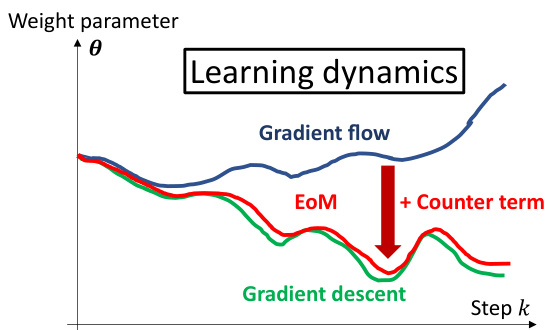  
Figure 1: Our approach. GF fails in describing the learning dynamics of GD due to discretization error . Our counter term approach successfully cancels the discretization error between GF and GD and hence allows for a reliable analysis of GD.  

learning, gradient flow (GF) and stochastic differential equations (SDEs) are used to analyze (stochastic) gradient descent ((S)GD). Research targets include: convergence [ 6 ,7 ,8 ,12 ,13 ,9 ,14 ,17 ], stability of optimization [ 19 ], optimization with constraints [ 19 ], convergent states [ 17 ,20 ], flatness of loss landscapes [ 17 ], empirical risk bounds [ 15 ], and online PCA [ 11 ]. Various techniques for continuous analysis have been imported to the analysis of discrete GD algorithms.  

However, there still exist gaps between differential equations and actual learning dynamics due to discretization error , which is the main interest of the present paper and is often missing in the literature above. To be specific, we F$\dot{\pmb\theta}(t)=\bar{-\pmb g}(\pmb\theta(\bar{t}))$ as a continuous approximation of GD at time $\pmb{\theta}_{k+1}=\pmb{\theta}_{k}-\eta\pmb{g}(\pmb{\theta}_{k})$ t$t\in\mathbb R$ ∈Rand step $k\in\mathbb{Z}$ ∈where , respectively, and $\pmb{\theta}(t)\in\mathbb{R}^{d}$ ∈a $\pmb{g}\in\mathbb{R}^{d}$ ∈$\pmb{\theta}_{k}\in\mathbb{R}^{d}$ is a gradient vector. are the weight p η$\eta\in\mathbb R$ ∈ers of a DNN is a learning rate and is regarded as the discretization step size when GF is discretized with the Euler method [21 ]: $\begin{array}{r}{\dot{\pmb{\theta}}(t=k\eta)\equiv\frac{\pmb{\theta}_{k+1}-\pmb{\theta}_{k}}{\eta}}\end{array}$ . Due to this approximation, discretization error (or “continuation error”) is introduced, and thus GF cannot fully explain the dynamics of GD. For instance, we show that according to GF, the weight norm of a scale-invariant layer collapses to zero when we use weight decay, while GD does not show such behavior (Section 5.1).  

To fill the critical gap between GF and GD, we propose modifying GF to describe the learning dynamics of GD more precisely; i.e., we add a counter term $\pmb{\xi}\in\mathbb{R}^{d}$ to the gradient $\textbf{\textit{g}}$ of GF that cancels the discretization error (Figure 1). This idea is motivated by backward error analysis in numerical analysis [ 21 ]. We derive a functional integral equation that determines the counter term and solve it (Section 3). As a result, we obtain a more reliable differential equation, called $E o M$ here, that describes the discrete learning dynamics of GD. Using the counter term, we derive the leading order of discretization error (Section 4.1) to show to what extent GF and EoM are precise in describing GD’s dynamics. This point is often missed in the literature on the continuous approximation of discrete GD algorithms [ 22 ,23 ,24 ,11 ,25 ,26 ,27 ,28 ]. We further derive a sufficient condition for learning rates for the discretization error to be small (Section 4.2). We show that EoM well explains empirical results.  

Furthermore, to show the benefits of EoM, we apply it to two specific cases: scale-invariant layers [29 ,30 ] and translation-invariant layers [ 31 ,32 ] (Section 5). For scale-invariant layers, we show that a better description of GD’s discrete dynamics requires modifications to the decay rate of weight norms that is previously derived in the continuous regime (SDEs) [ 33 ]. In addition, we show that EoM successfully reproduces the limiting dynamics ( $\mathbf{\boldsymbol{t}}\rightarrow\infty,$ ) of weight norms and angular update [34 ] that are previously derived in the discrete regime, while GF cannot reproduce this result. For translation-invariant layers, we show that EoM rather than GF dramatically matches empirical results, indicating the importance of the counter term. To the best of our knowledge, no study analyzes the temporal evolution of translation-invariant layers except for [ 31 ] and [ 32 ], where only the sum of weights is their focus, while we derive the dynamics of the whole weights.  

Our contribution is four-fold. Our code 1 and detailed experimental results are given as supplementary materials.  

1. To fill the critical gap between GF and GD, we derive a counter term for GF that cancels the discretization error, and as a result, we obtain EoM, a continuous differential equation that precisely describes the discrete learning dynamics of GD.   
2. To show to what extent GF and EoM are precise in describing discrete GD dynamics, we derive the leading order of discretization error, as is often missed in the literature on the continuous approximation of discrete GD algorithms. We further derive a sufficient condition for learning rates for the discretization error to be small.   
3. We apply EoM to two specific cases: scale-invariant layers and translation-invariant layers, indicating the importance of the counter term for a better description of the discrete learning dynamics of GD.   
4. Our experimental results support our theoretical findings.  

Our work is the first step toward answering this research question: to what extent can we predict the discrete learning dynamics of DNNs by constructing differential equations (EoM for DNNs)? Also, our work helps researchers import continuous analysis to the discrete analysis of GD algorithms. In this sense, our work bridges discrete and continuous analyses of GD algorithms.  

# 2 Related Work  

The idea of approximating discrete-time stochastic algorithms with continuous equations dates back to stochastic approximation theory [ 1 ,2 ,3 ,4 ,5 ]. Their primary focus is convergence analysis for discrete-time algorithms, while our focus is to predict the learning dynamics (temporal evolution) of weight parameters, such as the decay rates of weight norms and effective learning rate of scaleinvariant layers. Our idea of the counter term is inspired by the backward error analysis developed for numerical analysis [ 35 ]. This idea is now used to analyze discrete optimization [ 22 ,23 ,24 ,11 ,25 ,26 ,27 ,28 ]. [ 18 ] is a pioneering work on discretization error analysis between GF and GD that is based on the numerical analysis of the Euler method [ 21 ]. They derive a sufficient condition for learning rates for the discretization error to be small. This analysis is based on a bound (inequality), while we derive an explicit relationship between learning rates and discretization error as an equality.  

Neural mechanics and Noether’s learning dynamics [ 31 ,32 ] provide a solution to a part of the aforementioned problem: to what extent can we predict the learning dynamics of DNNs by constructing differential equations? They derive (the breaking of) conservation laws of weight parameters using differential equations and provide the temporal evolution of the conserved quantities. The present work is inspired by these studies but has crucial differences: 1) our focus is on the temporal evolution of all of the network parameters, not only the conserved quantities, 2) the gradient’s correction for canceling the discretization error is not limited to the first order, but all orders, and 3) the discretization error is explicitly provided in the present paper. See Appendix G for more related studies.  

# 3 Equation of Motion for Deep Neural Networks  

In the following sections, we define EoM by modifying GF (Section 3.1). We show that the counter term satisfies a functional integral equation (Section 3.2), and then we solve it (Section 3.3).  

# 3.1 Our Approach and Definitions  

We begin with a simple idea: add a counter term to GF to cancel discretization error, i.e.,  

$$
\pmb{\dot{\theta}}(t)=-\pmb{g}(\pmb{\theta}(t))-\eta\pmb{\xi}(\pmb{\theta}(t))\,,
$$  

where $\pmb{\theta}(t)\;\in\;\mathbb{R}^{d}$ is the vectorized weight parameters of a DNN at time $t\;\in\;\mathbb{R},\;d\;\in\;\mathbb{N}$ is the dimension of the weight, and $\dot{\pmb\theta}(t)$ denotes $d\pmb{\theta}(t)/d t$ . Gradient $\pmb{g}(\pmb{\theta}(t))$ is defined as $g(\pmb\theta(t)):=$ $\nabla f(\pmb\theta(t))+\lambda\pmb\theta(t)$ , which consists of a loss function $f(\pmb\theta(t))$ and weight decay te $\lambda\pmb{\theta}(t)$ re $\lambda>0$ controls the strength of weight decay. $\eta>0$ is a small learning rate, and $\pmb{\xi}(\pmb{\theta}(t))\in\mathbb{R}^{d}$ ∈is the counter term. Throughout this paper, we assume all functions are sufficiently smooth. We call Equation (1) the Equation of Motion $(E o M)$ for DNNs, or simply EoM.  

Our aim is to find $\xi$ that makes Equation (1) more reliable to precisely approximate GD $\theta_{k+1}=$ ${\pmb\theta}_{k}-\eta{\pmb g}({\pmb\theta}_{k})$ , where $\mathbf{\boldsymbol{\theta}}_{k}\in\mathbb{R}^{d}$ is the we ght at step $k\in\mathbb{Z}_{\geq0}$ . To do so, we first define the discretization error between GF (1) and GD at step k:  

$$
\pmb{e}_{k}:=\pmb{\theta}(k\eta)-\pmb{\theta}_{k}\ \in\mathbb{R}^{d}
$$  

and find $\xi$ that makes $e_{k}$ small. Throughout this paper, we use the standard Euler method to discretize GF: $\dot{\pmb{\theta}}(t)\equiv(\pmb{\theta}(t+\eta)-\pmb{\theta}(t))/\eta$ and $t=k\eta$ ; thus, $\eta$ is identified with the discretization step size.  

# 3.2 How to Determine Counter Term  

We show that the leading order of $e_{k}$ with respect to $\eta$ is controlled by the counter term (Theorem 3.2), and as a result, the counter term is determined via a functional integral equation (Equation (6)).  

Our first theorem shows what the counter term should cancel.  

Theorem 3.1 (Recursive formula for discretization error) .Discretization error $e_{k}$ satisfies:  

$$
\begin{array}{c}{{e_{k+1}-e_{k}=-\eta\big(g(\theta(k\eta))-g(\theta(k\eta)-e_{k})\big)+\eta^{2}\displaystyle\int_{0}^{1}d s\ddot{\theta}(\eta(k+s))(1-s)-\eta^{2}\xi(\theta(k\eta))(1-s)}}\\ {{0}}\\ {{=:-\eta\big(g(\theta(k\eta))-g(\theta(k\eta)-e_{k})\big)+\Lambda(\theta(k\eta))\,.}}\end{array}
$$  

Here, we defined $\begin{array}{r l}{\Lambda(\pmb{\theta}(k\eta)):=\eta^{2}\int_{0}^{1}d s\ddot{\pmb{\theta}}(\eta(k+s))(1-s)-\eta^{2}\pmb{\xi}(\pmb{\theta}(k\eta))}&{\in\mathbb{R}^{d}}\end{array}$ . The proof is based on Taylor’s theorem and is given in Appendix A.1. The right-hand side of Equation (3) tells us that the counter term (third term) should cancel the first and second terms. However, the following theorem states that the first term gives only subleading contributions with respect to $\eta$ .  

Theorem 3.2 (Leading order of discretization error) .Suppose that $\Delta(\theta(k\eta))=O(\eta^{\gamma})$ and $e_{0}=$ $O(\eta^{\gamma})$ for some $\gamma\,>\,0$ . Then $e_{k}\,=\,O(\eta^{\gamma})$ and $-\eta(\pmb{g}(\pmb{\theta}(k\eta))-\pmb{g}(\pmb{\theta}(k\eta)\,-\,\pmb{e}_{k}))\,=\,O(\eta^{\gamma+1})$ .Therefore, the first term in the right-hand side of Equation (3) is negligible compared with Λ:  

$$
\begin{array}{r}{e_{k+1}=e_{k}+\mathbf{A}(\pmb{\theta}(k\eta))-\eta(\pmb{g}(\pmb{\theta}(k\eta))-\pmb{g}(\pmb{\theta}(k\eta)-\pmb{e}_{k}))}\\ {=e_{k}+\mathbf{A}(\pmb{\theta}(k\eta))+O(\eta^{\gamma+1})\qquad(k=0,1,2,...)\,.}\end{array}
$$  

The proof is by induction and given in Appendix A.2. Therefore, the leading order of discretization error is $O(\eta^{\gamma})$ and given by:  

$$
\Lambda(\theta(k\eta))=O(\eta^{\gamma})\iff\int_{0}^{1}d s\,\ddot{\theta}(\eta(k+s))(1-s)-\xi(\theta(k\eta))=O(\eta^{\gamma-2})\,.
$$  

This is a functional equation of $\xi$ because $\ddot{\pmb{\theta}}(t)$ contains $\xi$ via Equation (1). A solution to Equation (6) for a large $\gamma$ gives a small $\pmb{\Lambda}$ and thus gives a small $e_{k}$ via Equation (5).  

# 3.3 Solution to Equation 6  

How can we solve Equation (6)? It is not easy to find an exact solution because Equation (6) is a functional integral equation [ 36 ,37 ,38 ,39 ,40 ]; therefore, we assume a power series solution with respect to $\eta$ :  

$$
\pmb{\xi}(\pmb{\theta}(k\eta))=\sum_{\alpha=0}^{\infty}\eta^{\alpha}\pmb{\xi}_{\alpha}=\pmb{\xi}_{0}(\pmb{\theta}(k\eta))+\eta\pmb{\xi}_{1}(\pmb{\theta}(k\eta))+\eta^{2}\pmb{\xi}_{2}(\pmb{\theta}(k\eta))+\cdots\,.
$$  

In the following theorem, we successfully find a solution for all orders of $\eta$ .  

Theorem 3.3 (Solution of Equation 6) .The solution to Equation (6) of form (7) is given by  

$$
\xi_{\alpha}(\pmb\theta)=\tilde{\xi}_{\alpha}(\pmb\theta):=\sum_{i=2}^{\alpha+2}\sum_{k_{1}+\cdots+k_{i}=\alpha-i+2}\frac{(-1)^{i}}{i!}D_{k_{1}}\cdot\cdot\cdot D_{k_{i-1}}\Xi_{k_{i}}
$$  

for $\alpha=0,1,2,\ldots$ , where we use differential operators (Lie derivatives) $\mathcal{D}_{\alpha}:=\tilde{\xi}_{\alpha-1}(\pmb{\theta})\cdot\nabla$ ($\left[\alpha=\right.$ $1,2,\ldots)$ and $\mathcal{D}_{0}:=g(\pmb{\theta})\cdot\nabla$ and also defined $\Xi_{\alpha}(\pmb{\theta}):=\tilde{\xi}_{\alpha-1}(\pmb{\theta})$ $'\alpha=1,2,\ldots,$ ) and $\Xi_{0}(\theta):=g(\theta)$ .  

The proof follows from the definition of the Lie derivative and is given in Appendix A.3. The first two orders of the solution are given by:  

$$
\begin{array}{l}{{\displaystyle{\widetilde{\xi}}_{0}(\pmb{\theta})=\frac{1}{2}\,({\pmb g}({\pmb\theta})\cdot\nabla){\pmb g}({\pmb\theta})=\frac{1}{4}\nabla||{\pmb g}({\pmb\theta})||^{2}}}\\ {{\displaystyle{\widetilde{\xi}}_{1}({\pmb\theta})=\frac{1}{2}({\widetilde{\xi}}_{0}({\pmb\theta})\cdot\nabla){\pmb g}({\pmb\theta})+\frac{1}{6}({\pmb g}({\pmb\theta})\cdot\nabla){\widetilde{\xi}}_{0}\,.}}\end{array}
$$  

Discussions. As can be inferred from Equations (8–10), $\tilde{\xi}_{\alpha}$ contains the $\alpha+2_{\mathrm{nd}}$ -order derivative of the loss function. Therefore, the higher-order counter terms cancel the higher-order smoothness of the discretization error.  

Here, we note that Equation (8) can be found, e.g., in [ 35 ], as a higher-order backward error analysis. However, our derivation above has independent contributions: 1) we clarify that the counter term cancels the leading order of discretization error (Theorem 3.2), and 2) we find that the discretization error itself is also given by the counter term (Corollary 4.1 in the next section).  

Equation (9) often appears in the literature on backward error analysis [ 21 ,35 ] and its related topics in machine learning, e.g., [ 41 ,23 ,24 ,27 ,28 ,31 ]. Typically, $\tilde{\xi}_{0}$ is added to gradients of continuous equations (e.g., SDE) to close the gap between continuous equations and discrete algorithms (e.g., SGD) by canceling (at least first-order) discretization error. However, higher-order discretization error is neglected in these studies. In contrast, our solution (8) cancels all orders of discretization error.  

# 4 Discretization Error  

The question here is to what extent the continuous approximation (1, 8) is precise; this point is often missed in the literature on continuous approximation [ 22 ,23 ,24 ,11 ,25 ,26 ,27 ,28 ]. In this section, we use the counter term (8) and quantify discretization error as a function of the loss function and its derivatives (Section 4.1). We find that our result well explains empirical results. We further derive a sufficient condition for learning rates for the discretization error to be small (Section 4.2).  

# 4.1 Counter Term Gives Leading Order of Discretization Error  

We show that the counter term gives the leading order of discretization error between GD vs. GF and EoM. The proof follows from Theorem 3.2 and 3.3 and is given in Appendix A.4.  

Corollary 4.1 (Leading order of discretization error is given by $\tilde{\xi}_{\alpha}$ ).Suppose that we use $\xi$ up to $O(\eta^{\gamma-1})$ , i.e., $\pmb{\xi}=\tilde{\xi}_{0}+\eta\tilde{\xi}_{1}+\cdot\cdot\cdot+\eta^{\gamma-1}\tilde{\xi}_{\gamma-1}\,f o r\,\gamma\in\mathrm{\bar{Z}}_{>0}\,(\pmb{\xi}$ $\mathbf{\Sigma}^{\prime}\boldsymbol{\xi}:=\mathbf{0}\,f o r\,\gamma=0,$ ). Then,  

$$
\begin{array}{r}{e_{k+1}=e_{k}+\Lambda(\pmb{\theta}(k\eta))+O(\eta^{\gamma+3})=e_{k}+\eta^{\gamma+2}\tilde{\xi}_{\gamma}+O(\eta^{\gamma+3})\,.}\end{array}
$$  

First, Corollary 4.1 implies that the higher the orders of the counter term we use (large $\gamma$ ), the more precise EoM (1) is (small $e_{k}$ ). Thus, GF $\begin{array}{r}{\mathbf{\nabla}\xi=\mathbf{0}}\end{array}$ ) gives larger discretization error than EoM $(\boldsymbol{\xi}\neq\mathbf{0})$ ). Second, Corollary 4.1 gives the equality of the leading order of discretization error at arbitrary steps. This is not d[18 ] nor an asymptotic analysis ( $\left[k\,\rightarrow\,\infty\right]$ ). Third, let us give an intuition by considering $\boldsymbol{\xi}=\mathbf{0}$ (GF). Then, Corollary 4.1 gives:  

$$
e_{k+1}=e_{0}+\sum_{s=0}^{k}\frac{\eta^{2}}{2}(H(\pmb{\theta}(s\eta))+\lambda I)(\nabla f(\pmb{\theta}(s\eta))+\lambda\pmb{\theta}(s\eta))+O(\eta^{3})\,,
$$  

where $H(\pmb\theta)\in\mathbb{R}^{d\times d}$ is the Hessian of the loss function $f$ with respect to $\pmb{\theta}$ and $I\in\mathbb{R}^{d\times d}$ is the identity matrix. Equation (12) suggests that 1) large learning rates lead to a large discretization error and 2) steep loss functions (along the trajectory) lead to a large discretization error.  

Empirical result. We find Equation (12) well explains our empirical result. We compare Equation (12) (up to $\bar{O}(\eta^{2}))$ with the actual discretization error of GD and GF in Figure 2. First, the gap between our theoretical prediction of discretization error (orange curve) and the actual discretization error (red curve) is small because the range of relative error $(||e_{k}||/||\pmb{\theta}_{k}||)$ in this plot is only 0–0.01 (see also Figure 11 in Appendix F). Second, most of the discretization error for Theory (orange curve) and Experiment (red curve) is produced within the first 100 steps. We can understand this phenomenon with the help of Equation (12). It suggests that discretization error can be enhanced when the loss function is non-smooth along the learning trajectory, which is likely to occur at the beginning of training due to random initialization. Therefore, a large part of discretization error is produced in the early stage of training. Third, we see that most of the gap between Theory (orange curve)  

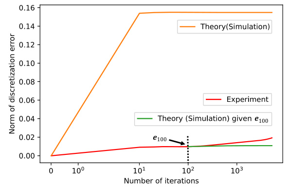  
Figure 2: Theoretical prediction of discretization error of GF and GD (Equation (12)) vs. actual discretization error of GF and GD. The larning rate and weight decay are $10^{-2}$ and $10^{-2}$ .See Appendix F.2 for more results and details. See Section 6 for experimental settings.  

and Experiment (red curve) also comes from the first 100 steps; in fact, the green curve shows that there is a much smaller enhancement of the gap after the 100th step. The source of the gap is the higher-order term ${\cal O}(\eta^{3})$ in Equation (12). It consists of higher-order derivatives of the loss function (Theorem 8 and Corollary 4.1) and thus can be large when the loss function is non-smooth along the learning trajectory. Therefore, by the same logic as above, the early stage of training tends to produce a gap between Theory (orange curve) and Experiment (red curve).  

# 4.2 Discretization Error Bounds  

We provide a sufficient condition (an upper bound for $\eta$ ) for GF and EoM to follow GD up to a given step $k$ , which helps us infer desired learning rates (step sizes) for the discretization error to be small. We first consider $\boldsymbol{\xi}=\mathbf{0}$ (GF).  

Corollary 4.2 (Learning rate bound for $\boldsymbol{\xi}=\mathbf{0}$ ).Let $\boldsymbol{\xi}=\mathbf{0}$ and assume that $e_{0}=O(\eta^{3})$ . Let ϵand $t$ be arbitrary positive numbers. If the step size satisfies  

$$
\eta<\sqrt{\frac{\epsilon}{k}}\sqrt{\frac{2}{\operatorname*{max}_{0\leq t^{\prime}\leq t}\{||(H(\pmb{\theta}(t^{\prime}))+\lambda I)\pmb{g}(\pmb{\theta}(t^{\prime}))||\}}}\,,
$$  

for some $k\in\{1,2,...,\lfloor\frac{t}{\eta}\rfloor\}$ , then the discretization error can be arbitrarily small:  

$$
||\boldsymbol{e}_{k}||<\epsilon+O(\epsilon^{\frac{3}{2}})\,.
$$  

The proof follows from Equation (12) and is given in Appendix A.5. We see that 1) there is no guarantee that the discretization error is small unless the learning rate is sufficiently small, 2) we need small learning rates to keep the discretization error small for a long period, and 3) we need small learning rates to keep the discretization error small for non-smooth loss landscapes. This is consistent with our empirical results in Figure 3 and 4; in fact, 1) the discretization error blows up for a large learning rate $\bar{y}=10^{-1}$ in Figure 3), 2) it increases as the number of steps increases (Figure 4), and 3) most of it is produced in the early phase of training, where the objective function tends to be non-smooth, and the gradients tend to be large.  

We compare our bound (13) with a bound given in [ 18 ] because, to our knowledge, only [ 18 ] provides a bound for the step size with respect to discretization error in the context of deep learning. In [ 18 ], it is proved that in essence, $\eta\lesssim\epsilon/\beta_{t\epsilon}\gamma_{t\epsilon}c_{t}$ , where $\beta_{t\epsilon}$ and $\gamma_{t\epsilon}$ measure the non-smoothness of the loss function, and $c_{t}$ depends on the spectrum of the Hessian. These factors are hard to compute analytically unless the loss function and network are simple, but the qualitative behavior of this bound is the same as ours (13); i.e., both bounds become tight when the loss function is non-smooth.  

We also derive a learning rate bound for $\pmb{\xi}=\tilde{\pmb{\xi}}_{0}$ (EoM) and the full statement is given in Corollary A.1 in Appendix A.6, which states that if $\eta<O(\sqrt[3]{\frac{\epsilon}{k}})$ , then $\|e_{k}\|<\epsilon+O\big(\epsilon^{\frac{4}{3}}\big)$ . Therefore, larger step sizes are now allowed compared with Corollary 4.2 (GF) because of the non-zero counter term. Furthermore, we can show larger bounds for higher-order counter terms in a similar way.  

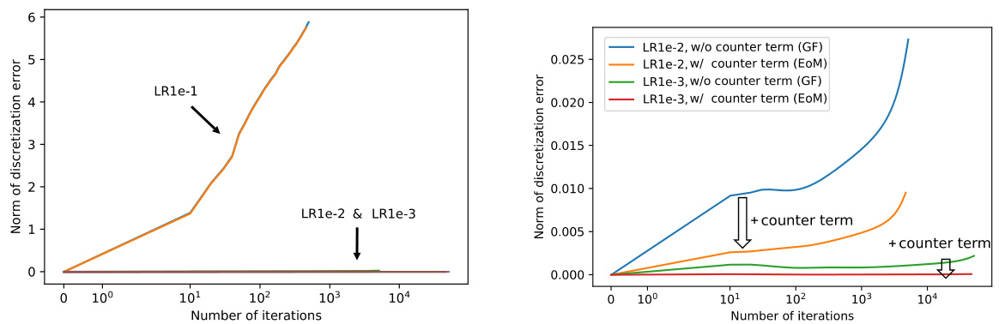  
Figure 3: Discretization error explodes for large Figure 4: Discretization error of GF and EoM. learning rate $(10^{-1})$ ). LR means learning rate. Figure 3 is magnified. The counter term reduces Weight decay is $10^{-3}$ . Curves include both GF and discretization error as expected, and smaller learnEoM. Relative discretization error is also shown ing rates give smaller discretization errors. in Appendix F. See Section 6 for experimental  

settings.  

# 5 Application: Scale- and Translation-invariant Layers  

To show the benefits of EoM, we finally apply our theory to two specific cases: scale-invariant layers [29 ,30 ] and translation-invariant layers [ 31 ,32 ]. Additionally, Appendix B provides an application  

to broken conservation laws [ 31 ]. In the following, we simply focus on $\boldsymbol{\xi}=\mathbf{0}$ and $\pmb{\xi}=\tilde{\xi}_{0}$ to analyze the differences between $\boldsymbol{\xi}=\mathbf{0}$ and $\boldsymbol{\xi}\neq\mathbf{0}$ .  

Definitions Let us first introduce our notation. A transfor tio $\psi$ $\pmb{\theta}\in\mathbb{R}^{d}$ a $\alpha\in\mathbb{R}$ $\alpha\in\mathbb R$ $\hat{\theta}_{\mathcal{A}}:=\theta_{\mathcal{A}}/r_{\mathcal{A}}$ we defin is said to be a A ∈, w s the indica A $\nabla=(\partial/\partial\theta_{1},...,\partial/\partial\theta_{d})^{\top}$ $\pmb{\theta}_{\mathcal{A}}:=\pmb{\theta}\odot\mathbb{1}_{\mathcal{A}}\in\mathbb{R}^{d}$ A symmetry transformation .$\alpha_{\mathcal{A}}:=\alpha\mathbb{1}_{\mathcal{A}}+\mathbb{1}_{\mathcal{A}^{\mathfrak{c}}}\in\mathbb{R}$ A , we define ere ∈⊙$A\subset\ensuremath{\mathbb{R}}^{d}$ , where is the ⊂∇$\nabla_{\mathcal{A}}:=\mathbb{1}_{\mathcal{A}}\odot\nabla$ functi A A $\mathcal{A}^{\mathtt{c}}$ ., is the complement of A is a linear layer i A f⊙∇ if $f(\psi({\boldsymbol{\theta}},\alpha))\,=\,f({\boldsymbol{\theta}})$ . We also define ent-wise product A he DNN). For . For a vector $r_{\mathcal{A}}:=||\bar{\theta}_{\mathcal{A}}||$ A .$\mathbb{1}_{\mathcal{A}}\in\{0,1\}^{d}$ A || ∈{ $\pmb{\theta}\in\mathbb{R}^{d}$ A ∈|| and ient }r,  

# 5.1 Learning Dynamics of Scale-invariant Layers  

In this section, we focus on scale-invariant lay $\boldsymbol{\mathcal{A}}$ as a subspace that is invariant under the scale transformation a linear layer immediately before a batch normalization layer is scale-invariant. We see that for a $\psi(\pmb\theta,\alpha):=\alpha_{\pmb A}\pmb\theta=\alpha\pmb\theta_{\dot{A}}+\pmb\theta_{\mathcal{A}^{\circ}}$ A A A ($(\alpha>0)$ ). For example, better description of GD’s discrete dynamics, we need modifications to the decay rate of $r_{A}$ that is previously derived in the continuous regime [ 33 ]. In addition, we show that EoM successfully reproduces the limiting dynamics of $r_{A}$ and angular update 4 ] at $t\,\rightarrow\,\infty$ that are previously derived in the discrete regime, while GF cannot. In Appendix C, we additionally show that there are crucial differences between GD and GF via the effective learning rate of scale-invariant layers [29, 42, 30, 43, 44, 33, 45, 34, 46, 47].  

EoM for $r$ We construct the EoM for $r_{A}$ (the EoM for $\hat{\theta}_{\mathcal{A}}$ is given in Appendix C for completeness).  

Theorem 5.1 Specifically, this is equivalent to: (EoM for $r_{A}$ and solution) .EoM $(I)$ gives $\begin{array}{r}{r_{\mathcal{A}}^{\dot{2}}(t)=-2\lambda r_{\mathcal{A}}^{2}(t)-2\,\eta\,\pmb{\theta}_{A}(t)\cdot\pmb{\xi}(\pmb{\theta}(t))}\end{array}$ A A .  

$$
r_{\ A}^{\dot{2}}(t)=-2\lambda r_{\ A}^{2}(t)\Longleftrightarrow\ r_{A}^{2}(t)=r_{A}^{2}(0)e^{-2\lambda t}
$$  

fo $\mathbf{\nabla}\cdot\pmb{\xi}=\mathbf{0}\,(G F)$ and  

$$
\begin{array}{c}{\displaystyle r_{A}^{\dot{2}}(t)=-2(\lambda+\frac{\eta\lambda^{2}}{2})r_{A}^{2}(t)+\frac{\eta}{r_{A}^{2}(t)}||\nabla_{A}f(\hat{\theta}_{A}(t)+\theta_{A^{c}}(t))||^{2}}\\ {\displaystyle\Longleftrightarrow r_{A}^{2}(t)=r_{A}^{2}(0)e^{-2\lambda(1+\frac{\eta\lambda}{2})t}+\eta\int_{0}^{t}d\tau e^{-2\lambda(1+\frac{\eta\lambda}{2})(t-\tau)}\frac{||\nabla_{A}f(\hat{\theta}_{A}(\tau)+\theta_{A^{c}}(\tau))||^{2}}{r_{A}^{2}(\tau)}}\\ {\displaystyle\overset{\sim}{,}}\end{array}
$$  

for ξ=ξ˜0 (EoM).  

The proof is based on Equations $(1,9)$ and given in Appendix A.7. Equation (15) gives $r_{A}^{2}(k\eta)=$ $r_{\mathcal{A}}^{2}(0)e^{-2\eta\lambda k}\;(k\in\mathbb{Z}_{\geq0})$ learning rate A [33 ]). This is originally discussed in the continuous regime (SDE) [ at discretization; therefore, $\eta\lambda$ is regarded as the decay rate of 33 ]; however, we $r_{\mathcal{A}}$ (A intrinsic find that for a better description of the discrete dynamics of GD, the decay rate needs to be modified from $\eta\lambda$ to $\eta\lambda(1+\frac{\eta\lambda}{2})$ (see the exponent of Equation (17)). This means that $r_{A}$ in GD decays ster than expected from a naive continuous dynamics (GF (15) and SDE [ 33 ]). See Appendix G for higher-order corrections.  

Limiting dynamics. We next derive the limiting dynamics $\left(t\rightarrow\infty\right)$ ) of $r_{A}$ .  

Corollary 5.1 ${}^{r}\!A$ at equilibrium) .When $\pmb{\xi}=\mathbf{0}\,(G F)$ ,$r_{A}$ collapses to zero as $t\to\infty$ . When $\pmb{\xi}=\tilde{\pmb{\xi}}_{0}$ $(E o M)$ $||\nabla_{A}f(\widehat{\pmb{\theta}}_{A}(t)+\pmb{\theta}_{A^{\mathrm{c}}}(t))||\xrightarrow{t\rightarrow\infty}c_{*}$ , assume that there exist two constants −−−→ ∗. Then $\begin{array}{r}{r_{\mathcal{A}*}^{2}=\sqrt{\frac{\eta}{2\lambda+\eta\lambda^{2}}}c_{*}}\end{array}$ $r_{\mathcal{A}\ast}\geq0$ qand $c_{*}\geq0$ .such that $r_{A}(t)\xrightarrow{t\rightarrow\infty}r_{A*}$ −−−→ A∗ and (SGD), although our approach is continuous (EoM (1)). Without the counter term, we cannot explain The proof follows from Theorem 5.1 and is given in Appendix A.8. The non-zero counter term successfully reproduces $r_{\mathcal{A}\ast}^{2}\sim\sqrt{\eta/2\lambda}\,c_{\ast}$ A∗ ∼p∗[29 ,34 ], which is originally derived in the discrete regime this behavior because GF gives $r_{A}(t)\xrightarrow{t\to\infty}0(\ne\sqrt{\eta/2\lambda}\,c_{*})$ −−−→ p∗.  

We next derive the limiting dynamics of angular update [34 ], which is designed to measure the temporal evolution of scale-invariant networks. It is originally defined in the discrete regime:  

$\cos\Delta_{k}:=\hat{\theta}_{\mathcal{A}k}\cdot\hat{\theta}_{\mathcal{A}k+1}$ , where $\begin{array}{r}{\widehat{\theta}_{\mathcal{A}k}\,:=\,\frac{\mathbb{1}_{A\odot\pmb{\theta}_{k}}}{||\mathbb{1}_{A\odot\pmb{\theta}_{k}}||}}\end{array}$ . That is, $\Delta_{k}$ represents a single-step angular change define $\cos\Delta(t):=\bar{\theta}\bar{\mathcal{A}}(t)\cdot\hat{\pmb{\theta}}_{A}(t+\eta)$ A ·A he scale-invariant layers .|| A ⊙|| A . In the continuous regime, we can Corollary 5.2 ($\Delta(t)$ at equilibrium) .Let us use $\pmb{\xi}=\tilde{\xi}_{0}$ . Suppose that the assumptions in Corollary 5.1 are satisfied. The angular update at equilibrium, denoted by $\Delta_{*}$ , is given by $\begin{array}{r}{\cos\Delta_{*}=\frac{1-\eta\lambda}{1-\eta^{2}\lambda^{2}/2}+}\end{array}$ −${\cal O}(\eta^{3})$ , and thus, $\Delta_{*}=\sqrt{2\eta\lambda}+O((\eta\lambda)^{3/2})$ .  

The proof is based on Corollary 5.1 and is given in Appendix A.10. EoM successfully reproduces $\Delta_{*}\,\stackrel{!}{\sim}\,\sqrt{2\eta\lambda}$ [34 ], which is originally derived in the discrete regime (SGD), alth EoM is continuous itself. On the other hand, GF cannot explain the limiting dynamics of $\Delta(t)$ because when $\boldsymbol{\xi}=\mathbf{0}$ ,$r(t)$ goes to zero as $t\to\infty$ (Equation (15)), and thus, $\begin{array}{r}{\cos\Delta(t)=\frac{\theta_{\mathcal{A}}(t)}{r_{\mathcal{A}}(t)}\cdot\frac{\dot{\theta}_{\mathcal{A}}(t+\eta)}{r_{\mathcal{A}}(t+\eta)}}\end{array}$ is ill-defined. In summary, there are gaps between GF and GD, and our discussion above indicates that A A the counter term is inevitable to describe the actual dynamics of GD.  

# 5.2 Learning Dynamics of Translation-invariant Layers  

Next, we apply EoM to translation-invariant layers. To the best of our knowledge, no study analyzes the temporal evolution of translation-invariant layers except for [ 31 ] and [ 32 ], where only the sum of weights is their focus, while we derive the dynamics of the whole weights. A translation-invariant $\boldsymbol{\mathcal{A}}$ is defined as a layer that is invariant under the translation transformation ${\pmb{\psi}}(\pmb{\theta},\alpha):=\pmb{\theta}\!+\!\alpha\mathbb{1}_{A}$ (the following, we derive EoM and show that its theoretical prediction of decay rates dramatically $(\alpha\in\mathbb{R})$ ∈). For example, a linear layer immediately before the softmax layer is translation-invariant. In matches empirical results, indicating the importance of the counter term. In Appendix $\mathrm{D}$ , we additionally discuss the differences between GF and GD in translation-invariant layers.  

For and $\theta_{\mathcal{A}\parallel}$ A∥ enience, we first is orthogonal to $\theta_{\mathrm{\mathcal{A}\perp}}$ A⊥ ompose . Here, note that $\theta_{A}$ to tw ∇$\nabla f(\pmb\theta)$ rs (Figure 5); is orthogonal to $\theta_{\mathrm{\mathcal{A}\perp}}$ $\mathbb{1}_{A}$ A because of translation $\nabla f(\pmb\theta)$ ,ance; in fact, differentiating both sides of $f(\pmb\theta+\alpha\mathbb I_{A})=f(\pmb\theta)$ with respect to $\alpha$ and setting $\alpha=0$ , we have $\mathbb{1}_{A}\cdot\nabla f(\pmb{\theta})=0$ see $\theta_{\mathrm{\mathcal{A}\perp}}$ ,$\theta_{\mathcal{A}\parallel}$ and A∥ $\begin{array}{r}{P:=\frac{1}{d_{A}}\mathbb{1}_{A}\mathbb{1}_{A}^{\top}}\end{array}$ , and the projection matrix , where $d_{A}$ is the dimension of Pas $\begin{array}{r}{\pmb{\theta}_{A\pm}:=P\pmb{\theta}_{A}=\frac{\mathbb{1}_{A}\cdot\pmb{\theta}_{A}}{d_{A}}\mathbb{1}_{A},\pmb{\theta}_{A\parallel}:=(I-P)\pmb{\theta}_{A}=\pmb{\theta}_{A}-\pmb{\theta}_{A\perp}.}\end{array}$ $\boldsymbol{\mathcal{A}}$ .A −,We construct the EoM for $\theta_{\mathrm{\mathcal{A}\perp}}$ (the EoM for $\theta_{\mathcal{A}\parallel}$ is given in Appendix $\mathrm{D}$ for completeness).  

Theorem 5.2 (EoM for $\theta_{\mathcal{A\perp}}$ ).EoM $(I)$ gives $\dot{\pmb\theta}_{A\perp}(t)\,=\,-\lambda\pmb\theta_{A\perp}(t)\,-\,\eta P\pmb\xi(\pmb\theta(t))$ . Specifically, this is equivalent to $\dot{\theta}_{\mathcal{A}\perp}(t)\;=\;-\lambda\pmb{\theta}_{\mathcal{A}\perp}(t)\,\Longleftrightarrow\,\pmb{\theta}_{\mathcal{A}\perp}(t)\;=\;\pmb{\theta}_{\mathcal{A}\perp}(0)e^{-\lambda t}$ for $\xi\:=\:0$ $(G F)$ and $\begin{array}{r}{\dot{\theta}_{A\perp}(t)=-(\lambda+\frac{\eta\lambda^{2}}{2})\theta_{A\perp}(t)\Longleftrightarrow\theta_{A\perp}(t)=\theta_{A\perp}(0)e^{-(\lambda+\frac{\eta\lambda^{2}}{2})t}.}\end{array}$ for $\pmb{\xi}=\tilde{\xi}_{0}\,(E o M)$ .  

The proof on Equations $(1,9)$ and is given in Append x A.11. $\theta_{\mathrm{\mathcal{A}\perp}}$ monotonically collapses to zero as →∞ in either cas $\boldsymbol{\xi}=\mathbf{0}$ or $\boldsymbol{\xi}\neq\mathbf{0}$ ; thus, as tincreases, the dynamics is restricted $\eta\lambda$ onto the subspace orthogonal to to $\eta\lambda+\frac{\bar{\eta^{2}}\lambda^{2}}{2}$ , as is also done for $\theta_{\mathrm{\mathcal{A}\perp}}$ A⊥ $r_{A}$ (Figure 5). The decay rate is corrected by the counter term from in Section 5.1. Therefore, the $\theta_{\mathrm{\mathcal{A}\perp}}$ of GD decays faster than that of GF. Figure 6 and Table 1 support our findings. In particular, Table 1 shows that the decay rates predicted by EoM dramatically match those of GD, indicating the importance of the counter term.  

Table 1: match experimental results of GD (fourth column) much better than GF (second column), indicating Decay rates of $||\theta_{\mathrm{\mathcal{A}\bot}}||$ .The theoretical predictions by EoM (third column) dramatically the importance of the counter term. LR and WD mean learning rate and weight decay, respectively. The colors correspond to those in Figure 6. See Section 6 for experimental settings.  

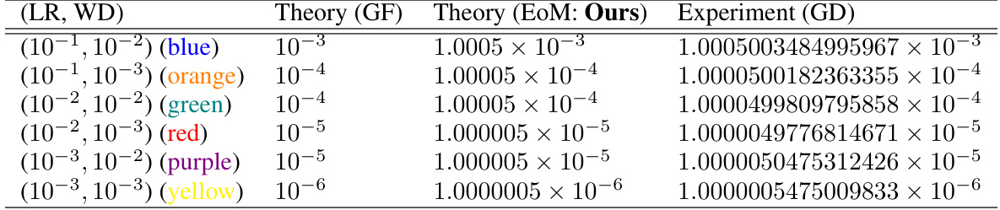  

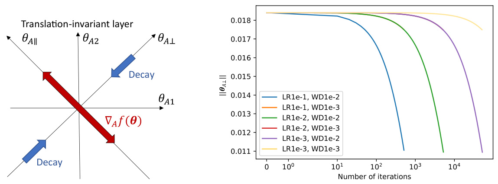  
$\pmb{\theta}_{A}\,=\,(\theta_{A1},\theta_{A2})^{\top}$ Figure 5: translation-invariant layer. Learning dynamics of .$\theta_{\mathcal{A}\perp}$ decays to Here, 0 Figure 6: cays to zero, as suggested by Theorem 5.2. invariant layer. LR and WD mean learning rate and weight Decay of $||\theta_{\mathrm{\mathcal{A}}\perp}||$ (GD). $||\theta_{\mathcal{A}\perp}||$ mA notonically deis translation(also shown in Figure 6). The decay of decay, respectively. Note that the orange and green curves GD is faster than that of GF (Theorem (LR1e-1, WD1e-3 and LR1e-2, WD1e-2) and the red and 5.2). As $t$ increases, the dynamics is repurple curves (LR1e-2, WD1e-3 and LR1e-3, WD1e-2) tostricted onto the subspace orthogonal to tally overlap. The decay rates of all curves are given in Table $\theta_{\mathrm{\mathcal{A}\perp}}$ .1. See Section 6 for experimental settings.  

# 6 Experiment  

We explain our experimental settings for Figures 2–6 and Table 1. Our network consists of a first linear layer, swish activation [ 48 ], second linear layer, batch normalization [ 49 ], third linear layer, and last softmax layer. Cross-entropy is used for the loss function. We note that the second linear layer is scale-invariant, and the last linear layer is translation invariant. The batch normalization uses fixed statistics to keep the scale invariance of the second linear layer. Swish is chosen to ensure differentiability. None of the linear layers have a bias term. The dataset is the training set of MNIST [50 ], and thus, the batch size is 60,000. Gradient descent is used for the optimizer. We use 64-bits of precision for all computations. To simulate GF and EoM, we use a sufficiently small learning rate $(10^{-5})$ . The results are produced from only one random seed to save on computational costs, but we confirm that different random seeds lead to similar results. More detailed information is given in Appendix E and our code. In all experiments, we use $\pmb{\xi}=\tilde{\pmb{\xi}}_{0}$ for EoM. We do not include higher-order counter terms, such as $\tilde{\xi}_{1}$ , because they require third and higher order derivatives of the loss function and are thus extremely memory-consuming. We could circumvent this issue, e.g., by applying Hessian-free optimization [51], but this is out of our current scope.  

# 7 Conclusion and Limitations  

In this work, to fill the critical gap between GF and GD, we add a counter term to GF and obtain EoM, a continuous differential equation that precisely describes the discrete learning dynamics of GD. To show to what extent GF and EoM are precise in describing GD’s discrete dynamics, we derive the leading order of discretization error, as is often missed in the literature on the continuous approximation of discrete GD algorithms. We further derive a sufficient condition for learning rates for the discretization error to be small. We apply our theory to two specific cases, scale- and translation-invariant layers, indicating the importance of the counter term for a better description of the discrete learning dynamics of GD. Our experimental results support our theoretical findings.  

Throughout this paper, we focus only on GD and GF to expose the ideas simply, and our study does not include stochasticity (e.g., SGD and SDE), acceleration methods (e.g., momentum and Nesterov [52 ]), or adaptive optimizers (e.g., Adam [ 53 ]). Nonetheless, they could be combined with our analysis, for example, using error analysis of SDEs [ 23 ,24 ], continuous-time accelerated methods [7 ,54 ,9 ,13 ,14 ,55 ,16 ], and continuous-time Adam [ 56 ]. See Appendix G for more discussions. Therefore, our study could be extended to import continuous analysis to the discrete analysis of various GD algorithms. In this sense, our work bridges discrete and continuous analyses of GD algorithms.  

# Acknowledgment  

We thank Shuhei M. Yoshida for his insightful comments on the dynamics of scale-invariant layers and the experimental settings. We also thank Hidenori Tanaka for his discussion that inspired us to start this study.  

# References  

[1] Harold J. Kushner. Rates of convergence for sequential Monte Carlo optimization methods. SIAM Journal on Control and Optimization , 16(1):150–168, 1978.   
[2] Harold J. Kushner and Dean S. Clark. Stochastic approximation methods for constrained and unconstrained systems . Springer-Verlag New York, 1978.   
[3] Harold J. Kushner and Adam Shwartz. An invariant measure approach to the convergence of stochastic approximations with state dependent noise. SIAM Journal on Control and Optimization , 22(1):13–27, 1984.   
[4] L. Ljung, G.C. Pflug, and H. Walk. Stochastic Approximation and Optimization of Random Systems . Oberwolfach Seminars. Birkhäuser Basel, 1992.   
[5] H. Kushner and G.G. Yin. Stochastic Approximation and Recursive Algorithms and Applications .Stochastic Modelling and Applied Probability. Springer New York, 2003.   
[6] Maxim Raginsky and Jake Bouvrie. Continuous-time stochastic mirror descent on a network: Variance reduction, consensus, convergence. In 2012 IEEE 51st IEEE Conference on Decision and Control (CDC) , pages 6793–6800. IEEE, 2012.   
[7] Walid Krichene, Alexandre Bayen, and Peter L Bartlett. Accelerated mirror descent in continuous and discrete time. In C. Cortes, N. Lawrence, D. Lee, M. Sugiyama, and R. Garnett, editors, Advances in Neural Information Processing Systems , volume 28. Curran Associates, Inc., 2015.   
[8] Panayotis Mertikopoulos and Mathias Staudigl. Convergence to nash equilibrium in continuous games with noisy first-order feedback. In 2017 IEEE 56th Annual Conference on Decision and Control (CDC) , pages 5609–5614. IEEE, 2017.   
[9] Walid Krichene and Peter L Bartlett. Acceleration and averaging in stochastic descent dynamics. In I. Guyon, U. V. Luxburg, S. Bengio, H. Wallach, R. Fergus, S. Vishwanathan, and R. Garnett, editors, Advances in Neural Information Processing Systems , volume 30. Curran Associates, Inc., 2017.   
[10] Qiang Liu. Stein variational gradient descent as gradient flow. In I. Guyon, U. V. Luxburg, S. Bengio, H. Wallach, R. Fergus, S. Vishwanathan, and R. Garnett, editors, Advances in Neural Information Processing Systems , volume 30. Curran Associates, Inc., 2017.   
[11] Yuanyuan Feng, Lei Li, and Jian-Guo Liu. Semigroups of stochastic gradient descent and online principal component analysis: properties and diffusion approximations. Communications in Mathematical Sciences , 16:777–789, 2017.   
[12] Damien Scieur, Vincent Roulet, Francis Bach, and Alexandre d 'Aspremont. Integration methods and optimization algorithms. In I. Guyon, U. Von Luxburg, S. Bengio, H. Wallach, R. Fergus, S. Vishwanathan, and R. Garnett, editors, Advances in Neural Information Processing Systems ,volume 30. Curran Associates, Inc., 2017.   
[13] Pan Xu, Tianhao Wang, and Quanquan Gu. Accelerated stochastic mirror descent: From continuous-time dynamics to discrete-time algorithms. In Amos Storkey and Fernando PerezCruz, editors, Proceedings of the Twenty-First International Conference on Artificial Intelligence and Statistics , volume 84 of Proceedings of Machine Learning Research , pages 1087–1096. PMLR, 09–11 Apr 2018.   
[14] Pan Xu, Tianhao Wang, and Quanquan Gu. Continuous and discrete-time accelerated stochastic mirror descent for strongly convex functions. In Jennifer Dy and Andreas Krause, editors, Proceedings of the 35th International Conference on Machine Learning , volume 80 of Proceedings of Machine Learning Research , pages 5492–5501. PMLR, 10–15 Jul 2018.   
[15] Alnur Ali, Edgar Dobriban, and Ryan J. Tibshirani. The implicit regularization of stochastic gradient flow for least squares. In ICML , pages 233–244, 2020.   
[16] Nikola B Kovachki and Andrew M Stuart. Continuous time analysis of momentum methods. Journal of Machine Learning Research , 22(17):1–40, 2021.   
[17] Stephan Wojtowytsch. Stochastic gradient descent with noise of machine learning type. Part II: Continuous time analysis. arXiv preprint arXiv:2106.02588 , 2021.   
[18] Omer Elkabetz and Nadav Cohen. Continuous vs. discrete optimization of deep neural networks. In A. Beygelzimer, Y. Dauphin, P. Liang, and J. Wortman Vaughan, editors, Advances in Neural Information Processing Systems , 2021.   
[19] Fanchen Bu and Dong Eui Chang. Feedback gradient descent: Efficient and stable optimization with orthogonality for DNNs. Proceedings of the AAAI Conference on Artificial Intelligence ,2022.   
[20] Zhiyuan Li, Tianhao Wang, and Sanjeev Arora. What happens after SGD reaches zero loss? –a mathematical framework. In International Conference on Learning Representations , 2022.   
[21] E. Hairer, S. P. Nørsett, and G. Wanner. Solving Ordinary Differential Equations I (2nd Revised. Ed.): Nonstiff Problems . Springer-Verlag, Berlin, Heidelberg, 1993.   
[22] Qianxiao Li, Cheng Tai, and Weinan E. Stochastic modified equations and adaptive stochastic gradient algorithms. In Doina Precup and Yee Whye Teh, editors, Proceedings of the 34th International Conference on Machine Learning , volume 70 of Proceedings of Machine Learning Research , pages 2101–2110. PMLR, 06–11 Aug 2017.   
[23] Qianxiao Li, Cheng Tai, and Weinan E. Stochastic modified equations and dynamics of stochastic gradient algorithms I: Mathematical foundations. Journal of Machine Learning Research , 20(40):1–47, 2019.   
[24] Yuanyuan Feng, Tingran Gao, Lei Li, Jian-Guo Liu, and Yulong Lu. Uniform-in-time weak error analysis for stochastic gradient descent algorithms via diffusion approximation. Communications in Mathematical Sciences , 18(1):163–188, 2020.   
[25] Wenqing Hu, Chris Junchi Li, Lei Li, and Jian-Guo Liu. On the diffusion approximation of nonconvex stochastic gradient descent. Annals of Mathematical Sciences and Applications ,2019.   
[26] Jing An, Jianfeng Lu, and Lexing Ying. Stochastic modified equations for the asynchronous stochastic gradient descent. Information and Inference: A Journal of the IMA , 9(4):851–873, 11 2019.   
[27] David Barrett and Benoit Dherin. Implicit gradient regularization. In International Conference on Learning Representations , 2021.   
[28] Samuel L Smith, Benoit Dherin, David Barrett, and Soham De. On the origin of implicit regularization in stochastic gradient descent. In International Conference on Learning Representations ,2021.   
[29] Twan Van Laarhoven. L2 regularization versus batch and weight normalization. arXiv preprint arXiv:1706.05350 , 2017.   
[30] Guodong Zhang, Chaoqi Wang, Bowen Xu, and Roger Grosse. Three mechanisms of weight decay regularization. In International Conference on Learning Representations , 2019.   
[31] Daniel Kunin, Javier Sagastuy-Brena, Surya Ganguli, Daniel LK Yamins, and Hidenori Tanaka. Neural mechanics: Symmetry and broken conservation laws in deep learning dynamics. In International Conference on Learning Representations , 2021.   
[32] Hidenori Tanaka and Daniel Kunin. Noether’s learning dynamics: Role of symmetry breaking in neural networks. In A. Beygelzimer, Y. Dauphin, P. Liang, and J. Wortman Vaughan, editors, Advances in Neural Information Processing Systems , 2021.   
[33] Zhiyuan Li, Kaifeng Lyu, and Sanjeev Arora. Reconciling modern deep learning with traditional optimization analyses: The intrinsic learning rate. In NeurIPS , 2020.   
[34] Ruosi Wan, Zhanxing Zhu, Xiangyu Zhang, and Jian Sun. Spherical motion dynamics: Learning dynamics of neural network with normalization, weight decay, and SGD, 2021.   
[35] Ernst Hairer, Christian Lubich, and Gerhard Wanner. Geometric Numerical Integration. Structure-Preserving Algorithms for Ordinary Differential Equations . Springer, Berlin, 2nd ed. edition, 2006. ID: unige:12343.   
[36] Ioan A Rus. On the problem of Darboux-Ionescu . Universitatea Babes-Bolyai. Faculty of Mathematics, 1981.   
[37] Nicolaie Lungu and Ioan A Rus. On a functional volterra-fredholm integral equation, via picard operators. J. math. ineq , 3(4):519–527, 2009.   
[38] Nguyen Thanh Long et al. On a nonlinear volterra-hammerstein integral equation in two variables. Acta Mathematica Scientia , 33(2):484–494, 2013.   
[39] Tran Minh Thuyet, Nguyen Thanh Long, et al. A nonlinear volterra-hammerstein integral equation in three variables. Nonlinear Functional Analysis and Applications , 19(2):193–211, 2014.   
[40] Daniela Marian, Sorina Anamaria Ciplea, and Nicolaie Lungu. On a functional integral equation. Symmetry , 13(8):1321, 2021.   
[41] Qianxiao Li, Cheng Tai, and Weinan E. Stochastic modified equations and adaptive stochastic gradient algorithms. In Doina Precup and Yee Whye Teh, editors, Proceedings of the 34th International Conference on Machine Learning , volume 70 of Proceedings of Machine Learning Research , pages 2101–2110. PMLR, 06–11 Aug 2017.   
[42] Elad Hoffer, Ron Banner, Itay Golan, and Daniel Soudry. Norm matters: efficient and accurate normalization schemes in deep networks. Advances in Neural Information Processing Systems ,31, 2018.   
[43] Sanjeev Arora, Zhiyuan Li, and Kaifeng Lyu. Theoretical analysis of auto rate-tuning by batch normalization. In International Conference on Learning Representations , 2019.   
[44] Vitaliy Chiley, Ilya Sharapov, Atli Kosson, Urs Koster, Ryan Reece, Sofia Samaniego de la Fuente, Vishal Subbiah, and Michael James. Online normalization for training neural networks. Advances in Neural Information Processing Systems , 32, 2019.   
[45] Zhiyuan Li and Sanjeev Arora. An exponential learning rate schedule for deep learning. In International Conference on Learning Representations , 2020.   
[46] Zhiyuan Li, Srinadh Bhojanapalli, Manzil Zaheer, Sashank J Reddi, and Sanjiv Kumar. Robust training of neural networks using scale invariant architectures. arXiv preprint arXiv:2202.00980 ,2022.   
[47] Simon Roburin, Yann de Mont-Marin, Andrei Bursuc, Renaud Marlet, Patrick Pérez, and Mathieu Aubry. Spherical perspective on learning with normalization layers. Neurocomputing ,487:66–74, 2022.   
[48] Prajit Ramachandran, Barret Zoph, and Quoc V Le. Searching for activation functions. arXiv preprint arXiv:1710.05941 , 2017.   
[49] Sergey Ioffe and Christian Szegedy. Batch normalization: Accelerating deep network training by reducing internal covariate shift. In International conference on machine learning , pages 448–456. PMLR, 2015.   
[50] Yann LeCun, Corinna Cortes, and CJ Burges. MNIST handwritten digit database. ATT Labs [Online]. Available: http://yann. lecun. com/exdb/mnist , 2, 2010. License: Creative Commons Attribution-Share Alike 3.0 license.   
[51] James Martens et al. Deep learning via hessian-free optimization. In ICML , volume 27, pages 735–742, 2010.   
[52] Nesterov Y. E. A method for solving the convex programming problem with convergence rate ${\cal O}(1/k^{2})$ .Dokl. Akad. Nauk SSSR , 269:543–547, 1983.   
[53] Diederik P Kingma and Jimmy Ba. Adam: A method for stochastic optimization. arXiv preprint arXiv:1412.6980 , 2014.   
[54] Weijie Su, Stephen Boyd, and Emmanuel J. Candès. A differential equation for modeling Nesterov’s accelerated gradient method: Theory and insights. Journal of Machine Learning Research , 17(153):1–43, 2016.   
[55] Jean-Francois Aujol, Charles Dossal, and Aude Rondepierre. Optimal convergence rates for Nesterov acceleration. SIAM Journal on Optimization , 29(4):3131–3153, 2019.   
[56] Anas Barakat and Pascal Bianchi. Convergence and dynamical behavior of the adam algorithm for nonconvex stochastic optimization. SIAM Journal on Optimization , 31(1):244–274, 2021.  

[57] Emmy Noether. Invariante Variationsprobleme. Nachr. d. König. Gesellsch. d. Wiss. zu Göttingen, Math-phys. Klasse, Seite 235-157 , 1918.  

[58] Emmy Noether. Invariant variation problems. Transport theory and statistical physics , 1(3):186– 207, 1971.  

[59] Martín Abadi, Ashish Agarwal, Paul Barham, Eugene Brevdo, Zhifeng Chen, Craig Citro, Greg S. Corrado, Andy Davis, Jeffrey Dean, Matthieu Devin, Sanjay Ghemawat, Ian Goodfellow, Andrew Harp, Geoffrey Irving, Michael Isard, Yangqing Jia, Rafal Jozefowicz, Lukasz Kaiser, Manjunath Kudlur, Josh Levenberg, Dan Mané, Rajat Monga, Sherry Moore, Derek Murray, Chris Olah, Mike Schuster, Jonathon Shlens, Benoit Steiner, Ilya Sutskever, Kunal Talwar, Paul Tucker, Vincent Vanhoucke, Vijay Vasudevan, Fernanda Viégas, Oriol Vinyals, Pete Warden, Martin Wattenberg, Martin Wicke, Yuan Yu, and Xiaoqiang Zheng. TensorFlow: Large-scale machine learning on heterogeneous systems, 2015. License: Apache License 2.0. Software available from tensorflow.org.  

[60] C. R. Harris, K. J. Millman, S. J. van der Walt, R. Gommers, P. Virtanen, D. Cournapeau, E. Wieser, J. Taylor, S. Berg, N. J. Smith, R. Kern, M. Picus, S. Hoyer, M. H. van Kerkwijk, M. Brett, A. Haldane, J. F. Del Río, M. Wiebe, P. Peterson, P. Gérard-Marchant, K. Sheppard, T. Reddy, W. Weckesser, H. Abbasi, C. Gohlke, and T. E. Oliphant. Array programming with NumPy. Nature , 585(7825):357–362, 09 2020. License: BSD 3-Clause "New" or "Revised" License.  

[61] Guido Van Rossum and Fred L. Drake. Python 3 Reference Manual . CreateSpace, Scotts Valley, CA, 2009.  

[62] Kaiming He, Xiangyu Zhang, Shaoqing Ren, and Jian Sun. Deep residual learning for image recognition. 2016 IEEE Conference on Computer Vision and Pattern Recognition (CVPR) ,pages 770–778, 2016.  

[63] Kaiming He, Xiangyu Zhang, Shaoqing Ren, and Jian Sun. Identity mappings in deep residual networks. In Computer Vision - ECCV 2016 - 14th European Conference, Amsterdam, The Netherlands, October 11-14, 2016, Proceedings, Part IV , pages 630–645, 2016.  

[64] Jia Deng, Wei Dong, Richard Socher, Li-Jia Li, Kai Li, and Li Fei-Fei. ImageNet: A largescale hierarchical image database. In 2009 IEEE Conference on Computer Vision and Pattern Recognition (CVPR) , pages 248–255. IEEE, 2009.  

[65] Olga Russakovsky, Jia Deng, Hao Su, Jonathan Krause, Sanjeev Satheesh, Sean Ma, Zhiheng Huang, Andrej Karpathy, Aditya Khosla, Michael Bernstein, Alexander C. Berg, and Li Fei-Fei. ImageNet large scale visual recognition challenge. 2014.  

[66] Tsung-Yi Lin, Michael Maire, Serge Belongie, James Hays, Pietro Perona, Deva Ramanan, Piotr Dollár, and C Lawrence Zitnick. Microsoft COCO: Common objects in context. In European conference on computer vision , pages 740–755. Springer, 2014.  

[67] Jian Deng. Strong backward error analysis for Euler-Maruyama method. Int. J. Numer. Anal. Model. , 13:1–21, 2016.  

# Checklist  

1. For all authors...  

(a) Do the main claims made in the abstract and introduction accurately reflect the paper’s contributions and scope? [Yes]   
(b) Did you describe the limitations of your work? [Yes] See Sections 6 and 7 and Appendix G.   
(c) Did you discuss any potential negative societal impacts of your work? [N/A]   
(d) Have you read the ethics review guidelines and ensured that your paper conforms to them? [Yes]  

2. If you are including theoretical results...  

(a) Did you state the full set of assumptions of all theoretical results? [Yes] (b) Did you include complete proofs of all theoretical results? [Yes] See Appendix A.  

3. If you ran experiments...  

(a) Did you include the code, data, and instructions needed to reproduce the main experimental results (either in the supplemental material or as a URL)? [Yes] See the code in the supplemental material.   
(b) Did you specify all the training details (e.g., data splits, hyperparameters, how they were chosen)? [Yes] See Section 6 and Appendix E.   
(c) Did you report error bars (e.g., with respect to the random seed after running experiments multiple times)? [No] To save computational costs, we do not run experiments with multiple random seeds, but we confirm that different random seeds give similar results, as stated in Section 6.   
(d) Did you include the total amount of compute and the type of resources used (e.g., type of GPUs, internal cluster, or cloud provider)? [Yes] See Appendix E.  

4. If you are using existing assets (e.g., code, data, models) or curating/releasing new assets...  

(a) If your work uses existing assets, did you cite the creators? [Yes] See our code.   
(b) Did you mention the license of the assets? [Yes] See our code.   
(c) Did you include any new assets either in the supplemental material or as a URL? [Yes] See our code.   
(d) Did you discuss whether and how consent was obtained from people whose data you’re using/curating? [N/A] We do not use such data.   
(e) Did you discuss whether the data you are using/curating contains personally identifiable information or offensive content? [N/A] The data we are using do not include such information.  

5. If you used crowdsourcing or conducted research with human subjects...  

(a) Did you include the full text of instructions given to participants and screenshots, if applicable? [N/A]   
(b) Did you describe any potential participant risks, with links to Institutional Review Board (IRB) approvals, if applicable? [N/A]   
(c) Did you include the estimated hourly wage paid to participants and the total amount spent on participant compensation? [N/A]  

# Appendices  

# A Proofs  

# A.1 Proof of Theorem 3.1  

Proof. The integral form of Taylor’s theorem gives  

$$
\begin{array}{l}{{\displaystyle\theta(k\eta+\eta)-\theta(k\eta)=\eta\dot{\theta}(k\eta)+\eta^{2}\int_{0}^{1}d s\ddot{\theta}(\eta(k+s))(1-s)}}\\ {{\displaystyle\qquad\qquad\qquad=-\,\eta g(\theta(k\eta))-\eta^{2}\xi(\theta(k\eta))+\eta^{2}\int_{0}^{1}d s\ddot{\theta}(\eta(k+s))(1-s)\,.}}\end{array}
$$  

Remember the definition of the discrete gradient descent:  

$$
\pmb{\theta}_{k+1}-\pmb{\theta}_{k}=-\eta\pmb{g}(\pmb{\theta}_{k})\,.
$$  

Subtracting Equation (19) from Equation (18), we have  

$$
\begin{array}{r}{e_{k+1}-e_{k}=-\eta(g(\theta(k\eta))-g(\theta_{k}))-\eta^{2}\xi(\theta(k\eta))+\eta^{2}\int_{0}^{1}d s\ddot{\theta}(\eta(k+s))(1-s)\qquad\quad(20,10)}\\ {=-\eta(g(\theta(k\eta))-g(\theta(k\eta)-e_{k}))-\eta^{2}\xi(\theta(k\eta))+\eta^{2}\int_{0}^{1}d s\ddot{\theta}(\eta(k+s))(1-s)\,.}\end{array}
$$  

# A.2 Proof of Theorem 3.2  

Proof. The proof is by induction. For $k=0$ ,$e_{0}=O(\eta^{\gamma})$ by assumption. If $e_{k}=O(\eta^{\gamma})$ for $k\geq1$ ,Theorem 3.1 gives  

$$
\begin{array}{r}{z_{k+1}=e_{k}-\eta(g(\theta(k\eta))-g(\theta(k\eta)-e_{k}))+\mathbf{A}(\theta(k\eta))=O(\eta^{\gamma})+O(\eta^{\gamma+1})+O(\eta^{\gamma})=O(\eta^{\gamma})\,.}\end{array}
$$  

$\eta(\pmb{g}(\pmb{\theta}(k\eta))-\pmb{g}(\pmb{\theta}(k\eta)-\pmb{e}_{k}))=O(\eta^{\gamma+1})$ follows from Taylor’s expansion of $g(\pmb\theta(k\eta)\!-\!e_{k})$ around $\theta(k\eta)$ and from assumption $e_{k}=O(\eta^{\gamma})$ :  

$$
-\eta(g(\pmb{\theta}(k\eta))-\pmb{g}(\pmb{\theta}(k\eta)-\pmb{e}_{k}))=\eta(\pmb{e}_{k}\cdot\nabla\pmb{g}(\pmb{\theta}(k\eta))+O(||\pmb{e}_{k}||^{2}))=O(\eta^{\gamma+1})\,.
$$  

# A.3 Proof of Theorem 3.3  

Proof. The proof of Theorem 3.3 consists of the following three Lemmas, all of which are proved in the following sections.  

Lemma A.1.  

$$
\int_{0}^{1}d s\ddot{\theta}(\eta(k+s))(1-s)=\sum_{n=0}^{\infty}\frac{\eta^{n}}{(n+2)!}\frac{d^{n+2}}{d t^{n+2}}\theta(k\eta)
$$  

Lemma A.2. For $n\geq1$  

$$
\frac{d^{n}}{d t^{n}}\pmb\theta(t)=(-1)^{n}\sum_{k_{1},\cdots,k_{n}=0}^{\infty}\eta^{k_{1}+\cdots k_{n}}\mathcal{D}_{k_{1}}\cdot\cdot\cdot\mathcal{D}_{k_{n-1}}\Xi_{k_{n}}\,,
$$  

where $D_{k_{1}}\cdot\cdot\cdot D_{k_{n-1}}:=1$ for $n=1$ .  

Lemma A.3.  

$$
\int_{0}^{1}d s\ddot{\theta}(\eta(k+s))(1-s)=\sum_{j=0}^{\infty}\sum_{i=2}^{j+2}\sum_{k_{1}+\cdots+k_{i}=j-i+2}\frac{(-1)^{i}}{i!}\eta^{j}D_{k_{1}}\cdot\cdot\cdot D_{k_{i-1}}\Xi_{k_{i}}
$$  

Theorem 3.3 follows by comparing both sides of Equation (6) order-by-order with using Equation (26) and the expansion of $\xi$ (7).  

# A.3.1 Proof of Lemma A.1  

Proof.  

$$
\begin{array}{r l}{\lefteqn{\int_{0}^{1}d s\bar{\theta}(\eta(k+s))(1-s)}}\\ &{=\!\frac{1}{\eta^{2}}\int_{k\eta}^{k\eta+\eta}\!d s\bar{\theta}(s)(k\eta+\eta-s)}\\ &{=\!\frac{1}{\eta^{2}}\int_{0}^{\eta}d s^{\prime}[\bar{\theta}(k\eta)(\eta-s^{\prime})+\overleftrightarrow{\theta}(k\eta)(\eta-s^{\prime})s^{\prime}+\frac{1}{2!}\overleftrightarrow{\theta}(k\eta)(\eta-s^{\prime})s^{\prime^{2}}+\cdots]}\\ &{=\!\sum_{n=0}^{\infty}\frac{\eta^{n}}{(n+2)!}\frac{d^{n+2}}{d t^{n+2}}\theta(k\eta)}\end{array}
$$  

From Line (27) to (28), we used $s^{\prime}:=s-k\eta$ and the Taylor expansion of $\ddot{\pmb{\theta}}(k\eta+s^{\prime})$ around $k\eta$ .  
From Line (28) to (29), we used $\begin{array}{r}{\int_{0}^{\eta}d s^{\prime}(\eta-s^{\prime})s^{\prime}{}^{n}=\frac{\eta^{n+2}}{(n+1)(n+2)}}\end{array}$ for $n\geq0$ .  

# A.3.2 Proof of Lemma A.2  

Proof. Note that given $\dot{\pmb{\theta}}(t)=-\pmb{g}(\pmb{\theta}(t))-\eta\pmb{\xi}(\pmb{\theta}(t))$ , we have  

$$
\frac{d}{d t}\left(\frac{d^{n-1}}{d t^{n-1}}\pmb{\theta}(t)\right)=-\mathcal{D}\left(\frac{d^{n-1}}{d t^{n-1}}\pmb{\theta}(t)\right)\quad(n\geq1)\,,
$$  

where $d^{0}\pmb{\theta}/d t^{0}:=\pmb{\theta}$ . Therefore,  

$$
\frac{d^{n}}{d t^{n}}\pmb\theta(t)=(-1)^{n-1}\mathcal{D}^{n-1}(-\pmb g-\eta\pmb\xi)=(-1)^{n}\mathcal{D}^{n-1}\Xi\quad(n\ge1)\,.
$$  

Thus, by definition of $\mathcal{D},\mathcal{D}_{\alpha}$ , and $\Xi_{\alpha}$ (Theorem 3.3 in Section 3.3), we have  

$$
\begin{array}{r l r}{\lefteqn{\frac{d^{n}}{d t^{n}}\pmb{\theta}(t)=(-1)^{n}(\sum_{k_{1}=0}^{\infty}\eta^{k_{1}}\mathcal{D}_{k_{1}})\cdot\cdot\cdot\big(\sum_{k_{n-1}=0}^{\infty}\eta^{k_{n-1}}\mathcal{D}_{k_{n-1}}\big)\Xi_{k_{1},k_{2}}}}\\ &{}&{=(-1)^{n}\sum_{k_{1},\cdots,k_{n}=0}^{\infty}\eta^{k_{1}+\cdots k_{n}}\mathcal{D}_{k_{1}}\cdot\cdot\cdot\mathcal{D}_{k_{n-1}}\Xi_{k_{n}}\,.}\end{array}
$$  

# A.3.3 Proof of Lemma A.3  

Proof. From Lemma A.1 and A.2, we have  

$$
\begin{array}{r l}&{\quad\displaystyle\int_{0}^{1}d s\dot{\theta}(\eta(k+s))(1-s)}\\ &{=\displaystyle\sum_{n=0}^{\infty}\frac{\eta^{n}}{(n+2)!}\frac{d^{n+2}}{d t^{n+2}}\theta(k\eta)}\\ &{=\displaystyle\sum_{n=0}^{\infty}\frac{\eta^{n}}{(n+2)!}(-1)^{n+2}\sum_{k_{1},\ldots,k_{n+2}=0}^{\infty}\frac{\eta^{k_{1}+\cdots+k_{n+2}}D_{k_{1}}\cdot\cdot\cdot\cdot D_{k_{n+1}}\Xi_{k_{n+2}}}{t^{k_{1}+\cdots+k_{n+2}}D_{k_{1}}\cdot\cdot\cdot\cdot D_{k_{n+1}}\Xi_{k_{n+2}}}}\\ &{=\displaystyle\sum_{n=0}^{\infty}\sum_{k_{1},\ldots,k_{n+2}=0}^{\infty}\frac{(-1)^{n}}{(n+2)!}\eta^{n+k_{1}+\cdots+k_{n+2}}D_{k_{1}}\cdot\cdot\cdot\cdot D_{k_{n+1}}\Xi_{k_{n+2}}}\\ &{=\displaystyle\sum_{j=0}^{\infty}\sum_{k_{1}+\cdots+k_{n}=j-i+2}^{\infty}\frac{(-1)^{i-2}}{i!}\eta^{j}D_{k_{1}}\cdot\cdot\cdot\cdot D_{k_{n+1}}\Xi_{k_{n}}.}\end{array}
$$  

On the last line, we replaced $n+2$ and $n+k_{1}+\cdots+k_{n+2}$ with $i$ and $j$ , respectively.  

# A.4 Proof of Corollary 4.1  

Proof. By assumption, we use  

$$
\xi(\theta)=\eta^{2}\sum_{\alpha=0}^{\gamma-1}\eta^{\alpha}\tilde{\xi}_{\alpha}\,.
$$  

From Theorem 3.3, we have  

$$
\begin{array}{l}{{{\bf\cal A}(\theta)=\eta^{2}\int_{0}^{1}d s\ddot{\theta}(\eta(k+s))(1-s)-\eta^{2}\xi(\theta(k\eta))}}\\ {{\quad\quad=\eta^{2}\displaystyle\sum_{\alpha=0}^{\infty}\eta^{\alpha}\tilde{\xi}_{\alpha}-\eta^{2}\displaystyle\sum_{\alpha=0}^{\gamma-1}\eta^{\alpha}\tilde{\xi}_{\alpha}}}\\ {{\quad\quad=\eta^{2}\displaystyle\sum_{\alpha=\gamma}^{\infty}\eta^{\alpha}\tilde{\xi}_{\alpha}}}\\ {{\quad\quad=\eta^{\gamma+2}\tilde{\xi}_{\gamma}+O(\eta^{\gamma+3})\,.}}\end{array}
$$  

Therefore, Theorem 3.2 gives  

$$
\begin{array}{r l}{{\pmb e}_{k+1}={\pmb e}_{k}+{\bf\cal\Lambda}({\pmb\theta}(k\eta))+O(\eta^{\gamma+3})}\\ {={\pmb e}_{k}+\eta^{\gamma+2}{\tilde{\xi}}_{\gamma}+O(\eta^{\gamma+3})+O(\eta^{\gamma+3})}\\ {={\pmb e}_{k}+\eta^{\gamma+2}{\tilde{\xi}}_{\gamma}+O(\eta^{\gamma+3})\,.}\end{array}
$$  

# A.5 Proof of Corollary 4.2  

Proof. From Equation (12), we have  

$$
e_{k}=e_{0}+\sum_{s=0}^{k-1}\frac{\eta^{2}}{2}(H(\pmb\theta(s\eta)+\lambda I)\pmb g(\pmb\theta(s\eta))+O(\eta^{3})\,.
$$  

Because $e_{0}=O(\eta^{3})$ by assumption, we have  

$$
\begin{array}{c}{{\displaystyle e_{k}=\sum_{s=0}^{k-1}\frac{\eta^{2}}{2}(H(\theta(s\eta)+\lambda I)g(\theta(s\eta))+O(\eta^{3})}}\\ {{\displaystyle\therefore~\|e_{k}\|\le\frac{\eta^{2}}{2}\sum_{s=0}^{k-1}\|(H(\theta(s\eta)+\lambda I)g(\theta(s\eta))\|+O(\eta^{3})}}\\ {{\displaystyle\qquad\le\frac{\eta^{2}k}{2}\operatorname*{max}_{0\le s<k-1}\{||(H(\theta(s\eta)+\lambda I)g(\theta(s\eta))||\}+O(\eta^{3})\,.}}\end{array}
$$  

Let $t>0$ be a given arbitrary number. Then, for $k\in\{1,2,...,\lfloor\frac{t}{\eta}\rfloor\}$ ,  

$$
||e_{k}||\leq\frac{\eta^{2}k}{2}\operatorname*{max}_{0\leq t^{\prime}\leq t}\{||(H(\pmb{\theta}(t^{\prime})+\lambda I)\pmb{g}(\pmb{\theta}(t^{\prime}))||\}+O(\eta^{3})\,.
$$  

Therefore, if $\begin{array}{r}{\eta<\sqrt{\epsilon/k}\sqrt{2/\mathrm{max}_{0\le t^{\prime}\le t}\{||(H(\pmb{\theta}(t^{\prime})+\lambda I)\pmb{g}(\pmb{\theta}(t^{\prime}))||\}}.}\end{array}$ , then  

$$
||\boldsymbol{e}_{k}||<\epsilon+O(\epsilon^{3/2})\,.
$$  

# A.6 Proof of Corollary A.1  

Corollary A.1 (Learning rate bound when $\pmb{\xi}=\tilde{\pmb{\xi}}_{0}\}$ ).Let $\pmb{\xi}=\tilde{\pmb{\xi}}_{0}$ and assume that $e_{0}=O(\eta^{4})$ . Let $\epsilon$ and $t$ be arbitrary positive numbers. If the step size satisfies  

$$
\eta<\sqrt[3]{\frac{\epsilon}{k}}\sqrt{\frac{12}{\operatorname*{max}_{0\leq t^{\prime}\leq t}\{||4(H(\theta(t^{\prime}))+\lambda I)^{2}g(\theta(t^{\prime}))+g(\theta(t^{\prime}))^{\top}\nabla H(\theta(t^{\prime}))g(t^{\prime})||\}}}\,,
$$  

for some $k\in\{1,2,...,\lfloor\frac{t}{\eta}\rfloor\}$ , then the discretization error can be arbitrarily small:  

$$
||e_{k}||<\epsilon+O(\epsilon^{\frac{4}{3}})\,.
$$  

Proof. From Equation (10) and Corollary 4.1 and by assumption, we have  

$$
e_{k}=e_{0}+\eta^{3}\sum_{s=0}^{k-1}\{\frac{1}{2}(\tilde{\xi}_{0}(\theta(s\eta)\cdot\nabla))g(\theta(s\eta))+\frac{1}{6}(g(\theta(s\eta))\cdot\nabla)\tilde{\xi}_{0}(\theta(s\eta))\}+O(\eta^{4})\,.
$$  

Because $e_{0}=O(\eta^{4})$ by assumption, we have  

$$
\begin{array}{l}{{e_{k}=\eta^{3}\displaystyle\sum_{s=0}^{k-1}\bigl\{\frac12(\tilde{\xi}_{0}(\theta(s\eta)\cdot\nabla))g(\theta(s\eta))+\frac16(g(\theta(s\eta))\cdot\nabla)\tilde{\xi}_{0}(\theta(s\eta))\bigr\}+O(\eta^{4})\,}}\\ {{\,\,\,\,\,\,=\eta^{3}\displaystyle\sum_{s=0}^{k-1}\bigl\{\frac13(H(\theta(s\eta))+\lambda I)^{2}g(\theta(s\eta))+\frac1{12}g^{\top}(\theta(s\eta))\nabla H(\theta(s\eta))g(\theta(s\eta))\bigr\}+O(\eta^{4})\,.}}\end{array}
$$  

# Therefore,  

$$
\begin{array}{r l}&{\displaystyle||e_{k}||\leq\eta^{3}\sum_{s=0}^{k-1}||\frac{1}{3}(H(\theta(s\eta))+\lambda I)^{2}g(\theta(s\eta))+\frac{1}{12}g^{\top}(\theta(s\eta))\nabla H(\theta(s\eta))g(\theta(s\eta))||+O(g(s\eta))}\\ &{\quad\le\frac{\eta^{3}k}{12}\displaystyle\operatorname*{max}_{0\le s\le k-1}\{||4(H(\theta(s\eta))+\lambda I)^{2}g(\theta(s\eta))+g^{\top}(\theta(s\eta))\nabla H(\theta(s\eta))g(\theta(s\eta))||\}}\\ &{\quad\le O(\eta^{4})\,.}\end{array}
$$(57)  

Let $t>0$ be a given arbitrary number. Then, for $k\in\{1,2,...,\lfloor\frac{t}{\eta}\rfloor\}$ ,  

$$
||e_{k}||\leq\frac{\eta^{3}k}{12}\operatorname*{max}_{0\leq t^{\prime}\leq t}\{||4(H(\theta(t^{\prime}))+\lambda I)^{2}g(\theta(t^{\prime}))+g^{\top}(\theta(t^{\prime}))\nabla H(\theta(t^{\prime}))g(\theta(t^{\prime}))||\}+O(\eta^{4})\,.
$$  

Therefore, if  

$$
\eta<\sqrt[3]{\frac{\epsilon}{k}}\sqrt[3]{\frac{12}{\operatorname*{max}_{0\leq t^{\prime}\leq t}\{||4(H(\theta(t^{\prime}))+\lambda I)^{2}g(\theta(t^{\prime}))+g(\theta(t^{\prime}))^{\top}\nabla H(\theta(t^{\prime}))g(t^{\prime})||\}}}\,,
$$  

then $||e_{k}||<\epsilon+O(\epsilon^{4/3})$ .  

# A.7 Proof of Theorem 5.1  

We use the following Lemmas. Lemma A.4. For scale-invariant layers $\mathcal{A},$ , the following equations hold:  

$$
\begin{array}{r l}&{\pmb{\theta}_{\mathcal{A}}\cdot\nabla f(\pmb{\theta})=\pmb{\theta}_{\mathcal{A}}\cdot\nabla_{\mathcal{A}}f(\pmb{\theta})=0}\\ &{H_{\mathcal{A}}(\pmb{\theta})\pmb{\theta}_{\mathcal{A}}+\nabla_{\mathcal{A}}f(\pmb{\theta})=0}\\ &{\nabla_{\mathcal{A}}\nabla_{\mathcal{A}}^{\top}f(\pmb{\theta})\pmb{\theta}_{\mathcal{A}}=0\,,}\end{array}
$$  

where $H_{A}(\pmb\theta):=(\mathbb{1}_{A}\odot\nabla)(\mathbb{1}_{A}\odot\nabla)^{\top}f(\pmb\theta).$ .  

Proof. Differentiating both sides of $f(\alpha_{A}\odot\pmb\theta)=f(\pmb\theta)$ with respect to $\alpha$ , we have  

$$
\pmb{\theta}_{\mathcal{A}}\cdot\nabla f(\pmb{\theta})=\pmb{\theta}_{\mathcal{A}}\cdot\nabla_{\mathcal{A}}f(\alpha_{\mathcal{A}}\odot\pmb{\theta})=0\,,
$$  

where $\nabla_{A}f(\alpha_{A}\odot\pmb\theta)$ means $(\nabla_{\mathcal{A}}f(\pmb{\theta}))|_{\pmb{\theta}=\alpha_{\mathcal{A}}\odot\pmb{\theta}}$ . For $\alpha=1$ , we have  

$$
\theta_{\mathcal{A}}\cdot\nabla f(\pmb{\theta})=\pmb{\theta}_{\mathcal{A}}\cdot\nabla_{\mathcal{A}}f(\pmb{\theta})=0\,.
$$  

Applying $\nabla$ , we have  

$$
\begin{array}{r l}&{\qquad(\theta_{A}\cdot\nabla_{A})\nabla f(\theta)+\nabla_{A}f(\theta)=0}\\ &{\Longleftrightarrow(\theta_{A}\cdot\nabla_{A})(\nabla_{A}+\nabla_{A^{c}})f(\theta)+\nabla_{A}f(\theta)=0}\\ &{\Longleftrightarrow\!H_{A}(\theta)\theta_{A}+\nabla_{A^{c}}\nabla_{A}^{\top}f(\theta)\theta_{A}+\nabla_{A}f(\theta)=0\,.}\end{array}
$$  

Multiplying by $\mathbb{1}_{\mathcal{A}^{\mathtt{c}}}\odot$ , we have  

$$
\nabla_{A^{\mathtt{c}}}\nabla_{\mathcal{A}}^{\top}f(\theta)\theta_{A}=0\,.
$$  

Therefore,  

$$
H_{A}(\pmb\theta)\pmb\theta_{A}+\nabla_{A}f(\pmb\theta)=0\,.
$$  

Lemma A.5. For scale-invariant layers $\boldsymbol{\mathcal{A}}$ , the following equations hold:  

$$
\nabla_{A}f(\pmb\theta)=\frac{1}{r_{A}}\nabla_{A}f(\hat{\pmb\theta}_{A}+\pmb\theta_{A^{\mathrm{c}}})\,,
$$  

where $\nabla_{A}f(\widehat{\pmb{\theta}}_{A}+\pmb{\theta}_{A^{\sf c}}):=(\nabla_{A}f(\pmb{\theta}))|_{{\pmb{\theta}}=\widehat{\pmb{\theta}}_{A}+\pmb{\theta}_{A^{\sf c}}}.$  

Proof. Note that $f(\pmb\theta)=f(\alpha_{A}\odot\pmb\theta)=f(\alpha\pmb\theta_{A}+\pmb\theta_{A^{\mathrm{c}}})$ . Differentiating both sides with respect to $\pmb{\theta}$ ,we have  

$$
\begin{array}{r l}&{\quad\nabla f(\pmb\theta)}\\ &{=\nabla(f(\alpha_{A}\odot\pmb\theta))}\\ &{=(\nabla_{A}+\nabla_{A^{c}})(f(\alpha_{A}\odot\pmb\theta))}\\ &{=\alpha\nabla_{A}f(\alpha_{A}\odot\pmb\theta)+\nabla_{A^{c}}f(\alpha_{A}\odot\pmb\theta)\,.}\end{array}
$$  

For $\alpha=1/r_{A}$ , we have  

$$
\nabla f(\pmb{\theta})=\frac{1}{r_{A}}\nabla_{A}f(\hat{\pmb{\theta}}_{A}+\pmb{\theta}_{A^{c}})+\nabla_{A^{c}}f(\hat{\pmb{\theta}}_{A}+\pmb{\theta}_{A^{c}})\,.
$$  

Therefore,  

$$
\begin{array}{r l}&{\nabla_{A}f(\pmb{\theta})=\mathbb{1}_{A}\odot\nabla f(\pmb{\theta})=\mathbb{1}_{A}\odot(\frac{1}{r_{A}}\nabla_{A}f(\hat{\pmb{\theta}}_{A}+\pmb{\theta}_{A^{c}})+\nabla_{A^{c}}f(\hat{\pmb{\theta}}_{A}+\pmb{\theta}_{A^{c}}))}\\ &{\qquad\qquad\qquad\qquad\qquad=\frac{1}{r_{A}}\nabla_{A}f(\hat{\pmb{\theta}}_{A}+\pmb{\theta}_{A^{c}})\,.}\end{array}
$$  

Lemma A.6. For scale-invariant layers $\boldsymbol{\mathcal{A}}$ , the following equations hold for all $\alpha>0$ :  

$$
\begin{array}{r l}&{H(\pmb\theta)=\alpha^{2}H_{A}(\alpha_{A}\odot\pmb\theta)+\alpha(\nabla_{\mathcal{A}^{c}}\nabla_{\mathcal{A}}^{\top}f(\alpha_{A}\odot\pmb\theta)+\nabla_{\mathcal{A}}\nabla_{\mathcal{A}^{c}}^{\top}f(\alpha_{A}\odot\pmb\theta))+H_{A^{c}}(\alpha_{A}\odot\pmb\theta)}\\ &{H(\pmb\theta)\pmb\theta_{A}=\alpha^{2}H_{A}(\alpha_{A}\odot\pmb\theta)\pmb\theta_{A}}\\ &{H(\pmb\theta)\pmb\theta_{A}=H_{A}(\pmb\theta)\pmb\theta_{A}\,,}\end{array}
$$  

$H_{A}(\alpha_{A}\odot\pmb\theta):=((\mathbb{1}_{A}\odot\nabla)(\mathbb{1}_{A}\odot\nabla)^{\top}f(\pmb\theta))|_{\pmb\theta=\alpha_{A}\odot\pmb\theta}.$  

Proof. Because $\nabla f(\pmb\theta)=\alpha\nabla_{\mathcal{A}}f(\alpha\pmb\theta_{\mathcal{A}})+\nabla_{\mathcal{A}^{c}}f(\pmb\theta_{\mathcal{A}^{c}})$ (Equation 75),  

$$
\begin{array}{r l}&{H(\pmb\theta)=\nabla\nabla^{\top}f(\pmb\theta)}\\ &{\qquad=\nabla(\alpha\nabla_{\mathcal{A}}^{\top}f(\alpha_{\mathcal{A}}\odot\pmb\theta)+\nabla_{\mathcal{A}^{c}}^{\top}f(\alpha_{\mathcal{A}}\odot\pmb\theta))}\\ &{\qquad=(\nabla_{\mathcal{A}}+\nabla_{\mathcal{A}^{c}})(\alpha\nabla_{\mathcal{A}}^{\top}f(\alpha_{\mathcal{A}}\odot\pmb\theta)+\nabla_{\mathcal{A}^{c}}^{\top}f(\alpha_{\mathcal{A}}\odot\pmb\theta))}\\ &{\qquad=\alpha^{2}H_{\mathcal{A}}(\alpha_{\mathcal{A}}\odot\pmb\theta)+\alpha(\nabla_{\mathcal{A}^{c}}\nabla_{\mathcal{A}}^{\top}f(\alpha_{\mathcal{A}}\odot\pmb\theta)+\nabla_{\mathcal{A}}\nabla_{\mathcal{A}^{c}}^{\top}f(\alpha_{\mathcal{A}}\odot\pmb\theta))+H_{\mathcal{A}^{c}}(\alpha_{\mathcal{A}}\odot\pmb\theta)\,;}\end{array}
$$  

Therefore,  

$$
\begin{array}{r}{\begin{array}{r}{H(\pmb{\theta})\pmb{\theta}_{A}=\alpha^{2}H_{A}(\alpha_{A}\odot\pmb{\theta})\pmb{\theta}_{A}+\alpha\nabla_{A^{\varsigma}}\nabla_{A}^{\top}f(\alpha_{A}\odot\pmb{\theta})\pmb{\theta}_{A}}\\ {=\alpha^{2}H_{A}(\alpha_{A}\odot\pmb{\theta})\pmb{\theta}_{A}\,.}\end{array}}\end{array}
$$  

For $\alpha=1$ , we have  

$$
H(\pmb\theta)\pmb\theta_{\mathcal{A}}=H_{\mathcal{A}}(\pmb\theta)\pmb\theta_{\mathcal{A}}\,.
$$  

We now prove Theorem 5.1.  

Proof. We use Lemmas A.4, A.5, and A.6.  

$$
\begin{array}{r l}&{r_{A}^{\dot{2}}(t)=\!2\pmb{\theta}_{A}(t)\cdot\pmb{\dot{\theta}}_{A}(t)}\\ &{\quad\quad=\!2\pmb{\theta}_{A}(t)\cdot(-\nabla_{A}f(\pmb{\theta}(t))-\lambda\pmb{\theta}_{A}(t)-\eta\pmb{\xi}(\pmb{\theta}(t)))}\\ &{\quad\quad\quad=-\ 2\lambda r_{A}^{2}(t)-2\eta\pmb{\theta}_{A}(t)\cdot\pmb{\xi}(\pmb{\theta}(t))\,.}\end{array}
$$  

For $\boldsymbol{\xi}=\mathbf{0}$ ,  

$$
r_{\mathcal A}^{\dot{2}}(t)=-\;2\lambda r_{A}^{2}(t)\,.
$$  

For $\pmb{\xi}=\tilde{\pmb{\xi}}_{0}$ ,  

$$
\begin{array}{r l}&{r_{A}^{\dot{2}}(t)=-\;2\lambda r_{A}^{2}(t)-2\eta\pmb{\theta}_{A}(t)\cdot\tilde{\pmb{\xi}}_{0}(\pmb{\theta}(t))}\\ &{\quad\quad=-\;2\lambda r_{A}^{2}(t)-\eta(\lambda^{2}r_{A}^{2}(t)-||\nabla_{A}f(\pmb{\theta}(t))||^{2})}\\ &{\quad\quad\quad=-\;2\lambda(1+\frac{\eta\lambda}{2})r_{A}^{2}(t)+\frac{\eta}{r_{A}^{2}(t)}||\nabla_{A}f(\hat{\pmb{\theta}}_{A}(t))||^{2}\,.}\end{array}
$$  

We used  

$$
\begin{array}{r l}&{\pmb{\theta}_{A}\cdot\tilde{\pmb{\xi}}_{0A}=\frac{1}{2}\pmb{\theta}_{A}\cdot(H(\pmb{\theta})+\lambda I)(\nabla f(\pmb{\theta})+\lambda\pmb{\theta})}\\ &{\quad\quad\quad=\frac{1}{2}\pmb{\theta}_{A}\cdot(H(\pmb{\theta})\nabla f(\pmb{\theta})+\lambda H(\pmb{\theta})\pmb{\theta}+\lambda\nabla f(\pmb{\theta})+\lambda^{2}\pmb{\theta})}\\ &{\quad\quad\quad=\frac{1}{2}(\pmb{\theta}_{A}^{\top}H_{A}(\pmb{\theta})\nabla_{A}f(\pmb{\theta})+\lambda\pmb{\theta}_{A}^{\top}H_{A}(\pmb{\theta})\pmb{\theta}_{A}+\lambda^{2}r_{A}^{2})}\\ &{\quad\quad\quad=\frac{1}{2}(-||\nabla_{A}f(\pmb{\theta})||^{2}+\lambda^{2}r_{A}^{2})\,.}\end{array}
$$  

Using $\begin{array}{r}{\dot{\pmb{x}}(t)=-a\pmb{x}+\pmb{y}(t)\Leftrightarrow\pmb{x}(t)=\pmb{x}(0)e^{-a t}+\int_{0}^{t}d\tau e^{-a(t-\tau)}\pmb{y}(\tau)}\end{array}$ R, we can show the remaining equations.  

# A.8 Proof of Corollary 5.1  

Proof. When $\boldsymbol{\xi}=\mathbf{0}$ ,$r_{A}\xrightarrow{t\rightarrow\infty}0$ −−−→ is obvious from the EoM for $r_{A}$ (Theorem 5.1). When $\pmb{\xi}=\tilde{\xi}_{0}$ ,EoM is given by  

$$
\dot{r^{2}}_{\mathcal{A}}(t)=-2\lambda(1+\frac{\eta\lambda}{2})r_{\mathcal{A}}^{2}(t)+\frac{\eta}{r^{2}(t)}\vert\vert\nabla_{A}f(\hat{\theta}_{A}(t)+\theta_{A^{c}}(t))\vert\vert^{2}\,.
$$  

At equilibrium, ${\dot{r}}_{A}=0$ and $||\nabla_{A}f(\hat{\pmb{\theta}}_{A}+\pmb{\theta}_{A^{\mathrm{c}}})||=c_{*}$ by assumption; thus, we have  

$$
\begin{array}{c}{{0=-2\lambda(1+\displaystyle\frac{\eta\lambda}{2})r_{A*}^{2}+\displaystyle\frac{\eta}{r_{A*}^{2}}c_{*}^{2}}}\\ {{\Longleftrightarrow r_{A*}^{2}=\displaystyle\sqrt{\frac{\eta}{2\lambda+\eta\lambda^{2}}}c_{*}\;.}}\end{array}
$$  

# A.9 Proof of Theorem C.1  

Proof. We use Lemmas A.4, A.5, and A.6:  

$$
\begin{array}{r l}{\Dot{\Tilde{\theta}}_{A}=\frac{d}{d t}\frac{\theta_{A}}{r_{A}}}\\ &{\quad=-\frac{\dot{r}_{A}}{r_{A}^{2}}\theta_{A}+\frac{1}{r_{A}}\dot{\theta}_{A}}\\ &{\quad=\frac{\theta_{A}}{r_{A}^{2}}(\lambda r_{A}+\eta\dot{\theta}_{A}\cdot\xi(\theta))+\frac{1}{r_{A}}(-\nabla_{A}f(\theta)-\lambda\theta_{A}-\eta\xi_{A}(\theta))}\\ &{\quad=\frac{\eta}{r_{A}}\dot{\theta}_{A}(\dot{\theta}_{A}\cdot\xi_{A}(\theta))-\frac{1}{r_{A}}\nabla_{A}f(\theta)-\frac{\eta}{r_{A}}\xi_{A}(\theta)}\\ &{\quad=-\frac{1}{r_{A}^{2}}\nabla_{A}f(\dot{\theta}_{A}+\theta_{A^{c}})+\frac{\eta}{r_{A}}((\dot{\theta}_{A}\cdot\xi_{A}(\theta))\dot{\theta}_{A}-\xi_{A}(\theta))\,,}\end{array}
$$  

where $\xi_{\mathcal{A}}:=\mathbb{1}_{\mathcal{A}}\odot\pmb{\xi}$ . We used $\dot{r}_{A}\,=\,-\lambda r_{A}\,-\eta\hat{\pmb{\theta}}_{A}\cdot\pmb{\xi}(\pmb{\theta})$ (Theorem 5.1). Note that $\frac{\eta}{r_{\mathcal{A}}}\big((\hat{\pmb{\theta}}_{\mathcal{A}}~.$ $\xi_{A}(\pmb{\theta}))\hat{\pmb{\theta}}_{A}-\xi_{A}(\pmb{\theta}))$ has no $\hat{\theta}_{\mathcal{A}}$ component; i.e., it is orthogonal to $\hat{\pmb{\theta}}_{\pmb{A}}$ . When $\boldsymbol{\xi}=\mathbf{0}$ , Equation (107) is equivalent to $\begin{array}{r}{\dot{\hat{\theta}}_{A}=-\frac{1}{r_{A}^{2}}\nabla_{A}f(\hat{\theta}_{A})}\end{array}$ . When $\pmb{\xi}=\tilde{\pmb{\xi}}_{0}$ , note that from Equation (99),  

$$
\theta_{\mathcal{A}}\cdot\tilde{\xi}_{0,A}=\frac{1}{2}(-||\nabla_{A}f(\theta)||^{2}+\lambda^{2}r_{\mathcal{A}}^{2})\,.
$$  

Therefore,  

$$
(\hat{\theta}_{A}\cdot\tilde{\xi}_{0A})\hat{\theta}_{A}=-\frac{1}{2}\frac{1}{r_{A}^{3}}||\nabla_{A}f(\hat{\theta}_{A}+\theta_{A^{c}})||^{2}\hat{\theta}_{A}+\frac{\lambda^{2}}{2}\theta_{A}\,.
$$  

Also,  

$$
\begin{array}{r l}&{\tilde{\xi}_{0,A}=\displaystyle\frac{1}{2}\mathbb{1}_{A}\odot(H(\theta)\nabla f(\theta)+\lambda H(\theta)\theta+\lambda\nabla f(\theta)+\lambda^{2}\theta)}\\ &{\quad\quad=\displaystyle\frac{1}{2}(\mathbb{1}_{A}\odot H(\theta)\nabla f(\theta)+\lambda\mathbb{1}_{A}\odot H(\theta)(\theta_{A}+\theta_{A^{c}})+\lambda\nabla_{A}f(\theta)+\lambda^{2}\theta_{A})}\\ &{\quad\quad=\displaystyle\frac{1}{2}(\mathbb{1}_{A}\odot H(\theta)\nabla f(\theta)+\lambda H_{A}(\theta)\theta_{A}+\lambda\nabla_{A}\nabla_{A^{c}}^{\top}f(\theta)\theta_{A^{c}}+\lambda\nabla_{A}f(\theta)+\lambda^{2}\theta_{A})}\\ &{\quad\quad=\displaystyle\frac{1}{2}(\mathbb{1}_{A}\odot H(\theta)\nabla f(\theta)+\lambda\nabla_{A}\nabla_{A^{c}}^{\top}f(\theta)\theta_{A^{c}}+\lambda^{2}\theta_{A})\,.}\end{array}
$$  

Therefore,  

$$
\begin{array}{r l}&{(\beta_{A}\cdot\hat{\xi}_{0,\pm}(\theta))\hat{\theta}_{A}-\hat{\xi}_{0,\pm}}\\ &{=-\frac{1}{2}\frac{1}{r_{A}^{3}}|\nabla_{A}f(\hat{\theta}_{A}+\theta...)|^{2}\hat{\theta}_{A}+\frac{\lambda^{2}}{2}{\theta}_{A}-\frac{1}{2}(\mathbf{I}_{A}\odot H(\theta)\nabla f(\theta)+\lambda\nabla_{A}\nabla_{A}^{\top}f(\theta)}\\ &{=-\frac{1}{2}\frac{1}{r_{A}^{3}}||\nabla_{A}f(\hat{\theta}_{A}+\theta...)||^{2}\hat{\theta}_{A}-\frac{1}{2}\nabla_{A}\nabla^{\top}f(\theta)\nabla f(\theta)-\frac{\lambda}{2}\nabla_{A}\nabla_{A}^{\top}f(\theta){\theta}_{A}}\\ &{=-\frac{1}{2}\frac{1}{r_{A}^{3}}||\nabla_{A}f(\hat{\theta}_{A}+\theta...)||^{2}\hat{\theta}_{A}-\frac{1}{2}{H}_{A}(\theta)\nabla_{A}f(\theta)-\frac{1}{2}\nabla_{A}\nabla_{A}^{\top}f(\theta)\nabla_{A}f(\theta)}\\ &{\quad-\frac{1}{2}\nabla_{A}\nabla_{A}^{\top}f(\theta)\lambda{\theta}_{A}}\\ &{=-\frac{1}{2}\frac{1}{r_{A}^{3}}||\nabla_{A}f(\hat{\theta}_{A}+\theta...)||^{2}\hat{\theta}_{A}-\frac{1}{2}\frac{1}{r_{A}}H_{A}\nabla_{A}f(\hat{\theta}_{A}+\theta...)}\\ &{\quad-\frac{1}{2}\frac{1}{r_{A}^{3}}||\nabla_{A}f(\hat{\theta}_{A}+\theta...)||^{2}\hat{\theta}_{A}-\frac{1}{2}\frac{1}{r_{A}}H_{A}\nabla_{A}f(\hat{\theta}_{A}+\theta...)}\\ &{\quad-\frac{1}{2}\frac{1}{r_{A}^{3}}\nabla_{A}\nabla_{A}^{\top}f(\hat{\theta}_{A}+\theta...)| 
$$  

Hence,  

$$
\begin{array}{r l}{\displaystyle\dot{\partial}_{A}=-\frac{1}{r_{A}^{2}}\nabla_{A}f(\dot{\theta}_{A}+\theta_{A^{*}})-\frac{\eta}{2r_{A}^{2}}(H_{A}(\theta)\nabla_{A}f(\dot{\theta}_{A}+\theta_{A^{*}})}\\ &{\quad\quad+\nabla_{A}\nabla_{A}^{\top}f(\dot{\theta}_{A}+\theta_{A^{*}})(\nabla_{A^{*}}f(\theta)\lambda\theta_{A^{*}})+\frac{1}{r_{A}^{2}}\lVert\nabla_{A}f(\dot{\theta}_{A}+\theta_{A^{*}})\rVert^{2}\dot{\theta}_{A})}\\ &{\quad=-\displaystyle\frac{1}{r_{A}^{2}}(I+\frac{\eta}{2}H_{A}(\theta)}\\ &{\quad\quad+\frac{\eta}{2}(\nabla_{A}f(\theta)+\lambda\theta_{A^{*}})\cdot\nabla_{A^{*}}+\frac{\eta}{2}\frac{1}{r_{A}^{2}}\dot{\theta}_{A}\nabla_{A}^{\top}f(\dot{\theta}_{A}+\theta_{A^{*}}))\nabla_{A}f(\dot{\theta}_{A}+\theta_{A^{*}})}\\ &{\quad=-\displaystyle\frac{1}{r_{A}^{2}}(I+\frac{\eta}{2}H_{A}(\theta)+\frac{\eta}{2}(\nabla_{A^{*}}f(\theta)+\lambda\theta_{A^{*}})\cdot\nabla_{A^{*}}}\\ &{\quad\quad+\frac{\eta}{2}\dot{\theta}_{A}\nabla_{A}^{\top}f(\theta))\nabla_{A}f(\dot{\theta}_{A}+\theta_{A^{*}})\;.}\end{array}
$$  

# A.10 Proof of Corollary 5.2  

Proof. We use Lemmas A.4 and A.5. The angular update is defined as  

$$
\cos\Delta(t)=\frac{\theta_{\mathcal{A}}(t)}{r_{\mathcal{A}}(t)}\cdot\frac{\theta_{\mathcal{A}}(t+\eta)}{r_{\mathcal{A}}(t+\eta)}\,.
$$  

We evaluate the higher order terms in $\theta_{\mathcal{A}}(t+\eta)$ and $r_{A}(t+\eta)$ . First,  

$$
\begin{array}{r l}&{\pmb{\theta}_{A}(t+\eta)=\pmb{\theta}_{A}(t)+\eta\dot{\pmb{\theta}}_{A}(t)+\frac{\eta^{2}}{2}\ddot{\pmb{\theta}}_{A}(t)+O(\eta^{3})}\\ &{\qquad\qquad=\pmb{\theta}_{A}(t)-\eta\nabla f(\pmb{\theta}_{A}(t))-\eta\lambda\pmb{\theta}_{A}(t)-\eta^{2}\pmb{\xi}_{A}(\pmb{\theta}(t))+\frac{\eta^{2}}{2}\ddot{\pmb{\theta}}_{A}(t)+O(\eta^{3})\,.}\end{array}
$$  

The second derivative $\ddot{\pmb{\theta}}(t)$ is given by  

$$
\begin{array}{r l}&{\ddot{\theta}_{A}=\frac{d}{d t}\dot{\theta}_{A}}\\ &{\quad=\frac{d}{d t}(-\nabla_{A}f(\theta)-\lambda\theta_{A})+O(\eta)}\\ &{\quad=-(\dot{\theta}\cdot\nabla)\nabla_{A}f(\theta)-\lambda\dot{\theta}_{A}+O(\eta)}\\ &{\quad=\nabla_{A}\nabla^{\top}f(\theta)(\nabla f(\theta)+\lambda\theta)+\lambda(\nabla_{A}f(\theta)+\lambda\theta_{A})+O(\eta)}\\ &{\quad=1_{A}\odot H(\theta)\nabla f(\theta)+\lambda H_{A}(\theta)\theta_{A}+\lambda\nabla_{A}\nabla_{A}^{\top}f(\theta)\theta_{A^{c}}+\lambda\nabla_{A}f(\theta)+\lambda^{2}\theta_{A}+O(\eta)}\\ &{\quad=1_{A}\odot H(\theta)\nabla f(\theta)+\lambda\nabla_{A}\nabla_{A^{c}}^{\top}f(\theta)\theta_{A^{c}}+\lambda^{2}\theta_{A}+O(\eta)\,.}\end{array}
$$  

Therefore,  

$$
\begin{array}{l}{{\displaystyle\theta_{A}(t+\eta)=\theta_{A}(t)-\eta\nabla_{A}f(\theta(t))-\eta\lambda\theta_{A}(t)-\eta^{2}\xi_{A}(\theta(t))}}\\ {{\displaystyle\qquad\qquad\qquad+\,\frac{\eta^{2}}{2}(\mathbb{1}_{A}\odot H(\theta(t))\nabla f(\theta(t))+\lambda\nabla_{A}\nabla_{A^{c}}^{\top}f(\theta(t))\theta_{A^{c}}(t)+\lambda^{2}\theta_{A}(t))+O(\eta^{3})\,.}}\end{array}
$$  

Next,  

$$
r_{A}(t+\eta)=r_{A}(t)+\dot{r}_{A}(t)\eta+\frac{\eta^{2}}{2}\ddot{r}_{A}(t)+O(\eta^{3})\,.
$$  

Because $\dot{r}_{A}=-\lambda r_{A}-\eta\hat{\pmb{\theta}}_{A}\cdot\pmb{\xi}$ (use Equation (91) and ${\dot{r}}^{2}{\mathcal{A}}=2r_{A}{\dot{r}}_{A})$ ,  

$$
r_{A}(t+\eta)=r_{A}(t)-\eta\lambda r_{A}(t)-\eta^{2}\hat{\theta}_{A}(t)\cdot\xi_{A}(\theta(t))+\frac{\eta^{2}}{2}\ddot{r}_{A}(t)+O(\eta^{3})\,.
$$  

In addition, because $\ddot{r}_{A}=-\lambda\dot{r}_{A}+{\cal O}(\eta)=\lambda^{2}r_{A}+{\cal O}(\eta),$ ,  

$$
r_{A}(t+\eta)=r_{A}(t)-\eta\lambda r_{A}(t)-\eta^{2}\hat{\theta}_{A}(t)\cdot\pmb{\xi}(\pmb{\theta}(t))+\frac{\eta^{2}}{2}\lambda^{2}r_{A}(t)+O(\eta^{3})\,.
$$  

Therefore,  

$$
\begin{array}{c}{{\displaystyle\cos\Delta(t)=\frac{\theta_{A}(t)}{r_{A}(t)}\cdot\frac{\theta_{A}(t+\eta)}{r_{A}(t+\eta)}}}\\ {{\displaystyle=\!\frac{\theta_{A}(t)}{r_{A}(t)}\cdot\Big(\theta_{A}(t)-\eta\nabla_{A}f(\theta(t))-\eta\lambda\theta_{A}(t)-\eta^{2}\xi_{A}(\theta(t))}}\\ {{\displaystyle~~~+\frac{\eta^{2}}{2}(\mathbb{1}_{A}\odot H(\theta(t))\nabla f(\theta(t))+\lambda\nabla_{A}\nabla_{A^{c}}^{\top}f(\theta(t))\theta_{A^{c}}(t)+\lambda^{2}\theta_{A}(t))\Big)/\Big(r_{A}(t)-\eta\lambda r_{A}(t)}}\\ {{\displaystyle~~~-\,\eta^{2}\hat{\theta}_{A}(t)\cdot\xi(\theta(t))+\frac{\eta^{2}}{2}\lambda^{2}r_{A}(t)\Big)}}\\ {{\displaystyle~~~+\,O(\eta^{3})\,.}}\end{array}
$$  

Substituting $\pmb{\xi}_{A}=\tilde{\pmb{\xi}}_{0,A}$ , and using  

$$
\begin{array}{r l}&{\tilde{\xi}_{0,A}=\displaystyle\frac{1}{2}\big(\mathbb{1}_{A}\odot H(\pmb\theta)\nabla f(\pmb\theta)+\lambda\nabla_{A}\nabla_{A^{\circ}}^{\top}f(\pmb\theta)\theta_{A^{\circ}}+\lambda^{2}\pmb\theta_{A}\big)\quad\mathrm{(Equation~113)}}\\ &{\pmb\theta_{A}\cdot\tilde{\xi}_{0,A}=\displaystyle\frac12(-\|\nabla_{A}f(\pmb\theta)\|^{2}+\lambda^{2}r_{A}^{2})\quad\mathrm{(Equation~108)\,,}}\end{array}
$$  

we have  

$$
\begin{array}{r l r}&{\cos\Delta(t)=\!\frac{\theta_{A}(t)}{r_{A}(t)}\cdot\frac{\theta_{A}(t)-\eta\nabla_{A}f(\theta(t))-\eta\lambda\theta_{A}(t)}{r_{A}(t)-\eta\lambda r_{A}(t)-\frac{\eta^{2}}{2r_{A}(t)}(-\lvert\lvert\nabla_{A}f(\theta)\rvert\rvert^{2}+\lambda^{2}r_{A}^{2}(t))+\frac{\eta^{2}}{2}\lambda^{2}r_{A}(t)}+O(\eta^{3})}\\ &{\quad}&{=\!\frac{(138)}{(1-\eta\lambda)r_{A}^{2}(t)+\frac{\eta^{2}}{2r_{A}^{2}(t)}\lvert\lvert\nabla_{A}f(\theta_{A}+\theta_{A^{c}})\rvert\rvert^{2}}+O(\eta^{3})\,.}\end{array}
$$  

At equilibrium, we have $\begin{array}{r}{r_{A}^{2}\xrightarrow{t\rightarrow\infty}r_{A*}^{2}=\sqrt{\frac{\eta}{2\lambda+\eta\lambda^{2}}}c_{*}}\end{array}$ qand $||\nabla_{A}f(\widehat{\pmb{\theta}}_{A}(t)+\pmb{\theta}_{\mathcal{A}^{\mathfrak{c}}}(t))||\xrightarrow{t\to\infty}c_{\ast}$ ∗because of Corollary 5.1. Thus,  

$$
\begin{array}{c}{{\cos\Delta_{*}=\displaystyle\frac{(1-\eta\lambda)r_{A*}^{2}}{(1-\eta\lambda)r_{A*}^{2}+\frac{\eta^{2}}{2r_{A*}^{2}}c_{*}^{2}}+O(\eta^{3})}}\\ {{=\displaystyle\frac{1-\eta\lambda}{1-\eta^{2}\lambda^{2}/2}+O(\eta^{3})\,,}}\end{array}
$$  

and we have shown the first statement of the theorem.  

The second statement follows from Equation (141). By definition of cosine and tangent, we have  

$$
\tan\Delta_{*}=\frac{\sqrt{(1-\eta^{2}\lambda^{2}/2)^{2}-(1-\eta\lambda)^{2}}}{1-\eta\lambda}+O(\eta^{3})=\frac{\sqrt{2\eta\lambda-2\eta^{2}\lambda^{2}+\eta^{4}\lambda^{4}/4}}{1-\eta}+O(\eta^{3})\,.
$$  

Therefore, using Taylor’s series of the tangent function, we have  

$$
\Delta_{*}=\tan\Delta_{*}-\frac{1}{3}\Delta_{*}^{3}-\frac{2}{15}\Delta_{*}^{5}-\ldots=\sqrt{2\eta\lambda}+O((\eta\lambda)^{3/2})\,.
$$  

This concludes the proof.  

# A.11 Proof of Theorem 5.2  

We use the following Lemma:  

Lemma A.7. For translation-invariant layers $\boldsymbol{\mathcal{A}}$ , the following equations hold:  

$$
\begin{array}{r l}&{\theta_{A\perp}\cdot\theta_{A\parallel}=0}\\ &{\Pi_{A}\cdot\nabla f(\theta)=\Pi_{A}\cdot\nabla_{A}f(\theta)=0}\\ &{P\nabla f(\theta)=P\nabla_{A}f(\theta)=0}\\ &{\theta_{A\perp}\cdot\nabla f(\theta)=\theta_{A\perp}\cdot\nabla_{A}f(\theta)=0}\\ &{H(\theta)\mathbb{1}_{A}=0}\\ &{P H(\theta)=0}\\ &{H(\theta)\theta_{A\perp}=0}\\ &{\nabla f(\theta)=\nabla f(\theta_{A\parallel}+\theta_{A^{c}})}\\ &{H(\theta)=H(\theta_{A\parallel}+\theta_{A^{c}})\,.}\end{array}
$$  

Proof. Note that $P^{\top}=P,P^{2}=P$ , and thus, $P^{\top}(I-P)=P(I-P)=P-P=0$ . Therefore,  

$$
\theta_{\mathcal{A}\perp}\cdot\theta_{\mathcal{A}\parallel}=\theta_{\mathcal{A}}^{\top}P^{\top}(I-P)\theta_{\mathcal{A}}=0\,.
$$  

Next, differentiating $f(\pmb\theta)=f(\pmb\theta+\alpha\mathbb I_{A})$ with respect to $\alpha$ , we have  

$$
\mathbb{1}_{A}\cdot\nabla f(\pmb{\theta}+\alpha\mathbb{1}_{A})=0\,.
$$  

For $\alpha=0$ , we have  

$$
\mathbb{1}_{A}\cdot\nabla f(\pmb{\theta})=\mathbb{1}_{A}\cdot\nabla_{A}f(\pmb{\theta})=0\,.
$$  

Therefore,  

$$
P\nabla f(\pmb\theta)=P\nabla_{\cal A}f(\pmb\theta)=(\mathbb{1}_{\cal A}\cdot\nabla f(\pmb\theta))\frac{1}{d_{\cal A}}\mathbb{1}_{\cal A}=0
$$  

and  

$$
\pmb{\theta}_{A\perp}\cdot\nabla f(\pmb{\theta})=\frac{\mathbb{1}_{A}\cdot\pmb{\theta}_{A}}{d_{A}}\mathbb{1}_{A}\cdot\nabla f(\pmb{\theta})=\frac{\mathbb{1}_{A}\cdot\pmb{\theta}_{A}}{d_{A}}\mathbb{1}_{A}\cdot\nabla_{A}f(\pmb{\theta})=0\,.
$$  

Next, differentiating Equation 155 with respect to $\pmb{\theta}$ , we have  

$$
H(\pmb\theta)\mathbb{1}_{{\mathcal{A}}}=0\,.
$$  

Therefore,  

$$
P H(\pmb\theta)=\frac{\mathbb{1}_{A}}{d_{\mathcal{A}}}\mathbb{1}_{A}^{\top}H(\pmb\theta)=0
$$  

and  

$$
H(\pmb\theta)\pmb\theta_{\mathcal{A}\perp}=\frac{\mathbb{1}_{A}\cdot\pmb\theta_{\mathcal{A}}}{d_{A}}H(\pmb\theta)\mathbb{1}_{A}=0\,.
$$  

Next, differentiating $f(\pmb\theta)=f(\pmb\theta+\alpha\mathbb I_{A})$ with respect to $\pmb{\theta}$ , we have  

$$
\nabla f(\pmb\theta)=\nabla f(\pmb\theta+\alpha\mathbb I_{A})
$$  

and  

$$
H(\pmb\theta)=H(\pmb\theta+\alpha\mathbb{1}_{\mathcal{A}})\,.
$$  

For $\begin{array}{r}{\alpha=-\frac{\mathbb{1}_{A}\cdot\pmb{\theta}_{A}}{d_{A}}}\end{array}$ , we have  

$$
\nabla f(\theta)=\nabla f(\theta-P\theta_{\mathcal{A}})=\nabla f(\theta_{\mathcal{A}}+\theta_{\mathcal{A}^{c}}-P\theta_{\mathcal{A}})=\nabla f(\theta_{\mathcal{A}\parallel}+\theta_{\mathcal{A}^{c}})
$$  

and  

$$
H(\pmb\theta)=H(\pmb\theta_{\mathcal{A}\parallel}+\pmb\theta_{\mathcal{A}^{\mathtt{c}}})\,.
$$  

We begin the proof of Theorem 5.2.  

Proof. We use Lemma A.7.  

$$
\dot{\theta}_{\mathcal{A}\perp}=P\dot{\theta}_{\mathcal{A}}=P(-\nabla_{\mathcal{A}}f(\pmb\theta)-\lambda\theta_{\mathcal{A}}-\eta\xi_{\mathcal{A}})=-\lambda\theta_{\mathcal{A}\perp}-\eta P\xi_{\mathcal{A}}\,.
$$  

When ${\boldsymbol\theta}={\bf0}$ , EoM is  

$$
\dot{\theta}_{\mathcal{A}\perp}(t)=-\lambda\theta_{\mathcal{A}}(t)\,.
$$  

When $\pmb{\xi}=\tilde{\xi}_{0,A}$ , note that  

$$
\tilde{\xi}_{0}=\frac{1}{2}(H(\pmb{\theta})\nabla f(\pmb{\theta})+\lambda\nabla f(\pmb{\theta})+\lambda H(\pmb{\theta})\pmb{\theta}+\lambda^{2}\pmb{\theta})
$$  

and  

$$
\widetilde{\xi}_{0}\cdot\mathbb{1}_{A}=\widetilde{\xi}_{0A}\cdot\mathbb{1}_{A}=\frac{\lambda^{2}}{2}\mathbb{1}_{A}\cdot\pmb{\theta}_{A}\,.
$$  

Thus,  

$$
P\tilde{\xi}_{0}=\frac{\lambda^{2}}{2}\theta_{A\perp}\,.
$$  

Therefore,  

$$
\dot{\theta}_{A\perp}=-\lambda\theta_{A\perp}-\eta P\tilde{\xi}_{0A}=-\lambda\theta_{A\perp}-\eta\frac{\lambda^{2}}{2}\theta_{A\perp}=-(\lambda+\frac{\eta\lambda^{2}}{2})\theta_{A\perp}\,.
$$  

Using $\pmb{\dot{v}}(t)=-a\pmb{v}(t)\Leftrightarrow\pmb{v}(t)=\pmb{v}(0)e^{-a t}$ , we can show the remaining equations.  

# A.12 Proof of Theorem D.1  

Proof. We use Lemma A.7. First, note that  

$$
\dot{\theta}_{\mathcal{A}\parallel}=\dot{\theta}_{\mathcal{A}}-\dot{\theta}_{\mathcal{A}\perp}\,.
$$  

Because  

$$
\dot{\pmb\theta}_{A}=-\nabla_{A}f(\pmb\theta)-\lambda\pmb\theta_{A}-\eta\pmb\xi_{A}
$$  

and  

$$
\dot{\theta}_{A\perp}=-\lambda\pmb{\theta}_{A\perp}-\eta P\pmb{\xi}_{A}\,,
$$  

we have  

$$
\begin{array}{r l}&{\dot{\theta}_{A\parallel}=\dot{\theta}_{A}-\dot{\theta}_{A\perp}=-\nabla_{A}f(\theta)-\lambda\theta_{A\parallel}-\eta(I-P)\xi_{A}}\\ &{\qquad\qquad\qquad=-\nabla_{A}f(\theta_{A\parallel}+\theta_{A^{c}})-\lambda\theta_{A\parallel}-\eta(I-P)\xi_{A}\,.}\end{array}
$$  

$P)\tilde{\xi}_{0,A}=0-0-0=0$ Note that $\dot{\theta}_{\mathcal{A}\parallel}$ is orthogonal to (we used $\theta_{\mathcal{A}\parallel}$ $\pmb{\theta}_{\mathcal{A}\bot}^{\top}(I-P)=\pmb{\theta}_{\mathcal{A}}^{\top}P^{\top}(I-P)=\pmb{\theta}_{\mathcal{A}}^{\top}(P-P)=0$ because A⊥ $\begin{array}{r}{\pmb{\theta}_{A\perp}\cdot\dot{\pmb{\theta}}_{A\parallel}=-\pmb{\theta}_{A\perp}\cdot\nabla_{A}f(\pmb{\theta})-\lambda\pmb{\theta}_{A\perp}\cdot\pmb{\theta}_{A\parallel}-\eta\pmb{\theta}_{A\perp}^{\top}(I-\pmb{\theta}_{A\perp})}\end{array}$ A A ). A⊥ −When $\boldsymbol{\xi}=\mathbf{0}$ , we have  

$$
\begin{array}{r}{\Dot{\theta}_{A\parallel}=-\nabla_{A}f(\theta)-\lambda\theta_{A\parallel}=-\nabla_{A}f(\theta_{A\parallel}+\theta_{A^{\mathrm{c}}})-\lambda\theta_{A\parallel}\,.}\end{array}
$$  

When $\pmb{\xi}=\tilde{\pmb{\xi}}_{0}$ , we have  

$$
\begin{array}{r l}&{=-\nabla_{A}f(\theta)-\lambda\theta_{A\parallel}-\eta(\frac{\lambda}{2}\mathbf{1}-\delta\theta\,H(\theta)\nabla f(\theta)+\frac{-\eta}{2}\nabla_{A}f(\theta)+\frac{\eta}{2}\mathbf{1}_{A}\odot H(\theta)\theta+\lambda\lambda^{2}\theta_{B},}\\ &{=-\lambda\theta_{A\parallel}-\frac{\eta^{3}}{2}\theta_{A\parallel}-\nabla_{A}f(\theta)-\frac{\eta^{3}}{2}\nabla_{A}f(\theta)-\frac{\eta}{2}\mathbf{1}_{A}\odot H(\theta)\nabla f(\theta)-\frac{\eta\lambda}{2}\mathbf{1}_{A}\odot H(\theta)}\\ &{=-(1+\frac{\eta^{3}}{2})(\nabla_{A}f(\theta)+\lambda\theta_{A\parallel})}\\ &{\quad-\frac{\eta}{2}\pi_{A}(\theta)\nabla_{A}f(\theta)-\frac{\eta}{2}\nabla_{A}\nabla_{A}^{\top}f(\theta)\nabla_{A}f(\theta)-\frac{\eta\lambda}{2}H_{A}(\theta)\theta_{A\parallel}-\frac{\eta\lambda}{2}\nabla_{A}\nabla_{A}^{\top}f(\theta)\theta_{A\parallel},}\\ &{=-(I+\frac{\eta\lambda}{2}\Tilde{L}+\frac{\eta}{2}H_{A}(\theta_{A\parallel}+\theta_{A\parallel}))\nabla_{A}f(\theta_{A\parallel}+\theta_{A\parallel})}\\ &{\quad-\frac{\eta}{2}\nabla_{A}\nabla_{A}f(\theta_{A\parallel}+\theta_{A\parallel})(\nabla_{A}f(\theta_{A\parallel}+\theta_{A\parallel})+\lambda\theta_{A\parallel})}\\ &{=-\lambda(I+\frac{\eta\lambda}{2}I+\frac{\eta}{2}H_{A}(\theta_{A\parallel}+\theta_{A\parallel})(\theta_{A\parallel}-\theta_{A\parallel}+\theta_{B\perp})}\\ &{\quad+\frac{\eta}{2}I((\nabla_{A}f(\theta_{A\parallel}+\theta_{A\parallel})+\nabla_{A}))\nabla_{A}f(\theta_{A\parallel}+\theta_{A\parallel}+\theta_{A\parallel}),}\end{array}\qquad\mathrm{(1)}
$$  

# A.13 Proof of Theorem B.1  

Proof. First, note that  

$$
\nabla f(\pmb{\theta})\cdot\pmb{G}(\pmb{\theta},\alpha)=0\,,
$$  

which can be shown by differentiating $f(\pmb\theta)\;=\;f(\pmb G(\pmb\theta,\alpha))$ with respect to $\alpha$ . Thus, assuming $\pmb{\theta}\cdot((\nabla f(\pmb{\theta})\cdot\nabla)\mathbf{G}(\pmb{\theta},\alpha))$ and using $\pmb{\dot{\theta}}(t)=-\nabla f(\pmb{\theta}(t))-\lambda\pmb{\theta}(t)-\eta\pmb{\xi}(\pmb{\theta}(t))$ , we have  

$$
\begin{array}{r l r}&{\lefteqn{\frac{d}{d t}(\theta(t)\cdot G(\theta(t),\alpha))}}&{(1)}\\ &{=\dot{\theta}\cdot G(\theta,\alpha)+\theta\cdot(\dot{\theta}\cdot\nabla G(\theta,\alpha))}&{(1)}\\ &{=-\nabla f(\theta)\cdot G(\theta,\alpha)-\lambda\theta\cdot G(\theta,\alpha)-\eta\xi(\theta)\cdot G(\theta,\alpha)+\theta\cdot(-(\nabla f(\theta)\cdot\nabla)-\lambda(\theta\cdot\nabla))}\\ &{}&{\quad-\eta\xi(\theta)\cdot\nabla)G(\theta,\alpha)}\\ &{=-\lambda(\theta\cdot G(\theta,\alpha)+\theta\cdot((\theta\cdot\nabla)G(\theta,\alpha)))-\eta\xi(\theta)\cdot G(\theta,\alpha)-\theta\cdot((\eta\xi(\theta)\cdot\nabla)G(\theta,\alpha)).}\end{array}
$$  

Using $\begin{array}{r}{\dot{v}(t)=-a v(t)+{u t}\Leftrightarrow v(t)=v(0)e^{-a t}+\int_{0}^{t}d\tau e^{-a(t-\tau)}{u(\tau)}}\end{array}$ , we have  

$$
\begin{array}{r l}&{\quad\theta(t)\cdot G(\theta(t),\alpha)}\\ &{=\theta(0)\cdot G(\theta(0),\alpha)}\\ &{\quad-\lambda\displaystyle\int_{0}^{t}d\tau e^{-\lambda(t-\tau)}\theta(\tau)\cdot((\theta(\tau)\cdot\nabla)G(\theta(\tau),\alpha))}\\ &{\quad-\eta\displaystyle\int_{0}^{t}d\tau e^{-\lambda(t-\tau)}(\xi(\theta(\tau))\cdot G(\theta(\tau),\alpha)+\theta(\tau)\cdot((\xi(\theta(\tau))\cdot\nabla)G(\theta(\tau),\alpha)))\,.}\end{array}
$$  

To show the benefits of the counter term, we apply it to broken conservation laws [ 31 ]. In [ 31 ], the authors build relationships between the symmetries of weights and conserved quantities (i.e., Noether’s theorem [ 57 ,58 ] for DNNs), and they also investigate the dynamics of DNNs under symmetry breaking. We address three shortcomings of their analysis: 1) it includes a counter term only up to order one, 2) a discretization error analysis is missing, and 3) their experiment makes too optimistic an assumption on gradients.  

First, we generalize broken conservation laws (Equations (18–20) in [ 31 ]) by adding all orders of the counter term. Let $G(\pmb{\theta},\alpha):=\partial_{\alpha}\pmb{\psi}(\pmb{\theta},\alpha)$ , which is called the generator of symmetry transformation $\psi$ .  

Theorem B.1 (Generalized broken conservation law) .Let $f$ be symmetric under transformation $\psi$ .Assume that $\pmb{G}$ satisfies $\pmb{\theta}(t)\cdot\{(\nabla f(\pmb{\theta}(t))\cdot\nabla)\mathbf{G}(\pmb{\theta}(t),\alpha)\}=0$ . Then,  

$$
\begin{array}{l}{\displaystyle\frac{d}{d t}(\pmb{\theta}(t)\cdot\pmb{G}(\pmb{\theta}(t),\alpha))=}\\ {\displaystyle-\,\lambda\pmb{\theta}(t)\cdot\pmb{G}(\pmb{\theta}(t),\alpha)-\lambda\pmb{\theta}(t)\cdot\lbrace(\pmb{\theta}(t)\cdot\nabla)\pmb{G}(\pmb{\theta}(t),\alpha)\rbrace-\eta(\pmb{\xi}(\pmb{\theta}(t))\cdot\nabla)\cdot(\pmb{\xi}(\pmb{\theta}(t))\cdot\pmb{G}(\pmb{\theta}(t),\alpha))}\end{array}
$$  

Note that the assumption holds for translation, scale, and rescale transformation [ 31 ]. Furthermore, Equation (192) can be formally solved:  

$$
\begin{array}{r l}&{\pmb{\theta}(t)\cdot\pmb{G}(\pmb{\theta}(t),\alpha)=\pmb{\theta}(0)\cdot\pmb{G}(\pmb{\theta}(0),\alpha)e^{-\lambda t}}\\ &{-\,\lambda\displaystyle\int_{0}^{t}e^{-\lambda(t-\tau)}\pmb{\theta}(\tau)\cdot\lbrace(\pmb{\theta}(\tau)\cdot\nabla)\pmb{G}(\pmb{\theta}(\tau),\alpha)\rbrace d\tau}\\ &{-\,\eta\displaystyle\int_{0}^{t}e^{-\lambda(t-\tau)}(\pmb{\xi}(\pmb{\theta}(\tau))\cdot\nabla)(\pmb{\xi}(\pmb{\theta}(\tau))\cdot\pmb{G}(\pmb{\theta}(\tau),\alpha))d\tau\,.}\end{array}
$$  

The proof is given in Appendix A.13. Now, Equation (193) includes all orders of the counter term $\bar{\xi}\,=\,\sum_{\alpha=0}^{\infty}\bar{\tilde{\xi}}_{\alpha}$ . We can reproduce [ 31 ] by setting $\xi\,=\,\tilde{\xi}_{0}$ . In addition, we already know the discretization error (Corollary 4.1), which is lacking in [ 31 ]. We also provide empirical results on Equation (193) in the following sections.  

# B.1 Scale-invariant Layers  

For scale transformation, $G(\theta,\alpha)=\alpha_{\mathcal{A}}\pmb{\theta}$ , and thus, the left hand side of Equation (193) becomes $||\pmb{\theta}_{\mathcal{A}}||^{2}$ . Therefore, Equation 193 describes the temporal ev of the weight norm of scaleinvariant layers. Figure 7 shows the Section 6. Figure 8 shows the gap of EoM) (Equation 193). We see that the counter term reduces the gap. There is an improvement in || $||\pmb{\theta}_{\mathcal{A}}^{\mathsf{\Lambda}^{2}}||^{2}$ A || ral evolution of between GD and its theoretical predictions (GF and || $||\pmb{\theta}_{\mathcal{A}}||^{2}$ A || for the network explained in the experimental settings compared with [ 31 ]. As described in [ 31 ], they substitute the gradients computed in GD for the gradients used for GF’s simulation instead of using small learning rates to simulate continuous trajectories of GF. This approximation reduces computational costs, but it causes an additional gap between the surrogate gradients and the true gradients of GF along the continuous trajectories. Therefore, we avoid this approximation; we use a small learning rate $\eta=10^{-5}$ ) to simulate GF and EoM, as explained in Section 6.  

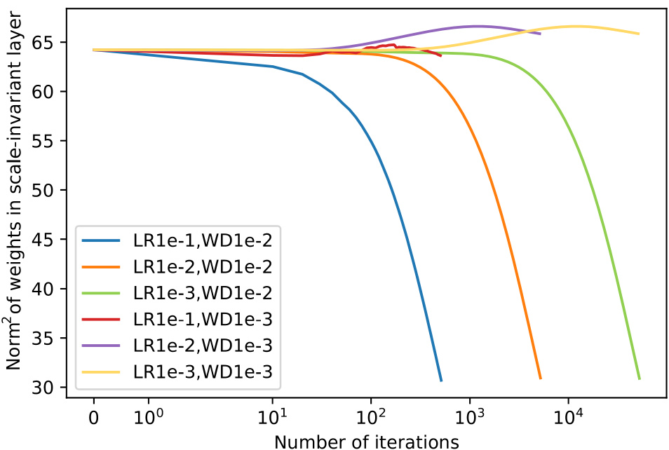  
Figure 7: Dynamics of squared weight norm of scale-invariant layer. LR and WD mean learning rate and weight decay, respectively. See Section 6 for experimental settings.  

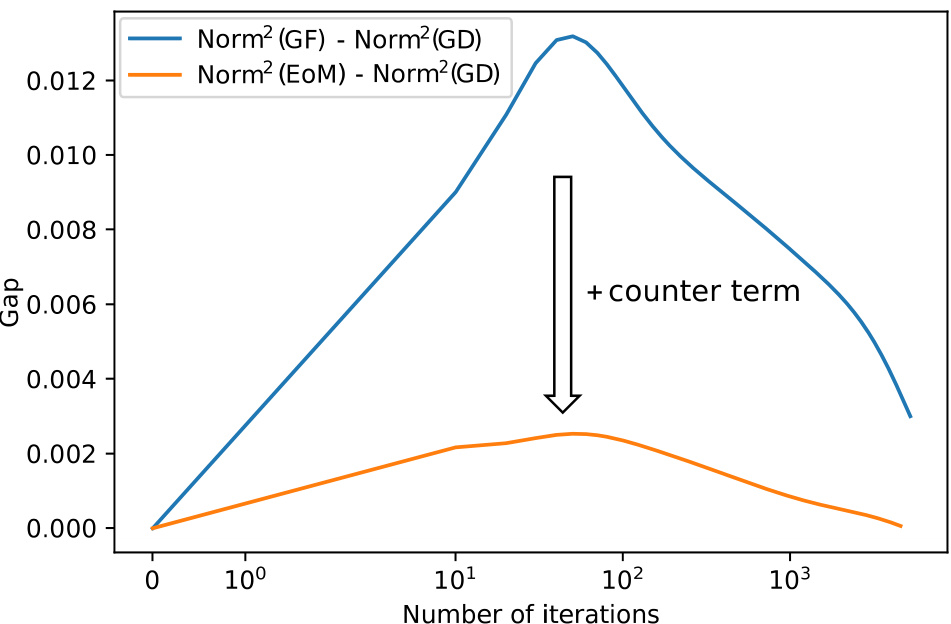  
Figure 8: Discrepancy between actual dynamics of GD and its theoretical prediction (GF and EoM) of squared weight norm of scale-invariant layer. We see that our counter term reduces the gap between the actual dynamics of GD and its theoretical prediction. See Section 6 for experimental settings.  

# B.2Translation-invariant Layers  

We also provide an empirical result for translation-invariant layers. For translation transformation, $G(\theta,\alpha)\,{\overset{\bullet}{=}}\,\alpha\mathbb{1}_{A}$ and thus the left hand side of Equation (193) becomes $\mathbb{1}_{\mathcal{A}}\cdot\pmb{\theta}_{\mathcal{A}}$ (sum of weights). Therefore, Equation (193) describes the temporal evolution of the sum of weights of translationinvariant layers. Figure 9 shows the t l evolution of $\mathbb{1}_{\mathcal{A}}\cdot\pmb{\theta}_{\mathcal{A}}$ for the network described in Section 6. Figure 10 shows the gap of EoM) (Equation 193). We see that the counter term reduces the gap. $\mathbb{1}_{A}\cdot\pmb{\theta}_{A}$ A ·A between GD and its theoretical predictions (GF and  

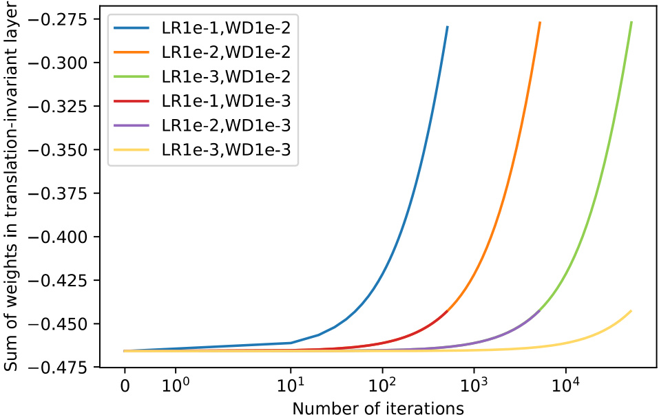  
Figure 9: Sum of weights of translation-invariant layer. LR and WD mean learning rate and weight decay, respectively. See Section 6 for experimental settings.  

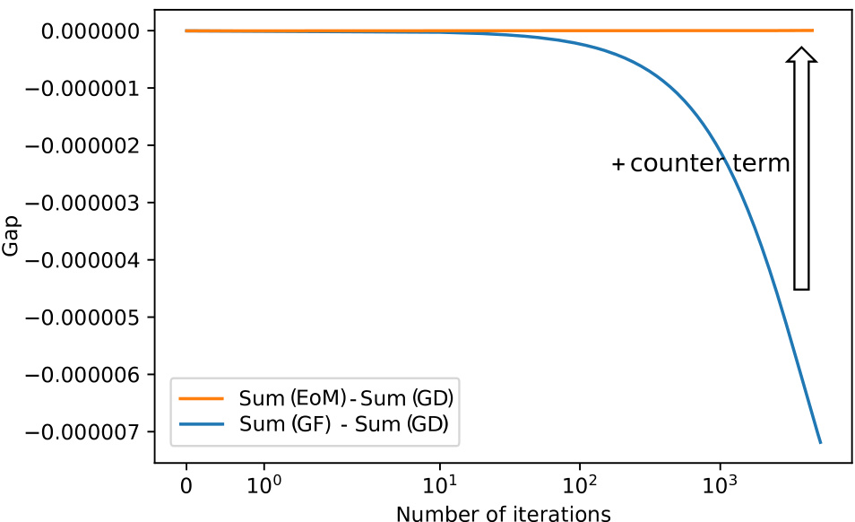  
Figure 10: Discrepancy between actual dynamics of GD and its theoretical prediction (GF and EoM) of sum of weights of translation-invariant layer. We see that our counter term reduces the gap. See Section 6 for experimental settings.  

# CEquation of Motion for $\hat{\pmb\theta}_{\mathcal{A}}$  

For com EoM for $r_{A}$ A eness, we construct the EoM for .$\hat{\pmb\theta}_{\pmb A}$ for scale-invariant layers $\boldsymbol{\mathcal{A}}$ . See Section 5.1 for the  

Theorem C.1 (EoM for $\hat{\pmb\theta}_{\pmb A}$ ).EoM (1) gives $\begin{array}{r}{\dot{\hat{\boldsymbol\theta}}_{A}(t)\;=\;-\frac{1}{r_{A}^{2}(t)}\nabla_{A}f(\hat{\boldsymbol\theta}_{A}(t))\,+\,\frac{\eta}{r_{A}(t)}((\hat{\boldsymbol\theta}_{A}(t)~.}\end{array}$ $\pmb{\xi}(\pmb{\theta}(t))\,\hat{\pmb{\theta}}_{A}(t)-\pmb{\xi}(\pmb{\theta}(t)))$ . Specifically, this is equivalent to: A A  

$$
\dot{\hat{\theta}}_{A}(t)=-\frac{1}{r_{A}^{2}(t)}\nabla_{A}f(\hat{\pmb{\theta}}_{A}(t))
$$  

for $\pmb{\xi}=\mathbf{0}\,(G F)$ and  

$$
\dot{\theta}_{A}=-\frac{1}{r_{A}^{2}}\left(I+\frac{\eta}{2}H_{A}(\theta)+\frac{\eta}{2}I((\nabla_{A^{c}}f(\theta)+\lambda\theta_{A^{c}})\cdot\nabla_{A^{c}})+\frac{\eta}{2}\hat{\theta}_{A}\nabla_{A}^{\top}f(\theta)\right)\nabla_{A}f(\hat{\theta}_{A}+\theta_{A^{c}})
$$  

The proof is given in Appendix A.9.  

Effective learning rate. This result highlights the differences between GD and GF on scaleinvariant layers. The factor $\frac{1}{r_{\mathcal{A}}^{2}}$ (Equation (194)), which is $\frac{\eta}{r_{\mathcal{A}}^{2}}$ at discretization, is called the effective ning rate [29 ,42 ,30 ,43 ,A 44 ,33 ,45 ,34 ,,47 ]. The dynamics of A $\hat{\theta}_{\mathcal{A}}$ is induced by $\nabla_{\mathcal{A}}f(\hat{\pmb{\theta}}_{\mathcal{A}}+$ $\theta_{\mathcal{A}^{\mathtt{c}},}$ A )with the effective learning rate $\frac{\eta}{r_{\mathcal{A}}^{2}}$ , not η. We find that the counter term corrects the effective learning rate to a matrix operator form (Equation (195)). Let us see the meaning of each correction in order. First, $I$ (identity matrix) corresponds to the original effective learning rate. Second, $\textstyle{\frac{\eta}{2}}H_{A}$ A Therefore, GD tends to go through flatter regions than GF. Third, directs the gradient $\nabla_{A}f(\hat{\pmb{\theta}}_{A}+\pmb{\theta}_{A^{\mathrm{c}}})$ toward the maximum eigenvector of $\begin{array}{r}{\frac{\eta}{2}I((\nabla_{A^{\mathrm{c}}}f(\pmb{\theta})+\lambda\pmb{\theta}_{A^{\mathrm{c}}})\cdot\nabla_{\mathcal{A}^{\mathrm{c}}})}\end{array}$ $H_{A}$ , i.e., a flat direction. involves unlike in GF. This point is often missing in the literature on scale-invariant networks because it $\nabla_{\mathcal{A}^{\mathtt{c}}}f$ into the learning dynamics of $\boldsymbol{\mathcal{A}}$ ; therefore, $\boldsymbol{\mathcal{A}}$ is explicitly affected by A $\mathcal{A}^{\mathtt{c}}$ in GD, is often assumed that the whole network is scale-invariant. Fourth, component of the right hand side of Equation (195), which may not seem obvious but can be seen $\underline{{\eta}}\hat{\pmb{\theta}}_{\cal A}\nabla_{\!\mathcal{A}}^{\top}f(\pmb{\theta})$ A ∇A cancels the $\hat{\theta}_{A}$ from the proof of Theorem C.1 (see Appendix A.9), and thus, $\dot{\hat{\theta}}_{\mathcal{A}}$ is orthogonal to $\hat{\theta}_{\mathcal{A}}$ , which should be satisfied anyway because $||\hat{\pmb{\theta}}_{A}||^{2}\equiv1\Longrightarrow2\dot{\hat{\pmb{\theta}}}_{A}\cdot\hat{\pmb{\theta}}_{A}=0$ .  

# DEquation of Motion for $\theta_{\mathcal{A}\parallel}$  

For completeness, we provide the EoM for $\theta_{\mathcal{A}\parallel}$ . The proof is given in Appendix A.12. Theorem D.1 (EoM for $\theta_{\mathcal{A}\parallel}$ ).EoM $(I)$ gives  

$$
\begin{array}{r}{\dot{\pmb\theta}_{A\parallel}(t)=-\lambda\pmb\theta_{A\parallel}(t)-\nabla f(\pmb\theta_{A\parallel}(t))-\eta(I-P)\pmb\xi(\pmb\theta(t))\,.}\end{array}
$$  

Specifically, this is equivalent to:  

$$
\begin{array}{r}{\dot{\pmb{\theta}}_{A\parallel}(t)=-\lambda\pmb{\theta}_{A\parallel}(t)-\nabla f(\pmb{\theta}_{A\parallel}(t)+\pmb{\theta}_{A^{\mathrm{c}}})}\end{array}
$$  

for $\pmb{\xi}=\mathbf{0}\,(G F)$ and  

$$
\begin{array}{l}{{\displaystyle\dot{\theta}_{A||}(t)=-\lambda(I+\frac{\eta\lambda}{2}I+\frac{\eta}{2}H_{A}(\theta_{A||}+\theta_{A^{c}}))\theta_{A||}}\ ~}\\ {{\displaystyle-\left(I+\frac{\eta\lambda}{2}I+\frac{\eta}{2}H_{A}(\theta_{A||}+\theta_{A^{c}})+\frac{\eta}{2}I((\nabla_{A^{c}}f(\theta_{A||}+\theta_{A^{c}})+\lambda\theta_{A^{c}})\cdot\nabla_{A^{c}})\right)\nabla_{A}f(\theta_{A||}+\theta_{A^{c}})~,}}\end{array}
$$  

$$
f\!o r\,\xi=\tilde{\xi}_{0}\;(E o M).
$$  

This result highlights the differences between the dynamics of GD and GF. The two factors $\scriptstyle{\frac{\eta\lambda}{2}}I$ in Equation (198) mean that the existence of weight decay increases the learning rate (increases the velocity $\dot{\theta}_{\mathcal{A}\parallel}$ ). The factor ${\textstyle{\frac{\eta}{2}}}H$ means that, as mentioned in Appendix C, GD tends to go along sharper paths than GF. Note that velocity $\dot{\theta}_{\mathcal{A}\parallel}$ is orthogonal to $\theta_{\mathcal{A}\perp}$ because $\nabla f,\theta_{\mathcal{A}\parallel}$ , and $H(\nabla f+\lambda\pmb{\theta}_{A\parallel})$ are orthogonal to $\theta_{\mathrm{\mathcal{A}\perp}}$ .$H(\nabla f+\lambda\pmb{\theta}_{A\parallel})\perp\pmb{\theta}_{A\perp}$ follows because $H v\perp\theta_{\mathcal{A}\perp}$ for arbitrary non-zero vector involves of that of given in Figure 5. $\pmb{v}\in\mathbb{R}^{d}\,(\cdot\,\cdot\,H\mathbb{1}_{\mathcal{A}}=H\pmb{\theta}_{\mathcal{A}\perp}=0)$ ∇$\nabla_{\mathcal{A}^{\mathtt{c}}}f$ $\theta_{\mathcal{A}\perp}$ A⊥ into the learning dynamics of , and thus, they are completely separable. A summary of Theorems 5.2 and D.1 is ) (see A emma A.7). . We see that the dynamics of $\begin{array}{r}{\frac{\eta}{2}I((\nabla_{\mathcal{A}^{\ c}}f(\theta_{\mathcal{A}\|}+\theta_{\mathcal{A}^{\ c}})+\lambda\theta_{\mathcal{A}^{c}})\cdot\nabla_{\mathcal{A}^{c}})}\end{array}$ ∇A A∥ $\theta_{\mathcal{A}\parallel}$ A is also independent A · ∇ A  

# EDetails of Experiment  

We provide detailed experimental settings (see also Section 6). Our computational infrastructure is a DGX-1 server. The fundamental libraries used in the experiment are TensorFlow 2.3 [ 59 ], Numpy 1.18 [ 60 ], and Python 3.6.8 [ 61 ]. The random seeds used for TensorFlow and Numpy are both 7. The input image is first divided by 127.5 and subtracted by 1. The maximum total number of iterations is 5 million steps for GF and EoM. The total runtime is approximately a month. We use least square fitting (np.polyfit ) to calculate the decay rates in Table 1. More information and detailed experimental results can be found in our code.  

In Figures 2 and 12, the theoretical prediction of discretization error is defined as $\left|\left|\mathbf{e}_{k}\right|\right|\ =$ $\begin{array}{r}{\frac{\eta^{2}}{2}||\sum_{s=0}^{k-1}(H(\theta(s\eta))+\lambda I)\mathbf{g}(\theta(s\eta))||}\end{array}$ (Equation (12)). To reduce computational costs, we approximate the r.h.s.: $\begin{array}{r}{(H(\theta(t))+\lambda I)\mathbf{g}(\theta(t))\,\sim\,\frac{\mathbf{g}(\theta(t)+\epsilon\mathbf{g}(\theta(t)))-\mathbf{g}(\theta(t)-\epsilon\mathbf{g}(\theta(t)))}{2\epsilon}}\end{array}$ , where $\epsilon$ is set to $10^{-7}$ . The green curve in Figure 2 is defined as $\begin{array}{r}{e_{k}=\tilde{e}_{100}+\frac{\eta^{2}}{2}\sum_{s=100}^{k-1}(H(\theta(s\eta))+\lambda I)\mathbf{g}(\theta(s\eta))}\end{array}$ P(compare this with Equation (12)), where $\tilde{e}_{100}$ is the actual discretization error at the 100th step that is obtained from GD. Therefore, the green curve represents the theoretical prediction of discretization error after the 100th step, given $\tilde{e}_{100}$ .  

# FSupplementary Experiment  

# F.1 Relative Discretization Error  

11. We can see that a large learning rate ( We provide the relative discretization err $(\eta=10^{-1})$ s defined as ) leads to a large discretization error (Figure 11 $||e_{k}||/||\pmb{\theta}_{k}||$ $k\in\mathbb{Z}_{\geq0})$ . See Figure (a) and (c)). We also see that the counter term reduces the discretization error as expected (Figure 11 (b) and (d)).  

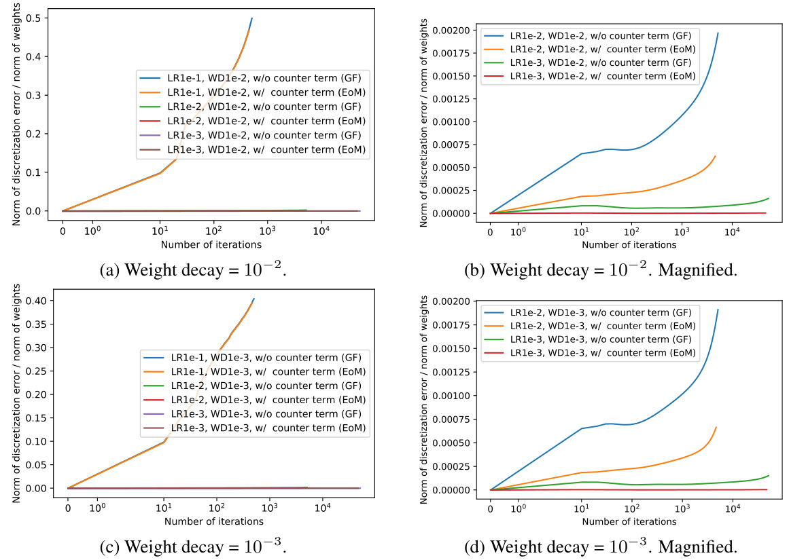  
Figure 11: Relative discretization error. In (a) and (c), the LR1e-1 curves overlap each other, and the LR1e-2 and LR1e-3 curves collapse in the lower region of the figure. The LR1e-2 and LR1e-3 are magnified and shown in (c) and (d). See Section 6 and Appendix E for experimental settings.  

# F.2 Theoretical Prediction Vs. Experimental Result of Discretization Error  

We compare the theoretical prediction of discretization error between GF and GD (Equation (12)) with the actual discretization error obtained in the experiment. The green curve is defined as $\begin{array}{r}{e_{k}\,=\,\tilde{e}_{100}+\frac{\eta^{2}}{2}\sum_{s=100}^{k-1}(H(\theta(s\eta))+\lambda I)\mathbf{g}(\theta(s\eta))+\bar{O}(\eta^{3})}\end{array}$ P(compare this with Equation (12)), where $\tilde{e}_{100}$ is the actual discretization error at the 100th step. Therefore, the green curve represents the theoretical prediction of discretization error after the 100th step given $\tilde{e}_{100}$ .  

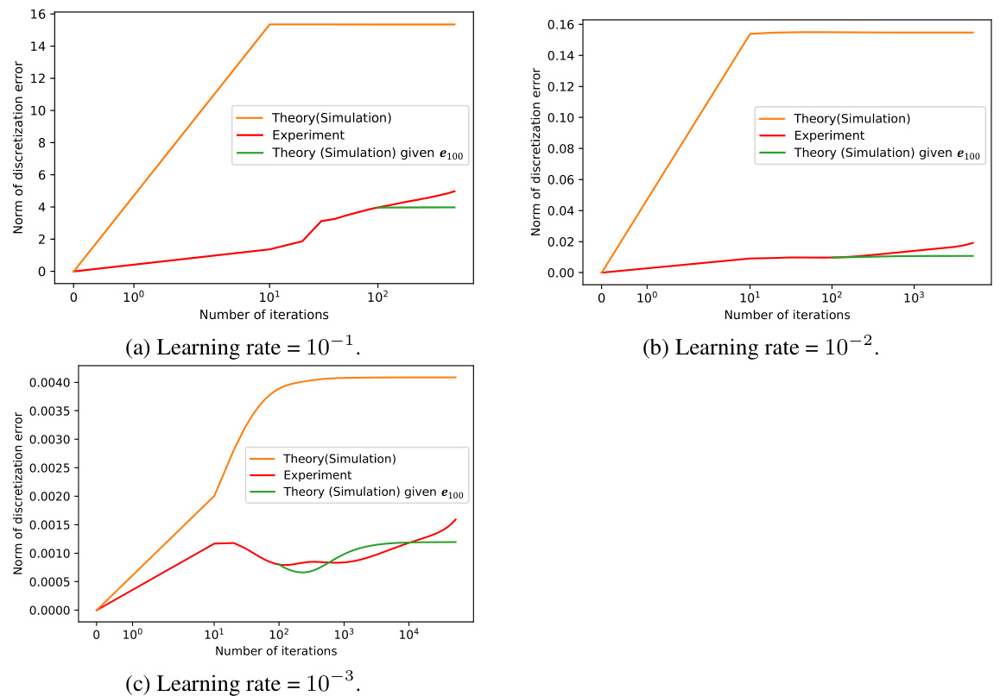  
Figure 12: Theoretical prediction (Equation (12)) vs. experimental result of discretization error between GF and GD. The weight decay is $10^{-2}$ . See Section 6 and Appendix E for experimental settings.  

# GSupplementary Discussion  

Supplementary related work (Section 2). To show the benefits of EoM, we focus on scaleinvariant layers [ 29 ,42 ,30 ,43 ,44 ,33 ,45 ,34 ,46 ,47 ] and translation-invariant layers [ 31 ,32 ] in Section 5. To carry over the stability of a continuous optimization algorithm to a discretized system, the authors of [ 19 ] add a feedback term to the optimization, and after that, they apply a discretization method to it. The authors’ primary motivation is to keep the orthogonality of the weight parameters of DNNs, which is different from ours.  

Convergence of $\xi$ (Section 3.3). Note that the expansion of $\xi$ in terms of $\eta$ is not necessarily convergent, as is also pointed out in [ 35 ]. Thus, we have to truncate the expansion at a suitable order. The discretization error at the truncation is given in Theorem 4.1.  

Beyond leading order of discretization error (Theorem 3.2 and Section 4.1). In this work, we analyze the leading order of discretization error. However, higher-order terms cannot always be negligible. We discuss in Section 4.1 that the higher-order terms are important at the beginning of training.  

Existence of ers, the network contains both invariant $\mathcal{A}^{\mathtt{c}}$ (Section 5). In our theoretical analysis of scale- and translation-invariant lay$(\mathcal{A})$ and non-invariant layers $(\mathcal{A}^{\mathtt{c}})$ , while previous works assume the whole network is invariant for simplicity [ 29 ,42 ,30 ,43 ,44 ,33 ,45 ,34 ,46 ,47 ]. We avoid this assumption and show that such mixed networks require appropriate modifications to analyses of invariant networks. For example, $\begin{array}{r}{\nabla f(\pmb{\theta})=\frac{1}{||\pmb{\theta}||}\nabla f(\hat{\pmb{\theta}})}\end{array}$ for invariant networks, while $\begin{array}{r}{\nabla_{A}f(\pmb{\theta})=\frac{1}{||\pmb{\theta}_{A}||}\nabla_{A}f(\hat{\pmb{\theta}}_{A}+\pmb{\theta}_{A^{\mathrm{c}}})}\end{array}$ for mixed networks (Lemma A.5), not $\textstyle{\frac{1}{||\pmb{\theta}_{A}||}}\nabla_{A}f({\hat{\pmb{\theta}}}_{A})$ . Such a naive replacement is not allowed. || A ||  

Higher-order correctio s to decay rate of $r_{A}$ (Section 5.1). We can compute more corrections to the decay rate of algebra gives decay rate $r_{A}$ ($\eta\lambda(1+\frac{\eta\lambda}{2}+\frac{\eta^{2}\lambda^{2}}{3})$ A is a scale-invariant layer), using more counter terms. For example, a long for $\pmb{\xi}=\tilde{\xi}_{0}+\eta\tilde{\xi}_{1}$ . The proof is similar to Appendix A.7.  

On equilibrium assumptions in Corollaries 5.1 and 5.2 (Section 5.1). We make assumptions in Corollaries 5.1 and 5.2; there exist two constants $r_{\mathcal{A}\ast}\geq0$ and $c_{*}\geq0$ such that $r_{A}(t)\xrightarrow{t\rightarrow\infty}r_{A*}$ −−−→ A∗ and $||\nabla_{A}f(\widehat{\pmb{\theta}}_{A}(t)+\pmb{\theta}_{A^{\mathrm{c}}}(t))||\xrightarrow{t\rightarrow\infty}c_{*}$ [29 ,34 ]. However, whether the assumptions are valid in the actual learning dynamics of DNNs is of −−−→ ∗. These assumptions are similar to those given in previous studies independent interest. In fact, the equilibrium assumption con and analyses on this point are needed. Under what conditions are the equilibrium assumptions valid? Can $\Delta_{*}$ ∗t) could not be satisfied even at one million steps of GD, and potentially because of it, have a large discrepancy between the empirical results and theoretical predictions. Deeper $(r_{A*}(t)$ and $\begin{array}{r}{\lvert|\nabla_{A}f(\hat{\pmb{\theta}}_{A}(t)\!+\!\pmb{\theta}_{A^{\mathrm{c}}}(t))\rvert|\xrightarrow{t\rightarrow\infty}\!\rangle}\end{array}$ −$r_{\mathcal{A}\ast}$ A∗ we relax the equilibrium assumptions and obtain realistic limiting dynamics of scale-invariant layers? This is exciting future work.  

In contrast to our empirical result mentioned above, in [ 34 ], their experiments dramatically match their theoretical prediction. This is potentially because of differences in experimental settings; in [34 ], SGD is used (ours is GD) and variance is induced, ResNet-50 [ 62 ,63 ] is used (ours is a fully-connected network with three layers), ImageNet [64, 65] and MSCOCO [66] are used (ours is MNIST [ 50 ]), and large learning rates $(\sim10^{-1})$ ) and small weight decays $(\sim10^{-4})$ ) are used (ours are given in Appendix E).  

Extension of EoM to general settings (Section 7). While we focus on GD and GF for simplicity, our counter-term-based approach and discretization error analysis can be extended to more general settings, such as SGD, acceleration methods (e.g., momentum SGD), and adaptive optimizers (e.g., Adam [ 53 ]). First, to extend our analysis to SGD, discretization error analysis of the Euler-Maruyama method, e.g., [ 67 ], can be used. SDE’s error analysis [ 23 ,24 ] is also relevant. Second, we can extend our counter-term-based approach and discretization error analysis to acceleration methods by modifying the analysis for different differential equations from GF and different discretization schemes from the Euler method, as is discussed in [ 7 ,14 ,12 ]. Third, [ 56 ] is the first work that provides a continuous approximation of Adam. However, its counter term and discretization error are open questions.  