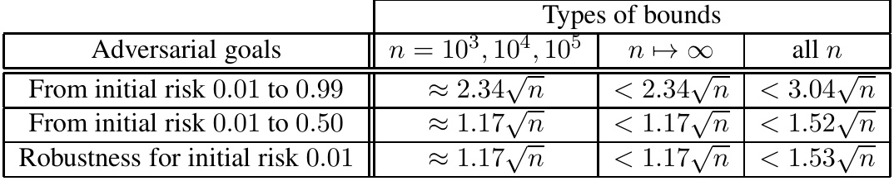
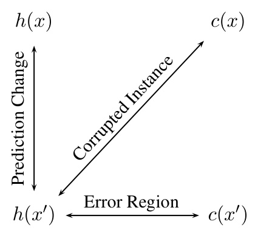
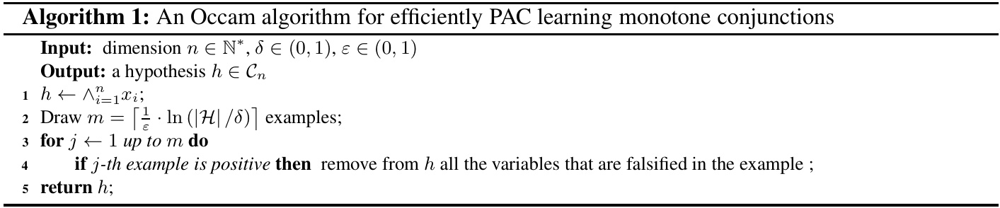
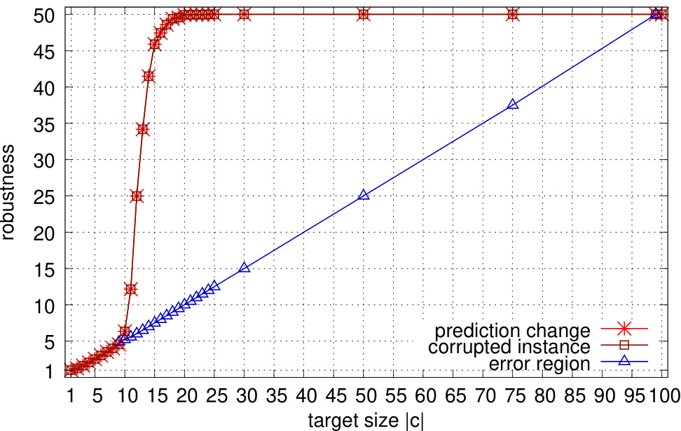
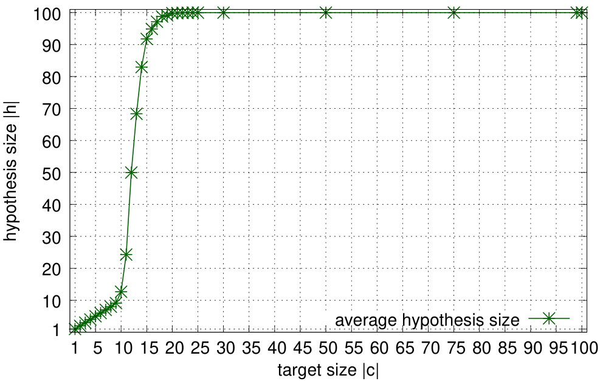
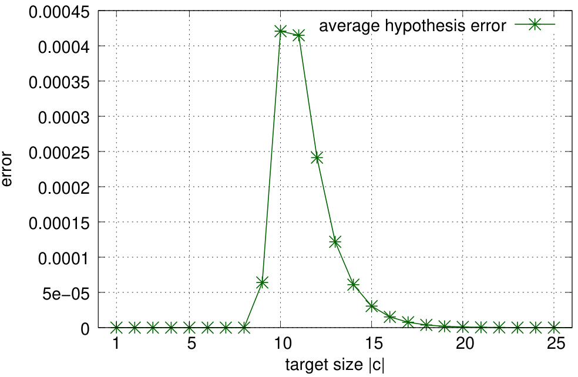
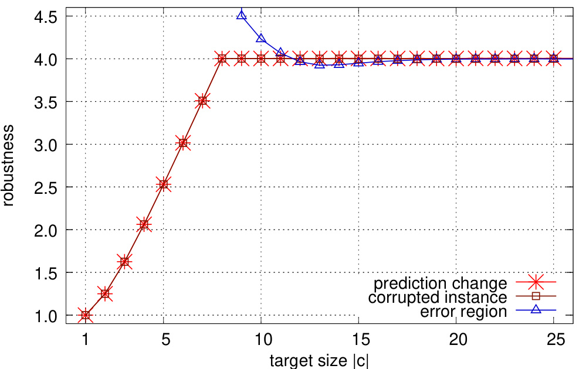

# Adversarial Risk and Robustness: General Definitions and Implications for the Uniform Distribution \*  

Dimitrios I. Diochnos †Saeed Mahloujifar †Mohammad Mahmoody ‡University of Virginia University of Virginia University of Virginia diochnos@virginia.edu saeed@virginia.edu mohammad@virginia.edu  

# Abstract  

study both “inherent” bounds that apply to any problem and any classifier for such a problem as well as We study adversarial perturbations when the instances are uniformly distributed over $\{0,1\}^{n}$ . We bounds that apply to specific problems and specific hypothesis classes.  

As the current literature contains multiple definitions of adversarial risk and robustness, we start by giving a taxonomy for these definitions based on their direct goals; we identify one of them as the one guaranteeing misclassification by pushing the instances to the error region . We then study some classic algorithms for learning monotone conjunctions and compare their adversarial risk and robustness under different definitions by attacking the hypotheses using instances drawn from the uniform distribution. We observe that sometimes these definitions lead to significantly different bounds. Thus, this study advocates for the use of the error-region definition, even though other definitions, in other contexts with context-dependent assumptions, may coincide with the error-region definition.  

Using the error-region definition of adversarial perturbations, we then study inherent bounds on risk and robustness of any classifier for any classification problem whose instances are uniformly distributed error over 0 $\{0,1\}^{n}$ .01 , there always exists an adversarial perturbation that changes . Using the isoperimetric inequality for the Boolean hype $O({\sqrt{n}})$ we show that for initial bits of the instances to increase the risk to 0 .5 , making classifier’s decisions meaningless. Furthermore, by also using the central $c<1.17$ , suffice for increasing the risk to rem we show that when $n\to\infty$ , at most 0 .5 , and the same $c\cdot{\sqrt{n}}$ bits $c\cdot{\sqrt{n}}$ ·bits of perturbations rbations, for a universal constant on average suffice to increase the risk to 1 , hence bounding the robustness by $c\cdot{\sqrt{n}}$ .  

# Contents  

Introduction 2   
1.1 Our Contribution and Results . . . . . . . . . . . . . . . . . . . . . . . . . . . . . . . . . . 4  

# 2 General Definitions of Adversarial Risk and Robustness  

2.1 Different Definitions and Qualitative Comparisons . . . . . . . . . . . . . . . . . . . . . . 5   
2.2 Various Aspects of the Attack Models . . . . . . . . . . . . . . . . . . . . . . . . . . . . . 7  

3 A Comparative Study through Monotone Conjunctions 8  

3.1 Error Region Risk and Robustness . . . . . . . . . . . . . . . . . . . . . . . . . . . . . . . 9   
3.2 Prediction Change Risk and Robustness . . . . . . . . . . . . . . . . . . . . . . . . . . . . 12   
3.3 Corrupted Instance Risk and Robustness . . . . . . . . . . . . . . . . . . . . . . . . . . . . 13   
3.4 Experiments for the Expected Values of Adversarial Robustness . . . . . . . . . . . . . . . 14   
3.4.1 The Algorithm F IND -S . . . . . . . . . . . . . . . . . . . . . . . . . . . . . . . . . 15   
3.4.2 The S WAPPING A LGORITHM . . . . . . . . . . . . . . . . . . . . . . . . . . . . . 15  

# 4 Inherent Bounds on Risk and Robustness for the Uniform Distribution 20  

4.1 Proving Theorems 4.7 and 4.10 . . . . . . . . . . . . . . . . . . . . . . . . . . . . . . . . . 24  

5 Conclusions 26  

A Some Useful Facts  

# 1 Introduction  

In recent years, modern machine learning tools (e.g., neural networks) have pushed to new heights the classification results on traditional datasets that are used as testbeds for various machine learning methods. As a result, the properties of these methods have been put into further scrutiny. In particular, studying the robustness of the trained models in various adversarial contexts has gained special attention, leading to the active area of adversarial machine learning.  

Within adversarial machine learning, one particular direction of research that has gained attention in recent years deals with the study of the so-called adversarial perturbations of the test instances. This line of work was particularly popularized, in part, by the work of Szegedy et al. $[S Z S^{+}14]$ within the context of deep learning classifiers, but the same problem can be asked for general classifiers as well. Briefly, when one is given a particular instance $x$ for classification, an adversarial perturbation $x^{\prime}$ for that instance is a new instance with minimal changes in the features of $x$ so that the resulting perturbed instance $x^{\prime}$ is misclassified by the classifier $h$ . The perturbed instance $x^{\prime}$ is commonly referred to as an adversarial example (for the classifier $h$ ). Adversarial machine learning has its roots at least as back as in [ LM05 ,$\mathrm{NRH}^{+}10]$ . However, the work of $[\mathrm{SZS^{+}14}]$ revealed pairs of images that differed slightly so that a human eye could not identify any real differences between the two, and yet, contrary to what one would naturally expect, machine learning classifiers would predict different labels for the classifications of such pairs of instances. It is perhaps this striking resemblance to the human eye of the pairs of images that were provided in $[\mathrm{SZS^{+}14}]$ that really gave this new push for intense investigations within the context of adversarial perturbations. Thus, a very intense line of work started, aiming to understand and explain the properties of machine learning classifiers on such adversarial perturbations; e.g., [ GSS15 ,MFF16 ,BIL $,^{+}16$ ,CW17b ,$\mathbf{M}\mathbf{M}\mathbf{S}^{+}18]$ ]. These attacks are also referred to as evasion attacks $[\mathrm{NRH}^{+}12$ ,BFR14 ,GSS15 ,CW17b ,XEQ18 ]. There is also work that aims at making the classifiers more robust under such attacks $[\mathrm{PMW^{+}}16$ ,XEQ18 ], yet newer attacks of Carlini and Wagner [ CW17a ] broke many proposed defenses.  

Our general goal. In this work, we study barriers against robust classification of adversarial examples. We are particularly interested in foundational bounds that potentially apply to broad class of problems and distributions. One can study this question from the perspectives of both risk and robustness. In the case of risk, the adversary’s goal is to increase the error probability of the classifier (e.g., to reach risk 0 .5 ) by small perturbations of the instances, and in the case of robustness, we are interested in the average amount of perturbations needed for making the classifier always fail.  

Studying the uniform distribution. We particularly study adversarial risk and robustness for learning problems where the input distribution is $U_{n}$ which is uniform over the hypercube $\{0,1\}^{n}$ . We measure the cost of perturbations using the natural metric of Hamming distance. Namely, the distance between the original and perturbed instances $x,x^{\prime}\in\{0,1\}^{n}$ is the number of locations that they are different. This class of distributions already include many learning problems of interest. So, by studying adversarial risk and robustness for such a natural distribution, we can immediately obtain results for a broad class of problems. We believe it is crucial to understand adversarial risk and robustness for natural distributions (e.g., $U_{n}$ uniform over the hypercube) and metrics (e.g., the Hamming distance) to develop a theory of adversarial risk and robustness that can ultimately shed light on the power and limitations of robust classification for practical data sets. Furthermore, natural distributions like $U_{n}$ model a broad class of learning problems directly; e.g., see $[\mathbf{B}\mathbf{F}\mathbf{J}^{+}94$ ,SM00 ,JS06 ,Sel09 ]. The hope is that understanding the limitations of robust learning for these basic natural distributions will ultimately shed light on challenges related to addressing broader problems of interest.  

Related previous work. The work of Gilmer et al. $[\mathrm{GMF^{+}18}]$ studied the above problem for the special case of input distributions that are uniform over unit spheres in dimension $n$ . They showed that for any classification problem with such input distribution, so long as there is an initial constant error probability $\mu$ , the robustness under the $\ell_{2}$ norm is at most $O({\sqrt{n}})$ . Fawzi et al. [ FFF18 ] studied the above question for Gaussian distributions in dimension $n$ and showed that when the input distribution has $\ell_{2}$ $\mathrm{norm}\approx1$ , then by $\approx\sqrt{n}$ perturbations in $\ell_{2}$ norm, w an make the classifier change its prediction (but doing this does not guarantee that the perturbed instance $x^{\prime}$ will be misclassified). Schmidt et al. $[\mathrm{SST^{+}18}]$ proved limits on robustness of classifying uniform instances by specific classifiers and using a definition based on “corrupted inputs” (see Section 2 ), while we are mainly interested in bounds that apply to any classifiers and guarantee misclassification of the adversarial inputs.  

Discussion. Our negative results of this work, like other (current proved) bounds in the literature for adversarial risk and robustness only apply to specific distributions that do not cover the case of distributions that generate images, voices, or other practically interesting data. We see these results, however, as first steps towards understanding the barriers against robustness. The negative results so far indicate similar phenomena (e.g., relation to isoperimetric inequalities). Thus, as pointed out in $[\mathrm{GMF^{+}18}]$ , these works motivate a deeper study of such inequalities for real data sets. Finally, as discussed in [ FFF18 ], such theoretical attacks could potentially imply direct attacks on real data, assuming the existence of smooth generative models for latent vectors with theoretically nice distributions (e.g., Gaussian or uniform over $\{0,1\}^{n})$ into natural data.  

# 1.1 Our Contribution and Results  

As mentioned above, our main goal is to understand inherent barriers against robust classification of adversarial examples, and our focus is on the uniform distribution $U_{n}$ of instances. In order to achieve that goal, we both do a definitions study and prove technical limitation results.  

General definitions and a taxonomy. As the current literature contains multiple definitions of adversarial risk and robustness, we start by giving a taxonomy for these definitions based on their direct goals. More specifically, suppose $x$ is an original instance that the adversary perturbs into a “close” instance $x^{\prime}$ . Suppose $h(x),h(x^{\prime})$ are the predictions of he hypothesis $h(\cdot)$ and $c(x),c(x^{\prime})$ are the true labels of $x,x^{\prime}$ defined by the concept function $c(\cdot)$ . To call $x^{\prime}$ a successful “adversarial example”, a natural definition would compare the predicted label $h(x^{\prime})$ with some other “anticipated answer”. However, what $h(x^{\prime})$ is exactly compared to is where various definitions of adversarial examples diverge. We observe in Section 2 that the three possible definitions (based on comparing $h(x^{\prime})$ with either of $h(x),\,c(x)$ or $c(\boldsymbol{x}^{\prime}))$ lead to three different ways of defining adversarial risk and robustness. We then identify one of them (that compares $h(x)$ with $c(\boldsymbol{x}^{\prime}))$ as the one guaranteeing misclassification by pushing the instances to the error region . We also discuss natural conditions under which these definitions coincide. However, these conditions do not hold in general .  

A comparative study through monotone conjunctions. We next ask: how close/far are these definitions in settings where, e.g., the instances are drawn from the uniform distribution? To answer this question, we make a comparative study of adversarial risk and robustness for a particular case of learning monotone conjunctions under the uniform distribution $U_{n}$ (over $\{0,1\}^{n})$ . A monotone conjunction $f$ is a function of the form $f=(x_{i_{1}}\land\cdots\land x_{i_{k}})$ . This class of functions is perhaps one of the most natural and basic learning problems that are studied in computational learning theory as it encapsulates, in the most basic form, the class of functions that determine which features should be included as relevant for a prediction mechanism. For example, Valiant in [ Val09 ] used this class of functions under $U_{n}$ to exemplify the framework of evolvability. We attack monotone conjunctions under $U_{n}$ in order to contrast different behavior of definitions of adversarial risk and robustness.  

In Section 3 , we show that previous definitions of robustness that are not based on the error region, lead to bounds that do not equate the bounds provided by the error-region approach. We do so by first deriving theorems that characterize the adversarial risk and robustness of a given hypothesis and a concept function under the uniform distribution. Subsequently, by performing experiments we show that, on average, hypotheses computed by two popular algorithms (F IND -S [ Mit97 ] and S WAPPING A LGORITHM [Val09 ]) also exhibit the behavior that is predicted by the theorems. Estimating the (expected value of) the adversarial risk and robustness of hypotheses produced by other classic algorithms under specific distributions, or for other concept classes, is an interesting future work.  

Inherent bounds for any classification task under the uniform distribution. Finally, after establishing further motivation to use the error-region definition as the default definition for studying adversarial examples in general settings, we turn into studying inherent obstacles against robust classification when the instances are drawn from the uniform distribution. We prove that for any learning problem $\mathsf{P}$ with input distribution $U_{n}$ (i.e., uniform over the hypercube) and for any classifier $h$ for $\mathsf{P}$ with a constant error $\mu$ , the robustness of $h$ to adversarial perturbations (in Hamming distance) is at most $O({\sqrt{n}})$ . We also show that by the same amount of $O({\sqrt{n}})$ perturbations in the worst case , one can increase the risk to 0 .99 . Table 1 lists some numerical examples.  

Table 1: Each row focuses on the number of tampered bits to achieve its stated goal. The second column shows results using direct calculations for specific dimensions. The third column shows that these results are indeed achieved in the limit, and the last column shows bounds proved for all $n$ .  

  

To prove results above, we apply the isoperimetric inequality of [ Nig67 ,Har66 ] to the error region of the classifier $h$ and the ground truth $c$ . In particular, it was shown in [ Har66 ,Nig67 ] that the subsets of the hypercube with minimum “expansion” (under Hamming distance) are Hamming balls. This fact enables us to prove our bounds on the risk. We then prove the bounds on robustness by proving a general connection between risk and robustness that might obe of independent interest. Using the central limit theorem, we sharpen our bounds for robustness and obtain bounds that closely match the bounds that we also obtain by direct calculations (based on the isoperimetric inequalities and picking Hamming balls as error region) for specific values of dimension $n=10^{3},10^{4},10^{5}$ .  

# 2 General Definitions of Adversarial Risk and Robustness  

Notation. We u graphic letters (e.g., $\chi$ ) for s and capital non-calligraphic letters (e.g., $D$ ) for distrib ons. By $x\leftarrow D$ ←we denote sampling $x$ from D. In a classifi ion problem $\mathsf{P}=(\mathcal{X},\mathcal{Y},\mathcal{D},\mathcal{C},\mathcal{H})$ ,the set a class of Xis the set of possible concept functions, and ins Hnces is a class of ,$\mathcal{V}$ is the set of possible hypotheses , where any labels ,D$f\in\mathcal{C}\cup\mathcal{H}$ is a set of distributions ove is a mapping from X$\mathcal{X},\mathcal{C}$ to $\boldsymbol{\mathscr{y}}$ is .An example is a labeled instance . We did not state the loss function explicitly, as we work with classification problems, however all main three definitions of this section directly extend to arbitrary loss functions. For $x\in\mathcal{X},c\in\mathcal{C},D\in\mathcal{D}$ , the risk or error of a hypothesis $h\in\mathcal H$ is the expected ( 0 -1 ) loss of $(h,c)$ with respect to D, namely ${\mathrm{Risk}}(h,c,D)={\mathrm{Pr}}_{x\leftarrow D}[h(x)\neq c(x)]$ . We are usually interested in learning problems with a fixed distribution makes our results stronger. As a result, whenever distribution $U_{n}$ over $\mathcal{D}=\{D\}$ $\{0,1\}^{n}$ . Note that since we deal with negative , as we are particularly interested in robustness of learning under the uniform $\mathcal{D}=\{D\}$ , we omit Dfrom the risk notation sults, fixing the distribution only d simply write $\mathsf{R i s k}(h,c)$ . We usually work with problems $\mathsf{P}=(\boldsymbol{\mathcal{X}},\boldsymbol{\mathcal{Y}},D,\boldsymbol{\mathcal{C}},\boldsymbol{\mathcal{H}},\mathbf{d})$ that include a metric dover the HD instances. For a set instance we denote Hamming distance for pairs of instance to refer to an adversarially perturbed instance ${\mathcal{S}}\subseteq{\mathcal{X}}$ we let ${\mathbf{d}(x,S)}=\operatorname*{inf}\{{\mathbf{d}(x,y)}\mid y\in S\}$ $x^{\prime}$ from of an originally sampled instance $\{0,1\}^{n}$ and . Finally, we use the term ${\mathcal{B}a l l}_{r}(x)=\{x^{\prime}\mid{\bf d}(x,x^{\prime})\leq r\}$ $x$ when the label adversarial . By of the adversarial example is either not known or not considered.  

# 2.1 Different Definitions and Qualitative Comparisons  

Below we present formal definitions of adversarial risk and robustness. In all of these definitions we will deal with attackers who perturb the initial test instance $x$ into a close adversarial instance $x^{\prime}$ . We will measure how much an adversary can increase the risk by perturbing a given input $x$ into a close adversarial example $x^{\prime}$ . These definitions differ in when to call $x^{\prime}$ a successful adversarial example. First we formalize the main definition that we use in this work based on adversary’s ability to push instances to the error region.  

Definition 2.1 (Error-region risk and bustness) .Let $\mathsf{P}=(\boldsymbol{\mathcal{X}},\boldsymbol{\mathcal{Y}},D,\boldsymbol{\mathcal{C}},\boldsymbol{\mathcal{H}},\mathbf{d})$ be a classification problem (with metric ddefined over instances X).  

•Risk. For any $r\in\mathbf{R}_{+},h\in\mathcal{H},c\in\mathcal{C}_{+}$ , the error-region risk under $r$ -perturbation is  

$$
\mathsf{R i s k}_{r}^{\mathrm{ER}}(h,c)=\operatorname*{Pr}_{x\gets D}\!\left[\exists x^{\prime}\in\mathcal{B}a l l_{r}(x),h(x^{\prime})\neq c(x^{\prime})\right].
$$  

For $r=0$ ,$\mathsf{R i s k}_{r}^{\mathrm{ER}}(h,c)=\mathsf{R i s k}(h,c)$ becomes the standard notion of risk.  

•Robustness. For any $h\in\mathcal{H},x\in\mathcal{X},c\in\mathcal{C}_{*}$ , the error-region robustness is the expected distance of a sampled instance to the error region, formally defined as follows  

$$
\mathsf{R o b}^{\mathrm{ER}}(h,c)=\underset{x\gets D}{\mathbf{E}}\left[\operatorname*{inf}\left\{r\colon\exists x^{\prime}\in B a l l_{r}(x),h(x^{\prime})\neq c(x^{\prime})\right\}\right]\;.
$$  

Definition 2.1 requires the adversarial instance $x^{\prime}$ to be misclassified , namely, $h(x^{\prime})\neq c(x^{\prime})$ . So, $x^{\prime}$ clearly belongs to the error region of the hypothesis $h$ compared to the ground truth $c$ . This definition is implicit in the work of $[\mathrm{GMF^{+}18}]$ . In what follows, we compare our main definition above with previously proposed definitions of adversarial risk and robustness found in the literature and discuss when they are (or when they are not) equivalent to Definition 2.1 . Figure 1 summarizes the differences between the three main definitions that have appeared in the literature, where we distinguish cases by comparing the classifier’s prediction $h(x^{\prime})$ at the new point $x^{\prime}$ with either of $h(x),\;c(x)$ , or $c(\boldsymbol{x}^{\prime})$ ,leading to three different definitions.  

  
Figure 1: The three main definitions based on what $h(x^{\prime})$ is compared with.  

Definitions based on hypothesis’s prediction change (PC risk and robustness). Many works, including the works of $[\mathrm{SZS^{+}14}$ ,FFF18 ] use a definition of robustness that compares classifier’s prediction $h(x^{\prime})$ with the prediction $h(x)$ othe original instance $x$ . Namely, they require $h(x^{\prime})\neq h(x)$ rather than $h(x^{\prime})\neq c(x^{\prime})$ in order to consider x$x^{\prime}$ an adversarial instance. Here we refer to this definition (that does not depend on the ground truth $c$ ) as prediction-change (PC) risk and robustness (denoted as $\mathsf{R i s k}_{r}^{\mathrm{PC}}(h)$ and $\mathsf{R o b}^{\mathrm{PC}}(h))$ .We note that this definition captures the error-region risk and robustness if we assume the initial correctness (i.e., $h(x)\,=\,c(x))$ of classifier’s prediction on all $x\,\leftarrow\,X$ and “truth proximity”, i.e., that $c(x)\,=\,c(x^{\prime})$ holds for all $x^{\prime}$ that are “close” to $x$ . Both of these assumptions are valid in some natural scenarios. For example, when input instances consist of images that look similar to humans (if used as the ground truth $c(\cdot))$ and if $h$ is also correct on the original (non-adversarial) test examples, then the two definitions (based on error region or prediction change) coincide. But, these assumptions do not hold in in general .  

We note that there is also a work in the direction of finding adversarial instances that may potentially fool humans that have limited time to decide for their label, as in $[\mathrm{ESC^{+}18}]$ . The images of $[\mathrm{ESC^{+}18}]$ are sufficiently ‘confusing’ that answers of the form “I do not know” are very plausible from the humans that are asked. This fuzzy classification that allows “I do not know” answers is reminiscent of the limited membership query model of Sloan and Turán [ ST94 ] (which is a worst-case version of the incomplete membership query model of Angluin and Slonim [ AS94 ]; see also [ AKST97 ] and [ SST10 ] for further related discussions) as well as of the model of learning from a consistently ignorant teacher of Frazier et al. [ FGMP96 ].  

Definitions based on the notion of corrupted instance (CI risk and robustness). The works of [ MRT15 ,FMS15 ,FMS18 ,AKM18 ] study the robustness of learning models in the presence of corrupted inputs . A more recent framework was developed in $[\mathrm{MMS^{+}}18\$ ,$S S\ensuremath{\Gamma}^{+}18\ensuremath{]}$ for modeling risk and robustness that is inspired by robust optimization [ BTGN09 ] (with an underlying metric space) and model adversaries that corrupt the the original instance in (exponentially more) ways. When studying adversarial perturbations using corrupted instances, we define adversarial risk by requiring the adversarial instance $x^{\prime}$ to satisfy $h(x^{\prime})\neq c(x)$ . The term “corrupted instance” is particularly helpful as it emphasizes on the fact that the goal (of the classifier) is to find the true label of the original (uncorrupted) instance $x$ , while we are only given a corrupted version $x^{\prime}$ . Hence, we refer to this definition as the corrupted instance (CI) risk and robustness and denote them by $\mathsf{R i s k}_{r}^{\mathrm{CI}}(h,c)$ and $\mathsf{R o b}^{\mathrm{CI}}(h,c)$ . The advantage of this definition compared to the prediction-change based definitions is that here, we no longer need to assume the initial correctness assumption. Namely, only if the “truth proximity” assumption holds, then we have $c(x)\,=\,c(x^{\prime})$ which together with the condition $h(x^{\prime})\neq c(x)$ we can conclude that $x^{\prime}$ is indeed misclassified. However, if small perturbations can change the ground truth, $c(\boldsymbol{x}^{\prime})$ can be different from $c(x)$ , in which case, it is no long clear whether $x^{\prime}$ is misclassified or not.  

Stronger definitions with more restrictions on adversarial instance. The corrupted-input definition requires an adversarial instance $x^{\prime}$ to satisfy $h(x^{\prime})\neq c(x)$ nd the error-region definition requires $h(x^{\prime})\neq$ $c(\boldsymbol{x}^{\prime})$ . What if we require both of these conditions to call $x^{\prime}$ a true adversarial instance? This is indeed the definition used in the work of Suggala et al. [ SPNR18 ], though more formally in their work, they subtract the original risk (without adversarial perturbation) from the adversarial risk. This definition is certainly a stronger guarantee for the adversarial instance. Therefore, we simply refer to risk and robustness under this condition as strong adversarial risk and robustness. As this definition is a hybrid of the error-region and corrupted-instance definitions, we do not make a direct study of this definition and only focus on the other three definitions described above.  

How about when the classifier $h$ is $100\%$ correct? We emphasize that when $h$ happens to be the same function as $c$ , (the error region) Definition 2.1 implies $h$ has zero adversarial risk and infinite adversarial robustness $\mathsf{R o b}^{\mathrm{ER}}(h,c)\,=\,\infty$ . This is expected, as there is no way an adversary can perturb any input $x$ into a misclassified $x^{\prime}$ . However, both of the definitions of risk and robustness based on prediction change $[\mathrm{SZS^{+}14}]$ and corrupted instance [ MRT15 ,$\mathbf{M}\mathbf{M}\mathbf{S}^{+}18]$ ] could compute large risk and small robustness for such $h$ . In fact, in a recent work $[\mathrm{TSE^{+}18}]$ it is shown that for definitions based on corrupted input, correctness might be provably at odds with robustness in some cases. Therefore, even though all these definitions could perhaps be used to approximate the risk and robustness when we do not have access to the ground truth $c^{\prime}$ on the new point $x^{\prime}$ , in this work we separate the definition of risk and robustness from how to compute/approximate them, so we will use Definition 2.1 by default.  

# 2.2 Various Aspects of the Attack Models  

We emphasize that the definitions of Section 2.1 are all information theoretic and do not address the effi- ciency of the adversary who perturbs the original instance $x$ into $x^{\prime}$ . Moreover, there are other aspects of the attack that are implicit in the definitions Section 2.1 in terms of what adversary does or does not have access to during the course of the attack. Below, we briefly point out these other aspects.  

•Efficiency. This aspect of an attack could come in two flavor. One way to mathematically formalize “efficient” attacks is to use polynomial-time attacks as it is done in cryptography. Another way is to use information theoretic attacks without the efficiency requirements. Security against information theoretic attacks are stronger, while attacks of polynomial-time form are stronger.  

•Information access. The other aspect of the attack is about what adversary has access to during the attack and how it can access this information. We separate thes aspects as follows.  

– What to access. In general, we can consider attacks that do or do not access to either of the ground truth $c$ , the hypothesis $h$ , or distribution $D$ .  

– How to access. If the attack can depend on a function $f$ (e.g., $f=h$ or $f=c)$ or a distribution $D$ it can still access this information in various forms. An information theoretic attack can completely depend on the full description of $f$ , while an efficient (polynomial time attack) can use oracle access to $f$ (regardless of efficiency of $f$ itself) or a sampler for $D$ . In fact, if $f$ (or a sampler for a distribution $D$ )has a compact representation, then an efficient attacker can also fully depend on $f$ or $D$ if that representation is given.  

Going back the definitions of Section 2 , by $\begin{array}{r}{\mathbf{\Sigma}^{\leftarrow}\exists x^{\prime}\in B a l l_{r}(x),P(x^{\prime})^{*}}\end{array}$ we simply state the existence of a close instance $x^{\prime}$ with a property $P(\ensuremath{\boldsymbol{x}}^{\prime})$ while it might be computationally infeasible to actually find such an $x^{\prime}$ . Moreover, the definitions of Section 2 assume the adversary has full access to $f,c,D$ .  

# 3 A Comparative Study through Monotone Conjunctions  

In this section, we compare the risk and robustness under the three definitions of Section 2 through a study of monotone conjunctions under the uniform distribution. Namely, we consider adversarial perturbations of truth assignments that are drawn from the uniform distribution $U_{n}$ over $\{0,1\}^{n}$ when the concept class contains monotone conjunctions. As we will see, these definitions diverge in this natural case. Below we fix the setup under which all the subsequent results are obtained.  

Problem Setup 1. Let ${\mathcal{C}}_{n}$ be the concept class of all monotone conjunctions formed by at least one and at most nBoolean variables. The target conc ound truth) cthat needs to be learned is drawn from $\mathcal{C}_{n}$ .processing the Let the hypothesis class be raining data. With $\mathcal{H}=\mathcal{C}_{n}$ $|h|$ and let and $|c|$ $h\in\mathcal H$ ∈H we denote the be the hypothesi size of hobtained by a learning algorithm after and crespectively; that is, number of variables that hand $c$ contain. Now let,  

$$
c=\bigwedge_{i=1}^{m}x_{i}\wedge\bigwedge_{k=1}^{u}y_{k}\qquad\qquad a n d\qquad\qquad h=\bigwedge_{i=1}^{m}x_{i}\wedge\bigwedge_{\ell=1}^{w}z_{\ell}\,.
$$  

We will call the variables that appear both in $h$ and cas mutual , the variables that appear in cbut not in has undiscovered , and the variables that appear in $h$ but not in cas wrong (or redundant ). Therefore in ( 1 )we have mmutual variables, $u$ undiscovered and $w$ wrong. We denote the error region of a hypothesis $h$ and the target concept cwith $\mathcal{E}\left(h,c\right)$ .  

and That is, $c$ , denoted by $\mathcal{E}\left(h,c\right)=\{x\in\{0,1\}^{n}\mid h(x)\neq c(x)\}$ $\mu$ , under the uniform distribution $U_{n}$ . The probability mass of the error region between over $\{0,1\}^{n}$ is then, $h$  

$$
\operatorname*{Pr}_{x\in-U_{n}}[x\in\mathcal{E}\left(h,c\right)]=\mu=(2^{w}+2^{u}-2)\cdot2^{-m-u-w}\,.
$$  

In this problem setup we are interested in computing the adversarial risk and robustness that attackers can achieve when instances are drawn from the uniform distribution $U_{n}$ over $\{0,1\}^{n}$ .  

Remark 3.1. Note that $\mu$ is a variable that depends on the particular $h$ and c.  

Remark 3.2. Connecting to our discussion from Section 2.2 , adversaries who have oracle access to such hypotheses can identify the variables that appear in them and so reconstruct them efficiently as follows. Since $x_{o n e}=\langle1,1,1,\ldots,1\rangle$ is always positive one can query all the nvectors that have all 1 ’s but one 0 ,and thus determine all the variables that appear in a particular hypothesis.  

Using the Problem Setup 1 , in what follows we compute the adversarial risk and robustness that an arbitrary hypothesis has against an arbitrary target using the error region (ER) definition that we advocate in contexts where the perturbed input is supposed to be misclassified and do the same calculations for adversarial risk and robustness that are based on the definitions of prediction change $(P C)$ and corrupted instance $(C I)$ . The adversarial robustness of a solution using the prediction change and corrupted instance definitions is proportional to the size (number of variables) of the learned solution; experimentally we obtain that it is proportional to about half the number of variables that the hypothesis contains. On the other hand, the adversarial robustness of a learned solution using the error region definition is proportional to the minimum between the size of the hypothesis and the size of the target; experimentally we obtain that it is proportional to about half that minimum value. In other words, for a hypothesis that has many variables and a target that has fairly few variables, the prediction change and corrupted instance definitions imply large robustness for the learned solution, whereas the adversarial robustness as implied by the error region definition is low. This last setup is precisely the case for a large set of target functions when PAC learning monotone conjunctions with the F IND -S algorithm; see Section 3.4  

# 3.1 Error Region Risk and Robustness  

Theorem 3.3 (Error region risk - lower bound) .Consider the Problem Setup 1 . Then, if $h\,=\,c,$ , we have $\mathrm{Risk}_{r}^{\mathrm{ER}}(h,c)=0,$ , while if $h\neq c,$ , then, with a perturbation budget of $r$ we can obtain the following lower bounds.  

• If $0\leq r\leq\lfloor m/2\rfloor$ , then $\begin{array}{r}{\mathsf{R i s k}_{r}^{\mathrm{ER}}(h,c)\geq\mu\cdot\sum_{j=0}^{r}\binom{m}{j}}\end{array}$ , where $\mu$ is given by ( 2 ).   
• If $\begin{array}{r}{I f\left\lfloor\frac{m}{2}\right\rfloor+1\leq r=\left\lfloor\frac{m}{2}\right\rfloor+\gamma\leq\left\lfloor\frac{m}{2}\right\rfloor+\left\lfloor\frac{\operatorname*{min}\left\{u,w\right\}}{2}\right\rfloor}\end{array}$ , then ${\mathsf{R i s k}}_{r}^{\mathrm{ER}}(h,c)\geq{\frac{1}{4}}\cdot2^{-\operatorname*{min}\{u,w\}}\cdot\sum_{\zeta=1}^{\gamma}{\binom{\operatorname*{min}\{u,w\}}{\zeta}}.$   
•$\begin{array}{r}{I f\left\lfloor\frac{m}{2}\right\rfloor+\lfloor\frac{\operatorname*{min}\{u,w\}}{2}\rfloor+1\leq r\leq\operatorname*{min}\{\left|h\right|,|c|\},}\end{array}$ , then $\begin{array}{r}{\mathrm{Risk}_{r}^{\mathrm{ER}}(h,c)\geq\frac{1}{8}.}\end{array}$ .  
•$I f1+\operatorname*{min}\{|h|\,,|c|\}\leq r_{\cdot}$ , then $\mathrm{Risk}_{r}^{\mathrm{ER}}(h,c)=1.$ .  

Proof Sketch. Assume that $h\neq c$ , since otherwise the risk is 0 .  

We distinguish cases for the various values that $m,u,w$ can take in ( 1 ): (i) $m=0$ , (ii) $m\geq1$ and $u=0$ and $w\ge1$ , (iii) $m\geq1$ and $u\geq1$ and $w\,=\,0$ , and finally, (iv) the more general case, where $m\geq1$ ,$\pmb{u}\geq\pmb{1}$ and $w\geq1$ .Below we will prove fully the more involved case, case (iv) ; the other cases can easily be obtained using (iv) as a guide. Furthermore, we distinguish between two main cases: having a budget $r\leq\mathrm{min}\{|h|\,,|c|\}$ versus having a budget of $r>\operatorname*{min}\{|h|\,,|c|\}$ .  

Case 1: Budget $0\leq\,r\leq\,\mathbf{min}\lbrace\left|h\right|,\left|c\right|\rbrace$ .We distinguish cases based on the relationship between the prediction and the true label of a randomly drawn instance.  

Case 1A: Budget $0\leq r\leq\operatorname*{min}\{|h|,|c|\}$ and instance $\textbf{\em x}$ such that $h(x)\neq c(x)$ .When $h$ and $c$ disagree, this means that $x\in\mathcal{E}\left(h,c\right)$ and hence without the need of any budget (i.e., $r=0$ ) all these truth assignments contribute to the risk of the hypothesis. By ( 2 ) we obtain such an $x$ with probability $(2^{w}+2^{u}-2)\cdot2^{-m-u-w}=\mu=\mu\cdot{\binom{m}{0}}$ .  

Case 1B: Budget $0\leq r\leq\operatorname*{min}\{\left|h\right|,\left|c\right|\}$ and instance $\textbf{\em x}$ such that $h(x)=c(x)=1$ .With probability $2^{-m-u-w}$ ,$x$ satisfies both $c$ and $h$ . Since $h\neq c$ there is at least one variable that appears in either $c$ or hbut not in both. Therefore, ith a budget of $r\geq1$ we can flip that one bit in $x$ that corresponds to that variable and the resulting x$x^{\prime}$ will be misclassified.  

Case 1C: Budget $0\leq r\leq\operatorname*{min}\{|h|,|c|\}$ and instance $\textbf{\em x}$ such that $h(x)=c(x)=\mathbf{0}$ .With probability $1-\mu-2^{-m-u-w}$ ,$x$ falsifies both $c$ and $h$ . We distinguish cases further based on the range of the budget $r$ that is provided to us.  

Case 1C1: $0\leq r\leq\lfloor m/2\rfloor$ .We look at truth assignments that have $1\ \leq\ j\ \leq\ r\ \leq\ \lfloor m/2\rfloor$ 0’s among the $m$ mutual variables and further have: (i) $1\leq\zeta\leq u$ undiscovered variables falsified and all the $w$ wrong variables satisfied, and $(i i)$ all the $u$ undiscovered variables satisfied and $1\leq\xi\leq w$ wrong variables falsified. With a budget of $r$ , the contribution to the adversarial risk by these assignments is,  

$$
2^{-m-u-w}\sum_{j=1}^{r}\binom{m}{j}\left[\binom{w}{0}\sum_{\zeta=1}^{u}\binom{u}{\zeta}+\binom{u}{0}\sum_{\xi=1}^{w}\binom{w}{\xi}\right]
$$  

which is, $\begin{array}{r}{\left[2^{-m-u}+2^{-m-w}-2^{1-m-u-w}\right]\sum_{j=1}^{r}\binom{m}{j}}\end{array}$ and by $\textstyle\mu\cdot\sum_{j=1}^{r}{\binom{m}{j}}$ .  

Case 1C2: ⌊$\begin{array}{r}{\lfloor\frac{m}{2}\rfloor+1\leq r\leq\lfloor\frac{m}{2}\rfloor+\lfloor\frac{\operatorname*{min}\{u,w\}}{2}\rfloor}\end{array}$ .Assume 3 that $1\leq u\leq w\Rightarrow|c|\leq|h|$ ≤≤⇒| | ≤| |. We look at the truth assignments where we have at most $\lfloor m/2\rfloor$ 0’s among the $m$ mutual variables and further we have $\gamma\,0$ ’s where $\gamma\geq1$ among the $u$ undiscovered variables plus at least one 0 among the $w$ wrong variables. With a budget of $\begin{array}{r}{r=\left\lfloor\frac{m}{2}\right\rfloor+\gamma}\end{array}$ ⌋we flip the 0’s that e st among the mutual variables plus the $\gamma$ undiscovered variables that are currently falsified in xand thus we hit the error region. Therefore, the contribution to the adversarial risk by these truth assignments alone is,  

$$
2^{-m-u-w}\sum_{j=0}^{\lfloor m/2\rfloor}{\binom{m}{j}}\sum_{\xi=1}^{w}{\binom{w}{\xi}}\sum_{\zeta=1}^{\gamma}{\binom{u}{\zeta}}
$$  

which is, $\begin{array}{r}{\frac{1}{2}\cdot\left(1-2^{-w}\right)\cdot2^{-u}\cdot\sum_{\zeta=1}^{\gamma}\binom{u}{\zeta}\geq\frac{1}{4}\cdot2^{-u}\cdot\sum_{\zeta=1}^{\gamma}\binom{u}{\zeta}}\end{array}$ . (In the opposite case, where $1\leq w<u$ we obtain a lower bound of $\begin{array}{r}{\frac{1}{4}\cdot2^{-w}\cdot\sum_{\zeta=1}^{\gamma}\binom{u}{\zeta}}\end{array}$ that explains the statement of the theorem.)  

Case 1C3: ⌊$\begin{array}{r}{\lfloor\frac{m}{2}\rfloor+\lfloor\frac{\operatorname*{min}\{u,w\}}{2}\rfloor+1\leq r\leq m+\operatorname*{min}\{u,w\}}\end{array}$ .Assume that $u\,\leq\,w$ . (Again, the opposite case is symmetric.)  

We look at the truth assignments where we have at most $\lfloor m/2\rfloor$ many 0 ’s among the $m$ mutual variables and further we have at most $1+\lfloor u/2\rfloor$ many $0\,\mathrm{\dot{s}}$ among the $u$ undiscovered variables plus at least one 0 among the $w$ wrong variables. With a budget of $r\,\geq\,\lfloor{\frac{m}{2}}\rfloor+\lfloor u/2\rfloor+1$ we flip the 0 ’s that exist among the mutual variables plus the 0 ’s that exist among the undiscovered variables and thus we hit the error region. Therefore, the contribution to the adversarial risk by these truth assignments alone is,  

$$
2^{-m-u-w}\sum_{j=0}^{\lfloor m/2\rfloor}\binom{m}{j}\sum_{\zeta=1}^{1+\lfloor u/2\rfloor}\binom{u}{\zeta}\sum_{\xi=1}^{w}\binom{w}{\xi}\,.
$$  

By Lemma A.1 ,$\begin{array}{r}{\sum_{j=0}^{\lfloor m/2\rfloor}\binom{m}{j}\,\geq\,2^{m-1}}\end{array}$ as well a $\begin{array}{r}{\sum_{\zeta=1}^{1+\lfloor u/2\rfloor}\binom{u}{\zeta}\,\geq\,\sum_{\zeta=0}^{\lfloor u/2\rfloor}\binom{u}{\zeta}\,\geq\,2^{u-1}}\end{array}$ P, we obtain the lower bound, $2^{-m-u-w}$ ·2 m−1 ·2 u−1 ·$\begin{array}{r}{(2^{w}-1)=\frac{1}{4}\cdot(1-2^{-w})\geq\frac{1}{8}}\end{array}$ −−≥.  

Case 2: Budget $r\geq1+\mathbf{min}\{|h|,|c|\}$ .The risk 1 since we can hit the error region by making at most $1\!+\!\operatorname*{min}\{|h|\,,|c|\}$ changes in any given truth assignment. This worst case scenario can be observed when $h$ is a specialization of $c$ (or vice versa) and in particular for truth assignments where all the m mutual variables are falsified as well as all the wrong (resp., undiscovered) variables are satisfied. Then, we need to flip the $m=\operatorname*{min}\{|h|,|c|\}$ mutual variables plus one more among the wrong (resp., undiscovered) in order to hit the error region.  

Theorem 3.4 (Error region robustness) .Consider the Problem Setup 1 . Then, $\mathsf{R o b}^{\mathrm{ER}}(h,c)\,=\,\infty$ when $h=c$ , while if $h\neq c$ we have,  

$$
{\frac{1}{16}}\cdot\operatorname*{min}\{|h|\,,|c|\}\leq{\mathsf{R o b}}^{\mathrm{ER}}(h,c)\leq1+\operatorname*{min}\{|h|\,,|c|\}.
$$  

Proof Sketch. $h=c\Rightarrow\mathsf{R o b}^{\mathrm{ER}}(h,c)=\infty$ . Hence, below we will examine the case where $h\neq c$ .  

As in Theorem 3.3 below we prove fully case (iv) where $m\geq1$ ,$u\geq1$ and $w\geq1$ . Using the analysis that we present below for case (iv) as a guide, we can easily show for the other cases that they also satisfy $\operatorname*{min}\{|h|,|c|\}/16\leq{\mathsf{R o b}}^{\mathrm{ER}}(h,c)\leq1+\operatorname*{min}\{|h|\,,|c|\}.$ .  

Case $m\geq1,u\geq1$ and $w\geq1$ .We can ignore the instances that are drawn from the error region. If $x\in\mathcal{E}\left(h,c\right)$ , then these instances do not increase the robustness of $h$ . By ( 2 ) such instances are drawn with probability $\mu=(2^{w}+2^{u}-2)\cdot2^{-m-u-w}$ .  

First, lower bound. Let Lower Bound. $|c|\,\leq\,|h|\,\Rightarrow\,u\,\leq\,w$ $x$ We examine the case where falsify . We now look at the following falsifying truth ass $1\leq j\leq m$ variables that mutually appear between $|c|\leq|h|$ . The case $|c|>|h|$ can be handled symmetrically. hnments in order to obtain a and $c$ . Further, let $x$ falsify $\zeta\geq1$ more variables among the $u$ that appear only in $c$ and $\xi\geq0$ more variables among the $w$ that appear only in $h$ . Then, we can perturb $x$ into an $x^{\prime}\in\mathcal{E}\left(h,c\right)$ by changing $\sigma=j+\operatorname*{min}\{\zeta,\xi\}$ coordinates. The contribution to the overall robustness is then,  

$$
2^{-m-w-u}\sum_{j=1}^{m}\sum_{\zeta=1}^{u}\sum_{\xi=0}^{r}{\binom{m}{j}}{\binom{u}{\zeta}}{\binom{w}{\xi}}(j+\operatorname*{min}\{\zeta,\xi\})\,.
$$  

Letting the above quantity be $Q$ we have,  

$$
\begin{array}{r l}{Q=}&{2^{-m-w-u}\displaystyle\sum_{j=1}^{m}j\binom{m}{j}\displaystyle\sum_{\zeta=1}^{u}\binom{u}{\zeta}\displaystyle\sum_{\xi=0}^{w}\binom{w}{\xi}}\\ &{\,\,\,+\,2^{-m-w-u}\displaystyle\sum_{j=1}^{m}\binom{m}{j}\displaystyle\sum_{\zeta=1}^{u}\zeta\binom{u}{\zeta}\displaystyle\sum_{\xi=\zeta}^{w}\binom{w}{\xi}}\\ &{\,\,\,+\,2^{-m-w-u}\displaystyle\sum_{j=1}^{m}\binom{m}{j}\displaystyle\sum_{\zeta=1}^{u}\binom{u}{\zeta}\displaystyle\sum_{\xi=0}^{\zeta-1}\xi\binom{w}{\xi}\,.}\end{array}
$$  

where, by dropping the last term and applying Lemma A.5 we obtain, $Q\ge2^{-m-u}(2^{u}-1)m2^{m-1}+\frac{u}{8}$ ·$\begin{array}{r}{2^{u+w}\cdot2^{-m-w-u}\sum_{j=1}^{m}\binom{m}{j}}\end{array}$ . Thus, $\begin{array}{r}{Q\geq\frac{m}{2}(1-2^{-u})+\frac{u}{8}(1-2^{-m})\geq\operatorname*{min}\{\left|h\right|,\left|c\right|\}/16}\end{array}$ .  

Upper Bound. First, if $x\in\mathcal{E}\left(h,c\right)$ , then we need to modify $\sigma=0$ coordinates in $x$ sthat the perturbed instance $x^{\prime}$ is in the error region. Second, if $x$ is a satisfying truth assignment for both hand $c$ , then since $h$ and $c$ differ in at least one va making that variable in $x$ equal to 0 will result in an $x^{\prime}\in\mathcal{E}\left(h,c\right)$ .Therefore, we need to modify $\sigma\,=\,1$ coordinates in $x$ in this case so that $x^{\prime}\,\in\,\mathcal{E}\left(h,c\right)$ . Finally, if $x$ is a falsifying truth assignment for both $h$ and $c$ , then the minimum perturbation is obtained by flipping $\sigma\leq(1+\operatorname*{min}\{|h|\,,|c|\})$ 0’s to 1’s. Therefor we need to perturb $\sigma\leq1+\operatorname*{min}\{\left|h\right|,\left|c\right|\}$ coordinates in $x$ in every case so that for the perturbed instance $x^{\prime}$ it holds $x^{\prime}\in\mathcal{E}\left(h,c\right)$ .  

# 3.2 Prediction Change Risk and Robustness  

Theorem 3.5(Prediction change risk).Consider the Problem Setup1. Then, $\mathsf{R i s k}_{r}^{\mathrm{PC}}(h)=0$ when $r=0$ ,while when $r\geq1$ we have,  

$$
{\mathrm{Risk}}_{r}^{\mathrm{PC}}(h)=2^{-|h|}\cdot\sum_{i=0}^{r}{\binom{|h|}{i}}\,.
$$  

Proof. With a budget of $r\,=\,0$ we can not change the evaluation of $h$ at any instance, so the prediction change adversarial risk is 0 .  

Now consider the c where we have a budget of $1\leq r<|h|$ . A satisfying truth assignment $x$ (which arises with probability $2^{-|h|}$ ) requires a budget of only $r=1$ in order to become falsifying. For a falsifying truth assignment $x$ that has $i\,0\,{\mathrm{`s}}$ among the $|h|$ variables that appear in $h$ we need a budget of $i$ . Therefore, for a budget of $1\leq r<|h|$ we can viola $\textstyle\sum_{i=1}^{r}{\binom{|h|}{i}}2^{n-|h|}$ truth assignments that were originally falsifying.  

Of course if we have a budget of $r\geq|h|$ ≥| |, then we can change any $x$ to an $x^{\prime}$ such that $h(x)\neq h(x^{\prime})$ and therefore the overall risk is going to be 1 . In other words, for the interesting cases where $1\leq r<|h|$ we have $\begin{array}{r}{\mathsf{R i s k}_{r}^{\mathrm{PC}}(h)=2^{-|h|}+\bar{2}^{-n}\cdot\sum_{i=1}^{r}\binom{|h|}{i}2^{n-|h|}=2^{-|h|}\sum_{i=0}^{r}\binom{|h|}{i}}\end{array}$ P. This last formula is also consistent with budget $r\geq|h|$ ≥| |as then $\mathsf{R i s k}_{r}^{\mathrm{PC}}(h)=1$  

Theorem 3.6 (Prediction change robustness) .Consider the Problem Setup 1 . Then,  

$$
\mathsf{R o b}^{\mathrm{PC}}(h)=\frac{1}{2}\cdot|h|+2^{-|h|}\,.
$$  

Proof. When $x$ is a satisfying truth assignment for $h$ then it suffices to turn a single 1 into a 0 for one of the variables that appear in $h$ so that the resulting $x^{\prime}$ is such so that $h(x)\neq h(x^{\prime})$ . When $x$ is a falsifying truth assignment for $h$ with $i$ out of the $|h|$ variables that appear in $h$ being 1, then we need to flip $\sigma=|h|\!-\!i$ bits in $x$ $\begin{array}{r}{\mathsf{R o b}^{\mathrm{PC}}(h)=2^{-n}\cdot1\cdot2^{n-|h|}+2^{-n}\cdot\sum_{i=0}^{|h|-1}(|h|-i)\cdot\binom{|h|}{i}\cdot2^{n-|h|}=}\end{array}$ $\begin{array}{r}{2^{-|h|}+2^{-|h|}\cdot\sum_{j=1}^{|h|}j\cdot{\binom{|h|}{j}}=2^{-|h|}+|h|/2.}\end{array}$  

# 3.3 Corrupted Instance Risk and Robustness  

In the theorem below the important message is that driving the adversarial risk to 1 based on the corrupted instance definition requires budget $\Theta\left(|h|\right)$ contrasting the budget of size $\Theta\left(\operatorname*{min}\{|h|,|c|\right\}\right)$ that is required in Theorem 3.3 in order to drive the adversarial risk to 1 based on the error region definition. The other cases in the statement below refer to intermediate values of budget and explain how we arrive at this conclusion.  

Theorem 3.7(Corrupted instance risk).Consider the Problem Setup1. Then, for a budget of sizerwe have,  

• if $r=0,$ , then ${\mathsf{R i s k}}_{r}^{\mathrm{CI}}(h,c)=\mu=(2^{w}+2^{u}-2)\cdot2^{-m-u-w}\,,$ ·  
•$i f\,1\leq r<w_{1}$ $\begin{array}{r}{\mathsf{R i s k}_{r}^{\mathrm{CI}}(h,c)=2^{-|c|}+2^{-|h|}\left(\sum_{j=0}^{r}\binom{|h|}{j}-2^{-u}\sum_{\xi=0}^{r}\binom{w}{\xi}\right),}\end{array}$ P• if $\ 'w\leq r<|h|$ , then $\begin{array}{r}{\mathsf{R i s k}_{r}^{\mathrm{CI}}(h,c)=2^{-|h|}\cdot\sum_{j=0}^{r}\binom{|h|}{j}}\end{array}$ P,  
•$i f\left|h\right|\le r,$ , then Risk CI r(h, c ) = 1 .  

Proof. $x\in\mathcal{E}\left(h,c\right)$ , all these instances contribute to the adversarial risk, for any budget value (including $r=0$ ), since they satisfy $h(x)=h(x^{\prime})\neq c(x)$ . The probability of obtaining such an $x$ is, by ( 2 ), $(2^{w}+2^{u}-2)\cdot2^{-m-u-w}$ .  

When $x$ is a satisfying truth assignment for both $h$ and $c$ , then we need to flip $\sigma\,=\,1$ bits. Therefore with a budget of 1 , when either $h$ or $c$ (or both) are satisfied, then these truth assignments contribute to the risk an amount of $2^{-m-u}+2^{-m-w}-2^{-m-u-w}$ .  

When $x$ is a falsifying truth assignment for both $h$ and $c$ we have the following two cases.  

• When $x$ falsifies $1\leq j\leq m$ mutual and $0\leq\xi\leq w$ wrong variables, we need to perturb $\sigma=j+\xi$ bits so that $h(x^{\prime})\neq c(x)$ . Therefore with a budget of $r$ we can increase the risk by an amount of  

$$
2^{-m-w}\sum_{j=1}^{r}\left(\binom{m+w}{j}-\binom{w}{j}\right)\,.
$$  

• When no mutual variable is falsified (or there are no mutual variables between $h$ and $c$ ), but $x$ falsifies $1\leq\zeta\leq u$ undiscovered and $1\leq\xi\leq w$ wrong variables, then we need to perturb $\sigma=\xi$ bits. Hence, with a budget of $r$ we can increase the risk by an amount of $\begin{array}{r}{2^{-m-u-w}(2^{u}-1)\sum_{\xi=1}^{r}\binom{w}{\xi}}\end{array}$ .  

We now add everything up.  

Theorem 3.8 (Corrupted instance robustness) .Consider the Problem Setup 1 . Then,  

$$
{\frac{1}{4}}\cdot|h|<{\mathsf{R o b}}^{\mathrm{CI}}(h,c)<|h|+{\frac{1}{2}}\,.
$$  

Proof. First note that instances in the error region contribute precisely 0 to the overall robustness, regardless if we are looking for a lower bound or an upper bound on the robustness.  

For the lower bound consider truth assignments that are falsifying both $h$ and $c$ such that the following variables are falsified: $1\leq j\leq m$ mutual variables, $0\leq\zeta\leq u$ un scovered variables, and $0\leq\xi\leq w$ wrong variables. So that we can achieve $h(x^{\prime})\neq c(x)$ , we need an $x^{\prime}$ such that $h(x^{\prime})\,=\,1$ . But then this means that we need to flip $\sigma\,=\,j\,+\,\xi$ bits in $x$ in this case. As a result, the contribution of these truth assignments to the overall robustness of $h$ is,  

$$
\begin{array}{r c l}{{Q_{1}}}&{{=}}&{{\displaystyle2^{-m-w-u}\sum_{j=1}^{m}\binom{m}{j}\sum_{\zeta=0}^{u}\binom{u}{\zeta}\sum_{\xi=0}^{w}\binom{w}{\xi}\cdot(j+\xi)}}\\ {{}}&{{=}}&{{\displaystyle\frac{m}{2}+\frac{w}{2}\cdot(1-2^{-m})\geq\frac{m}{2}+\frac{w}{4}>\frac{m+w}{4}=\frac{|h|}{4}\,.}}\end{array}
$$  

For the upper bound, for a truth assignment $x$ that is falsifying both $h$ and $c$ we need to change no more than $\left|h\right|$ bits in $x$ so that for the perturbed instance $x^{\prime}$ it holds $h(x^{\prime})\,=\,1\,\neq\,0\,=\,h(x)\,=\,c(x)$ . As the probability of obtaining such a truth assignment $x$ is strictly less than 1 , then the contribution to the overall assignments of both robustness due to su hh truth assignments is strictly less than and $c$ we have $\sigma=1$ bits that need to change in $|h|$ . On the other hand, for satisfying truth $x$ and therefore the contribution to the overall robustness is $2^{-m-u-w}\leq1/2$ .  

# 3.4 Experiments for the Expected Values of Adversarial Robustness  

In this part, we complement the theorems that we presented earlier with experiments. This way we are able to examine how some popular algorithms behave under attack, and we explore the extent to which the generated solutions of such algorithms exhibit differences in their (adversarial) robustness on average against various target functions drawn from the class of monotone conjunctions.  

Overview of algorithms. The first algorithm is the standard Occam algorithm that starts from the full conjunction and eliminates variables from the hypothesis that contradict the positive examples received; this algorithm is known as F IND -S in [ Mit97 ] because it maintains the most specific hypothesis in the version space [Mit77 ] induced by the training data, but has appeared without a name earlier by Valiant in [ Val84 ]and its roots are at least as old as in [ BGA57 ]. The second algorithm is the S WAPPING A LGORITHM from the framework of evolvability [ Val09 ]. This algorithm searches for an $\varepsilon.$ -optimal solution among monotone conjunctions that have at most $\lceil\mathrm{{lg}}(3/(2\varepsilon))\rceil$ variables in their representation using a local search method where hypotheses in the neighborhood are obtained by swapping in and out some variable(s) from the current hypothesis; in particular we follow the analysis that was used in [ DT09 ] and is a special case of the analysis used in [ Dio16 ].  

Experimental setup. In each experiment, we first learn hypotheses by using the algorithms under $U_{n}$ against different target sizes. For both algorithms, during the learning process, we use $\varepsilon=0.01$ and $\delta=$ 0 .05 for the learning parameters. We then examine the robustness of the generated hypotheses by drawing examples again from the uniform distribution $U_{n}$ as this is the main theme of this paper. In particular, we test against the 30 target sizes from the set $\{1,2,\ldots,24,25,30,50,75,99,100\}$ . For each such target size, we plot the average value, over 500 runs, of the robustness of the learned hypothesis that we obtain. In each run, we repeat the learning process using a random target of the particular size as well as a fresh training sample and subsequently estimate the robustness of the learned hypothesis by drawing another 10 ,000 examples from $U_{n}$ that we violate (depending on the definition). The dimension of the instances is $n=100$ .  

# 3.4.1 The Algorithm F IND -S  

Algorithm F IND -S is shown in Algorithm 1 . The initial hypothesis is the full monotone conjunction and as positive examples are received during training, the learner drops from the hypothesis those variables $|{\mathcal{C}}_{n}|\,=\,2^{n}\,-\,1$ that are falsified in the positive examples. Following the Problem Setup monotone conjunctions since the empty conjunction is not part of the class. Similarly, the 1 , the concept class ${\mathcal{C}}_{n}$ contains Therefore, we use a sample of size hypothesis class is $\mathcal{H}=\mathcal{C}_{n}$ . So, in particular for our experiments we have $\begin{array}{r}{m=\lceil\frac{1}{\varepsilon}\ln\left(\left\vert\mathcal{H}\right\vert/\delta\right)\rceil=7232}\end{array}$ which is enough (see, e.g., [ $|\mathcal{H}|=2^{100}-1$ since BEHW87 $n=100$ ]) for .learning any finite concept class of size $|\mathcal{H}|$ up to risk $\varepsilon$ , with probability at least $1\!-\!\delta$ , under any distribution and in particular under the uniform distribution $U_{n}$ as in our experiments.  

  

As we proved in Theorems 3.6 and 3.8 the robustness of the learned hypothesis is proportional to the size of the hypothesis regardless of the size of the target when using the definitions of prediction change and corrupted instance (and in fact, experimentally the robustness in both cases is about $\left|h\right|/2)$ . However, the robustness of the hypothesis using the error region approach is proportional to the minimum between the size of the hypothesis and the size of the target . Now note that the way F IND -S constructs solutions, it holds that $|c|\,=\,\operatorname*{min}\{|h|\,,|c|\}$ . As such, when the target is sufficiently large (e.g., $|c|\geq20)$ , then the learned hypothesis using F IND -S is almost always the initial full conjunction of size 100 and therefore the robustness based on the the size of $h$ ) as it is the case of the robustness that is based on the error region approach is proportional to prediction change $|c|$ and not proportional to 100 (which is and corrupted instance definitions. In other words, the robustness obtained by the error region approach is significantly different from the robustness obtained by the prediction change and corrupted instance approaches for a significant range of target functions. Figure 2 presents the values of the three robustness measures when using the FIND -S algorithm to form a hypothesis in our setup ( $\varepsilon=0.01$ , etc.). Then, Figure 3 presents the average size of the learned hypotheses and Figure 4 presents the average error of the hypotheses learned.  

# 3.4.2 The S WAPPING A LGORITHM  

The S WAPPING A LGORITHM appeared in Valiant’s framework of evolvability [ Val09 ]. We give a brief description of this algorithm without going deeply in our discussions regarding fascinating details of the framework of evolvability. Loosely speaking, in evolvability the idea is to develop an evolutionary mechanism that allows near-optimal hypotheses to form by letting such hypotheses interact with the environment. Here we describe the evolutionary mechanism as if it is deployed by some learner who knows how the evolutionary mechanism operates on hypotheses (organisms), how these hypotheses interact with the environment, and how this interaction affects the hypothesis formation from one iteration (generation) to another.  

  

Figure 2: Experimental comparison of the different robustness measures. The values for PC and CI almost coincide and they can hardly be distinguished. The value for ER robustness is completely different compared to the other two. Note that ER robustness is $\infty$ when the target size $|c|$ is in $\{1,\dots,8\}\cup\{100\}$ and for this reason only the points between 9 and 99 are plotted. When $|c|\geq20$ , almost always the learned hypothesis is the initialized full conjunction. The reason is that positive examples are very rare and our training set contains none. As a result no variable is eliminated from the initialized hypothesis $h$ (full conjunction). Hence, when $|c|\geq20$ we see that PC and CI robustness is about $\operatorname*{max}\{|h|\,,|c|\}/2=|h|/2$ , whereas ER is roughly $\operatorname*{min}\{\left|h\right|,\left|c\right|\}/2=|c|/2$ .  

First of all, the algorithm is a local-search method. At any given time the algorithm is maintaining a hypothesis that is a monotone conjunction of some of the Boolean variables. For any given hypothesis that the learner has formed, a mutator function (i) defines a neighborhood $N(h)^{4}$ with hypotheses that can potentially replace the current hypothesis of the learner, (ii) scores the candidates in the neighborhood based on their predictive performance on samples of certain size, and (iii) uses a decision rule to determine which hypothesis among the ones in the neighborhood will be selected as the hypothesis that the learner will have during the next iteration (generation).  

Neighborhood. The n borhood $N$ , can, in general, be decomposed into $N\,=\,N^{+}\cup N^{-}\cup N^{\pm}\cup$ $\{h\}$ . The n ighborhood N$N^{+}$ con s the hypotheses that have one more variable compared to the current hypothesis h, the neighborhood $N^{-}$ contains the hypotheses that have one less variable compared to the current hypothesis $h$ , and the neighborhood $N^{\pm}$ contains the hypotheses that are obtained by swapping one of the variables that appear in $h$ with one of the variables that do not yet appear in $h$ . As an example, let $h=x_{1}\wedge x_{2}$ and $n=3$ . Then, $N^{-}\,=\,\{x_{1},x_{2}\}$ ,$N^{+}=\{x_{1}\wedge x_{2}\wedge x_{3}\}$ , and $N^{\pm}=\{x_{1}\wedge x_{3},x_{2}\wedge x_{3}\}$ .As we can see, the current hypothesis his always in the neighborhood, so the learner can always retain its current guess for the next iteration.  

  
Figure 3: Average size, over 500 runs, for the computed hypothesis using F IND -S for learning monotone conjunctions with a sample of size 7 ,232 under the uniform distribution $U_{n}$ .  

Weights. Each hypothesis i $N^{+}\cup N^{-}\cup\{h\}$ is assigned the same weight so that all these weights add up to $1/2$ . Each hypothesis in $N^{\pm}$ is assigned the same weight so that the weights of all these hypotheses in $N^{\pm}$ also add up to $1/2$ .  

Scoring. The predictive power of each hypothesis in $N$ is approximated, with high probability, within $\epsilon_{s}$ of its true value, by testing its predictive performance on a sufficiently large sample.  

Partitioning. The hypotheses in $N$ are partitioned into three sets based on their predictive performance .For a real constant $t$ , called tolerance , and a base performance value $\upnu_{h}$ for the current hypothesis $h$ , the hypotheses that exhibit performance strictly larger than $\upnu_{h}+t$ form the beneficial group Bene , the hypotheses that exhibit performance with ${\mathsf{v}}_{h}\pm t$ form the neutral set Neut , and finally the hypotheses that exhibit performance strictly less than $\upnu_{h}-t$ −form a deleterious set.  

Decision rule for mutator. If the set Bene is non-empty, then a hypothesis is selected from this set, otherwise a hypothesis from the set Neut is selected. Note that Neut is always nonempty as the current hypothesis is always there. When a hypothesis has to be selected among many from a set (whether Bene or Neut ), it is selected with probability proportional to its weight compared to the total weight of the hypotheses in the set.  

Hypothesis class $\mathcal{H}$ .For a threshold $q\,=\,\lceil\log_{2}(3/(2\varepsilon))\rceil$ it can be shown [ DT09 ] that, for any target monotone conjunction from our concept class ${\mathcal{C}}_{n}$ in the Problem Setup 1 , among the monotone conjunctions that have up to $q$ variables, there is at least one such conjunction that has risk at most $\varepsilon$ . In particular, the SWAPPING A LGORITHM will (i) identify precisely targets with up to $q$ variables (i.e., generate a hypothesis that achieves risk 0 ), or (ii) form a hypothesis with $q$ variables that has risk at most $\varepsilon$ for targets that have size larger than $q$ . Due to this property of the algorithm, a typical hypothesis class is $\mathcal{H}=\mathcal{C}_{n}^{\leq q}$ that contains Figure 4: Average error, over 500 runs, of the computed hypotheses using F IND -S for learning monotone conjunctions with a sample of size 7 ,243 under the uniform distribution $U_{n}$ .For target sizes $|c|\in\{1,\ldots,8\}\cup\{100\}$ , the learner always identifies precisely the target and thus the error is precisely 0 the hypothesis never changes as examples are bein 14 and 99 the average error is nonzero but less than in that regime. (For the case $|c|=100$ the learner is lucky, as the initial guess is the target itself and thus $10^{-4}$ ented to the learner.) For target sizes and decays as the size of the target increases. For $|c|$ between clarity we only plot target sizes between 1 and 25.  

  

the monotone conjunctions that have 0 up to $q$ variables. Therefore, we formally deviate from the hypothesis class class and moreover in the end the algorithm will return a hypothesis that satisfies $\mathcal{H}=\mathcal{C}_{n}$ found in our Problem Setup 1 - even though the algorithm can still run with this hypothesis $h\in{\mathcal{C}}_{n}$ as in the Problem Setup 1 . This deviation on the hypothesis class is done on one hand for simplicity because it is easier to explain the evolutionary mechanism, and on the other hand because such a selection of a hypothesis class technically gives an algorithm in the non-realizable case of learning - which might be interesting in its own right. For more information on these details we refer the reader to [ DT09 ] and [ Dio16 ].  

The mutator function for the S WAPPING A LGORITHM is shown in Algorithm 2 . The function SetWeight assigns weights to the hypotheses as explained in the paragraph about assigning weights above. The function Select returns a hypothesis from the set in its argument as explained in the paragraph above regarding the decision rule for the mutator. The function Perf computes empirically the predictive performance of the hypotheses within accuracy $\epsilon_{s}$ with probability at least $1-\delta_{s}$ .  

As mentioned above, for the solutions obtained by the S WAPPING A LGORITHM it holds that $|h|\,=$ $\operatorname*{min}\{|h|\,,|c|\}$ . Thus, while we can observe some differences for a small range of target functions regarding the robustness of the generated hypotheses based on the various definitions, these differences are smaller compared to what we obtain with the F IND -S algorithm. Figure 5 presents the values of the three robustness measures when using the swapping algorithm from the framework of evolvability in order to form a hypothesis. The robustness measures based on the prediction change and corrupted instance definitions behave very similarly against the solutions obtained by the S WAPPING A LGORITHM , just like they did for the solutions obtained by the F IND -S algorithm.  

# Algorithm 2: Mutator function for uniform distribution  

Input: dimension $_n$ ,$\delta\in(0,1)$ ,$\varepsilon\in(0,1)$ ,$h\in\mathcal{H}$   
Output: a new hypothesis $h^{\prime}$   
1 $q\leftarrow\lceil\log_{2}(3/(2\varepsilon))\rceil$ ;  
2 if $|h|>0$ then Generate $N^{-}$ else $N^{-}\gets\emptyset$ ;  
3 if $|h|<q$ then Generate $N^{+}$ else $N^{+}\gets\emptyset$ ;  
4 if $|h|\leq q$ then Generate $N^{\pm}$ else $N^{\pm}\gets\emptyset$ ;  
5 $B e n e\gets\emptyset$ ;$N e u t r a l\gets\{h\}$ ;  
6 $t\gets2^{-2q}$ ;$\epsilon_{s}\gets2^{-2q}$ ;$\delta_{s}\leftarrow\delta/(6q^{2}n)$ ;  
7 SetWeight $(h,h,N^{-},N^{+},N^{\pm})\,;\mathsf{v}_{h}\gets\mathsf{P e r f}\,(h,\,\mathsf{\epsilon}_{s},\,\delta_{s})\,;$ ;  
8 for $x\in N^{+},N^{-},N^{\pm}\,{\bf d o}$   
9 SetWeight $(x,h,\,N^{-},\,N^{+},\,N^{\pm}\,)\,;\,\mathsf{v}_{x}\gets\mathsf{P e r f}\,(x,\,\mathsf{\epsilon}_{s},\,\delta_{s}\,)\,;$   
10 if $\mathbf{v}_{x}>\mathbf{v}_{h}+t$ then $B e n e\leftarrow B e n e\cup\{x\}$ ;  
11 else if $\mathsf{v}_{x}\geq\mathsf{v}_{h}-t$ then Neutral ←Neutral $\cup\{x\}$ ;  
12 if $B e n e\neq\emptyset$ then return Select( $;B e n e)$ )else return Select( Neutral );  

  

Figure 5: Experimental comparison of the different robustness measures regarding the hypotheses that are obtained by the S WAPPING A LGORITHM . The values for all three measures almost coincide when the target has size $|c|\geq20$ and for clarity we only plot the values until $|c|=25$ . Note that ER robustness is $\infty$ when the target size 2 ). Further, when $|c|$ is in $9\leq|c|\leq19$ $\{1,\dots,8\}\cup\{100\}$ , we can observe that ER robustness behaves slightly differently compared and for this reason these points are not plotted (similarly to Figure to PC and $\mathrm{CI}$ and eventually in the regime $20\leq|c|\leq99$ it is much closer to CI with PC being consistently slightly larger than both of them (and this is explained by the fact that truth assignments that belong to the disagreement region still need to be perturbed). Finally, our earlier bounds predict that the values will be roughly the same as this time ${\mathrm{min}}\{|h|\,,|c|\}=|h|$ contrasting the observation from Figure 2 .  

We see that the robustness due to the error region is different for some targets of certain size compared to the robustness values obtained when using the prediction change and the corrupted instance definitions, but this time the differences are smaller compared to what we observe for the solutions obtained by the F IND -S algorithm (and of course excluding the cases where the error region robustness is infinite). However this is more or less expected since, on one hand for the learned solution it is always true that $\operatorname*{min}\{|h|\,,|c|\}$ $|h|=\operatorname*{min}\{|h|\,,|c|\}$ instance coincides with definitions, regardless of the size of the target $\left|h\right|$ which is the factor governing the robustness under the , the robustness of the generated solutions have significantly smaller values compared to $|c|$ , and on the other hand, again due to the fact that prediction change and corrupted the robustness of the generated solutions obtained by F IND -S.  

# 4 Inherent Bounds on Risk and Robustness for the Uniform Distribution  

After showing the different behavior of various definitions of adversarial risk and robustness through a study of monotone conjunctions under the uniform distribution, in this section, we state and prove our main theorems about inherent barriers against achieving error region adversarial risk and robustness of arbitrary learning problems whose instances are distributed uniformly over the $n$ -dimension hypercube $\{0,1\}^{n}$ .  

We first define a useful notation for the size of the (partial) Hamming balls and state three lemmas and two corollaries based on the notation.  

Definition 4.1. For every $\textit{n}\in\mathbb{N}$ we define the (partial) “Hamming Ball Size” function ${\mathsf{B S i z e}}_{n}\colon[n]\ \times$ $\left[0,1\right)\rightarrow\left[0,1\right)$ as follows  

$$
{\mathsf{B S i z e}}_{n}(k,\lambda)=2^{-n}\cdot\left(\sum_{i=0}^{k-1}{\binom{n}{i}}+\lambda\cdot{\binom{n}{k}}\right)\,.
$$  

Note that this function is a bijection and we use $\mathsf{B S i z e}^{-1}(\cdot)$ to denote its inverse. When nis clear from the context, we will simply use $\mathsf{B S i z e}(\cdot,\cdot)$ and $\mathsf{B S i z e}^{-1}(\cdot)$ instead.  

Lemma 4.2. For $\mu\in[0,1]$ we have $\begin{array}{r}{\mu\geq8\mathsf{S i z e}\left(\frac{n-\sqrt{-2\cdot\ln(\mu)\cdot n}}{2}+1,0\right)}\end{array}$ . Also, $i f(k,\lambda)=\mathsf{B S i z e}^{-1}(\mu)$ then  

$$
k\geq{\frac{n-{\sqrt{-2\cdot\ln(\mu)\cdot n}}}{2}}+1.
$$  

Proof. Let $\begin{array}{r}{k^{\prime}=\frac{n-\sqrt{-2\cdot\ln(\mu)\cdot n}}{2}+1}\end{array}$ . Now consider $n$ uniform random variables $X_{1},\ldots,X_{n}$ over $\{0,1\}$ .We have  

$$
{\mathsf{B S i z e}}(k^{\prime},0)={\mathrm{Pr}}[X_{1}+\cdot\cdot\cdot+X_{n}\leq k^{\prime}-1].
$$  

Then, by Hoefding inequality we have  

$$
\operatorname*{Pr}[X_{1}+\cdots+X_{n}\leq k-1]\leq e^{-n\cdot(1-\frac{2k-2}{n})^{2}/2}=\mu
$$  

Therefore we have,  

$$
\mu\geq\mathsf{B S i z e}(k^{\prime},0)
$$  

which proves the first part of the Lemma. Also the second part of the lemma immidiately follows because we have  

$$
\mu={\tt B S i z e}(k,\lambda)\geq{\tt B S i z e}(k^{\prime},0)
$$  

which implies $k\ge k^{\prime}$ .  

Lemma 4.3 (Followed by the Central Limit Theorem [ Bil08 ]) .For all $\lambda\in[0,1)$ and $a\in\mathbb{R}$ we have  

$$
\operatorname*{lim}_{n\to\infty}|{\tt B S i z e}(n/2+a\cdot\sqrt{n},\lambda)|=\Phi(2a)
$$  

where $\Phi$ is the CDF of the standard normall distribution.  

Lemma 4.4 ([ LPV03 ]) .If $1\leq k\leq\lfloor n/2\rfloor$ , then ${\tt B S i z e}(k,0)<\binom{n}{k}\cdot2^{2m-1-n}/\binom{2m}{m}$ where $\textstyle m=\left\lfloor{\frac{n}{2}}\right\rfloor$ ⌋.  

Proof. Case of $n=2m$ is Lemma 3.8.2 in [ LPV03 ]. Case of $n=2m+1$ follows from the case for $n=2m$ and Pascal’s equality.  

Using the above lemma, we can give a worst-case and a “limit-case” bound for the Hamming ball.  

Corollary 4.5. If $1\leq k\leq\lfloor n/2\rfloor$ , then $\begin{array}{r}{8\mathsf{S i z e}(k,0)<\binom{n}{k}\cdot\sqrt{\frac{n}{2^{2n+1}}}.}\end{array}$  

Proof. By Lemma A.2 we know that $\textstyle{\binom{2m}{m}}\geq{\frac{2^{2m-1}}{\sqrt{m}}}$ . Therefore, by Lemma 4.4 we have ${\sf B S i z e}(k,0)\;<$ $\textstyle{\binom{n}{k}}\cdot{\sqrt{\frac{n}{2^{2n+1}}}}$ .  

Corollary 4.6. For any $\begin{array}{r}{:\in\mathbb{N},\operatorname*{lim}_{n\rightarrow\infty}\frac{\mathsf{B S i z e}(k,0)}{\sqrt{n}\cdot\binom{n}{k}\cdot2^{-n}}\leq\sqrt{\frac{\pi}{8}}.}\end{array}$ p  

Proof. Let $m=\textstyle\left\lfloor{\frac{n}{2}}\right\rfloor$ ⌋. By Lemma 4.4 we have  

$$
\frac{\mathsf{B S i z e}(k,0)}{\sqrt{n}\cdot{\binom{n}{k}}\cdot2^{-n}}\leq\frac{2^{2m-1}}{\sqrt{2m}{\binom{2m}{m}}}
$$  

which implies $\begin{array}{r}{\operatorname*{lim}_{n\to\infty}\frac{\mathsf{B S i z e}(k,0)}{\sqrt{n}\cdot\binom{n}{k}}\ \leq\ \operatorname*{lim}_{m\to\infty}\frac{2^{2m-1}}{\sqrt{2m}\binom{2m}{m}}\ =\ \sqrt{\frac\pi8}}\end{array}$ p. Where the last equality follows from Lemma A.3 .  

The following theorem, gives a general lower bound for the adversarial risk of any classification problem for uniform distribution $U_{n}$ over the hypercube $\{0,1\}^{n}$ , depending on the original error.  

The .7. Suppose $\mathsf{P}=(\{0,1\}^{n},\mathcal{V},U_{n},\mathcal{C},\mathcal{H},\mathsf{H}\mathsf{D})$ is a classification problem. For any $h\in\mathcal{H},c\in\mathcal{C}$ and $r\,\in\,\mathbb{N}$ ∈, let $\mu\,=\,\mathsf{R i s k}(h,c)\,>\,0$ be the original risk and $(k,\lambda)\,=\,{\mathsf{B S i z e}}^{-1}\,(\mu)$ be a function of the original risk. Then, the error-region adversarial risk under $r$ -perturbation is at least  

$$
\mathsf{R i s k}_{r}^{\mathrm{ER}}(h,c)\geq\mathsf{B S i z e}(k+r,\lambda).
$$  

Before proving Theorem 4.7 we state and prove two corollaries. The proof of Theorem 4.7 appears in section 4.1 .  

Corollary 4.8 (Error-region risk for all $n$ ).Suppose $\mathsf{P}\,=\,(\{0,1\}^{n},\mathcal{V},U_{n},\mathcal{C},\mathcal{H},\mathsf{H}\mathsf{D})$ is a classification problem. For any hypothesis $h,c$ with risk $\mu\in(0,\frac{1}{2}]$ in predicting a concept function $c$ , we can increase the risk of $(h,c)$ from $\begin{array}{r}{\mu\in(0,\frac12]\,t o\,\mu^{\prime}\in[\frac12,1]}\end{array}$ by changing at most  

$$
r={\sqrt{\frac{-n\cdot\ln\mu}{2}}}+{\sqrt{\frac{-n\cdot\ln(1-\mu^{\prime})}{2}}}
$$  

bits in the input instances. Namely, by using the above $r$ , we have $\mathrm{Risk}_{r}^{\mathrm{ER}}(h,c)\geq\mu^{\prime}$ ≥. Also, to increase the error to $\textstyle{\frac{1}{2}}$ we only need to change at most $r^{\prime}=\sqrt{\frac{-n\cdot\ln(\mu)}{2}}$ qbits.  

Proof. Let $(k,\lambda)={\tt B S i z e}^{-1}(\mu)$ .By Theorem 4.7 , we know that  

$$
\mathsf{R i s k}_{r}^{\mathrm{ER}}(h,c)\geq\mathsf{B S i z e}(k+r,\lambda)\,.
$$  

By Lemma 4.2 we know that $\begin{array}{r}{k\geq\frac{n-\sqrt{-2\cdot\ln(\mu)\cdot n}}{2}}\end{array}$ . Therefore we have  

$$
\begin{array}{r l}&{\mathsf{R i s k}_{r}^{\mathrm{ER}}(h,c)\ge\mathsf{B S i z e}(k+r,\lambda)}\\ &{\qquad\qquad\qquad\ge\mathsf{B S i z e}\left(\frac{n+\sqrt{-2\cdot\ln(1-\mu^{\prime})\cdot n}}{2},\lambda\right)}\\ &{\qquad\qquad\qquad\ge1-\mathsf{B S i z e}\left(\frac{n-\sqrt{-2\cdot\ln(1-\mu^{\prime})\cdot n}}{2}+1,0\right)}\\ &{\qquad\qquad\qquad(\mathsf{B y\;L e m m a\;4.2})\ge\mu^{\prime}}\end{array}
$$  

Similarly, for the case of reaching error $\frac{1}{2}$ we have  

$$
\mathsf{R i s k}_{r^{\prime}}^{\mathrm{ER}}(h,c)\geq\mathsf{B S i z e}(k+r^{\prime},\lambda)\geq\mathsf{B S i z e}\left(\frac{n}{2},\lambda\right)\geq\frac{1}{2}.
$$  

Example. Corollary 4.8 implies that for classification tasks over $U_{n}$ , by changing at most $3.04\sqrt{n}$ number of bits in each example we can increase the error of an hypothesis from $1\%$ to $99\%$ . Furthermore, for increasing the error just to 0 .5 we need half of the number of bits, which is $1.52{\sqrt{n}}$ .  

Also, the corollary bellow, gives a lower bound on the limit of adversarial risk when $n\mapsto\infty$ . This lower bound matches the bound we have in our computational experiments.  

Corollary 4.9 (Error-region risk for large $n$ ).Let and $\mathsf{P}=(\{0,1\}^{n},\mathcal{V},U_{n},\mathcal{C},\mathcal{H},\mathsf{H}\mathsf{D})$ be a classification problem nd $\mu\,\in\,(0,1]$ and $\mu^{\prime}\,\in\,(\mu,1]$ . Then for any $h\,\in\,\mathcal{H},c\,\in\,\mathcal{C}$ such that $\mathsf{R i s k}(h,c)\,\geq\,\mu$ we have $\mathsf{R i s k}_{r}(h,c)\geq\mu^{\prime}$ for  

$$
r\approx\sqrt{n}\cdot\frac{\Phi^{-1}(\mu^{\prime})-\Phi^{-1}(\mu)}{2}\,w h e n\,n\mapsto\infty
$$  

where $\Phi$ is the CDF of the standard normal distribution.  

Proof. For simplicity suppose $\mu$ is exactly the risk (rather than a lower bound for it). Let $(k,\lambda)={\sf B S i z e}^{-1}\left({\sf R i s k}(h,c)\right)$ . By Lemma 4.3 , for $n\mapsto\infty$ we have  

$$
\mu=|\mathsf{B S i z e}(k,\lambda)|\approx\Phi\left(\frac{2k-n}{\sqrt{n}}\right).
$$  

Therefore, $k\approx n/2+\Phi^{-1}(\mu)\cdot\sqrt{n}/2$ . By Theorem 4.7 and another application of Lemma 4.3 ,  

$$
\begin{array}{r l}&{\mathsf{R i s k}_{r}(h,c)\ge|\mathsf{B S i z e}(k+r,0)|}\\ &{\qquad\qquad\approx|\mathsf{B S i z e}(n/2+\frac{\Phi^{-1}(\mu)}{2}\cdot\sqrt{n}-\frac{\Phi^{-1}(\mu)}{2}\cdot\sqrt{n}+\frac{\Phi^{-1}(\mu^{\prime})}{2}\cdot\sqrt{n},0)|}\\ &{\qquad=|\mathsf{B S i z e}(n/2+\frac{\Phi^{-1}(\mu^{\prime})}{2}\cdot\sqrt{n},0)|}\\ &{\qquad\approx\Phi\left(\Phi^{-1}(\mu^{\prime})\right)}\\ &{\qquad=\mu^{\prime}}\end{array}
$$  

Example. Corollary 4.9 implies that for classification tasks over $U_{n}$ , when $n$ is large enough, we can increase the error from $1\%$ to $99\%$ by changing at most $2.34{\sqrt{n}}$ bits, and we can we can increase the error from $1\%$ to $50\%$ by changing at most $1.17{\sqrt{n}}$ bits in test instances.  

The following theorem shows how to upper bound the adversarial robustness using the original risk.  

Theorem 4.10. Suppose $\mathsf{P}=(\{0,1\}^{n},\mathcal{V},U_{n},\mathcal{C},\mathcal{H},\mathsf{H}\mathsf{D})$ is a classification problem. For any $h\in\mathcal H$ and $c\in\mathcal{C}$ , if $\mu\,=\,{\sf R i s k}(h,c)$ and $(k,\lambda)\,=\,{\mathsf{B S i z e}}^{-1}(\mu)$ depends on the original risk, then the error-region robustness is at most  

$$
\mathsf{R o b}^{\mathrm{ER}}(h,c)\leq\sum_{r=0}^{n-k+1}\left(1-\mathsf{B S i z e}(k+r,\lambda)\right).
$$  

Following, using Theorem 4.10 , we give an asymptotic lower bound for robustness before proving the Theorem. The proof of Theorem 4.10 appears in section 4.1 .  

Corollary 4.11. Suppose $\mathsf{P}=(\{0,1\}^{n},\mathcal{V},U_{n},\mathcal{C},\mathcal{H},\mathsf{H}\mathsf{D})$ is a classification problem. For any hypothesis $h$ with risk $\mu\in(0,\frac{1}{2}]$ , we can make hto give always wrong answers by changing $r=\sqrt{-n\cdot\ln\mu/2}{+}\mu{\cdot}\sqrt{n/2}$ p−··pnumber of bits on average. Namely, we have  

$$
\mathsf{R o b}^{\mathrm{ER}}(h,c)\leq\sqrt{\frac{-n\cdot\ln\mu}{2}}+\mu\cdot\sqrt{\frac{n}{2}}\,.
$$  

And the following Corollary gives a lower bound on the robustness in limit.  

Proof. Let $(k,\lambda)={\tt B S i z e}^{-1}(\mu)$ . By Theorem 4.10 , we have  

$$
\mathsf{R o b}^{\mathrm{ER}}(h,c)\leq\sum_{r=0}^{n-k+1}1-\mathsf{B S i z e}(k+r,\lambda)\leq\sum_{r=0}^{n-k+1}1-\mathsf{B S i z e}(k+r,0).
$$  

On the other hand, by Lemma A.4 we know that $\begin{array}{r}{\sum_{i=1}^{n+1}{\tt B S i z e}(i,0)=1+\frac{n}{2}}\end{array}$ .Therefore we have,  

$$
\mathsf{R o b}^{\mathrm{ER}}(h,c)\leq n-k+1-\left(1+\frac{n}{2}-\sum_{i=1}^{k-1}\mathsf{B S i z e}(i,0)\right)=\frac{n}{2}-k+\sum_{i=0}^{k-1}\mathsf{B S i z e}(i,0)\,.
$$  

Therefore we have,  

$$
\begin{array}{r l}{\displaystyle\mathsf{R o b}^{\mathrm{ER}}(h,c)\leq\frac{n}{2}-k+\displaystyle\sum_{i=1}^{k-1}\mathsf{R S i z e}(i,0)}&{}\\ {\displaystyle(\mathrm{By~Lemma~4.5})}&{\leq\frac{n}{2}-k+\displaystyle\sum_{i=1}^{k-1}\binom{n}{i}\cdot2^{-n}\cdot\sqrt{\frac{n}{2}}}\\ &{\leq\frac{n}{2}-k+\mathsf{B S i z e}(k,0)\cdot\sqrt{\frac{n}{2}}}\\ &{\leq\frac{n}{2}-k+\mu\cdot\sqrt{\frac{n}{2}}.}\end{array}
$$  

On the other hand, by using Lemma 4.2 we know that $\begin{array}{r}{k\geq\frac{n-\sqrt{-2\cdot\ln(\mu)\cdot n}}{2}+1}\end{array}$ . Therefore, we have  

$$
\mathsf{R o b}^{\mathrm{ER}}(h,c)\leq\sqrt{\frac{-n\cdot\ln\mu}{2}}+\mu\cdot\sqrt{\frac{n}{2}}\,.
$$  

Corollary 4.12. For any $\mu\in(0,1],$ , classification problem $\mathsf{P}=(\{0,1\}^{n},\mathcal{V},U_{n},\mathcal{C},\mathcal{H},\mathsf{H}\mathsf{D})$ , and any $h\in$ $\mathcal{H},c\in\mathcal{C}$ such that $\mathsf{R i s k}(h,c)\geq\mu,$ , we have  

$$
\mathsf{R o b}^{\mathrm{ER}}(h,c)\leq\frac{\Phi^{-1}(\mu)}{2}\cdot\sqrt{n}+\mu\cdot\sqrt{\frac{\pi\cdot n}{8}}\quad w h e n\quad n\mapsto\infty,
$$  

where $\Phi$ is the CDF of the standard normall distribution.  

Proof. Similar to inequality 3 in the proof of Corollary 4.11 , for large enough $n$ we have,  

$$
\begin{array}{r l}{\mathsf{R o b}^{\mathrm{ER}}(h,c)\le\displaystyle\frac{n}{2}-k+\sum_{i=1}^{k-1}\mathsf{B S i z e}(i,0)}\\ {\displaystyle(\mathsf{B y\;C o r o l l a r y\;4.6})}&{\leq\displaystyle\frac{n}{2}-k+\sum_{i=1}^{k-1}\binom{n}{i}\cdot2^{-n}\cdot\sqrt{\frac{\pi\cdot n}{8}}}\\ &{\leq\displaystyle\frac{n}{2}-k+\mathsf{B S i z e}(k,0)\cdot\sqrt{\frac{\pi\cdot n}{8}}}\\ &{\leq\displaystyle\frac{n}{2}-k+\mu\cdot\sqrt{\frac{\pi\cdot n}{8}}}\end{array}
$$  

Now, by Lemma 4 .3 , for large enough $n$ we have $k\approx n/2+\Phi^{-1}(\mu)\cdot\sqrt{n}/2$ . Therefore we have  

$$
\mathsf{R o b}^{\mathrm{ER}}(h,c)\leq\frac{\Phi^{-1}(\mu)}{2}\cdot\sqrt{n}+\mu\cdot\sqrt{\frac{\pi\cdot n}{8}}\,.
$$  

Example. By changing $1.53\sqrt{n}$ number of bits on average we can increase the error of an hypothesis from $1\%$ to $100\%$ . A $n\mapsto\infty$ , by changing only $1.17{\sqrt{n}}$ number of bits on average we can increase the error from 1% to $100\%$ .  

# 4.1 Proving Theorems 4.7 and 4.10  

We start by proving Theorem 4.7 . Before that we define several notations.  

Definition 4.13 (Volume, expansion, internal boundary and external boundary) .Let ${\mathcal{A}}\subseteq\{0,1\}^{n}$ .  

• The volume of $\boldsymbol{\mathcal{A}}$ is simply its probability $\mathsf{v o l}(A)=|A|/2^{n}$ .  
• The $r$ -expansion of $\boldsymbol{\mathcal{A}}$ is A ${\mathcal{A}}_{r}=\{x\in\{0,1\}^{n}\mid\exists a\in A,\mathsf{H D}(a,x)\leq r\}$   
• The external boundary of $\boldsymbol{\mathcal{A}}$ is defined as $\mathcal{E}B(\mathcal{A})=\mathcal{A}_{1}\setminus\mathcal{A}.$ .  
• The internal boundary of $\boldsymbol{\mathcal{A}}$ is ${\mathcal{L B}}(A)=\{a\mid a\in A,\exists x\in\{0,1\}^{n}\setminus A,\mathsf{H D}(a,x)\leq1\}.$  

The following isoperimetric inequality by Nigmatullin [ Nig67 ] improves the famous vertex isoperimetric inequality of Harper [ Har66 ] in a way that is more suitable for us to use.  

Lemma 4.14 ([ Nig67 ,Har66 ]) .For any set $A\subset\{0,1\}^{n}$ where $(k,\lambda)=\mathsf{B S i z e}^{-1}(\mathsf{v o l}(A)).$ , we have  

$$
|\mathcal{Z}\mathcal{B}(A)|\ge\binom{n}{k-1}+\lambda\cdot\left(\binom{n}{k}-\binom{n}{k-1}\right).
$$  

The following simple lemma shows how to turn lower bounds for internal boundary into a lower bound for external boundary.  

Lemma 4.15 (External boundary vs. internal boundary) .Suppose $b:[0,1]\rightarrow[0,1]$ is an internal boundary lower bound. Namely, For any given set ${\mathcal{A}}\subseteq\{0,1\}^{n}$ we have,  

$$
\mathsf{v o l}({\mathcal{T}}\!B(A))\geq b(\mu(A))\,.
$$  

Then for any set ${\mathcal{A}}\subseteq\{0,1\}^{n}$ we have,  

$$
\operatorname{vol}({\mathcal{E}}{\mathcal{B}}(A))\geq\operatorname*{inf}\left\{b(\mu^{\prime})\mid\mu^{\prime}-b(\mu^{\prime})\geq\operatorname{vol}(A)\right\}.
$$  

$\mathbb{Z}B({\mathcal{A}}^{\prime})\subseteq{\mathcal{E}}B({\mathcal{A}})$ Proof. Suppose ${\cal A}\subseteq\{0,1\}^{n}$ , becaus ny point is such that $a^{\prime}\in\mathcal{T}\mathcal{B}(\mathcal{A}^{\prime})$ ${\mathsf{v o l}}(A)~\geq~\mu$ cannot be also in , and let $A^{\prime}\,=\,A\cup\mathcal{E}B(A)$ A , as otherwise, .a $a^{\prime}$ irst we note that would not be an internal boundary point in A . Now, let $\mu^{\prime}=\mathsf{v o l}(A)=\mathsf{v o l}(A)+\mathsf{v o l}({\mathcal{E}}B(A))$ . Because $b(\cdot)$ is an internal boundary lower bound, and because $\mathbb{Z}B({\mathcal{A}}^{\prime})\subseteq{\mathcal{E}}B({\mathcal{A}})$ , therefore $b(\mu^{\prime})\leq\mathsf{v o l}({\mathcal{E}}B({\mathcal{A}}))$ . Thus, it holds that $\mu^{\prime}-b(\mu^{\prime})\geq\mu^{\prime}-{\mathsf{v o l}}({\mathcal{E B}}(A))={\mathsf{v o l}}(A)\geq\mu$ . By the definition of inf , it holds that $\operatorname*{inf}\{b(\mu^{\prime})\mid\mu^{\prime}-b(\mu^{\prime})\geq$ $\mathsf{v o l}(A)\}\leq b(\mu^{\prime})$ , which together with $b(\mu^{\prime})\leq\mathsf{v o l}({\mathcal{E}}B({\mathcal{A}}))$ implies that $\operatorname*{inf}\{b(\mu^{\prime})\mid\mu^{\prime}-b(\mu^{\prime})\geq\mathsf{v o l}({\cal A})\}\leq$ $\mathsf{v o l}({\mathcal{E B}}({\mathcal{A}}))$ .  

Now we use Lemma 4.15 to a derive a lower bound on the volume of exterior of a set.  

Lemma 4.16. For any set $A\subset\{0,1\}^{n}$ , if $(k,\lambda)=\mathsf{B S i z e}^{-1}(|A|/2^{n}).$ , then we have  

$$
|{\mathcal{E B}}(A)|\geq{\binom{n}{k}}+\lambda\cdot\left({\binom{n}{k+1}}-{\binom{n}{k}}\right).
$$  

Proof of Lemma 4.16 .Using Lemma 4.14 and Lemma 4.15 we have  

$$
|\mathcal{E}\mathcal{B}(A)|\geq\operatorname*{inf}\left\{{\binom{n}{k-1}}+\lambda\cdot{\binom{\binom{n}{k}-{\binom{n}{k}}}{\binom{n}{k}-{\binom{n}{k-1}}}}\right\}\left|\ B\mathsf{S i z e}(k-1,\lambda)\geq\left|A\right|\right\}.
$$  

Since $\mathsf{B S i z e}(\cdot)$ is a monotone function,  

$$
|\mathcal{E}\mathcal{B}(A)|\ge{\binom{n}{k}}+\lambda\cdot\left({\binom{n}{k+1}}-{\binom{n}{k}}\right).
$$  

We now prove Theorem 4.7 .  

Proof of Theorem 4.7 .Let set $\mathcal{E}$ be the error region of hypothesis $h$ with respect to concept $c$ . Namely, $\mathcal{E}=\{x\in\{0,1\}^{n}\mid h(x)\neq c(x)\}$ . Let $\left(k\varepsilon,\lambda\varepsilon\right)=8\mathsf{S i z e}^{-1}(|\mathcal{E}|/2^{n})$ . By Lemma 4.16 ,  

$$
|\mathcal{E}\mathcal{B}(\mathcal{E})|\ge\binom{n}{k\varepsilon}+\lambda\varepsilon\cdot\left(\binom{n}{k\varepsilon+1}-\binom{n}{k\varepsilon}\right)\,.
$$  

Now, by induc n$r$ , we prove that $\mathsf{v o l}(\mathcal{E}_{r})\,\geq\,\mathsf{B S i z e}(k_{\mathcal{E}}+r,\lambda_{\mathcal{E}})$ . For $r\,=\,0$ the statement is trivially true. Now for $r=i$ , we assume $\mathsf{v o l}(\mathcal{E}_{i})\geq\mathsf{B S i z e}(k_{\mathcal{E}}+i,\lambda_{\mathcal{E}})$ . For $r=i+1$ we have,  

$$
\begin{array}{r l}{\mathsf{v o l}(\mathcal{E}_{i+1})=\mathsf{v o l}(\mathcal{B}a l l_{i+1}(\mathcal{E}))}&{}\\ {=\mathsf{v o l}(\mathcal{B}a l l_{i}(\mathcal{E}))+\mathsf{v o l}(\mathcal{E}\mathcal{B}(\mathcal{B}a l l_{i}(\mathcal{E})))}&{}\\ {\left(\mathrm{By~induction}\right)}&{\ge\mathsf{B S i z e}(k_{\mathcal{E}}+i,\lambda_{\mathcal{E}})+\mathsf{v o l}(\mathcal{E}\mathcal{B}(\mathcal{B}a l l_{i}(\mathcal{E})))}\\ {\left(\mathrm{By~Lemma~4.16}\right)}&{\ge\mathsf{B S i z e}(k_{\mathcal{E}}+i,\lambda_{\mathcal{E}})+\left(\binom{n}{k_{\mathcal{E}}+i}+\lambda_{\mathcal{E}}\cdot\left(\binom{n}{k_{\mathcal{E}}+i+1}-\binom{n}{k_{\mathcal{E}}+i}\right)-\binom{n}{k_{\mathcal{E}}+i}\right)}\\ &{=\mathsf{B S i z e}(k_{\mathcal{E}}+i+1,\lambda_{\mathcal{E}}).}\end{array}
$$  

Therefore, the induction hypothesis is correct and we have $\mathsf{v o l}(\mathcal{E}_{r})\geq\mathsf{B S i z e}(k_{\mathcal{E}}+r,\lambda_{\mathcal{E}})$ for all $r\in\mathbb{N}$ . Note that $\mathsf{v o l}(\mathcal{E}_{r})=\mathsf{R i s k}_{r}^{\mathrm{ER}}(h,c)$ , so we have  

$$
\mathsf{R i s k}_{r}^{\mathrm{ER}}(h,c)\geq\mathsf{B S i z e}(k_{\mathcal{E}}+r,\lambda_{\mathcal{E}})\,.
$$  

Now we state a useful lemma that connects risk to robustness.  

ma 4.17. Suppose $\mathsf{P}\,=\,(\{0,1\}^{n},\mathcal{V},U_{n},\mathcal{C},\mathcal{H},\mathsf{H}\mathsf{D})$ is a classification problem. For any $h\in\mathcal H$ and $c\in{\mathcal{C}}$ ∈$\mathcal{C},\,i f\left(k,\lambda\right)=\mathsf{B S i z e}^{-1}\left(\mu\right)$ for $\mu=\mathsf{R i s k}(h,c)>0$ , then we have,  

$$
\mathsf{R o b}^{\mathrm{ER}}(h,c)=\sum_{r=0}^{n-k+1}\left(1-\mathsf{R i s k}_{r}^{\mathrm{ER}}(h,c)\right).
$$  

We now use the above lemma to prove Theorem 4.10 .  

Proof. Let $\mathcal{E}$ be the error region of $(h,c)$ . Let $\mathrm{Pr}_{a\leftarrow D}[\mathsf{H D}(a,\mathcal{E})=r]=p_{r}$ . Then, it holds that  

$$
\mathsf{R o b}^{\mathrm{ER}}(h,c)=\sum_{r\ge0}r\cdot p_{r}=\sum_{r\ge0}\sum_{i>r}p_{i}=\sum_{r\ge0}(1-\mathsf{v o l}(\mathscr{E}_{r}))=\sum_{r\ge0}(1-\mathsf{R i s}\mathsf{k}_{r}^{\mathrm{ER}}(h,c))\,.
$$  

Proof of Theorem 4.10 .Based on Lemma 4.17 ,  

$$
\mathsf{R o b}^{\mathrm{ER}}(h,c)=\sum_{r=0}^{n-k+1}(1-\mathsf{R i s k}_{r}^{\mathrm{ER}}(h,c)).
$$  

Now Theorem 4.7 implies,  

$$
\mathsf{R o b}^{\mathrm{ER}}(h,c)\leq\sum_{r=0}^{n-k+1}1-\mathsf{B S i z e}(k+r,\lambda).
$$  

# 5 Conclusions  

We discussed different definitions for adversarial perturbations. We saw that definitions that do not rely on the error region do not guarantee misclassification for the perturbed (adversarial) instance in every case. Apart from the conceptual differences of the definitions, this was also shown through an extensive study of attacking monotone conjunctions under the uniform distribution $U_{n}$ (over $\{0,1\}^{n})$ . In this study we were able to separate the adversarial robustness of hypotheses generated by popular algorithms, both in an asymptotic theoretical sense as well as in the average case by observing that the results of experiments also verify in practice the theoretical, worst-case, discrepancies on the robustness of the generated hypotheses. Subsequently, using the error region definition as the main definition for generating adversarial instances we were able to study and provide bounds for the adversarial risk and robustness of any classifier that is attacked when instances are drawn from the uniform distribution $U_{n}$ .  

There are however many interesting questions for future work. One such example is theoretical and experimental investigation of popular algorithms in order to determine the adversarial risk and robustness of the generated solutions in various cases. This may involve specific distributions or classes of distributions and of course extend the investigation to concept classes beyond that of monotone conjunctions. Such investigations appear to be important because we can gain more insight on the geometry and the properties of the learned solutions and the extent to which such solutions are resistant to adversarial perturbations. For example, the solutions generated by F IND -S are consistently at least as resistant to adversarial perturbations (and for the largest part, significantly more resistant) as the solutions obtained by the S WAPPING A LGORITHM .  

Another question is of course to generalize the results that we have for the error region definition under the uniform distribution, to distributions beyond uniform. What kind of tools and techniques are required? In the case that such bounds contain the uniform distribution as a special case, how do such bounds compare to the bounds that we explored, given that our investigation is specific to the uniform distribution? Furthermore, our results of Section 4 are information theoretic. Are there equivalent computationally efficient attacks by adversaries that can achieve such bounds?  

Getting along, our results, like all other current provable bounds in the literature for adversarial risk and robustness, only apply to specific distributions that do not cover the case of image distributions. These results, however, are first steps, and indicate similar phenomena (e.g., relation to isoperimetric inequalities). Thus, though challenging, these works motivate a deeper study of such inequalities for specific distributions. In addition, the work of Fawzi et al. [ FFF18 ] has a discussion on how attacks on “nice” distributions can potentially imply attacks on real data. That would be the case assuming the existence of a generative model that transforms “nicely”-distributed random latent vectors into natural data. Therefore, eventually an interesting line of work would be to investigate scenarios that also apply to the case of image classification and other very popular every-day classification tasks, highlighting further the importance of the investigations suggested in the previous paragraph.  

# References  

[AKM18] Idan Attias, Aryeh Kontorovich, and Yishay Mansour. Improved generalization bounds for robust learning. arXiv preprint arXiv:1810.02180 , 2018.   
[AKST97] Dana Angluin, M¯artin š Krik is, Robert H. Sloan, and György Turán. Malicious Omissions and Errors in Answers to Membership Queries. Machine Learning , 28(2-3):211–255, 1997. [AS94] Dana Angluin and Donna K. Slonim. Randomly Fallible Teachers: Learning Monotone DNF with an Incomplete Membership Oracle. Machine Learning , 14(1):7–26, 1994.   
[BEHW87] Anselm Blumer, Andrzej Ehrenfeucht, David Haussler, and Manfred K. Warmuth. Occam’s Razor. Information Processing Letters , 24(6):377–380, 1987. $[\mathbf{B}\mathbf{F}\mathbf{J}^{+}94]$ Avrim Blum, Merrick L. Furst, Jeffrey C. Jackson, Michael J. Kearns, Yishay Mansour, and Steven Rudich. Weakly learning DNF and characterizing statistical query learning using Fourier analysis. In STOC , pages 253–262, 1994. [BFR14] Battista Biggio, Giorgio Fumera, and Fabio Roli. Security evaluation of pattern classifiers under attack. IEEE transactions on knowledge and data engineering , 26(4):984–996, 2014. [BGA57] Jerome S. Bruner, Jacqueline J. Goodnow, and George A. Austin. A study of thinking . John Wiley & Sons, New York, NY, USA, 1957. [Bil08] Patrick Billingsley. Probability and measure . John Wiley & Sons, 2008.   
$[\mathbf{B}\mathbf{L}^{+}16]$ Osbert Bastani, Yani Ioannou, Leonidas Lampropoulos, Dimitrios Vytiniotis, Aditya V. Nori, and Antonio Criminisi. Measuring Neural Net Robustness with Constraints. In NIPS , pages 2613–2621, 2016.   
[BTGN09] Aharon Ben-Tal, Laurent El Ghaoui, and Arkadi S. Nemirovski. Robust Optimization . Princeton Series in Applied Mathematics. Princeton University Press, October 2009. [CW17a] Nicholas Carlini and David Wagner. Adversarial examples are not easily detected: Bypassing ten detection methods. In Proceedings of the 10th ACM Workshop on Artificial Intelligence and Security , pages 3–14. ACM, 2017. [CW17b] Nicholas Carlini and David A. Wagner. Towards Evaluating the Robustness of Neural Networks. In 2017 IEEE Symposium on Security and Privacy, SP 2017, San Jose, CA, USA, May 22-26, 2017 , pages 39–57, 2017. [Dio16] Dimitrios I. Diochnos. On the Evolution of Monotone Conjunctions: Drilling for Best Approximations. In ALT , pages 98–112, 2016. [DT09] Dimitrios I. Diochnos and György Turán. On Evolvability: The Swapping Algorithm, Product Distributions, and Covariance. In SAGA , pages 74–88, 2009.   
$[\mathrm{ESC^{+}}18]$ ] Gamaleldin F. Elsayed, Shreya Shankar, Brian Cheung, Nicolas Papernot, Alex Kurakin, Ian J. Goodfellow, and Jascha Sohl-Dickstein. Adversarial Examples that Fool both Computer Vision and Time-Limited Humans. NIPS , 2018. [FFF18] Alhussein Fawzi, Hamza Fawzi, and Omar Fawzi. Adversarial vulnerability for any classifier. arXiv preprint arXiv:1802.08686 , 2018.   
[FGMP96] Michael Frazier, Sally A. Goldman, Nina Mishra, and Leonard Pitt. Learning from a Consistently Ignorant Teacher. Journal of Computer and System Sciences , 52(3):471–492, 1996. [FMS15] Uriel Feige, Yishay Mansour, and Robert Schapire. Learning and inference in the presence of corrupted inputs. In Conference on Learning Theory , pages 637–657, 2015. [FMS18] Uriel Feige, Yishay Mansour, and Robert E Schapire. Robust inference for multiclass classifi- cation. In Algorithmic Learning Theory , pages 368–386, 2018.   
$[\mathrm{GMF^{+}18}]$ ] Justin Gilmer, Luke Metz, Fartash Faghri, Samuel S Schoenholz, Maithra Raghu, Martin Wattenberg, and Ian Goodfellow. Adversarial spheres. arXiv preprint arXiv:1801.02774 , 2018. [GSS15] Ian Goodfellow, Jonathon Shlens, and Christian Szegedy. Explaining and Harnessing Adversarial Examples. In ICLR , 2015. [Har66] Lawrence H Harper. Optimal numberings and isoperimetric problems on graphs. Journal of Combinatorial Theory , 1(3):385–393, 1966. [JS06] Jeffrey C. Jackson and Rocco A. Servedio. On Learning Random DNF Formulas Under the Uniform Distribution. Theory of Computing , 2(8):147–172, 2006. [LM05] Daniel Lowd and Christopher Meek. Adversarial learning. In KDD , pages 641–647, 2005. [LPV03] László Lovász, József Pelikán, and K Vesztergombi. Discrete Mathematics: Elementary and Beyond . Springer Science & Business Media, 2003. [MFF16] Seyed-Mohsen Moosavi-Dezfooli, Alhussein Fawzi, and Pascal Frossard. DeepFool: A Simple and Accurate Method to Fool Deep Neural Networks. In CVPR , pages 2574–2582, 2016. [Mit77] Tom M. Mitchell. Version spaces: A candidate elimination approach to rule learning. In IJCAI ,pages 305–310, 1977. [Mit97] Thomas M. Mitchell. Machine Learning . McGraw-Hill, Inc., New York, NY, USA, 1 edition, 1997.   
$[\mathbf{M}\mathbf{M}\mathbf{S}^{+}18]$ Aleksander Madry, Aleksandar Makelov, Ludwig Schmidt, Dimitris Tsipras, and Adrian Vladu. Towards deep learning models resistant to adversarial attacks. arXiv preprint arXiv:1706.06083; to appear in International Conference on Learning Representations (ICLR) , 2018. [MRT15] Yishay Mansour, Aviad Rubinstein, and Moshe Tennenholtz. Robust probabilistic inference. In Proceedings of the twenty-sixth annual ACM-SIAM symposium on Discrete algorithms , pages 449–460. Society for Industrial and Applied Mathematics, 2015. [Nig67] R. G. Nigmatullin. Some metric relations in the unit cube (in russian). Diskretny Analiz 9, Novosibirsk , pages 47–58, 1967.   
$[\mathrm{NRH^{+}10}]$ Blaine Nelson, Benjamin I. P. Rubinstein, Ling Huang, Anthony D. Joseph, and J. D. Tygar. Classifier Evasion: Models and Open Problems. In PSDM , pages 92–98, 2010.   
$[\mathrm{NRH}^{+}12]$ Blaine Nelson, Benjamin IP Rubinstein, Ling Huang, Anthony D Joseph, Steven J Lee, Satish Rao, and JD Tygar. Query strategies for evading convex-inducing classifiers. Journal of Machine Learning Research , 13(May):1293–1332, 2012.   
$[\mathrm{PMW}^{+}16]$ Nicolas Papernot, Patrick D. McDaniel, Xi Wu, Somesh Jha, and Ananthram Swami. Distillation as a Defense to Adversarial Perturbations Against Deep Neural Networks. In IEEE Symposium on Security and Privacy, SP 2016, San Jose, CA, USA, May 22-26, 2016 , pages 582–597, 2016. [Sel09] Linda Sellie. Exact learning of random DNF over the uniform distribution. In STOC , pages 45–54, 2009. [SM00] Yoshifumi Sakai and Akira Maruoka. Learning Monotone Log-Term DNF Formulas under the Uniform Distribution. Theory of Computing Systems , 33(1):17–33, 2000. [SPNR18] Arun Sai Suggala, Adarsh Prasad, Vaishnavh Nagarajan, and Pradeep Ravikumar. On Adversarial Risk and Training. arXiv preprint arXiv:1806.02924 , 2018. [SST10] Robert H. Sloan, Balázs Szörényi, and György Turán. Learning Boolean Functions with Queries , pages 221–256. Encyclopedia of Mathematics and its Applications. Cambridge University Press, 2010.   
$[{\bf S}{\bf S}{\bf T}^{+}18]$ Ludwig Schmidt, Shibani Santurkar, Dimitris Tsipras, Kunal Talwar, and Aleksander Madry. Adversarially robust generalization requires more data. arXiv preprint arXiv:1804.11285 ,2018. [ST94] Robert H. Sloan and György Turán. Learning with Queries but Incomplete Information (Extended Abstract). In COLT , pages 237–245, 1994.   
$[{\mathrm{SZS}}^{+}14]$ Christian Szegedy, Wojciech Zaremba, Ilya Sutskever, Joan Bruna, Dumitru Erhan, Ian Goodfellow, and Rob Fergus. Intriguing properties of neural networks. In ICLR , 2014.   
$[\mathrm{TSE^{+}18}]$ Dimitris Tsipras, Shibani Santurkar, Logan Engstrom, Alexander Turner, and Aleksander Madry. Robustness May Be at Odds with Accuracy. arXiv preprint arXiv:1805.12152 , 2018. [Val84] Leslie G. Valiant. A Theory of the Learnable. Communications of the ACM , 27(11):1134–1142, 1984. [Val09] Leslie G. Valiant. Evolvability. Journal of the ACM , 56(1):3:1–3:21, 2009.   
[XEQ18] Weilin Xu, David Evans, and Yanjun Qi. Feature Squeezing: Detecting Adversarial Examples in Deep Neural Networks. arXiv preprint arXiv:1704.01155. To appear in Network and Distributed System Security Symposium (NDSS) , 2018.  

# A Some Useful Facts  

Lemma A.1. Let $n\in\mathbb{N}^{*}$ . Then,  

$$
\sum_{i=0}^{\lfloor n/2\rfloor}{\binom{n}{i}}=\sum_{i=\lceil n/2\rceil}^{n}{\binom{n}{i}}\geq2^{n-1}\,.
$$  

Proof. If $n$ is even, then $n/2$ is an integer and moreover $\lfloor n/2\rfloor=n/2=\lceil n/2\rceil$ refore the sequence   
${\binom{n}{\lceil n/2\rceil}},{\binom{n}{\lceil n/2\rceil+1}},\ldots,{\binom{n}{n}}$ has $1\!+\!n/2$ terms. The expansion ${\binom{n}{0}},{\binom{n}{1}},\ldots,{\binom{n}{n}}$ has $n{+}1$ terms and moreover   
⌈⌉⌈⌉  
${\binom{n}{j}}={\binom{n}{n-j}}$ for $j\in\{0,1,\ldots,n/2-1\}$ ∈{ $\begin{array}{r}{A=\sum_{j=0}^{n/2-1}\binom{n}{j}=\sum_{k=n/2+1}^{n}\binom{n}{k}}\end{array}$ . Then, $\textstyle A+{\binom{n}{n/2}}+A=$ −  
$2^{n}\Rightarrow A=2^{n-1}-{\binom{n}{n/2}}/2$ . But this implies that $\begin{array}{r}{\sum_{i=\lceil n/2\rceil}^{n}{\binom{n}{i}}={\binom{n}{n/2}}+A=2^{n-1}+{\binom{n}{n/2}}/2>2^{n-1}.}\end{array}$ ⌈⌉  
If $n$ is odd, then the sequence $\binom{n}{\lceil n/2\rceil},\binom{n}{\lceil n/2\rceil+1},\dotsc,\binom{n}{n}$ Phas $1+n-\lceil n/2\rceil=1+\lfloor n/2\rfloor=(1+n)/2$ −⌈ ⌉⌊⌈⌉⌈⌉  
s. Further, again by symmetry we have $\begin{array}{r}{B=\sum_{j=0}^{\lfloor n/2\rfloor}\binom{n}{j}=\sum_{k=\lceil n/2\rceil}^{n}\binom{n}{k}}\end{array}$ PP. Then, $B+B=2^{n}\Rightarrow B=$   
$2^{n-1}$ .  

Lemma A.2. For any $m\in\mathbb{N}$ we have $\textstyle{\binom{2m}{m}}\geq{\frac{2^{2m-1}}{\sqrt{m}}}$ .  

Lemma A.3. We have $\begin{array}{r}{\operatorname*{lim}_{m\rightarrow\infty}\frac{2^{2m}}{\binom{2m}{m}\cdot\sqrt{m}}=\sqrt{\pi}.}\end{array}$ Lemma A.4. Let $k\in\mathbb{N}.$ n, $\begin{array}{r}{\sum_{i=0}^{k}i\cdot{\binom{k}{i}}=k\cdot2^{k-1}}\end{array}$ .  

Lemma A.5. Let $1\leq u\leq w$ ≤≤. Let $1\leq\zeta\leq u$ ≤≤and $1\leq\xi\leq w$ . Then,  

$$
\frac{u}{8}\cdot2^{u+w}\leq\sum_{\zeta=1}^{u}{\binom{u}{\zeta}}\sum_{\xi=\zeta}^{w}{\binom{w}{\xi}}\operatorname*{min}\{\zeta,\xi\}
$$  

Proof. We have,  

$$
\begin{array}{r l r}{\lefteqn{\sum_{\zeta=1}^{u}\binom{u}{\zeta}\sum_{\ell=\zeta}^{w}\binom{w}{\xi}\operatorname*{min}\{\zeta,\xi\}\geq\sum_{\zeta=1}^{\lfloor u/2\rfloor}\zeta\binom{u}{\zeta}\sum_{\ell=\lfloor\sigma/2\rfloor}^{w}\binom{w}{\xi}}}\\ &{}&{\ge2^{w-1}\sum_{\zeta=1}^{\lfloor u/2\rfloor}u\binom{u-1}{\zeta-1}}\\ &{}&{=\frac{u}{2}\cdot2^{w}\cdot\sum_{\zeta=0}^{\lfloor u/2\rfloor-1}\binom{u-1}{\zeta}}\\ &{}&{=\frac{u}{2}\cdot2^{w}\cdot\sum_{\zeta=0}^{\lfloor(u-1)/2\rfloor}\binom{u-1}{\zeta}}\\ &{}&{=\frac{u}{2}\cdot2^{w}\cdot\sum_{\zeta=0}^{\lfloor(u-1)/2\rfloor}\binom{u-1}{\zeta},}\end{array}
$$  

(Lemma A.1 )  

We now use Lemma A.1 again and obtain the statement.  