# Neural Conservation Laws: A Divergence-Free Perspective  

Jack Richter-Powell Yaron Lipman Ricky T. Q. Chen Vector Institute Meta AI Meta AI jack.richter-powell@mcgill.ca ylipman@meta.com rtqichen@meta.com  

# Abstract  

We investigate the parameterization of deep neural networks that by design satisfy the continuity equation, a fundamental conservation law. This is enabled by the observation that any solution of the continuity equation can be represented as a divergence-free vector field. We hence propose building divergence-free neural networks through the concept of differential forms, and with the aid of automatic differentiation, realize two practical constructions. As a result, we can parameterize pairs of densities and vector fields that always exactly satisfy the continuity equation, foregoing the need for extra penalty methods or expensive numerical simulation. Furthermore, we prove these models are universal and so can be used to represent any divergence-free vector field. Finally, we experimentally validate our approaches by computing neural network-based solutions to fluid equations, solving for the Hodge decomposition, and learning dynamical optimal transport maps.  

# 1 Introduction  

Modern successes in deep learning are often attributed to the expressiveness of black-box neural networks. These models are known to be universal function approximators [ Hornik et al. ,1989 ]—but this flexibility comes at a cost. In contrast to other parametric function approximators such as Finite Elements [ Schroeder and Lube ,2017 ], it is hard to bake exact constraints into neural networks. Existing approaches often resort to penalty methods to approximately satisfy constraints—but these increase the cost of training and can produce inaccuracies in downstream applications when the constraints are not exactly satisfied. For the same reason, theoretical analysis of soft-constrained models also becomes more difficult. On the other hand, enforcing hard constraints on the architecture can be challenging, and even once enforced, it is often unclear whether the model remains sufficiently expressive within the constrained function class.  

In this work, we discuss an approach to directly bake in two constraints into deep neural networks: (i) having a divergence of zero , and (ii) exactly satisfying the continuity equation . One of our key insights is that the former directly leads into the latter , so the first portion of the paper focuses on divergence-free vector fields. These represent a special class of vector fields which have widespread use in the physical sciences. In computational fluid dynamics, divergence-free vector fields are used to model incompressible fluid interactions formalized by the Euler or Navier-Stokes equations. In $\mathbb{R}^{3}$ we know that the curl of a vector field has a divergence of zero, which has seen many uses in graphics simulations ( e.g. ,Eisenberger et al. [2018 ]). Perhaps less well-known is that lurking behind this fact is the generalization of divergence and curl through differential forms [ Cartan ,1899 ], and the powerful identity $d^{2}=0$ . We first explore this generalization, then discuss two constructions derived from it for parmaterizing divergence-free vector fields. While this approach has been partially discussed previously [ Barbarosie ,2011 ,Kelliher ,2021 ], it is not extensively known and to the best of our knowledge has not been explored by the machine learning community.  

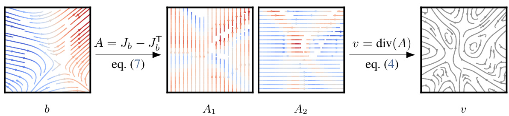  
Figure 1: D ector fields $v:\mathbb{R}^{d}\rightarrow\mathbb{R}^{d}$ ccfrom an antisymmetric matrix fie d$A:\overline{{\mathbb{R}^{d}}}\to\mathbb{R}^{d\times d}$ →or an arbitrary vector field $b:\mathbb{R}^{d}\rightarrow\mathbb{R}^{d}$ →.J$J_{b}$ represents the Jacobian matrix of b, and $A_{1}$ and $A_{2}$ are the first and second rows of A . Color denotes divergence.  

Concretely, we derive two approaches—visualized in Figure 1 —to transform sufficiently smooth neural networks into divergence-free neural networks, made efficient by automatic differentiation and recent advances in vectorized and composable transformations [ Bradbury et al. ,2018 ,Horace He ,2021 ]. Furthermore, both approaches can theoretically represent any divergence-free vector field.  

We combine these new modeling tools with the observation that solutions of the continuity equation— a partial differential equation describing the evolution of a density under a flow —can be characterized jointly as a divergence-free vector field. As a result, we can parameterize neural networks that, by design, always satisfy the continuity equation, which we coin Neural Conservation Laws (NCL). While prior works either resorted to penalizing errors [ Raissi et al. ,2019 ] or numerically simulating the density given a flow [ Chen et al. ,2018 ], baking this constraint directly into the model allows us to forego extra penalty terms and expensive numerical simulations.  

# 2 Constructing divergence-free vector fields  

We will use the notation of differential forms in $\mathbb{R}^{n}$ for deriving the divergence-free and universality properties of our vector field constructions. We provide a concise overview of differential forms in Appendix A . For a more extensive introduction see e.g. ,Do Carmo [1998 ], Morita [2001 ]. Without this formalism, it is difficult to show either of these two properties; however, readers who wish to skip the derivations can jump to the matrix formulations in equation 4 and equation 7 .  

Let us denote ${\mathcal{A}}^{k}(\mathbb{R}^{n})$ rential $k$ -forms, $d:{\mathcal{A}}^{k}(\mathbb{R}^{n})\to{\mathcal{A}}^{k+1}(\mathbb{R}^{n})$ the exterior derivative, and $\star:{\mathcal{A}}^{k}(\mathbb{R}^{n})\rightarrow{\mathcal{A}}^{n-k}(\mathbb{R}^{n})$ A →A odge star operator that maps each k-form to an $(n{-}k)$ -form. Id ng a vector field v$v:\mathbb{R}^{d}\rightarrow\mathbb{R}^{d}$ →,$\textstyle v=\sum_{i=1}^{n}v_{i}d x_{i}$ , we can express the divergence div $\mathrm{div}(v)$ as the composition d ⋆v  

To parameterize a divergence-free vector field v$v:\mathbb{R}^{n}\,\rightarrow\,\mathbb{R}^{n}$ →,y the fundamental property of the exterior derivative, taking an arbitrary ( n2 )-form $\mu\in{\mathcal{A}}^{n-2}(\mathbb{R}^{n})$ ∈A we have that  

$$
0=d^{2}\mu=d(d\mu)
$$  

and since $\star$ is its own inverse up to a sign, it follows that  

$$
v={\star}d\mu
$$  

${\mathcal{A}}^{n-2}({\overline{{\mathbb{R}}}}^{n})$ $\mu_{j i}=-\mu_{i j}$ is divergence free. We write the parameterization −Now a direct calculation shows that up to a constant sign (see Appendix$\star(d x_{i}\wedge d x_{j})$ , we can write $v={\star}d\mu$ explicitly in coordinates. Since a basis for $\begin{array}{r}{\bar{\mu}=\frac{1}{2}\overleftarrow{\sum}_{i,j=1}^{n}\mu_{i j}\star(d x_{i}\wedge d x_{j})}\end{array}$ P∧A.1 ), where  

$$
\star d\mu=\sum_{i=1}^{n}\left[\sum_{j=1}^{n}{\frac{\partial\mu_{i j}}{\partial x_{j}}}\right]d x_{i}.
$$  

This formula is suggestive of a simple m ulation: If we let $A:\mathbb{R}^{n}\rightarrow\mathbb{R}^{n\times n}$ be symmetric matrix-valued function where $A_{i j}=\mu_{i j}$ then the divergence-free vector field $v={\star}d\mu$ can be written as taking row-wise divergence of $A$ ,i.e. ,  

$$
v=\left(\underset{\operatorname{div}(A_{n})}{\overset{\operatorname{div}(A_{1})}{\vdots}}\right).
$$  

However, this requires parameterizing $O(n^{2})$ functions. A more compact representation, which starts from a vector field, can also be derived. The idea behind this second construction is to model $\mu$ instead as $\mu=\delta\nu$ , where $\nu\in{\mathcal{A}}^{n-1}(\mathbb{R}^{n})$ . Putting this together with equation 2 we get that  

$$
v=\star d\delta\nu
$$  

$\mathcal{A}^{n-1}(\mathbb{R}^{n})$ A a constant sign ence-fr in the ( $(n{-}1)$ )-form basis, ctor field. To p i.e. ,$\textstyle\nu=\sum_{i=1}^{n^{-}}\nu_{i}\star d x_{i}$ Pn matrix formulation we first write . Then a direct calculation provides up to $\nu\in$  

$$
\delta\nu=\frac{1}{2}\sum_{i,j=1}^{n}\left[\frac{\partial\nu_{i}}{\partial x_{j}}-\frac{\partial\nu_{j}}{\partial x_{i}}\right]\star(d x_{i}\wedge d x_{j})
$$  

So, given n arbitrary vector field $b:\mathbb{R}^{n}\,\rightarrow\,\mathbb{R}^{n}$ , and denoting $J_{b}$ as the Jacobian of $b$ , we can construct A as  

$$
A=J_{b}-J_{b}^{\mathsf{T}}.
$$  

where $J_{b}$ denotes the Jacobian of $b$ .  

To summarize, we have two constructions for divergence-free vector fields $v$ :  

Matrix-field : (equations 2 and 4 )$v$ is represented using an anti-symmetric matrix field $A$ .  

Vector-field : (equations 5 and $4+7$ )$v$ is represented using a vector field $b$ .  

As we show in the next section, these two approaches are maximally expressive ( i.e. , universal), meaning they can approximate arbitrary smooth divergence-free vector fields. However, empirically these two constructions can exhibit different practical trade-offs. The matrix-field construction has a computational advantage as it requires one less Jacobian computation, though it requires more components— $O(n^{2})$ vs. $O(n)$ —to represent than the vector-field construction. This generally isn’t a concern as all components can be computed in parallel. However, the vector-field construction can make it easy to bake in additional constraints; an example of this is discussed in Section 7.1 , where a non-negativity constraint is imposed for modeling continuous-time probability density functions. In Figure 2 we show wallclock times for evaluating the divergence-free vector field based on our two constructions. Both exhibit quadratic scaling (in function evaluations) with the number of dimensions due to the row-wise divergence in equation 4 , while the vector-field construction has an extra Jacobian computation.  

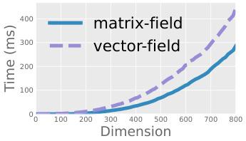  
Figure 2: Compute times.  

# 2.1 Universality  

Both the matrix-field and vector-field representations are universal, i.e. they can model arbitrary divergence-free vector fields. The main tool in the proof is the Hodge decomposition theorem [ Morita ,2001 ,Berger ,2003 ]. For simplicity we will be working on a periodic piece of $\mathbb{R}^{n}$ , namely the torus $\mathbb{T}^{n}=[-\bar{M},M]^{n}/\sim$ where $\sim$ means identifying opposite edges of the $n$ -dimens al cu $M>0$ is arbitrary. Vector fields with compact support can always be encapsulated in $\mathbb{T}^{n}$ with $M>0$ sufficiently large. As $\mathbb{T}^{n}$ is locally identical to $\mathbb{R}^{n}$ , all the previous definitions and constructions hold.  

Theorem 2.1. The matrix and vector-field representations are universal in $\mathbb{T}$ , possibly only missing a constant vector field.  

A formal proof of this result is in Appendix B.1 .  

# 3 Neural Conservation Laws  

We now discuss a key aspect of our work, which is parameterizing solutions of scalar conservation laws. Conservation laws are a focal point of mathematical physics and have seen applications in machine learning, with the most well known examples being conserved scalar quantities often referred to as density, energy, or mass. Formally, a conservation law can be expressed as a first-order PDE written in divergence form as $\begin{array}{r}{\frac{\partial\rho}{\partial t}+\mathrm{div}(j)=0}\end{array}$ , where $j$ is known as the flux, and the divergence is taken over spatial variables. In the case of the continuity equation, there is a velocity field $u$ which describes the flow and the flux is equal to the density times the velocity field:  

$$
\frac{\partial\rho}{\partial t}+\mathrm{div}(\rho u)=0
$$  

where $\rho:\mathbb{R}^{n}\,\rightarrow\,\mathbb{R}^{+}$ d$u:\mathbb{R}^{n}\,\rightarrow\,\mathbb{R}^{n}$ . One can then interpret the equation to mean that $u$ transports an interpretation plays a key role in physics simulations as well as the dynamic formulation of $\rho(0,\cdot)$ ·to $\rho(t,\cdot)$ ·continuously – without teleporting, creating or destroying mass. Such optimal transport [ Benamou and Brenier ,2000 ]. In machine learning, the continuity equation appears in continuous normalizing flows [ Chen et al. ,2018 ]—which also have been used to approximate solutions to dynamical optimal transport. [ Finlay et al. ,2020 ,Tong et al. ,2020 ,Onken et al. ,2021 ]These, however, only model the velocity $u$ and rely on numerical simulation to solve for the density $\rho$ , which can be costly and time-consuming.  

Instead, we observe that equation 8 can be expressed as a divergence-free vector field by augmenting the spatial dimensions with the time variable, resulting in a vector field $v$ that takes as input $(t,x)$ and outputs $(\rho,\rho u)$ . Then equation 8 is equivalent to  

$$
\operatorname{div}(v)=\operatorname{div}{\binom{\rho}{\rho u}}={\frac{\partial\rho}{\partial t}}+\operatorname{div}(\rho u)=0
$$  

where the divergence operator is now taken with respect to the joint system $(t,x)$ ,i.e. $\textstyle{\frac{\partial}{\partial t}}+\sum_{i=1}^{n}{\frac{\partial}{\partial x_{i}}}$ .We thus propose modeling solutions of conservation laws by parameterizing the divergence-free vector i field $v$ . Specifically, we parameterize a divergence-free vector field $v$ and set $v_{1}=\rho$ and $v_{2:n+1}=\rho u$ ,allowing us to recover the vector field as $\begin{array}{r}{u=\frac{v_{2:n+1}}{\rho}}\end{array}$ , assuming $\rho\neq0$ . This allows us to enforce the continuity equation at an architecture level. Compared to simulation-based modeling approaches, we completely forego such computationally expensive simulation procedures. Code for our experiments are available at https://github.com/facebookresearch/neural-conservation-law .  

# 4 Related Works  

Baking in constraints in deep learning Existing approaches to enforcing constraints in deep neural networks can induce constraints on the derivatives, such as convexity [ Amos et al. ,2017 ] or Lipschitz continuity [ Miyato et al. ,2018 ]. More complicated formulations involve solving numerical problems such as using solutions of convex optimization problems [ Amos and Kolter ,2017 ], solutions of fixed-points iterations [ Bai et al. ,2019 ], and solutions of ordinary differential equations [ Chen et al. ,2018 ]. These models can help provide more efficient approaches or alternative algorithms for handling downstream applications such as constructing flexible density models [ Chen et al. ,2019 ,Lu et al. ,2021 ] or approximating optimal transport paths [ Tong et al. ,2020 ,Makkuva et al. ,2020 ,Onken et al. ,2021 ]. However, in many cases, there is a need to solve a numerical problem in which the solution may only be approximated up to some numerical accuracy; for instance, the need to compute the density flowing through a vector field under the continuity equation [ Chen et al. ,2018 ].  

Applications of differential forms Differential forms and more generally, differential geometry, have been previously applied in manifold learning—see e.g. Arvanitidis et al. [2021 ] and Bronstein et al. [2017 ] for an in-depth overview. Most of the applications thus far have been restricted to 2 or 3 dimensions—either using identities like div $\circ\,{\mathsf{c u r l}}=0$ in 3D for fluid simulations [ Rao et al. ,2020 ], or for learning geometric invariances in 2D images or 3D space [ Gerken et al. ,2021 ,Li et al. ,2021 ].  

Conservation Laws in Machine Learning [Sturm and Wexler ,2022 ] previously explored discrete analogs of conservation laws by conserving mass via a balancing operation in the last layer of a neural network. [ Müller ,2022 ] utilizes a wonderful application of Noether’s theorem to model conservation laws by enforcing symmetries in a Lagrangian represented by a neural network.  

# 5 Neural approximations to PDE solutions  

As a demonstration of our method, we apply it to neural-based PDE simulations of fluid dynamics. First, we apply it to modelling inviscid fluid flow in the open ball $\mathbb{B}\subseteq\mathbb{R}^{3}$ with free slip boundary  

conditions, then to a 2d example on the flat Torus $\mathbb{T}^{2}$ , but with more complex initial conditions. While these are toy examples, they demonstrate the value of our method in comparison to existing approaches—namely that we can exactly satisfy the continuity equation and preserve exact mass.  

The Euler equations of incompressible flow The incompressible Euler equations [ Feynman et al. ,1989 ] form an idealized model of inviscid fluid flow, governed by the system of partial differential equations 1  

$$
\begin{array}{r}{\frac{\partial\rho}{\partial t}+\mathrm{div}(\rho\boldsymbol{u})=0,\qquad}&{{}\frac{\partial\boldsymbol{u}}{\partial t}+\nabla_{\boldsymbol{u}}\boldsymbol{u}=\frac{\nabla p}{\rho},\qquad\mathrm{div}(\boldsymbol{u})=0}\end{array}
$$  

in three unknowns: the fluid velocity $u(t,x)\in\mathbb{R}^{3}$ , the pr $p(t,x)$ , and the fluid density $\rho(t,x)$ .While the fluid velocity and density are usually given at $t=0$ , the initial pressure is not required. Typically, on a bounded domain $\Omega\subseteq\mathbb{R}^{n}$ , these are supplemented by the free-slip boundary condition and initial conditions  

$$
u\cdot n=0{\mathrm{~on~}}\partial\Omega\qquad u(0,x)=u_{0}{\mathrm{~and~}}\rho(0,x)=\rho_{0}\qquad{\mathrm{~on~}}\Omega
$$  

The density $\rho$ plays a critical role since in addition to being a conserved quantity, it influences the dynamics of the fluid evolution over time. In numerical simulations, satisfying the continuity equation as closely as possible is desirable since the equations in ( 10 ) are coupled. Error in the density feeds into error in the velocity and then back into the density over time. In the finite element literature, a great deal of effort has been put towards developing conservative schemes that preserve mass (or energy in the more general compressible case)—see Guermond and Quartapelle [2000 ] and the introduction of Almgren et al. [1998 ] for an overview. But since the application of physics informed neural networks (PINNs) to fluid problems is much newer, conservative constraints have only been incorporated as penalty terms into the loss [ Mao et al. ,2020 ,Jin et al. ,2021 ].  

# 5.1 Physics informed neural networks  

Physics Informed Neural Networks (PINNs; Raissi et al. [2019 ,2017 ]) have recently received renewed attention as an application of deep neural networks. While using neural networks as approximate solutions to PDE had been previously explored (e.g in Lagaris et al. [1998 ]), modern advances in automatic differentiation algorithms have made the application to much more complex problems feasible [ Raissi et al. ,2019 ]. The “physics” in the name is derived from the incorporation of physical terms into the loss function, which consist of adding the squared residual norm of a PDE. For example, to train a neural network $\phi=[\rho,p,u]$ to satisfy the Euler equations, the standard choice of loss to fit to is  

$$
\begin{array}{r l}{L_{F}}&{=\Big\|u_{t}+\nabla_{u}u+\frac{\nabla p}{\rho}\Big\|_{\Omega}^{2}\quad L_{\mathrm{div}}=\|\mathrm{div}(u)\|_{\Omega}\quad L_{I}=\|u(0,\cdot)-u_{0}(\cdot)\|_{\Omega}^{2}+\|\rho(0,\cdot)-\rho_{0}(\cdot)\|_{\Omega}}\\ {L_{\mathrm{Cont}}=\Big\|\frac{\partial\rho}{\partial t}+\mathrm{div}(\rho u)\Big\|_{\Omega}^{2}\quad}&{L_{G}=\|u\cdot n\|_{\partial\Omega}^{2}\quad\quad L_{\mathrm{total}}=\gamma\cdot[L_{F},L_{I},L_{\mathrm{div}},L_{\mathrm{Cont}},L_{G}]}\end{array}
$$  

where $\boldsymbol{\gamma}=(\gamma_{F},\gamma_{I},\gamma_{\mathrm{div}}\gamma_{C o n t},\gamma_{G})$ denotes suitable coefficients (hyperparameters). The loss term $L_{G}$ ensures fluid does not pass through boundaries, when they are present. Similar approaches were taken in [ Mao et al. ,2020 ] and [ Jagtap et al. ,2020 ] for related equations. While schemes of this nature are very easy to implement, they have the drawback that since PDE terms are only penalized and not strictly enforced, one cannot make guarantees as to the properties of the solution.  

To showcase the ability of our method to model conservation laws, we will parameterize the density and vector field as $\boldsymbol{v}=[\rho,\rho u]$ , as detailed in Section 3 . This means we can omit the term $L_{\mathrm{Cont}}$ as described in Section 5.1 from the training loss. The divergence penalty, $L_{\mathrm{div}}$ remains when modeling incompressible fluids, since $u$ is not necessarily itself divergence-free – it is $\boldsymbol{v}=[\rho,\rho\boldsymbol{u}]$ which is divergence free. In order to stablize training, we can modify the loss terms $L_{F},L_{G},L_{I}$ to avoid division by $\rho$ . This is detailed in Appendix B.2 .  

# 5.2 Incompressible variable density inside the 3D unit ball  

We first construct a simple example within a bounded domain, specifically, we will consider the Euler equations inside $B(0,1)\subseteq\mathbb{R}^{3}$ , with the initial conditions  

$$
\rho(0,x)=3/2-\left\|x\right\|^{2}\qquad v(0,x)=(-2,x_{0}-1,1/2)
$$  

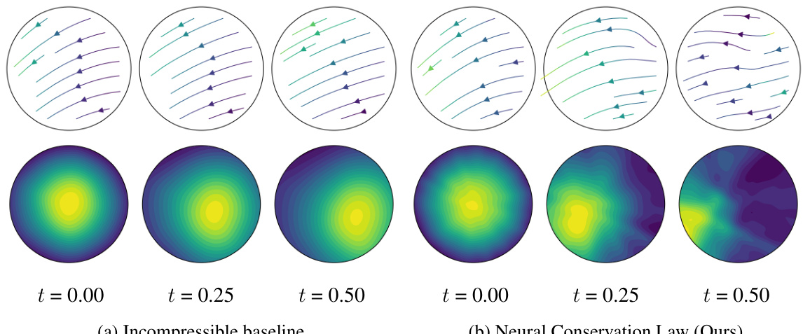  
Figure 3: Exactly satisfying the continuity equation yields much better performance than only satisfying the incompressible (divergence-free) condition of the vector field, even though both approaches obtain very small loss values. 2D slices of the learned solution of $u$ and $\rho$ are shown.   
(a) Incompressible baseline   
(b) Neural Conservation Law (Ours)  

As a baseline, we compare against a parameterization that uses the divergence-free vector field only for the incompressible constraint. This is equivalent to the curl approach described in Rao et al. [2020 ]; another neural network is used to parameterize $\rho$ . In contrast, our generalized formulation of divergence-free fields allow us to model the continuity equation exactly, as in this case, $[\rho,\rho u]$ is 4 dimensional. We parameterize our method using $v=[\rho,\rho u]$ , as detailed in Section 3 , with the vector-field approach from Section 2 .  

The results for training both networks are shown in Figure 3 . Surprisingly, even though both architectures signficantly improve the training loss after a comparable number of iterations (see Appendix C), the curl approach fails to advect the density accurately, whereas our NCL approach evolves the density as it should given the initial conditions.  

# 5.3 Incompressible variable density flow on $\mathbb{T}^{2}$  

As a more involved experiment, we model the Euler equations on the flat 2-Torus $\mathbb{T}^{2}$ . This is parameterized by a multilayer perceptron pre-composed with the periodic embedding $\iota:[0,1]^{2}\to\ensuremath{\mathbb{T}}^{2}$  

$$
\iota(x,y)=[\cos(2\pi x),\sin(2\pi x),\cos(2\pi y),\sin(2\pi y)]
$$  

The continuity equation is enforced exactly, using the method detailed in Section 3 , so the $L_{\mathrm{Cont}}$ term is omitted from $L_{\mathrm{total}}$ . The initial velocity and density are  

$$
\rho_{0}(x,y)=(z_{1}+z_{3})^{2}+1\qquad v_{0}(x,y)=[e^{z_{3}},e^{z_{1}}/2]
$$  

where $z=\theta(x,y,1)$ . Here we used the matrix-field parameterization as referred to in Section 2 , for the simple reason that it performed better empirically. We also include the harmonic component from Hodge decomposition, which is just a constant vector field, to ensure we have full universality. Full methodology for the experiment is detailed in Appendix C. The results of evolving the flow for time $t\in[0,{^1\mathord{/}}3]$ are shown in Figure 4 , as well as a comparison with a reference finite element solution generated by the conservative splitting method from [ Guermond and Quartapelle ,2000 ]. In general, our model fits the initial conditions well and results in fluid-like movement of the density, however small approximation errors can accumulate from simulating over a longer time horizon. To highlight this, we also plotted the best result we were able to achieve with a standard PINN. Although the PINN made progress minimizing the loss, it was unable to properly model the dynamics of the fluid evolution. While this failure can likely be corrected by tuning the $\gamma$ constant (see Section 5.1 ), we were unable to find a combination that fit the equation correctly. By contrast, our NCL model worked with the first configuration we tried.  

# 6 Learning the Hodge decomposition  

Using our divergence-free models, we can also learn the Hodge decomposition of a vector field itself. Informally, the Hodge decomposition states that any vector field can be expressed as the combination of a gradient field ( i.e. gradient of a scalar function) and a divergence-free field. There are many scenarios where a neural network modelling a vector field should be a gradient field (theoretically), such as score matching [ Song and Ermon ,2019 ], Regularization by Denoising [ Hurault et al. ,2022 ], amortized optimization [ Xue et al. ,2020 ], and meta-learned optimization [ Andrychowicz et al. ,2016 ]. Many works, however, have reported that parameterizing such a field as the gradient of a potential hinders performance, and as such they opt to use an unconstrained vector field. Learning the Hodge decomposition can then be used to remove any extra divergence-free, i.e. rotational, components of the unconstrained model.  

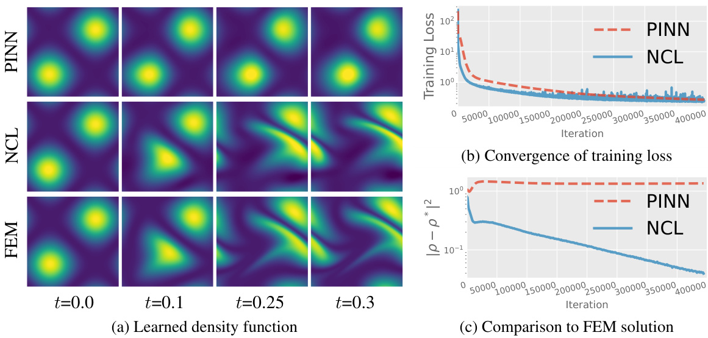  
Figure 4: While both PINN and NCL models minimize the training loss effectively and fit the initial conditions, the PINN fails to learn the dynamics of the advected density. When compared to a gold standard FEM solution, our NCL model nicely exhibits linear convergence to the solution.  

As a demonstration of the ability of our model to scale in dimension, we construct a synthetic experiment where we have access to the ground truth Hodge decomposition. This provides a benchmark to validate the accuracy of our method. To do so, we construct the target field $\hat{v}$ as  

$$
\boldsymbol{\hat{v}}=\nabla\boldsymbol{w}+\eta
$$  

where $\eta$ is a fixed divergence-free neural network, and $w$ is a fixed scalar network. We use the same embedding from Section 5.3 ,ut extended to $\mathbb{T}^{n}$ , for $n\,\in\,\{25,50,100\}$ . We t en parameterize another divergence-free model $v_{\theta}$ which has a different architecture than the target η. Inspired by the Hodge decomposition, we propose using the following objective for training:  

$$
\ell(\theta)=\|J_{\hat{v}-v_{\theta}}-[J_{\hat{v}-v_{\theta}}]^{\mathsf{T}}\|_{F}
$$  

where $J_{\hat{v}-v_{\theta}}$ acobian of ${\hat{v}}-v_{\theta}$ . In the no rential f rms, this corres nds to minimizing ∥$\Vert\delta(\hat{v}-v_{\theta})\Vert_{F}$ −∥, which when zero imp $v_{\theta}=\hat{v}+\delta\mu$ , where µis an arbitrar $n$ m. Howev nce $v_{\theta}$ is divergence-free, it must hold $\delta\mu=-\nabla w$ −∇ ,i.e. the left-over portion of ${\hat{v}}-v_{\theta}$ −is exactly ∇$\nabla w$ , because the Hodge decomposition is an orthogonal direct sum [ Warner ,1983 ].  

For evaluation, we plot the squared $L_{2}$ norm to the ground truth $\eta$ against wall clock time. While this demonstration is admittedly artificial, it serves to show that our model scales efficiently to moderately high dimensions – significantly beyond those achievable using grid based discretizations of divergencefree fields (see Bhatia et al. [2013 ] for an overview of such methods). The results are shown in Figure 5 . While larger dimensions are more costly, we are still able to recover the ground truth in dimensions up to 100.  

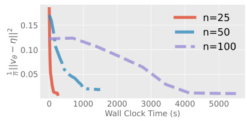  
Figure 5: $L_{2}$ to ground truth.  

# 7 Dynamical optimal transport  

The calculation of optimal transport (OT) maps between two densities of interest $p_{0}$ and $p_{1}$ serves as a powerful tool for computing distances between distributions. Moreover, the inclusion of OT into machine learning has inspired multiple works on building efficient or stable generative models [ Arjovsky et al. ,2017 ,Tong et al. ,2020 ,Makkuva et al. ,2020 ,Huang et al. ,2020 ,Finlay et al. ,2020 ,Rout et al. ,2021 ,Rozen et al. ,2021 ]. In particular, we are interested in the dynamical formulation of Benamou and Brenier [2000 ], which is a specific instance where the transport map is characterized through a vector field. Specifically, we wish to solve the optimization problem  

$$
\operatorname*{min}_{\rho,u}\ \int_{0}^{1}\int_{\mathcal{M}}\|u(t,x)\|^{2}\rho(t,x)\ d x d t
$$  

subject to the terminal constraints, $\rho(0,\cdot)\,=\,p_{0}(\cdot)$ and $\rho(1,\cdot)\,=\,p_{1}(\cdot)$ , as well as remaining nonnegative $\rho\ge0$ on the domain and satisfying the continuity equation $\begin{array}{r}{{\frac{\partial\rho}{\partial t}}+\mathrm{div}(\rho u)=0}\end{array}$ .  

In many existing cases, the models for estimating either $\rho$ and equation 15 are completely decoupled from the generative model or transport map [ Arjovsky et al. ,2017 ,Makkuva et al. ,2020 ], or in some cases $\rho$ would be computed through numerical simulation and equation 15 estimated through samples [ Chen et al. ,2018 ,Finlay et al. ,2020 ,Tong et al. ,2020 ]. These approaches may not be ideal as they require an auxiliary process to satisfy or approximate the continuity equation.  

In contrast, our NCL approach allows us to have access to a pair of $\rho$ and $u$ that always satisfies the continuity equation, without the need for any numerical simulation. As such, we only need to match the terminal conditions, and will automatically have access to a vector field $u$ that transports mass from $\rho(0,\cdot)$ to $\rho(1,\cdot)$ . In order to find an optimal vector field, we can then optimize $u$ with respect to the objective in equation 15 .  

# 7.1 Parameterizing non-negative densities with subharmonic functions  

In this setting, it is important that our density is non-negative for the entire domain and within the time interval between 0 and 1. Instead of adding another loss function to satisfy this condition, we show how we can easily bake this condition into our model through the vector-field parameterization.  

Recall for the vector-field parameterization of the continuity equation, we have a vector field $b_{\theta}(y)$ with $y=[t,x]$ , for $t\in[0,\bar{1}]$ ,$x\in\mathbb{R}^{n}$ . This results in the parameterization  

$$
\begin{array}{r}{\rho=\operatorname{div}\left(\frac{\partial b_{1}}{\partial x}-\frac{\partial b_{2}:n+1}{\partial t}^{\mathsf{T}}\right)\quad\mathrm{~for~}i=1,\ldots,n+1.}\end{array}
$$  

We now make the adjustment that $\begin{array}{r}{\frac{\partial b_{2:n+1}}{\partial t}=0}\end{array}$ . This condition does not reduce the expressivity of the formulation, as $\rho$ can still represent any density function. Interestingly, this modification does imply that $\rho=\nabla^{2}b_{1}$ with $\nabla^{2}$ being the Laplacian operator, so t e boundary conditions is equivalent to solving a time-dependent Poisson’s equation ∇$\nabla^{2}b_{1}(t,\dot{\cdot})=p_{t}$ ·.  

Furthermore, the class of subharmonic functions is exactly the set of functions $g$ that satisfies $\nabla^{2}g(0,\cdot)\geq0$ . In one dimension, this corresponds to the class of convex functions but is a strict generalization of convex functions in higher dimensions. With this in mind, we propose using the parameterization  

$$
b_{1}(t,x)=\sum_{k=1}^{K}w_{k}(t)\phi(a_{k}(t)x+b_{k}(t))\quad{\mathrm{~where~}}\phi(z)={\textstyle{\frac{1}{4\pi}}}\left(\log(\|z\|^{2})+E_{1}(\|z\|^{2}/4)\right)
$$  

wi h$E_{1}$ being the exponential integral function, and $w_{k},a_{k}\in\mathbb{R}^{+}$ and $b_{k}\in\mathbb{R}^{n}$ are free funct ns of t. This a weighted sum of generalized linear models, where the choice of nonlinear function φis chosen because it is the exact solution to the Poisson’s equation for a standard normal distribution when $n=2$ ,i.e. $\nabla^{2}\phi=\mathcal{N}(0,I)$ , while for $n\geq2$ this remains a subharmonic function. As such, this can be seen as a generalization of a mixture model, which are often referenced to be universal density approximators, albeit requiring many mixture components [ Goodfellow et al. ,2016 ].  

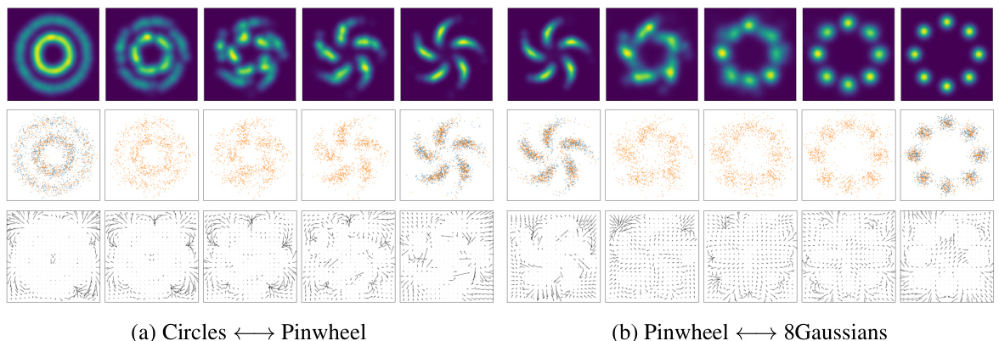  
Figure 6: Learned approximation to the dynamical optimal transport map. ( top ) Density $\rho$ . ( mid )Transformed samples in orange, with samples from $p_{0}$ and $p_{1}$ in blue. ( bottom ) Learned vector field.  

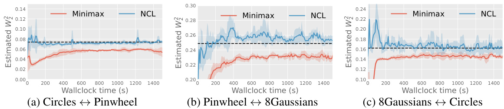  
Figure 7: Neural Conservation Laws on approximating dynamical optimal transport converges in minutes. The alternative minimax formulation tends to underestimate the Wasserstein distance. Dashed line is an estimate from a discrete OT algorithm. Shaded regions denote standard deviation.  

# 7.2 Experiments  

We experiment with pairs of 2D densities (visualized in Figure 6 ) and fit a pair of $(\rho,u)$ to equation 15 while satisfying boundary conditions. Specifically, we train with the loss  

$$
\operatorname*{min}_{\rho,u}\ \lambda\mathbb{E}_{x\sim\tilde{p}_{0}}\left[\left\vert\rho(0,x)-p_{0}(x)\right\vert\right]+\lambda\mathbb{E}_{x\sim\tilde{p}_{1}}\left[\left\vert\rho(1,x)-p_{1}(x)\right\vert\right]+\int_{0}^{1}\int_{M}\|u(t,x)\|^{2}\rho(t,x)\ d x d t
$$  

where $\tilde{p}_{i}$ is a mixture between $p_{i}$ and a uniform density over a sufficiently large area, for $i=0,1$ ,and $\lambda$ is a hyperparameter. We use a batch size of 256 and set $K{=}128$ (from equation 17 ). Qualitative results are displayed in Figure 6 , which include interpolations between pairs of densities.  

Furthermore, we can use the trained models to estimate the Wasserstein distance, by transforming samples from $p_{0}$ through the learned vector field to time $\scriptstyle t=1$ . We do this for 5000 samples and compare the estimated value to (i) one estimated by that of a neural network trained through a minimax optimization formulation [ Makkuva et al. ,2020 ], and (ii) one estimated by that of a discrete OT solver [ Bonneel et al. ,2011 ] based on kernel density approximation and interfaced through the pot library [ Flamary et al. ,2021 ].  

Estimated squared Wasserstein distance as a function of wallclock time are shown in Figure 7 . We see that our estimated values roughly agree with the discrete OT algorithm. However, the baseline minimax approach consistently underestimates the optimal transport distance. This is an issue with the minimax formulation not being able to cover all of the modes, and has been commonly observed in the literature ( e.g. Salimans et al. [2016 ], Che et al. [2017 ], Srivastava et al. [2017 ]). Moreover, in order to stabilize minimax optimization in practice, Makkuva et al. [2020 ] made use of careful optimization tuning such as reducing momentum [ Radford et al. ,2016 ]. In contrast, our NCL approach is a simple optimization problem.  

# 8 Conclusion  

We proposed two constructions for building divergence-free neural networks from an original unconstrained smooth neural network, where either an original matrix field or vector field is parameterized. We found both to be useful in practice: the matrix field approach is generally more flexible, while the vector field approach allows the addition of extra constraints such as a non-negativity constraint. We combined these methods with the insight that the continuity equation can reformulated as a divergence-free vector field, and this resulted in a method for building deep neural networks that are constrained to always satisfy the continuity equation, which we refer to as Neural Conservation Laws.  

Currently, these models are difficult to scale due to extensive use of automatic differentiation for computing divergence of neural networks. It may be possible to combine our approach with parameterizations that provide cheap divergence computations [ Chen and Duvenaud ,2019 ]. Nevertheless, the development of efficient batching and automatic differentiation tools is an active research area, so we expect these tools to improve as development progresses.  

# Acknowledgements  

We acknowledge the Python community [ Van Rossum and Drake Jr ,1995 ,Oliphant ,2007 ] and the core set of tools that enabled this work, including PyTorch [ Paszke et al. ,2019 ], functorch [Horace He ,2021 ], torchdiffeq [ Chen ,2018 ], J AX [Bradbury et al. ,2018 ], Flax [ Heek et al. ,2020 ], Hydra [ Yadan ,2019 ], Jupyter [ Kluyver et al. ,2016 ], Matplotlib [ Hunter ,2007 ], numpy [ Oliphant ,2006 ,Van Der Walt et al. ,2011 ], and SciPy [ Jones et al. ,2014 ]. Jack Richter-Powell would also like to thank David Duvenaud and the Vector Institute for graciously supporting them over the last year.  

# References  

A. S. Almgren, J. B. Bell, P. Colella, L. H. Howell, and M. L. Welcome. A Conservative Adaptive Projection Method for the Variable Density Incompressible Navier–Stokes Equations. Journal of Computational Physics , 142(1):1–46, May 1998. ISSN 00219991. doi: 10.1006/jcph.1998.5890 .URL https://linkinghub.elsevier.com/retrieve/pii/S0021999198958909 .  
B. Amos and J. Z. Kolter. Optnet: Differentiable optimization as a layer in neural networks. In International Conference on Machine Learning , pages 136–145. PMLR, 2017.   
B. Amos, L. Xu, and J. Z. Kolter. Input convex neural networks. In International Conference on Machine Learning , pages 146–155. PMLR, 2017.   
M. Andrychowicz, M. Denil, S. Gomez, M. W. Hoffman, D. Pfau, T. Schaul, B. Shillingford, and N. De Freitas. Learning to learn by gradient descent by gradient descent. Advances in neural information processing systems , 29, 2016.   
M. Arjovsky, S. Chintala, and L. Bottou. Wasserstein generative adversarial networks. In International conference on machine learning , pages 214–223. PMLR, 2017.   
G. Arvanitidis, L. K. Hansen, and S. Hauberg. Latent Space Oddity: on the Curvature of Deep Generative Models, Dec. 2021. URL http://arxiv.org/abs/1710.11379 . Number: arXiv:1710.11379 arXiv:1710.11379 [stat].   
S. Bai, J. Z. Kolter, and V. Koltun. Deep equilibrium models. Advances in Neural Information Processing Systems , 32, 2019.   
C. Barbarosie. Representation of divergence-free vector fields. Quarterly of applied mathematics , 69 (2):309–316, 2011.   
J.-D. Benamou and Y. Brenier. A computational fluid mechanics solution to the monge-kantorovich mass transfer problem. Numerische Mathematik , 84(3):375–393, 2000.   
M. Berger. A panoramic view of riemannian geometry. 2003.   
H. Bhatia, G. Norgard, V. Pascucci, and P.-T. Bremer. The helmholtz-hodge decomposition—a survey. IEEE Transactions on Visualization and Computer Graphics , 19(8):1386–1404, 2013. doi: 10.1109/TVCG.2012.316 .  
N. Bonneel, M. Van De Panne, S. Paris, and W. Heidrich. Displacement interpolation using lagrangian mass transport. In Proceedings of the 2011 SIGGRAPH Asia conference , pages 1–12, 2011.   
J. Bradbury, R. Frostig, P. Hawkins, M. J. Johnson, C. Leary, D. Maclaurin, G. Necula, A. Paszke, J. VanderPlas, S. Wanderman-Milne, and Q. Zhang. JAX: composable transformations of Python+NumPy programs, 2018. URL http://github.com/google/jax .  
M. M. Bronstein, J. Bruna, Y. LeCun, A. Szlam, and P. Vandergheynst. Geometric deep learning: going beyond euclidean data. IEEE Signal Processing Magazine , 34(4):18–42, 2017.   
É. Cartan. On certain differential expressions and the pfaff problem. In Scientific Annals of the ´SchoolNormal Superior , volume 16, pages 239–332, 1899.   
T. Che, Y. Li, A. P. Jacob, Y. Bengio, and W. Li. Mode regularized generative adversarial networks. International Conference on Learning Representations , 2017.   
R. T. Q. Chen. torchdiffeq, 2018. URL https://github.com/rtqichen/torchdiffeq .  
R. T. Q. Chen and D. K. Duvenaud. Neural networks with cheap differential operators. Advances in Neural Information Processing Systems , 32, 2019.   
R. T. Q. Chen, Y. Rubanova, J. Bettencourt, and D. K. Duvenaud. Neural ordinary differential equations. Advances in neural information processing systems , 31, 2018.   
R. T. Q. Chen, J. Behrmann, D. K. Duvenaud, and J.-H. Jacobsen. Residual flows for invertible generative modeling. Advances in Neural Information Processing Systems , 32, 2019.   
M. P. Do Carmo. Differential forms and applications . Springer Science & Business Media, 1998.   
M. Eisenberger, Z. Lähner, and D. Cremers. Divergence-Free Shape Interpolation and Correspondence, Oct. 2018. URL http://arxiv.org/abs/1806.10417 . Number: arXiv:1806.10417 arXiv:1806.10417 [cs].   
R. Feynman, R. Leighton, and M. Sands. The Feynman Lectures on Physics: Commemorative Issue . Advanced book program. Addison-Wesley, 1989. ISBN 978-0-201-50064-6. URL https: //books.google.ca/books?id=UHp1AQAACAAJ .  
C. Finlay, J.-H. Jacobsen, L. Nurbekyan, and A. M. Oberman. How to train your neural ode. arXiv preprint arXiv:2002.02798 , 2020.   
R. Flamary, N. Courty, A. Gramfort, M. Z. Alaya, A. Boisbunon, S. Chambon, L. Chapel, A. Corenflos, K. Fatras, N. Fournier, L. Gautheron, N. T. Gayraud, H. Janati, A. Rakotomamonjy, I. Redko, A. Rolet, A. Schutz, V. Seguy, D. J. Sutherland, R. Tavenard, A. Tong, and T. Vayer. Pot: Python optimal transport. Journal of Machine Learning Research , 22(78):1–8, 2021. URL http://jmlr.org/papers/v22/20-451.html .  
J. E. Gerken, J. Aronsson, O. Carlsson, H. Linander, F. Ohlsson, C. Petersson, and D. Persson. Geometric deep learning and equivariant neural networks, 2021. URL https://arxiv.org/ abs/2105.13926 .  
I. Goodfellow, Y. Bengio, and A. Courville. Deep learning . MIT press, 2016.   
J.-L. Guermond and L. Quartapelle. A Projection FEM for Variable Density Incompressible Flows. Journal of Computational Physics , 165(1):167–188, Nov. 2000. ISSN 00219991. doi: 10.1006/jcph.2000.6609 .URL https://linkinghub.elsevier.com/retrieve/pii/ S0021999100966099 .  
J. Heek, A. Levskaya, A. Oliver, M. Ritter, B. Rondepierre, A. Steiner, and M. van Zee. Flax: A neural network library and ecosystem for JAX, 2020. URL http://github.com/google/flax .  
R. Z. Horace He. functorch: Jax-like composable function transforms for pytorch. https://github. com/pytorch/functorch , 2021.   
K. Hornik, M. Stinchcombe, and H. White. Multilayer feedforward networks are universal approximators. Neural networks , 2(5):359–366, 1989.   
C.-W. Huang, R. T. Q. Chen, C. Tsirigotis, and A. Courville. Convex potential flows: Universal probability distributions with optimal transport and convex optimization. arXiv preprint arXiv:2012.05942 , 2020.   
J. D. Hunter. Matplotlib: A 2d graphics environment. Computing in science & engineering , 9(3):90, 2007.   
S. Hurault, A. Leclaire, and N. Papadakis. Gradient step denoiser for convergent plug-and-play. International Conference on Learning Representations , 2022.   
A. D. Jagtap, E. Kharazmi, and G. E. Karniadakis. Conservative physics-informed neural networks on discrete domains for conservation laws: Applications to forward and inverse problems. Computer Methods in Applied Mechanics and Engineering , 365:113028, June 2020. ISSN 00457825. doi: 10.1016/j.cma.2020.113028 . URL https://linkinghub.elsevier.com/retrieve/pii/ S0045782520302127 .  
X. Jin, S. Cai, H. Li, and G. E. Karniadakis. NSFnets (Navier-Stokes Flow nets): Physics-informed neural networks for the incompressible Navier-Stokes equations. Journal of Computational Physics , 426:109951, Feb. 2021. ISSN 00219991. doi: 10.1016/j.jcp.2020.109951 . URL http: //arxiv.org/abs/2003.06496 . arXiv: 2003.06496.   
E. Jones, T. Oliphant, and P. Peterson. {SciPy }: Open source scientific tools for {Python }. 2014.   
J. Kelliher. Stream functions for divergence-free vector fields. Quarterly of Applied Mathematics , 79 (1):163–174, 2021.   
T. Kluyver, B. Ragan-Kelley, F. Pérez, B. E. Granger, M. Bussonnier, J. Frederic, K. Kelley, J. B. Hamrick, J. Grout, S. Corlay, et al. Jupyter notebooks-a publishing format for reproducible computational workflows. In ELPUB , pages 87–90, 2016.   
I. E. Lagaris, A. Likas, and D. I. Fotiadis. Artificial neural networks for solving ordinary and partial differential equations. IEEE transactions on neural networks , 9(5):987–1000, 1998.   
C. Li, W. Wei, J. Li, J. Yao, X. Zeng, and Z. Lv. 3dmol-net: learn 3d molecular representation using adaptive graph convolutional network based on rotation invariance. IEEE Journal of Biomedical and Health Informatics , 2021.   
C. Lu, J. Chen, C. Li, Q. Wang, and J. Zhu. Implicit normalizing flows. arXiv preprint arXiv:2103.09527 , 2021.   
A. Makkuva, A. Taghvaei, S. Oh, and J. Lee. Optimal transport mapping via input convex neural networks. In International Conference on Machine Learning , pages 6672–6681. PMLR, 2020.   
Z. Mao, A. D. Jagtap, and G. E. Karniadakis. Physics-informed neural networks for high-speed flows. Computer Methods in Applied Mechanics and Engineering , 360:112789, Mar. 2020. ISSN 00457825. doi: 10.1016/j.cma.2019.112789 . URL https://linkinghub.elsevier.com/ retrieve/pii/S0045782519306814 .  
T. Miyato, T. Kataoka, M. Koyama, and Y. Yoshida. Spectral normalization for generative adversarial networks. arXiv preprint arXiv:1802.05957 , 2018.   
S. Morita. Geometry of differential forms . Number 201. American Mathematical Soc., 2001.   
E. H. Müller. Exact conservation laws for neural network integrators of dynamical systems, 2022. URL https://arxiv.org/abs/2209.11661 .  

T. E. Oliphant. A guide to NumPy , volume 1. Trelgol Publishing USA, 2006.  

T. E. Oliphant. Python for scientific computing. Computing in Science & Engineering , 9(3):10–20,  

2007.   
D. Onken, S. Wu Fung, X. Li, and L. Ruthotto. Ot-flow: Fast and accurate continuous normalizing flows via optimal transport. In Proceedings of the AAAI Conference on Artificial Intelligence ,volume 35, 2021.   
A. Paszke, S. Gross, F. Massa, A. Lerer, J. Bradbury, G. Chanan, T. Killeen, Z. Lin, N. Gimelshein, L. Antiga, et al. Pytorch: An imperative style, high-performance deep learning library. In Advances in neural information processing systems , pages 8026–8037, 2019.   
A. Radford, L. Metz, and S. Chintala. Unsupervised representation learning with deep convolutional generative adversarial networks. International Conference on Learning Representations , 2016.   
M. Raissi, P. Perdikaris, and G. E. Karniadakis. Physics Informed Deep Learning (Part I): Data-driven Solutions of Nonlinear Partial Differential Equations, Nov. 2017. URL http://arxiv.org/abs/ 1711.10561 . Number: arXiv:1711.10561 arXiv:1711.10561 [cs, math, stat].   
M. Raissi, P. Perdikaris, and G. E. Karniadakis. Physics-informed neural networks: A deep learning framework for solving forward and inverse problems involving nonlinear partial differential equations. Journal of Computational Physics , 378:686–707, 2019. ISSN 0021- 9991. doi: https://doi.org/10.1016/j.jcp.2018.10.045 . URL https://www.sciencedirect.com/ science/article/pii/S0021999118307125 .  
C. Rao, H. Sun, and Y. Liu. Physics-informed deep learning for incompressible laminar flows. Theoretical and Applied Mechanics Letters , 10(3):207–212, 2020.   
L. Rout, A. Korotin, and E. Burnaev. Generative modeling with optimal transport maps. arXiv preprint arXiv:2110.02999 , 2021.   
N. Rozen, A. Grover, M. Nickel, and Y. Lipman. Moser flow: Divergence-based generative modeling on manifolds. Advances in Neural Information Processing Systems , 34, 2021.   
T. Salimans, I. Goodfellow, W. Zaremba, V. Cheung, A. Radford, and X. Chen. Improved techniques for training gans. Advances in neural information processing systems , 29, 2016.   
P. W. Schroeder and G. Lube. Pressure-robust analysis of divergence-free and conforming FEM for evolutionary incompressible navier–stokes flows. Journal of Numerical Mathematics , 25(4), dec 2017. doi: 10.1515/jnma-2016-1101 . URL https://doi.org/10.1515%2Fjnma-2016-1101 .  
Y. Song and S. Ermon. Generative modeling by estimating gradients of the data distribution. Advances in Neural Information Processing Systems , 32, 2019.   
A. Srivastava, L. Valkov, C. Russell, M. U. Gutmann, and C. Sutton. Veegan: Reducing mode collapse in gans using implicit variational learning. Advances in neural information processing systems , 30, 2017.   
P. O. Sturm and A. S. Wexler. Conservation laws in a neural network architecture: enforcing the atom balance of a julia-based photochemical model (v0.2.0). Geoscientific Model Development , 15 (8):3417–3431, 2022. doi: 10.5194/gmd-15-3417-2022 . URL https://gmd.copernicus.org/ articles/15/3417/2022/ .  
A. Tong, J. Huang, G. Wolf, D. Van Dijk, and S. Krishnaswamy. Trajectorynet: A dynamic optimal transport network for modeling cellular dynamics. In International Conference on Machine Learning , pages 9526–9536. PMLR, 2020.   
S. Van Der Walt, S. C. Colbert, and G. Varoquaux. The numpy array: a structure for efficient numerical computation. Computing in Science & Engineering , 13(2):22, 2011.   
G. Van Rossum and F. L. Drake Jr. Python reference manual . Centrum voor Wiskunde en Informatica Amsterdam, 1995.   
F. Warner. Foundations of Differentiable Manifolds and Lie Groups . Graduate Texts in Mathematics. Springer, 1983. ISBN 9780387908946. URL https://books.google.ca/books?id= iaeUqc2yQVQC .  
T. Xue, A. Beatson, S. Adriaenssens, and R. Adams. Amortized finite element analysis for fast PDEconstrained optimization. In H. D. III and A. Singh, editors, Proceedings of the 37th International Conference on Machine Learning , volume 119 of Proceedings of Machine Learning Research ,pages 10638–10647. PMLR, 13–18 Jul 2020.   
O. Yadan. Hydra - a framework for elegantly configuring complex applications. Github, 2019. URL https://github.com/facebookresearch/hydra .  

# A Preliminaries: Differential forms in $\mathbb{R}^{n}$  

We provide an in-depth explanation of our divergence-free construction in this section.  

We will use the notation of differential forms in $\mathbb{R}^{n}$ that will help derivations and proofs in the paper. Below we provide basic definitions and properties of differential forms, for more extensive introduction see e.g. , [ Do Carmo ,1998 ,Morita ,2001 ].  

We let $x=(x_{1},\ldots,x_{n})\in\mathbb{R}^{n}$ , and $d x_{1},\ldots,d x_{n}$ tcoordina differentials, i.e. ,$d x_{i}(x)=x_{i}$ for ll $i\in[n]=\{1,\ldots,n\}$ . The linear vector space of k-forms in R$\mathbb{R}^{n}$ , denoted $\Lambda^{k}(\mathbb{R}^{n})$ , is the space of $k$ -linear alternating maps  

$$
\varphi:\overbrace{\mathbb{R}^{n}\times\cdots\times\mathbb{R}^{n}}^{k\,\mathrm{times}}\to\mathbb{R}
$$  

A $k$ -linear alternating map $\varphi$ is linear in each of its coordinates and satisfies $\varphi(\dots,v,\dots,u,\dots)=$ $-\varphi(\ldots,u,\ldots,v,\ldots)$ e space $\Lambda^{k}(\mathbb{R}^{n})$ a linear vecto space wit nating $k$ -forms denoted $d x_{i_{1}}\wedge\cdot\cdot\cdot\wedge d x_{i_{k}}$ ∧· · · ∧ . The way these k-forms act on k-vectors, $v_{1},\ldots,v_{k}\in\mathbb{R}^{n}$ ∈is as a signed volume function:  

$$
d x_{i_{1}}\wedge\cdot\cdot\cdot\wedge d x_{i_{k}}(v_{1},\ldots,v_{k})=\operatorname*{det}\left[d x_{i_{r}}(v_{s})\right]_{r,s\in[k]}
$$  

Expanding an arbitrary element $\omega\in\Lambda^{k}(\mathbb{R}^{n})$ in this basis gives  

$$
\omega=\sum_{i_{1}<i_{2}<\cdots<i_{k}}a_{i_{1}}...i_{k}\;d x_{i_{1}}\wedge\cdot\cdot\cdot\wedge d x_{i_{k}}=\sum_{I}a_{I}\,d x_{I}
$$  

where $i_{1},\ldots,i_{k}\in[n],I=(i_{1},\ldots,i_{k})$ are multi-indices, $a_{I}$ are scalars, and $d x_{I}=d x_{i_{1}}\wedge\cdot\cdot\wedge d x_{i_{k}}$ .  

The space of differential $k$ (a o called $k$ -forms in short), denoted $A^{k}(\mathbb{R}^{n})$ , is defined by smoothly assigning to each $x\in\mathbb{R}^{n}$ ∈a k-linear alternating form $w\in\Lambda^{k}(\mathbb{R}^{n})$ . That is  

$$
w(x)=\sum_{I}f_{I}(x)d x_{I}
$$  

where $f_{I}:\mathbb{R}^{n}\rightarrow\mathbb{R}$ are smooth scalar functions. Note that ${\mathcal{A}}^{0}(\mathbb{R}^{n})$ is the functions over defined by R$\mathbb{R}^{n}$ . The differential operator can be seen as a linear operator ${\dot{d}}:{\mathcal{A}}^{0}(\mathbb{R}^{n})\to{\mathcal{A}}^{1}(\mathbb{R}^{n})$ A →A  

$$
d f(x)=\sum_{i=1}^{n}{\frac{\partial f}{\partial x_{i}}}(x)d x_{i}
$$  

The exterior derivative $d:{\mathcal{A}}^{k}(\mathbb{R}^{n})\to{\mathcal{A}}^{k+1}(\mathbb{R}^{n})$ is a linear differential operator generalizing the differential to arbitrary differential k-forms:  

$$
d\omega(x)=\sum_{I}d f_{I}\wedge d x_{I}
$$  

where the exterior produ extending equation 20 linearly, that is, $\omega\wedge\eta$ of $\omega\wedge\eta=\sum_{I,J}$ $\omega\;=\;\textstyle\sum_{I}f_{I}d x_{I}$ fPdx I ∧dx ,η$\textstyle\eta\,=\,\sum_{J}g_{J}d x_{J}$ J. An imporant property of the Pis defined by exterior derivative is that $d d\omega=0$ for all ω. This property can be checked using the definition in equation 24 and the symmetry of mixed partials, $\begin{array}{r}{\bar{\partial}^{2}f\;\;=\frac{\partial^{2}f}{\partial x_{j}\partial x_{i}}}\end{array}$ .  

The hodge operator $\star:{\mathcal{A}}^{k}(\mathbb{R}^{n})\rightarrow{\mathcal{A}}^{n-k}(\mathbb{R}^{n})$ matches to each $k$ -form an $n-k$ -form by extending the rule  

$$
\star(d x_{I})=(-1)^{\sigma}d x_{J}
$$  

linearly, where $\sigma=\mathrm{sign}([I,J])$ is the sign of the permutation $(I,J)=(i_{1},\ldots,i_{k},j_{1},\ldots,i_{n-k})$ of $[n]$ . The hodge star is (up to a sign) its own inverse, $\star\star\omega=(-1)^{k(n-k)}\omega$ , for all $\omega\in{\mathcal{A}}^{k}(\mathbb{R}^{n})$ . The $d$ operator has an adjoint operator $\delta:{\mathcal{A}}^{k}(\mathbb{R}^{n})\to{\mathcal{A}}^{k-1}(\mathbb{R}^{n})$ defined by  

$$
\delta=(-1)^{n(k+1)+1}\star d\star.
$$  

A vector field $v(x)=(v_{1}(x),\dots,v_{n}(x))$ in $\mathbb{R}^{n}$ can be identified with a 1-form $\textstyle v=\sum_{i=1}^{n}v_{i}(x)d x_{i}$ .The divergence of v, denoted div $\mathrm{div}(v)$ can be expressed using exterior derivative :  

$$
d\star v=d\sum_{i=1}^{n}v_{i}\star d x_{i}=\sum_{i=1}^{n}{\frac{\partial v_{i}}{\partial x_{i}}}d x_{1}\wedge\cdot\cdot\cdot\wedge d x_{n}=\operatorname{div}(v)d x_{1}\wedge\cdot\cdot\cdot\wedge d x_{n},
$$  

where in the second equality we used the definition of $\star$ , the definition of $d$ and the fact that $d x_{i}{\wedge}d x_{i}=0$ rows in the mat x inside the determinant in equat .Note that the n-form $\operatorname{div}(v)d x_{1}\wedge\cdot\cdot\wedge d x_{n}$ ∧· · · ∧ is identified via ⋆with the function ( i.e. ,0 -form) $\mathrm{div}(v)$ .  

# A.1 Derivations of equation 3 and equation 6  

We will need the following identity below, for $\mu\in\Omega^{k}(\mathcal{M})$ , expressed as  

$$
\mu=\sum_{I}\alpha_{I}\star(d x^{I})
$$  

we have  

$$
\star\mu=(-1)^{k(n-k)}\sum_{I}\alpha_{I}d x^{I}
$$  

which follows by linearity of $\star$ over $C^{\infty}(\mathcal{M})$ and the identity $\star\star=(-1)^{k(n-k)}\mathrm{id}$ .  

Here, we derive the expression for equatio $\mu\in\Omega^{n-2}(\mathcal{M})$ , the exterior derivative is given by equation 24 . However, in this case, since $d x^{i}\wedge d x^{i}=0$ ∧, we can expand  

$$
{\begin{array}{r l}{d\mu=\sum_{i}d\mu_{i,j}\wedge(d^{\prime}x\wedge d^{\prime}x)}\\ {=}&{\sum_{i}{\frac{\partial\mu_{i j}}{\partial x^{i}}}d x^{k}\wedge(d\mu^{i}\wedge d\nu)}\\ &{=\sum_{i}\left[{\frac{\partial\mu_{i j}}{\partial x^{i}}}d x^{k}\wedge(d\mu^{i}\wedge d\nu)+{\frac{\partial\mu_{i j}}{\partial x^{j}}}d\mu^{j}\wedge(d\mu^{i}\wedge d\nu)\right]}\\ &{=\sum_{i}\left[{\frac{\partial\mu_{i j}}{\partial x^{i}}}d\alpha^{i}\wedge(d\mu^{i}\wedge d\nu)+\left.\sum_{i}\left[{\frac{\partial\mu_{i j}}{\partial x^{i}}}d\mu^{j}\wedge(d\mu^{i}\wedge d\nu)\right]\right.}\\ &{=\left.\sum_{i}\left[{\frac{\partial\mu_{i j}}{\partial x^{i}}}d\alpha^{i}\wedge(d\mu^{i}\wedge d\nu)\right]+\sum_{i}\left[{\frac{\partial\mu_{i j}}{\partial x^{i}}}d\alpha^{i}\wedge(d\mu^{i}\wedge d\nu)\right]\right.}\\ &{=\left.\sum_{i}\left[{\frac{\partial\mu_{i j}}{\partial x^{i}}}d\alpha^{i}\wedge(d\mu^{i}\wedge d\nu)\right]+\sum_{i}\left[{\frac{\partial\mu_{i j}}{\partial x^{i}}}d\alpha^{i}\wedge(d\mu^{i}\wedge d\nu)\right]\right.}\\ &{=2\sum_{i}\left\langle{\frac{\partial\mu_{i j}}{\partial x^{i}}}d\alpha^{i}\wedge(d\mu^{i}\wedge d\nu)\right\rangle}\\ &{=2\sum_{i}\left[\sum_{j}{\frac{\partial\mu_{i j}}{\partial x^{j}}}+(d\alpha^{i})^{i}\right]}\end{array}}
$$  

whe xing $i$ as $j$ , and then equation 33 anti-symmetry $\mu_{i j}=-\mu_{j i}$ and $\star(d x^{i}\wedge d x^{j})=-\star(d x^{j}\wedge d x^{i})$ ∧−∧(the sign flips cancel). Applying ⋆then gives (by equation 28 ),  

$$
\star d\mu=\star\left[2\sum_{i}\sum_{j}\frac{\partial\mu_{i j}}{\partial x^{j}}\star(d x^{i})\right]=2(-1)^{n-1}\sum_{i}\sum_{j}\frac{\partial\mu_{i j}}{\partial x^{j}}d x^{i}
$$  

To derive equation equation 6 , it suffices to start by noting $\delta=\star d\star$ , and so  

$$
{\begin{array}{r l}{\mathbf{r}:=i\times\mathbf{r}}\\ &{\mathbf{r}:=i\times\mathbf{r}}\\ &{:=i\times\mathbf{d}^{(1)}\mathbf{r}+(i\mathbf{d}^{(1)})}\\ &{:=i(-1)^{n-1}\sum_{\nu}i\alpha k^{(1)}}\\ &{=(-1)^{n-1}\sum_{\nu}{\cfrac{\partial_{0}\partial_{\nu}}{\partial\alpha_{0}\partial\alpha^{(1)}}}i\alpha l^{(2)}}\\ &{:=(-1)^{n-1}\sum_{\nu}{\cfrac{\partial_{0}\partial_{\nu}}{\partial\alpha^{(2)}}}i\alpha l^{(2)}k l^{(2)}}\\ &{=-(-1)^{n-1}\sum_{\nu}{\cfrac{\partial_{0}\partial_{\nu}}{\partial\alpha^{(2)}}}+(i\alpha^{(2)}\nu A u^{(2)})}\\ &{:=-(-1)^{n-1}\sum_{\nu}{\cfrac{\partial_{0}\partial_{\nu}}{\partial\alpha^{(2)}}}+(i\alpha^{(2)}\nu A u^{(2)})}\\ &{:=-(-1)^{n-1}\left(\sum_{\nu}{\cfrac{\partial_{0}\partial_{\nu}}{\partial\alpha^{(2)}}}+(i\alpha^{(2)}\nu A u^{(2)})+\sum_{\nu}{\cfrac{\partial_{0}\partial_{\nu}}{\partial\alpha^{(2)}}}+(i\alpha^{(2)}\nu A u^{(2)})\right)}\\ &{:=-(-1)^{n-1}\left(\sum_{\nu}{\cfrac{\partial_{0}\partial_{\nu}}{\partial\alpha^{(2)}}}+(i\alpha^{(2)}\nu A u^{(2)})-\sum_{\nu}{\cfrac{\partial_{0}\partial_{\nu}}{\partial\alpha^{(2)}}}+(i\alpha^{(2)}\nu A u^{(2)})\right)}\\ &{:=-(-1)^{n-1}\sum_{\nu}{\cfrac{\partial_{0}\partial_{\nu}}{\partial\alpha^{(2)}}}-{\cfrac{\partial_{0}\partial_{\nu}}{\partial\alpha^{(2)}}}|*(i\alpha^{(2)}\nu A u^{(2)})}\end{array}}
$$  

then since $\star(d x^{i}\wedge d x^{j})=-\star(d x^{j}\wedge d x^{i})$ , we have  

$$
\begin{array}{r l}&{\displaystyle-\left(-1\right)^{n-1}\sum_{i<j}\left[\frac{\partial\nu_{i}}{\partial x^{j}}-\frac{\partial\nu_{j}}{\partial x^{i}}\right]\star(\ensuremath{\boldsymbol{d}}^{x}\wedge\ensuremath{\boldsymbol{d}}x^{j})}\\ &{\displaystyle=-(-1)^{n-1}\left(\frac{1}{2}\sum_{i<j}\left[\frac{\partial\nu_{i}}{\partial x^{j}}-\frac{\partial\nu_{j}}{\partial x^{i}}\right]\star(\ensuremath{\boldsymbol{d}}x^{i}\wedge\ensuremath{\boldsymbol{d}}x^{j})+\frac{1}{2}\sum_{i<j}\left[\frac{\partial\nu_{j}}{\partial x^{i}}-\frac{\partial\nu_{i}}{\partial x^{j}}\right]\star(\ensuremath{\boldsymbol{d}}x^{j}\wedge\ensuremath{\boldsymbol{d}}x^{i})\right)}\\ &{\displaystyle=-(-1)^{n-1}\left(\frac{1}{2}\sum_{i<j}\left[\frac{\partial\nu_{i}}{\partial x^{j}}-\frac{\partial\nu_{j}}{\partial x^{i}}\right]\star(\ensuremath{\boldsymbol{d}}x^{i}\wedge\ensuremath{\boldsymbol{d}}x^{j})+\frac{1}{2}\sum_{i>j}\left[\frac{\partial\nu_{i}}{\partial x^{j}}-\frac{\partial\nu_{j}}{\partial x^{i}}\right]\star(\ensuremath{\boldsymbol{d}}x^{i}\wedge\ensuremath{\boldsymbol{d}}x^{j})\right)}\\ &{\displaystyle=-(-1)^{n-1}\left(\frac{1}{2}\sum_{i<j}\left[\frac{\partial\nu_{i}}{\partial x^{j}}-\frac{\partial\nu_{j}}{\partial x^{i}}\right]\star(\ensuremath{\boldsymbol{d}}x^{i}\wedge\ensuremath{\boldsymbol{d}}x^{j})\right)}\end{array}
$$  

# BProofs and derivations  

# B.1 Universality  

Theorem 2.1. The matrix and vector-field representations are universal in $\mathbb{T}$ , possibly only missing a constant vector field.  

Proo First, consider a divergence tor field and its form $v\in A^{1}(\mathbb{T})$ .Then vbeing di ergence-free means $d{\star}v=0$ . We denote y$c=(c_{1},\ldots,c_{n})\in\mathbb{R}^{n}$ ∈a onstant vector field; note that cis also a well defined vector field over T. We will use the notation cto denote the corresponding constant 1-form. We claim ${\star v}=d\mu+{\star c}$ , where $\mu\in A^{n-2}(\mathbb{T})$ , and $\star c\in A^{n-1}(S)$  

is constant. This can be shown with Hodge decomposition [ Morita ,2001 ] of $\star v\in A^{n-1}(\mathbb{T})$ :  

$$
\star v=d\mu+\delta\tau+h,
$$  

here $\mu\in\mathcal{A}^{n-2}(\mathbb{T})$ ,$\tau\in{\mathcal{A}}^{n}(\mathbb{T})$ and $h\in A^{n-1}$ is a harmonic $n$ -1-form. Note that the harmonic n-1-forms over Tare simply constant. Taking dof both sides leads to  

$$
d\star v=d\delta\tau.
$$  

Since we assumed $v$ is div-free, $d\star v=0$ and we get $d\delta\tau=0$ . Since $d\delta\tau=0=\delta\delta\tau$ then $\delta\tau$ is harmonic (constant) as well.  

So far we showed ${\star v}=d\mu+{\star c}$ , which shows the universality of the matrix-field representation (up to a constant). To show universality of the vector-field representation we need to show that:  

$$
\left\{d\mu+\star c\;\big|\;\mu\in{\mathcal{A}}^{n-2}(\mathbb{T})\right\}=\left\{d\delta\nu+\star c\;\big|\;\nu\in{\mathcal{A}}^{n-1}(\mathbb{T})\right\}
$$  

$\mu\in A^{n-2}(\mathbb{T})$ ∈$h\in\dot{A}^{n-2}(\mathbb{T})$ A sion $\supset$ decompose it with Hod is harmonic. Taking is true since $\delta\nu\in A^{n-2}(\mathcal{T})$ ∈A de: of both sides leaves us with $\mu=d\omega+\delta\nu\!+\!h$ , where ght inc $\omega\in\mathcal{A}^{n-3}(\mathbb{T})$ $d\mu=d\delta\nu$ $\subset$ that shows that a ,$\nu\in{\mathcal{A}}^{n-1}(\mathbb{T})$ ∈A ,$d\mu+\star c$ is included in the right set.  

# B.2 Stabilizing training for fluid simulations  

In order to stabilize training, we can modify the loss terms $L_{F},L_{G},L_{I}$ to avoid division by $\rho$ . As before $\boldsymbol{v}=[\rho,\rho u]$ ,and  

$$
\begin{array}{r l}&{\tilde{L}_{F}=\left\|\rho^{2}(\rho u)_{t}-\rho(\rho_{t})\rho u+\rho[D(\rho u)(\rho u])-[\nabla\rho\otimes\rho u](\rho u)+\rho^{2}\nabla p\right\|_{\Omega}^{2}}\\ &{\tilde{L}_{\mathrm{div}}=\left\|\tilde{\nabla}\rho\cdot v\right\|_{\Omega}}\\ &{\tilde{L}_{I}=\left\|\rho u(0,\cdot)-\rho_{0}u_{0}(0,\cdot)\right\|_{\Omega}^{2}+\left\|\rho(0,\cdot)-\rho_{0}(0,\cdot)\right\|_{\Omega}^{2}}\\ &{\tilde{L}_{G}=\left\|\rho u\cdot n\right\|_{\partial\Omega}^{2}}\end{array}
$$  

In practice, we noticed this improved training stability significantly, which is intuitive since the possibility of a division by 0 is removed. The derivation of $\tilde{L}_{G}$ , and $\overbar{L}_{I}$ is simply scaling by $\rho$ . We derive $\tilde{L}_{F}$ and $\tilde{L}_{\mathrm{div}}$ by repeatedly applying the product rules for the Jacobian and divergence operators and solving for $\rho^{2,3}$ scaled copies of the residuals. Below, we use the convention that the gradient and divergence operators only act in spatial variables, but the $\tilde{\nabla}$ ,div operators include time  

$$
\tilde{\nabla}\rho(t,x)=\left(\frac{\frac{\partial\rho}{\partial t}(t,x)}{\partial x_{1}}\right)\qquad\mathrm{div}(u)=\frac{\partial u_{0}}{\partial t}+\sum_{i=1}^{d}\frac{\partial u_{i}}{\partial x_{i}}
$$  

# Derivation of $\tilde{L}_{\mathbf{div}}$ :  

To derive $\tilde{L}_{\mathrm{div}}$ , we consider  

$$
\tilde{\mathrm{div}}\left(\rho\left(\overset{1}{\underset{u}{\left.{\right)}}}\right)=\tilde{\nabla}\rho\cdot\left(\overset{1}{\underset{u}{\right)}}+\rho\tilde{\mathrm{div}}\left(\overset{1}{\underset{u}{\left.{\right)}}}
$$  

by construction div $\left(\rho\left({1\atop u}\right)\right)=0$ , and since div ${\binom{1}{u}}=\operatorname{div}(u)$ , multiplying both sides by $\rho$ we find  

$$
0=\tilde{\nabla}\rho\cdot v+\rho^{2}\mathrm{div}(u)\implies\rho^{2}\mathrm{div}(u)=-\tilde{\nabla}\rho\cdot v
$$  

Derivation of $\tilde{L}_{F}$ To derive $\tilde{L}_{F}$ , we will start at the end. We multiply the momentum term of the Euler system  

$$
\frac{\partial u}{\partial t}+[D u]u+\frac{\nabla p}{\rho}=0\implies\rho^{3}\frac{\partial u}{\partial t}+\rho^{3}[D u]u+\rho^{2}\nabla p=0
$$  

we start by applying the product rule to $\rho u$  

$$
{\frac{\partial(\rho u)}{\partial t}}={\frac{\partial\rho}{\partial t}}u+\rho{\frac{\partial u}{\partial t}}
$$  

multiplying by $\rho^{2}$ and solving for $\rho^{3}\frac{\partial u}{\partial t}$ yields  

$$
\rho^{3}\frac{\partial u}{\partial t}=\rho^{2}\frac{\partial(\rho u)}{\partial t}-\rho\frac{\partial\rho}{\partial t}\rho u
$$  

which can be computed without dividing by $\rho$ . Now we apply the Jacobian scalar product rule  

$$
D(\rho u)=\nabla\rho\otimes u+\rho D u
$$  

contracting with $\rho^{2}u$ yields that  

$$
D(\rho u)\rho^{2}u=[\nabla p\otimes(\rho u)](\rho u)+\rho^{3}[D u]u
$$  

which gives  

$$
\rho^{3}[D u]u=D(\rho u)\rho^{2}u-[\nabla p\otimes(\rho u)](\rho u)
$$  

which can also be computed without invoking division by $\rho$ . Together, equation 62 and equation 65 yield $\tilde{L}_{F}$ .  

# CImplementation Details  

# C.1 Tori Example Details  

For the Tori example, we used the matrix formulation of the NCL model. The matrix was parameterized as the output of a 8 layer, 512-wide Multi-Layer Perceptron with softplus activation. We trained this model for 600,000 steps of stochastic gradient descent using a batch size of 1000. The weight vector $\gamma$ was fixed with $\gamma_{F}=3\times10^{-3}$ ,$\bar{\gamma_{I}}=30$ ,$\gamma_{\mathrm{div}}=0.01$ . Instead of choosing a fixed set of colocation points (as is common in the PINN literature see Raissi et al. [2017 ]), we sampled uniformly on the unit square $[0,1]^{2}$ . For the Finite-Element reference solution, we solved the system on a $50\mathrm{\x\,50}$ grid with periodic boundary conditions implemented with a mixed Lagrange element scheme. The splitting scheme used was the inviscid case of Guermond and Quartapelle [2000 ], with time step $d t=0.001$ .  

# C.2 3d Ball Example Details  

For the comparison in Figure 9 we used a 4-layer, 128 wide feed forward network for both the Curl PINN and the NCL. Stopped training both models after 10000 steps of stochastic gradient descent with batch size of 1000. While this is much less than Section 5.3 , the difference can be explained by the initial condition being much less complex. For the NCL model, we used $\gamma_{F}=0.1,\gamma_{\mathrm{div}}=$ $0.1,\gamma_{G}=0.1,\gamma_{I}=30$ . For the CURL model, we used $\gamma_{F}=0.1,\gamma_{G}=0.1,\gamma_{\mathrm{cont}}=10,\gamma_{I}=30$ A larger plot of the comparison is shown in Figure 9 .  

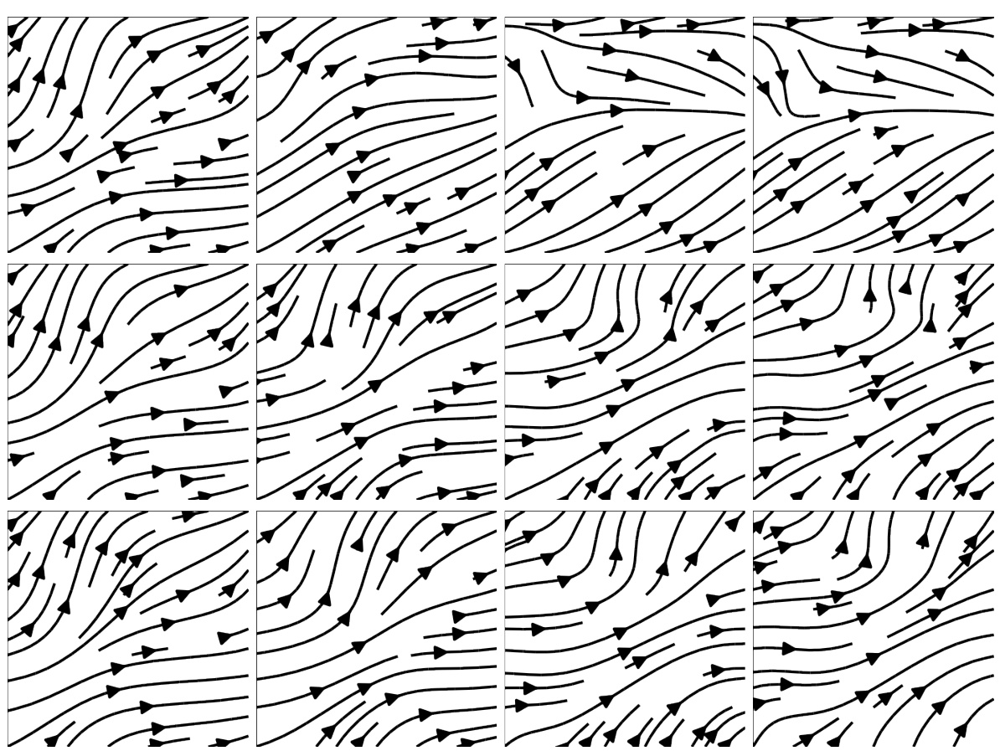  
Figure 8: Streamplots showing the velocity field from a Physics Informed Neural Network $(t o p)$ ,our method ( middle ) vs a reference FEM solution ( bottom ). While both models minimize the loss effectively and fit the initial conditions, the PINN fails to learn the correct evolution of the velocity.  

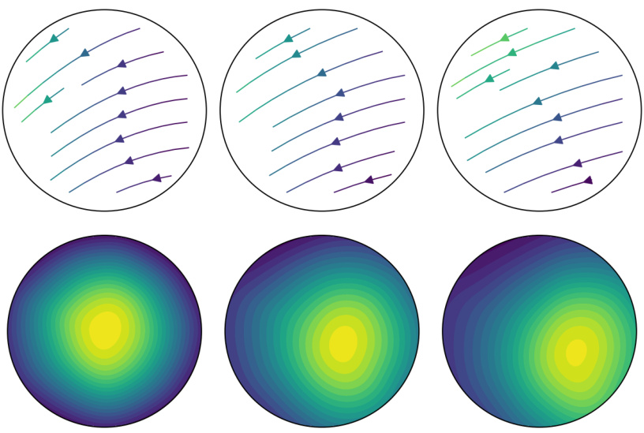  
(a) Curl Model: Flow (top) and Density (bottom) at $t=0,0.25,0.5$  

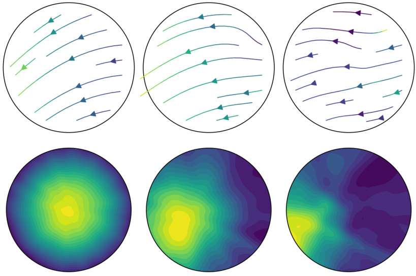  
(b) Our model (NCL): Flow (top) and Density (bottom) at $t=0,0.25,0.5$  

Figure 9: Larger version of comparison shown in Section 5.2 . While our model fits the initial conditions and convects the density along the flow lines as expected, the curl model fails to do so.  

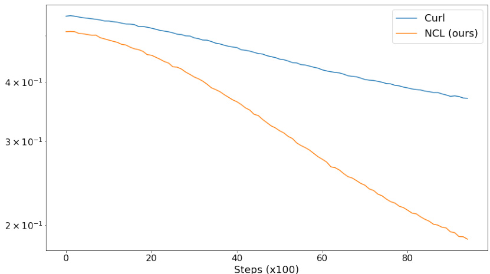  
Figure 10: Training loss for NCL model (ours) plotted against the Curl model, for the 3D unit ball fluid experiment. Both models achieve a similar order of magnitude loss but exhibit qualitatively different results.  