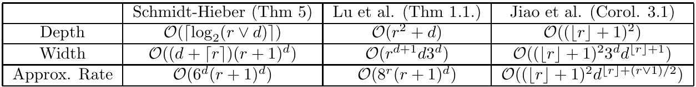
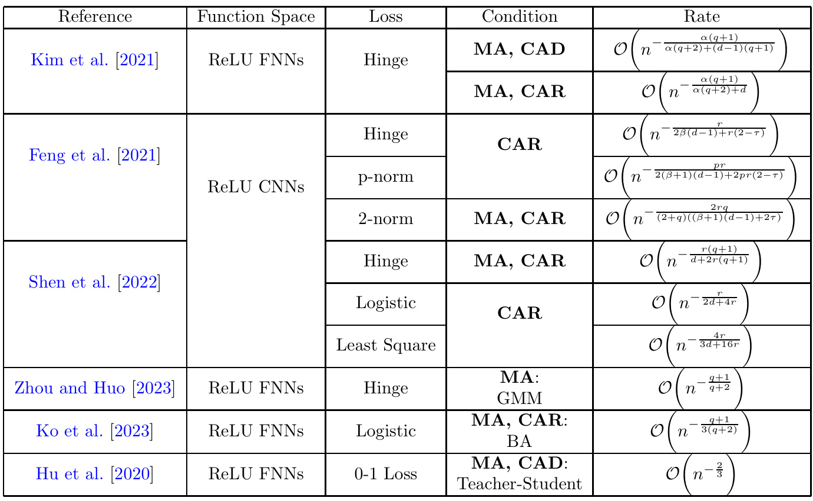
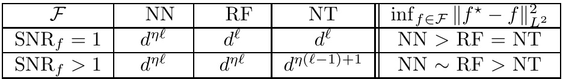
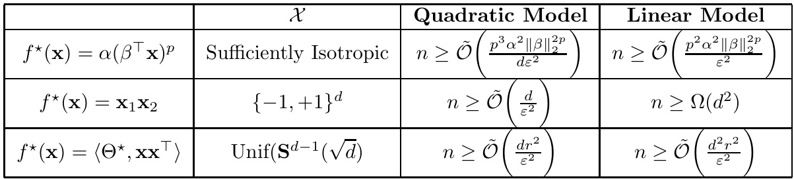
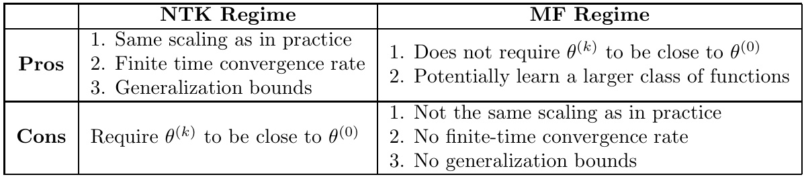
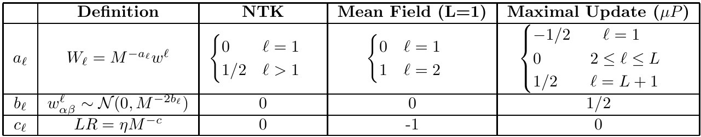
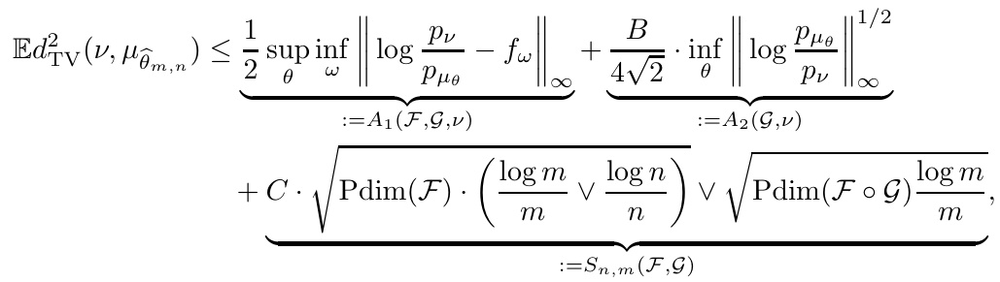
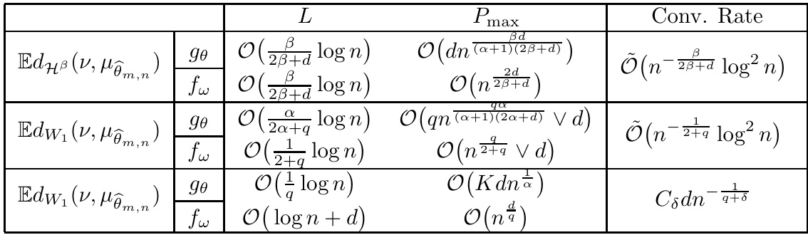

# A Survey on Statistical Theory of Deep Learning: Approximation, Training Dynamics, and Generative Models  

Namjoon Suh and Guang Cheng  

Department of Statistics and Data Science, UCLA  

January 17, 2024  

# Abstract  

In this article, we review the literature on statistical theories of neural networks from three perspectives. In the first part, results on excess risks for neural networks are reviewed in the nonparametric framework of regression or classification. These results rely on explicit constructions of neural networks, leading to fast convergence rates of excess risks, in that tools from the approximation theory are adopted. Through these constructions, the width and depth of the networks can be expressed in terms of sample size, data dimension, and function smoothness. Nonetheless, their underlying analysis only applies to the global minimizer in the highly non-convex landscape of deep neural networks. This motivates us to review the training dynamics of neural networks in the second part. Specifically, we review papers that attempt to answer “how the neural network trained via gradient-based methods finds the solution that can generalize well on unseen data.” In particular, two well-known paradigms are reviewed: the Neural Tangent Kernel (NTK) paradigm, and Mean-Field (MF) paradigm. In the last part, we review the most recent theoretical advancements in generative models including Generative Adversarial Networks (GANs), diffusion models, and in-context learning (ICL) in the Large Language Models (LLMs). The former two models are known to be the main pillars of the modern generative AI era, while ICL is a strong capability of LLMs in learning from a few examples in the context. Finally, we conclude the paper by suggesting several promising directions for deep learning theory.  

# 1 Introduction  

In recent years, the field of deep learning [ Goodfellow et al. ,2016 ], a subdomain of machine learning, has experienced a substantial evolution. Its impact has transcended traditional boundaries, leading to significant advancements in sectors such as healthcare [ Esteva et al. ,2019 ], finance [ Heaton et al. ,2017 ], autonomous systems [ Grigorescu et al. ,2020 ], and natural language processing [ Otter et al. ,2020 ]. Neural networks, the mathematical abstractions of our brain, lie at the core of this progression. Nevertheless, amid the ongoing renaissance of artificial intelligence, neural networks have acquired an almost mythical status, spreading the misconception that they are more art than science. It is important to dispel this notion. While the applications of neural networks may evoke awe, they are firmly rooted in mathematical principles. In this context, the importance of deep learning theory becomes evident. Several key points underscore its significance.  

# 1.1 Why theory is important?  

In this subsection, we aim to emphasize the importance of understanding deep learning within mathematical and statistical frameworks. Following are some key points to consider:  

1. Deep learning is a dynamic and rapidly evolving field, producing hundreds of thousands of publications online. Today’s models are characterized by highly intricate network architectures comprising numerous complex sub-components. Amidst this complexity, it becomes crucial to comprehend the fundamental principles underlying these models. To achieve this understanding, placing these models within a unified mathematical framework is essential. Such a framework serves as a valuable tool for distilling the core concepts from these intricate models, making it possible to extract and comprehend the key principles that drive their functionality.  

2. Applying statistical frameworks to deep learning models allows meaningful comparisons with other statistical methods. For instance, widely used statistical estimators like wavelet or kernel methods can prompt questions about when and why deep neural networks might perform better. This analysis helps us understand when deep learning excels compared to traditional statistical approaches, benefiting both theory and practice.  

3. Hyperparameters, such as learning rate, weight initializations, network architecture choices, activation functions, and batch sizes, significantly influence the quality of the estimated model. Understanding the proper ranges for these hyperparameters is essential, not only for theorists but also for practitioners. For instance, in the era of big data where there are millions of samples in one dataset, the theoretical wisdom gives us the depth of the network should scale logarithmically in sample size for the good estimation of compositional functions [ Schmidt-Hieber ,2020 ].  

In this review, we provide an overview of papers that delve into these concepts within precise mathematical settings, offering readers specific insights into the topics discussed above. Here, we try to avoid too many technicalities and make the introductions accessible to as many statisticians in various fields as possible.  

# 1.2 Roadmap of the paper  

We classify the existing literature on statistical theories for neural networks into three categories.  

1. Approximation theory viewpoint. Recently, there have been a huge collection of works which bridge the approximation theory of neural network models [ Yarotsky ,2017 ,Mhaskar ,1996 ,Petersen and Voigtlaender ,2018 ,Schmidt-Hieber ,2020 ,Montanelli and Du ,2019 ,Blanchard and Bennouna 2022 ,Hornik et al. ,1989 ,Hanin ,2019 ] with the tools in empirical processes [ Van de Geer ,2000 ]to get the fast convergence rates of excess risks both in regression [ Schmidt-Hieber ,2020 ,Hu et al. ,2021 ] and classification [ Hu et al. ,2020 ,Kim et al. ,2021 ] tasks under non-parametric settings. Approximation theory provides useful perspectives in measuring the fundamental complexities of neural networks for approximating functions in certain classes. Specifically, it enables the explicit constructions of neural networks for the function approximations so that we know how the network width, depth, and number of active parameters should scale in terms of sample size, data dimension, and the function smoothness index to get good convergence rates. For simplicity, we mainly consider the works in which the fully connected neural networks are used as the function estimators. These works include Schmidt-Hieber [2020 ], Kim et al. [2021 ], Shen et al. [2021 ], Jiao et al. [2021 ], Lu et al. [2021 ], Imaizumi and Fukumizu [2019 ,2022 ], Suzuki [2018 ], Chen et al. [2019b ], Suzuki and Nitanda [2021 ], Suh et al. [2022 ] under various problem settings. Yet, these works assume that the global minimizers of loss functions are obtainable, and are mainly interested in the statistical properties of these minimizers without any optimization concerns. However, this is a strong assumption, given the non-convexity of loss functions arising from the non-linearities of activation functions in the hidden layers.  

2. Training dynamics viewpoint. Under this context, understanding the landscape of nonconvex loss functions for neural network models and its implications on the generalization capabilities of neural networks becomes the next step in the literature. For example, a seminal empirical finding [ Zhang et al. ,2021 ] reveals that sufficiently overparameterized neural network models trained by stochastic gradient descent can fit the (noisy) data or even random noise perfectly but at the same time they can still generalize well. Among the many important discoveries on the role of overparameterizations such as Arora et al. [2019b ], Jacot et al. [2018 ], revealed that the dynamics of deep neural networks with large enough width, trained via gradient descent (GD) in $\ell_{2}$ -loss, behave similarly to those of functions in reproducing kernel Hilbert spaces (RKHS), where the kernel is associated with a specific network architecture. Many subsequent works study the training dynamics and the generalization abilities of neural networks in the kernel regime under various settings [ Suh et al. ,2021 ,Hu et al. ,2021 ,Nitanda and Suzuki ,2020 ].  

Nonetheless, neural networks have been showing something more than just kernel regression, such as feature learning [ Yang and Hu ,2020 ]. This capability is achievable by permitting the network parameters to deviate significantly from their initial values, a freedom not afforded by the kernel regime. Many researchers try to fill in this gap [ Ghorbani et al. ,2020b ,Wei et al. ,2019 ], proving the statistical superiorities of neural networks over networks in kernel regime, yet still restricting the possible travelable distances of network parameters.  

Another important line of work tries to explain the learning dynamics of neural nets in a different regime, referred to as the Mean-Field (MF) regime. In this regime, the network parameters have the flexibility to deviate significantly from their initial values, even though it necessitates an infi- nite width. Finally, we conclude this section by introducing an unifying framework Yang and Hu [2020 ] for the kernel and MF regime, which gives us a comprehensive understanding of how the choices of weight initializations and scalings of learning rates in gradient-based methods can affect the dynamics of neural networks in its infinite width limit.  

3. Generative modeling. In this section, we review the most recent theoretical advancements in generative models including Generative Adversarial Networks (GANs) ,Diffusion Models , and Incontext learning in Large Language Models (LLMs) . Over the past decade, GANs [ Goodfellow et al. 2014 ] have stood out as a significant unsupervised learning approach, known for their ability to learn the data distributions and efficiently sample the data from it. In this review, we will introduce papers that studied statistical properties of GANs [ Arora et al. ,2017 ,Liang ,2021 ,Chen et al. ,2020a ,Bai et al. ,2018 ,Zhang et al. ,2017 ,Schreuder et al. ,2021 ]. Recently, another set of generative models, i.e., diffusion model, has shown superior performances in generating very good qualities of synthetic data in various data modalities including image [ Song et al. ,2020 ,Dhariwal and Nichol ,2021 ], tabular data [ Kim et al. ,2022 ,Suh et al. ,2023 ], medical imaging [ M¨uller-Franzes et al. ,2022 ] etc., beating GAN based models by a large margin. However, given the model’s complex nature and its recent introduction in the community, the theoretical reason why it works so well remains vague. Lastly, we will review an interesting phenomenon commonly observed in Large Language Models referred to as In-context learning (ICL). It refers to the ability of LLMs conditioned on prompt sequence consisting of examples from a task (inputoutput pairs) along with the new query input, the LLM can generate the corresponding output accurately. Readers can refer to nice survey papers Gui et al. [2021 ], Yang et al. [2022 ] on the detailed descriptions of methodologies and the applications of GANs, and diffusion models in various domains. For an overview of ICL, see survey by Dong et al. [2022 ] which highlights some key findings and advancements in this direction.  

# 1.3 Existing surveys on deep learning theory  

To our knowledge, there are three existing survey papers [ Bartlett et al. ,2021 ,Fan et al. ,2021 ,Belkin ,2021 ] on deep learning theory. There is an overlap in certain subjects covered by each of the papers, but their main focuses are different. Bartlett et al. [2021 ] provided a comprehensive and technical survey on statistical understandings of deep neural networks. In particular, the author’s focus was on examining the significant influence of over-parametrization in neural networks, which plays a key role in enabling gradient-based methods to discover interpolating solutions. These methods introduce implicit regularization, as discussed in Neyshabur [2017 ], or lead to a phenomenon known as benign overfitting Bartlett et al. [2020 ]. Fan et al. [2021 ] introduced the most commonly employed neural network architectures in practice such as Convolutional Neural Net (CNN), Recurrent Neural Networks (RNN), and training techniques such as batch normalization, dropout from statistical viewpoints. A brief introduction to the approximation theory of neural networks is provided as well. Similarly as Bartlett et al. [2021 ], Belkin [2021 ] reviewed the role of overparametrizations for implicit regularization and benign overfitting observed not only in neural network models but also in classic statistical models such as weighted nearest neighbor predictors. Most notably, they provided intuitions on the roles of the overparametrizations of non-convex loss landscapes of neural networks through the lens of optimization.  

# 2 Excess Risk Bounds for Neural Networks  

We briefly outline fully connected networks, which are the main object of interest throughout this paper. From a high level, deep neural networks can be viewed as a family of nonlinear statistical models that can encode highly nontrivial representations of data. The specific network architecture $(L,{\bf p})$ consists of a positive integer $L$ , called the number of hidden layers , and a width vector $\mathbf{p}:=$ $(\mathbf{p}_{0},\dots,\mathbf{p}_{L+1})\in\mathbb{N}^{L+2}$ . A full ected neural network with architecture $\tilde{f}$ is then any function of the form for the input feature x∈X :  

$$
\tilde{f}:\mathcal{X}\to\mathbb{R},\quad\mathbf{x}\to f(\mathbf{x})=W_{L}\sigma W_{L-1}\sigma W_{L-2}\dots\sigma W_{1}\mathbf{x},
$$  

where $\mathbf{W}_{i}\in\mathbb{R}^{p_{i+1}\times p_{i}}$ is a weight matrix with $\mathbf{p}_{0}=d$ ,$\mathbf{p}_{L+1}=1$ and $\mathbf{v}_{i}\in\mathbb{R}^{p_{i}}$ is a shift vector.  

Network functions are built by alternating matrix-vector multiplications with the action of the nonlinear activation function $\sigma$ . Let $\lVert\mathbf{W}_{j}\rVert_{0}$ and $|\mathbf{v}_{j}|_{0}$ be the number of nonzero entries of $\mathbf{W}_{j}$ and $\mathbf{v}_{j}$ in the $j^{\mathrm{th}}$ hidden layer. The final form of neural network we consider is given by:  

$$
\mathcal{F}(L,\mathbf{p},\mathcal{N}):=\bigg\{\tilde{f}\mathrm{~of~the~form~}(1):\sum_{j=1}^{L}\|\mathbf{W}_{j}\|_{0}+|\mathbf{v}_{j}|_{0}\leq\mathcal{N}\bigg\}.
$$  

Here, the complexity of networks is mainly measured through the three metrics: (1) the width denoted $a s\textbf{p}$ , (2) the depth, denoted as $L$ , and (3) the number of active parameters, denoted as $\mathcal{N}$ of the network. See Anthony and Bartlett [1999 ] for in-depth discussions on these metrics.  

# 2.1 Preliminary Problem Setting  

Regression Task. Let $\mathcal{X}$ and $\mathcal{V}\subset\mathbb{R}$ be the measurable feature space and output space. We denote $\rho$ as a joint probability easure on the product space $\mathcal{Z}:=\mathcal{X}\!\times\!\mathcal{Y}$ , and let $\rho_{\mathcal{X}}$ be the marginal distribution of the feature space X. We assume that the noisy data set $\mathcal{D}:=\{(\mathbf{x}_{i},\mathbf{y}_{i})\}_{i=1}^{n}$ are generated from the non-parametric regression model  

$$
\begin{array}{r}{\mathbf{y}_{i}=f_{\rho}(\mathbf{x}_{i})+\varepsilon_{i},\quad i=1,2,\ldots,n,}\end{array}
$$  

where the noise $\varepsilon_{i}$ is assumed to be centered random variable and $\mathbb{E}(\varepsilon_{i}|\mathbf{x}_{i})=0$ . Our goal is to estimate the regression function $f_{\rho}(\mathbf{x})$ with the given noisy data set $\mathcal{D}$ . Here, it is easy to see regression function $f_{\rho}:=\mathbb{E}(\mathbf{y}|\mathbf{x})$ is a minimizer of the population risk $\mathcal{E}(f)$ under $\ell_{2}$ -loss defined as:  

$$
\begin{array}{r}{\mathcal{E}(f):=\mathbb{E}_{(\mathbf{x},\mathbf{y})\sim\rho}\bigg[\big(\mathbf{y}-f(\mathbf{x})\big)^{2}\bigg].}\end{array}
$$  

However, since the joint distribution $\rho$ is unknown, we cannot find $f_{\rho}$ directly. Instead, we solve the following empirical risk minimization problem induced from the dataset $\mathcal{D}$ :  

$$
\widehat{f}_{n}=\operatorname*{arg\,min}_{f\in\mathcal{F}(L,\mathbf{p},\mathcal{N})}\mathcal{E}_{D}(f):=\operatorname*{arg\,min}_{f\in\mathcal{F}(L,\mathbf{p},\mathcal{N})}\bigg\{\frac{1}{n}\sum_{i=1}^{n}\big(\mathbf{y}_{i}-f(\mathbf{x}_{i})\big)^{2}\bigg\}.
$$  

Note the function estimator is taken from the feedforward neural network hypothesis space $\mathcal{F}(L,\ensuremath{\mathbf{p}},\mathcal{N})^{1}$ defined in ( 2 ), nd we denote the em mizer of s$\widehat{f_{n}}$ goal ate the regression function f$f_{\rho}$ via feed-forward network ∈F . Here, f$f_{\rho}(\mathbf{x})$ ) is frequently assumed to be in certain function classes such as H¨older (i.e., H$\mathcal{H}^{r}(\mathcal{X},K)\,,$ X)) or Sobol (i.e., $W_{r}^{p}(\mathcal{X})$ X) for 1 $1\leq p\leq\infty$ ≤≤∞ ) spaces. The notation $r(>0)$ represents the smoothness of functions, Kdenotes the radius of H¨older ball, and $p$ denotes the $L_{p}$ -norm used to measure magnitude of function derivatives. For more rigorous definitions of function classes, readers can refer Schmidt-Hieber [2020 ], Yarotsky [2017 ].  

Decomposition of Excess risk. The excess risk is an important statistical object measuring the stance between the ground-truth function $f_{\rho}$ and function estimator via neural networks ${\widehat{f_{n}}}\in{\mathcal{F}}$ .Mathematically, it can be shown that the excess risk is a difference between population risks of f$f_{\rho}$ and $\widehat{f}_{n}$ . We will be going to review the papers that utilize the following decomposition of the excess risk:  

$$
\mathcal E(\widehat f_{n})-\mathcal E(f_{\rho})\leq\frac{\mathrm{Complexity~Measure~of~}\mathcal F}{n}+\frac{\mathrm{Approx.~Error}}{\sqrt{n}}+\mathrm{Approx.~Error^{2}}.
$$  

Proof for the above decomposition can be found in Suh et al. [2022 ]. In the bound of excess risk, it should be noted that there is a trade-offbetween the “Approximation error” and the combinatorial Complexity measure” of a neural network class $\mathcal{F}$ ; that is, the richer the network hypothesis space Fbecomes, th finer the approximation result we get. Nonetheless, the arbitrary increase in the hypothesis space Feventually leads to the increase of the bound in excess risk. It should be noted that the specifications (i.e., the choices of $(L,\mathbf{p},\mathcal{N}))$ of the network architecture affect the tension between these two terms, and give us the good convergence rate for the excess risk.  

Approximation error and complexity measure. The exact mathematical definition of the approximation error is as follows:  

$$
\varepsilon_{\mathrm{Apprx}}:=\operatorname*{sup}_{f_{\rho}\in\mathcal{G}}\operatorname*{inf}_{f\in\mathcal{F}(L,\mathbf{p},N)}\left\|f-f_{\rho}\right\|_{L^{p}},
$$  

where the sup is taken over the function class $\mathcal{G}$ and $1\,\leq\,p\,\leq\,\infty$ . In this paper, unless otherwise specified, $\varepsilon_{\mathrm{Apprx}}$ should be understood as a uniform approximation error with $p=\infty$ .  

There are many complexity measures on $\mathcal{F}(L,\mathbf{p},\mathcal{N})$ including VC-dimension (i.e., ${\mathrm{VCdim}}({\mathcal{F}})_{.}^{!}$ ), pseudo-dimension (i.e., $\operatorname{Pdim}({\mathcal{F}}))$ ), or covering number (i.e., $\operatorname{Cov}(\mathcal{F})$ ). An portant result on ${\mathrm{VCdim}}({\mathcal{F}})$ and $\operatorname{Pdim}({\mathcal{F}})$ is provided from the paper Bartlett et When Fis a ReLU fully-connected network with $\sigma(x)=\operatorname*{max}(x,0)$ , in the regime where L$L\ll\mathcal{N}^{0.99}$ ≪N , the paper provides the tight bounds on the VC- and pseudo-dimension which are given as:  

$$
\operatorname{VCdim}({\mathcal{F}}),\operatorname{Pdim}({\mathcal{F}})\asymp{\mathcal{O}}{\bigl(}L{\mathcal{N}}\log({\mathcal{N}}){\bigr)}.
$$  

Here, the notation $\asymp$ denotes the asymptotic equivalence. Another interesting metric for the complexity measure on $\mathcal{F}$ is a covering number. Most notably, Lemma 5 in Schmidt-Hieber [20 ves the bound for uniform covering number on $\mathcal{F}$ . Denote $V:=\Pi_{\ell=0}^{L+1}(p_{\ell}+1)$ + 1). Then, for any δ > 0, the covering entropy bound under uniform metric is given as:  

$$
\begin{array}{r}{\log\mathrm{Cov}(\mathcal{F})\leq(\mathcal{N}+1)\log\big(2\delta^{-1}(L+1)V^{2}\big).}\end{array}
$$  

An essential assumption on the network structure to get the above result is the boundedness on the parameter space, requiring the maximum absolute entries of $\mathbf{W}_{j}$ and $\mathbf{v}_{j}$ for $j\in[L]$ are bounded by 1. In Schmidt-Hieber [2020 ], the key idea for proving the result is to utilize the Lipschitzness of the network output with respect to the weight parameters. Naturally, for the discretizations of the parameter space, the boundedness assumption is required. Nonetheless, the boundedness assumption is difficult to impose computationally and also can limit the approximation power of neural networks. (Readers can refer Farrell et al. [2021 ] for further discussions on the impracticality of boundedness assumption.) It should be noted that the boundedness assumption can be eliminated if the pseudodimension is used for the complexity measure, i.e., Farrell et al. [2021 ], Suh et al. [2022 ], Liang [2021 ].  

# 2.2 Non-parametric Regression via fully-connected networks  

In this subsection, literature reviews on the convergence rate of excess risk for neural networks under non-parametric regression tasks are given. The works introduced in this paper are based on the decomposition ( 5 ) Among the extensive list of papers to be introduced shortly, the seminal work Schmidt-Hieber [2020 ] paved the way for this line of research. Under the boundedness assumption on the parameter, the author constructed a sparse fully-connected network $\bar{f}\in\mathcal{F}(L,\mathbf{p},\mathcal{N})$ that approximates $f_{\rho}\in\mathcal{H}^{r}(\mathcal{X},K)$ , where $\mathcal{X}:=[0,1]^{d}$ .  

Theorem 2.1. (Theorem 5 in Schmidt-Hieber [2020 ]) For any $r$ -H¨older function $f_{\rho}\in\mathcal{H}^{r}([0,1]^{d},K)$ and any integers $m\geq1$ and $N\geq(r{+}1)^{d}\vee(K{+}1)e^{d}$ , there exists a ReLU neural network $\ddot{f}\in\mathcal{F}(L,\mathbf{p},\mathcal{N})$ with $L\asymp m$ ,$\mathbf{p}_{\operatorname*{max}}\lesssim N$ and $\mathcal{N}\lesssim N m$ such that the approximation error is bounded as:  

$$
\left\|\tilde{f}-f_{\rho}\right\|_{L^{\infty}([0,1]^{d})}\lesssim N2^{-m}+N^{-\frac{r}{d}}.
$$  

The above bound has two components. The first term corresponds to approximating the first $\lfloor r\rfloor$ -order Taylor expansion of $f_{\rho}$ and the second term corresponds to approximating the remainder term of the expansion. The integer $m\geq1$ is involved with the depth of the network. The boun the width $N$ has an exponential dependence on the data dimension $d$ , and this makes the term N$N^{-\frac{r}{d}}$ most Θ decays exponentially fast in the smoothness parameter. The dense fully-connected neural networks have $\Theta\left(N^{2}m\right)$ $\Theta\big(N m\big)$ number of non-zero active parameters parameters. In this sense, the neural network has a sparse structure only requiring at $\mathcal{N}$ . It is worth noting that the approximation error decreases exponentially fast as the network goes deeper. However, a very deep neural network doesn’t guarantee good generalizability in light of decomposition ( 5 ) as the bound for uniform covering entropy in ( 7 ) increases linearly in $m$ . With the proper choices on $N$ and ${\boldsymbol{r}}n$ , combining the results from ( 5 ) and ( 7 ) yie pirical risk minimizer $\widehat{f_{n}}$ in ( 4 ) can achieve minimax rate for the excess risk, which is O${\mathcal{O}}(n^{-2r/(2r+d)})$ ) in Donoho and Johnstone [1998 ].  

Avoid the Curse of Dimensionality. However, the minimax rate can be very slow under highdimensional input such as images, and this cannot explain the empirical success of deep neural networks. Motivated by this, it is natural to assume that the regression function $f_{\rho}$ has a special structure; that is, the regression function $f_{\rho}$ to be estimated by ( 2 ) has a hierarchical compositional structure:  

$$
f_{\rho}=g_{q}\circ g_{q-1}\circ g_{q-2}\circ\cdot\cdot\circ g_{0},
$$  

with $g_{i}:[a_{i},b_{i}]^{d_{i}}\rightarrow[a_{i+1},b_{i+1}]^{d_{i+1}}$ . Denote by $g_{i}=(g_{i j})_{j=1,\ldots,d_{i+1}}^{\mathrm{T}}$ the components of $g_{i}$ and let $t_{i}$ be the maxima mber of variables on which each of the $g_{i j}$ depends on. This setting leads to $t_{i}\leq d_{i}$ .Each of the $d_{i+1}$ components of $g_{i}$ belongs to $r_{i}$ -H¨older class. Finally, the underlying function space to be considered is  

$$
\begin{array}{r l}&{\mathcal{G}(q,\mathbf{d},\mathbf{t},\mathbf{r},K):=\big\{f_{\rho}=g_{q}\circ g_{q-1}\circ\cdots\circ g_{0}:g_{i}=(g_{i j})_{j}:[a_{i},b_{i}]^{d_{i}}\rightarrow[a_{i+1},b_{i+1}]^{d_{i+1}},}\\ &{\qquad\qquad\qquad g_{i j}\in\mathcal{H}^{r_{i}}([a_{i},b_{i}]^{t_{i}},K),\quad\forall|a_{i}|,|b_{i}|\leq K\big\},}\end{array}
$$  

where $\mathbf{d}:=(d_{0},\ldots,d_{q+1}),\,\mathbf{t}:=(t_{0},\ldots,t_{q})$ , and $\mathbf{r}:=(r_{0},\ldots,r_{q})$ . By Juditsky et al. [2009 ], Ray and Schmidt-Hieber [2017 ], importantly, the induced-smoothness on $f_{\rho}$ is driven as follows:  

$$
r_{i}^{\star}:=r_{i}\prod_{\ell=i+1}^{q}\big(r_{\ell}\wedge1\big),\quad\forall i\in\{0,\ldots,q\}.
$$  

mi In Theorem 3 of imax optimal rate over th Schmidt-Hieber class [$\mathcal{G}(q,\mathbf{d},\mathbf{t},\mathbf{r},K)$ 2020 ], it is proven that the rate in the interesting regi $\phi_{n}:=\operatorname*{max}_{i=0,\ldots,q}n^{-\frac{2r_{i}^{\star}}{2r_{i}^{\star}+t_{i}}}$ e$t_{i}\leq\operatorname*{min}\mathopen{}\mathclose\bgroup\left(d_{0},\ldots,d_{i-1}\aftergroup\egroup\right)$ ⋆−is the for all i . This regime avoids the ti ’s being larger than the input dimension d$d_{0}$ . Under this setting on the regre tr p that t empirical risk minimizer $\widehat{f}_{n}\in\mathcal{F}(L,\mathbf{p},\mathcal{N})$ with $L\asymp\log n$ ≍,$\mathbf{p}_{\operatorname*{max}}\asymp n^{C}$ ≍with $C\geq1$ ≥1 and N ≍ $\mathcal{N}\asymp n\phi_{n}\log n$ such that it achieves the nearly minimax optimal rate, i.e., $C^{\prime}\phi_{n}L\log^{2}n$ for the convergence on the excess risk. The constant factor C′depends on $q,\mathbf{d},\mathbf{t},\mathbf{r},K$ . Importantly, they proved a classic statistical method such as Wavelet cannot achieve the minimax rate, showing the superior adaptiveness of neural networks for estimating $f_{\rho}\in\mathcal{G}(q,\mathbf{d},\mathbf{t},\mathbf{r},K)$ .  

Several remarks follow in the sequel. First, the rate $\phi_{n}$ is dependent on the effective dimension $t_{i}$ which can be much less than the ambient dimension $d_{0}$ , and this implies that the neural net can circumvent the curse of dimensionality. Second, the depth $L$ should be chosen to scale with the sample size in a rate $\log n$ . Third, the width $\mathbf{p}_{\mathrm{max}}$ can be chosen to be independent of the smoothness indices. Lastly, the result is saying what is important for the statistical performance is not the sample size, but the amount of regularization. This is explicitly reflected through the number of active parameters $N\asymp n\phi_{n}\log n\ll n$ .  

Explicit dependence on din the pre-factor $C^{\prime}$ .After the publication of Schmidt-Hieber [2020 ], FNNs, where a series of wo C$\mathcal{C}^{d}$ furt is a der studied the approximation and estimation of -dimensional cube. Specifically, Ghorbani et al. [$f\,\in\,W_{\infty}^{r}({\mathcal C}^{d})$ 2020a ] poin ∞C) via deep ReLU ed out that the additive function studied in Schmidt-Hieber [2020 ] has an exponential dependence in din the prefactor $C^{\prime}$ of the estimation error, requiring $n\succsim d^{d}$ sample sizes for good convergence rate. Later, Shen et al.  

  

Table 1: A summary of $r$ and $d$ dependences in the prefactors of constructed deep ReLU networks’ depths, widths and approximation rates for approximating the functions $f~\in~W_{\infty}^{r}({\mathcal C}^{d})$ ∈∞Cin Schmidt-Hieber [2020 ], Lu et al. [2021 ], Jiao et al. [2021 ].  

[2021 ] and Lu et al. [2021 ] tracked the explicit dependence on $d$ in the approximation error as well as in the architectural components, (i width ( $\mathcal{W}$ ) and depth $(L)$ ), for approximating $f\,\in\,C({\mathcal{C}}^{d})$ improved the prefactor (i.e., Lipschitz continuous functions on $O(8^{r}(r+1)^{d})$ when it is compared with C$\mathcal{C}^{d}$ ) and $f\in W_{\infty}^{r}({\mathcal C}^{d})$ ∞C), respectively. Specifically, $\mathcal{O}(6^{d}(r+1)^{d})$ from Schmidt-Hieber Lu et al. [2021 ][2020 ] for the approximation error. Most recently, Jiao et al. [2021 ] further improved the prefactor $\mathcal{O}((\lfloor r\rfloor+1)^{2}d^{\lfloor r\rfloor+(r\vee1)/2})$ for approximating $f\in W_{\infty}^{r}({\mathcal C}^{d})$ ∞C). In Table $^{1}$ , comparisons of depths, widths, and approximation rates of the constructed deep ReLU networks in Schmidt-Hieber [2020 ], Lu et al. [2021 ], Jiao et al. [2021 ] are summarized. Along this line of research, Suh et al. [2022 ] showed the deep ReLU net can avoid the curse when the smoothness index $r$ grows in the order of data dimension $d$ ,i.e., $r=\mathcal{O}(d)$ , requiring only $O(d^{2})$ number of active parameters for approximating functions in H¨older spaces defined on a unit sphere.  

Approximation of $f\in W_{\infty}^{r}({\mathcal C}^{d})$ ∞Cvia deep ReLU FNN. Approximation theory of deep ReLU FNN for functions $f\,\in\,W_{\infty}^{r}({\mathcal C}^{d})$ ∞C) has a lengthy history in the literature. Representatively, Mhaskar [1996 ]showed that $f$ can be approximated uniformly within $\varepsilon$ -approximation accuracy with a 1-layer neural networks, network of Yarotsky $O(\varepsilon^{-d/r})$ [neurons and an in 2017 ] showed that Nin networks is bounded by tely differentiable activation function. Later, for deep ReLU $\mathcal{O}(\varepsilon^{-d/r}\log\left(\frac{1}{\varepsilon}\right))$ ), and the depth has the order $\mathcal{O}(\log(\frac{1}{\varepsilon}))$ )). He further proved that $\mathcal{N}$ is lower-bounded by the order O$O(\varepsilon^{-d/r})$ ), which is backed up by the result in DeVore et al. [1989 ]. For $f\in W_{p}^{r}({\mathcal{C}}^{d})$ ) with $1\leq p\leq\infty$ ,Petersen and Voigtlaender [2018 ] showed that there exists a deep ReLU network with bounded and quantized weight parameters, with $O(\varepsilon^{-d/r})$ network size, and with $\varepsilon$ -independent depth for achieving the $\varepsilon$ -accuracy in the $L_{p}$ $O(\varepsilon^{-d/r})$ norm. For approximating functions with bounded weight parameters achieves $f\in W_{\infty}^{r}({\mathcal C}^{d})$ ∞C), Schmidt-Hieber $\varepsilon$ -approximation error in the [2020 ] proved that a network of size $L_{\infty}$ norm.  

Function spaces with special structures. The result of Yarotsky [2017 ] implies that deep ReLU net cannot escape the curse of dimensionality for approximating $f\,\in\,W_{\infty}^{r}({\mathcal C}^{d})$ ∞C). Many papers have demonstrated that the effects of dimension can be either avoided or lessened by considering function spaces different from Sobolev spaces, but defined over $\mathcal{C}^{d}$ . Just to name a few, Mhaskar et al. [2016 ]studied that a function with a compositional structure with regularity $r$ can be approximated by a neural network with $O(\varepsilon^{-2/r})$ neurons within $\varepsilon$ accuracy. Suzuki [2018 ] proved the deep ReLU network with $\mathcal{O}(\varepsilon^{-1/r})$ neurons can avoid the curse for approximating functions in mixed sm th Besov spaces. Chen et al. [2019a ] showed the network size scales as $\mathcal{O}(\varepsilon^{-D/r})$ for app ximating C$C^{r}$ functions, wh they are defined on a Riemannian manifold isometrically embedded in R$\mathbb{R}^{d}$ with manifold dimension Dwith $D\ll d$ .Montanelli and Du [2019 ] and Blanchard and Bennouna [2022 ] showed respectively the deep and shallow ReLU network break the curse for Korobov spaces.  

Estimation rates of excess risk. Many researchers also have tried to tackle how neural networks avoid the curse by considering specially designed function spaces under the non-parametric regression framework. We only provide an incomplete list of them. Such structures include additive ridge functions [ Fang and Cheng ,2022 ], composite function spaces with hierarchical structures [ Schmidt-Hieber ,2020 ,Han et al. ,2022 ], mixed-Besov spaces [ Suzuki ,2018 ], H¨older spaces defined over a lower-dimensional manifold embedded in $\mathbb{R}^{d}$ [Chen et al. ,2022a ]. They all showed the function estimators with neural network architectures can lessen the curse by showing the excess risks stimators are bounded by ${\mathcal{O}}(n^{-2r/(2r+D^{\prime})})$ , where $n$ denotes the size of a noisy dataset and $D^{\prime}\ll d$ ≪is an intrinsic dimension uniquely determined through the characteristics of function spaces when they are compared with the minimax risk ${\mathcal{O}}(n^{-2r/(2r+d)})$ [Donoho and Johnstone ,1998 ] for  

$f\in W_{\infty}^{r}({\mathcal C}^{d})$ ∞C).  

# 2.3 Non-parametric Classification via fully-connected networks  

In this subsection, we consider a binary classification problem via fully-connected networks. Classifiers built with neural networks handle large-scale high-dimensional data, such as facial images from computer vision extremely well, while traditional statistical methods often fail miserably. We will review papers that have attempted to provide theoretical explanations for such empirical successes in high-dimensional classification problems, beyond the existing statistical literature. This is a less studied area than nonparametric regression, although deep learning is often used for classification.  

Binary Classification Task. Let $\{X_{i},Y_{i}\}_{i=1}^{n}$ be i.i.d. rand m pairs of observations, where $X_{i}\in\mathbb{R}^{d}$ an $Y_{i}\,\in\,\{0,1\}$ . Denote $P_{X}$ the probability distribution of Xi and $\pi\,=\,\pi_{X,Y}$ the joint distribution of ( $(X,Y)$ ). In a classification problem, it is of main interest to estimate the decision rule, where it is determined through a set $G$ . In this paper, we assume $G$ is a Borel subset of $\mathbb{R}^{d}$ , where it gives $Y=1$ if $X\in G$ and $Y=0$ if $X\not\in G$ . The misclassification risk associated with $G$ is given by:  

$$
R(G):=P(Y\neq\mathbb{1}(X\in G))=\mathbb{E}[(Y-\mathbb{1}(X\in G))^{2}].
$$  

It is widely known that a Bayes classifier minimizes $R(G)$ denoted as $G_{\pi}^{*}=\{x:\eta^{\star}(x)\geq1/2\}$ {≥}, where $\eta^{\star}(x)\,=\,P(Y\,=\,1|X\,=\,x)$ . However, since we have no information on the joint distribution $\pi$ , it is difficult to directly find the minimizer of $R(G)$ . There are two ways to circumvent this difficulty. Given the data set $\{X_{i},Y_{i}\}_{i=1}^{n}$ , the first method is to directly estimate the set minimizing the empirical risk;  

$$
R_{n}(G)={\frac{1}{n}}\sum_{i=1}^{n}{\big(}Y_{i}-\mathbb{1}(X_{i}\in G){\big)}^{2}.
$$  

denote the minimizer of $R_{n}(G)$ as ${\widehat{G}}_{n}$ e second m ssion function, $\widehat{\eta}(\boldsymbol{x})$ setting b), and then plug in the re i ed in how fast b$\widehat{\eta}(\boldsymbol{x})$ ) to the set $R(\widehat{G}_{n})$ Gbdenoted as ) converges to $\widehat{G}_{n}:=\{x\in\mathbb{R}^{d}:\widehat{\eta}(x)\geq1/2\}$ b$R(G_{\pi}^{*})$ {) as ∈n→∞ b. Note that these two ≥}. Under these approaches are different in the sense that they impose different assumptions to derive the convergence rate of $R(\widehat{G}_{n})$ ) to $R(G_{\pi}^{*})$ ).  

Now, we state three assumptions commonly imposed on the joint distribution $\pi$ .  

1. Complexity A ssumption on the Decision set (CAD) characterizes the smoothness of boundary of Bayes classifier $G_{\pi}^{\star}(\subset\mathcal{G})$ ⊂G ) by assuming the class $\mathcal{G}$ has a suitably bounded $\epsilon$ -entropy.   
2. Complexity A ssumption on the Regression function (CAR) refers the regression function $\eta^{\star}(x)$ is smooth enough and belongs to a function class $\Sigma$ having a suitably bounded $\epsilon$ -entropy.   
3. Margin A ssumption (MA ) describes the behavior of $\eta^{\star}(x)$ near the decision boundary (i.e., $\eta^{\star}(x)=1/2$ ). Specifically, the assumption parameter $q(\geq0)$ describes how much the regression is bounded away from $1/2$ . The larger the $q$ is, the farther $\eta^{\star}(x)$ is bounded away from $1/2$ .  

For those who are interested in rigorous treatments of each assumption, we refer readers Mammen and Tsybakov [1999 ], Tsybakov [2004 ], Audibert and Tsybakov [2007 ] and references therein. Note that, in general, there is no connection between assumptions (CAR) and (CAD). Indeed, the fact that $G^{*}$ has a smooth boundary does not imply that $\eta^{\star}(x)$ is smooth, and vice versa. However, as noted by Audibert and Tsybakov [2007 ], the smoothness of $\eta^{\star}(x)$ and (MA) parameter $q$ cannot be simultaneously large; as the smooth $\eta^{\star}(x)$ hits the level $1/2$ , it cannot ”take off” from this level too abruptly.  

Results on Neural Networks. The table summarizes the settings and results of the works that study the convergence rates of excess risks for binary classification problems of neural networks. Hereafter, $\alpha\,>\,0$ indicates the smoothness index of either target function class ( $\Sigma$ ) in CAR or boundary class ( $\mathcal{G}$ ) in CAD, and $q>0$ denotes the term in the exponent in Margin Assumption (MA). The first notable paper Kim et al. [2021 ] proved that under the smooth boundary (CAD) and smooth regression (CAR) conditions, respectively, there exist neural networks that achieve (nearly) optimal convergence rates of excess risks. The obtained rate under CAR assumption is sub-optimal in a sense Tsybakov [2004 ] as they prove the minimax optimal rate achievable by neural nets is $\mathcal{O}\big(n^{-\alpha(q+1)/[\alpha(q+2)+(d-1)q]}\big)$ ,and the optimal rate under CAD assumption is achievable. According to their remark, no other estimators achieve fast convergence rates under these scenarios simultaneously.  

  

Two recent works studied the binary classification by ReLU convolutional neural networks Feng et al. [2021 ], Shen et al. [2022 ]. The paper Feng et al. [2021 ] con ed the $p$ -norm loss $\phi(t):=\operatorname*{max}\{0,1\!-\!t\}^{p}$ for $p\geq1$ , and the input data is supported on the sphere S$S^{d-1}$ . In the paper, the approximation error bounds and excess risk bounds are derived under a varying power condition, and the target function class is the Sobolev space $W_{p}^{r}(S^{d-1})$ ) for $r>0$ and $p\geq1$ . Technically, they obtained the approximation error in $L^{p}$ norm including the case $p=\infty$ . Two quantities including $\beta=\operatorname*{max}\{1,(d\!+\!3\!+\!r)/(2(d\!-\!1))\}$ and $\tau\in[0,1]$ are involved in the rate. The paper Shen et al. [2022 ] established the convergence rates of the excess risk for classification with a class of convex loss functions. The target function of interests is also from the Sobolev space $W_{p}^{r}([0,1]^{d})$ ), and note that the feature domain is $[0,1]^{d}$ . Under this setting, the most interesting aspect of this work is that they track the dependencies of the ambient dimension $d$ in the pre-factor hidden in the big$\scriptscriptstyle\mathcal{O}$ notation. They showed the prefactor is polynomially dependent on d. This should be contrasted to the introduced works in the subsection 2.2 , which have exponential dependences in the prefactor.  

The last three works in the above table give the dimension-free rates in the exponent of $n$ under different problem settings. The paper Zhou and Huo [2023 ] recently appeared on arXiv and studied the problem of learning binary classifiers through ReLU FNNs. An interesting aspect of this result is that unlike the other results Kim et al. [2021 ], Feng et al. [2021 ], Shen et al. [2022 ], the rate is both dimension and smoothness index free, despite the feature domain being unbounded. The main idea for getting this result is to leverage the fact that Gaussian distributions of features are analytic functions and have a fast decay rate, and this can be captured through ReLU FNNs. Another paper Ko et al. [2023 ] works on a similar problem but under a different setting. Notably, they are interested in the Barron Approximation (BA) space proposed in Caragea et al. [2023 ]. Unlike the classical Barron space in Barron [1993 ], which is essentially a subset of a set of Lipschitz continuous functions, this space includes even discontinuous functions and hence is more general. The CAR assumption is imposed on the functions in the BA class. They proved that the rate $O(n^{-\frac{q+1}{3(q+2)}})$ ) is achievable through ReLU FNNs for the estimation, and this rate is indeed minimax optimal. Note that the rate is slower than the parameteric rate $n^{-{\frac{1}{2}}}$ by noting the rate ranges from $n^{-{\frac{1}{6}}}$ to $n^{-{\frac{1}{3}}}$ as $q$ varies from 0 to $\infty$ . This is attributed to the setting that the size of the distribution class is large.  

Lastly, a paper Hu et al. [2020 ] studied the convergence rate of excess risk of neural networks under the framework of Mammen and Tsybakov [1999 ]. Specifically, the authors of the paper consider a Teacher-Student framework. In this setup, one neural network, called student net, is trained on data generated by another neural network, called teacher net. Adopting this framework can facilitate the understanding of how deep neural networks work as it provides an explicit target function with bounded complexity. Furthermore, assuming the target classifier to be a teacher network of an explicit architecture might provide insights into what specific architecture of the student classifier is needed to achieve an optimal excess risk. r this setting, the rate of convergence is derived as $\tilde{O}_{d}(n^{-\frac{2}{3}})$ for the excess risk of the empirical 0 $0-1$ −1 loss minimizer, given t t the student network is deeper and larger than the t acher network. The authors use the notation $\Tilde{O}_{d}$ Oto denote the rate is dependent on input dimension din a logarithmic factor. When data are separable, the rate improves to $\tilde{O}_{d}(n^{-1})$ . In contrast, as it has already been shown in Mammen and Tsybakov [1999 ], under CAD assumption, the optimal rate is $\mathcal{O}\bigl(n^{-\alpha(q+1)/[\alpha(q+2)+(d-1)q]}\bigr)$ . Clearly, this rate suffers from “Curse of Dimensionality” but interestingly, coincides with the rate $\tilde{\mathcal{O}}_{d}(n^{-\frac{2}{3}})$ ) when $\alpha=1$ and $\beta\to\infty$ . If we further allow $\alpha\rightarrow\infty$ (corresponding to separable data), the classical rate above recovers $O(n^{-1})$ . The paper also got the rate is un-improvable in a minimax sense by showing that the minimax lower bound has the same order as that of the upper bound (i.e., $\tilde{\mathcal{O}}_{d}(n^{-\frac{2}{3}}))$ )).  

# 3 Overparametrized neural networks  

We consider the following shallow neural network $f_{\mathbf{W}}(\mathbf{x})$ with $M$ number of hidden neurons:  

$$
f_{\mathbf{W}}(\mathbf{x})=\frac{\alpha}{M}\sum_{r=1}^{M}a_{r}\sigma(w_{r}^{\top}\mathbf{x}),
$$  

where $\mathbf{x}\subset\mathcal{X}$ is an input vector, $\{w_{r}\}_{r=1}^{M}$ are the weights in the first hidden layer, and $\{a_{r}\}_{r=1}^{M}$ are the weights in the output layer. Let us denote the p r$\mathbf{W}:=\{(a_{r},w_{r})\}_{r=1}^{M}$ . The network dynamic is scaled with the factor $\frac{\alpha}{M}$ . If the network width (i.e., M) is small, the scaling factor has negligible effects on the network dynamics. But for the wide enough network (i.e., overparametrized setting), the scaling difference yields completely different behaviors in the dynamics. In this review, we will focus on two specific regimes: (1) Neural Tangent Kernel regime [ 2019b ] with $\alpha\,=\,\sqrt{M}$ √, (2) Mean Field regime [ Nitanda and Suzuki Jacot et al. ,2018 ,2017 ,Du et al. ,Chizat and Bach ,2019 ,Arora et al. ,2018 ,,Mei et al. ,2019 ] with $\alpha=1$ . Additionally, we will review a work that gives unifying views on these two regimes.  

In this section, we focus on reviewing the papers that work on $\ell_{2}$ -loss function :  

$$
\mathcal{L}_{\mathbf{S}}\left(\mathbf{W}\right)=\frac{1}{2}\sum_{i=1}^{n}\big(y_{i}-f_{\mathbf{W}}(\mathbf{x}_{i})\big)^{2},
$$  

and we update the model parameters Wthrough the following gradient descent update rule. Let $\mathbf{W}_{0}$ be the initialized weight, and we consider the following gradient descent update rule with step-size $\eta>0$ :  

$$
\mathbf{W}_{(k)}=\mathbf{W}_{(k-1)}-\eta\nabla\mathbf{w}\big({\mathcal{L}}_{S}(\mathbf{W}_{(k-1)})\big),\qquad k\geq1.
$$  

# 3.1 Neural Tangent Kernel Perspective  

Over the past few years, Neural Tangent Kernel (NTK) [ Arora et al. ,2019b ,Jacot et al. ,2018 ,Lee et al. 2018 ,Chizat and Bach ,2018 ] has been one of the most seminal discoveries in the theory of neural networks. The underpinning idea of the NTK-type theory comes from the observation that in a wide-enough neural net, model parameters updated by gradient descent (GD) stay close to their initializations during the training, so that the dynamics of the networks can be approximated by the first-order Taylor expansion with respect to its parameters at initialization; that is, we denote the output of neural network as $f_{\mathbf{W}_{(k)}}(\mathbf{x})\in\mathbb{R}$ with input $\mathbf{x}\in\mathcal{X}$ and model parameter $\mathbf{W}_{(k)}$ updated at $k$ -th iteration of gradient descent, then the dynamics of $f_{\mathbf{W}_{(k)}}(\mathbf{x})$ over $k\geq1$ can be represented as follows:  

$$
f_{\mathbf{W}_{(k)}}(\mathbf{x})=f_{\mathbf{W}_{0}}(\mathbf{x})+\langle\nabla f_{\mathbf{W}_{0}}(\mathbf{x}),\mathbf{W}_{(\mathbf{k})}-\mathbf{W}_{0}\rangle+o(\|\mathbf{W}_{(\mathbf{k})}-\mathbf{W}_{0}\|_{\mathrm{F}}^{2}),
$$  

where $o(||\mathbf{W}_{(\mathbf{k})}-\mathbf{W}_{0}||_{\mathrm{F}}^{2})$ ) is the small random quantity that tends to $0$ as network width gets close to infinity, measuring the distance between updated model parameter and its initialization in Frobenius norm. Specifically, it can be shown $\begin{array}{r}{\|\mathbf{W}_{(\mathbf{k})}-\mathbf{W}_{0}\|_{\mathrm{F}}^{2}\leq\mathcal{O}(\frac{1}{\sqrt{M}})}\end{array}$ ) with sufficiently large enough $M$ . (For instance, see Remark 3 .1 in Du et al. [2018 ].) Under this setting, the right-hand side of ( 12 ) is linear in the network parameter $\mathbf{W}_{(k)}$ . As a consequence, training on $\ell_{2}$ -loss with gradient descent leads to kernel regression solution with respect to the (random) kernel induced by the feature mapping $\phi(\mathbf{x}):=\nabla_{\mathbf{W}_{0}}f(\mathbf{x})$ for all $\mathbf{x}\in\mathcal{X}$ . The inner-product of two feature mappings evaluated at two data points $\mathbf{x}_{i},\mathbf{x}_{j}$ is denoted as $\mathbf{K}^{(M)}(\mathbf{x}_{i},\mathbf{x}_{j}):=\langle\phi(\mathbf{x}_{i}),\phi(\mathbf{x}_{j})\rangle$ for all $1\leq i,j\leq n$ .  

Setting ReLU activation function (i.e., $\sigma(\mathbf{x})\,=\,\operatorname*{max}(\mathbf{x},0))$ , the explicit form of ${\bf K}^{(M)}({\bf x}_{i},{\bf x}_{j})$ is written as follows :  

$$
\mathbf{K}^{(M)}(\mathbf{x}_{i},\mathbf{x}_{j}):=\frac{1}{M}\sum_{r=1}^{M}a_{r}^{2}\mathbf{x}_{i}\mathbf{x}_{j}\mathbb{I}\{w_{r}^{\top}\mathbf{x}_{i}\geq0,w_{r}^{\top}\mathbf{x}_{j}\geq0\}+\frac{1}{M}\sum_{r=1}^{M}\mathbb{I}\{w_{r}^{\top}\mathbf{x}_{i}\geq0,w_{r}^{\top}\mathbf{x}_{j}\geq0\}.
$$  

Note that the $\mathbf{K}^{(M)}(\cdot,\cdot)$ is a random matrix with respect to the initialization $a_{r}$ and ${\bf w}_{r}$ defined over $\mathcal X\times\mathcal X$ . It is shown that it converges to its deterministic limit (i.e., $M\,\rightarrow\,\infty$ ) in probability pointwisely [ Jacot et al. ,2018 ,Arora et al. ,2019b ,Lee et al. ,2018 ] and uniformly [ Lai et al. ,2023 ] over ature space $\mathcal{X}$ . In literature, the limit matrix is named NTK denoted as $\{\mathbf{K}^{\infty}(\mathbf{x}_{i},\mathbf{x}_{j})\}_{1\le i,j\le n}\in$ $\mathbb{R}^{n\times n}$ . Hereafter, we write the ei omposition of $\begin{array}{r}{\mathbf{K}^{\infty}=\sum_{j=1}^{n}\lambda_{j}\mathbf{v}_{j}\mathbf{v}_{j}^{\top}}\end{array}$ , where $\lambda_{1}\geq\cdot\cdot\geq\lambda_{n}\geq0$ ≥· · · ≥ ≥with corresponding eigenvectors $\mathbf{v}_{j}\in\mathbb{R}^{n}$ ∈.  

Many papers have come out in the sequel to tackle the optimization and generalization properties of neural networks in the NTK regime. Notably among them, Du et al. [2018 ] proves the linear convergence of training loss of shallow ReLU networks when the network parameters are updated through gradient descent with fixed step size $\begin{array}{r}{\eta=\mathcal{O}\big(\frac{\lambda_{0}}{n^{2}}\big)}\end{array}$ . Specifically, the authors randomly initialized $a_{r}\sim\mathrm{Unif}\{-1,+1\}$ $\mathbb{E}_{\mathbf{W}\sim\mathcal{N}(0,\mathbb{Z})}\big[\mathbf{x}_{i}\mathbf{x}_{j}\mathbb{I}\{w^{\top}\mathbf{x}_{i}\geq0,w^{\top}\mathbf{x}_{j}\geq0\}\big]$ ∼N I '$\mathbf{w}_{r}\sim\mathcal{N}(0,\mathcal{T})$ ≥≥, and train the '. Here, the linear convergence rate means that the training wfixing the output layer, leading $K^{\infty}({\bf x}_{i},{\bf x}_{j}):=$ loss at $k$ -th gradient descent update decays at a geometric rate with respect to the initial training loss, which is explicitly stated in Theorem 4.1. in Du et al. [2018 ] as:  

$$
\|f_{\mathbf{W}_{(k)}}(\mathbf{x})-\mathbf{y}\|_{2}^{2}\leq\left(1-\frac{\eta\lambda_{n}}{2}\right)^{k}\|f_{\mathbf{W}_{(0)}}(\mathbf{x})-\mathbf{y}\|_{2}^{2}.
$$  

Their result requires the network width $M$ to be in the order of $\begin{array}{r}{\Omega\big(\frac{n^{6}}{\lambda_{n_{-}}}\big)}\end{array}$ , and the decay rate is dependent on the minimum eigenvalue of NTK, $\lambda_{n}$ . Here, for the geometric decay rate, $\lambda_{n}$ needs to be strictly greater than $0$ .  

Afterwards, there have been several attempts to reduce the overparametrization size. One of the works we are aware of is Song and Yang [2019 ] where the authors used matrix Chernoffbound to reduce the width size up to $\begin{array}{r}{M=\Omega\Big(\frac{n^{2}}{\lambda_{n}^{4}}\Big)}\end{array}$ with slightly stronger assumptions than data non-parallel assumption. Several subsequent works Allen-Zhu et al. [2018 ], Du et al. [2019 ], Zou et al. [2018 ], Wu et al. [2019 ], Oymak and Soltanolkotabi [2020 ], Suh et al. [2021 ] extended the results showing the linear convergence of training loss of deep ReLU networks with $L$ -hidden layers. For a succinct comparison of the overparametrized conditions on $M$ derived in aforementioned papers, we direct readers to consult Table 1 in Zou and Gu [2019 ].  

Motivated by the result ( 13 ), researchers further studied the spectral bias of deep neural network models, investigating why the neural dynamics learn the lower frequency components of the functions faster than they learn the higher frequency counterparts. The specific results are stated in terms of eigenvalu $\mu_{1}\,\geq\,\mu_{2}\,\geq\,\ldots$ d corresponding orthonormal eigenfunctions $\phi_{1}(\cdot),\phi_{2}(\cdot),\ldots$ .of integral operator L$\mathcal{L}_{\bf K^{\infty}}$ induced by K$\mathbf{K}^{\infty}$ ∞:  

$$
{\mathcal{L}}_{\mathbf{K}^{\infty}}(f)(\mathbf{x}):=\int_{{\mathcal{X}}}\mathbf{K}^{\infty}(\mathbf{x},\mathbf{y})f(\mathbf{y})\rho(\mathbf{dy}),\quad\forall f\in{\mathcal{L}}^{2}({\mathcal{X}}).
$$  

Specifically, Cao et al. [2019 ], Bietti and Mairal [2019 ] provided the spectral decay rates of $(\mu_{k})_{k}$ for shallow ReLU networks when $x\in S^{d-1}$ equipped with uniform measure $\tau$ (i.e., $\mathbf{x}\sim\mathrm{Unif}(S^{d-1})$ ).  

Proposition 3.1. (Theorem 4 .3 in Cao et al. [2019 ], Proposition 5 in Bietti and Mairal [2019 ]) For the neural tangent kernel corresponding to a two-layer feed-forward ReLU network, the eigenvalues $(\mu_{k})_{k}$ satisfy the following:  

$$
\left\{\begin{array}{l l}{\mu_{0},\mu_{1}=\Omega(1),}\\ {\mu_{K}=0,\quad\mathrm{when~}k\mathrm{~is~odd},}\\ {\mu_{k}=\Omega(k^{-d-1}),\quad k\gg d.}\end{array}\right.
$$  

The decay rate is exponentially fast in input dimension $d$ . An interesting benefit of having a specific decay rate is that we can measure the size of reproducing kernel Hilbert spaces (RKHS) induced from the kernel $\mathbf{K}^{\infty}$ . The slower the decay rate is, the larger the RKHS becomes, allowing higher-frequency information of function to be included in the function space. This can be easily seen through the definition of RKHS in the unit sphere:  

$$
\mathcal{H}^{\infty}:=\Bigg\{f=\sum_{k\ge0,\mu_{k}\ne0}\sum_{j=1}^{N(d,k)}a_{k,j}Y_{k,j}(\cdot)\quad\mathrm{~s.t~}\quad\|f\|_{\mathcal{H}^{\infty}}^{2}=\sum_{k\ge0,\mu_{k}\ne0}\sum_{j=1}^{N(d,k)}\frac{a_{k,j}^{2}}{\mu_{k}}<\infty\Bigg\},
$$  

wh re $Y_{k,j}$ for $j=1,\ldots,\mathcal{N}(d,k)$ are linearly independent spherical harmonic polynomials of degree $k$ in dvariables. (We refer Frye and Efthimiou [2012 ] for more detailed expositions on spherical harmonic polynomials.) The slower the $\mu_{k}$ decays, the higher $k$ -degree polynomials can be included in the $\mathcal{H}^{\infty}$ .  

With the specified eigendecay rates on $\mu_{k}$ , Theorem 4 .2 in Cao et al. [2019 ] proved the spectral bias of neural network training in the NTK regime. Specifically, as long as the network is wide enough and the sample size is large enough, gradient descent first learns the target function along the eigen directions of NTK with larger eigenvalues, and learns the rest components corresponding to smaller eigenvalues:  

$$
\frac{1}{\sqrt{n}}\left\|\mathbf{V}_{k}^{\top}(\mathbf{y}-\widehat{\mathbf{y}}^{(T)})\right\|_{2}\leq\frac{2}{\sqrt{n}}\big(1-\mu_{k}\big)^{T}\left\|\mathbf{V}_{k}^{\top}\mathbf{y}\right\|_{2},
$$  

where $\mathbf{V}_{k}:=(n^{-1/2}\phi_{j}(\mathbf{x}_{i}))_{n\times k}$ . The term $\|\mathbf{V}_{k}^{\top}(\mathbf{y}-\widehat{\mathbf{y}}^{(T)})\|_{2}$ epre en the speed of gradient descent learns the components of target function corresponding to the first keigenvalues. (See Lemma 4 .1 .in Cao et al. [2019 ].) Here, we denote $\mathbf{y}:=(f^{\star}(\mathbf{x}_{1}),\dots,f^{\star}(\mathbf{x}_{n}))$ )) where $f^{\star}$ is a target function. Similary Hu et al. [2019 ] showed that gradient descent learns the linear component of target functions in the early training stage. But crucially they do not require the network to have a disproportionately large width, and the network is allowed to escape the kernel regime later in training.  

Generalization of neural nets in NTK regime. Here, we review some important works that study the generalizabilities of ( 9 ). To the best of our knowledge, Arora et al. [2019a ] provided the first step in understanding the role of NTK in the generalizability of neural nets. Specifically, they showed that for $\begin{array}{r}{M=\Omega(\frac{n^{2}\log(n)}{\lambda_{\operatorname*{min}}})}\end{array}$ ) and $\begin{array}{r}{k\geq\tilde{\Omega}\big(\frac{1}{\eta\lambda_{\mathrm{min}}}\big)}\end{array}$ , the $\ell_{2}$ population loss of $f_{\mathbf{W}_{(k)}}(\mathbf{x})$ is bounded by:  

$$
\begin{array}{r}{\mathbb{E}_{(\mathbf{x},\mathbf{y})\sim\mathcal{D}}\left[(f_{\mathbf{W}_{(k)}}(\mathbf{x})-\mathbf{y})^{2}\right]\leq\mathcal{O}\bigg(\sqrt{\frac{\mathbf{y}^{\top}(\mathbf{K}^{\infty})^{-1}\mathbf{y}}{n}}\bigg).}\end{array}
$$  

Observe the no tor in the bound can be written as $\begin{array}{r}{\mathbf{y}^{\top}(\mathbf{K}^{\infty})^{-1}\mathbf{y}:=\sum_{i=1}^{n}\frac{1}{\lambda_{i}}(\mathbf{v}_{i}^{\top}\mathbf{y})^{2}}\end{array}$ . This implies the projections $\mathbf{v}_{i}^{\top}\mathbf{y}$ that correspond to small eigenvalues λi should be small for good generalizations on unseen data. Indeed, they performed the empirical experiments on MNIST and CIFAR-10 datasets, showing the projections $\{(\mathbf{v}_{i}^{\top}\mathbf{y})\}_{i=1}^{n}$ }sharply drops for true labels $\mathbf{y}$ , whereas the projections are close to being uniform for random labels $\mathbf{y}$ . (See Figure 1 in their paper.)  

However, the bound ( 14 ) is obtained in the noiseless setting and becomes vacuous under the presence of noise. In this regard, under the noisy setting ( 3 ), Nitanda and Suzuki [2020 ] showed that  

$$
\begin{array}{r}{\mathbb{E}\big[\|f_{W_{(T)}}(\mathbf{x})-f^{\star}(\mathbf{x})\|_{L_{2}}^{2}\big]\leq\mathcal{O}\big(T^{-\frac{2r\beta}{2r\beta+1}}\big),}\end{array}
$$  

where $f^{\star}\in\mathcal{L}_{\bf K}^{r}\!\infty\left(\mathcal{L}_{2}(\rho_{\bf x})\right)$ L)) with $r\in[1/2,1]$ . The rate is minimax optimal, which is faster than $\textstyle{\mathcal{O}}({\frac{1}{\sqrt{n}}})$ in Arora et al. [2019a ]. The rate is characterized by two control parameters, $\beta$ and $r$ , where $\beta>1$ controls the complexity of ${\mathcal{H}}^{\infty}$ and $r\,\in\,[1/2,1]$ controls the complexity of subset of ${\mathcal{H}}^{\infty}$ where the target function $f^{\star}$ belongs. Note that there exists an interesting bias-variance trade-offbetween these two quantities $\beta$ and $r$ . For large $\beta$ , the whole space $\mathcal{H}^{\infty}$ becomes small, and the subspace of $\mathcal{H}^{\infty}$ needs to be as large as possible for the faster convergence rate, and vice versa.  

As noted by the following work Hu et al. [2021 ], the rate in ( 15 ) requires the network width to be exponential in $n$ . (They didn’t specify the dependence in the main result, but can be checked in their proof.) The work Hu et al. [2021 ] reduced the size of overparametrization to $\mathring{\Omega}(n^{6})$ when the network parameters are estimated by gradient descent. The paper proved that the overparametrized shallow ReLU networks require $\ell_{2}$ -regularization for GD to achieve minimax convergence rate $O(n^{-\frac{d}{2d-1}})$ ). Note that this result is consistent with ( 15 ) as it is assumed $f^{\star}\in\mathcal{H}^{\infty}$ (i.e., $r=1/2$ ), and $\beta\,=\,{\frac{d}{d-1}}$ (see Lemma 3 .1 .in Hu et al. [2021 ]). Afterward, Suh et al. [2021 ] extended the result to multi-layer −deep ReLU networks in the NTK regime, showing that $\ell_{2}$ -regularization is also required for achieving minimax rate for deep networks.  

# 3.2 Limitations of NTK and Beyond the Kernel Regime  

Despite nice theoretical descriptions on training dynamics of gradient descent in loss functions, Arora et al. [2019b ], Lee et al. [2018 ], Chizat and Bach [1812 ] empirically found significant performance gaps between NTK and actual training. These gaps have been theoretically studied in Wei et al. [2019 ], Allen-Zhu and Li [2019 ], Ghorbani et al. [2020b ], Yehudai and Shamir [2019 ] which established that NTK has provably higher generalization error than training the neural net for specific data distributions and architectures. Here, we introduce two works Ghorbani et al. [2020b ], Wei et al. [2019 ].  

1. Ghorbani et al. [2020b ] gives an example of a highly stylized spiked feature model. Consider the case in which $\mathbf{x}=\mathbf{U}\mathbf{z_{1}}+\mathbf{U}^{\perp}\mathbf{z_{2}}$ , where $\mathbf{U}\in\mathbb{R}^{d\times d_{0}}$ ,$\mathbf{U}^{\perp}\in\mathbb{R}^{d\times(d-d_{0})}$ , and $[\mathbf{U}\mid\mathbf{U}^{\perp}]\in\mathbb{R}^{d\times d}$ is an orthogonal matrix. Set the signal dimension $d_{0}=\lfloor d^{\eta}\rfloor$ with $\eta\in(0,1)$ $d_{0}\ll d$ Here, we call $\mathbf{z}_{1}$ a signal feature and $\mathbf{z}_{2}$ a junk feature with the variance $\mathbf{Cov}(\mathbf{z}_{1})\,=\,\mathrm{SNR}_{f}\mathcal{L}_{d_{0}}$ I and ${\bf C o v}({\bf z}_{2})=\mathbb{Z}_{d-d_{0}}$ where $\mathrm{SNR}_{f}=d^{\kappa}$ for $0\leq\kappa<\infty$ . Under this setting, the noisy response has the form $\mathbf{y}=\psi(\mathbf{U}\mathbf{z_{1}})\!+\!\varepsilon$ with $\varepsilon$ some random noises. Note that the response only depends on the signal feature. They derived and compared the number of parameters needed for approximating degree $\ell$ -polynomials in $\mathbf{z_{1}}$ in Neural Network (NN), Random Features (RF), and Neural Tangent (NT) models under different levels of $\mathrm{SNR}_{f}$ :  

  

shallow $\begin{array}{r}{f_{N N}(\mathbf{x},a,\mathbf{W})\,=\,\sum_{r=1}^{M}a_{r}\sigma(\langle w_{r},\mathbf{x}\rangle)}\end{array}$ ) for $a_{r}\ \in\ \mathbb{R}$ ∈and w$w_{r}\ \in\ \mathbb{R}^{d}$ ∈, and RF (resp. NT) are a collection of linear functions $f_{R F}(\mathbf{x},a)\;=\;$ $\begin{array}{r}{\sum_{r=1}^{M}a_{r}\sigma(\langle w_{r}^{0},\mathbf{x}\rangle)}\end{array}$ P⟨⟩) for a $a_{r}\in\mathbb{R}$ ∈. (resp. f$\begin{array}{r}{f_{N T}(\mathbf{x},\mathbf{W})=\sum_{r=1}^{M}\langle s_{r},\mathbf{x}\rangle\sigma^{\prime}(\langle w_{r}^{(0)},\mathbf{x}\rangle)}\end{array}$ ⟨⟩⟨⟩) for $s_{r}\in\mathbb{R}^{d}$ .)  

It is interesting to observe that the approximation power of NN models is independent of P$\mathrm{SNR}_{f}$ ,whereas the other two models are affected by it. In their numerical simulation (Figure 2), they also showed larger $\mathrm{SNR}_{f}$ induces the larger approximation power of $\{\mathrm{RF},\,\mathrm{NT}\}$ as manifested in the above table. This is also consistent with the spectral bias of NT models in that the model learns the low-frequency components of functions faster than the high-frequency counterparts.  

2. Wei et al. [2019 ] gives an interesting example of where NTK or any kernel methods are statistically limited, whereas regularized neural networks have better sample complexity. Consider the setting where we have feature space $\mathbf{x}\in\mathbb{R}^{d}$ wth $\mathbf{x}_{i}\sim\{\pm1\}$ and the fu on $\mathbf{f}(\mathbf{x})=\mathbf{x}_{\mathrm{1}}\mathbf{x}_{\mathrm{2}}$ which is only the product of first two arguments of x. We want to learn the f$\mathbf{f}(\mathbf{x})$ ) through functions in NTK-indu $\begin{array}{r}{\mathbf{f}^{\mathrm{NTK}}(a;\mathbf{x})=\sum_{r=1}^{M}a_{r}\mathbf{K}^{\infty}(\mathbf{x}_{r},\mathbf{x})}\end{array}$ ) and two-layer neural networks with ReLU activation f$\begin{array}{r}{{\bf f}^{\mathrm{NN}}(\Theta;{\bf x})\,=\,\sum_{r=1}^{M}a_{r}\sigma(w_{r}^{\top}{\bf x})}\end{array}$ P), respectively. The classifier $\mathbf{f}^{\mathrm{NIK}}(a;\mathbf{x})$ is attained by minimizing squared loss and f$\mathbf{f}^{\mathrm{NN}}(\Theta;\mathbf{x})$ ) is estimated through $\ell_{2}$ -regularized logistic loss. Under this setting, Theorem 2 1 in Wei et al. [2019 ] is read as:  

“Functions $\mathbf{f}^{\mathrm{NIK}}(a;\mathbf{x})$ require $n=\Omega(d^{2})$ samples to learn the problem with error $\ll\Omega(1)$ . In contrast, regularized NN functions $\mathbf{f}^{\mathrm{NN}}(\Theta;\mathbf{x})$ only need $n=\mathcal{O}(d)$ samples.”  

The result implies that there is a $\Omega(d)$ sample-complexity gap between the regularized neural net and kernel prediction function. A main intuition behind this gap is that the regularization allows neural networks to adaptively find the model parameters $(a_{r},w_{r})$ so that the best estimator only chooses 4 neurons in the hidden layer. 3 (Note that the relation between $\ell_{2}$ -regularized two-layer neural network and $\ell_{1}$ -SVM over ReLU features is known in literature Neyshabur et al. [2014 ].) However, using the NTK, we do a dense combination of existing features as the network output will always involve $\sigma(w^{\top}\mathbf{x})$ where $w$ is a random vector so it includes all the components of $\mathbf{x}$ .  

Beyond the kernel regime. The above two works explained the superiority of neural networks over the networks in the NTK regime under some highly stylized settings. There also have been several theoretical attempts [ Bai and Lee ,2019 ,Allen-Zhu et al. ,2019 ] to explain how the networks estimated through gradient-based methods generalize well to the unseen data but critically do not rely on the linearization of network dynamics. The paper Bai and Lee [2019 ] studied the optimization and generalization of shallow networks with smooth activation function $\sigma(\cdot)$ via relating the network dynamics $f_{\mathbf{W}}(\mathbf{x})$ with higher-order approximations. The key idea is to find the subset of $\textbf{W}:=$ $\{(a_{r},w_{r})\}_{r=1}^{M}$ such that the dominating term in Taylor expansion ( 12 ) is not the linear term (i.e., $\left\langle\nabla f_{\mathbf{W}_{0}}(\mathbf{x}),\mathbf{W}-\mathbf{W}_{0}\right\rangle)$ but a quadratic term (i.e., $\lVert\mathbf{W}-\mathbf{W}_{0}\rVert_{\mathrm{F}}^{2}\)$ ). The authors find such $\mathbf{W}$ by running SGD on the tailored-regularized loss:  

$$
\mathbb{E}_{\Sigma,(\mathbf{x},\mathbf{y})\sim\mathcal{D}}\bigg[\ell(\mathbf{y},f_{\mathbf{W}_{0}+\Sigma\mathbf{W}_{r}}(\mathbf{x}))\bigg]+\lambda\|\mathbf{W}\|_{2,4}^{8}.
$$  

The expectation in loss is taken over the diagonal matrix $\Sigma$ with $\Sigma_{r r}\sim\mathrm{Unif}\{-1,1\}$ over $r\in[M]$ and it has the effects of dampening out the linear term. The regularizer ∥·∥ $\|\cdot\|_{2,4}^{8}$ controls the distance of moving weights to be $\mathcal{O}(M^{-1/4})$ . The authors showed the landscape of optimization problem ( 16 ) has a very nice property that every second-order stationary point of the loss is nearly global optimum, despite the non-convexity of ( 16 ). These points can be easily found by the SGD algorithm. Given that $M$ is sufficiently large enough, i.e., $M\gtrsim n^{4}$ , they further provided the comparisons of sample complexities between quadratic and linear models under three different scenarios. The ground truth functions estimated in the three scenarios are (1) $f^{\star}({\bf x})=\alpha(\beta^{\top}{\bf x})^{p}$ $\alpha\in\mathbb R$ ,$\beta\in\mathbb{R}^{d}$ , and $p=1$ or even. (2) $f^{\star}({\bf x})={\bf x}_{1}{\bf x}_{2}$ , and (3) $f^{\star}({\bf x})=\langle\Theta^{\star},{\bf x}{\bf x}^{\prime}\rangle$ where Θ $\Theta^{\star}\,\in\,\mathbb{R}^{d\times d}$ ∈is a rank$r$ matrix. We summarize the results in the below table.  

  

In all three cases, it is shown that the lower bound of sample complexity of the quadratic model is smaller than that of the linear NTK model by the factor of $\tilde{\mathcal{O}}(d)$ . This can mean that the expressivity of the higher-order approximation of neural dynamics is richer than that of the linear counterpart.  

# 3.3 Mean-Field Perspective  

A “mean-field” viewpoint is another interesting paradigm to help us understand the optimization landscape of neural network models. Recall that neural network dynamics in the Mean-Field (MF) regime corresponds to $\alpha=1$ in ( 9 ). The scaling difference between NTK (i.e., $\alpha=\sqrt{M}$ √) and MF (i.e., $\alpha=1$ ) not only leads to entirely distinct neural network behaviors during the training stages of GD or SGD but also influences the scope of viable mathematical analysis. We summarize the differences in comparison Table 2 .  

The term mean-field comes from an analogy with mean field models in mathematical physics, which anthe stochastic behavior of many identical particles Ryzhik [2023 ]. Let us denote $\theta_{r}:=(a_{r},w_{r})\in$ $\mathbb{R}^{d+1}$ ,$\sigma_{\star}({\bf x},\theta_{r}):=a_{r}\sigma(w_{r}^{\top}{\bf x})$ ) in ( 9 ). Weight pairs $\{\theta_{r}\}_{r=1}^{M}$ are considered as a collection of gas particles in $\mathcal{D}$ -dimensional spaces with $\mathcal{D}:=d+1$ . We consider there are infinitely many gas particles allowing $M\rightarrow\infty$ which yields the following integral representation of neural dynamics:  

$$
\frac{1}{M}\sum_{r=1}^{M}\sigma_{\star}(\mathbf{x};\theta_{r})\xrightarrow{M\rightarrow\infty}\int\sigma_{\star}(\mathbf{x};\theta)\rho(d\theta),
$$  

where $\theta_{r}\sim\rho$ for $r=1,\hdots,M$ . The integral representation ( 17 ) is convenient for the mathematical analysis as it is linear with respect to the measure $\rho$ . For instance, see Bengio et al. [2005 ].  

Under this tting, the seminal work Mei et al. [2018 ] studied the evolution of particles $\theta^{(k)}\,\in\,\mathbb{R}^{D}$ updated by k-steps of one-pass SGD (training examples are visited once) under $\ell_{2}$ -loss. Interestingly, they proved the trajectories of empir ion $\theta^{(k)}$ enote $\begin{array}{r}{\widehat{\rho}_{k}^{\left(M\right)}:=\frac{1}{M}\sum_{r=1}^{M}\delta_{\theta_{r}^{\left(k\right)}}}\end{array}$ Pweakly converges to the deterministic limit ρ$\rho_{t}\,\in\,\mathcal{P}(\mathbb{R}^{D})$ ∈P ) as k→∞ and M→∞ . The measure $\rho_{t}$ is the solution of the following nonlinear partial differential equation (PDE):  

$$
\begin{array}{r l}&{\partial_{t}\rho_{t}=\nabla_{\theta}\cdot\big(\rho_{t}\nabla_{\theta}\Psi(\theta;\rho_{t})\big),\qquad\Psi(\theta;\rho_{t}):=\mathcal{V}(\theta)+\displaystyle\int\mathcal{U}(\theta,\bar{\theta})\rho_{t}(d\bar{\theta}),}\\ &{\qquad\mathcal{V}(\theta):=-\mathbb{E}\{\mathbf{y}\sigma_{\star}(\mathbf{x};\theta)\},\qquad\qquad\mathcal{U}(\theta_{1},\theta_{2}):=\mathbb{E}\{\sigma_{\star}(\mathbf{x};\theta_{1})\sigma_{\star}(\mathbf{x};\theta_{2})\}.}\end{array}
$$  

The above PDE describes the evolution of each particle $(\theta_{r})$ in the force field created by the densities of all the other particles. Denote $\mathcal{R}(\rho_{t}):=\mathbb{E}[(y-f(\mathbf{x};\rho_{t}))^{2}]$ , then we have  

$$
\operatorname*{sup}_{0\leq t\leq T}\left|\mathcal{R}(\rho_{t})-\mathcal{R}_{M}(\rho_{\lfloor t/\varepsilon\rfloor})\right|\leq e^{C(T+1)}\cdot\sqrt{\frac{1}{M}\vee\varepsilon}\cdot\sqrt{D+\log\frac{M}{\varepsilon}}.
$$  

The condition for the bound to vanish to $0$ is (1) $M\gg D$ , (2) $\begin{array}{r}{\eta:=\frac{\varepsilon}{2}\ll\frac{1}{D}}\end{array}$ , and (3) PDE converges in $T\,=\,\mathcal{O}(1)$ iterations. It is interesting to note that the generic ODE approximation requires the step-size $\eta$ to be less than the order of the total number of parameters in the model (i.e., $\begin{array}{r}{\eta\ll\frac{1}{M D}}\end{array}$ ), whereas in this setting the step-size $\begin{array}{r}{\eta\ll\frac{1}{D}}\end{array}$ should be enough. Also, recall that the number of sample size $n$ is equivalent to the iteration steps $\begin{array}{r}{k:={\lfloor\frac{T}{\varepsilon}\rfloor}}\end{array}$ ⌋of one-pass SGD with $T\,=\,{\mathcal{O}}(1)$ .Then, this means $n=\mathcal{O}(D)\ll\mathcal{O}(M D)$ should be enough for a good approximation. Another notable fact is; in contrast to the kernel regime, the evolution of weights $\theta_{r}$ are non-linear, and in particular, the weights move away from their initialization during training. Indeed under mild assumption, we can show that for small enough step size $\eta$ ,$\begin{array}{r}{\operatorname*{lim}_{M\to\infty}\|\theta^{(k)}-\theta^{(0)}\|_{2}^{2}/M=\Omega(\eta^{2})}\end{array}$ ) in the mean-field regime, while $\begin{array}{r}{\operatorname*{sup}_{t\geq0}\|\theta^{(t)}-\theta^{(0)}\|_{2}^{2}/M=\mathcal{O}(n/(M d))}\end{array}$ )) in the linear regime. See Bartlett et al. [2021 ].  

Despite the nice characterizations of SGD dynamics through DD, still, the bound in ( 19 ) has room for improvement; the number of neurons $M$ is dependent on the ambient data dimension $d$ and the bound is only applicable to the SGD with short convergence iterations $T=\mathcal{O}(1)$ . A follow-up work Mei et al. [2019 ] has attempted to tackle these challenges. Particularly, they proved that there exists a constant $K$ that only depends on intrinsic features of the activation and data distribution, such that with high probability, the following holds:  

$$
\operatorname*{sup}_{0\leq t\leq T}\big|\mathcal{R}(\rho_{t})-\mathcal{R}_{M}(\rho_{\lfloor t/\varepsilon\rfloor})\big|\leq K e^{K(T\eta)^{3}}\bigg\{\sqrt{\frac{\log(M)}{M}}+\sqrt{d+\log(M)}\sqrt{\eta}\bigg\}.
$$  

Table 2: NTK v.s. Mean-Field regimes   

  

A remarkable feature of this boun t as long as $T\eta\,=\,\mathcal{O}(1)$ and $K\,=\,\mathcal{O}(1)$ , the number of neurons only needs to be chosen M$M\gg1$ ≫1 for the mean-field a proximation to be accurate. The condition $T\eta\,=\,\mathcal{O}(1)$ mitigates t e exponential dependence on Tand the bound does not need to scale with the ambient dimension d. Later, researchers from the same group generalize the result into multi-layer settings Nguyen and Pham [2020 ].  

# 3.4 Unifying View of NTK and Mean-Field Regime  

In the previous subsections, we have discussed the dynamics of neural networks in two different regimes; NTK and Mean-Field. Despite both being in overparameterized regimes, differences in the scale of dynamics yield two completely different behaviors. Motivated by this observation, there have been attempts to give a unifying view of these two regimes.  

The first attempt we are aware of is Chen et al. [2020b ]. The motivation of this paper is summarized in the above table, along with the pros and cons of NTK and Mean-Field regimes. As mentioned in Table 2 , the caveat of MF analysis lies in its difficulties in obtaining the generalization bound, yet the regime allows the parameters to travel far away from their initializations. The key idea of the paper is to bring in the NTK which requires $\lVert{\boldsymbol{\theta}}^{(k)}-{\boldsymbol{\theta}}^{(0)}\rVert_{2}^{2}$ 2 to be small. Instead, they worked on the probability measure space $\mathcal{P}(\mathbb{R}^{d})$ minimizing the following energy functional, where $\begin{array}{r}{f(\mathbf{x};\boldsymbol{\rho}):=\alpha\int\sigma_{\star}(\mathbf{x};\boldsymbol{\theta})\rho(d\boldsymbol{\theta})}\end{array}$ is the integral representation of neural dynamics in ( 9 ):  

$$
\rho^{\star}:=\underset{\rho\in\mathcal{P}(\mathbb{R}^{d})}{\arg\operatorname*{min}}\bigg\{\frac{1}{n}\sum_{i=1}^{n}\big(\mathbf{y}_{i}-f(\mathbf{x}_{i};\rho)\big)^{2}+\lambda\mathcal{D}_{\mathbf{KL}}(\rho\parallel\rho_{0})\bigg\},
$$  

with a hyper-parameter $\lambda\:>\:0$ . Here, $\rho^{\star}\,\in\,\mathcal{P}(\mathbb{R}^{d})$ is a global minimize (21 )ote that they penalize the KL-divergence between $\rho$ and $\rho_{0}$ instead the distance between θ$\theta^{(k)}$ and θ$\theta^{(0)}$ . The training of the objective functional ( 21 ) is often implemented through the Wasserstein gradient flow Mei et al. [2018 ]. Note that the noisy gradient descent (NGD) corresponds to a discretized version of the Wasserstein gradient flow in parameter space, and it has been extensively studied in Mei et al. [2018 ,2019 ], Chizat and Bach [2018 ] that the NGD algorithm approximates the joint measure $\rho^{\star}$ which is the solution of ( 18 ) with an additional diffusion term.  

Under this setting, Chen et al. [2020b ] showed the generalization bound for the binary classification problem with $0-1$ loss. (i.e., $\ell^{0-1}(y,y^{\prime})\,:=\,\mathbb{1}(y y^{\prime}\,<\,0)$ 0).) Given the target function has the form $\mathbf{y}:=f(\mathbf{x};\rho_{\mathrm{true}})$ , the generalization bound is given as:  

$$
\begin{array}{r}{\mathbb{E}_{\mathcal{D}}\big[\ell^{0-1}\big(f(\rho^{\star},\mathbf{x}),\mathbf{y}\big)\big]\leq\underbrace{\tilde{\mathcal{O}}\bigg(\sqrt{\frac{\mathcal{D}_{\mathcal{X}^{2}}\big(\rho_{\mathrm{true}}\|\rho_{0}\big)}{n}}\bigg)}_{\mathrm{NTK}\big(\alpha=\mathcal{O}(\sqrt{M})\big)},\quad\underbrace{\tilde{\mathcal{O}}\bigg(\sqrt{\frac{\mathcal{D}_{\mathrm{KL}}\big(\rho_{\mathrm{true}}\|\rho_{0}\big)}{n}}\bigg)}_{\mathrm{MF}\big(\alpha=\mathcal{O}(1)\big)}.}\end{array}
$$  

This implies that when $\alpha$ in ( 9 ) is large, i.e., $\alpha=\mathcal{O}(\sqrt{M})$ √) (resp. $\alpha=\mathcal{O}(1)$ ), two-layer neural networks with infinite width trained by noisy gradient descent (NGD) can learn the function class ${\mathcal{F}}_{\mathcal{X}^{2}}$ (resp. the function class ${\mathcal{F}}_{\mathbf{KL}}$ ). The two function classes are defined as follows:  

$$
{\bar{c}}_{\mathcal{X}^{2}}:={\Bigg\{}\int{\sigma_{\star}(\mathbf{x};\theta)\rho(d\theta):{\mathcal{D}}_{\mathcal{X}^{2}}(\rho\parallel\rho_{0})<\infty}{\Bigg\}},\quad{\mathcal{F}}_{\mathbf{KL}}:={\Bigg\{}\int{\sigma_{\star}(\mathbf{x};\theta)\rho(d\theta):{\mathcal{D}}_{\mathbf{KL}}(\rho\parallel\rho_{0})<\infty}{\Bigg\}}
$$  

  

where $\mathcal{D}_{\mathcal{X}^{2}}(\rho\parallel\rho_{0})$ and $\mathcal{D}_{\mathbf{KL}}(\rho\parallel\rho_{0})$ enote the $\mathcal{X}^{2}$ and KL -divergences between $\rho$ and $\rho_{0}$ , respectively. As KL-divergence is smaller than X$\mathcal{X}^{2}$ distance, it can be checked $F_{\mathcal{X}^{2}}\subsetneq\mathcal{F}_{\mathbf{KL}}$ (a notation $\subsetneq$ denotes a strict subset). This implies that the two-layer neural networks learned through NGD in mean-field scaling can potentially learn a larger class of functions than networks in NTK scaling can learn.  

Another work Yang and Hu [2020 ] provides a unifying framework encompassing the parametrizations that induce the neural dynamics in NTK and MF regimes. Under the heavy overparameterized setting (i.e., the width of the network is very large), the main differences between these two regimes come from the different scales on initialized weight parameters and learning rates in GD or SGD. In the paper, the proposed abc-parameterization provides a guideline on how to choose the scales on these parameters. Specifically, recall the definition of a fully connected network with $L+1$ layers in ( 1 ). In this context, the width of the network remains consistent at $M$ across all layers. The parametrization is given by a set of numbers $\{a\ell,b\ell\}_{\ell}\cup\{c\}$ . The pair $(a_{\ell},b_{\ell})$ controls the scale of initialized weight parameters over the layers, and $c$ is the parameter relevant to the learning rate of SGD.  

The parameterization is given as:  

2. Initialize each $w_{\alpha\beta}^{\ell}\sim\mathcal{N}(0,M^{-2b_{\ell}})$ ).  

3. SGD learning rate is $\eta M^{-c}$ for some width-independent $\eta>0$ .  

Borrowing the paper’s notation, let us denote $\mathbf{x}_{t}^{\ell}(\boldsymbol{\xi})$ ) as the output of the $\ell$ -th hidden layer of fullyconnected network ( 1 ) (after the activation) with the input $\xi\in\mathbb{R}^{d}$ for the $t$ -th SGD updates. The paper defines the difference vector $\Delta\mathbf{x}_{t}^{\ell}(\xi):=\mathbf{x}_{t}^{\ell}(\xi)-\mathbf{x}_{0}^{\ell}(\xi)$ −) for all $\ell\in[L+1]$ with $r$ notation:  

$$
r:=\operatorname*{min}(b_{L+1},a_{L+1}+c)+a_{L+1}+c+\operatorname*{min}_{\ell=1,\ldots,L}[2a_{\ell}-\mathbb{1}(\ell\neq1)].
$$  

Under this setting, they consider the regimes of parameterizations $\{a\ell,b\ell\}\ell\cup\{c\}$ where every coordinate of $\mathbf{x}_{t}^{\ell}(\boldsymbol{\xi})$ ) doesn’t blow-up for every $\ell\,\in\,[L+1]$ . Specifically, the regimes for which $r\,\geq\,0$ when $\Delta\mathbf{x}_{t}^{\ell}(\xi):=\Theta(M^{-r})$ ) are considered. This is in conjunction with the additional linear constraints on $\{a\ell,b\ell\}_{\ell}\cup\{c\}$ where the network outputs at initialization and during training don’t blow-up. (See Theorem 3.2 in Yang and Hu [2020 ] for the detail.) The high-dimensional polyhedron formed through these constraints is referred to as a stable abc-parameterization region in the sense that training through SGD should be stable avoiding the blow-up of network dynamics. They further showed the stable region is divided into two parts where the dynamics change (non-trivial) and doesn’t change (trivial) in its infinite width limit, i.e., $M\,\rightarrow\,\infty$ during training. The non-trivial stable abc-parameterization is possible on the union of the following two faces of the polyhedron:  

$$
a_{L+1}+b_{L+1}+r=1\quad\mathrm{or}\quad2a_{L+1}+c=1.
$$  

In this region, the infinite width limit either (1) allows the embedding of the last hidden layer $\mathbf{x}^{L}(\boldsymbol{\xi})$ to evolve non-trivially with $r=0$ (MF regime) or (2) is described by kernel gradient descent with $r>0$ (NTK regime), but not both.  

The corresponding settings of $(a\ell,b\ell)\cup\{c\}$ for NTK and MF regimes are summarized in the abo etable. They only focus on the scaling with $M$ and ignore dependence on the intrinsic dimension d.The setting for NTK matches with the Theorem 5 in Du et al. [2019 ], where the entries of $W_{\ell}$ is drawn from $\mathcal{N}(0,1/M)$ with width-independent $\eta\,>\,0$ . The reason why we are seeing $a_{\ell}\,=\,0$ for $\ell=1$ in the NTK regime is to ensure that the output of every hidden layer in the network is of constant order so that parameterization is in a stable regime. For the MF regime, Mei et al. [2018 ,2019 ] gives us the width-independent parameterizations for weight initializations and learning rate in shallow neural network. Note that the $\frac{1}{M}$ -scale in the output weight layer ( $\ell\,=\,2$ ) is canceled with the $M$ -scale of learning rate in SGD.  

Although not mentioned in the paper, we conjecture the reason for these manipulations is to put the parameterizations in the MF regime to satisfy the constraints ( 24 ). The $\{a\ell,b\ell\}_{\ell}\cup\{c\}$ pair for NTK satisfies $\textstyle r={\frac{1}{2}}$ , meaning the dynamic is described through kernel gradient descent, whereas the pair for MF satisfies $r=0$ , allowing the feature learning. The authors of this paper showed the feature learning dynamics in the MF regime can be extended to a multi-layer setting, where they call the corresponding parameterizations as Maximal Update parameterization $(\mu P)$ . This parametrization is “Maximal ” in the sense that feature learning is enabled throughout the entire layers in the network in the $\infty$ -width limit. As mentioned in the introduction, feature learning is the essence of modern deep learning making techniques such as transfer learning or fine-tuning in the Large Language Model (LLM) possible, and it is remarkable in the sense that the exact neural dynamics is mathematically tractable under this setting.  

# 4 Statistical Guarantees of Generative Models  

# 4.1 Generative Adversarial Networks (GAN)  

Over the past decade, Generative Adversarial Networks (GANs) [ Goodfellow et al. ,2014 ] have stood out as a significant unsupervised learning approach, known for their ability to learn the data distribution and efficiently sample the data from it. The main goal of GAN is to learn the target distribution $X\sim\nu$ through e adversarial training between a Discriminator and a Genera ere, the generator takes the input Zfrom prior distributions such as Gaussian or Uniform (i.e., Z ∼ ) and the input is push-forwarded by transformation map $g:\mathcal{Z}\to g(\mathcal{Z})$ . In this seminal paper, the distribution of random variable $g(\mathcal{Z})$ is referred to as an implicit distribution $\mu$ . The primary objective of the generator is to produce synthetic data from $\mu$ that closely resembles samples from the target distribution.  

The adversarial training between the discriminator and generator is enabled through optimizing the following minimax problem w.r.t. functions in the generator class $\mathcal{G}$ and discriminator class $\mathcal{F}$ :  

$$
(g^{\star},f^{\star})\in\underset{g\in\mathcal{G}}{\arg\operatorname*{min}}\operatorname*{max}_{f\in\mathcal{F}}\bigg\{\mathbb{E}_{\mathcal{Z}\sim\pi}f(g(\mathcal{Z}))-\mathbb{E}_{X\sim\nu}f(X)\bigg\}.
$$  

In practice, the above expectations can be approximated with $m$ training data from $\nu$ and $n$ drawn samples from $\mu$ . The inner maximization problem in ( 25 ) is an Integral Probability Metric (IPM, M¨uller [1997 ]), which quantifies the discrepancy between two distributions $\mu$ and $\nu$ w.r.t. a symmetric function class, i.e., $f\in{\mathcal{F}}$ , then $-f\in{\mathcal{F}}$ ;  

$$
d_{\mathcal{F}}(\mu,\nu)=\operatorname*{max}_{f\in\mathcal{F}}\bigg\{\mathbb{E}_{x\sim\mu}f(x)-\mathbb{E}_{y\sim\nu}f(y)\bigg\}.
$$  

When $\mathcal{F}$ is taken to be all 1-Lipschitz functions, $d_{W_{1}}(\cdot,\cdot)$ is the Wasserstein-1 stance; when $\mathcal{F}$ is the class of all indicator functions, $d_{\mathrm{TV}}(\cdot,\cdot)$ is the total variation distance; when Fis taken as a class of neural networks, $d_{\mathrm{NN}}(\cdot,\cdot)$ is the “neural net distance” (see Arora et al. [2017 ]). Under this setting, a generator from $\mathcal{G}$ attempts to minimize the IPM between $\mu$ and $\nu$ .  

Generalization of GANs. A question that naturally arises is: “What does it mean for GANs to generalize effectively?” The paper Arora et al. [2017 ] provided a mathematical definition for generalization in GANs.  

Defi n 4.1. Let ${\widehat{\mu}}_{n}$ and $\widehat{\nu}_{m}$ be the empirical distributions of $\mu$ and $\nu$ . For some generalization gap ε > 0, if the following holds with high-probability;  

$$
|d_{\mathcal{F}}(\mu,\nu)-d_{\mathcal{F}}(\widehat{\mu}_{n},\widehat{\nu}_{m})|\leq\varepsilon,
$$  

with $n$ being polynomially dependent in $\varepsilon$ , the divergence $d_{\mathcal{F}}(\cdot,\cdot)$ between distributions generalizes.  

This means that if the absolute discrepancy between population divergence and empirical divergence of $\mu$ and $\nu$ can be arbitrarily controlled with $n$ polynomially generated samples, GAN generalizes well. The same paper proved under this definition, that GAN cannot generalize w.r.t. Wasserstein-1 distance and Jensen-Shannon divergence as $n=\tilde{\mathcal{O}}(\varepsilon^{-\mathrm{poly}(\mathrm{d})})$ is required. But it generalizes well w.r.t. neural net distance with $n=\tilde{\mathcal{O}}(p\log(L)\cdot\varepsilon^{-2})$ where $p$ is the total number of parameters in discriminator neural network and Lis a Lipschitz constant of discriminators w.r.t. parameters.  

Nonetheless, as noted by Chen et al. [2020a ], Zhang et al. [2017 ], Arora et al. [2017 ], this result has some limitations: (1) the sample complexity is involved with unknown Lipschitz constants $L$ of discriminator. (2) A small neural net distance does not necessarily mean that two distributions are close. (Section 3 .4 in Arora et al. [2017 ]) (3) Sample complexity is not involved with the complexity of generator class $\mathcal{G}$ under the assumption that the generator can approximate well enough the target data distribution. (4) No concrete architecture of discriminator networks is given. Some papers Zhang et al. [2017 ], Jiang et al. [2018 ], Bai et al. [2018 ] attempted to address the first two limitations, and their attempts are nicely summarized in Chen et al. [2020a ]. In this review, we introduce works Chen et al. [2020a ], Liang [2021 ] that tackle the issues raised in (3) and (4) concretely through the tools from the approximation theory of neural networks.  

Statistical guarantees of GANs. Note that the functions in discriminator and generator classes can be either classical non-parametric regressors such as random forests, local polynomial, etc., or can be both parametrized by neural networks. Here, we focus on the latter case which is more commonly used. Specifically, let us denote $\mathcal{F}:=\,\{f_{\omega}(\cdot)\,:\,\mathbb{R}^{d}\,\rightarrow\,\mathbb{R}\}$ as the Discriminator class and ${\mathcal{G}}\,:=\,\{g_{\theta}(z)\,:\,\mathbb{R}^{d}\,\rightarrow\,\mathbb{R}^{d}\}$ as the Generator class with $\omega$ and $\theta$ being denoted as network parameters of respective classes, and we are interested in estimating the parameters by minimizing following optimization problem:  

$$
(\widehat{\theta}_{m,n},\widehat{\omega}_{m,n})\in\underset{\theta:g_{\theta}\in\mathcal{G}}{\arg\operatorname*{min}}\ \underset{\omega:f_{\omega}\in\mathcal{F}}{\operatorname*{max}}\ \biggr\{\widehat{\mathbb{E}}_{m}f_{\omega}(g_{\theta}(\mathcal{Z}))-\widehat{\mathbb{E}}_{n}f_{\omega}(X)\biggr\},
$$  

where $\widehat{\mathbb{E}}_{m}(\cdot)$ (resp. $\widehat{\mathbb{E}}_{n}(\cdot)$ ) denotes the empirical expectation with $m$ generator samples. (resp. $n$ target samples.)  

Summary of L21 ]Given that the optimal param ters of gene $\widehat{\theta}_{m,n}$ in ( 28 ) can be obtained, Liang [2021 ] studied how well the implicit distribution estimator µ$\mu_{\widehat{\theta}_{m,n}}$ (i.e., distribution of random variable $g_{\widehat{\theta}_{m,n}}(Z))$ )) is close to the target distribution νin a Total Variation distance. Under the assumption that discriminator functions are uniformly bounded (i.e., $\|f_{\omega}\|_{\infty}\le B)$ ), they provide the following approximation-stochastic error decomposition based oracle inequality read as :  

  

where $C>0$ is an universal constant independent on $n$ ,$m$ ,$\operatorname{Pdim}({\mathcal{F}})$ and $\operatorname{Pdim}({\mathcal{F}}\circ{\mathcal{G}})$ .  

The first approximation error $A_{1}({\mathcal{F}},{\mathcal{G}},\nu)$ measures how well the discriminator approximates the log density ratio of $\nu$ over $\mu_{\theta}$ . The second approximation error $A_{2}(\mathcal{G},\nu)$ reflects the expressiveness of the generator. Lastly, the statistical error $S_{n,m}(\mathcal{F},\mathcal{G})$ describes the statistical complexities of both the generator and discriminator. For the fixed $\nu$ , the increased complexities of $(\mathcal{G},\,\mathcal{F})$ leads $A_{2}(\mathcal{G},\nu)$ to decrease, $S_{n,m}(\mathcal{F},\mathcal{G})$ to increases, but $A_{1}(\mathcal{F},\mathcal{G},\nu)$ may increase, decrease or not change, as $A_{1}({\mathcal{F}},{\mathcal{G}},\nu)$ is max over $\theta$ and min over $\nu$ . Due to the term $A_{1}$ , a classical U-shaped picture for bias-variance tradeoffno longer exists, but the author showed that having a two-dimensional tuning domain (as discriminator-generator-pair is a user-specified parameter) can even potentially give rise to better rates.  

Specifically, by choosing $f_{\omega}\in\mathcal{F}_{D}$ in the following function space :  

$$
\mathcal{F}_{D}:=\{\log(p_{\nu})-\log(p_{\mu_{\theta}}):\mathrm{~for~all~}\nu\in\mathcal{D}_{R},\quad\mu_{\theta}\in\mathcal{D}_{G}\},
$$  

and given that the generator distribution class is in a sense that $\mathcal{D}_{\nu}\subseteq\mathcal{D}_{G}$ , then the TV bound reduces to $\mathbb{E}d_{\mathrm{TV}}^{2}(\nu,\mu_{\widehat{\theta}_{m,n}})\leq S_{n,m}(\mathcal{F},\mathcal{G})$ ) as A $A_{1}=A_{2}=0$ = 0. A crucial assumption required to find the neural networks $g_{\theta}(z)$ and $f_{\omega}$ such that $A_{1}=A_{2}=0$ is the target distribution $\nu$ should be exactly realizable by the invertible generator, i.e., all the weight matrices and activation functions should be invertible. Under this assumption, Theorem 19 in Liang [2021 ] proved the existence of $(g_{\theta}(z),f_{\omega})$ pairs satisfying the bound:  

$$
\mathbb{E}d_{\mathrm{TV}}^{2}\big(\nu,\mu_{\widehat{\theta}_{m,n}}\big)\leq\sqrt{d^{2}L\log(d L)\bigg(\frac{\log m}{m}\vee\frac{\log n}{n}\bigg)}.
$$  

In the rate ( sult allows the very deep network as 29 ), $L$ and $d$ are the depth and width of the generator networks, respectively. This re$L\leq\sqrt{n\wedge m/\log(n\vee m)}$ p∧∨). It is worth oting that the generator requires the width of the network to be the same as the input dimension dso that the invertibility condition on the generator is satisfied. As for the discriminator, it can be constructed by concatenating two networks that have the same architecture as the one from the generator, and with the additional two layers, i.e., network $f_{\omega}$ has $L+2$ layers. The $g\theta$ and $f_{\omega}$ used leaky ReLU and dual leaky ReLU as activation functions respectively for their invertibility. However, this invertibility condition is often violated in practical uses of GANs.  

Summary of Chen et al. [2020a ]A subsequent work Chen et al. [2020a ] provides more flexible network architectures for $g\theta$ and $f_{\omega}$ without requiring the invertibility condition on generator and activation function, i.e., the authors consider ReLU activation function. The paper mainly focuses on three interesting scenarios where they impose structural assumptions on target distribution $\nu$ :  

1. The target distribution $\nu$ is assumed to have a $\alpha(>0)$ -H¨older density $p_{\nu}$ with respect to Lebesgue measure in $\mathbb{R}^{d}$ , and the density is lower-bounded away from 0 on a compact convex subset $\mathcal{X}\subset\mathbb{R}^{d}$ .  
2. The target distribution $\nu$ is supported on the low-dimensional linear subspace of the data domain $\mathcal{X}\subset\mathbb{R}^{d}$ . Specifically, it is assume subspace is spanned by the orthonormal basis of $\mathbb{R}^{q}$ where $q\ll d$ .Let us denote A $A\,\in\,\mathbb{R}^{d\times q}$ ∈whose columns are the orthonormal basis. The pushforwarded distribution $A_{\sharp}^{\top}\nu$ ’s density function is assumed to belong to $\alpha$ -H¨older class with finite radius.   
3. The target distribution $\nu$ is supported on $\mathcal{X}\subset[0,1]^{d}$ being the low-dimensional nonlinear $K$ -mixture components. Each component is assumed to be a pushforward distribution of a $q$ -dimensional uniform distribution on $[0,1]^{q}$ with $q\ll d$ , i.e., $\mu_{k}:=(g_{k})_{\sharp}\mathcal{U}([0,1]^{q})$ . The pushforward function $g_{k}$ belongs to $\alpha_{k}$ -H¨older class for $\alpha_{k}\geq1$ ,$\forall k\in\lfloor K\rfloor$ . ( $\alpha:=\operatorname*{max}\alpha_{K}$ .)  

In the first scenario, the dis iminator class $\mathcal{F}$ is assumed to be $\beta$ -H¨older class for $\beta\,>\,1$ . In the second and third scenarios, Fis considered to be a collection of 1-Lipschitz functions, where the IPM in ( 26 ) becomes Wasserstein-1 distance. The paper mainly considers the case where there are infinitely many samples from the generator class and the empirical expectation in ( 28 ) is replaced with the real expectation. Under this setting, convergence rates of the expected IPM under the above three scenarios are given. Furthermore, authors provided the explicit order of $(L,\mathbf{p},\mathcal{N})$ -tuple [recall ( 2 )] of the generator and discriminator networks with respect to the parameters in each scenario. We summarize the results in the below table. For simplicity, we only present the orders of depth $L$ and maximal width $P_{\mathrm{max}}$ of networks over the hidden layers.  

In the first scenario, the exponential dependence on $d$ cannot be avoided as the minimax lower bound for estimating the distribution of density in $\mathcal{H}^{\alpha}$ under $\mathcal{H}^{\beta}$ IPM is known to be $\mathcal{O}\big(n^{-\frac{\alpha+\beta}{2\alpha+d}}+n^{-\frac{1}{2}}\big)$ as pointed by Tang and Yang [2022 ]. The result in the second scenario indicates GANs can avoid the curse of being adaptive to the unknown low-dimensional linear structures of data. Note that the obtained rate is much faster than the parametric rate $n^{-{\frac{1}{2}}}$ . Whereas the real-world data centered in the low-dimensional linear subspace are rare, mixture data are commonly observed in practice, i.e., MNIST data or images in CIFAR-10. In the third scenario, observe the rate is linearly dependent on $d$ and exponentially dependent on $q$ . This implies that GANs are capable of capturing nonlinear data’s intrinsic structures encoded by $g_{k}$ ’s. Here, $\delta$ is any positive number, and $C_{\delta}>0$ is a universal constant independent of $n$ . It is interesting to see the depth $L$ for $g\theta$ and $f_{\omega}$ for all scenarios have ${\mathcal{O}}(\log n)$ factors, implying the depth of network should be increased logarithmically in sample siz $n$ .In contrast, to Liang [2021 ], the widths of networks are not the same with the input dimension d, a sufficient condition for the invertibility of the generator.  

  

# 4.2 Score-based diffusion models  

Score-based diffusion model consists of two processes. The first step, forward process , transforms data into noise. Specifically, the score-based diffusion model Song et al. [2020 ] uses the following stochastic differential equations (SDEs) [ S¨arkk¨a and Solin ,2019 ] for data perturbation:  

$$
\begin{array}{r}{d\mathbf{x}=f(\mathbf{x},t)d t+g(t)d W_{t},}\end{array}
$$  

where $f(\mathbf{x},t)$ and $g(t)$ are drift and diffusion coefficient, respectively, and $W_{t}$ is a standard Wienerprocess (a.k.a. Brownian Motion) indexed by time $t\in[0,T]$ . Here, the $f$ and $g$ functions are userspecified, and Song et al. [2020 ] suggests three different types of SDEs, i.e., variance exploding (VE), variance preserving (VP), and sub-variance preserving (sub-VP) SDEs for data perturbation. Allowing diffusion to continue long enough with $T$ being sufficiently large, it can be shown the distribution of $\mathbf{x}_{t}$ ically, when converges to some easy-to-sample distributions $f:=-\mathbf{x}_{t}$ and $g:={\sqrt{2}}$ √2, ( 30 ) is known as Ornstein-Uhlenbeck (OU) process, it is proven $\pi$ such as normal or uniform distributions. Specif$p_{t}\,:=\,\mathrm{Law}(\mathbf{x}_{t})\,\rightarrow\,\pi$ with $\pi$ being normal, exponentially fast in 2-Wasserstein distance. See for instance Bakry et al. [2014 ]. However, despite this convergence result, it is analytically difficult to know the exact form of $p_{T}$ , and it is often replaced by the $\pi$ in practice when starting the reverse process.  

The second step, reverse process , is a generative process that reverses the effect of the forward process. This process learns to transform the noise back into the data by reversing SDEs in ( 30 ). Through the Fokker-Planck equation of marginal density $p_{t}(\mathbf{x})$ for time $t\in[t_{0},T]$ , the following reverse SDE [ Anderson ,1982 ] can be easily derived:  

$$
d\mathbf{x}=\left[f(\mathbf{x},t)-g(t)^{2}\nabla_{\mathbf{x}}\log p_{t}(\mathbf{x})\right]d t+g(t)d\bar{W}_{t}.
$$  

Here, the gradient of $\log{p_{t}(\mathbf{x})}$ w.r.t to the perturbed data ${\mathbf x}(t)$ is referred to as score function, $d t$ in ( 31 )is an infinitesimal negative time step, and $d\bar{W}_{t}$ is a Wiener-Process running backward in time, i.e., $t:T\rightarrow t_{0}$ . In practice, $t_{0}$ is usually chosen to be a small number close to $0$ , but not too close to 0 to prevent the blow-up of the score function. There are various ways to solve ( 31 ). The most commonly used method is the discretization scheme such as Euler-Maruyama , or the theory-driven method such as probability-flow . See Song et al. [2020 ] for more detailed expositions on these methods. The papers introduced in this paper focus on the discretization scheme, and readers can refer Chen et al. [2023b ]for the recent theoretical understandings of the probability flow in the diffusion model.  

The score function, $\nabla_{\mathbf{x}}\log p_{t}(\mathbf{x})$ , is approximated by a time-dependent score-based model $\mathbf{S}_{\theta}(\mathbf{x}(t),t)$ which is parametrized by neural networks in practice. The network parameter θis estimated by  

$$
\theta^{\star}:=\arg\operatorname*{min}_{\theta}\mathbb{E}_{t\sim\mathcal{U}[t_{0},T]}\mathbb{E}_{\mathbf{x}(\mathbf{t})|\mathbf{x}(\mathbf{0})}\mathbb{E}_{\mathbf{x}(0)}\bigg[\lambda(t)^{2}\left\|\mathbf{S}_{\theta}(\mathbf{x}(t),t)-\nabla_{\mathbf{x}}\log p_{t}(\mathbf{x}(t)\mid\mathbf{x}(0))\right\|_{2}^{2}\bigg],
$$  

where $\mathcal{U}[t_{0},T]$ is a uniform distribution over $[t_{0},T]$ , and $\lambda(t)(>\,0)$ is a positive weighting function that helps the scales of matching-losses $\|\mathbf{S}_{\theta}(\mathbf{x}(t),t)-\nabla_{\mathbf{x}}\log p_{0t}(\mathbf{x}(t)\mid\mathbf{x}(0))\|_{2}^{2}$ to be in the same order across over the time $t\in[t_{0},T]$ . The transition density $p_{t}(\mathbf{x}(t)\mid\mathbf{x}(0))$ is a tractable Gaussian distribution, and ${\mathbf x}(t)$ can be obtained through ancestral sampling [ Ho et al. ,2020 ].  

Under this setting, we introduce readers to two lines of attempts aimed at finding answers to the following theoretical questions :  

Q1. Can the diffusion model estimate the target distribution $\nu$ via the learned score function? If so, under which conditions on $\nu$ , do we have the polynomial convergence guarantees in generalization error bound $\varepsilon$ measured in TV or Wasserstein distances?  

Q2. Do neural networks well approximate and learn the score functions? If so, how one should choose network architectures and what is the sample complexity of learning? Furthermore, if the data distribution has a special geometric structure, is the diffusion model adaptive to the structure, just as GAN models do?  

The main statistical object of interest in these two lines of research is the generalization bound meaing the distance betwe distribution $\nu$ and estimated distribution ${\widehat{\mu}}_{\theta}$ from the samples $\mathbf{x}_{t_{\mathrm{0}}}$ by solving the reverse SDE in ( 31 ). Here, the score function is substituted by the estimated timedependent neural network $\mathbf{S}_{\theta}(\mathbf{x}(t),t)$ ). The first line of work mainly focuses on the sampling perspective of the diffusion model, given that we have good estimates of the score function. The second line of work extends the attention to the score function approximation through neural networks. Furthermore, under some highly stylized settings, they specify the explicit network structures which give good generalization guarantees.  

Attempts to answer $_{Q I}$ .Early theoretical efforts to understand the sampling of score-based diffusion model suffered from being either not quantitative [ De Bortoli et al. ,2021 ,Liu et al. ,2022 ], or from the curse of dimensionality [ De Bortoli ,2022 ,Block et al. ,2020 ]. Specifically among them, De Bortoli [2022 ] gave the convergence in 1-Wasserstein distance for distributions with bounded support $\mathcal{M}$ . Their case covers the distributions supported on lower-dimensional manifolds, where guarantees in TV or KL distan are unattainable as ther urant $\nu$ ${\widehat{\mu}}_{\theta}$ e the same support set. For manifold general distributio Mand truncation of reverse process bound on $W_{1}(\nu,\widehat{\mu}_{\theta})$ b) have the exponential dependence on the diameter of the t$t_{0}$ as O$\mathcal{O}(\exp(\mathrm{diam}(\mathcal{M})^{2}/t_{0}))$ M)). For smooth distributions where the Hessian ∇$\nabla^{2}\log{p_{t}}$ is available, the bound is further improved with a polynomial dependence on $t_{0}$ with the growth rate of Hessian as $t\rightarrow0$ being on the exponent.  

To the best of our knowledge, Lee et al. [2022 ] first gives the polynomial guarantees in TV distance under $L^{2}$ -accurate score for a reasonable family of distributions. However, their result is based on the assumption that the distribution meets certain smoothness criteria and the log-Sobolev inequality, which essentially confines the applicability of their findings to distributions with a single peak. Recently, two works Lee et al. [2023 ], Chen et al. [2022b ] appear online trying to avoid the strong assumptions on the data distributions and to get the polynomial convergence guarantees under general metrics such as TV or Wasserstein. Specifically, Lee et al. [2023 ] give 2-Wasserstein bounds for any distributions with bounded support. Contrary to De Bortoli [2022 ], Lee et al. [2022 ], the results they provide have polynomial complexity guarantees without relying on the functional inequality on distributions such as log-Sobolev inequality. They further give TV bounds with polynomial complexity guarantees under the Hessian availability assumption. Similarly with Lee et al. [2022 ], under general data distribution assumption, i.e., second moment bound of $\nu$ and $L$ -Lipschtizness of score function, Chen et al. [2022b ]give the polynomial TV convergence guarantee, where only $\tilde{\Theta}\Big(\frac{L^{2}d}{\varepsilon^{2}}\Big)$ discretization is needed. Here, $\varepsilon$ is a TV generalization error, $d$ being a data dimension.  

the second question is short in the literature. One work Chen et al. [2023a ] assumes the data lie on the unknown lower-dimensional linear subspace of $\mathbb{R}^{d}$ ; that is, $\mathbf{x}=A\mathbf{z}$ with $A\,\in\,\mathbb{R}^{d\times D}$ . Here, $\mathbf{z}$ is a latent variable, $D$ is the intrinsic dimension, and $d$ is an ambient dimension with $D\ll d$ . They decompose the true score function into two components, $S_{||}$ that belongs to the column space of $A$ ,and $S_{\bot}$ that is orthogonal to the column space of $A$ . As the closed-form expressions of $S_{||}$ and $S_{\bot}$ can be derived w.r.t. $\mathbf{x}$ and $A$ , they design a very specific network architecture with encoder-decoder structure with a skip-connection. Interestingly, the network structure they design is involved with the sparse fully-connected networks in ( 2 ), and they establish the universal approximation guarantees under $L^{2}$ -accurate score. Here, the network size, $L,\mathbf{p},\mathcal{N}$ in ( 2 ) depends on the intrinsic dimension $D$ thanks to the encoder-decoder architecture. Based on the obtained approximation result on the score function, they prove the convergence rate for squared $L^{2}$ -estimation error to be $\tilde{\mathcal{O}}\big(\frac{1}{t_{0}}n^{-\frac{:2}{D+5}}\big)$ . This corroborates the empirical observations that the diffusion model is adaptive to the data that lies in a lower-dimensional target distribution νin TV and 2-Wasserstein distance. bspace. They further provide the distribution recovery guarantees of bfor the Under a more general setting, another work Oko et al. [2023 ] proves the distribution estimator from the diffusion model can achieve nearly minimax optimal estimation rates. Specifically, they assume the true density is supported on $[-1,1]^{d}$ , in the Besov space with a smooth boundary. The Besov space unifies many general function spaces such as H¨older, Sobolev, continuous, or even noncontinuous function classes. The result in Oko et al. [2023 ] is valid for the non-continuous function class, and this should be contrasted with the aforementioned works Lee et al. [2023 ], Chen et al. [2022b ]where they assume the Lipschitzness of the score function. For Besov spaces with $\boldsymbol{s}$ -smoothness with $s\geq0$ , they prove that the $L^{2}$ -generalization bound of the score network $S_{\theta^{\star}}(\mathbf{x}(t),t)$ over $\textstyle t_{0}=o\big(\frac{1}{n}\big)$ ), and $T\,=\,\mathcal{O}(\log n)$ achieves minimax optimal rate up to the logarithmic factor, i.e., $n^{-\frac{2s}{2s+d}}\log^{18}n$ for recovering the score function of the target distribution $\nu$ . Note that the exact architecture on the score network is given in the form of ( 2 ). The $L,\mathbf{p},\mathcal{N}$ in ( 2 ) is expressed w.r.t. the network parameter $N={\mathcal{O}}(n^{-{\frac{d}{2s+d}}})$ ). Under the obtained network architecture, they further prove that $T V(\nu,{\widehat{\mu}}_{\theta})\asymp{\tilde{\mathcal{O}}}(n^{-{\frac{s}{2s+d}}})$ ) and $W_{1}(\nu,\widehat{\mu}_{\theta})\asymp\tilde{\mathcal{O}}(n^{-\frac{s+1-\delta}{2s+d}})$ ) for any arbitrary fixed $\delta>0$ , whose rates are nearly minimax optimal.  

# 4.3 In-Context Learning in Large Language Model  

We provide readers with recent theoretical understandings on an interesting phenomenon observed in LLM, i.e., In-Context Learning (ICL). It refers to the ability of LLMs conditioned on prompt sequence consisting of examples from a task (input-output pairs) along with the new query input, the LLM can generate the corresponding output accurately. An instance taken from Garg et al. [2022 ], these models can produce English translations of French words after being prompted on a few such translations, e.g.:  

This capability is quite intriguing as it allows models to adapt to a wide range of downstream tasks on-the-fly without the need to update the model weights after training.  

Toward further understanding ICL, researchers formulated a well-defined problem of learning a function class $\mathcal{F}$ from in-context e mples. Form ly, let $D_{\mathcal{X}}$ be a distribution over inputs and $D_{\mathcal{F}}$ be a distribution over functions in F. A prompt Pis a sequence $(x_{1},f(x_{1}),\dots,x_{k},f(x_{k}),x_{\mathrm{query}})$ where inputs (i.e., $x_{i}$ and $x_{\mathrm{{query}}}$ ) are drawn i.i.d. from $D_{\mathcal{X}}$ and $f$ is drawn from $D_{\mathcal{F}}$ . In the above example, it can be understood $\{(x_{1},f(x_{1}),(x_{2},f(x_{2})\}:=\{(\mathrm{maison},\,\mathrm{house}),\,(\mathrm{chat},\,\mathrm{cat})\}$ },$x_{\mathrm{{query}}}\,=\,\mathrm{{chien}}$ , and $f(x_{\mathrm{{query}}})=\mathrm{{dog}}$ . Now, we provide the formal definition of in-context learning.  

Definition 4.2 (In-context learning Garg et al. [2022 ]) .Model $M_{\theta}$ can in-context learn the function class $\mathcal{F}$ up to $\varepsilon$ , with respect to $(\mathcal Ḋ P Ḍ _{\mathcal Ḋ F Ḍ },\mathcal Ḋ D Ḍ _{\mathcal Ḋ X Ḍ })$ , if it can predict $f(x_{\mathrm{query}})$ with an average error  

$$
\mathbb{E}_{P\sim(x_{1},f(x_{1}),\dots,x_{k},f(x_{k}),x_{\mathrm{query}})}\left[\ell(M_{\theta}(P),f(x_{\mathrm{query}}))\right]\le\varepsilon,
$$  

where $\ell(\cdot,\cdot)$ is some appropriate loss function, such as the squared error.  

The paper Garg et al. [2022 ] empirically investigated the ICL of Transformer architecture Vaswani et al. [2017 ] by training the model on random instances from linear functions, two-layer ReLU networks, and decision trees. Here, we omit the definition of Transformer for brevity. Specifically, they showed the predictions of Transformers on the prompt $P$ behave similarly to those of ordinary least-squares (OLS), when the models are trained on the instances from linear function classes ${\mathcal{F}}^{\mathrm{Lin}}:=\{f\ |\ f(x)=w^{\top}x,w\in$ $\mathbb{R}^{d}\}$ for random weights $w\sim\mathcal{N}(0,I_{d})$ . A similar phenomenon was observed for the models trained on sparse linear functions as the predictions behave like those of Lasso estimators.  

These nice observations sparked numerous follow-up theoretical studies of ICL on internal mechanisms Aky¨urek et al. [2022 ], Von Oswald et al. [2023 ], Dai et al. [2022 ], expressive power Aky¨urek et al. [2022 ], Giannou et al. [2023 ] and generalizations Li et al. [2023b ]. Among them, papers Aky¨urek et al. [2022 ], Von Oswald et al. [2023 ] investigated the behavior of transformers when trained on random instances from ${\mathcal{F}}^{\mathrm{Lin}}$ , and showed the trained Transformer’s predictions mimic those of the single step of gradient descent. They further provided the construction of Transformers which implements such a single step of gradient descent update. The recent paper Zhang et al. [2023 ] explicitly proved the model parameters estimated via gradient flow converge to the global minimizer of the non-convex landscape of population risk in ( 33 ) for learning ${\mathcal{F}}^{\mathrm{Lin}}$ . They also provided theoretical explanations on the robustness of trained Transformer to task shift (i.e., $D_{\mathcal{F}}^{\mathrm{traun}}\neq D_{\mathcal{F}}^{\mathrm{test}}$ FDF) and to query shift (i.e., $D_{\mathrm{query}}^{\mathrm{test}}\neq D_{x}^{\mathrm{test}}$ D), but not to the shift in covariate distribution (i.e., $D_{x}^{\mathrm{traun}}\neq D_{x}^{\mathrm{test}}$ D). The behaviors on these different types of shifts are empirically observed in Garg et al. [2022 ]. Nonetheless, the results in the paper are based on a linear self-attention (LSA) layer without softmax non-linearities and simplified parameterizations.  

Later, Huang et al. [2023 ] considered the softmax non-linearity and proved the trained Transformer through gradient descent indeed in-context learn ${\mathcal{F}}^{\mathrm{Lin}}$ . They considered two different scenarios where all the features are equally likely to appear in the prompt (i.e., balanced feature) only one feature appears dominantly and the remaining features are less likely to appear (i.e., imbalanced feature). They showed that Transformers exhibit different training phases based on different types of features. However, this work still considers simplified parameterizations, and features are assumed to be orthonormal with each other, where there still are gaps between theory and practice. One important work Bai et al. [2023 ] showed the existence of Transformers that can implement a broad class of standard machine learning algorithms in-context such as least squares, ridge regression, Lasso, and gradient descent for two-layer neural networks. This paper goes beyond and demonstrates a remarkable capability of a single transformer: the ability to dynamically choose different base in-context learning (ICL) algorithms for different ICL instances, all without requiring explicit guidance on the correct algorithm to use in the input sequence. This observation is noteworthy as it mirrors the way statisticians select the learning algorithms for inferences on model parameters.  

# 5 Topics for Future Works  

However, aside from these topics, several promising avenues have not been covered in this paper. We will briefly introduce some of these to the readers in the hope that they will be further investigated.  

Theory on Synthetic Data. In modern machine learning, data is valuable but often scarce and has been referred to as ”the new oil” , a metaphor credited to mathematician Clive Humby. With the rise of deep generative models like GANs, diffusion models, and LLMs, synthetic data is rapidly filling the void of real data and finding extensive utility in various downstream applications. For instance, in the medical field, synthetic data has been utilized to improve patients’ data privacy and the performance of predictive models for disease diagnosis [ Chen et al. ,2021 ]. Similarly, structured tabular data is the most common data modality that requires the employment of synthetic data to resolve privacy issues [ Suh et al. ,2023 ], missing values [ Ouyang et al. ,2023b ], and accessibilities [ Choi et al. ,2017 ]. Furthermore, Synthetic data has been at the core of building reliable AI systems, specifically for the promising issues in privacy [ Li et al. ,2023a ], fairness [ Zeng et al. ,2022 ], and robustness [ Ouyang et al. ,2023a ]. Despite its prevalence in the real world, the statistical analysis of synthetic data is very limited. In this regard, the important questions that need to be analyzed are:  

Q1 How well the models trained via synthetic data generalize well to real unseen data? (e.g., Xu et al.  

[2023a ])  

Q2 How does artificially generated data help statistical inference in specific tasks, for instance, adversarial training? (e.g., Xing et al. [2022a ,b])  

Q3 How does the synthetic data generated to satisfy certain privacy constraints (e.g., differential privacy Dwork [2008 ]) perform in the various downstream tasks such as classification or regression? (e.g., Li et al. [2023a ], Xu et al. [2023b ])  

Q4 In the downstream task of synthetic data, which task is easier between regression and classification? Can we analyze the performance under the statistical learning framework?  

The setting in Q1 is often referred to as Train on Synthetic and Test on Real (TSTR) framework Esteban et al. [2017 ] in literature for measuring how the synthetic distribution is close to the real distribution. We cite a paper Xu et al. [2023a ] that explored the generalization of synthetic data and proposed key characteristics that an effective synthetic data algorithm should exhibit for creating high-quality datasets for downstream learning tasks. Nonetheless, the statistical aspects of this framework under the name of distribution shift (for instance, see Sugiyama and Kawanabe [2012 ], Ma et al. [2023 ], Pathak et al. [2022 ]) remain somewhat unexplored. Q2, Q3, and Q4 are relevant to the utility of synthetic data in downstream tasks. The motivation for Q4 stems from insights presented in Suh et al. [2023 ], Table 2, which empirically illustrates the greater challenge in achieving strong performance in regression tasks compared to classification tasks.  

Distribution Shift and Robustness. In many machine learning tasks, training and test sets do not come from the same distribution, which is often called a distribution shift in literature. In statistics, the distribution shift is further divided into several sub-categories. Among them, the case when only the feature variables shift but the conditional distribution remains constant is called “Covariate Shift” . Motivating applications include image, text, and speech classification in which the input covariates determine the output labels Sugiyama and Kawanabe [2012 ]. In statistics literature, we are aware of two papers Ma et al. [2023 ], Pathak et al. [2022 ], which study covariate shift under a nonparametric regression setting. In this regard, Ma et al. [2023 ] studied kernel ridge regression estimator achieves minimax rate over the large class of RKHS as long as the source (e.g. training) and target (e.g. test) distributions’ likelihood ratio is uniformly bounded. When compared with likelihood ratio to measure the shift between target and source distributions, the authors of Pathak et al. [2022 ] came up with another measure (integrated ratio of probabilities of balls with fixed radius) for the classical estimator such as Nadaraya-Watson estimator to effectively achieve the minimax rate of excess risk over functions in the H¨older class for regression setting. Despite the rich results in statistics literature, theoretical understandings on this topic are limited in the deep learning context, and some questions can be asked:  

Q1 As discussed in Section 3 , very wide neural networks can be thought of as kernel regressors whose kernels are characterized by their network architectures, and recent paper Yang [2020 ] derived the NTKs of any network architectures. In the framework proposed by Ma et al. [2023 ], an intriguing avenue for investigation lies in assessing the robustness of neural network models with varying architectures against covariate shifts. This exploration involves computing the upper bound of permissible likelihood ratios for different network structures.  

Q2 There are recent findings Ahuja and Lopez-Paz [2023 ] that transformers are robust to mild distribution shifts for the ICL, but the ability disappears for the severe shift. Understanding the fundamental limit of the shift for transformers to exhibit ICL ability is an important task. Without using the NTK framework, there is a recent work Han et al. [2023 ] which studied in-context learning of LLMs in the context of kernel regressors, we conjecture that the theoretical analysis used in Pathak et al. [2022 ], Ma et al. [2023 ] can be utilized for obtaining the threshold limit.  

# References  

Kartik Ahuja and David Lopez-Paz. A closer look at in-context learning under distribution shifts. arXiv preprint arXiv:2305.16704 , 2023.  

Ekin Aky¨urek, Dale Schuurmans, Jacob Andreas, Tengyu Ma, and Denny Zhou. What learning algorithm is in-context learning? investigations with linear models. arXiv preprint arXiv:2211.15661 ,2022.   
Zeyuan Allen-Zhu and Yuanzhi Li. What can resnet learn efficiently, going beyond kernels? Advances in Neural Information Processing Systems , 32, 2019.   
Zeyuan Allen-Zhu, Yuanzhi Li, and Zhao Song. A convergence theory for deep learning via overparameterization. arXiv e-prints , pages arXiv–1811, 2018.   
Zeyuan Allen-Zhu, Yuanzhi Li, and Yingyu Liang. Learning and generalization in overparameterized neural networks, going beyond two layers. Advances in Neural Information Processing Systems , 32: 6158–6169, 2019.   
Brian DO Anderson. Reverse-time diffusion equation models. Stochastic Processes and their Applications , 12(3):313–326, 1982.   
Martin Anthony and Peter L Bartlett. Neural network learning: Theoretical foundations , volume 9. Cambridge University Press, Cambridge, UK, 1999.   
Sanjeev Arora, Rong Ge, Yingyu Liang, Tengyu Ma, and Yi Zhang. Generalization and equilibrium in generative adversarial nets (gans). In International conference on machine learning , pages 224–232. PMLR, 2017.   
Sanjeev Arora, Simon Du, Wei Hu, Zhiyuan Li, and Ruosong Wang. Fine-grained analysis of optimization and generalization for overparameterized two-layer neural networks. In International Conference on Machine Learning , pages 322–332. PMLR, 2019a.   
Sanjeev Arora, Simon S Du, Wei Hu, Zhiyuan Li, Russ R Salakhutdinov, and Ruosong Wang. On exact computation with an infinitely wide neural net. Advances in Neural Information Processing Systems , 32:8141–8150, 2019b.   
Jean-Yves Audibert and Alexandre B Tsybakov. Fast learning rates for plug-in classifiers. The Annals of statistics , 35(2):608–633, 2007.   
Yu Bai and Jason D Lee. Beyond linearization: On quadratic and higher-order approximation of wide neural networks. In International Conference on Learning Representations , 2019.   
Yu Bai, Tengyu Ma, and Andrej Risteski. Approximability of discriminators implies diversity in gans. arXiv preprint arXiv:1806.10586 , 2018.   
Yu Bai, Fan Chen, Huan Wang, Caiming Xiong, and Song Mei. Transformers as statisticians: Provable in-context learning with in-context algorithm selection. arXiv preprint arXiv:2306.04637 , 2023.   
Dominique Bakry, Ivan Gentil, Michel Ledoux, et al. Analysis and geometry of Markov diffusion operators , volume 103. Springer, 2014.   
Andrew R Barron. Universal approximation bounds for superpositions of a sigmoidal function. IEEE Transactions on Information theory , 39(3):930–945, 1993.   
Peter L Bartlett, Nick Harvey, Christopher Liaw, and Abbas Mehrabian. Nearly-tight vc-dimension and pseudodimension bounds for piecewise linear neural networks. The Journal of Machine Learning Research , 20(1):2285–2301, 2019.   
Peter L Bartlett, Philip M Long, G´abor Lugosi, and Alexander Tsigler. Benign overfitting in linear regression. Proceedings of the National Academy of Sciences , 117(48):30063–30070, 2020.   
Peter L. Bartlett, Andrea Montanari, and Alexander Rakhlin. Deep learning: a statistical viewpoint. Acta Numerica , 30:87–201, 2021. doi: 10.1017/S0962492921000027.   
Mikhail Belkin. Fit without fear: remarkable mathematical phenomena of deep learning through the prism of interpolation. Acta Numerica , 30:203–248, 2021.   
Yoshua Bengio, Nicolas Roux, Pascal Vincent, Olivier Delalleau, and Patrice Marcotte. Convex neural networks. Advances in neural information processing systems , 18, 2005.   
Alberto Bietti and Julien Mairal. On the inductive bias of neural tangent kernels. In NeurIPS 2019- Thirty-third Conference on Neural Information Processing Systems , volume 32, pages 12873–12884, 2019.   
Moise Blanchard and Mohammed Amine Bennouna. Shallow and deep networks are near-optimal approximators of Korobov functions. In International Conference on Learning Representations ,2022.   
Adam Block, Youssef Mroueh, and Alexander Rakhlin. Generative modeling with denoising autoencoders and langevin sampling. arXiv preprint arXiv:2002.00107 , 2020.   
Yuan Cao, Zhiying Fang, Yue Wu, Ding-Xuan Zhou, and Quanquan Gu. Towards understanding the spectral bias of deep learning. arXiv preprint arXiv:1912.01198 , 2019.   
Andrei Caragea, Philipp Petersen, and Felix Voigtlaender. Neural network approximation and estimation of classifiers with classification boundary in a barron class. The Annals of Applied Probability ,33(4):3039–3079, 2023.   
Minshuo Chen, Haoming Jiang, Wenjing Liao, and Tuo Zhao. Efficient approximation of deep ReLU networks for functions on low dimensional manifolds. Advances in neural information processing systems , 32, 2019a.   
Minshuo Chen, Haoming Jiang, Wenjing Liao, and Tuo Zhao. Nonparametric regression on lowdimensional manifolds using deep ReLU networks: Function approximation and statistical recovery. To appear in Information and Inference: a Journal of the IMA , 2019b.   
Minshuo Chen, Wenjing Liao, Hongyuan Zha, and Tuo Zhao. Distribution approximation and statistical estimation guarantees of generative adversarial networks. arXiv preprint arXiv:2002.03938 ,2020a.   
Minshuo Chen, Haoming Jiang, Wenjing Liao, and Tuo Zhao. Nonparametric regression on lowdimensional manifolds using deep ReLU networks: Function approximation and statistical recovery. Information and Inference: A Journal of the IMA , 11(4):1203–1253, 2022a.   
Minshuo Chen, Kaixuan Huang, Tuo Zhao, and Mengdi Wang. Score approximation, estimation and distribution recovery of diffusion models on low-dimensional data. arXiv preprint arXiv:2302.07194 ,2023a.   
Richard J Chen, Ming Y Lu, Tiffany Y Chen, Drew FK Williamson, and Faisal Mahmood. Synthetic data in machine learning for medicine and healthcare. Nature Biomedical Engineering , 5(6):493–497, 2021.   
Sitan Chen, Sinho Chewi, Jerry Li, Yuanzhi Li, Adil Salim, and Anru R Zhang. Sampling is as easy as learning the score: theory for diffusion models with minimal data assumptions. arXiv preprint arXiv:2209.11215 , 2022b.   
Sitan Chen, Sinho Chewi, Holden Lee, Yuanzhi Li, Jianfeng Lu, and Adil Salim. The probability flow ode is provably fast. arXiv preprint arXiv:2305.11798 , 2023b.   
Zixiang Chen, Yuan Cao, Quanquan Gu, and Tong Zhang. A generalized neural tangent kernel analysis for two-layer neural networks. Advances in Neural Information Processing Systems , 33, 2020b.   
Lenaic Chizat and Francis Bach. A note on lazy training in supervised differentiable programming.(2018). arXiv preprint arXiv:1812.07956 , 1812.   
L´ena¨ıc Chizat and Francis Bach. On the global convergence of gradient descent for over-parameterized models using optimal transport. In Proceedings of the 32nd International Conference on Neural Information Processing Systems , pages 3040–3050, 2018.   
Edward Choi, Siddharth Biswal, Bradley Malin, Jon Duke, Walter F Stewart, and Jimeng Sun. Generating multi-label discrete patient records using generative adversarial networks. In Machine learning for healthcare conference, pages 286–305. PMLR, 2017.  
Damai Dai, Yutao Sun, Li Dong, Yaru Hao, Zhifang Sui, and Furu Wei. Why can gpt learn incontext? language models secretly perform gradient descent as meta optimizers. arXiv preprint arXiv:2212.10559 , 2022.   
Valentin De Bortoli. Convergence of denoising diffusion models under the manifold hypothesis. arXiv preprint arXiv:2208.05314 , 2022.   
Valentin De Bortoli, James Thornton, Jeremy Heng, and Arnaud Doucet. Diffusion schr¨odinger bridge with applications to score-based generative modeling. Advances in Neural Information Processing Systems , 34:17695–17709, 2021.   
Ronald A DeVore, Ralph Howard, and Charles Micchelli. Optimal nonlinear approximation. Manuscripta Mathematica , 63(4):469–478, 1989.   
Prafulla Dhariwal and Alexander Nichol. Diffusion models beat gans on image synthesis. Advances in neural information processing systems , 34:8780–8794, 2021.   
Qingxiu Dong, Lei Li, Damai Dai, Ce Zheng, Zhiyong Wu, Baobao Chang, Xu Sun, Jingjing Xu, and Zhifang Sui. A survey for in-context learning. arXiv preprint arXiv:2301.00234 , 2022.   
David L Donoho and Iain M Johnstone. Minimax estimation via wavelet shrinkage. The Annals of Statistics , 26(3):879–921, 1998.   
Simon Du, Jason Lee, Haochuan Li, Liwei Wang, and Xiyu Zhai. Gradient descent finds global minima of deep neural networks. In International Conference on Machine Learning , pages 1675–1685. PMLR, 2019.   
Simon S Du, Xiyu Zhai, Barnabas Poczos, and Aarti Singh. Gradient descent provably optimizes overparameterized neural networks. In International Conference on Learning Representations , 2018.   
Cynthia Dwork. Differential privacy: A survey of results. In International conference on theory and applications of models of computation , pages 1–19. Springer, 2008.   
Crist´obal Esteban, Stephanie L Hyland, and Gunnar R¨atsch. Real-valued (medical) time series generation with recurrent conditional gans. arXiv preprint arXiv:1706.02633 , 2017.   
Andre Esteva, Alexandre Robicquet, Bharath Ramsundar, Volodymyr Kuleshov, Mark DePristo, Katherine Chou, Claire Cui, Greg Corrado, Sebastian Thrun, and JeffDean. A guide to deep learning in healthcare. Nature medicine , 25(1):24–29, 2019.   
Jianqing Fan, Cong Ma, and Yiqiao Zhong. A selective overview of deep learning. Statistical science: a review journal of the Institute of Mathematical Statistics , 36(2):264, 2021.   
Zhiying Fang and Guang Cheng. Optimal learning rates of deep convolutional neural networks: Additive ridge functions. arXiv preprint arXiv:2202.12119 , 2022.   
Max H Farrell, Tengyuan Liang, and Sanjog Misra. Deep neural networks for estimation and inference. Econometrica , 89(1):181–213, 2021.   
Han Feng, Shuo Huang, and Ding-Xuan Zhou. Generalization analysis of CNNs for classification on spheres. IEEE Transactions on Neural Networks and Learning Systems , 2021.   
Christopher Frye and Costas J Efthimiou. Spherical harmonics in p dimensions. arXiv preprint arXiv:1205.3548 , 2012.   
Shivam Garg, Dimitris Tsipras, Percy S Liang, and Gregory Valiant. What can transformers learn in-context? a case study of simple function classes. Advances in Neural Information Processing Systems , 35:30583–30598, 2022.   
Behrooz Ghorbani, Song Mei, Theodor Misiakiewicz, and Andrea Montanari. Discussion of:“nonparametric regression using deep neural networks with relu activation function”. 2020a.   
Behrooz Ghorbani, Song Mei, Theodor Misiakiewicz, and Andrea Montanari. When do neural networks outperform kernel methods? arXiv preprint arXiv:2006.13409 , 2020b.   
Angeliki Giannou, Shashank Rajput, Jy-yong Sohn, Kangwook Lee, Jason D Lee, and Dimitris Papailiopoulos. Looped transformers as programmable computers. arXiv preprint arXiv:2301.13196 ,2023.   
Ian Goodfellow, Jean Pouget-Abadie, Mehdi Mirza, Bing Xu, David Warde-Farley, Sherjil Ozair, Aaron Courville, and Yoshua Bengio. Generative adversarial nets. Advances in neural information processing systems , 27, 2014.   
Ian Goodfellow, Yoshua Bengio, and Aaron Courville. Deep learning . MIT press, 2016.   
Sorin Grigorescu, Bogdan Trasnea, Tiberiu Cocias, and Gigel Macesanu. A survey of deep learning techniques for autonomous driving. Journal of Field Robotics , 37(3):362–386, 2020.   
Jie Gui, Zhenan Sun, Yonggang Wen, Dacheng Tao, and Jieping Ye. A review on generative adversarial networks: Algorithms, theory, and applications. IEEE transactions on knowledge and data engineering , 35(4):3313–3332, 2021.   
Chi Han, Ziqi Wang, Han Zhao, and Heng Ji. In-context learning of large language models explained as kernel regression. arXiv preprint arXiv:2305.12766 , 2023.   
Zhi Han, Siquan Yu, Shao-Bo Lin, and Ding-Xuan Zhou. Depth selection for deep ReLU nets in feature extraction and generalization. IEEE Transactions on Pattern Analysis and Machine Intelligence ,2022.   
Boris Hanin. Universal function approximation by deep neural nets with bounded width and relu activations. Mathematics , 7(10):992, 2019.   
James B Heaton, Nick G Polson, and Jan Hendrik Witte. Deep learning for finance: deep portfolios. Applied Stochastic Models in Business and Industry , 33(1):3–12, 2017.   
Jonathan Ho, Ajay Jain, and Pieter Abbeel. Denoising diffusion probabilistic models. Advances in neural information processing systems , 33:6840–6851, 2020.   
Kurt Hornik, Maxwell Stinchcombe, and Halbert White. Multilayer feedforward networks are universal approximators. Neural networks , 2(5):359–366, 1989.   
Tianyang Hu, Zuofeng Shang, and Guang Cheng. Optimal rate of convergence for deep neural network classifiers under the teacher-student setting. arXiv preprint arXiv:2001.06892 , 2020.   
Tianyang Hu, Wenjia Wang, Cong Lin, and Guang Cheng. Regularization matters: A nonparametric perspective on overparametrized neural network. In International Conference on Artificial Intelligence and Statistics , pages 829–837. PMLR, 2021.   
Wei Hu, Zhiyuan Li, and Dingli Yu. Simple and effective regularization methods for training on noisily labeled data with generalization guarantee. In International Conference on Learning Representations , 2019.   
Yu Huang, Yuan Cheng, and Yingbin Liang. In-context convergence of transformers. arXiv preprint arXiv:2310.05249 , 2023.   
Masaaki Imaizumi and Kenji Fukumizu. Deep neural networks learn non-smooth functions effectively. In The 22nd international conference on artificial intelligence and statistics , pages 869–878. PMLR, 2019.   
Masaaki Imaizumi and Kenji Fukumizu. Advantage of deep neural networks for estimating functions with singularity on hypersurfaces. Journal of Machine Learning Research , 23:1–54, 2022.   
Arthur Jacot, Cl´ement Hongler, and Franck Gabriel. Neural tangent kernel: Convergence and generalization in neural networks. In NeurIPS , 2018.   
Haoming Jiang, Zhehui Chen, Minshuo Chen, Feng Liu, Dingding Wang, and Tuo Zhao. On computation and generalization of generative adversarial networks under spectrum control. In International Conference on Learning Representations , 2018.   
Yuling Jiao, Guohao Shen, Yuanyuan Lin, and Jian Huang. Deep nonparametric regression on approximately low-dimensional manifolds. arXiv preprint arXiv:2104.06708 , 2021.   
Anatoli B Juditsky, Oleg V Lepski, and Alexandre B Tsybakov. Nonparametric estimation of composite functions. 2009.   
Jayoung Kim, Chaejeong Lee, and Noseong Park. Stasy: Score-based tabular data synthesis. In The Eleventh International Conference on Learning Representations , 2022.   
Yongdai Kim, Ilsang Ohn, and Dongha Kim. Fast convergence rates of deep neural networks for classification. Neural Networks , 138:179–197, 2021.   
Hyunouk Ko, Namjoon Suh, and Xiaoming Huo. On excess risk convergence rates of neural network classifiers. Submitted to IEEE Transactions on Information Theory , 2023.   
Jianfa Lai, Manyun Xu, Rui Chen, and Qian Lin. Generalization ability of wide neural networks on mathbbR .arXiv preprint arXiv:2302.05933 , 2023.   
Holden Lee, Jianfeng Lu, and Yixin Tan. Convergence for score-based generative modeling with polynomial complexity. Advances in Neural Information Processing Systems , 35:22870–22882, 2022.   
Holden Lee, Jianfeng Lu, and Yixin Tan. Convergence of score-based generative modeling for general data distributions. In International Conference on Algorithmic Learning Theory , pages 946–985. PMLR, 2023.   
Jaehoon Lee, Yasaman Bahri, Roman Novak, Samuel S Schoenholz, Jeffrey Pennington, and Jascha Sohl-Dickstein. Deep neural networks as Gaussian processes. In International Conference on Learning Representations , 2018.   
Ximing Li, Chendi Wang, and Guang Cheng. Statistical theory of differentially private marginal-based data synthesis algorithms. arXiv preprint arXiv:2301.08844 , 2023a.   
Yingcong Li, M Emrullah Ildiz, Dimitris Papailiopoulos, and Samet Oymak. Transformers as algorithms: Generalization and implicit model selection in in-context learning. arXiv preprint arXiv:2301.07067 , 2023b.   
Tengyuan Liang. How well generative adversarial networks learn distributions. The Journal of Machine Learning Research , 22(1):10366–10406, 2021.   
Xingchao Liu, Lemeng Wu, Mao Ye, and Qiang Liu. Let us build bridges: Understanding and extending diffusion generative models. arXiv preprint arXiv:2208.14699 , 2022.   
Jianfeng Lu, Zuowei Shen, Haizhao Yang, and Shijun Zhang. Deep network approximation for smooth functions. SIAM Journal on Mathematical Analysis , 53(5):5465–5506, 2021.   
Cong Ma, Reese Pathak, and Martin J Wainwright. Optimally tackling covariate shift in rkhs-based nonparametric regression.The Annals of Statistics, 51(2):738–761, 2023.  
Enno Mammen and Alexandre B Tsybakov. Smooth discrimination analysis. The Annals of Statistics ,27(6):1808–1829, 1999.   
Song Mei, Andrea Montanari, and Phan-Minh Nguyen. A mean field view of the landscape of two-layer neural networks. Proceedings of the National Academy of Sciences , 115(33):E7665–E7671, 2018.   
Song Mei, Theodor Misiakiewicz, and Andrea Montanari. Mean-field theory of two-layers neural networks: dimension-free bounds and kernel limit. In Conference on Learning Theory , pages 2388– 2464. PMLR, 2019.   
Hrushikesh Mhaskar, Qianli Liao, and Tomaso Poggio. Learning functions: when is deep better than shallow. arXiv preprint arXiv:1603.00988 , 2016.   
Hrushikesh N Mhaskar. Neural networks for optimal approximation of smooth and analytic functions. Neural computation , 8(1):164–177, 1996.   
Hadrien Montanelli and Qiang Du. New error bounds for deep ReLU networks using sparse grids. SIAM Journal on Mathematics of Data Science , 1(1):78–92, 2019.   
Alfred M¨uller. Integral probability metrics and their generating classes of functions. Advances in applied probability , 29(2):429–443, 1997.   
Gustav M¨uller-Franzes, Jan Moritz Niehues, Firas Khader, Soroosh Tayebi Arasteh, Christoph Haarburger, Christiane Kuhl, Tianci Wang, Tianyu Han, Sven Nebelung, Jakob Nikolas Kather, et al. Diffusion probabilistic models beat gans on medical images. arXiv preprint arXiv:2212.07501 , 2022.   
Behnam Neyshabur. Implicit regularization in deep learning. arXiv preprint arXiv:1709.01953 , 2017.   
Behnam Neyshabur, Ryota Tomioka, and Nathan Srebro. In search of the real inductive bias: On the role of implicit regularization in deep learning. arXiv preprint arXiv:1412.6614 , 2014.   
Phan-Minh Nguyen and Huy Tuan Pham. A rigorous framework for the mean field limit of multilayer neural networks. arXiv preprint arXiv:2001.11443 , 2020.   
Atsushi Nitanda and Taiji Suzuki. Stochastic particle gradient descent for infinite ensembles. arXiv preprint arXiv:1712.05438 , 2017.   
Atsushi Nitanda and Taiji Suzuki. Optimal rates for averaged stochastic gradient descent under neural tangent kernel regime. In International Conference on Learning Representations , 2020.   
Kazusato Oko, Shunta Akiyama, and Taiji Suzuki. Diffusion models are minimax optimal distribution estimators. arXiv preprint arXiv:2303.01861 , 2023.   
Daniel W Otter, Julian R Medina, and Jugal K Kalita. A survey of the usages of deep learning for natural language processing. IEEE transactions on neural networks and learning systems , 32(2): 604–624, 2020.   
Yidong Ouyang, Liyan Xie, and Guang Cheng. Improving adversarial robustness through the contrastive-guided diffusion process. In International Conference on Machine Learning , pages 26699– 26723. PMLR, 2023a.   
Yidong Ouyang, Liyan Xie, Chongxuan Li, and Guang Cheng. Missdiff: Training diffusion models on tabular data with missing values. arXiv preprint arXiv:2307.00467 , 2023b.   
Samet Oymak and Mahdi Soltanolkotabi. Toward moderate overparameterization: Global convergence guarantees for training shallow neural networks. IEEE Journal on Selected Areas in Information Theory , 1(1):84–105, 2020.   
Reese Pathak, Cong Ma, and Martin Wainwright. A new similarity measure for covariate shift with applications to nonparametric regression. In International Conference on Machine Learning , pages 17517–17530. PMLR, 2022.   
Philipp Petersen and Felix Voigtlaender. Optimal approximation of piecewise smooth functions using deep ReLU neural networks. Neural Networks , 108:296–330, 2018.   
Kolyan Ray and Johannes Schmidt-Hieber. A regularity class for the roots of nonnegative functions. Annali di Matematica Pura ed Applicata (1923-) , 196:2091–2103, 2017.   
Lenya Ryzhik. Lecture notes for math 272, winter 2023. pages 1–183, 2023.  

Simo S¨arkk¨a and Arno Solin. Applied stochastic differential equations , volume 10. Cambridge University Press, 2019.  

Johannes Schmidt-Hieber. Nonparametric regression using deep neural networks with ReLU activation function. The Annals of Statistics , 48(4):1875–1897, 2020.   
Nicolas Schreuder, Victor-Emmanuel Brunel, and Arnak Dalalyan. Statistical guarantees for generative models without domination. In Algorithmic Learning Theory , pages 1051–1071. PMLR, 2021.   
Guohao Shen, Yuling Jiao, Yuanyuan Lin, and Jian Huang. Approximation with cnns in sobolev space: with applications to classification. Advances in Neural Information Processing Systems , 35: 2876–2888, 2022.   
Zuowei Shen, Haizhao Yang, and Shijun Zhang. Deep network approximation characterized by number of neurons. arXiv preprint arXiv:1906.05497 , 2021.   
Yang Song, Jascha Sohl-Dickstein, Diederik P Kingma, Abhishek Kumar, Stefano Ermon, and Ben Poole. Score-based generative modeling through stochastic differential equations. In International Conference on Learning Representations , 2020.   
Zhao Song and Xin Yang. Quadratic suffices for over-parametrization via matrix chernoffbound. arXiv preprint arXiv:1906.03593 , 2019.   
Masashi Sugiyama and Motoaki Kawanabe. Machine learning in non-stationary environments: Introduction to covariate shift adaptation . MIT press, 2012.   
Namjoon Suh, Hyunouk Ko, and Xiaoming Huo. A non-parametric regression viewpoint: Generalization of overparametrized deep relu network under noisy observations. In International Conference on Learning Representations , 2021.   
Namjoon Suh, Tian-Yi Zhou, and Xiaoming Huo. Approximation and non-parametric estimation of functions over high-dimensional spheres via deep relu networks. In The Eleventh International Conference on Learning Representations , 2022.   
Namjoon Suh, Xiaofeng Lin, Din-Yin Hsieh, Merhdad Honarkhah, and Guang Cheng. Autodiff: combining auto-encoder and diffusion model for tabular data synthesizing. arXiv preprint arXiv:2310.15479 , 2023.   
Taiji Suzuki. Adaptivity of deep ReLU network for learning in Besov and mixed smooth Besov spaces: optimal rate and curse of dimensionality. In International Conference on Learning Representations ,2018.   
Taiji Suzuki and Atsushi Nitanda. Deep learning is adaptive to intrinsic dimensionality of model smoothness in anisotropic besov space. Advances in Neural Information Processing Systems , 34: 3609–3621, 2021.   
Rong Tang and Yun Yang. Minimax rate of distribution estimation on unknown submanifold under adversarial losses. arXiv preprint arXiv:2202.09030 , 2022.   
Alexander B Tsybakov. Optimal aggregation of classifiers in statistical learning. The Annals of Statistics , 32(1):135–166, 2004.   
Sara A Van de Geer. Empirical Processes in M-estimation , volume 6. Cambridge university press, 2000.   
Ashish Vaswani, Noam Shazeer, Niki Parmar, Jakob Uszkoreit, Llion Jones, Aidan N Gomez,  Lukasz Kaiser, and Illia Polosukhin. Attention is all you need. Advances in neural information processing systems , 30, 2017.   
Johannes Von Oswald, Eyvind Niklasson, Ettore Randazzo, Jo˜ao Sacramento, Alexander Mordvintsev, Andrey Zhmoginov, and Max Vladymyrov. Transformers learn in-context by gradient descent. In International Conference on Machine Learning , pages 35151–35174. PMLR, 2023.   
Colin Wei, Jason D Lee, Qiang Liu, and Tengyu Ma. Regularization matters: Generalization and optimization of neural nets vs their induced kernel. Advances in Neural Information Processing Systems , 32, 2019.   
Xiaoxia Wu, Simon S Du, and Rachel Ward. Global convergence of adaptive gradient methods for an over-parameterized neural network. arXiv preprint arXiv:1902.07111 , 2019.   
Yue Xing, Qifan Song, and Guang Cheng. Why do artificially generated data help adversarial robustness. Advances in Neural Information Processing Systems , 35:954–966, 2022a.   
Yue Xing, Qifan Song, and Guang Cheng. Unlabeled data help: Minimax analysis and adversarial robustness. In International Conference on Artificial Intelligence and Statistics , pages 136–168. PMLR, 2022b.   
Shirong Xu, Will Wei Sun, and Guang Cheng. Utility theory of synthetic data generation. arXiv preprint arXiv:2305.10015 , 2023a.   
Shirong Xu, Chendi Wang, Will Wei Sun, and Guang Cheng. Binary classification under local label differential privacy using randomized response mechanisms. Transactions on Machine Learning Research , 2023b.   
Greg Yang. Tensor programs ii: Neural tangent kernel for any architecture. arXiv preprint arXiv:2006.14548 , 2020.   
Greg Yang and Edward J Hu. Feature learning in infinite-width neural networks. arXiv preprint arXiv:2011.14522 , 2020.   
Ling Yang, Zhilong Zhang, Yang Song, Shenda Hong, Runsheng Xu, Yue Zhao, Yingxia Shao, Wentao Zhang, Bin Cui, and Ming-Hsuan Yang. Diffusion models: A comprehensive survey of methods and applications. arXiv preprint arXiv:2209.00796 , 2022.   
Dmitry Yarotsky. Error bounds for approximations with deep ReLU networks. Neural Networks , 94: 103–114, 2017.   
Gilad Yehudai and Ohad Shamir. On the power and limitations of random features for understanding neural networks. Advances in Neural Information Processing Systems , 32, 2019.   
Xianli Zeng, Edgar Dobriban, and Guang Cheng. Bayes-optimal classifiers under group fairness. arXiv preprint arXiv:2202.09724 , 2022.   
Chiyuan Zhang, Samy Bengio, Moritz Hardt, Benjamin Recht, and Oriol Vinyals. Understanding deep learning (still) requires rethinking generalization. Communications of the ACM , 64(3):107–115, 2021.   
Pengchuan Zhang, Qiang Liu, Dengyong Zhou, Tao Xu, and Xiaodong He. On the discriminationgeneralization tradeoffin gans. arXiv preprint arXiv:1711.02771 , 2017.   
Ruiqi Zhang, Spencer Frei, and Peter L Bartlett. Trained transformers learn linear models in-context. arXiv preprint arXiv:2306.09927 , 2023.   
Tian-Yi Zhou and Xiaoming Huo. Classification of data generated by gaussian mixture models using deep relu networks. arXiv preprint arXiv:2308.08030 , 2023.   
Difan Zou and Quanquan Gu. An improved analysis of training over-parameterized deep neural networks. Advances in neural information processing systems , 2019.   
Difan Zou, Yuan Cao, Dongruo Zhou, and Quanquan Gu. Stochastic gradient descent optimizes overparameterized deep ReLU networks. arxiv e-prints, art. arXiv preprint arXiv:1811.08888 , 2018.  