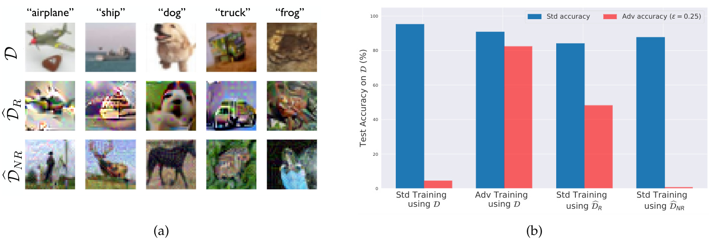

# Adversarial Examples Are Not Bugs, They Are Features  

Andrew Ilyas ∗Shibani Santurkar ∗Dimitris Tsipras ∗MIT MIT MIT ailyas@mit.edu shibani@mit.edu tsipras@mit.edu  

Logan Engstrom ∗Brandon Tran Aleksander M ˛adry MIT MIT MIT engstrom@mit.edu btran115@mit.edu madry@mit.edu  

# Abstract  

Adversarial examples have attracted significant attention in machine learning, but the reasons for their existence and pervasiveness remain unclear. We demonstrate that adversarial examples can be directly attributed to the presence of non-robust features : features (derived from patterns in the data distribution) that are highly predictive, yet brittle and (thus) incomprehensible to humans. After capturing these features within a theoretical framework, we establish their widespread existence in standard datasets. Finally, we present a simple setting where we can rigorously tie the phenomena we observe in practice to a misalignment between the (human-specified) notion of robustness and the inherent geometry of the data.  

# 1 Introduction  

The pervasive brittleness of deep neural networks $\mathrm{[Sze+14;}$ $\mathrm{Eng+19b}$ ; HD19; Ath $\phantom{0}{1+18}$ ] has attracted significant attention in recent years. Particularly worrisome is the phenomenon of adversarial examples $\scriptstyle\left[\mathrm{Big}+13\right]$ ;$\mathrm{Sze}{+14}]$ , imperceptibly perturbed natural inputs that induce erroneous predictions in state-of-the-art classifiers. Previous work has proposed a variety of explanations for this phenomenon, ranging from theoretical models $\left[{\mathrm{Sch}}\!+\!18\right]$ ; BPR18] to arguments based on concentration of measure in high-dimensions $\left[\mathrm{Gil}+18\right.$ ;MDM18; $S_{\mathrm{ha+}19\mathrm{a}]}$ . These theories, however, are often unable to fully capture behaviors we observe in practice (we discuss this further in Section 5).  

More broadly, previous work in the field tends to view adversarial examples as aberrations arising either from the high dimensional nature of the input space or statistical fluctuations in the training data $[\mathrm{Sze}{+}14\}$ ;GSS15; $\mathrm{Gil}{+}18]$ . From this point of view, it is natural to treat adversarial robustness as a goal that can be disentangled and pursued independently from maximizing accuracy $[\mathrm{Mad}{+}18,$ ; SHS19; $\mathrm{Sug}{+}19]$ , either through improved standard regularization methods [TG16] or pre/post-processing of network inputs/outputs [Ues $+18$ ; CW17a; $\mathrm{He}{+17}]$ .  

In this work, we propose a new perspective on the phenomenon of adversarial examples. In contrast to the previous models, we cast adversarial vulnerability as a fundamental consequence of the dominant supervised learning paradigm. Specifically, we claim that:  

Adversarial vulnerability is a direct result of our models’ sensitivity to well-generalizing features in the data.  

Recall that we usually train classifiers to solely maximize (distributional) accuracy. Consequently, classifiers tend to use any available signal to do so, even those that look incomprehensible to humans. After all, the presence of $\mathbf{\Psi}_{\mathbf{a}}$ tail” or “ears” is no more natural to a classifier than any other equally predictive feature. In fact, we find that standard ML datasets do admit highly predictive yet imperceptible features. We posit that our models learn to rely on these “non-robust” features, leading to adversarial perturbations that exploit this dependence.  

Our hypothesis also suggests an explanation for adversarial transferability : the phenomenon that adversarial perturbations computed for one model often transfer to other, independently trained models. Since any two models are likely to learn similar non-robust features, perturbations that manipulate such features will apply to both. Finally, this perspective establishes adversarial vulnerability as a human-centric phenomenon, since, from the standard supervised learning point of view, non-robust features can be as important as robust ones. It also suggests that approaches aiming to enhance the interpretability of a given model by enforcing “priors” for its explanation [MV15; OMS17; $\mathrm{Smi}{+}17]$ actually hide features that are “meaningful” and predictive to standard models. As such, producing human -meaningful explanations that remain faithful to underlying models cannot be pursued independently from the training of the models themselves.  

To corroborate our theory, we show that it is possible to disentangle robust from non-robust features in standard image classification datasets. Specifically, given any training dataset, we are able to construct:  

1. A “robustified” version for robust classification (Figure 1a) 2 .We demonstrate that it is possible to effectively remove non-robust features from a dataset. Concretely, we create a training set (semantically similar to the original) on which standard training yields good robust accuracy on the original, unmodified test set. This finding establishes that adversarial vulnerability is not necessarily tied to the standard training framework, but is also a property of the dataset.  

2. A “non-robust” version for standard classification (Figure $\mathbf{1}\mathbf{b})^{2}$ .We are also able to construct a training dataset for which the inputs are nearly identical to the originals, but all appear incorrectly labeled. In fact, the inputs in the new training set are associated to their labels only through small adversarial perturbations (and hence utilize only non-robust features). Despite the lack of any predictive human-visible information, training on this dataset yields good accuracy on the original, unmodified test set. This demonstrates that adversarial perturbations can arise from flipping features in the data that are useful for classification of correct inputs (hence not being purely aberrations).  

Finally, we present a concrete classification task where the connection between adversarial examples and non-robust features can be studied rigorously. This task consists of separating Gaussian distributions, and is loosely based on the model presented in Tsipras et al. $\left[\mathrm{Tsi}+19\right]$ , while expanding upon it in a few ways. First, adversarial vulnerability in our setting can be precisely quantified as a difference between the intrinsic data geometry and that of the adversary’s perturbation set. Second, robust training yields a classifier which utilizes a geometry corresponding to a combination of these two. Lastly, the gradients of standard models can be significantly more misaligned with the inter-class direction, capturing a phenomenon that has been observed in practice in more complex scenarios $\scriptstyle[\mathrm{Tsi}+19]$ ].  

# 2 The Robust Features Model  

We begin by developing a framework, loosely based on the setting proposed by Tsipras et al. $[\mathrm{Tsi}+19],$ that enables us to rigorously refer to “robust” and “non-robust” features. In particular, we present a set of definitions which allow us to formally describe our setup, theoretical results, and empirical evidence.  

Setup. We consid r binary classification 3 , where i $(x,y)\in\mathcal{X}\times\{\pm1\}$ are sampled from a (data) distributi D; the goal is to learn a classifier $\bar{C}:\mathcal{X}\rightarrow\{\pm1\}$ X →{± }which predicts a label $y$ corresponding to a given input x.  

  
Figure 1: A conceptual diagram of the experiments of Section 3. In (a) we disentangle features into combinations of robust/non-robust features (Section 3.1). In (b) we construct a dataset which appears mislabeled to humans (via adversarial examples) but results in good accuracy on the original test set (Section 3.2).  

of all features thus being shifted/scaled to be mean-zero and unit-variance (i.e., so that We define a feature to b F${\mathcal{F}}\,=\,\{f\,:\,\mathcal{X}\,\stackrel{}{\to}\,\mathbb{R}\}$ {X → }g from the input space . For convenience, we assume that the features in $\mathbb{E}_{(x,y)\sim\mathcal{D}}[f(x)]=0$ $\boldsymbol{\mathcal{X}}$ to the real numbers, with t and $\mathbb{E}_{(x,y)\sim\mathcal{D}}[f(x)^{2}]=1),$ Fare set ,in order to make the following definitions scale-invariant 4 . Note that this formal definition also captures what we abstractly think of as features (e.g., we can construct an $f$ that captures how “furry” an image is).  

Useful, robust, and non-robust features. We now define the key concepts required for formulating our framework. To this end, we categorize features in the following manner:  

•$\rho$ -useful features : For a given distribution $\mathcal{D}$ , we call a feature $f\,\rho$ -useful $(\rho>0)$ if it is correlated with the true label in expectation, that is if  

$$
\mathbb{E}_{(x,y)\sim\mathcal{D}}[y\cdot f(x)]\ge\rho.
$$  

We then de ne $\rho_{\mathcal Ḋ D Ḍ }(f)$ as the largest $\rho$ for which feature $f$ is $\rho$ seful under distribution $\mathcal{D}$ . (Note that if a feature classifier trained on $f$ is negatively correlated with the label, then $\rho$ -useful features can attain non-trivial generalization performance. −$-f$ is useful instead.) Crucially, a linear  

•$\gamma$ -robustly useful features : Suppose we have a $\rho$ -use ture $f$ $f\,\left(\rho_{\mathscr D}(f)\,>\,0\right)$ . We refer to $f$ as a robust feature (formally a $\gamma$ -robustly useful feature for $\gamma>0$ 0) if, under adversarial perturbation (for some specified set of valid perturbations $\Delta$ ), $f$ remains $\gamma$ -useful. Formally, if we have that  

$$
\mathbb{E}_{(x,y)\sim\mathcal{D}}\left[\operatorname*{inf}_{\delta\in\Delta(x)}y\cdot f(x+\delta)\right]\geq\gamma.
$$  

•Useful, non-robust features : A useful, non-robust feature is a feature which is $\rho$ -useful for some $\rho$ bounded away from zero, but is not a $\gamma$ -robust feature for any $\gamma\geq0$ . These features help with classification in the standard setting, but may hinder accuracy in the adversarial setting, as the correlation with the label can be flipped.  

Classification. In our framewor , a classifier $C\,=\,(F,w,b)$ is comprised of a set of features $F\subseteq F,$ a weight vector $w_{.}$ , and a scalar bias b. For a given input x, the classifier predicts the label $y$ as  

$$
C(x)=\operatorname{sgn}\left(b+\sum_{f\in F}w_{f}\cdot f(x)\right).
$$  

For convenience, we denote the set of features learned by a classifier $C$ as $F_{C}$ .  

Standard Training. Training a classifier is performed by minimizing a loss function (via empirical risk minimization (ERM)) that decreases with the correlation between the weighted combination of the features and the label. The simplest example of such a loss is 5  

$$
\mathbb{E}_{(\boldsymbol{x},\boldsymbol{y})\sim\mathcal{D}}\left[\mathcal{L}_{\boldsymbol{\theta}}(\boldsymbol{x},\boldsymbol{y})\right]=-\mathbb{E}_{(\boldsymbol{x},\boldsymbol{y})\sim\mathcal{D}}\left[\boldsymbol{y}\cdot\left(\boldsymbol{b}+\sum_{\boldsymbol{f}\in F}\boldsymbol{w}_{\boldsymbol{f}}\cdot\boldsymbol{f}(\boldsymbol{x})\right)\right].
$$  

When minimizing classification loss, no distinction exists between robust and non-robust features: the only distinguishing factor of a feature is its $\rho$ -usefulness. Furthermore, the classifier will utilize any $\rho$ -useful feature in $F$ to decrease the loss of the classifier.  

Robust training. In the presence of an adversary , any useful but non-robust features can be made anticorrelated with the true label, leading to adversarial vulnerability. Therefore, ERM is no longer sufficient to train classifiers that are robust, and we need to explicitly account for the effect of the adversary on the classifier. To do so, we use an adversarial loss function that can discern between robust and non-robust features $[\mathrm{Mad}{+}18]$ :  

$$
\mathbb{E}_{(x,y)\sim\mathcal{D}}\left[\operatorname*{max}_{\delta\in\Delta(x)}\mathcal{L}_{\theta}(x+\delta,y)\right],
$$  

for an appropriately defined set of perturbations $\Delta$ . Since the adversary can exploit non-robust features to degrade classification accuracy, minimizing this adversarial loss (as in adversarial training [GSS15; Mad $+18]$ )can be viewed as explicitly preventing the classifier from learning a useful but non-robust combination of features.  

Remark. We want to note that even though the framework above enables us to formally describe and predict the outcome of our experiments, it does not necessarily capture the notion of non-robust features exactly as we intuitively might think of them. For instance, in principle, our theoretical framework would allow for useful non-robust features to arise as combinations of useful robust features and useless nonrobust features [Goh19b]. These types of constructions, however, are actually precluded by our experimental results (in particular, the classifiers trained in Section 3 would not generalize). This shows that our experimental findings capture a stronger, more fine-grained statement than our formal definitions are able to express. We view bridging this gap as an interesting direction for future work.  

# 3 Finding Robust (and Non-Robust) Features  

The central premise of our proposed framework is that there exist both robust and non-robust features that constitute useful signals for standard classification. We now provide evidence in support of this hypothesis by disentangling these two sets of features.  

On one hand, we will construct a “robustified” dataset, consisting of samples that primarily contain robust features. Using such a dataset, we are able to train robust classifiers (with respect to the standard test set) using standard (i.e., non-robust) training. This demonstrates that robustness can arise by removing certain features from the dataset (as, overall, the new dataset contains less information about the original training set). Moreover, it provides evidence that adversarial vulnerability is caused by non-robust features and is not inherently tied to the standard training framework.  

On the other hand, we will construct datasets where the input-label association is based purely on non  
robust features (and thus the corresponding dataset appears completely mislabeled to humans). We show   
that this dataset suffices to train a classifier with good performance on the standard test set. This indicates   
that natural models use non-robust features to make predictions, even in the presence of robust features.   
These features alone are actually sufficient for non-trivial generalizations performance on natural images,   
which indicates that they are indeed valuable features, rather than artifacts of finite-sample overfitting. A conceptual description of these experiments can be found in Figure 1.  

  

Figure 2: Left : Random samples from our variants of the CIFAR-10 [Kri09] training set: the original training set robust training set $\hat{\mathcal{D}}_{R},$ , restricted to features us y a robust model; and the non-robust training set $\widehat{\cal D}_{N R},$ , restricted to features re t to a standard model (la pear incorrect to humans). Ri :Standard and robust accuracy on the CIFAR-10 test set ( (on Models trained on $\mathcal{D}$ ; (ii) standa $\widehat{\mathcal{D}}_{R}$ band raini $\widehat{\mathcal{D}}_{N R}$ bnreflect the original models used to create them: notably, standard training $\widehat{\mathcal{D}}_{N R};$ b; (iii) adversarial training (on $(\mathcal{D})$ D) for models trained with: (i) standard training $(\operatorname{on}\,\mathcal{D})$ D); a standard training on $\widehat{\mathcal{D}}_{R}$ b.on $\widehat{\mathcal{D}}_{R}$ Dyields nontrivial robust accuracy. Results for Restricted-ImageNet [Tsi+19] are in D.8 Figure 12.  

# 3.1 Disentangling robust and non-robust features  

Recall that the features a classifier learns to rely on are based purely on how useful these features are for (standard) generalization. Thus, under our conceptual framework, if we can ensure that only robust features are useful, standard training should result in a robust classifier. Unfortunately, we cannot directly manipulate the features of very complex, high-dimensional datasets. Instead, we will leverage a robust model and modify our dataset to contain only the features that are relevant to that model.  

In terms of our formal framework (Section 2), given a robust (i.e., adversarially trained $\left[\mathrm{Mad}{+}18\right]$ ) model $C$ we aim to construct a distribution $\widehat{\mathcal{D}}_{R}$ which satisfies:  

$$
\mathbb{E}_{(\boldsymbol{x},\boldsymbol{y})\sim\hat{\mathcal{D}}_{R}}\left[f(\boldsymbol{x})\cdot\boldsymbol{y}\right]=\left\{\mathbb{E}_{(\boldsymbol{x},\boldsymbol{y})\sim\mathcal{D}}\left[f(\boldsymbol{x})\cdot\boldsymbol{y}\right]\right.\left.\mathrm{~if~}f\in F_{C}\right.
$$  

where $F_{C}$ again represents the set of features utilized by $C$ . Conceptually, we want features used by $C$ to be as useful as they were on the original distribution seful under $\widehat{\cal D}_{N R}$ .$\mathcal{D}$ while ensuring that the rest of the features are not  

We will construct a training set for $\widehat{\mathcal{D}}_{R}$ $x\mapsto x_{r}$ from the original training set for layer (since these correspond to inputs to a linear classifier). To ensure that features used by the model are D. In the case of a deep neural network, $F_{C}$ corresponds to exactly the set of activations in the penultimate equally useful under both training sets, we (approximately) enforce all features in $F_{C}$ to have similar values for both $x$ and $x_{r}$ through the following optimization:  

$$
\operatorname*{min}_{x_{r}}\|g(x_{r})-g(x)\|_{2},
$$  

where $x$ is the original input and $g$ is the mapping from $x$ to the representation layer. We optimize this objective using gradient descent in input space 6 .  

Since we don’t have access to features outside $F_{C},$ there is no way to ensure that the expectation in (5) is zero for all $f\not\in F_{C}$ . To approxim this condition, we ch se the starting point of gradi t descent for the optimization in (6) to be an input sampling $x_{0}$ from noise in Appendix D.1). This choice ensures that any feature present in that input will $x_{0}$ which is drawn from Dindependently of the label of x(we also explore not be useful since they are not correlated with the label in expectation over $x_{0}$ . The underlying assumption here is that, when performing the optimization in (6), features that are not being directly optimized (i.e., features outside $F_{C}$ ) are not affected. We provide pseudocode for the construction in Figure 5 (Appendix C).  

Given the new training set for $\widehat{\mathcal{D}}_{R}$ (a few random samples are visualized in Figure 2a), we trai a classifier using standard (non-robust) training. We then test this classifier on the original test set (i.e. results (Figure 2b) indicate that the classifier learned using the new dataset attains good accuracy in D). The both standard and adversarial settings 7 8 .  

As a control, we repeat this methodology using a standard (non-robust) model for Cin our construction of the dataset. Sample images from the resulting “non-rob t dataset” $\widehat{\mathcal{D}}_{N R}$ are sh wn in Figure 2a—they tend to resemble more the source image of the optimization $x_{0}$ than the target image x. We find that training on this dataset leads to good standard accuracy, yet yields almost no robustness (Figure 2b). We also verify that this procedure is not simply a matter of encoding the weights of the original model—we get the same results for both $\widehat{\mathcal{D}}_{R}$ and $\widehat{\cal D}_{N R}$ if we train with different architectures than that of the original models.  

Overall, our findings corroborate the hypothesis that adversarial examples can arise from (non-robust) features of the data itself. By filtering out non-robust features from the dataset (e.g. by restricting the set of available features to those used by a robust model), one can train a significantly more robust model using standard training .  

# 3.2 Non-robust features suffice for standard classification  

The results of the previous section show that by restricting the dataset to only contain features that are used by a robust model, standard training results in classifiers that are significantly more robust. This suggests that when training on the standard dataset, non-robust features take on a large role in the resulting learned classifier. Here we set out to show that this role is not merely incidental or due to finite-sample overfitting. In particular, we demonstrate that non-robust features alone suffice for standard generalization— i.e., a model trained solely on non-robust features can perform well on the standard test set.  

To show this, we construct a dataset where the only features that are useful for classification are nonrobust features (or in terms of our formal model from Section 2, all features $f$ that are $\rho$ -useful are nonrobust). To accomplish this, we modify each input-label pair $\left(x,y\right)$ as follows. We select a target class $t$ either (a) uniformly at random among classes (hence features become uncorrelated with the labels) or (b) deterministically according to the source class (e.g. using a fixed permutation of labels). Then, we add a small adversarial perturbation to $x$ in order to ensure it is classified as $t$ by a standard model. Formally:  

$$
x_{a d v}=\arg\operatorname*{min}_{\|x^{\prime}-x\|\leq\varepsilon}\,L_{C}(x^{\prime},t),
$$  

where $L_{C}$ is the loss under a standard (non-robust) classifier $C$ and $\varepsilon$ is a small constant. The resulting inputs are nearly indistinguishable from the originals (Appendix D Figure 9)—to a human observer, it thus appears that the label $t$ assigned to the modified input is simply incorrect. The resulting input-label pairs $(x_{a d v},t)$ make up the new training set (pseudocode in Appendix C Figure 6).  

Now, si ce $\|x_{a d v}-x\|$ is small, by definition the robust features of $x_{a d v}$ are still correlated with class $y$ (and not t) in expectation over the dataset. After all, humans still recognize the original class. On the other hand, since every $x_{a d v}$ is strongly classified as $t$ by a standard classifier, it must be that some of the non-robust features are now strongly correlated with $t$ (in expectation).  

In the case where $t$ is chosen at random, the robust features are originally uncorrelated with the label $t$ (in expectation), and after the adversarial perturbation can be only slightly correlated (hence being significantly less useful for classification than before) 9 . Formally, we aim to construct a dataset $\widehat{\cal D}_{r a n d}$ where 10 :  

$$
\begin{array}{r}{\mathbb{E}_{(\boldsymbol{x},\boldsymbol{y})\sim\widehat{\mathcal{D}}_{r a n d}}\left[\boldsymbol{y}\cdot\boldsymbol{f}(\boldsymbol{x})\right]\left\{\succ0\quad\mathrm{if~}\boldsymbol{f}\mathrm{~non-robustly~useful~under~}\mathcal{D},\right.}\\ {\left.\subset0\quad\mathrm{otherwise}.}\end{array}
$$  

In contrast, when $t$ is chosen deterministically based on $y,$ the robust features actually point away from the assigned label $t$ . In particular, all of the inputs labeled with class $t$ exhibit non-robust features correlated with $t_{,}$ , but robust features correlated with the original class $y$ . Thus, robust features on the original training set provide significant predictive power on the training set, but will actually hurt generalization on the standard test set. Viewing this case again using the formal model, our goal is to nstruct $\widehat{\mathcal{D}}_{d e t}$ such that  

$$
\begin{array}{r}{\mathbb{E}_{(\boldsymbol{x},\boldsymbol{y})\sim\hat{\mathcal{D}}_{d e t}}\left[\boldsymbol{y}\cdot\boldsymbol{f}(\boldsymbol{x})\right]\left\{\overset{>}{\sim}0\quad\mathrm{if~}\boldsymbol{f}\mathrm{~non-robustly~useful~under~}\mathcal{D},\right.}\\ {\mathbb{E}_{(\boldsymbol{x},\boldsymbol{y})\sim\hat{\mathcal{D}}_{d e t}}\left[\boldsymbol{y}\cdot\boldsymbol{f}(\boldsymbol{x})\right]\left\{\overset{>}{\sim}0\quad\mathrm{if~}\boldsymbol{f}\mathrm{~robustly~useful~under~}\mathcal{D}\right.}\\ {\in\mathbb{R}\quad\mathrm{otherwise}\left(\boldsymbol{f}\mathrm{~not~useful~under~}\mathcal{D}\right)^{11}}\end{array}
$$  

We find that standard training on these datasets actually generalizes to the original test set, as shown in Table 1). This indicates that non-robust features are indeed useful for classification in the standard setting. Remarkably, even training on $\widehat{\mathcal{D}}_{d e t}$ (where all the robust features are correlated with the wrong class), results in a well-generalizing classifier. This indicates that non-robust features can be picked up by models during standard training, even in the presence of robust features that are predictive 1213 .  

  
Figure 3: Transfer rate of adversarial examples from a ResNet-50 to different architectures alongside test set performance of these architecture when trained on the dataset generated in Section 3.2. Architectures more susceptible to transfer attacks also performed better on the standard test set supporting our hypothesis that adversarial transferability arises from utilizing similar non-robust features .  

  

Table 1: trained o created using a standard (non-robust) model. Test $\mathcal{D}$ Dccuracy (on ,$\hat{\mathcal{D}}_{r a n d},$ and $\widehat{\mathcal{D}}_{d e t}$ $\mathcal{D}$ ) of classifiers training sets For both $\hat{\mathcal{D}}_{r a n d}$ band $\widehat{\mathcal{D}}_{d e t},$ b, only non-robust features correspond to useful features on both the train set and using adversarial perturbations of D. These datasets are xtowards a onstructed $t$ (random for $\widehat{\mathcal{D}}_{r a n d}$ and determinist for $\widehat{\mathcal{D}}_{d e t})$ D); the resulting images are relabeled as t.  

# 3.3 Transferability can arise from non-robust features  

One of the most intriguing properties of adversarial examples is that they transfer across models with different architectures and independently sampled training sets $\left[{\mathrm{Sze}}\!+\!14\right]$ ; PMG16; CRP19]. Here, we show that this phenomenon can in fact be viewed as a natural consequence of the existence of non-robust features. Recall that, according to our main thesis, adversarial examples can arise as a result of perturbing well-generalizing, yet brittle features. Given that such features are inherent to the data distribution, different classifiers trained on independent samples from that distribution are likely to utilize similar non-robust features. Consequently, an adversarial example constructed by exploiting the non-robust features learned by one classifier will transfer to any other classifier utilizing these features in a similar manner.  

In order to illustrate and corroborate this hypothesis, we train five different architectures on the dataset generated in Section 3.2 (adversarial examples with deterministic labels) for a standard ResNet-50 $[\mathrm{He}+16]$ .Our hypothesis would suggest that architectures which learn better from this training set (in terms of performance on the standard test set) are more likely to learn similar non-robust features to the original classifier. Indeed, we find that the test accuracy of each architecture is predictive of how often adversarial examples transfer from the original model to standard classifiers with that architecture (Figure 3). In a similar vein, Nakkiran [Nak19a] constructs a set of adversarial perturbations that is explicitly non-transferable and finds that these perturbations cannot be used to learn a good classifier. These findings thus corroborate our hypothesis that adversarial transferability arises when models learn similar brittle features of the underlying dataset.  

# 4 A Theoretical Framework for Studying (Non)-Robust Features  

The experiments from the previous section demonstrate that the conceptual framework of robust and nonrobust features is strongly predictive of the empirical behavior of state-of-the-art models on real-world datasets. In order to further strengthen our understanding of the phenomenon, we instantiate the framework in a concrete setting that allows us to theoretically study various properties of the corresponding model. Our model is similar to that of Tsipras et al. $\left[\mathrm{Tsi}+19\right]$ in the sense that it contains a dichotomy between robust and non-robust features, but extends upon it in a number of ways:  

1. The adversarial vulnerability can be explicitly expressed as a difference between the inherent data metric and the $\ell_{2}$ metric. 2. Robust learning corresponds exactly to learning a combination of these two metrics. 3. The gradients of adversarially trained models align better with the adversary’s metric.  

Setup. We study a simple problem of maximum likelihood classification between two Gaussian distributions. In particular, given samples $\left(x,y\right)$ sampled from $\mathcal{D}$ according to  

$$
y\overset{\mathrm{u.a.r.}}{\sim}\{-1,+1\},\qquad x\sim{\mathcal{N}}(y\cdot\mu_{*},\Sigma_{*}),
$$  

our goal is to learn parameters $\Theta=\left(\mu,\Sigma\right)$ such that  

$$
\Theta=\arg\operatorname*{min}_{\mu,\Sigma}\mathbb{E}_{(\boldsymbol{x},\boldsymbol{y})\sim\mathcal{D}}\left[\ell\big(\boldsymbol{x};\boldsymbol{y}\cdot\boldsymbol{\mu},\Sigma\big)\right],
$$  

where $\ell(x;\mu,\Sigma)$ represents the Gaussian negative log-likelihood (NLL) function. Intuitively, we find the parameters $\mu,\Sigma$ which maximize the likelihood of the sampled data under the given model. Classification under this model can be accomplished via likelihood test: given an unlabeled sample $x_{.}$ , we predict $y$ as  

$$
y=\arg\operatorname*{max}_{y}\ell(x;y\cdot\mu,\Sigma)=\operatorname{sign}\left(x^{\top}\Sigma^{-1}\mu\right).
$$  

In turn, the robust analogue of this problem arise om replacing $\ell(x;y\cdot\mu,\Sigma)$ with the NLL under adversarial perturbation. The resulting robust parameters $\Theta_{r}$ can be written as  

$$
\Theta_{r}=\arg\operatorname*{min}_{\mu,\Sigma}\mathbb{E}_{(\boldsymbol{x},\boldsymbol{y})\sim\mathcal{D}}\left[\operatorname*{max}_{\|\boldsymbol{\delta}\|_{2}\leq\varepsilon}\ell(\boldsymbol{x}+\boldsymbol{\delta};\boldsymbol{y}\cdot\boldsymbol{\mu},\Sigma)\right],
$$  

A detailed analysis of this setting is in Appendix E—here we present a high-level overview of the results.  

(1) Vulnerability from metric misalignment (non-robust features). Note that in this model, one can rigorously make reference to an inner product (and thus a metric) induced by the features. In particular, one can view the learned parameters of a Gaussian $\Theta=\left(\mu,\Sigma\right)$ as defining an inner product over the input space given by how a change in the input affects the features learned by the classifier. This metric is not necessarily aligned $\langle x,y\rangle_{\Theta}=\mathring{(x-\mu)}^{\top}\Sigma^{-1}(y-\mu)$ . This in turn induces the Mahalanobis distance, which represents with the metric in which the adversary is constrained, the $\ell_{2}$ -norm. Actually, we show that adversarial vulnerability arises exactly as a misalignment of these two metrics.  

Theorem 1 (Adversarial vulnerability from misalignment) .Consider an adversary whose perturbation is determined by the “Lagrangian penalty” form of (12) , i.e.  

$$
\operatorname*{max}_{\delta}\ell(x+\delta;y\cdot\mu,\Sigma)-C\cdot\|\delta\|_{2},
$$  

where $C\geq\frac{1}{\sigma_{m i n}(\Sigma_{*})}$ is a constant trading off NLL minimization and the adversarial constraint 14 . Then, the adversarial loss $\mathcal{L}_{a d v}$ incurred by the non-robustly learned ∗$\left(\mu,\Sigma\right)$ is given by:  

$$
\mathcal{L}_{a d v}(\Theta)-\mathcal{L}(\Theta)=t r\left[\left(I+\left(C\cdot\Sigma_{*}-I\right)^{-1}\right)^{2}\right]-d,
$$  

and, for a fixed $t r(\Sigma_{*})=k$ the above is minimized by $\begin{array}{r}{\Sigma_{*}=\frac{k}{d}I}\end{array}$ .  

In fact, note that such a misalignment corresponds precisely to the existence of non-robust features , as it indicates that “small” changes in the adversary’s metric along certain directions can cause large changes under the data-dependent notion of distance established by the parameters. This is illustrated in Figure 4, where misalignment in the feature-induced metric is responsible for the presence of a non-robust feature in the corresponding classification problem.  

(2) Robust Learning. The optimal (non-robust) maximum likelihood estimate is $\Theta\,=\,\Theta^{*}$ , and thus the vulnerability for the standard MLE estimate is governed entirely by the true data distribution. The following theorem characterizes the behaviour of the learned parameters in the robust problem. 15 . In fact, we can prove (Section E.3.4) that performing (sub)gradient descent on the inner maximization (also known as adversarial training [GSS15; $\mathrm{Mad}{+}18]$ ) yields exactly $\Theta_{r}$ . We find that as the perturbation budget $\varepsilon$ is increased, the metric induced by the learned features mixes $\ell_{2}$ and the metric induced by the features.  

Theorem 2 (Robustly Learned Parameters) .Just as in the non-robust case, $\mu_{r}=\mu^{*}$ , i.e. the true mean is learned. For the robust covariance $\Sigma_{r},$ there exists an $\varepsilon_{0}>0.$ , such that for any $\varepsilon\in\lbrack0,\varepsilon_{0})$ ),  

$$
\Sigma_{r}=\frac{1}{2}\Sigma_{*}+\frac{1}{\lambda}\cdot I+\sqrt{\frac{1}{\lambda}\cdot\Sigma_{*}+\frac{1}{4}\Sigma_{*}^{2}},\qquad w h e r e\qquad\Omega\left(\frac{1+\varepsilon^{1/2}}{\varepsilon^{1/2}+\varepsilon^{3/2}}\right)\leq\lambda\leq O\left(\frac{1+\varepsilon^{1/2}}{\varepsilon^{1/2}}\right),
$$  

The effect of robust optimization under an $\ell_{2}$ -constrained adversary is visualized in Figure 4. As $\epsilon$ grows, the learned covariance becomes more aligned with identity. For instance, we can see that the classifier learns to be less sensitive in certain directions, despite their usefulness for natural classification.  

(3) Gradient Interpretability. Tsipras et al. $\left[\mathrm{Tsi}+19\right]$ observe that gradients of robust models tend to look more semantically meaningful. It turns out that under our model, this behaviour arises as a natural consequence of Theorem 2. In particular, we show that the resulting robustly learned parameters cause the gradient of the linear classifier and the vector connecting the means of the two distributions to better align (in a worst-case sense) under the $\ell_{2}$ inner product.  

Theorem 3 (Gradient alignment) .Let $f(x)$ and $f_{r}(\boldsymbol{x})$ be monotonic classifiers based on the linear separator induced by standard and $\ell_{2}$ -robust maximum likelihood classification, respectively. The maximum angle formed between the gradient of the classifier (wrt input) and the vector connecting the classes can be smaller for the robust model:  

$$
\operatorname*{min}_{\mu}\frac{\langle\mu,\nabla_{x}f_{r}(x)\rangle}{\|\mu\|\cdot\|\nabla_{x}f_{r}(x)\|}>\operatorname*{min}_{\mu}\frac{\langle\mu,\nabla_{x}f(x)\rangle}{\|\mu\|\cdot\|\nabla_{x}f(x)\|}.
$$  

Figure 4 illustrates this phenomenon in the two-dimensional case. With $\ell_{2}$ -bounded adversarial training the gradient direction (perpendicular to the decision boundary) becomes increasingly aligned under the $\ell_{2}$ inner product with the vector between the means $(\mu)$ .  

Discussion. Our theoretical analysis suggests that rather than offering any quantitative classification benefits, a natural way to view the role of robust optimization is as enforcing a prior over the features learned by the classifier. In particular, training with an $\ell_{2}$ -bounded adversary prevents the classifier from relying heavily on features which induce a metric dissimilar to the $\ell_{2}$ metric. The strength of the adversary then allows for a trade-off between the enforced prior, and the data-dependent features.  

Robustness and accuracy. Note that in the setting described so far, robustness can be at odds with accuracy since robust training prevents us from learning the most accurate classifier (a similar conclusion is drawn in $\scriptstyle\left[\mathrm{Tsi}+19\right]$ ). However, we note that there are very similar settings where non-robust features manifest themselves in the same way, yet a classifier with perfect robustness and accuracy is still attainable. Concretely, consider the distributions pictured in Figure 14 in Appendix D.10. It is straightforward to show that while there are many perfectly accurate classifiers, any standard loss function will learn an accurate yet non-robust classifier. Only when robust training is employed does the classifier learn a perfectly accurate and perfectly robust decision boundary.  

# 5 Related Work  

Several models for explaining adversarial examples have been proposed in prior work, utilizing ideas ranging from finite-sample overfitting to high-dimensional statistical phenomena $\left[\mathrm{Gil}+18\right]$ ; FFF18; For+19; TG16; Sha $+19\mathrm{a}$ ; MDM18; Sha $+19\mathfrak{b}$ ; GSS15; BPR18]. The key differentiating aspect of our model is that adversarial perturbations arise as well-generalizing, yet brittle, features , rather than statistical anomalies or effects of poor statistical concentration. In particular, adversarial vulnerability does not stem from using a specific model class or a specific training method, since standard training on the “robustified” data distribution of Section 3.1 leads to robust models. At the same time, as shown in Section 3.2, these non-robust features are sufficient to learn a good standard classifier. We discuss the connection between our model and others in detail in Appendix A. We discuss additional related work in Appendix B.  

# 6 Conclusion  

In this work, we cast the phenomenon of adversarial examples as a natural consequence of the presence of highly predictive but non-robust features in standard ML datasets. We provide support for this hypothesis by Figure 4: An empirical demonstration of the effect illustrated by Theorem 2—as the adversarial perturbation budget εis increased, the learned mean $\pmb{\mu}$ remains constant, but the learned covariance “blends” with the identity matrix, effectively adding more and more uncertainty onto the non-robust feature.  

  

explicitly disentangling robust and non-robust features in standard datasets, as well as showing that nonrobust features alone are sufficient for good generalization. Finally, we study these phenomena in more detail in a theoretical setting where we can rigorously study adversarial vulnerability, robust training, and gradient alignment.  

Our findings prompt us to view adversarial examples as a fundamentally human phenomenon. In particular, we should not be surprised that classifiers exploit highly predictive features that happen to be non-robust under a human-selected notion of similarity, given such features exist in real-world datasets. In the same manner, from the perspective of interpretability, as long as models rely on these non-robust features, we cannot expect to have model explanations that are both human-meaningful and faithful to the models themselves. Overall, attaining models that are robust and interpretable will require explicitly encoding human priors into the training process.  

# 7 Acknowledgements  

We thank Preetum Nakkiran for suggesting the experiment of Appendix D.9 (i.e. replicating Figure 3 but with targeted attacks). We also are grateful to the authors of Engstrom et al. $\left[\mathrm{Eng}{+}19\mathrm{a}\right]$ (Chris Olah, Dan Hendrycks, Justin Gilmer, Reiichiro Nakano, Preetum Nakkiran, Gabriel Goh, Eric Wallace)—for their insights and efforts replicating, extending, and discussing our experimental results.  

Work supported in part by the NSF grants CCF-1553428, CCF-1563880, CNS-1413920, CNS-1815221, IIS-1447786, IIS-1607189, the Microsoft Corporation, the Intel Corporation, the MIT-IBM Watson AI Lab research grant, and an Analog Devices Fellowship.  

# References  

[ACW18] Anish Athalye, Nicholas Carlini, and David A. Wagner. “Obfuscated Gradients Give a False Sense of Security: Circumventing Defenses to Adversarial Examples”. In: International Conference on Machine Learning (ICML) . 2018.   
[Ath $+18$ ]Anish Athalye et al. “Synthesizing Robust Adversarial Examples”. In: International Conference on Machine Learning (ICML) . 2018.   
[BCN06] Cristian Buciluˇa, Rich Caruana, and Alexandru Niculescu-Mizil. “Model compression”. In: International Conference on Knowledge Discovery and Data Mining (KDD) . 2006.   
[Big+13] Battista Biggio et al. “Evasion attacks against machine learning at test time”. In: Joint European conference on machine learning and knowledge discovery in databases (ECML-KDD) . 2013.   
[BPR18] Sébastien Bubeck, Eric Price, and Ilya Razenshteyn. “Adversarial examples from computational constraints”. In: arXiv preprint arXiv:1805.10204 . 2018.   
$\left[C\mathrm{ar}{+}19\right]$ Nicholas Carlini et al. “On Evaluating Adversarial Robustness”. In: ArXiv preprint arXiv:1902.06705 2019.   
[CRK19] Jeremy M Cohen, Elan Rosenfeld, and J Zico Kolter. “Certified adversarial robustness via randomized smoothing”. In: arXiv preprint arXiv:1902.02918 . 2019.   
[CRP19] Zachary Charles, Harrison Rosenberg, and Dimitris Papailiopoulos. “A Geometric Perspective on the Transferability of Adversarial Directions”. In: International Conference on Artificial Intelligence and Statistics (AISTATS) . 2019.   
[CW17a] Nicholas Carlini and David Wagner. “Adversarial Examples Are Not Easily Detected: Bypassing Ten Detection Methods”. In: Workshop on Artificial Intelligence and Security (AISec) . 2017.   
[CW17b] Nicholas Carlini and David Wagner. “Towards evaluating the robustness of neural networks”. In: Symposium on Security and Privacy (SP) . 2017.   
[Dan67] John M. Danskin. The Theory of Max-Min and its Application to Weapons Allocation Problems . 1967.   
[Das+19] Constantinos Daskalakis et al. “Efficient Statistics, in High Dimensions, from Truncated Samples”. In: Foundations of Computer Science (FOCS) . 2019.   
[Din+19] Gavin Weiguang Ding et al. “On the Sensitivity of Adversarial Robustness to Input Data Distributions”. In: International Conference on Learning Representations . 2019.   
[Eng+19a] Logan Engstrom et al. “A Discussion of ’Adversarial Examples Are Not Bugs, They Are Features’”. In: Distill (2019). https://distill.pub/2019/advex-bugs-discussion. DOI :10 . 23915 / distill.00019 .  
[Eng+19b] Logan Engstrom et al. “A Rotation and a Translation Suffice: Fooling CNNs with Simple Transformations”. In: International Conference on Machine Learning (ICML) . 2019.   
[FFF18] Alhussein Fawzi, Hamza Fawzi, and Omar Fawzi. “Adversarial vulnerability for any classifier”. In: Advances in Neural Information Processing Systems (NeuRIPS) . 2018.   
[FMF16] Alhussein Fawzi, Seyed-Mohsen Moosavi-Dezfooli, and Pascal Frossard. “Robustness of classifiers: from adversarial to random noise”. In: Advances in Neural Information Processing Systems .2016.   
[For+19] Nic Ford et al. “Adversarial Examples Are a Natural Consequence of Test Error in Noise”. In: arXiv preprint arXiv:1901.10513 . 2019.   
[Fur+18] Tommaso Furlanello et al. “Born-Again Neural Networks”. In: International Conference on Machine Learning (ICML) . 2018.   
[Gei+19] Robert Geirhos et al. “ImageNet-trained CNNs are biased towards texture; increasing shape bias improves accuracy and robustness.” In: International Conference on Learning Representations .2019.   
$\left[\mathrm{Gil}+18\right]$ Justin Gilmer et al. “Adversarial spheres”. In: Workshop of International Conference on Learning Representations (ICLR) . 2018.   
[Goh19a] Gabriel Goh. “A Discussion of ’Adversarial Examples Are Not Bugs, They Are Features’: Robust Feature Leakage”. In: Distill (2019). https://distill.pub/2019/advex-bugs-discussion/response2. DOI :10.23915/distill.00019.2 .  
[Goh19b] Gabriel Goh. “A Discussion of ’Adversarial Examples Are Not Bugs, They Are Features’: Two Examples of Useful, Non-Robust Features”. In: Distill (2019). https://distill.pub/2019/advexbugs-discussion/response-3. DOI :10.23915/distill.00019.3 .  
[GSS15] Ian J Goodfellow, Jonathon Shlens, and Christian Szegedy. “Explaining and Harnessing Adversarial Examples”. In: International Conference on Learning Representations (ICLR) . 2015.   
[HD19] Dan Hendrycks and Thomas G. Dietterich. “Benchmarking Neural Network Robustness to Common Corruptions and Surface Variations”. In: International Conference on Learning Representations (ICLR) . 2019.   
$[\mathrm{He}+16]$ Kaiming He et al. “Deep Residual Learning for Image Recognition”. In: Conference on Computer Vision and Pattern Recognition (CVPR) . 2016.   
$\left[\mathrm{He}{+17}\right]$ Warren He et al. “Adversarial example defense: Ensembles of weak defenses are not strong”. In: USENIX Workshop on Offensive Technologies (WOOT) . 2017.   
[HVD14] Geoffrey Hinton, Oriol Vinyals, and Jeff Dean. “Distilling the Knowledge in a Neural Network”. In: Neural Information Processing Systems (NeurIPS) Deep Learning Workshop . 2014.   
[JLT18] Saumya Jetley, Nicholas Lord, and Philip Torr. “With friends like these, who needs adversaries?” In: Advances in Neural Information Processing Systems (NeurIPS) . 2018.   
[Kri09] Alex Krizhevsky. “Learning Multiple Layers of Features from Tiny Images”. In: Technical report .2009.   
[KSJ19] Beomsu Kim, Junghoon Seo, and Taegyun Jeon. “Bridging Adversarial Robustness and Gradient Interpretability”. In: International Conference on Learning Representations Workshop on Safe Machine Learning (ICLR SafeML) . 2019.   
[Lec+19] Mathias Lecuyer et al. “Certified robustness to adversarial examples with differential privacy”. In: Symposium on Security and Privacy (SP) . 2019.   
[Liu+17] Yanpei Liu et al. “Delving into Transferable Adversarial Examples and Black-box Attacks”. In: International Conference on Learning Representations (ICLR) . 2017.   
[LM00] Beatrice Laurent and Pascal Massart. “Adaptive estimation of a quadratic functional by model selection”. In: Annals of Statistics . 2000.   
[Mad $+18$ ]Aleksander Madry et al. “Towards deep learning models resistant to adversarial attacks”. In: International Conference on Learning Representations (ICLR) . 2018.   
[MDM18] Saeed Mahloujifar, Dimitrios I Diochnos, and Mohammad Mahmoody. “The curse of concentration in robust learning: Evasion and poisoning attacks from concentration of measure”. In: AAAI Conference on Artificial Intelligence (AAAI) . 2018.   
$[\mathrm{Moo}{+}17]$ Seyed-Mohsen Moosavi-Dezfooli et al. “Universal adversarial perturbations”. In: conference on computer vision and pattern recognition (CVPR) . 2017.   
[MV15] Aravindh Mahendran and Andrea Vedaldi. “Understanding deep image representations by inverting them”. In: computer vision and pattern recognition (CVPR) . 2015.   
[Nak19a] Preetum Nakkiran. “A Discussion of ’Adversarial Examples Are Not Bugs, They Are Features’: Adversarial Examples are Just Bugs, Too”. In: Distill (2019). https://distill.pub/2019/advexbugs-discussion/response-5. DOI :10.23915/distill.00019.5 .  
[Nak19b] Preetum Nakkiran. “Adversarial robustness may be at odds with simplicity”. In: arXiv preprint arXiv:1901.00532 . 2019.   
[OMS17] Chris Olah, Alexander Mordvintsev, and Ludwig Schubert. “Feature Visualization”. In: Distill .2017.   
[Pap+17] Nicolas Papernot et al. “Practical black-box attacks against machine learning”. In: Asia Conference on Computer and Communications Security . 2017.   
[PMG16] Nicolas Papernot, Patrick McDaniel, and Ian Goodfellow. “Transferability in Machine Learning: from Phenomena to Black-box Attacks using Adversarial Samples”. In: ArXiv preprint arXiv:1605.07277 . 2016.   
[Rec+19] Benjamin Recht et al. “Do CIFAR-10 Classifiers Generalize to CIFAR-10?” In: International Conference on Machine Learning (ICML) . 2019.   
[RSL18] Aditi Raghunathan, Jacob Steinhardt, and Percy Liang. “Certified defenses against adversarial examples”. In: International Conference on Learning Representations (ICLR) . 2018.   
[Rus+15] Olga Russakovsky et al. “ImageNet Large Scale Visual Recognition Challenge”. In: International Journal of Computer Vision (IJCV) . 2015.   
[Sch+18] Ludwig Schmidt et al. “Adversarially Robust Generalization Requires More Data”. In: Advances in Neural Information Processing Systems (NeurIPS) . 2018.   
[Sha+19a] Ali Shafahi et al. “Are adversarial examples inevitable?” In: International Conference on Learning Representations (ICLR) . 2019.   
[Sha+19b] Adi Shamir et al. “A Simple Explanation for the Existence of Adversarial Examples with Small Hamming Distance”. In: arXiv preprint arXiv:1901.10861 . 2019.   
[SHS19] David Stutz, Matthias Hein, and Bernt Schiele. “Disentangling Adversarial Robustness and Generalization”. In: Computer Vision and Pattern Recognition (CVPR) . 2019.   
$[\mathrm{Smi}{+}17]$ D. Smilkov et al. “SmoothGrad: removing noise by adding noise”. In: ICML workshop on visualization for deep learning . 2017.   
[Sug+19] Arun Sai Suggala et al. “Revisiting Adversarial Risk”. In: Conference on Artificial Intelligence and Statistics (AISTATS) . 2019.   
[Sze+14] Christian Szegedy et al. “Intriguing properties of neural networks”. In: International Conference on Learning Representations (ICLR) . 2014.   
[TG16] Thomas Tanay and Lewis Griffin. “A Boundary Tilting Perspective on the Phenomenon of Adversarial Examples”. In: ArXiv preprint arXiv:1608.07690 . 2016.   
[Tra+17] Florian Tramer et al. “The Space of Transferable Adversarial Examples”. In: ArXiv preprint arXiv:1704.03453 . 2017.   
$\left[\mathrm{Tsi}+19\right]$ Dimitris Tsipras et al. “Robustness May Be at Odds with Accuracy”. In: International Conference on Learning Representations (ICLR) . 2019.   
[Ues+18] Jonathan Uesato et al. “Adversarial Risk and the Dangers of Evaluating Against Weak Attacks”. In: International Conference on Machine Learning (ICML) . 2018.   
[Wan+18] Tongzhou Wang et al. “Dataset Distillation”. In: ArXiv preprint arXiv:1811.10959 . 2018.   
[WK18] Eric Wong and J Zico Kolter. “Provable defenses against adversarial examples via the convex outer adversarial polytope”. In: International Conference on Machine Learning (ICML) . 2018.   
$[\mathrm{Xia}+19]$ Kai Y. Xiao et al. “Training for Faster Adversarial Robustness Verification via Inducing ReLU Stability”. In: International Conference on Learning Representations (ICLR) . 2019.   
$[Z\mathrm{ou}+18]$ Haosheng Zou et al. “Geometric Universality of Adversarial Examples in Deep Learning”. In: Geometry in Machine Learning ICML Workshop (GIML) . 2018.  

# A Connections to and Disambiguation from Other Models  

Here, we describe other models for adversarial examples and how they relate to the model presented in this paper.  

Concentration of measure in high-dimensions. An orthogonal line of work $\mathrm{[Gil+18,}$ ; FFF18; MDM18; $\mathrm{Sha}{+}19\mathrm{a}]$ , argues that the high dimensionality of the input space can present fundamental barriers on classifier robustness. At a high level, one can show that, for certain data distributions, any decision boundary will be close to a large fraction of inputs and hence no classifier can be robust against small perturbations. While there might exist such fundamental barriers to robustly classifying standard datasets, this model cannot fully explain the situation observed in practice, where one can train (reasonably) robust classifiers on standard datasets $[\mathrm{Mad}{+}18_{\cdot}$ ; RSL18; WK18; Xia $+19$ ; CRK19].  

Insufficient data. Schmidt et al. $\left[S c\mathrm{h}{+}18\right]$ propose a theoretical model under which a single sample is sufficient to learn a good, yet non-robust classifier, whereas learning a good robust classifier requires $O({\sqrt{d}})$ samples. Under this model, adversarial examples arise due to insufficient information about the true data distribution. However, unless the adversary is strong enough (in which case no robust classifier exists), adversarial inputs cannot be utilized as inputs of the opposite class (as done in our experiments in Section 3.2). We note that our model does not explicitly contradict the main thesis of Schmidt et al. $\left[S c\mathrm{h}{+}18\right]$ . In fact, this thesis can be viewed as a natural consequence of our conceptual framework. In particular, since training models robustly reduces the effective amount of information in the training data (as non-robust features are discarded), more samples should be required to generalize robustly.  

Boundary Tilting. Tanay and Griffin [TG16] introduce the “boundary tilting” model for adversarial examples, and suggest that adversarial examples are a product of over-fitting. In particular, the model conjectures that “adversarial examples are possible because the class boundary extends beyond the submanifold of sample data and can be—under certain circumstances—lying close to it.” Consequently, the authors suggest that mitigating adversarial examples may be a matter of regularization and preventing finite-sample overfitting. In contrast, our empirical results in Section 3.2 suggest that adversarial inputs consist of features inherent to the data distribution, since they can encode generalizing information about the target class.  

Inspired by this hypothesis and concurrently to our work, Kim, Seo, and Jeon [KSJ19] present a simple classification task comprised of two Gaussian distributions in two dimensions. They experimentally show that the decision boundary tends to better align with the vector between the two means for robust models. This is a special case of our theoretical results in Section 4. (Note that this exact statement is not true beyond two dimensions, as discussed in Section 4.)  

Test Error in Noise. Fawzi, Moosavi-Dezfooli, and Frossard [FMF16] and Ford et al. $\left[\mathrm{For}{+}19\right]$ argue that the adversarial robustness of a classifier can be directly connected to its robustness under (appropriately scaled) random noise. While this constitutes a natural explanation of adversarial vulnerability given the classifier robustness to noise, these works do not attempt to justify the source of the latter.  

At the same time, recent work [Lec+19; CRK19; For $+19$ ] utilizes random noise during training or testing to construct adversarially robust classifiers. In the context of our framework, we can expect the added noise to disproportionately affect non-robust features and thus hinder the model’s reliance on them.  

Local Linearity. Goodfellow, Shlens, and Szegedy [GSS15] suggest that the local linearity of DNNs is largely responsible for the existence of small adversarial perturbations. While this conjecture is supported by the effectiveness of adversarial attacks exploiting local linearity (e.g., FGSM [GSS15]), it is not sufficient to fully characterize the phenomena observed in practice. In particular, there exist adversarial examples that violate the local linearity of the classifier $[\mathrm{Mad}{+}18],$ , while classifiers that are less linear do not exhibit greater robustness [ACW18].  

Piecewise-linear decision boundaries. Shamir et al. $[\mathrm{Sha}+19\mathrm{b}]$ prove that the geometric structure of the classifier’s decision boundaries can lead to sparse adversarial perturbations. However, this result does not take into account the distance to the decision boundary along these direction or feasibility constraints on the input domain. As a result, it cannot meaningfully distinguish between classifiers that are brittle to small adversarial perturbations and classifiers that are moderately robust.  

Theoretical constructions which incidentally exploit non-robust features. Bubeck, Price, and Razenshteyn [BPR18] and Nakkiran [Nak19b] propose theoretical models where the barrier to learning robust classifiers is, respectively, due to computational constraints or model complexity. In order to construct distributions that admit accurate yet non-robust classifiers they (implicitly) utilize the concept of non-robust features. Namely, they add a low-magnitude signal to each input that encodes the true label. This allows a classifier to achieve perfect standard accuracy, but cannot be utilized in an adversarial setting as this signal is susceptible to small adversarial perturbations.  

# BAdditional Related Work  

We describe previously proposed models for the existence of adversarial examples in the previous section.   
Here we discuss other work that is methodologically or conceptually similar to ours.  

Distillation. The experiments performed in Section 3.1 can be seen as a form of distillation . There is a line of work, known as model distillation [HVD14; Fur $+18.$ ; BCN06], where the goal is to train a new model to mimic another already trained model. This is typically achieved by adding some regularization terms to the loss in order to encourage the two models to be similar, often replacing training labels with some other target based on the already trained model. While it might be possible to successfully distill a robust model using these methods, our goal was to achieve it by only modifying the training set (leaving the training process unchanged), hence demonstrating that adversarial vulnerability is mainly a property of the dataset. Closer to our work is dataset distillation $[\mathsf{W a n}{+}18]$ which considers the problem of reconstructing a classifier from an alternate dataset much smaller than the original training set. This method aims to produce inputs that directly encode the weights of the already trained model by ensuring that the classifier’s gradient with respect to these inputs approximates the desired weights. (As a result, the inputs constructed do not resemble natural inputs.) This approach is orthogonal to our goal since we are not interested in encoding the particular weights into the dataset but rather in imposing a structure to its features.  

Adversarial Transferabiliy. In our work, we posit that a potentially natural consequence of the existence of non-robust features is adversarial transferability $[\mathrm{Pap}+17.$ ; Liu $+17$ ; PMG16]. A recent line of work has considered this phenomenon from a theoretical perspective, confined to simple models, or unbounded perturbations [CRP19; $Z\mathrm{ou}\!+\!18]$ . Tramer et al. $\left[\mathrm{Tra}{+17}\right]$ study transferability empirically, by finding adversarial subspaces , (orthogonal vectors whose linear combinations are adversarial perturbations). The authors find that there is a significant overlap in the adversarial subspaces between different models, and identify this as a source of transferability. In our work, we provide a potential reason for this overlap—these directions correspond to non-robust features utilized by models in a similar manner.  

Universal Adversarial Perturbations Moosavi-Dezfooli et al. $[\mathrm{Moo}{+}17]$ construct perturbations that can cause misclassification when applied to multiple different inputs. More recently, Jetley, Lord, and Torr [JLT18] discover input patterns that are meaningless to humans and can induce misclassification, while at the same time being essential for standard classification. These findings can be naturally cast into our framework by considering these patterns as non-robust features, providing further evidence about their pervasiveness.  

Manipulating dataset features Ding et al. $[\mathrm{Din}{+}19]$ perform synthetic transformations on the dataset (e.g., image saturation) and study the performance of models on the transformed dataset under standard and robust training. While this can be seen as a method of restricting the features available to the model during training, it is unclear how well these models would perform on the standard test set. Geirhos et al. $\left[\mathrm{Gei}+19\right]$ aim to quantify the relative dependence of standard models on shape and texture information of the input. They introduce a version of ImageNet where texture information has been removed and observe an improvement to certain corruptions.  

# CExperimental Setup  

# C.1 Datasets  

For our experimental analysis, we use the CIFAR-10 [Kri09] and (restricted) ImageNet $\scriptstyle\left[\mathrm{Rus}+15\right]$ datasets. Attaining robust models for the complete ImageNet dataset is known to be a challenging problem, both due to the hardness of the learning problem itself, as well as the computational complexity. We thus restrict our focus to a subset of the dataset which we denote as restricted ImageNet. To this end, we group together semantically similar classes from ImageNet into 9 super-classes shown in Table 2. We train and evaluate only on examples corresponding to these classes.  

Table 2: Classes used in the Restricted ImageNet model. The class ranges are inclusive.   

  

# C.2 Models  

We use the ResNet-50 architecture for our baseline standard and adversarially trained classifiers on CIFAR10 and restricted ImageNet. For each model, we grid search over three learning rates (0.1, 0.01, 0.05), two batch sizes (128, 256) including/not including a learning rate drop (a single order of magnitude) and data augmentation. We use the standard training parameters for the remaining parameters. The hyperparameters used for each model are given in Table 3.  

  
Table 3: Hyperparameters for the models trained in the main paper. All hyperparameters were obtained through a grid search.  

# C.3 Adversarial training  

To obtain robust classifiers, we employ the adversarial training methodology proposed in $\left[\mathrm{Mad}{+}18\right]$ . Specifically, we train against a projected gradient descent (PGD) adversary constrained in $\ell_{2}$ -norm starting from the original image. Following Madry et al. $[\mathrm{Mad}{+}18]$ we normalize the gradient at each step of PGD to ensure that we move a fixed distance in $\ell_{2}$ -norm per step. Unless otherwise specified, we use the values of $\epsilon$ provided in Table 4 to train/evaluate our models. We used 7 steps of PGD with a step size of $\varepsilon/5$ .  

  

# C.4 Constructing a Robust Dataset  

In Section 3.1, we describe a procedure to construct a dataset that contains features relevant only to a given (standard/robust) model. To do so, we optimize the training objective in (6). Unless otherwise specified, we initialize $x_{r}$ as a different randomly chosen sample from the training set. (For the sake of completeness, we also try initializing with a Gaussian noise instead as shown in Table 7.) We then perform normalized gradient descent ( $\ell_{2}$ -norm of gradient is fixed to be constant at each step). At each step we clip the input $x_{r}$ to in the [0, 1 ]range so as to ensure that it is a valid image. Details on the optimization procedure are shown in Table 5. We provide the pseudocode for the construction in Figure 5.  

GET ROBUST DATASET $(D)$   
1. $C_{R}\gets$ A DVERSARIAL TRAI G$(D)$ $g_{R}\leftarrow$ ←mapping learned by $C_{R}$ from the input to the representation layer   
2. $D_{R}\leftarrow\{\}$   
3. For $(x,y)\in D$ x′∼D$\begin{array}{l}{{x_{R}}\gets\arg\operatorname*{min}_{z\in[0,1]^{d}}\|g_{R}(z)-g_{R}(x)\|_{2}}\\ {{D_{R}}\gets{D_{R}}\cup\{(x_{R},y)\}}\end{array}$ # Solved using $\ell_{2}$ -PGD starting from $x^{\prime}$   
4. Return $D_{R}$  

Figure 5: Algorithm to construct a “robust” dataset, by restricting to features used by a robust model.  

  

# C.5 Non-robust features suffice for standard classification  

To construct the dataset as described in Section 3.2, we use the standard projected gradient descent (PGD) procedure described in $\left[\mathrm{Mad}{+}18\right]$ to construct an adversarial example for a given input from the dataset (7). Perturbations are constrained in $\ell_{2}$ -norm while each PGD step is normalized to a fixed step size. The details for our PGD setup are described in Table 6. We provide pseudocode in Figure 6.  

  
Figure 6: Algorithm to construct a dataset where input-label association is based entirely on non-robust features.  

  

Table 6: Projected gradient descent parameters used to construct constrained adversarial examples in Section 3.2.  

# DOmitted Experiments and Figures  

# D.1 Detailed evaluation of models trained on “robust” dataset  

In Section 3.1, we generate a “robust” training set by restricting the dataset to only contain features relevant to a robust model (robust dataset) or a standard model (non-robust dataset). This is performed by choosing either a random input from the training set or random noise 16 and then performing the optimization procedure described in (6). The performance of these classifiers along with various baselines is shown in Table 7. We observe that while the robust dataset constructed from noise resembles the original, the corresponding non-robust does not (Figure 7). This also leads to suboptimal performance of classifiers trained on this dataset (only $46\%$ standard accuracy) potentially due to a distributional shift.  

  

Table 7: Standard and robust classification performance on the CIFAR-10 test set of: an (i) ERM classifier; (ii) ERM classifier trained on a dataset obtained by distilling features relevant to ERM classifier in (i); (iii) adversarially trained classifier $\left(\varepsilon=0.5\right)$ ); (iv) ERM classifier trained on dataset obtained by distilling features used by robust classifier in (iii). Simply restricting the set of available features during ERM to features used by a standard model yields non-trivial robust accuracy.  

  
Figure 7: Robust and non-robust datasets for CIFAR-10 when the process starts from noise (as opposed to random images as in Figure 2a).  

# D.2 Adversarial evaluation  

To verify the robustness of our classifiers trained on the ‘robust” dataset, we evaluate them with strong attacks $[C a r+19]$ . In particular, we try up to 2500 steps of projected gradient descent (PGD), increasing steps until the accuracy plateaus, and also try the $C W{-}\ell_{2}$ loss function [CW17b] with 1000 steps. For each attack we search over step size. We find that over all attacks and step sizes, the accuracy of the model does not drop by more than $2\%_{\star}$ , and plateaus at $48.27\%$ for both PGD and CW$\ell_{2}$ (the value given in Figure 2). We show a plot of accuracy in terms of the number of PGD steps used in Figure 8.  

  

Figure 8: Robust accuracy as a function of the number of PGD steps used to generate the attack. The accuracy plateaus at $48.27\%$ .  

# D.3 Performance of “robust” training and test set  

In Section 3.1, we observe that an ERM classifier trained on a “robust” training dataset $\widehat{\mathcal{D}}_{R}$ (obtained by restricting features to those relevant to a robust model) attains non-trivial robustness (cf. Figure 1 and Table 7). In Table 8, we evaluate the adversarial accuracy of the model on the corresponding robust training set (th mples which the classifier was trained on) and test set (unseen samples from $\widehat{\cal D}_{R},$ , based on the test set). We find that the drop in robustness comes from a combination of generalization gap (the robustness on the $\widehat{\mathcal{D}}_{R}$ btest set is w rse than it is on the robust training set) distributional shift (the model performs better on the robust test set consisting of unseen samples from $\widehat{\mathcal{D}}_{R}$ bthan on the standard test set containing unseen samples from D).  

  

Table 8: Performance of model trained on the robust dataset on the robust training and test sets as well as the standard CIFAR-10 test set. We observe that the drop in robust accuracy stems from a combination of generalization gap and distributional shift. The adversary is constrained to $\varepsilon=0.25$ in $\ell_{2}$ -norm.  

# D.4 Classification based on non-robust features  

Figure 9 shows sample images from classifier, and an adversarially trained (robust) classifier. $\mathcal{D}_{.}$ ,$\widehat{\mathcal{D}}_{r a n d}$ and $\widehat{\mathcal{D}}_{d e t}$ constructed using a standard (non-robust) ERM  

  
Figure 9: Random samples from datasets where the input-label correlation is entirely based on non-robust features. Sample enerated by performing small adversarial perturbations using either random $(\widehat{\mathcal{D}}_{r a n d})$ or deterministic ( $(\widehat{\mathcal{D}}_{d e t})$ b) label-target mappings for every sample i aining set. Each image shows: top :original; middle : adversarial perturbations using a standard ERM-trained classifier; bottom : adversarial perturbations using a robust classifier (adversarially trained against $\varepsilon=0.5$ 0.5).  

In Table 9, we repeat the experiments in Table 1 based on datasets constructed using a robust model. Note that using a robust mod l to generate the $\widehat{\mathcal{D}}_{d e t}$ and $\widehat{\mathcal{D}}_{r a n d}$ datasets ill not result in non-robust features that are strongly predictive of t(since the prediction of the classifier will not change). Thus, training a model on these datasets leads to poor accuracy on the standard test set from D.  

Observe from Figure 10 that models trained on datasets derived from the robust model show a decline in test accuracy as training progresses. In Table 9, the accuracy numbers reported correspond to the last iteration, and not the best performance. This is because we have no way to cross-validate in a meaningful way as the validation set itself comes from $\widehat{\mathcal{D}}_{r a n d}$ or $\widehat{\cal D}_{d e t},$ and not from the true data distribution $D$ . Thus, validation accuracy will not be predictive of the true test accuracy, and thus will not help determine when to early stop.  

  

e 9: Repeating the experiments of Table 1 using a robust model to construct the datasets $\mathcal{D}$ ,$\widehat{\mathcal{D}}_{r a n d}$ and $\widehat{\mathcal{D}}_{d e t}$ D. Results in Table 1 are reiterated for comparison.  

  
D.5 Accuracy curves  

Figure 10: Test accuracy on based solely on non-robust features as in Section 3.2. The datasets are constructed using either a non$\mathcal{D}$ of standard classifiers trained on datasets where input-label correlation is robust/standard model ( left column ) or a robust model ( right column ). The labels used are either random ($\widehat{\mathcal{D}}_{r a n d}.$ ;top row ) or correspond to a deterministic permutation ( $\widehat{\mathcal{D}}_{d e t},$ ;bottom row ).  

# D.6 Performance of ERM classifiers on relabeled test set  

a 10), we evaluate the performance ained on $\widehat{\mathcal{D}}_{d e t}$ on both the original test set drawn $\widehat{\mathcal{D}}_{d e t}$ from bconstructed using a robust model actually ends up learning permuted labels based on robust features D, and the test set relabelled using $t(y)\;=\;(y+1)$ mod C. Observe that the classifier trained on (indicated by high test accuracy on the relabelled test set).  

  

Table ce of classifiers trained using $\widehat{\mathcal{D}}_{d e t}$ training set construct using either standard or using robust models. The classifiers are evaluated both on the standard test set from $t(y)=(y+1)$ mod C. We observe that using a robust model for the construction results in a model Dand the test set relabeled that largely predicts the permutation of labels, indicating that the dataset does not have strongly predictive non-robust features.  

# D.7 Generalization to CIFAR-10.1  

Recht et al. $\scriptstyle{\left[{\mathrm{Rec}}+{19}\right]}$ have constructed an unseen but distribution-shifted test set for CIFAR-10. They show that for many previously proposed models, accuracy on the CIFAR-10.1 test set can be predicted as a linear function of performance on the CIFAR-10 test set.  

As a sanity check (and a safeguard against any potential adaptive overfitting to the test set via hyperpara ers, historical test set reuse, etc.) we note that the classifiers trained on $\bar{\mathcal{D}}_{d e t}$ and $\widehat{\mathcal{D}}_{r a n d}$ achieve $44\%$ and 55% generalization on the CIFAR-10.1 test set, respectively. This demonstrates non-trivial generalization, and actually perform better than the linear fit would predict (given their accuracies on the CIFAR-10 test set).  

# D.8 Omitted Results for Restricted ImageNet  

  

Figure 11: Repeating the experiments shown in Figure 2 for the Restricted ImageNet dataset. Sample images from the resulting dataset.  

  

Figure 12: Repeating the experiments shown in Figure 2 for the Restricted ImageNet dataset. Standard and robust accuracy of models trained on these datasets.  

# D.9 Targeted Transferability  

  

Figure 13: Transfer rate of targeted adversarial examples (measured in terms of attack success rate, not just misclassification) from a ResNet-50 to different architectures alongside test set performance of these architecture when trained on the dataset generated in Section 3.2. Architectures more susceptible to transfer attacks also performed better on the standard test set supporting our hypothesis that adversarial transferability arises from utilizing similar non-robust features .  

# D.10 Robustness vs. Accuracy  

  

Figure 14: An example where adversarial vulnerability can arise from ERM training on any standard loss function due to non-robust features (the green line shows the ERM-learned decision boundary). There exists, however, a classifier that is both perfectly robust and accurate, resulting from robust training, which forces the classifier to ignore the $x_{2}$ feature despite its predictiveness.  

# EGaussian MLE under Adversarial Perturbation  

In this section, we develop a framework for studying non-robust features by studying the problem of maximum likelihood classification between two Gaussian distributions. We first recall the setup of the problem, then present the main theorems from Section 4. First we build the techniques necessary for their proofs.  

# E.1 Setup  

We consider the setup where a learner receives labeled samples from two distributions $\mathcal{N}(\mu_{*},\Sigma_{*})$ , and $\mathcal{N}(-\boldsymbol{\mu}_{*},\boldsymbol{\Sigma}_{*})$ ing to a maximum likelihood (MLE) rule. . The learner’s goal is to be able to classify new samples as being drawn from Dor Daccord  

A simple coupling argument demonstrates that this problem can actually be reduced to learning the parameters $\widehat{\mu},\widehat{\Sigma}$ $\mathcal{N}(-\boldsymbol{\mu}_{*},\boldsymbol{\Sigma}_{*})$ en employing a linear classifi with ight $\widehat{\Sigma}^{-1}\widehat{\pmb{\mu}}$ .the learned classification rule is In the standard setting, maximum likelihoods estimation learns the true parameters, $C(x)=\mathbb{1}\{x^{\top}\Sigma^{-1}\mu>0\}$ {}.$\mu_{*}$ ∗and $\Sigma_{*}$ ∗, and thus  

In this work, we consider the problem of adversarially robust maximum likelihood estimation. In particular, rather than simply being asked to classify samples, the learner will be asked to classify adversarially perturbed sa es $x+\delta,$ where $\delta\in\Delta$ is chosen to maximize the loss of the learner. Our goal is to derive the parameters $\mu,\Sigma$ corresponding to an adversarially robust maximum likelihood estimate of the parameters of $\mathcal{N}(\boldsymbol{\mu}_{*},\boldsymbol{\Sigma}_{*})$ . Note that since we ha access to $\Sigma_{*}$ (indeed, the learner can just run non-robust ML to get access), we work in the space where $\Sigma^{*}$ is a diagonal matrix, and we restrict the learned covariance Σto the set of diagonal matrices.  

Notation. denote the parameters of the sampled Gaussian by $\pmb{\mu}_{\ast}\in\mathbb{R}^{d}$ $\Sigma_{\ast}\,\in\,\{\mathrm{diag}(u)|u\in\mathbb{R}^{d}\}$ .We use $\sigma_{m i n}(X)$ to represent the smallest eigenvalue f a square matrix X, and $\ell(\cdot;x)$ to represent the negative log-likelihoo for a single sample x. For convenience, we often use $v\;=\;x-\mu,$ and $R\;=\;\|\pmb{\mu}_{*}\|$ particular, for a matrix ∥∗∥. We also d $X\in\mathbb{R}^{d\times d}$ ∈, we have that operator to r $\dot{X_{\otimes}}=v\in\mathbb{R}^{d}$ ∈ve if $v_{i}=X_{i i}$ on of the diagonal of a matrix. In .  

# E.2 Outline and Key Results  

We focus on the case where $\Delta\,=\,B_{2}(\epsilon)$ for some $\epsilon\,>\,0$ , i.e. the $\ell_{2}$ ball, corresponding to the following minimax problem:  

$$
\operatorname*{min}_{\mu,\Sigma}\mathbb{E}_{x\sim\mathcal{N}(\mu^{*},\Sigma^{*})}\left[\operatorname*{max}_{\delta:\|\delta\|=\varepsilon}\ell(\mu,\Sigma;x+\delta)\right]
$$  

We first derive the optimal adversarial perturbation for this setting (Section E.3.1), and prove Theorem 1 (Section E.3.2). We then propose an alternate problem, in which the adversary picks a linear operator to be applied to a fixed vector, rather than picking a specific perturbation vector (Section E.3.3). We argue via Gaussian concentration that the alternate problem is indeed reflective of the original model (and in particular, the two become equivalent as $d\rightarrow\infty$ ). In particular, we propose studying the following in place of (13):  

$$
\begin{array}{r l}&{\underset{\mu,\Sigma}{\operatorname*{min}}\ \underset{M\in\mathcal{M}}{\operatorname*{max}}\ \mathbb{E}_{\boldsymbol{x}\sim\mathcal{N}(\mu^{*},\Sigma^{*})}\left[\ell(\mu,\Sigma;\boldsymbol{x}+M(\boldsymbol{x}-\mu))\right]}\\ &{\mathrm{where~}\mathcal{M}=\left\{M\in\mathbb{R}^{d\times d}:\ M_{i j}=0\,\forall\,i\neq j,\,\mathbb{E}_{\boldsymbol{x}\sim\mathcal{N}(\mu^{*},\Sigma^{*})}\left[\|M\boldsymbol{v}\|_{2}^{2}\right]=\epsilon^{2}\right\}.}\end{array}
$$  

Our goal is to characterize the behavior of the robustly learned covariance $\Sigma$ in terms of the true covariance matrix $\Sigma_{*}$ and the perturbation budget The proof is through Danskin’s Theorem, which allows us to use any maximizer of the inner problem Min computing the subgradient of the inner minimization. After showing the applicability of Danskin’s Theorem (Section E.3.4) and then applying it (Section E.3.5) to prove our main results (Section E.3.7). Our three main results, which we prove in the following section, are presented below.  

First, we consider a simplified version of (13), in which the adversary solves a maximization with a fixed Lagrangian penalty, rather than a hard $\ell_{2}$ constraint. In this setting, we show that the loss contributed by the adversary corresponds to a misalignment between the data metric (the Mahalanobis distance, induced by $\Sigma^{-1}$ ), and the $\ell_{2}$ metric:  

Theorem 1 (Adversarial vulnerability from misalignment) .Consider an adversary whose perturbation is determined by the “Lagrangian penalty” form of (12) , i.e.  

$$
\operatorname*{max}_{\delta}\ell(x+\delta;y\cdot\mu,\Sigma)-C\cdot\|\delta\|_{2},
$$  

where $C\geq{\frac{1}{\sigma_{m i n}(\Sigma_{*})}}$ is a constant trading off NLL minimization and the adversarial constraint 17 . Then, the adversarial loss $\mathcal{L}_{a d v}$ incurred by the non-robustly learned ∗$\left(\mu,\Sigma\right)$ is given by:  

$$
\mathcal{L}_{a d v}(\Theta)-\mathcal{L}(\Theta)=t r\left[\left(I+\left(C\cdot\Sigma_{*}-I\right)^{-1}\right)^{2}\right]-d,
$$  

and, for a fixed $t r(\Sigma_{*})=k$ the above is minimized by $\begin{array}{r}{\Sigma_{*}=\frac{k}{d}I}\end{array}$ .  

We then return to studying (14), where we provide upper and lower bounds on the learned robust covariance matrix $\Sigma$ :  

Theorem 2 (Robustly Learned Parameters) .Just as in the non-robust case, $\mu_{r}=\mu^{*}$ , i.e. the true mean is learned. For the robust covariance $\Sigma_{r},$ there exists an $\varepsilon_{0}>0$ , such that for any $\varepsilon\in\lbrack0,\varepsilon_{0})$ ),  

$$
\Sigma_{r}=\frac{1}{2}\Sigma_{*}+\frac{1}{\lambda}\cdot I+\sqrt{\frac{1}{\lambda}\cdot\Sigma_{*}+\frac{1}{4}\Sigma_{*}^{2}},\qquad w h e r e\qquad\Omega\left(\frac{1+\varepsilon^{1/2}}{\varepsilon^{1/2}+\varepsilon^{3/2}}\right)\leq\lambda\leq O\left(\frac{1+\varepsilon^{1/2}}{\varepsilon^{1/2}}\right),
$$  

Finally, we show that in the worst case over mean vectors $\pmb{\mu}_{*.}$ , the gradient of the adversarial robust classifier aligns more with the inter-class vector:  

Theorem 3 (Gradient alignment) .Let $f(x)$ and $f_{r}(\boldsymbol{x})$ be monotonic classifiers based on the linear separator induced by standard and $\ell_{2}$ -robust maximum likelihood classification, respectively. The maximum angle formed between the gradient of the classifier (wrt input) and the vector connecting the classes can be smaller for the robust model:  

$$
\operatorname*{min}_{\mu}\frac{\langle\mu,\nabla_{\boldsymbol{x}}f_{r}(\boldsymbol{x})\rangle}{\|\mu\|\cdot\|\nabla_{\boldsymbol{x}}f_{r}(\boldsymbol{x})\|}>\operatorname*{min}_{\mu}\frac{\langle\mu,\nabla_{\boldsymbol{x}}f(\boldsymbol{x})\rangle}{\|\mu\|\cdot\|\nabla_{\boldsymbol{x}}f(\boldsymbol{x})\|}.
$$  

# E.3 Proofs  

In the first section, we have shown that the classification between two Gaussian distributions with identical covariance matrices centered at one of these distributions. $\mu^{*}$ and $-\pmb{\mu}^{*}$ can in fact be reduced to learning the parameters of a single  

Thus, in the standard setting, our goal is to solve the following problem:  

$$
\operatorname*{min}_{\mu,\Sigma}\mathbb{E}_{x\sim\mathcal{N}(\mu^{*},\Sigma^{*})}\left[\ell(\pmb{\mu},\Sigma;x)\right]:=\operatorname*{min}_{\mu,\Sigma}\mathbb{E}_{x\sim\mathcal{N}(\mu^{*},\Sigma^{*})}\left[-\log\left(\mathcal{N}(\pmb{\mu},\Sigma;x)\right)\right].
$$  

Note that in this setting, one can simply find differentiate $\ell$ with respect to both $\pmb{\mu}$ and $\Sigma,$ and obtain closed forms for both (indeed, these closed forms are, unsurprisingly, $\mu^{*}$ and $\Sigma^{*}$ ). Here, we consider the existence of a malicious adversary who is allowed to perturb each sample point $x$ by some $\delta$ . The goal of the adversary is to maximize the same loss that the learner is minimizing.  

# E.3.1 Motivating example: $\ell_{2}$ -constrained adversary  

We first consider, as a motivating example, an $\ell_{2}$ -constrained adversary. That is, the adversary is allowed to perturb each sampled point by $\delta\,:\,\|\delta\|_{2}\,=\,\varepsilon$ . In this case, the minimax problem being solved is the following:  

$$
\operatorname*{min}_{\mu,\Sigma}\mathbb{E}_{x\sim\mathcal{N}(\mu^{*},\Sigma^{*})}\left[\operatorname*{max}_{\|\delta\|=\varepsilon}\ell(\pmb{\mu},\Sigma;x+\delta)\right].
$$  

The following Lemma captures the optimal behaviour of the adversary:  

Lemma 1. In the minimax problem captured in (15) (and earlier in (13) ), the optimal adversarial perturbation $\delta^{*}$ is given by  

$$
\delta^{*}=\left(\lambda I-\Sigma^{-1}\right)^{-1}\Sigma^{-1}v=\left(\lambda\Sigma-I\right)^{-1}v,
$$  

where $v=x-\mu,$ and $\lambda$ is set such that $\|\delta^{*}\|_{2}=\varepsilon$ .  

Proof. In this context, we can solve the inner maximization problem with Lagrange multipliers. In the following we write $\Delta\,=\,B_{2}(\varepsilon)$ for brevity, and discard terms not containing $\delta$ as well as constant factors freely:  

$$
\begin{array}{r l}&{\arg\underset{\delta\in\Delta}{\operatorname*{max}}\ \ell(\mu,\Sigma;x+\delta)-=\arg\underset{\delta\in\Delta}{\operatorname*{max}}\,(x+\delta-\mu)^{\top}\,\Sigma^{-1}\left(x+\delta-\mu\right)}\\ &{\qquad\qquad\qquad\qquad\quad=\arg\underset{\delta\in\Delta}{\operatorname*{max}}\,(x-\mu)^{\top}\Sigma^{-1}(x-\mu)+2\delta^{\top}\Sigma^{-1}(x-\mu)+\delta^{\top}\Sigma^{-1}\delta}\\ &{\qquad\qquad\qquad\qquad\quad=\arg\underset{\delta\in\Delta}{\operatorname*{max}}\,\delta^{\top}\Sigma^{-1}(x-\mu)+\frac{1}{2}\delta^{\top}\Sigma^{-1}\delta.}\end{array}
$$  

Now we can solve (17) using the aforementioned Lagrange multipliers. In particular, note that the maximum of (17) is attained at the boundary of the $\ell_{2}$ ball $\Delta$ . Thus, we can solve the following system of two equations to find $\delta_{.}$ , rewriting the norm constraint as $\textstyle{\frac{1}{2}}\|\delta\|_{2}^{2}={\frac{1}{2}}\varepsilon^{2}$ :  

$$
\begin{array}{r}{\left\{\nabla_{\delta}\left(\delta^{\top}\Sigma^{-1}(x-\mu)+\frac{1}{2}\delta^{\top}\Sigma^{-1}\delta\right)=\lambda\nabla_{\delta}\left(\|\delta\|_{2}^{2}-\varepsilon^{2}\right)\implies\Sigma^{-1}(x-\mu)+\Sigma^{-1}\delta=\lambda\delta}\\ {\|\delta\|_{2}^{2}=\varepsilon^{2}.}\end{array}
$$  

For clarity, we write $v=x-\mu$ : then, combining the above, we have that  

$$
\delta^{*}=\left(\lambda I-\Sigma^{-1}\right)^{-1}\Sigma^{-1}v=\left(\lambda\Sigma-I\right)^{-1}v,
$$  

our final result for the maximizer of the inner problem, where $\lambda$ is set according to the norm constraint.  

# E.3.2 Variant with Fixed Lagrangian (Theorem 1)  

To simplify the analysis of Theorem 1, we consider a version of (15) with a fixed Lagrangian penalty, rather than a norm constraint:  

$$
\operatorname*{max}\ell(x+\delta;y\cdot\mu,\Sigma)-C\cdot\|\delta\|_{2}.
$$  

Note then, that by Lemma 1, the optimal perturbation $\delta^{*}$ is given by  

$$
\boldsymbol{\delta}^{*}=\left(C\boldsymbol{\Sigma}-I\right)^{-1}.
$$  

We now proceed to the proof of Theorem 1.  

Theorem 1 (Adversarial vulnerability from misalignment) .Consider an adversary whose perturbation is determined by the “Lagrangian penalty” form of (12) , i.e.  

$$
\operatorname*{max}_{\delta}\ell(x+\delta;y\cdot\mu,\Sigma)-C\cdot\|\delta\|_{2},
$$  

where $C\geq{\frac{1}{\sigma_{m i n}(\Sigma_{*})}}$ is a constant trading off NLL minimization and the adversarial constraint 18 . Then, the adversarial loss $\mathcal{L}_{a d v}$ incurred by the non-robustly learned ∗$\left(\mu,\Sigma\right)$ is given by:  

$$
\mathcal{L}_{a d v}(\Theta)-\mathcal{L}(\Theta)=t r\left[\left(I+\left(C\cdot\Sigma_{*}-I\right)^{-1}\right)^{2}\right]-d,
$$  

and, for a fixed $t r(\Sigma_{*})=k$ the above is minimized by $\begin{array}{r}{\Sigma_{*}=\frac{k}{d}I}\end{array}$ .  

Proof. We begin by expanding the Gaussian negative log-likelihood for the relaxed problem:  

$$
\begin{array}{r}{\langle\Theta\rangle-\mathcal{L}(\Theta)=\mathbb{E}_{x\sim\mathcal{N}(\mu^{*},\Sigma^{*})}\left[2\cdot v^{\top}\left(C\cdot\Sigma-I\right)^{-\top}\Sigma^{-1}v+v^{\top}\left(C\cdot\Sigma-I\right)^{-\top}\Sigma^{-1}\left(C\cdot\Sigma-I\right)^{-1}v\right]}\\ {=\mathbb{E}_{x\sim\mathcal{N}(\mu^{*},\Sigma^{*})}\left[2\cdot v^{\top}\left(C\cdot\Sigma\Sigma-\Sigma\right)^{-1}v+v^{\top}\left(C\cdot\Sigma-I\right)^{-\top}\Sigma^{-1}\left(C\cdot\Sigma-I\right)^{-1}v\right]}\end{array}
$$  

Recall that we are considering the vulnerability at the MLE parameters $\mu^{*}$ and $\Sigma^{*}$ :  

$$
\begin{array}{r l}&{\widehat{c}_{u d v}(\Theta)-\mathcal{L}(\Theta)=\mathbb{E}_{v\sim\mathcal{N}(0,t)}\left[2\cdot v^{\top}\Sigma_{*}^{1/2}\left(\mathcal{C}\cdot\Sigma_{*}^{2}-\Sigma_{*}\right)^{-1}\Sigma_{*}^{1/2}v\right.}\\ &{\qquad\qquad\left.+\left.v^{\top}\Sigma_{*}^{1/2}\left(\mathcal{C}\cdot\Sigma_{*}-I\right)^{-1}\Sigma_{*}^{-1}\left(\mathcal{C}\cdot\Sigma_{*}-I\right)^{-1}\Sigma_{*}^{1/2}v\right]}\\ &{=\mathbb{E}_{v\sim\mathcal{N}(0,t)}\left[2\cdot v^{\top}\left(\mathcal{C}\cdot\Sigma_{*}-I\right)^{-1}v+v^{\top}\Sigma_{*}^{1/2}\left(\mathcal{C}^{2}\Sigma_{*}^{3}-2\mathcal{C}\cdot\Sigma_{*}^{2}+\Sigma_{*}\right)^{-1}\Sigma_{*}^{1/2}\right.}\\ &{\left.=\mathbb{E}_{v\sim\mathcal{N}(0,t)}\left[2\cdot v^{\top}\left(\mathcal{C}\cdot\Sigma_{*}-I\right)^{-1}v+v^{\top}\left(\mathcal{C}\cdot\Sigma_{*}-I\right)^{-2}v\right]}\\ &{=\mathbb{E}_{v\sim\mathcal{N}(0,t)}\left[-\left\|v\right\|_{2}^{2}+v^{\top}I v+2\cdot v^{\top}\left(\mathcal{C}\cdot\Sigma_{*}-I\right)^{-1}v+v^{\top}\left(\mathcal{C}\cdot\Sigma_{*}-I\right)^{-2}v\right]}\\ &{=\mathbb{E}_{v\sim\mathcal{N}(0,t)}\left[-\left\|v\right\|_{2}^{2}+v^{\top}\left(I+\left(\mathcal{C}\cdot\Sigma_{*}-I\right)^{-1}\right)^{2}v\right]}\\ &{=\mathbb{E}_{v\sim\mathcal{N}(0,t)}\left[-\left\|\nabla\left|\frac{2}{3}+v^{\top}\left(I+(\mathcal{C}\cdot\Sigma_{*}-I)^{-1}\right)^{2}v\right\|\right.}\\ &{\qquad\qquad\left.+\left.\mathrm{tr}\left[\left(I+(\mathcal{C}\cdot\Sigma_{*}-I\right)^{-1}\right)^{2}\right]-d\right.}\end{array}
$$  

This shows the first part of the theorem. It remains to show that for a fixed $k=\operatorname{tr}(\Sigma_{*})$ , the adversarial risk is minimized by $\begin{array}{r}{\bar{\Sigma}_{*}\,\bar{=}\,\frac{k}{d}I}\end{array}$ :  

$$
\begin{array}{r l r}{\underset{\Sigma_{*}}{\operatorname*{min}}\ \mathcal{L}_{a d v}(\boldsymbol{\Theta})-\mathcal{L}(\boldsymbol{\Theta})=\underset{\Sigma_{*}}{\operatorname*{min}}\ \mathrm{tr}\left[\left(\boldsymbol{I}+\left(\boldsymbol{C}\cdot\boldsymbol{\Sigma}_{*}-\boldsymbol{I}\right)^{-1}\right)^{2}\right]}&{}&\\ {=\underset{\{\sigma_{i}\}}{\operatorname*{min}}\ \underset{i=1}{\overset{d}{\sum}}\left(1+\frac{1}{\boldsymbol{C}\cdot\sigma_{i}-1}\right)^{2},}\end{array}
$$  

where $\{\sigma_{i}\}$ are the eigenvalues of $\Sigma_{*}$ . Now, we have that $\textstyle\sum\sigma_{i}=k$ by assumption, so by optimality conditions, we have that $\Sigma_{*}$ minimizes the above if $\nabla_{\{\sigma_{i}\}}\propto\vec{1},$ , i.e. if $\nabla_{\sigma_{i}}=\nabla_{\sigma_{j}}$ for all $i,j$ . Now,  

$$
\begin{array}{c}{{\nabla_{\sigma_{i}}=-2\cdot\left(1+\displaystyle\frac{1}{C\cdot\sigma_{i}-1}\right)\cdot\frac{C}{\left(C\cdot\sigma_{i}-1\right)^{2}}}}\\ {{=-2\cdot\displaystyle\frac{C^{2}\cdot\sigma_{i}}{(C\cdot\sigma_{i}-1)^{3}}.}}\end{array}
$$  

Then, by solving analytically, we find that  

$$
-2\cdot{\frac{C^{2}\cdot\sigma_{i}}{(C\cdot\sigma_{i}-1)^{3}}}=-2\cdot{\frac{C^{2}\cdot\sigma_{j}}{(C\cdot\sigma_{j}-1)^{3}}}
$$  

admits only one real solution, $\sigma_{i}=\sigma_{j}$ . Thus, $\Sigma_{*}\propto I$ . Scaling to satisfy the trace constraint yields $\begin{array}{r}{\Sigma_{*}=\frac{k}{d}I,}\end{array}$ which concludes the proof.  

# E.3.3 Real objective  

Our motivating example (Section E.3.1) demonstrates that the optimal perturbation for the adversary in the $\ell_{2}$ -constrained case is actually a linear function of $\boldsymbol{v}$ , and in particular, that the optimal perturbation can be expressed as $D v$ for a diagonal matrix $D$ . Note, however, that the problem posed in (15) is not actually  

a minimax problem, due to the presence of the expectation between the outer minimization and the inner maximization. Motivated by this and (19), we define the following robust problem:  

$$
\begin{array}{r l}&{\underset{\mu,\Sigma}{\operatorname*{min}}\ \underset{M\in\mathcal{M}}{\operatorname*{max}}\ \mathbb{E}_{\boldsymbol{x}\sim\mathcal{N}(\mu^{*},\Sigma^{*})}\left[\ell(\mu,\Sigma;\boldsymbol{x}+M\boldsymbol{v})\right],}\\ &{\mathrm{where~}\mathcal{M}=\left\{M\in\mathbb{R}^{d\times d}:\ M_{i j}=0\vee i\neq j,\ \mathbb{E}_{\boldsymbol{x}\sim\mathcal{N}(\mu^{*},\Sigma^{*})}\left[\|M\boldsymbol{v}\|_{2}^{2}\right]=\epsilon^{2}\right\}.}\end{array}
$$  

First, note that this objective is slightly different from that of (15). In the motivating example, $\delta$ is constrained to always have ε-norm, and thus is normalizer on a per-sample basis inside of the expectation. In contrast, here the classifier is concerned with being robust to perturbations that are linear in $v$ , and of $\varepsilon^{2}$ squared norm in expectation .  

Note, however, that via the result of Laurent and Massart [LM00] showing strong concentration for the norms of Gaussian random variables, in high dimensions this bound on expectation has a corresponding high-probability bound on the norm. In particular, this implies that as and thus the problem becomes identical to that of (15). We now derive the optimal $d\rightarrow\infty,$ ,$\|M\boldsymbol{v}\|_{2}=\varepsilon$ Mfor a given almost surely, $\left(\mu,\Sigma\right)$ :  

Lemma 2. Consider the minimax problem described by (20) , i.e.  

$$
\operatorname*{min}_{\mu,\Sigma}\,\operatorname*{max}_{M\in\mathcal{M}}\mathbb{E}_{x\sim\mathcal{N}(\mu^{*},\Sigma^{*})}\left[\ell(\pmb{\mu},\Sigma;x+M\pmb{v})\right].
$$  

Then, the optimal action $M^{*}$ of the inner maximization problem is given by  

$$
M=\left(\lambda\pmb{\Sigma}-\pmb{I}\right)^{-1},
$$  

where again $\lambda$ is set so that $M\in\mathcal{M}$ .  

Proof. We accomplish this in a similar fashion to what was done for $\delta^{*}$ , using Lagrange multipliers:  

$$
\begin{array}{c}{{\nabla_{M}\mathbb{E}_{x\sim\mathcal{N}(\mu^{*},\Sigma^{*})}\left[v^{\top}M\Sigma^{-1}v+\displaystyle\frac12v^{\top}M\Sigma^{-1}M v\right]=\lambda\nabla_{M}\mathbb{E}_{x\sim\mathcal{N}(\mu^{*},\Sigma^{*})}\left[\|M v\|_{2}^{2}-\varepsilon^{2}\right]}}\\ {{\mathbb{E}_{x\sim\mathcal{N}(\mu^{*},\Sigma^{*})}\left[\Sigma^{-1}v v^{\top}+\Sigma^{-1}M v v^{\top}\right]=\mathbb{E}_{x\sim\mathcal{N}(\mu^{*},\Sigma^{*})}\left[\lambda M v v^{\top}\right]}}\\ {{\Sigma^{-1}\Sigma^{*}+\Sigma^{-1}M\Sigma^{*}=\lambda M\Sigma^{*}}}\\ {{M=\left(\lambda\Sigma-I\right)^{-1},}}\end{array}
$$  

where $\lambda$ is a constant depending on $\Sigma$ and $\pmb{\mu}$ enforcing the expected squared-norm constraint.  

Indeed, note that the optimal $M$ for the adversary takes a near-identical form to the optimal $\delta$ (19), with the exception that $\lambda$ is not sample-dependent but rather varies only with the parameters.  

# E.3.4 Danskin’s Theorem  

The main tool in proving our key results is Danskin’s Theorem [Dan67], a powerful theorem from minimax optimization which contains the following key result:  

Theor nskin’s Theorem) .Suppose $\phi(x,z)\,:\,\mathbb{R}\times Z\,\to\,\mathbb{R}$ is a continu ction of two arguments, where Z $Z\,\subset\,\mathbb{R}^{m}$ ⊂is compact. Define $f(x)\;=\;\operatorname*{max}_{z\in Z}\phi(x,z)$ . Then, if for every $z\,\in\,{\cal Z},\,\phi(x,z)$ is convex and differentiable in $x,$ , and $\frac{\partial\phi}{\partial x}$ is continuous:  

The subdifferential of $\overrightharpoon{f}(x)$ is given by  

$$
\partial f(x)=\operatorname{conv}\left\{{\frac{\partial\phi(x,z)}{\partial x}}:z\in Z_{0}(x)\right\},
$$  

where $\mathrm{conv}(\cdot)$ represents the convex hull operation, and $Z_{0}$ is the set of maximizers defined as  

$$
Z_{0}(x)=\left\{{\bar{z}}:\phi(x,{\overline{{z}}})=\operatorname*{max}_{z\in Z}\phi(x,z)\right\}.
$$  

In short, given a minimax problem of the form $\scriptstyle\operatorname*{min}_{x}\operatorname*{max}_{y\in C}f(x,y)$ $C$ t set, if $f(\cdot,y)$ is find a maximizer convex for all values of $y^{*}$ for the current parameter $y,$ , then rather than compute the gradient of $x_{.}$ ; Theorem 4 ensures that $g(x):=\operatorname*{max}_{y\in C}f(x,y)$ $\nabla_{x}f(x,\dot{y}^{*})\in\partial_{x}g(x)$ ∈, we can sim . Note that Mis trivially compact (by the Heine-Borel theorem), and differentiability/continuity follow rather straightforwardly from our reparameterization (c.f. (22)), and so it remains to show that the outer minimization is convex for any fixed $M$ .  

Convexity of the outer minimization. Note that even in the standard case (i.e. non-adversarial), the Gaussian negative log-likelihood is not convex with respect to $\left(\mu,\Sigma\right)$ . Thus, rather than proving convexity of this function directly, we employ the parameterization used by $\left[\mathrm{Das}{+}19\right]$ : in particular, we write the problem in terms of $\dot{\boldsymbol{T}}=\,\boldsymbol{\Sigma}^{-1}$ and $m\;=\;\pmb{\Sigma}^{-1}\pmb{\mu}$ . Under this parameterization, we show that the robust problem is convex for any fixed $M$ .  

Lemma 3. Under the aforementioned parameterization of ${\boldsymbol{T}}={\boldsymbol{\Sigma}}^{-1}$ and $m=\pmb{\Sigma}^{-1}\pmb{\mu},$ the following “Gaussian robust negative log-likelihood” is convex:  

$$
\mathbb{E}_{x\sim\mathcal{N}(\mu^{*},\Sigma^{*})}\left[\ell(m,T;x+M v)\right].
$$  

Proof. To prove this, we show that the likelihood is convex even with respect to a single sample $x;$ the result follows, since a convex combination of convex functions remains convex. We begin by looking at the likelihood of a single sample $\boldsymbol{x}\sim\mathcal{N}(\boldsymbol{\mu}_{*},\boldsymbol{\Sigma}_{*})$ :  

$$
\begin{array}{r l}&{\mathcal{L}(\mu,\Sigma;x+M(x-\mu))=\frac{1}{\sqrt{(2\pi)^{k}|{\Sigma}|}}\exp\left(-\frac{1}{2}(x-\mu)^{\top}(I+M)^{2}\Sigma^{-1}(x-\mu)\right)}\\ &{\qquad\qquad\qquad\qquad\quad=\frac{\frac{1}{\sqrt{(2\pi)^{k}|{\Sigma}|}}\exp\Big(-\frac{1}{2}(x-\mu)^{\top}(I+M)^{2}\Sigma^{-1}(x-\mu)\Big)}{\int\frac{1}{\sqrt{(2\pi)^{k}|{(I+M)}^{-2}{\Sigma}|}}\exp\Big(-\frac{1}{2}(x-\mu)^{\top}(I+M)^{2}\Sigma^{-1}(x-\mu)\Big)}}\\ &{\qquad\qquad\qquad\quad=\frac{|I+M|^{-1}\exp\Big(-\frac{1}{2}x^{\top}(I+M)^{2}\Sigma^{-1}x+\mu^{\top}(I+M)^{2}\Sigma^{-1}x\Big)}{\int\exp\Big(-\frac{1}{2}x^{\top}(I+M)^{2}\Sigma^{-1}x+\mu^{\top}(I+M)^{2}\Sigma^{-1}x\Big)}}\end{array}
$$  

In terms of the aforementioned $T$ and $^m,$ , and for convenience defining $A=(I+M)^{2}$ :  

$$
\begin{array}{r l}&{\ell(x)=|A|^{-1/2}+\left(\cfrac{1}{2}x^{\top}A T x-m^{\top}A x\right)-\log\left(\int\exp\left(\frac12x^{\top}A T x-m^{\top}A x\right)\right)}\\ &{\nabla\ell(x)=\left[\cfrac12(A x x^{\top})\circledast\right]-\cfrac{\int\left[\cfrac12(A x x^{\top})\circledast\right]\exp\left(\frac12x^{\top}A T x-m^{\top}A x\right)}{\int\exp\left(\frac12x^{\top}A T x-m^{\top}A x\right)}}\\ &{\qquad=\left[\cfrac12(A x x^{\top})\circledast\right]-\mathbb{E}_{z\sim\mathcal{N}(T^{-1}m,(A T)^{-1})}\left[\cfrac1{2}(A z z^{\top})\circledast\right].}\end{array}
$$  

From here, following an identical argument to $\left[\mathrm{Das}{+}19\right]$ Equation (3.7), we find that  

$$
H_{\ell}=\mathrm{Cov}_{z\sim\mathcal{N}\left(T^{-1}m,(A T)^{-1}\right)}\left[\left(\begin{array}{c}{\left(-\frac{1}{2}A z z^{T}\right)_{\mathbb{S}}}\\ {z}\end{array}\right),\left(\begin{array}{c}{\left(-\frac{1}{2}A z z^{T}\right)_{\mathbb{S}}}\\ {z}\end{array}\right)\right]\succcurlyeq\mathbf{0},
$$  

i.e. that the log-likelihood is indeed convex with respect to $\binom{T}{m}$ , as desired.  

# E.3.5 Applying Danskin’s Theorem  

The previous two parts show that we can indeed apply Danskin’s theorem to the outer minimization, and in particular that the gradient of $f$ at $M=M^{*}$ is in the subdifferential of the outer minimization problem. We proceed by writing out this gradient explicitly, and then setting it to zero (note that since we have shown $f$ is convex for all choices of perturbation, we can use the fact that a convex function is globally minimized $\Longleftrightarrow$ its subgra ent contains zer . We ntinue from above, plugging in (21) for $M$ and using (22) to write the gradients of ℓwith respect to Tand m.  

$$
\begin{array}{r l}{0=\nabla_{\left[\boldsymbol{m}\right]}\ell=\mathbb{E}_{x\sim\mathcal{N}(\mu^{*},\Sigma^{*})}\left[\left[\frac{1}{2}(A x x^{\top})_{\mathbb{R}}\right]-\mathbb{E}_{z\sim\mathcal{N}(T^{-1}m_{*}(A T)^{-1})}\left[\frac{1}{2}(A z z^{\top})_{\mathbb{R}}\right]\right]}\\ {=-A z}\\ {=\mathbb{E}_{x\sim\mathcal{N}(\mu^{*},\Sigma^{*})}\left[\frac{1}{2}(A x x^{\top})_{\mathbb{R}}\right]-\mathbb{E}_{z\sim\mathcal{N}(T^{-1}m_{*}(A T)^{-1})}\left[\frac{1}{2}(A z z^{\top})_{\mathbb{R}}\right]}\\ {=\left[\frac{1}{2}(A\Sigma_{*})_{\mathbb{R}}\right]-\mathbb{E}_{z\sim\mathcal{N}(T^{-1}m_{*}(A T)^{-1})}\left[\frac{1}{2}(A(A T)^{-1})_{\mathbb{R}}\right]}\\ {=\left[\frac{1}{2}A\Sigma_{*}\right]-\left[\frac{1}{2}A(A T)^{-1}\right]}\\ {=\left[\frac{1}{-A\mu_{*}}-\left[\frac{1}{2}-A T^{-1}m\right]\right.}\\ {=\left[\frac{1}{A T^{-1}}m-\frac{1}{2}T^{-1}\right]}\end{array}
$$  

Using this fact, we derive an implicit expression for the robust covariance matrix $\Sigma$ . Note that for the sake of brevity, we now use $M$ to denote the optimal adversarial perturbation (previously defined as $M^{*}$ in (21)). This implicit formulation forms the foundation of the bounds given by our main results.  

Lemma 4. The minimax problem discussed throughout this work admits the following (implicit) form of solution:  

$$
\Sigma=\frac{1}{\lambda}I+\frac{1}{2}\Sigma_{*}+\sqrt{\frac{1}{\lambda}\Sigma_{*}+\frac{1}{4}\Sigma_{*}^{2}},
$$  

where $\lambda$ is such that $M\in\mathcal{M}$ , and is thus dependent on $\Sigma$ .  

Proof. Rewriting (23) in the standard parameterization (with respect to $\mu,\Sigma)$ and re-expanding $A\,=\,(I+$ $M)^{\checkmark}$ yields:  

$$
0=\nabla_{\left[\begin{array}{l}{T}\\ {m}\end{array}\right]}\ell=\left[(I+M)^{2}\Sigma_{*}-\frac{1}{2}\Sigma\right.}\end{array}
$$  

Now, note that the equations involving $\pmb{\mu}$ and $\Sigma$ are completely independent, and thus can be solved separat y. In terms of $\pmb{\mu},$ , the relevant system of equations is $A\mu-A\mu_{*}\,=\,0,$ , where multiplying by the inverse A gives that  

$$
\pmb{\mu}=\pmb{\mu}_{*}.
$$  

This tells us that the mean learned via $\ell_{2}$ -robust maximum likelihood estimation is precisely the true mean of the distribution.  

Now, in the same way, we set out to find $\Sigma$ by solving the relevant system of equations:  

$$
\Sigma_{*}^{-1}=\Sigma^{-1}(M+I)^{2}.
$$  

Now, we make use of the Woodbury Matrix Identity in order to write $(I+M)$ as  

$$
I+(\lambda\Sigma-I)^{-1}=I+\left(-I-\left(\frac{1}{\lambda}\Sigma^{-1}-I\right)^{-1}\right)=-\left(\frac{1}{\lambda}\Sigma^{-1}-I\right)^{-1}.
$$  

Thus, we can revisit (25) as follows:  

$$
\begin{array}{c}{{\Sigma_{*}^{-1}=\Sigma^{-1}\left(\displaystyle\frac{1}{\lambda}\Sigma^{-1}-I\right)^{-2}}}\\ {{\displaystyle\frac{1}{\lambda^{2}}\Sigma_{*}^{-1}\Sigma^{-2}-\left(\displaystyle\frac{2}{\lambda}\Sigma_{*}^{-1}+I\right)\Sigma^{-1}+\Sigma_{*}^{-1}=0}}\\ {{\displaystyle\frac{1}{\lambda^{2}}\Sigma_{*}^{-1}-\left(\displaystyle\frac{2}{\lambda}\Sigma_{*}^{-1}+I\right)\Sigma+\Sigma_{*}^{-1}\Sigma^{2}=0}}\end{array}
$$  

We now apply the quadratic formula to get an implicit expression for $\Sigma$ (implicit since technically $\lambda$ depends on $\Sigma$ ):  

$$
\begin{array}{c}{{\Sigma=\left(\displaystyle\frac{2}{\lambda}\Sigma_{*}^{-1}+I\pm\sqrt{\displaystyle\frac{4}{\lambda}\Sigma_{*}^{-1}+I}\right)\displaystyle\frac{1}{2}\Sigma_{*}}}\\ {{=\displaystyle\frac{1}{\lambda}I+\displaystyle\frac{1}{2}\Sigma_{*}+\sqrt{\displaystyle\frac{1}{\lambda}\Sigma_{*}+\displaystyle\frac{1}{4}\Sigma_{*}^{2}}.}}\end{array}
$$  

This concludes the proof.  

# E.3.6 Bounding $\lambda$  

w attempt to characterize the hape of $\lambda$ as a function $\varepsilon$ use the fact that $\mathbb{E}[\Vert X v\Vert^{2}]=$ $\operatorname{tr}(X^{2})$ for standard normally-drawn v. Thus, λis set such that tr $\mathrm{tr}({\Sigma_{*}}M^{2})=\varepsilon,$ ∗, i.e:  

$$
\sum_{i=0}\frac{\Sigma_{i i}^{*}}{(\lambda\Sigma_{i i}-1)^{2}}=\varepsilon
$$  

Now, consider $\varepsilon^{2}$ as a function of $\lambda$ . Observe that for $\begin{array}{r}{\lambda\geq\frac{1}{\sigma_{m i n}(\Sigma)},}\end{array}$ , we have that $M$ must be positive semidefinite, and thus $\varepsilon^{2}$ decays smoothly from $\infty$ (at $\begin{array}{r}{\lambda=\frac{1}{\sigma_{m i n}}\,,}\end{array}$ )to zero (at $\lambda=\infty$ ). Similarly, for $\begin{array}{r}{\lambda\leq\frac{1}{\sigma_{m a x}(\Sigma)},}\end{array}$ ,εdecays smoothly as $\lambda$ decreases . Note, however, that such values of $\lambda$ would necessarily make M negative semi-definite , which would actually help the log-likelihood. Thus, we can exclude this case; in particular, for the remainder of the proofs, we can assume $\begin{array}{r}{\lambda\geq\frac{1}{\sigma_{m a x}(\Sigma)}}\end{array}$ .  

Also observe that the zeros of εin terms of $\lambda$ are only at $\lambda=\pm\infty$ . Using this, we an show that there exists some $\varepsilon_{0}$ for which, for all $\varepsilon<\varepsilon_{0}.$ , the only corresponding possible valid value of λis where $\begin{array}{r}{\lambda\geq\frac{1}{\sigma_{m i n}}}\end{array}$ .This idea is formalized in the following Lemma.  

Lemma 5. For every $\pmb{\Sigma}_{*}$ , there exists some $\varepsilon_{0}>0$ for which, for all $\ensuremath{\varepsilon}\in\left[0,\ensuremath{\varepsilon}_{0}\right)$ the only admissible value of $\lambda$ is such that $\begin{array}{r}{\lambda\geq\frac{1}{\sigma_{m i n}(\Sigma)},}\end{array}$ , and thus such that M is positive semi-definite.  

Proof. We prove the existence of such an $\varepsilon_{0}$ by lower bounding $\varepsilon$ (in terms of $\lambda$ ) for any finite $\lambda\,>\,0$ that does not make $M$ PSD. Providing such a lower bound shows that for small enough $\varepsilon$ (in particular, less than this lower bound), the only corresponding values of $\lambda$ are as desired in the statement 19 .  

In particular, if $M$ is not PSD, then there must exist at least one index $k$ such that $\lambda\Sigma_{k k}<1_{.}$ , and thus $(\lambda\Sigma_{k k}\,\dot{-}\,1)^{2}\le1$ for all $\lambda>0$ . We can thus lower bound (27) as:  

$$
\varepsilon=\sum_{i=0}\frac{\Sigma_{i i}^{*}}{(\lambda\Sigma_{i i}-1)^{2}}\geq\frac{\Sigma_{k k}^{*}}{(\lambda\Sigma_{k k}-1)^{2}}\geq\Sigma_{k k}^{*}\geq\sigma_{m i n}(\Sigma^{*})>0
$$  

By contradiction, it follows that for any $\varepsilon\,<\,\sigma_{m i n}(\Sigma_{*})^{2}_{.}$ , the only admissible $\lambda$ is such that $M$ is PSD, i.e.   
according to the statement of the Lemma.  

In the regime $\varepsilon\,\in\,[0,\varepsilon_{0})$ , note that $\lambda$ is inversely proportional to ε(i.e. as εgrows, $\lambda$ decreases). This allows us to get a qualitative view of (26): as the allowed perturbation value increases, the robust covariance $\Sigma$ resembles the identity matrix more and more, and thus assigns more and more variance on initially lowvariance features. The $\sqrt{\Sigma_{*}}$ term indicates that the robust model also adds uncertainty proportional to the square root of the initial variance—thus, low-variance features will have (relatively) more uncertainty in the robust case. Indeed, our main result actually follows as a (somewhat loose) formalization of this intuition.  

# E.3.7 Proof of main theorems  

First, we give a proof of Theorem 2, providing lower and upper bounds on the learned robust covariance $\Sigma$ in the regime $\ensuremath{\varepsilon}\in[0,\ensuremath{\varepsilon}_{0})$ .  

Theorem 2 (Robustly Learned Parameters) .Just as in the non-robust case, $\mu_{r}=\mu^{*}$ , i.e. the true mean is learned. For the robust covariance $\Sigma_{r},$ , there exists an $\varepsilon_{0}>0.$ , such that for any $\varepsilon\in\lbrack0,\varepsilon_{0})$ ),  

$$
\Sigma_{r}=\frac{1}{2}\Sigma_{*}+\frac{1}{\lambda}\cdot I+\sqrt{\frac{1}{\lambda}\cdot\Sigma_{*}+\frac{1}{4}\Sigma_{*}^{2}},\qquad w h e r e\qquad\Omega\left(\frac{1+\varepsilon^{1/2}}{\varepsilon^{1/2}+\varepsilon^{3/2}}\right)\leq\lambda\leq O\left(\frac{1+\varepsilon^{1/2}}{\varepsilon^{1/2}}\right),
$$  

Proof. We have already shown that $\boldsymbol{\mu}=\boldsymbol{\mu}_{*}$ in the robust case (c.f. (24)). We choose $\varepsilon_{0}$ to e as described, i.e. the largest εfor which the set $\{\lambda:\operatorname{tr}(\dot{\Sigma}_{*}^{2}M)=\varepsilon,\lambda\geq1/\sigma_{\operatorname*{max}}(\Sigma)\}$ has only one element λ(which, as we argued, must not be less than $1/\sigma_{m i n}(\Sigma))$ ). We have argued that such an $\varepsilon_{0}$ must exist.  

We prove the result by combining our early derivation (in particular, (25) and (26)) with upper and lower bound on $\lambda,$ , which we can compute based on properties of the trace operator. We begin by deriving a lower bound on $\lambda$ . By linear algebraic manipulation (given in Appendix E.3.8), we get the following bound:  

$$
\lambda\geq\frac{d}{\mathrm{tr}(\Sigma)}\left(1+\sqrt{\frac{d\cdot\sigma_{m i n}(\Sigma_{*})}{\varepsilon}}\right)
$$  

Now, we can use (25) in order to remove the dependency of $\lambda$ on $\Sigma$ :  

$$
\begin{array}{r l}&{\quad\quad\Sigma=\Sigma_{*}(M+I)^{2}}\\ &{\mathrm{tr}(\Sigma)=\mathrm{tr}\left[(\Sigma_{*}^{1/2}M+\Sigma_{*}^{1/2})^{2}\right]}\\ &{\quad\quad\quad\leq2\cdot\mathrm{tr}\left[(\Sigma_{*}^{1/2}M)^{2}+(\Sigma_{*}^{1/2})^{2}\right]}\\ &{\quad\quad\quad\leq2\cdot\left(\varepsilon+\mathrm{tr}\big(\Sigma_{*}\big)\right).}\end{array}
$$  

Applying this to (29) yields:  

$$
\lambda\geq\frac{d/2}{\varepsilon+\mathrm{tr}(\Sigma_{*})}\left(1+\sqrt{\frac{d\cdot\sigma_{m i n}(\Sigma_{*})}{\varepsilon}}\right).
$$  

Note that we can simplify this bound significantly ting $\varepsilon=d\cdot\sigma_{m i n}(\Sigma_{*})\varepsilon^{\prime}\leq\mathrm{tr}(\Sigma_{*})\varepsilon^{\prime},$ , which does not affect the result (beyond rescaling the valid regime ($\left(0,\varepsilon_{0}\right)$ ), and gives:  

$$
\lambda\geq\frac{d/2}{(1+\varepsilon^{\prime})\mathrm{tr}(\Sigma_{*})}\left(1+\frac{1}{\sqrt{\varepsilon^{\prime}}}\right)\geq\frac{d\cdot(1+\sqrt{\varepsilon^{\prime}})}{2\sqrt{\varepsilon^{\prime}}(1+\varepsilon^{\prime})\mathrm{tr}(\Sigma_{*})}
$$  

Next, we follow a similar methodology (Appendix E.3.8) in order to upper bound $\lambda$ :  

$$
\lambda\leq\frac{1}{\sigma_{m i n}({\boldsymbol{\Sigma}})}\left(\sqrt{\frac{\|{\boldsymbol{\Sigma}}_{*}\|_{F}\cdot{\boldsymbol{d}}}{\varepsilon}}+1\right).
$$  

Note that by (25) and positive semi-definiteness o $M_{\sun}$ at $\sigma_{m i n}(\Sigma)\,\geq\,\sigma_{m i n}(\Sigma_{*})$ . Thus, we can simplify the previous expression, also substituting $\varepsilon=d\cdot\sigma_{m i n}(\Sigma_{*})\varepsilon^{\prime}$ ·∗:  

$$
\lambda\leq\frac{1}{\sigma_{m i n}(\Sigma_{*})}\left(\sqrt{\frac{\|\Sigma_{*}\|_{F}}{\sigma_{m i n}(\Sigma_{*})\varepsilon^{\prime}}}+1\right)=\frac{\|\Sigma_{*}\|_{F}+\sqrt{\varepsilon\cdot\sigma_{m i n}(\Sigma_{*})}}{\sigma_{m i n}(\Sigma_{*})^{3/2}\sqrt{\varepsilon}}
$$  

These bounds can be straightforwardly combined with Lemma 4, which concludes the proof.  

Using this theorem, we can now show Theorem 3:  

Theorem 3 (Gradient alignment) .Let $f(x)$ and $f_{r}(\boldsymbol{x})$ be monotonic classifiers based on the linear separator induced by standard and $\ell_{2}$ -robust maximum likelihood classification, respectively. The maximum angle formed between the gradient of the classifier (wrt input) and the vector connecting the classes can be smaller for the robust model:  

$$
\operatorname*{min}_{\mu}\frac{\langle\mu,\nabla_{\boldsymbol{x}}f_{r}(\boldsymbol{x})\rangle}{\|\mu\|\cdot\|\nabla_{\boldsymbol{x}}f_{r}(\boldsymbol{x})\|}>\operatorname*{min}_{\mu}\frac{\langle\mu,\nabla_{\boldsymbol{x}}f(\boldsymbol{x})\rangle}{\|\mu\|\cdot\|\nabla_{\boldsymbol{x}}f(\boldsymbol{x})\|}.
$$  

Proof. To prove this, we make use of the following Lemmas:  

Lemma 6. For two positive definite matrices $A$ and $B$ with $\kappa(A)>\kappa(B)$ , we have that $\kappa(A+B)\leq\operatorname*{max}\{\kappa(A),\kappa(B)\}$ .Proof. We proceed by contradiction:  

$$
\begin{array}{c}{{\kappa(A+B)=\displaystyle\frac{\lambda_{m a x}(A)+\lambda_{m a x}(B)}{\lambda_{m i n}(A)+\lambda_{m i n}(B)}}}\\ {{\kappa(A)=\displaystyle\frac{\lambda_{m a x}(A)}{\lambda_{m i n}(A)}}}\\ {{\kappa(A)\geq\kappa(A+B)}}\\ {{\iff\lambda_{m a x}(A)\left(\lambda_{m i n}(A)+\lambda_{m i n}(B)\right)\geq\lambda_{m i n}(A)\left(\lambda_{m a x}(A)+\lambda_{m a x}(B)\right)}}\\ {{\iff\lambda_{m a x}(A)\lambda_{m i n}(B)\geq\lambda_{m i n}(A)\lambda_{m a x}(B)}}\\ {{\iff\lambda_{m a x}(A)\geq\displaystyle\frac{\lambda_{m i n}(A)}{\lambda_{m a x}(B)},}}\end{array}
$$  

which is false by assumption. This concludes the proof.  

Lemma 7 (Straightforward) .For a positive definite matrix $A$ and $k>0$ , we have that  

$$
\kappa(A+k\cdot I)<\kappa(A)\qquad\kappa(A+k\cdot\sqrt{A})\leq\kappa(A).
$$  

Lemma 8 (Angl induced by positive definite matrix; folklore) .20 For a positive definite matrix $A\succ0$ with condition number κ, we have that  

$$
\operatorname*{min}_{x}{\frac{x^{\top}A x}{\|A x\|_{2}\cdot\|x\|_{2}}}={\frac{2{\sqrt{\kappa}}}{1+\kappa}}.
$$  

These two results can be combined to prove the theorem. First, we show that $\kappa(\Sigma)\leq\kappa(\Sigma_{*})$ :  

$$
\begin{array}{r l}&{\kappa(\Sigma)=\kappa\left(\frac{1}{\lambda}I+\frac{1}{2}\Sigma_{*}+\sqrt{\frac{1}{\lambda}\Sigma_{*}+\frac{1}{4}\Sigma_{*}^{2}}\right)}\\ &{\qquad<\operatorname*{max}\left\{\kappa\left(\frac{1}{\lambda}I+\frac{1}{2}\Sigma_{*}\right),\kappa\left(\sqrt{\frac{1}{\lambda}\Sigma_{*}+\frac{1}{4}\Sigma_{*}^{2}}\right)\right\}}\\ &{\qquad<\operatorname*{max}\left\{\kappa\left(\Sigma_{*}\right),\sqrt{\kappa\left(\frac{1}{\lambda}\Sigma_{*}+\frac{1}{4}\Sigma_{*}^{2}\right)}\right\}}\\ &{\qquad=\operatorname*{max}\left\{\kappa\left(\Sigma_{*}\right),\sqrt{\kappa\left(\frac{2}{\lambda}\sqrt{\frac{1}{4}\Sigma_{*}^{2}}+\frac{1}{4}\Sigma_{*}^{2}\right)}\right\}}\\ &{\qquad\qquad\leq\kappa\left(\Sigma_{*}\right).}\end{array}
$$  

Finally, note that (30) is a strictly decreasing function in $\kappa_{,}$ , and as such, we have shown the theorem.  

# E.3.8 Bounds for $\lambda$  

# Lower bound.  

$$
\begin{array}{r l}{\varepsilon=\mathbf{tr}\left(\sum_{k=1}^{M}\right)}\\ &{\ge\sigma_{\operatorname*{min}}\left(\sum_{k=1}^{\infty}\mathbf{\cdot}\mathbf{t}(M^{2})\right.}\\ &{\left.\ge\frac{\sigma_{\operatorname*{min}}\left(\sum_{k=1}^{K}\mathbf{\cdot}\mathbf{\sigma}_{\mathrm{T}}\right)-\mathbf{t}\left(M^{2}\right)}{\sqrt{\varepsilon}}+\frac{1}{\sqrt{\mathbf{t}\left(\left(\sum_{k=1}^{K}\mathbf{\cdot}\mathbf{\sigma}_{k}\right)^{-1}\right)^{2}}}\right)}\\ &{\ge\frac{\sigma_{\operatorname*{min}}\left(\sum_{k=1}^{K}\cdot\left[\mathbf{t}\left(\Delta\mathbf{T}-L\right)^{-1}\right]+\mathbf{\bar{t}}^{2}\right)}{\sqrt{\varepsilon}}}\\ &{\ge\frac{\sigma_{\operatorname*{min}}\left(\sum_{k=1}^{K}\cdot\left[\mathbf{t}\left(\Delta\mathbf{T}-L\right)^{-1}\cdot\mathbf{\cdot}d^{2}\right]^{2}\right)}{\sqrt{\varepsilon}}}\\ &{\lambda\cdot\mathbf{t}(\mathbf{\cdot})-d_{1}^{2}\ge\frac{d_{2}^{3}\cdot\sigma_{\operatorname*{min}}\left(\sum_{k=1}^{K}\mathbf{\cdot}\left[\Delta\mathbf{\cdot}\mathbf{\sigma}_{k}\right]+\mathbf{\bar{t}}^{2}\right)-d_{1}^{2}}{\varepsilon}}\\ {\lambda\cdot\mathbf{t}(\mathbf{\cdot})-d_{2}^{3}\ge\frac{d_{3}^{3/2}\cdot\sqrt{\sigma_{\operatorname*{min}}\left(\sum_{k=1}^{K}\mathbf{\cdot}\mathbf{\sigma}_{\mathrm{T}}\right)}}{\sqrt{\varepsilon}}}\\ &{\qquad\qquad\quad\lambda\ge\frac{d_{1}^{3/2}\cdot\sqrt{\sigma_{\operatorname*{min}}\left(\sum_{k=1}^{K}\mathbf{\cdot}\mathbf{\sigma}_{k}\right)}}{\varepsilon\left(\mathbf{\cdot}\right)\left(1+\sqrt{\frac{d_{1}^{3}-\sigma_{\operatorname*{min}}\left(\sum_{k=1}^{K}\mathbf{\cdot}\mathbf{\sigma}_{k}\right)}{\varepsilon}}\right)}}\end{array}
$$  

Upper bound  

$$
\begin{array}{r l}&{\varepsilon=\mathrm{tr}(\Sigma_{*}M^{2})}\\ &{\quad\quad\leq\|\Sigma_{*}\|_{F}\cdot d\cdot\sigma_{m a x}(M)^{2}}\\ &{\quad\quad\leq\|\Sigma_{*}\|_{F}\cdot d\cdot\sigma_{m i n}(M)^{-2}}\\ &{\lambda\cdot\sigma_{m i n}(\Sigma)-1\leq\sqrt{\frac{\|\Sigma_{*}\|_{F}\cdot d}{\varepsilon}}}\\ &{\qquad\qquad\qquad\lambda\leq\frac{1}{\sigma_{m i n}(\Sigma)}\left(\sqrt{\frac{\|\Sigma_{*}\|_{F}\cdot d}{\varepsilon}}+1\right).}\end{array}
$$  