#  

John C. Baez 2024  

To my wife, Lisa Raphals  

# Foreword  

Once there was a thing called Twitter, where people exchanged short messages called ‘tweets’. While it had its flaws, I came to like it and eventually decided to teach a short course on entropy in the form of tweets. This little book is a slightly expanded version of that course.  

It’s easy to wax poetic about entropy, but what is it? I claim it’s the amount of information we don’t know about a situation, which in principle we could learn. But how can we make this idea precise and quantitative? To focus the discussion I decided to tackle a specific puzzle: why does hydrogen gas at room temperature and pressure have an entropy corresponding to about 23 unknown bits of information per molecule? This gave me an excuse to explain these subjects:  

• information   
• Shannon entropy and Gibbs entropy   
• the principle of maximum entropy   
• the Boltzmann distribution   
• temperature and coolness   
• the relation between entropy, expected energy and temperature • the equipartition theorem   
• the partition function   
• the relation between entropy, free energy and expected energy • the entropy of a classical harmonic oscillator   
• the entropy of a classical particle in a box   
• the entropy of a classical ideal gas.  

I have largely avoided the second law of thermodynamics, which says that entropy always increases. While fascinating, this is so problematic that a good explanation would require another book! I have also avoided the role of entropy in biology, black hole physics, etc. Thus, the aspects of entropy most beloved by physics popularizers will not be found here. I also never say that entropy is ‘disorder’.  

I have tried to say as little as possible about quantum mechanics, to keep the physics prerequisites low. However, Planck’s constant shows up in the formulas for the entropy of the three classical systems mentioned above. The reason for this is fascinating: Planck’s constant provides a unit of volume in position-momentum space, which is necessary to define the entropy of these systems. Thus, we need a tiny bit of quantum mechanics to get a good approximate formula for the entropy of hydrogen, even if we are trying our best to treat this gas classically.  

Since I am a mathematical physicist, this book is full of math. I spend more time trying to make concepts precise and looking into strange counterexamples than an actual ‘working’ physicist would. If at any point you feel I am sinking into too many technicalities, don’t be shy about jumping to the next tweet. The really important stuff is in the boxes. It may help to reach the end before going back and learning all the details. It’s up to you.  

# Contents  

THE ENTROPY OF THE OBSERVABLE UNIVERSE . . . . . . . . . . . . 1   
THE ENTROPY OF HYDROGEN . . . . . . . . . . . . . . . . . . . . . . . 2   
WHERE ARE WE GOING? . . . . . . . . . . . . . . . . . . . . . . . . . . . 3   
FIVE KINDS OF ENTROPY . . . . . . . . . . . . . . . . . . . . . . . . . . 4   
FROM PROBABILITY TO INFORMATION . . . . . . . . . . . . . . . . . 5   
UNITS OF INFORMATION . . . . . . . . . . . . . . . . . . . . . . . . . . . 7   
THE INFORMATION IN A LICENSE PLATE NUMBER . . . . . . . . . . 8   
THE INFORMATION IN A LICENSE PLATE . . . . . . . . . . . . . . . . 10   
JUSTIFYING THE FORMULA FOR INFORMATION . . . . . . . . . . . . 11   
WHAT IS PROBABILITY? . . . . . . . . . . . . . . . . . . . . . . . . . . . 13   
PROBABILITY MEASURES . . . . . . . . . . . . . . . . . . . . . . . . . . 14   
SHANNON ENTROPY: A FIRST TASTE . . . . . . . . . . . . . . . . . . . 16   
SHANNON ENTROPY: A SECOND TASTE . . . . . . . . . . . . . . . . . 17   
THE DEFINITION OF SHANNON ENTROPY . . . . . . . . . . . . . . . . 18   
THE PRINCIPLE OF MAXIMUM ENTROPY . . . . . . . . . . . . . . . . 20   
ADMITTING YOUR IGNORANCE . . . . . . . . . . . . . . . . . . . . . . 22   
THE BOLTZMANN DISTRIBUTION . . . . . . . . . . . . . . . . . . . . . 23   
MAXIMIZATION SUBJECT TO A CONSTRAINT . . . . . . . . . . . . . 25   
MAXIMIZING ENTROPY SUBJECT TO A CONSTRAINT . . . . . . . . 26   
THERMAL EQUILIBRIUM . . . . . . . . . . . . . . . . . . . . . . . . . . . 29   
COOLNESS . . . . . . . . . . . . . . . . . . . . . . . . . . . . . . . . . . . . 30   
COOLNESS VERSUS TEMPERATURE . . . . . . . . . . . . . . . . . . . . 31   
TEMPERATURE . . . . . . . . . . . . . . . . . . . . . . . . . . . . . . . . 32   
INFINITE TEMPERATURE . . . . . . . . . . . . . . . . . . . . . . . . . . 34   
NEGATIVE TEMPERATURE . . . . . . . . . . . . . . . . . . . . . . . . . 35   
ABSOLUTE ZERO: THE LIMIT OF INFINITE COOLNESS . . . . . . . . 36   
THE HAGEDORN TEMPERATURE . . . . . . . . . . . . . . . . . . . . . 37   
THE FINITE VERSUS THE CONTINUOUS . . . . . . . . . . . . . . . . . 39   
ENTROPY, ENERGY AND TEMPERATURE . . . . . . . . . . . . . . . . 41   
THE CHANGE IN ENTROPY . . . . . . . . . . . . . . . . . . . . . . . . . 43   
THE THIRD LAW OF THERMODYNAMICS . . . . . . . . . . . . . . . . 44   
MEASURING ENTROPY . . . . . . . . . . . . . . . . . . . . . . . . . . . . 46   
THE EQUIPARTITION THEOREM . . . . . . . . . . . . . . . . . . . . . . 47   
THE EQUIPARTITION THEOREM—BACKGROUND . . . . . . . . . . . 48   
PROOF OF THE EQUIPARTITION THEOREM: 1 . . . . . . . . . . . . . 49   
PROOF OF THE EQUIPARTITION THEOREM: 2 . . . . . . . . . . . . . 50   
PROOF OF THE EQUIPARTITION THEOREM: 3 . . . . . . . . . . . . . 51   
THE AVERAGE ENERGY OF AN ATOM . . . . . . . . . . . . . . . . . . 53   
THE ENERGY OF HYDROGEN . . . . . . . . . . . . . . . . . . . . . . . . 54   
ENTROPY OF THE HARMONIC OSCILLATOR: 1 . . . . . . . . . . . . . 55   
ENTROPY OF THE HARMONIC OSCILLATOR: 2 . . . . . . . . . . . . . 57   
ENTROPY OF THE HARMONIC OSCILLATOR: 3 . . . . . . . . . . . . . 58   
ENTROPY OF THE HARMONIC OSCILLATOR: 4 . . . . . . . . . . . . . 59   
ENTROPY OF THE HARMONIC OSCILLATOR: 5 . . . . . . . . . . . . . 61   
ENTROPY OF THE HARMONIC OSCILLATOR: 6 . . . . . . . . . . . . . 62   
ENTROPY OF THE HARMONIC OSCILLATOR: 7 . . . . . . . . . . . . . 63   
WHERE ARE WE NOW? . . . . . . . . . . . . . . . . . . . . . . . . . . . . 64   
THE PARTITION FUNCTION . . . . . . . . . . . . . . . . . . . . . . . . . 65   
THE PARTITION FUNCTION KNOWS ALL! . . . . . . . . . . . . . . . . 67   
THE PARTITION FUNCTION KNOWS THE EXPECTED ENERGY . . . 68   
THE PARTITION FUNCTION KNOWS THE ENTROPY . . . . . . . . . 69   
THE PARTITION FUNCTION KNOWS THE FREE ENERGY . . . . . . . 70   
THE PARTITION FUNCTION KNOWS ALL: REVISITED . . . . . . . . . 71   
THE MEANING OF THE PARTITION FUNCTION . . . . . . . . . . . . . 72   
ENTROPY COMES IN TWO PARTS . . . . . . . . . . . . . . . . . . . . . 74   
THE POWER OF THE PARTITION FUNCTION . . . . . . . . . . . . . . 75   
HARMONIC OSCILLATOR: PARTITION FUNCTION . . . . . . . . . . . 76   
HARMONIC OSCILLATOR: EXPECTED ENERGY . . . . . . . . . . . . . 77   
HARMONIC OSCILLATOR: FREE ENERGY . . . . . . . . . . . . . . . . 78   
HARMONIC OSCILLATOR: ENTROPY . . . . . . . . . . . . . . . . . . . 79   
PARTICLE IN A BOX: PARTITION FUNCTION . . . . . . . . . . . . . . 80   
PARTICLE IN A BOX: EXPECTED ENERGY . . . . . . . . . . . . . . . . 81   
PARTICLE IN A BOX: FREE ENERGY . . . . . . . . . . . . . . . . . . . 83   
PARTICLE IN A BOX: ENTROPY . . . . . . . . . . . . . . . . . . . . . . 84   
WHERE ARE WE NOW? . . . . . . . . . . . . . . . . . . . . . . . . . . . . 85   
THE WAVELENGTH OF A PARTICLE . . . . . . . . . . . . . . . . . . . . 86   
THE WAVELENGTH OF A WARM PARTICLE . . . . . . . . . . . . . . . 87   
THE PARTITION FUNCTION AND THE THERMAL WAVELENGTH . . 88   
FREE ENERGY AND THE THERMAL WAVELENGTH . . . . . . . . . . 89   
ENTROPY AND THE THERMAL WAVELENGTH . . . . . . . . . . . . . 90   
PARTICLE IN A 3D BOX: PARTITION FUNCTION . . . . . . . . . . . . 92   
PARTICLE IN A 3D BOX: ENTROPY . . . . . . . . . . . . . . . . . . . . 93   
A TALE OF TWO GASES . . . . . . . . . . . . . . . . . . . . . . . . . . . 94   
GAS OF DISTINGUISHABLE PARTICLES: PARTITION FUNCTION . . 95   
GAS OF DISTINGUISHABLE PARTICLES: ENTROPY . . . . . . . . . . 97   
THE GIBBS “PARADOX” . . . . . . . . . . . . . . . . . . . . . . . . . . . 98   
GAS OF INDISTINGUISHABLE PARTICLES: PARTITION FUNCTION .99   
GAS OF INDISTINGUISHABLE PARTICLES: ENTROPY . . . . . . . . . 100   
STIRLING’S FORMULA . . . . . . . . . . . . . . . . . . . . . . . . . . . . 101   
THE SACKUR–TETRODE EQUATION . . . . . . . . . . . . . . . . . . . . 102   
THE ENTROPY OF AN IDEAL MONATOMIC GAS . . . . . . . . . . . . 103   
WHERE ARE WE NOW? . . . . . . . . . . . . . . . . . . . . . . . . . . . . 106   
ENTROPY PER MOLE VERSUS BITS PER MOLECULE . . . . . . . . . 107   
THE ENTROPY OF HELIUM: THEORY . . . . . . . . . . . . . . . . . . . 108   
THE ENTROPY OF HELIUM: EXPERIMENT . . . . . . . . . . . . . . . . 110   
THE IDEAL DIATOMIC GAS . . . . . . . . . . . . . . . . . . . . . . . . 111   
THE ENTROPY OF HYDROGEN: THEORY . . . . . . . . . . . . . . . . . 112   
THE ENTROPY OF HYDROGEN: EXPERIMENT . . . . . . . . . . . . . 114   
WHERE DID WE GO? . . . . . . . . . . . . . . . . . . . . . . . . . . . . . 115   
THE FIRST LAW OF THERMODYNAMICS . . . . . . . . . . . . . . . . . 116   
THE SECOND LAW OF THERMODYNAMICS . . . . . . . . . . . . . . . 119   
THE THIRD LAW OF THERMODYNAMICS: REVISITED . . . . . . . . . 121  

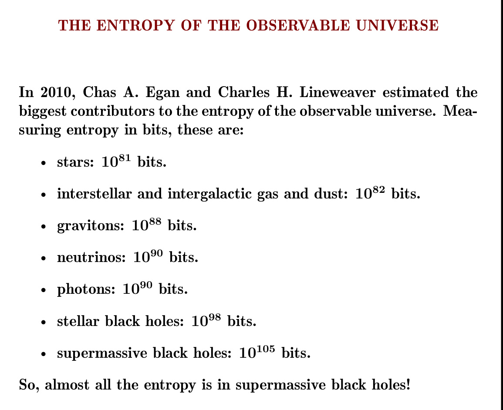  

In 2010, Chas A. Egan and Charles H. Lineweaver estimated the entropy of the observable universe. Entropy corresponds to unknown information, so there’s a heck of a lot we don’t know! For stars, most of this unknown information concerns the details of every single electron and nucleus zipping around in the hot plasma. There’s more entropy in interstellar and intergalactic gas and dust. Most of the gas here is hydrogen—some in molecular form $\mathrm{H_{2}}$ , some individual atoms, and some ionized. For all this stuff, the unknown information again mostly concerns the details, like the position and momentum, of each of these molecules, atoms and ions.  

There’s a lot more we don’t know about the precise details of other particles whizzing through the universe, like gravitons, neutrinos and photons. But there’s even more entropy in black holes! One reason Stephen Hawking is famous is that he figured out how to compute the entropy of black holes. To do that you need a combination of statistical mechanics, general relativity and quantum physics. Statistical mechanics is the study of physical systems where there’s unknown information, which you study using probability theory. I’ll explain some of that in these tweets. General relativity is Einstein’s theory of gravity, and while I’ve explained that elsewhere , I don’t want to get into it here—so I will say nothing about the entropy of black holes.  

Quantum physics was also necessary for Hawking’s calculation, as witnessed by the fact that his answer involves Planck’s constant, which sets the scale of quantum uncertainty in our universe. I will try to steer clear of quantum mechanics in these tweets, but in the end we’ll need a tiny bit of it. There’s a funny sense in which statistical mechanics is somewhat incomplete without quantum mechanics. You’ll eventually see what I mean.  

# THE ENTROPY OF HYDROGEN  

At standard temperature and pressure, hydrogen gas has an entropy of  

130 .68 joule/kelvin per mole But a joule/kelvin of entropy is about $\mathbf{1.0449\cdot10^{23}}$ bits of unknown information and a mole of any chemical is about $\mathbf{6.0221\cdot10^{23}}$ molecules  

So the unknown information about the precise microscopic state of hydrogen is  

130 .68 ·1 6 ..0449 0221 ··10 10 23 23 ≈23 bits per molecule!  

Egan and Lineweaver estimated the entropy of all the interstellar and intergalactic gas and dust in the observable universe. Entropy corresponds to information we don’t know. Their estimate implies that there are $10^{82}$ bits of information we don’t know about all this gas and dust.  

Most of this stuff is hydrogen. Hydrogen is very simple stuff. So it would be good to understand the entropy of hydrogen. You can measure changes in entropy by doing experiments. If you assume hydrogen has no entropy at absolute zero, you can do experiments to figure out the entropy of hydrogen under other conditions. From this you can calculate that each molecule in a container of hydrogen gas at standard temperature and pressure has about 23 bits of information that we don’t know.  

You can see a sketch of the calculation above. But everything about it is far from obvious! What does ‘missing information’ really mean here? Joules are a unit of energy; kelvin is a unit of temperature. So why is entropy measured in joules per kelvin? Why does one joule per kelvin correspond to $1.0449\cdot10^{23}$ bits of missing information? How can we do experiments to measure changes in entropy? And why is missing information the same as—or more precisely proportional to—entropy?  

The good news: all these questions have answers! You can learn them here. However, you will have to persist. Since I’m starting from scratch it won’t be quick. It takes some math—but luckily, nothing much more than calculus of several variables. When you can calculate the entropy of hydrogen from first principles, and understand what it means, that will count as true success.  

See how it goes! Partial success is okay too.  

The mystery: why does each molecule of hydrogen have of entropy at standard temperature and pressure? $\sim23$ bits The goal: derive and understand the formula for the entropy of a classical ideal monatomic gas:  

$$
S=k N\left({\frac{3}{2}}\ln k T+\ln{\frac{V}{N}}+\gamma\right)
$$  

including the mysterious constant $\gamma$ .  

The subgoal: compute the entropy of a single classical particle in a 1-dimensional box.  

The sub-subgoal: explain entropy from the ground up, and compute the entropy of a classical harmonic oscillator.  

To understand something deeply, it can be good to set yourself a concrete goal. To avoid getting lost in the theory of entropy, let’s try to understand the entropy of hydrogen gas. This is a ‘diatomic’ gas since a hydrogen molecule has two atoms. At standard temperature and pressure it’s close to ‘ideal’, meaning the molecules don’t interact much. It’s also close to ‘classical’, meaning we don’t need to know quantum mechanics to do this calculation. Also, when the hydrogen is not extremely hot, its molecules don’t vibrate much—but they do tumble around.  

Given all this, we can derive a formula for the entropy $S$ of some hydrogen gas as a function of its temperature $T$ , the number $N$ of molecules, the volume $V$ , and a physical constant $k$ called ‘Boltzmann’s constant’. This formula also involves a rather surprising constant which I’m calling $\gamma$ . We’ll figure that out too. It’s so weird I don’t want to give it away!  

As a warmup, we will derive the formula for the entropy of an ideal ‘monatomic’ gas—a gas made of individual atoms, like helium or neon or argon. Sackur and Tetrode worked this out in 1912. Their result, called the Sackur–Tetrode equation, is similar to the one for a diatomic gas.  

But before doing a monatomic gas, we’ll figure out the entropy of a single atom of gas in a box. That turns out to be a good start, since in an ideal monatomic gas the atoms don’t interact, and the entropy of $N$ atoms—as we’ll see—is just $N$ times the entropy of a single atom.  

But before we can do any of this, we need to understand what entropy is, and how to compute it. It will take quite a bit of time to compute the entropy of a classical harmonic oscillator! But from then on, the rest is surprisingly quick.  

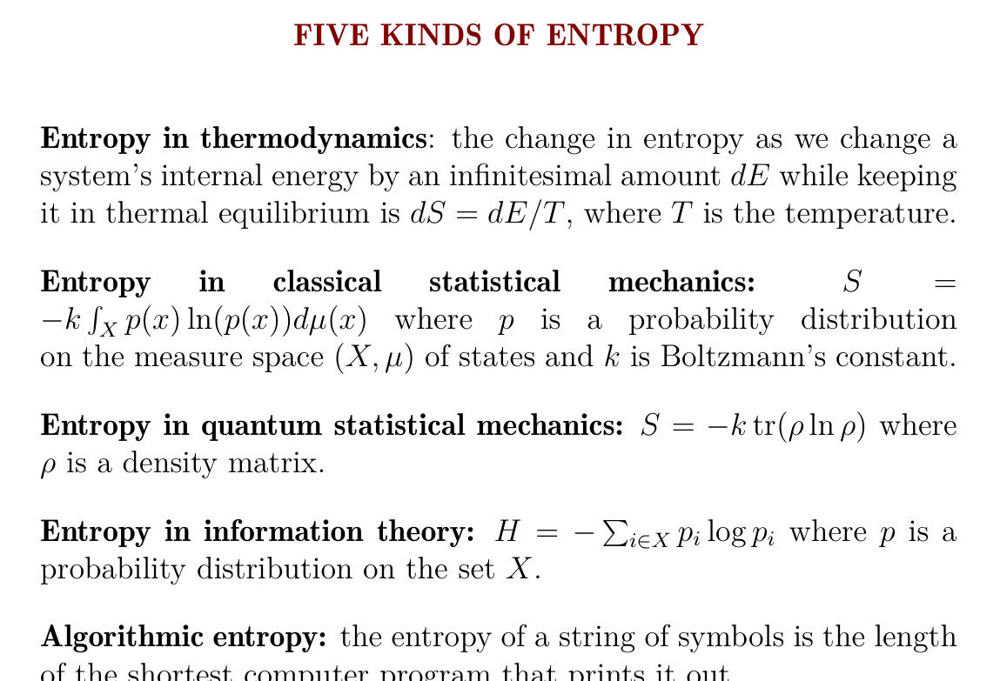  

Before I actually start explaining entropy, a warning: it can be hard at first to learn about entropy because there are many kinds—and people often don’t say which kind they’re talking about. Here are 5 kinds. Luckily, they are closely related!  

In thermodynamics we primarily have a formula for the change in entropy: if you change the internal energy of a system by an infinitesimal amount $d E$ while keeping it in thermal equilibrium, the infinitesimal change in entropy is $d S=d E/T$ where $T$ is the temperature.  

Later, in classical statistical mechanics, Gibbs explained entropy in terms of a probability distribution $p$ on the space of states of a classical system. In this framework, entropy is the integral of $-p\ln p$ times a constant $k$ called Boltzmann’s constant.  

Later von Neumann generalized Gibbs’ formula for entropy from classical to quantum statistical mechanics! He replaced the probability distribution $p$ by a so-called density matrix $\rho$ , and the integral by a trace.  

Later Shannon invented information theory, and a formula for the entropy of a probability distribution on a set (often a finite set). This is often called ‘Shannon entropy’. It’s just a special case of Gibbs’ formula for entropy in classical statistical mechanics, but without the Boltzmann’s constant.  

Later still, Kolmogorov invented a formula for the entropy of a specific string of symbols. It’s just the length of the shortest program, written in bits, that prints out this string. It depends on the computer language, but not too much.  

There’s a network of results connecting all these 5 concepts of entropy. I will first explain Shannon entropy, then entropy in classical statistical mechanics, and then entropy in thermodynamics. While this is the reverse of the historical order, it’s the easiest way to go.  

I will not explain entropy in quantum statistical mechanics: for that I would feel compelled to teach you quantum mechanics first. Nor will I explain algorithmic entropy.  

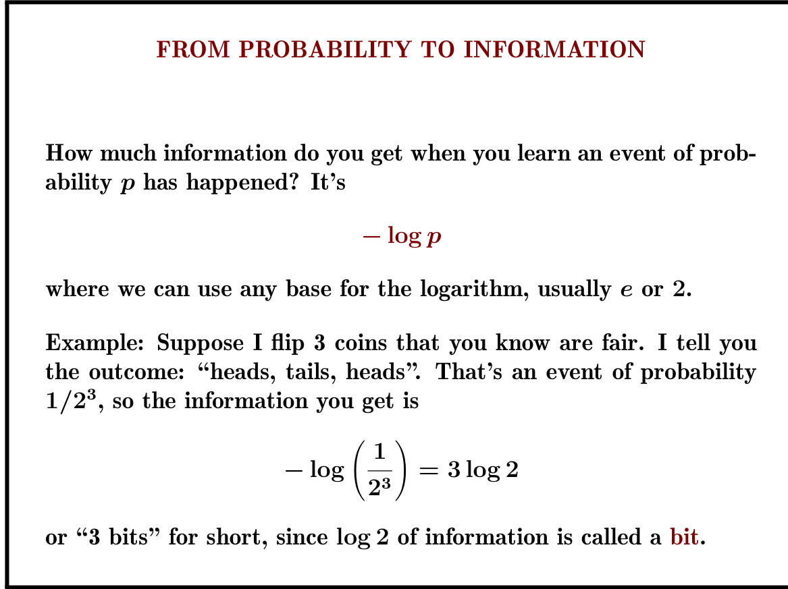  

Here is the simplest link between probability and information: when you learn that an event of probability $p$ has happened, how much information do you get? We say it’s $-\log p$ . We take a logarithm so that when you multiply probabilities, information adds. The minus sign makes information come out positive.  

Beware: when I write ‘ log ’ I don’t necessarily mean the logarithm base 10. I mean that you can use whatever base for the logarithm you want; this choice is like a choice of units. Whatever base $b$ you decide to use, I’ll call $\log_{b}2$ a ‘bit’. For example, if I flip a single coin that you know is fair, and you see that it comes up heads, you learn of an event that’s of probability $1/2$ , so the amount of information you learn is  

$$
-\log_{b}{\frac{1}{2}}=\log_{b}2.
$$  

That’s one bit! Of course if you use base $b=2$ then this logarithm actually equals 1, which is nice.  

To understand the concept of information it helps to do some puzzles.  

Puzzle 1. First I flip 2 fair coins and tell you the outcome. Then I flip 3 more and tell you the outcome. How much information did you get?  

Puzzle 2. I roll a fair 6-sided die and tell you the outcome. Approximately how much information do you get, using logarithms base 2?  

Puzzle 3. When you flip 7 fair coins and tell me the outcome, how much information do I get?  

Puzzle 4. Every day I eat either a cheese sandwich, a salad, or some fried rice for lunch— each with equal probability. I tell you what I had for lunch today. Approximately how many bits of information do you get?  

Puzzle 5. I have a trick coin that always lands heads up. You know this. I flip it 5 times and tell you the outcome. How much information do you receive?  

Puzzle 6. I have a trick coin that always lands heads up. You believe it’s a fair coin. I flip it 5 times and tell you the outcome. How much information do you receive?  

Puzzle 7. I have a trick coin that always lands with the same face up. You know this, but you don’t know which face always comes up. I flip it 5 times and tell you the outcome. How much information do you receive?  

These puzzles raise some questions about the nature of probability, like: is it subjective or objective? People like to argue about those questions. But once we get a probability $p$ , we can convert it to information by computing $-\log p$ .  

# UNITS OF INFORMATION  

An event of probability ${\mathbf{1}}/{\mathbf{2}}$ carries one bit of information. An event of probability $1/e$ carries one nat of information. An event of probability $\mathbf{1/3}$ carries one trit of information.   
An event of probability ${\bf1}/{\bf4}$ carries one crumb of information.   
An event of probability $\mathbf{1}/\mathbf{10}$ carries one hartley of information.   
An event of probability $\mathbf{1}/\mathbf{16}$ carries one nibble of information.   
An event of probability $\mathbf{1}/\mathbf{256}$ carries one byte of information.  

An event of probability $\mathbf{1/2^{8192}}$ carries one kilobyte of information.  

There are many units of information. Using information $=-\log{p}$ we can relate these to probabilities. For example if you see a number in base 10, and each digit shows up with probability $1/10$ , the amount of information you get from each digit is one ‘hartley’.  

How many bits are in a hartley? Remember: no matter what base you use, I call $\log10$ a hartley and $\log2$ a bit. There are $\log10/\log2$ bits in a hartley. This number has the same value no matter what base you use for your logarithms! If you use base 2, it’s  

$$
\log_{2}10/\log_{2}2=\log_{2}10\approx3.32.
$$  

So a hartley is about 3.32 bits.  

If you flip 8 fair coins and tell me what answers you got, I’ve learned of an event that has probability $1/2^{8}=1/256$ . We say I’ve received a ‘byte’ of information. This equals 8 bits of information. Similarly, if you flip $1024\times8$ fair coins and tell me the outcome, I receive a kilobyte of information.  

Or at least that’s the old definition. Now many people define a kilobyte to be 1000 bytes rather than 1024 bytes, in keeping with the usual meaning of the prefix. If you want 1024 bytes you’re supposed to ask for a ‘kibibyte’. When we get to a terabyte, the new definition based on powers of 10 is about $10\%$ less than the old one based on powers of 2: $10^{12}$ bytes rather than $2^{40}\,\approx\,1.0995\,\times\,10^{12}$ . If you want the old larger amount of information you should ask for a ‘tebibyte’.  

Wikipedia has an article that lists many strange units of information . Did you know that 2 bits is a ‘crumb’? Did you even need to know? No, but now you do.  

Feel free to dispose of this unnecessary information! All this is just for fun—but I want you to get used to the formula  

$$
{\mathrm{information}}=-\log p
$$  

# THE INFORMATION IN A LICENSE PLATE NUMBER  

  
If there are $\mathbf{\deltaN}$ different possible license plate numbers, all equally likely, how many bits of information do you learn when you see one?  

If you think $N$ alternatives are equally likely, when you see which one actually occurs, you gain an amount of information equal to $\log_{b}{N}$ . Here the choice of base $b$ is up to you: it’s a choice of units. But what is this in bits? No matter what base you use,  

$$
\log_{b}N=\log_{2}N\times\log_{b}2.
$$  

Since we call $\log_{b}2$ a ‘bit’, this means you’ve learned $\log_{2}N$ bits of information. Let’s try it out!  

Puzzle 8. Suppose a license plate has 7 numbers and/or letters on it. If there are 10+26 choices of number and/or letter, there are $36^{7}$ possible license plate numbers. If all license plates are equally likely, what’s the information in a license plate number in bits—approximately?  

  

But wait! Suppose I tell you that all license plate numbers have a number, then 3 letters, then 3 numbers! You have just learned a lot of information. So the remaining information content of each license plate is presumably less. Let’s work it out.  

Puzzle 9. How much information is there in a license plate number if they all have a number, then 3 letters, then 3 numbers? (Assume they’re all equally probable and there are 10 choices of each number and 26 choices of each letter.)  

The moral: when you learn more about the possible choices, the information it takes to describe a choice drops.  

# THE INFORMATION IN A LICENSE PLATE  

How much unknown information do the atoms in a license plate contain?  

Aluminum has an entropy of about 28 joules/kelvin per mole at standard temperature and pressure. A mole of aluminum weighs about 27 grams. A typical license plate might weigh 150 grams, and thus have  

$$
\mathbf{150~g\times\frac{28~J/K\cdotmole}{27~g/m o l e}\approx160~J/K}
$$  

of entropy. But a joule/kelvin of entropy is about $\mathbf{10^{23}}$ bits of unknown information. Thus, the atoms in such a license plate contain about  

$$
160\times10^{23}\;\;\mathrm{bits}\approx1.6\cdot10^{25}\;\mathrm{bits}
$$  

of unknown information.  

Last time we talked about the information in a license plate number. A license plate number made of 7 numbers and/or letters contains  

$$
\log_{2}(36^{7})\approx36.189
$$  

bits of information if all combinations are equally likely. How does this compare to the information in the actual metal of the license plate?  

These days most license plates are made of aluminum, and they weigh roughly between 100 and 200 grams. Let’s say 150 grams. If we work out the entropy of this much aluminum, and express it in bits of unknown information, we get an enormous number: roughly  

# 16 ,000 ,000 ,000 ,000 ,000 ,000 ,000 ,000 bits !  

Here is the point. While the information on the license plate and the information in the license plate can be studied using similar mathematics, the latter dwarfs the former. Thus, when we are doing chemistry and want to know, for example, how much the entropy of the license plate increases when we dissolve it in hydrochloric acid, the information in the writing on the license plate is irrelevant for all practical purposes.  

Some people get fooled by this, in my opinion, and claim that “information” and “entropy” are fundamentally unrelated. I disagree.  

# JUSTIFYING THE FORMULA FOR INFORMATION  

Why do we say the information of an event of probability $\pmb{p}$ is  

$$
I(p)=-\log_{b}p
$$  

for some base $b>1?$ Here’s why:  

Theorem . Suppose $I\colon(0,1]\rightarrow\mathbb{R}$ is a function that is:  

1. Decreasing: $\pmb{p}<\pmb{q}$ implies $\pmb{I}(p)>\pmb{I}(q)$ . This says less probable events have more information.  

2. Additive: $I(p q)=I(p)\!+\!I(q)$ . This says the information of the combination of two independent events is the sum of their separate informations.  

Then for some $\boldsymbol{b}>1$ we have $I(p)=-\log_{b}p$ .  

The information of an event of probability $p$ is $-\log p$ , where you get to choose the base of the logarithm. But why? This is the only option if we want less probable events to have more information, and information to add for independent events.  

Proving this will take some math—but don’t worry, you won’t need to know this stuff for the rest of this ‘course’.  

Since we’re trying to prove $I(p)$ is a logarithm function, let’s write  

$$
I(p)=f(\ln(p))
$$  

and prove $f$ has to be linear:  

$$
f(x)=c x.
$$  

As we’ll see, this gets the job done.  

Writing $I(p)=f(x)$ where $x=\ln{p}$ , we can check that Condition 1 above is equivalent to  

Similarly, we can check that Condition 2 is equivalent to  

$$
f(x+y)=f(x)+f(y){\mathrm{~for~all~}}x,y\leq0.
$$  

Now what functions $f$ have  

$$
f(x+y)=f(x)+f(y)
$$  

for all $x,y\leq0$ ?  

If we define $f(-x)=-f(x)$ ,$f$ will become a function from the whole real line to the real numbers, and it will still obey $f(x+y)=f(x)+f(y)$ . So what functions obey this equation? The obvious solutions are  

$$
f(x)=c x
$$  

for any real constant c. But are there any other solutions?  

Yes , if you use the axiom of choice !Treat the reals as a vector space over the rationals. Using the axiom of choice, pick a basis. To get $f\colon\ensuremath{\mathbb{R}}\to\ensuremath{\mathbb{R}}$ that’s linear over the rational numbers, just let $f$ send each basis element to whatever real number you want and extend it to a linear function defined on all of $\mathbb{R}$ . This gives a function $f$ that obeys $f(x+y)=f(x)+f(y)$ .  

However, no solutions of $f(x+y)=f(x)+f(y)$ meet our other condition except for the familiar ones $f(x)\;=\;c x$ .For a proof see Wikipedia: they show all solutions except the familiar ones are so discontinuous their graphs are dense in the plane!  

• Wikipedia, Cauchy’s functional equation .  

So, our conditions imply $f(x)=c x$ for some $c$ , and since $f$ is decreasing we need $c<0$ .So our formula $I(p)=f(\ln p)$ says  

$$
I(p)=c\ln p
$$  

but this equals $-\log_{b}p$ if we take $b=\exp(-1/c)$ . And this number $b$ can be any number $>1$ . QED.  

Thus, if we want a more general concept of the information associated to a probability, we need to drop Condition 1 or 2. For example, we could replace additivity by some other rule. People have tried this! Indeed, there is a world of generalized entropy concepts including Tsallis entropies ,Rényi entropies and others.  

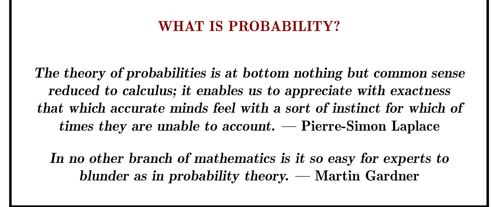  

Since I’ve defined information in terms of probability, you may naturally wonder “what is probability?” I won’t seriously try to answer this. This question has stirred up many debates over the centuries, and even today there’s not a fully accepted answer. It deserves a whole book—and this is not that book. Luckily, we don’t really need to know exactly what probability is to do calculations with it: we mainly need to set up some rules for working with it. This may seem like a cop-out. But it’s a strange and wonderful feature of science that we can achieve great reliability in our results by sidestepping certain difficult questions, like someone who can make their way safely through a jungle by avoiding the quicksand and snakes.  

One approach to probability goes like this. Suppose you repeat some experiment $N$ times, doing your best to make the conditions the same each time. Suppose that $M$ of these times some event $E$ occurs. You may then say that the probability of event $E$ happening under these conditions is $M/N$ . This approach is called ‘finite frequentism’. Unfortunately, this approach can lead you to say a coin has probability 1 of landing heads up if it does so the first time, or first 3 times, you flip it.  

Another approach goes like this. You may say that some event $E$ has probability $p$ under some conditions if when you set up these conditions $N$ times, and the event $E$ happens $M$ times, the fraction $M/N$ approaches $p$ in the limit $N\rightarrow\infty$ . This approach is called ‘hypothetical frequentism’, because in real experiments you can’t take the limit $N\to\infty$ . But you can hope that when $N$ becomes large enough, the fraction $M/N$ usually becomes close to the limiting probability $p$ —whatever that means.  

Another approach, called ‘Bayesianism’, treats a probability of an event $E$ under some specified conditions as a measure of your degree of belief that $E$ will happen under these conditions. But what is ‘degree of belief’? One answer involves bets. For example, perhaps to believe an event has probability $1/2$ means you’re willing to take a bet where you win more when the event happens than you lose if it does not.  

Bayesians tend to focus on the rules for updating your probabilities as you learn new things, the most famous being ‘ Bayes’ rule ’. Even if agents start by assigning different probabilities to an event, if they follow the same rules for changing these probabilities as they learn new things, under certain circumstances we can prove their probabilities will converge to the same value.  

For a passionate and intelligent discussion of these issues, I recommend E. T. Jaynes’ book Probability Theory: the Logic of Science . Later we’ll meet his ‘principle of maximum entropy’, another important approach to working with probabilities.  

# PROBABILITY MEASURES  

A measure on a set $\boldsymbol{X}$ is a function that assigns to certain so-called measurable subsets $S\ \subseteq\ X$ a number $m(S)\;\in\;[0,\infty]$ , obeying these rules:  

•$\emptyset,X\subseteq X$ are measurable and  

$$
m({\mathfrak{V}})={\mathbf{0}}
$$  

•If $S,T\ \subseteq\ X$ are measurable and $s\subseteq T$ , then $\mathbf{\nabla}T\,-\,S$ is measurable and  

$$
m(T)=m(S)+m(T-S)
$$  

•If a countable collection of disjoint subsets $S_{i}\subseteq X$ are measurable, then their union is measurable and  

$$
m\left(\bigcup_{i=1}^{\infty}S_{i}\right)=\sum_{i=1}^{\infty}m(S_{i})
$$  

We say $\mathbf{\nabla}m$ is a probability measure if $m(X)={\bf1}$ .  

It is easier to do calculations with probabilities than say exactly what they mean! I will take a rough-and-ready approach to working with them, but first let’s take a peek at how mathematicians do it. If you don’t care, it’s safe to move right on to the next tweet.  

We start with any set. We call elements of $X$ ‘outcomes’ and subsets of $X$ ‘events’. We can sometimes get into trouble trying to assign a probability to every subset of $X$ . So, we’ll only try to assign probabilites to events in some collection $\mathcal{M}$ with these properties:  

•$\emptyset\in{\mathcal{M}}$ and $X\in{\mathcal{M}}$ .  

• If $S,T\in M$ d$S\subseteq T$ then the set of elements of $T$ that are not in $S$ , called $T-S$ , is in M.  

• If $S_{i}\in{\mathcal{M}}$ for $i=1,2,\dots$ .then the uni $\cup_{i=1}^{\infty}\,S_{i}$ is in $\mathcal{M}$ .  

We call elements of Mmeasurable subsets of X. A measure is then a function $m\colon\mathcal{M}\rightarrow$ $[0,\infty]$ obeying these rules:  

•$m({\varnothing})=0$  

• If $S,T\in M$ and $S\subseteq M$ then $m(T)=m(S)+m(T-S)$ .  

• If $S_{i}\in{\mathcal{M}}$ then $m\left(\bigcup_{i=1}^{\infty}S_{i}\right)=\sum_{i=1}^{\infty}m(S_{i})$ ).  

If $m$ also obeys $m(X)=1$ then we say $m$ is a robability measure , and for any $S\in{\mathcal{M}}$ we say $m(S)$ is the probability of the event S. But we will also be interested in other measures, like the measure on the real line called ‘ Lebesgue measure ’. This is closely connected to the symbol $\cdot\,d x$ ’ that shows up in integrals, because for any measurable set $S\subseteq\mathbb{R}$ , its Lebesgue measure is  

$$
\int_{-\infty}^{\infty}\chi_{S}(x)\,d x
$$  

ere $\chi_{S}(x)$ is $1$ for $x\in S$ and $\boldsymbol{0}$ for $x\not\in S$ . Indeed, people often get sloppy and say dx ‘is’ Lebesgue measure, and I may do that too. By the way, Lebesgue measure is one where we cannot take $\mathcal{M}$ to be the collection of all subsets of $\mathbb{R}$ .  

There is an extensive theory of measures. We will not need it here, but if you’re interested, you can try a book like Halsey Royden’s Real Analysis , where I learned the basics myself, or Terry Tao’s An Introduction to Measure Theory , which has a legal free version online.  

Here are some puzzles about measures.  

Puzzle 10. Let $X$ be any set and define $\mathcal{M}$ to be the collection of all subsets of $X$ .Show that there is a measure $m\colon\mathcal{M}\rightarrow[0,\infty]$ alled cou ing measure such that for any $S\subseteq X$ ,$m(S)$ is the number of elements of S, or $\infty$ if Sis infinite.  

Puzzle 11. Let $X$ be any set and define $\mathcal{M}$ as before. Suppose $p$ is a probability distribution on $X$ , meaning a $p\colon X\to[0,\infty)$ with $\textstyle\sum_{i\in X}p(i)=1$ ) = 1. Show that there is a probability measure $m\colon\mathcal{M}\rightarrow[0,\infty]$ M → ∞] such that for any $S\subseteq X$ ,  

$$
m(S)=\sum_{i\in S}p(i).
$$  

In this situation we usually write $p(i)$ as $p_{i}$ and call it the probability of the outcome $i\in X$ . For any $S\subseteq M$ we call $m(S)$ the probability of the event $S$ .  

In the next pu es $X$ is any set, $\mathcal{M}$ obeys the three rules for a collection of measurable subsets of X, and $m\colon\mathcal{M}\rightarrow[0,\infty]$ is a measure.  

Puzzle 12. Show that if $S,T\in M$ then the union $S\cup T$ is in $\mathcal{M}$ .  

Puzzle 13. Show that if $S,T\in M$ then the intersection $S\cap T$ is in $\mathcal{M}$ .  

Puzzle 14. Show that if $S_{i}\in\mathcal{M}$ or $i=1,2,\dots$ .the tion $\cap_{i=1}^{\infty}\,S_{i}$ is in $\mathcal{M}$ .  

Puzzle 15. Show that if $S,T\in M$ ∈M and $S\subseteq T$ ⊆then $m(S)\leq m(T)$ ≤).  

Puzzle 16. Show that if $S_{i}\in\mathcal{M}$ for $i=1,2,\dots$ .then  

$$
m\left(\bigcup_{i=1}^{\infty}S_{i}\right)\leq\sum_{i=1}^{\infty}m(S_{i}).
$$  

Puzzle 17. Show that if ${\mathit{m}}$ is a probability measure and $S\in{\mathcal{M}}$ then $0\leq m(S)\leq1$ .  

One of the main uses of a measure $m$ on a space $X$ is that it lets us integrate certain functions $f\colon X\to\mathbb{R}$ . Alas, not all functions! It’s only reasonable to try to integrate measurable functions $f\colon X\to\mathbb{R}$ , which have the property that if $S\subseteq\mathbb{R}$ is measurable, its inverse image $f^{-1}(S)\subseteq X$ is measurable. And even measurable functions can cause trouble, because when we try to integrate them we might get $+\infty$ ,$-\infty$ , or something even worse. For example, what’s  

$$
\int_{-\infty}^{\infty}x^{2}\sin x\,d x?
$$  

There’s no good ans er. We say a function $f\colon X\to\mathbb{R}$ is integrable if it is measurable and its integral over X, defined in a certain way I won’t explain here, gives a well-defined real number.  

# SHANNON ENTROPY: A FIRST TASTE  

When you learn an event of probability $\pmb{p}$ has happened, the amount of information you get is $-\log p$ .  

Question. Suppose you know a coin lands heads $\mathbf{up\textsubscript{\frac{2}{3}}}$ of the time and tails up $\frac{1}{3}$ of the time. What is the average or ‘expected’ amount of information you get when you learn which side landed up?  

time you get Answer. get is $\frac{2}{3}$ of the time you get $-\log{\frac{1}{3}}$ . So, the expected amount of information you $-\log{\frac{2}{3}}$ of information, and $\frac{1}{3}$ of the  

$$
-\textstyle{\frac{2}{3}}\log{\frac{2}{3}}-{\frac{1}{3}}\log{\frac{1}{3}}
$$  

You can do the same thing whenever you have any number of probabilities that add to 1. The expected information is called the Shannon entropy .  

You flip a coin. You know the probability that it lands heads up. How much information do you get, on average, when you discover which side lands up? It’s not hard to work this out. It’s a simple example of ‘Shannon entropy’. Roughly speaking, entropy is information that you don’t know , that you could get if you did enough experiments. Here the experiment is simply flipping the coin and looking at it.  

Puzzle 18. Suppose you know a coin lands heads up $\frac{1}{2}$ of the time and tails up $\frac{1}{2}$ of the time. What is the expected amount of information you get from a coin flip? If you use base 2 for the logarithm, you get the expected information measured in bits. What do you get?  

Puzzle 19. Suppose you know a coin lands heads up $\frac13$ of the time and tails up $\frac{2}{3}$ of the time. What is the expected amount of information you get from a coin flip?  

Puzzle 20. Suppose you know a coin lands heads up $\frac{1}{4}$ of the time and tails up $\frac34$ of the time. What is the expected amount of information you get from a coin flip, in bits?  

If you solve these you’ll see a pattern: the Shannon entropy is biggest when the coin is fair. As it becomes more and more likely for one side to land up than the other, the entropy drops. You’re more sure about what will happen... so you learn less, on average, from seeing what happens!  

We’ve been doing examples where your experiment has just two possible outcomes: heads up or down. But you can do Shannon entropy for any number of outcomes. It measures how ignorant you are of what will happen. That is: how much you learn on average when it does!  

According to the weather report there’s a $\frac14$ chance that it will rain 1 centimeter, a $\frac{1}{2}$ chance it will rain 2 centimeters, and a $\frac14$ chance it will rain 3 centimeters.  

Question. What is the ‘expected’ amount of rainfall?  

Answer. $\textstyle{\frac{1}{4}}\cdot\mathbf{1}+{\frac{1}{2}}\cdot\mathbf{2}+{\frac{1}{4}}\cdot\mathbf{3}=2$ centimeters.  

Question. What is the ‘expected’ amount of information you learn when you find out how much it rains?  

$\frac{3}{2}$ Answer. bits. This is the −$\begin{array}{r}{-\frac{1}{4}\log\frac{1}{4}-\frac{1}{2}\log\frac{1}{2}-\frac{1}{4}\log\frac{1}{4}=\frac{3}{2}\log2}\end{array}$ Shannon entropy of the weather report. , or in other words,  

If the weather report tells you it’ll rain different amounts with different probabilities, you can figure out the ‘expected’ amount of rain. You can also figure out the expected amount of information you’ll learn when it rains. This is called the ‘Shannon entropy’.  

Shannon entropy is closely connected to information, but we can also think of it as a measure of ignorance. This may seem paradoxical. But it’s not. Shannon entropy is the expected amount of information that you don’t know when all you know is a probability distribution, which you will know when you see a specific outcome chosen according to this probability distribution.  

For example, consider a weather report that says it will rain 1 centimeter with probability 0, 2 centimeters with probability 1, and 3 centimeters with probability $0$ .The Shannon entropy of this weather report is  

$$
-0\log0-1\log1-0\log0=0
$$  

since by convention we set $p\log p=0$ when $p=0$ , this being the limit of $p\ln p$ as $p$ approaches 0 from above.  

What does it mean that this weather report has zero Shannon entropy? It means that when we see a specific outcome chosen according to this probability distribution, we learn nothing! The weather report says it will rain 2 centimeters with probability 1. When this happens, we learn nothing that the weather report didn’t already tell us.  

The Shannon entropy doesn’t depend on the amounts of rain, or even whether the forecast is about centimeters of rain or dollars of income. It only depends on the probabilities of the various outcomes. So Shannon entropy is a universal, abstract concept.  

Shannon entropy is closely connected to Gibbs entropy, which was already known in physics. But by lifting entropy to a more general level and connecting it to digital information, Shannon helped jump-start the information age. In fact a paper of his was the first to use the word ‘bit’!  

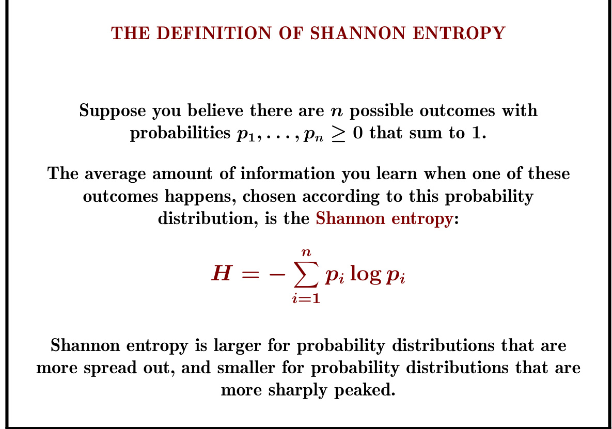  

I’ve been leading up to it with examples, but here it is in general: Shannon entropy! Gibbs had already used a similar formula in physics—but with base $e$ for the logarithm, an integral instead of a sum, and multiplying the answer by Boltzmann’s constant. Shannon applied it to digital information.  

Here’s where the formula for Shannon entropy comes from. We have some set of outcomes, say $X$ . We have a probability distribution on this set, meaning a function $p\colon X\to[0,1]$ such that  

$$
\sum_{i\in X}p_{i}=1.
$$  

If we have any function $A\colon X\rightarrow\mathbb{R}$ , we define its expected value to be  

$$
\langle A\rangle=\sum_{i\in X}p_{i}A_{i}.
$$  

It’s a kind of average of $A$ where each value $A(i)$ is ‘weighted’, i.e. multiplied, by the probability of the $i$ th outcome. We saw an example in the last tweet: the expected amount of rainfall.  

We’ve seen that if you believe the $i$ th outcome has probability $p_{i}$ , the amount of information you learn if the $i$ th outcome actually occurs is $-\log p_{i}$ . Thus, the expected amount of information you learn is  

$$
\langle-\log p\rangle=-\sum_{i\in X}p_{i}\log p_{i}.
$$  

And this is the Shannon entropy ! We denote it by $H$ , or more precisely $H(p)$ , so  

$$
H(p)=-\sum_{i\in X}p_{i}\log p_{i}.
$$  

In the box above I was taking $X$ to be the set $\{1,\ldots,n\}$ . This is often a good thing to do when there are finitely many outcomes.  

Let’s get to know the Shannon entropy a little better.  

Puzzle 21. Let $X\,=\,\{1,2\}$ so that we know a probability distribution $p$ on $X$ if we know $p_{1}$ , since $p_{2}=1-p_{1}$ . Graph the Shannon entropy $H(p)$ as a function of $p_{1}$ . Show that it has a maximum at $\begin{array}{r}{p_{1}=\frac{1}{2}}\end{array}$ and minima at $p_{1}=0$ and $p_{1}=1$ .  

This makes sense: if you believe $p_{1}~=~1$ then you learn nothing when an outcome happens chosen according to the probability distribution $p$ : you are sure outcome 1 will occur, and it does (with probability 1). Similarly, if you believe $p_{1}=0$ you learn nothing when an outcome happens according to this probability distribution, since you are sure outcome 2 will occur. On the other hand, if $\begin{array}{r}{p_{1}=\frac{1}{2}}\end{array}$ you are maximally undecided about what will happens, and you learn 1 bit of information when it does.  

Puzzle 22. Let $X\,=\,\{1,2,3\}$ . Draw the set of probability distributions on $X$ as an equilateral triangle whose corners are the probability distributions $(1,0,0)$ ,$(0,1,0)$ ,and $(0,0,1)$ . Sketch contour lines of $H(p)$ as a function on this triangle. Show it has a maximum at $\begin{array}{r}{p=\left(\frac{1}{3},\frac{1}{3},\frac{1}{3}\right)}\end{array}$ ) and minima at the corners of the triangle.  

Again this should make intuitive sense. Here is a harder puzzle along the same lines:  

Puzzle 23. Let $X=\{1,\ldots,n\}$ . Show that $H(p)$ has a maximum at $\textstyle p=({\frac{1}{n}},\dots,{\frac{1}{n}})$ ) and minima at the probability distributions where $p_{i}=1$ for some particular $i\in X$ .  

Here is one of the big lessons from all this:  

Shannon entropy is larger for probability distributions that are more spread out, and smaller for probability distributions that are more sharply peaked.  

Indeed, you can think of Shannon entropy as a measure of how spread out a probability distribution is! The more spread out it is, the more you learn when an outcome occurs, drawn from that distribution.  

Another important way to think about Shannon entropy is that it sets a limit on how much we can compress messages that are drawn from a given probability distribution. This is made precise by a theorem Shannon proved in his original 1948 paper. I won’t explain it here, but this result is fundamental for understanding the role of entropy in communication and data storage:  

• Wikipedia, Shannon’s source coding theorem .  

• Claude E. Shannon, A mathematical theory of communication ,Bell System Technical Journal 27 (1948), 379–423, 623–656.  

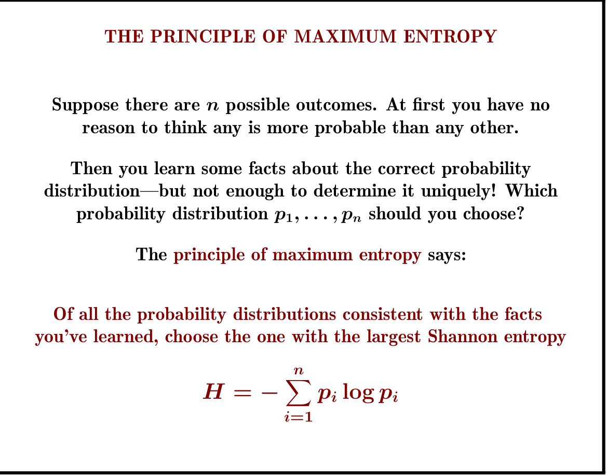  

What’s Shannon entropy good for? For starters, it gives a principle for choosing the ‘best’ probability distribution consistent with what you know. Choose the one that maximizes the Shannon entropy!  

This is called the ‘principle of maximum entropy’. This principle first arose in statistical mechanics, which is the application of probability theory to physics—but we can use it elsewhere too.  

For example: suppose you have a die with faces numbered 1,2,3,4,5,6. At first you think it’s fair. But then you somehow learn that the average of the numbers that comes up when you roll it is 5. Given this, what’s the probability that if you roll it, a 6 comes up?  

Sounds like an unfair question! But you can figure out the probability distribution on $\{1,2,3,4,5,6\}$ that maximizes Shannon entropy subject to the constraint that the mean is 5. According to the principle of maximum entropy, you should use this to answer my question!  

But is this correct?  

The problem is figuring out what ‘correct’ means! But in statistical mechanics we use the principle of maximum entropy all the time, and it seems to work well. The brilliance of E. T. Jaynes was to realize it’s a general principle of reasoning, not just for physics.  

The principle of maximum entropy is widely used outside physics, though still controversial. But I think we should use it to figure out some basic properties of a gas—like its energy or entropy per molecule, as a function of pressure and temperature.  

To do this, we should generalize Shannon entropy to ‘Gibbs entropy’, replacing the sum by an integral. Or else we should ‘discretize’ the gas, assuming each molecule has a finite set of states. It sort of depends on whether you prefer calculus or programming. Either approach is okay if we study our gas using classical statistical mechanics.  

Quantum statistical mechanics gives a more accurate answer. It uses a more general definition of entropy—but the principle of maximum entropy still applies!  

I won’t dive into any calculations just yet. Before doing a gas, we should do some simpler examples—like the die whose average roll is 5. But I can’t resisting mentioning one philosophical point. In the box above I was hinting that maximum entropy works when your ‘prior’ is uniform:  

# Suppose there are $\mathbf{\nabla}^{\mathcal{n}}$ possible outcomes. At first you have no reason to think any is more probable than any other.  

This is an important assumption: when it’s not true, the principle of maximum entropy as we’ve stated it does not apply. But what if our set of events is something like a line? There’s no obvious best probability measure on the line! And even good old Lebesgue measure $d x$ depends on our choice of coordinates. To handle this, we need a generalization of the principle of maximum entropy, called the principle of maximum relative entropy.  

In short, a deeper treatment of the principle of maximum entropy pays more attention to our choice of ‘prior’: what we believe before we learn new facts. And it brings in the concept of ‘ relative entropy ’: entropy relative to that prior. But we won’t get into this here, because we will always be using a very bland prior, like assuming that each of finitely many outcomes is equally likely.  

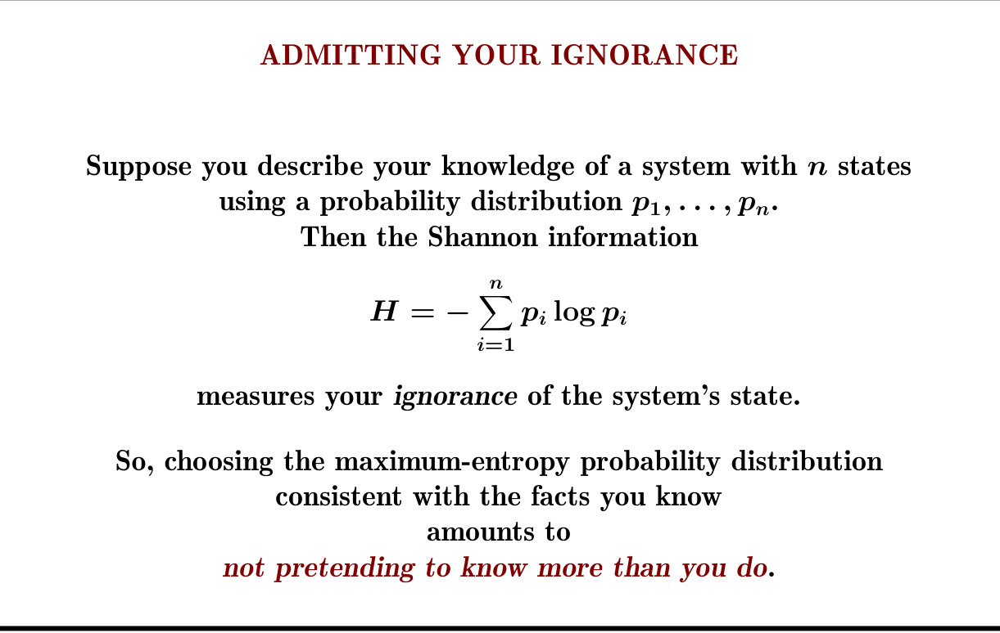  

Remember: if we describe our knowledge using a probability distribution, its Shannon entropy says how much we expect to learn when we find out what’s really going on. We can roughly say it measures our ‘ignorance’—though ordinary language can be misleading here.  

  

At first you think this ordinary 6-sided die is fair. But then you learn that no, the average of the numbers that come up is 5. What are the probabilities $p_{1},\ldots,p_{n}$ for the different faces to come up?  

This is tricky: you can imagine different answers!  

You could guess the die lands with 5 up every time. In other words, $p_{5}=1$ . This indeed gives the correct average. But the entropy of this probability distribution is $0$ .So you’re claiming to have no ignorance at all of what happens when you roll the die!  

Next you might guess that it lands with 4 up half the time and 6 up half the time. In other words, $\begin{array}{r}{p_{4}=p_{6}=\frac{1}{2}}\end{array}$ . This probability distribution has 1 bit of entropy. Now you are admitting more ignorance. But how can you be so sure that 5 never comes up?  

Next you might guess that $\begin{array}{r}{p_{4}=p_{6}=\frac{1}{4}}\end{array}$ and $\begin{array}{r}{p_{5}=\frac{1}{2}}\end{array}$ . We can compute the entropy of this probability distribution. It’s higher: 1.5 bits. Good, you’re being more honest now! But how can you be sure that 1, 2, or 3 never come up? You are still pretending to know stuff!  

Keep improving your guess, finding probability distributions with mean 5 with bigger and bigger entropy. The bigger the entropy gets, the more you’re admitting your ignorance! If you do it right, your guess will converge to the unique maximum-entropy solution.  

But there’s a more systematic way to solve this problem.  

# THE BOLTZMANN DISTRIBUTION  

Suppose you want to maximize the Shannon entropy  

$$
-\sum_{i=1}^{n}p_{i}\log p_{i}
$$  

$$
\sum_{i=1}^{n}p_{i}A_{i}=c\qquad(*)
$$  

Then try the Boltzmann distribution:  

$$
p_{i}=\frac{\exp(-\beta A_{i})}{\displaystyle\sum_{i=1}^{n}\exp(-\beta A_{i})}
$$  

If you can find $\beta$ that makes $(*)$ hold, this is the answer you seek!  

How do you actually use the principle of maximum entropy?  

If you know the expected value of some quantity and want to maximize entropy given this, there’s a great formula for the probability distribution that usually does the job! It’s called the ‘Boltzmann distribution’. In physics it also goes by the names ‘Gibbs distribution’ or ‘canonical ensemble’, and in statistics it’s called an ‘exponential family’.  

In the Boltzmann distribution, the probability $p_{i}$ is proportional to $\exp(-\beta A_{i})$ where $A$ is the quantity whose expected value you know. Since probabilities must sum to one, we must have  

$$
p_{i}=\frac{\exp(-\beta A_{i})}{\displaystyle\sum_{i=1}^{n}\exp(-\beta A_{i})}.
$$  

It is then easy to find the expected value of $A$ as a function of the number $\beta$ : just plug these probabilities into the formula  

$$
\langle A\rangle=\sum_{i=1}^{n}A_{i}p_{i}
$$  

The hard part is inverting this process and finding $\beta$ if you know what you want $\langle A\rangle$ to be.  

When and why does the Boltzmann distribution actually work? That’s a bit of a long story, so I’ll explain it later. First, let’s use the Boltzmann distribution to solve the puzzle I mentioned last time:  

At first you think this ordinary 6-sided die is fair. But then you learn that no, the average of the numbers that come up is 5. What are the probabilities $p_{1},\ldots,p_{n}$ for the different faces to come up? You can use the Boltzmann distribution to solve this puzzle!  

formula To do it, take $\textstyle\sum_{i}A_{i}p_{i}\,=\,5$ = 5 and get a polynomial equation for $1\leq i\leq6$ and $A_{i}=i$ . Stick the Boltzmann distribution $\exp(-\beta)$ . You can solve this $p_{i}$ into the with a computer and get $\exp(-\beta)\approx1.877$ .  

So, the probability of rolling the die and getting the number $1\,\leq\,i\,\leq\,6$ is proportional to $\exp(-\beta i)\,\approx\,1.877^{i}$ . You can figure out the constant of proportionality by demanding that the probabilities sum to 1—or just look at the formula for the Boltzmann distribution. You should get these probabilities:  

$$
\approx0.02053,~p_{2}\approx0.03854,~p_{3}\approx0.07232,~p_{4}\approx0.1357,~p_{5}\approx0.2548,~p_{6}\approx0.4781.
$$  

You can compute the entropy of this probability distribution, and you get roughly 1 .97 bits. You’ll remember that last time we got entropies up to 1.5 bits just by making some rather silly guesses.  

So, using the Boltzmann distribution, you can find the maximum-entropy die that rolls 5 on average. Later, we’ll see how the same math lets us find the maximum-entropy state of a box of gas that has some expected value of energy!  

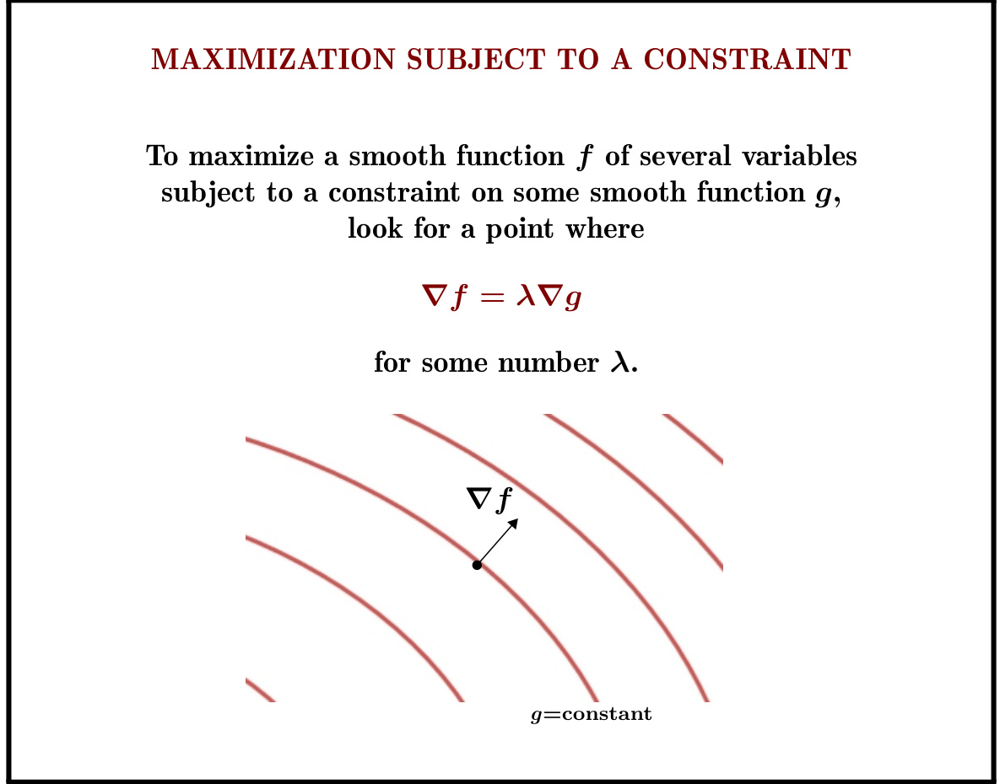  

When we’re trying to maximize entropy subject to a constraint, we’re doing a problem of the above sort. If you don’t know how to do problems like this, it’s time to learn about Lagrange multipliers. You can find this in any book on calculus of several variables. But the idea is in the picture above. Say we’ve got two smooth functions $f,g\colon\mathbb{R}^{n}\rightarrow\mathbb{R}$ and we have a point on the surface $g=$ constant where $f$ is as big as it gets on this surface. The gradient of $f$ must be perpendicular to the surface at this point. Otherwise we could move along the surface in a way that made $f$ bigger! For the same reason, the gradient of $g$ is always perpendicular to the surface $g=$ constant. So $\nabla f$ and $\nabla g$ must point in the same or opposite directions at this point. Thus, as long as the gradient of $g$ is nonzero, we must have  

$$
\nabla f=\lambda\,\nabla g
$$  

for some number $\lambda$ , called a Lagrange multiplier . So, solving this equation along with  

$$
g={\mathrm{constant}}
$$  

is a way to find the point we’re looking for—though we still need to check we’ve found a maximum, not a minimum or something else.  

We can write a formula that means the exact same thing as $\nabla f\;=\;\lambda\nabla g$ using differentials:  

$$
d f=\lambda d g
$$  

This is what we’ll do from now on. Gradients are vector fields while differentials are 1-forms. If you don’t know what this means, you can probably ignore this for now: the difference, while ultimately quite important, will not be significant for anything we’re doing.  

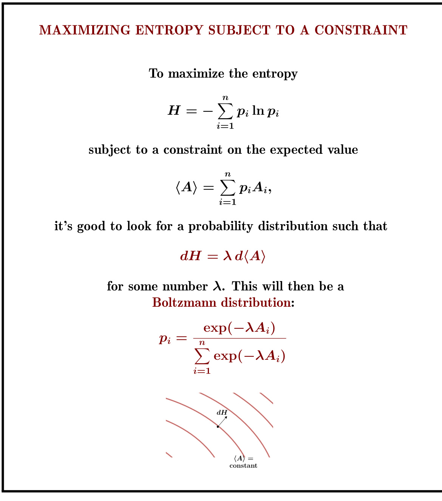  

We’ve seen how to maximize a function subject to a constraint. Now let’s do the case we’re interested in: maximizing entropy subject to a constraint on the expected value of some quantity.  

Suppose we have a finite set of outcomes, say $1,\ldots,n$ . Our ‘quantity’ $A$ is just a number $A_{1},\ldots,A_{n}$ depending on the outcome. For any probability distribution $p$ on the set of outcomes, we can define its Shannon entropy and the expected value of $A$ :  

$$
H=-\sum_{i=1}^{n}p_{i}\ln p_{i},\qquad\langle A\rangle=\sum_{i=1}^{n}p_{i}A_{i}.
$$  

Here we are using base ${e}$ for the Shannon entropy, to simplify the calculations. Let’s try to find the probability distribution that maximizes $H$ on the surface $\langle A\rangle=c$ . We’ll show that if such a probability distribution $p$ exists, and none of the $p_{i}$ are zero, then $p$ must be a Boltzmann distribution  

$$
p_{i}=\frac{\exp(-\lambda A_{i})}{\sum_{i=1}^{n}\exp(-\lambda A_{i})}
$$  

for some $\lambda\in\mathbb R$ . If you’re willing to trust me on this, you can skip this calculation.  

To use the method from last time—the Lagrange multiplier method—we’d like to use the probabilities $p_{i}$ as coordinates on the space of probability distributions. But they aren’t independent, since  

$$
\sum_{i=1}^{n}p_{i}=1.
$$  

To get around this, let’s use all but one of the $p_{i}$ as coordinates, and remember that the remaining one is a function of those. Let’s use $p_{2},p_{3},\ldots,p_{n}$ as coordinates, so that $p_{1}=1-(p_{2}+\cdot\cdot\cdot+p_{n})$ . Furthermore, the space of all probability distributions on our finite set is  

$$
\left\{p\in\mathbb{R}^{n}|\ 0\leq p_{i}\leq1,\ \sum_{i=1}^{n}p_{i}=1\right\}.
$$  

It looks like a closed interval when $n=2$ , or a triangle when $n=3$ , or a tetrahedron when $n=4$ , or some higher-dimensional version of a tetahedron when $n$ is larger. In its interior this space looks locally like $\mathbb{R}^{n-1}$ , so we can use the Lagrange multiplier method, but it also has a boundary where one or more of the $p_{i}$ vanish, and then this method no longer applies. (We’ll see an example of that later.)  

So, let’s assume $p$ is a probability distribution maximizing the Shannon entropy $H$ on the surface $\langle A\rangle\,=\,c$ , and also suppose $p$ has $p_{1},\ldots,p_{n}>0$ . Suppose that not all the values $A_{i}$ are equal, since that makes the problem too easy–see why? Then $d\langle A\rangle$ is never zero, so from what I said last time, we must have  

$$
d H=\lambda\,d\langle A\rangle
$$  

at the point $p$ . So let’s see what this equation actually says.  

Since  

$$
H=-\sum_{i=1}^{n}p_{i}\ln p_{i}
$$  

we have  

$$
d H=-\sum_{i=1}^{n}d(p_{i}\ln p_{i})=-\sum_{i=1}^{n}(1+\ln p_{i})d p_{i}.
$$  

Similarly, since  

$$
\langle A\rangle=\sum_{i=1}^{n}p_{i}A_{i}
$$  

we have  

$$
d\langle A\rangle=\sum_{i=1}^{n}A_{i}d p_{i}.
$$  

So, our equation $d H=\lambda\,d\langle A\rangle$ says  

$$
-\sum_{i=1}^{n}(1+\ln p_{i})d p_{i}=\lambda\sum_{i=1}^{n}A_{i}d p_{i}.
$$  

For these to be equal, the coefficients of $d p_{i}$ must agree for each of our coordinates $p_{2},\ldots,p_{n}$ . But we have to remember that $p_{1}\,=\,1\,-\,(p_{2}\,+\,\cdot\,\cdot\,+\,p_{n})$ and thus $d p_{1}=$ $-(d p_{2}+\cdot\cdot\cdot+d p_{n})$ . Thus, for each $i=2,\dots n$ we have  

$$
(1+\ln p_{1})-(1+\ln p_{i})=\lambda(-A_{1}+A_{i})
$$  

and fiddling around we get  

$$
{\frac{p_{i}}{p_{1}}}={\frac{\exp(-\lambda A_{i})}{\exp(-\lambda A_{1})}}.
$$  

This says something cool: the probabilities $p_{i}$ are proportional to the exponentials $\exp(-\lambda A_{i})$ . And since the probabilities must sum to $1$ , it’s obvious what the constant of proportionality must be:  

$$
p_{i}=\frac{\exp(-\lambda A_{i})}{\displaystyle\sum_{i=1}^{n}\exp(-\lambda A_{i})}.
$$  

So yes: $p_{i}$ must be given by the Boltzmann distribution!  

In summary, we’ve seen that $i f$ there exists a probability distribution $p$ that maximizes the Shannon entropy among probability distributions with $\langle A\rangle=c$ , and $i f$ all the $p_{i}$ are positive, then $p$ must be a Boltzmann distribution. But this raises other questions. When does such a probability distribution exist? If it exists, is it unique? And what if not all the $p_{i}$ are positive?  

In what follows we’ll dive down this rabbit hole and get to the bottom of it. I’ll just state some facts—you may enjoy trying to see if you can prove them. First, there exists a probability distribution $p_{1},\ldots,p_{n}$ with $\langle A\rangle=c$ if and only if  

$$
A_{\operatorname*{min}}\leq c\leq A_{\operatorname*{max}}
$$  

where $A_{\mathrm{min}}$ is the minimum value and $A_{\mathrm{max}}$ is the maximum value of the numbers $A_{1},\ldots,A_{n}$ . Second, whenever  

$$
A_{\mathrm{min}}\leq c\leq A_{\mathrm{max}},
$$  

there exists a unique probability distribution $\!\,\!p_{1},\,\!\dots,p_{n}$ maximizing Shannon entropy subject to the constraint $\langle A\rangle=c$ . Third, this unique maximizer $p$ has $p_{i}>0$ for all $i$ ,and is thus a Boltzmann distribution, whenever  

$$
A_{\operatorname*{min}}<c<A_{\operatorname*{max}}.
$$  

When $c=A_{\operatorname*{min}}$ , the unique maximizer assigns the same probability $p_{i}$ to each outcome $i$ with $A_{i}=A_{\operatorname*{min}}$ , while $p_{i}=0$ for all other outcomes. Similarly, when $c=A_{\operatorname*{max}}$ , the unique maximizer assigns the same probability $p_{i}$ to each outcome $i$ with $A_{i}=A_{\operatorname*{max}}$ ,while $p_{i}=0$ for all other outcomes.  

It’s good to look at an example:  

Puzzle 24. Suppose there are only two outcomes, with $A_{1}=-1$ and $A_{2}=1$ . Work out the Boltzmann distribution $p$ maximizing Shannon entropy subject to the constraint $\langle A\rangle=c$ for $-1<c<1$ . Show that as $\lambda\to+\infty$ this Boltzmann distribution has  

$$
p_{1}\rightarrow1,p_{2}\rightarrow0
$$  

while as $\lambda\to-\infty$ it has  

$$
p_{1}\rightarrow0,p_{2}\rightarrow1.
$$  

Show the probability distribution $p_{1}=1,p_{2}=0$ maximizes Shannon entropy subject to the constraint $\langle A\rangle=-1$ , while $p_{1}=0,p_{2}=1$ maximizes it subject to the constraint $\langle A\rangle=1$ .Show these two probability distributions are not Boltzmann distributions.  

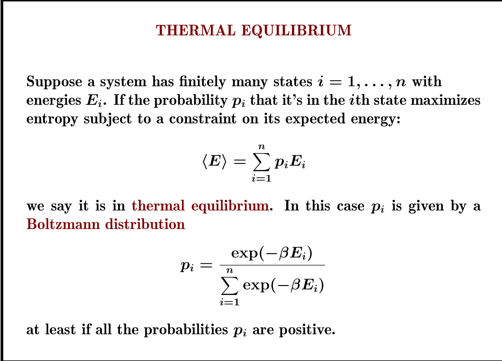  

Don’t worry: the substance of what I’m saying here is almost the same as in the last box. I’m merely attaching new words to the concepts, to make them sound more like physics:  

• Before I said we had a set of $n$ ‘outcomes’ numbered $1,2,\ldots,n$ . Now I’m talking about ‘states’. If we have a system with $n$ states, it means there are $n$ outcomes when we do a measurement to completely determine which state it’s in. A ‘state’ is some way for a physical system to be—that’s vague but it’s all we can say until we consider some specific kind of system. In classical physics the states form a set, usually infinite but sometimes finite.  

• Before I said we had a ‘quantity’ $A$ that depends on the outcome, taking the value $A_{i}$ in the $i$ th outcome. Now I’m calling this quantity the ‘energy’ $E$ . Energy is a particularly interesting quantity in physics, so we’ll focus on that, without demanding that you know anything about it: for our present purposes, we can take any quantity and dub it ‘energy’.  

• Before I called the Lagrange multiplier $\lambda$ . Now I’m calling it $\beta$ , because that’s what physicists do in this particular context.  

When a system maximizes entropy subject to a constraint on the expected value of its energy, and perhaps also some other quantities, we say the system is in thermal equilibrium . This is meant to suggest that an object just sitting there, not heating up or cooling down, is often best modeled this way.  

You may have noticed the annoying clause “at least if all the probabilities $p_{i}$ are positive”. I only said that because I cannot tell a lie. In Puzzle 24 we saw that as $\beta\,\rightarrow\,\pm\infty$ , the Boltzmann distribution can converge to a non-Boltzmann probability distribution where some of the probabilities $p_{i}$ vanish. This still counts as thermal equilibrium, because it’s still maximizing entropy subject to a constraint on expected energy. We’ll learn more about this when we study the concept of ‘absolute zero’.  

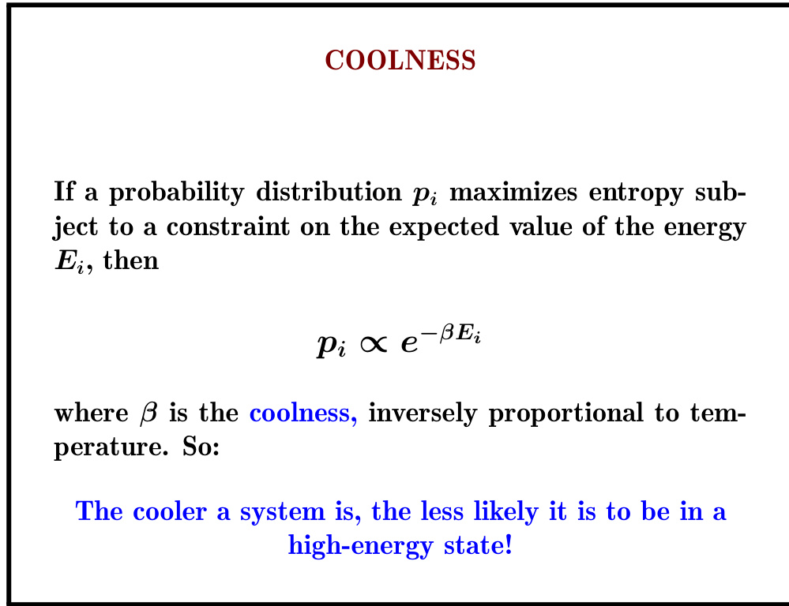  

Say a system with finitely many states maximizes entropy subject to a constraint on the expected value of some quantity $E$ that we choose to call ‘energy’. Then its probability of being in the $i$ th state is proportional to $\exp(-\beta E_{i})$ for some number $\beta$ .  

When $\beta$ is big and positive, the probability of being in a state of high energy is tiny, since $\exp(-\beta E_{i})$ gets very small for large energies $E_{i}$ . This means our system is cold .  

Conversely when $\beta$ is small and positive, $\exp(-\beta E_{i})$ drops off very slowly as the energy $E_{i}$ gets bigger. So, high-energy states become quite likely when $\beta$ is small and positive. This means our system is hot .  

It turns out $\beta$ is inversely proportional to the temperature—more about that later. But in modern physics $\beta$ is just as important as temperature. It comes straight from the principle of maximum entropy!  

So $\beta$ deserves a name. And its name is ‘ coolness ’.  

By the way, the formula  

$$
p_{i}\propto e^{-\beta E_{i}}
$$  

is only strictly true when $\beta$ is finite. There’s also a limiting case $\beta\to+\infty$ , when $p_{i}=0$ except for states of the very lowest energy. And there’s a limiting case $\beta\to-\infty$ , where $p_{i}\,=\,0$ where except for states of the very highest energy. I’ll say a bit about these oddities later. First I’ll say more about what coolness has to do with temperature.  

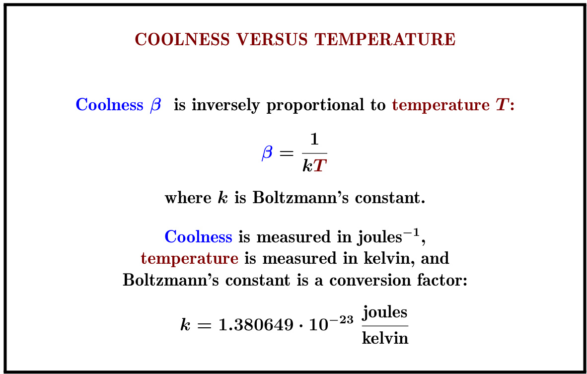  

In statistical mechanics, coolness is inversely proportional to temperature. But coolness has units of energy $^{-1}$ , not temperature $^{-1}$ . So we need a constant to convert between coolness and inverse temperature! And this constant is very interesting.  

Remember: when a system maximizes entropy with a constraint on its expected energy, the probability of it having energy $E$ is proportional to $\exp(-\beta E)$ where $\beta$ is its coolness. But we can only exponentiate dimensionless quantities! (Why?) So $\beta$ has dimensions of 1/energy.  

Since coolness is inversely proportional to temperature, we must have $\beta\,=\,1/k T$ where $k$ is some constant with dimensions of energy/temperature. This constant $k$ is called ‘Boltzmann’s constant’. It’s tiny:  

$$
k=1.380649\cdot10^{-23}\;\mathrm{joules/kelvin}.
$$  

This is mainly because we use units of energy, joules, suited to macroscopic objects like a cup of hot water. Boltzmann’s constant being tiny reveals that such things have enormously many microscopic states!  

Later we’ll see that a single classical point particle, in empty space, has energy $3k T/2$ when it’s maximizing entropy at temperature $T$ . The 3 here is because the atom can move in 3 directions, the $1/2$ because we integrate $x^{2}$ to get this result. The important part is $k T$ . The $k T$ says: if an ideal gas is made of atoms, each atom contributes just a tiny bit of energy per kelvin, or degree Celsius: roughly $10^{-23}$ joules. So a little bit of gas, like a gram of hydrogen, must have roughly $10^{23}$ atoms in it. This is a very rough estimate, but it’s a big deal.  

Indeed, the number of atoms in a gram of hydrogen is about $6\cdot10^{23}$ . You may have heard of Avogadro’s number—this is quite close to that. So Boltzmann’s constant gives a hint that matter is made of atoms—and even better, a nice rough estimate of how many per gram!  

Later we will see that Boltzmann’s constant has another important meaning: it’s a fundamental unit of entropy, a nat, expressed in joules/kelvin.  

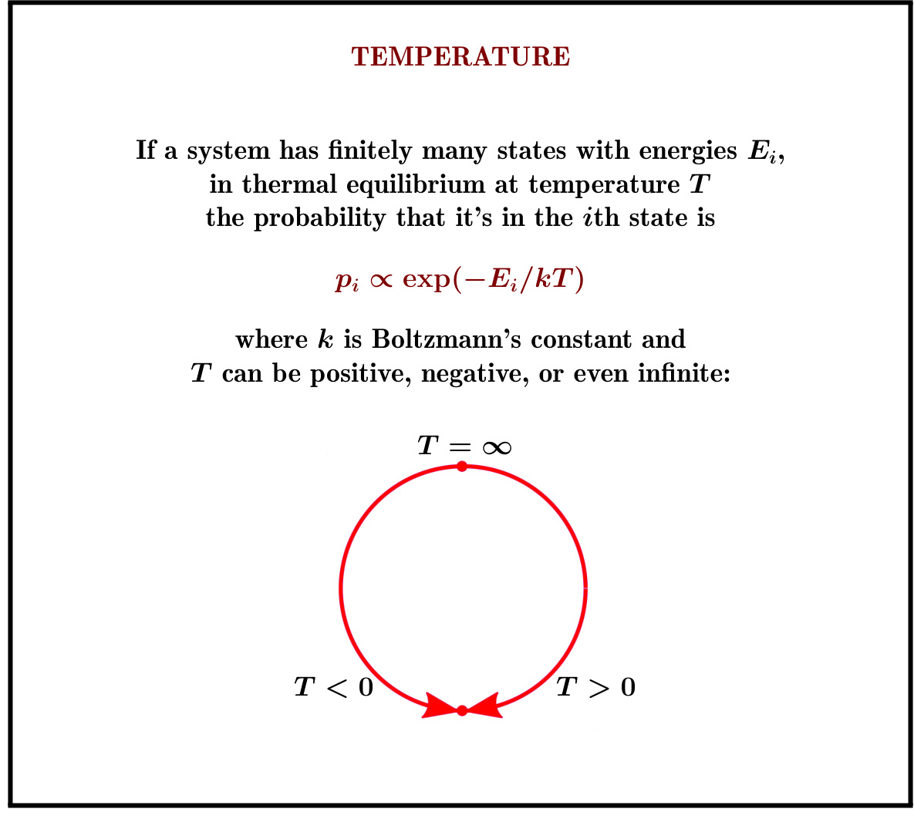  

A system with finitely many states can be pretty weird. It can have negative temperature! Even weirder: as you heat it up, its temperature becomes large and positive, then it reaches infinity, and then it ‘wraps around’ and become large and negative.  

The reason: coolness is more fundamental than temperature. The coolness $\beta$ is inversely proportional to the temperature $T$ :  

$$
\beta=1/k T.
$$  

When the temperature goes up to infinity and then suddenly becomes a large negative number, it’s really just the coolness going down to zero and becoming negative. Temperatures ‘wrap around’ infinity, as shown in the picture.  

A system with finitely many states can have negative or infinite temperature because in thermal equilibrium, its probability of being in the $i$ th state is  

$$
p_{i}=\frac{\exp(-\beta E_{i})}{\displaystyle\sum_{i=1}^{n}\exp(-\beta E_{i})}
$$  

where $E_{i}$ is the energy of the $i$ th state, and this makes sense for any $\beta\in\mathbb R$ . Moreover, the probability $p_{i}$ depends continously on $\beta$ , even as $\beta$ passes through zero. This means a large positive temperature is almost like a large negative temperature!  

But cle of temperature can be misleading. Temperatures wrap around $T=\infty$ but not T= 0. A system with a small positive temperature is very different from one with a small negative temperature! That’s because $p_{i}$ for $\beta\gg0$ is very different than it is for $\beta\ll0$ .  

For a system with finitely many states we can take the limit of the Boltzmann distribution when $\beta\to+\infty$ ; then the system will only occupy its lowest-energy state or states. We can also take the limit when $\beta\to-\infty$ ; then the system will only occupy its highest-energy state or states. In terms of temperature, this means that the limit where $T$ approaches zero from above is very different than the limit where $T$ approaches zero from below.  

So, for a system with finitely many states, the best picture of possible thermal equilibria is not a circle of temperatures but a closed interval of coolness: the coolness $\beta$ can be anything in $[-\infty,+\infty]$ , which topologically is a closed interval. In terms of coolness, $+\infty$ is different from $-\infty$ , but approaching 0 from above is the same as approaching it from below. But in terms of temperature, approaching 0 from above is different from approaching 0 from below, while a temperature of $+\infty$ is the same as a temperature of $-\infty$ .  

Now, if all this seems very weird, here’s why: we often describe physical systems using infinitely many states, with a lowest possible energy but no highest possible energy. In this case the sum in the Boltzmann distribution can’t converge for $\beta<0$ , so negative temperatures are ruled out.  

However, some physical systems can be approximately described using a finite set of states (or in quantum theory, a finite-dimensional Hilbert space of states). Then the things I just said hold true! And people enjoy studying these systems, and their strange properties, in the lab.  

It’s good to look at a simple example, and work everything out explicitly:  

Puzzle 25. Suppose a system has two states with energies $E_{1}\,<\,E_{2}$ . Compute the probabilities $p_{i}$ that it is in either of these states in thermal equilibrium as a function of the coolness $\beta$ . Then express these probabilities as a function of the temperature $T$ .Using these functions $p_{i}(T)$ :  

• Show that when $0<T<+\infty$ the system is more likely to be in the lower-energy state: $p_{1}(T)>p_{2}(T)$ .  

• Show that when $-\infty<T<0$ the system is more likely to be in the higher-energy state: $p_{1}(T)<p_{2}(T)$ .  

• Show that  

$$
\operatorname*{lim}_{T\to+\infty}p_{i}(T)=\operatorname*{lim}_{T\to-\infty}p_{i}(T)
$$  

so we can speak unambiguously of the probabilities $p_{i}$ at infinite temperature.  

• Show that at infinite temperature the system has an equal probability of being in either state.  

• Show that as $T$ approaches zero from above, the probability of the system being in the lower energy state approaches 1.  

• Show that as $T$ approaches zero from below, the probability of the system being in the higher energy state approaches 1.  

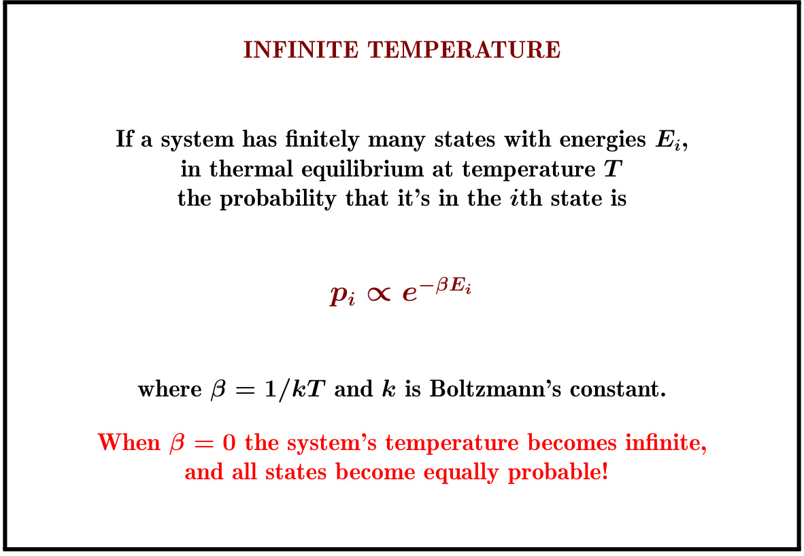  

The probability of finding a system in a particular state decays exponentially with energy when the coolness $\beta$ is positive. But for a system with finitely many states, $\beta$ can be zero. Then it becomes equally probable for the system to be in any state!  

Zero coolness means ‘utter randomness’: that is, maximum entropy.  

Here’s why. The probability distribution with the largest entropy is the one where all probabilities $p_{i}$ are all equal. This happens at zero coolness! When $\beta\:=\:0$ we get $\exp(-\beta E_{i})\,=\,1$ for all $i$ . The probabilities $p_{i}$ are proportional to these numbers $\exp(-\beta E_{i})=1$ , so they’re all equal.  

It seems zero coolness is impossible for a system with infinitely many states. With infinitely many states, all equally probable, the probability of being in any state would be zero. In other words, there’s no uniform probability distribution on an infinite set.  

One way out: replace sums with integrals. For the usual measure on $[0,1]$ , called the Lebesgue measure $d x$ , we have $\textstyle\int_{0}^{1}d x=1$ = 1. So this is a ‘probability measure’ that we could use to describe a system at zero coolness, whose space of states is $[0,1]$ .  

But replacing sums by integrals raises all sorts of interesting issues. For example, there’s a unique way to sum over a finite set of states, but an integral over an infinite set of states depends on a choice of measure. So a choice of measure is a significant extra structure we’re slapping on our set of states.  

We’ll need to think about these issues later, since to compute the entropy of a classical ideal gas we’ll need integrals. But we’ll encounter difficulties, which are ultimately resolved using quantum mechanics.  

Anyway: infinite temperature is really zero coolness, and at least for systems with finitely many states, the entropy becomes as large as possible at zero coolness.  

  

A system with finitely many states can reach infinite temperature. It can get even hotter, but then its temperature ‘wraps around’ and become negative!  

The possibility of negative temperatures was first discussed by the physicist Lars Onsager in 1949, and they have been created in the lab with a variety of systems that—within some approximation—can be described as having finitely many states. In quantum theory, this happens for systems that have finite basis of ‘energy eigenstates’: states with well-defined energies $E_{i}$ . For example, the nucleus of an atom may have just two spin states, and if we put it in an magnetic field these will have different energies. The result is the system we studied in Puzzle 25 .  

Here is a generalization with more energy states, all equally spaced:  

Puzzle 26. Consider a system with $2N+1$ states labeled by an integer $n$ with $-N\leq$ $n\,\leq\,N$ , where the $n$ th state has energy $E_{n}\,=\,\alpha n$ for some energy $\alpha\,>\,0$ . Compute the Boltzmann distribution for this system at coolness $\beta$ for all $\beta\in\mathbb R$ . Compute the expected energy $\langle E\rangle$ as a function of $\beta$ . What is the qualitative difference in your result between the case of positive temperature ( $\beta>0$ ) and negative temperature ( $\beta<0$ )?  

For more, try this:  

• Wikipedia, Negative temperature .  

If a system with finitely many states having energies $E_{i}$ is in thermal equilibrium, the probability $\mathbf{\nabla}p_{i}$ that it’s in the i th state is proportional to $\exp(-\beta E_{i})$ where $\beta$ is the coolness.   
In the limit of infinite coolness, $\beta\to+\infty$ , these probabilities go to zero except for the states of lowest energy, which all become equally probable.  

The limit $\beta\to+\infty$ is also the limit where $_{T}$ approaches zero from above, commonly called absolute zero .  

The limit where $T$ approaches zero from above is often called absolute zero . Why? First people made up various temperature scales like Celsius, where zero was the freezing point of water, and Fahrenheit, where zero is the freezing point of a mixture of water, ice, and ammonium chloride. But researchers discovered that nature had a more fundamental concept of zero temperature: the limit of infinite coolness! This happens as the temperature approaches $-273.15\ ^{\circ}\mathrm{C}$ , or roughly $-459.67\ {}^{\circ}\mathrm{F}$ . This discovery led Kelvin to propose a shifted version of Celsius where zero is absolute zero. This was originally called ‘absolute Celsius’, but now it is called the Kelvin scale . This is the scale of temperature I’ll always use here. The size of the degrees is a somewhat arbitrary convention, but the zero is not: it’s absolute zero.  

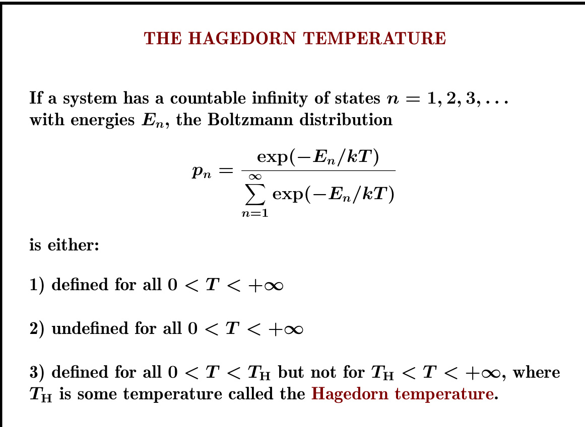  

We’ve been discussing systems with finitely many states, but many physical systems have a countable infinity of states. So let’s think a bit about those. We can copy everything we’ve done so far, but we have to be careful. For thermal equilibrium to be possible at some temperature $T$ , we need the Boltzmann distribution  

$$
p_{n}={\frac{\exp(-E_{n}/k T)}{\displaystyle\sum_{n=1}^{\infty}\exp(-E_{n}/k T)}}
$$  

to make sense. But it might not. Sometimes the sum fails to converge! This happens when the terms $\exp(-E_{n}/k T)$ don’t go to zero fast enough as $n\to+\infty$ .  

Let’s investigate this issue. We’ll assume that  

$$
\sum_{n=1}^{\infty}\exp(-E_{n}/k T)
$$  

converges for some $T>0$ . Then the energies $E_{n}$ must be bounded below: otherwise the terms $\exp(-E_{n}/k T)$ will get bigger and igger. Furthermore for any $E\in\mathbb{R}$ there can be at most finitely many $E_{n}$ less than E: otherwise we’d be adding up infinitely many terms greater than $\exp(-E/k T)$ . As a result, we can reorder the states so their energies are nondecreasing:  

$$
E_{1}\leq E_{2}\leq E_{3}\leq\cdots
$$  

and ${\cal E}_{n}\to+\infty$ .  

Reordering a sum can’t change its convergence or value if it’s a sum of nonnegative numbers, like the sum we have here. So we might as well assume we’ve listed the energies in nondecreasing order as above. Then there are two cases:  

1. $E_{n}$ approach $+\infty$ so fast that $\begin{array}{r}{\sum_{n=1}^{\infty}\exp(-E_{n}/k T)}\end{array}$ −) converges for all $0<T<+\infty$ 0 +∞. Then our system can be in thermal equilibrium at any finite positive temperature. This is the nicest situation, and the one we typically expect..  

2. e e ergies $E_{n}$ approach $+\infty$ slowly enough that $\begin{array}{r}{\sum_{n=1}^{\infty}\exp(-E_{n}/k T)}\end{array}$ −) converges when Tis small enough, but not otherwise. In this case there is some temperature $T_{\mathrm{H}}$ , called the Hagedorn temperature , such that our system can be in thermal equilibrium at positive temperatures $T$ below $\boldsymbol{\cal I}_{\mathrm{H}}^{\prime}$ , but not above $T_{\mathrm{H}}$ .  

In both cases, $\begin{array}{r}{\sum_{n=1}^{\infty}\exp(-E_{n}/k T)}\end{array}$ −) diverges for all $-\infty\,\leq\,T\,<\,0$ and $T\,=\,+\infty$ . So, for a system with a countable infinity of states, if thermal equilibrium exists for some positive temperature, it cannot exist for negative or infinite temperatures.  

The second case is weird and interesting. It’s named after Rolf Hagedorn, who in 1964 noticed that this was a possibility in nuclear physics. He considered a model of nuclear matter where the energies $E_{n}$ approach $+\infty$ in a roughly logarithmic way. As you heat it, its expected energy keeps increasing, but its temperature can never exceed $T_{\mathrm{H}}$ . This model turned out to be incorrect, but it’s interesting anyway.  

Now let’s solve some puzzles on systems with a countable infinity of states. Some of these show up in quantum mechanics, but you don’t need to know quantum mechanics to do these puzzles.  

Puzzle 27. Show that for a system with a countable infinity of states, if thermal equilibrium is possible for some negative temperature, it is impossible for positive or infinite temperatures.  

Puzzle 28. Work out the Boltzmann distribution when $E_{n}\,=\,n E$ for some energy $E$ ,and show that it is well-defined for all temperatures $0<T<+\infty$ .  

The next puzzle is a lot like the previous one—a bit more messy, but worthwhile because of its great importance in physics.  

Puzzle 29. For a system called the quantum harmonic oscillator of frequency $\omega$ we have ${\cal{E}}_{n}=(n+{\textstyle{\frac{1}{2}}})\hbar\omega$ , where $\hbar$ is the reduced Planck’s constant. Work out the Boltzmann distribution in this case, and show it is well-defined for all temperatures $0<T<+\infty$ .  

Puzzle 30. For a system called the primon gas we have $E_{n}=E\ln n$ for some energy $E$ .Show that the Boltzmann distribution is well-defined for small enough positive temperatures, but there is a Hagedorn temperature. Give a formula for the Boltzmann distribution in terms of the Riemann zeta function :  

$$
\zeta(s)=\sum_{n=1}^{\infty}n^{-s}.
$$  

Hagedorn temperature. But it can go the other way, too: You can show that for the primon gas the sum $\begin{array}{r}{\sum_{n=1}^{\infty}\exp(-E_{n}/k T)}\end{array}$ −) diverges at the Puzzle 31. Find energies $E_{n}$ with a Hagedorn temperature such that $\scriptstyle\sum_{n=1}^{\infty}\exp(-E_{n}/k T)$ −converges at the Hagedorn temperature.  

Various other strange things can happen, as you should expect when dealing with infinite series. For example, it’s possible that the Boltzmann distribution is well-defined at some temperature but the expected value of the energy is infinite! But I’ll resist the lure of these rabbit holes and turn to something much more important: systems with a continuum of states. We will need to get good at these to compute the entropy of hydrogen. Now our sums become integrals, and various new things happen.  

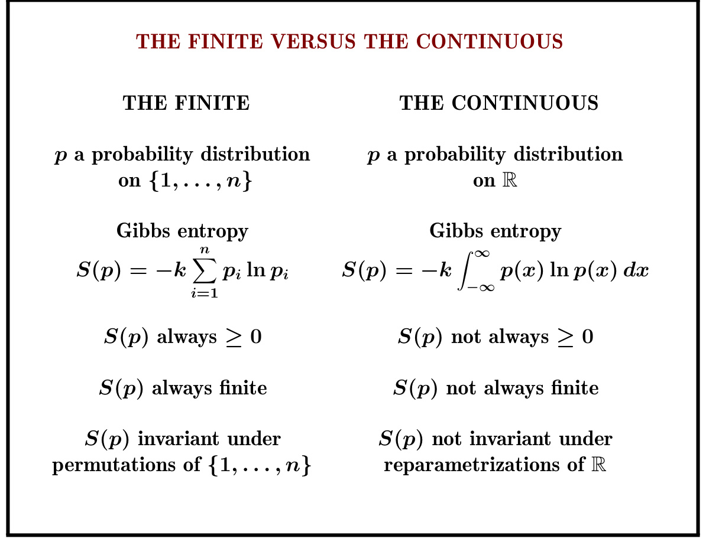  

You can switch from finite sums to integrals in the definition of entropy, and we’ll need to do this to compute the entropy of hydrogen. But be careful: a bunch of things change!  

We need to switch from finite sums to integrals when we switch from a finite set of states to a measure space of states. I’ll illustrate the ideas with the real line, $\mathbb{R}$ . We define a probability distribution on $\mathbb{R}$ to be an integrable function $p\colon\mathbb{R}\rightarrow[0,\infty)$ with  

$$
\int_{-\infty}^{\infty}p(x)\,d x=1.
$$  

Such a probability distribution has a Gibbs entropy given by  

$$
S(p)=-k\int_{-\infty}^{\infty}p(x)\ln p(x)\,d x.
$$  

We can also define Shannon entropy , where we leave out Boltzmann’s constant $k$ and use whatever base we want for the logarithm:  

$$
H(p)=-\int_{-\infty}^{\infty}p(x)\log p(x)\,d x.
$$  

I should warn you that many writers reserve the term ‘Shannon entropy’ only for a sum  

$$
H(p)=-\sum_{i\in X}p_{i}\log p_{i}.
$$  

While that convention has advantages, I want to use the term ‘Shannon entropy’ to signal that I’m leaving out the factor of $k$ .  

Unlike the entropy for a probability distribution on a finite set, the entropy of a probability distribution on $\mathbb{R}$ can be negative! This is disturbing. Earlier I said that the Shannon entropy of a probability distribution is the expected amount of information  

you learn when an outcome is chosen according to that distribution. How can this be negative?  

The answer is that this interpretation of entropy, valid for probability distributions on a finite or even a countably infinite set, is not true in the continuous case! We have to adapt our intuitions.  

Look at an example. Let $p_{\epsilon}$ be the probability distribution on $\mathbb{R}$ given by  

$$
p_{\epsilon}(x)=\left\{\begin{array}{l l}{\displaystyle\frac{1}{\epsilon}\quad\mathrm{if~}0\leq x\leq\epsilon}\\ {\displaystyle\qquad\qquad\qquad\qquad\quad}\\ {0\quad\mathrm{otherwise.}}\end{array}\right.
$$  

For small $\epsilon$ it’s a tall thin spike near 0. Let’s work out its Shannon entropy:  

$$
{\begin{array}{l l l}{H(p)}&{=}&{-\int_{-\infty}^{\infty}p(x)\log p(x)\,d x}\\ &&{=}&{-\int_{0}^{\epsilon}{\frac{1}{\epsilon}}\log{\frac{1}{\epsilon}}\,d x}\\ &{=}&{\log\epsilon.}\end{array}}
$$  

We’re just integrating a constant here, so it’s easy. When $\epsilon=1$ the entropy is zero, and when $\epsilon$ becomes smaller than 1 the entropy becomes negative!  

Why? We need a distance scale to define the entropy of a probability distribution on the real line. If I measure distance in centimeters, I’ll think the entropy of a probability distribution is bigger than you, who measures it in meters. And if I measure it in kilometers, I’ll think the entropy is smaller—and possibly even negative.  

Let’s see how this works. If I measure distance in different units from you, my coordinate $y$ on the real line will not equal your coordinate $x$ : instead we’ll have  

$$
y=c x
$$  

for some $c>0$ . Then my probability distribution, say $q$ , will have  

$$
\int_{-\infty}^{\infty}q(y)\,d y=\int_{-\infty}^{\infty}q(c x)\,d(c x)=c\int_{-\infty}^{\infty}q(c x)\,d x
$$  

so we must have  

$$
q(c x)=\frac1c p(x)
$$  

to make this integral equal 1. In other words, stretching out a probability distribution must also flatten it out, making it less ‘tall’—and its entropy increases. Indeed:  

Puzzle 32. Show that $H(q)=H(p)+\ln c$ .  

Thanks to this formula choosing $0\,<\,c\,<\,1$ compresses a probability distribution and makes it taller, reducing its entropy. Inevitably, this can make the entropy negative if $c$ is small enough.  

In summary: in the continuous case, entropy is not invariant under reparametrizations: our choice of coordinates matters! And this can make entropy negative. This applies not only to $\mathbb{R}$ but many other measure spaces we’ll be considering, like $\mathbb{R}^{n}$ . This issue will be very important.  

After learning this, it should be less of a shock that the entropy of a probability distribution on $\mathbb{R}$ can be infinite, or even undefined:  

Puzzle 33. Find three probability distributions $p$ on the real line that have entropy $+\infty$ ,$-\infty$ , and undefined because it’s of the form $+\infty-\infty$ .  

# ENTROPY, ENERGY AND TEMPERATURE  

Suppose a system has some measure space $\boldsymbol{X}$ of states with energy $E\colon X\rightarrow\mathbb{R}$ . In thermal equilibrium the probability distribution on states, $p\colon X\to\mathbb{R}$ , maximizes the Gibbs entropy  

$$
S=-k\int_{X}p(x)\ln p(x)\,d x
$$  

subject to a constraint on the expected value of energy:  

$$
\langle E\rangle=\int_{X}p(x)E(x)\,d x
$$  

Typically when this happens $\pmb{p}$ is the Boltzmann distribution  

$$
p(x)={\frac{e^{-E(x)/k T}}{\displaystyle\int_{X}e^{-E(x)/k T}\,d x}}
$$  

where ${\bf\nabla}T$ is the temperature and $\pmb{k}$ is Boltzmann’s constant.  

Then as we vary $\langle E\rangle$ we have  

$$
d\langle E\rangle=T d S
$$  

We can now generalize a lot of our work from a finite set of states to a general measure space. I won’t redo all the arguments, just state the results and point out a couple of caveats.  

For any measure space $X$ we say a function $p\colon X\to[0,\infty)$ is a probability distribution if it’s measurable and  

$$
\int_{X}p(x)\,d x=1.
$$  

We can define a version of Shannon entropy for $p$ by  

$$
H=-\int_{X}p(x)\log p(x)\,d x,
$$  

but physicists mainly use the Gibbs entropy , defined by  

$$
S=-k\int_{X}p(x)\ln p(x)\,d x.
$$  

As I warned you last time, this can take values in $[-\infty,\infty]$ , though we are mainly interested in cases when it’s finite. If we think of Xas the space of states of some system, we can pick any measurable function $E\colon X\rightarrow\mathbb{R}$ and call it the ‘energy’. Its expected value is then  

$$
\langle E\rangle=\int_{X}E(x)p(x)\,d x
$$  

at least when this integral converges.  

We say the probability distribution $p$ describes thermal equilibrium if it maximizes $S$ subject to a constraint $\langle E\rangle\,=\,c$ . Typically when this happens $p$ is a Boltzmann distribution  

$$
p(x)={\frac{e^{-\beta E(x)}}{\displaystyle\int_{X}e^{-\beta E(x)}\,d x}}
$$  

where $\beta$ is called the coolness . I say ‘typically’ because even when $X$ is a finite set, we saw in Puzzle 24 that there can be thermal equilibria that are not Boltzmann distributions, but only limits of Boltzmann dis butions as $\beta\,\rightarrow\,+\infty$ or $\beta\,\rightarrow\,-\infty$ .This can also happen for other measure spaces X. I will not delve into this, because my goal now is to get to some physics.  

As before, we can write $\beta=1/k T$ , at least if $\beta\neq0$ , and then write the Boltzmann distribution as  

$$
p(x)={\frac{e^{-E(x)/k T}}{\displaystyle\int_{X}e^{-E(x)/k T}\,d x}}.
$$  

Also as before, the Boltzmann distributions obey the crucial relation  

$$
d H=\beta d\langle E\rangle.
$$  

Rewriting this in terms of Gibbs entropy $\cal S\ =\ k H$ and temperature $T\;=\;1/k\beta$ , it becomes this famous relation between temperature, entropy and the expected energy:  

$$
T d S=d\langle E\rangle.
$$  

Notice that the units match here. The Shannon entropy $H$ is dimensionless, but since $k$ has units of energy/temperature, the Gibbs entropy $\cal S\ =\ k H$ has units of energy/temperature. Thus $T d S$ has units of energy, as does $d\langle E\rangle$ .  

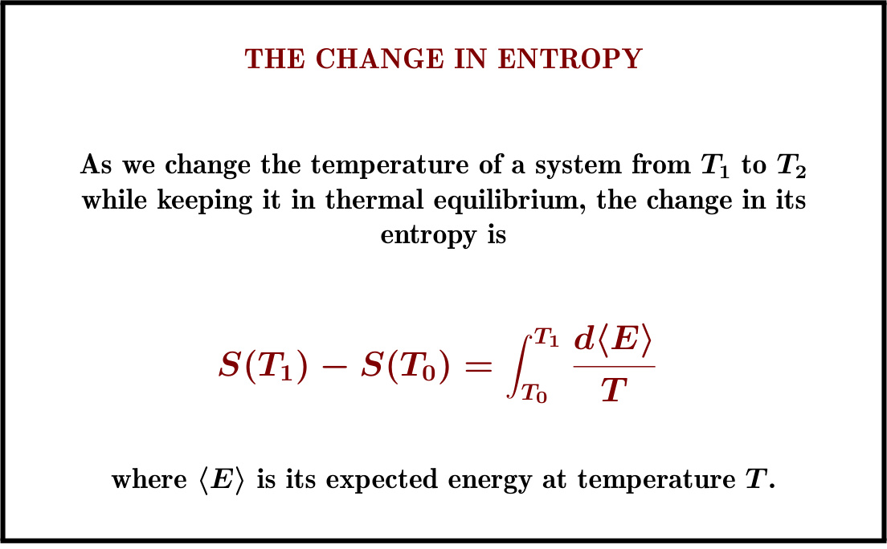  

Last time we saw that as we change the expected energy $\langle E\rangle$ of a system while keeping it in thermal equilibrium, this fundamental relation holds:  

$$
T d S=d\langle E\rangle.
$$  

We can rewrite this as  

$$
d S={\frac{d\langle E\rangle}{T}}
$$  

and then integrate this from one temperature to another—remember, as the expected energy changes, so does the temperature. We get  

$$
\int_{T_{0}}^{T_{1}}\frac{d\langle E\rangle}{T}=S(T_{1})-S(T_{0}).
$$  

This is the main way people do experiments to ‘measure entropy’. Slowly heat something up, keeping track of how much energy it takes to increase its temperature each little bit. Using this data you can approximately calculate the integral at left—and that gives the change in entropy!  

But so far we’re just measuring changes in entropy. How can you figure out the actual value of the entropy? One way is to assume the Third Law of Thermodynamics, which says that in thermal equilibrium the entropy approaches zero as the temperature approaches zero from above. This gives  

$$
\int_{0}^{T_{1}}\frac{d\langle E\rangle}{T}=S(T_{1}).
$$  

This is how people often ‘measure the entropy’ of a system in thermal equibrium. They heat it up starting from absolute zero, very slowly so—they hope—it is close to thermal equilibrium at every moment—and they take data on how much energy is used, and approximately calculate the integral at left!  

But this relies on the Third Law of Thermodynamics. So where does that come from?  

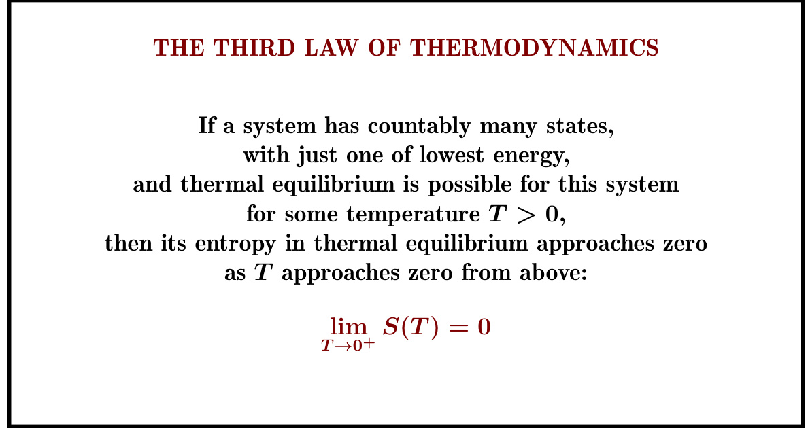  

Some people say the Third Law of Thermodynamics this way: “entropy is zero at absolute zero”. But it’s not really that simple—indeed, other people say it’s impossible to reach absolute zero. Above I’ve stated a version of the Third Law that’s actually a theorem. Let’s prove it!  

Actually, let’s prove it now for systems with only finitely many states. It’ll be easier to handle systems with countably infinite number of states later , when we’ve developed more tools. And by the way, we’ll see the Third Law isn’t always true for systems with a continuum of states. It will fail for all three of the problems on our big to-do list: the classical harmonic oscillator, the classical particle in a box and the classical ideal gas. This is often taken as a failure of classical mechanics, since switching to quantum mechanics makes the Third Law hold for these systems.  

Let’s show that for a system with finitely many states $i\,=\,1,\,.\,.\,,n$ with energies $E_{i}$ , as the temperature $T$ approaches zero from above, the entropy of the system in thermal equilibrium approaches $k\ln{N}$ where $N$ is the number of lowest-energy states. In thermal equilibrium  

$$
p_{i}\propto e^{-E_{i}/k T}.
$$  

Thus, all states with the lowest energy have the same probability, while as the temperature approaches zero from above, any higher-energy states have $p_{i}\,\rightarrow\,0$ . So, as the temperature approaches zero from above, the probability of the system being in any one of its $N$ lowest-energy states approaches $1/N$ , and we get  

$$
\operatorname*{lim}_{T\to0^{+}}S(T)=\operatorname*{lim}_{T\to0^{+}}-k\sum_{i=1}^{n}p_{i}\ln p_{i}=-k\sum_{i=1}^{N}{\frac{1}{N}}\ln\left({\frac{1}{N}}\right)=k\ln N.
$$  

In particular, if the system has just one lowest-energy state, we get the Third Law of Thermodynamics :  

$$
\operatorname*{lim}_{T\to0^{+}}S(T)=0.
$$  

Here $T\to0^{+}$ means that $T$ is approaching zero from above.  

But beware: for systems with lots of lowest-energy states, their entropy in thermal equilibrium can be large even near absolute zero! Also, a related problem: systems may take a ridiculously long time to reach equilibrium! This is especially true for systems that have many states whose energies are very near the lowest energy, like a piece of glass. You can put a piece of glass in a fancy refrigerator and try to cool it to near absolute zero. If it has one lowest-energy state, its entropy should approach zero. If this happened, the glass would change from glass to a crystal, which has less entropy. But nobody has seen glass turn into a crystal when they cool it down. If this happens, it probably does so only after an absurdly long time, much longer than the age of the Universe. This phenomenon is called ‘ frustration ’. People like to argue about frustration and the Third Law, so I am not trying to give you the final word here, just alert you to the issue. You can learn a bit more here:  

• Wikipedia, Third law of thermodynamics .  

By the way: for systems with finitely many states, it’s possible to have negative temperatures, and the Third Law has a counterpart saying what happens when the temperature approaches zero from below :  

Puzzle 34. Show that for a system with finitely many states,  

$$
\operatorname*{lim}_{T\to0^{-}}S(T)=k\ln M
$$  

where $M$ is the number of states of highest energy.  

However, most systems we’ll be studying won’t have a state of highest energy.  

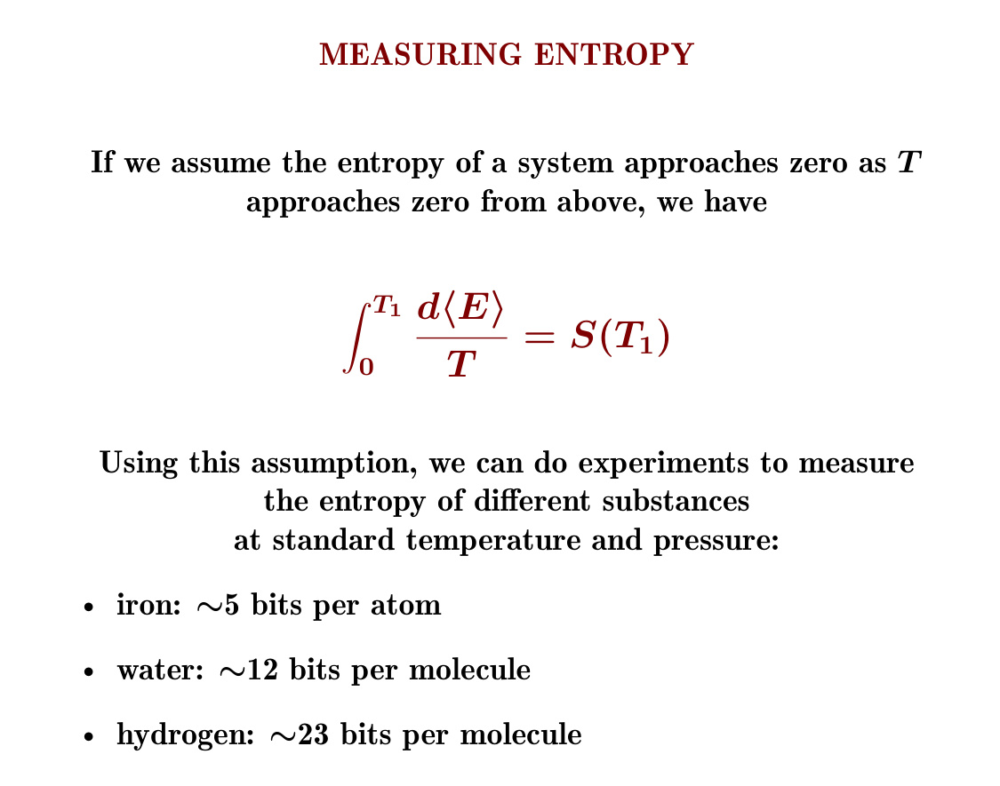  

People actually do experiments and use the above formula to figure out the entropy of many substances in thermal equilibrium assuming their entropy vanishes as the temperature approaches absolute zero. They slowly heat up a substance and keep track of how much energy is needed to raise its temperature as they go, so they can approximately calculate the integral shown. They usually report the answers in joules/kelvin per mole, but I enjoy ‘bits per molecule’.  

As you can see, liquids tend to have more entropy than solids, and gases tend to have even more. My goal in this course is to teach you how to approximately compute some of these entropies from first principles. Unfortunately the only substances that are simple enough for us to handle are gases.  

This is a good opportunity to explain some conventions. A mole is defined to be exactly $6.02214076\cdot10^{23}$ —this is called Avogadro’s number , and it’s close to the number of hydrogen atoms in a gram. A joule/kelvin of Gibbs entropy corresponds to about $7.242297\cdot10^{22}$ nats of Shannon entropy: the the reciprocal of A bit is ln 2 nats. From these three facts, we see 1 joule/kelvin of Gibbs entropy per Boltzma s constant , which is defined to be exactly 1 $1.380649\cdot10^{-23}$ ·joules per kelvin. mole corresponds to about 0 .173516 bits/molecule of Shannon entropy.  

By the way, what is ‘ standard temperature and pressure ’? Annoyingly, this phrase means different things to different organizations. I will try to always use it to mean a temperature of 298.15 K and a pressure of 1 bar. The temperature here equals 25 $\odot$ C, which seems a bit random compared to $0^{\mathrm{~o~}}$ C—but convenient, because it’s close to room temperature. A pressure of 1 bar , or more officially 100 kilopascals, is slightly less than a ‘ standard atmosphere ’, which is a unit of pressure intended to equal the average air pressure at sea level. A pascal is an official SI unit: it’s a pressure of one newton per square meter.  

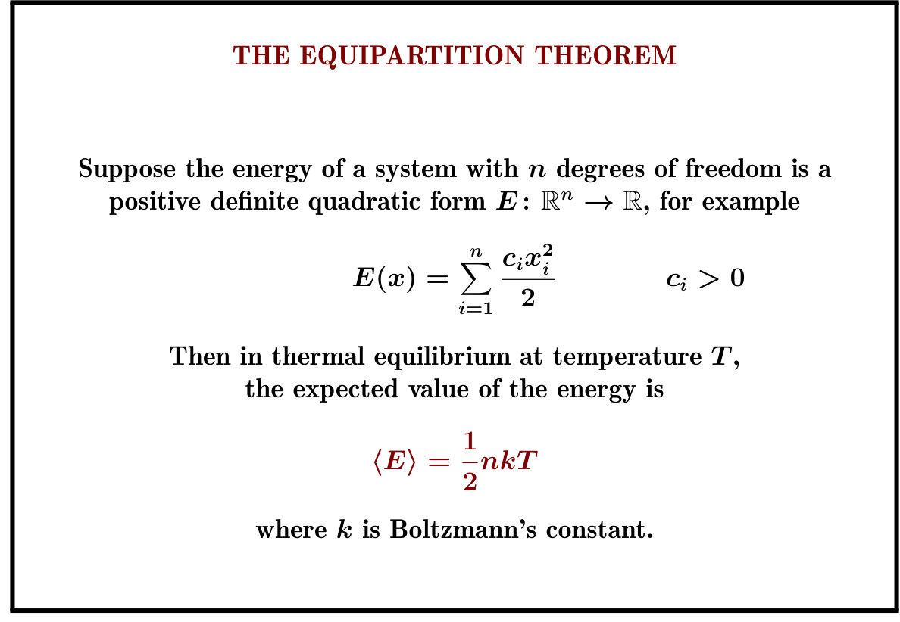  

Temperature is very different from energy. But sometimes—not very often, but sometimes—the expected energy of a system in thermal equilibrium is proportional to its temperature. The equipartition theorem says this happens when the energy depends quadratically on several real variables, defining a positive definite quadratic form on $\mathbb{R}^{n}$ . For example, it happens for a classical harmonic oscillator.  

Some people get confused and try to apply the equipartition theorem where it doesn’t apply. They foolishly conclude that temperature is always proportional to energy.  

This theorem does not apply to quantum systems. Indeed, when people tried to apply the equipartition theorem to a mirrored box of light they ran into a problem called the ultraviolet catastrophe . Classically the box of light is a system where the energy is a positive definite quadratic form, but $n=\infty$ , so they got an infinite expected value of the energy! Quantum mechanics saves the day and makes the answer finite.  

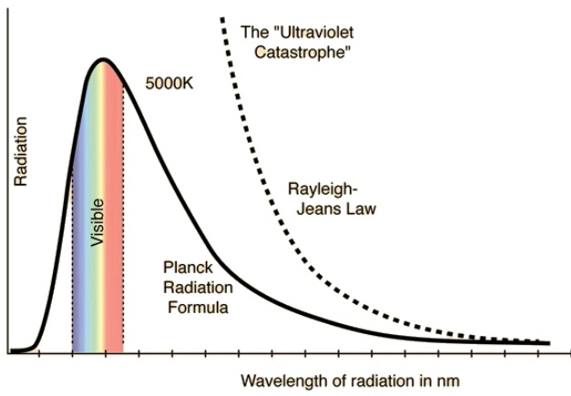  

The equipartition theorem also doesn’t apply to classical systems unless the energy is quadratic. So it’s very limited in its applicability, but still useful.  

Let’s prove this result! To prove a theorem, you have to understand the definitions. We’ll start with some background.  

Suppose the energy of a system with $\mathbfit{\Delta}$ degrees of freedom is some function  

$$
E\colon\mathbb{R}^{n}\rightarrow\mathbb{R}
$$  

Let $\pmb{k}$ be Boltzmann’s constant. Suppose $p\colon\mathbb{R}^{n}\rightarrow\mathbb{R}$ is a probability distribution maximizing the entropy  

$$
S=-k\int_{\mathbb{R}^{n}}p(x)\ln p(x)\,d^{n}x
$$  

subject to a constraint on the expected energy  

$$
\langle E\rangle=\int_{\mathbb{R}^{n}}E(x)p(x)\,d^{n}x
$$  

Then $\pmb{p}$ must be a Boltzmann distribution :  

$$
p(x)=\frac{e^{-\beta E(x)}}{\int_{\mathbb{R}^{n}}e^{-\beta E(x)}d^{n}x}
$$  

The temperature $_{T}$ is defined so that $\beta=1/k T$ .  

We’re defining entropy with an integral now, unlike a sum as before, and sticking Boltzmann’s constant into the definition of entropy, as physicists do, so that entropy has units of energy over temperature.  

Given the formula for the energy $E$ as a function on $\mathbb{R}^{n}$ , we’ll have to find the Boltzmann distribution and then compute $\langle E\rangle$ as a function of $T$ .  

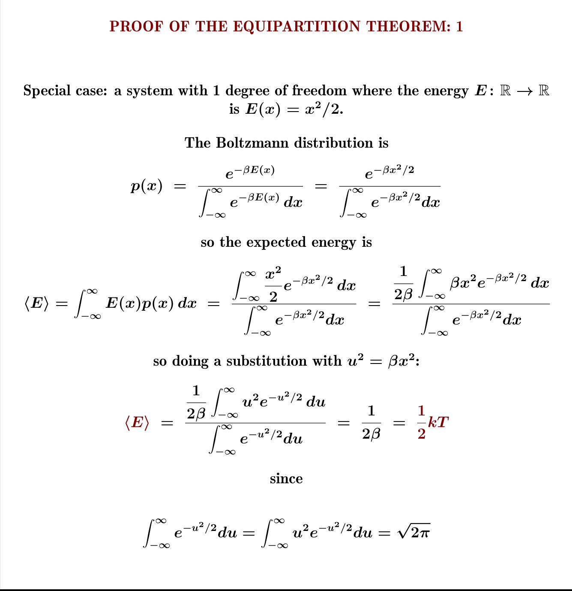  

We’ll do two special cases before proving the general result. First let’s do a system with 1 degree of freedom where the energy is $E(x)=x^{2}/2$ . In this case, after a change of variables, the Gibbs distribution becomes a Gaussian with mean 0 and variance 1, and that gives the desired result. Or just do the integrals and see what you get! The expected energy $\langle E\rangle$ is $\scriptstyle{\frac{1}{2}}k T$ .  

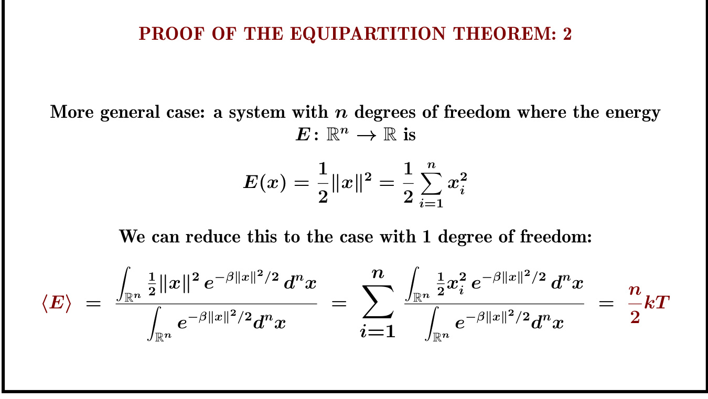  

Next we do a system with $n$ degrees of freedom where the energy is a sum of $n$ terms of the form $x_{i}^{2}/2$ 2. It’s no surprise that each degree of freedom contributes ${\scriptstyle{\frac{1}{2}}}k T$ to the expected energy, giving  

$$
\langle E\rangle={\frac{1}{2}}n k T
$$  

But make sure you follow my calculation above. I skipped a couple of steps!  

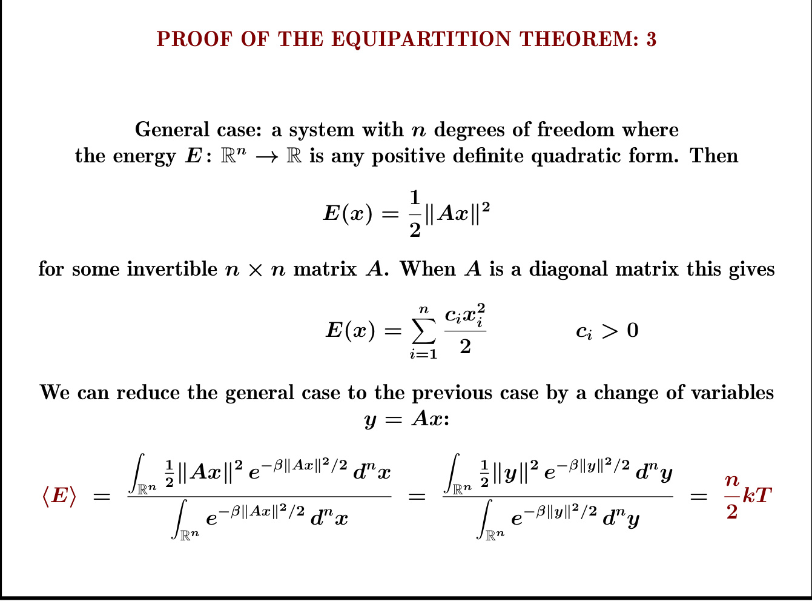  

Finally let’s do the general case. A quadratic form on $\mathbb{R}^{n}$ is a map $Q\colon\mathbb{R}^{n}\to\mathbb{R}$ such that  

$$
Q(x)=\sum_{i,j=1}^{n}q_{i j}x_{i}x_{j}
$$  

for some numbers $q_{i j}\in\mathbb{R}$ . We say it’s positive definite if  

$$
x\neq0\implies Q(x)>0.
$$  

One can prove that a quadratic form $Q\colon\mathbb{R}^{n}\to\mathbb{R}$ is positive definite if and only if  

$$
Q(x)={\frac{1}{2}}\|A x\|^{2}
$$  

for some invertible $n\times n$ matrix $A$ . The factor of $1/2$ here is just to make our calculations easier.  

Thanks to this, if we have a system whose space of states is $\mathbb{R}^{n}$ and its energy function $E\colon\mathbb{R}^{n}\rightarrow\mathbb{R}$ is a positive definite quadratic form, we can compute  

$$
\langle E\rangle={\frac{\displaystyle\int_{\mathbb{R}^{n}}E(x)\exp(-\beta E(x))\,d x}{\displaystyle\int_{\mathbb{R}^{n}}\exp(-\beta E(x))\,d x}}
$$  

by reducing it to the previous case using a change of variables. We get  

$$
\langle E\rangle={\frac{1}{2}}n k T
$$  

So, each degree of freedom still contributes $\scriptstyle{\frac{1}{2}}k T$ to the expected energy. That’s the equipartition theorem!  

But be careful. The equipartition theorem doesn’t apply when the energy is an arbitrary function of $n$ variables. It also fails when we switch from classical to quantum statistical mechanics.  

People sometimes memorize the conclusion of the equipartition theorem, $\begin{array}{r}{E=\frac{1}{2}n k T}\end{array}$ ,without learning that it holds only for classical systems whose energy is a positive definite quadratic rm. These people sometimes get fooled into thinking $\langle E\rangle$ is always proportional to T. Some of these poor benighted souls go around saying that temperature is just a measure of energy per degree of freedom. This completely ignores the subtlety of the concept of temperature.  

As we’ve seen, the truly general relation between temperature and energy, for systems in thermal equilibrium, also involves entropy:  

$$
T d S=d\langle E\rangle.
$$  

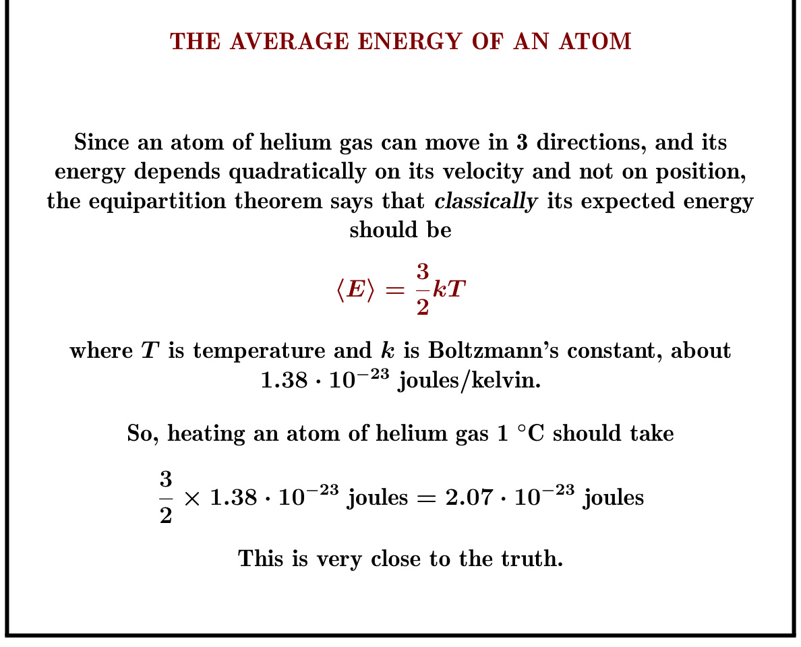  

We can finally start reaping the rewards of all our thoughts about entropy! The equipartition theorem lets us estimate how much energy it takes to heat up one atom of helium one degree Celsius. And it works!  

Of course we don’t heat up an individual atom: we heat up a bunch. A mole of helium is about $6.02\cdot10^{23}$ atoms, so heating up a mole of helium one degree Celsius ( $=$ 1 kelvin) should take about  

$$
6.02\cdot10^{23}\times2.07\cdot10^{-23}\approx12.46\;\mathrm{joules}
$$  

And this is very close to correct! It seems the experimentally measured answer is 12 .6 joules.  

What are the sources of error? Most importantly, our calculation neglects the interaction between helium atoms. Luckily this is very small at standard temperature and pressure. We’re also neglecting quantum mechanics. Luckily for helium this too gives only small corrections at standard temperature and pressure.  

It’s important here that helium is a monatomic gas . In hydrogen, which is a diatomic gas , we get extra energy because this molecule can tumble around, not just move along. We’ll try that next.  

# THE ENERGY OF HYDROGEN  

If we treat a molecule of hydrogen as a dumbbell whose position takes 3 numbers and whose axis whose takes 2 numbers to   
describe, we can try to use the equipartition theorem to estimate its expected energy as  

$$
\langle E\rangle={\frac{5}{2}}k T
$$  

where $_{T}$ is temperature and $\mathbf{\Delta}k=1.38\cdot10^{-23}$ joules/kelvin.  

In this approximation, heating a molecule of hydrogen gas 1 kelvin takes ${\frac{5}{2}}\times1.38\cdot10^{-23}\;{\mathrm{joules}}=3.45\cdot10^{-23}\;{\mathrm{joules}}$ joules  

In reality it takes $\mathbf{3.39\cdot10^{-23}}$ joules at standard temperature and pressure. Not bad!  

A molecule of hydrogen gas is a blurry quantum thing, but let’s pretend it’s a classical solid dumbbell that can move and tumble but not spin around its axis. Then it has $3\!+\!2=5$ degrees of freedom, and we can use the equipartition theorem to estimate its energy.  

For $T$ significantly less than 6000 kelvin, hydrogen molecules don’t vibrate with the two atoms moving toward and away from each other. They don’t spin around their axis until even higher temperatures. But they tumble like a dumbbell as soon as $T$ exceeds about 90 kelvin.  

We need quantum mechanics to compute these things. But at room temperature and pressure, we can pretend a hydrogen gas is made of classical solid dumbbells that can move around and tumble but not spin around their axes! In this approximation the equipartition theorem tells us $\langle E\rangle={\textstyle{\frac{5}{2}}}k T$ .  

This is fine as far as it goes—but our goal in this course is to compute the entropy of hydrogen. We’ll start with a useful warmup: the classical harmonic oscillator.  

# ENTROPY OF THE HARMONIC OSCILLATOR: 1  

A classical harmonic oscillator has energy  

$$
E=\frac{p^{2}}{2m}+\frac{\kappa q^{2}}{2}
$$  

By the equipartition theorem, in thermal equilibrium at temperature $_{T}$ it has expected energy $\langle E\rangle=k T$ where $\pmb{k}$ is Boltzmann’s constant.  

So, using $d\langle E\rangle=T d S$ , its entropy is  

$$
S=\int d S=\int{\frac{d\langle E\rangle}{T}}=k\int{\frac{d T}{T}}=k(\ln T\ +\ C)
$$  

Since this does not approach 0 as $\mathbf{\nabla}T\rightarrow\mathbf{0}$ from above, the Third Law of Thermodynamics doesn’t hold for the classical harmonic oscillator.  

But what is this constant $C$ ?For that we must think harder.  

What’s the entropy of a classical harmonic oscillator in thermal equilibrium? Using the equipartition theorem and the formula $d\langle E\rangle=T d S$ , we can show it’s  

$$
S=k(\ln T+C).
$$  

So, the entropy grows logarithmically with temperature. And it does not go to zero as $T$ approaches zero: instead, it goes to negative infinity. So the Third Law of Thermodynamics does not hold for the classical harmonic oscillator!  

That may seem shocking, but it actually makes sense. The Third Law holds only for certain special systems . Furthermore, we’ve seen that the entropy of a sharply peaked probability distribution on a continuous state space is negative. We’ll see that the Boltzmann distribution for the classical oscillator gets more and more sharply peaked near $q=p=0$ as the temperature approaches zero from above. So in fact, it makes perfect sense that the entropy approaches $-\infty$ .  

However, the classical harmonic oscillator is just an approximation to the quantum harmonic oscillator, which does obey the Third Law. It’s a good approximation at high temperatures, but bad at low temperatures. In fact, this business of negative entropies at low temperature is not something that happens in the real world. It’s just a defect of classical mechanics. It’s trying to tell us that quantum mechanics is better.  

Another point: you’ll have noticed that constant $C$ here. What is it? We can make progress with a bit of dimensional analysis. The quantity $\ln T$ is a funny thing: if we change our units of temperature, it doesn’t get multiplied by a constant factor, the way physical quantities usually do. It changes by adding a constant! So $k\ln T$ doesn’t have dimensions of entropy. But  

$$
S=k(\ln T+C)
$$  

must have dimensions of entropy. The constant $C$ must somehow save the day! How does that work? Let’s see.  

# ENTROPY OF THE HARMONIC OSCILLATOR: 2  

Classically, a harmonic oscillator at temperature $_{T}$ has entropy  

$$
S=k(\ln T\;+\;C)
$$  

Writing $C=-\ln(T_{0})$ for some constant $\mathbf{\nabla}T_{0}$ , this gives  

$$
S=k\ln(T/T_{0})
$$  

Dimensional analysis implies $\mathbf{\nabla}T_{0}$ must have units of temperature!  

But what is this temperature $\mathbf{\nabla}T_{0}$ ? For that we must think harder.  

The formula $S\,=\,k(\ln T+C)$ is a bit scary from the viewpoint of dimensional analysis. We usually avoid working with the logarithm of a dimensionful quantity, like $\mathrm{ln}\,T$ , because it transforms in a funny way when we change our units. But if we write $C=-\ln T_{0}$ then we get $S=k\ln(T/T_{0})$ , and we see the solution to our problem! If $T_{0}^{\prime}$ has units of temperature, then $T/T_{0}$ is dimensionless, so $\ln(T/T_{0})$ doesn’t change at all when we change our units. In other words: now $\ln(T/T_{0})$ is dimensionless, so $S=k\ln(T/T_{0})$ has units of entropy as it should.  

So, the constant $C$ must equal $-\ln T_{0}$ for some temperature $T_{0}$ that we can compute for any harmonic oscillator. What is it? This is a fascinating puzzle.  

For starters, what could this temperature $T_{0}^{'}$ possibly depend on? Obviously the mass $m$ , the spring constant $\kappa$ and Boltzmann’s constant $k$ . But there’s no way to form a quantity with units of temperature from just $m,\kappa$ and $k$ . So we need an extra ingredient. And it turns out, remarkably, that the extra ingredient is Planck’s constant $\hbar$ .  

This should be absolutely shocking! Planck’s constant is associated to quantum mechanics, but we’re trying to compute the entropy of a classical harmonic oscillator. How does Planck’s constant get into the game? We’ll say more about this later.  

We can compute a quantity with units of temperature from $m,\kappa,k$ and $\hbar$ . The frequency of our oscillator is $\omega=\sqrt{k/m}$ q, and it’s a famous fact that $\hbar\omega$ has units of energy. $k$ has units of energy/temperature... so $\hbar\omega/k$ has units of temperature.  

Thus, our temperature $T_{0}$ must be $\hbar\omega/k$ times some dimensionless purely matheunlucky, matical constant, which I’ll call $e^{666}$ —though in physics our purely mathematical dimensionless constants are $1/\alpha$ .$\alpha$ must be something like $\pi$ or 2, or if we’re really usually numbers fairly close to $1$ , not huge or tiny numbers.  

So, the entropy of a classical harmonic oscillator is  

$$
S=k\ln(T/T_{0})=k\ln(\alpha k T/\hbar\omega).
$$  

This is far as I can get without breaking down and doing some real work. Later we will compute $\alpha$ .  

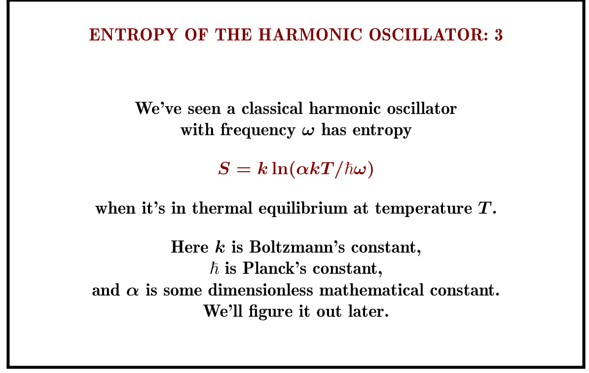  

Even though we don’t know $\alpha$ , this formula is already very interesting! $k T$ is known to be the typical energy scale of thermal fluctuations at temperature $T$ .$\hbar\omega$ is the spacing between energy levels of a quantum harmonic oscillator with frequency $\omega$ . The ratio $k T/\hbar\omega$ is therefore roughly the number of energy eigenstates in which we may find a quantum harmonic oscillator with high probability when it’s at temperature $T$ .  

Thus, $S$ is roughly $k$ times the logarithm of the number of states that we’re likely to find a quantum harmonic oscillator in, when it’s at temperature $T$ . This may seem mysterious. After all, we weren’t trying to do quantum mechanics, much less count quantum states.  

In 1912, Otto Sackur and Hugo Tetrode ran into the same issue when trying to solve the problem we’re working up to now: computing the entropy of a classical ideal gas. They discovered—and so shall we—that Planck’s constant appears in the answer. For the fascinating story of how they did it, read this:  

• Walter Grimus, On the 100th anniversary of the Sackur-Tetrode equation ,Annalen der Physik 525 (2013), A32–A35.  

We’ll learn more about this business of counting states later , when we relate entropy to something called the ‘ partition function ’, which can be understood as the ‘number of acccessible states’. This viewpoint will also explain the constant $\alpha$ . But now let’s calculate this constant.  

# ENTROPY OF THE HARMONIC OSCILLATOR: 4  

A classical harmonic oscillator has energy  

$$
E(p,q)={\frac{p^{2}}{2m}}+{\frac{\kappa q^{2}}{2}}
$$  

where $\pmb{p}$ is its momentum, $\pmb q$ its position, $\mathbf{\nabla}m$ its mass and $\pmb{\kappa}$ its spring constant.  

At temperature $_{T}$ , the probability density of its momentum and position is the Boltzmann distribution:  

$$
\rho(p,q)=\frac{e^{-\beta E(p,q)}}{\int_{-\infty}^{\infty}\!\int_{-\infty}^{\infty}e^{-\beta E(p,q)}\,\frac{d p\,d q}{h}}
$$  

where $\beta=1/k T,\,k$ is Boltzmann’s constant, and $h=2\pi\hbar$ is the original ‘unreduced’ Planck’s constant.  

The oscillator’s entropy at temperature $_{T}$ is thus  

$$
S=-k\int_{-\infty}^{\infty}\!\int_{-\infty}^{\infty}\rho(p,q)\ln\rho(p,q)\ {\frac{d p\,d q}{h}}
$$  

Last time we found a formula for the entropy of a classical harmonic oscillator... which includes a mysterious purely mathematical dimensionless constant $\alpha$ . Now let’s figure out $\alpha$ . To do this, we’ll grit our teeth and actually do the integral needed to calculate the entropy—but only in one easy case! This will be enough to determine $\alpha$ .  

First, recall the basics. The energy $E(p,q)$ of our harmonic oscillator at momentum $p$ and position $q$ determines its Boltzmann distribution at temperature $T$ , which I’ll call $\rho(p,q)$ now since the letter $p$ is already being used. Integrating $-\rho\ln\rho$ over the space of states of the harmonic oscillator, which is the $p q$ plane, we get the Shannon entropy. We then multiply this by Boltzmann’s constant $k$ to get the Gibbs entropy.  

But here’s the surprise: the Shannon entropy must be dimensionless, but the measure dp dq has units of momentum times position– or in other words, action. Thus the Shannon entropy cannot possibly be  

$$
\int_{-\infty}^{\infty}\!\int_{-\infty}^{\infty}\rho(p,q)\ln\rho(p,q)\ d p\,d q.
$$  

To get an answer that makes sense, we must divide dp dq by some quantity with units of action!  

To get the correct answer—that is, the one measured in experiments—we must divide dp dq by Planck’s original constant $h$ , not the so-called ‘reduced’ Planck’s constant $\hbar=h/2\pi$ . Planck’s constant $h$ is defined to be exactly $6.62607015\cdot10^{-34}$ joule-seconds.  

Thus, the Gibbs entropy of the classical harmonic oscillator is  

$$
S=-k\int_{-\infty}^{\infty}\!\int_{-\infty}^{\infty}\rho(p,q)\ln\rho(p,q)\ {\frac{d p\,d q}{h}}.
$$  

We just need to do this integral.  

But what’s so good about $d p\,d q/h$ ? Why do we divide by $h$ and not, say $\hbar$ ? This is related to Bohr and Sommerfeld’s early approach to quantum physics, the ‘ old quantum theory ’, which was later subsumed by the theory of ‘ geometric quantization ’. In Bohr and Sommerfeld’s approach, when we quantize a classical system with one position and one momentum degree of freedom, there is one quantum state for each region of area $h$ in the $p q$ plane. More generally, when we quantize a classical system with $n$ position $R\subset\mathbb{R}^{2n}$ and $n$ momentum degrees of freedom, there should be one quantum state for each region with  

$$
\int_{R}{\frac{d^{n}p\,d^{n}q}{h^{n}}}=1.
$$  

So, delving into the whys of quantum mechanics and geometric quantization would shed more light on what we are doing now. But when Sackur and Tetrode computed the entropy of an ideal gas and compared it to experiment, they just went ahead and did an integral using the measure $d^{n}p\,d^{n}q/h^{n}$ , and discovered that this gives the correct answer!  

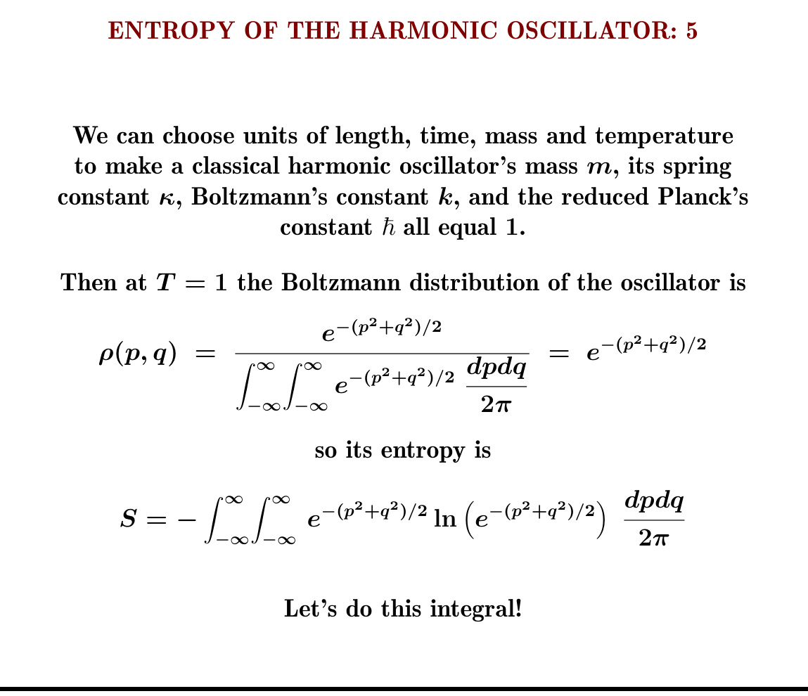  

Let’s compute the Boltzmann distribution $\rho(p,q)$ and the entropy $S$ . To keep the formulas clean, we’ll work in units where $m=\kappa=k=\hbar=1$ , and compute everything at one special temperature: $T=1$ .  

In this setup $h=2\pi$ , and  

$$
e^{-\beta E(p,q)}=e^{-(p^{2}+q^{2})/2}
$$  

is a beautiful Gaussian with integral  

$$
\int_{-\infty}^{\infty}\!\int_{-\infty}^{\infty}\,e^{-(p^{2}+q^{2})/2}=2\pi.
$$  

These two factors of $2\pi$ cancel when we compute the denominator of the probability distribution $\rho(p,q)$ :  

$$
\int_{-\infty}^{\infty}\!\int_{-\infty}^{\infty}e^{-(p^{2}+q^{2})/2}\ \frac{d p d q}{2\pi}=\frac{2\pi}{2\pi}=1.
$$  

Thus, we get simply  

$$
\rho(p,q)=e^{-(p^{2}+q^{2})/2}.
$$  

The entropy of the harmonic oscillator is thus  

$$
S=-\int_{-\infty}^{\infty}\!\int_{-\infty}^{\infty}\,e^{-(p^{2}+q^{2})/2}\ln\left(e^{-(p^{2}+q^{2})/2}\right)\,{\frac{d p d q}{2\pi}}
$$  

when $\kappa=k=\hbar=T=1$ . Next let’s do this integral.  

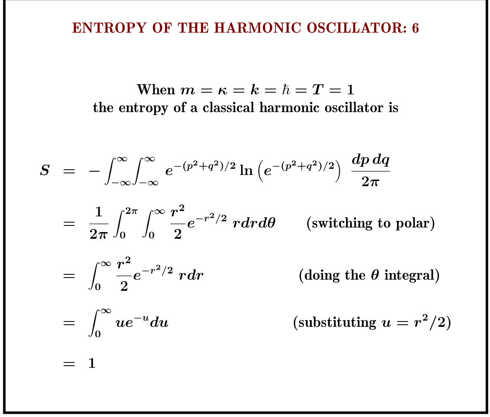  

Now let’s do the integral to compute the entropy of the harmonic oscillator. We copy a famous trick for computing the integral of a Gaussian. First we switch to polar coordinates in the $p q$ plane, where  

$$
r^{2}=p^{2}+q^{2}\;\;\mathrm{and}\;\;\;d p\,d q=r d r d\theta.
$$  

Then we integrate with respect to $\theta$ , which cancels out the factor of $1/2\pi$ . Then we do a substitution $u=r^{2}/2$ . But for us $r^{2}/2$ is minus the logarithm of the Gaussian:  

$$
-\ln(e^{-(p^{2}+q^{2})/2})={\frac{r^{2}}{2}}
$$  

so we’re left with  

$$
S=\int_{0}^{\infty}u e^{-u}\,d u
$$  

which we can do with integration by parts.  

After all this work, we get an incredibly simple answer:  

$$
S=1.
$$  

So in the special case where $m\,=\,\kappa\,=\,k\,=\,\hbar\,=\,T\,=\,1$ , the entropy of a classical harmonic oscillator in thermal equilibrium is 1.  

Now let’s return to the general case, and finish the job.  

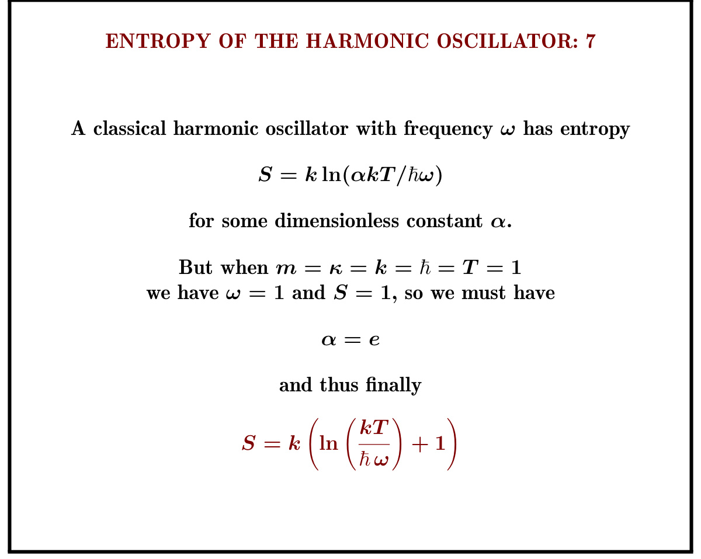  

Knowing the entropy in one special case, we can figure out the constant $\alpha$ in our general formula for the entropy. Our general formula says  

$$
S=k\ln(\alpha k T/\hbar\omega).
$$  

But when $m=k=T=\hbar=1$ we get $\omega=k/m=1$ , and we saw last time that in this special case we get  

$$
S=1.
$$  

So $\alpha$ must equal $e$ .  

Thus, the entropy of an oscillator with frequency $\omega$ at temperature $T$ is  

$$
S=k\ln(e k T/\hbar\omega)=k\left(\ln\left(\frac{k T}{\hbar\,\omega}\right)+1\right).
$$  

The extra 1 here is fascinating to me. If we had slacked off, ignored the possibility of a dimensionless constant $\alpha$ , and crudely used dimensional analysis to guess $S$ approximately the way people often do, we might have gotten  

$$
S=k\ln(k T/\hbar\omega)
$$  

This would be off by 1 nat.  

What does the 1 extra nat mean? It seems pretty mysterious now. But later we’ll understand it! I already mentioned that often entropy is roughly $k$ times the logarithm of something called the ‘number of accessible states’. But that formula is not exactly right: there’s also an extra term related to energy, and that accounts for the 1 extra nat here. Be patient, and you’ll see what I mean.  

# WHERE ARE WE NOW?  

of entropy at standard temperature and pressure? The mystery: why does each molecule of hydrogen have $\sim23$ bits  

The goal: derive and understand the formula for the entropy of a classical ideal monatomic gas:  

$$
S=k N\left(\ln{\frac{V}{N}}+{\frac{3}{2}}\ln k T+\gamma\right)
$$  

including the mysterious constant $\gamma$ .  

The subgoal: compute the entropy of a single classical particle in a 1-dimensional box.  

The sub-subgoal: explain entropy from the ground up, and compute the entropy of a classical harmonic oscillator:  

$$
S=k\left(\ln{\frac{k T}{\hbar\omega}}+1\right)\qquad\quad
$$  

Okay, so we’ve gotten somewhere! By doing the right integral, we’ve figured out that the entropy $S$ of a classical harmonic oscillator of frequency $\omega$ in thermal equilibrium at temperature $T$ is  

$$
S=k\left(\ln{\frac{k T}{\hbar\omega}}+1\right).
$$  

where $k$ is Boltzmann’s constant and $\hbar$ is the reduced Planck’s constant.  

We could compute the entropy of a single particle in a box the same way, and also the entropy of a classical ideal diatomic gas. But the integrals get a bit hairy, so people prefer to use a clever trick called the ‘partition function’. It’s definitely worth learning. It’s not merely a clever trick, it gives new insights on the relation between entropy, energy and temperature. So let’s talk about it.  

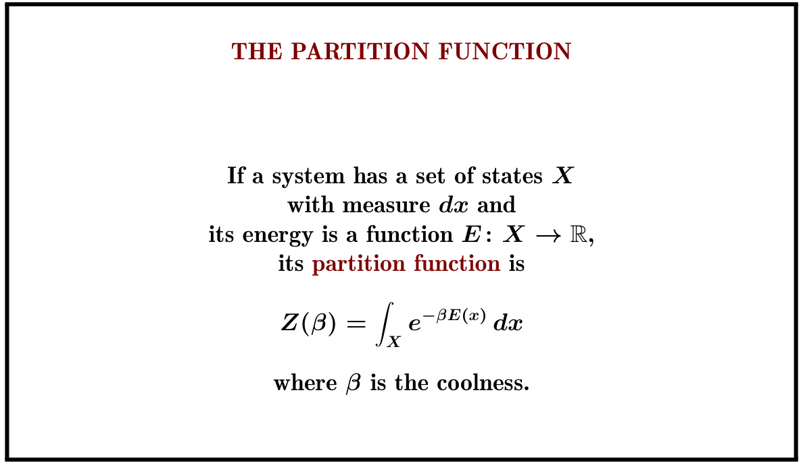  

I want to compute the entropy of a particle in a box, and ultimately the entropy of a box of hydrogen. We could do it directly, but that’s a bit ugly. It’s better to use the ‘partition function’. This amazing function knows everything about statistical mechanics. From it you can get the entropy—and much more!  

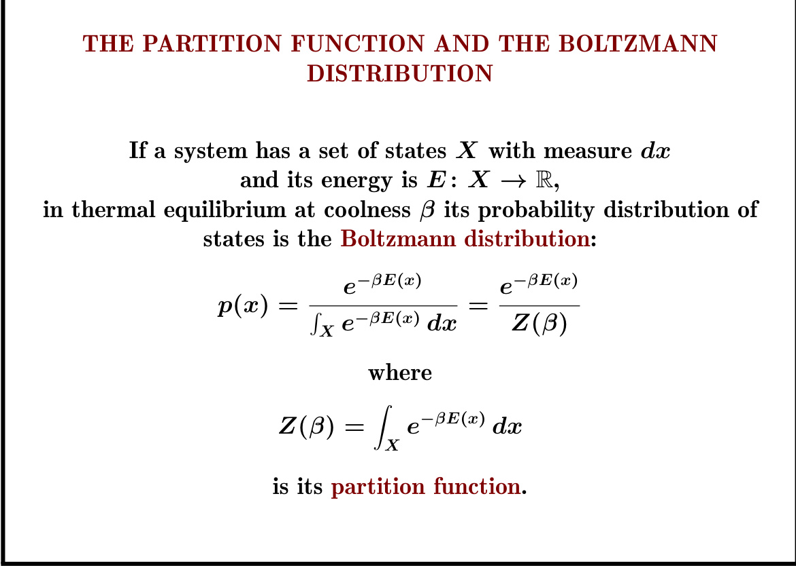  

In fact we’ve already seen the partition function: it’s the thing you have to divide $e^{-\beta E(x)}$ by to get a function whose integral is 1. And that function whose integral is $1$ is the Boltzmann distribution: the probability distribution of states in thermal equilibrium at coolness $\beta$ . So the partition function is a humble normalizing factor! And yet we’ll see that it’s incredibly powerful. It’s kind of surprising.  

Like Lagrangians in classical mechanics, it’s fairly easy to use partition functions, but it’s harder to understand what they ‘really mean’. We will try. But first let’s see how to use them.  

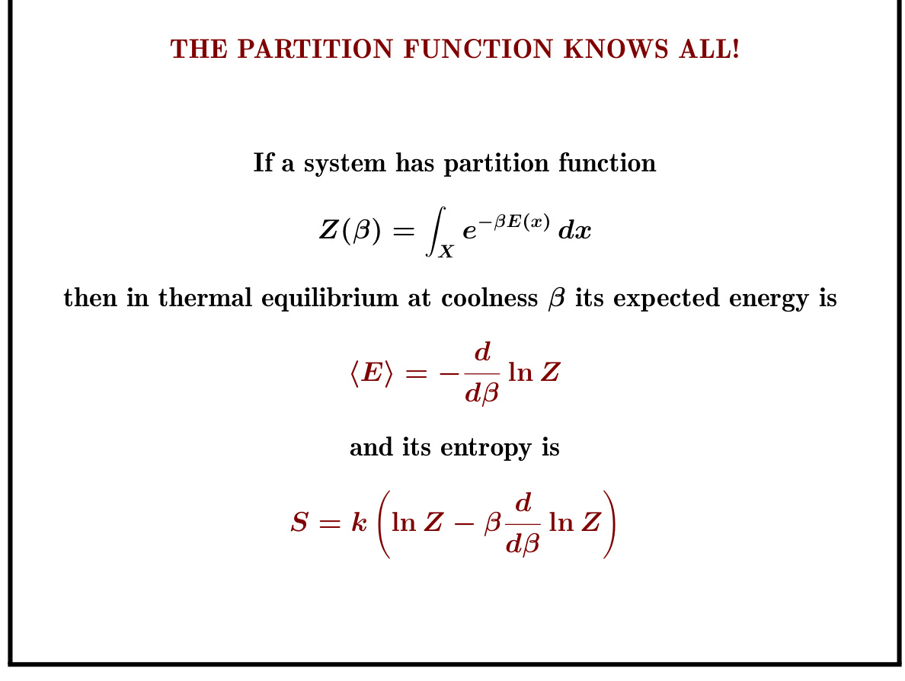  

Here’s how you can compute the expected energy $\langle E\rangle$ and the entropy $S$ of any system starting from its partition function $Z(\beta)$ as a function of the coolness $\beta$ . I’ll show you why these formulas are true, and then we’ll test them out on the harmonic oscillator, where we have already computed the expected energy and entropy by other methods.  

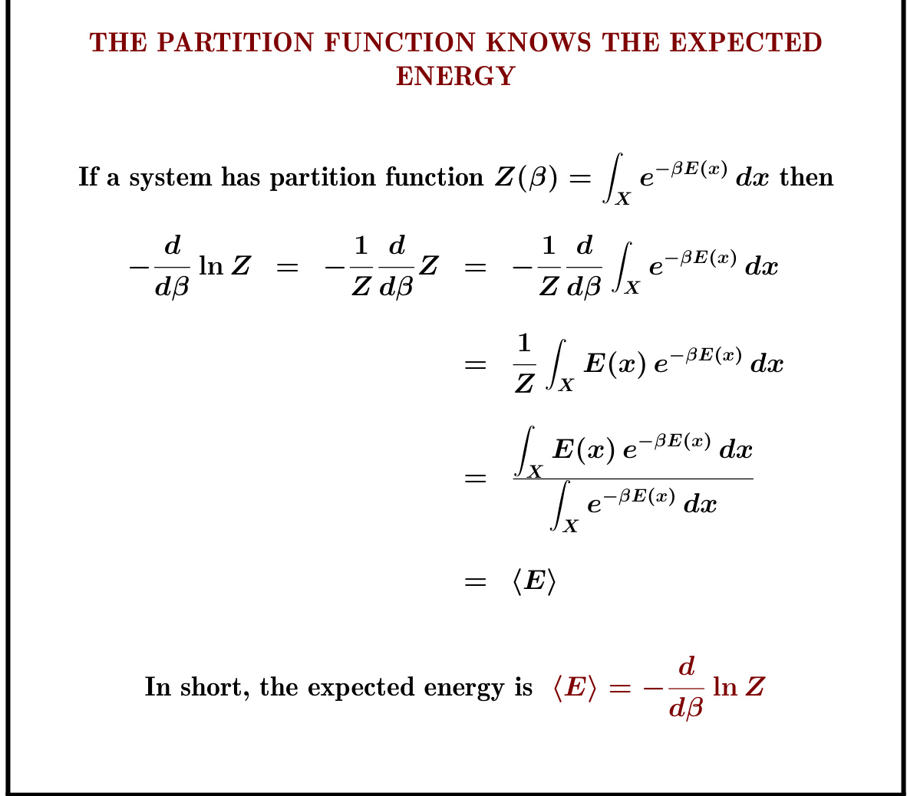  

The partition function is all-powerful! For starters, if you know the partition function of a physical system, you can figure out its expected energy. The expected energy $\langle E\rangle$ is minus the derivative of $\ln{Z}$ with respect to the coolness $\beta=1/k T$ .  

How do we show this? Easy: just look at the calculation above! We get a fraction, which is the expected value of $E$ with respect to the Gibbs distribution.  

By the way, this trick of taking the derivative of the logarithm of a function is famous: it’s called a ‘logarithmic derivative’. Notice that  

$$
{\frac{d}{d x}}\ln f(x)={\frac{f^{\prime}(x)}{f(x)}}.
$$  

Thus the logarithmic derivative says how fast a function is growing compared to the value of the function itself—like the interest rate in compound interest.  

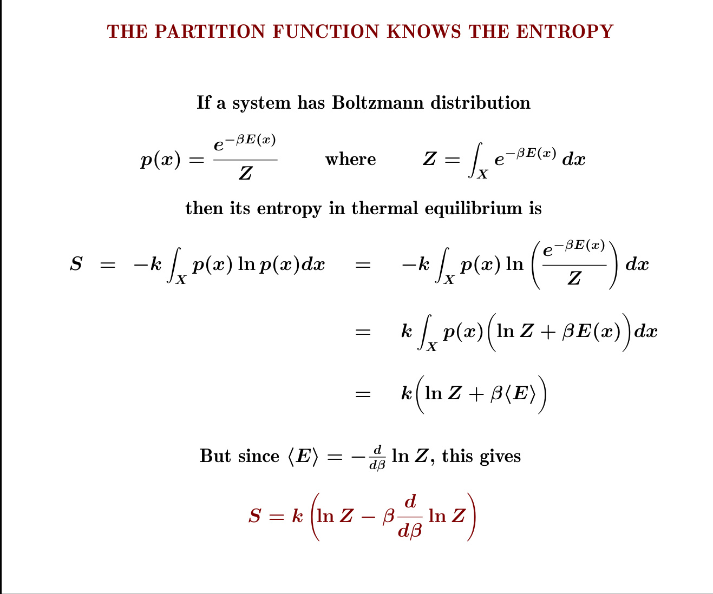  

The entropy is a bit more complicated. But don’t be scared! The Boltzmann distribution $p(x)$ is a fraction, so the log of this fraction breaks into two parts:  

$$
\ln p(x)=\ln\left({\frac{e^{-\beta E(x)}}{Z}}\right)=-(\ln Z+\beta E(x)).
$$  

Thus our integral for entropy breaks into two parts:  

$$
S=-k\int p(x)\ln p(x)\,d x=k\int p(x)\ln Z\,d x+k\beta\int p(x)E(x)\,d x.
$$  

The first part is just $k\ln Z$ since the integral of $p(x)$ is $1$ . The second part is $k\beta\langle E\rangle$ . If we use what we just learned about $\langle E\rangle$ :  

$$
\langle E\rangle=-{\frac{d}{d\beta}}\ln Z
$$  

we get this formula for entropy in terms of the partition function:  

$$
S=k\left(\ln Z-\beta{\frac{d}{d\beta}}\ln Z\right).
$$  

This formula seems hard to understand at first. To extract its inner meaning, we need a new concept: ‘free energy’.  

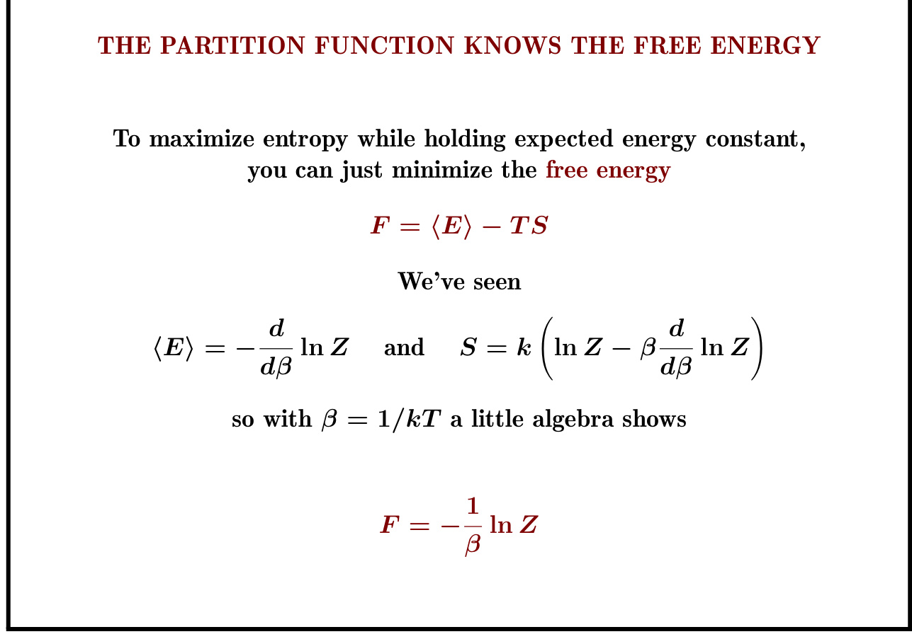  

We can understand the relation between entropy, energy and the partition function if we bring in a concept I haven’t mentioned yet: the free energy  

$$
F=\left\langle E\right\rangle-T S.
$$  

Since we know for ulas for $\langle E\rangle$ and $S$ in terms of the partition fu ction, we can work out a formula for F. And it’s really simple! Much simpler than S, for example. It’s just  

$$
F=-\frac{1}{\beta}\ln Z.
$$  

But what’s the meaning of free energy? Remember: to maximize the Shannon entropy $H$ subject to a constraint on expected energy, we introduced the Lagrange multiplier $\beta=1/k T$ and maximized the quantity $H-\beta\langle E\rangle$ . But if you multiply this quantity by $-k T$ , you get free energy:  

$$
-k T(H-\beta\langle E\rangle)=\langle E\rangle-T S=F.
$$  

So, as long as $T>0$ , maximizing entropy subject to a constraint on expected energy is equivalent to minimizing free energy!  

Thus, free energy turns a problem of maximizing entropy subject to a constraint into a minimization problem without a constraint. The point is not that we’ve turned maximization into minimization: that’s just an arbitrary business with signs. The point is that free energy lets us stop thinking about the constraint.  

There’s a huge amount to say about the free energy, which is also called the ‘Helmholtz free energy ’, since there are other kinds. You can think of $T S$ as the amount of energy in useless random form, since it comes from entropy. Since $\langle E\rangle$ is the total expected energy, $F=\langle E\rangle-T S$ is the amount of ‘useful’ energy. More precisely, the free energy is the maximum amount of work obtainable from a system at a constant temperature. But showing this would take us out of our way.  

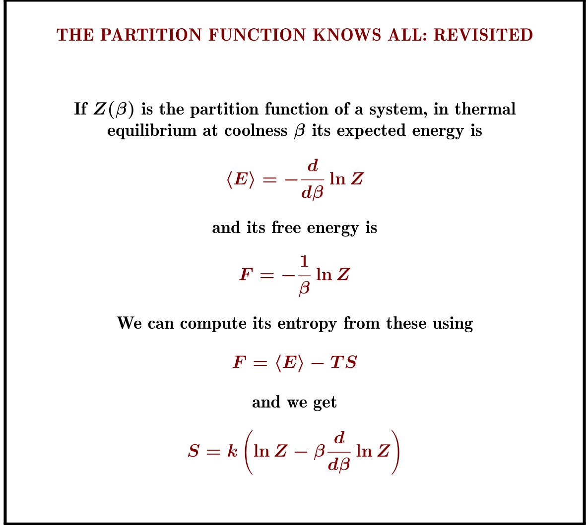  

Now we can tell a simpler story, which is easier to remember. Free energy, being the energy in useful form, is the expected energy minus the useless energy, which is temperature times entropy. Thus  

$$
F=\langle E\rangle-T S
$$  

so  

$$
\begin{array}{r c l}{S}&{=}&{\displaystyle\frac{\langle E\rangle-F}{T}}\\ &&{=}&{k\beta(-F+\langle E\rangle)}\end{array}
$$  

and using our formulas for $F$ and $\langle E\rangle$ in terms of the partition function $Z$ , we get  

$$
S=k\left(\ln Z-\beta{\frac{d}{d\beta}}\ln Z\right).
$$  

The story here is more of a mnemonic than a true explanation, because I’m not saying much what it means for energy to be ‘useful’ or ‘useless’. I’ve only given this hint: when a system is in thermal equilibrium, its free energy is minimized. For more on the meaning of free energy, try a good book on thermodynamics, like this:  

• Frederick Reif, Fundamentals of Statistical and Thermal Physics , Waveland Press, Long Grove, Illinois, 2009.  

Right now I’d rather say a bit about the meaning of the partition function.  

Say $\boldsymbol{X}$ is a set where each point $\pmb{\dot{\imath}}$ has an ‘energy’ $E_{i}\in\mathbb{R}$ .Its partition function is  

$$
Z=\sum_{i\in X}e^{-\beta E_{i}}
$$  

where $\beta\in\mathbb{R}$ is the coolness.  

The partition function counts the points of $\boldsymbol{X}$ —but it counts points with large energy less, since they’re less likely to be ‘occupied’.  

If $\beta=1/k T$ , points with energy $E_{i}\gg k T$ count for very little.  

But as $T\to+\infty$ , all points get fully counted and $Z\to|X|$ In physics we call $Z$ the number of accessible states .  

Say we have a system with some countable set of states $X$ . In thermal equilibrium at temperature $T$ , the probability that the system is in its $i$ th state is proportional to $\exp(-\beta E_{i})$ , where $E_{i}$ is the energy of that state and $\beta$ is the coolness. Thus, physicists say the partition function  

$$
Z=\sum_{i\in X}e^{-\beta E_{i}}
$$  

is the number of accessible states : roughly, the number of states the system can easily be in at temperature $T$ , where $\beta=1/k T$ .  

This is a funny thing to say, because being ‘accessible’ is not a yes-or-no matter. A more precise statement is that the partition function counts states weighted by their accessibility $\exp(-\beta E_{i})$ . States whose energy is low compared to $k T$ are highly accessible, or probable, because $\exp(-\beta E_{i})$ is cl $1$ $E_{i}\ll k T$ . Stat energy are more inaccessible, or improbable, since exp( $\exp(-\beta E_{i})$ −) is close to 0 if $E_{i}\gg k T$ ≫.  

Calling the partition function the ‘number of accessible states’ emphasizes how it generalizes the cardinality $|X|$ of an o inary set $X$ , me number of points. Let’s make this precise! Let’s call a set Xwith a function E$E\colon X\rightarrow\mathbb{R}$ :→Ran energetic set .I will write it merely as $X$ , so you need to remember it comes with an energy function. I will call its partition function $Z(X)$ :  

$$
Z(X)=\sum_{i\in X}e^{-\beta E_{i}}.
$$  

If $X$ is finite we don’t have to worry about the convergence of this sum. My main message is this:  

# The partition function $Z(X)$ does for energetic sets what the cardinality $|X|$ does for sets.  

For example, just like the cardinality, the partition function adds when you take disjoint unions, and multiplies when you take products! Let’s see why.  

Puzzle 35. The disjoint union $X+X^{\prime}$ of nergetic sets $E\colon X\rightarrow\mathbb{R}$ and $E^{\prime}\colon X^{\prime}\to\mathbb{R}$ is again an energetic set: for points in points in $X^{\prime}$ we use the function $E^{\prime}$ . Show that the partition function obeys the law Xwe use the energy function E, while for $Z(X+X^{\prime})=Z(X)+Z(X^{\prime})$ , at least for finite energetic sets.  

Puzzle 36. The cartesian product $X\times X^{\prime}$ of energetic sets $E\colon X\rightarrow\mathbb{R}$ and $E^{\prime}\colon X^{\prime}\to\mathbb{R}$ is again an energetic set: define the energy of $(x,x^{\prime})\,\in\,X\,\times\,X^{\prime}$ to be $E(x)+E(x^{\prime})$ .This is how it really works in physics. Show that the partition function obeys the law $Z(X\times X^{\prime})=Z(X)\,Z(X^{\prime})$ , at least for finite energetic sets.  

Puzzle 37. Show that if $X$ is a finite energetic set, its partition function $Z(X)$ approaches its cardinality $|X|$ as $T\to+\infty$ .  

The key virtue of cardinality is that two sets are isomorphic—that is, there exists a one-to-one and onto function between them—if and only if they have the same cardinality. This generalizes to energetic sets if we use the partition function instead of ty! Let’s say two energetic sets with energy functions $E\colon X\ \rightarrow\ \mathbb{R}$ and $E^{\prime}\colon X^{\prime}\to\mathbb{R}$ :→Rare isomorphic if there is a one-to-one and onto $f\colon X\ \to\ X^{\prime}$ which is compatible with their energy functions, meaning  

$$
E^{\prime}(f(x))=E(x)
$$  

for all $x\in X$  

Puzzle 38. Show that two finite energetic sets are isomorphic if and only if they have the same partition function. (Hint: the key is to show that the functions $\exp(-E/k T)$ for various energies $E\in\mathbb{R}$ are linearly independent. As a step toward this, show that a finite linear combination  

$$
\sum_{i}c_{i}\exp(-E_{i}/k T)
$$  

can only be zero if $c_{i}=0$ for the smallest energy $E_{i}$ .)  

If you’re into category theory, here are some ways to go further. If you’re not, please skip to the next page.  

Puzzle 39. Make up a category of energetic sets, where morphism are maps that are compatible with their energy functions. Prove that it is a category.  

Puzzle 40. Show the disjoint union of energetic sets is the coproduct in this category.  

Puzzle 41. Show that what I called the cartesian product of energetic sets is not the product in this category.  

Puzzle 42. Show that what I called the ‘cartesian product’ of energetic sets gives a symmetric monoidal structure on the category of energetic sets. So we should really write it as a tensor product $X\otimes X^{\prime}$ , not $X\times X^{\prime}$ .  

Puzzle 43. Show this tensor product distributes over coproducts: $X\otimes(Y+Z)\cong$ $X\otimes Y+X\otimes Z$ .  

We can go even further and define not only a partition function for energetic sets, but also an expected energy, free energy, and entropy, using the formulas we’ve seen earlier . These obey a bunch of rules like this:  

Puzzle 44. Define the entropy of an energetic set by  

$$
S(X)=k\left(-\ln Z(X)+\beta{\frac{d}{d\beta}}\ln Z(X)\right).
$$  

Show that  

$$
S(X\otimes Y)=S(X)+S(Y).
$$  

# ENTROPY COMES IN TWO PARTS  

The entropy of a system in thermal equilibrium is always the sum of two parts:  

1. The free energy part :  

$$
-{\frac{F}{T}}=k\ln Z
$$  

This is Boltzmann’s constant times the logarithm of the number of accessible states.  

2. The expected energy part :  

$$
\frac{\langle E\rangle}{T}
$$  

This equals $\scriptstyle{\frac{1}{2}}n k T$ if the system has $\mathbfit{\Delta}$ degrees of freedom and its energy is a positive definite quadratic form.  

Before we dive into examples, it’s good to think one last time about the entropy of a system in thermal equilibrium. We’ve seen that this entropy is always the sum of two $\langle E\rangle/T$ parts, which we could call the . But there are various ways to think about this. One is simply that it follows free energy part $-F/T$ and the expected energy part from $F=\langle E\rangle-T S$ : the free energy is the expected energy minus the useless energy. But here is another way to think about it.  

In his early work, Boltzmann said the entropy of a system is $k$ times the logarithm of the number of states it can occupy. This is true if all these states are equally probable. But typically some states are more probable than others. We could try to address this by replacing the number of states with the number of accessible states  

$$
Z=\sum_{i\in X}e^{-\beta E_{i}}.
$$  

Here we count states weighted by their accessibility $\exp(-\beta E_{i})$ . If we try to follow Boltzmann’s prescription with this adjustment we get $k\ln Z=F/T$ . This is the free energy part of the entropy.  

In many situations this is close to the true entropy. But this clearly can’t be all there is to it. After all, suppose we add the same constant $c$ to the energy of each state. Then the probability of each state in thermal equilibrium is unchanged, so the entropy must stay the same! But the accessibility of each state gets multiplied by $\exp(-\beta c)$ ,so we have to subtract $k\beta c$ from the free energy part of the entropy. There must be some compensating term—and this is the expected energy part of the entropy, $\langle E\rangle/T$ .When we add $c$ to the energy of each state, this goes up by $c/T=k\beta c$ .  

Thus, in thermal equilibrium we can think of entropy as $k$ times the log of the number of accessible states, ‘corrected’ so that the result doesn’t change when we add a constant to the energy of every state.  

A classical harmonic oscillator with mass $\mathbf{\nabla}m$ and spring constant $\pmb{\kappa}$  

$$
E(p,q)={\frac{p^{2}}{2m}}+{\frac{\kappa q^{2}}{2}}
$$  

Its partition function is  

$$
Z(\beta)=\int_{-\infty}^{\infty}\!\int_{-\infty}^{\infty}\,e^{-\beta E(p,q)}\,\,\frac{d p\,d q}{h}
$$  

where $\beta$ is coolness and $^h$ is Planck’s constant.  

From this we can find its expected energy and free energy in thermal equilibrium:  

$$
\langle E\rangle=-{\frac{d}{d\beta}}\ln Z\ \ \ \ \ F=-{\frac{1}{\beta}}\ln Z
$$  

$$
S=\frac{\langle E\rangle-F}{T}
$$  

where $_{T}$ is temperature: $\beta=1/k T$ where $\pmb{k}$ is Boltzmann’s constant.  

To test the power of the partition function, let’s use it to figure out the entropy of a classical harmonic oscillator. Here’s the game plan. First we’ll compute the partition function by doing the integral in bright red. Then we’ll use it to compute the oscillator’s expected energy and free energy. Then we’ll subtract those and divide by temperature to get the entropy.  

In fact, we’ve already worked out the answer to this problem:  

$$
S=k\left(\ln\left({\frac{k T}{\hbar\omega}}\right)+1\right).
$$  

Our earlier approach led to some cool insights. But it was ‘tricky’, not systematic. The partition function method is systematic, so it’s good for harder problems. It will also give new insight into that pesky $+1$ .  

When we compute the entropy using a partition function, all the pain is concentrated at one point: computing the partition function! So let’s get that over with.  

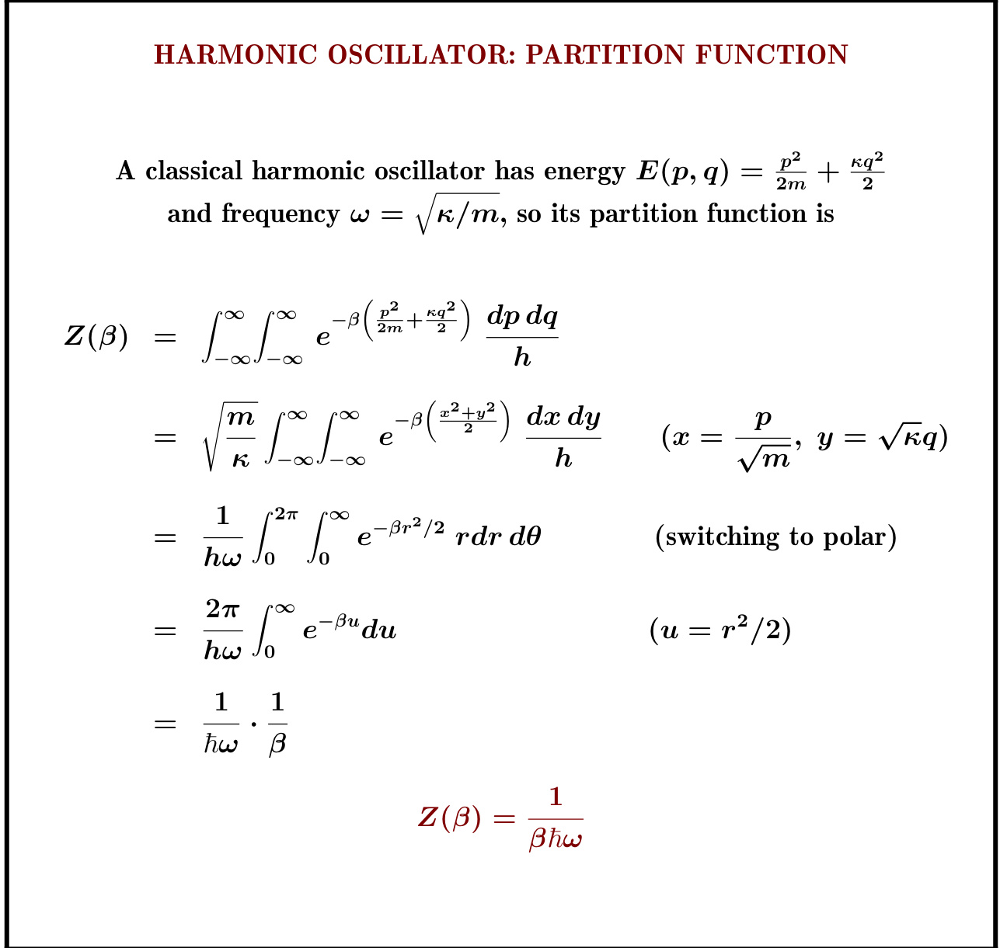  

For the harmonic oscillator, the partition function is the integral of a Gaussian in two variables. A change of variables makes the Gaussian ‘round’, and then we use polar coordinates to do the integral.  

The physicist Kelvin is said to have written  

$$
\int_{-\infty}^{\infty}e^{-x^{2}}d x={\sqrt{\pi}}
$$  

on the blackboard and said “A mathematician is one to whom that is as obvious as that twice two makes four is to you.” I find that rather obnoxious, but when I heard the story as a kid, I made damn sure I knew how to do this integral. The usual trick is to compute the square of this integral using polar coordinates.  

Now we’re seeing something interesting. The harmonic oscillator, whose energy depends quadratically on two degrees of freedom, is physically more important than a system whose energy depends quadratically on just one degree of freedom. And when $\beta=h=\omega=1$ , the partition function of the harmonic oscillator is  

$$
\int_{-\infty}^{\infty}\!\!\int_{-\infty}^{\infty}\,e^{-\left({\frac{x^{2}+y^{2}}{2}}\right)}\,\,d x\,d y=\int_{0}^{2\pi}\int_{0}^{\infty}e^{-r^{2}/2}r d r\;d\theta=2\pi\int_{0}^{\infty}e^{-u}d u=2\pi,
$$  

which is more fundamental than the integral Kelvin wrote down.  

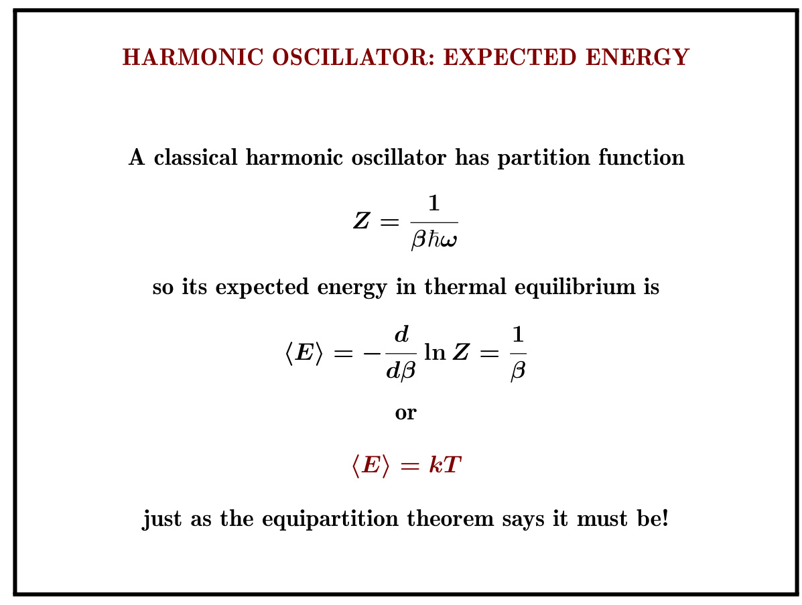  

Once we know the partition function of the classical harmonic oscillator, it’s easy to compute its expected energy: just use  

$$
\langle E\rangle=-{\frac{d}{d\beta}}\ln Z
$$  

and get  

$$
\langle E\rangle=-{\frac{d}{d\beta}}\ln\left({\frac{1}{\beta\hbar\omega}}\right)={\frac{1}{\beta}}.
$$  

We can also figure this out using the equipartition theorem. Remember, the equipartition theorem applies to a classical system whose energy is quadratic. If it has $n$ degrees of freedom, then at temperature $T$ it has  

$$
\langle E\rangle={\frac{n}{2}}k T.
$$  

Our harmonic oscillator has $n\;=\;2$ , so we get $\langle E\rangle\;=\;k T$ .Good, this matches the partition function approach!  

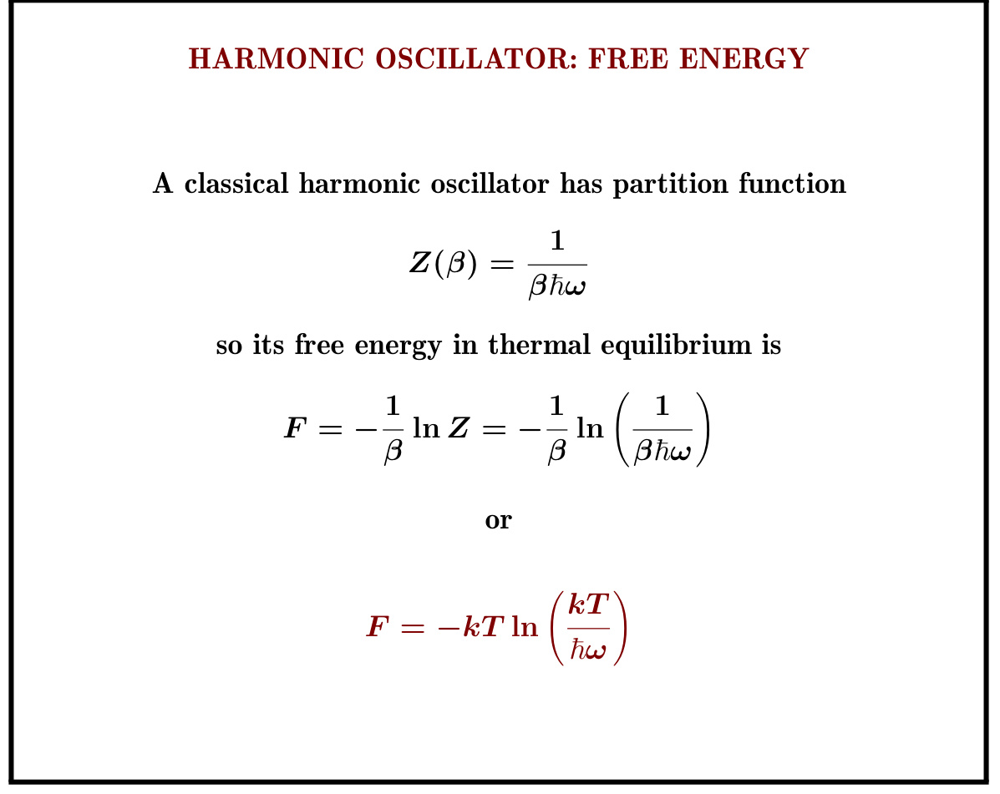  

The partition function lets us do more! It lets us compute the free energy, too, using  

$$
F=-\frac{1}{\beta}\ln Z
$$  

Unlike the expected energy, the free energy involves Planck’s constant:  

$$
F=-k T\ln\left({\frac{k T}{\hbar\omega}}\right).
$$  

Note $k T$ and $\hbar\omega$ both have units of energy, so $k T/\hbar\omega$ is dimensionless, which is good because we’re taking its logarithm. Also note that the free energy is negative at high temperatures! That may seem weird, but it turns out to be good when we compute the entropy.  

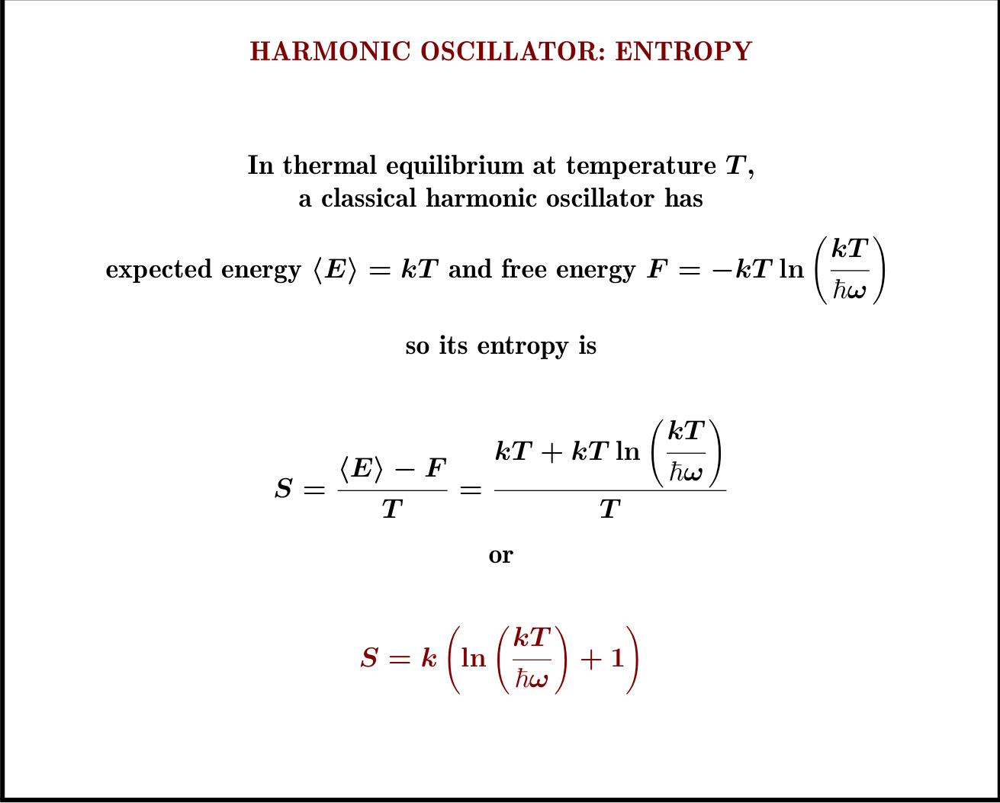  

To compute the entropy of a classical harmonic oscillator, we just use  

$$
S=\frac{\langle E\rangle-F}{T}.
$$  

We get the answer we got before, of course:  

$$
S=k\left(\ln\left({\frac{k T}{\hbar\omega}}\right)+1\right).
$$  

But now we can finally understand the puzzling extra $+1$ .  

As we’ve seen , the entropy of any system in thermal equilibrium consists of two parts:  

1. The free energy part, $-F/T$ . For the classical harmonic oscillator this is  

$$
-{\frac{F}{T}}=k\ln\left({\frac{k T}{\hbar\omega}}\right).
$$  

2. The expected energy part, $\langle E\rangle/T$ . For the classical harmonic oscillator this is  

$$
{\frac{\langle E\rangle}{T}}=k.
$$  

The free energy part of the entropy is always $k$ times the logarithm of the number of accessible states . For the classical harmonic oscillator, the expected energy part of the entropy must equal $k$ by the equipartition theorem , since the oscillator’s energy depends on 2 degrees of freedom. This is small compared to the free energy part when $\hbar\omega\ll k T$ : that is, when quantum effects are small compared to thermal effects.  

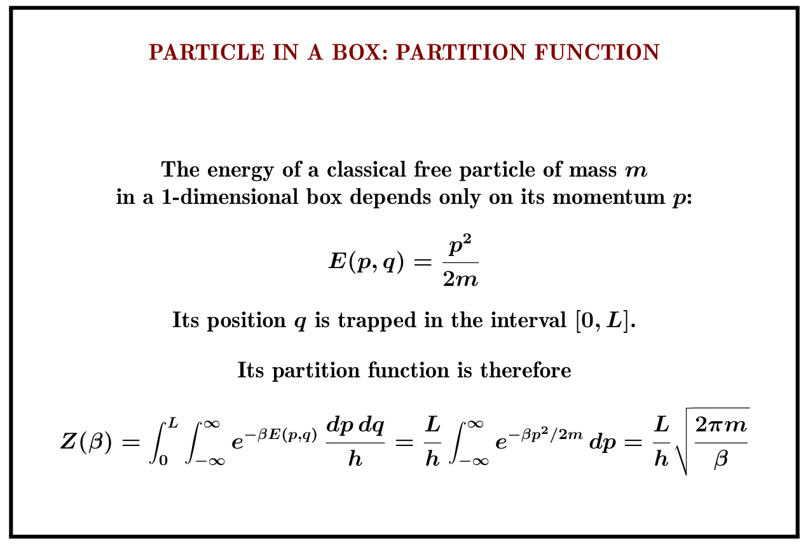  

Now let’s turn to our ultimate goal: computing the entropy of a box of gas. As a warmup, let’s figure out the entropy of a single particle in a box. In fact, let’s start with a a free classical particle in a one-dimensional box: that is, in some interval $[0,L]$ .  

The first step is to compute its partition function. As you can see, this is easy enough. But the whole idea raises some questions. Some people get freaked out by the concept of entropy for a single particle—I guess because it involves probability theory for a single particle, and they think probability only applies to large numbers of things.  

I sometimes ask these people “how large counts as large?” In fact the foundations of probability theory are just as mysterious for large numbers of things as for just one thing. What do probabilities really mean? We could argue about this all day: Bayesian versus. frequentist interpretations of probability, etc. I said a tiny bit about this before ,and I won’t say more now.  

Large numbers of things tend to make large deviations less likely. For example the chance of having all the gas atoms in a box all on the left side is less if you have 1000 atoms than if you have just 2. This makes us worry less about using averages and probability.  

But the math of probability works the same for small numbers of particles—even one particle! Even better, knowing the entropy of one particle in a box will help us understand the entropy of a million particles in a box—at least if they don’t interact, as we assume for an ‘ideal gas’.  

But why just a one-dimensional box? The answer is that particle in a 3-dimensional box is mathematically the same as 3 noninteracting distinguishable particles in a onedimensional box! The $x,y$ ,and $\mathcal{Z}$ coordinates of the 3d particle act like positions of three 1d particles.  

  

We worked out the partition function of a classical free particle in a 1-dimensional box. From this we can work out its expected energy. Look how simple it is! It’s just $\scriptstyle{\frac{1}{2}}k T$ , where $k$ is Boltzmann’s constant and $T$ is the temperature!  

Why is the final answer so simple? We can use the chain rule  

$$
{\frac{d}{d\beta}}\ln Z={\frac{1}{Z}}{\frac{d Z}{d\beta}}
$$  

to see that only the power of $\beta$ in  

$$
Z=\frac{L}{h}\sqrt{\frac{2\pi m}{\beta}}
$$  

matters, not all the constants: these constants show up in $d Z/d\beta$ , but also in $1/Z$ , and they cancel. The length $L$ , the mass $m$ , Planck’s constant $h$ , the factor of $2\pi$ ... none of this junk matters! Not for the expected energy, anyway. Because $Z$ is proportional to $\beta^{-1/2}$ , we simply get $\langle E\rangle={\textstyle{\frac{1}{2}}}k T$ .  

More generally, if the partition function of a system is proportional to $\beta^{-c}$ , its expected energy will be $c k T$ :  

$$
Z\propto\beta^{-c}\implies\langle E\rangle=c k T.
$$  

But when is the partition function of a system proportional to $\beta^{-c}$ ? It’s enough for the system’s energy to be a positive definite quadratic form in $n$ real variables—which physicists call ‘degrees of freedom’. Then $c=n/2$ . We’ve already seen an example with 2 degrees of freedom: the classical harmonic oscillator. We saw that in this example $Z\propto1/\beta$ . This gives $\langle E\rangle=k T$ . But the result is quite general:  

uzzle 45. Suppose we have a system with state space $\mathbb{R}^{n}$ and energy function $E\colon\ensuremath{\mathbb{R}}^{n}\to$ Rthat is a positive definite quadratic form, so that  

$$
E(x)={\frac{1}{2}}\|A x\|^{2}
$$  

$\beta^{-c}$ for some invertible where $c=n/2$ .$n\times n$ matrix $A$ . Show that its partition function is proportional to In fact, this is just a new outlook on our friend the equipartition theorem .  

Here’s another thing to consider. While our particle in a 1d box has 2 degrees of freedom—position and momentum—its energy depends on just one of these, and quadratically on that one. So its expected energy is ${\scriptstyle{\frac{1}{2}}}n k T$ where $n=1$ , not $n=2$ .  

So here’s another puzzle for you:  

Puzzle 46. Say we have a harmonic oscillator with spring constant $\kappa$ . As long as $\kappa>0$ ,$\kappa\,=\,0$ the energy depends quadratically on 2 degrees of freedom so it depends on just one, and suddenly $\langle E\rangle\,=\,{\textstyle{\frac{1}{2}}}k T$ . How is such a discontinuity $\langle E\rangle\,=\,k T$ . But when possible? In other words: how can a particle care so much about the difference between an arbitrarily small positive spring constant and a spring constant that’s exactly zero, making its expected energy twice as much in the first case?  

I’ll warn you: this puzzle is deliberately devilish. In a way it’s a trick question!  

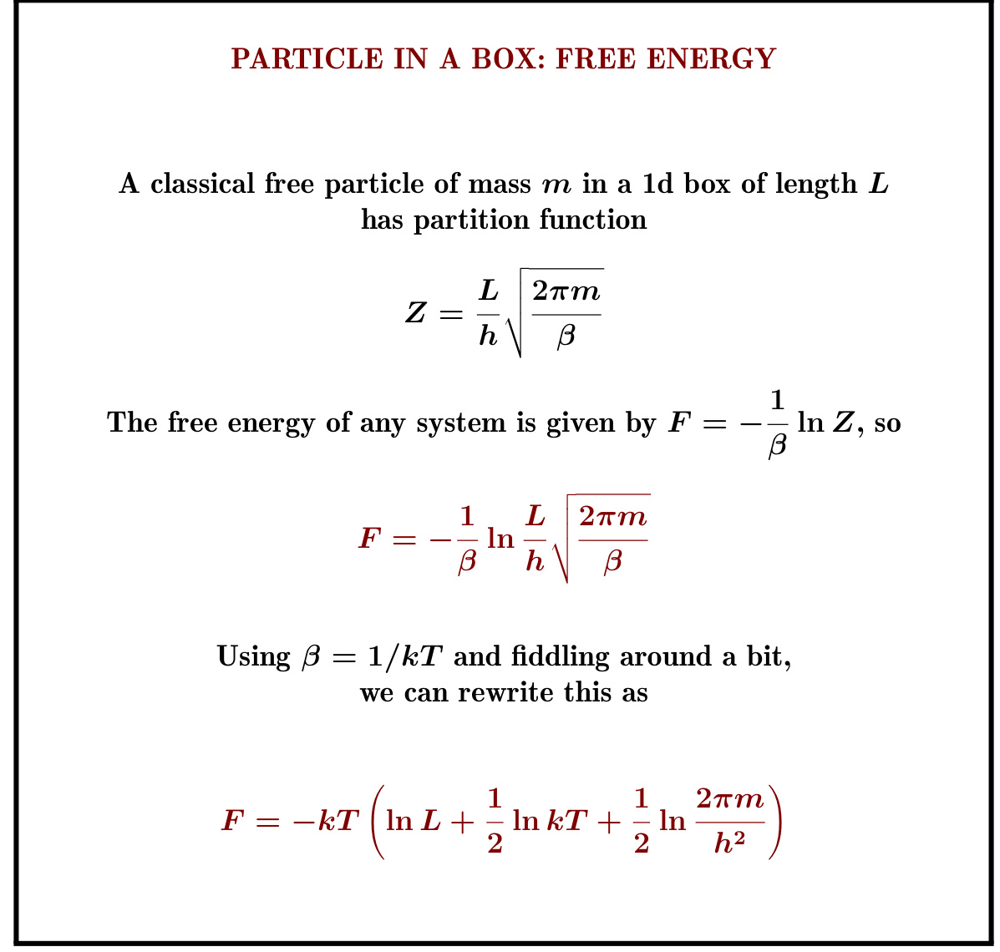  

From the partition function of a classical free particle in a one-dimensional box we can also compute its free energy!  

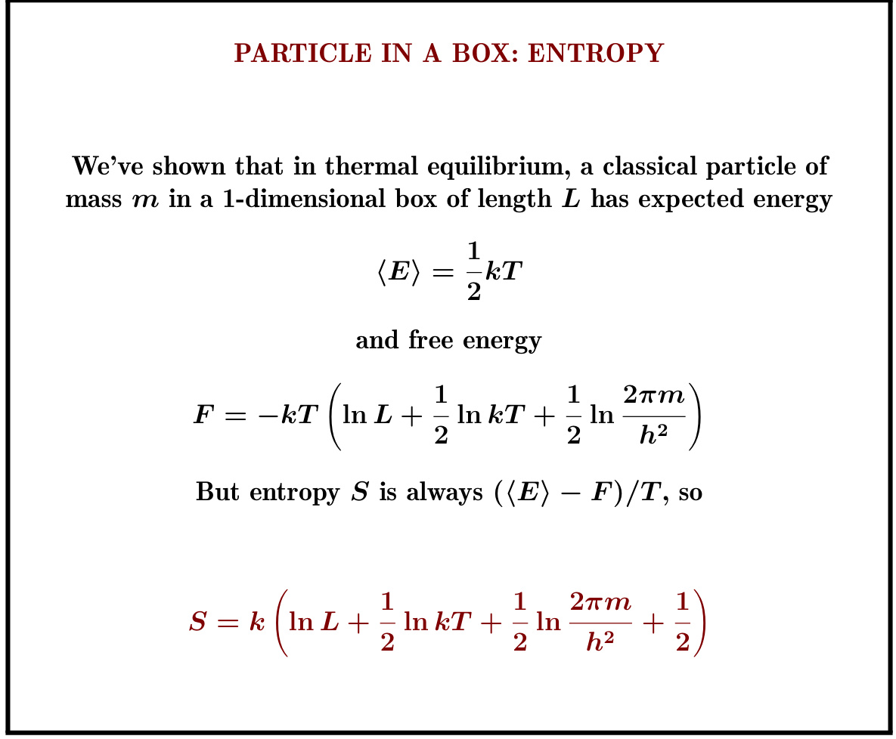  

Having worked out the expected energy $\langle E\rangle$ and free energy $F^{'}$ for a single classical particle in thermal equilibrium in a 1-dimensional box, it is easy to work out its entropy. We just subtract the free energy from the expected energy and divide by temperature:  

$$
S=\frac{\langle E\rangle-F}{T}.
$$  

The formula we get is not very snappy:  

$$
S=k\left(\ln{\cal L}+{\frac{1}{2}}\ln k T+{\frac{1}{2}}\ln{\frac{2\pi m}{h^{2}}}+{\frac{1}{2}}\right).
$$  

We will get a better formula later , and ponder its meaning. For now, let’s just make these observations:  

• When we make the length $L$ of the box larger, the entropy becomes larger.   
• When we increase the temperature $T$ , the entropy becomes larger.   
• When we increase the mass $m$ of the particle, the entropy becomes larger.  

The first two facts should feel intuitively obvious. When we increase the box’s length, there is more unknown information about the position of the particle in thermal equilibrium. When we increase the particle’s temperature, there is more unknown information about its momentum . The third fact is less obvious. When we introduce the concept of ‘ thermal wavelength ’, we will see that increasing the particle’s mass decreases its thermal wavelength, which in turn increases its entropy in thermal equilibrium.  

# WHERE ARE WE NOW?  

of entropy at standard temperature and pressure? The mystery: why does each molecule of hydrogen have $\sim23$ bits  

The goal: derive and understand the formula for the entropy of a classical ideal monatomic gas:  

$$
S=k N\left(\ln{\frac{V}{N}}+{\frac{3}{2}}\ln k T+\gamma\right)
$$  

including the mysterious constant $\gamma$ .  

The subgoal: compute the entropy of a single classical particle in a 1-dimensional box:  

$$
S=k\left(\ln{\cal L}+{\frac{1}{2}}\ln k T+{\frac{1}{2}}\ln{\frac{2\pi m}{h^{2}}}+{\frac{1}{2}}\right)
$$  

# The sub-subgoal: explain entropy from the ground up, and compute the entropy of a classical harmonic oscillator:  

$$
S=k\left(\ln{\frac{k T}{\hbar\omega}}+1\right)\qquad\quad
$$  

Let’s pause to remember where we are in our game plan. First we computed the entropy of a classical harmonic oscillator. Now we’ve computed the entropy of a single classical particle in a 1-dimensional box. The answer looks a bit like the entropy of an ideal gas! That’s no coincidence—we’re almost there now.  

In case you wanted to know the entropy of a particle in a 3-dimensional box, don’t worry. It’s the same as the entropy of three particles of the same mass in three 1- dimensional boxes of appropriate lengths: the length $L$ , width $W$ and height $H$ of our 3d box. So we can just sum those 3 entropies and get our answer. Since $\ln H{+}\ln W{+}\ln H=$ $\ln V$ where $V$ is the volume of our 3d box, we get  

$$
S=k\left(\ln V+{\frac{3}{2}}\ln k T+{\frac{3}{2}}\ln{\frac{2\pi m}{h^{2}}}+{\frac{3}{2}}\right).
$$  

Later we’ll do this calculation more rigorously and more generally for a box of any shape.  

But you may have another question: what’s the meaning of our formula for the entropy of a classical particle in a 1-dimensional box? It’s pretty complicated, after all, and we’ll need to understand it to have any chance of understanding the mysterious constant $\gamma$ in the formula for a classical ideal monatomic gas.  

We can understand our formula better if we delve into a tiny bit of quantum mechanics, and the concept of ‘thermal wavelength’. So let’s do that.  

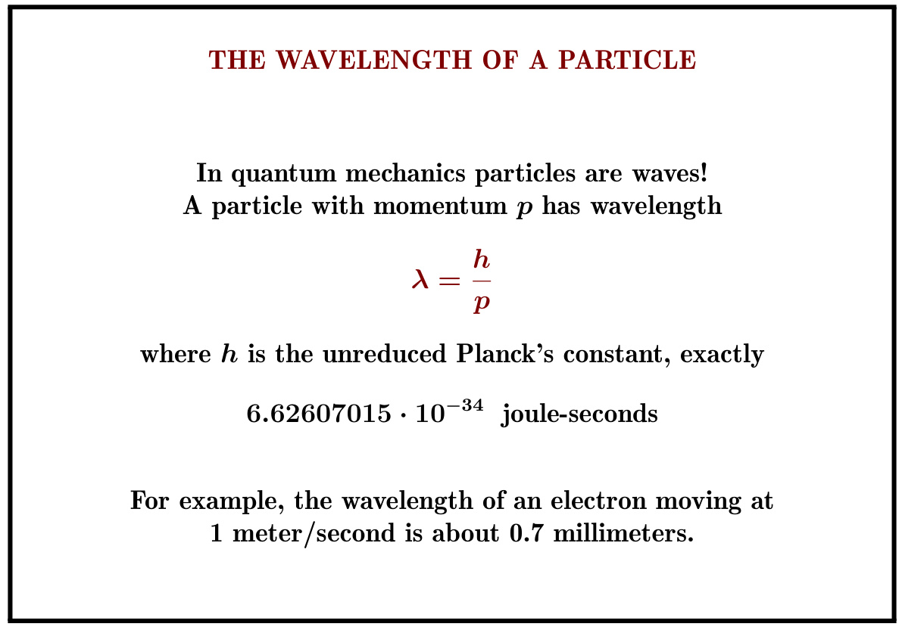  

One of the most amazing discoveries of 20th-century physics: particles are waves. The wavelength of a particle is Planck’s constant divided by its momentum! This was first realized by Louis de Broglie in his 1924 Ph.D. thesis, so it’s called the ‘ de Broglie wavelength ’.  

Why am I telling you this? Because I want to explain and simplify the formula for the entropy of a particle in a box. Even though I derived it classically, it contains Planck’s constant! So, it will become more intuitive if we think a tiny bit about quantum mechanics.  

A good explanation of quantum mechanics would require a whole other course. But it’s good to know that in quantum mechanics, a particle with a given momentum has a wavelength associated to it: we shouldn’t imagine it as having a definite location; it’s a bit ‘blurry’.  

This will give a more intuitive explanation for our complicated formula of the entropy of a particle in a 1d box. We’ll use this intuition to simplify our formula. That will make it easier to generalize to $N$ particles in a 3d box—that is, a classical monatomic ideal gas!  

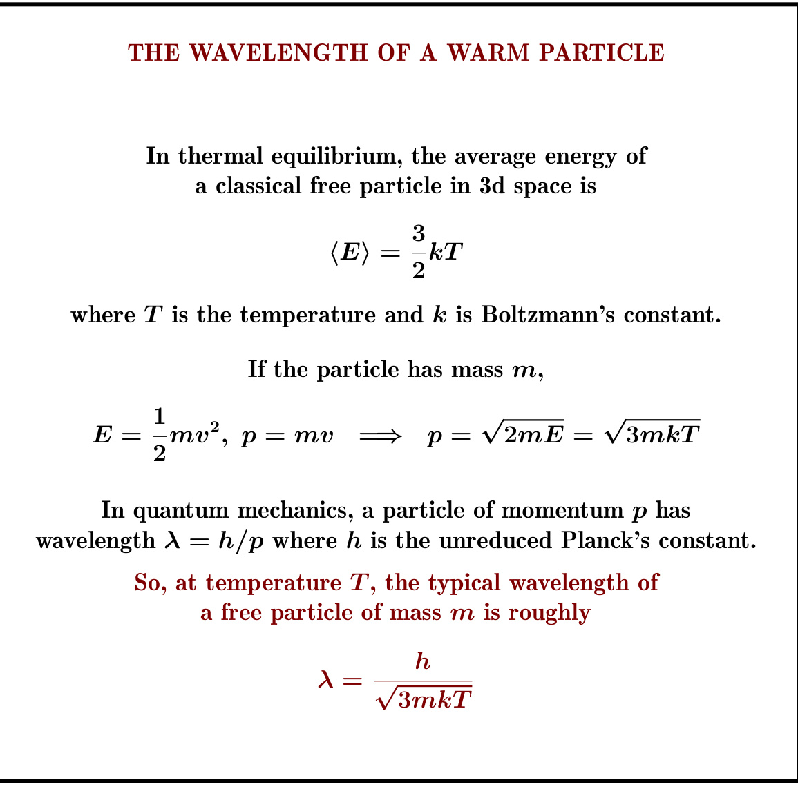  

Particles are waves! Their wavelength is shorter when their momentum is bigger. And the warmer they are, the bigger their momentum tends to be. So there should be a formula for the typical wavelength of a warm particle. And here it is! It helps us visualize the world: particles are a bit blurry, with a characteristic wavelength that depends on temperature.  

We get this formula from a blend of ideas. Classical mechanics says kinetic energy is $E\,=\,p^{2}/2m$ . Classical statistical mechanics says $\langle E\rangle\,=\,{\frac{3}{2}}k T$ . Quantum mechanics says $\lambda=h/p$ . It’s pretty optimistic to put these formulas together and see what we get. But the result is approximately correct, though subject to limitations.  

rect for a single quantum particle in a big enough box at high enough temperatures. We derived $\langle E\rangle\,=\,{\frac{3}{2}}k T$ using classical statistical mechanics. But it’s close to corOtherwise quantum effects kick in.  

Another problem is that $\langle E\rangle\,=\,{\frac{3}{2}}k T$ and $E=p^{2}/2m$ do not imply ⟨$\left<p\right>=\sqrt{3m k T}$ ⟩√,even if $p$ here means the magnitude of the momentum vector. The arithmetic mean of a square is not the square of the arithmetic mean! Really the ‘ root mean square ’of $p$ is $\sqrt{3m k T}$ . Similarly, even if the root mean square of $p$ is $\sqrt{3m k T}$ √and quantum √mechanically $\lambda=h/p$ , we cannot conclude that the root mean square of $\lambda$ is $h/\sqrt{3m k T}$ .Again, you cannot pass a root mean square through a reciprocal!  

So, our derivation above is dodgy—but it’s okay as an order-of-magnitude approximation for a warm enough particle in a big enough box.  

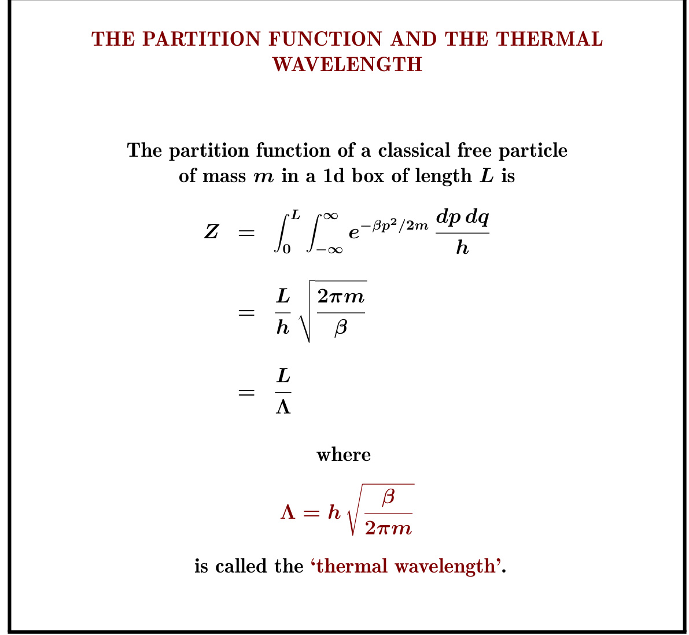  

Last time we saw that at temperature $T$ , the typical wavelength of a free particle of mass ${\mathit{m}}$ is roughly  

$$
\lambda={\frac{h}{\sqrt{3m k T}}}=h{\sqrt{\frac{\beta}{3m}}}\,.
$$  

But the partition function of a classical particle of mass $m$ in a box simplifies a lot if we introduce a slightly different distance scale, which people call the thermal wavelength  

$$
\Lambda={\frac{h}{\sqrt{2\pi m k T}}}=h\,{\sqrt{\frac{\beta}{2\pi m}}}\,.
$$  

Then the partition function is just the length of the box divided by $\Lambda$ . The thermal wavelength $\Lambda$ is a bit smaller than $\lambda$ : we have $\Lambda\approx0.69\lambda$ . But we probably shouldn’t worry about this too much, since our calculation of $\lambda$ was so rough. Of course all these details are worth thinking about. But the thermal wavelength will turn out to be very useful!  

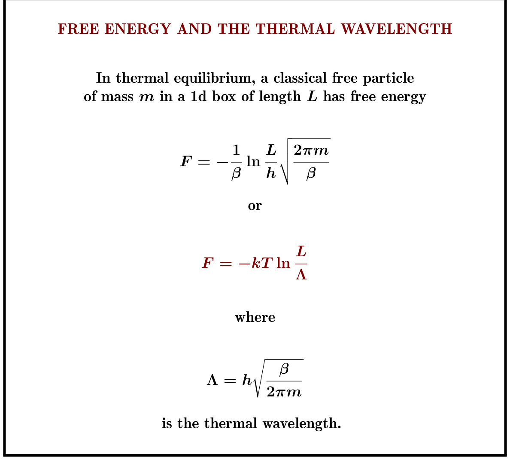  

Since the partition function of the classical free particle in a one-dimensional box is  

$$
Z={\frac{L}{\Lambda}}
$$  

and free energy is related to the partition function by  

$$
F=-\frac{1}{\beta}\ln Z,
$$  

we have  

$$
F=-\frac{1}{\beta}\ln\frac{L}{\Lambda}.
$$  

Expressing this in terms of temperature rather than coolness, we have  

$$
F=-k T\ln{\frac{L}{\Lambda}}.
$$  

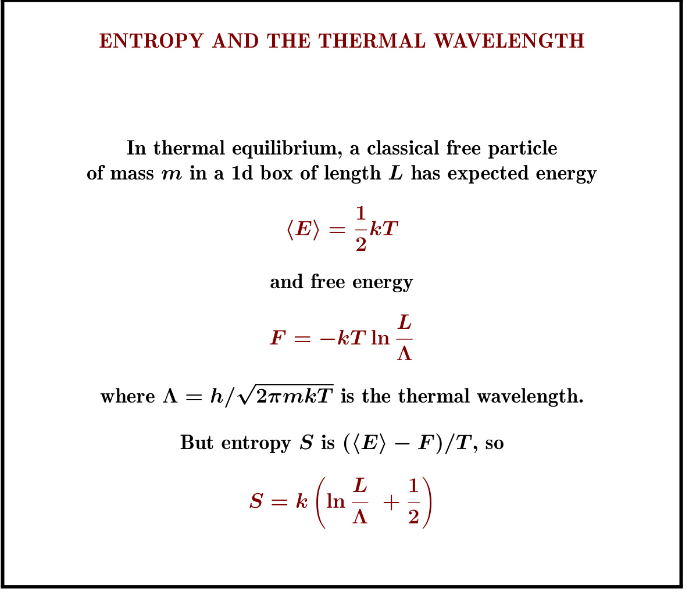  

Now that we have clean formulas for the expected energy and free energy of the classical free particle in a 1-dimensional box, we can get a nice formula for its entropy. This is equivalent to the formula we saw before , but it’s easier to understand. It’s a sum of two terms:  

$$
S=k\left(\ln{\frac{L}{\Lambda}}\;+{\frac{1}{2}}\right).
$$  

Let’s make sure we understand this! We’ve seen that for any system in thermal equilibrium, the entropy is the sum of two parts:  

1. The free energy part. For the classical particle in a 1-dimensional box, this is  

$$
-{\frac{F}{T}}=k\ln{\frac{L}{\Lambda}}.
$$  

2. The expected energy part. For the classical particle in a 1-dimensional box, this is  

$$
{\frac{\langle E\rangle}{T}}={\frac{1}{2}}k.
$$  

The free energy part is always $k$ times the logarithm of the number of accessible states ,and for the particle in a one-dimensional box the number of accessible states is $L/\Lambda$ .The expected energy part is ${\scriptstyle{\frac{1}{2}}}k$ , by the equipartition theorem, because the particle’s expected energy depends on one degree of freedom.  

Let us think a bit more about why the number of accessible states is $L/\Lambda$ . The most rigorous approach is simply to compute the number of accessible states—that is,  

the partition function:  

$$
{\begin{array}{r l l}{Z}&{=}&{\int_{0}^{L}\int_{-\infty}^{\infty}e^{-E/k T}{\frac{d p\,d q}{h}}}\\ &{=}&{\int_{0}^{L}\int_{-\infty}^{\infty}e^{-\beta p^{2}/2m}{\frac{d p\,d q}{h}}}\\ &{=}&{{\frac{L}{h}}\sqrt{\frac{2\pi m}{\beta}}}\\ &{=}&{{\frac{L}{\Lambda}}.}\end{array}}
$$  

A more hand-wavy approach is to imagine the space of states of the particle, meaning the space of momentum-position pa s$(p,q)\in\mathbb{R}\times[0,L]$ . When it comes to counting where the energy is not too big compared to accessible states, each region of area hholds one state. The ‘accessible’ states are those $k T$ , so the probability density $e^{-E/k T}$ is fairly large. This is a bit vague, as it must be, because ‘accessibility’ is not really a yes-or-no matter. But let’s just pretend it is, and say a state is accessible if $E\le k T$ .Then the accessible region of state space is where $p^{2}/2m\leq k T$ , or  

$$
\left|p\right|\leq{\sqrt{2m/\beta}}.
$$  

This region is  

$$
\left\{(p,q)\ \big|\ -\sqrt{2m/\beta}\leq p\leq\sqrt{2m/\beta},\,0\leq q\leq L\right\}\subseteq[0,L]\times\mathbb{R}
$$  

It has area $L\times2\sqrt{2m/\beta}$ , so the number of states it holds is this divided by $h$ , or  

$$
\frac{2L}{h}\sqrt{\frac{2m}{\beta}}=\sqrt{\frac{4}{\pi}}\frac{L}{\Lambda}.
$$  

This is just $13\%$ more than the exact value of $Z$ . More importantly, I hope this calculation gives you a mental picture of number of accessible states for the particle in a one-dimensional box. A mental picture can be helpful even if it’s oversimplified. I like to imagine counting the little rectangles of area $h$ that can fit into the ‘accessible’ region of state space.  

Sometimes these little rectangles are called ‘phase space cells’, since ‘phase space’ is essentially a synonym for state space.  

PARTICLE IN A 3D BOX: PARTITION FUNCTION   
The partition function of a classical free particle of mass $\mathbf{\nabla}^{\mathcal{m}}$   
in a 3d box $\textbf{\emph{B}}$ of volume $V$ is   
$Z~~=~~\int_{B}\int_{\mathbb{R}^{3}}e^{-\beta\vec{p}\cdot\vec{p}/2m}\,\frac{d^{3}p\,d^{3}q}{h^{3}}~~=~~\frac{V}{h^{3}}\,\left(\frac{2\pi m}{\beta}\right)^{3/2}$   
where $\beta=1/k T$ is the coolness.   
This result becomes prettier using the thermal wavelength   
$\Lambda=h(\beta/2\pi m)^{1/2}$   
Then we get simply   
$Z={\frac{V}{\Lambda^{3}}}$  

Now that we’ve worked out the statistical mechanics of a classical particle in a onedimensional box, it’s easy to copy everything for a three-dimensional box of any shape. We start with the partition function. The energy of a free particle of mass $m$ is $\vec{p}{\cdot}\vec{p}/2m$ ,so the partition function is the integral of $\exp(-\vec{p}\cdot\vec{p}/2m)$ over all possible positions and momenta. Integrate over momentum and you get  

$$
\int_{\mathbb{R}^{3}}e^{-\beta(p_{1}^{2}+p_{2}^{3}+p_{3}^{2})/2m}\,\frac{d p_{1}d p_{2}d p_{3}}{h^{3}}\ =\ \left(\int_{-\infty}^{\infty}e^{-\beta p^{2}/2m}\,\frac{d p}{h}\right)^{3}\ =\ \left(h\sqrt{\frac{2\pi m}{\beta}}\right)^{3}.
$$  

In terms of the thermal wavelength this is just $1/\Lambda^{3}$ . Integrate over position and you multiply this by the volume of the box, say $V$ . So we get an incredibly simple final answer:  

$$
Z={\frac{V}{\Lambda^{3}}}.
$$  

And this sort of calculation works in any dimension: there’s nothing special about the number 3 here.  

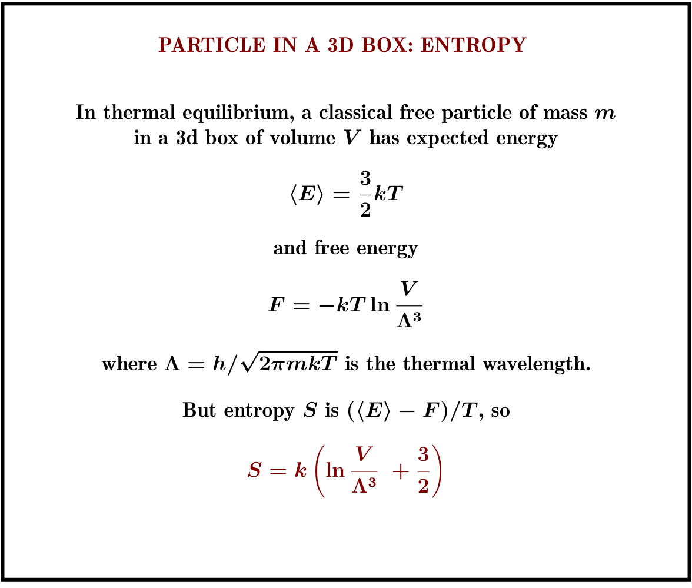  

The entropy of a particle in thermal equilibrium in a three-dimensional box works very much like our earlier calculation for a one-dimensional box, with a couple of adjustments due to the dimension. Since the particle’s energy is now a quadratic function of 3 variables, the equipartition theorem now says its expected energy is  

$$
\langle E\rangle={\frac{3}{2}}k T.
$$  

We can work out its free energy from its partition function, which we computed in the last tweet:  

$$
F=-k T\ln Z=-k\ln{\frac{V}{\Lambda^{3}}}.
$$  

Thus its entropy is  

$$
S={\frac{\langle E\rangle-F}{T}}=k\left(\ln{\frac{V}{\Lambda^{3}}}\ +{\frac{3}{2}}\right).
$$  

The meaning of the two terms here is very similar to that for the particle in the one-dimensional box . The first term is $k$ times the logarithm of the number of accessible states , as always for the Gibbs entropy of a system in thermal equilibrium. Here the number of accessible states is $V/\Lambda^{3}$ . The second term is ${\frac{3}{2}}k$ thanks to the equipartition theorem, since the particle’s expected energy depends quadratically on 3 degrees of ceases to be true, the second term becomes more important—and when Λ freedom. When $V\gg\Lambda^{3}$ this second term is a small correction to t first. As this is comparable to $V$ , quantum corrections to our calculation also become significant.  

# A TALE OF TWO GASES  

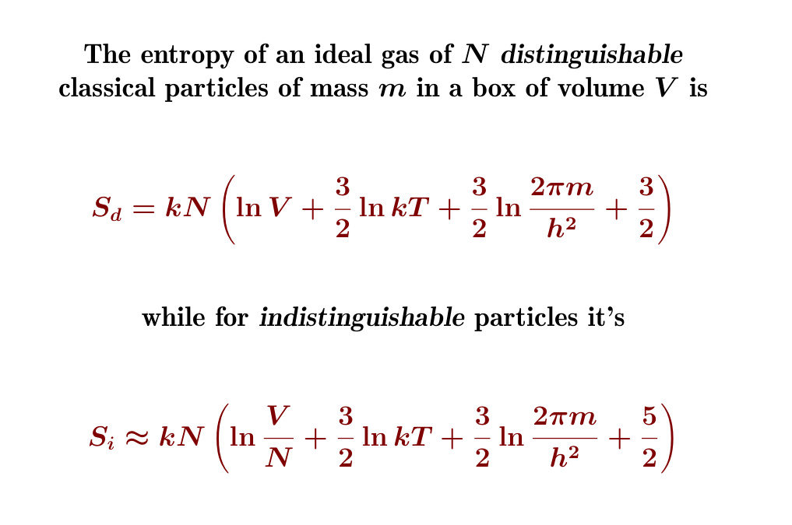  

where the corrections are small compared to $\mathbf{\deltaN}$ as $N\rightarrow\infty$ .  

Now we are finally ready to tackle the entropy of a gas. We start with a ‘monatomic ideal gas’, which means $N$ free point particles bouncing around in a box. But there’s a subtlety! We’ll get different answers depending on whether we think of these particles as distinguishable or indistinguishable . That is: do we count the state of the gas as different if we switch two particles, or not?  

The formulas look very similar. There are three differences:  

• For distinguishable particles we’ll get an exact formula, while for indistinguishable particles we’ll get an approximate one, where the corrections are small compared to $N$ when $N$ become large.  

• The entropy for distinguishable particles has a term equal to $\scriptstyle{\frac{3}{2}}k N$ , while for indistinguishable particles it has a term equal to $\scriptstyle{\frac{5}{2}}k N$ .  

• Most importantly, there’s a huge difference in the volume dependence! Where the distinguishable particles have a term in the entropy equal to $k N\ln V$ , the indistinguishable ones have a term equal to $k N\ln{\frac{V}{N}}$ , so their entropy is considerably smaller for large volumes.  

The last difference makes the entropy behave strangely for distinguishable particles, so in practice the physically important case is the gas of indistinguishable particles. But we’ll do the calculations in both cases, because the distinguishable case is easier, and interesting.  

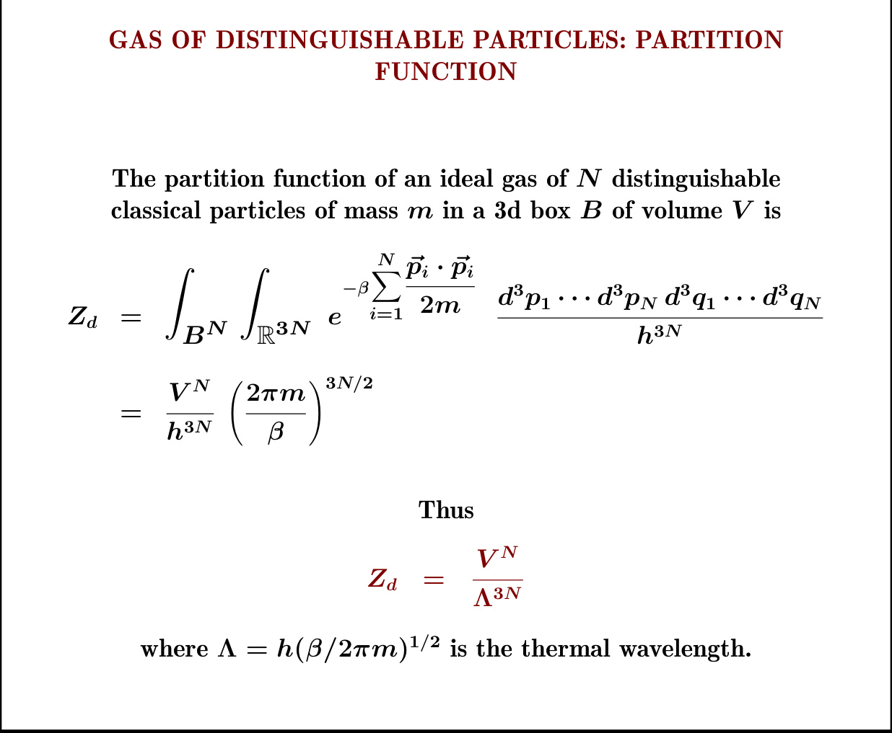  

Suppose we have a system of $N$ distinguishable classical free particles in a threedimensional box $B$ of volume $V$ . The state of this system is described by $N$ positions $\vec{q}_{1},\dotsc,\vec{q}_{N}\,\in\,B$ and $N$ momenta $\vec{p_{1}},\dotsc,\vec{p_{N}}\,\in\,\mathbb{R}^{3}$ . If each particle has mass ${\mathit{m}}$ , the energy of the $i$ th particle is equal to  

$$
E_{i}=\frac{\vec{p_{i}}\cdot\vec{p_{i}}}{2m}
$$  

and the energy of the system is  

$$
E=\sum_{i=1}^{N}E_{i}.
$$  

Let’s call the partition function of this system $Z_{d}$ .To compute this we integrate $\exp(-\beta E)$ over the space of states, obtaining  

$$
Z_{d}=\int_{{\cal{B}}^{N}}\int_{\mathbb{R}^{3N}}\;\exp(-\beta E)\;\frac{d^{3}p_{1}\cdot\cdot\cdot d^{3}p_{N}\,d^{3}q_{1}\cdot\cdot\cdot d^{3}q_{N}}{h^{3N}}.
$$  

Above, I proceeded to compute $Z_{d}$ directly by doing the Gaussian integral over momenta and integrating each position over the box. Here’s a slightly different way. Because  

$$
\exp(-\beta E)=\exp(-\beta E_{1})\cdot\cdot\cdot\exp(-\beta E_{N}),
$$  

the partition function $Z_{d}$ is a product of integrals which are all equal:  

$$
Z_{d}=\left(\int_{B}\int_{\mathbb{R}^{3}}e^{-\beta{\vec{p}}\cdot{\vec{p}}/{2m}}\,{\frac{d^{3}p\,d^{3}q}{h^{3}}}\right)^{N}.
$$  

The integral in the parentheses is the partition function of an single particle in a box. We have already seen that this equals  

$$
\int_{B}\int_{\mathbb{R}^{3}}e^{-\beta{\vec{p}}\cdot{\vec{p}}/2m}\,{\frac{d^{3}p\,d^{3}q}{h^{3}}}={\frac{V}{\Lambda^{3}}}
$$  

where $\Lambda$ is the thermal wavelength. Thus we have  

$$
Z_{d}=\left(\frac{V}{\Lambda^{3}}\right)^{N}.
$$  

We can also do this calculation with a lot less work using Puzzle 36 . This implies that when we build a new system from $N$ identical noninteracting copies of some old system, the partition function of the new system is the $N$ th power of the partition function of the old system. What I just did is show this in a special case.  

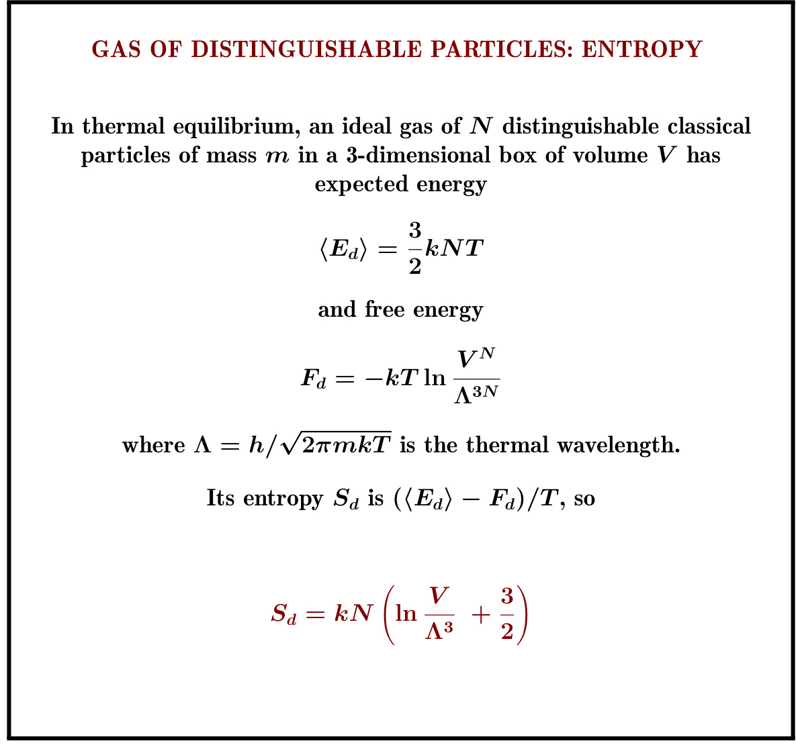  

We use the subscript $d$ for a gas of $N$ distinguishable particles. Since the energy is a quadratic function of $3N$ variables, the equipartition theorem says the expected energy is  

$$
\langle E_{d}\rangle=\frac{3}{2}k N T.
$$  

The free energy $F$ is minus Boltzmann’s constant times the logarithm of the partition function, which we just computed:  

$$
F_{d}=-k\ln Z_{d}=-k\ln{\frac{V^{N}}{\Lambda^{3N}}}.
$$  

Thus the entropy of the gas is  

$$
S_{d}=\frac{\left\langle E_{d}\right\rangle-F_{d}}{T}=k N\left(\ln\frac{V}{\Lambda^{3}}\,+\frac{3}{2}\right).
$$  

If we expand this out using  

$$
\Lambda={\frac{h}{\sqrt{2\pi m k T}}}
$$  

we get the formula I promised earlier:  

$$
S_{d}=k N\left(\ln V+\frac{3}{2}\ln k T+\frac{3}{2}\ln\frac{2\pi m}{h^{2}}+\frac{3}{2}\right).
$$  

The only advantage of this messier formula is that it separates out the temperature dependence and the volume dependence.  

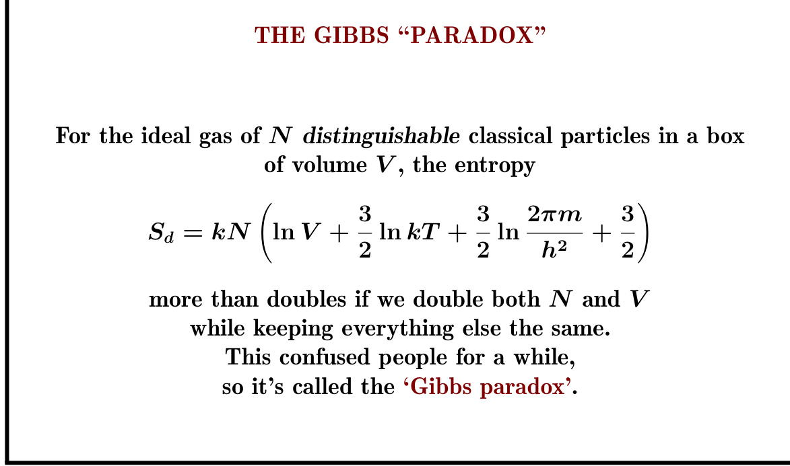  

Start with a box $B$ containing an ideal gas of distinguishable classical particles. Then double the volume of the box to get a new box $B^{\prime}$ , and double the number of particles in the box too, while keeping the temperature and everything else the same.  

We might expect the entropy to double. After all, we could take the doubled box and slip a thin wall down the middle to get two identical copies of the original box. So the entropy should be twice as big now. Right?  

Apparently not! Instead of just doubling the $k N\ln V$ term in the original entropy, that in the doubled box we are replacing it with $2k N\ln(2V)$ $B^{\prime}$ each individual particle has twice as much room to roam , which is more than twice as big. The reason is than if you put a wall down the middle. Thus, it takes more information to say where all the particles are.  

While there’s no real paradox here, people found this result deeply counterintuitive, so they called it the ‘ Gibbs paradox ’. And in fact they had a good reason for being suspicious of this result. It would be correct if gas molecules were distinguishable. But in fact molecules of the same kind are not distinguishable—they don’t have little labels on them that let you recognize which is which. And if we take this fact into account, our formula for the entropy changes. Let’s see how!  

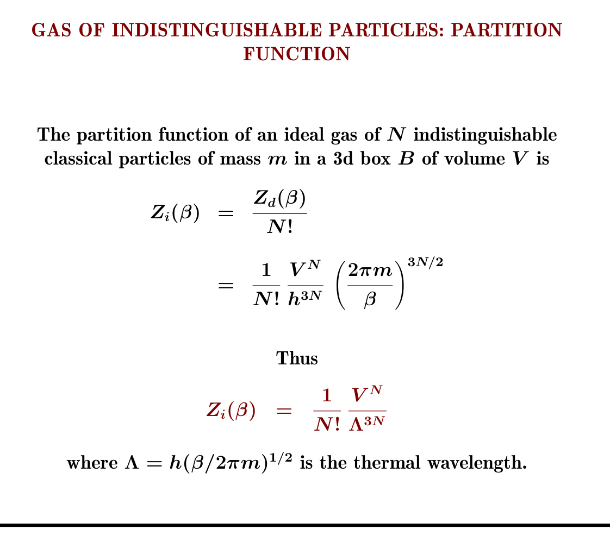  

The partition function $Z_{i}$ for a gas of $N$ indistinguishable particles is $1/N!$ times that for a gas of distinguis ble particles. Why? We got $Z_{d}$ by integrating $\exp(-\beta E)$ over the space of ordered N-tuples of position-momentum pairs. The energy $E$ here does not change if we permute our $N$ -tuple, so we can also think of it as a function of unordered $N$ -tuples. Then we get $Z_{i}$ by i egrating $\exp(-\beta E)$ over the space of such unordered tuples. Notice that there are N! ordered N-tuples for each unordered $N$ -tuple, except for $N$ -tuple with repeated entries, which form a set of measure zero and thus contribute nothing to the integral. Thus, we should not be surprised that  

$$
Z_{i}(\beta)=\frac{Z_{d}(\beta)}{N!}.
$$  

But we’ve seen  

$$
Z_{d}(\beta)=\frac{V^{N}}{\Lambda^{3N}}
$$  

where $\Lambda$ is the thermal wavelength, so  

$$
Z_{i}(\beta)=\frac{1}{N!}\,\frac{V^{N}}{\Lambda^{3N}}.
$$  

Making this sketchy argument precise requires more notation. I think carefully doing the case $N=2$ is the best way for you to see what’s going on.  

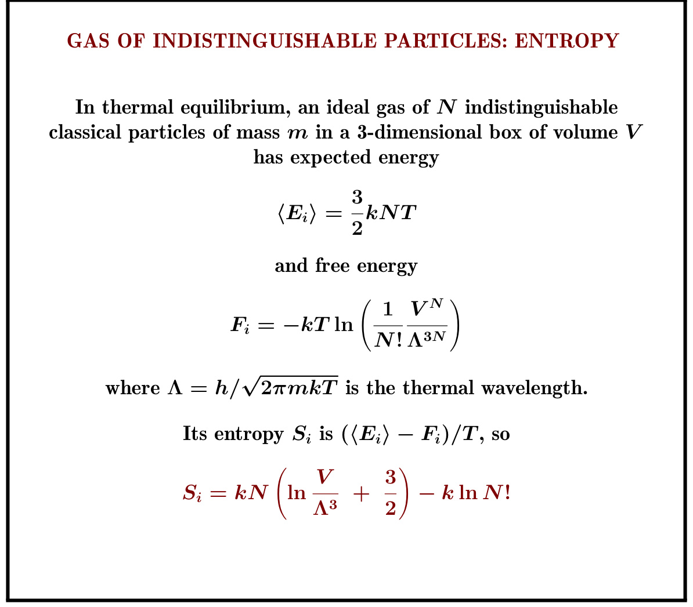  

Suppose we have a gas of $N$ indistinguishable classical free particles. Since the energy is a quadratic function of the $3N$ momentum variables, the equipartition theorem says the expected energy of this gas is  

$$
\langle E_{i}\rangle=\frac{3}{2}k N T.
$$  

The free energy $F$ is minus Boltzmann’s constant times the logarithm of the partition function, which we just computed:  

$$
F_{i}=-k\ln Z_{i}=-k\ln\left(\frac{1}{N!}\frac{V^{N}}{\Lambda^{3N}}\right).
$$  

Thus the entropy of the gas is  

$$
S_{i}=\frac{\langle E_{i}\rangle-F_{i}}{T}=k N\left(\ln\frac{V}{\Lambda^{3}}\,+\frac{3}{2}\right)-k\ln N!
$$  

In short, it is $k\ln{N}!$ ! less than for the gas of distinguishable particles. This makes beautiful intuitive sense: there are $N$ ! permutations of the particles that we no longer care about in the indistinguishable case, so we learn $\ln\,N!$ less information when we learn everything we can about this gas when our initial assumption was that it’s in thermal equilibrium.  

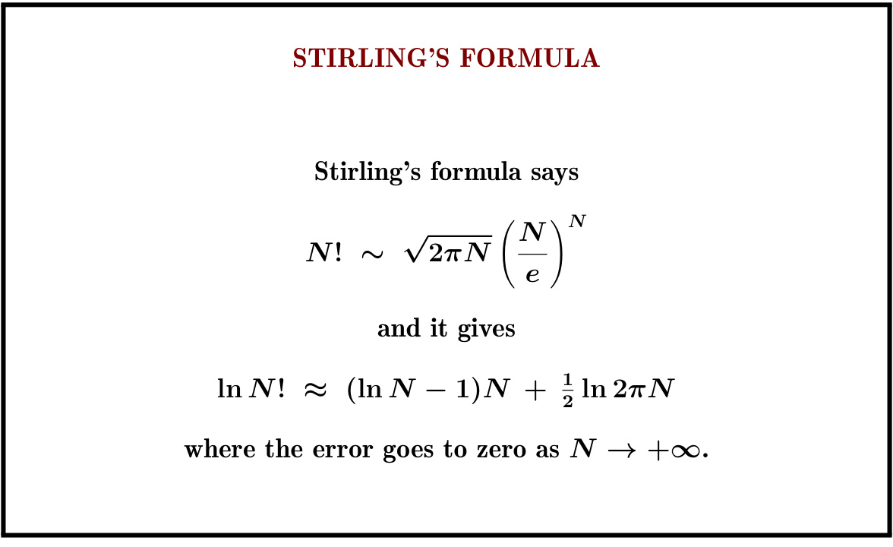  

Now we need a bit of math: Stirling’s formula for the factorial function. In one form this says  

$$
\operatorname*{lim}_{N\rightarrow+\infty}{\frac{\sqrt{2\pi N}\left({\frac{N}{e}}\right)^{N}}{N!}}=1.
$$  

We abbreviate this fact, that the ratio of two quantities approaches 1 as $N\to+\infty$ , by saying $N!$ is asymptotic to $\sqrt{2\pi N}\left(\frac{N}{e}\right)^{N}$ . We also write  

$$
N!\;\sim\;\sqrt{2\pi N}\left({\frac{N}{e}}\right)^{N}.
$$  

where the symbol $\sim$ means ‘asymptotic to’.  

If we take the logarithm of both sides we get  

$$
\begin{array}{r}{\ln N!\approx\ (\ln N-1)N\,+\,\frac{1}{2}\ln2\pi N.}\end{array}
$$  

The symbol $\approx$ has a vaguer meaning: ‘approximately equal to’. But it turns out that in this instance the approximation is extremely good: the difference between the left and right sides goes to zero as $N\to+\infty$ . In fact we will content ourselves with a cruder approximation:  

$$
\ln N!~\approx~(\ln N-1)N
$$  

because in the entropy of an ideal gas $N$ is typically huge, so the term we have discarded here is dwarfed by the others.  

Puzzle 47. Suppose $N$ is Avogadro’s number, close to the number of atoms in 4 grams of helium:  

$$
N\approx6\cdot10^{23}.
$$  

What is the ratio of $\textstyle{\frac{1}{2}}\ln2\pi N$ to $N$ ?  

While deriving Stirling’s formula is fascinating and not at all trivial, doing so would take us rather far afield. So I will resist, and refer you instead to this:  

• John C. Baez, Stirling’s formula ,The $n$ -Category Café , October 24, 2021.  

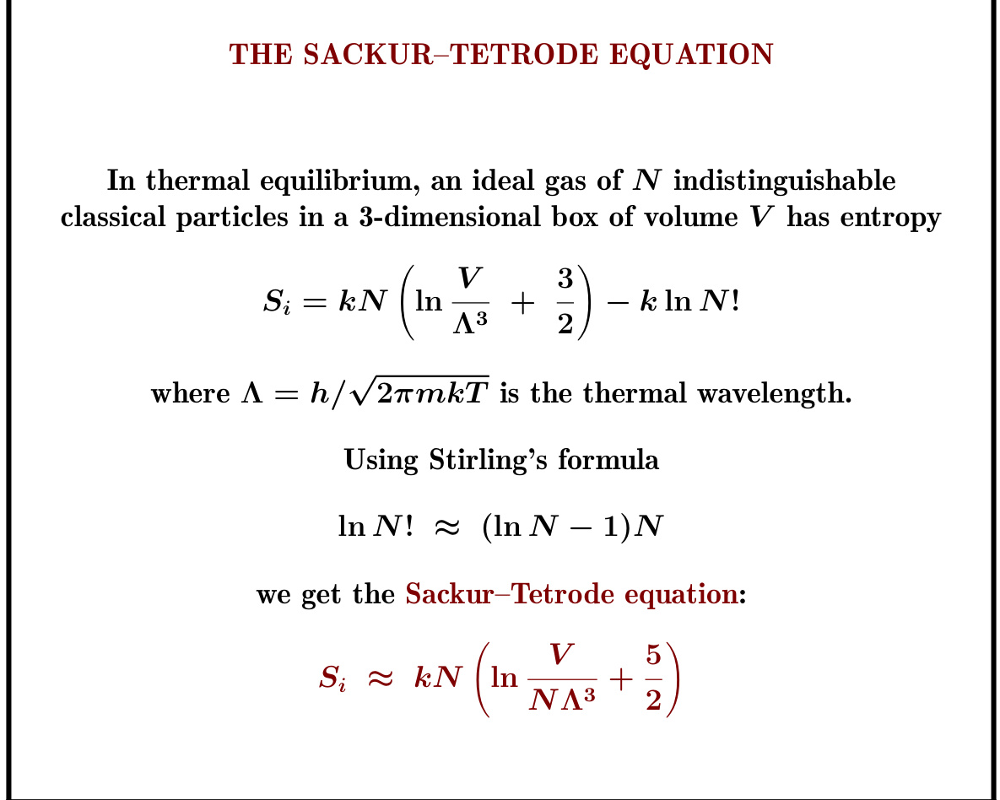  

Taking our formula  

$$
S_{i}=k N\left(\ln{\frac{V}{\Lambda^{3}}}\;+\;{\frac{3}{2}}\right)-k\ln N!
$$  

and using a simple version of Stirling’s formula, $\ln N!\sim(\ln N-1)N$ , we get the famous Sackur–Tetrode equation :  

$$
\begin{array}{l l l}{{S_{i}}}&{{\displaystyle\sim}}&{{k N\left(\ln\frac{V}{\Lambda^{3}}\,+\,\frac{3}{2}\right)-k(\ln N-1)N}}\\ {{}}&{{}}&{{}}\\ {{}}&{{\displaystyle\sim}}&{{k N\left(\ln\frac{V}{N\Lambda^{3}}+\frac{5}{2}\right).}}\end{array}
$$  

Note that with this formula, if we multiply both $V$ and $N$ by the same constant, the entropy also gets multiplied by that constant. In this situation we say the entropy is ‘extensive’.  

For a better approximation, we can use  

$$
\ln N!\,\approx\,(\ln N-1)N+{\textstyle{\frac{1}{2}}}\ln2\pi N\,
$$  

where the error goes to zero as $N\rightarrow\infty$ . This gives a correction to the Sackur–Tetrode equation:  

$$
S_{i}\approx k N\left(\ln{\frac{V}{N\Lambda^{3}}}+{\frac{5}{2}}\right)-{\frac{1}{2}}\ln{2\pi N}.
$$  

Here if we multiply both $V$ and $N$ by a constant $c$ , we don’t just multiply the entropy by $c$ : we also have to subtract $\textstyle{\frac{1}{2}}\ln2\pi c$ . So the entropy is not quite extensive—but this effect is tiny when you’ve got a mole of gas.  

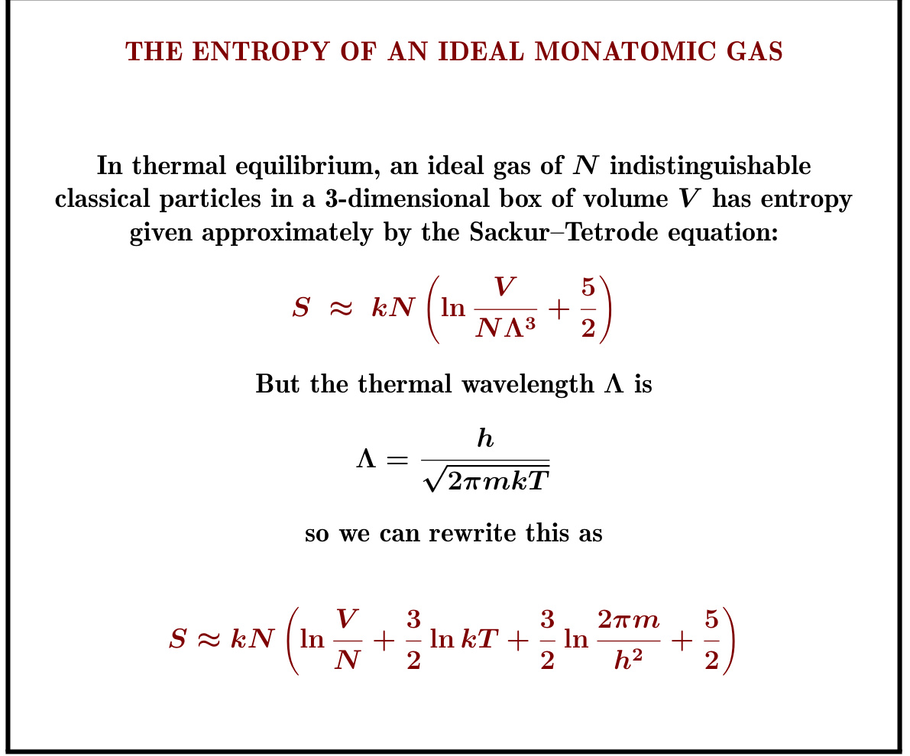  

We’ve done it: we’ve figured out the entropy of a gas of $N$ indistinguishable classical free particles in a 3-dimensional box of volume $V$ . Above I’ve written it in two different ways. Let’s mull over the meaning of each term in each formula.  

The first formula says  

$$
S\approx k N\left(\ln{\frac{V}{N\Lambda^{3}}}+{\frac{5}{2}}\right).
$$  

Like the entropy of the classical harmonic oscillator and the classical free particle in a box, this breaks up into two parts , thanks to the formula  

$$
S=\frac{\langle E\rangle-F}{T}.
$$  

But it does so a bit subtly. The two parts are not what you might naively think! They are:  

1. The free energy part:  

$$
-\frac{F}{T}\approx k N\left(\ln\frac{V}{N\Lambda^{3}}+1\right).
$$  

2. The expected energy part:  

$$
\frac{\langle E\rangle}{T}=\frac{3}{2}k N.
$$  

As usual, the free energy part of the entropy is $k$ times the logarithm of the number of accessible states . The expected energy part of the entropy is ${\frac{3}{2}}N$ times $k$ by the equipartition theorem , since there are $N$ particles each of whose energy depends on 3 momentum degrees of freedom.  

The expected energy part of the entropy is small compared to the free energy part when $V/N\gg\Lambda^{3}$ : that is, when the volume available per particle greatly exceeds the cube of its thermal wavelength. This happens for a gas that is sufficiently warm and dilute, made of sufficiently massive particles. We will see that this is true for helium at standard temperature and pressure. It’s even more true for the heavier monatomic gases: the noble gases like neon, argon, and krypton.  

The surprise is the extra “+1” in the first part of the entropy—the free energy part. It’s telling us that the logarithm of the number of accessible states, divided by the number of particles, is  

$$
\ln{\frac{V}{N\Lambda^{3}}}+1.
$$  

What’s the physical origin of this mysterious extra nat?  

Mathematically it comes from Stirling’s formula , which showed up when we switched from a gas of distinguishable particles to a gas of indistinguishable particles. It may seem odd that indistinguishability would increase the entropy by 1 nat per particle, but don’t be confused: as we’ve seen, it greatly reduces it. For a gas of distinguishable particles the log of the number of accessible states, divided by the number of particles, is $\ln(V/\Lambda^{3})$ . When we switch to indistinguishable particles this drops to $\ln(V/N\Lambda^{3})\!+\!1$ .  

Here is a rough heuristic explanation of what’s going on. For a single particle in a box of volume $V$ , the number of accessible states is $V/\Lambda^{3}$ . In a gas of distinguishable free particles, each roams independently around the whole volume $V$ . Thus, the log of the number of accessible states is $\ln(V/\Lambda^{3})$ per particle.  

For a gas of indistinguishable particles, the story changes. For starters, we can crudely pretend each particle is trapped in its own tiny box of volume $V/N$ . After all, if it leaves this tiny box by trading places with another particle in another tiny box, nothing really changes. In this approximation, the log of the number of accessible states is $\ln(V/N\Lambda^{3})$ per particle.  

But it’s not really true that each particle can only leave its tiny box by trading places with another. We can have more than one particle in the same tiny box—or none. That is, our gas can have density fluctuations. An exact treatment of the problem gives, not $\ln(V/N\Lambda^{3})$ nats per particle, but  

$$
\ln(V/\Lambda^{3})-\ln N!
$$  

Stirling’s formula says this is approximately  

$$
\ln(V/\Lambda^{3})-(\ln N-1)\;\;=\;\;\ln(V/N\Lambda^{3})+1.
$$  

This explains the mysterious extra nat. The extra nat of entropy per particle is due to density fluctuations!  

As we’ve seen, even this is an oversimplification. A still better approximation, again coming from Stirling’s formula, says  

$$
\begin{array}{r l r}{\ln(V/\Lambda^{3})-\ln N!}&{{}\approx}&{\ln(V/N\Lambda^{3})+1-\frac{1}{2}\ln(2\pi N)/N.}\end{array}
$$  

But as we saw in Puzzle 47 , this further correction is negligible for a mole of gas. It only becomes interesting for microscopic systems.  

Now let’s look at our second formula for the entropy of a gas of $N$ indistinguishable classical free particles:  

$$
S\approx k N\left(\ln{\frac{V}{N}}+{\frac{3}{2}}\ln k T+{\frac{3}{2}}\ln{\frac{2\pi m}{h^{2}}}+{\frac{5}{2}}\right).
$$  

Not only is this harder to remember, it’s generally less friendly to physical intuition. First of all, three of the terms involve the logarithm of dimensionful quantities. Thus, when we change units they change, not by rescaling in the usual way, but by addition or subtraction. Secondly, the important role of the thermal wavelength is concealed in this formula.  

The main advantage of this formula is that it separates out three contributors to the entropy per particle:  

• The volume available per particle, $V/N$ . The bigger this is, the more entropy the gas has per particle. • The temperature, $T$ . The bigger this is, the more entropy per particle. • The particle mass, $m$ . The bigger this is, the more entropy per particle.  

The first two should be rather intuitive. But what about the third? We need to combine $V/N$ and $T$ with the particle mass ${\mathit{m}}$ and some constants of nature to get a dimensionless quantity, which we can then take the logarithm of. This leads us straight to the thermal wavelength:  

$$
{\begin{array}{l l l}{\ln{\frac{V}{N}}+{\frac{3}{2}}\ln k T+{\frac{3}{2}}\ln{\frac{2\pi m}{h^{2}}}}&{=}&{\ln{\frac{V(2\pi m k T)^{3/2}}{N h^{3}}}}\\ &{=}&{\ln{\frac{V}{N\Lambda^{3}}}.}\end{array}}
$$  

Thus, my best explanation of why a gas of heavier particles has more entropy per particle is that they have a shorter thermal wavelength, so we can specify their position more accurately, and it takes more information to do so.  

# WHERE ARE WE NOW?  

of entropy at standard temperature and pressure? The mystery: why does each molecule of hydrogen have $\sim23$ bits  

The goal: derive and understand the formula for the entropy of a classical ideal monatomic gas:  

$$
S=k N\left(\ln{\frac{V}{N}}+{\frac{3}{2}}\ln k T+\gamma\right)
$$  

including the mysterious constant $\gamma$ :  

$$
\gamma=\frac{3}{2}\ln\frac{2\pi m}{h^{2}}+\frac{5}{2}~~~~~~~~~\sqrt{
$$  

The subgoal: compute the entropy of a single classical particle in a 1-dimensional box:  

$$
S=k\left(\ln{\cal L}+{\frac{1}{2}}\ln k T+{\frac{1}{2}}\ln{\frac{2\pi m}{h^{2}}}+{\frac{1}{2}}\right)
$$  

The sub-subgoal: explain entropy from the ground up, and compute the entropy of a classical harmonic oscillator:  

$$
S=k\left(\ln{\frac{k T}{\hbar\omega}}+1\right)\qquad\quad
$$  

Okay, now we know the entropy of a classical ideal monatomic gas! We even know what it means. Unfortunately we’re trying to figure out the entropy of hydrogen, which is diatomic. But we can do helium, which is monatomic... and then we’ll do hydrogen.  

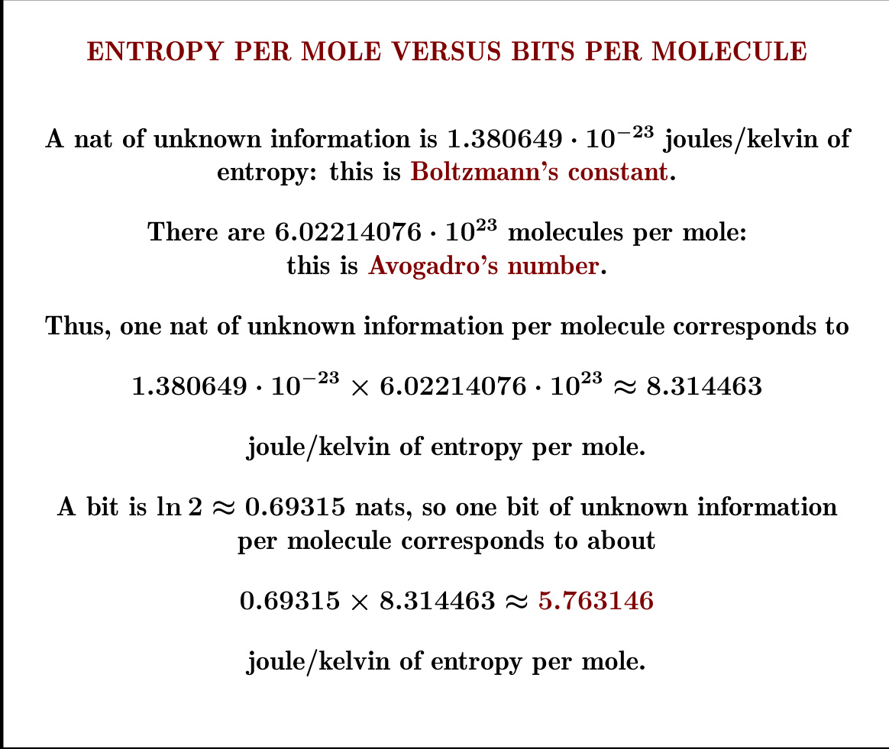  

Here is a little fact we need now: one bit of Shannon entropy per molecule equals about 5 .76 joules/kelvin of Gibbs entropy per mole. I apologize for the oppressively large number of decimal places above, but I want to compare our theoretical predictions of the entropy of helium and hydrogen to experimental results, and it’s not clear yet how closely our answers will match experiment, so it’s good to be prepared.  

By the way, the values of Boltzmann’s constant and Avogadro’s number here are exact , fixed by the definition of SI units . So there is no experimental uncertainty in any of the numbers on this page.  

The Sackur–Tetrode equation says that assuming helium is a classical ideal monatomic gas, its entropy is  

$$
S_{i}\ \approx\ k N\left(\ln\frac{V}{N\Lambda^{3}}+\frac{5}{2}\right)
$$  

which corresponds to  

$$
\ln{\frac{V}{N\Lambda^{3}}}+\frac{5}{2}
$$  

nats of unknown information per atom. At standard temperature and pressure, this gives about 15.041 nats or  

$$
{\frac{\mathbf{15.041}}{\ln2}}\approx21.700
$$  

bits of unknown information per atom.  

Now let’s calculate the entropy of helium in its gaseous state. NIST has tabulated its entropy at standard temperature and pressure, specifically temperature $I^{\prime}=298.15$ K and pressure $P=1$ bar, so that’s what we’ll try to calculate. An atom of helium has a mass of $m=6.646477\cdot10^{-27}~\mathrm{kg}$ , so at standard temperature its thermal wavelength is  

$$
\begin{array}{r c l}{\Lambda}&{=}&{\displaystyle\frac{h}{\sqrt{2\pi m k T}}}\\ &{\approx}&{\displaystyle\frac{6.62607\cdot10^{-34}\,\mathrm{J\,s}}{\sqrt{2\pi\times6.646477\cdot10^{-27}\,\mathrm{kg}\times1.380649\cdot10^{-23}\,\mathrm{J/K\times298.15\,K}}}}\\ &{\approx}&{\displaystyle5.053721\cdot10^{-11}\,\mathrm{m}.}\end{array}
$$  

For a mole of an ideal gas we have $N=6.02214076\cdot10^{23}$ (this is A ,and at standard temperature and pressure a mole of ideal gas has V$V\approx0.0247896\,\mathrm{m^{3}}$ ≈:this is called its ‘molar volume’. The molar volume of helium is actually slightly different from this, because helium is not an ideal gas: the atoms interact. But since we’re doing a calculation assuming helium is a classical ideal gas, let’s ignore that for now. We then get  

$$
{\frac{V}{N\Lambda^{3}}}\approx{\frac{0.0247896\,\mathrm{m}^{3}}{6.02214076\cdot10^{23}\times(5.2799291\cdot10^{-11}\,\mathrm{m})^{3}}}\approx279663.
$$  

We thus have  

$$
\ln{\frac{V}{N\Lambda^{3}}}\approx\ln279663\approx12.541.
$$  

As explained earlier , this means that the logarithm of the number of accessible states of each helium atom would be 12 .541 if it were trapped in its own small box of volume $V/N$ . But density fluctuations contribute 1 extra nat of entropy per atom. Thus, the  

free energy part of the entropy per atom is 13 .541 nats. On the other hand, the expected energy part of the entropy per atom is $\frac{3}{2}$ , coming from the atom’s 3 momentum degrees of freedom. The total entropy per atom is thus  

$$
\ln{\frac{V}{N\Lambda^{3}}}+1+{\frac{3}{2}}\approx15.041
$$  

nats.  

To impress our friends we can convert this to bits: we divide by $\ln2$ and get about  

$$
\frac{15.041}{0.69315}\approx21.700
$$  

bits of unknown information per atom of helium.  

I’ve kept only 5 significant figures in the later stages of these calculations, since that’s how precise the experimental data is. Next let’s compare the final result to experiment!  

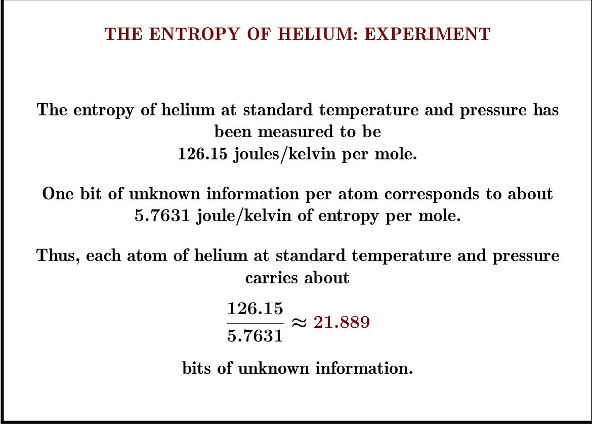  

Experimentally, the entropy of helium at standard temperature and pressure is 126 .15 joules/kelvin per mole. Converting this to bits per atom we get 21 .889, very close to our theoretical result of 21 .700, but about $0.9\%$ higher.  

There are a couple of possible reasons for this slight discrepancy. First, while our theoretical calculation assumed that helium is an ideal gas of noninteracting point particles, this is not true. The helium atoms interact!  

Second, our computation ignored quantum effects—except for using Planck’s constant to determine the thermal wavelength. Even for an ideal gas, quantum effects become important when $V/N\Lambda^{3}$ ceases to be large. This happens at high densities $N/V$ , low temperatures $T$ , or for particles of small mass $m$ . Helium has a low mass as molecules of gas go—and our ultimate goal, hydrogen, is even worse.  

Now let’s tackle the final summit: hydrogen. This is a diatomic gas, so it works differently.  

# THE IDEAL DIATOMIC GAS  

In thermal equilibrium, a classical ideal diatomic gas of $\mathbf{\deltaN}$ indistinguishable molecules of mass $\mathbf{\nabla}m$ in a 3-dimensional box of volume $V$ has expected energy  

$$
\langle E\rangle={\frac{5}{2}}k N T
$$  

and free energy  

$$
F=-k T\ln\left(\frac{1}{N!}\frac{V^{N}}{\Lambda^{3N}}\right)
$$  

where $\Lambda=h/{\sqrt{2\pi m k T}}$ is the thermal wavelength.  

$$
S=k N\left(\ln{\frac{V}{\Lambda^{3}}}\;+\;{\frac{5}{2}}\right)-k\ln N!
$$  

and using Stirling’s formula ${\bf l n}\,{\cal N}{\bf!}\;\approx\;({\bf l n}\,{\cal N}-{\bf1}){\cal N}$ we get  

$$
S\ \approx\ k N\left(\ln{\frac{V}{N\Lambda^{3}}}+{\frac{7}{2}}\right)
$$  

It’s easy to repeat our computation of entropy for a diatomic gas if we recall that the tumbling of the molecules add two degrees of freedom to the three for position, than for a monatomic gas. To be precise, the entropy of a classical ideal diatomic gas giving $\langle E\rangle\,=\,{\textstyle{\frac{5}{2}}}k N T$ . Tracking the effects of this change we see the entropy is higher is  

$$
S\;\approx\;k N\left(\ln{\frac{V}{N\Lambda^{3}}}+{\frac{7}{2}}\right).
$$  

So, it has one more nat of Shannon entropy per molecule than an ideal monatomic gas! Let’s see how this plays out for hydrogen.  

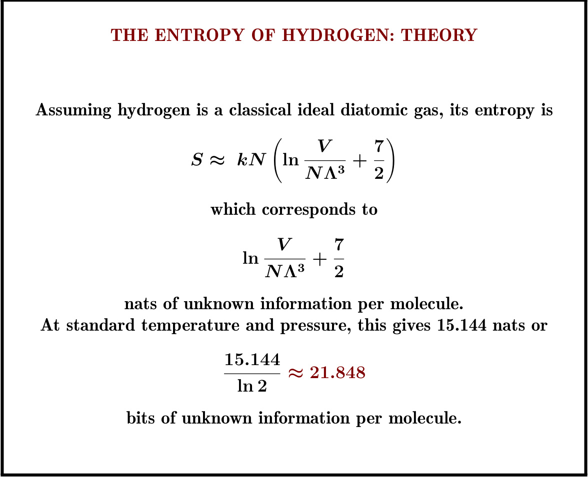  

A hydrogen molecule has $m=3.34706\cdot10^{-27}\ \mathrm{kg}$ , so at a temperature $T=298.15$ K its thermal wavelength is  

$$
\begin{array}{r c l}{{\Lambda}}&{{=}}&{{\displaystyle\frac{h}{\sqrt{2\pi m k T}}}}\\ {{}}&{{\approx}}&{{\displaystyle\frac{6.62607\cdot10^{-34}\mathrm{J}\,\mathrm{s}}{\sqrt{2\pi\times3.34706\cdot10^{-27}\,\mathrm{kg}\times1.380649\cdot10^{-23}\,\mathrm{J}/\mathrm{K}\times298.15\,\mathrm{K}}}}}\\ {{}}&{{\approx}}&{{\displaystyle7.12156\cdot10^{-11}\,\mathrm{m}.}}\end{array}
$$  

For gas at standard temperature and pressure, $N=6.02214076\cdot10^{23}$ and V$V\approx0.0247896\,\mathrm{m^{3}}$ ≈3 , so  

$$
{\frac{V}{N\Lambda^{3}}}\approx{\frac{0.0247896\,\mathrm{m}^{3}}{6.02214076\cdot10^{23}\times(7.12156\cdot10^{-11}\,\mathrm{m})^{3}}}\approx113971
$$  

We thus have  

$$
\ln{\frac{V}{N\Lambda^{3}}}\approx\ln113971\approx11.644
$$  

Thanks to our previous work we know this means that that the logarithm of the number of accessible states of each molecule would be 11 .644 if it were trapped in its own small box of volume $V/N$ . There is also a correction to this simplified picture due to density fluctuations, which gives 1 extra nat of entropy. These add up to give the free energy contribution to the entropy per molecule: 12 .644 nats. This is less than we got for helium. But the expected energy contribution to the entropy per molecule is larger: we again get $\frac{3}{2}$ nats from the molecule’s 3 momentum degrees of freedom, but now we get 1 extra nat due to its 2 extra tumbling degrees of freedom. The total number of nats of unknown information per hydrogen molecule is thus  

$$
11.644+1+1.5+1\approx15.144.
$$  

Finally, the number of bits of unknown information per hydrogen molecule is  

$$
{\frac{15.144}{0.69315}}\approx21.848.
$$  

This is slightly more than for helium, where the number was 21 .700.  

As a sanity check, let’s do this calculation a different way. A hydrogen molecule is close to half the mass of a helium atom, so its thermal wavelength should be $\sqrt{2}$ hydrogen’s times as large. In our calculation we’re treating $V/N\Lambda^{3}$ should be $2^{-3/2}$ times as large as that for helium. Since ultimately $V/N$ as the same for both gases, so we compute bits by taking a logarithm in base 2, this reduces its entropy per molecule by $3/2$ bits. However, hydrogen’s 2 tumbling degrees of freedom increase its entropy per molecule by 1 nat, or $1/\ln2$ bits. We have  

$$
-{\frac{3}{2}}+{\frac{1}{\ln2}}\approx-1.5+1.443\approx-0.057.
$$  

This suggests that each hydrogen molecule should carry 0 .057 fewer bits of unknown information than each helium atom. Why did our more careful calculation say hydrogen should have about  

$$
21.848-21.700\approx0.148
$$  

more bits of unknown information per molecule? What’s the mistake?  

The slight discrepancy arises solely from the fact that a hydrogen molecule is not exactly half the mass of a helium atom! It’s a bit heavier. It’s actually more like 0 .50358 times the mass of a helium. This makes its thermal wavelength a bit smaller than our estimate in the last paragraph, which boosts its entropy. It’s nice that such subtleties, ultimately due to nuclear physics, are showing up here.  

By the way, all our calculations have been for the most common isotopes of hydrogen and helium: hydrogen whose nucleus consists of a single proton, and helium whose nucleus consists of two protons and two neutrons. Other isotopes have significantly different mass, and this changes the entropy values significantly.  

Puzzle 48. Helium has a lighter isotope called helium-3, whose nucleus is made of two protons and just one neutron. The mass of helium-3 is $5.00823\times10^{-27}$ kg. If we repeat our calculation of the entropy of helium at standard temperature and pressure, changing only this mass, what value do we get for the bits of entropy per atom of helium-3?  

Puzzle 49. Hydrogen has a heavier isotope called deuterium, whose nucleus is made of one proton and one neutron. The mass of a hydrogen molecule made of two deuterium atoms is $3.34449\times10^{-27}$ kg. If we repeat our calculation of the entropy of hydrogen at standard temperature and pressure, changing only this mass, what do we get for the bits of entropy per molecule of this sort?  

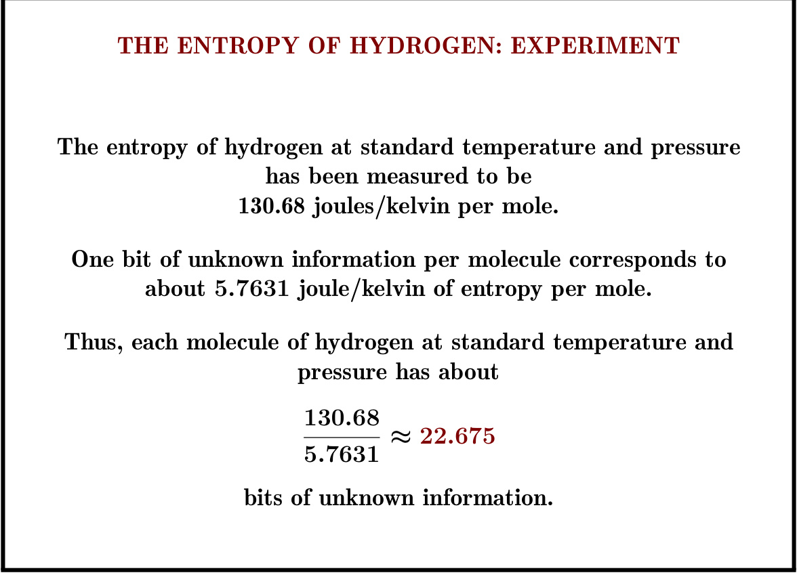  

Okay, let’s compare our theoretical prediction to experiment.  

The experimental figure for the entropy of hydrogen at standard temperature and pressure is 130.68 joules/kelvin per mole, which translates into 22.675 bits per molecule. This is larger than our theoretical prediction of 21.848 bits per molecule by about $3.8\%$ .  

That’s not bad. We can say we solved our original problem fairly well. But the percentage error here is about 4 times worse than it was for calculation for helium. Why is it worse?  

I haven’t studied this, but I can imagine two reasons. First, remember that quantum effects kick in when $V/N\Lambda^{3}$ ceases to be large. This quantity is a bit smaller for hydrogen than for helium. Remember, for helium it was 279663 at standard temperature and pressure, while for hydrogen it’s 113971. But that’s still very large, so I imagine quantum effects are still quite tiny.  

Second, hydrogen molecules are not chemically inert like helium atoms, and they’re larger, and diatomic rather than monatomic. So I’d expect them to interact more, making the ideal gas approximation worse. This feels like a more plausible explanation for the 3 .8% discrepancy.  

Puzzle 50. Do research to find more accurate calculations of the entropy of hydrogen gas. What are the main sources of error in the calculation we have done here?  

# WHERE DID WE GO?  

The mystery: why does each molecule of hydrogen of entropy at standard temperature and pressure? ✓ve $\sim23$ bits  

The goal: derive and understand the formula for the entropy of a classical ideal monatomic gas:  

$$
S=k N\left(\ln{\frac{V}{N}}+{\frac{3}{2}}\ln k T+\gamma\right)
$$  

including the mysterious constant $\gamma$ :  

$$
\gamma=\frac{3}{2}\ln\frac{2\pi m}{h^{2}}+\frac{5}{2}~~~~~~~~~\sqrt{
$$  

The subgoal: compute the entropy of a single classical particle in a 1-dimensional box:  

$$
S=k\left(\ln{\cal L}+{\frac{1}{2}}\ln k T+{\frac{1}{2}}\ln{\frac{2\pi m}{h^{2}}}+{\frac{1}{2}}\right)
$$  

The sub-subgoal: explain entropy from the ground up, and compute the entropy of a classical harmonic oscillator:  

$$
S=k\left(\ln{\frac{k T}{\hbar\omega}}+1\right)\qquad\quad
$$  

We’re done! Or at least we reached our stated goal. But there is a lot more to say about entropy. In a way we’ve scarcely scratched the surface. For more on the mathematics of entropy, I recommend these books:  

• Thomas A. Cover and Joy A. Thomas, Elements of Information Theory , WileyInterscience, New York, 2006.  

• Tom Leinster, Entropy and Diversity: the Axiomatic Approach , Cambridge U. Press, Cambridge, 2021. Also free on the arXiv .  

For classical and quantum statistical mechanics, I recommend these:  

• Frederick Reif, Fundamentals of Statistical and Thermal Physics , Waveland Press, Long Grove, Illinois, 2009.  

• Dirk Ter Haar, Elements of Statistical Mechanics , Elsevier, Amsterdam, 1995.  

The second one has an intense focus on our friend the box of gas. And for the principle of maximum entropy, I again recommend this insightful and opinionated text:  

• E. T. Jaynes, Probability Theory: the Logic of Science , Cambridge U. Press, Cambridge, 2003.  

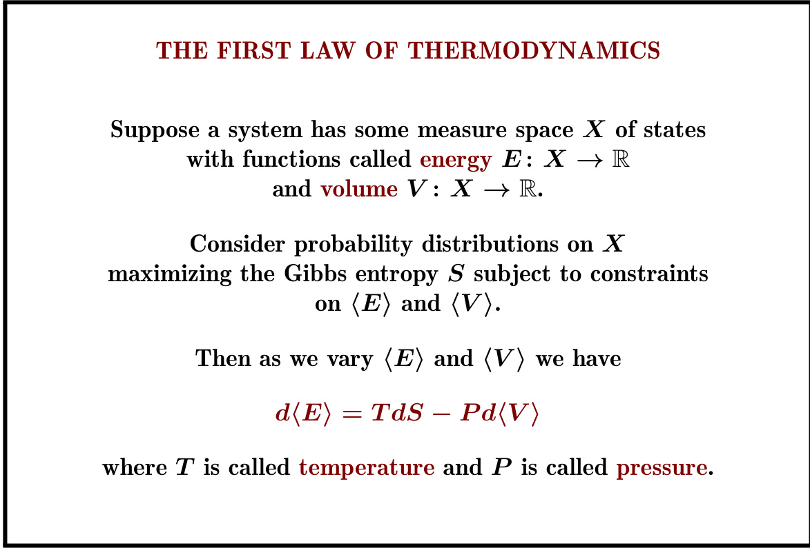  

I said we were done. But what kind of course on entropy doesn’t cover the three laws of thermodynamics? I talked a bit about the Third Law , but I haven’t even mentioned the other two yet.  

Here’s why: this wasn’t a course on thermodynamics. In ‘classical thermodynamics’ there’s a tradition of taking concepts such as energy, work and heat as primitive, and treating the laws of thermodynamics as axioms. I’ve instead been explaining a bit of ‘classical statistical mechanics’, where we start with probability theory and attempt to derive classical thermodynamics. In this approach the laws of thermodynamics are not fundamental. They actually look a bit odd: they become results that hold under various conditions, so each one becomes a collection of theorems and conjectures.  

I’ll state versions of the three laws of thermodynamics in the language we’ve developed here. But please be aware that my versions are idiosyncratic and will make some people raise their eyebrows. I’m afraid you’ll have to go elsewhere, like Reif’s book, to learn these laws in their traditional form!  

We’ve been maximizing entropy subject to a constraint on the expected value of one quantity. What if we do two—or more? Everything works the same way, but the fundamental relation between temperature, energy and entropy, $d\langle E\rangle=T d S$ , gets one extra term for each constraint. The resulting equation is a version of the ‘First Law of Thermodynamics’.  

I’ll explain the case with one extra constraint. Suppose we’ve got a measure space $X$ whose points are states of some system. Choose two functions on it. They could be but let’s call them energy and volume and write them as $E\colon X\,\rightarrow\,\mathbb{R}$ and $V\colon X\rightarrow\mathbb{R}$ :→R. These terms are favored because thermodynamics arose in part from the study of steam engines, where you’ve got a cylinder of steam with some energy and some volume. For any probability distribution $p\colon X\,\rightarrow\,[0,\infty)$ , we can write down a formula for its Shannon entropy  

$$
H=-\int_{X}p(x)\ln p(x)\,d x
$$  

and also the expected values  

$$
\langle E\rangle=\int_{X}E(x)\,d x,\qquad\langle V\rangle=\int_{X}V(x)\,d x.
$$  

Let’s not worry now about whether these integrals converge.  

Suppose we only know $\langle E\rangle$ and $\langle V\rangle$ , and we are trying to choose the ‘best’ probability distribution $p$ with these expected values. What should we do? Following the principle of maximum entropy, we seek the probability distribution $p$ that maximizes $H$ subject to our constraints on $\langle E\rangle$ and $\langle V\rangle$ . If we do this, we are led to a Lagrange multipliers problem, much as in the the simpler case of one constraint. But now we need two Lagrange multipliers: let’s call them $\beta$ and $\gamma$ . We get this equation:  

$$
d H=\beta d\langle E\rangle+\gamma d\langle V\rangle.
$$  

This is the First Law!  

But this isn’t the way physicists usually write it. To get the First Law in its usual form, first let’s switch to using Gibbs entropy $S=k H$ , and emphasize the role of energy by solving for $d\langle E\rangle$ :  

$$
d\langle E\rangle=\frac{1}{k\beta}d S-\frac{\gamma}{\beta}d\langle V\rangle.
$$  

Then, to simplify the look of this equation, let’s introduce variables called temperature and pressure :  

$$
T=\frac{1}{k\beta},\qquad P=\frac{\gamma}{\beta}.
$$  

Now the First Law of Thermodynamics looks like this:  

$$
d\langle E\rangle=T d S-P d\langle V\rangle.
$$  

It says that as we move around among probability distributions that maximize entropy subject to constraints on expected energy and volume, the change in expected energy is the sum of two terms:  

•heat , meaning $T d S$ •work , meaning $-P d\langle V\rangle$ .  

For example, if we have a cylinder of steam with pressure $P$ and we increase its expected volume by a little bit $\Delta\langle V\rangle$ , its expected energy goes down by about $P\Delta\langle V\rangle$ : that’s how we understand the minus sign. In this situation the external world has done an amount of work of steam has done an amount of work $-P\Delta\langle V\rangle$ on the cylinder of steam, but most people say the cylinder $P\Delta\langle V\rangle$ on the external world.  

Here are a few puzzles if you want to dig deeper. In the first two, I ask you to generalize ideas from our earlier work on maximizing entropy subject to a single constraint.  

Pu 1. Let $X=\{1,\ldots,n\}$ and let $E,V\colon X\to\mathbb{R}$ be two functions whose values at i $i\in X$ ∈we call $E_{i}$ and $V_{i}$ . Suppose $p$ is a probability distribution maximizing the Shannon entropy $H$ on the surface where  

$$
\langle E\rangle=e,\qquad\langle V\rangle=v,
$$  

and also suppose $p_{1},\ldots,p_{n}>0$ . Show that at $p$ we have  

$$
d H=\beta d\langle E\rangle+\gamma d\langle V\rangle
$$  

for some $\beta,\gamma\in\mathbb{R}$ . (Hint: first do the case where not all the $E_{i}$ are equal and not all the $V_{i}$ are equal. This guarantees that $d\langle E\rangle$ and $d\langle V\rangle$ are nonzero. You can handle the other cases separately.)  

Puzzle 52. Under the conditions of Puzzle 51 show that  

$$
p_{i}=\frac{\exp(-\beta E_{i}-\gamma V_{i})}{\sum_{i=1}^{n}\exp(-\beta E_{i}-\gamma V_{i})}.
$$  

Puzzle 53. Generalize the results of Puzzles 51 and 52 to the case of any finite number of constraints.  

Puzzle 54. Generalize the results of Puzzle 53 to the case of a system with a countable infinity of states, or an arbitrary measure space of states. You will need to add assumptions to ensure that the sums or integrals converge.  

# THE SECOND LAW OF THERMODYNAMICS  

Suppose a system has some measure space $\boldsymbol{X}$ of states and at any time $\pmb{t}$ there is a probability distribution $p(t)$ on $\boldsymbol{X}$ .  

We say the second law of thermodynamics holds if  

$$
t_{1}\le t_{2}\implies S(p(t_{1}))\le S(p(t_{2}))
$$  

This seems to be widely true, yet the conditions under which it holds are subtle and much-argued.  

The Second Law of Thermodynamics , as commonly stated, says that the entropy of a closed system never decreases. This appears to be a profound fact about our universe. A huge challenge to physics is to understand where this law comes from. Can it be derived from some realistic assumptions? One problem is that the laws of classical mechanics are invariant under time-reversal. Thus, if we evolve probability distributions on some space of states according to these laws, for any probability distribution whose entropy is nondecreasing, there is a time-reversed one whose entropy is non increasing .  

This is called the problem of the arrow of time : briefly, why does the future look so different from the past? Quantum mechanics makes the problem subtler, but does not provide an easy resolution. The solution may be that we happen to live in a universe—a particular solution of the laws of physics—where entropy was very low at the Big Bang, making it easy for entropy to increase after that. But if you get ten physicists in a room and ask them to explain the arrow of time, you are likely to hear ten different opinions. Thus, I will not attempt to resolve it here. For more on that, I recommend this book:  

• H. D. Zeh, The Physical Basis of The Direction of Time , Springer, Berlin, 2010.  

Instead, let’s see how the Second Law sheds light on the meaning of temperature. You’ll notice that in our course I never talked about systems evolving in time, and I never talked about two systems interacting: always just a single system. Now let’s imagine two systems, each in thermal equilibrium, but at possibly different temperatures. Say the first has entropy $S_{1}$ , expected energy $\langle E_{1}\rangle$ and temperature $T_{1}$ . As usual, these are related by  

$$
d S_{1}={\frac{d\langle E_{1}\rangle}{T_{1}}}.
$$  

Say the second system works similarly, with  

$$
d S_{2}={\frac{d\langle E_{2}\rangle}{T_{2}}}.
$$  

We can define the total entropy of the two systems by  

$$
S=S_{1}+S_{2}
$$  

and the total expected energy by  

$$
\langle E\rangle=\langle E_{1}\rangle+\langle E_{2}\rangle.
$$  

Suppose now that the two systems can exchange energy with each other, but in a slow and gentle way, so we can approximately treat each one as in thermal equilibrium at any moment. If no energy flows in or out of the combined system, the total expected energy is conserved, so  

$$
\frac{d\langle E\rangle}{d t}=0
$$  

and thus  

$$
\frac{d\langle E_{1}\rangle}{d t}=-\frac{d\langle E_{2}\rangle}{d t}.
$$  

What does the Second Law give us in this situation? It implies  

$$
\frac{d S}{d t}\geq0
$$  

or  

$$
\frac{d S_{1}}{d t}+\frac{d S_{2}}{d t}\geq0.
$$  

It follows that  

$$
\frac{1}{T_{1}}\frac{d\langle E_{1}\rangle}{d t}+\frac{1}{T_{2}}\frac{d\langle E_{2}\rangle}{d t}\geq0
$$  

or  

$$
\frac{1}{T_{1}}\frac{d\langle E_{1}\rangle}{d t}-\frac{1}{T_{2}}\frac{d\langle E_{1}\rangle}{d t}\geq0.
$$  

We can rewrite this as  

$$
\left({\frac{1}{T_{1}}}-{\frac{1}{T_{2}}}\right){\frac{d\langle E_{1}\rangle}{d t}}\geq0.
$$  

Now suppose both $T_{1}$ and $T_{2}$ are positive. Then we get a remarkable consequence: as two systems exchange energy, with each staying in thermal equilibrium at every moment, expected energy can only flow from the system with higher temperature to the system with lower temperature!  

Puzzle 55. Suppose one or both of the temperatures $T_{1},T_{2}$ are negative. How does this conclusion change?  

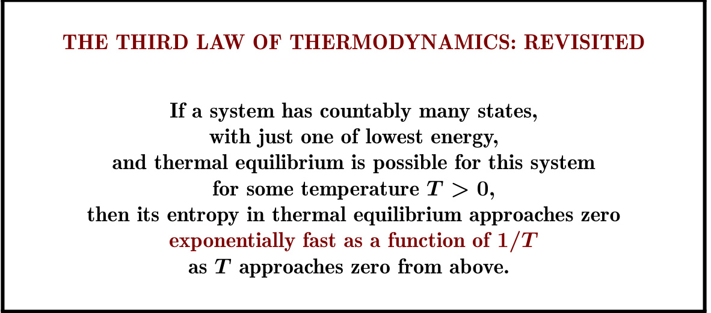  

In our earlier work on the Third Law, we only studied systems with finitely many states. Later we saw how to compute entropy from the free energy and expected energy. This makes it a bit easier to handle systems with a countable infinity of states. In the following puzzles, which are only for the most devoted readers, let’s use these ideas to prove and improve the Third Law for systems with countably many states.  

Earlier we worked with temperature, but it’s cooler to use coolness. For all the following puzzles, let’s suppose we have a system with a countable infinity of states $n=1,2,3,\ldots$ .with energies $E_{n}$ . Also suppose thermal equilibrium is possible for some $\beta_{0}>0$ , i.e., the sum  

$$
Z(\beta_{0})=\sum_{n=1}^{\infty}\exp(-\beta_{0}E_{n})
$$  

converges. (Our arguments also apply to systems with finitely many states, where this convergence condition is automatic.)  

Puzzle 56. Show that the system’s partition function, expected energy, free energy and entropy are well-defined for all $\beta>\beta_{0}$ .  

Puzzle 57. Show that if we add some constant to the energy of each state  

$$
\tilde{E}_{n}=E_{n}+c
$$  

we get a new ‘shifted’ system whose partition function, expected energy, free energy and entropy are related to those of our original system by  

$$
\tilde{Z}=\exp(-\beta c)Z,\quad\langle\tilde{E}\rangle=\langle E\rangle+c,\quad\tilde{F}=F+c,\quad\tilde{S}=S
$$  

for all $\beta>\beta_{0}$ .  

Now further suppose that our original system has just one state of least energy. saw that we could reindex the states so that $E_{1}\,<\,E_{2}\,\leq\,E_{3}\,\leq\,\cdot\,\cdot$ and ${\cal E}_{n}\rightarrow+\infty$ →∞. The same is true of our new shifted system, and let’s choose c$c=-E_{1}$ −so that the lowest energy of the shifted system is zero. With this shift we have  

$$
0=\tilde{E}_{1}<\tilde{E}_{2}\leq\tilde{E}_{3}\leq\cdot\cdot
$$  

and $\tilde{E}_{n}\rightarrow+\infty$ .  

Puzzle 58. Show that for any coolness $\beta\geq\beta_{0}$ we have  

$$
\tilde{Z}(\beta)-1=\sum_{n=2}^{\infty}e^{-\beta\tilde{E}_{n}}.
$$  

Using this equation show  

$$
|\tilde{Z}(\beta)-1|\le e^{-(\beta-\beta_{0})\tilde{E}_{2}}|\tilde{Z}(\beta_{0})-1|
$$  

and thus  

$$
|\tilde{Z}(\beta)-1|<\mathrm{const}\,e^{-(\beta-\beta_{0})\tilde{E}_{2}}
$$  

for some constant independent of $\beta$ . Use the fact that $\begin{array}{r}{\tilde{F}(\beta)=-\frac{1}{\beta}\ln\tilde{Z}(\beta)}\end{array}$ to show that for large enough $\beta$ ,  

$$
\left|\tilde{F}(\beta)\right|<\mathrm{const}\,e^{-(\beta-\beta_{0})\tilde{E}_{2}}
$$  

possibly for a different constant independent of $\beta$ . Using Puzzle 57 , conclude that  

$$
|F(\beta)-E_{1}|<\mathrm{const}\,e^{-(\beta-\beta_{0})(E_{2}-E_{1})}.
$$  

Voilà! This shows that for a system with countably many states and just one state of lowest energy, if thermal equilibrium is possible at some positive temperature, then the free energy must approach this lowest energy exponentially fast as $\beta\to+\infty$ . Now let’s show something similar for the expected energy. Again we use the shifted system to simplify the calculations. I’ll leave more work to you this time.  

Puzzle 59. Show that at any coolness $\beta>\beta_{0}$ we have  

$$
\frac{d}{d\beta}\tilde{Z}(\beta)=-\sum_{n=2}\tilde{E}_{n}e^{-\beta\tilde{E}_{n}}.
$$  

Use this to show that $\scriptstyle{\frac{d}{d\beta}}{\tilde{Z}}(\beta)$ goes to zero exponentially fast as $\beta\to+\infty$ . Using  

$$
\langle\tilde{E}\rangle(\beta)=-\frac{d}{d\beta}\ln Z(\beta)=-\frac{1}{Z(\beta)}\frac{d}{d\beta}Z(\beta)
$$  

and Puzzle 58 , show that $\langle\tilde{E}\rangle(\beta)$ goes to zero exponentially fast as $\beta\to+\infty$ . Using Puzzle 57 , conclude that $\langle E\rangle(\beta)$ approaches $E_{1}$ exponentially fast as $\beta\to+\infty$ . Finally, since  

$$
S=k\beta(F-\langle E\rangle)
$$  

and both $F$ and $\langle E\rangle$ approach $E_{1}$ exponentially fast as $\beta\,\rightarrow\,+\infty$ , conclude that $S$ approaches 0 exponentially fast as $\beta\to+\infty$ .  

Let’s summarize! Suppose we have a system with a countable infinity of states and just one state of lowest energy. If thermal equilibrium is possible for this system for some $T>0$ , the Third Law of Thermodynamics says its entropy in thermal equilibrium goes to zero as $T$ approaches zero from above. But in fact we can say more: for some $a,b>0$ we have  

$$
|S(\beta)|<a e^{-b\beta}
$$  

for all large enough $\beta$ .  