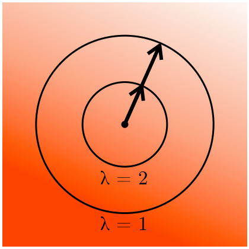
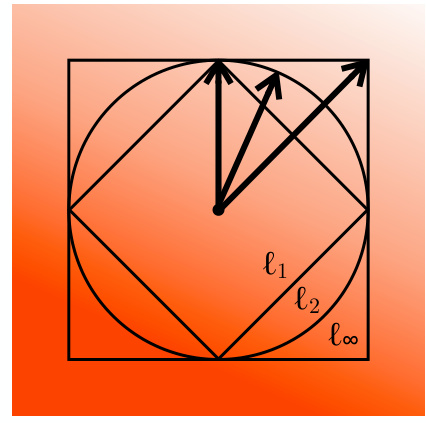
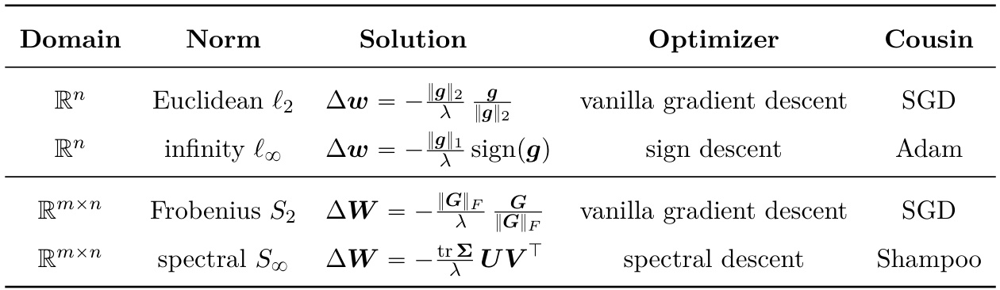

# Old Optimizer, New Norm: An Anthology  

Jeremy Bernstein Laker Newhouse MIT CSAIL, United States  

# Abstract  

Deep learning optimizers are often motivated through a mix of convex and approximate second-order theory. We select three such methods—Adam, Shampoo and Prodigy—and argue that each method can instead be understood as a squarely first-order method without convexity assumptions. In fact, after switching off exponential moving averages, each method is equivalent to steepest descent under a particular norm . By generalizing this observation, we chart a new design space for training algorithms. Different operator norms should be assigned to different tensors based on the role that the tensor plays within the network. For example, while linear and embedding layers may have the same weight space of $\mathbb{R}^{m\times n}$ ,these layers play different roles and should be assigned different norms. We hope that this idea of carefully metrizing the neural architecture might lead to more stable, scalable and indeed faster training.  

# Prologue  

Deep learning optimizers are often motivated from the perspectives of convex and approximate second-order theory. These theoretical frameworks have been used to inspire algorithmic ideas, as well as providing means to analyse the convergence of various optimizers. However, we believe—and will attempt to demonstrate—that there is a wealth of untapped algorithmic opportunity in the simpler realm of exact first-order theory without convexity assumptions.  

To make our case, we choose three optimizers that were originally analysed under convex or approximate second-order theory: Adam, Shampoo and Prodigy. After disabling their exponential moving averages (EMA), we show that each algorithm admits a parsimonious theoretical explanation as a variant of steepest descent under a certain norm. EMA can then be thought of as “smoothing out” the algorithm, or making it more robust to mini-batch noise, although nailing down the precise role of EMA is perhaps still an open problem.  

By steepest descent, we mean the procedure of choosing a weight update $\Delta w$ to minimise a local quadratic model of the loss function $\mathcal{L}$ of the form $\begin{array}{r}{\mathcal{L}(\pmb{w})+\nabla_{\pmb{w}}\mathcal{L}(\pmb{w})^{\top}\Delta\pmb{w}+\frac{\lambda}{2}\cdot\|\Delta\pmb{w}\|^{2}}\end{array}$ ¨} },visualized in Figure 1 . Crucially, the sharpness parameter $\lambda$ and norm $\lVert\cdot\rVert$ are chosen a priori, without touching an (approximate) Hessian during training. As such, we consider steepest descent to be a squarely first-order method and not an (approximate) second-order method.  

Throughout the anthology, we rely on a dual description of steepest descent:  

Proposition 1 (Steepest descent) For any $\pmb{g}\in\mathbb{R}^{n}$ thought of as “the gradient” and any $\lambda\geqslant0$ thought of as “the sharpness”, and for any norm $\left\|\cdot\right\|:\mathbb{R}^{n}\to\mathbb{R}$ with dual norm $\lVert\cdot\rVert^{\dagger}$ :  

$$
\operatorname*{arg\,min}_{\Delta{\boldsymbol{w}}\in\mathbb{R}^{n}}\left[\pmb{g}^{\top}\Delta{\boldsymbol{w}}+\frac{\lambda}{2}\,\|\Delta{\boldsymbol{w}}\|^{2}\right]=-\frac{\|\pmb{g}\|^{\dagger}}{\lambda}\cdot\operatorname*{arg\,max}_{\|t\|=1}\pmb{g}^{\top}t.
$$  

  
a) varying sharpness $\uplambda$  

  
b) varying choice of norm ǁ·ǁ  

Figure 1: Steepest descent considers the problem of minimizing a linear functional under a quadratic penalty: $\begin{array}{r}{\arg\operatorname*{min}_{\Delta\pmb{w}\in\mathbb{R}^{n}}\left[\pmb{g}^{\top}\Delta\pmb{w}+\frac{\lambda}{2}\left\|\Delta\pmb{w}\right\|^{2}\right]}\end{array}$ “‰for $\pmb{g}\in\mathbb{R}^{n}$ . Here we show how the solution varies with the sharpness λ$\lambda>0$ ą0 and the choice of norm $\lVert\cdot\rVert$ . We overlay different norm balls on top of a linear color gradient, and use arrows to denote the solution, meaning the member of the norm ball that “minimizes the color”. a) Increasing the sharpness decreases the size of the solution vector. b) Changing the norm can change the direction of the solution vector. For different $\ell_{p}$ norms, the solution direction changes because the gradient is not axis-aligned. In practice, we should pick the sharpness and norm to fit the geometry of our loss.  

Equation (1) separates the solution of the steepest descent problem into two pieces: first computing the step size as the dual norm of the gradient divided by the sharpness, and second solving for the step direction as the unit vector that maximizes the inner product with the gradient. The proof of this proposition is given in Appendix B .  

Of course, the art of steepest descent lies in choosing a norm $\lVert\cdot\rVert$ and a sharpness $\lambda$ suited to the optimization problem at hand. While it may be possible to turn this art into a science (Large et al. ,2024 ), that ambition is beyond the scope of this anthology. Here we point out that past methods do implicitly make decisions about norms, and in a somewhat haphazard manner. In fact, they implicitly assign different induced matrix norms to the network layers:  

Definition 1 (Induced operator norm) Given a matrix $M\in\mathbb{R}^{d_{\mathrm{out}}\times d_{\mathrm{in}}}$ and two normed vector spaces $(\mathbb{R}^{d_{\mathrm{in}}},\|\cdot\|_{\alpha})$ and $\left(\mathbb{R}^{d_{\mathrm{out}}},\|\cdot\|_{\beta}\right)$ , the “ $\alpha$ to $\beta^{\,\,v}$ induced operator norm is given by:  

$$
\|\pmb{M}\|_{\alpha\rightarrow\beta}=\operatorname*{max}_{\pmb{x}\in\mathbb{R}^{d_{\mathrm{in}}}}\frac{\|\pmb{M}\pmb{x}\|_{\beta}}{\|\pmb{x}\|_{\alpha}}.
$$  

Definition 1 tells us that by varying the choice of vector norms $\|\cdot\|_{\alpha}$ and $\left\|\cdot\right\|_{\beta}$ , we can induce a large family of matrix norms. In turn, this implies a correspondingly large family of steepest descent optimizers. By foregrounding this issue, we hope that algorithm designers may develop more suitable optimizers by becoming more intentional about their choice of norm.  

# Story I. Adam as Steepest Descent under the Max-of-Max Norm  

A dam is a widely used deep learning optimizer: the original paper of Kingma and Ba (2015 ) now has well over 100,000 citations. Adam has been motivated in various ways, including through convex analysis ( Kingma and Ba ,2015 ) and as an approximate second-order method ( Sun and Spall ,2021 ). However, there have been efforts to build a more direct understanding of Adam: for instance, with exponential moving averages (EMA) switched off, Adam is just sign gradient descent (Balles and Hennig ,2018 ;Bernstein et al. ,2018 ), which is equivalent to steepest descent under the infinity norm ( Carlson et al. ,2015 ). In this story, we connect Adam to a certain “max-of-max” norm, showing how Adam respects the tensor structure of a neural network in a very particular way.  

To begin, we review how Adam connects to sign gradient descent. Ignoring bias corrections and numerical stabilizations, Adam is given by the following system of updates:  

$$
\begin{array}{r l}&{m_{t}=\beta_{1}\cdot m_{t-1}+(1-\beta_{1})\cdot g_{t},}\\ &{~~~\pmb{v}_{t}=\beta_{2}\cdot\pmb{v}_{t-1}+(1-\beta_{2})\cdot\pmb{g}_{t}^{2},,}\\ &{{\pmb{w}_{t+1}=\pmb{w}_{t}-\pmb{\eta}\cdot\pmb{m}_{t}/\sqrt{\pmb{v}_{t}},}}\end{array}
$$  

where $t$ denotes the time step, $\pmb{g}_{t}\in\mathbb{R}^{n}$ the gradient vector and $\eta>0$ the step s time scales of the first gradient moment $\mathbf{\nabla}^{\prime}\mathbf{[}\mathbf{\rho}^{\prime}\mathbf{[}\mathbf{\rho}^{\prime}\mathbf{[}\mathbf{\rho}^{\prime}\mathbf{[}\mathbf{\rho}^{\prime}\mathbf{[}\mathbf{\rho}^{\prime}\mathbf{[}\mathbf{]}-\mathbf{[}\mathbf{[}\mathbf{\rho}^{\prime}\mathbf{t]}\mathbf{]}$ and second moment $\pmb{v}_{t}$ are set b $0\leqslant\beta_{1},\beta_{2}<1$ ă1. All operations are conducted entry-wise. If we switch off EMA by setting $\beta_{1}=\beta_{2}=0$ ““0, the Adam updates reduce to just sign gradient descent:  

$$
\begin{array}{r}{\pmb{w}_{t+1}=\pmb{w}_{t}-\eta\cdot\pmb{g}_{t}/\sqrt{\pmb{g}_{t}^{2}}}\\ {=\pmb{w}_{t}-\eta\cdot\mathrm{sign}(\pmb{g}_{t}).}\end{array}
$$  

This connection to sign descent should not be surprising since Adam, published in 2015, builds on the RMSprop optimizer that Tieleman and Hinton (2012 ) already called “the mini-batch version of just using the sign of the gradient”. And RMSprop itself built on the RPROP optimizer ( Riedmiller and Braun ,1993 ), which also uses gradient signs.  

Still, why should using the sign of the gradient be a good idea in deep learning? In search of a motivation, it is interesting to consider that sign descent solves the problem of steepest descent under the vector $\ell_{\infty}$ norm, $\|\pmb{v}\|_{\infty}:=\operatorname*{max}_{i}|\pmb{v}_{i}|$ (Carlson et al. ,2015 ,2016 ;Fan ,2017 ):  

# Proposition 2 (Sign descent as steepest descent under the infinity norm)  

For any gradient vector $\pmb{g}\in\mathbb{R}^{n}$ and sharpness $\lambda>0$ , it holds that:  

$$
\operatorname{arg\,min}_{\Delta{\pmb w}\in\mathbb{R}^{n}}\left[{\pmb g}^{\top}\Delta{\pmb w}+\frac{\lambda}{2}\,\|\Delta{\pmb w}\|_{\infty}^{2}\right]=-\frac{\|\pmb g\|_{1}}{\lambda}\,\operatorname{sign}({\pmb g}).
$$  

In words, the vector that minimizes a linear functional under an infinity norm penalty is a scalar multiple of a sign vector. The proof is given in Appendix B .  

While this connection between Adam, sign descent and steepest descent is perhaps cute, it does not answer a basic question: Why does the vector $\ell_{\infty}$ norm have anything to do with neural network training? In particular, taking the weight space to be $\mathbb{R}^{n}$ equipped with the simple infinity norm seems to “throw away” the fact that the weight space of a neural network is built in a structured way out of layers of matrices (and perhaps other tensors).  

To resolve this conundrum, we suggest that in fact the vector $\ell_{\infty}$ norm on the flattened weight space doesn’t have anything to do with deep learning. Instead, there is a coincidence at play. The $\ell_{\infty}$ norm enjoys a special property summarized by the slogan “a max of a max is a max”. To see this, consider a neural network with a list of $L$ weight matrices $W_{1},\dots,W_{L}$ . Let $\mathrm{row}_{r}(W_{l})$ denote the $r$ th row of the $l$ th weight matrix, and let $\pmb{w}=\mathrm{flatten}(\pmb{W}_{1},\dots,\pmb{W}_{L})\in\mathbb{R}^{n}$ denote the full flattened weight vector. Then we have that:  

$$
\|\pmb{w}\|_{\infty}=\operatorname*{max}_{l}\operatorname*{max}_{r}\|\mathrm{row}_{r}(\pmb{W}_{l})\|_{\infty}=\operatorname*{max}_{l}\|\pmb{W}_{l}\|_{\ell_{1}\rightarrow\ell_{\infty}},
$$  

where the second equality follows via Proposition 8 . In words, the infinity norm of the flattened weight vector coincides with the largest $\ell_{1}$ to $\ell_{\infty}$ operator norm of the layers. So Equation (9) connects the unstructured space of the flattened weight vector to the structured space of the list of weight matrices. We refer to the object max l$\|\pmb{W}_{l}\|_{\ell_{1}\to\ell_{\infty}}$ as the “max-of-max norm”. And sign descent emerges as steepest descent under this norm:  

Proposition 3 (Sign descent as steepest descent under the max-of-max norm) For any list of gradient matrices $G_{1},...,G_{L}$ and any sharpness $\lambda>0$ , consider the problem:  

$$
\arg\operatorname*{min}_{\Delta W_{1},\dots,\Delta W_{L}}\left[\sum_{l=1}^{L}\langle G_{l},\Delta W_{l}\rangle+\frac{\lambda}{2}\operatorname*{max}_{l=1}^{L}\|\Delta W_{l}\|_{\ell_{1}\to\ell_{\infty}}^{2}\right],
$$  

where step size $\langle\cdot,\cdot\rangle$ $\begin{array}{r}{\eta=\frac{1}{\lambda}\sum_{l=1}^{L}\|G_{l}\|_{\ell_{1}\to\ell_{\infty}}^{\dagger}}\end{array}$ denotes the Frobenius inner product, and ř“Ñ8 , where $^\dagger$ denotes the dual norm, $\Delta{W_{l}}$ has the same shape as Equation (10) is solved by: $G_{l}$ . For  

$$
\Delta W_{l}=-\eta\cdot\mathrm{sign}(G_{l})~~~~~~~~f o r~e a c h~l a y e r~l=1,...,L.
$$  

In words, the matrix-aware steepest descent problem of Equation (10) is solved by layerwise sign descent as given in Equation (11) . This observation—that sign descent updates are implicitly doing per-matrix gradient normalization —may be a major reason that Adam, sign descent and Lion ( Chen et al. ,2023 ) outperform vanilla gradient descent in large language model training ( Zhao et al. ,2024 ;Large et al. ,2024 ). The proof is given in Appendix B .  

All told, this story has shown that Adam without EMA is sign descent and that, coincidentally, sign descent solves two different steepest descent problems: one on the flattened weight space, and one that is aware of the matrix structure of neural architecture. But, at the end of this story, questions linger. Why does the $\ell_{1}$ to $\ell_{\infty}$ induced operator norm rear its head? What does it have to do with deep learning? Aren’t there other induced operator norms on matrices we could equally well consider? For answers to these questions, dear reader, you’ll have to wait for our next story... a story about Shampoo!  

# Story II. Shampoo as Steepest Descent under the Spectral Norm  

Now , dear reader, we turn our attention to Shampoo ( Gupta et al. ,2017 ,2018 ). A variant of the Shampoo optimizer won the external tuning track of the 2024 AlgoPerf: Training Algorithms competition ( Dahl et al. ,2023 ). While the method was originally motivated as a generalization of the AdaGrad convex optimizer ( Duchi et al. ,2011 ) to tensor spaces, more recent work casts Shampoo as an approximate second-order method ( Anil et al. ,2020 ;Morwani et al. ,2024 ). We will show that Shampoo—with accumulation disabled—is steepest descent under the max spectral norm over layers.  

To begin, we show that Shampoo updates, without accumulation, are semi-orthogonal matrices. At time step $t$ and for each layer, Shampoo collects the gradient matrix $G_{t}$ and makes the following update to the weight matrix $W_{t}$ :  

$$
\begin{array}{r c l}{{}}&{{}}&{{{\cal L}_{t}={\cal L}_{t-1}+{\cal G}_{t}{\cal G}_{t}^{T},}}\\ {{}}&{{}}&{{{\cal R}_{t}={\cal R}_{t-1}+{\cal G}_{t}^{T}{\cal G}_{t},}}\\ {{}}&{{}}&{{{\cal W}_{t+1}={\cal W}_{t}-\eta\cdot{\cal L}_{t}^{-1/4}{\cal G}_{t}{\cal R}_{t}^{-1/4}.}}\end{array}
$$  

All operations, including the inverse fourth roots, are matrix operations. The accumulators $\pmb{L}_{t}$ and $R_{t}$ are referred to as the “left and right pre-conditioners”. Practitioners usually replace the simple sums in Equations (12) and (13) with EMAs ( Shi et al. ,2023 ). If we disable the accumulation, setting $L_{t}=G_{t}G_{t}^{\mid}$ and $R_{t}=G_{t}^{\top}G_{t}$ , Shampoo reduces to:  

$$
\begin{array}{r}{W_{t+1}=W_{t}-\eta\cdot(G_{t}G_{t}^{\top})^{-1/4}\,G_{t}\,(G_{t}^{\top}G_{t})^{-1/4}}\\ {=W_{t}-\eta\cdot U_{t}V_{t}^{\top},\qquad\qquad\qquad\qquad\qquad\qquad}\end{array}
$$  

where Equation (16) is reached by substituting the reduced singular value decomposition (SVD) of the gradient $\pmb{G}_{t}\,=\,\pmb{U}_{t}\pmb{\Sigma}_{t}\pmb{V}_{t}^{\top}$ into Equation (15) . Notice that there is a direct parallel between Equations (6) and (7) for Adam and Equations (15) and (16) for Shampoo. So, Shampoo without accumulation makes a semi-orthogonal weight update . In fact:  

Proposition 4 (Projection to the closest semi-orthogonal matrix) Consider the semi-orthogonal matrices $\mathcal{O}_{m\times n}\;:=\;\left\{A\in\mathbb{R}^{m\times n}:A A^{\top}=\mathbf{I}_{m}\right.$ ␣or $A^{\top}A=\mathbf{I}_{n}\Bigr\}$ (and let $\|\cdot\|_{F}$ denote the Frobenius norm. For any matrix G$G\in\mathbb{R}^{m\times n}$ PRˆwith reduced SVD G$\boldsymbol{G}=\boldsymbol{U}\boldsymbol{\Sigma}\boldsymbol{V}^{\intercal}$ “Σ:  

$$
\operatorname*{arg\,min}_{\mathbf{\substack{A\in\mathcal{O}_{m\times n}}}}\|\mathbf{A}-G\|_{F}=U V^{\top},
$$  

where the minimizer $U V^{\top}$ is unique if and only if the matrix $\boldsymbol{G}$ has full rank.  

So, Shampoo without accumulation projects the gradient matrix to the closest semiorthogonal matrix in Frobenius norm . The proof is in Appendix B .Why might this be a good idea , you ask? Well, for one thing, it’s steepest descent—this time under the maximum spectral norm $\lVert\cdot\rVert_{\ell_{2}\to\ell_{2}}$ (Definition 1 ) over all the matrices in the network:  

Proposition 5 (Shampoo as steepest descent under the spectral norm) For any list of gradient matrices $G_{1},...,G_{L}$ and any sharpness $\lambda>0$ , consider the problem:  

$$
\arg\operatorname*{min}_{\Delta W_{1},\dots,\Delta W_{L}}\left[\sum_{l=1}^{L}\langle G_{l},\Delta W_{l}\rangle+\frac{\lambda}{2}\operatorname*{max}_{l=1}^{L}\|\Delta W_{l}\|_{\ell_{2}\to\ell_{2}}^{2}\right],
$$  

where $\langle\cdot,\cdot\rangle$ denotes t obenius inner product and $\Delta{\pmb W}_{l}$ has the same shape as $G_{l}$ . Suppose that $G_{l}$ has reduced SVD given by $\pmb{G}_{l}=\pmb{U}_{l}\pmb{\Sigma}_{l}\pmb{V}_{l}^{\top}$ for each $l=1,...,L$ . Then Equation (18) is solved with a step size $\begin{array}{r}{\eta=\frac{1}{\lambda}\sum_{l=1}^{L}\mathrm{tr}\,\Sigma_{l}}\end{array}$ ř“and an update:  

$$
\Delta{\pmb{W}}_{l}=-{\pmb{\eta}}\cdot{\pmb{U}}_{l}{\pmb{V}}_{l}^{\top}\,\quad\,f o r\,\,e a c h\,\,l=1,...,L.
$$  

This solution for $\Delta{W_{l}}$ is unique if and only if the matrix $G_{l}$ is of full rank.  

The proof is given in Appendix B . A novelty of this proposition in contrast to prior work on stochastic spectral descent ( Carlson et al. ,2015 ,2016 ) is our use of a max norm over layers to handle the multi-layer case. However, our main contribution here is to draw the connection between Proposition 5 and Shampoo as in Equations (15) and (16) .  

So, Shampoo without accumulation is steepest descent under the spectral norm. Why might this be a good idea in deep learning? The idea that we wish to advance is that one can derive upper bounds on the loss of machine learning models in terms of spectral norms. Here we present the simplest possible example: a linear model and the square loss.  

Proposition 6 (Bounding the square loss of a linear predictor) Consider a matrix $W\in\mathbb{R}^{d_{\mathrm{out}}\times d_{\mathrm{in}}}$ that we shall think of as a linear predictor mapping an input $\pmb{x}\in\mathbb{R}^{d_{\mathrm{in}}}$ to an output $\pmb{y}=\pmb{W}\pmb{x}\in\mathbb{R}^{d_{\mathrm{out}}}$ . Given a dataset of $n$ samples $\mathcal{D}=\{({\pmb x}_{1},{\pmb y}_{1}),...,({\pmb x}_{n},{\pmb y}_{n})\}$ , where the i th input is normalized such that $\|\pmb{x}_{i}\|_{2}=\sqrt{d_{\mathrm{in}}}$ , we can construct the “square loss”:  

$$
\mathcal{L}(W):=\frac{1}{2n}\sum_{i=1}^{n}\frac{1}{d_{\mathrm{out}}}\|\pmb{y}_{i}-\pmb{W}\pmb{x}_{i}\|_{2}^{2}.
$$  

Then, for any matrix $\Delta W\in\mathbb{R}^{d_{\mathrm{out}}\times d_{\mathrm{in}}}$ thought of as a weight update, it holds that:  

$$
\begin{array}{r}{\mathcal{L}(W+\Delta W)\leqslant\mathcal{L}(W)+\langle\nabla_{W}\mathcal{L}(W),\Delta W\rangle+\frac{1}{2}\cdot\frac{d_{\mathrm{in}}}{d_{\mathrm{out}}}\cdot\|\Delta W\|_{\ell_{2}\to\ell_{2}}^{2},}\end{array}
$$  

where $\langle\cdot,\cdot\rangle$ is the Frobenius inner product.  

In words: the square loss of a linear predictor admits an upper bound that is quadratic in the spectral norm of the weight perturbation. Choosing the weight perturbation to minimize this upper bound is precisely steepest descent under the spectral norm! The proof is given in Appendix B . This optimizer design pattern, which starts by deriving an upper bound on the loss (as in Proposition 6 ) and then minimizes it (as in Proposition 5 ), is known generally as majorization-minimization ( Lange ,2016 ). It is an exact and first-principles design pattern, without Hessian approximations or appeals to convex theory. This design pattern is used extensively by Carlson et al. (2015 ,2016 ) to design optimizers for restricted Boltzmann machines and discrete graphical models. Generalizing the pattern to arbitrary network architectures and loss functions requires more advanced machinery ( Bernstein et al. ,2023 ;Streeter ,2023 ;Large et al. ,2024 ).  

And so, dear reader, we have reached the end of our second story. We have shown that Shampoo without accumulation corresponds to projecting the gradient matrix to the closest Table 1: Popular optimizers are related to steepest descent under different norms. For vector-valued optimization problems, we consider the steepest descent problem $\begin{array}{r}{\arg\operatorname*{min}_{\Delta\pmb{w}}\pmb{g}^{\top}\Delta\pmb{w}+\frac{\lambda}{2}\cdot\|\Delta\pmb{w}\|^{2}}\end{array}$ .For matrix-valued problems, we consider $\begin{array}{r}{\arg\operatorname*{min}_{\Delta W}\left\langle\boldsymbol{G},\Delta W\right\rangle+\frac{\lambda}{2}\cdot\|\Delta W\|^{2}}\end{array}$ x2 , whe $\langle\cdot,\cdot\rangle$ is the Frobenius nner product. We list the solution for different vector ℓ$\ell_{p}$ norms and Schatten S$S_{p}$ norms. The Schatten Finally, $\boldsymbol{G}=\boldsymbol{U}\boldsymbol{\Sigma}\boldsymbol{V}^{\intercal}$ $S_{p}$ norm of a matrix returns the is the reduced singular value decomposition of the gradient. $\ell_{p}$ norm of its vector of singular values.  

  

semi-orthogonal matrix, which solves the problem of steepest descent under the spectral norm. And we showed how steepest descent under the spectral norm emerges from upper bounding the square loss of a linear predictor. This perspective, of viewing Shampoo as a (smoothed out) projection to the space of semi-orthogonal matrices, grounds the algorithm in a prior literature on spectral descent ( Carlson et al. ,2015 ,2016 ;Fan ,2017 ). And in Appendix A , we discuss how it might unlock new means for computing the Shampoo updates. We summarize our first two stories in Table 1 . And we still have one more left to tell...  

# Story III. Prodigy: Automatically Computing the Escape Velocity  

For our final story, we speak of Prodigy ( Mishchenko and Defazio ,2023 ). The Prodigy optimizer falls amid a series of recent works ( Defazio and Mishchenko ,2023 ;Khaled et al. ,2023 ;Ivgi et al. ,2023 ) that attempt to apply convex theory to design and analyse deep learning optimizers that do not require tuning. In contrast, we argue that Prodigy (without EMA) is but another example of steepest descent, where instead of using the step size $\eta=\|\pmb{g}\|^{\dagger}/\lambda$ from Proposition 1 , Prodigy uses a heuristic to automatically warm up to a good step size. This demonstrates the value of Proposition 1 for disentangling the optimizer d sign problem. If one knows a good norm $\lVert\cdot\rVert$ but is ignorant of the sharpness parameter λ, then one may obtain the step direction by solving $\operatorname{\scriptstyle{urg\,max}}_{\|t\|=1}{g^{\top}t}$ from Proposition $1$ , while using another means to find a good step size.  

Then let us make our case. We focus on Algorithm 3 in the Prodigy paper, since this is the version used in their experiments. We first show that with EMA switched off, Prodigy implements sign gradient descent with a step size that warms up automatically. Ignoring the numerical stabilization and learning rate schedule, Prodigy is given by:  

$$
\begin{array}{r l}&{m_{t}=\beta_{1}\cdot m_{t-1}+(1-\beta_{1})\cdot\eta_{t}\,g_{t},}\\ &{\begin{array}{r l}&{v_{t}=\beta_{2}\cdot v_{t-1}+(1-\beta_{2})\cdot\eta_{t}^{2}\,g_{t}^{2},}\\ &{r_{t}=\sqrt{\beta_{2}}\cdot r_{t-1}+(1-\sqrt{\beta_{2}})\cdot\eta_{t}^{2}\,g_{t}^{\top}\big(w_{0}-w_{t}\big),}\end{array}}\\ &{\begin{array}{r l}&{s_{t}=\sqrt{\beta_{2}}\cdot s_{t-1}+(1-\sqrt{\beta_{2}})\cdot\eta_{t}^{2}\,g_{t},}\\ &{\eta_{t+1}=\operatorname*{max}\left(\eta_{t},\frac{r_{t}}{\|s_{t}\|_{1}}\right),}\end{array}}\\ &{w_{t+1}=w_{t}-\eta_{t}\cdot m_{t}/\sqrt{v_{t}},}\end{array}
$$  

where $t$ denotes the time step and $\pmb{g}_{t}\in\mathbb{R}^{n}$ the gradient ve this system of updates may seem intimidating, if we switch off EMA by setting $\beta_{1}=\beta_{2}=0$ ““0, the Prodigy updates simplify dramatically to just sign gradient descent with a dynamical step size as follows:  

$$
\begin{array}{r l}&{\eta_{t+1}=\operatorname*{max}\left(\eta_{t},\frac{g_{t}^{\top}(w_{0}-w_{t})}{\lVert g_{t}\rVert_{1}}\right),}\\ &{\pmb{w}_{t+1}=\pmb{w}_{t}-\eta_{t}\cdot\mathrm{sign}(\pmb{g}_{t}).}\end{array}
$$  

But Proposition 2 showed that sign descent is steepest descent under the infinity norm. Therefore Equations (28) and (29) prove our claim that Prodigy without EMA is steepest descent, although with a dynamically chosen step size denoted $\eta_{t}$ .  

All that remains is to understand the dynamical rule, given by Equation (28) , for choosing the step size $\eta_{t}$ . We shall argue that this dynamical rule can be understood to approximate a heuristic algorithm for achieving, but not exceeding, what we shall call escape velocity :  

•Choose a very small initial step size $\eta_{0}$ —small enough to be a priori sure that $\eta_{0}\ll\eta_{\star}$ ,where $\eta_{\star}$ denotes escape velocity : the unknown but optimal initial step size; •At each step, check if the weights $\mathbf{\nabla}w_{t}$ have escaped the linearization of the loss around the initial weights $\mathbf{\nabla}w_{0}$ —if not, double the step size according to $\eta_{t+1}=2\times\eta_{t}$ ;•Once the weights $\mathbf{\nabla}w_{t}$ have escaped the initial linearization, stop increasing the step size. We say that the step size $\eta_{t}$ has reached escape velocity $\eta_{\star}$ .  

The rationale behind this procedure is that if we knew the optimal initial step size $\eta_{\star}$ , then the weights should escape the initial linearization of the loss in a single step. Formally, the directional derivative $(\pmb{w}_{1}-\pmb{w}_{0})^{\top}\pmb{g}_{1}$ must vanish if the step size is chosen optimally ( Cauchy ,1847 ). If the directional derivative in the direction of the first weight update is still negative $(\pmb{w}_{1}-\pmb{w}_{0})^{\top}\pmb{g}_{1}<0$ , then we could have taken a larger step. Said another way, we can use the angle that the gradient $g_{1}$ makes with the change in weights ${\pmb w}_{1}-{\pmb w}_{0}$ to tell us whether or not we should increase the step size. Notice that procedure has no reliance on convexity.  

With this in mind, let us massage Prodigy’s step size update ( Equation (28) ) as follows:  

$$
\begin{array}{r}{\eta_{t+1}=\operatorname*{max}\left(\eta_{t},\frac{g_{t}^{\top}(w_{0}-w_{t})}{\|g_{t}\|_{1}}\right)=\operatorname*{max}\left(\eta_{t},\frac{\|g_{t}\|_{2}}{\|g_{t}\|_{1}}\times\|w_{t}-w_{0}\|_{2}\times\cos\theta\right),}\end{array}
$$  

where $\theta$ denotes the angle between the gradient $\scriptstyle g_{t}$ and the difference in weights ${\pmb w}_{0}-{\pmb w}_{t}$ .To help make sense of this expression, we make two assumptions:  

1. The gradient is a “dense” vector in $\mathbb{R}^{n}$ , meaning that $\|\pmb{{g}}_{t}\|_{2}/\|\pmb{{g}}_{t}\|_{1}\approx1/\sqrt{n}$ ;  

2. $\mathbf{\nabla}w_{t}$ is still close enough to the initialization $\pmb{w}_{0}$ that $\cos\theta\approx1$ .  

Under these assumptions, Equation (30) becomes just $\eta_{t+1}~\approx~\operatorname*{max}\left(\eta_{t},\|\pmb{w}_{t}-\pmb{w}_{0}\|_{\mathrm{RMS}}\right)$ ,where the root mean square (RMS) norm is defined via Equation (29) , this allows us to estimate the size of the weight change at step $\begin{array}{r}{\|\cdot\|_{\mathrm{RMS}}:=\frac{1}{\sqrt{n}}\|\cdot\|_{2}}\end{array}$ . Co t$t+1$ \` 1: ed with  

$$
\|w_{t+2}-w_{t+1}\|_{\mathrm{RMS}}=\eta_{t+1}\cdot\|\mathrm{sign}(g_{t})\|_{\mathrm{RMS}}\approx\operatorname*{max}\left(\eta_{t},\|w_{t}-w_{0}\|_{\mathrm{RMS}}\right)\geqslant\|w_{t}-w_{0}\|_{\mathrm{RMS}}
$$  

where we have used the fact that a sign vector has unit RMS norm. In words, while assumptions ( 1 ) and ( 2 ) hold, the step size at time $t+1$ is equivalent to the whole progress up to step $t$ . This suggests exponential growth in the step size that continues until assumption (2 ) breaks, which we think of as the step size reaching the escape velocity $\eta_{\star}$  

Now we wish to point out that this procedure is just one amongst a space of line search methods that one might consider ( Armijo ,1966 ;Riedmiller and Braun ,1993 ;Kenneweg et al. ,2024 ). For instance, Prodigy’s decision to only let $\eta_{t}$ increase and never decrease could be sub-optimal. And the decision to measure the angle between the gradient and the weight difference ${\pmb w}_{t}-{\pmb w}_{0}$ has alternatives. One could instead use t recent weight difference $\pmb{w}_{t}-\pmb{w}_{t-1}$ . Lastly, in place of relying on the norm ratio }$\|\pmb{g}\|_{2}/\|\pmb{g}_{1}\|$ }{} }to implicitly convert the ℓ$\ell_{2}$ norm $\lVert\boldsymbol{w}_{t}-\boldsymbol{w}_{0}\rVert_{2}$ into the RMS norm $\lVert\pmb{w}_{t}-\pmb{w}_{0}\rVert_{\mathrm{RMS}}$ nsider a well in some preliminary experiments. more explicit method. For instance, we found a rule akin to $\eta_{t+1}=\eta_{t}\times\left(1+\cos\theta\right)$ \` “ˆ p \` qto work  

Our time grows short, dear reader, and our third story draws to an end. We have argued that Prodigy without EMA is sign descent—an example of steepest descent—with a particular mechanism for warming up the step size. Starting with a tiny initial step size, Prodigy multiplicatively increases the step size until the weights escape the initial locally linear region of the loss. Prodigy’s step size adjustment is based on the angle between the gradient and the total weight change. This is a form of online line search. This highlights that once one has a chosen a norm, the steepest descent framework allows freedom to estimate the step size in various different ways.  

# Epilogue  

This anthology has presented new ways of understanding old optimizers. Proposition 1 decouples the optimizer design problem into two pieces: first choosing a norm and second finding a step size. This design space is already broad. We have argued that Adam chooses the infinity norm ( Proposition 2 ) or equivalently the max-of-max norm ( Proposition 3 ), which respects a layered matrix structure. Shampoo chooses the spectral norm ( Proposition 5 ). Prodigy chooses the same norm as Adam, and then uses a heuristic to automatically warm up to a good step size, as in Equation (28) , which we term reaching escape velocity .  

Through the lens of steepest descent, the decisions that Adam, Shampoo and Prodigy make may seem arbitrary. In fact, we think that they are somewhat arbitrary. And there may be more principled ways to make these decisions. To demonstrate this point, we now introduce a tool called the modular norm ( Large et al. ,2024 ) and its corresponding steepest descent algorithm. The modular norm generalizes the norms that appeared in Proposition 3 for Adam and Proposition 5 for Shampoo. Formally:  

Proposition 7 (Steepest descent under the modular norm) Given scalar coefficients $s_{1},\ldots,s_{L}>0$ and norms $\|\cdot\|_{1},\ldots,\|\cdot\|_{L}$ , we define the modular norm as the mapping:  

$$
W_{1},\dots,W_{L}\mapsto\operatorname*{max}\left\{s_{1}\|W_{1}\|_{1},\dots,s_{L}\|W_{L}\|_{L}\right\}.
$$  

The corresponding steepest descent problem is given by:  

$$
\operatorname*{arg\,min}_{\Delta W_{1},\dots,\Delta W_{L}}\left[\sum_{l=1}^{L}\langle G_{l},\Delta W_{l}\rangle+\frac{\lambda}{2}\operatorname*{max}_{l=1}^{L}s_{l}^{2}\|\Delta W_{l}\|_{l}^{2}\right],
$$  

$\Delta{W_{l}}$ then the solution to where and $\langle\cdot,\cdot\rangle$ $G_{l}$ denotes the Frobenius inner product, and for each are of the same shape. If we define the global step size Equation (32) is given by: $l=1,...,L$ $\begin{array}{r}{\eta=\frac{1}{\lambda}\sum_{k=1}^{L}\frac{1}{s_{k}}\|G_{k}\|_{k}^{\dagger}}\end{array}$ the two matrices ř“,  

$$
\Delta W_{l}=-\frac{\eta}{s_{l}}\cdot\underset{\Vert T_{l}\Vert_{l}=1}{\arg\operatorname*{max}}\langle G_{l},T_{l}\rangle\quad\;f o r\;e a c h\;l a y e r\;l=1,...,L.
$$  

In words, steepest descent under the modular norm updates each layer in a direction informed by that layer’s norm and with a global step size computed as a weighted sum of the dual norms of the gradients over layers. The proof of this proposition is given in Appendix B .  

When confronted with the modular norm, it’s natural to ask how one should assign norms to layers. And there are so many norms to choose from! Beyond the familiar $\ell_{2}\to\ell_{2}$ spectral norm, many other induced operator norms are computationally tractable:  

Propo $\ell_{1}\to\ell_{p}$ and $\ell_{p}\to\ell_{\infty}$ ced operator norms are tractable) For a matrix M$M\in\mathbb{R}^{m\times n}$ PRˆwith mrows t$\{\mathrm{row}_{i}(M)\}_{i=1}^{m}$ pqu “and ncolumns $\{\mathrm{col}_{j}(M)\}_{j=1}^{n}$ “, and $1\leqslant p\leqslant\infty$ :  

$$
\begin{array}{r}{\|M\|_{\ell_{1}\to\ell_{p}}=\underset{j}{\mathrm{max}}\,\|\mathrm{col}_{j}(M)\|_{p};\qquad\|M\|_{\ell_{p}\to\ell_{\infty}}=\underset{i}{\mathrm{max}}\,\|\mathrm{row}_{i}(M)\|_{\frac{p}{p-1}}.}\end{array}
$$  

In words, the $\ell_{1}\to\ell_{p}$ operator norm is the largest $\ell_{p}$ norm of the columns; the $\ell_{p}\to\ell_{\infty}$ operator norm is the largest dual $\ell_{p}$ norm over the rows. The proof is given in Appendix B .  

To assign a norm to a layer, we believe that one should consider the role that layer plays in the neural network. For instance, since linear layers are typically used to map to and from vectors with roughly unit RMS norm, it is appropriate to equip linear layers with the induced RMS to RMS operator norm ( Yang et al. ,2023 ), which resolves to a rescaled spectral norm. And since embedding layers map from one-hot vectors to vectors with roughly unit RMS norm, it is appropriate to equip embedding layers with the $\ell_{1}$ to RMS operator norm, which resolves to a rescaled $\ell_{1}$ to $\ell_{2}$ operator norm. So embedding layers and linear layers should be equipped with different norms despite the weight space being a matrix space in both cases. In short, the algorithm designer has freedom to choose input and output norms for layers that capture differences in how the layers are used; inducing the corresponding operator norm on the layer’s weights provides control over how the optimizer learns representations.  

We believe that picking the right norms could improve the speed and scalability of neural network training. We are seeing evidence that equipping neural network layers with better norms can lead to learning rate transfer across scale ( Yang et al. ,2023 ;Large et al. ,2024 ). And since Shampoo won the external tuning track of the 2024 AlgoPerf competition ( Dahl et al. ,2023 ), it is garnering interest as a fast training method. The second story in our anthology shows that Shampoo is closely connected to the spectral norm.  

In conclusion, this work highlights a perspective on optimizer design as choosing two things: a norm and a step size .We have shown that three popular methods—Adam, Shampoo and Prodigy—fit within this perspective. We hope that researchers can design improved training algorithms by choosing norms and step sizes more intentionally.  

“Though this be madness, yet there is method in’t.”  

Hamlet  

# Acknowledgements  

We are grateful to Tim Large and Phillip Isola for invaluable discussions on the stories in this anthology. We also thank Jack Gallagher, Keller Jordan and Victor Butoi for very helpful conversations.  

# References  

Rohan Anil, Vineet Gupta, Tomer Koren, Kevin Regan, and Yoram Singer. Scalable second order optimization for deep learning. arXiv:2002.09018 , 2020. Cited on pages 5 and 15 .  
Larry Armijo. Minimization of functions having Lipschitz continuous first partial derivatives. Pacific Journal of Mathematics , 1966. Cited on page 9 .  
Lukas Balles and Philipp Hennig. Dissecting Adam: The sign, magnitude and variance of stochastic gradients. In International Conference on Machine Learning , 2018. Cited on page 3 .  
Jeremy Bernstein, Yu-Xiang Wang, Kamyar Azizzadenesheli, and Animashree Anandkumar. signSGD: Compressed optimisation for non-convex problems. In International Conference on Machine Learning , 2018. Cited on page 3 .  
Jeremy Bernstein, Chris Mingard, Kevin Huang, Navid Azizan, and Yisong Yue. Automatic Gradient Descent: Deep Learning without Hyperparameters. arXiv:2304.05187 , 2023. Cited on page 6 .  
David Carlson, Volkan Cevher, and Lawrence Carin. Stochastic spectral descent for Restricted Boltzmann Machines. In International Conference on Artificial Intelligence and Statistics ,2015. Cited on pages 3 ,6 , and 7 .  
David Carlson, Ya-Ping Hsieh, Edo Collins, Lawrence Carin, and Volkan Cevher. Stochastic spectral descent for discrete graphical models. Selected Topics in Signal Processing , 2016. Cited on pages 3 ,6 , and 7 .  
Augustin-Louis Cauchy. Méthode générale pour la résolution des systèmes d’équations simultanées. Comptes Rendus Hebdomadaires des Séances de l’Académie des Sciences ,1847. Cited on page 9 .  
Xiangning Chen, Chen Liang, Da Huang, Esteban Real, Kaiyuan Wang, Hieu Pham, Xuanyi Dong, Thang Luong, Cho-Jui Hsieh, Yifeng Lu, and Quoc V Le. Symbolic discovery of optimization algorithms. In Neural Information Processing Systems , 2023. Cited on page 4 .  
George E. Dahl, Frank Schneider, Zachary Nado, Naman Agarwal, Chandramouli Shama Sastry, Philipp Hennig, Sourabh Medapati, Runa Eschenhagen, Priya Kasimbeg, Daniel Suo, Juhan Bae, Justin Gilmer, Abel L. Peirson, Bilal Khan, Rohan Anil, Mike Rabbat, Shankar Krishnan, Daniel Snider, Ehsan Amid, Kongtao Chen, Chris J. Maddison, Rakshith Vasudev, Michal Badura, Ankush Garg, and Peter Mattson. Benchmarking neural network training algorithms. arXiv:2306.07179 , 2023. Cited on pages 5 and 11 .  
Aaron Defazio and Konstantin Mishchenko. Learning-rate-free learning by D-adaptation. In International Conference on Machine Learning , 2023. Cited on page 8 .  
John C. Duchi, Elad Hazan, and Yoram Singer. Adaptive subgradient methods for online learning and stochastic optimization. Journal Machine Learning Research , 2011. Cited on page 5 .  
Kai Fan. Unifying the stochastic spectral descent for Restricted Boltzmann Machines with Bernoulli or Gaussian inputs. arXiv:1703.09766 , 2017. Cited on pages 3 and 7 .  
Vladimir Feinberg, Xinyi Chen, Y. Jennifer Sun, Rohan Anil, and Elad Hazan. Sketchy: Memory-efficient adaptive regularization with frequent directions. In Neural Information Processing Systems , 2023. Cited on page 15 .  
Vineet Gupta, Tomer Koren, and Yoram Singer. A unified approach to adaptive regularization in online and stochastic optimization. Technical report, Google Brain, 2017. Cited on page 5 .  
Vineet Gupta, Tomer Koren, and Yoram Singer. Shampoo: Preconditioned stochastic tensor optimization. In International Conference on Machine Learning , 2018. Cited on page 5 .  
Nicholas J. Higham. Functions of Matrices . Society for Industrial and Applied Mathematics, 2008. Cited on page 15 .  
Maor Ivgi, Oliver Hinder, and Yair Carmon. DoG is SGD’s best friend: A parameter-free dynamic step size schedule. In International Conference on Machine Learning , 2023. Cited on page 8 .  
Philip Kenneweg, Tristan Kenneweg, and Barbara Hammer. Improving line search methods for large scale neural network training. In International Conference on Artificial Intelligence, Computer, Data Sciences and Applications , 2024. Cited on page 9 .  
Ahmed Khaled, Konstantin Mishchenko, and Chi Jin. DoWG unleashed: An efficient universal parameter-free gradient descent method. In Neural Information Processing Systems , 2023. Cited on page 8 .  
Diederik P. Kingma and Jimmy Ba. Adam: A method for stochastic optimization. In International Conference on Learning Representations , 2015. Cited on page 3 .  
Slobodan Lakić. On the computation of the matrix k-th root. Journal of Applied Mathematics and Mechanics , 1998. Cited on page 15 .  
Kenneth Lange. MM Optimization Algorithms . Society for Industrial and Applied Mathematics, 2016. Cited on page 6 .  
Tim Large, Yang Liu, Minyoung Huh, Hyojin Bahng, Phillip Isola, and Jeremy Bernstein. Scalable optimization in the modular norm. arXiv:2405.14813 , 2024. Cited on pages 2 ,4 ,6 ,10 , and 11 .  
Per-Gunnar Martinsson and Joel A. Tropp. Randomized numerical linear algebra: Foundations and algorithms. Acta Numerica , 2020. Cited on page 15 .  
Konstantin Mishchenko and Aaron Defazio. Prodigy: An expeditiously adaptive parameterfree learner. arXiv:2306.06101 , 2023. Cited on page 8 .  
Depen Morwani, Itai Shapira, Nikhil Vyas, Eran Malach, Sham Kakade, and Lucas Janson. A new perspective on Shampoo’s preconditioner. arXiv:2406.17748 , 2024. Cited on page 5 .  
Martin Riedmiller and Heinrich Braun. A direct adaptive method for faster backpropagation learning: The RPROP algorithm. In International Conference on Neural Networks , 1993. Cited on pages 3 and 9 .  
Hao-Jun Michael Shi, Tsung-Hsien Lee, Shintaro Iwasaki, Jose Gallego-Posada, Zhijing Li, Kaushik Rangadurai, Dheevatsa Mudigere, and Michael Rabbat. A distributed dataparallel PyTorch implementation of the distributed Shampoo optimizer for training neural networks at-scale. arXiv:2309.06497 , 2023. Cited on page 5 .  
Matthew Streeter. Universal majorization-minimization algorithms. arXiv:2308.00190 , 2023. Cited on page 6 .  
Shiqing Sun and James C. Spall. Connection of diagonal Hessian estimates to natural gradients in stochastic optimization. In Information Sciences and Systems , 2021. Cited on page 3 .  
Tijmen Tieleman and Geoffrey Hinton. RMSprop. Coursera: Neural Networks for Machine Learning , Lecture 6.5, 2012. Cited on page 3 .  
Greg Yang, James B. Simon, and Jeremy Bernstein. A spectral condition for feature learning. arXiv:2310.17813 , 2023. Cited on page 11 .  
Rosie Zhao, Depen Morwani, David Brandfonbrener, Nikhil Vyas, and Sham Kakade. Deconstructing what makes a good optimizer for language models. arXiv:2407.07972 ,2024. Cited on page 4 .  

# Appendix A. Computational Strategies for Shampoo  

Let $G\in\mathbb{R}^{m\times n}$ be a gradient matrix with reduced SVD $\pmb{G}=\pmb{U}\pmb{\Sigma}\pmb{V}^{\top}$ . By Equations (15) and (16) , the corresponding Shampoo update (with EMA disabled) is given by:  

$$
\Delta W=-\eta\cdot(G G^{\top})^{-1/4}\,G\,(G^{\top}G)^{-1/4}=-\eta\cdot U V^{\top}.
$$  

Here we list every means we know of computing or approximating this equation. First, we mention that $(G G^{\top})^{-1/4}\,G\,(G^{\top}G)^{-1/4}=(G G^{\top})^{-1/2}\,G\,=\,G\,(G^{\top}G)^{-1/2}$ , so if one is willing to compute inverse matrix roots, one need only compute either $(G G^{\top})^{-1/2}$ or $(G^{\top}G)^{-1/2}$ ,whichever has smaller dimension. With that said, to compute Equation (35) , one may:  

1. Do the SVD. Apply an SVD routine to compute $U$ ,$\Sigma$ and $V^{\top}$ and just discard $\Sigma$ .  

2. Do sketching. Sketching is a randomized method ( Martinsson and Tropp ,2020 ) that can be used to approximate the SVD. See, for instance, Sketchy ( Feinberg et al. ,2023 ).  

3. Do Newton iteration for inverse pth roots. Inverse matrix roots such as $(G G^{\top})^{-1/2}$ can be computed via Newton iteration ( Lakić ,1998 ). This is discussed in Chapter 7 of Higham (2008 )’s book. And see Anil et al. (2020 )’s paper.  

4. Do Newton-Schulz iteration. We developed a “Newton-Schulz iteration” for computing $U V^{\top}$ , adapted from Equation 5.22 in Higham (2008 )’s book. In short, if we set ${\pmb X}_{0}={\pmb G}/\|{\pmb G}\|_{\ell_{2}\to\ell_{2}}$ (or alternatively $X_{0}=G/\|G\|_{F})$ and iterate:  

$$
X_{t+1}={\frac{3}{2}}\cdot X_{t}-{\frac{1}{2}}\cdot X_{t}X_{t}^{\top}X_{t},
$$  

then as cubic function $t\rightarrow\infty$ $f(x):={\textstyle{\frac{3}{2}}}\cdot x-{\textstyle{\frac{1}{2}}}\cdot x^{3}$ $\boldsymbol{X}_{t}\to\boldsymbol{U}\boldsymbol{V}^{\intercal}$ and see that, for 0 . To see thi $0<x<{\sqrt{3}}$ ăă?d plot the univariate , iterating this cubic will push $x$ closer and closer to \` $+1$ 1. The final step is to realize that the effect of the iteration in Equation (36) is to apply this cubic $f(x)$ to each singular value of $X_{t}$ .This also shows that the spectral normaliza n$X_{0}=G/\|G\|_{\ell_{2}\to\ell_{2}}$ is stronger than what is required: we need only ensure that Xhas all singular values greater than zero and less than $\sqrt{3}$ 3 in order for the iteration to converge.  

Finally, there are in fact a family of degree $2n+1$ polynomial iterations of the form  

$$
X_{t+1}=a\cdot X_{t}+b\cdot X_{t}X_{t}^{\top}X_{t}+c\cdot(X_{t}X_{t}^{\top})^{2}X_{t}+\ldots+z\cdot(X_{t}X_{t}^{\top})^{n}X_{t}
$$  

for suitable $a,b,c,\ldots,z$ that could be used instead of Equation (36) . One should choose coefficients $\ldots+z\cdot x^{2n+1}$ $a,b,c,\ldots,z$ is a suitable approximation to so that the univariate polynomial $\mathrm{sign}(x)$ .$g(x)=a\cdot x+b\cdot x^{3}+c\cdot x^{5}+$  

Which of these methods is most useful in practice may depend on factors such as the condition number of the matrix $\pmb{G}$ or the nature of the available computational resources.  

# Appendix B. Proofs  

# Proposition 1 : Steepest descent  

First, let’s study the minimization under the change of variables $\Delta w=c\cdot t$ , where $c\geqslant0$ encodes the “magnitude” and $\textbf{\em t}$ is a unit vector ( $\|t\|=1$ ) encoding the “direction”:  

$$
\begin{array}{r l}&{\underset{\Delta w\in\mathbb{R}^{n}}{\operatorname*{min}}\left[g^{\top}\Delta w+\frac{\lambda}{2}\left\|\Delta w\right\|^{2}\right]=\underset{c\geqslant0}{\operatorname*{min}}\;\underset{t\in\mathbb{R}^{n}\colon\|t\|=1}{\operatorname*{min}}\left[c\cdot g^{\top}t+\frac{\lambda}{2}c^{2}\|t\|^{2}\right]}\\ &{\qquad\qquad\qquad\qquad=\underset{c\geqslant0}{\operatorname*{min}}\left[c\cdot\underset{t\in\mathbb{R}^{n}\colon\|t\|=1}{\operatorname*{min}}\left[g^{\top}t\right]+\frac{\lambda}{2}c^{2}\right]}\\ &{\qquad\qquad\qquad=\underset{c\geqslant0}{\operatorname*{min}}\left[-c\cdot\|g\|^{\dagger}+\frac{\lambda}{2}c^{2}\right],}\end{array}
$$  

Inspecting Equation (39) , we see that the minimizer for the direction $\textbf{\em t}$ is given by:  

$$
t=\mathop{\arg\operatorname*{min}}_{t\in\mathbb{R}^{n}:\|t\|=1}\left[g^{\top}t\right]=-\mathop{\arg\operatorname*{max}}_{t\in\mathbb{R}^{n}:\|t\|=1}\left[g^{\top}t\right]
$$  

And similarly, by inspecting Equation (40) , the minimizer for the magnitude $c$ is given by:  

$$
c=\arg\operatorname*{min}_{c\geqslant0}\left[-c\cdot\|\pmb{g}\|^{\dagger}+\frac{\lambda}{2}c^{2}\right]=\frac{\|\pmb{g}\|^{\dagger}}{\lambda}.
$$  

Multiplying these expressions, we obtain the minimizer for $\Delta w$ , yielding the result.  

# Proposition 2 : Sign descent as steepest descent under the infinity norm  

The result follows by applying Proposition 1 . We just need that $\arg\operatorname*{max}_{\|t\|_{\infty}=1}\pmb{g}^{\top}\pmb{t}=\mathrm{sign}(\pmb{g})$ ,and also that the dual norm $\|g\|_{\infty}^{\top}:=\operatorname*{max}_{\|t\|_{\infty}=1}g^{\top}t=g^{\top}\operatorname{sign}(g)=\|g\|_{1}$ }}8 “.  

# Proposition 3 : Sign descent as steepest descent under the max-of-max norm  

The result follows from Proposition 7 by setting all the scalars $s_{1},...,s_{L}$ to one and all the norms $\left\|\cdot\right\|_{1},...,\left\|\cdot\right\|_{L}$ to the $\ell_{1}$ to $\ell_{\infty}$ operator norm. All we need is to show that the argmax at each matrix space $l=1,...,L$ satisfies:  

$$
\operatorname{arg\,max}_{\|T_{l}\|_{\ell_{1}\to\ell_{\infty}}=1}\operatorname{tr}(G_{l}^{\top}T_{l})=\operatorname{sign}(G_{l}).
$$  

But this holds because, by Proposition 8 ,$\begin{array}{r}{\|\pmb{T}\|_{\ell_{1}\rightarrow\ell_{\infty}}=\operatorname*{max}_{i}\|\mathrm{col}_{i}(\pmb{T})\|_{\infty}=\operatorname*{max}_{i j}|\pmb{T}_{i j}|}\end{array}$ , and therefore all components in the argmax must be of unit size and gradient aligned.  

# Proposition 4 : Projection to the closest semi-orthogonal matrix  

To begin, we observe that the minimizer over semi-orthogonal matrices of the “distance” $\|A-G\|_{F}$ is the same as the maximizer over semi-orthogonal matrices of the “alignment” $\langle A,G\rangle$ , where $\langle\cdot,\cdot\rangle$ denotes the Frobenius inner product. This is because:  

$$
\|\pmb{A}-\pmb{G}\|_{F}^{2}=\|\pmb{A}\|_{F}^{2}-2\cdot\langle\pmb{A},\pmb{G}\rangle+\|\pmb{G}\|_{F}^{2},
$$  

and the term $\|\pmb{A}\|_{F}^{2}$ is fixed at $\|A\|_{F}^{2}=\operatorname*{min}(m,n)$ “por a semi-orthogonal matrix $A\in{\mathcal{O}}_{m\times n}$ .Now, let $\begin{array}{r}{G=\sum_{i}\sigma_{i}\,{\pmb u}_{i}{\pmb v}_{i}^{\phantom{\dagger}}}\end{array}$ denote the SVD of G. Then the alignment satisfies:  

$$
\langle A,G\rangle=\operatorname{tr}\sum_{i}\sigma_{i}\,v_{i}u_{i}^{\top}A=\sum_{i}\sigma_{i}\,u_{i}^{\top}A v_{i}\leqslant\sum_{i}\sigma_{i},
$$  

where the second equality follows by the cyclic property of the trace, and the inequality is since $\mathbf{A}$ being semi-orthogonal means that $u^{\top}A v\leqslant1$ for any two unit vectors $\textbf{\em u}$ and $\pmb{v}$ .  

Next, observe that for the semi-orthogonal matrix $\begin{array}{r}{A_{\star}=\sum_{i}{\pmb u}_{i}{\pmb v}_{i}^{\top}}\end{array}$ , we have that:  

$$
\langle A_{\star},G\rangle=\sum_{i}\sigma_{i}\sum_{j}u_{i}^{\top}u_{j}v_{j}^{\top}v_{i}=\sum_{i}\sigma_{i},
$$  

since the $\mathbf{A}_{\star}$ ind d maximizes the alignmen $\{{\pmb u}_{i}\}$ and $\{v_{i}\}$ are orthonormal. Comparing against chieves the upper bou Equation (45) d of $\sum_{i}\sigma_{i}$ , we see that . And $\mathbf{A}_{\star}$ therefore also minimizes the distance }$\|A-G\|_{F}$ ´}amongst semi-orthogonal matrices $\mathbf{A}$ . Note that if Uis the matrix that has the t$\{{\pmb u}_{i}\}$ uas col ikewise for Vand the $\{v_{i}\}$ , then this solution may equivalently be expressed as $\pmb{A}_{\star}=\pmb{U}\pmb{V}^{\top}$ ‹“.  

All that remains is to explore the uniqueness of this solution:  

•If $\boldsymbol{G}$ is full rank, the solution $\mathbf{A}_{\star}$ is unique. $\pmb{G}$ being full rank means that all the singular values $\sigma_{i}$ are positive. In this case, we see from Equation (45) that to maximize the alignment the semi-orthogonal matrix $\pmb{A}$ must satisfy $u_{i}^{\top}A v_{i}=1$ $i$ . Sinc T$\mathbf{A}$ has spectral norm one, in turn th se conditions uniquely pick out $\begin{array}{r}{A=\sum_{i}u_{i}{\pmb v}_{i}^{\top}}\end{array}$ řat .$A{\pmb v}_{i}={\pmb u}_{i}$ “and $A^{\top}u_{i}=v_{i}$ “for all i .  

•If Gis not full rank then the solution A ‹is not unique. This solution is just as good:  

$$
\mathbf{A}_{\dagger}=\sum_{i:\sigma_{i}>0}\mathbf{u}_{i}\pmb{v}_{i}^{\top}+\sum_{i:\sigma_{i}=0}\mathbf{u}_{i}(-\pmb{v}_{i})^{\top}.
$$  

This completes the proof.  

# Proposition 5 : Shampoo as steepest descent under the spectral norm  

First, we apply Proposition 7 with scalars $s_{1},...,s_{L}$ set to one and all norms set to $\lVert\cdot\rVert_{\ell_{2}\to\ell_{2}}$ .This tells us that the solution is given by $\Delta W_{l}\;=\;-\eta\cdot\arg\operatorname*{max}_{\|T_{l}\|_{l}=1}\operatorname{tr}(G_{l}^{\top}T_{l})$ for each $l\,=\,1,...,L$ evaluate the argmax. and with $\begin{array}{r}{\eta\,=\,\frac{1}{\lambda}\sum_{k=1}^{L}\|G_{k}\|_{\ell_{2}\to\ell_{2}}^{\dagger}}\end{array}$ ř“Ñ. We just need to resolve the dual norm and  

Let’s start with the dual norm. For a matrix $\boldsymbol{G}$ with SVD $\begin{array}{r}{\sum_{i}\sigma_{i}\,{\pmb u}_{i}{\pmb v}_{i}^{\top}=U{\pmb\Sigma}{\pmb V}^{\top}}\end{array}$ “we have:  

$$
\|G\|_{\ell_{2}\to\ell_{2}}^{\dagger}:=\operatorname*{max}_{\|T\|_{\ell_{2}\to\ell_{2}}=1}\mathrm{tr}\,G^{\top}T=\mathrm{tr}\sum_{i}\sigma_{i}\,v_{i}u_{i}^{\top}T=\sum_{i}\sigma_{i}\,u_{i}^{\top}T v_{i}\leqslant\sum_{i}\sigma_{i}=\mathrm{tr}\,\Sigma,
$$  

where the upper bound follows from the spectral norm constraint on $\pmb{T}$ . But this upper bound is attained by setting The uniqueness claim follows by the same argument as for ${\pmb T}={\pmb U}{\pmb V}^{\top}$ (also resolving the argmax) and so Proposition 4 $\|G\|_{\ell_{2}\to\ell_{2}}^{\dagger}=\operatorname{tr}\Sigma$ .Ñ.  

# Proposition 6 : Bounding the square loss of a linear predictor  

First observe that the square loss is quadratic in $W$ so there are no cubic terms or higher. The bound must agree to first-order with the first-order Taylor expansion of $\mathcal{L}(\boldsymbol{W}+\Delta\boldsymbol{W})$ ,which is precisely for sufficiently small ∆ $\mathcal{L}(W)+\langle\nabla_{W}\mathcal{L}(W),\Delta W\rangle$ $\Delta W$ . To obtain the second-order piece of the bound, it’s easiest just to , since otherwise the bound would be violated multiply out $\mathcal{L}(\boldsymbol{W}+\Delta\boldsymbol{W})$ and see that the second-order piece of $\mathcal{L}(\boldsymbol{W}+\Delta\boldsymbol{W})$ satisfies:  

$$
\frac{1}{2n}\sum_{i=1}^{n}\frac{1}{d_{\mathrm{out}}}\|\Delta W\pmb{x}^{(i)}\|_{2}^{2}\leqslant\frac{1}{2n}\sum_{i=1}^{n}\frac{1}{d_{\mathrm{out}}}\|\Delta W\|_{\ell_{2}\rightarrow\ell_{2}}^{2}\cdot\|\pmb{x}^{(i)}\|_{2}^{2}=\frac{1}{2}\frac{d_{\mathrm{in}}}{d_{\mathrm{out}}}\|\Delta W\|_{\ell_{2}\rightarrow\ell_{2}}^{2},
$$  

where the last equality uses the input normalization $\|\pmb{x}^{(i)}\|_{2}=\sqrt{d_{\mathrm{in}}}$ . We are done.  

# Proposition 7 : Steepest descent under the modular norm  

For ayer $l=1,...,L$ , we decompose $\Delta W_{l}$ into its magnitude and direction: $\Delta{\pmb{W}}_{l}=c_{l}\cdot\pmb{T}_{l}$ ,for c$c_{l}\geqslant0$ ě0 and }$\|\pmb{T}_{l}\|_{l}=1$ }“1. Under this change of variables, the minimization becomes:  

$$
\begin{array}{r l}&{\displaystyle\operatorname*{min}_{\Delta W_{1},\ldots,\Delta W_{L}}\left[\sum_{l=1}^{L}\langle G_{l},\Delta W_{l}\rangle+\frac{\lambda}{2}\operatorname*{max}_{l=1}^{L}s_{l}^{2}\|\Delta W_{l}\|_{L}^{2}\right]}\\ &{\displaystyle\qquad=\operatorname*{min}_{c_{1}\ldots,c_{L}\geq0}\left[\sum_{l=1}^{L}c_{l}\operatorname*{min}_{|T_{l}|_{l}=1}\langle G_{l},T_{l}\rangle+\frac{\lambda}{2}\operatorname*{max}_{l=1}^{L}s_{l}^{2}c_{l}^{2}\right]}\\ &{\displaystyle\qquad=\operatorname*{min}_{c_{1},\ldots,c_{L}\geq0}\left[-\sum_{l=1}^{L}c_{l}\|G_{l}\|_{l}^{\dag}+\frac{\lambda}{2}\operatorname*{max}_{l=1}^{L}s_{l}^{2}c_{l}^{2}\right]}\\ &{\displaystyle\qquad=\operatorname*{min}_{\eta\geq0}\left[-\sum_{l=1}^{L}\frac{\eta}{s_{l}}\|G_{l}\|_{l}^{\dag}+\frac{\lambda}{2}\eta^{2}\right],}\end{array}
$$  

where Equation (53) follows by observing that at the minimum we must have $s_{1}c_{1},...,s_{L}c_{L}$ all taking the same value of $\eta\geqslant0$ (still to be determined), since otherwise we could increase the sum $\sum_{l}c_{l}\|G_{l}\|_{l}^{\dagger}$ by increasing any of the slack $c_{l}$ without paying a penalty in terms of  

the max. We can now read off the minimizers from Equations (51) to (53) :  

$$
\begin{array}{r l}&{T_{l}=\underset{\Vert T_{l}\Vert_{l}=1}{\arg\operatorname*{min}}\langle G_{l},T_{l}\rangle=-\underset{\Vert T_{l}\Vert_{l}=1}{\arg\operatorname*{max}}\langle G_{l},T_{l}\rangle;}\\ &{c_{l}=\frac{\eta}{s_{l}};}\\ &{\eta=\displaystyle\frac{1}{\lambda}\sum_{k=1}^{L}\frac{1}{s_{k}}\Vert G_{k}\Vert_{k}^{\dagger}.}\end{array}
$$  

Combining, ain the overall minimizer for each $l\;=\;1,...,L$ via $\Delta W_{l}\;=\;c_{l}\cdot T_{l}\;=\;$ $-\frac{\eta}{s_{l}}$ arg max x$\langle\pmb{G}_{l},\pmb{T}_{l}\rangle$ y, where $\eta$ is given by Equation (56) , proving the result.  

# Proposition 8 :$\ell_{1}\to\ell_{p}$ and $\ell_{p}\to\ell_{\infty}$ induced operator norms are tractable  

Let’s start with the $\ell_{1}\,\rightarrow\,\ell_{p}$ operator norm. Here we observe that, in matrix-vector multiplication, each component of an input vector selects and scales a column of the matrix:  

$$
\begin{array}{r l}{\|M\|_{\ell_{1}\to\ell_{p}}=\displaystyle\operatorname*{max}_{\|x\|_{1}=1}\|M x\|_{p}=\displaystyle\operatorname*{max}_{\|x\|_{1}=1}\Big\|\sum_{j}\mathrm{col}_{j}(M)x_{j}\Big\|_{p}\leqslant\displaystyle\operatorname*{max}_{\|x\|_{1}=1}\sum_{j}|x_{j}|\cdot\|\mathrm{col}_{j}(M)\|_{p}}&{}\\ {\leqslant\displaystyle\operatorname*{max}_{\|x\|_{1}=1}\|x\|_{1}\cdot\displaystyle\operatorname*{max}_{j}\|\mathrm{col}_{j}(M)\|_{p}}&{}\\ &{=\displaystyle\operatorname*{max}_{j}\|\mathrm{col}_{j}(M)\|_{p},}\end{array}
$$  

by the triangle inequality and Hölder’s inequality. But the upper bound in Equation (59) is attaine cting the column index $j_{\star}=\arg\operatorname*{max}_{j}\|\mathrm{col}_{j}(M)\|_{p}$ nsetting $\mathbf{\Delta}x_{j\star}=1$ ‹“1 and the other mponents to zero. So }$\|M\|_{\ell_{1}\to\ell_{p}}=\operatorname*{max}_{j}\,\|\mathrm{col}_{j}(M)\|_{p}$ }“}pq} .  

product in terms of the dot product between the vector and the matrix rows: Next, let’s deal with the $\ell_{p}\,\rightarrow\,\ell_{\infty}$ Ñ8 operator norm. Here we break up a matrix-vector  

$$
\begin{array}{r l}&{\Vert M\Vert_{\ell_{p}\to\ell_{\infty}}=\underset{\Vert x\Vert_{p}=1}{\operatorname*{max}}\Vert M x\Vert_{\infty}=\underset{\Vert x\Vert_{p}=1}{\operatorname*{max}}\underset{i}{\operatorname*{max}}\,|x^{\top}\mathrm{row}_{i}(M)|}\\ &{\qquad\qquad\qquad\qquad=\underset{i}{\operatorname*{max}}\,\underset{\Vert x\Vert_{p}=1}{\operatorname*{max}}\,|x^{\top}\mathrm{row}_{i}(M)|}\\ &{\qquad\qquad\qquad\qquad=\underset{i}{\operatorname*{max}}\,\Vert\mathrm{row}_{i}(M)\Vert_{p}^{\dagger}.}\end{array}
$$  

The proof is completed by recalling that the vector $\ell_{p}$ norm is dual to the vector $\ell_{q}$ norm   
for $1/p+1/q=1$ . In other words, $\|\cdot\|_{p}^{\dagger}=\|\cdot\|_{\frac{p}{p-1}}$ .´  