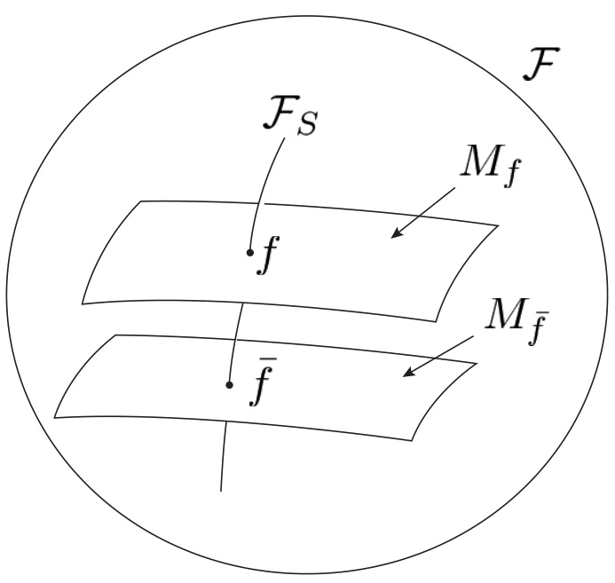
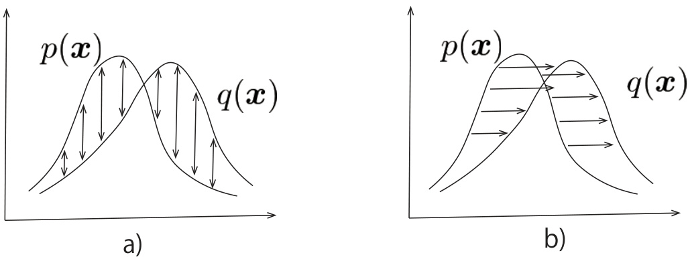
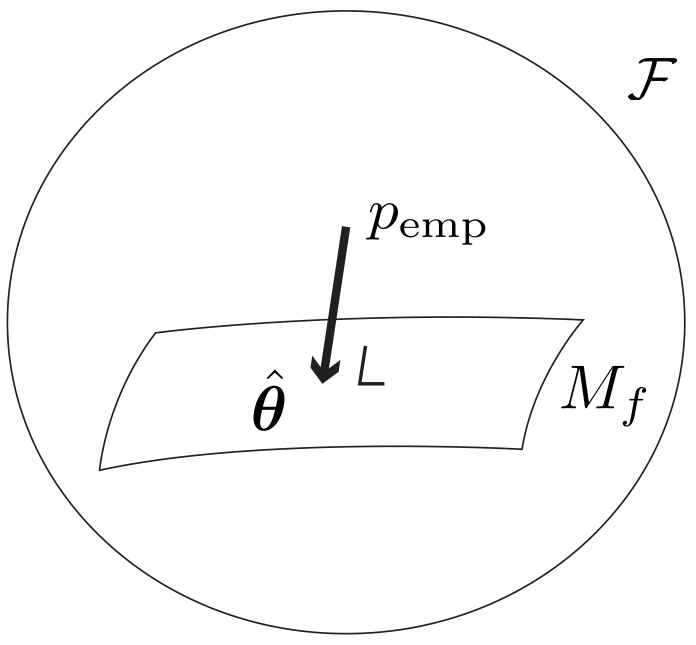
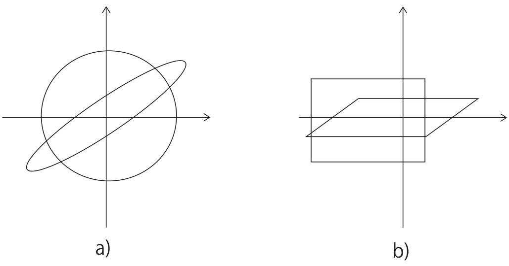

# Information Geometry of Wasserstein Statistics on Shapes and Affine Deformations  

Shun-ichi Amari Teikyo University, Advanced Comprehensive Research Organization, RIKEN Center for Brain Science Takeru Matsuda The University of Tokyo, RIKEN Center for Brain Science  

# Abstract  

Information geometry and Wasserstein geometry are two main structures introduced in a manifold of probability distributions, and they capture its different characteristics. We study characteristics of Wasserstein geometry in the framework of [29] for the affine deformation statistical model, which is a multi-dimensional generalization of the location-scale model. We compare merits and demerits of estimators based on information geometry and Wasserstein geometry. The shape of a probability distribution and its affine deformation are separated in the Wasserstein geometry, showing its robustness against the waveform perturbation in exchange for the loss in Fisher efficiency. We show that the Wasserstein estimator is the moment estimator in the case of the elliptically symmetric affine deformation model. It coincides with the information-geometrical estimator (maximum-likelihood estimator) when and only when the waveform is Gaussian. The role of the Wasserstein efficiency is elucidated in terms of robustness against waveform change.  

# 1 Introduction  

We study statistics based on probability distribution patterns $p(x)$ over $\pmb{x}\in X=R^{d}$ , by using both information geometry [see 1, 8, etc] and Wasserstein geometry [see 47, 40, 42, among many others]. Here, $p(x)$ is a probability distribution on $X\,=\,R^{d}$ . When $d\,=\,2$ ,$p(x)$ is regarded as a visual pattern on $R^{2}$ .  

There are lots of applications of Wasserstein geometry to statistics [see, e.g., 4, 11, 51, 9, 32, 21, 28, 16, and others], machine learning [see, e.g., 7, 18, 49, 40, 35, among many others] and statistical physics [22]. We also recommend the following review paper and book, [38, 39], which include lots of references. However, applications to statistical inference look still premature.  

The affine deformation statistical model $p(x,\pmb\theta)$ is defined as  

$$
p(\pmb{x},\pmb{\theta})=|\Lambda|f\left(\Lambda(\pmb{x}-\pmb{\mu})\right),
$$  

where $f(z)$ is a standard shape distribution satisfying  

$$
\begin{array}{r c l}{{\displaystyle\int f(z)d z}}&{{=}}&{{1,}}\\ {{}}&{{}}&{{\displaystyle\int z f(z)d z}}&{{=}}&{{0,}}\\ {{}}&{{}}&{{\displaystyle\int z z^{\top}f(z)d z}}&{{=}}&{{I,}}\end{array}
$$  

where $I$ is the identity matrix. We also refer to the standard shape $f$ as a “waveform” in the following. The deformation parameter consists of $\pmb{\theta}=(\pmb{\mu},\Lambda)\in\Theta$ such that $\pmb{\mu}$ is a vector specifying translation of the location and $\Lambda$ is a non-singular matrix representing scale changes and rotations of $\mathbf{\nabla_{\mathcal{N}}}$ .Given a standard $f$ , we have a statistical model parameterized by $\theta$ :$\mathcal{M}_{f}\,=\,\{p(\pmb{x},\pmb{\theta})\}$ . Geometrically, it forms a finite-dimensional statistical manifold, where $\pmb{\theta}$ plays the role of a coordinate system. The deformation model is a generalization of the locationscale model. Note that this model is often called the location-scatter model in several fields such as statistics and signal processing [45, 36].  

Let $T_{\theta}$ denote the affine deformation from $_{\textbf{\em x}}$ to $_{\mathscr{L}}$ given by  

$$
z=T_{\theta}{\pmb x}=\Lambda({\pmb x}-{\pmb\mu}).
$$  

This may be regarded as deformation of shape $f$ to $\tilde{T}_{\theta}f$ ,  

$$
(\tilde{T}_{\pmb{\theta}}f)(\pmb{x})=f\left(T_{\pmb{\theta}}\pmb{x}\right),
$$  

where $\tilde{T_{\theta}}$ is an operator to change a standard waveform $f$ to another waveform $\tilde{f}=\tilde{T}_{\theta}f$ defined by (5).  

Let ${\mathcal F}\,=\,\{p({\pmb x})\}$ be the space of all smooth positive probability density functions that have finite second moments. Let ${\mathcal{F}}_{S}=\{f(z)\}$ be its subspace consisting of all the standard distributions $f(z)$ satisfying (2), (3) and (4). Then, any $q({\boldsymbol{x}})\in{\mathcal{F}}$ is written in the form  

$$
q(\pmb{x})=|\Lambda|f\left(\Lambda(\pmb{x}-\pmb{\mu})\right)
$$  

for $f\ \in\mathcal{F}_{S}$ and ${\pmb\theta}\;=\;({\pmb\mu},\Lambda)\;\in\;\Theta$ .Note that $\theta$ is not necessarily unique due to possible symmetries in $f$ . Hence, $\mathcal{F}=\mathcal{F}_{S}\times\Theta/\sim$ , where $\sim$ is the equivalence relation of equality in distribution. See Figure 1.  

Geometry of a manifold of probability distributions has so far been studied by information geometry and Wasserstein geometry. The two geometries capture different aspects of a manifold of probability distributions. We use a divergence measure to explain this. Let ${\cal D}_{F}[p({\pmb x}),q({\pmb x})]$ and $D_{W}[p({\pmb x}),q({\pmb x})]$ be two divergence measures between distributions $p(x)$ and $q(x)$ , where subscripts $F$ and $W$ represent Fisher-based information geometry and Wasserstein geometry, respectively. Information geometry uses an invariant divergence $D_{F}$ , typically the Kullback– Leibler divergence. Wasserstein divergence $D_{W}$ is defined by the cost of transporting masses distributed in form $p(x)$ to another $q(x)$ . Roughly speaking, $D_{F}$ measures the vertical differences of $p(x)$ and $q(x)$ , for example, represented by their log-ratio $\log(p({\pmb x})/q({\pmb x}))$ , whereas $D_{W}$ measures the horizontal differences of $p(x)$ and $q(x)$ which corresponds to the transportation cost from $p(x)$ to $q(x)$ . See Figure 2.  

Information geometry is constructed based on the invariance principle of Chentsov [15] such that ${D_{F}}[p({\pmb x}),q({\pmb x})]$ is invariant under invertible transformations of the coordinates $_{\angle\/C}$ of the sample space $X$ . This implies that the divergence does not depend on the coordinate system of $X$ . We then have a unique Riemannian metric, which is Fisher–Rao metric, and also a dual pair of affine connections [5]. This is useful not only for analyzing the performances of statistical inference but also for vision analysis, machine learning, statistical physics, and many others [see 1].  

  
Figure 1: Decomposition of $\mathcal{F}$  

  
Figure 2: (a) $F$ -divergence. (b) $W$ -divergence.  

Wasserstein geometry has an old origin, proposed by G. Monge in 1781 as a problem of transporting mass distributed in the form $p(x)$ to another $q(x)$ such that the total transportation cost is minimized. It depends on the transportation cost $c(x,y)$ between two locations $x,y\,\in\,X$ . The cost is usually a function of the Euclidean distance between $_{\angle\/C}$ and $\mathbf{\chi}^{y}$ . We use the square of the distance as a cost function, which gives $L^{2}$ -Wasserstein geometry. This Wasserstein geometry directly depends on the Euclidean distance of $X=R^{d}$ . Therefore, it is useful for problems that intrinsically depend on the metric structure of $X$ , such as the transportation problem, non-equilibrium statistical physics, pattern analysis, machine learning and many others.  

It is natural to search for the relation between the two geometries. There are a number of such trials, including Amari et al. [2, 3], Khan and Zhang [24], Rankin and Wong [41], Ito [22], Wong and Yang [50], Chizat et al. [17], Kondratyev et al. [26], Liero et al. [30] and others. (See Khan and Zhang [23] for a survey.) Among them, Li and Zhao [29] gave a unified framework for the two geometries. The present article is based on their framework and focuses on the affine deformation model, for which the standard waveform $f$ and the deformation parameter $\theta$ are separated.  

Recently, Li and Zhao [29] introduced the Wasserstein score function in parallel to the Fisher score function, defining two estimators $\hat{\pmb\theta}_{F}$ and $\widehat{\pmb{\theta}}_{W}$ thereby. The former $\hat{\pmb{\theta}}_{F}$ is the maximum likelihood estimator that maximizes the log likelihood. This is the one that minimizes an invariant divergence from the empirical distribution ${\hat{p}}(x)$ to a parametric model, where the empirical distribution is given based on $n$ independent observations $x_{1},\cdot\cdot\cdot\,,x_{n}$ as  

$$
{\hat{p}}({\pmb x})={\frac{1}{n}}\sum_{t=1}^{n}\delta\left({\pmb x}-{\pmb x}_{t}\right),
$$  

where $\delta(x)$ is the delta function. The latter Wasserstein estimator $\widehat{\pmb{\theta}}_{W}$ is defined as the zero of the Wasserstein score. It is asymptotically equivalent to the minimizer of the $W$ -divergence between the empirical distribution and model. Also, Li and Zhao [29] further defined the $F$ -efficiency and $W$ -efficiency of an estimator $\hat{\pmb\theta}$ given a statistical model $\mathcal{M}=\{p(\pmb{x},\pmb{\theta})\}$ , proving the Cram´er-Rao type inequalities.  

The present paper is organized as follows. In section 2, we introduce two divergences between distributions, one based on the invariance principle and the other based on the transportation cost. The divergences give two Riemannian structures in the space $\mathcal{F}$ of probability distributions $p(x)$ over $X\,=\,R^{d}$ . A regular statistical model $\mathcal{M}\,=\,\{p({\bf x},\pmb{\theta})\}$ parameterized by $\pmb{\theta}$ is a finite-dimensional submanifold embedded in $\mathcal{F}$ . In section 3, we define the $F$ - and $W$ -score functions following [29]. The Riemannian structure of the tangent space of probability distributions is pulled-back to the model submanifold, giving both the Riemannian metrics and score functions. We define the $F$ - and $W$ -estimators $\widehat{\pmb{\theta}}_{F}$ and $\widehat{\pmb{\theta}}_{W}$ by using the $F$ - and $W$ -score functions, respectively. Section 4 defines the affine deformation statistical model. Section 5 studies the elliptically symmetric affine deformation model $\mathcal{M}_{f}$ , where $f$ is a spherically symmetric standard form. For this model, we show that the $W$ -score functions are quadratic functions of $_{\angle\/C}$ . Hence, it is proved that $\widehat{\theta}_{W}$ is a moment estimator. We also show that $\mathcal{M}_{f}$ and ${\mathcal{F}}_{S}$ are orthogonal in the $W$ -geometry, implying the separation of the waveform and deformation. In Section 6, we elucidate the role of $W$ -efficiency from the point of view of robustness to a change in the waveform $f$ due to observation noise. In Section 7, we prove that the Gaussian shape is a unique model in which $F$ -estimator and $W$ -estimator coincide. Section 8 briefly summarizes the paper and mentions future work.  

# 2 Riemannian structures in the space of probability densities  

We consider the space ${\mathcal F}=\,\{p({\pmb x})\}$ of all smooth positive probability density functions on $R^{d}$ that have finite second moments. Later, we may relax the conditions of positivity and smoothness, when we discuss a parametric model, in particular the deformation model 1 . We define a divergence function $D[p({\pmb x}),q({\pmb x})]$ , which represents the degree of difference between $p(x)$ and $q(x)$ .The square of the $L^{2}$ distance between $p(x)$ and $q(x)$ plays this role, but a divergence does not necessarily need to be symmetric with respect to $p(x)$ and $q(x)$ . A divergence function satisfies the following conditions:  

1. $D[p({\pmb x}),q({\pmb x})]\geq0$ and the equality holds if and only if $p({\pmb x})=q({\pmb x})$ .  

2. Let $\delta p(x)$ be an infinitesimally small deviation of $p(x)$ . Then, ${\cal D}[p({\pmb x}),p({\pmb x})+\delta p({\pmb x})]$ is approximated by a positive quadratic functional of $\delta p(x)$ .  

A divergence is said to be invariant if  

$$
D[p({\pmb x}),q({\pmb x})]=D[\tilde{p}({\pmb y}),\tilde{q}({\pmb y})]
$$  

holds for every smooth reversible transformation $^k$ of the coordinates from $\pmb{x}\in\pmb{R}^{d}$ to ${\pmb y}={\pmb k}({\pmb x})$ ,where  

$$
\tilde{p}(\pmb{y})=\left|\frac{\partial\pmb{x}}{\partial\pmb{y}}\right|p(\pmb{x}).
$$  

A typical invariant divergence is the $\alpha$ -divergence ( $\alpha\neq\pm1$ ) defined by  

$$
\begin{array}{r c l}{{D_{\alpha}[p({\pmb x}),q({\pmb x})]}}&{{=}}&{{{\displaystyle\frac{4}{1-\alpha^{2}}}\left(1-\int p({\pmb x})^{(1+\alpha)/2}q({\pmb x})^{(1-\alpha)/2}\mathrm{d}{\pmb x}\right)}}\end{array}
$$  

for $\alpha\neq\pm1$ . For $\alpha=1$ , we define $D_{1}[p,q]$ by the Kullback–Leibler divergence  

$$
D_{1}[p(\pmb{x}),q(\pmb{x})]=\int p(\pmb{x})\log\frac{p(\pmb{x})}{q(\pmb{x})}\mathrm{d}\pmb{x}.
$$  

For $\alpha=-1$ , we define ${D}_{-1}[p({\pmb x}),q({\pmb x})]={D}_{1}[q({\pmb x}),p({\pmb x})]$ . The case $\alpha=0$ is equivalent to the Hellinger divergence  

$$
H^{2}[p(\pmb{x}),q(\pmb{x})]=\frac{1}{2}\int\left(\sqrt{p(\pmb{x})}-\sqrt{q(\pmb{x})}\right)^{2}\mathrm{d}\pmb{x}.
$$  

A characterization of the $\alpha$ -divergence is given in [1]. The $\alpha$ -divergence gives informationgeometric structure to $\mathcal{F}$ .  

Another divergence is the Wasserstein divergence. Let us transport masses piled in the form $p(x)$ to another $q(x)$ . To this end, we need to move some mass at $\mathbf{\nabla_{\mathcal{N}}}$ to another position $\mathbf{\chi}^{y}$ . Let $\pi(x,y)$ be a coupling, showing the probability of mass at $_{\angle\/C}$ to be transported to $\mathbf{\chi}^{y}$ . We call $\pi$ a transportation plan when it satisfies the following terminal conditions  

$$
\begin{array}{r c l}{{\displaystyle\int\pi({\pmb x},{\pmb y})\mathrm{d}{\pmb y}}}&{{=}}&{{p({\pmb x}),}}\\ {{\displaystyle\int\pi({\pmb x},{\pmb y})\mathrm{d}{\pmb x}}}&{{=}}&{{q({\pmb y}).}}\end{array}
$$  

Let $c(x,y)$ be the cost of transporting a unit of mass from $_{\angle\/C}$ to $\mathbf{\chi}^{y}$ . Then, the Wasserstein divergence $D_{W}[p({\pmb x}),q({\pmb x})]$ is the minimum transporting cost from $p(x)$ to $q(x)$ .By using stochastic plan $\pi(x,y)$ , the Wasserstein divergence between $p(x)$ and $q(x)$ is given by  

$$
D_{W}\left[p({\pmb x}),q({\pmb x})\right]=\operatorname*{inf}_{{\pmb\pi}}\int c({\pmb x},{\pmb y})\pi({\pmb x},{\pmb y})\mathrm{d}{\pmb x}\mathrm{d}{\pmb y},
$$  

where infimum is taken over all stochastic plans $\pi$ satisfying (6) and (7). When the cost is the square of the Euclidean distance  

$$
c(\mathbf{-},\pmb{y})=\|\pmb{x}-\pmb{y}\|^{2},
$$  

we call $D_{W}$ the $L^{2}$ -Wasserstein divergence. We focus on this divergence in the following. Note that the $L^{2}$ -Wasserstein divergence is the square of the $L^{2}$ -Wasserstein distance. From Brenier’s theorem, the optimal transport is actually induced by a transport map. In other words, for each point $_{\angle\/C}$ ,$\pi(x,\cdot)$ is supported at a single point.  

The dynamic formulation of the optimal transport problem proposed by [14] and developed further by [10, 33] is useful. Let $\rho(\pmb{x},t)$ be a family of probability distributions parameterized by $t$ . It represents the time course $\rho(\pmb{x},t)$ of transporting $p(x)$ to $q(x)$ , satisfying  

$$
\rho(\pmb{x},0)=p(\pmb{x}),\quad\rho(\pmb{x},1)=q(\pmb{x}).
$$  

We introduce potential $\Phi({\pmb x},t)$ such that its gradient $\nabla_{x}\Phi({\pmb x},t)$ represents the velocity  

$$
{\pmb v}({\pmb x},t)=\nabla_{\pmb x}\Phi({\pmb x},t)
$$  

of mass flow at $_{\angle\/C}$ and $t$ in the dynamic plan. Then, $\Phi({\pmb x},t)$ satisfies the following continuity equation  

$$
\partial_{t}\rho({\pmb x},t)+\nabla_{\pmb x}\cdot\{\rho({\pmb x},t)\nabla_{\pmb x}\Phi({\pmb x},t)\}=0.
$$  

The Wasserstein divergence is written in the dynamic formulation as  

$$
D_{W}\left[p(\pmb{x}),q(\pmb{x})\right]=\operatorname*{inf}_{\Phi}\int_{0}^{1}\int\|\nabla_{\pmb{x}}\Phi(\pmb{x},t)\|^{2}\rho(\pmb{x},t)\mathrm{d}\pmb{x}\mathrm{d}t.
$$  

We introduce a Riemannian structure to $\mathcal{F}$ by the Taylor expansion of $D[p,p+\delta p]$ . The Riemannian metric $g$ gives the squared magnitude $d s^{2}$ of an infinitesimal deviation $\delta p(x)$ in the tangent space of $\mathcal{F}$ , for example, by  

$$
d s^{2}=\langle\delta p(\pmb{x}),g(\delta p(\pmb{x})\rangle,
$$  

where  

$$
\langle a({\pmb x}),b({\pmb x})\rangle=\int a({\pmb x})b({\pmb x})\mathrm{d}{\pmb x}.
$$  

In the case of the invariant divergence,  

$$
g_{F}(\delta p(\mathbf{x}))=\frac{\delta p(\mathbf{x})}{p(\mathbf{x})}.
$$  

so that  

$$
d s^{2}=\int\frac{\delta p(\pmb{x})^{2}}{p(\pmb{x})}\mathrm{d}\pmb{x}.
$$  

In the case of the $L^{2}$ -Wasserstein divergence, consider the change of density from $\rho(\pmb{x},0)=p(\pmb{x})$ at $t=0$ to $\rho(\mathbf{\boldsymbol{x}},\mathrm{d}t)=p(\mathbf{\boldsymbol{x}})+\delta p(\mathbf{\boldsymbol{x}})$ at $t=\mathrm{d}t$ for an infinitesimal $\mathrm{d}t$ . By using the potential $\Phi(x)$ of this infinitesimal transport,  

$$
\delta p(\pmb{x})=-\Delta_{p}\Phi(\pmb{x})\mathrm{d}t+o(\mathrm{d}t),
$$  

where $\Delta_{p}$ is the operator defined by  

$$
\begin{array}{r}{\Delta_{p}\Phi(\pmb{x})=\nabla_{\pmb{x}}\cdot\left(p(\pmb{x})\nabla_{\pmb{x}}\Phi(\pmb{x})\right).}\end{array}
$$  

Then, the $L^{2}$ -Wasserstein divergence is  

$$
\begin{array}{r l}&{D_{W}[p(\pmb{x}),p(\pmb{x})+\delta p(\pmb{x})]=\displaystyle\int\|\nabla_{\pmb{x}}\Phi(\pmb{x})\mathrm{d}t\|^{2}p(\pmb{x})\mathrm{d}\pmb{x}+o(\mathrm{d}t^{2})}\\ &{\qquad\qquad\qquad\qquad=\langle\Phi(\pmb{x})\mathrm{d}t,-\Delta_{p}\Phi(\pmb{x})\mathrm{d}t\rangle+o(\mathrm{d}t^{2})}\\ &{\qquad\qquad\qquad\quad=\langle\Phi(\pmb{x})\mathrm{d}t,\delta p(\pmb{x})\rangle+o(\mathrm{d}t^{2}),}\end{array}
$$  

where we used  

$$
\int(\nabla_{x}a({\pmb x}))^{\top}(\nabla_{x}b({\pmb x}))p({\pmb x})\mathrm{d}x=-\int a({\pmb x})\Delta_{p}b({\pmb x})\mathrm{d}x.
$$  

Thus,  

$$
g_{W}(\delta p(\mathbf{x}))=\Phi(\mathbf{x})\mathrm{d}t.
$$  

Note that $\Phi(x)$ is unique up to an additive constant under regularity conditions (see Theorem 13.8 of [48] and Section 8.1 of [47]). This is Otto’s Riemannian metric [37].  

We focused on the space $\mathcal{F}$ of smooth and positive densities under $L^{2}$ -Wasserstein geometry. It is indeed an infinite-dimensional Riemannian manifold [31]. Since the space ${\mathcal{I}}_{S}$ is a codimension $d+d(d+1)/2$ subspace of $\mathcal{F}$ that specifies the value of linear functionals (first and second moments), it is also an infinite-dimensional Riemannian manifold. However, if we consider the larger space of general probability distributions, then it is not even a Banach manifold under $L^{2}$ -Wasserstein geometry, because it includes singular (atomic) distributions for which the tangent space is more restricted than that of $\mathcal{F}$ .  

Note that information geometry and Wasserstein geometry induce different topologies on the space of probability distributions. In information geometry, due to the asymmetry of the divergence, the topology may be different depending on whether we consider open balls with respect to the first or second arguments of divergence functions. Also, the Kullback– Leiber divergence may be infinite even if the distributions have finite second moments and strictly positive densities. The Hellinger distance is symmetric and may be better behaved, although the distributions have to belong to some Orlicz spaces for its finiteness [25]. On the other hand, Wasserstein geometry does not require the absolute continuity of the distributions, because the Wasserstein distance metrizes the weak convergence. Therefore, the identity map between smooth and positive probability densities in terms of the Hellinger (or Kullback– Leibler divergence etc.) and Wasserstein topologies is not a diffeomorphism. Therefore, there are multiple infinite-dimensional manifold structures possible on $\mathcal{F}$ .  

# 3 Score functions and estimators  

We consider a regular statistical model $\mathcal{M}=\{p(\pmb{x},\pmb{\theta})\}$ parameterized by $m$ -dimensional vector $\theta$ . The tangent space of $\mathcal{M}$ at $\pmb{\theta}$ is spanned by  

$$
\partial_{i}p({\pmb x},{\pmb\theta})=\frac{\partial}{\partial\theta^{i}}p({\pmb x},{\pmb\theta})
$$  

for $i=1,\cdot\cdot\cdot,m$ so that a tangent vector $\delta p(x)$ is given by  

$$
\delta p({\pmb x})=\partial_{i}p({\pmb x},{\pmb\theta})d\theta^{i}.
$$  

Hereafter, the summation convention is used, that is, all indices appearing twice, once as upper and the other as lower indices, e.g. $i$ ’s in (9), are summed up.  

Let us define $S_{i}(x,\theta)$ from the basis functions $\partial_{i}p(x,\pmb\theta)$ of the tangent space of $\mathcal{M}$ for $i=1,\cdot\cdot\cdot,m$ by applying the Riemannian metric operator $g$ :  

$$
S_{i}(\pmb{x},\pmb{\theta})=g(\partial_{i}p(\pmb{x},\pmb{\theta})).
$$  

We call them score functions following the tradition of statistics. In the case of invariant Fisher geometry, the Fisher score function $S_{i}^{F}(x,\theta)$ ) is  

$$
S_{i}^{F}(\pmb{x},\pmb{\theta})=\frac{\partial_{i}p(\pmb{x},\pmb{\theta})}{p(\pmb{x},\pmb{\theta})}=\partial_{i}l(\pmb{x},\pmb{\theta}),\quad l(\pmb{x},\pmb{\theta})=\log p(\pmb{x},\pmb{\theta}),
$$  

which is the derivative of log-likelihood. In Wasserstein geometry, the Wasserstein score ( $W$ -score) function $S_{i}^{W}(x,\theta)$ ) [29] is defined as the solution of  

$$
\Delta_{p}S_{i}^{W}({\pmb x},{\pmb\theta})=-\partial_{i}p({\pmb x},{\pmb\theta}),\quad\mathrm{E}_{\boldsymbol{\theta}}[S_{i}^{W}({\pmb x},{\pmb\theta})]=0,
$$  

where the latter condition is imposed to eliminate the indefiniteness due to the integral constant. By using the identity  

$$
\int a({\pmb x})\Delta_{p}b({\pmb x})\mathrm d{\pmb x}=-\int(\nabla_{\pmb x}a({\pmb x}))^{\top}(\nabla_{\pmb x}b({\pmb x}))p({\pmb x})\mathrm d{\pmb x},
$$  

we see that $S_{i}^{W}(x,\pmb\theta)$ ) satisfies the Poisson equation:  

$$
\nabla_{x}\log p(\pmb{x},\pmb{\theta})\cdot\nabla_{x}S_{i}^{W}(\pmb{x},\pmb{\theta})+\Delta_{x}S_{i}^{W}(\pmb{x},\pmb{\theta})+\frac{\partial}{\partial\theta_{i}}\log p(\pmb{x},\pmb{\theta})=0.
$$  

For infinitesimal $\delta$ , the map $\pmb{x}\mapsto\pmb{x}+\delta\nabla_{\pmb{x}}S_{i}^{W}(\pmb{x},\pmb{\theta})$ ) is the optimal transport map from $p(x,\pmb\theta)$ to $p(\pmb{x},\pmb{\theta}+\delta\pmb{e}_{i})$ with transportation cost  

$$
D_{W}(p({\pmb x},{\pmb\theta}),p({\pmb x},{\pmb\theta}+\delta e_{i}))=\int\|\delta\nabla_{\pmb x}S_{i}^{W}({\pmb x},{\pmb\theta})\|^{2}p({\pmb x},{\pmb\theta})\mathrm{d}x+o(\delta^{2})
$$  

as $\delta\ \rightarrow\ 0$ , where $e_{i}$ is the $i$ -th standard unit vector. See Proposition 8.4.6 of [6] for more rigorous statement. In both Fisher and Wasserstein cases, the score function satisfies  

$$
\mathrm{E}_{\theta}[S_{i}({\pmb x},{\pmb\theta})]=0.
$$  

The Riemannian metric tensor $g_{i j}(\pmb\theta)$ is pulled-back from $g$ in $\mathcal{F}$ to $\mathcal{M}$ , and is derived in terms of the score functions as  

$$
g_{i j}(\pmb\theta)=\langle S_{i},g^{-1}S_{j}\rangle,
$$  

where  

$$
\langle a({\pmb x}),b({\pmb x})\rangle=\int a({\pmb x})b({\pmb x})\mathrm{d}{\pmb x}.
$$  

In the Fisherian case,  

$$
g_{i j}^{F}(\pmb\theta)=\operatorname{E}\left[\partial_{i}l(\pmb x,\pmb\theta)\partial_{j}l(\pmb x,\pmb\theta)\right]=\int p(\pmb x,\pmb\theta)\partial_{i}l(\pmb x,\pmb\theta)\partial_{j}l(\pmb x,\pmb\theta)\mathrm{d}\pmb x.
$$  

In the Wasserstein case,  

$$
\begin{array}{r l}&{g_{i j}^{W}(\pmb\theta)=-\int S_{i}^{W}(\pmb x,\pmb\theta)\Delta_{p}S_{j}^{W}(\pmb x,\pmb\theta)\mathrm{d}\pmb x}\\ &{\qquad\qquad=\int p(\pmb x,\pmb\theta)\nabla_{\pmb x}S_{i}^{W}(\pmb x,\pmb\theta)^{\top}\nabla_{\pmb x}S_{j}^{W}(\pmb x,\pmb\theta)\mathrm{d}\pmb x}\\ &{\qquad\qquad=\mathrm{E}[\nabla_{\pmb x}S_{i}^{W}(\pmb x,\pmb\theta)^{\top}\nabla_{\pmb x}S_{j}^{W}(\pmb x,\pmb\theta)],}\end{array}
$$  

where identity (10) is used.  

The score functions $S_{i}(x,\theta)$ give a set of estimating functions from (13), which are used to obtain an estimator $\hat{\pmb\theta}$ . Suppose that we have $n$ independent observations $x_{1},\cdot\cdot\cdot\,,x_{n}$ from $p(x,\pmb\theta)$ . Let $\hat{p}_{\mathrm{emp}}(x)$ be the empirical distribution given by  

$$
\hat{p}_{\mathrm{emp}}({\pmb x})=\frac{1}{n}\sum_{t=1}^{n}\delta\left({\pmb x}-{\pmb x}_{t}\right).
$$  

Then, replacing expectation $\mathrm{E}$ in (13) by the expectation with respect to the empirical distribution, we have estimating equations  

$$
\operatorname{E}_{\mathrm{emp}}[S_{i}(\pmb{x},\hat{\pmb{\theta}})]=\frac{1}{n}\sum_{t=1}^{n}S_{i}(\pmb{x}_{t},\hat{\pmb{\theta}})=0,\quad i=1,\cdots\,,m.
$$  

It is known that the solution $\hat{\pmb\theta}$ gives a consistent estimator for large $n$ . Roughly speaking, $\hat{\pmb\theta}$ is the projection of $\hat{p}_{\mathrm{emp}}(x)$ to the model $\mathcal{M}$ with respect to the metric $g$ (see Figure 3). It is the solution of  

$$
\begin{array}{r}{\langle\hat{p}_{\mathrm{emp}}({\pmb x}),S_{i}({\pmb x},{\pmb\theta})\rangle=0,}\end{array}
$$  

giving a consistent estimator $\hat{\pmb\theta}$ . A consistent estimator is Fisher efficient when the projection is orthogonal with respect to the Fisher–Rao metric [5].  

For the invariant Fisherian case, the estimator $\widehat{\pmb{\theta}}_{F}$ defined by (15) is the maximum likelihood estimator:  

$$
\frac{1}{n}\sum_{t=1}^{n}S_{i}^{F}({\pmb x}_{t},\hat{\pmb\theta}_{F})=0.
$$  

Cram´er-Rao theorem gives a matrix inequality for any unbiased estimator $\hat{\pmb\theta}$ ,  

$$
\operatorname{Cov}[\hat{\pmb{\theta}}]\succeq\frac{1}{n}g_{F}^{-1}(\pmb{\theta}),
$$  

  
Figure 3: Projection of $\hat{p}_{\mathrm{emp}}$ to $\mathcal{M}$ .  

where $\mathrm{Cov}[\cdot]$ is the covariance matrix and $\succeq$ denotes the matrix order defined by the positive semidefiniteness. The maximum likelihood estimator $\hat{\pmb{\theta}}_{F}$ satisfies  

$$
\operatorname{Cov}[\hat{\pmb{\theta}}_{F}]\approx\frac{1}{n}g_{F}^{-1}(\pmb{\theta})
$$  

asymptotically. Hence, it minimizes the error covariance matrix and the minimized error covariance is given asymptotically by the inverse of the Fisher metric tensor $g_{F}$ divided by $n$ .Such a property is called the Fisher efficiency.  

In the following, we study the characteristics of the estimator $\widehat{\pmb{\theta}}_{W}$ defined by (15) with the Wasserstein score:  

$$
\frac{1}{n}\sum_{t=1}^{n}S_{i}^{W}({\pmb x}_{t},\hat{{\pmb\theta}}_{W})=0.
$$  

We call $\widehat{\theta}_{W}$ the Wasserstein estimator ( $W$ -estimator) following [29]. In the case of the onedimensional location-scale model, the Wasserstein estimator is asymptotically equivalent to the estimator obtained by minimizing the Wasserstein divergence (transportation cost) from the empirical distribution $\hat{p}_{\mathrm{emp}}(x)$ to model $\mathcal{M}$ :  

$$
\hat{\pmb{\theta}}_{W p}=\underset{\pmb{\theta}}{\arg\operatorname*{min}}\ D_{W}\left[\hat{p}_{\mathrm{emp}}(\pmb{x}),p(\pmb{x},\pmb{\theta})\right].
$$  

See the end of Section 5. The properties of $\hat{\pmb{\theta}}_{W p}$ were studied in detail by [4] in the case of the one-dimensional location-scale model. Note that $\hat{\pmb{\theta}}_{W}\neq\hat{\pmb{\theta}}_{W p}$ in general, contrary to the Fisher case.  

# 4 Affine deformation model  

Now, we focus on the affine deformation model. Let $f(z)$ be a standard probability density function satisfying (2), (3), and (4). To define $\mathcal{M}_{f}$ , we use affine deformation of $\mathbf{\nabla_{\mathcal{N}}}$ to $_{\mathscr{L}}$ by  

$$
z=\Lambda({\pmb x}-{\pmb\mu}),
$$  

where $\pmb{\mu}$ is a vector representing shift of location and $\Lambda$ is a non-singular matrix. Hence, $\pmb{\theta}=(\pmb{\mu},\boldsymbol{\Lambda})$ is ${\boldsymbol{\mathit{m}}}$ -dimensional where $m\leq d^{2}+d$ due to the possible symmetries in $f$ . The model $\mathcal{M}_{f}$ is defined from  

$$
\begin{array}{r}{p(\pmb{x},\pmb{\theta})\mathrm{d}\pmb{x}=f(\pmb{z})d\pmb{z},}\end{array}
$$  

that is  

$$
p(\pmb{x},\pmb{\theta})=|\Lambda|f(\Lambda(\pmb{x}-\pmb{\mu})),
$$  

satisfying  

$$
\int x p(x,\theta)\mathrm{d}x=\mu,\quad\int x x^{\top}p(x,\theta)\mathrm{d}x=\Lambda^{-2}+\mu\mu^{\top}.
$$  

This is a generalization of the location-scale model, which is simply obtained by putting $\Lambda=$ $(1/\sigma)I$ , with $\sigma$ being the scale factor. It should be noted that $\Lambda$ is decomposed as $\Lambda=U D O$ ,where $U$ and $O$ are orthogonal matrices and $\cal{D}$ is a positive diagonal matrix (singular value decomposition). In the following, we denote the log probability of standard shape $f$ by  

$$
l(z)=\log f(z).
$$  

As we discussed in Introduction, the set of all standard shape functions $\mathcal{F}_{S}=\{f\}$ does not form a manifold but has an interesting topological structure due to the rotational invariance for some $f$ .For each standard shape function $f\,\in\,{\mathcal{F}}_{S}$ , an affine deformation model $\mathcal{M}_{f}$ parameterized by $\pmb{\theta}=(\pmb{\mu},\boldsymbol{\Lambda})$ is attached. Thus, $\mathcal{F}$ is decomposed into the direct product of ${\mathcal{F}}_{S}$ and $\mathcal{M}_{f}$ ,  

$$
\mathcal{F}=\mathcal{F}_{S}\times\mathcal{M}_{f}.
$$  

For any $f$ ,$\mathcal{M}_{f}$ has cone structure parameterized by $(\mu,D,U,O)$ , where $\Lambda=U D O$ and $D$ is a diagonal matrix with diagonal elements $d_{i}\,>\,0$ . Thus, $D$ can be identified with a vector in the open positive quadrant $R_{+}^{d}$ of $R^{d}$ , which has the cone structure. Since $\pmb{\mu}\in\pmb{R}^{d}$ , and $U,O\in O(d)$ , we have the decomposition  

$$
\mathcal{M}_{f}=\pmb{R}^{d}\times\pmb{R}_{+}^{d}\times\mathcal{O}(d)\times\mathcal{O}(d).
$$  

See [44] for the cone structure of $\mathcal{J}$ . When $f$ is Gaussian, its structure is studied in detail by [43].  

When $p(x)$ belongs to $\mathcal{M}_{f}$ , the waveform of $p(x)$ is said to be equivalent to that of $f$ . The space $\mathcal{M}_{f}$ consists of the distributions of all equivalent waveforms. All ellipsoidal shapes are equivalent to a spherical shape. A family of special parallel-piped shapes are equivalent to a cubic form (see Figure 4). Therefore, our model is useful for separating the effect of the shape from location and affine deformation.  

We may consider subclasses of the transformation model. One simple example is the location model, in which $\Lambda$ is fixed to the identity matrix $I$ . A stronger theorem is known in such a simple model [20]. In our context, it can be expressed as follows.  

Proposition 1. Wasserstein geometry gives an orthogonal decomposition of the shape and locations,  

$$
D_{W}\left[f_{1}\left(x-\mu_{1}\right),f_{2}\left(x-\mu_{2}\right)\right]=D_{W}\left[f_{1}(x),f_{2}(x)\right]+\Vert\mu_{1}-\mu_{2}\Vert^{2}.
$$  

  
Figure 4: Equivalent shapes.  

# 5 Elliptically symmetric deformation model  

Here, we focus on deformation models that are elliptically symmetric:  

$$
p(\pmb{x},\pmb{\theta})=|\Lambda|g(\|\Lambda(\pmb{x}-\pmb{\mu})\|),
$$  

where $f(z)=g(\|z\|)$ satisfies the standard density conditions (2), (3), and (4). Since $\|\Lambda(x-$ $\mu)\|=\|\Lambda^{\top}({\pmb x}-{\pmb\mu})\|$ , we restrict the parameter $\Lambda$ to be symmetric in this section. Namely, the dimension of $\mathcal{M}_{f}$ is $d+d(d+1)/2$ .  

First, we consider the $F$ -estimator $\widehat{\pmb{\theta}}_{F}$ (maximum likelihood estimator). The log-likelihood is given by  

$$
\log p(\pmb{x},\pmb{\theta})=\log|\Lambda|+\log g(\|\Lambda(\pmb{x}-\pmb{\mu})\|).
$$  

When there are $n$ independent observations $x_{1},\cdot\cdot\cdot\,,x_{n}$ , summation is taken over them so that we have the likelihood equations  

$$
\sum_{j=1}^{n}\partial_{\theta}\log p\left(\pmb{x}_{j},\pmb{\theta}\right)=0.
$$  

The solution $\hat{\pmb\theta}_{F}$ strongly depends of the shape $g$ .  

Contrary to this, the $W$ -estimator $\widehat{\pmb{\theta}}_{W}$ does not depend on the shape $g$ as follows. We write the $i$ -th standard unit vector by $e_{i}\in\mathbb{R}^{d}$ so that $(e_{i})_{j}=\delta_{i j}$ .  

Lemma 1.  

$$
\nabla_{x}\left(\frac{1}{2}{x^{\top}}A x+b^{\top}x+c\right)=\frac{A+A^{\top}}{2}x+b,\quad\Delta_{x}\left(\frac{1}{2}x^{\top}A x+b^{\top}x+c\right)=\mathrm{tr}(A).
$$  

Proof. Straightforward calculation. Note that $(A+A^{\top})/2\neq A$ when $A$ is not symmetric.  

Lemma 2. Let $A,B\in\mathbb{R}^{d\times d}$ be symmetric matrices. If $A$ is positive definite, then the Sylvester equation $A X+X A=B$ has the unique solution $X$ , which satisfies $X^{\mid}\ =\ X$ and $\operatorname{tr}(X)\,=$ $\mathrm{tr}(A^{-1}B)/2$ .  

Proof. From the positive semidefiniteness of $A$ , the spectra of $A$ and $-A$ are disjoint. Thus, from Theorem VII.2.1 of [12], the Sylvester equation $A X+X A=B$ has a unique solution.  

Let $X$ be the solution of the Sylvester equation. From $A^{\mid}{}=A$ , we have $A X^{\mid}\ +X^{\mid}\ A=$ $(A X+X A)^{\top}=B^{\top}=B$ , which means that $X^{\top}$ is also a solution of the Sylvester equation. Since the solution is unique, it implies $X^{\mid}\ =\ X$ . Also, from the positive semidefiniteness of $A$ and $A X\,+\,X A\ =\ B$ , we have $X\,+\,A^{-1}X A\ =\ A^{-1}B$ .Taking the trace and using $\operatorname{tr}(A^{-1}X A)=\operatorname{tr}(X)$ , we obtain $\mathrm{tr}X=\mathrm{tr}(A^{-1}B)/2$ .  

Theorem 1. For the elliptically symmetric deformation model (18), the Wasserstein score functions are quadratic. Specifically, the Wasserstein score function for $\mu_{i}$ is  

$$
S_{\mu_{i}}^{W}(x,\pmb{\theta})=x_{i}-\mu_{i},
$$  

and the Wasserstein score function for $\Lambda_{i j}$ is  

$$
S_{\Lambda_{i j}}^{W}(\pmb{x},\pmb{\theta})=\frac{1}{2}\pmb{x}^{\top}\pmb{\varLambda}\pmb{x}+b^{\top}\pmb{x}-\mathrm{E}_{\theta}\left[\frac{1}{2}\pmb{x}^{\top}\pmb{\varLambda}\pmb{x}+b^{\top}\pmb{x}\right],
$$  

where $A$ is the unique solution of the Sylvester equation $\Lambda^{2}A+A\Lambda^{2}=-\Lambda e_{i}e_{j}^{\top}-e_{i}e_{j}^{\top}\Lambda$ Λ and $b=-A\mu$ .  

Proof. We show that the above $S^{W}$ ’s satisfy the Poisson equation (11) directly.  

First, we consider the mean parameter $\mu_{i}$ . From (18),  

$$
\frac{\partial}{\partial\mu_{i}}\log p({\pmb x},{\pmb\theta})=-\frac{\partial}{\partial x_{i}}\log p({\pmb x},{\pmb\theta})=-\nabla_{\b x}\log p({\pmb x},{\pmb\theta})^{\top}{\pmb e}_{i}.
$$  

Also, from Lemma $1$ ,  

$$
\nabla_{\pmb{x}}(x_{i}-\mu_{i})=e_{i},\quad\Delta_{\pmb{x}}(x_{i}-\mu_{i})=0.
$$  

Therefore,  

$$
\nabla_{x}\log p({\pmb x},{\pmb\theta})^{\top}\nabla_{\pmb x}(x_{i}-\mu_{i})+\Delta_{{\pmb x}}(x_{i}-\mu_{i})+\frac{\partial}{\partial\mu_{i}}\log p({\pmb x},{\pmb\theta})=0.
$$  

Thus, the Wasserstein score function for the mean parameter $\mu_{i}$ is  

$$
S_{\mu_{i}}^{W}(x,\pmb{\theta})=x_{i}-\mu_{i}.
$$  

Next, we consider the deformation parameter $\Lambda_{i j}$ . Since  

$$
\begin{array}{l}{\displaystyle\frac{\partial}{\partial\Lambda_{i j}}\|\Lambda(\boldsymbol{x}-\boldsymbol{\mu})\|=\displaystyle\frac{1}{2}\|\Lambda(\boldsymbol{x}-\boldsymbol{\mu})\|^{-1}\frac{\partial}{\partial\Lambda_{i j}}(\boldsymbol{x}-\boldsymbol{\mu})^{\top}\Lambda^{2}(\boldsymbol{x}-\boldsymbol{\mu})}\\ {\displaystyle=\frac{1}{2}\|\Lambda(\boldsymbol{x}-\boldsymbol{\mu})\|^{-1}(\boldsymbol{x}-\boldsymbol{\mu})^{\top}\frac{\partial\Lambda^{2}}{\partial\Lambda_{i j}}(\boldsymbol{x}-\boldsymbol{\mu})}\\ {\displaystyle=\frac{1}{2}\|\Lambda(\boldsymbol{x}-\boldsymbol{\mu})\|^{-1}(\boldsymbol{x}-\boldsymbol{\mu})^{\top}(\Lambda e_{i}e_{j}^{\top}+e_{i}e_{j}^{\top}\Lambda)(\boldsymbol{x}-\boldsymbol{\mu}),}\end{array}
$$  

we have  

$$
\begin{array}{r l}&{\displaystyle\frac{\partial}{\Lambda_{i j}}\log p(\pmb{x},\theta)=\frac{\partial}{\partial\Lambda_{i j}}\log\operatorname*{det}{\Lambda}+\frac{\partial}{\partial\Lambda_{i j}}\log g(\|\Lambda(\pmb{x}-\mu)\|)}\\ &{\quad\quad\quad\quad\quad=(\Lambda^{-1})_{i j}+\frac{g^{\prime}(\|\Lambda(\pmb{x}-\mu)\|)}{g(\|\Lambda(\pmb{x}-\mu)\|)}\frac{\partial}{\partial\Lambda_{i j}}\|\Lambda(\pmb{x}-\mu)\|}\\ &{\quad\quad\quad\quad=(\Lambda^{-1})_{i j}+\frac{g^{\prime}(\|\Lambda(\pmb{x}-\mu)\|)}{2\|\Lambda(\pmb{x}-\mu)\|g(\|\Lambda(\pmb{x}-\mu)\|)}(\pmb{x}-\mu)^{\top}(\Lambda e_{i}e_{j}^{\top}+e_{i}e_{j}^{\top}\Lambda)(\pmb{x}-\mu)}\\ &{\quad\quad\quad\quad\quad=-\frac{g^{\prime}(\|\Lambda(\pmb{x}-\mu)\|)}{\|\Lambda(\pmb{x}-\mu)\|g(\|\Lambda(\pmb{x}-\mu)\|)}\left(-\frac{1}{2}\pmb{x}^{\top}L\pmb{x}+\pmb{x}^{\top}L\pmb{\mu}-\frac{1}{2}\mu^{\top}L\pmb{\mu}\right)+(\Lambda^{-1})_{i j},}\end{array}
$$  

where $L=\Lambda e_{i}e_{j}^{\top}+e_{i}e_{j}^{\top}\Lambda$ Λ. Let  

$$
S(\pmb{x})=\frac{1}{2}\pmb{x}^{\top}A\pmb{x}+b^{\top}\pmb{x}-\mathrm{E}_{\theta}\left[\frac{1}{2}\pmb{x}^{\top}A\pmb{x}+b^{\top}\pmb{x}\right],
$$  

where $A$ is the unique solution of the Sylvester equation $\Lambda^{2}A+A\Lambda^{2}\,=\,-L$ and $b=-A\pmb{\mu}$ .From Lemma 1 and Lemma 2,  

$$
\Delta_{x}S(\pmb{x})=\mathrm{tr}A=-\frac{1}{2}\mathrm{tr}(\Lambda^{-2}L)=-\frac{1}{2}\mathrm{tr}(\Lambda^{-2}(\Lambda e_{i}e_{j}^{\top}+e_{i}e_{i}^{\top}\Lambda))=-(\Lambda^{-1})_{i j}.
$$  

Also,  

$$
\begin{array}{r l}&{\quad\nabla_{x}\log p(x,\theta)^{\top}\nabla_{x}S(x)}\\ &{=\frac{g^{\prime}\left(\|\Lambda(x-\mu)\|\right)}{g\left(\|\Lambda(x-\mu)\|\right)}\nabla_{x}(\|\Lambda(x-\mu)\|)^{\top}(A x+b)}\\ &{=\frac{g^{\prime}\left(\|\Lambda(x-\mu)\|\right)}{\|\Lambda(x-\mu)\|g\left(\|\Lambda(x-\mu)\|\right)}(\Lambda^{2}(x-\mu))^{\top}(A x+b)}\\ &{=\!\frac{g^{\prime}\left(\|\Lambda(x-\mu)\|\right)}{\|\Lambda(x-\mu)\|g(\|\Lambda(x-\mu)\|)}\left(\frac{1}{2}{x}^{\top}(\Lambda^{2}A+A\Lambda^{2})x+{x}^{\top}(\Lambda^{2}b-A\Lambda^{2}\mu)-\mu^{\top}\Lambda^{2}b\right)}\\ &{=\!\frac{g^{\prime}\left(\|\Lambda(x-\mu)\|\right)}{\|\Lambda(x-\mu)\|g\left(\|\Lambda(x-\mu)\|\right)}\left(-\frac{1}{2}{x}^{\top}L x+{x}^{\top}L\mu-\frac{1}{2}\mu^{\top}L\mu\right),}\end{array}
$$  

where we used  

$$
\begin{array}{r l}&{\nabla_{x}(\|\Lambda(x-\mu)\|)=\frac{1}{2\|\Lambda(x-\mu)\|}\nabla_{x}(\|\Lambda(x-\mu)\|^{2})}\\ &{\quad\quad\quad\quad\quad=\frac{1}{2\|\Lambda(x-\mu)\|}\nabla_{x}((x-\mu)^{\top}\Lambda^{2}(x-\mu))}\\ &{\quad\quad\quad\quad\quad=\frac{1}{\|\Lambda(x-\mu)\|}\Lambda^{2}(x-\mu).}\end{array}
$$  

Therefore,  

$$
\nabla_{x}\log{p(\pmb{x},\pmb{\theta})^{\top}\nabla_{x}S(\pmb{x})}+\Delta_{x}S(\pmb{x})+\frac{\partial}{\partial\Lambda_{i j}}\log{p(\pmb{x},\pmb{\theta})}=0,
$$  

which means that $S(x)$ is the Wasserstein score function for $\Lambda_{i j}$ .  

p from $p(x,\pmb\theta)$ $p(x,{\widetilde{\pmb\theta}})$ is given by the affine map $x\mapsto$ $\Lambda(\Lambda^{-1}\bar{\Lambda}^{-2}\Lambda^{-1})^{1/2}\Lambda(\pmb{x}-\pmb{\mu})+\widetilde{\pmb{\mu}}$ [19]. It provides another proof of Theorem 1.  

Now, we consider the Wasserstein estimator ee$\widehat{\pmb{\theta}}_{W}$ defined as the zero of the Wasserstein score function [29].  

Corollary 1. Suppose that we have $n$ independent observations $\mathbf{\boldsymbol{x}}_{1},\ldots,\mathbf{\boldsymbol{x}}_{n}$ from the elliptically symmetric deformation model (18) where $n\ \geq\ d$ .Then, the Wasserstein estimator $\widehat{\theta}_{W}\;=\;$ $(\hat{\mu}_{W},\hat{\Lambda}_{W})$ is the second-order moment estimator given by  

$$
\hat{\mu}_{W}=\frac{1}{n}\sum_{t=1}^{n}x_{t},\quad\hat{\Lambda}_{W}=\left(\frac{1}{n}\sum_{t=1}^{n}(x_{t}-\hat{\mu}_{W})(x_{t}-\hat{\mu}_{W})^{\top}\right)^{-1/2},
$$  

irrespective of the waveform $f(z)=g(\|z\|)$ .  

Proof. From Theorem 1, the Wasserstein estimator is the solution of  

$$
\frac{1}{n}\sum_{t=1}^{n}S_{\mu_{i}}^{W}(\pmb{x}_{t},\pmb{\theta})=\frac{1}{n}\sum_{t=1}^{n}((\pmb{x}_{t})_{i}-\mu_{i})=0
$$  

for $i=1,\ldots,d$ and  

$$
\frac{1}{n}\sum_{t=1}^{n}S_{\Lambda_{i j}}^{W}(x_{t},\pmb{\theta})=\frac{1}{n}\sum_{t=1}^{n}\left(\frac{1}{2}\pmb{x}_{t}^{\top}A\pmb{x}_{t}+b^{\top}\pmb{x}_{t}\right)-\mathbb{E}_{\pmb{\theta}}\left[\frac{1}{2}\pmb{x}^{\top}A\pmb{x}+b^{\top}\pmb{x}\right]=0
$$  

for $i,j\,=\,1,\ldots,d$ , where $A$ is the unique solution of the Sylvester equation $\Lambda^{2}A+A\Lambda^{2}\,=\,$ $-\Lambda e_{i}e_{j}^{\top}-e_{i}e_{j}^{\top}\Lambda$ Λ and $b=-A\pmb{\mu}$ . (Note that the Wasserstein score function is a function from $\mathbb{R}^{d}$ to $\mathbb{R}$ and does not depend on $n$ .)  

From (19), the Wasserstein estimator of $\mu$ is  

$$
{\hat{\mu}}_{W}={\frac{1}{n}}\sum_{t=1}^{n}x_{t}.
$$  

Also, since (20) implies that the second-order empirical moments match the second-order population moments and $\mathrm{Cov}[{\pmb x}]=\Lambda^{-2}$ from (17), the Wasserstein estimator of $\Lambda$ is  

$$
\hat{\Lambda}_{W}=\left(\frac{1}{n}\sum_{t=1}^{n}(\boldsymbol{x}_{t}-\hat{\mu}_{W})(\boldsymbol{x}_{t}-\hat{\mu}_{W})^{\top}\right)^{-1/2}.
$$  

Note that [19] showed that the $L^{2}$ -Wasserstein divergence for the elliptically symmetric deformation model (18) does not depend on the waveform, and is given by using the Bures– Wasserstein distance between positive definite matrices [13]:  

$$
D_{W}(p({\pmb x},{\pmb\theta}_{1}),p({\pmb x},{\pmb\theta}_{2}))=\|{\pmb\mu}_{1}-{\pmb\mu}_{2}\|^{2}+\mathrm{tr}(\Lambda_{1}^{-2}+\Lambda_{2}^{-2}-2(\Lambda_{1}^{-1}\Lambda_{2}^{-2}\Lambda_{1}^{-1})^{1/2}).
$$  

It is an interesting future problem to derive the Wasserstein score function and Wasserstein estimator for general affine deformation models.  

Regarding the geometric structure of the elliptically symmetric deformation model (18), we obtain the following. See Figure 1.  

Theorem 2. When $f$ is spherically symmetric, the model $\mathcal{M}_{f}$ is orthogonal to ${\mathcal{F}}_{S}$ at the origin $\pmb{\mu}=0,\Lambda=I$ of $\mathcal{M}_{f}$ with respect to the Wasserstein metric.  

Proof. Let $\delta p(x)$ be a tangent vector of ${\mathcal{F}}_{S}$ at the origin. Since all $p(x)$ in ${\mathcal{F}}_{S}$ satisfy the standard conditions (2), (3), and (4), $\delta p(x)$ is orthogonal to any quadratic function of $_{\angle\/C}$ . Since the $W$ -score functions of $M_{S}$ are quadratic functions from Theorem 1, it implies that $\delta p(x)$ is orthogonal to the Waserstein functions of $_{\angle\/C}$ , which form the basis of the tangent space of $\mathcal{M}_{f}$ ,with respect to the Wasserstein metric.  

Here, we discuss the relation between the current Wasserstein estimator $\widehat{\pmb{\theta}}_{W}$ and the estimator $\hat{\pmb{\theta}}_{W p}$ in (16) defined as the projection of the empirical distribution with respect to the Wasserstein distance. For the one-dimensional location-scale model, [4] studied the estimator $\hat{\pmb{\theta}}_{W p}$ in (16) by using the order statistics $x_{(i)}$ . This estimator minimizes the Wasserstein distance between the empirical distribution and the model. Here, we show that this estimator $\hat{\pmb{\theta}}_{W p}\,=\,(\hat{\pmb{\mu}}_{W p},\hat{\sigma}_{W p})$ is asymptotically equivalent to the Wasserstein estimator $\widehat{\pmb{\theta}}_{W}$ , which coincides with the second-order moment estimator from Theorem 1. We assume $\mu=0$ without loss of generality. The estimator (16) of the location is  

$$
\hat{\mu}_{W p}=\frac{1}{n}\sum_{i=1}^{n}x_{(i)}=\frac{1}{n}\sum_{i=1}^{n}x_{i},
$$  

which is the empirical mean and coincides with the moment estimator. Also, the estimator (16) of the scale is  

$$
\hat{\sigma}_{W p}=\sum_{i=1}^{n}k_{i}x_{(i)},
$$  

where  

$$
k_{i}=\int_{z_{i-1}}^{z_{i}}z f(z)d z.
$$  

Here, $z_{i}$ is the $i$ -th equipartition point of $f(z)$ defined by  

$$
z_{i}=F^{-1}\left({\frac{i}{n}}\right),
$$  

where $F$ is the cumulative distribution function of $f(z)$ . From $\mu\,=\,0$ , we have $x_{(i)}\approx\sigma z_{i}$ asymptotically. Hence,  

$$
k_{i}\approx\frac{1}{n}z_{i}\approx\frac{1}{n}\frac{x_{(i)}}{\sigma},
$$  

which leads to  

$$
\hat{\sigma}_{W p}=\sum_{i=1}^{n}k_{i}x_{(i)}\approx\frac{1}{n\sigma}\sum_{i=1}^{n}x_{(i)}^{2}=\frac{1}{n\sigma}\sum_{i=1}^{n}x_{i}^{2}.
$$  

Since $\hat{\sigma}_{W p}\approx\sigma$ asymptotically,  

$$
\hat{\sigma}_{W p}^{2}\approx\frac{1}{n}\sum_{i=1}^{n}x_{i}^{2}.
$$  

This shows that $\begin{array}{r}{\hat{\pmb{\theta}}_{W p}=(\hat{\pmb{\mu}}_{W p},\hat{\pmb{\sigma}}_{W p})}\end{array}$ asymptotically coincides with the second-order moment estimator $\hat{\pmb{\theta}}_{W}=(\hat{\pmb{\mu}}_{W},\hat{\pmb{\sigma}}_{W})$ .  

# 6 Wasserstein covariance and robustness  

Following [29], we define the Wasserstein covariance ( $W$ -covariance) matrix $\operatorname{Var}_{\theta}^{\mathrm{W}}[\hat{\pmb{\theta}}]$ ] of an estimator $\hat{\pmb\theta}$ by the positive semidefinite matrix given by  

$$
\operatorname{Var}_{\theta}^{\mathrm{W}}[\hat{\pmb\theta}]=(\operatorname{E}_{\theta}[(\nabla_{\pmb x}\hat{\pmb\theta}_{a})^{\top}(\nabla_{\pmb x}\hat{\pmb\theta}_{b})])_{a b}.
$$  

[29] showed the Wasserstein–Cramer–Rao inequality  

$$
\operatorname{Var}_{\theta}^{\mathrm{W}}(\hat{\pmb\theta})\succeq\left(\frac{\partial}{\partial\theta}\mathrm{E}_{\theta}[\hat{\pmb\theta}]\right)^{\top}G_{\mathrm{W}}(\theta)^{-1}\left(\frac{\partial}{\partial\theta}\mathrm{E}_{\theta}[\hat{\pmb\theta}]\right),
$$  

where  

$$
\frac{\partial}{\partial\theta}\mathrm{E}_{\theta}[\hat{\pmb{\theta}}]:=\left(\frac{\partial}{\partial\theta_{j}}\mathrm{E}_{\theta}[\hat{\pmb{\theta}}_{i}]\right)_{i j}.
$$  

A consistent estimator $\hat{\pmb\theta}$ is said to be Wasserstein efficient ( $W$ -efficient) if its Wasserstein covariance asymptotically satisfies (22) with equality. We give a proof of the Wasserstein– Cramer–Rao inequality based on the Cauchy–Schwarz inequality in the Appendix.  

We show that the Wasserstein covariance of an estimator can be viewed as a measure of robustness against additive noise. Suppose that $X\sim p(\mathbf{x},\pmb\theta)$ and we estimate $\theta$ from the noisy observation ${\dot{X}}=X+Z$ , where $Z$ is independent from $X$ ,$\operatorname{E}\!\left\lfloor Z\right\rfloor=0$ and $\mathrm{Var}[Z]=\sigma^{2}I$ with $\sigma^{2}$ sufficiently sma . T e probability density of Xis given by $\widetilde{p}(\pmb{x},\pmb{\theta})=p(\pmb{x},\pmb{\theta})*q(\pmb{x})$ , where $^*$ is the convolution and qis the probability density of the noise Z. Namely, the noise changes the waveform from quantify the robustness of an estimator against noise based on how much its variance increases pto e. Generally, t the noise is added. Here, we due to noise. Namely, we focus on Var $\operatorname{Var}_{\theta}[\hat{\pmb{\theta}}(X+Z)]-\operatorname{Var}_{\theta}[\hat{\pmb{\theta}}(X)]$ )]. If this quantity is small, it implies that the estimator is not much affected by noise contamination, which can be viewed as its robustness. This quantity is closely related to the Wasserstein covariance as follows.  

Theorem 3. The Wasserstein covariance satisfies  

$$
\begin{array}{r l}&{\mathrm{Var}_{\theta}^{\mathrm{W}}[\hat{\theta}]_{a b}=\operatorname*{lim}_{\sigma^{2}\rightarrow0}\frac{\mathrm{Var}_{\theta}[\hat{\theta}(X+Z)]_{a b}-\mathrm{Var}_{\theta}[\hat{\theta}(X)]_{a b}}{\sigma^{2}}}\\ &{\quad\quad\quad\quad\quad-\frac{1}{2}\left(\mathrm{Cov}_{\theta}[\hat{\theta}_{a}(X),\Delta\hat{\theta}_{b}(X)]+\mathrm{Cov}_{\theta}[\hat{\theta}_{b}(X),\Delta\hat{\theta}_{a}(X)]\right),}\end{array}
$$  

where $\Delta$ is the Laplacian. In particular, if $\Delta\hat{\pmb{\theta}}_{a}(X)$ is constant for every $a$ (e.g. $\hat{\pmb\theta}$ is quadratic in $\mathbf{\nabla_{\mathcal{N}}}$ ), then  

$$
\operatorname{Var}_{\theta}^{\mathrm{W}}[\hat{\pmb{\theta}}]=\operatorname*{lim}_{\sigma^{2}\to0}\frac{\operatorname{Var}_{\theta}[\hat{\pmb{\theta}}(X+Z)]-\operatorname{Var}_{\theta}[\hat{\pmb{\theta}}(X)]}{\sigma^{2}}.
$$  

Proof. By Taylor expansion, for sufficiently small $_{z}$ ,  

$$
\hat{\theta}_{a}(x+z)\approx\hat{\theta}_{a}(x)+\sum_{i}\frac{\partial\hat{\theta}_{a}}{\partial x_{i}}(x)z_{i}+\frac{1}{2}\sum_{i,j}\frac{\partial^{2}\hat{\theta}_{a}}{\partial x_{i}\partial x_{j}}(x)z_{i}z_{j}.
$$  

From $\operatorname{E}\!\left\lfloor Z\right\rfloor=0$ ,$\mathrm{Var}[Z]=\sigma^{2}I$ and the independence of $X$ and $Z$ ,  

$$
\mathrm{E}_{\theta}[\hat{\theta}_{a}(X+Z)]=\mathrm{E}_{\theta}[\hat{\theta}_{a}(X)]+\sum_{i}\mathrm{E}_{\theta}\left[\frac{\partial\hat{\theta}_{a}}{\partial x_{i}}(X)\right]\mathrm{E}[z_{i}]+\frac{1}{2}\sum_{i,j}\mathrm{E}_{\theta}\left[\frac{\partial^{2}\hat{\theta}_{a}}{\partial x_{i}\partial x_{j}}(X)\right]\mathrm{E}[z_{i}z_{j}]
$$  

Also,  

$$
\begin{array}{r l}&{\mathrm{E}_{\theta}[\hat{\theta}_{a}(X+Z)\hat{\theta}_{b}(X+Z)]=\mathrm{E}_{\theta}[\hat{\theta}_{a}(X)\hat{\theta}_{b}(X)]+\frac{1}{2}\mathrm{E}_{\theta}[\hat{\theta}_{a}(X)\Delta\hat{\theta}_{b}(X)+\hat{\theta}_{b}(X)\Delta\hat{\theta}_{a}(X)]\sigma^{2}}\\ &{\quad\quad\quad\quad\quad\quad\quad\quad+\mathrm{E}_{\theta}[(\nabla\hat{\theta}_{a}(X))^{\top}(\nabla\hat{\theta}_{b}(X))]\sigma^{2}+o(\sigma^{2})}\\ &{\quad\quad\quad\quad\quad\quad\quad=\mathrm{E}_{\theta}[\hat{\theta}_{a}(X)\hat{\theta}_{b}(X)]+\frac{1}{2}\mathrm{E}_{\theta}[\hat{\theta}_{a}(X)\Delta\hat{\theta}_{b}(X)+\hat{\theta}_{b}(X)\Delta\hat{\theta}_{a}(X)]\sigma^{2}}\\ &{\quad\quad\quad\quad\quad\quad\quad\quad\quad\quad+\mathrm{Var}_{\theta}[\hat{\theta}]_{a b}\sigma^{2}+o(\sigma^{2}).}\end{array}
$$  

Then,  

$$
\begin{array}{r l}&{\quad\mathrm{Var}_{\theta}[\hat{\theta}(X+Z)]_{a b}}\\ &{=\!\mathrm{E}_{\theta}[\hat{\theta}_{a}(X+Z)\hat{\theta}_{b}(X+Z)]-\mathrm{E}_{\theta}[\hat{\theta}_{a}(X+Z)]\mathrm{E}_{\theta}[\hat{\theta}_{b}(X+Z)]}\\ &{=\!\mathrm{Var}_{\theta}[\hat{\theta}(X)]_{a b}+\mathrm{Var}_{\theta}^{\mathrm{W}}[\hat{\theta}]_{a b}\sigma^{2}}\\ &{\qquad\quad+\frac{1}{2}\left(\mathrm{Cov}_{\theta}[\hat{\theta}_{a}(X),\Delta\hat{\theta}_{b}(X)]+\mathrm{Cov}_{\theta}[\hat{\theta}_{b}(X),\Delta\hat{\theta}_{a}(X)]\right)\sigma^{2}+o(\sigma^{2}),}\end{array}
$$  

where the covariance term vanishes when $\hat{\pmb\theta}$ is quadratic in $_{\angle\/C}$ .  

For the elliptically symmetric deformation model (18), from Theorem 3 and Corollary 1, the Wasserstein covariance quantifies the robustness of the Wasserstein estimator and the Wasserstein–Cramer–Rao inequality gives its limit. It is an interesting future problem to investigate when the Wasserstein estimator attains the Wasserstein efficiency. Note that the Fisher efficiency (in finite samples), which is defined by the usual Cramer–Rao inequality, is attained by the maximum likelihood estimator if and only if the estimand is the expectation parameter of an exponential family.  

# 7 Contribution of waveform to $F$ - and $W$ -efficiencies  

We study how the waveform $f$ contributes to the $F$ -efficiency and $W$ -efficiency of estimators.   
We first show the following theorem.  

Theorem 4. When and only when $f$ is Gaussian, $F$ -estimator $\widehat{\pmb{\theta}}_{F}$ and $W$ -estimator $\widehat{\theta}_{W}$ are identical and $F$ -efficient.  

Proof. For the standard Gaussian $f$ ,  

$$
f(z)=\frac{1}{(2\pi)^{d/2}}\exp\left\{-\frac{\|z\|^{2}}{2}\right\},
$$  

the $F^{\prime}$ -score functions are  

$$
S_{F}({\pmb x},{\pmb\theta})=\partial_{\pmb\theta}\log p({\pmb x},{\pmb\theta})=-{\pmb z}\cdot\frac{\partial{\pmb z}}{\partial{\pmb\theta}}.
$$  

Hence, the $F$ -score functions are quadratic with respect to $_{\textbf{\em x}}$ . So they are equivalent to the $W$ -score functions. On the contrary, when the score functions are quadratic with respect to $_{\angle\/C}$ ,the waveform $f$ is Gaussian.  

When $f$ is not Gaussian, the $F$ -efficiency of $\widehat{\pmb{\theta}}_{W}$ degrades. When $f$ is close to Gaussian, their cumulants of order larger than two are small. We use the Gram-Charlie expansion of $f$ to study how cumulants of the waveform $f$ contribute to the $F$ -efficiency of $\widehat{\theta}_{W}$ .  

We study how waveform $f$ contributes to the amounts of Fisher information $g_{F}$ and Wasserstein information $g_{W}$ , when $f$ is close to the Gaussian distribution. Let  

$$
\phi({\pmb x})=\frac{1}{(2\pi)^{d/2}}\exp\left\{-\frac{\|{\pmb x}\|^{2}}{2}\right\}
$$  

be the standard Gaussian. We use the Gram-Charlie expansion [34]:  

$$
f({\pmb x})=\phi({\pmb x})\left\{1+\frac{\kappa_{3}}{3!}\circ h_{3}({\pmb x})+\frac{\kappa_{4}}{4!}\circ h_{4}({\pmb x})\right\},
$$  

where $\kappa_{i}$ is the $i$ th order cumulant tensor of $f$ ,$h_{i}({\pmb x})$ is the $i$ th order tensorial Hermite polynomial, and $\bigcirc$ denotes the tensorial inner product such as  

$$
\kappa_{3}\circ h_{3}=\sum\kappa_{3,i j k}h_{3}^{i j k}.
$$  

The logarithm of $p(x,\pmb\theta)$ is expanded as  

$$
l({\pmb x},{\pmb\theta})=-\log|\Lambda|+\left\{-\frac{1}{2}|z|^{2}+\frac{\kappa_{3}}{3!}\circ h_{3}(z)+\frac{\kappa_{4}}{4!}\circ h_{4}(z)+\ldots\right\},
$$  

where $z=\Lambda(\pmb{x}-\pmb{\mu})$ .  

The Fisher information $g_{F}$ is given by  

$$
g_{F}=-\mathrm{E}\left[\partial_{\theta}\partial_{\theta}l(x,\pmb{\theta})\right].
$$  

We have  

$$
\partial_{\theta}l=\frac{\partial l}{\partial z}\cdot\frac{\partial z}{\partial\theta},\quad\partial_{\theta}\partial_{\theta}l=\frac{\partial^{2}l}{\partial z\partial z}\cdot\left(\frac{\partial z}{\partial\theta}\frac{\partial z}{\partial\theta}\right)+\frac{\partial l}{\partial z}\cdot\frac{\partial^{2}z}{\partial_{\theta}\partial_{\theta}},
$$  

where ·denotes the inner product with respect to the indices of $_{z}$ . From the derivative of Hermite polynomials, we have  

$$
\begin{array}{c}{{\partial_{z}l=\Lambda^{-1}\left\{-z+\frac{\kappa_{3}}{2}\circ h_{2}(z)+\frac{\kappa_{4}}{6}\circ h_{3}(z)\right\},}}\\ {{\partial_{z}\partial_{z}l=\Lambda^{-1}\left\{-I+\kappa_{3}\circ h_{1}(z)+\frac{\kappa_{4}}{2}\circ h_{2}(z)\right\},}}\end{array}
$$  

where $\kappa_{i}\circ h_{j}(z)$ are tensorial polynomials of $_{z}$ . On the other hand, $\partial z/\partial\theta$ are given by  

$$
\frac{\partial z}{\partial\pmb{\mu}}=\Lambda,\quad\frac{\partial z}{\partial\Lambda}=\pmb{x}-\pmb{\mu}.
$$  

In order to avoid complicated tensorial calculations, we study only the case of $d=1$ , that is the location-scale model. After simple calculations, we obtain  

$$
\begin{array}{l}{{{\displaystyle\frac{\partial^{2}l}{\partial\mu\partial\mu}=\lambda^{2}\left\{-1+\kappa_{3}z+\frac{\kappa_{4}}{2}\left(z^{2}-1\right)\right\},}}}\\ {{{\displaystyle\frac{\partial^{2}l}{\partial\lambda\partial\mu}=\lambda^{2}\left\{-2z+\frac{\kappa_{3}}{2}\left(3z^{2}-1\right)+\frac{\kappa_{4}}{3}\left(2z^{3}-3z\right)\right\},}}}\\ {{{\displaystyle\frac{\partial^{2}l}{\partial\lambda\partial\lambda}=\lambda^{2}\left\{\left(-3z^{2}+1\right)+\frac{\kappa_{3}}{2}\left(4z^{3}-3z\right)+\frac{\kappa_{4}}{6}\left(4z^{4}-6z^{2}\right)\right\}.}}}\end{array}
$$  

Here, $\mathscr{z}$ is subject to $f(z)$ , so we have  

$$
g_{F}(\mu,\lambda)=\lambda^{2}\left({1\atop-\kappa_{3}}\begin{array}{c c}{{-\kappa_{3}}}\\ {{2-\kappa_{4}}}\end{array}\right).
$$  

This shows how $g_{F}(\mu,\lambda)$ deviates from the Gaussian case depending on $\kappa_{3}$ and $\kappa_{4}$ .  

It is also interesting to consider the case when $f$ has high-frequency wavy structure. Since $F$ -score functions are derivatives of the log probability, high-frequency components are sensitive to them, contributing to the $F$ -metric. However, by adding small noises to $_{\angle\/C}$ , those components are smoothed out. Hence the $W$ -metric is insensitive to the high-frequency components. We observe that, when $f$ includes a high frequency component such as  

$$
f(x)=\phi({\pmb x})\left\{1+\varepsilon\sin\tau x\right\},
$$  

where $\varepsilon$ is small and $\tau$ is the frequency of small deviation, $\partial^{2}l/\partial z^{2}$ has a component proportional to $\varepsilon\tau^{2}$ .Hence, the increment due to the high-frequency component is proportional to $\tau^{2}$ ,implying that the increment of the Fisher information is proportional to $\tau^{2}$ .Hence, high frequency ripples of waveform $f$ increases $g_{F}$ .  

The $W$ -estimator $\widehat{\pmb{\theta}}_{W}$ is not $F$ -efficient except for the Gaussian case. The loss of $F$ -efficiency depends on the waveform $f$ . We again use the Gram-Charlie expansion and see the effect of $\kappa_{3}$ and $\kappa_{4}$ , assuming they are small. We focus on the location-scale model with $d\,=\,1$ for convenience. For $n$ observations $\pmb{x}=(x_{1},\cdot\cdot\cdot\,,x_{n})$ , define the empirical moments by  

$$
m_{r}({\pmb x})=\frac{1}{n}\sum_{i=1}^{n}x_{i}^{r},\quad r=1,2,\cdot\cdot\cdot
$$  

Note that $\widehat{\pmb{\theta}}_{W}$ uses only $m_{1}$ and $m_{2}$ , discarding higher-order moments. Let  

$$
C(s_{1},s_{2})=\{{\pmb x}\,|m_{1}({\pmb x})=s_{1},m_{2}({\pmb x})=s_{2}\}
$$  

be the set of $\mathbf{\nabla_{\mathcal{N}}}$ having moments $s_{1},s_{2}$ . We calculate the Fisher information included in $\widehat{\theta}_{W}$ .The Fisher information in $_{\angle\/C}$ is the covariance of the $F$ -score $\nabla l(x,\theta)$ and decomposed into the sum of within-class covariance and between-class covariance:  

$$
\begin{array}{r}{\mathrm{Cov}[\nabla l]=\mathrm{E}_{s_{1},s_{2}}[\mathrm{Cov}[\nabla l|s_{1},s_{2}]]+\mathrm{Cov}[\mathrm{E}[\nabla l|s_{1},s_{2}]],}\end{array}
$$  

where $\operatorname{E}[\cdot|s_{1},s_{2}]$ and $\mathrm{Cov}[\cdot|s_{1},s_{2}]$ denotes the conditional expectation and conditional covariance conditioned on $s_{1},s_{2}$ .Since $\widehat{\pmb{\theta}}_{W}$ does not use higher-order moment information, the  

Fisher information included in $\widehat{\pmb{\theta}}_{W}$ corresponds to the between-class covariance. Thus, the loss of information due to the transformation from $\mathbf{\nabla_{\mathcal{N}}}$ to $\hat{\theta}_{W}({\pmb x})$ is  

$$
\Delta{g}_{F,W}=\mathrm{E}_{s_{1},s_{2}}\left[\mathrm{Cov}[\nabla l|s_{1},s_{2}]\right].
$$  

The conditional expectation of $\nabla l$ is  

$$
\begin{array}{r l r}{{\displaystyle{\cal E}\left[\partial_{\mu}l\left\vert s_{1},s_{2}\right\vert=-s_{1}+\frac{\kappa_{3}}{2}\left(s_{2}-1\right)+\frac{\kappa_{4}}{6}\left(\mathrm{E}\left[m_{3}({\bf x})\left\vert s_{1},s_{2}\right\vert-3s_{1}\right),\right.}}\\ {{\displaystyle{\cal E}\left[\partial_{\lambda}l\left\vert s_{1},s_{2}\right\vert=-s_{2}+\frac{\kappa_{3}}{2}\left\{\left(\mathrm{E}\left[m_{3}({\bf x})\left\vert s_{1},s_{2}\right\vert\right)-s_{1}\right\}+\frac{\kappa_{4}}{6}\left\{\mathrm{E}\left[m_{4}({\bf x})\left\vert s_{1},s_{2}\right\vert-3s_{2}\right\}.\right.}}\end{array}
$$  

Hence, the conditional covariance of $\nabla l$ is  

$$
\begin{array}{r l}&{\mathrm{Cov}\left[\partial_{\mu}l\left|s_{1},s_{2}\right.\right]=\frac{\kappa_{4}^{2}}{36}\mathrm{Cov}\left[m_{3}(x)\left|s_{1},s_{2}\right.\right],}\\ &{\mathrm{Cov}\left[\partial_{\lambda}l\left|s_{1},s_{2}\right.\right]=\frac{\kappa_{3}^{2}}{4}\mathrm{Cov}\left[m_{3}(x)\left|s_{1},s_{2}\right.\right]+\frac{\kappa_{4}^{2}}{36}\mathrm{Cov}\left[m_{4}(x)\left|s_{1},s_{2}\right.\right],}\\ &{\mathrm{Cov}\left[\partial_{\mu}l,\partial_{\lambda}l\left|s_{1},s_{2}\right.\right]=\frac{\kappa_{3}\kappa_{4}}{12}\mathrm{E}\left[m_{3}(x)\left|s_{1},s_{2}\right.\right]\mathrm{E}\left[m_{4}(x)\left|s_{1},s_{2}\right.\right].}\end{array}
$$  

It should be noted that $m_{3}(x)$ and $m_{4}(x)$ are asymptotically independent of $m_{1}({\pmb x})$ and $m_{2}(x)$ ,because $(m_{1}({\pmb x}),m_{2}({\pmb x}),m_{3}({\pmb x}),m_{4}({\pmb x}))$ are asymptotically independent and jointly Gaussian. We thus have asymptotically  

$$
\begin{array}{l}{\displaystyle\mathrm{E}\left[m_{3}(\pmb{x})\left|s_{1},s_{2}\right.\right]=\mathrm{E}\left[x^{3}\right]=\frac{\kappa_{3}}{\lambda^{3}},}\\ {\displaystyle\mathrm{E}\left[m_{4}(\pmb{x})\left|s_{1},s_{2}\right.\right]=\mathrm{E}\left[x^{4}\right]=\frac{3\,(1+\kappa_{4})}{\lambda^{4}}+\frac{6}{\lambda^{2}}\mu^{2}+\mu^{4},}\end{array}
$$  

and so on. Summing up all these results, we obtain $\Delta g_{F,W}$ in terms of $\kappa_{3}$ and $\kappa_{4}$ . We leave more detail for future work.  

# 8 Conclusion  

Statistical inference has so far been studied mostly based on information geometry from the Fisherian point of view, with remarkable success. It is based on the likelihood principle, and the invariant divergence has played a fundamental role. However, Wasserstein divergence gives another viewpoint, which is based on the geometric structure of the sample space $X$ . There are many applications of the Wasserstein geometry not only to the transportation problem but to vision analysis, signal analysis and AI in which the geometry of $X$ is sensible.  

We studied the Wasserstein statistics using the framework of [29], proving that the Wasserstein covariance quantifies robustness against the convolutional waveform deformation due to observation noise. We further studied $W$ -statistics of the affine deformation model. We showed $F$ -efficiency and $W$ -efficiency of estimators $\hat{\pmb\theta}_{F}$ and $\widehat{\pmb{\theta}}_{W}$ . We elucidated how the waveform $f$ contributes to the efficiencies. The Gaussian distribution gives the only waveform in which the $F$ -estimator and $W$ -estimator coincide.  

Other than the elliptically symmetric deformation model, it is difficult in general to derive the Wasserstein score, which corresponds to the infinitesimal optimal transport. It is an interesting future problem to explore other statistical models for which the Wasserstein score is obtained in closed form. Also, it would be useful to develop approximation techniques for the Wasserstein score.  

The present paper is only a first step to construct general Wasserstein statistics. In future work, we need to use more general statistical models. We also need to extend our approach to statistical theories of hypothesis testing, pattern classification, clustering and many other statistical problems based on the Wasserstein geometry.  

# Acknowledgements  

We thank the referees for constructive comments. We thank Asuka Takatsu and Tomonari Sei for helpful comments. We thank Emi Namioka for drawing the figures. Takeru Matsuda was supported by JSPS KAKENHI Grant Numbers 19K20220, 21H05205, 22K17865 and JST Moonshot Grant Number JPMJMS2024.  

# References  

[1] Amari, S. (2016). Information Geometry and Its Applications . Springer.   
[2] Amari, S., Karakida, R. & Oizumi, M. (2018). Information geometry connecting Wasserstein distance and Kullback–Leibler divergence via the entropy-relaxed transportation problem. Information Geometry ,1 , 13–37.   
[3] Amari, S., Karakida, R., Oizumi, M. & Cuturi, M. (2019). Information geometry for regularized optimal transport and barycenters of patterns. Neural Computation ,31 , 827–848.   
[4] Amari, S. & Matsuda, T. (2022). Wasserstein statistics in one-dimensional location scale models Annals of the Institute of Statistical Mathematics ,74 , 33–47.   
[5] Amari, S. & Nagaoka, H. (2016). Methods of Information Geometry . American Mathematical Society.   
[6] Ambrosio, L., Gigli, N., & Savare, G. (2008). Gradient Flows In Metric Spaces and in the Space of Probability Measures . Springer.   
[7] Arjovsky, M., Chintala, S. & Bottou, L. (2017). Wasserstein GAN. arXiv:1701.07875.   
[8] Ay, N. and Jost, J. and Vˆan Lˆe, H. & Schwachh¨ofer, L. (2017). Information Geometry .Springer.   
[9] Bassetti, F., Bodini, A. & Regazzini, E. (2006). On minimum Kantorovich distance estimators. Statistics & Probability Letters ,76 , 1298–1302.   
[10] Benamou, J. D. & Brenier, Y. (2000). A computational fluid mechanics solution to the Monge-Kantorovich mass transfer problem. Numerische Mathematik ,84 , 375–393.   
[11] Bernton, E., Jacob, P. E., Gerber, M. & Robert, C. P. (2019). On parameter estimation with the Wasserstein distance. Information and Inference: A Journal of the IMA ,8 , 657– 676.   
[12] Bhatia, R. (1997). Matrix Analysis . Springer.   
[13] Bhatia, R., Jain, T. and Lim, Y. (2019). On the Bures–Wasserstein distance between positive definite matrices. Expositiones Mathematicae ,37 , 165–191.   
[14] Brenier, Y. (1999). Minimal geodesics on groups of volume-preserving maps and generalized solutions of the Euler equations. Comm. Pure Appl. Math. ,52 , 411–452.   
[15] Chentsov, N. (1982). Statistical decision rules and optimal inference . American Mathematical Society.   
[16] Chen, Y., Lin, Z. & M¨uller, H. G. (2021). Wasserstein regression. Journal of the American Statistical Association , accepted.   
[17] Chizat, L., Peyre, G., Schmitzer, B. & Vialard, F-X. (2018). An interpolating distance between optimal transport and Fisher–Rao metrics. Foundations of Computational Mathematics ,18 , 1–44.   
[18] Fronger, C., Zhang, C., Mobahi, H., Araya-Polo, M. & Poggio, T. (2015). Learning with a Wasserstein loss. Advances in Neural Information Processing Systems 28 (NIPS 2015).   
[19] Gelbrich, M. (1990). On a formula for the L2 Wasserstein metric between measures on Euclidean and Hilbert spaces. Mathematics Nachrichten 147 , 185–203.   
[20] Givens, C. R. & Shortt, R. M. (1984). A class of Wasserstein metrics for probability distributions. Michigan Mathematics Journal 31 , 231–240.   
[21] Imaizumi, M., Ota, H. & Hamaguchi, T. (2022). Hypothesis test and confidence analysis with Wasserstein distance on general dimension. Neural Computation 34 . 1448–1487.   
[22] Ito, S. (2023). Geometric thermodynamics for the Fokker–Planck equation: stochastic thermodynamic links between information geometry and optimal transport. Information Geometry .  
[23] Khan, G. & Zhang, J. (2022). When optimal transport meats information geometry. Information Geometry ,5 , 47–78.   
[24] Khan, G. & Zhang, J. (2020). The Kahler geometry of certain optimal transport problems. Pure and Applied Analysis 2 , 397–426.   
[25] Khesin, B., Lenells, J., Misiolek, G. & Preston, S. C. (2013). Geometry of diffeomorphism groups, complete integrability and geometric statistics. Geometric and Functional Analysis 23 , 334–366.   
[26] Kondratyev, S., Monsaingeon, L. & Vorotnikov, D. (2016). A new optimal transport distance on the space of finite Radon measures. Advances in Differential Equations 21 ,1117–1164.   
[27] Kurose, T., Yoshizawa, S. & Amari, S. (2022). Optimal transportation plans with escort entropy regularization. Information Geometry ,5 , 79–95.   
[28] Li, W. & Mont´ufar, G. (2020). Ricci curvature for parametric statistics via optimal transport. Information Geometry ,3 , 89-117.   
[29] Li, W. & Zhao, J. (2023). Wasserstein information matrix. Information Geometry ,6 ,203–255.   
[30] Liero, M., Mielke, A. & Savare, G. (2018). Optimal entropy-transport problems and a new Hellinger–Kantorovich distance between positive measures. Inventiones mathematicae ,211 ,969–1117.   
[31] Lott, J. (2008). Some geometric calculations on Wasserstein space. Communications in Mathematical Physics ,2 , 423–437.   
[32] Matsuda, T. & Strawderman, W. E. (2021). Predictive density estimation under the Wasserstein loss. Journal of Statistical Planning and Inference ,210 , 53–63.   
[33] McCann, R. J. (1997). A convexity principle for interacting gases. Advances in Mathematics ,128 , 153–179.   
[34] McCullagh, P. (2018). Tensor Methods in Statistics . Dover.   
[35] Montavon, G., M¨uller, K. R. & Cuturi, M. (2015). Wasserstein training for Boltzmann machine. Advances in Neural Information Processing Systems 29 (NIPS 2016).   
[36] Ollila, E. & Tyler, D. (2014). Regularized $M$ -estimators of scatter matrix. IEEE Transactions on Signal Processing ,62 , 6059–6070.   
[37] Otto, F. (2001). The geometry of dissipative evolution equations: The porous medium equation. Commun. Partial Differ. Equations ,26 , 101–174.   
[38] Panaretos, V. M. & Zemel, Y. (2019). Statistical aspects of Wasserstein distances. arXiv:1806.05500.   
[39] Panaretos, V. M. & Zemel, Y. (2022). An Invitation to Statistics in Wasserstein Space .Springer.   
[40] Peyr´e, G. & Cuturi, M. (2019). Computational optimal transport: With Applications to Data Science. Foundations and Trends ®in Machine Learning ,11 , 355–607.   
[41] Rankin, C. & Wong, TK, L. (2023). Bregman-Wasserstein divergence: geometry and applications. arXiv:2302.05833.   
[42] Santambrogio, F. (2015). Optimal Transport for Applied Mathematicians . Springer.   
[43] Takatsu, A. (2011). Wasserstein geometry of Gaussian measures. Osaka Journal of Mathematics ,48 , 1005–1026.   
[44] Takatsu, A. & Yokota, T. (2012). Cone structure of $L^{2}$ -Wasserstein spaces. Journal of Topology and Analysis ,4 , 237–253.   
[45] Tyler, D. (1987). A distribution-free M-estimator of multivariate scatter. Annals of Statistics ,15 , 234–251.   
[46] van der Vaart, A. W. (1998). Asymptotic Statistics . Cambridge University Press.   
[47] Villani, C. (2003). Topics in Optimal Transportation . American Mathematical Society.  

[48] Villani, C. (2009). Optimal Transport: Old and New . Springer.  

[49] Wang, Y. & Li, W. (2020). Information Newton?s flow: Second-order optimization method in probability space. arXiv:2001.04341.  

[50] Wong, T. K. L., & Yang, J. (2022). Pseudo-Riemannian geometry encodes information geometry in optimal transport. Information Geometry ,5 , 131–159.  

[51] Yatracos, Y. G. (2022). Limitations of the Wasserstein MDE for univariate data. Statistics and Computing volume ,32 , 32–95.  

# A Proof of Wasserstein–Cramer–Rao inequality  

For random vectors $A$ and $B$ ,  

$$
0\leq\mathrm{{E}}\|t A+B\|^{2}=\mathrm{{E}}[\|A\|^{2}]t^{2}+2\mathrm{{E}}[A^{\top}B]t+\mathrm{{E}}[\|B\|^{2}]
$$  

for every $t$ . Thus, by considering the discriminant of the quadratic equation,  

$$
\begin{array}{r}{\mathrm{E}[A^{\top}B]^{2}\leq\mathrm{E}[\|A\|^{2}]\mathrm{E}[\|B\|^{2}].}\end{array}
$$  

Substituting  

$$
A=\sum_{i}a_{i}\nabla_{x}\hat{\theta}_{i},\quad B=\sum_{j}b_{j}\nabla_{x}S_{j}^{W}
$$  

into (23) yields  

$$
\left(\sum_{i,j}a_{i}b_{j}\mathrm{E}_{\theta}[(\nabla_{x}\hat{\theta}_{i})^{\top}(\nabla_{x}S_{j}^{W})]\right)^{2}\leq\mathrm{E}_{\theta}\left[\left\lVert\sum_{i}a_{i}\nabla_{x}\hat{\theta}_{i}\right\rVert^{2}\right]\mathrm{E}_{\theta}\left[\left\lVert\sum_{j}b_{j}\nabla_{x}S_{j}^{W}\right\rVert^{2}\right].
$$  

From the property (11) of the Wasserstein score function,  

$$
\begin{array}{l}{\displaystyle\frac{\partial}{\partial\theta_{j}}\mathrm{E}_{\theta}[\hat{\theta}_{i}]=\int\hat{\theta}_{i}(x)\frac{\partial}{\partial\theta_{j}}p(x,\theta)\mathrm{d}x}\\ {\displaystyle\quad\quad\quad=-\int\hat{\theta}_{i}(x)\nabla_{x}\cdot(p(x,\theta)\nabla_{x}S_{j}^{W}(x,\theta))\mathrm{d}x}\\ {\displaystyle\quad\quad\quad=-\int(\nabla_{x}\cdot(\hat{\theta}_{i}(x)p(x,\theta)\nabla_{x}S_{j}^{W}(x,\theta))-(\nabla_{x}\hat{\theta}_{i}(x))^{\top}(\nabla_{x}S_{j}^{W}(x,\theta))p(x,\theta))\mathrm{d}x}\\ {\displaystyle\quad\quad\quad=\mathrm{E}_{\theta}[(\nabla_{x}\hat{\theta}_{i})^{\top}(\nabla_{x}S_{j}^{W})],}\end{array}
$$  

which yields  

$$
\sum_{i,j}a_{i}b_{j}\mathrm{E}_{\theta}[(\nabla_{x}\hat{\theta}_{i})^{\top}(\nabla_{x}S_{j}^{W})]=\sum_{i,j}a_{i}b_{j}\frac{\partial}{\partial\theta_{j}}\mathrm{E}_{\theta}[\hat{\theta}_{i}]=a^{\top}\left(\frac{\partial}{\partial\theta}\mathrm{E}_{\theta}[\hat{\theta}]\right)b.
$$  

From the definition of the Wasserstein covariance (21),  

$$
\begin{array}{r l}&{\mathrm{E}_{\theta}\left[\left\lVert\sum_{i}a_{i}\nabla_{x}\hat{\theta}_{i}\right\rVert^{2}\right]=\mathrm{E}_{\theta}\left[\displaystyle\sum_{i,j}a_{i}a_{j}(\nabla_{x}\hat{\theta}_{i})^{\top}(\nabla_{x}\hat{\theta}_{j})\right]}\\ &{\quad\quad\quad\quad\quad=\displaystyle\sum_{i,j}a_{i}a_{j}\mathrm{Var}_{\theta}^{\mathrm{W}}(\hat{\theta})_{i j}}\\ &{\quad\quad\quad\quad\quad=a^{\top}\mathrm{Var}_{\theta}^{\mathrm{W}}(\hat{\theta})a.}\end{array}
$$  

From the definition of the Wasserstein information matrix (14),  

$$
\begin{array}{r l}&{\mathrm{E}_{\theta}\left[\left\Vert\displaystyle\sum_{j}b_{j}\nabla_{x}S_{j}^{W}\right\Vert^{2}\right]=\mathrm{E}_{\theta}\left[\sum_{i,j}b_{i}b_{j}(\nabla_{x}S_{i}^{W})^{\top}(\nabla_{x}S_{j}^{W})\right]}\\ &{\qquad\qquad\qquad\qquad=\displaystyle\sum_{i,j}b_{i}b_{j}G_{\mathrm{W}}(\theta)_{i j}}\\ &{\qquad\qquad\qquad\qquad=b^{\top}G_{\mathrm{W}}(\theta)b.}\end{array}
$$  

Substituting (25), (26) and (27) into (24), we obtain  

$$
\left(a^{\top}\left({\frac{\partial}{\partial\theta}}\mathrm{E}_{\theta}[{\hat{\theta}}]\right)b\right)^{2}\leq a^{\top}\mathrm{Var}_{\theta}^{\mathrm{W}}({\hat{\theta}})a\cdot b^{\top}G_{\mathrm{W}}(\theta)b.
$$  

By putting  

$$
b=G_{\mathrm{W}}(\theta)^{-1}\left({\frac{\partial}{\partial\theta}}\mathrm{E}_{\theta}[{\hat{\theta}}]\right)a,
$$  

it leads to  

$$
a^{\top}\left({\frac{\partial}{\partial\theta}}\mathrm{E}_{\theta}[{\widehat{\theta}}]\right)G_{\mathrm{W}}(\theta)^{-1}\left({\frac{\partial}{\partial\theta}}\mathrm{E}_{\theta}[{\widehat{\theta}}]\right)a\leq a^{\top}\mathrm{Var}_{\theta}^{\mathrm{W}}({\widehat{\theta}})a,
$$  

which is equal to the Wasserstein Cramer–Rao inequality (22).  