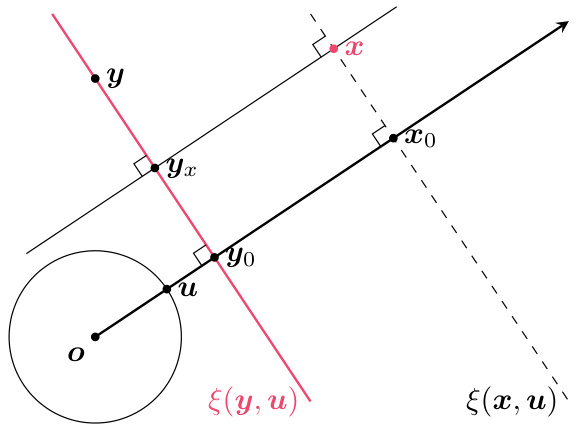
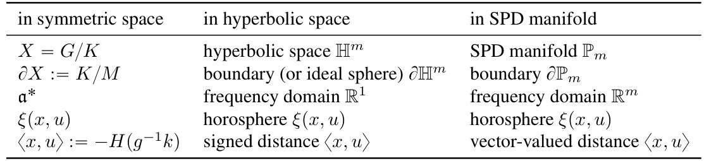
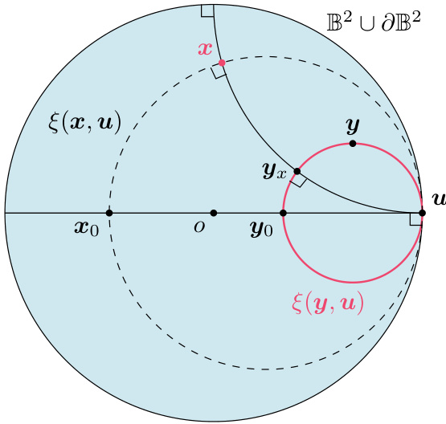

# Fully-Connected Network on Noncompact Symmetric Space and Ridgelet Transform based on Helgason-Fourier Analysis  

Sho Sonoda 1 Isao Ishikawa 2 1 Masahiro Ikeda  

# Abstract  

Neural network on Riemannian symmetric space such as hyperbolic space and the manifold of symmetric positive definite (SPD) matrices is an emerging subject of research in geometric deep learning. Based on the well-established framework of the Helgason-Fourier transform on the noncompact symmetric space, we present a fullyconnected network and its associated ridgelet transform on the noncompact symmetric space, covering the hyperbolic neural network (HNN) and the SPDNet as special cases. The ridgelet transform is an analysis operator of a depth-2 continuous network spanned by neurons, namely, it maps an arbitrary given function to the weights of a network. Thanks to the coordinate-free reformulation, the role of nonlinear activation functions is revealed to be a wavelet function. Moreover, the reconstruction formula is applied to present a constructive proof of the universality of finite networks on symmetric spaces.  

representation learning, such as the hyperbolic space and the manifold of symmetric positive definite (SPD) matrices, or the SPD manifold. On those spaces, several neural networks have been developed such as hyperbolic neural networks (HNNs) and SPDNets .  

Neural Network on Hyperbolic Space. The hyperbolic space is a symmetric space with a constant negative curvature. Following the success of Poincar e embedding ( Krioukov et al. ,2010 ;Nickel & Kiela ,2017 ;2018 ;Sala et al. ,2018 ), the hyperbolic space has been recognized as an effective space for embedding tree-structured data; and hyperbolic neural networks (HNNs) ( Ganea et al. ,2018 ;Gulcehre et al. ,2019 ;Shimizu et al. ,2021 ) have been developed to promote effective use of hyperbolic geometry for saving parameters against Euclidean counterparts. The previous studies such as HNN ( Ganea et al. ,2018 ) and $\mathrm{HNN++}$ (Shimizu et al. ,2021 ) have replaced each operation with gyrovector calculus, but there are still rooms for arguments such as on the expressive power of the proposed network and on the role of nonlinear activation functions.  

# 1. Introduction  

Geometric deep learning is an emerging research direction that aims to devise neural networks on non-Euclidean spaces (Bronstein et al. ,2021 ). In this study, we focus on devising a fully-connected layer on a noncompact symmetric space $X=G/K$ (Helgason ,1984 ;2008 ). In general, it is more challenging to devise a fully-connected layer on a manifold than to devise a convolution layer because neither the scalar product, bias translation, nor pointwise activation can be trivially defined. A noncompact symmetric space is a Riemannian manifold $X$ with nonpositive curvature, as well as a homogeneous space $G/K$ of Lie groups $G$ and $K$ . It covers several important spaces in the recent literature of Neural Network on SPD Manifold. The SPD manifold equipped with the standard Riemannian metric has nonconstant nor nonpositive curvature. The metric is isomorphic to the Fisher information metric for multivariate centered normal distributions. Since covariance matrices are positive definite, the SPD manifold has been investigated and applied in a longer and wider literature than the hyperbolic space. Besides, the SPD manifold has also attracted attention as a space for graph embedding ( Lopez et al. ,2021 ;Cruceru et al. ,2021 ). To reduce the computational cost without harming the Riemannian geometry, several distances have been proposed such as the affine-invariant Riemannian metric (AIRM) ( Pennec et al. ,2006 ), the Stein metric ( Sra ,2012 ), the Bures–Wasserstein metric ( Bhatia et al. ,2019 ), the Log-Euclidean metric ( Arsigny et al. ,2006 ;2007 ), and the vector-valued distance ( Lopez et al. ,2021 ). Furthermore, neural networks on SPD manifolds have been developed, such as SPDNet ( Huang & Gool ,2017 ;Dong et al. ,2017 ;Gao et al. ,2019 ;Brooks et al. ,2019b ;a ), deep manifold-tomanifold transforming network (DMT-Net) ( Zhang et al. ,2018 ), and ManifoldNet ( Chakraborty et al. ,2018 ;2022 ).  

Although those networks are aware of underlying geometry, except for a universality result on horospherical HNNs by Wang (2021 ), previous studies lack theoretical investigations, such as on the expressive power and on the effect of nonlinear activation functions. The purpose of this study is to define a fully-connected layer on a noncompact symmetric space in a unified manner from the perspective of harmonic analysis on symmetric space, and derive an associated ridgelet transform —an analysis operator that maps a function $f$ on $X$ to the weight parameters, written $\gamma$ , of a network. In the end, the ridgelet transform is given as a closed-form expression , the reconstruction formula further elicits a constructive proof of the universality of finite models, and the role/effect of an activation function will be understood as a wavelet function.  

Harmonic Analysis on Symmetric Space. The HelgasonFourier transform has been introduced in ( Helgason ,1965 )as a Fourier transform on the noncompact symmetric space $X$ . This is an integral transform of functions $f$ on $X$ with respect to the eigenfunctions of the Laplace-Beltrami operator $\Delta_{X}$ on $X$ . We refer to Helgason (1984 , Introduction) and Helgason (2008 , Ch.III) for more details.  

The Integral Representation $S[\gamma](x)$ on Euclidean Space is an infinite-dimensional linear representation of a depth-2 fully-connected neural network, given by the following integral operator: For every $\pmb{x}\in\mathbb{R}^{m}$ ,  

$$
S[\gamma](\pmb{x})=\int_{\mathbb{R}^{m}\times\mathbb{R}}\gamma(\pmb{a},b)\sigma(\pmb{a}\cdot\pmb{x}-b)\mathrm{d}\pmb{a}\mathrm{d}b.
$$  

Here, each function $\mathbf{\sigma}\cdot\mathbf{x}\mapsto\sigma(\mathbf{a}\cdot\mathbf{x}\!-\!b)$ represents a single neuron, or a feature map of input $\textbf{\em x}$ parametrized by $\scriptstyle(a,\,b)$ . The integration over are assigned in advance, and thus $(\pmb{a},\pmb{b})$ implies that all the possible neurons $S[\gamma]$ can be understood as a continuous neural network . We note, however, that if we take $\gamma$ to be a finite sum of Dirac’s measures such as $\begin{array}{r}{\gamma_{p}:=\sum_{i=1}^{p}c_{i}\delta_{({a}_{i},{b}_{i})}}\end{array}$ also exactly reproduce a finite model: For every “, then the integral represe $\pmb{x}\in\mathbb{R}^{m}$ Pan ,  

$$
S[\gamma_{p}]({\pmb x})=\sum_{i=1}^{p}c_{i}\sigma({\pmb a}_{i}\cdot{\pmb x}-b_{i}).
$$  

In summary, $S[\gamma]$ is a mathematical model of shallow neural networks with any width ranging from finite to infinite.  

The Ridgelet Transform $R[f;\rho](\mathbf{a},b)$ is a right inverse (or pseudo-inverse) operator of the integral representation operator $S$ . For the Euclidean neural network given in (1 ),the ridgelet transform is given as a closed-form expression :For every $(\mathbf{a},b)\in\mathbb{R}^{m}\times\mathbb{R}.$ ,  

$$
R[f;\rho]({\pmb a},{\boldsymbol b}):=\int_{\mathbb{R}^{m}}f({\pmb x})\overline{{\rho({\pmb a}\cdot{\pmb x}-b)}}\mathrm{d}{\pmb x}.
$$  

Her $f:\mathbb{R}^{m}\rightarrow\mathbb{C}$ is a target function to be approximated, and $\rho:\mathbb{R}\rightarrow\mathbb{C}$ Ñis an auxiliary function, called the ridgelet function . Under mild conditions, the reconstruction formula  

$$
S[R[f;\rho]]=((\sigma,\rho))f,
$$  

holds, where $((\cdot,\cdot))$ denote a scalar product of $\sigma$ and $\rho$ given by a weighted inner-product in the Fourier domain as  

$$
\left((\sigma,\rho)\right):=(2\pi)^{m-1}\int_{\mathbb{R}}\sigma^{\sharp}(\omega)\overline{{\rho^{\sharp}(\omega)}}|\omega|^{-m}\mathrm{d}\omega,
$$  

where ¨7 denotes the Fo ansform in $b\in\mathbb{R}$ . Therefore, as long as the product pp $((\sigma,\rho))$ qq is neither 0 nor $\infty$ , we can normalize $\rho$ to satisfy $((\sigma,\rho))=1$ so that $S[R[f;\rho]]=f$ .  

In other words, $R$ and $S$ are analysis and synthesis operators, and thus play the same roles as the Fourier $(F)$ and inverse Fourier $(F^{-1})$ transforms respectively, in the sense that the reconstruction formula $S[R[f;\rho]]=((\sigma,\rho))f$ esponds to the Fourier inversion formula meanwhile, different from the case of the Fourier transform, $F^{-1}[F[f]]\,=\,f$ rrss “ . In the there are infinitel many different $\rho$ ’s satisfying $((\sigma,\rho))=1$ .This means that Ris not strictly an inverse operator to S,which is unique if it exists, but a right inverse operator, indicating that $S$ has a nontrivial null space. Sonoda et al. (2021b ) have revealed that the null space is spanned by the ridgelet transforms $R[\,\cdot\,;\rho_{0}]$ with degenerated ridgelet functions satisfying parameter distribution $((\sigma,\rho_{0}))~=~0$ $\gamma$ satisfying $S[\gamma]=f$ . This means that any can always be represented as (not always single but) a linear combination of ridgelet transforms.  

Despite the common belief that neural network parameters are a blackbox, the closed-form expression of ridgelet transform (2 )clearly describes how the network parameters are organized, which is a clear advantage of the integral representation theory. Furthermore, the integral representation theory can deal with a wide range of activation functions without any modification, not only ReLU but all the tempered distribution $S^{\prime}(\mathbb{R})$ (see, e.g., Sonoda & Murata ,2017 ).  

Relations between Continuous and Finite Models. (1) The relation between a general continuous model $\int\gamma(v)\sigma(v,x)\mathrm{d}v$ ith a general feature map $x\mapsto\sigma(v,x)$ well investigated in the parametrized by vnd the finite model Maurey-Jones-Barron (MJB) the$\textstyle\sum_{i=1}^{p}c_{i}\sigma(v_{i},x)$ “qis ory , claiming the $L^{p}$ -density of finite models in the space of continuous models (see, e.g., Kainen et al. ,2013 ). The density is fundamental to show that a certain property of finite models is preserved when the model is extended to a continuous model, so that we can concentrate on investigating the continuous model instead of the finite model. (2) In addition, Sonoda et al. (2021a ) have shown that the parameter distribution of a finite model trained by regularized empirical risk minimization (RERM) converges to a certain unique ridgelet spectrum $R[f;\sigma_{*}]$ with special $\sigma_{*}$ in an over-parametrized regime. This means that we can understand the parameters at local minima to be a finite approximation of the ridgelet transform, and thus we can investigate the ridgelet transform to study the minimizer of the learning problem.  

Historical Overview. The idea of the integral representation first emerged in the 1990s to investigate the expressive power of infinitely-wide shallow neural networks ( Irie & Miyake ,1988 ;Funahashi ,1989 ;Carroll & Dickinson ,1989 ;Ito ,1991 ;Barron ,1993 ), and the original ridgelet transform is discovered independently by Murata (1996 ), Cand es (1998 ) and Rubin (1998 ). In the context of sparse signal processing, ridgelet analysis has been developed as a multidimensional counterpart of wavelet analysis ( Donoho ,2002 ;Starck et al. ,2010 ;Kutyniok & Labate ,2012 ;Kostadinova et al. ,2014 ). In the context of deep learning theory, continuous models have been employed in the so-called mean-field theory to show the global convergence of the SGD training of shallow ReLU networks ( Nitanda & Suzuki ,2017 ;Mei et al. ,2018 ;Rotskoff & Vanden-Eijnden ,2018 ;Chizat & Bach ,2018 ;Sirignano & Spiliopoulos ,2020 ;Suzuki ,2020 ), and new ridgelet transforms for ReLU networks have been developed to investigate the expressive power of ReLU networks ( Sonoda & Murata ,2017 ), and to establish the representer theorem for ReLU networks ( Savarese et al. ,2019 ;Ongie et al. ,2020 ;Parhi & Nowak ,2020 ;Unser ,2019 ).  

# Contributions of This Study  

One of the major shortcomings of conventional ridgelet analysis has been that the closed-form expression like (2 )is known only for the case of Euclidean network: $\sigma({\pmb a}\cdot{\pmb x}-b)$ .In this study, we explain a natural way to find the ridgelet transform via the Fourier expression, then obtain a series of new ridgelet transforms for noncompact symmetric space $X=G/K$ in a unified manner by replacing the EuclideanFourier transform with the Helgason-Fourier transform on noncompact symmetric space. The reconstruction formula $S[R[f]]\,=\,f$ can provide a constructive proof of the universal approximation property of finite neural networks on an arbitrary noncompact symmetric space. As far as we have noticed, Wang (2021 ) is the only author who shows the universality of HNNs. Following the classical arguments by Cybenko (1989 ), her proof is based on the Hahn-Banach theorem. As a result, it is simple but non-constructive. On the other hand, our results (1) are more informative because of the constructive nature, (2) cover a wider range of spaces, i.e., any noncompact symmetric space $X=G/K$ , and (3) cover a wider range of nonlinear activation functions, i.e., any tempered distribution $\sigma\in{\mathcal{S}}^{\prime}(\mathbb{R})$ , without any modification.  

Remarks for Avoiding Potential Confusions. As clarified in the discussion, the HNNs devised in this study is the same as the one investigated by Wang (2021 ), but different from the ones proposed by Ganea et al. (2018 ) and Shimizu et al. (2021 ). Both HNNs can be regarded as extensions of the Euclidean NN (ENN), but as a hyperbolic counterpart of the Euclidean hyperplane, Wang (2021 ) and we employed the horosphere , while Ganea et al. (2018 ) and Shimizu et al. (2021 ) employed the set of geodesics , called the Poincar ehyperplane . As a consequence, our main results do cover our horospherical HNN , but do not cover their geodesic HNNs . Yet, we conjecture that the proof technique can be applied for those geodesic HNNs. On the other hand, the SPDNet devised in this study is essentially the same as the ones proposed in previous studies ( Huang & Gool ,2017 ;Dong et al. ,2017 ;Gao et al. ,2019 ;Brooks et al. ,2019b ;a ).  

We further remark that the so-called “equivalence between convolutional networks and fully-connected networks” (e.g. Petersen & Voigtlaender ,2020 ) can hold only when networks are carefully designed (e.g., when $X$ is a finite set). While a c $X$ is a binary operatio $f*g$ of functions $f,g\;:\;X\;\rightarrow\;\mathbb{R}$ Ñ, a sc uct on Xis a binary operation $\langle x,y\rangle$ of points $x,y\in X$ P, and there are no canonical rules to identify functions and points in general. Moreover, there are no canonical scalar-products for points in general manifolds. Therefore, even if we are given a convolutional network on $X$ , we cannot directly translate it as a fully-connected network.  

# Notations  

# $|\cdot|_{E}$ (or simply $|\cdot|)$ denotes the Euclidean norm of $\mathbb{R}^{m}$ .  

$G L(m,\mathbb{R})$ denotes the set of $m\times m$ real regular m , or the general linear group. $O(m)$ denotes the set of $m\times m$ ˆorthogonal matrices, or the orthogon .$D(m),D_{+}(m)$ and $D_{\pm1}(m)$ denote the sets of $m\,\times\,m$ ˆagonal matri$T_{+}(m),T_{1}(m)$ ces with real entries, positive entries, and and $T_{0}(m)$ denote the sets of ˘$\pm1$ $m\times m$ , respectively. upper triangular matrices with positive entries, ones, and zeros on the diagonal, respectively. $\mathbb{P}_{m}$ denotes the set of $m\times m$ symmetric positive definite matrices.  

On a (possibly noncompact) manifold $X$ ,$C_{c}({\cal X})$ denotes the compactly supported continuous functions, $C_{c}^{\infty}(X)$ pqdenotes the compactly supported infinitely differentiable functions, d$L^{2}(X)$ denotes the sq e-integrable functions. When Xis a symmetric space, ${\mathrm{d}}x$ is supposed to be the left-invariant measure.  

For any integer functions (or rapidly decreasing functions) on $d\,>\,0$ ,${\cal S}(\mathbb{R}^{d})$ denotes the Schw R$\mathbb{R}^{d}$ , and z test ${\mathcal{S}}^{\prime}(\mathbb{R}^{d})$ the tempered distributions on $\mathbb{R}^{d}$ (i.e., the topological dual of functions to be tempered distributions $S(\mathbb{R}^{d}))$ ). We eventually set t S$S^{\prime}(\mathbb{R})$ pqss of activation , which covers Figure 1: The Euclidean fully-c d layer $\sigma({\pmb a}\cdot{\pmb x}-b)$ is recast as the signed distance $d(\pmb{x},\pmb{\xi})$ pqfrom a point $\textbf{\em x}$ to a hyperplane $\xi(\boldsymbol{y},\boldsymbol{u})$ d by a wavelet function $\sigma(r\cdot)$ ,where $\textit{\textbf{y}}$ satisfies $r\pmb{y}\cdot\pmb{u}=b$ ¨“and $\xi(\boldsymbol{y},\boldsymbol{u})$ passes through the point $\textit{\textbf{y}}$ with a normal u.  

  

truncated power function ing the step on for k$k=0$ “$\sigma(b)=b_{+}^{k}=\operatorname*{max}\{b,0\}^{k}$ and the rectified linear unit \` “tucover(ReLU) for $k=1$ “. We refer to Grafakos (2008 ); Gel’fand & Shilov (1964 ); Sonoda & Murata (2017 ) for more details on Schwartz distributions and Fourier analysis on them.  

tenti on, we use two symbo ¨7 for the Fourier transforms in the input variable x$x\in$ P$X\ =\ G/K$ “{(or x$\textbf{\em x}\in\mathbb{R}^{m})$ P) and the bias variable b$b\ \in\ \mathbb{R}$ P,$\gamma^{\sharp}(a,\omega)=\int_{\mathbb{R}}\gamma(a,b)e^{-i b{\bar{\omega}}}\mathrm{d}b$ for $\pmb{\xi}\in\mathbb{R}^{m}$ ş,$\rho^{\sharp}(\omega)\;:=\;\int_{\mathbb{R}}\rho(b)e^{-i b\omega}\mathrm{d}{\bar{b}}$ pq“şR${\widehat{f}}(\pmb{\xi})\ :=\ \int_{\mathbb{R}^{m}}f(\pmb{x})e^{-i\pmb{x}\cdot\pmb{\xi}}\mathrm{d}\pmb{x}$ pfor qp$(\mathbf{a},\omega)\in\mathbb{R}^{m}\times\mathbb{R}$ q P şRfor $\omega\,\in\,\mathbb{R}$ pˆq., and  

# 2. Fully-Connected Layer on Euclidean Space  

iew Euclide onnected layer $_{x\mapsto}$ $\sigma({\pmb a}\cdot{\pmb x}-b)$ p¨´qon R$\mathbb{R}^{m}$ , where $\textbf{\em x}\in\mathbb{R}^{m}$ Pis put vector, $(\pmb{a},b)\,\in\,\mathbb{R}^{m}\,\times\,\mathbb{R}$ is hidd ers, $\mathbf{a}\cdot\mathbf{x}$ ¨is the Euclidean scalar product, and $\sigma:\mathbb{R}\rightarrow\mathbb{R}$ Ñis an arbitrary given nonlinear function. In particular, expressions (3 )and (4 )are keys to devise fully connected layer on a symmetric space with a variety of activation function $\sigma$ and to derive the associated ridgelet transform.  

# 2.1. Coordinate-Free Reformulation of Euclidean Fully-Connected Layer  

For any $(\pmb{x},\pmb{u})\in\mathbb{R}^{m}\times\mathbb{S}^{m-1}$ , put  

$$
\xi(\pmb{x},\pmb{u}):=\{\pmb{y}\in\mathbb{R}^{m}\mid\pmb{u}\cdot(\pmb{x}-\pmb{y})=0\},
$$  

the hyperplane passi a point $\pmb{x}\in\mathbb{R}^{m}$ and orthogonal to a unit vector $\pmb{u}\in\mathbb{S}^{m-1}$ P.  

First, we change the parameters in polar coordinates as  

$$
\left(\pmb{a},b\right)=(r\pmb{u},r\pmb{u}\cdot\pmb{y}),\quad(r,\pmb{u},\pmb{y})\in\mathbb{R}_{\geqslant0}\times\mathbb{S}^{m-1}\times\mathbb{R}^{m}.
$$  

We note that the mapping from $\textit{\textbf{y}}$ to $b$ is not injective, but it is rather understood as the mapping from (any representative point of) hyperplane $\xi((b/r){\pmb u},{\pmb u})=\{{\pmb y}\mid r{\pmb u}\cdot{\pmb y}=b\}$ to $b$ .  

Then, the fully-connected layer $\sigma({\pmb a}\cdot{\pmb x}-b)$ is rewritten as  

$$
\begin{array}{r l}&{\boldsymbol{\sigma}(\boldsymbol{\mathbf{\boldsymbol{a}}}\cdot\boldsymbol{\mathbf{\boldsymbol{x}}}-b)=\boldsymbol{\sigma}(r\boldsymbol{\mathbf{\boldsymbol{u}}}\cdot(\boldsymbol{\mathbf{\boldsymbol{x}}}-\boldsymbol{\mathbf{\boldsymbol{y}}}))=\boldsymbol{\sigma}(r d(\boldsymbol{\mathbf{\boldsymbol{x}}},\boldsymbol{\mathbf{\boldsymbol{y}}}_{x}))}\\ &{\qquad\qquad\qquad=\boldsymbol{\sigma}(r d(\boldsymbol{\mathbf{\boldsymbol{x}}},\xi(\boldsymbol{\mathbf{\boldsymbol{y}}},\boldsymbol{\mathbf{\boldsymbol{u}}}))),}\end{array}
$$  

where $d(\pmb{x},\pmb{y}):=\mathrm{sign}(\pmb{x}-\pmb{y})|\pmb{x}-\pmb{y}|_{E}$ denotes the sign Euclidean distance, and $\pmb{y}_{x}$ denotes the closest point to xin the hyperplane $\{\pmb{y}\mid r\pmb{u}\cdot\pmb{y}=b\}$ . Figure 1 illustrates the relations of symbols.  

The last two expressions are coordinate-free, but the final expression (3 )is much appreciated because $\textit{\textbf{y}}$ can be an arbitrary representative point of hyperplane Meanwhile, the scaled nonlinear function $\sigma(r\cdot)$ $\{r\pmb{u}\cdot\pmb{y}=\pmb{b}\}$ is under.stood as a wavelet function, which plays a role of multiscale analysis ( Mallat ,2009 ) such as singularity detection with scale $r$ running from 0 to $\infty$ .  

In summary, a fully-connected layer $\sigma({\pmb a}\cdot{\pmb x}-b)$ is recast as $\sigma\big(r d(\pmb{x},\boldsymbol{\xi})\big)$ “wavelet analysis with respect to a wavel function σon the signed distance $d(\pmb{x},\pmb{\xi})$ between point xand hyperplane $\xi$ .” Since the wavelet transform can detect a point singularity, wavelet analysis on the distance between a point and a hyperplane can detect a singularity in the normal direction to the hyperplane.  

# 2.2. How to Solve $S[\gamma]=f$ and Find $\gamma=R[f]$  

We explain the basic steps to find the parameter distribution $\gamma$ satisfying $S[\gamma]\;=\;f$ . The basic steps is threefold: (Step 1) Turn the network into the Fourier expression ,(Step 2) change variables to split the feature map into useful and junk factors, and (Step 3) put the unknown $\gamma$ the separation-of-variables form to find a particular solution.  

The following procedure is valid, for example, when $\sigma\in$ $S^{\prime}(\mathbb{R}),\rho\in S(\mathbb{R}),f\in L^{2}(\mathbb{R}^{m})$ and $\gamma\in L^{2}(\mathbb{R}^{m}\times\mathbb{R})$ . See Kostadinova et al. (2014 ) and Sonoda & Murata (2017 ) for more details on the valid combinations of function classes.  

Step 1. To begin with, we turn the network into the Fourier expression as below.  

$$
\begin{array}{l}{\displaystyle S[\gamma](\pmb{x}):=\int_{\mathbb{R}^{m}\times\mathbb{R}}\gamma(\pmb{a},b)\sigma(\pmb{a}\cdot\pmb{x}-b)\mathrm{d}\pmb{a}\mathrm{d}b}\\ {\displaystyle=\int_{\mathbb{R}^{m}}\big[\gamma(\pmb{a},\cdot)\ast_{b}\sigma\big](\pmb{a}\cdot\pmb{x})\mathrm{d}\pmb{a}}\\ {\displaystyle=\frac{1}{2\pi}\int_{\mathbb{R}^{m}\times\mathbb{R}}\gamma^{\sharp}(\pmb{a},\omega)\sigma^{\sharp}(\omega)e^{i\omega\pmb{a}\cdot\pmb{x}}\mathrm{d}\pmb{a}\mathrm{d}\omega.}\end{array}
$$  

Here, $\ast_{b}$ denotes the convolution in $b$ ; and the last equation $\begin{array}{r}{\phi(b)\,=\,\frac{1}{2\pi}\int_{\mathbb{R}}\phi^{\sharp}(\omega)e^{i\bar{\omega}b}\mathrm{d}\omega}\end{array}$ follows from the identity (i.e., the Fourier inversion formula) şwith $\phi(b)\,=\,[\gamma({\pmb a},\cdot)*_{b}\sigma](b)$ and $b=\mathbf{a}\cdot\mathbf{x}$ “¨.  

$\sigma^{\sharp}(\omega)e^{i\omega{\pmb a}\cdot{\pmb x}}$ with Step 2. $\mathrm{d}\pmb{a}\mathrm{d}\omega=|\omega|^{-m}\mathrm{d}\pmb{\xi}\mathrm{d}\omega$ “ | split into useful and junk factors as |so that the modified feature map e variables $({\bf a},\omega)\;=\;(\xi/\omega,\omega)$  

$$
=\frac{1}{2\pi}\int_{\mathbb{R}}\left[\int_{\mathbb{R}^{m}}\gamma^{\sharp}(\pmb{\xi}/\omega,\omega)e^{i\pmb{\xi}\cdot\mathbf{x}}\mathrm{d}\pmb{\xi}\right]\sigma^{\sharp}(\omega)|\omega|^{-m}\mathrm{d}\omega.
$$  

Step 3. inversion with respect to Finally, since inside the bracket $\xi$ , it is natural to put $[\cdot\cdot\cdot]$ is the Fourier $\gamma$ to be a separation-of-variables expression  

$$
\gamma_{f,\rho}^{\sharp}({\pmb\xi}/\omega,\omega):=\widehat{f}({\pmb\xi})\overline{{\rho^{\sharp}(\omega)}},
$$  

with the given function $f\in L^{2}(\mathbb{R}^{m})$ and an arbitrary function $\rho\in S(\mathbb{R})$ . Then, we have  

$$
\begin{array}{r l}{S[\gamma_{f,\rho}](\pmb{x})=((\sigma,\rho))\frac{1}{(2\pi)^{m}}\displaystyle\int_{\mathbb{R}^{m}}\widehat{f}(\pmb{\xi})e^{i\pmb{\xi}\cdot\pmb{x}}\mathrm{d}\pmb{\xi}\mathrm{d}\omega}&{}\\ {=((\sigma,\rho))f(\pmb{x}),}&{}\end{array}
$$  

where we put  

$$
\left((\sigma,\rho)\right):=(2\pi)^{m-1}\int_{\mathbb{R}}\sigma^{\sharp}(\omega)\overline{{\rho^{\sharp}(\omega)}}|\omega|^{-m}\mathrm{d}\omega.
$$  

In other words, the separation-of-variables expression $\gamma_{f,\rho}$ is a particu he integral equation $S[\gamma]=c f$ with factor $c=((\sigma,\rho))\in\mathbb{C}$ “ pp qq P .  

In the end, $\gamma_{f,\rho}$ turns out to be the ridgelet transform: The Fourier inversion of $\gamma_{f,\rho}^{\sharp}({\pmb a},\omega)=\widehat{f}(\omega{\pmb a})\overline{{\rho^{\sharp}(\omega)}}$ pis calculated as  

$$
\begin{array}{r l}&{\gamma_{f,\rho}(\pmb{a},b)=\displaystyle\frac{1}{2\pi}\int_{\mathbb{R}}\widehat{f}(\omega\pmb{a})\overline{{\rho^{\sharp}(\omega)e^{-i\omega b}}}\mathrm{d}\omega}\\ &{\qquad\qquad=\displaystyle\frac{1}{2\pi}\int_{\mathbb{R}^{m}\times\mathbb{R}}f(\pmb{x})\overline{{\rho^{\sharp}(\omega)e^{i\omega(\pmb{a}\cdot\pmb{x}-b)}}}\mathrm{d}\omega}\\ &{\qquad\qquad=\displaystyle\int_{\mathbb{R}^{m}\times\mathbb{R}}f(\pmb{x})\overline{{\rho(\pmb{a}\cdot\pmb{x}-b)}}\mathrm{d}\pmb{x},}\end{array}
$$  

which is exactly the definition of the ridgelet transform $R[f;\rho]$ .  

In conclusion, the separation-of-variables expression (5 )is the way to naturally find the ridgelet transform. We note that Steps 1 and 2 to obtain (4 )can be understood as the change-of-frame from the neurons $\sigma(\pmb{a}\cdot\pmb{x}-b)\mathrm{d}\pmb{a}\mathrm{d}b$ , which we are less familiar with, to the tensor product of a plane wave and a junk: $e^{i\pmb{\xi}\cdot\pmb{x}}\mathrm{d}\pmb{\xi}\otimes\sigma^{\sharp}(\omega)|\omega|^{-m}\mathrm{d}\omega$ much familiar with. Hence, the map is understood to be the associated transformation of the $\gamma({\pmb a},b)\mapsto\gamma^{\sharp}(\xi/\omega,\omega)$ pq ÞÑ p{qcoefficient $\gamma$ .  

# 3. Harmonic Analysis on Noncompact Symmetric Space  

Readers may skip the first subsection, $\S\ 3.1$ , by understanding general notations in symmetric space $X$ as specific ones  

in the hyperbolic space or the SPD manifold as listed in Table 1 .  

# 3.1. Noncompact Riemannian Symmetric Space  

We follow the notation by Helgason (2008 , Ch. II) except for the cases. For example, w assign $\begin{array}{r}{\dot{\mathbf{\Omega}}u\in\partial X^{\bullet}}\end{array}$ instead of “ ${}^{\bullet}b\in B^{\bullet}$ P” for the boundary of X, since bis assigned for the bias in a fully-connected layer in this study.  

Let $G$ be a connected semisimple Lie group with finite center, and let $G=K A N$ be its Iwasawa decompositi Namely, it is a unique diffeomorphic decomposition of Ginto subgroups $K,A$ ,and $N$ , where $K$ is maximal compact, $A$ is maximal abelian, and $N$ is maximal nilpotent. For example, when $G=G L(m,\mathbb{R})$ (general linear group), then $K=O(m)$ (orthogonal group), $A=D_{+}(m)$ (all positive diagonal matrices), and $N\,=\,T_{1}(m)$ (all upper triangular matrices with ones on the diagonal).  

Let $\mathrm{d}g,\mathrm{d}k,\mathrm{d}a$ ,and $\mathrm{d}n$ be left $G$ -invariant measures on $G,K,A$ ,and $N$ respectively. Following Helgason (1984 ,Proposition 5.1, Ch. I), we normalize the measures so that $\int_{K}\mathrm{d}k=1$ , and  

$$
\begin{array}{r l r}{\lefteqn{\int_{G}f(g)\mathrm{d}g=\int_{K A N}f(k a n)e^{2\varrho\log a}\mathrm{d}k\mathrm{d}a\mathrm{d}n}}\\ &{}&{=\int_{N A K}f(n a k)e^{-2\varrho\log a}\mathrm{d}n\mathrm{d}a\mathrm{d}k}\\ &{}&{=\int_{A N K}f(a n k)\mathrm{d}a\mathrm{d}n\mathrm{d}k,}\end{array}
$$  

for any $f\in C_{c}(G)$ , with a constant $\varrho\in{\mathfrak{a}}^{*}$ defined below.  

Let ${\mathfrak{g}},{\mathfrak{k}},{\mathfrak{a}}$ ,and $\mathfrak{n}$ be the Lie algebras of $G,K,A$ ,and $N$ respectively. By a fundamental property of abelian Lie algebra, both $\mathfrak{a}$ and its dual ${\mathfrak{a}}^{*}$ are the same dimensional vector spaces, and thus they can be identified with ${\mathbb R}^{r}$ for some $r$ amely ${\mathfrak{a}}=\,{\mathfrak{a}}^{*}=\,\mathbb{R}^{r}$ $r:=\,\dim{\mathfrak{a}}$ the rank of X. For ex when $G=G L(m,\mathbb{R})$ “pq, then ${\mathfrak{g}}=$ ${\mathfrak{g l}}_{m}=\mathbb{R}^{m\times m}$ (all $m\times m$ trices), ${\mathfrak{k}}={\mathfrak{o}}_{m}$ (all skewsymmetric matrices), ${\mathfrak{a}}\,=\,D(m)$ “pq(all diagonal matrices), and ${\mathfrak{n}}=T_{0}(m)$ (all strictly upper triangular matrices).  

Let $X:=G/K$ be a noncompact symmetric space, namely, a Riemannian manifold composed of all the left cosets  

$$
X:=G/K:=\{x=g K\mid g\in G\}.
$$  

Using identity element $e$ of $G$ ,t$o=e K$ be the origin of X. By the construction of X, group Gacts transitively $X$ , and let $g[x]\;:=\;g h K$ (for $x\ =\ h K)$ ) dehe G-action of $g\in G$ on X. Specifically, an t$x\in X$ Let P${\mathrm{d}}x$ denote the left can always be w Gten as -invariant measure on $x=g[o]$ for som X$g\in G$ . FolP.$\textstyle\int_{X}f(x)\mathrm{d}x:=\int_{G}f(g[o])\mathrm{d}g=\int_{A N}f(a n[o])\mathrm{d}a\mathrm{d}n$ lowing the normalization above, we normalize şş${\mathrm{d}}x$ so that for any $f\in C_{c}(X)$ Ppq.  

Table 1: Correspondence of notations in $\boldsymbol{X}=G/K,\mathbb{H}^{m}$ and $\mathbb{P}_{m}$   

  

Let $M:=C_{K}(A):=\{k\in K\mid k a=a k$ for all $a\in A$ ube the centralizer of A in K, and let  

$$
\partial X:=K/M:=\{u=k M\mid k\in K\}
$$  

be the boundary (or ideal sphere) of $X$ , which is known to be a compact manifold. Let $\mathrm{d}u$ denote the uniform probability e on $\partial X$ . For example, when $K=O(m)$ and $A=$ $D_{+}(m)$ \` pq, then $M=D_{\pm1}$ (the group of Kconsisting of diagonal matrices with entries ˘).  

Let  

$$
\Xi:=G/M N:=\{\xi=g M N\mid g\in G\}
$$  

be the space of horospheres. Here, basic horospheres are:   
An $N$ -orbit $\xi_{o}\;:=\;N[o]\;=\;\{n[o]\;\;|\;\;n\;\in\;N\}$ , which is a re passing through the origin $x=o$ with normal   
$u\,=\,e M$ “; and $k a[\xi_{o}]\;=\;k a N[o]$ , whi rosphere   
through point $x\,=\,k a[o]$ with normal u$u\,=\,k M$ “. In fact, can be nted as $\xi(k a n[o],k M)$ since   
$k a N=k a n N$ Ch.I, § 1) and Bartolucci et al. for any $n\in N$ P(. We re 2021 , § 3.5) for more details Helgason (2008 ,  
on the horospheres and boudaries.  

As a consequence of the Iwasawa decomposition, for any $g\in G$ there an $r$ -dim $H(g)\in$ $\mathfrak{a}$ ng $\bar{g}\in\bar{K e}^{\bar{H}(g)}N$ P. For any p$(x,u)=(g[o],k M)\in$ q “ p rsq P $X\times\partial X$ ˆ B , put  

$$
\langle x,u\rangle:=-H(g^{-1}k)\in\mathfrak{a}\cong\mathbb{R}^{r},
$$  

which is understood as the $r$ -dimensional vector-valued stance, called the ce distance , from the origin $o\in$ $X$ to the horosphere $\xi(x,u)$ pqthrough point xwit ormal u. Here, the vector-valued distance means that the $\ell^{2}$ -norm $|d(o,\xi(x,u))|$ coincides with the Riemannian length, that is, . We re son (2008 , Ch.II, § 1, 4) $\left|\langle x,u\rangle\right|\,=$ and Kapovich et al. ($(2017,\mathrm{~\S~}2)$ , § 2) for more details on the vector-valued composite distance.  

Le $\Sigma\subset{\mathfrak{a}}^{*}$ the set of (restricted) roots of $\mathfrak{g}$ with respect to a . For $\alpha\in\Sigma$ P, let ${\mathfrak{g}}_{\alpha}$ denote the correspondi g root ace, and call $m_{\alpha}:=\dim({\mathfrak{g}}_{\alpha})$ the multip in on, i.e. city $\mathfrak{n}=\sum_{\alpha\in\Sigma^{+}}\mathfrak{g}_{\alpha}$ “$\alpha$ ř$\mathfrak{a}^{+}$ ,$\varrho\;:=\;\textstyle\sum_{\alpha\in\Sigma^{+}}\;\textstyle\frac{m_{\alpha}}{2}\alpha\;\in\;\mathfrak{a}^{*}$ where $\Sigma^{+}$ řPis the set of $\alpha\in\Sigma$ P.Let that are positive on Wbe the Weyl group of a $\mathfrak{a}^{+}$ . Put $G/K$ , an let $|W|$ denot ts order. Let $\boldsymbol{c}(\lambda)$ be the HarishChandra c-function for G. We refer to Helgason (1984 ,Theorem 6.14, Ch. IV) for the closed-form expression of the $^c$ -function.  

# 3.2. Helgason-Fourier Transform on Symmetric Space  

For any function $f$ on $X$ , the Helgason-Fourier transform is defined as  

$$
\widehat{f}(\lambda,u):=\int_{X}f(x)e^{(-i\lambda+\varrho)\langle x,u\rangle}\mathrm{d}x,\;(\lambda,u)\in\mathfrak{a}^{*}\times\partial X
$$  

where the exponent action of functional $(-i\lambda+\varrho)\langle x,u\rangle$ $-i\lambda+\varrho\in{\mathfrak{a}}^{*}$ on a vector is unders x$\langle x,u\rangle\in{\mathfrak{a}}$ y P .The inversion formula ( Helgason ,2008 , Theorems 1.3 and 1.5, Ch. III) is given by  

$$
f(x)=\int_{\mathfrak{a}^{*}\times\partial X}\widehat{f}(\lambda,u)e^{(i\lambda+\varrho)\langle x,u\rangle}\frac{\mathrm{d}\lambda\mathrm{d}u}{|W||\pmb{c}(\lambda)|^{2}}.
$$  

e equal holds int $x\,\in\,X$ when $f\,\in$ $\int_{X}\boldsymbol{f}_{1}(x)\overline{{\boldsymbol{f}_{2}(x)}}\mathrm{d}x=\int_{\mathfrak{a}^{*}\times\partial X}\widehat{f}_{1}(\lambda,u)\overline{{\widehat{f}_{2}(\lambda,u)}}\frac{\mathrm{d}\lambda\mathrm{d}u}{|W||c(\lambda)|^{2}}.$ $C_{c}^{\infty}(X)$ lowing Plancherel theorem holds: For any şpq, and in $L^{2}$ when ş$f\in L^{2}(X)$ Ppq. In p $f_{1},f_{2}\in L^{2}(X)$ Pp.q-,The integral kernel $e^{(-i\lambda+\varrho)\zeta x,u\rangle}$ is an $X$ -counterpart of a plane wave $e^{-i\lambda\pmb{u}\cdot\pmb{x}}$ in the Euclidean-Fourier transform $\bar{\int_{\mathbb{R}^{m}}f(\pmb{x})e^{-i\lambda\pmb{u}\cdot\pmb{x}}\mathrm{d}\pmb{x}}$ the plane wave R$e^{-i\lambda\pmb{u}\cdot\pmb{x}}$ (expressed in polar coordinate). While is a joint eigenfunction of all the invariant differential operators (that is, all the polynomials of the Laplacian $\varDelta$ ) on $\mathbb{R}^{m}$ , the $X$ -plane wave $e^{(-i\lambda+\varrho)\langle x,u\rangle}$ is a joint eigenfunction of all the invariant differential operators (e.g., polynomials of the Laplace-Beltrami operator $\varDelta_{X}$ ) on $X$ .In particular, the Plancherel measure $|c(\lambda)|^{-2}\mathrm{d}\lambda\mathrm{d}u$ plays a parallel role to $\lambda^{-m}\mathrm{d}\lambda\mathrm{d}\boldsymbol{u}$ in polar coordinates.  

# 3.3. Poincar´e Ball Model of Hyperbolic Space  

Here, we briefly introduce the Poincar e ball $\mathbb{B}^{m}$ as a Riemannian manifold. In Appendix A , we further explain the homogeneous space aspect of the Poincar e disk $\mathbb{B}^{2}$ . In the following, the boldface such as $\textbf{\em x}$ and $\textbf{\em u}$ emphasizes that the symbols should be understood as the Cartesian coordinates, rather than a point itself on a manifold.  

  

Figure 2: Poincar e disk $\mathbb{B}^{2}$ , boundary $\partial\mathbb{B}^{2}$ , point $\textbf{\em x}$ (magenta), horocycle $\xi(\boldsymbol{y},\boldsymbol{u})$ (magenta) through point $\textit{\textbf{y}}$ tangent to the boundary at u, and two geodesics (solid black) orthogonal to the boundary at $\textbf{\em u}$ through $^o$ and $\textbf{\em x}$ respecvely. The signed composite distance $\langle\boldsymbol{y},\boldsymbol{u}\rangle$ from the origin oto the horocycle $\xi(\boldsymbol{y},\boldsymbol{u})$ can be visualized as the Riemannian distance from oto point $\pmb{y}_{0}$ . Similarly, the distance between point $\textbf{\em x}$ and horocycl $\xi(\boldsymbol{y},\boldsymbol{u})$ is understood as the Riemannian distance between xand $\pmb{y}_{x}$ along the geodesic, or equivalently, $\pmb{x}_{0}$ and $\pmb{y}_{0}$ .  

Let ${\mathbb{B}}^{m}:=\{{\pmb x}\in{\mathbb{R}}^{m}\ |\ |{\pmb x}|_{E}<1\}$ be a Riemannian manifold equipped with metric  

$$
\mathfrak{g}_{x}:=\left(\frac{2}{1-|x|_{E}^{2}}\right)^{2}\sum_{i=1}^{m}\mathrm{d}x_{i}\wedge\mathrm{d}x_{i},\quad x\in\mathbb{B}^{m}.
$$  

This is the Poincar e ball model of $m$ -dimensional hyperbolic space $\mathbb{H}^{m}$ . The Riemannian distance between $\pmb{x},\pmb{y}\in\mathbb{B}^{m}$ is given by  

$$
d_{P}(\pmb{x},\pmb{y})=\cosh^{-1}\left(1+\frac{2|\pmb{x}-\pmb{y}|_{E}^{2}}{(1-|\pmb{x}|_{E}^{2})(1-|\pmb{y}|_{E}^{2})}\right),
$$  

and the Riemannian volume measure at $\pmb{x}\in\mathbb{B}^{m}$ is given by  

$$
\operatorname{d}\operatorname{vol}_{\mathfrak{g}}(\pmb{x})=\left(\frac{2}{1-|\pmb{x}|_{E}^{2}}\right)^{m}\mathrm{d}\pmb{x},
$$  

$\mathbb{R}^{m}\mid\lvert\boldsymbol{u}\rvert_{E}=1\}=\mathbb{S}^{m-1}$ equipped with the uniform spherical measure | | |“u “ ue measure be the boundary (or id ${\mathrm{d}}x$ . Let $\partial\mathbb{B}^{m}:=\left\{\pmb{u}\in\right.$ d${\mathrm{d}}\pmb{u}$ sphere) . Since $\mathbb{H}^{m}$ is rank-one, we identify ${\mathfrak{a}}^{*}\cong\mathbb{R}^{1}$ equipped with the Lebesgue measure.  

In the Poincar e ball model $\mathbb{B}^{m}$ , any boundary point $\textbf{\em u}$ on boundary $\partial\mathbb{B}^{m}$ is infinitely far from any inner point $\textbf{\em x}$ in $\mathbb{B}^{m}$ ; any geodesic is a Euclidean arc that is orthogonal to the boundary $\partial\mathbb{B}^{m}$ ball/sphere in $\mathbb{B}^{m}$ ; and any horosphere is a Euclidean ball that is tangent to the boundary $\partial\mathbb{B}^{m}$ . Hence a horosphere is understood as a “hyperbolic sphere of infinite radius”, and it is identified by two parameters as “a horosp re $\xi(x,\pmb{u})$ passing through $(\pmb{x},\pmb{u})\in\mathbb{B}^{m}\times\partial\mathbb{B}^{m}$ $\textbf{\em x}$ tangent to the boundary at u.” We note that since a hyperplane in the Euclidean space can also be understood as a “Euclidean sphere of infinite radius”, we can understand horospheres as a hyperbolic counterpart of hyperplanes in the Euclidean space.  

The signed co distance $\langle\boldsymbol{x},\boldsymbol{u}\rangle$ from the origin $^o$ to the horosphere $\xi(x,\pmb{u})$ pqis calculated as  

$$
\langle\pmb{x},\pmb{u}\rangle:=d_{P}(\pmb{o},\xi(\pmb{x},\pmb{u}))=d_{P}(\pmb{o},\pmb{x}_{0})=\log\left(\frac{1-|\pmb{x}|_{E}^{2}}{|\pmb{x}-\pmb{u}|_{E}^{2}}\right).
$$  

$\pmb{x}_{0}\;:=\;t\pmb{u}$ for some $|t|<1$ so that $\left(x_{0}\mathrm{~-~}\right)$ $\pmb{x},\pmb{u}-\pmb{x})_{E}=0$ ´q“, i.e., Thales’ theorem.  

The Helgason-Fourier transform and the inversion formula are instantiated as  

$$
\begin{array}{l l l}&{\displaystyle\widehat{f}(\lambda,{\pmb u})=\int_{{\mathbb B}^{m}}f({\pmb x})e^{(-i\lambda+{\varrho})\langle{\pmb x},{\pmb u}\rangle}\left(\frac{2}{1-|{\pmb x}|_{E}^{2}}\right)^{m}\mathrm{d}{\pmb x},}\\ &{f({\pmb x})=\frac{c_{m}^{2}}{2}\int_{{\mathbb R}\times{\mathbb S}^{m-1}}\widehat{f}(\lambda,{\pmb u})e^{(i\lambda+{\varrho})\langle{\pmb x},{\pmb u}\rangle}\frac{\mathrm{d}\lambda\mathrm{d}{\pmb u}}{|{\pmb c}(\lambda)|^{2}},}\end{array}
$$  

for any $(\lambda,\pmb{u})~\in~\mathbb{R}~\times~\mathbb{S}^{m-1}$ and $\textbf{\em x}\in~\mathbb{B}^{m}$ respectively, where $c_{m}^{2}\ =\ 2^{2\varrho}/(2\pi\,\mathrm{vol}(\mathbb{S}^{m-1})),\varrho\ =\ (m\,-\,1)/2$ “{p qq “ p ´q{ ,and the Plancherel measure |$|c(\lambda)|^{-2}$ pq| is given by  

$$
(2^{k-1}(2k-1)!!)^{-2}\prod_{j=0}^{k-1}(\lambda^{2}+j^{2}),
$$  

when $m=2k+1$ , and  

$$
(2^{k-1}(2k-2)!!)^{-2}\frac{\pi\lambda\operatorname{tanh}(\pi\lambda)}{\lambda^{2}+(1/2)^{2}}\prod_{j=0}^{k-1}\left(\lambda^{2}+\left(\frac{2j-1}{2}\right)^{2}\right),
$$  

when $m=2k$ .  

# 4. Fully-Connected Layer on Symmetric Space  

We define the fully-connected layer on the noncompact symmetric space, present the associated ridgelet transform and reconstruction formula, and finally state the $c c$ -universality of finite networks.  

# 4.1. Network Definition  

In accordance with the geometric perspective, it is natural to define the network as below.  

Definition 4.1. Let $\sigma:\mathbb{R}\rightarrow\mathbb{C}$ be a measurable function. For any function $\gamma:{\mathfrak{a}}^{*}\times{\partial}X\times\mathbb{R}\to\mathbb{C}.$ , the continuous neural network on the symmetric space Xis given by  

$$
S[\gamma](x)
$$  

$$
:=\int_{\mathfrak{a}^{\ast}\times\partial X\times\mathbb{R}}\gamma(a,u,b)\sigma(a\langle x,u\rangle-b)e^{\varrho\langle x,u\rangle}\mathrm{d}a\mathrm{d}u\mathrm{d}b.
$$  

Here, we call $x\in X$ the input, $a\in{\mathfrak{a}}^{*}$ the scale, $u\,\in\,\partial X$ the normal (of horosphere), and $b\in\mathbb{R}$ Pthe bias. $\varrho\in{\mathfrak{a}}^{*}$ is a constant vector depending on $G/K$ .  

$y\in X$ $a\langle y,u\rangle=b$ , then we can rewrite $a\langle x,u\rangle-b$ an xX-counterpart of the coordinate-free expression y ´ as $a d(x,\xi(y,u))$ ppqq , which can be understood as (3 ). For technical reasons (i.e., for connecting the Helgason-Fourier transform), we impose an auxiliary weight $e^{\bar{\varrho}\left\langle x,u\right\rangle}$ .  

# 4.2. Ridgelet Transform  

Definition 4.2. Let $\rho:\mathbb{R}\rightarrow\mathbb{C}$ and $f:X\to\mathbb{C}$ be measurable functions. Put  

$$
\begin{array}{l l}{\displaystyle R[f;\rho](a,u,b):=\int_{X}c[f](x)\overline{{\rho(a\langle x,u\rangle-b)}}e^{\varrho\langle x,u\rangle}\mathrm{d}x,}\\ {\displaystyle c[f](x):=\int_{\mathfrak{a}^{\ast}\times\diamond{\partial X}}\widehat{f}(\lambda,u)e^{(i\lambda+\varrho)\langle x,u\rangle}\frac{\mathrm{d}\lambda\mathrm{d}u}{|W||c(\lambda)|^{4}},}\\ {\displaystyle((\sigma,\rho)):=\frac{|W|}{2\pi}\int_{\mathbb R}\sigma^{\sharp}(\omega)\overline{{\rho^{\sharp}(\omega)}}|\omega|^{-r}\mathrm{d}\omega.}\end{array}
$$  

$\hat{f}(\lambda,u)|c(\lambda)|^{-2}$ p$c[f]$ q| pq| .ned as a multiplier satisfying $\widehat{\mathbf{\Phi}_{c[f](\lambda,u)}}=$ rsp q “  

# 4.3. Reconstruction Formula  

Theorem 4.3 (Reconstruction Formula on Symmetric Space).Let $X=G/K$ defined as above. Let $\sigma\in S^{\prime}(\mathbb{R}),\rho\in S(\mathbb{R})$ PSpqPSpq. Then,  

$$
\begin{array}{r l}&{S[R[f;\rho]](x)}\\ &{\,=\displaystyle\int_{\mathfrak{a}^{\ast}\times\partial X\times\mathbb{R}}R[f;\rho](a,u,b)\sigma(a\langle x,u\rangle-b)e^{\varrho\langle x,u\rangle}\mathrm{d}a\mathrm{d}u\mathrm{d}b}\\ &{\,=\displaystyle((\sigma,\rho))f(x),}\end{array}
$$  

he equa holds oint $x\in X$ when $f\,\in$ $C_{c}^{\infty}(X)$ pq, and in $L^{2}$ when $f\in L^{2}(X)$ Ppq.  

The proof is given in Appendix B.1 , which is parallel to $\S\ 2.2$ .  

As a result, while the Euclidean ridgelet transform is a scalar product of function $f({\pmb x})$ and co-feature map $\rho({\pmb a}\!\cdot\!{\pmb x}\!-\!\boldsymbol b)$ , we revealed that the ridgelet transform on a symmetric space $X$ is a scalar product of function $f$ and co-feature map $\rho(a\langle x,u\rangle-b)$ wit ry weights $e^{\varrho\left\langle x,u\right\rangle}$ in data domain Xand |$|c(\lambda)|^{-2}$ pq| in the Fourier domain $\mathfrak{a}^{*}\times\partial X$ ˆB .In geometric deep learning, it has been an open question how to naturally form late the affine m p$\mathbf{a}\cdot\mathbf{x}-b$ and elementwise activation σfor each point xon a manifold without depending on the specific choice of coordinates. From the perspective of harmonic analysis on the symmetric space, wer is to embed the data $x\in X$ into the flat space ${\mathfrak{a}}=\mathbb{R}^{r}$ “via the vector-valued composite distance $\langle x,u\rangle$ .  

# 4.4. $c c$ -Universality  

By discretizing the reconstruction formula $S[R[f;\rho]]=f$ ,we can construct a finite network $f_{n}$ that approximates an arbitrary given function $f$ . This is the primitive idea behind the constructive proof of the following $c c$ -universality.  

Let $\Delta_{\theta}^{n}$ be a forward difference operator with difference $\theta~>~0$ , defined by $\Delta_{\theta}^{1}[\sigma](t)~:=~\sigma(t~+~\theta)~-~\sigma(t)$ rsp q“p\` q ´ pqand $\Delta_{\theta}^{n+1}[\sigma](t):=\Delta_{\theta}^{1}\circ\Delta_{\theta}^{\bar{n}}\bar{[\sigma]}(t)$ .  

Theorem 4.4 ($c c$ -universality of finite networks on symmetric s hat there exists $k\geqslant0$ and $\theta>0$ such that finite neural networks of the form $\Delta_{\theta}^{k}[\sigma]\in L^{\infty}(\mathbb{R})$ rs P pqand Lipschitz continuous. Then, the  

$$
f_{n}(x)=\sum_{i=1}^{n}c_{i}\sigma(a_{i}\langle x,u_{i}\rangle-b_{i})e^{\varrho\langle x,u_{i}\rangle},\quad x\in X
$$  

are cc -universal, tha y compact set $Z\subset X$ , and continuous function finite networks such that $f\in C(Z)$ P$\|f_{n}-f\|_{C(Z)}\to0$ pq, there exists a sequence of as $n\to\infty$ .  

The proof is given in Appendix B.2 .  

# 5. Examples: HNNs  

We instantiate a continuous (horospherical) hyperbolic neural network (HNN) on the Poincar e ball model $\mathbb{B}^{m}$ . In Appendix C, we further instantiate a continuous neural network on the SPD manifold $\mathbb{P}_{m}$ (SPDNet).  

# 5.1. Continuous HNN  

Definition 5.1. For any $\pmb{x}\in\mathbb{B}^{m}$ , put  

$$
\begin{array}{r l}&{S[\gamma](\pmb{x})}\\ &{:=\displaystyle\int_{\mathbb{R}\times\mathbb{S}^{m-1}\times\mathbb{R}}\gamma(a,\pmb{u},b)\sigma(a\langle\pmb{x},\pmb{u}\rangle-b)e^{\varrho\langle\pmb{x},\pmb{u}\rangle}\mathrm{d}a\mathrm{d}\pmb{u}\mathrm{d}b,}\end{array}
$$  

where $\begin{array}{r}{\langle\pmb{x},\pmb{u}\rangle=\log\frac{1-|\pmb{x}|^{2}}{|\pmb{x}-\pmb{u}|^{2}}}\end{array}$ for any $(\pmb{x},\pmb{u})\in\mathbb{B}^{m}\times\partial\mathbb{B}^{m}$ .We note that the weight function known as the Poisson kernel. $\begin{array}{r}{\exp(\langle\boldsymbol{x},\boldsymbol{u}\rangle)=\frac{1-|\boldsymbol{x}|^{2}}{|\boldsymbol{x}-\boldsymbol{u}|^{2}}}\end{array}$ |´|is Definition 5.2. For any $(a,\pmb{u},b)\in\mathbb{R}\times\mathbb{S}^{m-1}\times\mathbb{R}.$ ,$\begin{array}{r l}&{R[f;\rho](a,{\boldsymbol u},{\boldsymbol b})}\\ &{=\displaystyle\int_{\mathbb{B}^{m}}c[f]({\boldsymbol x})\overline{{\rho(a\langle{\boldsymbol x},{\boldsymbol u}\rangle-b)}}e^{\varrho\langle{\boldsymbol x},{\boldsymbol u}\rangle}\frac{2^{m}\mathrm{d}{\boldsymbol x}}{(1-|{\boldsymbol x}|^{2})^{m}},}\end{array}$ where for any $\pmb{x}\in\mathbb{B}^{m}$ ,$c[f](\pmb{x})=\int_{\mathbb{R}\times\mathbb{S}^{m-1}}\widehat{f}(\lambda,\pmb{u})e^{(i\lambda+\varrho)\langle\pmb{x},\pmb{u}\rangle}\frac{\mathrm{d}\lambda\mathrm{d}\pmb{u}}{\vert W\vert\vert\pmb{c}(\lambda)\vert^{4}}.$  

As a consequence of the general results, the following reconstruction formula holds.  

Corollary 5.3. For any $\sigma\in S^{\prime}(\mathbb{R}),\rho\in S(\mathbb{R}),$ ,  

$$
S[R[f;\rho]]({\pmb x})=((\sigma,\rho))f({\pmb x}),
$$  

where  

$$
((\sigma,\rho)):=\frac{1}{2\pi}\int_{\mathbb{R}}\sigma^{\sharp}(\omega)\overline{{\rho^{\sharp}(\omega)}}|\omega|^{-1}\mathrm{d}\omega,
$$  

where the equali olds a t$x\in\mathbb{B}^{m}$ when $f\in$ $C_{c}^{\infty}(\mathbb{B}^{m})$ pq, and in $L^{2}$ when $f\in L^{2}(\mathbb{B}^{m})$ Ppq.  

# 6. Discussion  

We have devised the fully-connected layer on noncompact symmetric space $X=G/K$ , and presented the closed-form expression of the ridgelet transform. The reconstruction formula $S[R[f]]=f$ is further applied to present a constructive proof of the cc -universality of finite fully-connected networks on $X$ . This is the first universality result that covers a wide range of space $X$ and activation functions $\sigma$ ,associated with a constructive proof in a unified manner. In fact, we do not need to restrict $X$ to be the hyperbolic space or the SPD manifold, nor need to restrict $\sigma$ to be ReLU.  

Parallel to the Euclidean case explained in $\S\,2.1$ , the fullyconnected layer $\sigma(a\langle x,u\rangle\!-\!b)$ on $X$ can also b stood as a wavelet function on a composite distance the point $x$ to a horosphere $\xi$ . To see this, we use the $d(x,\xi)$ pqfrom fact that a set $\xi(x,u)\,:=\,\{y\,\in\,X\,\mid\,\langle x,u\rangle=\langle y,u\rangle\}$ is a horosphere through point xwith normal u. Given a, b and $u$ , put $\xi^{\prime}:=\{y\in X\mid a\langle y,u\rangle=b\}$ . Then, for an arbitrary base point $y\in\xi^{\prime}$ , the horosphere $\xi(y,u)$ is of $\xi^{\prime}$ .Following the notations in Figure 2 , suppose $u=k M$ $\langle x_{0},u\rangle-\langle y_{0},u\rangle=d(x_{0},y_{0})$ let x$x_{0}\in\xi(x,u)$ $y_{0}\,=\,k a_{\xi}[o]$ y ´ x y “ $y_{0}\in\xi^{\prime}$ p$a_{x},a_{\xi}\in A$ q, and thus we have Prespectively. Then, tisfying $x=k a_{x}[o]$ “rs  

$$
\sigma(a\langle x,u\rangle-b)=\sigma(a d(x_{0},y_{0}))=\sigma(a d(x,\xi(y_{0},u))).
$$  

The ordinary wavelet transform can detect/localize a singularity at a point in a signal (see, e.g., Mallat ,2009 ), such as the singularity of signal $f(t)=1/|t|$ at the origin $t=0$ .Hence, a wavelet on a distance $d(x,\xi)$ turns out to be a detector of a sigularity along a horosphere $\xi$ .  

Based on this coordinate-free reformulation, given a family $\Xi$ of geometric objects $\xi\subset X$ , we can d ise a fullyconnected layer on an arbitrary metric space Xas  

$$
S[\gamma](x):=\int_{\mathbb{R}\times\Xi}\gamma(a,\xi)\sigma(a d(x,\xi))\mathrm{d}a\mathrm{d}\xi.
$$  

If we have satisfying the Fourier expression and hopefully obtain the ridgelet $d(x(t),\xi(s))\;=\;t\,-\,s$ ppqpqq “ ´ch as , then we can turn it to $(s,t)\in\mathbb{R}^{m}\,\times\,\mathbb{R}^{m}$ transform.  

Comparison to HNNs. While Wang (2021 ) and we employed a horosphere as the geometric object $\xi$ , the original HNNs ( Ganea et al. ,2018 ;Shimizu et al. ,2021 ) employed not a horosphere but a set $\xi_{g e o.}(x,\pmb{u})$ of geodesics perpendi a normal vector $u\,\in\,\mathbb{S}^{m-1}(\,\subset\,T_{\pmb{x}}\mathbb{B}^{m})$ at a point $\textbf{\em x}\in~\mathbb{B}^{m}$ P, called the Poincar e hyperplane . Since a Euclidean hyperplane can be understood as a set of Euclidean geodesics as well as a Euclidean sphere with infinite radius, both the Poincar e hyperplane and horosphere can be regarded as a hyperbolic counterpart of the Euclidean hyperplane. In fact, there are two types of Radon transform on the hyperbolic space: geodesic and horospherical Radon transforms. We conjecture that both networks can be understood as wavelet analysis on the Radon domain, but the original HNNs are based on the geodesic Radon transform, while ours are based on the horospherical Radon transform.  

One of our reviewers kindly notified us that Yu & De Sa (2022 ) introduced the same weight function $\exp(\langle{\boldsymbol x},{\boldsymbol u}\rangle)$ , or the Poisson kernel, in graph learning by investigating the hyperbolic Laplacian. This is not a coincidence since the Helgason-Fourier transform decomposes function by the eigenfunctions of the Laplace-Beltrami operator on $X$ .  

Comparison to SPDNets. In a higher rank symmetric space, the Riemannian distance is not a complete twopoint invariance, but the vector-valued distance is (see, e.g., Kapovich et al. ,2017 ). Lopez et al. (2021 ) have recently utilized it. The original SPDNets ( Huang & Gool ,2017 ;Dong et al. ,2017 ;Gao et al. ,2019 ;Brooks et al. ,2019b ;a )are composed of the BiMap layer $x\mapsto w^{\top}x w$ or $x\in\mathbb{P}_{m}$ $w^{\top}w=I$ layer $x\,\mapsto\,u^{\top}\operatorname*{max}(0,\lambda-b)u$ thonormal projection matrix p´qvia the spectral decompoalar product, and the ReEig $w\in\mathbb{R}^{m\times k}$ Psatisfying with ReLU. While we applied nonlinear activation sition $x=u^{\top}\lambda u$ “, which extends the pointwise activation $\sigma$ on $\log\lambda(x)\in\mathfrak{a}^{*}\cong\mathbb{R}^{r}$ , the original ReEig layer applied $\sigma$ on $\lambda(x)\in A\cong\mathbb{R}_{+}^{r}$ results to the original formulations. \` . It would be a routine to modify our main  

# Acknowledgements  

The authors are grateful to anonymous reviewers for their valuable comments. This work was supported by JSPS KAKENHI 18K18113, JST CREST JPMJCR2015 and JPMJCR1913, JST PRESTO JPMJPR2125, and JST ACT-X JPMJAX2004.  

# References  

Arsigny, V., Fillard, P., Pennec, X., and Ayache, N. LogEuclidean metrics for fast and simple calculus on diffusion tensors .Magnetic Resonance in Medicine , 56(2): 411–421, 2006. doi: https://doi.org/10.1002/mrm.20965.  

Arsigny, V., Fillard, P., Pennec, X., and Ayache, N. Geometric Means in a Novel Vector Space Structure on Symmetric Positive-Definite Matrices .SIAM Journal on Matrix Analysis and Applications , 29(1):328–347, 2007. doi: 10.1137/050637996. 1   
Barron, A. R. Universal approximation bounds for superpositions of a sigmoidal function .IEEE Transactions on Information Theory , 39(3):930–945, 1993. 3   
Bartolucci, F., De Mari, F., and Monti, M. Unitarization of the Horocyclic Radon Transform on Symmetric Spaces .In De Mari, F. and De Vito, E. (eds.), Harmonic and Applied Analysis: From Radon Transforms to Machine Learning , pp. 1–54. Springer International Publishing, 2021. 6   
Bhatia, R., Jain, T., and Lim, Y. On the Bures–Wasserstein distance between positive definite matrices .Expositiones Mathematicae , 37(2):165–191, 2019. ISSN 0723-0869. doi: https://doi.org/10.1016/j.exmath.2018.01.002. 1   
Bronstein, M. M., Bruna, J., Cohen, T., and Veli ckovi c, P. Geometric Deep Learning: Grids, Groups, Graphs, Geodesics, and Gauges .arXiv preprint: 2104.13478 ,2021. 1   
Brooks, D., Schwander, O., Barbaresco, F., Schneider, J.- Y., and Cord, M. Riemannian batch normalization for SPD neural networks . In Advances in Neural Information Processing Systems 32 , 2019a. 1 ,3 ,9   
Brooks, D. A., Schwander, O., Barbaresco, F., Schneider, J.-Y., and Cord, M. Exploring Complex Time-series Representations for Riemannian Machine Learning of Radar Data . In ICASSP 2019 - 2019 IEEE International Conference on Acoustics, Speech and Signal Processing (ICASSP) , pp. 3672–3676, 2019b. 1 ,3 ,9   
Cand es, E. J. Ridgelets: theory and applications . PhD thesis, Standford University, 1998. 3   
Carroll, S. M. and Dickinson, B. W. Construction of neural nets using the Radon transform . In International Joint Conference on Neural Networks 1989 , volume 1, pp. 607– 611, 1989.3  
Chakraborty, R., Yang, C.-H., Zhen, X., Banerjee, M., Archer, D., Vaillancourt, D., Singh, V., and Vemuri, B. A Statistical Recurrent Model on the Manifold of Symmetric Positive Definite Matrices . In Advances in Neural Information Processing Systems 31 , 2018. 1   
Chakraborty, R., Bouza, J., Manton, J. H., and Vemuri, B. C. ManifoldNet: A Deep Neural Network for ManifoldValued Data With Applications .IEEE Transactions on  

Pattern Analysis and Machine Intelligence, 44(2):799–  

810, 2022. 1   
Chizat, L. and Bach, F. On the Global Convergence of Gradient Descent for Over-parameterized Models using Optimal Transport . In Advances in Neural Information Processing Systems 32 , pp. 3036–3046, 2018. 3   
Cruceru, C., Becigneul, G., and Ganea, O.-E. Computationally Tractable Riemannian Manifolds for Graph Embeddings .Proceedings of the AAAI Conference on Artificial Intelligence, 35(8):7133–7141, 2021.1  
Cybenko, G. Approximation by superpositions of a sigmoidal function .Mathematics of Control, Signals, and Systems (MCSS) , 2(4):303–314, 1989. 3   
Dong, Z., Jia, S., Zhang, C., Pei, M., and Wu, Y. Deep Manifold Learning of Symmetric Positive Definite Matrices with Application to Face Recognition . In Proceedings of the Thirty-First AAAI Conference on Artificial Intelligence , AAAI’17, pp. 4009–4015, 2017. 1 ,3 ,9   
Donoho, D. L. Emerging applications of geometric multiscale analysis .Proceedings of the ICM, Beijing 2002 , I: 209–233, 2002. 3   
Funahashi, K.-I. On the approximate realization of continuous mappings by neural networks .Neural Networks , 2 (3):183–192, 1989. 3   
Ganea, O., Becigneul, G., and Hofmann, T. Hyperbolic Neural Networks . In Advances in Neural Information Processing Systems 31 , 2018. 1 ,3 ,9   
Gao, Z., Wu, Y., Bu, X., Yu, T., Yuan, J., and Jia, Y. Learning a robust representation via a deep network on symmetric positive definite manifolds .Pattern Recognition , 92:1–12, 2019. 1 ,3 ,9   
Gel’fand, I. M. and Shilov, G. E. Generalized Functions, Vol. 1: Properties and Operations . Academic Press, New York, 1964. 4   
Grafakos, L. Classical Fourier Analysis . Graduate Texts in Mathematics. Springer New York, second edition, 2008. 4   
Gulcehre, C., Denil, M., Malinowski, M., Razavi, A., Pascanu, R., Hermann, K. M., Battaglia, P., Bapst, V., Raposo, D., Santoro, A., and de Freitas, N. Hyperbolic Attention Networks . In International Conference on Learning Representations , 2019. 1   
Helgason, S. Radon-Fourier transforms on symmetric spaces and related group representations .Bulletin of the American Mathematical Society , 71(5):757–763, 1965. doi: bams/1183527303. 2   
Helgason, S. Groups and Geometric Analysis: Integral Geometry, Invariant Differential Operators, and Spherical Functions , volume 83 of Mathematical Surveys and Monographs . American Mathematical Society, 1984. 1 ,2 ,5 ,6 ,13   
Helgason, S. Geometric Analysis on Symmetric Spaces: Second Edition , volume 39 of Mathematical Surveys and Monographs . American Mathematical Society, second edition, 2008. 1 ,2 ,5 ,6   
Huang, Z. and Gool, L. V. A Riemannian Network for SPD Matrix Learning . In Proceedings of the Thirty-First AAAI Conference on Artificial Intelligence , AAAI’17, pp. 2036–2042, 2017. 1 ,3 ,9   
Irie, B. and Miyake, S. Capabilities of three-layered perceptrons . In IEEE International Conference on Neural Networks , pp. 641–648, 1988. 3   
Ito, Y. Representation of functions by superpositions of a step or sigmoid function and their applications to neural network theory .Neural Networks , 4(3):385–394, 1991. 3   
Kainen, P. C., K urkov a, V., and Sanguineti, M. Approximating multivariable functions by feedforward neural nets .In Bianchini, M., Maggini, M., and Jain, L. C. (eds.), Handbook on Neural Information Processing , volume 49 of Intelligent Systems Reference Library , pp. 143–181. Springer Berlin Heidelberg, 2013. 2   
Kapovich, M., Leeb, B., and Porti, J. Anosov subgroups: dynamical and geometric characterizations .European Journal of Mathematics , 3(4):808–898, 2017. ISSN 2199- 6768. doi: 10.1007/s40879-017-0192-y. 6 ,9   
Kostadinova, S., Pilipovi c, S., Saneva, K., and Vindas, J. The ridgelet transform of distributions .Integral Transforms and Special Functions , 25(5):344–358, 2014. 3 ,4   
Krioukov, D., Papadopoulos, F., Kitsak, M., Vahdat, A., and Bogu na, M. Hyperbolic geometry of complex networks .Phys. Rev. E , 82(3):36106, 2010. 1   
Kutyniok, G. and Labate, D. Shearlets: Multiscale Analysis for Multivariate Data . Applied and Numerical Harmonic Analysis. Birkh auser Boston, 1 edition, 2012. doi: 10. 1007/978-0-8176-8316-0. 3   
Lopez, F., Pozzetti, B., Trettel, S., Strube, M., and Wienhard, A. Vector-valued Distance and Gyrocalculus on the Space of Symmetric Positive Definite Matrices . In Advances in Neural Information Processing Systems 34 , 2021. 1 ,9   
Mallat, S. A Wavelet Tour of Signal Processing, Third Edition: The Sparse Way . Academic Press, 2009. 4 ,9 Mei, S., Montanari, A., and Nguyen, P.-M. A mean field view of the landscape of two-layer neural networks .Proceedings of the National Academy of Sciences , 115(33): E7665–E7671, 2018. 3 Murata, N. An integral representation of functions using three-layered betworks and their approximation bounds .Neural Networks , 9(6):947–956, 1996. 3 Nickel, M. and Kiela, D. Poincar e Embeddings for Learning Hierarchical Representations . In Advances in Neural Information Processing Systems , volume 30, 2017. 1 Nickel, M. and Kiela, D. Learning Continuous Hierarchies in the Lorentz Model of Hyperbolic Geometry . In Proceedings of the 35th International Conference on Machine Learning , volume 80, pp. 3779–3788, 2018. 1 Nitanda, A. and Suzuki, T. Stochastic Particle Gradient Descent for Infinite Ensembles .arXiv preprint: 1712.05438 ,  
2017. 3 Ongie, G., Willett, R., Soudry, D., and Srebro, N. A Function Space View of Bounded Norm Infinite Width ReLU Nets: The Multivariate Case . In International Conference on Learning Representations , 2020. 3 Parhi, R. and Nowak, R. D. Neural Networks, Ridge Splines, and TV Regularization in the Radon Domain .arXiv preprint: 2006.05626 , 2020. 3 Pennec, X., Fillard, P., and Ayache, N. A Riemannian Framework for Tensor Computing .International Journal of Computer Vision , 66(1):41–66, 2006. ISSN 1573-1405. doi: 10.1007/s11263-005-3222-z. 1 Petersen, P. and Voigtlaender, F. Equivalence of approximation by convolutional neural networks and fullyconnected networks .Proceedings of the American Mathematical Society , 148(4):1567–1581, 2020. doi:   
10.1090/proc/14789. 3 Rotskoff, G. and Vanden-Eijnden, E. Parameters as interacting particles: long time convergence and asymptotic error scaling of neural networks . In Advances in Neural Information Processing Systems 31 , pp. 7146–7155, 2018.   
3 Rubin, B. The Calder on reproducing formula, windowed X-ray transforms, and radon transforms in $L^{p}$ -spaces .Journal of Fourier Analysis and Applications , 4(2):175–   
197, 1998. 3 Sala, F., De Sa, C., Gu, A., and Re, C. Representation Tradeoffs for Hyperbolic Embeddings . In Proceedings of the 35th International Conference on Machine Learning ,volume 80, pp. 4460–4469, 2018. 1   
Savarese, P., Evron, I., Soudry, D., and Srebro, N. How do infinite width bounded norm networks look in function space? In Proceedings of the 32nd Conference on Learning Theory , volume 99, pp. 2667–2690, 2019. 3   
Shimizu, R., Mukuta, Y., and Harada, T. Hyperbolic Neural Networks $^{,++}$ . In International Conference on Learning Representations , 2021. 1 ,3 ,9   
Sirignano, J. and Spiliopoulos, K. Mean Field Analysis of Neural Networks: A Law of Large Numbers .SIAM Journal on Applied Mathematics , 80(2):725–752, 2020. 3   
Sonoda, S. and Murata, N. Neural network with unbounded activation functions is universal approximator .Applied and Computational Harmonic Analysis , 43(2):233–268, 2017. 2 ,3 ,4 ,15   
Sonoda, S., Ishikawa, I., and Ikeda, M. Ridge Regression with Over-Parametrized Two-Layer Networks Converge to Ridgelet Spectrum . In Proceedings of The 24th International Conference on Artificial Intelligence and Statistics (AISTATS) 2021 , volume 130, pp. 2674–2682, 2021a. 2   
Sonoda, S., Ishikawa, I., and Ikeda, M. Ghosts in Neural Networks: Existence, Structure and Role of InfiniteDimensional Null Space .arXiv preprint: 2106.04770 ,2021b. 2 ,15   
Sra, S. A new metric on the manifold of kernel matrices with application to matrix geometric means . In Advances in Neural Information Processing Systems 25 , 2012. 1   
Starck, J.-L., Murtagh, F., and Fadili, J. M. The ridgelet and curvelet transforms . In Sparse Image and Signal Processing: Wavelets, Curvelets, Morphological Diversity , pp. 89–118. Cambridge University Press, 2010. 3   
Suzuki, T. Generalization bound of globally optimal nonconvex neural network training: Transportation map estimation by infinite dimensional Langevin dynamics . In Advances in Neural Information Processing Systems 33 ,pp. 19224–19237, 2020. 3   
Terras, A. Harmonic Analysis on Symmetric Spaces—Higher Rank Spaces, Positive Definite Matrix Space and Generalizations . Springer New York, 2016.17  
Unser, M. A Representer Theorem for Deep Neural Networks .Journal of Machine Learning Research , 20(110): 1–30, 2019. 3   
Wang, M.-X. Laplacian Eigenspaces, Horocycles and Neuron Models on Hyperbolic Spaces . 2021. 2 ,3 ,9   
Yu, T. and De Sa, C. HyLa: Hyperbolic Laplacian Features For Graph Learning .arXiv preprint: 2202.06854 , feb 2022. 9   
Zhang, T., Zheng, W., Cui, Z., and Li, C. Deep Manifoldto-Manifold Transforming Network . In 2018 25th IEEE International Conference on Image Processing (ICIP) ,pp. 4098–4102, 2018. 1  

# A. Poincar´e Disk $D$ as Noncompact Riemannian Symmetric Space  

Following Helgason (1984 , Intro. $\S\ 4$ ), we review the homogeneous space aspect of a hyperbolic space. Note that the Riemannian metric her $\times2^{2}$ $D:=\{z\in\mathbb{C}\mid|z|<1\}$ op k in $\mathbb{C}$ equipped with the Riemannian metric the Euclidean inner oduct in $g_{z}(u,v)\,=\,(u,v)/(1-|z|^{2})^{2}$ pq$\mathbb{R}^{2}$ pLet q{p $\partial D\;:=\;\{u\,\in\,\mathbb{C}\;\mid\,|u|\,=\,1\}$ ´ | |qfor any tangent vectors be the boun $u,v\in T_{z}D$ Py of Dequipped with the uniform $z\in D$ P, where $(\cdot,\cdot)$ denotes probability measure $\mathrm{d}u$ . Namely, Dis the Poincar e disk model of hyperbolic plane H. On this model, the Poincar e metric $z,w\in D$ $d(z,w)\,=\,\operatorname{tanh}^{-1}|(\bar{z}-w)/(1-z w^{*})|$ , and the volume element is given by $\mathrm{d}z=(1-(x^{2}+y^{2}))^{-2}\mathrm{d}x\mathrm{d}y$ “ p ´ p \` qq .  

Consider now the group  

$$
G=S U(1,1):=\left\{\left({\alpha\atop\beta^{*}}\quad\alpha^{*}\right)\bigg|(\alpha,\beta)\in\mathbb{C}^{2},|\alpha|^{2}-|\beta|^{2}=1\right\},
$$  

which acts on $D$ (and $\partial D$ ) by  

$$
g\cdot z:=\frac{\alpha z+\beta}{\beta^{*}z+\alpha^{*}},\quad z\in D\cup\partial D.
$$  

The $G$ -action is transitive, conformal, and maps circles, lines, and the boundary into circles, lines, and the boundary. In addition, consider the subgroups  

$$
\begin{array}{r l}&{K:=S O(2)=\left\{k_{\phi}:=\left(\stackrel{e^{i\phi}}{0}\quad\stackrel{0}{e^{-i\phi}}\right)\left|\phi\in[0,2\pi)\right\},}\\ &{A:=\left\{a_{t}:=\left(\stackrel{\cosh t}{\sinh t}\quad\cosh t\right)\left|t\in\mathbb{R}\right\},}\\ &{N:=\left\{n_{s}:=\left(\stackrel{1+i s}{i s}\quad-i s\right)\bigg|s\in\mathbb{R}\right\},}\\ &{M:=C_{K}(A)=\left\{k_{0}=\left(\begin{array}{l l}{1}&{0}\\ {0}&{1}\end{array}\right),k_{\pi}=\left(\stackrel{-1}{0}\quad\stackrel{0}{-1}\right)\right\}}\end{array}
$$  

The subgroup $K:=S O(2)$ fixes the origin $o\in D$ . So we have the identifications  

$$
D=G/K=S U(1,1)/S O(2),\quad\mathrm{and}\quad\partial D=K/M=\mathbb{S}^{1}.
$$  

del, the following are known (1) that $m\,=\,\dim{\mathfrak{a}}\,=\,1$ ,$|W|=1$ ,$\varrho\,=\,1$ and |$\begin{array}{r}{|c(\lambda)|^{-2}\,=\,\frac{\pi\lambda}{2}\operatorname{tanh}(\frac{\pi\lambda}{2})}\end{array}$ qfor $\lambda\in{\mathfrak{a}}^{*}=\mathbb{R}$ P“angent to the boundary , (2) that the geode B$\partial D$ . Hence, let are the circular arcs perpendicular to the boundary $\xi(x,u)$ denote the cle $\xi$ through B$\partial D$ $x\in D$ Pd (3) that the horocycles are the and tangent to the boundary at $u\in\partial D$ P B ; and let $\langle x,u\rangle$ denote the signed distance from the origin $o\in D$ Pto the horocycle $\xi(x,u)$ .  

$\langle z,u\rangle$ , we use the following he distance from the origin $o$ int $z=r e^{i u}$ $\begin{array}{r}{d(o,z)=\operatorname{tanh}^{-1}|(0-z)/(1-0z^{*})|=\frac{1}{2}\log\frac{1+r}{1-r}.}\end{array}$ be the closest point on the horocycle pq “ |p ´q{p ´q| “ $\xi(z,u)$ to the origin. By definition, ´. Hence, let $c\in D$ Pbe t x$\langle z,u\rangle=d(o,w)$ y “ pq. But we can find the orocycle $\xi(z,u)$ pq, and wvia the $w\in D$ Pcosine rule:  

$$
\cos z o u=\frac{|u|^{2}+|z|^{2}-|z-u|^{2}}{2|u||z|}=\cos z o c=\frac{|z|^{2}+|\frac{1}{2}(1+|w|)|^{2}-|\frac{1}{2}(1-|w|)|^{2}}{2|z||\frac{1}{2}(1+|w|)|},
$$  

which yields the tractable formula:  

$$
\langle z,u\rangle=\frac{1}{2}\log\frac{1+|w|}{1-|w|}=\frac{1}{2}\log\frac{1-|z|^{2}}{|z-u|^{2}},\quad(z,u)\in D\times\partial D.
$$  

# B. Proofs  

# B.1. Theorem 4.3 (Reconstruction Formula)  

Proof. We identify the scale parameter $a\in{\mathfrak{a}}^{*}$ with vector $\mathbf{a}\in\mathbb{R}^{r}$ .  

Step 1. Since $b\in\mathbb{R}$ , the Fourier expression is given by  

$$
\begin{array}{r l r}{\lefteqn{S[\gamma](x):=\int_{\mathbb{R}^{r}\times\partial X\times\mathbb{R}}\gamma(\pmb{a},u,b)\sigma(\pmb{a}\cdot\langle x,u\rangle-b)e^{\varrho\langle x,u\rangle}\mathrm{d}\pmb{a}\mathrm{d}u\mathrm{d}b}}\\ &{}&{=\frac{1}{2\pi}\int_{\mathbb{R}^{r}\times\partial X\times\mathbb{R}}\gamma^{\sharp}(\pmb{a},u,\omega)\sigma^{\sharp}(\omega)e^{(i\omega\pmb{a}+\varrho)\langle x,u\rangle}\mathrm{d}\pmb{a}\mathrm{d}u\mathrm{d}\omega.}\end{array}
$$  

Step 2. ging riables as $({\pmb a},\omega)\,=\,(\lambda/\omega,\omega)$ with $\mathrm{d}\pmb{a}\mathrm{d}\omega\,=\,|\omega|^{-r}\mathrm{d}\lambda\mathrm{d}\omega$ , and identifying the vector $\lambda=$ $(\lambda_{1},\ldots,\lambda_{r})\in\mathbb{R}^{r}$ pq P with $\lambda\in{\mathfrak{a}}^{*}$ P, we have  

$$
S[\gamma](x)=\frac{1}{2\pi}\int_{\mathbb R}\left[\int_{\mathfrak{a}^{\ast}\times\partial X}\gamma^{\sharp}(\lambda/\omega,u,\omega)e^{(i\lambda+\varrho)\langle x,u\rangle}\mathrm{d}\lambda\mathrm{d}u\right]\sigma^{\sharp}(\omega)|\omega|^{-r}\mathrm{d}\omega.
$$  

$|c(\lambda)|^{-2})$ Step 3. , put a separation-of-variables form as Since inside the bracket $[\cdot\cdot\cdot]$ is the inverse Helgason-Fourier transform (excluding the Plancherel measure  

$$
\gamma_{f,\rho}^{\sharp}(\lambda/\omega,u,\omega)=\widehat{f}(\lambda,u)\overline{{\rho^{\sharp}(\omega)}}|{\pmb{c}}(\lambda)|^{-2},
$$  

we have a particular solution:  

$$
S[\gamma_{f,\rho}](x)=\left(\frac{|W|}{2\pi}\int_{\mathbb{R}}\sigma^{\sharp}(\omega)\overline{{\rho^{\sharp}(\omega)}}|\omega|^{-r}\mathrm{d}\omega\right)\left(\int_{\mathfrak{a}^{*}\times\partial X}\widehat{f}(\lambda,u)e^{(i\lambda+\varrho)\langle x,u\rangle}\frac{\mathrm{d}\lambda\mathrm{d}u}{|W||c(\lambda)|^{2}}\right)=((\sigma,\rho))^{r}\mathrm{d}\lambda.
$$  

where we put  

$$
((\sigma,\rho)):=\frac{|W|}{2\pi}\int_{\mathbb{R}}\sigma^{\sharp}(\omega)\overline{{\rho^{\sharp}(\omega)}}|\omega|^{-r}\mathrm{d}\omega.
$$  

Here, the equality holds for every point $x\in X$ when $f\in C_{c}^{\infty}(X)$ q, and in $L^{2}$ when $f\in L^{2}(X)$ .  

In particular, the ridgelet transform is calculated as  

$$
\begin{array}{l}{{R[f;\rho](a,u,b):=\displaystyle\frac{1}{2\pi}\int_{\mathbb R}\gamma_{f,\rho}^{\sharp}(a,u,\omega)e^{i\omega b}\mathrm d\omega}}\\ {{\displaystyle\qquad\qquad\qquad=\frac{1}{2\pi}\int_{\mathbb R}\hat{f}(\omega a,u)|c(\omega a)|^{-2}\overline{{\rho^{\sharp}(\omega)}}e^{i\omega b}\mathrm d\omega}}\\ {{\displaystyle\qquad\qquad\qquad=\frac{1}{2\pi}\int_{\mathbb R\times X}c[f](x)\overline{{\rho^{\sharp}(\omega)}}e^{(-i\omega a+\varrho)\langle x,u\rangle+i\omega b}\mathrm d x\mathrm d\omega}}\\ {{\displaystyle\qquad\qquad\qquad=\int_{X}c[f](x)\overline{{\rho(a\cdot\langle x,u\rangle-b\rangle}}e^{\varrho\langle x,u\rangle}\mathrm d x,}}\end{array}
$$  

where we put $c[f]$ a Helgason-Fourier multiplier satisfying $\widehat{{\pmb{c}[f]}}(\lambda,u)=\widehat{{\pmb{f}}}(\lambda,u)|{\pmb{c}}(\lambda)|^{-2}$ rsp q “ pq| pq| .  

B.2. Theorem 4.4 (cc -Universality)  

Additional Notation. For a function $f$ on a set $X,\|f\|_{C(X)}:=\operatorname*{sup}_{x\in X}|f(x)|$ denotes the uniform norm on $X$ .  

nger $d>0$ and vector $\pmb{v}\in\mathbb{R}^{d}$ ,$|v|$ denotes the Euclidean norm, and x$\langle{\pmb v}\rangle:=\sqrt{1+|{\pmb v}|^{2}}$ y“a . For any positive number $t>0,\triangle^{t/2}$ and $\langle\triangle\rangle^{t}$ denote fractional differential operators defined as Fourier multipliers: for any $\phi\in S^{\prime}(\mathbb{R}^{d})$ ,  

$$
\bigtriangleup^{t/2}[\phi](v):=\frac{1}{(2\pi)^{d}}\int_{\mathbb{R}^{d}}|u|^{t}\widehat{\phi}(u)e^{i u\cdot v}\mathrm{d}u,\quad\bigtriangleup^{t/2}[\phi](v):=\frac{1}{(2\pi)^{d}}\int_{\mathbb{R}^{d}}(1+|u|^{2})^{t/2}\widehat{\phi}(u)e^{i u\cdot v}\mathrm{d}u.
$$  

In particular when $t=2,\triangle^{t/2}$ coincides with the ordinary Laplacian on $\mathbb{R}^{d}$ .  

Proof. We will show that for any com t set $Z\subset X$ , positive number $\varepsilon>0$ , compactly-supported continuous function $f\in C(Z)$ , there exists a finite network $f_{n}$ such that $\|f-f_{n}\|_{C(Z)}<\varepsilon$ .  

Sin to consider the case $\begin{array}{r}{\sum_{i=1}^{n}c_{i}\Delta_{\theta}^{k}[\sigma](a_{i}\langle x,u_{i}\rangle-b_{i})e^{\varrho\langle x,u_{i}\rangle}}\end{array}$ “rs$k\,=\,0$ “. In the following, we assume that is rewritten as anoth $\sigma(=\Delta_{\theta}^{0}[\sigma])$ is bounded and Lipschitz continuous. So, lř$\begin{array}{r}{\sum_{i=1}^{n^{\prime}}c_{i}^{\prime}\sigma(a_{i}^{\prime}\langle x,u_{i}^{\prime}\rangle-b_{i}^{\prime})e^{\varrho\langle x,u_{i}^{\prime}\rangle}}\end{array}$ , it suffice $\langle x,u\rangle$ $\begin{array}{r}{L_{e}:=\operatorname*{sup}_{x\in Z}\operatorname*{sup}_{u,u^{\prime}\in\partial X}|\exp(\varrho\langle x,u\rangle)-\exp(\varrho\langle x,u^{\prime}\rangle)|/d(u,u^{\prime})}\end{array}$ put $M_{\sigma}:=\,\|\sigma\|_{L^{\infty}(\mathbb{R})}$ $C^{\infty}$ P}}pqPB and |$L_{\sigma}\;:=\;\mathrm{Lip}(\sigma)$ “pq. As a consequence of q, and $\begin{array}{r}{L_{c}\,:=\,\operatorname*{sup}_{x\in Z}\operatorname*{sup}_{u,u^{\prime}\in\partial X}|\langle x,u\rangle-\langle x,u^{\prime}\rangle|/d(u,u^{\prime})}\end{array}$ $\begin{array}{r}{M_{e}:=\operatorname*{sup}_{x\in Z,u\in\partial X}\mid\exp(\varrho\langle x,u\rangle)\mid}\end{array}$ “PPB |pxyq| .y|{ pq,  

Step 1 $(f\sim f_{c})$ .By the density of $C_{c}^{\infty}(X)$ $C(Z)$ with respect to e uniform norm, we can take a compactly-supported smooth function $f_{c}\in C_{c}^{\infty}(Z)$ pqsatisfyin $\|f-f_{c}\|_{C(Z)}<\varepsilon/3$ pq. Since $f_{c}$ is sufficiently smooth and integrable, there exists a compactly-supported smooth function $\rho\in C_{c}^{\infty}(\mathbb{R})$ Ppqsuch that  

For example, take a compactly-supported smooth function $\begin{array}{r l r}{\rho_{0}}&{{}\in}&{C_{c}^{\infty}(\mathbb{R})}\end{array}$ q, and put $\begin{array}{r l r}{\rho(b)}&{{}:=}&{\bigtriangleup_{b}^{r/2}[\rho_{0}](b)\quad=}\end{array}$ △“$\begin{array}{r}{\frac{1}{2\pi}\int_{\mathbb{R}}|\omega|^{r}\rho_{0}^{\sharp}(\omega)e^{i b\omega}\mathrm{d}\omega}\end{array}$ $|W|\langle\sigma,\rho_{0}\rangle_{L^{2}(\mathbb{R})}$ |ş|x y. Then, n ordinary functi pp $\begin{array}{r}{((\sigma,\rho))\,=\,\frac{|W|}{2\pi}\int_{\mathbb{R}}\sigma^{\sharp}(\omega)\overline{{\rho^{\sharp}(\omega)}}|\omega|^{-r}\mathrm{d}\omega\,=\,\frac{|W|}{2\pi}\int_{\mathbb{R}}\sigma^{\sharp}(\omega)\overline{{\rho_{0}^{\sharp}(\omega)}}\mathrm{d}\omega\,=\,|W|\int_{\mathbb{R}}\sigma(b)\overline{{\rho_{0}(b)}}\mathrm{d}b=}\end{array}$ şal inner product, and it is easy to find a ş$\rho_{0}$ satisfying $\langle\sigma,\rho_{0}\rangle_{L^{2}(\mathbb{R})}\neq0$ ş. By normalizing details on the scalar product $\dot{\rho}^{\prime}:=\rho/((\sigma,\rho))$ “{pp qq , we can find the $((\sigma,\rho))$ .$\rho^{\prime}$ . We refer to Sonoda & Murata (2017 ) and Sonoda et al. (2021b ) for more  

Step $\pmb{\Sigma}(R[f_{c};\rho])$ .To show a discretization $f_{n}$ of the reconstruction formula converges to $f_{c}$ in $C(Z)$ , it is convenient to regard the integrand  

$$
\phi(a,u,b)(x):=R[f_{c};\rho](a,u,b)\sigma(a\langle x,u\rangle-b)e^{\varrho\langle x,u\rangle}
$$  

as a vector-valued function $\phi:\mathfrak{a}^{\ast}\times\partial X\times\mathbb{R}\to C(Z)$ , and the integration $S[\gamma](x)=\int_{\mathfrak{a}^{*}\times\hat{\sigma}X\times\mathbb{R}}\phi(a,u,b)(x)\mathrm{d}a\mathrm{d}u\mathrm{d}b$ şas a Bochner integral. Since $f_{c}$ is $C^{\infty}$ -smooth, $R[f_{c};\rho](a,u,b)$ is bounded and decays rapidly in a , and thus ϕis Bochner integrable, that is,  

$$
\int_{\mathfrak{a}^{*}\times\partial X\times\mathbb{R}}\|\phi(a,u,b)\|_{C(Z)}\mathrm{d}a\mathrm{d}u\mathrm{d}b<\infty.
$$  

To see this, the decay property is estimated as follows. For any positive numbers $s,t>1$ ,  

$$
\begin{array}{r l}&{|R[f_{c};\rho](a,u,b)|=\displaystyle\frac{1}{2\pi}\Bigg|\int_{\mathbb{R}}\widehat{f}_{c}(\omega a,u)|c(\omega a)|^{-2}\overline{{\rho^{\sharp}(\omega)}}e^{i\omega b}\mathrm{d}\omega\Bigg|}\\ &{\qquad\qquad\qquad=\displaystyle\frac{1}{2\pi}\Bigg|\int_{\mathbb{R}}\langle\omega a\rangle^{s}\langle\omega a\rangle^{-s}\langle b\rangle^{t}\langle b\rangle^{-t}\widehat{f}_{c}(\omega a,u)|c(\omega a)|^{-2}\overline{{\rho^{\sharp}(\omega)}}e^{i\omega b}\mathrm{d}\omega\Bigg|}\\ &{\qquad\qquad\qquad\leqslant\displaystyle\frac{1}{2\pi}\Bigg|\int_{\mathbb{R}}\langle\omega a\rangle^{s}\widehat{f}_{c}(\omega a,u)|c(\omega a)|^{-2}\langle\omega\rangle^{-s}\overline{{\rho^{\sharp}(\omega)}}\langle\triangle_{\omega}\rangle^{t}e^{i\omega b}\mathrm{d}\omega\Bigg|\langle a\rangle^{-s}\langle b\rangle^{-t},}\end{array}
$$  

which asserts the integrability as below  

$$
\int_{\mathfrak{a}^{*}\times\partial X\times\mathbb{R}}\|\phi(a,u,b)\|_{C(Z)}\mathrm{d}a\mathrm{d}u\mathrm{d}b\leqslant M_{\sigma}M_{e}\|R[f_{c};\rho]\|_{L^{1}(X)}\lesssim\int_{\mathfrak{a}^{*}\times\partial X\times\mathbb{R}}\langle a\rangle^{-s}\langle b\rangle^{-t}\mathrm{d}a\mathrm{d}u\mathrm{d}b<\infty
$$  

Step $3\left(f_{c}\sim f_{V}\sim f_{n}\right)$ Next, take a compact domain $V:=\{(a,u,b)\in\mathfrak{a}^{*}\times\partial X\times\mathbb{R}\mid|a_{i}|\leqslant\delta/2,|b|\leqslant\delta/2\}.$ , namely the product of an p$(r+1)$ \` q-dimensional hypercube and the compact manifold B$\partial X$ , and put a band-limited function  

$$
f_{V}(x):=\int_{V}\phi(a,u,b)(x)\mathrm{d}a\mathrm{d}u\mathrm{d}b,
$$  

so of $V$ into a disjoint family of at $\|f_{c}-f_{V}\|_{C(Z)}<\varepsilon/3$ (|$\left|\left.I_{n}\right|$ |etting subsets $\delta$ s$V_{n i}$ ciently large). For each with diameter at most $n\in\mathbb N$ $d_{n}=O(1/n)$ “p$V=\bigsqcup_{i\in I_{n}}V_{n i}$ {q. Since PVis a compact manifold, each be a disjoint decomposition  

volume $\operatorname{vol}(V_{n i})$ decays at $O(n^{-\dim V})$ as $n\to\infty$ , and the cardinality $\left|\boldsymbol{I_{n}}\right|$ ($\ [\approx d_{n}$ -covering number) grows at the reciprocal $O(n^{\dim V})$ . From each subset $V_{n i}$ , take a point $(a_{n i},u_{n i},b_{n i})$ satisfying  

$$
c_{n i}:=\int_{V_{n i}}R[f_{c};\rho](a,u,b)\mathrm{d}a\mathrm{d}u\mathrm{d}b=R[f_{c};\rho](a_{n i},u_{n i},b_{n i})\operatorname{vol}(V_{n i}),
$$  

and put a finite network as  

$$
f_{n}(x):=\sum_{i\in I_{n}}c_{n i}\sigma(a_{n i}\langle x,u_{n i}\rangle-b_{n i})e^{\varrho\langle x,u_{n i}\rangle}.
$$  

In addition, we use  

$$
\phi_{n i}(x):=\phi(a_{n i},u_{n i},b_{n i})(x),\quad\mathrm{and}\quad\phi_{n}(a,u,b)(x):=\sum_{i\in I_{n}}\mathbf{1}_{V_{n i}}(a,u,b)\phi_{n i}(x),
$$  

so that  

$$
f_{n}(x)=\sum_{i\in I_{n}}\phi_{n i}(x)\operatorname{vol}(V_{n i})=\int_{V}\phi_{n}(a,u,b)(x){\mathrm{d}}a{\mathrm{d}}u{\mathrm{d}}b.
$$  

Step 4 $(f_{V}\sim f_{n})$ .We show $f_{n}\rightarrow f_{V}$ in $C(Z)$ . Put $M_{R}:=\|R[f_{c};\rho]\|_{C(V)}$ and $L_{R}:=\mathrm{Lip}(R[f_{c};\rho])$ . For every $n\in\mathbb N$ ,since  

$$
\begin{array}{r l r}{\lefteqn{\|f_{V}-f_{n}\|_{C(Z)}=\operatorname*{sup}_{x\in Z}\Bigg|\int_{V}\phi(a,u,b)(x)\mathrm{d}a\mathrm{d}u\mathrm{d}b-\int_{V}\phi_{n}(a,u,b)(x)\mathrm{d}a\mathrm{d}u\mathrm{d}b\Bigg|}}\\ &{}&{\leqslant\int_{V}\|\phi(a,u,b)-\phi_{n}(a,u,b)\|_{C(Z)}\mathrm{d}a\mathrm{d}u\mathrm{d}b,~~~~~~~~~~~~~}\end{array}
$$  

it suffice to show that (1) $\phi_{n}$ is a.e. dominated by an integrable function, and (2) converges a.e. to $\phi$ . In the following, we fix an arbitrary $(a,u,b)\in V_{n i}$ . First, $\phi_{n}$ is uniformly dominated by a constant function, which is in $L^{1}(V)$ , that is,  

$$
\|\phi_{n}(a,u,x)\|_{C(Z)}=\|\phi_{n i}\|_{C(Z)}\leqslant\operatorname*{sup}_{(a^{\prime},u^{\prime},b^{\prime})\in V_{n i}}\|\phi(a^{\prime},u^{\prime},b^{\prime})\|_{C(Z)}\leqslant M_{R}M_{\sigma}M_{e}.
$$  

Second, $\phi_{n}$ coverges to $\phi$ a.e.:  

$$
\begin{array}{r l}&{|\phi(a,u,b)-\phi_{n}(a,u,b)|_{C(Z)}}\\ &{=\|\phi(a,u,b)-\phi_{n}(\boldsymbol{\mathrm{lc}}(Z)}\\ &{=\operatorname*{sup}\left|H[f_{\mathrm{c}};\boldsymbol{\rho}](a,u,b)\sigma(a/x,u)-b\boldsymbol{\mathrm{jc}}^{\mathrm{e}(x,u)}-R[f_{\mathrm{c}};\boldsymbol{\rho}](a_{n n_{i}},u_{n_{i}})\sigma(a_{n i};\boldsymbol{x},u_{n_{i}})-b_{n n_{i}}\right|e^{\boldsymbol{\sigma}(z,u)}}\\ &{\overset{\mathrm{cup}}{\underset{x\in\mathcal{L}}{\times}}\left|H[f_{\mathrm{c}};\boldsymbol{\rho}](a,u,b)\right|\sigma(a/x,u)-b\boldsymbol{\mathrm{je}}^{\mathrm{e}(x,u)}-\sigma\left(a_{n n}\langle x,u_{n_{i}}\rangle-b_{n n_{i}}\right)e^{\boldsymbol{\sigma}(z,u_{n_{i}})}\right|}\\ &{\overset{\mathrm{cup}}{\underset{x\in\mathcal{L}}{\times}}\left|H[f_{\mathrm{c}};\boldsymbol{\rho}](a_{n},u,b_{n})-R[f_{\mathrm{c}};\boldsymbol{\rho}](a,u,b)\right|\sigma(a_{n i}\langle x,u_{n_{i}}\rangle-b_{n1})e^{\boldsymbol{\sigma}(z,u_{n_{i}})}\right|}\\ &{\overset{\mathrm{cup}}{\underset{x\in\mathcal{L}}{\times}}\left|H[f_{\mathrm{c}};\boldsymbol{\rho}](a_{n},u_{n},b_{n_{i}})-R[f_{\mathrm{c}};\boldsymbol{\rho}](a,u,b_{n})\right|\Big|\sigma(a_{n i}\langle x,u_{n_{i}}\rangle-b_{n1})e^{\boldsymbol{\sigma}(z,u_{n_{i}})}\Big|}\\ &{\leqslant M_{R}\left(L_{\sigma}M_{C}\operatorname*{sup}\left|a\langle x,u\rangle-a_{n i}\langle x,u_{n_{i}}\rangle+(b-b_{n i})\right|+M_{\sigma}L_{e}d(u,u_{n_{i}})\right)}\\ &{\quad+M_{\sigma}M_{C}L_{R}\big|d((a,u,b),(a_{n i},u_{n_{i}}))\big|}\\ &{\lesssim d_{0}=\mathcal{O}(1/n
$$  

Therefore, the dominated convergence theorem for the Bochner integral yields  

$$
\|f_{V}-f_{n}\|_{C(Z)}\leqslant\int_{V}\|\phi(a,u,b)-\phi_{n}(a,u,b)\|_{C(Z)}\mathrm{d}a\mathrm{d}u\mathrm{d}b\rightarrow0,\quad n\rightarrow\infty.
$$  

Hence by letting $n$ sufficiently large, we have $\|f_{n}-f_{V}\|_{C(Z)}<\varepsilon/3$ .  

To sum up, we have shown the $c c$ -universality:  

$$
\begin{array}{r}{\|f-f_{n}\|_{C(Z)}\leqslant\|f-f_{c}\|_{C(Z)}+\|f_{c}-f_{V}\|_{C(Z)}+\|f_{V}-f_{n}\|_{C(Z)}<\varepsilon.}\end{array}
$$  

# C. Further Examples: SPDNets  

C.1. SPD Manifold  

Following Terras (2016 , Chapter 1), we introduce the SPD manifold. On the space $\mathbb{P}_{m}$ of $m\times m$ symmetric positive definite (SPD) matrices, the Riemannian metric is given by  

$$
{\mathfrak{g}}_{x}:=\operatorname{tr}\left((x^{-1}\mathrm{d}x)^{2}\right),\quad x\in{\mathbb{P}}_{m}
$$  

where $x$ and ${\mathrm{d}}x$ denote the matrices of entries $x_{i j}$ and $\mathrm{d}x_{i j}$ .  

Put $G=G L(m,\mathbb{R})$ asawa decomposition $G=K A N$ is given by $K=O(m),A=D_{+}(m),N=T_{1}(m)$ ;and the centralizer ${\cal M}={\cal C}_{K}(A)$ “pqiven by $M=D_{\pm1}$ (diagonal ith entries ˘$\pm1$ ). The quotient space $G/K$ is identified wit SPD manifold $\mathbb{P}_{m}$ via a diffeomorphism onto, $g K\mapsto g g^{\top}$ ÞÑ for any $g\in G$ ; and $K/M$ is ntified with B$\partial\mathbb{P}_{m}$ , another man f all singular positive semid nite matrices. The action of Gon $\mathbb{P}_{m}$ is given by $g[x]:=g x g^{\top}$ rs“or any $g\in G$ and $x\in\mathbb{P}_{m}$ Pparti he metric $\mathfrak{g}$ is G-invariant. According to the spectral decomposition ,for any $x\in\mathbb{P}_{m}$ P, there uni xist $k\in K$ and $a\in A$ Psuch that $x=k[a]$ ; and according to the Cholesky (or Iwasawa) decomposition , there exist $n\in N$ Pand $a\in A$ Psuch that $x=n[a]$ .  

$x=k[\exp(H)]=\exp(k[H])$ for some $H\in{\mathfrak{a}}=D(m)$ and $k\in K$ , then the geodesic segment $y$ from the origin $o=I$ “(the identity matrix) to xis given by  

$$
y(t)=\exp(t k[H]),\quad t\in[0,1]
$$  

$y(0)=o$ $y(1)=x$ ; and the Riemannian length f$y$ nnian distance from $o$ to $x$ ) is given by $d(o,x)=|H|_{E}$ pq “ | |. So, $H\in{\mathfrak{a}}$ Pis the vector-valued distance from oto $x=k[\exp(H)]$ “rpqs .  

$\mathrm{d}a=\wedge_{i}\mathrm{d}a_{i}/a_{i}$ $G$ Źme on $\begin{array}{r}{A,\mathrm{d}n=\bigwedge_{1<i<j\leqslant m}\mathrm{d}n_{i j}}\end{array}$ ăăď$\mathrm{d}g=|\operatorname*{det}g|^{-m}\wedge_{i,j}\mathrm{d}g_{i j}$ on N,on $G,\mathrm{d}k$ to be the uniform probability measure on $K$ ,  

$$
\begin{array}{r}{\mathrm{d}\mu(x)=|\operatorname*{det}x|^{-\frac{m+1}{2}}\bigwedge_{1\leqslant i\leqslant j\leqslant m}\mathrm{d}x_{i j}\quad\mathrm{on}\quad\mathbb{P}_{m},}\\ {=c_{m}\displaystyle\prod_{j=1}^{m}a_{j}^{-\frac{m-1}{2}}\prod_{1\leqslant i<j\leqslant m}|a_{i}-a_{j}|\mathrm{d}a\mathrm{d}k,}\end{array}
$$  

where the second expression is for the polar coordinates $\begin{array}{r l r}{x}&{{}\leftarrow}&{k[a]}\end{array}$ Ðrswith $(k,a)\quad\in\mathrm{~\textit~{~K~}~}\times\mathrm{~\textit~{~A~}~}$ Pˆand $c_{m}\quad:=$ “$\begin{array}{r}{\pi^{(m^{2}+m)/4}\prod_{j=1}^{m}j^{-1}\Gamma^{-1}(j/2)}\end{array}$ , and $\mathrm{d}u$ to be the uniform probability measure on $\partial\mathbb{P}_{m}:=K/M$ .  

The vector-valued composite distance from the origin $o$ to a horosphere $\xi(x,u)$ is calculated as  

$$
\langle x=g[o],u=k M\rangle=\frac{1}{2}\log\lambda(k^{\top}[x]),
$$  

where $\lambda(y)$ denotes the diagonal vector $\lambda$ in the Cholesky decomposition $\boldsymbol{y}=\nu[\lambda]=\nu\lambda\nu^{\top}$ of $y$ for some $(\nu,\lambda)\in N A$ .  

Proof $\langle x,k M\rangle:=-H(g^{-1}k)=\langle k^{\top}[x],e M\rangle$ , it suffices to consider the case $(x,u)\,=\,(g[o],e M)$ . Namely, we solve $g^{-1}=k a n$ “for unknowns $(k,a,n)\in K A N$ . (To be preceise, we only $a$ ause $\langle x,e M\rangle=-\log a.$ ) Put the Chole $x\,=\,\nu[\lambda]\,=\,\nu\lambda\nu^{\top}$ for some $(\nu,\lambda)\in N A$ . Then, a $a\,=\,\lambda^{-1/2}$ “because $x^{-1}\,=\,(\nu^{-1})^{\top}\lambda^{-1}\nu^{-1}$ ,while $x^{-1}=(g g^{\top})^{-1}=n^{\top}a^{2}n$ “ p q“.  

The Helgason-Fourier transform and its inversion formula are given by  

$$
\begin{array}{r l}&{\widehat{f}(s,u)=\displaystyle\int_{\mathbb{R}_{m}}f(x)\overline{{e^{s\cdot\langle x,u\rangle}}}\mathrm{d}\mu(x),}\\ &{f(x)=\omega_{m}\displaystyle\int_{\mathbb{R}_{s=\varrho}}\int_{\partial\mathbb{P}_{m}}\widehat{f}(s,u)e^{s\cdot\langle x,u\rangle}\mathrm{d}u\displaystyle\frac{\mathrm{d}s}{\vert c(s)\vert^{2}},}\end{array}
$$  

for any $(s,u)\in\mathfrak{a}_{\mathbb{C}}^{*}\times O(m)$ q(where $\mathfrak{a}_{\mathbb{C}}^{*}=\mathbb{C}^{m},$ ) and $x\in\mathbb{P}_{m}$ . Here, $\begin{array}{r}{\omega_{m}:=\prod_{j=1}^{m}\frac{\Gamma(j/2)}{j(2\pi i)\pi^{j/2}}}\end{array}$ ,$\pmb{\varrho}=\left(-\textstyle\frac{1}{2},\cdot\cdot\cdot,-\textstyle\frac{1}{2},\frac{m-1}{4}\right)\in\mathbb{C}^{m},$ “ p´ q P ,and  

$$
c(s)=\prod_{1\leqslant i\leqslant j<m}{\frac{B({\frac{1}{2}},s_{i}+\cdot\cdot\cdot+s_{j}+{\frac{j-i+1}{2}})}{B({\frac{1}{2}},{\frac{j-i+1}{2}})}},
$$  

where $B(x,y):=\Gamma(x)\Gamma(y)/\Gamma(x+y)$ is the beta function.  

# C.2. Continuous SPDNet  

Definition C.1. For any $x\in\mathbb{P}_{m}$ , put  

$$
S[\gamma](x)=\int_{\mathbb{R}^{m}\times\partial\mathbb{P}_{m}\times\mathbb{R}}\gamma(\pmb{a},\b{u},b)\sigma(\pmb{a}\cdot\langle\boldsymbol{x},\boldsymbol{u}\rangle-b)e^{\pmb{\varrho}\cdot\langle\boldsymbol{x},\boldsymbol{u}\rangle}\mathrm{d}\pmb{a}\mathrm{d}\boldsymbol{u}\mathrm{d}b,
$$  

where for any $(x,u)\in\mathbb{P}_{m}\times\partial\mathbb{P}_{m}$ with $u=k M$ for some $k\in K$ ,  

$$
\langle x,u\rangle=\frac{1}{2}\log\lambda(k^{\top}[x]).
$$  

Definition C.2. For any $(\mathbf{\boldsymbol{a}},\boldsymbol{b})\in\mathbb{R}^{m}\times\mathbb{R}$ ,  

$$
R[f;\rho](\mathbf{a},b)=\int_{\mathbb{P}_{m}}\mathbf{c}[f](x){\overline{{\sigma(\mathbf{a}\cdot\langle x,u\rangle-b)}}}e^{\varphi\cdot\langle x,u\rangle}\mathrm{d}\mu(x),
$$  

where for any $x\in\mathbb{P}_{m}$ ,  

$$
c[f](x)=\int_{\mathbb{R}^{m}\times\hat{\sigma}\mathbb{P}_{m}}\hat{f}(i\pmb{\lambda}+\pmb{\varrho},u)e^{(i\pmb{\lambda}+\pmb{\varrho})\cdot(x,u)}\frac{\omega_{m}\mathrm{d}\pmb{\lambda}\mathrm{d}u}{|c(i\pmb{\lambda}+\pmb{\varrho})|^{4}}.
$$  

As a consequence of the general results, the following reconstruction formula holds.  

Corollary C.3. For any $\sigma\in S^{\prime}(\mathbb{R}),\rho\in S(\mathbb{R}),$ ,  

$$
S[R[f;\rho]](x)=((\sigma,\rho))f(x),
$$  

where  

$$
((\sigma,\rho)):=\frac{1}{2\pi}\int_{\mathbb{R}}\sigma^{\sharp}(\omega)\overline{{\rho^{\sharp}(\omega)}}|\omega|^{-m}\mathrm{d}\omega,
$$  

where the equality holds at every point $x\in\mathbb{P}_{m}$ when $f\in C_{c}^{\infty}(\mathbb{P}_{m})$ pq, and in $L^{2}$ when $f\in L^{2}(\mathbb{P}_{m})$ .  