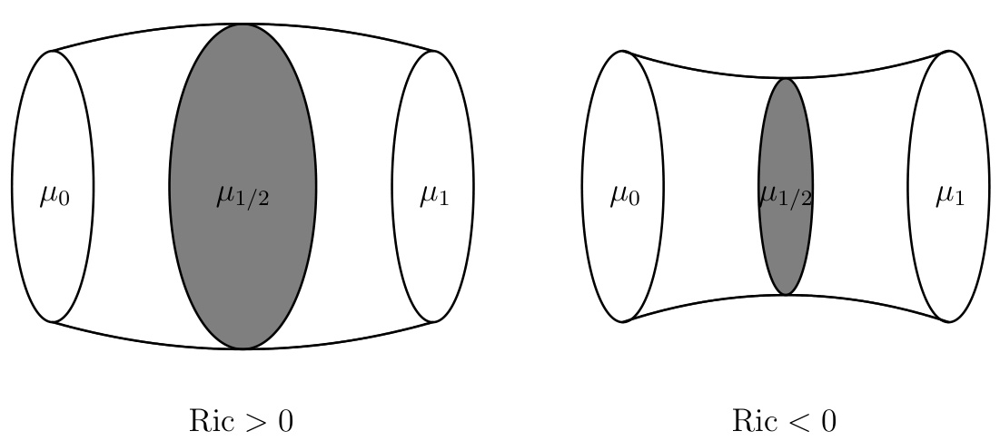

# 最適輸送理論とリッチ曲率  

∼物を運ぶと曲率が分かる ∼  

2015年2月20日,21日  

# 目次  

1モンジュの問題とモンジュ・カントロヴィッチ問題（桑江）3  

1.1モンジュの問題とモンジュ・カントロヴィッチ問題の歴史. . . . . . . . .3  
1.2モンジュ・カントロヴィッチ問題の解の存在. . . . . . . . . . . . . . . . .9  
1.3 Kantorovich 双対性 . . . . . . . . . . . . . . . . . . . . . . . . . . . . . . . 14   
1.4 Wasserstein 距離 . . . . . . . . . . . . . . . . . . . . . . . . . . . . . . . . 24   
1.5 Appendix . . . . . . . . . . . . . . . . . . . . . . . . . . . . . . . . . . . . 37  

2リーマン幾何（塩谷）39  

2.1 曲率 $\mathcal{O}$ 大小を測る . . . . . . . . . . . . . . . . . . . . . . . . . . . . . . . . 39   
2.2 $1)-\gtrsim\gamma$ 幾何 $\mathcal{O}$ 歴史 . . . . . . . . . . . . . . . . . . . . . . . . . . . . . . 40   
2.3 Gromov $\textcircled{1}72=7\textcircled{7}\textcircled{9}76$ 性定理 . . . . . . . . . . . . . . . . . . . . . . . 42   
2.4リーマン多様体 $\mathcal{O}$ 収束・崩壊とその極限. . . . . . . . . . . . . . . . . . .44  

# 3 曲率次元条件（太田） 47  

3.1 リッチ曲率 $\mathcal{O}$ 下限の特徴づけ . . . . . . . . . . . . . . . . . . . . . . . . . 47  

3.1.1 重みつきリッチ曲率 . . . . . . . . . . . . . . . . . . . . . . . . . . 47   
3.1.2エントロピー. . . . . . . . . . . . . . . . . . . . . . . . . . . . . .48  
3.1.3 リッチ曲率 $\mathcal{O}$ 下限 $\mathcal{O}$ 特徴づけ . . . . . . . . . . . . . . . . . . . . . 49  

3.2 曲率次元条件 . . . . . . . . . . . . . . . . . . . . . . . . . . . . . . . . . . 51  

3.2.1 定義 . . . . . . . . . . . . . . . . . . . . . . . . . . . . . . . . . . . 51   
3.2.2 幾何学的応用 . . . . . . . . . . . . . . . . . . . . . . . . . . . . . . 53   
3.2.3 $\operatorname{CD}(K,N)\Rightarrow\operatorname{Ric}_{N}\geq K\,{\mathcal{O}}$ 略証 . . . . . . . . . . . . . . . . . . . . 54   
3.2.4 空間の収束での保存 . . . . . . . . . . . . . . . . . . . . . . . . . . 54   
3.2.5 例. . . . . . . . . . . . . . . . . . . . . . . . . . . . . . . . . . . . 56  

4エントロピーとWasserstein幾何（高津）57  

4.1 $(\mathcal{P}_{2}^{\mathrm{ac}}(M),W_{2})\ \mathcal{O}\ ^{1})-\daleth\succ$ P構造 . . . . . . . . . . . . . . . . . . . . . . . . . 57   
4.2 $\operatorname{Ent}_{\mathfrak{m}}\;\mathcal{O})$ 勾配 $\sum\gamma\div\gamma\gamma\succ\gamma$ 下限 . . . . . . . . . . . . . . . . . . . . . . . . 62   
4.3 関数不等式 . . . . . . . . . . . . . . . . . . . . . . . . . . . . . . . . . . . 64   
4.3.1 HWI 不等式 $\Rightarrow{}$ 対数 Sobolev 不等式 $\Rightarrow{}$ Poincar´e 不等式 . . . . . . . 64   
4.3.2 Talagrand 不等式 $\Rightarrow{}$ 測度 $\mathcal{O}$ 集中現象 . . . . . . . . . . . . . . . . . 66  

# 5最適輸送理論と熱流（桒田）  

# 69  

5.1 導入 . . . . . . . . . . . . . . . . . . . . . . . . . . . . . . . . . . . . . . . 69   
5.2 距離空間上 $\mathcal{O}$ 勾配流 . . . . . . . . . . . . . . . . . . . . . . . . . . . . . . 70   
5.3 曲率次元条件と発展変分不等式 . . . . . . . . . . . . . . . . . . . . . . . . 73   
5.4熱流の同定に関する補足. . . . . . . . . . . . . . . . . . . . . . . . . . . .76  

# 6熱流,リーマン的曲率次元条件とBochner不等式（桒田）78  

6.1測度距離空間 $\sum1)-\gamma=$ 的曲率次元条件. . . . . . . . . . . . . . . . . . .78  
6.1.1 Cheeger 型エネルギー汎関数 . . . . . . . . . . . . . . . . . . . . . . 78   
6.1.2無限小 $E)L\sim\mu$ 的空間 $\sum1)-\gamma=$ 的曲率次元条件. . . . . . . . .81  
6.2 $1)-\gtrsim\gamma$ 的曲率次元条件と Bochner $\mathcal{O}$ 不等式 . . . . . . . . . . . . . . . . . 82   
6.3エントロピー的曲率次元条件. . . . . . . . . . . . . . . . . . . . . . . . .87  
6.4 $1)-\gtrsim\gamma$ 的曲率次元条件に関する補足. . . . . . . . . . . . . . . . . . . .92  
6.5 測度距離空間上 $\mathcal{O}$ 解析 $\sim\!\mathcal{O}$ 応用 . . . . . . . . . . . . . . . . . . . . . . . . 93  

# 7リーマン的曲率次元条件にまつわる最近 $\oslash$ 進展（太田）96  

7.1 分解定理 . . . . . . . . . . . . . . . . . . . . . . . . . . . . . . . . . . . . . 96   
7.1.1 $1)-\gtrsim\gamma$ 多様体 $\mathcal{O}$ 場合（ Cheeger–Gromoll ）. . . . . . . . . . . . . 96   
7.1.2重みつきリーマン多様体 $\mathcal{O}$ 場合（Lichnerowicz et al）. . . . . . . .97  
7.1.3 RCD 空間 $\mathcal{O}$ 場合（ Gigli ）. . . . . . . . . . . . . . . . . . . . . . . 97   
7.2 分解定理 $\mathcal{O}$ 応用 . . . . . . . . . . . . . . . . . . . . . . . . . . . . . . . . . 99   
7.2.1RCD空間 $\mathcal{O}$ 構造定理（Mondino–Naber）. . . . . . . . . . . . . .100  
7.2.2 正曲率空間 $\mathcal{O}$ 剛性定理（ Ketterer ）. . . . . . . . . . . . . . . . . . 100   
7.3 RCD 空間上の凸関数 . . . . . . . . . . . . . . . . . . . . . . . . . . . . . . 101   
7.3.1 勾配流の存在と収縮性（ Sturm ）. . . . . . . . . . . . . . . . . . . 102   
7.3.2ヘッシアンの評価による特徴づけ（Ketterer）. . . . . . . . . . . .104  
7.4 未解決問題など . . . . . . . . . . . . . . . . . . . . . . . . . . . . . . . . . 105  

# 1モ $y\sin^{\circ}=0$ 問題とモンジュ・カントロヴィッチ問題（桑江）  

本稿では最適輸送理論の歴史的経緯を交えながら基本となる考え方や方法を伝えたい.より詳しくはC. Villani氏やAmbrosio-Gigli-Savar´e諸氏による教科書[143, 144, 4]を,日本語による解説では會田茂樹氏による講演スライド[147]や三上敏夫氏や太田慎一氏による論説[153, 148, 149]を参照されたい.  

# 1.1モンジュの問題とモンジュ・カントロヴィッチ問題の歴史  

次 $\mathcal{O}$ 問題を考える  

問題1.1 ([103])ある砂山をそれと同じ体積 $\mathcal{O}$ 穴に移したい.砂粒一つ一つの移動には移動距離に依存したコストがかかるとき,最適な移動のさせ方は何か？  

この問題は仏の数学者・工学者であるGaspard Monge $\mathcal{O}$ 1781年の論文[103] $\mathcal{O}$ 中で提唱され,モンジュ $^1\oslash$ 最適輸送問題,略してモンジュの問題と呼ばれています.モンジュはフランス革命時に海軍大臣を務めたこともあり,モンジュの問題は物資の輸送におけるコストの節約 $\mathcal{O}$ 観点から現実的な要請が背景にあったと考えられます.  

さて問題 $\mathcal{O}$ 文面 $\mathcal{O}$ ままでは何が問題なのか分りにくいですが,実は砂山の砂粒はそれを移動させたら空中(地中？)で静止してそこに留まっていることを暗に仮定しています.解りやす $\textsf{V}\textsf{J}$ 形に言 $\vee\rightarrow$ 換えると次 $\mathcal{O}$ ようになります.  

問題 ${\bf1.2\,\Omega}n$ 個 $\mathcal{O}$ 工場と $n$ 個 $\mathcal{O}$ 店舗があり,各工場から各店舗にそれぞれ一個の製品のみを移動させ距離に応じてコストがかかるとき,総コストを最小にする移動のさせ方は何か？  

問題 $1.2~^{2}\mathcal{O}$ 解は工場と店 $\mathcal{O}$ 具体的な配置から決まります.しかも移動のさせ方はn!通りしかな $\vee\supset\mathcal{O})$ で計算して具体的な解を(しらみつぶしかコンピュータで)求めることが原理的に可能です.最初 $\mathcal{O}$ 問題1.1は問題1.2において工場の個数が無限でしかも至る所密に詰っていて,さらに移動先 $\mathcal{O}$ 店舗も無限で密に詰っている状況の問題と解釈することができます.さらに一歩進めて「密に詰 $\supset$ た無限 $\mathcal{O}$ 各工場から密に詰った無限の各店舗に総コストが最小になるような１対１上 $\sim\!\mathcal{O}$ 写像を決める問題」と理解できます.問題1.1を数学的に述べると以下 $\mathcal{O}$ よ $\gimel$ にな $\mathfrak{h}$ ます.  

問題1.3 $D_{1}$ , $D_{2}$ は $\mathbb{R}^{3}\ \mathcal{O})$ 部分集合で同じ体積1を $^{\sharp,\lnot\ l}$ する.位置 $x\not\odot$ 砂を位置 $y$ に移動する $\mathcal{O}$ に要する価格は単位体積あたり $c(x,y)$ 3だけかかるとする. $D_{1}$ から $D_{2}\cap\mathcal{O})$ 写像 $T$ で次 $\mathcal{O}$ 条件(1), (2)を満たすも $\mathcal{O}$ を考える:  

(1) $T$ は全単射である.すなわち $x\neq x^{\prime}$ ならば $T(x)\neq T(x^{\prime})$ , $\hbar\Omega\ D_{1}\ O\ T$ による像 $T(D_{1})=\{T(x)\mid x\in D_{1}\}$ は $D_{2}$ である.(2) $D_{1}\,\mathcal{O})$ 任意 $\mathcal{O}$ 部分集合 $U$ に対してそ $\mathcal{O}$ 像 $T(U)\not\subseteq U\not\supset$ 体積は同じである.  

これらの条件下で $C(T):=\int_{D_{1}}c(x,T(x))\mathrm{d}x$ を最小にする写像 $T$ を求めよ.  

問題1.3はた $\cup\infty\setminus\mathcal{A}$ な難問で解決されるまで長 $\vee\rightarrow$ 年月がかかりました. Sudakov [135, 136]が1979年に $E\times\sum I\geq0$ 問題 $\mathcal{O}$ 解である最適輸送写像 $T\mathcal{O}$ 存在証明を発表しましたが,それには一部誤りがありました.修復された証明は測度 $\mathcal{O}$ 台が互 $\vee\rightarrow$ に素でコンパクトという強$\textsf{V}\textsf{J}$ 仮定 $\mathcal{O}$ 下で Evans-Gangbo [49] (1999), 密度を $\sharp\neg$ 仮定 $\mathcal{O}$ 下で Ambrosio [2] (2000), Trudinger-Wang [139] (2001), Caffarelli-Feldman-McCann [23] (2002)4等によりなされました.  

1979年 $\mathcal{O}$ Sudakov [135, 136]以前 $V=\bar{C}\subset\mathcal{O}$ 問題に関して重要なアイディアを提出したのがロシアの数学者・経済学者Leonid Kantorovich(レオニード・カントロヴィッチ)(1912-1986)です.カントロビッチはモ $y\sin x_{2}\phi$ 問題を,写像を決めるのでなく,「工場 $\mathcal{O}$ 散らば $\mathfrak{h}$ (確率分布 $\mu$ )と店舗 $\mathcal{O}$ 散らばり(確率分布 $\nu$ )が与えられているときに $x$ から $y\!\sim\!\mathcal{O}$ 移動コスト $c(x,y)\r^{\O}\mathcal{O}$ 総コスト  

$$
C(\pi):=\int_{\mathbb{R}^{n}\times\mathbb{R}^{n}}c(x,y)\pi(\mathrm{d}x\mathrm{d}y)
$$  

が最小になるような工場 $\boldsymbol{\xi}$ 店舗 $\mathcal{O}$ 配置 $\mathcal{O}$ 結合分布 $\pi$ (輸送計画)を決めよ」という問題 $E=$ 置き換えました.これをモンジュ・カントロビッチ問題(以下MK問題)と呼びます. MK問題はモンジュの問題よりは解決が数学的には易 ${\mathsf I}~\langle$ ,モ $y\sin20$ 問題 $\mathcal{O}$ 解決に向けて大きな進展が得られました.カ $\smile\vdash$ ロビッチは線形計画法 $^5\,\%=$ お $\textsf{V}\textsf{J}$ て先駆的な業績を挙げており,資源の適正配分に関する一連 $\mathcal{O}$ 研究により1975年 $=1-\xrightarrow{}1$ 経済学賞を受賞しています．MK問題の解から対応するモ $y\sin\alpha\phi$ 問題 $\mathcal{O}$ 解 $T\mathcal{O}$ 満たすべき性質が予想できます.そのことに基づいてコスト関数 $c(x,y)$ が良 $\textsf{V}\textsf{J}$ 条件を満たすとき初めて厳密に解いた $\mathcal{O}$ がYann Brenierです(1987年).  

定理1.4 (Yann Brenier(1987), cf. [19, 20]) $\mu,\nu$ は $\mathbb{R}^{n}$ 上 $\mathcal{O}$ 連続型確率分布で,２次 $\mathcal{O}$ 積率を $\sharp\supset\chi\downarrow$ , $\mu$ は $n_{\mathrm{-}}$ -次元ルベーグ測度に関して絶対連続な $\sharp,\mathcal{O}$ とする.コスト関数 $\begin{array}{r}{c(x,y)=\frac{1}{2}|x-y|^{2}}\end{array}$ に対するMK問題 $\mathcal{O}$ 解 $\pi\in\Pi(\mu,\nu)$ に対して $\pi(A\times B)=\mu(A\cap T^{-1}(B))$ , $\forall A,B\in B(\mathbb{R}^{n})$ 6を満たす写像 $T:\mathbb{R}^{n}\to\mathbb{R}^{n}$ が存在する.さらに凸関数 $\phi:\mathbb{R}^{n}\rightarrow\mathbb{R}$ で $T=\nabla\phi$ µ-a.s.をみたす $\sharp,\mathcal{O})$ が存在する.ここで  

$$
\Pi(\mu,\nu):=\left\{\pi\in{\mathcal{P}}(\mathbb{R}^{n}\times\mathbb{R}^{n})\mid\pi(A\times\mathbb{R}^{n})=\mu(A),\pi(\mathbb{R}^{n}\times B)=\nu(B)\;\forall A,B\in{\mathcal{B}}(\mathbb{R}^{n})\leq\mu(B)\leq\nu(B)\right\}.
$$  

は $\mu,\,\nu\,\mathcal{O}$ 結合分布(カ $1\cdot y>0^{\circ}1)\lor\overline{{\gamma}})$ と呼ばれる $\mathbb{R}^{n}\times\mathbb{R}^{n}$ 確率測度 $\mathcal{O}$ 全体で, $\mathcal{P}(\mathbb{R}^{n}\times\mathbb{R}^{n})$ は $\mathbb{R}^{n}\times\mathbb{R}^{n}=\mathbb{R}^{2n}$ 上 $\mathcal{O}$ ボレル確率測度 $\mathcal{O}$ 全体である.  

証明 (定理 $\mathbf{1.4}\oslash$ 証明 $\oslash$ 概略 )$\pi_{0}\in\Pi(\mu,\nu)$ を  

$$
D^{2}[\pi]:=\int_{\mathbb{R}^{n}\times\mathbb{R}^{n}}|x-y|^{2}\pi(\mathrm{d}x\mathrm{d}y),\quad\pi\in\Pi(\mu,\nu)
$$  

を最小にする輸送計画とする(後述 $\mathcal{O}$ 定理 $1.6\neq5\neq0$ 最小点 $\pi_{0}\in\Pi(\mu,\nu)$ は存在する).すると任意の $x,y\in\mathbb{R}^{n}$ で $\begin{array}{r}{\varphi(x)+\psi(y)\leq\frac{1}{2}|x-y|^{2}}\end{array}$ をみたす有界連続関数 $\varphi,\psi\in C_{b}(\mathbb{R}^{n})$  $71=261$ て  

$$
\begin{array}{l}{\displaystyle\frac{1}{2}D^{2}[\pi]=\frac{1}{2}\int_{\mathbb R^{n}\times\mathbb R^{n}}|x-y|^{2}\pi(\mathrm{d}x\mathrm{d}y)\geq\int_{\mathbb R^{n}\times\mathbb R^{n}}(\varphi(x)+\psi(y))\pi(\mathrm{d}x\mathrm{d}y)}\\ {\displaystyle\qquad\qquad\qquad\qquad\qquad=\int_{\mathbb R^{n}}\varphi(x)\mu(\mathrm{d}x)+\int_{\mathbb R^{n}}\psi(y)\nu(\mathrm{d}y)}\end{array}
$$  

となって,これより  

$$
\begin{array}{r l}{\frac{1}{2}\displaystyle\operatorname*{inf}_{\pi\in\Pi(\mu,\nu)}D^{2}[\pi]\geq\operatorname*{sup}}&{\left\{\displaystyle\int_{\mathbb R^{n}}\varphi(x)\mu(\mathrm{d}x)+\int_{\mathbb R^{n}}\psi(y)\nu(\mathrm{d}y)\~\Bigg|~\right.}\\ &{\left.\varphi,\psi\in C_{b}(\mathbb R^{n}),~\varphi(x)+\psi(y)\leq\frac{1}{2}|x-y|^{2}\quad\forall x,y\in\mathbb R^{n}\right\}}\end{array}
$$  

を得る.右辺を最大化する関数 $\mathcal{O}$ 組 $(\varphi,\psi)\;\in\;L^{1}(\mu)\,\times\,L^{1}(\nu)\;^{\;8}\vec{\mathrm{\footnotesize~\mathscr~{C}~}}$ ,任意 $)~x,y~\in~\mathbb{R}^{n}$ で $\begin{array}{r}{\varphi(x)+\psi(y)\leq\frac{1}{2}|x-y|^{2}}\end{array}$ を満た $\mathsf{L}$ ,かつ  

$$
\pi_{0}\mathrm{-a.s.}\,\left(x,y\right)\in\mathbb{R}^{n}\times\mathbb{R}^{n}\,\,\widehat{\mathrm{\textsf{C}}}\varphi(x)+\psi(y)=\frac{1}{2}|x-y|^{2}
$$  

をみたす $\sharp\,\mathcal{O}\!\,\mathcal{\hbar}^{\mathtt{N}}$ 存在することが $(\mu,\nu\oslash2$ 次 $\mathcal{O}$ 積率有限性から後述 $\mathcal{O}$ 定理1.24(2)が適用できて)わか $\mathfrak{h}$ , (1.1)で等号が成立する(Kantorovich双対性,定理1.24(3)).特に(1.2)から $\mu$ -a.s. $x\in\mathbb{R}^{n}$ に対 $\mathsf{L}$ , $\begin{array}{r}{\varphi(x)+\psi(y)=\frac{1}{2}|x-y|^{2}}\end{array}$ をみたす $y\in\mathbb{R}^{n}$ が存在する.実際,  

$$
A:=\left\{x\in\mathbb{R}^{n}\;\bigg|\;\varphi(x)+\psi(y)=\frac12|x-y|^{2}
$$  

とすると  

$$
\begin{array}{l}{\displaystyle\mu(A)=\pi_{0}(A\times\mathbb{R}^{n})}\\ {\displaystyle\qquad=\pi_{0}\left(\left\{x\in\mathbb{R}^{n}\;\middle|\;\varphi(x)+\psi(y)=\frac{1}{2}|x-y|^{2}\;\neq\frac{\mathrm{sits}}{||u|}\neq\frac{\bullet}{3}\;y\;\mathcal{H}^{*}\mathcal{H}^{*}\mathbb{E}\xrightarrow{\bullet}\mathcal{Z}\right\}\times\mathbb{R}^{n}\right)}\\ {\displaystyle\qquad\geq\pi_{0}\left(\left\{(x,y)\in\mathbb{R}^{n}\times\mathbb{R}^{n}\;\middle|\;\varphi(x)+\psi(y)=\frac{1}{2}|x-y|^{2}\right\}\right)=1}\end{array}
$$  

となる. $x\in A$ をとれば, $\begin{array}{r}{\varphi(x)+\psi(y)=\frac{1}{2}|x-y|^{2}}\end{array}$ をみたす $y$ 毎に  

$$
z\mapsto{\frac{1}{2}}|z-y|^{2}-\varphi(z)
$$  

は $x$ で最小値をとることがわかる.特に, $x\in A$ で  

$$
\varphi(x)\leq\operatorname*{inf}_{w\in\mathbb{R}^{n}}\left({\frac{1}{2}}|x-w|^{2}-\psi(w)\right)\leq{\frac{1}{2}}|x-y|^{2}-\psi(y)=\varphi(x)
$$  

から,  

$$
\varphi(x)=\operatorname*{inf}_{w\in\mathbb{R}^{n}}\left({\frac{1}{2}}|x-w|^{2}-\psi(w)\right)
$$  

を得る.  

$$
\varphi_{k}(z):=\operatorname*{inf}_{|w|<k}\left\{{\frac{1}{2}}|z-w|^{2}-\psi(w)\right\}
$$  

$\boldsymbol{\xi}$ お $\zeta\geq$ , $\varphi_{k}$ は局所Lipschitz連続であ $\mathfrak{h}$ , $x\in A\in L$ て十分大き $\textsf{V}\!^{\mathrm{~\scriptsize~k~}}\in\mathrm{~\mathbb~N~}$ に対して $|y|<k$ になることから $\varphi(x)=\varphi_{k}(x)$ を得る.これより $\mu$ -a.s. $x\in\mathbb{R}^{n}\ \mp k\in\mathbb{N}$ がとれて $\varphi(x)\,=\,\varphi_{k}(x)$ となる.したがってRademacher $\mathcal{O}$ 定理([144, Theorem 10.8(ii)])より $\mu\cdot$ -a.s. $x\in\mathbb{R}^{n}\ \overline{{\mathbb{C}}}\ \varphi$ は微分可能となる.そこで  

$$
D(T):=A\cap\left\{x\in\mathbb{R}^{n}\mid\varphi\mid\pm\;x\stackrel{\wedge\,\mathfrak{M}}{\sim\,\mathfrak{M}}\zeta\chi\sqrt[]{\hat{\mathbb{H}}}\natural\right\}
$$  

とする.明らかに $\mu(D(T))=1$ である. $x\in D(T)$ にお $\textstyle{\mathsf{V}}\,^{\gamma}\,\varphi(x)+\psi(y)={\frac{1}{2}}|x-y|^{2}\,\mathcal{O}$ の両辺を微分して  

$$
\left(x-y\right)-\nabla\varphi(x)=\nabla\left({\frac{1}{2}}|\cdot-y|^{2}-\varphi\right)(x)=0,
$$  

すなわち $\boldsymbol{y}=\boldsymbol{x}-\nabla\varphi(\boldsymbol{x})$ を得る.つまり $x\in D(T)$ 毎に $\begin{array}{r}{\varphi(x)+\psi(y)=\frac{1}{2}|x-y|^{2}}\end{array}$ をみたす $y\ \#\bar{\Sigma}\geq O)$ 表示から一意的に決まる.そこで写像 $T:D(T)\to\mathbb{R}^{n}$ を  

$$
T(x)=x-\nabla\varphi(x)=\nabla\left({\frac{1}{2}}|\cdot|^{2}-\varphi\right)(x),\quad x\in D(T)
$$  

で定めることにする. $1)-\gtrsim\gamma$ 多様体での指数写像 $\exp{_x}\mathrm{p}_{x}$ をユークリッ $\mathrm{F}$ 空間 $\mathcal{O}$ 場合に適用すると  

$$
T(x)=x-\nabla\varphi(x)=\exp_{x}\left(-\nabla\varphi(x)\right)
$$  

と表される.そこで  

$$
\phi(z):=\operatorname*{sup}_{w\in\mathbb{R}^{n}}\bigg(\psi(w)-\frac12|w|^{2}+\langle z,w\rangle\bigg)
$$  

で関数 $\phi$ を定めると, $\phi$ は表示から明らかに $\mathbb{R}^{n}$ 上 $\mathcal{O}$ 凸関数であ $\textit{b}^{9}$ , (1.3)から  

$$
\phi(x)={\frac{1}{2}}|x|^{2}-\varphi(x),\quad x\in A
$$  

となることから $T=\nabla\phi=\exp.(-\nabla\varphi)$  $\mu\cdot$ -a.s.を得る.  

最後に $\mathbf{\partial}\cdot\pi_{0}=(\operatorname{Id},T)_{\sharp}\mu$ 10を示そ $\Game$ .これから最適輸送計画 $\pi_{0}$ は一意に定まることがわか $\mathfrak{h}$ , $\nu=T_{\sharp}\mu$ 11も従う.12まず $T\mathcal{O}$ グラフを $G(T)\,:=\,\{(x,T(x))\,\mid\,x\,\in\,D(T)\}$ . $\Gamma_{0}:=\{(x,y)\in\mathbb{R}^{n}\times\mathbb{R}^{n}\mid\varphi(x)+\psi(y)={\textstyle{\frac{1}{2}}}|x-y|^{2}\}$  $G(T)=\Gamma_{0}\cap(D(T)\times\mathbb{R}^{n})$ )がわかる $\mathcal{O}$ で $\pi_{0}(\Gamma_{0})=1$ |−|}からとすると写像 $T\mathcal{O}$ 構成 $\mathcal{O}$ 手続きから  

$$
\pi_{0}(G(T))=\pi_{0}(\Gamma_{0}\cap(D(T)\times\mathbb{R}^{n}))=\pi_{0}(D(T)\times\mathbb{R}^{n})=\mu(D(T))=1
$$  

となる.これより,任意 ${\mathcal{D}}\ A,B\in B(\mathbb{R}^{n})$ に対して  

$$
\begin{array}{r l}{\pi_{0}(A\times B)=\pi_{0}((A\times B)\cap G(T))}&{}\\ {=\pi_{0}(\{(x,T(x))\mid x\in D(T)\cap A,T(x)\in B\})}&{}\\ {=\pi_{0}(\{(x,T(x))\mid x\in D(T)\cap A\cap T^{-1}(B)\})}&{}\\ {=\pi_{0}([(D(T)\cap A\cap T^{-1}(B))\times\mathbb{R}^{n}]\cap G(T))}&{}\\ {=\pi_{0}((D(T)\cap A\cap T^{-1}(B))\times\mathbb{R}^{n})}&{}\\ {=\mu(D(T)\cap A\cap T^{-1}(B))=\mu(A\cap T^{-1}(B))=(\mathrm{Id},T)_{\sharp}(A\times B)}&{}\end{array}
$$  

とな $\mathfrak{h}$ , $\pi_{0}=(\operatorname{Id},T)_{\sharp}\mu$ を得 $\mathsfit{3}$ .  

注意1.5(1)定理 $1.4\mathcal{O}$ 帰結としてBrenier [19, 20]による極因子分解定理(Polar fac-torization Theorem)がわかる: $\lambda^{n}$ を $n_{\mathrm{~\rightmoon~}}$ -次元ルベーグ測度 $\succ\downarrow$ , $\nu\in\mathcal P_{2}^{\mathrm{ac}}(\mathbb{R}^{n})$ 13を考える.可測ベク $\digamma$ ル場 $X:\mathbb{R}^{n}\rightarrow\mathbb{R}^{n}$ が  

$$
X_{\sharp}\lambda^{n}\ll\lambda^{n}
$$  

を満たせば,ある凸関数 $\psi\,\,\xi\,\,\eta_{\sharp}\nu\,=\,\nu$ をみたす写像 $\eta:\mathbb{R}^{n}\rightarrow\mathbb{R}^{n}$ が存在して $X=$ $\nabla\psi\circ\eta\ \nu\cdot$ -a.s. $\boldsymbol{\xi}$ 表せる .  

証明 $\mu\,:=\,X_{\sharp}\nu$ とすると仮定から $\mu\,\in\,\mathcal P_{2}^{\mathrm{ac}}(\mathbb{R}^{n})$ であ $\mathfrak{h}$ ,定理 $1.4\neq5\neq7.7k$ 関数 $c(x,y)={\textstyle{\frac{1}{2}}}|x-y|^{2}\,\,\xi\,\,\mu,$  $\nu$ に関する最適輸送写像 $T$ は下半連続な凸関数 $\phi$ を用 $\lor2\top$  $T=\nabla\phi$ µ-a.s. $\mathcal{O}$ 表現を持ち  

$$
\nu=T_{\sharp}\mu=(\nabla\phi)_{\sharp}\mu=(\nabla\phi)_{\sharp}X_{\sharp}\nu=(\nabla\phi\circ X)_{\sharp}\nu
$$  

$\boldsymbol{\xi}$ 表せる. $\eta:=\nabla\phi\circ X$ とお $\zeta\;\xi$ 上式は $\eta_{\sharp}\nu=\nu$ を表している. $\phi\,\mathcal{O})$ Fenchel-Legendre変換を $\phi^{*}(y):=\,\operatorname*{sup}\{\langle x,y\rangle\,-\,\phi(x)\,\mid\,x\,\in\,\mathbb{R}^{n}\}$ ,これは下半連続凸関数で $\nabla\phi^{*}\circ\nabla\phi=\mathrm{Id}$  $\mu\cdot$ -a.s. $^{14}\;\!\xi$ なる $\mathcal{O}$ で $X=\nabla\phi^{*}\circ\eta$ ν-a.s.を得る.✷(2)定理1.4はMikami [99]によ $\supset$ て確率論的な別証明が与えられている.  

(3)定理1.4はユークリッド空間 $\mathcal{O}$ 設定でGangbo-McCann [56]にお $v_{2}>v_{3}<2x_{2}0$ 条件をみたす狭義凸関数 $h:\mathbb{R}^{n}\rightarrow[0,+\infty[$ 15 を用 $\vee\rightarrow$ たコスト関数 $c(x,y)=h(x-y)$ , $x,y\in\mathbb{R}^{n}\ \mathcal{O}$ 場合に拡張されて $\textsf{V}\textsf{J}$ る.詳細は[153] $\mathcal{O}$ 解説を参照された $\textsf{V}\textsf{J}$ .モ $y=x_{2}$  $\mathcal{O}$ 問題を解決したTrudinger-Wang [139], Caffarelli-Feldman-McCann [23] $\mathcal{O}$ 証明はGangbo-McCann [56] $\mathcal{O}$ 結果に立脚している.  

(4)定理1.4はMcCann [97] $k\leq t>(77\leq1\leq35)\leq1\leq75$ 多様体 $\mathcal{O}$ 場合に,そ $\mathcal{O}$ 後Fathi-Figalli [52], Figalli-Gigli [53]によって非 $7\forall1\mathring{\circ}\colon\mathcal{I}\vdash1)-\bigtriangledown\rangle$ 多様体 $(M,g)\,\mathcal{O})$ 場合に拡張された.そ $\mathcal{O}$ 場合 $\sharp\overset{1}{\prime}]-\rightleftharpoons\partial$ 距離 $d_{g}(x,y)$ を用 $\textsf{V}\textsf{J}$ た $c(x,y)=\textstyle{\frac{1}{2}}d_{g}^{2}(x,y)$ をコス $\digamma$ 関数とするが存在して $\mu_{0}\in{\mathcal{P}}_{2}^{\mathrm{ac}}(M)\ \xi\ \mu_{1}\in{\mathcal{P}}_{2}(M)$ ∈Pに関する最適輸送写像 $T$ は局所弱凸関数 $\varphi$  

$$
T=\exp.\left(\nabla\varphi\right)\quad\mu{\mathrm{-a.s.}}
$$  

と表現される.また勾配ベクトル場に沿う $\mu_{0}\ {\mathcal{O}})$ 押し出し測度  

$$
\begin{array}{r}{\mu_{t}:=(T_{t})_{\sharp}\mu_{0},\quad T_{t}(x):=\exp_{x}\left(t\nabla\varphi(x)\right),\quad t\in[0,1]}\end{array}
$$  

が後述の $L^{2}$ -Wasserstein空間 $(\mathcal{P}_{2}(M),W_{2})\ ^{17}\mathit{[3]}$ おける $\mu_{0}\,\nexists)\,\mathring{5}\,\,\mu_{1}\,\neg\,\oslash$ 最短測地線を与える.すなわち  

$$
W_{2}(\mu_{0},\mu_{t})=t W_{2}(\mu_{0},\mu_{1}),\quad W_{2}(\mu_{t},\mu_{1})=(1-t)W_{2}(\mu_{0},\mu_{1}),\quad t\in[0,1].
$$  

# 1.2モンジュ・カントロヴィッチ問題 $\oslash$ 解 $\oslash$ 存在  

定理1.6 (最小点 $\oslash$ 存在) $X$ , $Y$ をポーランド空間 $^{18}\succ\downarrow$ , $\mu\,\in\,{\mathcal{P}}(X)$ , $\nu\,\in\,\mathcal{P}(Y)$ をそれぞれの空間上 $\mathcal{O}$ 確率測度 $\boldsymbol{\xi}$ する.コス $\digamma$ 関数 $c:X\times Y\rightarrow[0,\infty]$ 19は下半連続とする. $\begin{array}{r}{\int_{X\times Y}c(x,y)\pi(\mathrm{d}x\mathrm{d}y)<\infty}\end{array}$ をみたす $\pi\in\Pi(\mu,\nu)$ が存在すれば,モンジュ・カ $\smile\vdash$ ロヴィッチ問題  

$$
\operatorname*{inf}_{\pi\in\Pi(\mu,\nu)}\int_{X\times Y}c(x,y)\pi(\mathrm{d}x\mathrm{d}y)<\infty
$$  

$\mathcal{O}$ 最小点 $\pi_{0}\in\Pi(\mu,\nu)\neq$ が在する. $\succeq\oslash\pi_{0}$ を $\mu$ から $\nu\cap\mathcal{O}$ 最適輸送計画,ある $\cup$ は $\mu\:\mathcal{\succeq}\:\nu$ の最適カップリングと呼ぶ.  

注意1.7(1) (1.4) $\mathcal{O}$ 最小点である最適輸送計画 $\pi_{0}$ は一般に一意ではな $\textsf{V}\textsf{J}$ .  

(2) MK問題は確率論的には  

$$
\operatorname*{inf}\left\{\mathbf{E}\left[c(U,V)\right]\mid U_{\sharp}\mathbf{P}=\mu,V_{\sharp}\mathbf{P}=\nu\right\}
$$  

を最小化する $X\!\times\!Y$ -値確率変数 $(U,V)$ を求めることでもある. $(U,V)\,\mathcal{O})$ 分布 $(U,V)_{\sharp}\mathbf{P}$ は $U\oslash$ 分布 $U_{\sharp}\mathbf{P}=\mu$ , $V\mathcal{O}$ 分布 $V_{\sharp}\mathbf{P}=\nu\mathbf{\Lambda}^{\mathcal{O}}$ カ $y>^{\circ}1)=$ グに他ならな $\vee\rightarrow$ .  

定義1.8 (半連続性) $(E,{\mathcal{O}}(E))$ を位相空間とする.関数 $f:E\to\overline{{\mathbb{R}}}\,\mathcal{O}\,x\in E$ 下極限 (lower limit) を  

$$
\varliminf_{y\to x}f(y):=\operatorname*{sup}_{U\in{\mathcal{U}}(x)}\operatorname*{inf}_{y\in U}f(y)
$$  

で定める.同様 $E=$ 上極限(upper limit)を  

$$
\varlimsup_{y\to x}f(y):=\operatorname*{inf}_{U\in\mathcal{U}(x)}\operatorname*{sup}_{y\in U}f(y)
$$  

で定める.ここで $\mathcal{U}(x)$ は $x\in E\,\mp\phi$ 位相 $\mathcal{O}$ 近傍系である. $(E,{\mathcal{O}}(E))$ が第一可算 $\daleth$ ,点列 $\left\{x_{n}\right\}$ が $x$ に収束しているときは  

$$
\varliminf_{y\to x}f(y)=\varliminf_{n\to\infty}f(x_{n}):=\operatorname*{sup}_{n\in\mathbb{N}}\operatorname*{inf}_{k\geq n}f(x_{k}),
$$  

$$
\varlimsup_{y\to x}f(y)=\varlimsup_{n\to\infty}f(x_{n}):=\operatorname*{inf}_{n\in\mathbb{N}}\operatorname*{sup}_{k\geq n}f(x_{k})
$$  

となる. $(E,{\mathcal{O}}(E))$ が距離 $d$ から定まる位相空間 $\mathcal{O}$ ときは  

$$
\begin{array}{r l}&{\underset{y\to x}{\operatorname*{lim}}\,f(y)=\underset{\varepsilon\to0}{\operatorname*{lim}}\,\underset{d(x,y)<\varepsilon}{\operatorname*{inf}}\,f(y),}\\ &{\overline{{\operatorname*{lim}}}\,f(y)=\underset{\varepsilon\to0}{\operatorname*{lim}}\,\underset{d(x,y)<\varepsilon}{\operatorname*{sup}}\,f(y)}\end{array}
$$  

となる.関数 $f\ :\ E\ \to\ {\overline{{\mathbb{R}}}}\ \not{p}^{\mathtt{j}}\ x\ \in\ E$ で下半連続(lower semi continuous at $x\ \in\ E$ )(resp. $x\in E$ で上半連続(upper semi continuous at $x\in E$ ))であるとは $f(x)\leq\varinjlim_{y\to x}f(y)$ (resp. $f(x)\geq{\overline{{\operatorname*{lim}}}}_{y\to x}\,f(y))$ のこととする.また $f:E\rightarrow{\overline{{\mathbb{R}}}}$ が $E$ 上で下半連続(lower semicontinuous on $E$ ) (resp. $E$ 上で上半連続 (upper semi continuous on $E$ )とは $f$ が全て $\mathcal{O}$ 点 $x\in E$ で下半連続(resp.全て $\mathcal{O}$ 点 $x\in E$ で下半連続)のこととする.  

補題1.9 $(E,d)$ を距離空間 $\boldsymbol{\xi}$ する.下に有界な下半連続関数 $f:E\rightarrow{\overline{{\mathbb{R}}}}$ に対してLipschitz連続な有界関数からなる単調非減少列 $\{f_{n}\}\,\mathbb{C}\,f(x)=\operatorname*{lim}_{n\to\infty}f_{n}(x)$ となるも $\mathcal{O}$ が存在する.  

証明 $f_{n},g_{n}$ を  

$$
g_{n}(x):=\operatorname*{inf}_{y\in E}\left\{n d(x,y)+f(y)\right\},\quad f_{n}(x):=g_{n}(x)\wedge n
$$  

とおくと,明らかに $g_{n}(x)\ \leq\ g_{n+1}(x)\ \leq\ f(x)\ \overset{\leq}{\mathbb{C}}$ , $g_{n}$ は $n$ -Lipschitzである $\oslash\,\mp\,f_{n}$ も同じ性質を $^{\sharp,\lnot}$ . $f$ が下に有界であることから $g_{n},f_{n}\notin$ 下に一様に有界で同じ下界を $^{\sharp,\lnot}$ .$g_{n}(x)\,\rightarrow\,f(x)$ as $n\,\rightarrow\,\infty\,\mathcal{O}$ み示せばよ $\vee\rightarrow$ .$\begin{array}{r}{f(x)\,-\,\operatorname*{sup}_{n\in\mathbb{N}}g_{n}(x)\,>\,0\,\,\xi\,\lfloor\,\top\,0\,<\,\varepsilon\,<}\end{array}$  $f(x)-\operatorname*{sup}_{n\in\mathbb{N}}g_{n}(x)$ をとる.これから点列 $\{y_{n}\}\not\subset\cap d(x,y_{n})+f(y_{n})<f(x)-\varepsilon$ をみたすものがとれる.したがって  

$$
d(x,y_{n})<{\frac{f(x)-f(y_{n})-\varepsilon}{n}}\leq{\frac{f(x)-\operatorname*{inf}_{y\in E}f(y)-\varepsilon}{n}}\to0\quad n\to\infty
$$  

となるので $\operatorname*{lim}_{n\to\infty}y_{n}=x$ となる.これと $f\,\mathcal O)$ 下半連続性から $f(x)\leq\varinjlim_{n\to\infty}f(y_{n})\leq f(x)-\varepsilon$ を得て矛盾する $\mathcal{O}$ で, $\begin{array}{r}{f(x)=\operatorname*{sup}_{n\in\mathbb{N}}g_{n}(x)}\end{array}$ となる.→∞✷  

定義1.10 (弱収束) $(E,d)$ を距離空間とする. $\{\mu_{k}\}\ \subset\ {\mathcal{P}}(E)\ {\mathcal{B}}^{\mathrm{i}}\ \mu\ \in\ {\mathcal{P}}(E)$ に弱収束(weakly convergent)するとは,任意の $\varphi\in C_{b}(E)^{\ 20}\,\%$ 対して  

$$
\operatorname*{lim}_{k\to\infty}\int_{E}\varphi(x)\mu_{k}(\mathrm{d}x)=\int_{E}\varphi(x)\mu(\mathrm{d}x)
$$  

が成立することとする. $\Xi\oslash\,y$ き $\mu_{k}\stackrel{w}{\to}\mu$ →と記す.これらは次 $\mathcal{O}$ 条件 $\boldsymbol{\xi}$ 同値である.  

(1) 任意の有界な下半連続関数 $\varphi$ に対 $\mathsf{L}$ ,$\int_{E}\varphi(x)\mu(\mathrm{d}x)\leq\operatorname*{lim}_{k\to\infty}\int_{E}\varphi(x)\mu_{k}(\mathrm{d}x).$ →∞   
(2) 任意の下に有界な下半連続関数 $\varphi$ に対し ,$\int_{E}\varphi(x)\mu(\mathrm{d}x)\leq\operatorname*{lim}_{k\to\infty}\int_{E}\varphi(x)\mu_{k}(\mathrm{d}x).$ →∞   
(3) 任意の有界な上半連続関数 $\varphi$ に対し ,$\int_{E}\varphi(x)\mu(\mathrm{d}x)\geq\operatorname*{lim}_{k\to\infty}\int_{E}\varphi(x)\mu_{k}(\mathrm{d}x).$   
(4) 任意の上に有界な上半連続関数 $\varphi$ に対し ,$\int_{E}\varphi(x)\mu(\mathrm{d}x)\geq\operatorname*{lim}_{k\to\infty}\int_{E}\varphi(x)\mu_{k}(\mathrm{d}x).$   
(5) 任意 $\mathcal{O}$ 開集合 $G$ に対 $\mathsf{L}$ ,$\mu(G)\leq\varliminf_{k\to\infty}\mu_{k}(G)$ →∞   
(6) 任意 $\mathcal{O}$ 閉集合 $F$ に対 $\mathsf{L}$ ,$\mu(F)\geq\operatorname*{lim}_{k\to\infty}\mu_{k}(F)$ →∞   
(7)任意 $\mathcal{O}$ ボレル集合 $A\,\mho\mu(\partial A)=0$ をみたすものに対 $\mathsf{L}$ , $\mu(A)=\operatorname*{lim}_{k\to\infty}\mu_{k}(A)$ .  

証明 (定義 $\mathbf{1.10\,\overline{{\,\mathrm{{C}}}}\,}\oslash$ 主張 $\oslash$ 同値性 $\oslash$ 証明 )(5), (6), (7) と(1.12) $\xi\oslash$ 同値性は標準的な テキス $\digamma$ (例えば,小谷[151,命題9.2])に記述がある $\mathcal{O}$ で略する. (1) $\boldsymbol{\xi}$ (3) $\xi\oslash$ 同値性は $\varphi$ を $-\varphi$ にすることで自明.したがって(1)を仮定すると(3)とあわせて(1.12)が得られる.逆に(1.12)を仮定すると,補題1.9から任意 $\mathcal{O}$ 有界な下半連続関数 $\varphi$ が有界な連続関数列 $\{\varphi_{n}\}\ {\mathcal{O}}$ 単調増大極限であることから  

$$
\int_{E}\varphi\mathrm{d}\mu=\uparrow\operatorname*{lim}_{n\to\infty}\int_{E}\varphi_{n}\mathrm{d}\mu\leq\operatorname*{lim}_{n\to\infty}\operatorname*{lim}_{k\to\infty}\int_{E}\varphi_{n}\mathrm{d}\mu_{k}\leq\operatorname*{lim}_{k\to\infty}\int_{E}\varphi\mathrm{d}\mu_{k}
$$  

とな $\mathfrak{h}$ (3)を得る. $(1){\Longrightarrow}(2)\;\;\nleftarrow{\mathrm{(3){\Longrightarrow}(4)}}$ は自明, $(2){\Longrightarrow}(1)$ は $\varphi_{n}:=\varphi\wedge n$ として  

$$
\int_{E}\varphi_{n}\mathrm{d}\mu\leq\operatorname*{lim}_{k\to\infty}\int_{E}\varphi_{n}\mathrm{d}\mu_{k}\leq\operatorname*{lim}_{k\to\infty}\int_{E}\varphi\mathrm{d}\mu_{k}
$$  

から従 $\Game$ . $(4){\Longrightarrow}(3)$  $\mathfrak{E})$ 同様である.  

注意1.11(1)距離空間 $(E,d)$ にお $\cup\,\subset\,\mathcal{P}(E)$ 上 $\mathcal{O}$ 弱収束は距離化可能な位相から決まる.$\underline{{\succ}}\,\mathcal{O}$ 位相を 弱位相 (weak topology) $\xi\in\xi$ ([4, Remark 5.1.1]).  

(2)距離空間 $(E,d)$ にお $\vee\rightarrow$ て確率測度 $\mathcal{O}$ 全体 $\mathcal{P}(E)$ は有界連続関数全体 $C_{b}(E)\textcircled{>}$ 位相的双対空間 $(C_{b}(E))^{*}\,\mathcal{O})$ 単位球とみなせることから $\mathcal{P}(E)\;\mathcal{O}$ 弱位相は $(C_{b}(E))^{*}\,\mathcal{O}$ weak∗位相 $\boldsymbol{\xi}$ みなせる.  

定義1.12 (緊密性(tightness)) $(E,d)$ を距離空間, $\mathcal{P}(E)$ を $E$ 上 $\mathcal{O}$ ボレル確率測度 $\mathcal{O}$ 全体とする. $E$ 上 $\mathcal{O}$ 確率測度 $\mathcal{O}$ 族 $\Pi(\subset\mathcal{P}(E))$ が緊密(tight)であるとは $\forall\varepsilon>0$ に対 $\mathsf{L}$ ,コ $\smile\prime\mathring{\l}$ ク $\digamma$ 集合 $\exists K_{\varepsilon}\,\,\mp\operatorname*{sup}_{\mu\in\Pi}\mu(K_{\varepsilon}^{c})<\varepsilon$ を満たす $\sharp,\mathcal{O}$ がとれることとする.  

定理 1.13 (Prokhorov’s Theorem)  

$(E,d)$ を可分距離空間 $\boldsymbol{\xi}$ する. $E$ 上 $\mathcal{O}$ 確率測度 $\mathcal{O}$ 族 $\Pi(\subset\mathcal{P}(E))$ に対 $\mathsf{L}$ ,  

(1) Πは緊密(tight)である.  
(2) Πは $\mathcal{P}(E)\;\mathcal{O}$ 弱収束で相対点列コンパクトである.  
としたとき, $(1){\Rightarrow}$ (2)が成立する.さらに $(E,d)$ が完備なら(2) $\Rightarrow$ (1)が成立する.  

注意1.14(1)定理 $1.13\mathcal{O}$ 証明についてはBillingsley [16, Theorems 5.1 and 5.2], Ikeda-Watanabe [73, Theorem 2.6], Dellacherie-Meyer [41, III-59] や小谷 [151, 定理 9.4] 等 $\mathcal{O}$ 確率論 $\mathcal{O}$ 教科書を参照された $\vee\rightarrow$ .  

(2)定理1.13から $E$ がポーランド空間なら $\Pi\,{\mathcal{O}})$ 緊密性 $\textit{\textbf{Z}}\Pi\textit{\textbf{O}}$ 弱位相での相対 $\beth:\gamma\,\j$ クト性が同値になる. $\underline{{\succ}}\oslash$ よ $\gimel$ な性質を $\sharp\neg$ 位相空間をラドン空間(Radon space) $\xi\in\xi$ ([4, Definition 5.1.4]).定理1.13はポーランド空間ならラドン空間であることを主張している.  

証明(定理 $\mathbf{1.6}\oslash$ 証明) $\{\pi_{n}\}\subset\Pi(\mu,\nu)$ を(1.4) $\mathcal{O}$ 最小化列とすると, $\left\{\pi_{n}\right\}$ は $\mathcal{P}(X\times Y)$ にお $\textsf{V}\textsf{J}$ て緊密(tight)な族になる.実際, $X,Y$ がポーランド空間であることからProkhorov $\mathcal{O}$ 定理(定理1.13)よ $b\neq\varepsilon>0$ に対 $L T\square\Bigg>\Bigg>\Bigg>\Bigg>$ 集合 $K_{1}\subset X,K_{2}\subset Y$ で $\mu(K_{1}^{c}),\nu(K_{2}^{c})<$  $\varepsilon/2$  $\varepsilon$ からとなるものがとれるので $\operatorname*{sup}_{n\in\mathbb{N}}\pi_{n}((K_{1}\times K_{2})^{c})<\varepsilon$  $\scriptstyle\mathtt{\hat{\xi}}\pi_{n}((K_{1}\times K_{2})^{c})\leq\pi_{n}(K_{1}^{c}\times Y)+\pi_{n}(X\times K_{2}^{c})\,=\,\mu(K_{1}^{c})+\nu(K_{2}^{c})<$ となる× $\mathcal{O}$ ≤で $\left\{\pi_{n}\right\}$ は緊密な族である.これとProkhorovの定理(理1.)から $\left\{\pi_{n}\right\}$ から部分列 $\{\pi_{n_{k}}\}$ がとれて,ある $\pi_{0}\in{\mathcal{P}}(X\times Y)$ に弱収束する.コスト関数の下半連続性から  

$$
\begin{array}{r l}{\displaystyle\int_{X\times Y}c(x,y)\pi_{0}(\mathrm{d}x\mathrm{d}y)\leq\operatorname*{lim}_{n\to\infty}\int_{X\times Y}\{c(x,y)\wedge n\}\pi_{0}(\mathrm{d}x\mathrm{d}y)}&{}\\ {\displaystyle=\operatorname*{lim}_{n\to\infty}\operatorname*{lim}_{k\to\infty}\int_{X\times Y}\{c(x,y)\wedge n\}\pi_{n_{k}}(\mathrm{d}x\mathrm{d}y)}&{}\\ {\displaystyle=\operatorname*{lim}_{k\to\infty}\int_{X\times Y}c(x,y)\pi_{n_{k}}(\mathrm{d}x\mathrm{d}y)}&{}\\ {\displaystyle=\operatorname*{lim}_{n\in\Pi(\mu,\nu)}\int_{X\times Y}c(x,y)\pi(\mathrm{d}x\mathrm{d}y)}&{}\end{array}
$$  

から $\pi_{0}$ が最小点であることがわかる.次に $\pi_{0}\in\Pi(\mu,\nu)$ になることを示す. $A\in B(X)$ に対して $\pi_{0}(A\times Y)=\mu(A)~{\mathcal{O}}$ み示せば十分である. $f\in C_{b}(X)$ に対して $f\in C_{b}(X\times Y)$ でもある $\mathcal{O}$ で $\pi_{n_{k}}\in\Pi(\mu,\nu)$ とルベーグ積分 $\mathcal{O}$ 変数変換公式から  

$$
\int_{X}f(x)\pi_{n_{k}}(\mathrm{d}x\mathrm{d}y)=\int_{X}f(x)\mu(\mathrm{d}x)
$$  

を得る.これより  

$$
\int_{X}f(x){\pi}_{0}(\mathrm{d}x\mathrm{d}y)=\operatorname*{lim}_{k\to\infty}\int_{X}f(x){\pi}_{n_{k}}(\mathrm{d}x\mathrm{d}y)=\int_{X}f(x)\mu(\mathrm{d}x)
$$  

である.これから開集合 $G\in{\mathcal{O}}(X)$ に対 $\textstyle\mathcal{L}\supseteq_{G}(x)=\operatorname*{lim}_{n\to\infty}n d(x,G^{c})\wedge1$ から  

$$
{\begin{array}{r l}&{\pi_{0}(G\times Y)=\displaystyle\int_{X}\mathbf{1}_{G}(x)\pi_{0}(\mathrm{d}x\mathrm{d}y)}\\ &{\qquad\qquad=\displaystyle\operatorname*{lim}_{n\to\infty}\int_{X}(n d(x,G^{c})\wedge1)\pi_{0}(\mathrm{d}x\mathrm{d}y)}\\ &{\qquad\qquad=\displaystyle\operatorname*{lim}_{n\to\infty}\int_{X}(n d(x,G^{c})\wedge1)\mu(\mathrm{d}x)}\\ &{\qquad=\displaystyle\int_{X}\mathbf{1}_{G}(x)\mu(\mathrm{d}x)=\mu(G)}\end{array}}
$$  

を得る.補集合をとることで $X\,\mathcal{O})$ 閉集合 $F$ に対しても $\pi_{0}(F\times Y)=\mu(F)$ を得る.  

$$
{\mathcal{A}}=\{A\in{\mathcal{B}}(X)\mid\pi_{0}(A\times Y)=\mu(A)\}
$$  

$\boldsymbol{\xi}$ 置 $\zeta\geq$ 上記のことから ${\mathcal{O}}(X)\subset{\mathcal{A}}\subset B(X)$ であ $\mathfrak{h}$ , $A$ が $X$ 上 ${\mathcal{O}}\ \sigma.$ 加法族になることから${\mathcal{A}}={\mathcal{B}}(X)$ ,すなわち任意の $A\in B(X)$ に対 $\iota\textsf{T}\pi_{0}(A\times Y)=\mu(A)$ を得る .✷  

ボレル可測写像 $T:X\to Y$ で $T_{\sharp}\mu=\nu$ をみたすものに対して $\pi_{T}:=(\operatorname{Id},T)_{\sharp}\mu$ とおく $\xi\ \pi_{T}$ は $\mu\not\vdash\nu\mathcal{O}$ カ $y>^{\circ}1)=$ グになる.実際, $A\in B(X)$ , $B\in B(Y)$ に対し $\pi_{T}(A\times Y)=$ $\mu((\operatorname{Id},T)^{-1}(A\times Y))\,=\,\mu(A\times T^{-1}(Y))\,=\,\mu(A)$ ,$\pi_{T}(X\times B)\,=\,\mu((\mathrm{Id},T)^{-1}(X\times B))\,=$  $\mu(X\times T^{-1}(B))=\mu(T^{-1}(B))=\nu(B)$ である. $\underline{{\succ}}\,\mathcal{O}$ よ $\gimel$ な型 $\mathcal{O}$ 輸送計画にお $\vee\rightarrow$ て最小化を考える $\mathcal{O}$ が(一般化された)モ $y\sin x_{2}\phi$ 問題である：  

定義1.15 ((一般化された)モ $y\sin^{\circ}=0$ 問題)  

$$
\begin{array}{r l}&{\operatorname*{inf}\left\{\int_{X\times Y}c(x,y)\pi_{T}(\mathrm{d}x\mathrm{d}y)\;\Bigg|\;T:X\to Y\;\mathfrak{F}\mathcal{V}\mathcal{V}\mathcal{W}\mathbb{M}\mathbb{M},\;T_{\sharp}\mu=\nu\right\}}\\ &{\qquad=\operatorname*{inf}\left\{\int_{X}c(x,T(x))\mu(\mathrm{d}x)\;\Bigg|\;T:X\to Y\;\mathfrak{F}\mathcal{V}\mathcal{W}\mathbb{M}\mathbb{M}\mathbb{J}\mathbb{M},\;T_{\sharp}\mu=\nu\right\}}\end{array}
$$  

を最小にする $T_{\sharp}\mu=\nu$ をみたすボレル可測写像 $T:X\to Y$ を求めることを(一般化された)モ $y\sin z\geq0$ 問題 $\xi\in\xi$ . “一般化”とは必ずしも $T$ に全単射性を要請しな $\cup\,\Sigma\,\Sigma$ を意味する.以後,一般化された意味で $\mathcal{O}$ モ $y\sin x_{2}\phi$ 問題を単にモ $y\sin x_{2}\phi$ 問題 $\boldsymbol{\xi}$ 呼ぶことにする.  

例1.16 ( $(\overline{{\mathcal{T}}}\,\overline{{\mathcal{T}}}\,\overline{{\mathcal{T}}}\,\")$ ク測度 $\oslash$ ケースI ) $X,Y$ を位相空間 $\boldsymbol{\xi}$ する. $\mu\in{\mathcal{P}}(X)$ , $\nu\in\mathcal{P}(Y)$ におい $\zeta~\nu=\delta_{b}$ , $b\in Y$ と仮定する. $\xi\oslash\chi$ き $\mu\raisebox{\depth}{\(\chi\)}\nu\oslash$ カ $y>^{\circ}1)=$ グは直積測度 $\mu\times\delta_{b}\,\mathcal{O})$ みである.実際, $b\notin\;B$ なら $\pi(A\times B)\,\leq\,\pi(X\times B)\,=\,\delta_{b}(B)\,=\,0$ な $\mathcal{O}$ で $b\in\textit{B}$ なら $\pi(A\times B)=\pi(A\times Y)=\mu(A)$ となることから, $\pi(A\times B)=\mu(A)\delta_{b}(B)$ がわかる.また $T_{\sharp}\mu=\delta_{b}$ をみたす輸送写像 $T$ は $T(x):=b$ , $x\in X$ となる定値写像な $\mathcal{O}$ で $\pi_{T}=\mu\times\delta_{b}\,\mathfrak{h}^{\mathrm{s}}\mathfrak{h}$ かり  

$$
\int_{X\times Y}c(x,y)\pi_{T}(\mathrm{d}x\mathrm{d}y)=\int_{X}c(x,b)\mu(\mathrm{d}x)
$$  

がMK問題か $\backsim$ モ $y\sin\alpha\phi$ 問題 $\mathcal{O}$ 最小値である. $T$ は定値写像な $\mathcal{O}$ で全射で $\mathfrak{E})$ 単射でもな $(1)\leq y=k$ 注意された $\textsf{V}\textsf{J}$ .特に $\mu=\delta_{a}$ , $\nu=\delta_{b}$ ( $[a\in X,b\in Y]$ ) $\mathcal{O}$ とき, $\mu\not\vdash\nu\mathcal{O}$ カ $y>^{\circ}1)=$ グは直積測度 $\delta_{a}\times\delta_{b}\,{\mathcal{O}})$ みで $c(a,b)$ がMK問題かつモ $y\sin x_{2}\phi$ 問題 $\mathcal{O}$ 最小値である.  

例1.17 ( $\overrightarrow{\tau}-\overrightarrow{\bigtriangledown}\cdot\ y$ ク測度 $\oslash$ ケースII) $X,Y$ を位相空間とする. $\mu\in{\mathcal{P}}(X)$ , $\nu\in\mathcal{P}(Y)$ において $\mu=\delta_{a}$ , $a\in X\mathcal{O}$ みを仮定する. $\Xi\oslash\,y$ き例1.16と同様に $\colon\mu\ \Sigma\ \nu\oslash$ カ $y>^{\circ}1)=$ グは直積測度 $\delta_{a}\times\nu\,\mathcal{O}$ みである.したがって  

$$
\int_{X}c(a,y)\nu(\mathrm{d}x)
$$  

$\mathcal{D}^{\mathrm{y}}\,\mathrm{MK}$ 問題 $\mathcal{O}$ 最小値である.しかしながら $T_{\sharp}\delta_{a}=\delta_{T(a)}$ な $\mathcal{O}$ で $\nu=\delta_{T(a)}\,\mathcal{O}$ 場合を除 $\lor2\top$  $T_{\sharp}\delta_{a}=\nu$ とはできな $\textsf{V}\textsf{J}$ .したがって $\nu=\delta_{T(a)}\,\mathcal{O}$ 場合を除 $\vee\rightarrow$ てモンジ $\beth\mathcal{O}$ 問題を定式化することはできな $\vee\rightarrow$ .  

例1.18 (有限集合 $\oslash$ ケース) $X,Y$ を位相空間とする. $\mu\in{\mathcal{P}}(X)\ \nu\in{\mathcal{P}}(Y)\ \sharp$ 同じ個数の有限集合をそれぞれ台とする一様離散確率測度とする.すなわち  

$$
\mu=\frac{1}{n}\sum_{i=1}^{n}\delta_{x_{i}},\quad\nu=\frac{1}{n}\sum_{i=1}^{n}\delta_{y_{i}}
$$  

とする. $\underline{{\succ}}\mathbf{\mathcal{O}}$ 場合, $\mu\textit{}\Sigma\textit{}\nu\mathrm{~}\mathcal{O}$ カ $y>^{\circ}1)=$ グ $\pi$ は双確率行列 $\mathrm{~\textit~{~I~}~}=\mathrm{~\left(\pi_{ij}\right)~}$ を用 $\cup\,\top\,\pi\ =$  $\frac{1}{n}\sum_{i,j=1}^{n}\pi_{i j}\delta_{(x_{i},y_{j})}\ \xi$ と表示される.ここで双確率行列とは  

$$
\forall j,\quad\sum_{i=1}^{n}\pi_{i j}=1,\quad\forall i,\quad\sum_{j=1}^{n}\pi_{i j}=1
$$  

をみたす行列Π = (πij)のことである.したがってMK問題は  

$$
\operatorname*{inf}\left\{{\frac{1}{n}}\sum_{i,j=1}^{n}\pi_{i j}c(x_{i},y_{j})\;{\bigg|}\;\Pi\in{\mathcal{B}}_{n}\right\}
$$  

を最小化する問題となる.ここで $B_{n}$ は $n\times n\,\mathcal{O}$ 双確率行列 $\mathcal{O}$ 全体である. $\boldsymbol{\zeta}\,\mathcal{O})$ 問題は $n\times n$ 行列全体 $\mathcal{O}$ 有界凸部分集合 $B_{n}$ 上 $\mathcal{O}$ 線形最小化問題そ $\oslash\sharp,\oslash$ である. Choquet $\mathcal{O}$ 定理(定理1.48)によ $\mathfrak{h}$ ,このMK問題 $\mathcal{O}$ 最小点は $B_{n}\mathrm{~}^{\mathcal{O}}$ 端点集合 $\mathcal{O}$ 全体である. $\boldsymbol{\Sigma}\le\boldsymbol{\mathbb{C}}\,\boldsymbol{B_{n}}\,\boldsymbol{O})$ 端点とは $B_{n}$ 内 $\mathcal{O}$ 任意 $\mathcal{O}$ 異なる２点を結ぶ線分 $\mathcal{O}$ 内点でな $\vee\rightarrow$ 点を指す. Birkhoff $\mathcal{O}$ 定理(定理1.49)によ $\mathfrak{h}$ , $B_{n}\,^{\mathcal{O}}$ 端点 $\Pi=(\pi_{i j})$ は置換 $\sigma\in S_{n}$ を用 $\vee\top\pi_{i j}=\delta_{j\sigma(i)}~.$ と表現される.写像 $T$ を $T(x_{i}):=y_{\sigma(i)}$ , $i\in\{1,2,\cdots\,,n\}$ をみたすようにとると $T_{\sharp}\mu=\nu$ が確認できる.したがってMK問題は離散モ $y=x_{2}$ 問題  

$$
\operatorname*{inf}\left\{{\frac{1}{n}}\sum_{i=1}^{n}c(x_{i},y_{\sigma(i)})\;{\bigg|}\;\sigma\in S_{n}\right\}
$$  

を最小化する問題となる.  

# 1.3Kantorovich双対性  

Kantorovich 双対性 (定理 1.24) $\boldsymbol{\xi}$ Kantorovich-Rubinstein Theorem ( 定理 1.27) $\mathcal{O}$ 説明 と証明のため以下 $\mathcal{O}$ 諸概念を準備する.  

定義1.19 ( $\stackrel{}{c}$ -変換, $c\cdot$ -凹性, $c\cdot$ -劣微分) $X$ , $Y$ を空でない集合とする. $c:X\times Y\rightarrow{\overline{{\mathbb{R}}}}$ を任意の関数とする.  

(1)関数 $u:X\rightarrow{\overline{{\mathbb{R}}}}$ に対して,その $c$ -変換( $c$ -transform) $u^{c}:Y\to{\overline{{\mathbb{R}}}}$ を  

$$
u^{c}(y):=\operatorname*{inf}_{x\in X}\left(c(x,y)-u(x)\right)
$$  

で定める.ここで $c(x,y)=u(x)=+\infty\;\emptyset\;\mathcal{L}$ きは $c(x,y)-u(x):=+\infty\ \xi$ 規約する.同様 $E=$ ,関数 $v:Y\to{\overline{{\mathbb{R}}}}$ に対して,そ $\oslash_{c}$ 変換( $c$ -transform) $v^{c}:X\to{\overline{{\mathbb{R}}}}$ を  

$$
v^{c}(x):=\operatorname*{inf}_{y\in X}\left(c(x,y)-v(y)\right)
$$  

で定める. $c\equiv+\infty\,\mathcal{O}$ ときは上記 $\mathcal{O}$ 規約性から $u^{c}\equiv+\infty$ とな $\mathfrak{h}$ , $u^{c c}\equiv+\infty$ となる.  

(2)関数 $u:X\rightarrow{\overline{{\mathbb{R}}}}$ が $c$ -凹( $c$ -concave)とは,ある関数 $v:Y\rightarrow{\overline{{\mathbb{R}}}}$ を用 $\forall\,\neg\,\tau\:u=v^{c}$ と表こととする.同値な言 $\vee\rightarrow$ 換えとして $u$ が $c$ -凹であるとは,ある $\{(y_{i},t_{i})\}_{i\in I}\subset$  $Y\times\overline{{\mathbb{R}}}$ ×で  

$$
u(x)=\operatorname*{inf}_{i\in I}(c(x,y_{i})+t_{i})\quad\forall x\in X
$$  

が成立することである.同様に,関数 $v:Y\to{\overline{{\mathbb{R}}}}$ が $c$ -凹( $\stackrel{\cdot}{c}$ -concave)とはある関数 $u:X\to{\overline{{\mathbb{R}}}}$ を用 $\forall\,\neg\,\tau\:v=u^{c}$ と表されることとする.  

(3) $\varphi:X\to{\overline{{\mathbb{R}}}}$ が $c$ -凸関数(c-convex)21であるとは $-\varphi\,\varnothing^{\aleph}\,c.$ 凹関数であることとする.(4) $c$ -凸関数 $\varphi\,\mathscr{O}\ x\in X$ での $c$ -劣微分 $\partial^{c}\varphi({\boldsymbol{x}})$ を  

$$
\partial^{c}\varphi(x):=\{y\in Y\;|\;\varphi(z)+c(z,y)\geq\varphi(x)+c(x,y){\mathrm{~for~any~}}z\in X\}
$$  

で定める.また $c$ -凸関数 $\varphi\,\mathcal{O}\;c$ -劣微分 $\partial^{c}\varphi$ を  

$$
\partial^{c}\varphi:=\{(x,y)\in X\times Y\mid y\in\partial^{c}\varphi(x)\}
$$  

で定める.  

意10 $X=Y=\mathbb{R}^{n}$  $\begin{array}{r}{c(x,y)=-\langle x,y\rangle=-\sum_{i=1}^{n}x_{i}y_{i},\;x,y\in\mathbb{R}^{n}\;\mathcal{O}\;\mathcal{E}}\end{array}$ とき, $\varphi\oslash c$ -凸性と通常の凸性は一致し, $\partial^{c}\varphi(x)=\partial\varphi(x)$  $\partial^{c}\varphi=\partial\varphi$ となる. $\boldsymbol{\zeta}\boldsymbol{\mathcal{O}}$ とき, $u:\mathbb{R}^{n}\rightarrow\overline{{\mathbb{R}}}\mathrm{~}\mathcal{O}\mathrm{~}c.$ -変換は Fenchel-Legendre 変換  

$$
f^{*}(y):=\operatorname*{sup}\{\langle x,y\rangle-f(x)\mid x\in\mathbb{R}^{n}\}
$$  

を用いると $u^{c}(y)=-(-u)^{*}(y)$ と表される.ここで  

$$
\partial\varphi(x):=\{y\in\mathbb{R}^{n}\;|\;\varphi(z)-\varphi(x)\geq\langle y,z-x\rangle{\mathrm{~for~any~}}z\in\mathbb{R}^{n}\}
$$  

は凸関数 $\varphi\mathbf{\nabla}\phi\ x$ (subdifferential at $x\,\in\,\mathbb{R}^{n}$ )で,$\partial\varphi:=\{(x,y)\mid y\in$  $\partial\varphi(x)\}$ は $\varphi\oslash$ 劣微分(subdifferential)である. $\varphi$ が $x$ で微分可能な $\boldsymbol{\xi}$ きは $\partial\varphi(x)\;=\;$  $\{\nabla\varphi(x)\}$ となる $\mathcal{O}$ で $\varphi$ が微分可能関数 $\mathcal{O}$ ときは $\partial\varphi=\{\nabla\varphi(x)\mid x\in\mathbb{R}^{n}\}$ となる.  

補題1.21 $X$ , $Y$ を空でな $\vee\rightarrow$ 集合とする. $c:X\times Y\to[0,+\infty]$ を任意 $\mathcal{O}$ 関数とする.次が成立する.  

(1)関数 $u:X\rightarrow{\overline{{\mathbb{R}}}}$ に対 $\mathsf{L}$ , $u^{c c}\geq u$ が成立する.等号が成立する $\mathcal{O}$ は $u$ が $c$ -凹 $\mathcal{O}$ ときである.同様に,関数 $v:Y\to{\overline{{\mathbb{R}}}}$ に対 $\mathsf{L}$ , $v^{c c}\geq v$ が成立する.等号が成立する $\mathcal{O}$ は $v$ が $c$ -凹 $\mathcal{O}$ ときである.  
(2) $c$ が連続なら関数 $u:X\to{\overline{{\mathbb{R}}}}$ に対 $\mathsf{L}$ , $u^{c}$ は上半連続である.関数 $v:Y\to{\overline{{\mathbb{R}}}}$ に対しても同様 $\mathcal{O}$ 主張が成立する.  

証明(1): $u^{c c}(x)=-\infty\oslash\mathcal{E}$ きは,ある $\{y_{i}\}\subset Y$ がとれて $c(x,y_{i})-u^{c}(y_{i})\stackrel{i\rightarrow\infty}{\rightarrow}-\infty$ →−∞となる.部分列をとることで全て $\geq\sum C(x,y_{i})<\infty\pm\mathsf{L}\top\Sigma\pm\mathsf{L}\mathsf{x}$ .実際,有限個 $\mathcal{O}\textit{i}$ を除 $\lor2\top$  $c(x,y_{i})=+\infty\ .$ とすると $c(x,y_{i})\!-\!u^{c}(y_{i})=+\!\infty\,{\mathfrak{z}}^{\mathfrak{z}}u^{c}(y_{i})\,{\mathcal{O}}\!:$ 値に依らず成立する $\mathcal{O}$ で矛盾である.このとき, $u(x)=c(x,y_{i})-(c(x,y_{i})-u(x))\leq c(x,y_{i})-u^{c}(y_{i})\to-\infty$ から $u(x)=-\infty$ とな $\mathfrak{h}$ 主張が成立する. $u^{c c}(x)=+\infty\;{\mathcal{O}}\;{\mathcal{E}}$ きは自明な主張である.したがって $u^{c c}(x)\in\mathbb{R}$  $\boldsymbol{\xi}$ 仮定してよ $\textsf{V}\textsf{J}$ .任意 $\oslash_{\varepsilon}>0$ に対 $\mathsf{L}\,\mathsf{\Sigma}(\exists y\in Y$ s.t. $u^{c c}(x)\leq c(x,y)-u^{c}(y)<u^{c c}(x)+\varepsilon$ となる. $u^{c}(y)=+\infty$ とすると $c(x,y)<\infty$ なら $u^{c c}(x)=-\infty$ とな $\mathfrak{h}$ 矛盾, $c(x,y)=+\infty$ なら $c(x,y)-u^{c}(y)=+\infty<u^{c c}(x)+\varepsilon$ となる $\mathcal{O}$ で矛盾.したがって, $u^{c}(y)<+\infty$ とな $\u^{\flat}\,,\,c(x,y)<+\infty$ を得る.ゆえに  

$$
\begin{array}{r l}{u^{c c}(x)+\varepsilon\geq c(x,y)-u^{c}(y)}&{}\\ {=c(x,y)-\underset{z\in X}{\operatorname*{inf}}\left(c(z,y)-u(z)\right)}&{}\\ {\geq(c(x,y)-c(x,y)+u(x))=u(x)}&{}\end{array}
$$  

にお $\textsf{l}\to\textsf{f}\to0\,\,\nleftarrow\,\lfloor\,\top\,u^{c c}(x)\,\geq\,u(x)$ を得る.等号成立ならあきらかに $u$ は $c$ -凹である: $u=u^{c c}\Longleftrightarrow u=(u^{c})^{c}$ .逆に $u$ が $c$ -凹 $\boldsymbol{\xi}$ する.すなわち $u=v^{c}$ となる関数 $v:Y\to{\overline{{\mathbb{R}}}}$ があるとする. $v^{c c c}\leq v^{c}$ を示せばよ $\vee\rightarrow$ .これは  

$$
v^{c c c}(x)\leq c(x,y)-v^{c c}(y)\leq c(x,y)-v(y)
$$  

から自明である.  
(2)は自明な主張である.  

定義1.22 ( ${\big.}{\mathit{c}}$ -巡回的単調性) $X,\,Y$ をポーランド空間 $\downarrow\downarrow$ , $c:X\times Y\rightarrow[0,\infty]$ を任意 $\mathcal{O}$ 関数とする. $\Gamma\subset X\times Y$ が $c$ -巡回的単調( $c$ -cyclically monotone)であるとは任意の $)\;n\in\mathbb{N}$ ,$\{(x_{i},y_{i})\}_{i=1}^{n}\subset\Gamma$ ⊂と置換 $\sigma\in S_{n}$ に対し ,  

$$
\sum_{i=1}^{n}c(x_{i},y_{\sigma(i)})=\sum_{i=1}^{n}c(x_{\sigma(i)},y_{i})\geq\sum_{i=1}^{n}c(x_{i},y_{i})
$$  

が成立することとする.  

補題1.23 $c$ -凸関数 $\varphi:X\rightarrow\mathbb{R}$ に対 $\mathsf{L}$ , $\partial^{c}\varphi$ は $c$ -巡回的単調である.  

証明 $n\in\mathbb{N}$ ,{ $\{(x_{i},y_{i})\}_{i=1}^{n}\subset\partial^{c}\varphi$ }⊂, $\sigma\in S_{n}$  $\mathsf{L}$  $y_{i}\in\partial^{c}\varphi(x_{i})$ な $\mathcal{O}$ で $\varphi(x_{\sigma(i)}){+}c(x_{\sigma(i)},y_{i})\geq$  $\varphi(x_{i})+c(x_{i},y_{i})$ が成立する.両辺を $i=1,2,\cdots,n\in2\cup5$ · · ·について和をとれば主張を得る.✷  

定理1.24 (Kantorovich双対性) $X,\;Y$ をポーランド空間 $\downarrow\downarrow$ , $c:X\times Y\rightarrow[0,\infty]$ はproperで下半連続とする. $\pi\in{\mathcal{P}}(X\times Y)$ , $(\varphi,\psi)\in L^{1}(X;\mu)\times L^{1}(Y;\nu)$ に対して  

$$
C[\pi]:=\int_{X\times Y}c(x,y)\mathrm{d}\pi(x,y),\quad J(\varphi,\psi):=\int_{X}\varphi\mathrm{d}\mu+\int_{Y}\psi\mathrm{d}\nu
$$  

とし,  

$$
\Phi_{c}\cap L^{1}:=\Big\{(\varphi,\psi)\in L^{1}(X;\mu)\times L^{1}(Y;\nu)\ \Big|\ \varphi(x)+\psi(y)\leq c(x,y)
$$  

$.~x\in X\quad\nu{\mathrm{-a.s.~}}y\in Y\}$  

$$
\Phi_{c}\cap C_{b}:=\Big\{(\varphi,\psi)\in C_{b}(X)\times C_{b}(Y)\ \Big|\ \varphi(x)+\psi(y)\leq c(x,y)
$$  

$$
\mathrm{for}\,\left(x,y\right)\in X\times Y\}
$$  

とする.このとき次が成立する.  

(1) $\pi_{0}$ が最適輸送計画で $\begin{array}{r}{\int_{X\times Y}c\,\mathrm{d}\pi_{0}<\infty}\end{array}$ \$をみたすとする.このとき,ある $c$ -巡回的単調なボレル集合 $\Gamma\subset X\times Y\;\mathbf{\mathcal{C}}\,\pi_{0}(\Gamma)=1$ をみたすものがとれる.さらに $c$ が連続なら $\Gamma\supset\mathrm{supp}[\pi_{0}]$ とな $\ensuremath{\mathrm{~\!~\!~\!~}}\ensuremath{\mathrm{\Deltaupp}}[\pi_{0}]$ は $c$ -巡回的単調になる.  

(2) $c<\infty$ とする.ある $c$ -巡回的単調なボレル集合 $\Gamma\subset X\times Y$ で $\pi_{0}(\Gamma)=1$ をみたす $\mathfrak{E})$  $\mathcal{O}$ がとれるとする.さらに  

$$
\begin{array}{l}{\displaystyle\mu\left(\left\{x\in X\,\left|\,\int_{Y}c(x,y)\nu(\mathrm{d}y)<\infty\right\}\right)>0,}\\ {\displaystyle\nu\left(\left\{y\in Y\,\left|\,\int_{X}c(x,y)\mu(\mathrm{d}x)<\infty\right\}\right)>0\right.}\end{array}
$$  

を仮定する. $\xi\oslash\chi$ き, $\pi_{0}$ は最適輸送計画とな $\mathfrak{h}$ , $\begin{array}{r}{\int_{X\times Y}c\,\mathrm{d}\pi_{0}<\infty}\end{array}$ \$となる.さらに $\operatorname*{sup}_{(\varphi,\psi)\in\Phi_{c}\cap C_{b}}J(\varphi,\psi)$ を最大化する関数 $\mathcal{O}$ 組 $(\varphi,\psi)\in L^{1}(X;\mu)\times L^{1}(Y;\nu)\ ^{22}\mathfrak{F}\varphi\ \rlap{/}{\gg}$  $\mu$ -a.s.で $c$ -凹かつ $\psi=\varphi^{c}$ で $\varphi(x)+\psi(y)=c(x,y)$  $\pi_{0}$ -a.s. $(x,y)\in X\times Y$ となるも $\mathcal{O}$ がとれる.さらに次 $\mathcal{O}$ 等式が成立する.  

$$
\operatorname*{inf}_{\pi\in\Pi(\mu,\nu)}C[\pi]=\operatorname*{sup}_{(\varphi,\psi)\in\Phi_{c}\cap L^{1}}J(\varphi,\psi)=\operatorname*{sup}_{(\varphi,\psi)\in\Phi_{c}\cap C_{b}}J(\varphi,\psi).
$$  

(3) (1.18)が常に成立する.  

注意1.25CaffarelliによるKantorovich双対性 $\mathcal{O}$ 解釈： $\varphi\oslash$ 替わ $b k=-4$ を考えると, (1.18) $\mathcal{O}$ 等式  

$$
\operatorname*{inf}_{\pi\in\Pi(\mu,\nu)}\int_{X\times Y}c\,\mathrm{d}\pi=\operatorname*{sup}\left\{\int_{Y}\psi\,\mathrm{d}\nu-\int_{X}\varphi\,\mathrm{d}\mu\,\left|\,(-\varphi,\psi)\in\Phi_{c}\cap C_{b}\right.\right\}
$$  

は以下 $\mathcal{O}$ ように解釈できる:  

• $\varphi(x)$ : $x$ における単位当た $\mathfrak{h}\,\mathcal{O}$ 供給商品 $\mathcal{O}$ 価格.  
• $\psi(y)$ : $y$ における単位当た $\textcircled{1}\textcircled{>}$ 需要商品 $\mathcal{O}$ 価格.  
•輸送業者は $x$ から $y$ に商品を輸送するに当た $\mathfrak{h}$ ,価格 $\varphi(x)$ で供給源から購入して,価格 $\psi(y)$ で需要先に売却する.  
• $\psi(y)-\varphi(x)$ は $x$ から $y\!\sim\!\mathcal{O}$ 商品 $\mathcal{O}$ 輸送 $E=$ 関する輸送業者 $\mathcal{O}$ 収入を表し, ${\boldsymbol{J}}(-\varphi,\psi)=$  $\textstyle\int_{Y}\psi\,\mathrm{d}\nu-\int_{X}\varphi\,\mathrm{d}\mu$ −%は輸送業者 $\mathcal{O}$ 総収入を表す.  
•条件 $(-\varphi,\psi)\in\Phi_{c}\cap C_{b}$ は,商品を輸送するにあたり全て $\phi\,{}x,y$ に対し輸送業者 $\mathcal{O}$ 収入 $\psi(y)-\varphi(x)$ が $x$ から $y\!\sim\!\mathcal{O}$ 輸送コスト $c(x,y)$ 以下に制限されることを意味する.•商品 $\mathsf{L}$ ,輸送業者 $\mathcal{O}$ 供給と需要を統括する会社は輸送会社に最小 $\mathcal{O}$ 方は輸送コストを越えな $\textsf{V}\textsf{J}$ 制限下で最大収入を得ることを希望する $\mathcal{O}$ 総コストで支払うことを希望.それらが一致することを表現するのが双対性 $\mathcal{O}$ 式(1.19)である.  

# 系1.26 ( 有界な距離 $d\,\overline{{\,\mathbf{\zeta}}}^{\bullet}\widehat{O})$ Kantorovich-Rubinstein Theorem)  

$(E,d)$ をポーランド空間 $\downarrow\downarrow$ , $d$ を有界な距離 $\boldsymbol{\xi}$ する. $\mu,\nu\in\mathcal{P}(E)\,\,\xi\,\,\pi\in\Pi(\mu,\nu)$ に対 $\mathsf{L}$ ,$\begin{array}{r}{D[\pi]:=\int_{X\times X}d(x,y)\pi(\mathrm{d}x\mathrm{d}y)\,\,\xi\,\,\mathsf{L}\,\top}\end{array}$ %  

$$
\begin{array}{r l}&{\displaystyle\operatorname*{inf}_{\pi\in\Pi(\mu,\nu)}D[\pi]=\operatorname*{sup}_{\varphi\in L^{1}(\mu)}J(\varphi^{d d},\varphi^{d})}\\ &{\quad\quad\quad\quad\quad=\displaystyle\operatorname*{sup}_{\varphi\in L^{1}(\mu)}J(-\varphi^{d},\varphi^{d})=\operatorname*{sup}_{f\in1\!-\!\mathrm{Lip}(E)}J(f,-f).}\end{array}
$$  

証明 $d\!.$ -凹な $\varphi$ に対しては $\varphi=\varphi^{d d}$ なので定理1.24から,あきらかに $\operatorname*{inf}_{\pi\in\Pi(\mu,\nu)}D[\pi]\leq$ sup ϕ∈L1 (µ)$J(\varphi^{d d},\varphi^{d})$ .$\varphi\in L^{1}(E;\mu)$ に対 $\mathsf{L}$ ,$\varphi^{d}(y):=\operatorname*{inf}_{x\in E}(d(x,y)-\varphi(x))$ は1-Lipschitz 連続で, $d\,\mathcal{O}$ 有界性から $\varphi^{d}\in L^{1}(E;\nu)$ となる.また, $\varphi^{d}\oslash$ 1-Lipschitz連続性から  

$$
-\varphi^{d}(x)\leq\operatorname*{inf}_{y\in E}[d(x,y)-\varphi^{d}(y)]\leq-\varphi^{d}(x)
$$  

とな $b\tau$ , $\varphi^{d d}=-\varphi^{d}$ を得る.したがって  

$$
\begin{array}{r l}&{\underset{\varphi\in L^{1}(\mu)}{\operatorname*{sup}}J(\varphi^{d d},\varphi^{d})=\underset{\varphi\in L^{1}(\mu)}{\operatorname*{sup}}J(-\varphi^{d},\varphi^{d})\leq\underset{f\in1\mathrm{-}\mathrm{Lip}(E)}{\operatorname*{sup}}J(f,-f)}\\ &{\qquad\qquad\qquad\qquad\leq\underset{(\varphi,\psi)\in\Phi_{d}}{\operatorname*{sup}}J(\varphi,\psi)=\underset{\pi\in\Pi(\mu,\nu)}{\operatorname*{inf}}D[\pi].}\end{array}
$$  

証明(定理 $\mathbf{1.24}\oslash$ 証明)(1): $\pi_{0}\in\Pi(\mu,\nu)$ を最適輸画 $\boldsymbol{\xi}$ する. $\{(\varphi_{n},\psi_{n})\}\subset C_{b}(X)\times$  $C_{b}(Y)$ , $\varphi_{n}(x)+\psi_{n}(y)\,\leq\,c(x,y)$  $(n\,\in\,\mathbb{N})$ を(1.18)の右辺を最大化する関数列とする. $\varphi_{n}$  $\,\!\!\!\!\!\!\!\!\!\!\!\!\!\!\!\!\!\!\!\!\!\!\!\!\!\!\!\!\!\!\!\!\!\!\!\!\!\!\!\!\!\!\!\!\!\!\!\!\!\!\!\!\!\!\!\!\!\!\!\!\!\!\!\!\!\!\!\!\!\!\!\!\!\!\!\!\!\!\!\!\!\!\!\!\!\!\!\!\!\!\!\!\!\!\!\!\!\!\!\!\!\!\!\!\!\!\!\!\!\!\!\!\!\!\!\!\!\!\!\!\!\!\!\!\!\!\!\!\!\!\!\!\!\!\!\!\!\!\!\!\!\!\!\!\!\!\!\!\!\!\!\!\!\!\!\!\!\!\!\!\!\!\!\!\!\!\!\!\!\!\!\!\!\!\!\!\!\!\!\!\!\!\!\!\!\!\!\!\!\!\!\!\!\!\!\!\!\!\!\!\!\!\!\!\!\!\!\!\!\!\!\!\!\!\!\!\!\!\!\!\!\!\!\!\!\!\!\!\!\!\!\!\!\!\!\!\!\!\!\!\!\!\!\!\!\!\!\!\!\!\!\!\!\!\!\!\!\!\!\!\!\!\!\!\!\!\!\!\!\!\!\!\!\!\!\!\!\!\!\!\!\!\!\!\!\!\!\!\!\!\!\!\!\!\!\!\!\!\!\!\!\!\!\!\!\!\!\!\!\!\!\!\!\!\!\!\!\!\!\!\!\!\!\!\!\!\!\!\!\!\!\!\!\!\!\!\!\!\!\!\!\!\!\!\!\!\!\!\!\!\!\!\!\!\!\!\!\!\!\!\!\!\!\!\!\!\!\!\!\!\!\!\!\!\!\!\!\!\!\!\!\!\!\!\!\!\!\!\!\!\!\!\!\!\!\!\!\!\!\!\!\!\!\!\!\!\!\!\!\!\!\!\!\!\!\!\!\!\!\!\!\!\!\!\!\!\!\!\!\!\!\!\!\!\!\!\!\!\!\!\!\!\!\!\!\!\!\!\!\!\!\!\!\!\!\!\!\!\!\!\!\!\!\!\!\!\!\!\!\!\!\!\!\!\!\!\!\!\!\!\!\!\!\!\!\!\!\!\!\!\!\!\!\!\!\!\!\!\!\!\!\!\!\!\!\!\!\!\!\!\$ に各点で $n$ に関 $\mathsf{L}\,\mathsf{\bar{C}}$ 単調増加 $L T\cup B\in$ 仮定 $L T_{1}>I_{2}$ 一般性を失わな $\textsf{V}\textsf{J}$ . $c_{n}:=c-\varphi_{n}-\psi_{n}\geq0$ on $X\times Y$ から $\begin{array}{r}{\int_{X\times Y}c_{n}\,\mathrm{d}\pi_{0}=\int_{X\times Y}c\,\mathrm{d}\pi_{0}-\int_{X}\varphi_{n}\,\mathrm{d}\mu-\int_{Y}\psi_{n}\,\mathrm{d}\nu\to0}\end{array}$ ))−))as→∞なので部分列 $\{n_{k}\}\mp\{c_{n_{k}}\}$ は0に $\pi_{0}$ -a.s.で収束する.そこで  

$$
\Gamma:=\{(x,y)\in X\times Y\mid\operatorname*{lim}_{k\rightarrow\infty}c_{n_{k}}(x,y)=0,\quad c(x,y)<\infty\}
$$  

とお $\zeta\;\xi$ 明らかに $\pi_{0}(\Gamma)=1$ となる. $c$ が連続 $\mathcal{O}$ 場合, $\Gamma$ 上で $\left\{c_{n}\right\}$ が $c$ に各点において単調減少で収束することか $\succ_{b}$ , Dini $\mathcal{O}$ 定理を適用することで $\Gamma$ が閉集合にな $\mathfrak{h}$ , $\Gamma\supset\mathrm{supp}[\pi_{0}]$ を得る.  

$\{(x_{i},y_{i})\}_{1\leq i\leq n}\subset\Gamma$ に対 $\mathsf{L}$ ,  

$$
\begin{array}{r l r}{\lefteqn{\sum_{i=1}^{n}c(x_{i},y_{\sigma(i)})\ge\sum_{i=1}^{n}(\varphi_{n_{k}}(x_{i})+\psi_{n_{k}}(y_{\sigma(i)}))}}\\ &{}&{\qquad=\sum_{i=1}^{n}(\varphi_{n_{k}}(x_{i})+\psi_{n_{k}}(y_{i}))\qquad\qquad}\\ &{}&{\qquad=\sum_{i=1}^{n}(c(x_{i},y_{i})-c_{n_{k}}(x_{i},y_{i}))}\end{array}
$$  

から $\begin{array}{r}{k\,\to\,\infty\,\,\mathsf{E}\,\mathsf{L}\,\top\,\sum_{i=1}^{n}c\bigl(x_{i},y_{\sigma(i)}\bigr)\,\geq\,\sum_{i=1}^{n}c\bigl(x_{i},y_{i}\bigr)}\end{array}$ #),すなわち $\Gamma\oslash c.$ -巡回的単調性を得る. $c$ が連続 $\mathcal{O}$ 場合での $\mathcal{D}\operatorname*{supp}[\pi_{0}]\,\mathcal{O}\,c$  $c$ -巡回的単調性は $\Gamma\supset\mathrm{supp}[\pi_{0}]$ から明らかである.  

(2): $\Gamma$ を $c$ -巡回的単調なボレル集合で $\pi_{0}(\Gamma)=1$ を仮定する.一般性を失うことなく, $\textstyle\Gamma=\bigcup_{k=1}^{\infty}\Gamma_{k}$ ,各 $\Gamma_{k}$ はコンパクトで $c\big|_{\Gamma_{k}}$ は連続としてよ $\textsf{V}\textsf{J}$ .また $c_{\ell}$ を補題 $1.9\overline{{\upzeta}}$ 構成された $c$ に単調増大で収束する有界連続な非負関数列とする.まず固定された $(x_{0},y_{0})\in\Gamma_{1}$ に対し, $\varphi$ を  

$$
\varphi(x):=\operatorname*{inf}\left\{\sum_{i=0}^{n}(c(x_{i+1},y_{i})-c(x_{i},y_{i}))\,\left|\,n\in\mathbb{N},x=x_{n+1},\{(x_{i},y_{i})\}_{i=1}^{n}\subset\Gamma\right\}
$$  

とお $\zeta$ .  

$$
\rho_{n,m,\ell}(x):=\operatorname*{inf}\left\{\sum_{i=0}^{n}(c_{\ell}(x_{i+1},y_{i})-c(x_{i},y_{i}))~\Bigg|~n\in\mathbb{N},x=x_{n+1},\{(x_{i},y_{i})\}_{i=1}^{n}\subset\Gamma_{m}\right\}
$$  

とすると  

$$
\varphi(x)=\operatorname*{lim}_{n\to\infty}\operatorname*{lim}_{m\to\infty}\operatorname*{lim}_{\ell\to\infty}\varphi_{n,m,\ell}(x)
$$  

がわかる $\mathcal{O}\top\ast$ , $\varphi_{n,m,\ell}\oslash$ 上半連続性から $\varphi\oslash$ ボレル可測性がわかる.  

一方で $n=1$ として  

$$
\varphi(x)\leq c(x,y_{1})-c(x_{1},y_{1})+c(x_{1},y_{0})-c(x_{0},y_{0})
$$  

となる $\mathcal{O}$ で $(x_{1},y_{1})=(x_{0},y_{0})\,\models\,\subset\,\varphi(x)\leq c(x,y_{0})-c(x_{0},y_{0})$ を得る. $\Gamma$ が $c$ -巡回的単調な $\mathcal{O}$ で $\varphi({\boldsymbol{x}})\geq0$ である.また $x^{\prime}\in X$ に対 $\mathsf{L}$ , $x_{n+1}^{\prime}:=x^{\prime}$ , $x_{n+1}:=x$ , $x_{i}^{\prime}=x_{i}$ , $(x_{i},y_{i})\in\Gamma$ , $(1\leq i\leq n)$ とすると,  

$$
\sum_{i=0}^{n}(c(x_{i+1}^{\prime},y_{i})-c(x_{i}^{\prime},y_{i}))-\sum_{i=0}^{n}(c(x_{i+1},y_{i})-c(x_{i},y_{i}))\leq c(x^{\prime},y_{n})-c(x,y_{n})
$$  

から, $x_{n+1}=x_{n}=x$ , $y_{n}=y~\xi$ おくと  

$$
\begin{array}{l}{\displaystyle\varphi(x^{\prime})\leq\sum_{i=0}^{n}(c(x_{i+1},y_{i})-c(x_{i},y_{i}))+c(x^{\prime},y_{n})-c(x,y_{n})}\\ {\displaystyle\qquad=\sum_{i=0}^{n-1}(c(x_{i+1},y_{i})-c(x_{i},y_{i}))+c(x^{\prime},y)-c(x,y)+c(x,y)-c(x,y)}\\ {\displaystyle=\sum_{i=0}^{n-1}(c(x_{i+1},y_{i})-c(x_{i},y_{i}))+c(x^{\prime},y)-c(x,y)}\end{array}
$$  

が任意 $\oslash n\in\mathbb{N}$ , $(x_{i},y_{i})\in\Gamma$ , $(1\leq i\leq n-1)$ で成立し,  

$$
\varphi(x^{\prime})\leq\varphi(x)+c(x^{\prime},y)-c(x,y)<\infty,\quad(x,y)\in\Gamma
$$  

を得る. (1.21)に $\boldsymbol{\cdot}\boldsymbol{x}^{\prime}=\boldsymbol{x}_{0}$ を代入することで $0\le\varphi(x_{0})\le c(x_{0},y_{1})-c(x_{1},y_{1})+c(x_{1},y_{0})-$  $c(x_{0},y_{0})=0$ for $(x_{1},y_{1})=(x_{0},y_{0})$ から $\varphi(x_{0})=0$ を得る.これを再び(1.21)に代入して $\varphi>-\infty$ on $p_{1}(\Gamma)$ を得て $\varphi(x^{\prime})<\infty$ と合わせて $\varphi\in\mathbb R$  $\mu\cdot$ -a.s. on $X\,\emptyset^{\mathtt{j}}.$ 成立する.  

以下 $\boldsymbol{\psi}:=\boldsymbol{\varphi}^{c\;23}$ とする. $\varphi(x^{\prime})>-\infty$ なら $c(x^{\prime},y)-\varphi(x^{\prime})\geq c(x,y)-\varphi(x)$ から $y\in p_{2}(\Gamma)$ なら  

$$
\begin{array}{r l}&{c(x,y)-\varphi(x)\leq\underset{x^{\prime}\in X,\varphi(x^{\prime})>-\infty}{\operatorname*{inf}}(c(x^{\prime},y)-\varphi(x^{\prime}))}\\ &{\qquad\qquad\leq\underset{x^{\prime}\in X}{\operatorname*{inf}}\left(c(x^{\prime},y)-\varphi(x^{\prime})\right)=:\psi(y)}\\ &{\qquad\qquad\leq c(x,y)-\varphi(x)}\end{array}
$$  

すなわち $\varphi(x)+\varphi^{c}(y)\,=\,c(x,y)\;\rlap{/s}{s}\,(x,y)\,\in\,\Gamma$ で成立する.特に $\varphi+\varphi^{c}={\mathfrak{c}}$  $\pi_{\mathrm{0}^{-}\mathrm{a.s}}$ . on $X\times Y$ となる.これよ $\mathfrak{h}$ , $\mu\cdot$ -a.s. $x\in X$ に対 $\mathsf{L}$ , $\varphi(x)+\psi(y)=c(x,y)$ をみたす $y$ が存在する.そこで  

とすると $\mu(A)=1$ であ $\mathfrak{h}$ , $x\in A$ をとれば, $\varphi(x)+\psi(y)=c(x,y)$ をみたす $y$ 毎に  

$$
z\mapsto c(z,y)-\varphi(z)
$$  

は $x$ で最小値をとることがわかる.特に,  

$$
\varphi(x)\leq\operatorname*{inf}_{z\in Y}\left(c(x,z)-\psi(z)\right)\leq c(x,y)-\psi(y)=\varphi(x)
$$  

から,  

$$
\varphi(x)=\operatorname*{inf}_{z\in Y}\left(c(x,z)-\psi(z)\right),
$$  

すなわち $\varphi(x)=\psi^{c}(x)=\varphi^{c c}(x)$ , $x\in A\subsetneq\sharp\ D$ , $\varphi\oslash\mu.$ -a.s.な $c$ -凹性を得る.  

次に $\begin{array}{r}{\pi_{0}=\int_{Y}\pi_{y}\nu(\mathrm{d}y)}\end{array}$ )を測度 $\pi_{0}\,\mathcal{O})$ 測度分解(後述 $\mathcal{O}$ 定理1.32) $\boldsymbol{\xi}$ すると $\pi_{y}(\Gamma_{y})=1$ ν-a.s.から  

$$
\psi(y)=\int_{X}(c(x,y)-\varphi(x))\pi_{y}(\mathrm{d}x)\quad\nu\mathrm{-a.s.}\ y\in Y.
$$  

$y\mapsto\pi_{y}$ がボレル写像をなす(定理 $1.32\mathcal{O}$ 直前を参照)ことから $\psi=\varphi^{c}$ は $\nu\cdot$ -可測である.(1.16) と$\varphi\in\mathbb R$ µ-a.s. $\;\forall{\upharpoonright}\;\exists x\in X$ s.t. $\begin{array}{r}{\int_{Y}c(x,y)\nu(\mathrm{d}y)<\infty}\end{array}$ )and $\varphi(x)\in\mathbb{R}$ .また (1.17)  $\xi\ \psi\in\mathbb{R}\ \nu{\mathrm{-a}}$ .s.から $\exists y\in Y$ s.t. $\begin{array}{r}{\int_{X}c(x,y)\mu(\mathrm{d}y)<\infty}\end{array}$ )and $\psi(x)\in\mathbb{R}$ な $\mathcal{O}$ で  

$$
\begin{array}{r l}&{\psi^{+}\leq c(x,\cdot)+\varphi^{-}(x)\in L^{1}(Y;\nu)\quad\mathrm{~for~some~}x\in X,}\\ &{\varphi^{+}\leq c(\cdot,y)+\psi^{-}(y)\in L^{1}(X;\mu)\quad\mathrm{~for~some~}y\in Y}\end{array}
$$  

を得る.したがって  

$$
\begin{array}{l}{\displaystyle\int_{X\times Y}c\,\mathrm{d}\pi_{0}=\int_{\Gamma}c\,\mathrm{d}\pi_{0}=\int_{\Gamma}(\varphi+\psi)\mathrm{d}\pi_{0}=\int_{X\times Y}(\varphi+\psi)\mathrm{d}\pi_{0}}\\ {\displaystyle\qquad\qquad=\int_{X}\varphi\,\mathrm{d}\mu+\int_{Y}\psi\,\mathrm{d}\nu<\infty}\end{array}
$$  

から  

$$
\begin{array}{l}{{\varphi^{-}=(\psi-c)^{+}\leq(\psi^{+}-c)_{+}\leq\psi^{+}\in L^{1}(X;\mu),}}\\ {{\psi^{-}=(\varphi-c)^{+}\leq(\varphi^{+}-c)_{+}\leq\varphi^{+}\in L^{1}(Y;\nu)}}\end{array}
$$  

なので $\varphi\in L^{1}(X;\mu)$ , $\psi=\varphi^{c}\in L^{1}(Y;\nu)$ を得る.したが $\therefore\gamma\subset\mathcal{O}\;\varphi\in L^{1}(X;\mu)$ と任意 $\mathcal{O}$  $(\tilde{\varphi},\tilde{\psi})\in\Phi_{c}\cap L^{1}$ に対して  

$$
\begin{array}{r l}{J(\varphi,\varphi^{c})=\displaystyle\int_{X}\varphi\,\mathrm{d}\mu+\displaystyle\int_{Y}\varphi^{c}\,\mathrm{d}\nu=\displaystyle\int_{X\times Y}(\varphi+\varphi^{c})\mathrm{d}\pi_{0}}&{}\\ {=\displaystyle\int_{X\times Y}c(x,y)\pi_{0}(\mathrm{d}x\mathrm{d}y)=C[\pi_{0}]}&{(\ddots\varphi+\varphi^{c}=c\quad\pi_{0}\mathrm{-a.s.})}\\ {\ge\displaystyle\int_{X\times Y}(\tilde{\varphi}+\tilde{\psi})\mathrm{d}\pi_{0}=J(\tilde{\varphi},\tilde{\psi})}&{(\ddots\tilde{\varphi}+\tilde{\psi}\le c\quad\pi_{0}\mathrm{-a.s.})}\end{array}
$$  

から  

$$
J(\varphi,\varphi^{c})\geq\operatorname*{inf}_{\pi\in\Pi(\mu,\nu)}C[\pi]\geq\operatorname*{sup}_{(\tilde{\varphi},\tilde{\psi})\in\Phi_{c}\cap L^{1}}J(\tilde{\varphi},\tilde{\psi})\geq J(\varphi,\varphi^{c})
$$  

とな $\mathfrak{h}$ , $\operatorname*{inf}_{\pi\in\Pi(\mu,\nu)}C[\pi]\;=\;\operatorname*{sup}_{(\tilde{\varphi},\tilde{\psi})\in\Phi_{c}\cap L^{1}}J(\tilde{\varphi},\tilde{\psi})$ を得る.同様 $\mathcal{1}\subseteq\mathcal{L}\stackrel{}{\subset}\operatorname*{inf}_{\pi\in\Pi(\mu,\nu)}C[\pi]\;=$  $\operatorname*{sup}_{(\tilde{\varphi},\tilde{\psi})\in\Phi_{c}\cap C_{b}}J(\tilde{\varphi},\tilde{\psi})\ \mathfrak{E}$ 示せる. $\pi_{0}\oslash$ 最適性 $\mathfrak{E})$ ,任意 $\mathcal{O}\,\pi\in\Pi(\mu,\nu)$ に対し  

$$
\begin{array}{c}{{\displaystyle\int_{X\times Y}c\,\mathrm{d}\pi_{0}=\int_{X\times Y}(\varphi+\varphi^{c})\,\mathrm{d}\pi_{0}=\int_{X}\varphi\,\mathrm{d}\mu+\int_{Y}\varphi^{c}\,\mathrm{d}\nu}}\\ {{\displaystyle=\int_{X\times Y}(\varphi+\varphi^{c})\,\mathrm{d}\pi\leq\int_{X\times Y}c\,\mathrm{d}\pi}}\end{array}
$$  

から自明である.  

(3): $c$ が有界連続 $\oslash\,\pm$ きは(1), (2)から主張は成立する.一般 $\mathcal{O}$ proper下半連続な $c:$  $X\times Y\rightarrow[0,+\infty]\,\oslash\,\nvdash$ きは補題1.9から $c$ を有界連続な $c_{n}:X\times Y\to[0,+\infty[\ {\mathcal{O}}$ 単調増加極限で表現できる.前半 $\mathcal{O}$ 議論から $c_{n}$ に対して等式  

$$
\operatorname*{inf}_{\pi\in\Pi(\mu,\nu)}C_{n}[\pi]=\operatorname*{sup}_{(\varphi,\psi)\in\Phi_{c_{n}}\cap L^{1}}J(\varphi,\psi)=\operatorname*{sup}_{(\varphi,\psi)\in\Phi_{c_{n}}\cap C_{b}}J(\varphi,\psi)
$$  

が成立する.  

$$
\operatorname*{inf}_{\pi\in\Pi(\mu,\nu)}C[\pi]\leq\operatorname*{lim}_{n\to\infty}\operatorname*{inf}_{\pi\in\Pi(\mu,\nu)}C_{n}[\pi]
$$  

が示されれば, (1.22)から  

$$
\begin{array}{r l}{\underset{\pi\in\Pi(\mu,\nu)}{\operatorname*{inf}}C_{n}[\pi]=\underset{(\varphi,\psi)\in\Phi_{c_{n}}\cap C_{b}}{\operatorname*{sup}}J(\varphi,\psi)}&{}\\ {=\operatorname*{sup}\left\{\underset{E}{\int_{E}\varphi(x)\mu(\mathrm{d}x)+\int_{E}\psi(y)\nu(\mathrm{d}y)\,\left|\,(\varphi,\psi)\in\Phi_{c_{n}}\cap C_{b}\right.\right\}}&{}\\ &{\leq\operatorname*{sup}\left\{\underset{E}{\int_{E}\varphi(x)\mu(\mathrm{d}x)+\int_{E}\psi(y)\nu(\mathrm{d}y)\,\left|\,(\varphi,\psi)\in\Phi_{c}\cap C_{b}\right.\right\}}\end{array}
$$  

なので  

$$
\operatorname*{inf}_{\pi\in\Pi(\mu,\nu)}C[\pi]\leq\operatorname*{sup}_{(\varphi,\psi)\in\Phi_{c}\cap C_{b}}J(\varphi,\psi)\leq\operatorname*{sup}_{(\varphi,\psi)\in\Phi_{c}\cap L^{1}}J(\varphi,\psi)
$$  

となる.逆向き $\mathcal{O}$ 不等式は自明な $\mathcal{O}$ で主張を得る. (1.23)を示そう.定理 $1.6~\oslash$ 証明で見た $\sharp\overset\cdot\gamma\overset\cdot\in\Pi(\mu,\nu)$ も緊密な $\mathcal{O}$ でProkhorov $\mathcal{O}$ 定理(定理1.13)から確率測度 $\mathcal{O}$ 弱収束 $\mathcal{O}$ 位相で相対コンパクトである. $\{\pi_{n}^{k}\}$ }を $\operatorname*{inf}_{\pi}C_{n}[\pi]\;{\mathcal{O}}$ 最小化列 $\boldsymbol{\xi}$ すると,部分列をとることである $\pi_{n}\in{\mathcal{P}}(E\!\times\!E)$ に弱収束する.特にこれから $f,g\in C_{b}(E)$ に対し $\scriptstyle\int_{E}(f(x)+g(y))\pi_{n}(\mathrm{d}x\mathrm{d}y)\,=$ % $\begin{array}{r}{\operatorname*{lim}_{k\to\infty}\int_{E}(f(x)+g(y))\pi_{n}^{k}(\mathrm{d}x\mathrm{d}y)=\int_{E}f(x)\mu(\mathrm{d}x)+\int_{E}g(y)\nu(\mathrm{d}y)\,\,\xi\,\7\hat{\phi}\cdot\mathcal{D}^{\prime}\,\mathrm{d}x\mathrm{d}y.}\end{array}$ %%%となって $\pi_{n}\in\Pi(\mu,\nu)$ がわか $\mathfrak{h}$  $\left[\,\overline{{\,}}\,\overline{{\,}}\,\mathcal{O}\right]$ 議論から $\Pi(\mu,\nu)$ はコンパクトである)  

$$
\operatorname*{inf}_{\pi\in\Pi(\mu,\nu)}C_{n}[\pi]=\operatorname*{lim}_{k\to\infty}C_{n}[\pi_{n}^{k}]=C_{n}[\pi_{n}]
$$  

を得る. $\Pi(\mu,\nu)\,\mathcal{O}\,\beth\,\vee\,\stackrel{\circ}{\setminus}\,\mathcal{I}\,\~\vdash$ 性から部分列をとることで $\left\{\pi_{n}\right\}$ がある $\pi_{*}\in\Pi(\mu,\nu)$ に弱収束するとしてよ $\vee\rightarrow$ .このとき,  

$$
C_{m}[\pi_{*}]=\operatorname*{lim}_{n\to\infty}C_{m}[\pi_{n}]\leq\operatorname*{lim}_{n\to\infty}C_{n}[\pi_{n}]
$$  

から  

$$
\operatorname*{inf}_{\pi\in\Pi(\mu,\nu)}C[\pi]\leq C[\pi_{*}]=\operatorname*{lim}_{m\to\infty}C_{m}[\pi_{*}]\leq\operatorname*{lim}_{n\to\infty}C_{n}[\pi_{n}]=\operatorname*{lim}_{n\to\infty}\operatorname*{inf}_{\pi\in\Pi(\mu,\nu)}C_{n}[\pi]
$$  

とな $\mathfrak{h}$ , (1.23)を得る.  

$X=Y=E$ でコス $\digamma$ 関数が $E$ 上 $\mathcal{O}$ 距離関数 $d\,\mathcal{O})$ ときは次のことが成立する.  

定理1.27 (Kantorovich-Rubinstein Theorem) $(E,d)$ をポーランド空間 $\downarrow\downarrow$ , $\mu,\nu\in$ P(E)と $\pi\in\Pi(\mu,\nu)$ に対 $\mathsf{L}$ , $\begin{array}{r}{D[\pi]:=\int_{X\times X}d(x,y)\pi(\mathrm{d}x\mathrm{d}y)}\end{array}$ )とする.このとき,  

$$
\operatorname*{inf}_{\pi\in\Pi(\mu,\nu)}D[\pi]=\operatorname*{sup}_{f\in1\mathrm{-}\mathrm{Lip}(E)}\left\{\int_{E}f(x)\mu(\mathrm{d}x)-\int_{E}f(y)\nu(\mathrm{d}y)\right\}
$$  

が成立する.ここで1-Lip $(E)$ は距離 $d$ に関する1-Lipschitz関数 $\mathcal{O}$ 全体である.  

証明 $d\,\emptyset^{\tt N}$  $\mathcal{O}$ 合は系 $1.26\mathrm{{\overline{{\zeta}}}}$ 示した.際 $d_{n}:=d/(1+n^{-1}d)$ は $d_{n}\leq d$ であり,各点で単調増大で下の距離に収束する.特に $d_{n}$ に関する1-Lipschitz関数は $d$ 関する1-Lipschitz関数になる. $d_{n}$ で主張が成立したとする. $\begin{array}{r}{D_{n}[\pi]:=\int_{E\times E}d_{n}(x,y)\,\pi(\mathrm{d}x\mathrm{d}y)\,\,\boldsymbol{\xi}}\end{array}$ )して×  

$$
\operatorname*{inf}_{\pi\in\Pi(\mu,\nu)}D[\pi]\leq\operatorname*{lim}_{n\rightarrow\infty}\operatorname*{inf}_{\pi\in\Pi(\mu,\nu)}D_{n}[\pi]
$$  

が示されれば,  

$$
\begin{array}{r l r}{\underset{\pi\in\Pi(\mu,\nu)}{\operatorname*{inf}}D_{n}[\pi]=\operatorname*{sup}\left\{\left.\displaystyle\int_{E}f(x)\mu(\mathrm{d}x)-\int_{E}f(y)\nu(\mathrm{d}y)\ \middle|\ |f(x)-f(y)|\leq d_{n}(x,y)\right\}}&{{}~}&{}\\ {\leq\operatorname*{sup}\left\{\left.\displaystyle\int_{E}f(x)\mu(\mathrm{d}x)-\int_{E}f(y)\nu(\mathrm{d}y)\ \middle|\ |f(x)-f(y)|\leq d(x,y)\right\}}&{{}~}&{}\end{array}
$$  

から  

$$
\operatorname*{inf}_{\pi\in\Pi(\mu,\nu)}D[\pi]\leq\operatorname*{sup}_{f\in1\mathrm{-}\mathrm{Lip}(E)}\left\{\int_{E}f(x)\mu(\mathrm{d}x)-\int_{E}f(y)\nu(\mathrm{d}y)\right\}
$$  

となる.逆向き $\mathcal{O}$ 不等式は自明なので(1.25)を得る. (1.26) $\mathcal{O}$ 証明は(1.23) $\mathcal{O}$ 証明 $\boldsymbol{\xi}$ 同様なので省略する.✷  

# 1.4Wasserstein距離  

定義1.28 (Wasserstein距離) $(E,d)$ を $f^{\circ}-\overline{{7}}\succ k^{\ast}$ 空間, $p\in[1,\infty[\ \ell$ する. $E$ 上 $\mathcal{O}$ 確率測度 $\mu,\nu$ に対 $\mathsf{L}$ ,そ$\oslash\,p.$ 次$\mathcal{O}$ Wasserstein 距離 $W_{p}$ を  

$$
\begin{array}{r l}&{W_{p}(\mu,\nu):=\displaystyle\operatorname*{inf}_{\pi\in\Pi(\mu,\nu)}\left(\int_{E\times E}d^{p}(x,y)\pi(\mathrm{d}x\mathrm{d}y)\right)^{1/p}(\le\infty),}\\ &{\qquad\qquad=\operatorname*{inf}\left\{\mathbf{E}[d^{p}(X_{1},X_{2})]\mid(X_{1})_{\sharp}\mathbf{P}=\mu,\ (X_{2})_{\sharp}\mathbf{P}=\nu\right\}(\le\infty)}\end{array}
$$  

で定める.ここで $\Pi(\mu,\nu)$ は $\mu,\nu\in\mathcal{P}(E)\,\mathcal{O}$ カ $y>^{\circ}1)=$ グ $\oslash$ 全体であ $\mathfrak{h}$ , $X_{1},X_{2}$ は確率空間 $\textstyle(\Omega,{\mathcal{F}},\mathbf{P})$ 上 ${\mathcal{O}}\ E.$ -値確率変数で $(X_{1})_{\sharp}\mathbf{P}=\mu$ は $X_{1}\ \mathcal{O})$ 分布が $\mu$ であること24を表す.  

注意1.29(1)後 $\mathcal{O}$ 講演では我々は主に $p=2\,\mathcal{O}$ 場合を扱 $\vee\rightarrow$ ,単 $E=$ Wasserstein $\xi\downarrow)$ えば2-次 $\mathcal{O}$ Wasserstein空間 $(\mathcal{P}_{2}(E),W_{2}))$ )等 $\oslash\succeq\succeq$ を指すことにする.  

(2) $W_{1}$ をKantorovich-Rubinstein距離 $\xi\not\in\mathfrak{f}_{0}$ 呼ぶ.Wasserstein距離 $W_{p}\cap{\mathcal{O}}$ 本質的な寄与は Kantorovich(-Rubinstein) に負 $\Game$ ([141, 142]). 後年 ,$\underline{{\succ}}\oslash$ 距離は様々な研 究者によって独立に発見 $\sharp~\mathsf{L}~\zeta$ は再発見された.確率解析における田中 $\oslash$ 公式で有名な慶応大学名誉教授・田中洋先生[137]もそのうちの一人である.年代順に列挙すると , Gini [64, (1914)], Salvemini [123, (1943)], Kantorovich [77, (1942)], Kantorovich–Rubinshtein [78, (1958)], Dall’Aglio [39, (1956)], Fr´echet [55, (1957)], Vasershtein [140, (1969)], Mallows [96, (1972)], Tanaka [137, (1973)] となる . Gini [64, (1914)] $\mathcal{O}$ 研究対象は $\mathbb{R}$ 上 $\mathcal{O}$ 離散分布 $\mathcal{O}$ カ $y>^{\circ}1)=$ グで $W_{1},W_{2}$  $\vee\rightarrow$ , Salvem-ini [123, (1943)] $\mathfrak{E})$ 離散 $\mathcal{O}$ 設定で扱った.Dall’Aglio [39, (1956)]は離散分布とは限 $\succ_{b}$ な $\textsf{V}\textsf{J}$ 一次元確率分布 $\mu,\nu\,\mathcal{O}$ 場合を扱 $\textsf{V}\textsf{J}$ ,  

$$
W_{p}(\mu,\nu)=\left(\int_{0}^{1}|F_{\mu}^{-1}(t)-F_{\nu}^{-1}(t)|^{p}\mathrm{d}t\right)^{\frac{1}{p}}
$$  

を最初に示した.ここで $F_{\mu},F_{\nu}$ はそれぞれ $\mu,\nu\,\mathcal{O}$ 分布関数である.Gini [64, (1914)]は(1.30)を $\mu,\nu$ が経験分布で $p=1,2\circ$ 場合で示 $L\subset\cup3$ . Fr´echet [55, (1957)]は$W_{p}\,\mathcal{O})$ 距離 $\boldsymbol{\xi}\downarrow\intercal\boldsymbol{\top}\phi$ 性質を扱 $\supset$ た. Mallows [96, (1972)] $\mathfrak{E})$ 統計学 $\mathcal{O}$ 範疇で $W_{2}\thinspace\mathcal{O})$ みを 扱った.一方でTanaka [137, (1973)] $\updownarrow\ddagger$ Boltzmann方程式での平衡状態 $\sim\!\mathcal{O}$ 収束 $\mathcal{O}$ 記述 $\mathcal{O}$ ため $W_{2}$ を扱った.  

(3) Wasserstein距離 $\mathcal{O}$ 名称はVasershtein [140]に起源を $^{\sharp,\lnot}$ . $\underline{{\succ}}\,\mathcal{O}$ 名称を最初に名付けたのはDobrushin [43, (1970)]である. Vasershtein [140]自身は(Kantorovich $\mathcal{O}$ 研究を知 $\succ_{b}$ ず $k=$ ) Kantorovich-Rubinstein距離 $W_{1}$ が研究対象であった. Vasershtein26は英語の文献ではWassersteinとするのが通例である.これはVasersteinがドイツ語圏を起源とする名称であることに由来する27(Rubinstein $\mathcal{O}$ 名称 $\mathfrak{E})$ 昔はRubinshteinであった).  

(3)確率測度間 $\mathcal{O}$ 距離 $\xi\,\,{\mathsf{L}}\,\top\,W_{p}$ 以外に以下 $\mathcal{O}$ 距離が知られている:  

(i) L´evy–Prokhorov距離(あるいは単にProkhorov距離):  

$$
d_{P}(\mu,\nu):=\operatorname*{inf}\left\{\varepsilon>0\,\,\Bigg|\,\exists\pi\in\Pi(\mu,\nu)\mathrm{~s.t.~}\!\int_{E\times E}{\mathbf{1}}_{\{d(x,y)>\varepsilon\}}\pi(\mathrm{d}x\mathrm{d}y)\leq\varepsilon\right\}.
$$  

(ii)有界Lipschitz距離:  

$$
d_{b P}(\mu,\nu):=\operatorname*{sup}\left\{\int_{E}\varphi\,\mathrm{d}\mu-\int_{E}\varphi\,\mathrm{d}\nu\,\,\bigg|\,\|\varphi\|_{\infty}+\|\varphi\|_{\mathrm{Lip}}\le1\right\}.
$$  

(iii)局所 $7\gamma\gamma\%b$ 距離空間 $E$ 上 $\mathcal{O}$ 確率測度空間でのweak\*距離: $\{\varphi_{k}\}_{k=1}^{\infty}$ を $(C_{0}(E),\parallel$ · $\Vert_{\infty})$ 内 $\mathcal{O}$ 可算稠密集合として  

$$
d_{w^{*}}(\mu,\nu):=\sum_{k=1}^{\infty}2^{-k}\left|\int_{E}\varphi_{k}\,\mathrm{d}\mu-\int_{E}\varphi_{k}\,\mathrm{d}\nu\right|.
$$  

(iv) Boltzmann方程式に有用な距離としてToscaniによ $\supset$ て導入された $\mu,\nu\in\mathcal P_{2}(\mathbb{R}^{n})$ 間 $\mathcal{O}$ Toscani距離:  

$$
d_{T}(\mu,\nu):=\operatorname*{sup}_{\xi\in\mathbb{R}^{n}\setminus\{0\}}\frac{1}{|\xi|^{2}}\left|\int_{\mathbb{R}^{n}}e^{-i\langle x,\xi\rangle}\mu(\mathrm{d}x)-\int_{\mathbb{R}^{n}}e^{-i\langle x,\xi\rangle}\nu(\mathrm{d}x)\right|.
$$  

ただし $\textstyle{\mathcal{\omega}}\int_{\mathbb{R}^{n}}x\mu(\mathrm{d}x)=\int_{\mathbb{R}^{n}}x\nu(\mathrm{d}x)$ とする.  

(4) $\mu,\nu\in\mathcal{P}_{p}(E)$ ならば $W_{p}(\mu,\nu)<\infty$ である.実際, $\pi\in\Pi(\mu,\nu)$ に対し  

$$
\begin{array}{r l}&{\displaystyle\left(\displaystyle\int_{E\times E}d^{p}(x,y)\pi(\mathrm{d}x\mathrm{d}y)\right)^{1/p}}\\ &{\le\displaystyle\left(\displaystyle\int_{E\times E}d^{p}(x,x_{0})\pi(\mathrm{d}x\mathrm{d}y)\right)^{1/p}+\left(\displaystyle\int_{E\times E}d^{p}(x_{0},y)\pi(\mathrm{d}x\mathrm{d}y)\right)^{1/p}}\\ &{=\displaystyle\left(\displaystyle\int_{E}d^{p}(x,x_{0})\mu(\mathrm{d}x)\right)^{1/p}+\left(\displaystyle\int_{E}d^{p}(x_{0},y)\nu(\mathrm{d}y)\right)^{1/p}<\infty.}\end{array}
$$  

(5) (1.28) $\mathcal{O}$ 最適輸送計画を $\pi_{0}$ と置 $\zeta$ . $\pi_{0}$ を $E\times E$ 上 $\mathcal{O}$ 分布に $\L\Downarrow\lnot\lnot E\times E.$ -値確率変数 $(X_{1},X_{2})$ を(1.29)に対する最適輸送計画 $\boldsymbol{\xi}$ 呼ぶ.一般 $E=$ ,可分距離空間 $(E,d)$ 上 $\mathcal{O}$ 確率測度を分布 $v=\sharp\to E.$ -値確率変数 $X$ が適当な確率空間 $\textstyle(\Omega,{\mathcal{F}},\mathbf{P})$ を構成することで常に存在する(Skorokhod $\mathcal{O}$ 定理[73, Theorem 2.7]).  

例1.30 $W_{p}(\delta_{x},\delta_{y})=d(x,y)\,\mathfrak{A}^{\mathtt{j}}\,p$ に依 $\succ_{b}$ ず任意 $\mathcal{D}\,x,y\in E$ で常に成立する.  

証明 $\pi\in\Pi(\delta_{x},\delta_{y})$ は常に $\pi=\delta_{(x,y)}$ になる.実際, $\pi(A\times E)=\delta_{x}(A)\,\,\xi\,\,\pi(E\times B)=\delta_{y}(B)$ から $\pi(\{(x,y)\}^{c})=\pi((\{x\}^{c}\times E)\cup(E\times\{y\}^{c}))\leq\delta_{x}(\{x\}^{c})+\delta_{y}(\{y\}^{c})=0$ ) = 0.✷定義1.31 (ボレル写像)一般に可分距離空間 $E_{1},E_{2}$ が与えられてるとき, $E_{1}\,\ni\,x\,\mapsto$  $\mu_{x}\in\mathscr{P}(E_{2})$ を $\mathcal{P}(E_{2}).$ -値写像とする. $\mu_{x}$ がボレル写(Borel map)とは $B\in B(E_{2})$ 毎に $x\mapsto\mu_{x}(B)$ がボレル可測関数のこととする.測度論の単調族定理から  

$$
E_{1}\ni x\mapsto\int_{E_{2}}f(x,y)\mu_{x}(\mathrm{d}y)
$$  

は任意 $\mathcal{O}$ 有界( $(\sharp)\subset\mathcal{C}$ は非)ボレル関数 $f:E_{1}\times E_{2}\,\to\,\mathbb{R}$ に対してボレル可測である.(1.31)から $\nu\in\mathcal{P}(E_{1})$ に対し,  

$$
\langle\pmb{\mu},f\rangle:=\int_{E_{1}}\left(\int_{E_{2}}f(x,y)\mu_{x}(\mathrm{d}y)\right)\nu(\mathrm{d}x)
$$  

は確率測度 $\pmb{\mu}\in\mathcal{P}(E_{1}\times E_{2})$ を定める. $\boldsymbol{\Sigma}\,\boldsymbol{\mathcal{O}}\,\boldsymbol{\mu}$ を $\textstyle\int_{E_{1}}\mu_{x}\nu(\mathrm{d}x)$ \$と表す.逆に任意 $\mathcal{O}$ 確率測度 $\pmb{\mu}\in\mathcal{P}(E_{1}\times E_{2})$ は $E_{1}\!\sim\!\mathcal{O}$ への周辺分布 $\boldsymbol{\nu}:=(p_{1})_{\sharp}\pmb{\mu}$ を用 $\textsf{V}\textsf{\Omega}$ て書ける $\mathcal{O}$ が次 $\mathcal{O}$ 測度分解定理である.  

補題1.32 (測度分解定理(Disintegration Theorem)) ${\pmb E}$ , $E$ をポーランド空間で $\pmb{\mu}\in$  $\mathcal{P}(E)\;\mathcal{Z}\;\mathcal{L}$ , $\Pi:E\rightarrow E$ をボレル写像で $\begin{array}{r}{\nu:=\prod_{\sharp}\pmb{\mu}}\end{array}$ とお $\zeta$ .このとき $\nu\cdot$ -a.s.に一意的で,かつ全ての $x\in E$ で定義されるボレル写像をなす確率測度 $\mathcal{O}$ 族 $\{\mu_{x}\}_{x\in E}\subset\mathcal{P}(E)$ が存在 $\mathsf{L}\,\mathsf{\bar{C}}$  

$$
\mu_{x}(E\setminus\Pi^{-1}(\{x\}))=0\quad{\mathrm{~for~}}\nu{\mathrm{-a.s.~}}x\in E
$$  

かつ  

$$
\int_{E}f(\pmb{x})\pmb{\mu}(\mathrm{d}\pmb{x})=\int_{E}\left(\int_{\Pi^{-1}(\{\pmb{x}\})}f(\pmb{x})\mu_{x}(d\pmb{x})\right)\nu(\mathrm{d}x)
$$  

が任意 $\mathcal{O}$ ボレル関数 $f:E\,\rightarrow\,[0,\infty]\;\mp,$ 成立する.特 $\mathcal{k}\,\pmb{{\cal E}}\,:=\,{\cal E}_{1}\,\times\,{\cal E}_{2}$ , $E\,:=\,E_{1}$ , $\pmb{\mu}\in$  $\mathcal{P}(E_{1}\times E_{2})$ , $p_{1}(x_{1},x_{2}):=x_{1}$ , $\nu:=\mu_{1}:=(p_{1})_{\sharp}\pmb{\mu}$ なら,それぞ $\hphantom{(}\lambda\mathscr{O}\mathscr{O}\mathscr{T}\mathscr{I}\mathscr{I}\mathscr{\mathrm{,}}\mathscr{\mathrm{,}}\mathscr{C}\mathscr{O}\mathscr{C}\mathscr{O}\mathscr{C}\mathscr{O}\mathscr{C}\mathscr{O}\mathscr{C}\mathscr{O}\mathscr{C}\mathscr{O}\mathscr{C}\mathscr{O}\mathscr{C}$  $\raisebox{\depth}{\(\chi\)}\chi_{2}$ を同一視し, $\mu_{1}$ -a.s. $x_{1}\in E_{1}$ に一意的に定義されるボレル写像をなす確率測度の族 $\begin{array}{r}{\{\mu_{x_{1}}\}_{x_{1}\in E_{1}}\subset\mathcal{P}(E_{2})\ \overset{\vartriangle}{\subset}\mu=\int_{E_{1}}\mu_{x_{1}}\mu_{1}(\mathrm{d}x_{1})}\end{array}$ \$となるものが存在する.  

証明 証明は Dellacherie-Meyer [41] $\mathcal{O}$ III-70 に準ずる .  

$E\not\gg\beth\not\smile\gamma\mathring{\circ}\not\rightarrow\not\vdash$  $\oslash\,\pm$ : $f\in C(E)$ 毎に $E$ 上 $\mathcal{O}$ 符号値測度 $\Pi_{\sharp}(f\pmb{\mu})$ を考える.こ $\mathcal{O}$ 測度は $\nu:=\Pi_{\sharp}(\mu)\,\,\ell\,>\,\chi\,\mathfrak{z}$ て絶対連続な $\mathcal{O}$ でRadon-Nikodym $\mathcal{O}$ 密度関数 $d_{f}$ が $\nu$ -a.s.に定義される. $\mathcal{H}(\subset C(E))$ を有理数体 $\mathbb{Q}$ を係数体とする可算線形空間でmin,max $\mathcal{O}$ 演算で閉 $\Sigma\,{\top}\,\Sigma\,{\top}\,1$ を含み $C(E)$ 内で稠密となるも $\mathcal{O}$ とする. $\underline{{\succ}}\,\mathcal{O}$ よ $\gimel$ な $\mathcal{H}$ は, $\{x_{i}\}$ を ${\pmb E}$ 内 $\mathcal{O}$ 可算稠密集合として, $1~\xi$ 全て $\mathcal{O}$  $f_{i j}({\pmb x}):=(d({\pmb x}_{i},{\pmb x}_{j})/2-d({\pmb x},{\pmb x}_{i}))_{+}$ を含む最小 $\oslash\mathbb{Q}.$ ベク $\digamma$ ル束として構成される. $\{x_{i}\}$ が稠密である $\mathcal{O}$ で $f_{i j}({\pmb x})$ から任意 $\oslash2$ 点を分離する関数がとれる.そこでStone-Weierstrass Theorem $\mathcal{O}$ ベクトル束版から $\mathcal{H}$ は $C(E)$ にお $\textsf{V}\textsf{J}$ て一様位相で稠密 $\boldsymbol{\xi}$ なる. $E\oslash$ 部分集合 $A$ を  

$\boldsymbol{\xi}$ 定める. $A\in B(E)\,\pounds\,\nu(A)=1$ が簡単にわかる. $x\in A$ ならば $f\mapsto d_{f}(x)$ はノルムが1 $\mathcal{O}\,C(E)$ 上 $\mathcal{O}$ 非減少 $\mathbb{R}$ -線形汎関数に拡張される,すなわち ${\pmb E}$ 上 $\mathcal{O}$ 確率測度となる.これを $\mu_{x}$ と記す. $x\notin A\oslash\chi$ きは $\mu_{x}$ は $E$ 上 $\mathcal{O}$ 適当な確率測度で定める.  

関数 $E\ni x\mapsto\langle\mu_{x},f\rangle$ は $f\in\mathcal H$ なら $B(E)$ -可測であ $\mathfrak{h}$ , $f\in C({\cal E})\subset\mathbb{C}\,\mathfrak{E}$ 同じことが一様近似からわかる.したがって $f$ が単に有界 $B(E)$ -可測でも $B(E).$ -可測 $\boldsymbol{\xi}$ なることが単調族定理から得られる.  

まず, $f\in C(E)$ に対して  

$$
\int_{E}f(x)\mu(\mathrm{d}x)=\int_{E}\left(\int_{E}f(x)\mu_{x}(\mathrm{d}x)\right)\nu(\mathrm{d}x)
$$  

を示す.これと(1.33)が示されれば, (1.34)がわかる. $\mathcal{H}$ が $C(E)$ で稠密であることから $f\in\mathcal{H}\,\overline{{\mathbb{C}}}$ (1.35)を示せばよ $\vee\rightarrow$ .このとき  

$$
\begin{array}{r l}{\lefteqn{\int_{E}f(\pmb{x})\mu(\mathrm{d}\pmb{x})=\int_{E}\Pi_{\sharp}(f\pmb{\mu})(\mathrm{d}\boldsymbol{x})=\int_{E}\frac{\mathrm{d}\Pi_{\sharp}(f\pmb{\mu})}{\mathrm{d}\Pi_{\sharp}(\pmb{\mu})}(\boldsymbol{x})\Pi_{\sharp}(\pmb{\mu})(\mathrm{d}\boldsymbol{x})}}\\ &{=\int_{E}\frac{\mathrm{d}\Pi_{\sharp}(f\pmb{\mu})}{\mathrm{d}\Pi_{\sharp}(\pmb{\mu})}(\boldsymbol{x})\nu(\mathrm{d}\boldsymbol{x})}\\ &{=\int_{A}d_{f}(\boldsymbol{x})\nu(\mathrm{d}\boldsymbol{x})=\int_{E}\langle\mu_{\boldsymbol{x}},f\rangle\nu(\mathrm{d}\boldsymbol{x})}\\ &{=\int_{E}\left(\int_{E}f(\pmb{x})\mu_{\boldsymbol{x}}(\mathrm{d}\pmb{x})\right)\nu(\mathrm{d}\boldsymbol{x}).}\end{array}
$$  

$\supset$ ぎに $\pmb{{\cal E}}\gg\mathbf{\dot{\omega}}$  $\mathcal{O}$ ポーランド空間のときに(1.35)を示す. $\pmb{\mu}\oslash$ 緊密性から,あるコンパク $\digamma$ 集 $\mathcal{O}$ 増大列 $\{K_{n}\}$ と $\textstyle J:=\bigcup_{n=1}^{\infty}K_{n}$ は $\pmb{\mu}(\pmb{J})=1$ をみたす. ${\pmb E}$ はコンパクト距離空間 $\kappa$ に埋め込めるので,測度 $\pmb{\mu}$ をコンパク $\digamma$ 距離空間 $\kappa$ 上 $\mathcal{O}$ 測度で $\pmb{\mu}(\pmb{J}^{c})=0\ .$ となるものと考えてよい.写像 $\Pi:K\rightarrow E$ →は $K\setminus E$ 上では適当な定値で定めてお $\zeta$ . $\mu_{x}$ を $\kappa$ 上 $\mathcal{O}$ 測度 $\boldsymbol{\xi}$ して構成 $\mathsf{L}\,\mathsf{\bar{C}}$ ,  

$$
\int_{K}f(x)\mu(\mathrm{d}x)=\int_{E}\left(\int_{K}f(x)\mu_{x}(\mathrm{d}x)\right)\nu(\mathrm{d}x)
$$  

が既に得られている. $\mu(K\setminus J)=0\ \nmid$ (1.36)から $\nu\cdot$ -a.s. $x\in E\;\mathbb{C}\;\mu_{x}(K\setminus J)=0$ となる$\mathcal{O}$ で(1.35) を得る .  

最後 $E=$ (1.33)を示す. $(\mathrm{Id},\Pi)(J)\,\mathcal{O}\,x\in E\,\widehat{\mathbb{C}}\mathcal{O}$ 切 $\mathfrak{h}$ 口 $(\operatorname{Id},\Pi)(J)_{x}:=\{y\in E\mid(y,x)\in$  $(\operatorname{Id},\operatorname{II})(J)\}$ は $(\operatorname{Id},\Pi)(J)_{x}\subset\Pi^{-1}(\{x\})$ を満たすことと, Fubini $\mathcal{O}$ 定理から $(\mu_{x}\times\delta_{x})(A)=$  

µx(Ax),A∈B(E×E)なので  

$$
\begin{array}{r l}{\lefteqn{\int_{E}\mu_{x}(E\setminus\Pi^{-1}(\{x\}))\nu(\mathrm{d}x)\le\int_{E}\mu_{x}((\Pi,\Pi)(J^{c})_{x})\nu(\mathrm{d}x)}}\\ &{=\displaystyle\int_{E}(\mu_{x}\times\delta_{x})(\Pi,\Pi)(J^{c})\nu(\mathrm{d}x)}\\ &{=\displaystyle\int_{E}(\mu_{x}\times\delta_{x})((J^{c}\times\Pi(J^{c})))\nu(\mathrm{d}x)}\\ &{=\displaystyle\int_{E}\mu_{x}(J^{c})\delta_{x}(\Pi(J^{c}))\nu(\mathrm{d}x)}\\ &{=0}\end{array}
$$  

となる.ここで $\nu\cdot$ -a.s. $x\in E\subset\joinrel\in\mu_{x}(J^{c})=0$ を用 $\textsf{V}\textsf{J}$ た.  

補題1.33 (接着補題(Gluing Lemma)) $(E_{i},\mu_{i})$ を確率測度 $\mu_{i}$ をともなったポーラ $\smile\Delta$ 空間とする $(i=1,2,3)$ . $\left(X_{1},X_{2}\right)\nrightarrow\nrightarrow0;^{\prime}\!\left(\mu_{1},\mu_{2}\right)\oslash;^{\prime}$ カ $y>^{\circ}1)=$ グ, $(Y_{2},Y_{3})$ が $\left(\mu_{2},\mu_{3}\right)\mathcal{O}$ カ $\cdot y>^{\circ}$  $1):\pentagon$ グならば３変数確率変数 $(Z_{1},Z_{2},Z_{3})\subset\mathfrak{C}$ , $(Z_{1},Z_{2})\,\,\xi\,\,(X_{1},X_{2})$ が同分布28, $(Z_{2},Z_{3})$ が $(Y_{2},Y_{3})$ と同分布29であるものが存在する.  

証明 $\pi_{12}$ を$(X_{1},X_{2})\oslash$ 分布 30 ,$\pi_{23}$ を$(X_{2},X_{3})\oslash$ 分31 とす わち $\pi_{12}\in\Pi(\mu_{1},\mu_{2})$ , $\pi_{23}\in\Pi(\mu_{2},\mu_{3})$ とする.測度分定理(定理1.32)より, $\mu_{2}$ -a.s. $x_{2}\in E_{2}$ ∈に一意的に定義されるボレル写像をなす確率測度の族 $\{(\pi_{12})_{x_{2}}\}_{x_{2}\in E_{2}}\subset\mathcal{P}(E_{1})$ (resp. $\{(\pi_{23})_{x_{2}}\}_{x_{2}\in E_{2}}\subset\mathcal{P}(E_{3}))$ が存在して  

$$
\pi_{12}=\int_{E_{2}}(\pi_{12})_{x_{2}}\mu_{2}(\mathrm{d}x_{2})\quad(\mathrm{resp.~}\pi_{23}=\int_{E_{2}}(\pi_{23})_{x_{2}}\mu_{2}(\mathrm{d}x_{2}))
$$  

をみたす.そこで  

$$
\pi_{123}(\mathrm{d}x_{1}\mathrm{d}x_{2}\mathrm{d}x_{3})=(\pi_{12})_{x_{2}}(\mathrm{d}x_{1})(\pi_{23})_{x_{2}}(\mathrm{d}x_{3})\mu_{2}(\mathrm{d}x_{2}).
$$  

とおいて $\pi_{123}$ を分布とする確率変数 $(Z_{1},Z_{2},Z_{3})$ をとればよ $\vee\rightarrow$ .  

命題 $1.34\W_{p}$ は擬距離32である.特に $(\mathcal{P}_{p}(E),W_{p})$ は距離空間になる.  

証明(1) $W_{p}(\mu,\nu)=W_{p}(\nu,\mu)\:\mathcal{O}$ 証明: $\pi\in\Pi(\mu,\nu)$ に対して  

$$
{\overline{{\pi}}}(A):=\pi(\{(x,y)\mid(y,x)\in A\})
$$  

でπを定めると $\overline{{\pi}}\in\Pi(\nu,\mu)$ となり  

$$
\int_{E\times E}d^{p}(x,y)\overline{{\pi}}(\mathrm{d}x\mathrm{d}y)=\int_{E\times E}d^{p}(y,x)\pi(\mathrm{d}x\mathrm{d}y)=\int_{E\times E}d^{p}(x,y)\pi(\mathrm{d}x\mathrm{d}y)
$$  

から $W_{p}(\mu,\nu)=W_{p}(\nu,\mu)\ \rlap{/}\beta^{\stackrel{\scriptstyle\sim}{\scriptstyle\mathcal{N}}}\hat{\mu}\hat{\Sigma}\ \hat{\gamma}\ .$ .  

(2) $W_{p}(\mu,\nu)~\geq~0$ , $W_{p}(\mu,\nu)\;=\;0\;\Longleftrightarrow\;\mu\;=\;\nu\;{\mathcal O}$ 証明: $W_{p}(\mu,\nu)~\geq~0$ は自明.写像 $p:=(\mathrm{Id},\mathrm{Id}):E\to\mathrm{diag}(\subset E\times E))$ を $p(x):=(x,x)$ で定めて $\pi_{0}:=p_{\sharp}\mu$ とお $\zeta\geq$  $\pi_{0}\in\Pi(\mu,\mu)$ である.実際, $\pi_{0}(A\times E)=\mu(p^{-1}(A\times E))=\mu(A)=\mu(p^{-1}(E\times A))=$  $\pi_{0}(E\times A)$ である. $\pi_{0}(E\times E\setminus\mathsf{d i a g})=\mu(p^{-1}(E\times E\setminus\mathsf{d i a g}))=\mu(\emptyset)=0\,\mathsf{\Omega}$ から  

$$
\int_{E\times E}d^{p}(x,y)\pi_{0}(\mathrm{d}x\mathrm{d}y)=\int_{E\times E\backslash\mathrm{d}\mathsf{i}\mathsf{a}\mathbf{g}}d^{p}(x,y)\pi_{0}(\mathrm{d}x\mathrm{d}y)=0
$$  

である.したが $30\,\tau$ , $\begin{array}{r}{W_{p}^{\ p}(\mu,\mu)\leq\int_{E\times E}d^{p}(x,y)\pi_{0}(\mathrm{d}x\mathrm{d}y)=0.}\end{array}$ "  
次に, $W_{p}(\mu,\nu)=0$ とする. $E$ がポーラ $\smile\Delta$ 空間であることから最適輸送計画 $\pi_{0}\in$   
 $\Pi(\mu,\nu)$ が存在して  

$$
\int_{E\times E}d^{p}(x,y)\pi_{0}(\mathrm{d}x\mathrm{d}y)=W_{p}{}^{p}(\mu,\nu)=0
$$  

な $\mathcal{O}$ で, $d(x,y)=0\ \pi_{0}$ -a.s. $(x,y)\in E\times E$ ,すなわち $\pi_{0}(E\times E\setminus{\mathsf{d i a g}})=\pi_{0}(\{(x,y)\mid{}$  $d(x,y)>0\})=0$ (i.e. $\pi_{0}({\sf d i a g})=1)$ )である.これよ $\mathfrak{h}$ ,  

$$
\begin{array}{r l}&{\mu(A)=\pi_{0}(A\times E)=\pi_{0}((A\times E)\cap\mathsf{d i a g}))=\pi_{0}(\{(x,x)\mid x\in A\})}\\ &{\qquad=\pi_{0}((E\times A)\cap\mathsf{d i a g}))=\pi_{0}(E\times A)=\nu(A).}\end{array}
$$  

(3)三角不等式 $\mathcal{O}$ 証明: $\mu_{1},\mu_{2},\mu_{3}\in\mathcal{P}(E)$ をとる. $(X_{1},X_{2})$ を $(\mu_{1},\mu_{2})$ 計画, $(Y_{2},Y_{3})$ を $(\mu_{2},\mu_{3})$ に対する最適輸送計画とする.補題 $1.33\in\sharp\sharp$ ,確率変数 $\left(Z_{1},Z_{2},Z_{3}\right)\,\w\subset\left(Z_{1},Z_{2}\right)\,\u\colon\left(X_{1},X_{2}\right)\,\rightharpoonup$ が同分布33, $(Z_{2},Z_{3})\ \succeq\ (Y_{2},Y_{3})$ が同分布34となる $\sharp,\mathcal{O})$ が存在する.特に $(Z_{1},Z_{3})$ は $(\mu_{1},\mu_{3})\oslash$ 輸送計画35になる.そ $\mathcal{O}$ 結果,  

$$
\begin{array}{r l}&{W_{p}(\mu_{1},\mu_{3})\leq\mathbf{E}\left[d^{p}(Z_{1},Z_{3})\right]^{1/p}}\\ &{\qquad\qquad\leq\mathbf{E}\left[d^{p}(Z_{1},Z_{2})\right]^{1/p}+\mathbf{E}\left[d^{p}(Z_{2},Z_{3})\right]^{1/p}}\\ &{\qquad\qquad=\mathbf{E}\left[d^{p}(X_{1},X_{2})\right]^{1/p}+\mathbf{E}\left[d^{p}(Y_{2},Y_{3})\right]^{1/p}}\\ &{\qquad=W_{p}(\mu_{1},\mu_{2})+W_{p}(\mu_{2},\mu_{3}).}\end{array}
$$  

定義1.35 ( $\mathcal{P}_{p}(E)$ での収束) $(E,d)$ を距離空間 $\boldsymbol{\xi}$ する, $p\in[1,\infty[\ \xi$ する. $\{\mu_{k}\}\subset\mathcal{P}_{p}(E)$ が $\mu\in\mathcal{P}_{p}(E)$  $\mathcal{P}_{p}(E)$ にお $\textsf{V}\textsf{J}$ て弱収束することを,ある $x_{0}\in E$ (全て $\mathcal{D}\,x_{0}\in E)$ )に対して成立する次の４つの同値な条件で定める.  

(1) $\mu_{k}\stackrel{w}{\to}\mu\stackrel{\psi}{\to}\supset\operatorname*{lim}_{k\to\infty}\int_{E}d^{p}(x,x_{0})\mu_{k}(\mathrm{d}x)=\int_{E}d^{p}(x,x_{0})\mu(\mathrm{d}x).$ (2) µ$\mu_{k}\stackrel{w}{\to}\mu\stackrel{\psi}{\to}\supset\varlimsup_{k\rightarrow\infty}\int_{E}d^{p}(x,x_{0})\mu_{k}(\mathrm{d}x)\leq\int_{E}d^{p}(x,x_{0})\mu(\mathrm{d}x).$ $^{33}\mathbf{P}((Z_{1},Z_{2})\in A\times B)=\mathbf{P}((X_{1},X_{2})\in A\times B)\;\forall A,B\in\mathcal{B}(E)$ $^{34}\mathbf{P}((Z_{2},Z_{3})\in A\times B)=\mathbf{P}((Y_{2},Y_{3})\in A\times B)\ \forall A$ A, B ∈B (E)${}^{35}(Z_{1})_{\sharp}\mathbf{P}=\mu_{1}$ ,$(Z_{3})_{\sharp}\mathbf{P}=\mu_{3}$  

$$
\mu_{k}\stackrel{w}{\to}\mu\stackrel{\phi\mathrm{>}\neg}{\to}\operatorname*{lim}_{R\to\infty}\operatorname*{lim}_{k\to\infty}\int_{d(x,x_{0})\geq R}d^{p}(x,x_{0})\mu_{k}(\mathrm{d}x)=0.
$$  

(4) $|\varphi(x)|\leq C(1+d^{p}(x,x_{0})),\,C>0$ をみたす連続関数 $\varphi$ に対して(1.12)が成立する.  

証明((1),(2),(3),(4) $\oslash$ 同値性) $(4){\Longrightarrow}(1){\Longrightarrow}(2)$ は自明. $(2){\Longrightarrow}(3)$ は  

$$
\begin{array}{c l l c}{\displaystyle\int_{d(x,x_{0})\geq R}d^{p}(x,x_{0})\mu_{k}(\mathrm{d}x)=\varlimsup_{k\to\infty}\int_{E}d^{p}(x,x_{0})\mu_{k}(\mathrm{d}x)-\varliminf_{k\to\infty}\int_{d(x,x_{0})<R}d^{p}(x,x_{0})\mu_{k}(\mathrm{d}x)}\\ {\displaystyle\leq\int_{E}d^{p}(x,x_{0})\mu(\mathrm{d}x)-\int_{d(x,x_{0})>R}d^{p}(x,x_{0})\mu(\mathrm{d}x)}\\ {\displaystyle}&{=\int_{d(x,x_{0})\geq R}d^{p}(x,x_{0})\mu(\mathrm{d}x)}\end{array}
$$  

から従う. $(3){\Longrightarrow}(4)$ は  

$$
\begin{array}{r l r}{\lefteqn{\frac{\overline{{\operatorname{m}}}}{\operatorname{in}}\left(\int_{E}\varphi\,\mathrm{d}\mu_{k}-\int_{E}\varphi\,\mathrm{d}\mu\right)\le\displaystyle\operatorname*{lim}_{k\to\infty}\left|\int_{d>R}\varphi\,\mathrm{d}\mu_{k}-\int_{d>R}\varphi\,\mathrm{d}\mu\right|+\displaystyle\operatorname*{lim}_{k\to\infty}\int_{d\le R}\varphi\,\mathrm{d}\mu_{k}-\int_{d\le R}\varphi\,\mathrm{d}\mu_{k}}}\\ &{}&{\le\displaystyle\operatorname*{lim}_{k\to\infty}\int_{d>R}|\varphi|\,\mathrm{d}\mu_{k}+\int_{d>R}|\varphi|\,\mathrm{d}\mu\to0\mathrm{~as~}R\to\infty}\end{array}
$$  

$$
\begin{array}{l}{\displaystyle\left(\int_{E}\varphi\,\mathrm{d}\mu-\int_{E}\varphi\,\mathrm{d}\mu_{k}\right)\leq\varlimsup_{k\rightarrow\infty}\left|\int_{d\geq R}\varphi\,\mathrm{d}\mu-\int_{d\geq R}\varphi\,\mathrm{d}\mu_{k}\right|+\int_{d<R}\varphi\,\mathrm{d}\mu-\varliminf_{k\rightarrow\infty}\int_{d<R}\varphi\,\mathrm{d}\mu_{k}}\\ {\leq\varlimsup_{k\rightarrow\infty}\int_{d\geq R}|\varphi|\,\mathrm{d}\mu_{k}+\int_{d\geq R}|\varphi|\,\mathrm{d}\mu\rightarrow0\,\,\mathrm{as}\,\,R\rightarrow\infty}\end{array}
$$  

から従う.  

補題1.36 $(E,d)$ をポ $\beta-\overline{{7}}\gamma\gamma$ 空間, $p\in[1,\infty[\ \xi$ する. $\{\mu_{k}\}\subset\mathcal{P}_{p}(E)$ が $W_{p}$ -コーシー列な $\succ_{b}$ ,それは緊密である.特にProkhorov $\mathcal{O}$ 定理(定理1.13)から弱位相で相対コンパクトである.  

証明  

$$
\int_{E}d^{p}(x,x_{0})\mu_{k}(\mathrm{d}x)={W_{p}}^{p}(\mu_{k},\delta_{x_{0}})
$$  

は $k\in\mathbb{N}\cup\supset\cup\tau$ 有界である. $W_{1}~\leq~W_{p}$ より $\{\mu_{k}\}$ は $W_{1}$ -コーシー列な $\mathcal{O}\top\hat{\mathrm{{c}}}$ ,任意 $\textit{O E}>\textit{0}$ に対 $\mathsf{L}$ , $n_{0}\;\in\;\mathbb{N}\;\not\ni\Dot{\boldsymbol{\lambda}}\;\Dot{\boldsymbol{\zeta}}\;\Dot{\boldsymbol{\pi}}\;k\;\geq\;n_{0}$ なら $W_{1}(\mu_{k},\mu_{n_{0}})~<~\varepsilon^{2}~\;\ll$ とできる.特に $j~\in$  $\{1,2,\cdots\,,n_{0}\}$ がとれ, $W_{1}(\mu_{k},\mu_{j})\,<\,\varepsilon^{2}$ とできる. $\{\mu_{1},\mu_{2},\cdot\cdot\cdot,\mu_{n_{0}}\}\ \mathcal{O}$ 緊密性 $x>67\smile19$ クト集合 $K$ で $\mathrm{sup}_{1\le j\le n_{0}}\,\mu_{j}(K^{c})\,<\,\varepsilon$ をみたすものがとれる. $K$ を有限個 $\mathcal{O}$ 開球で覆 $\textsf{V}\textsf{J}$ :$\begin{array}{r}{K\subset\bigcup_{i=1}^{m}B_{\varepsilon}(x_{i})=:U}\end{array}$ .  

$$
\begin{array}{c}{{U_{\varepsilon}:=B_{\varepsilon}(U)\subset\bigcup_{i=1}^{m}B_{2\varepsilon}(x_{i})}}\\ {{\phi(x):=\left(1-\frac{d(x,U)}{\varepsilon}\right)_{+}}}\end{array}
$$  

とお $\langle\textit{\textbf{E}}\mathbf{1}_{U}\;\leq\;\phi\;\leq\;\mathbf{1}_{U_{\varepsilon}}\;\xi\;\phi\;\mathcal{O}\;1/\varepsilon$ -Lipschitz 連続 かる これと KantorovichRubinstein Theorem (定理1.27)から $j\le n_{0}$ と任意の $)\;k\in\mathbb{N}$ ∈に対し,  

$$
\begin{array}{r l}{\mu_{k}(U_{\varepsilon})\geq\displaystyle\int_{E}\phi\,\mathrm{d}\mu_{k}=\displaystyle\int_{E}\phi\,\mathrm{d}\mu_{j}+\left(\displaystyle\int_{E}\phi\,\mathrm{d}\mu_{k}-\displaystyle\int_{E}\phi\,\mathrm{d}\mu_{j}\right)}&{}\\ {\geq\displaystyle\int_{E}\phi\,\mathrm{d}\mu_{j}-\frac{W_{1}(\mu_{k},\mu_{j})}{\varepsilon}}&{}\\ {\geq\mu_{j}(U)-\frac{W_{1}(\mu_{k},\mu_{j})}{\varepsilon}.}\end{array}
$$  

一方で $j\le n_{0}$ なら $\mu_{j}(U)\geq\mu_{j}(K)\geq1-\varepsilon$ なので $\begin{array}{r}{\mu_{k}(U_{\varepsilon})\geq1-\varepsilon-\frac{W_{1}(\mu_{k},\mu_{j})}{\varepsilon}\ \zeta}\end{array}$ となる. $k\in\mathbb{N}$ に対 $\mathsf{L}$ , $j=j(k)$ がとれて $W_{1}(\mu_{k},\mu_{j})<\varepsilon^{2}$ だったことから,  

$$
\mu_{k}(U_{\varepsilon})\geq1-\varepsilon-\frac{\varepsilon^{2}}{\varepsilon}{=}\,1-2\varepsilon
$$  

る.以上と $\varepsilon>0$ に対 $\mathsf{L}$  $\mathcal{O}$  $\{x_{i}\}_{1\leq i\leq m}$ がとれて $\begin{array}{r}{\mu_{k}\left(\bigcup_{i=1}^{m}B_{2\varepsilon}(x_{i})\right)\geq}\end{array}$ \$ $1\!-\!2\varepsilon$ −が任意の $\mathcal{O}\,k\in\mathbb{N}\,\overline{{\mathbb{C}}}$ ∈で成立する. $\varepsilon$ を $\varepsilon/2^{\ell+1}$ , $\ell\in\mathbb{N}$ ∈に置き換えて条件をみたす $\{x_{i}\}_{1\leq i\leq m(\ell)}$ を構成する:  

$$
\mu_{k}\left(E\setminus\bigcup_{i=1}^{m(\ell)}B_{\varepsilon/2^{\ell}}(x_{i})\right)<2^{-\ell}\varepsilon.
$$  

これより $\mu_{k}(E\setminus S)<\varepsilon$ とできる.ここで  

$$
S:=\bigcap_{\ell=1}^{\infty}\bigcup_{i=1}^{m(\ell)}{\overline{{B_{\varepsilon/2^{\ell}}(x_{i})}}}.
$$  

$S\ O$ 構成方法から $S$ は任意 $\oslash\delta>0$ に対 $\mathsf{L}\,\mathsf{\bar{C}}$ 半径 $\delta\oslash$ 有限個 $\mathcal{O}$ 開球で被覆される.すなわち $S$ は全有界な閉集合とな $n=\smt\gamma\mathring{\textmd{v}}$ クトである.したが $\mathfrak{s}\to\mp\{\mu_{k}\}$ は緊密な族である.✷定理1.37 ( $W_{p}$ による位相と $\oslash$ 一致) $(E,d)$ をポーランド空間, $p\in[1,\infty[\ \mathopen{}\mathclose\bgroup\left\{\begin{array}{l}\end{array}\right.\aftergroup\egroup\right.$ とする. $\{\mu_{k}\}\subset$  $\mathcal{P}_{p}(E)$ が $\mu\in\mathcal{P}_{p}(E)$ に $\mathcal{P}_{p}(E)$ にお $\textsf{V}\textsf{J}$ て弱収束することと $\begin{array}{r}{\operatorname*{lim}_{k\to\infty}W_{p}(\mu_{k},\mu)=0}\end{array}$ は同値である.  

証明 $W_{p}(\mu_{k},\mu)\to0$ as $k\to\infty$ とする. $\{\mu_{k}\}\ \mathcal{O}$ 緊密性から $\{\pi_{k}\}(\subset\Pi(\mu_{k},\mu))$  $\mathfrak{E})$  $\boldsymbol{\xi}$  $\mathfrak{h}$ , Prokhorov $\mathcal{O}$ 定理(定理1.13)よ $\mathfrak{h}$ 相対コンパク $\digamma$ な $\mathcal{O}$ で共通 $\mathcal{O}$ 部分列 $\{\mu_{k_{i}}\}$ , $\{\pi_{k_{i}}\}$ ,がとれ, $\nu\in\mathcal{P}(E)$ , $\pi\in{\mathcal{P}}(E\times E)$ にぞれぞれ弱収束する.特に $\pi\in\Pi(\nu,\mu)$ を得る. $\Xi\oslash\,y$ き輸送計画 $\mathcal{O}$ 弱収束に関する総コス $\flat\boldsymbol{\mathcal{O}}$ 下半連続性から  

$$
W_{p}(\mu,\nu)\leq\operatorname*{lim}_{i\rightarrow\infty}W_{p}(\mu,\mu_{k_{i}})=0
$$  

となって $\mu=\nu$ を得て $\{\mu_{k}\}$ が $\mu$ に弱収束することもわかる.これだけでは,まだ $\mathcal{P}_{p}(E)$ における弱収束を示したことにはならな $\textsf{V}\textsf{J}$ .これを示そう.  

$p>1\oslash\chi$ きは初等的な不等式: $\forall\varepsilon>0$ , $\exists C_{\varepsilon}>0$ 36s.t.  

$$
(a+b)^{p}\leq(1+\epsilon)a^{p}+C_{\varepsilon}b^{p}\quad a,b\geq0
$$  

から  

$$
d^{p}(x,x_{0})\leq(1+\epsilon)d^{p}(x_{0},y)+C_{\varepsilon}d^{p}(x,y)
$$  

を得る. $p=1\oslash\chi$ きは $\varepsilon=0$ , $C_{\varepsilon}=1$ として適用する. $\pi_{k}\in\Pi(\mu_{k},\mu)$ を最適輸送計画とすると,  

$$
\begin{array}{r l r}{\lefteqn{\int_{E}d^{p}(x,x_{0})\mu_{k}(\mathrm{d}x)\le(1+\epsilon)\int_{E}d^{p}(x_{0},y)\mu(\mathrm{d}y)+C_{\varepsilon}\int_{E\times E}d^{p}(x,y)\pi_{k}(\mathrm{d}x\mathrm{d}y)}}\\ &{}&{\qquad=(1+\epsilon)\int_{E}d^{p}(x_{0},y)\mu(\mathrm{d}y)+C_{\varepsilon}W_{p}^{p}(\mu_{k},\mu)}\end{array}
$$  

となる.したがって  

$$
\varlimsup_{k\rightarrow\infty}\int_{E}d^{p}(x,x_{0})\mu_{k}(\mathrm{d}x)\leq(1+\epsilon)d^{p}(x_{0},y)\mu(\mathrm{d}y)
$$  

とな $\mathfrak{h}$ , $\varepsilon\rightarrow0$ とすることで定義1.35(2)を得る.逆に $\{\mu_{k}\}\,\subset\,{\mathcal{P}}_{p}(E)\;{\not\ni}^{\mathtt{j}}\,\mu\,\in{\mathcal{P}}_{p}(E)$  $\mathcal{P}_{p}(E)$ で弱収束したとする. $\pi_{k}\in\Pi(\mu_{k},\mu)$ を最適輸送計画とする:  

$$
\int_{E\times E}d^{p}(x,y)\pi_{k}(\mathrm{d}x\mathrm{d}y)=W_{p}^{\,\,p}(\mu_{k},\mu).
$$  

$\left\{\mu_{k}\right\}\nrightarrow\nmid\mu$ ,これは緊密であ $\mathfrak{h}$ ,一点集合 $\{\mu\}$ も緊密な $\oslash\mp\{\pi_{k}\}\ \Downarrow$ 緊密になる.したがってProkhorov $\mathcal{O}$ 定理(定理1.13)から部分列をとることで $\pi_{k}$ はある $\pi$ に弱収束する.したがって $\pi\,\in\,\Pi(\mu,\mu)$ である.特に $\begin{array}{r}{\int_{E\times E}d^{p}(x,y)\pi({\mathrm{d}}x{\mathrm{d}}y)\,=\,0}\end{array}$ "を得て, $\pi=(\operatorname{Id},\operatorname{Id})_{\sharp}(\mu)$ とな $\mathfrak{h}$ , $\pi\ \mathcal{O}$ 最適性と同時に,部分列に依らずに $\pi=(\mathrm{Id},\mathrm{Id})_{\sharp}\mu~\mathcal{V}\subset\{\pi_{k}\}$ が弱収束することがわかる.  

$x_{0}\in E\ \xi\ R>0$ . $d(x,y)\geq R$ すると, $d(x,x_{0})$ , $d(y,x_{0})\ \mathcal{O}\cup\mathfrak{v}$ ずれかは $R/2$ 以上で, $\xi\not\in\mathfrak{G}$ に $d(x,y)/2$ 未満とはならないので  

$$
\begin{array}{r l}&{\mathbf{1}_{\{d(x,y)\geq R\}}\leq\mathbf{1}_{\{d(x,y)\geq R\;\&\;d(x,x_{0})\geq d(x,y)/2\}}+\mathbf{1}_{\{d(x,y)\geq R\;\&\;d(y,x_{0})\geq d(x,y)/2\}}}\\ &{\qquad\qquad\qquad\leq\mathbf{1}_{\{d(x,x_{0})\geq R/2\;\&\;d(x,x_{0})\geq d(x,y)/2\}}+\mathbf{1}_{\{d(y,x_{0})\geq R/2\;\&\;d(y,x_{0})\geq d(x,y)/2\}}}\end{array}
$$  

となる.これより,  

$$
\begin{array}{r l}&{\begin{array}{r l}{(d^{p}(x,y)-R^{p})_{+}\leq d^{p}(x,y)\mathbf{1}_{\{d(x,x_{0})\geq R/2\;\&\;d(x,x_{0})\geq d(x,y)/2\}}}\\ &{\qquad\qquad\qquad\qquad\qquad+d^{p}(x,y)\mathbf{1}_{\{d(y,x_{0})\geq R/2\;\&\;d(y,x_{0})\geq d(x,y)/2\}}}\\ &{\qquad\qquad\qquad\qquad\leq2^{p}d^{p}(x,x_{0})\mathbf{1}_{\{d(x,x_{0})\geq R/2\}}+2^{p}d^{p}(y,x_{0})\mathbf{1}_{\{d(y,x_{0})\geq R/2\}}}\end{array}}\end{array}
$$  

となる.したがって  

$$
\begin{array}{r l}&{W_{p}^{\boldsymbol{p}}(\mu_{k},\mu)=\displaystyle\int_{E\setminus E}d^{p}(x,y)\pi_{k}(\mathrm{d}x\mathbf{d}y)}\\ &{\qquad\qquad=\displaystyle\int_{E\setminus E}[d(x,y)\wedge R]^{p}\pi_{k}(\mathrm{d}x\mathbf{d}y)+\displaystyle\int_{E\setminus E}[d^{p}(x,y)-R^{p}]_{+}\pi_{k}(\mathrm{d}x\mathbf{d}y)}\\ &{\qquad\qquad\le\displaystyle\int_{E\setminus E}[d(x,y)\wedge R]^{p}\pi_{k}(\mathrm{d}x\mathbf{d}y)+2^{p}\displaystyle\int_{d(x,x)\ge R/2}d^{p}(x,x_{0})\pi_{k}(\mathrm{d}x\mathbf{d}y)}\\ &{\qquad\qquad\qquad\qquad\qquad+2^{p}\displaystyle\int_{d(y,x_{0})\ge R/2}d^{p}(y,x_{0})\pi_{k}(\mathrm{d}x\mathbf{d}y)}\\ &{\qquad\qquad\qquad\le\displaystyle\int_{E\setminus E}[d(x,y)\wedge R]^{p}\pi_{k}(\mathrm{d}x\mathbf{d}y)+2^{p}\displaystyle\int_{d(x,x_{0})\ge R/2}d^{p}(x,x_{0})\mu_{k}(\mathrm{d}x)}\\ &{\qquad\qquad\qquad\qquad\qquad+2^{p}\displaystyle\int_{d(y,x_{0})\ge R/2}d^{p}(y,x_{0})\mu(\mathbf{d}y)}\end{array}
$$  

これと定義1.35(3)から  

$$
\begin{array}{r l r}{\lefteqn{\varlimsup_{k\rightarrow\infty}W_{p}^{\;p}(\mu_{k},\mu)\leq\varlimsup_{R\rightarrow\infty}2^{p}\varlimsup_{k\rightarrow\infty}\int_{\mathfrak{d}(x,x_{0})\geq R/2}d^{p}(x,x_{0})\mu_{k}(\mathrm{d}x)}}\\ &{}&{+\varlimsup_{R\rightarrow\infty}2^{p}\varlimsup_{k\rightarrow\infty}\int_{\mathfrak{d}(y,x_{0})\geq R/2}d^{p}(y,x_{0})\mu(\mathrm{d}y)}\end{array}
$$  

系1.38 ( $\mathrm{\Delta}W_{p}\ O)$ 連続性) $(E,d)$ をポーランド空間, $p\in[1,\infty[\,\,\cdot$ とする.このとき $W_{p}$ は $\mathcal{P}_{p}(E)$ 上で連続である.すなわち, $\{\mu_{k}\}$ (resp. $\{\nu_{k}\}$ )が $\mu$ (resp. $\nu$ )に $=\mathscr{P}_{p}(E)$ にお $\forall\,\Upsilon\subset k\rightarrow\infty$ で弱収束すれば  

$$
\operatorname*{lim}_{k\to\infty}W_{p}(\mu_{k},\nu_{k})=W_{p}(\mu,\nu)
$$  

となる.  

系1.39 ( $(\mathcal{P}_{p}(E),W_{p})\;\mathcal{O}$ 完備性) $p\in[1,\infty[$ とする. $(E,d)$ をポーランド空間で $d$ を完備な距離とする. $\Xi\oslash\,y$ き $(\mathcal{P}_{p}(E),W_{p})$ は完備である.  

証明 $\{\mu_{k}\}$ を $W_{p}$ -コーシー列とする.補題1.36から部分列 $\{\mu_{k_{i}}\}\,\,\xi\,\,\mu\in\mathcal{P}(E)\,\rlap{/}\beta^{\mathfrak{j}}\,\rlap{/}\xi\,\rlap{/}\lambda\,\rlap{/}\{\mu_{k_{i}}\}$ は $\mu$ に弱収束する. $\boldsymbol{\zeta}\boldsymbol{\mathcal{O}}$ とき  

$$
\int_{E}d^{p}(x,x_{0})\mu(\mathrm{d}x)\leq\operatorname*{lim}_{i\rightarrow\infty}\int_{E}d^{p}(x,x_{0})\mu_{k_{i}}(\mathrm{d}x)<\infty
$$  

から $\mu\in\mathcal{P}_{p}(E)$ となる.さらに $W_{p}\oslash$ 下半連続性から  

$$
W_{p}(\mu,\mu_{k_{j}})\leq\operatorname*{lim}_{i\rightarrow\infty}W_{p}(\mu_{k_{i}},\mu_{k_{j}})
$$  

より  

$$
\varlimsup_{j\rightarrow\infty}W_{p}(\mu,\mu_{k_{j}})\leq\varlimsup_{i,j\rightarrow\infty}W_{p}(\mu_{k_{i}},\mu_{k_{j}})=0
$$  

を得る.これは部分列 $\{\mu_{k_{i}}\}$ が $W_{p}$ で $\mu$ に収束することを示している. $\supset$ ま $\mathfrak{h}$ ,コーシー列が収束する部分列を含んでいることを示した.したがって収束列である.✷  

補題1.40 $(E,d)$ をポーランド空間, $p\in[1,+\infty[\ \xi$ する. $x_{0}\in E$ 毎に  

$$
W_{p}(\mu,\nu)\leq2^{\frac{1}{q}}\left(\int_{E}d^{p}(x_{0},x)|\mu-\nu|(\mathrm{d}x)\right)^{\frac{1}{p}},\quad\frac{1}{p}+\frac{1}{q}=1
$$  

が成立する.  

証明 $\pi$ を  

$$
\begin{array}{r l}&{\pi:=(\mathrm{Id},\mathrm{Id})_{\sharp}(\mu\wedge\nu)+\displaystyle\frac{1}{a}(\mu-\nu)_{+}\times(\mu-\nu)_{-},}\\ &{\mu\wedge\nu:=\mu-(\mu-\nu)_{+},\quad a:=(\mu-\nu)_{+}(E)=(\mu-\nu)_{-}(E)}\end{array}
$$  

で定めると37 $\pi\in\Pi(\mu,\nu)$ となる.実際, $A,B\in B(E)$ に対し  

$$
\begin{array}{l}{{\pi(A\times E)=(\mu\wedge\nu)(A)+\frac{1}{a}(\mu-\nu)_{+}(A)(\mu-\nu)_{-}(E)}}\\ {{\qquad\qquad=(\mu-(\mu-\nu)_{+})(A)+(\mu-\nu)_{+}(A)=\mu(A)}}\end{array}
$$  

となる. $\pi(\boldsymbol{E}\times\boldsymbol{B})=\nu(\boldsymbol{B})\mathrm{~}\mathfrak{E}$ 同様に確認できる.これから  

$$
\begin{array}{r l}&{W_{p}^{p}(\mu,\nu)\leq\displaystyle\int_{E}d^{p}(x,y)\pi(\mathrm{d}x\mathrm{d}y)}\\ &{\qquad\qquad=\displaystyle\frac{1}{a}\int_{E}d^{p}(x,y)(\mu-\nu)_{+}(\mathrm{d}x)(\mu-\nu)_{-}(\mathrm{d}y)}\\ &{\qquad\leq\displaystyle\frac{2^{p-1}}{a}\int_{E}(d^{p}(x,x_{0})+d^{p}(x_{0},y))(\mu-\nu)_{+}(\mathrm{d}x)(\mu-\nu)_{-}(\mathrm{d}y)}\\ &{\qquad=2^{p-1}\left[\int_{E}d^{p}(x,x_{0})(\mu-\nu)_{+}(\mathrm{d}x)+\int_{E}d^{p}(y,x_{0})(\mu-\nu)_{-}(\mathrm{d}y)\right]}\\ &{\qquad=2^{p-1}\left[\int_{E}d^{p}(x,x_{0})\{(\mu-\nu)_{+}+(\mu-\nu)_{-}\}(\mathrm{d}x)\right]}\\ &{\qquad=2^{p-1}\left[\int_{E}d^{p}(x,x_{0})|\mu-\nu|(\mathrm{d}x)\right].}\end{array}
$$  

定理1.41 $p\in[1,+\infty[\ .$ とする. $(E,d)$ をポーランド空間 $\boldsymbol{\xi}$ すると $(\mathcal{P}_{p}(E),W_{p})$ は可分である.  

証明 $D$ を $E\oslash$ 可算稠密集合とする. $\mathcal{P}$ を  

$$
{\mathcal{P}}:=\left\{\sum_{j=1}^{N}a_{j}\delta_{x_{j}}\,\bigg|\,\,a_{j}\in\mathbb{Q},a_{j}\in D,1\leq j\leq N,N\in\mathbb{N}\right\}
$$  

で定め, $\mathcal{P}\,\mathcal{B}^{\mathrm{s}}\,(\mathcal{P}_{p}(E),W_{p})$ で稠密であることを示そ $\Game$ . $\mu\in\mathcal{P}_{p}(E)$ を $\geq5$ .任意 $\oslash_{\varepsilon}>0$ に対 $\mathsf{L}\,\mathsf{T}\,\notin\,E\,\mathcal{O}\to\mathsf{\mathcal{V}}\,\mathcal{I}\,\mathring{\setminus}\,\mathsf{2}$ ク $\digamma$ 部分集合 $K$ で  

$$
\int_{K^{c}}d^{p}(x_{0},x)\mu(\mathrm{d}x)<\varepsilon
$$  

となるも $\mathcal{O}$ をとる. $K$ を有限個 $\mathcal{O}$ 開球 $\{B_{\varepsilon/2}(x_{k})\}_{k=1}^{N}$ で被覆する.ここで $x_{k}\in D,1\leq k\leq$  $N$ である.集合 $B_{k}^{\prime}$ を  

$$
B_{k}^{\prime}:=B_{\varepsilon}(x_{k})\setminus\bigcup_{j=1}^{k-1}B_{\varepsilon}(x_{j}),\quad1\le k\le N
$$  

で定めると,{ $\{B_{k}^{\prime}\}_{k=1}^{N}$ は互 $\cup\,\cup\,=$ 素な $K\mathcal{O}$ 開被覆 $\boldsymbol{\xi}$ なる.関数 $f:E\rightarrow\mathbb{R}$ を  

$$
f(x):={\left\{\begin{array}{l l}{x_{k},}&{x\in B_{k}^{\prime}\cap K,}\\ {x_{0},}&{x\in K^{c}}\end{array}\right.}
$$  

と定めると, $x\in K\,\mp\,d(x,f(x))\leq\varepsilon$ となる.そのことから  

$$
\int_{E}d^{p}(x,f(x))\mu(\mathrm{d}x)\leq\varepsilon^{p}\mu(K)+\int_{K^{c}}d^{p}(x,f(x))\mu(\mathrm{d}x)<2\varepsilon^{p}
$$  

となる. $(\operatorname{Id},f)_{\sharp}\mu$ は $\mu\not\subseteq f_{\sharp}\mu\oslash$ カ $y>^{\circ}1)=$ グな $\mathcal{O}\overline{{\mathrm{\Large~C}}}$ , $W_{p}^{\,p}(\mu,f_{\sharp}\mu)<2\varepsilon^{p}$ を得る.測度 $f_{\sharp}\mu$ は $f\ {\mathcal{O}}$ 定から $\textstyle\sum_{k=0}^{N}a_{k}\delta_{x_{k}}$ ' $(a_{k}:=\mu(B_{k}^{\prime}\cap K)$ ∩), $1\leq k\leq N$ , $a_{0}:=\mu(K^{c}))\;^{Q}$  $\mathcal{O}$ 形をしている.あは $a_{k}$ を有理数にしたも $\mathcal{O}$ で $\mu$ が $\textstyle\sum_{k=0}^{N}a_{k}\delta_{x_{k}}$ 'で近似できればよい.それは補題1.40を用いて  

$$
\begin{array}{r l r}{\lefteqn{W_{p}\left(\sum_{j=0}^{N}a_{j}\delta_{x_{j}},\sum_{j=0}^{N}b_{j}\delta_{x_{j}}\right)\le2^{\frac{1}{q}}\left(\displaystyle\int_{E}d^{p}(x_{k},x)\mathrm{d}\left|\sum_{j=0}^{N}a_{j}\delta_{x_{j}}-\sum_{j=0}^{N}b_{j}\delta_{x_{j}}\right|\right)^{\frac{1}{p}}}}\\ &{}&{\le2^{\frac{1}{q}}\left(\displaystyle\int_{E}d^{p}(x_{k},x)\mathrm{d}\sum_{j=0}^{N}|a_{j}-b_{j}|\delta_{x_{j}}\right)^{\frac{1}{p}}}\\ &{}&{\le2^{\frac{1}{q}}\displaystyle\operatorname*{max}_{0\le k,\ell\le N}d(x_{k},x_{\ell})\sum_{j=0}^{N}|a_{j}-b_{j}|^{\frac{1}{p}}}\end{array}
$$  

から示される.  

定義1.42 (曲線,曲線 $\oslash$ 長さ,測地線)距離空間 $(E,d)$ にお $\vee\rightarrow$ て曲線とは連続写像 $\gamma:I\rightarrow$  $E O\leq\Sigma\ \xi$ する.ここで $I=[a,b]\subset\mathbb{R}$ は閉区間である.曲線 $\gamma:I\rightarrow E\,\mathcal{O}$ 長さ $L(\gamma)$ とは  

$$
L(\gamma):=\operatorname*{sup}\left\{\sum_{i=1}^{n}d(\gamma(t_{i-1}),\gamma(t_{i}))\;\Bigg|\;a=t_{0}<t_{1}<\cdot\cdot<t_{n-1}<t_{n}=b\right\}
$$  

のこととする.曲線 $\gamma:I\rightarrow E$ が最短測地線とは $L(\gamma|_{[s,t]})=d(\gamma_{s},\gamma_{t})\,\d\gamma;$ 任意 $\boldsymbol{\mathcal{O}}\boldsymbol{s},t\in I$ , $s<t$ で成立することとする.これは任意 $\textit{O r}<s<t$ に対 $\textsf{L}\top\,d(\gamma_{r},\gamma_{t})=d(\gamma_{r},\gamma_{s})+d(\gamma_{s},\gamma_{t})$ が成立することと同値である.最短測地線は一般に一意ではないことに注意しよ $\gimel$ .曲線 $\gamma:I\rightarrow E$ が測地線とは $|t-s|$ が十分小さ $\vee\rightarrow$ 任意 $\mathcal{O}\ s,t\in I$ , $s<t$ に対して $L(\gamma|_{[s,t]})=$  $d(\gamma_{s},\gamma_{t})$ が成立することとする.  

定義1.43 (測地空間)距離空間 $(E,d)$ が測地空間であるとは $E\oslash$ 任意 $\mathcal{O}~2$ 点 $x,y\in E$ が最短測地線 $\gamma:[0,1]\rightarrow E$ , $\gamma_{0}=x,\gamma_{1}=y$ で結ばれることとする.  

定理1.44 ( $(\mathcal{P}_{p}(E),W_{p})\,\mathcal{O}$ 測地空間 $\oslash$ 性質) $(E,d)$ を完備可分な測地空間とする.このとき$(\mathcal{P}_{p}(E),W_{p})$ $\mathfrak{E})$ .  

証明 $(\mathcal{P}_{p}(E),W_{p})\;\mathcal{O}$ 完備性は系 $1.39\overline{{\mathrm{~C~}}}$ ,可分性は定理1.41示した $\mathcal{O}$ で任 $\mathcal{O}\,\mu_{0},\mu_{1}\in$  $\mathcal{P}_{p}(E)$ を $(\mathcal{P}_{p}(E),W_{p})\;\mathbb{C}$ の最短地線 $(\mu_{t})_{0\leq t\leq1}~\mathcal{O}$ 存在のみを示せばよい. $\mu_{0},\mu_{1}\ \in$  $\mathcal{P}_{p}(E)$ を $\xi\mathfrak{h}$  $\pi_{0}\in\Pi(\mu_{0},\mu_{1})$ をコスト関数 $c(x,y)=d^{p}(x,y)$ に関する最適輸送計画とる.写像 $\Phi_{t}:E\times E\to E$ ×→を $\Phi_{t}(x,y):=\gamma_{t}^{x,y}$ で定める.38ここで $\gamma^{x,y}\,:\,[0,1]\,\rightarrow\,E$ は $x$ から $y\cap\mathcal{O}$ 最短測地線とする.そこで $\mu_{t}:=(\Phi_{t})_{\sharp}\pi_{0}$ とすると $(\mu_{t})_{0\leq t\leq1}$ が $\mu_{0}$ から $\mu_{1}\cap$  $\mathcal{O}\left(\mathcal{P}_{p}(E),W_{p}\right)\,\mathcal{C}\mathcal{O}$ 最短測地線を与える.実際, Kantorovich双対性(定理1.24(3))から, $0\leq s<t\leq1$ に対し  

$$
\begin{array}{r l r}{\lefteqn{V_{p}^{p}(\mu_{s},\mu_{t})=\operatorname*{sup}\left\{\int_{E}\varphi\mathrm{d}\mu_{s}+\int_{E}\psi\,\mathrm{d}\mu_{t}\,\Bigg|\,\varphi,\psi\in C_{b}(E),\,\varphi(x)+\psi(y)\leq d^{p}(x,y)\,\forall_{x,y}}\\ &{}&{\quad=\operatorname*{sup}\left\{\int_{E\times E}\left(\varphi(\Phi_{s}(x,y))+\psi(\Phi_{t}(x,y))\,\mathrm{d}\pi_{0}\,\Bigg|\,\right.}\\ &{}&{\quad\quad\left.\varphi,\psi\in C_{b}(E),\,\left.\varphi(x)+\psi(y)\leq d^{p}(x,y)\,\forall_{x,y}\in E\right\}\right.}\\ &{}&{\quad\quad\left.\leq\int_{E\times E}d^{p}(\Phi_{s}(x,y),\Phi_{t}(x,y))\pi_{0}(\mathrm{d}x\mathrm{d}y)=|t-s|^{p}\int_{X\times X}d^{p}(x,y)\pi_{0}(\mathrm{d}x\mathrm{d}y)\right.}\\ &{}&{\quad\quad\left.=|t-s|^{p}W_{p}^{p}(\mu_{0},\mu_{1})\right.\right.}\end{array}
$$  

な $\mathcal{O}$ で $W_{p}(\mu_{s},\mu_{t})\leq(t-s)W_{p}(\mu_{0},\mu_{1})$ を得る.またこれと三角不等式から  

$$
\begin{array}{r l}&{W_{p}(\mu_{0},\mu_{1})\leq W_{p}(\mu_{0},\mu_{s})+W_{p}(\mu_{s},\mu_{t})+W_{p}(\mu_{t},\mu_{1})}\\ &{\qquad\qquad\leq s W_{p}(\mu_{0},\mu_{1})+W_{p}(\mu_{s},\mu_{t})+(1-t)W_{p}(\mu_{0},\mu_{1})}\end{array}
$$  

となる $)\mp(t-s)W_{p}(\mu_{0},\mu_{1})\leq W_{p}(\mu_{s},\mu_{t})$ を得 $\subset$ , $W_{p}(\mu_{s},\mu_{t})=(t-s)W_{p}(\mu_{0},\mu_{1})$ を得る.✷  

命題1.45 $p\in[1,+\infty[\ .$ とする. $(E,d)$ がコンパクト距離空間な $\succ_{b}$ , $(\mathcal{P}_{p}(E),W_{p})$ はコンパク $\digamma$ 距離空間になる.  

証明 $E\,\mathcal{O}\,\beth\,\mathcal{\gamma}\,\mathcal{\mathring{P}}\,\mathcal{\geq}$  $\digamma$ 性から $\mathcal{P}_{p}(E)=\mathcal{P}(E)$ であ $\mathfrak{h}$ ,これは常に緊密になるのでProkhorov $\mathcal{O}$ 定理(定理1.13)から $\mathcal{P}_{p}(E)=\mathcal{P}(E)$ から弱収束する部分列,したがって $W_{p}$ で収束する部分列を取 $\mathfrak{h}$ 出せる.したが $30\,\tau$ , $(\mathcal{P}_{p}(E),W_{p})$ は点列 $\beth:\gamma\,\j$ クトにな $\mathfrak{h}$  $(\mathcal{P}_{p}(E),W_{p}):$ が距離空間であることからこれはコンパクトである.✷  

# 1.5 Appendix  

定義1.46 (端集合,端点) $E$ を線形空間, $A\subset K\subset E$ とする. $A$ が $K\,\mathcal{O}$ 端集合(extremalset)であるとは $x,y\in K$  $K,\,t\in]0,1[\,\iota\!\!\subseteq\!\!\supset\,\iota\!\!\supset\,\overline{{\,\zeta\,}}\,(1-t)x+t y\in A$ ならば $x,y\in A$ とな $3\leq z$ とする. $K\,\mathcal{O}$ 端集合 $A\,\emptyset^{\tt N}$  $\{z\}\oslash\xi$ き, $z$ を端点(extremal point) $\sum V)\sum$ .換言すると $z$ が $K\mathcal{O}$ 端点(extremal point) $\boldsymbol{\xi}$ は $z\in K$ が $K\mathcal{O}$ 任意 $\mathcal{O}$ 異なる２点を結ぶ線分 $\mathcal{O}$ 内点でないことである.  

定理 1.47 (Krein-Milman’s Theorem, [154, 定理 6.3, 6.4], [44, pp. 439–440]) $E$ をBanach空間, $K$ を空でな $\hookrightarrow E\oslash\bigtriangledown\bigtriangledown\bigtriangledown\bigtriangledown\mathring{\mathbf{\tau}}_{2}$ クト部分集合 $\boldsymbol{\xi}$ する. $\underline{{\succ}}\,\mathcal{O}$ とき次が成立する.  

(1) $K$ には端点が存在する.  

(2) $K\,\mathcal{O}$ 端点 $\mathcal{O}$ 全体を $\mathcal{E}(K)$ とすると, $K$ は $\mathcal{E}(K)\;\mathcal{O}$ 閉凸包(closed convex hull) $\overline{{\mathrm{co}}}\;{\mathcal{E}}(K)$ に含まれる.特に $K\mathcal{O}$ 任意 $\mathcal{O}$ 点は $\mathcal{E}(K)\;\mathcal{O}$ 元 $\mathcal{O}$ 有限凸結合で近似される.  

定理1.48 (Choquet’s Theorem) $E$ をBanach空間, $K$ を $\textit{E O}\rightleftharpoons\gamma\times\gamma$  $\digamma$ 凸集合 $\boldsymbol{\xi}$ する. $\mathcal{E}(K)$ で $K\,\mathcal{O}$ 端点 $\mathcal{O}$ 全体とする. $\ell:K\rightarrow\mathbb{R}$ を $E$ 上 $\mathcal{O}$ 連続線形汎関数 $\oslash K\cap\oslash$ 制限としたとき $\ell\oslash K$ 上 $\mathcal{O}$ 最小点は $\mathcal{E}(K)$ に属する.  

証明 $\mathcal{E}(K)$ は閉集合な $O A=7=18$ クトである.実際, $\{z_{n}\}\,\subset\,\mathcal{E}(K)$ が $z\,\in\,K$ に収束し $\mathcal{\uparrow}\subset\mathcal{\mathsf{L}}\subset\mathcal{\mathsf{T}},\,y\,\in\,K,\,t\,\in]0,1[\,\mathcal{\forall}^{\mathtt{y}}\,(1\,-\,t)x+t y\,=\,z$ をみたすとする.このとき, $y_{n}\;:=\;y$ , $\begin{array}{r}{x_{n}\,:=\,y+\frac{1}{1-t}(z_{n}-y)}\end{array}$ −とお $\;\zeta\;\,(1\,-\,t)x_{n}\,+\,t y_{n}\,=\,z_{n}\,\;\xi\;\;$ なる $\mathcal{O}$ で $x_{n}\,=\,y_{n}\,=\,z_{n}$ である.一方で $\left\{x_{n}\right\}$ −は $x$ に収束するので,これより $x\,=\,y\,=\,z$ .したがって $y\,\in\,{\mathcal{E}}(K)$ である.Krein-Milman $\mathcal{O}$ 定理から $x\,\in\,K$ は $\mathcal{E}(K)\mathcal{O}$ 元 $\mathcal{O}$ 有限凸結合で表現される列 $\{x_{n}\}\ {\mathcal{O}}$ 極限である.すなわち $x$ は $\begin{array}{r}{x_{n}=\sum_{k=1}^{N_{n}}\lambda_{k}^{n}x_{k}^{n}}\end{array}$ , ( $(x_{k}^{n}\in{\mathcal{E}}(K)$ ,) $\begin{array}{r}{\sum_{k=1}^{N_{n}}\lambda_{k}^{n}=1\rangle}\end{array}$ で定まる列 $\{x_{n}\}\ {\mathcal{O}}$ 極限である.したがって  

$$
\begin{array}{r l r}{\lefteqn{\ell(x_{n})=\ell\left(\sum_{k=1}^{N_{n}}\lambda_{k}^{n}x_{k}^{n}\right)=\sum_{k=1}^{N_{n}}\lambda_{k}^{n}\ell(x_{k}^{n})}}\\ &{}&{\geq\operatorname*{inf}_{y\in\mathcal{E}(K)}\ell(y)\sum_{k=1}^{N_{n}}\lambda_{k}^{n}=\operatorname*{inf}_{y\in\mathcal{E}(K)}\ell(y)}\end{array}
$$  

とな $\mathfrak{h}$ , $n\rightarrow\infty\ \mathsf{E}\ L\subset\operatorname*{inf}_{x\in K}\ell(x)=\operatorname*{inf}_{x\in\mathcal{E}(K)}\ell(x)\ \mathsf{E}\neq\mathcal{F}\ast\mathcal{D}\ ,\ \mathcal{E}(K)\ \mathcal{O}\bumpeq\varkappa\,\mathsf{\ell}^{\prime}\setminus\mathcal{G}\ \vdash\mathcal{T}\ \mathsf{W}\ \mathsf{W}(\mathcal{I})\leq\mathsf{E}\ast\mathcal{G}(K)\ \mathsf{E}\ast\mathcal{F}\ .$ 性から $\ell|_{K}$  $\mathcal{O}$ 最小点は $\mathcal{E}(K)\;\mathcal{O})$ 点である.✷  

定理1.49 (Birkhoff’s Theorem) $(n,n)$ -双確率行列 $\mathcal{O}$ 全体 $B_{n}\,\mathcal{O})$ 端点は置換行列である.  
すなわち $B_{n}\,^{\mathcal{O}}$ 端点 $\Pi=(\pi_{i j})$ はあ $\mathsfit{\Sigma}_{\mathsf{\Sigma}^{\mathsf{\Sigma}}}$ 置換 $\sigma\in S_{n}$ を用 $\forall\,\neg\,\tau_{i j}=\delta_{j\sigma(i)}$ と表される.  

証明Horn-Johnson [72] $\mathcal{O}$ Theorem 8.7.1を参照せよ.  

# 2 $11-7=$ 幾何（塩谷）  

最適輸送理論を用いて測度距離空間にリッチ曲率 $\mathcal{O}$ 下限条件が定義されるが，このように曲率 $\mathcal{O}$ 概念を一般化することの有用性は， $1)-\gtrsim\gamma$ 多様体 $\mathcal{O}$ 収束・崩壊理論に起因する．ここでは，曲率概念 $\mathcal{O}$ 説明から初めて， $1)-\gtrsim\gamma$ 幾何 $\mathcal{O}$ 研究 $\mathcal{O}$ 歴史を概観 $L>0$ ， $1)-\gtrsim\gamma$ 多様体 $\mathcal{O}$ 収束・崩壊理論を解説する．これにより，曲率概念を一般の空間へ拡張すること $\mathcal{O}$ 意義を伝えたい．  

# 2.1曲率 $\oslash$ 大小を測る  

$\mathbb{R}^{3}\,\mathcal{O})$ 曲面またはよ $\mathfrak{h}$ 一般 $k!-\gamma=$ 多様体 $M$ を考える．曲率の大小を $\Sigma^{\bullet}{\mathcal{O}}$ よ $\Game$ に測 $\supset$ たらよ $\textsf{V}\textsf{J}$ だろ $\gimel$ か？一つの方法として，球体  

$$
B_{r}(p):=\{\,q\in M\;|\;d(p,q)\leq r\,\}\qquad(p\in M,\ r>0)
$$  

$\mathcal{O}$ 体積 $\operatorname{vol}B_{r}(p)$ を見てみよ $\Game$ ．ここで，距離 $d$ は測地的距離（ $(1)-7=$ 距離）とする． $M$  $\mathcal{O}$ 曲率が大き $\vee\rightarrow$ ほど， $\underline{{\succ}}\,\mathcal{O}$ 体積は小さくなる．また， $M\mathcal{O}$ 測地三角形（３辺が最短測地線から成る三角形）を見る方法 $\mathfrak{E})$ ある．曲率が大き $\vee\rightarrow$ ほど，測地三角形は太くなる．このような考察から，以下のことが読み取れる．  

曲率が大（正） $\Longrightarrow$ 空間が小さい曲率が小（負） $\Longrightarrow$ 空間が大きくなりうる  

ここで，曲率が小さいからといって，空間が必ずし $\mathfrak{E})$ 大き $\cup\,\Sigma$ は限らな $\vee\rightarrow$ ．例えば，２次元 $\mathcal{O}$ 平坦トーラスに漏斗を接着した２次元 $1)-\gtrsim\gamma$ 多様体を考えると，これは大域的には円錐と同じ形をしていて，空間 $\mathcal{O}$ 広がり具合は円錐と同じと言えるが，曲率が非正である．つまり，曲率 $\ge\kappa$ （ $\kappa$ ：定数）は条件として意味があるが，曲率 $\le\kappa$ は空間 $\mathcal{O}$ 大域的な形にあまり制約を与えな $\vee\supset\mathcal{O})$ である．  

話が前後するが， $1)-\gtrsim\gamma$ 多様体 $M\mathcal{O}$ 曲率 $k=2\cup2\top$ ，より詳しく説明しよう．代表的な曲率として，断面曲率とリッチ曲率がある．断面曲率（secで表す）は， $M\,\mathcal{O}$ 一点 $p$ における接空間 $\oslash2$ 次元線形部分空間 $\sigma$ に対して決まる実数である． $p$ から出て $\sigma$ に接する測地線全体からなる束を考えると，これは $p\,\mathcal{O}$ 近 $\zeta\mp2$ 次元 $\mathcal{O}$ 曲面を成すが， $\underline{{\succ}}\,\mathcal{O}$ 曲面 $\oslash_{p}$ Ricで表す）は， $M\,\mathcal{O}$ 一点 $p$ における単位接ベク $\textsf{b})\nu\,u$ に対して決まる． $u$ に接するよ $\Game$ な接空間 $\oslash2$ 次線形部分空間を動かして断面曲率 $\mathcal{O}$ 平均をとった値 $\oslash n-1$ 倍がリッチ曲率である．ここで， $n$ は $M$  $\mathcal{O}$ 次元とする．（正確には，リッチ曲率Ricは $(2,0)$ 型テンソル場として定義され，ここに述べた値は $\operatorname{Ric}(u,u)$ と一致する．）  

$M^{n}(\kappa)$ を定曲率 $\kappa\,\mathcal{O}\,n$ 次元完備単連結空間形とする．つまり， $\kappa>0\,\mathcal{O}\,\mathcal{E}$ き， $M^{n}(\kappa)$ は半径 $1/\sqrt{\kappa}\,\mathcal{O}$ 球面， $\kappa=0\,\mathcal{O}$ ときはユークリッド空間 $\mathbb{R}^{n}$ ， $\kappa<0\,\mathcal{O})$ ときは双曲空間である．三角形 $\mathcal{O}$ 比較として次 $\mathcal{O}$ 定理が知られている．  

定理2.1 (Toponogov $\oslash$ 比較定理)完備 $1)-\gtrsim\gamma$ 多様体 $M$ と実定数 $\kappa$ に対して，次 $\mathcal{O}$ (1),(2)は同値である．  

(1) sec $\mathrm{sec}\geq\kappa$  

(2) $M\mathcal{O}$ 任意 $\mathcal{O}$ 測地三角形△pqrと，辺qr上 $\mathcal{O}$ 任意 $\mathcal{O}$ 点 $s$ に対 $\mathsf{L}\,\mathsf{\bar{C}}$ ， $M^{2}(\kappa)~\mathcal{O}$ 測地三角形△p˜˜が存在して， $d(p,q)=d(\tilde{p},\tilde{q})$ , $d(q,r)=d(\tilde{q},\tilde{r})$ , $d(r,p)=d(\tilde{r},\tilde{p})$ が成 $\mathfrak{h}$ 立ち， $\tilde{s}$ を辺 ${\tilde{q}}^{\tilde{r}}$ 上 $\mathcal{O}$ 点で $d(q,s)=d(\tilde{q},\tilde{s})$ をみたす $\sharp,\mathcal{O})$ とすると，  

$$
d(p,s)\geq d(\tilde{p},\tilde{s})
$$  

が成り立つ．  

任意 $\oslash2$ 点を結ぶ長さ最短 $\mathcal{O}$ 曲線が存在するよ $\Game$ な距離空間を測地空間と呼ぶが，定理2.1(2) $\mathcal{O}$ 条件は測地空間で $\mathfrak{E})$ 意味を $^{\sharp,\lnot}$ 仮定である．  

定義2.2 (Alexandrov空間)定理2.1(2)をみたす測地空間を曲率 $\ge\kappa$ のAlexandrov空間$\xi\in\xi$ ．  

$M^{n}(\kappa)~{\mathcal{O}}$ 半径 $r\oslash$ 閉球体を $B_{r}^{n}(\kappa)$ とお $\zeta$ ．そ $\mathcal{O}$ 体積 $\operatorname{vol}B_{r}^{n}(\kappa)$ は中心 $\mathcal{O}$ 点によらな $\vee\rightarrow$ ．体積 $\mathcal{O}$ 比較として以下 $\oslash2\!\supset\!\mathcal{O})$ 不等式がある．  

定理2.3 (Bishop $\succeq$ Bishop-Gromov $\oslash$ 不等式) $n\geq2$ を整数， $\kappa$ を実数とする． $M$ が $n$ 次元完備リーマン多様体 $\neg\neg$  $\mathrm{Ric}\geq\kappa$ をみたすならば，任意 $\mathcal{O}$ 点 $p\in M$ と任意の $R\geq r>0$ に対して  

$\begin{array}{r l r l}&{\mathrm{vol}\,B_{r}(p)\leq\mathrm{vol}\,B_{r}^{n}(\kappa)}&&{(\mathrm{Bishop}\,\,\mathcal{O T}\backslash\frac{\mathcal{A}\kappa}{\Psi}\exists\hat{\mathbf{x}})}\\ &{\frac{\mathrm{vol}\,B_{r}(p)}{\mathrm{vol}\,B_{R}(p)}\geq\frac{\mathrm{vol}\,B_{r}^{n}(\kappa)}{\mathrm{vol}\,B_{R}^{n}(\kappa)}}&&{(\mathrm{Bishop-Gromov}\,\,\mathcal{O T}\backslash\frac{\kappa\hat{\mathbf{x}}}{\Psi}\exists\hat{\mathbf{x}})}\end{array}$  

が成り立つ．  

それでは， $\underline{{\succ}}\,\mathcal{O}$ 体積 $\mathcal{O}$ 比較定理 $\oslash2\!\supset\!\mathcal{O})$ 不等式でリッチ曲率を定義すればよいのでは？ $\sum V)\sum$ 発想が思 $\textsf{V}\textsf{J}$ 浮かぶが，これではあまり面白 $\vee\rightarrow$ 帰結が得られない．条件としては弱すぎるのである．  

# 2.2リーマン幾何 $\oslash$ 歴史  

$1)-\gtrsim\gamma$ 多様体 $\mathcal{O}$ 研究は，局所理論が整備された後，大域的な性質にその研究 $\mathcal{O}$ 中心が移っていった．代表的な研究として球面定理がある．これは種々 $\mathcal{O}$ 幾何学的条件のもと $1)-\gtrsim\gamma$ 多様体が球面に等長同型，微分同相，または同相になることを結論する形の定理である．以下に代表的な球面定理を幾つか列挙しよう．  

ユークリッド空間 $\mathbb{R}^{n+1}$ 内 $\mathcal{O}\;n$ 次元単位球面を $S^{n}(1)$ で表すことにする．定理2.4 (最大直径定理；Myers-Cheng [35]) $n\geq2$ とする． $n$ 次元閉 $1)-\gtrsim\gamma$ 多様体Mのリッチ曲率が $\operatorname{Ric}\geq n-1$ をみたすならば，そ $\mathcal{O}$ 直径は  

$$
\mathrm{diam}\,M\leq\pi
$$  

をみた $\mathsf{L}$ ，等号成立は $M\oplus{\mathfrak{i}}\,n$ 次元単位球面 $S^{n}(1)$ に等長同型であるときに限る．  

$\underline{{\succ}}\,\mathcal{O}$ 定理 $\mathcal{O}$ 系として，リッチ曲率 $\mathcal{O}$ 下限 $\hbar5$ 正 $\mathcal{O}$ 完備 $1)-\gtrsim\gamma$ 多様体はコンパクトであり，そ $\mathcal{O}$ 基本群が有限であることが従う．  

定理2.5 ( $\mathrm{\Delta}[1/4\,\mathsf{E}^{\circ}\]$ チング定理；Berger-Klingenberg-Brendle-Schoen [18])単連結な閉 $1)-\gtrsim\gamma$ 多様体 $M\mathcal{O}$ 断面曲率が $1/4<\sec\leq1$ をみたすとき， $M$ は球面 $S^{n}(1)$ に微分同相となる．  

これは長 $\textsf{V}\textsf{J}$ 歴史を $\sharp\neg$ 定理である．最初にHopfがこの定理を予想 $\mathsf{L}$ ，Rauch $\hbar^{5}\,3/4\leq$  $\mathrm{sec}\le1\,\mathcal{O}\,\mathcal{E}$ きに同相版を証明し，そ $\mathcal{O}$ 後Berger $\boldsymbol{\xi}$ Klingenbergが同相版を証明した．微分同相版 $x=262-$ ，Im Hof-Ruh,杉本（後藤 $\cdot$ 塩濱，陶山らによる様々な研究を経て，最終的にリッチ・フローを用 $\lor2\top$ Brendle-Schoenが解決した．  

定理2.6 (Lichnerowicz-小畠 $\oslash$ 定理[90, 104]) $n\geq2~\xi~\cup$ ， $M$ を $n$ 次元閉 $1)-\gtrsim\gamma$ 多様体で $\operatorname{Ric}\geq n-1$ と仮定する． $M\,\mathcal{O}$ ラプラシアンの非ゼロ第１固有値 $\lambda_{1}(M)\mathrm{~}\mathcal{k}>\mathcal{V}^{\top}\mathcal{C}$ ，  

$$
\lambda_{1}(M)\geq n
$$  

が成り立ち，等号成立は $M\oplus{\mathfrak{i}}\,n$ 次元単位球面 $S^{n}(1)$ に等長同型であるときに限る．  

定理 2.7 (Grove塩濱 [69]) $n$ 次元閉 $1)-\gtrsim\gamma$ 多様体 $){\ddot{\mathbf{\Psi}}}_{\mathrm{Sec}}\geq1$ かつ diam $M>\pi/2$ をみ たすとき， $M$ は $n$ 次元球面に同相である．  

$\underline{{\succ}}\,\mathcal{O}$ よ $\gimel$ に様々な興味深 $\vee\rightarrow$ 定理が生み出されていく中で，条件を少し摂動してみようと $\omega_{}>\frac{>}{2}\phi$ は自然な発想である．そ $\mathcal{O}$ よ $\gimel$ な摂動 $k>5>0$ 初期 $\mathcal{O}$ 試みとして，例えば以下がある．  

定理2.8 (勝田[79])任意 $\mathcal{O}$ 整数 $n\ge2$ と任意 $\mathcal{O}$ 実数 $\Delta>0$ に対して，ある実数 $\varepsilon(n,\Delta)>$ 0が存在して， $n$ 次元閉 $1)-\gtrsim\gamma$ 多様体 $M\;\hbar^{5}\operatorname{Ric}\;\geq\;n-1,$ ， $|\sec|\leq\Delta$ ， $\hbar\neg\;\mathrm{vol}\,M\ge$ vol $S^{n}(1)-\varepsilon(n,\Delta)$ をみたすとき， $M$ は $n$ 次元球面 $S^{n}(1)$ に微分同相である．  

$\underline{{\succ}}\,\mathcal{O}$ 定理以前に関連する幾つかの結果（山口，糸川，塩濱らによる）があ $\supset$ たが，それ $v=2v>2$ は省略する． $\underline{{\succ}}\,\mathcal{O}$ 定理はGromovによるリーマン多様体 $\mathcal{O}$ 収束理論によって得られた．以下にこれを説明する．  

定義2.9 (Hausdorff距離) $X$ を距離空間とする． $2\supset\oslash\exists\,\ '\,\ '\,\?$ クト部分集合 $A,B\subset X$ $\mathcal{O}$ 間$\mathcal{O}$ Hausdorff 距離 $d_{\mathrm{H}}(A,B)$ を  

$$
d_{\mathrm{H}}(A,B):=\operatorname*{inf}\{\,\varepsilon>0\mid A\subset B_{\varepsilon}(B),\ B\subset B_{\varepsilon}(A)\;\}
$$  

で定義する．  

定義2.10 (Gromov-Hausdorff距離[67]) $2>0)>\downarrow>\uparrow\uparrow$ 距離空間 $X,Y\,{\mathcal{O}})$ 間 $\mathcal{O}$ Gromov-Hausdorff 距離 $d_{\mathrm{GH}}(X,Y)$ を  

$$
d_{\mathrm{GH}}(X,Y):=\operatorname*{inf}\{\;d_{\mathrm{H}}(\varphi(X),\psi(Y))\;|\;\varphi:X\to Z,\,\psi:Y\to Z\;|\mathfrak{X}\,\}
$$  

で定義する．コンパクト距離空間 $\mathcal{O}$ 列が $d_{\mathrm{GH}}\;|\zeta\!>\!\;\!\zeta\!>\!\;\!\zeta^{\;\!}$ て収束するとき，Gromov-Hausdorff収束すると $(2)$ ．  

定理2.11 (Gromov $\oslash$ 収束定理[68]) $n\geq1$ を整数 $\Delta,v>0$ を実数とする． $i=1,2,\dots$ に対し $M_{i}$ を $n$ 次元閉 $1)-\gtrsim\gamma$ 多様体で $|\sec|\leq\Delta$  $M_{i}\geq v$ とする． $\sharp\mathrm{~}\mathsf{L}~M_{i}$ が距離空間 $X\frown$ Gromov-Hausdorff収束するならば，以下の(1),(2)が成 $\mathfrak{h}$ 立つ．  

(1) $X$ は $C^{\infty}$ 級微分可能多様体で $C^{1,\alpha}$ 級リーマン計量（ $\mathrm{0}<\alpha<1$ は任意）を $\sharp\neg$ ．(2)ある番号 $i_{0}$ が存在して， $i\geq i_{0}$ ならば $M_{i}$ は $X$ と微分同相である．定理 $2.8\oslash$ 証明 $\oslash$ 概略 $\mathfrak{E})$ し定理2.8をみたす $\varepsilon(n,\Delta)$ が存在しなかったと仮定すると，ある閉 $1)-\gtrsim\gamma$ 多様体 $\mathcal{O}$ 列$M_{i}$ $\operatorname{Ric}\geq n-1$ ,$|\sec|\leq\Delta$ ,かつ vol $M_{i}\rightarrow\mathrm{vol}\,S^{n}(1)$ $(i\rightarrow\infty)$ をみたすものが存在する．このとき， $M_{i}$ は $S^{n}(1)\frown$ Gromov-Hausdorff収束することが分かる．そこで，Gromov $\mathcal{O}$ 収束定理を用 $\textsf{V}\textsf{J}$ て矛盾を得る．□  

さらに以下が知られている．  

定理2.12 (Cheeger-Colding [31])任意 $\mathcal{O}$ 整数 $n\geq2$ に対して，ある実数 $\varepsilon(n)>0$ が存在して， $n$ 次元閉 $1)-\gtrsim\gamma$ 多様体 $M\,{\mathfrak{H}}^{\mathrm{i}}\,\mathrm{Ric}\geq n-1$ か $\begin{array}{r}{\neg\neg\;\mathrm{vol}\;M\geq\mathrm{vol}\;S^{n}(1)-\varepsilon(n)}\end{array}$ をみたすとき， $M$ は $n$ 次元球面 $S^{n}(1)$ に微分同相である．  

$\boldsymbol{\zeta}\boldsymbol{\mathcal{O}}$ 定理 $\mathcal{O}$ 証明にお $\cup\subset\Sigma\cup$ 定理 $2.8\mathcal{O}$ ように背理法から多様体 $\mathcal{O}$ 列を得るが，これが球面にGromov-Hausdorff収束することを証明することは遥かに難 $L\cup2$ ．  

$1)-\gtrsim\gamma$ 多様体 $\mathcal{O}$ 収束・崩壊を考える上で重要 $\boldsymbol{\xi}$ なる $\mathcal{O}$ は，何時与えられたリーマン多様体 $\mathcal{O}$ 列が収束部分列をもつか？である．これについて次 $\mathcal{O}$ 章で詳しく説明する．  

# 2.3Gromov $\oslash$ プレコンパクト性定理  

距離空間 $X\,\mathcal{O})$ 離散部分集合 ${\mathcal{N}}\subset X$ が $\varepsilon$ -ネットであるとは，  

$$
X=\bigcup_{x\in N}B_{\varepsilon}(x)
$$  

が成 $\mathfrak{h}$ 立つときを $(2)$ ．距離空間 $X$ がプレコンパクトまたは全有界であるとは，任意の $\varepsilon>0$ に対 $\mathsf{\Omega}\subset\mathsf{\Omega}X$ が有限な $\varepsilon.$ -ネッ $\digamma$ を $^{\sharp,\lnot\ l}$ きを $(2)$ ．言 $\vee\rightarrow$ 換えると，ある有限個の点 $x_{1},x_{2},\ldots,x_{N}\in X$ が存在して  

$$
X=\bigcup_{i=1}^{N}B_{\varepsilon}(x_{i})
$$  

をみたすことである．距離空間がコンパクトであることと，プレコンパクトかつ完備であることは必要十分であることに注意してお $\zeta$ ．  

$n\geq2$ ， $\kappa\in\mathbb{R}$ , $D>0$ とする． $\mathcal{M}_{\mathrm{Ric}}(n,\kappa,D)$ を $n$ 次元閉 $1)-\gtrsim\gamma$ 多様体で $\mathrm{Ric}\geq(n\!-\!1)\kappa$ か $\neg$ diam $M\leq D$ をみたすも $\oslash\oslash$ 等長同型類全体 $\mathcal{O}$ 集合 $\boldsymbol{\xi}$ する．  

$\mathcal{H}$ をコンパク $\digamma$ 距離空間 $\mathcal{O}$ 等長同型類全体 $\mathcal{O}$ 集合とすると，これはGromov-Hausdorff距離に関して完備であることが知られている．  

定理2.13 (Gromov $\oslash$ プレコンパクト性定理[67])任意 $\oslash\ n\;\geq\;2$ , $\kappa\,\in\,\mathbb{R}$ , $D~>~0$ に対 $\mathsf{L}\,\mathsf{\bar{C}}$ ， $\mathcal{M}_{\mathrm{Ric}}(n,\kappa,D)$ はGromov-Hausdorff距離に関してプレコンパクトである．即ち $\mathcal{M}_{\mathrm{Ric}}(n,\kappa,D)\ \mathcal{O}\ \mathcal{H}$ における閉包はコンパクトである．特に， ${\mathcal{M}}_{\mathrm{Ric}}(n,\kappa,D)\;{\mathcal{O}})$ 中 $\mathcal{O}$ 任意 $\textcircled{1}1)-\textcircled{7}$ 多様体 $\mathcal{O}$ 列は，あるコンパクト距離空間 $\frown$ Gromov-Hausdorff収束するよ $\Game$ な部分列を $^{\sharp,\lnot}$ ．  

この章ではこの定理 $\mathcal{O}$ 証明を簡単に紹介する．証明のキーポイントは以下 $\mathcal{O}$ 補題である．補題2.14部分集合 $C\subset\#\infty\cup\ldots$ て以下 $\mathcal{O}$ (1),(2)を仮定する．(1)ある実数 $D>0$ が存在して，任意の $X\in{\mathcal{C}}$ に対してdiam $X\le D$ が成り立つ．(2)任意 $\oslash_{\varepsilon}>0$ に対してある自然数 $N(\varepsilon)$ が存在して，任意の $X\in{\mathcal{C}}$ に対して $X\,\mathcal{O})$ ある $\varepsilon\cdot$ -ネットNが存在 $\mathsf{L}\,\mathsf{\Sigma}(\mathcal{N}\,\emptyset)$ 元 $\mathcal{O}$ 個数が# $\mathcal{N}\leq N(\varepsilon)$ をみたす．  

このとき， $\mathcal{C}$ はGromov-Hausdorff距離に関してプレコンパクトである．証明証明のアイディアは，アスコリ・アルツェラの定理 $\mathcal{O}$ 証明 $\boldsymbol{\xi}$ 同じように有限次元近似をすることである．  

自然数 $N$ と実数 $D>0$ に対して，  

とお $\zeta\;\xi$ き， $\mathcal{F}(N,D)$ はGromov-Hausdorff距離に関してコンパクトである． $\mathcal{F}(N,D)$ は有限次元であ $\mathfrak{h}$ ，そ $\textcircled{1}\beth\beth\beth\beth^{\circ}$ ク $\digamma$ 性は直感的には明らかな $\mathcal{O}\overline{{\mathrm{\Large~C}}}$ ，証明は省略する．  

任意に $\varepsilon>0$ を $\geq3$ ．条件 $(2)\,\mathcal{O}$ よ $\gimel$ な $N(\varepsilon)$ が存在する．任意 $\mathcal{D}\,X\in\mathcal{C}$ に対して，ある $\varepsilon.$ -ネット ${\mathcal{N}}\subset X$ が存在 $\mathsf{L}\,\mathsf{\bar{C}}$ ， $\#\mathcal{N}\leq N(\varepsilon)$ をみたす． $d_{\mathrm{GH}}(X,{\mathcal{N}})\leq\varepsilon$ か $\backepsilon\mathcal{N}\in\mathcal{F}(N(\varepsilon),D)$ な $\mathcal{O}\top\ast$ ，  

$$
\mathcal{C}\subset B_{\varepsilon}(\mathcal{F}(N(\varepsilon),D))
$$  

が成 $\mathfrak{h}$ 立つ． $F(N(\varepsilon),D)\supset\gamma^{\circ}\cup\forall\u>\ddots\u>\gamma\uph$ 性か $\succ_{b}$ ，ある有限個 $\mathcal{O}$ 距離空間 $X_{1},\ldots,X_{n}\in$  $\mathcal{F}(N(\varepsilon),D)$ が存在して  

$$
{\mathcal{F}}(N(\varepsilon),D)\subset\bigcup_{i=1}^{n}B_{\varepsilon}(X_{i})
$$  

をみたす．従って，三角不等式から  

$$
{\mathcal{C}}\subset\bigcup_{i=1}^{n}B_{2\varepsilon}(X_{i})
$$  

を得る．補題が証明された．□  

Gromov $\oslash$ プレコンパクト性定理 $2.13\oslash$ 証明 $\mathcal{M}(n,\kappa,D)$ が補題 $2.14\mathcal{O}$ 条件(1),(2)をみたすことをチェックすればよ $\vee\rightarrow$ ．(1)は明らかなので，(2)を確かめればよ $\textsf{V}\textsf{J}$ ．  

任意 $\mathcal{O}\;\varepsilon\;>\;0\;\,\xi\;\;M\;\in\;\mathcal{M}(n,\kappa,D)$ をとる． $\mathcal{N}\subset M$ を $\varepsilon.$ -離散ネットとする．つまり，任意 $\mathcal{O}$ 異なる２点 $p,q\in\mathcal{N}$ に対 $\mathsf{L}\,\mathsf{T}\,d(p,q)>\varepsilon$ をみたすよ $\gimel$ な集合とする．このとき， $B_{\varepsilon/2}(p)\,\stackrel{!}{\varepsilon}\,B_{\varepsilon/2}(q)$ は交わらないことに注意する．Bishop-Gromov $\mathcal{O}$ 不等式から  

$$
\mathrm{vol}\,B_{\varepsilon/2}(p)\geq{\frac{\mathrm{vol}\,B_{\varepsilon/2}^{n}(\kappa)}{\mathrm{vol}\,B_{D}^{n}(\kappa)}}\,\mathrm{vol}\,M
$$  

が得られる．故に  

$$
\mathrm{vol}\,M\geq\sum_{p\in{\cal N}}\mathrm{vol}\,B_{\varepsilon/2}(x)\geq\frac{\mathrm{vol}\,B_{\varepsilon/2}^{n}(\kappa)}{\mathrm{vol}\,B_{D}^{n}(\kappa)}\,\mathrm{vol}\,M\cdot\#{\cal N}
$$  

よって  

$$
\#N\leq\frac{\mathrm{vol}\,B_{D}^{n}(\kappa)}{\mathrm{vol}\,B_{\varepsilon/2}^{n}(\kappa)}
$$  

となる． $\mathcal{N}$ を $M\,\mathcal{O}$ 極大な $\varepsilon\cdot$ -離散ネットとおくと，これは $\varepsilon.$ -ネットとなる．実際， $\mathfrak{E})$ しそ $\Game$ でな $\vee\rightarrow$ な $\succ_{b}$ ，ある点 $p\in M$ が存在 $\mathsf{L}\,\mathsf{T}\;d(p,\mathcal{N})>\varepsilon$ をみたす． ${\mathcal{N}}\cup\{p\}\ \not\in\varepsilon.$ -離散ネットとなるので， $\mathcal{N}\,\mathcal{O})$ 極大性 $E=$ 反する．  

$\mathcal{N}$ は $M\ {\mathcal{O}}\ \varepsilon.$ -ネットで，そ $\mathcal{O}$ 元 $\mathcal{O}$ 個数が $M$ によらな $\vee\rightarrow$ 数で評価された $\mathcal{O}\top\ast$ ，補題2.14 $\mathcal{O}$ 条件(2)が得られた．従ってGromov $\textcircled{1}\textcircled{7}\textcircled{>}\textcircled{>}\textcircled{4}$ ク $\digamma$ 性定理が証明された．□  

定理 $2.13\mathcal{O}$ 証明 $\boldsymbol{\xi}$ 全く同じ方法で，以下 $\hbar5$ 得られる． $\mathcal{A}(n,\kappa,D)$ を $n$ 次元コンパクトAlexandrov空間 $X$ で曲率 $\ge\kappa$ ， $\operatorname{diam}X\,\leq\,D$ をみたす $\sharp\,\mathcal{O}\,\mathcal{O}$ 等長同型類全体 $\mathcal{O}$ 集合 $\boldsymbol{\xi}$ する．  

定理2.15 (Gromov $\oslash$ プレコンパクト性定理（Alexandrov空間版）)任意 $\raisebox{\depth}{\(\chi\)}n\;\geq\;2$ , $\kappa\,\in\,\mathbb{R}$ , $D~>~0$ に対して， $\mathcal{A}(n,\kappa,D)$ はGromov-Hausdorff距離に関 $L\top72$ クトである．  

# 2.4 $11-7=$ 多様体 $\oslash$ 収束・崩壊とそ $\oslash$ 極限  

$1)-\gtrsim\gamma$ 多様体 $\mathcal{O}$ 収束理論 $\mathcal{O}$ 応用例として以下を挙げる． $\mathcal{M}_{\mathrm{sec}}(n,\kappa,D,v)$ を $n$ 次元 $^1\!)-$  $\gtrsim\!\;$ 多様体 $M\,{\overset{\underset{\leftrightarrow}{}}{\mathbb{C}}}\sec\geq\kappa$ , diam $M\leq D$ , vol $\mid M\geq v$ をみたす $\sharp\oslash\oslash$ 等長同型類全体 $\mathcal{O}$ 集合とする．  

定理 2.16 ( 有限性定理； Cheeger-Grove-Petersen-Wu-Perelman [120]) 任意の $n\ge$ 1， $\kappa\in\mathbb{R}$ ， $D,v>0$ に対して， $\mathcal{M}_{\mathrm{sec}}(n,\kappa,D,v)$ は高々有限個 $\mathcal{O}$ 位相同型類 $\boldsymbol{\zeta}\,\boldsymbol{\phi}\mathbf{:}$ 含まな $\textsf{V}\textsf{J}$ ．  

これは最初，ホモ $\digamma$ ピー版が証明された．最終的には，Perelman $\hbar5$ Gromov-Hausdorff距離とAlexandrov空間 $\mathcal{O}$ 理論を用 $\vee\rightarrow$ て証明した．以下 $\mathcal{O}$ 定理が主要な役割を果たす．定理2.17 (Perelman $\oslash$ 安定性定理[120])任意 $\mathcal{O}$ Alexandrov空間 $X\,\in\,{\mathcal{A}}(n,\kappa,D)$ に対して，ある $\varepsilon(X)>0$ が存在 $\downarrow\,\mp\,Y\in\mathcal{A}(n,\kappa,D)\,\,\not\ni\,\mathtt{j}\mathtt{k}\,d_{\mathrm{GH}}(X,Y)<\varepsilon(X)$ をみたすならば， $X~\xi~Y$ は互 $\vee\rightarrow$ に同相である．  

有限性定理 $\oslash$ 証明 $\oslash$ 概略 $\mathcal{A}(n,\kappa,D,v)$ を$X\ \in\ A(n,\kappa,D)\ \mho n$ Hausdorff 測度が  $\mathcal{H}^{n}(X)\;\geq\;v$ なる $\sharp,\oslash$ 全体 $\mathcal{O}$ 集合とする． $\mathcal{M}_{\mathrm{sec}}(n,\kappa,D,v)$ は $\mathcal{A}(n,\kappa,D,v)$ に含まれる $\mathcal{O}$ で， $A(n,\kappa,D,v)$ に含まれる位相同型類が高々有限であることを示せば十分である．Gro-mov $\textcircled{1}72=72\times39$ ト性定理 $\boldsymbol{\xi}$ 少 $\mathsf{L}\,\mathcal{O}$ 議論により， $A(n,\kappa,D,v)$ はGromov-Hausdorff距離に関 $C\geq2\gamma\gamma^{\circ}$ クトであることが分かる．よって，ある有限個 $\mathcal{O}$ Alexandrov空間 $X_{1},\ldots,X_{N}\in A(n,\kappa,D,v)$ が存在 $\mathsf{L}\,\mathsf{\bar{C}}$ ，  

$$
A(n,\kappa,D,v)\subset\bigcup_{i=1}^{N}B_{\varepsilon(X_{i})}(X_{i})
$$  

が成り立 $\supset$ ．ここで， $\varepsilon(X)$ はPerelman $\mathcal{O}$ 安定性定理 $\oslash\sharp,\oslash$ である．安定性定理により， $B_{\varepsilon(X_{i})}(X_{i})\cap A(n,\kappa,D,v)\ \mathcal{O}$ 任意 $\mathcal{O}$ 元は $X_{i}$ に同相な $\mathcal{O}$ で， $\mathcal{A}(n,\kappa,D,v)$ は高々 $N$ 個 $\mathcal{O}$ 位相同型類しか含まな $\vee\rightarrow$ ．□  

ここに紹介した定理たちはほん $\mathcal{O}$ 一部であり，他 $V=\frac{V}{t})$ 多 $\zeta\oslash$ 重要な結果がある．ここでは，Gromov-Hausdorff収束における極限 $\mathcal{O}$ 次元が，列 $\mathcal{O}$ 多様体 $\mathcal{O}$ 次元と同じだが，極限 $\mathcal{O}$ 次元が列 $\mathcal{O}$ 多様体 $\mathcal{O}$ 次元より真に小さくなるときは，問題がより難しくなり，そのような収束を崩壊とよぶ．崩壊理論 $\mathcal{O}$ 研究はCheeger, Fukaya, Gromov, Perelman，山口らによって整備された．断面曲率が下に有界な完備 $1)-\gtrsim\gamma$ 多様体 $\mathcal{O}$ 列 $\mathcal{O}$ Gromov-Hausdorff極限はAlexandrov空間となるが，そ $\mathcal{O}$ ような崩壊現象 $\mathcal{O}$ 解明は，Alexandrov空間 $\mathcal{O}$ 理解が本質的であった．そ $\mathcal{O}$ 中で一 $\supset\mathcal{O}$ 代表的な定理が以下である．  

定理2.18 (体積崩壊定理；塩谷・山口[129, 130])ある定数 $\varepsilon_{0}>0$ が存在して，３次元閉 $1)-\gtrsim\gamma$ 多様体 $M\warrow\sec\geq-1\,\varnothing2\,\bmod M\leq\varepsilon_{0}$  $\sharp,\mathcal{O}$  

この定理は最初Perelman [121]により証明なしで主張され，塩谷・山口が証明した．これはPerelmanによるポアンカレ予想および幾何化予想 $\mathcal{O}$ 解決における一つの重要なステップであった．  

このように断面曲率 $\mathcal{O}$ 下限条件にお $\lor2\top$ ，Alexandrov空間を解析することで，収束・崩壊現象を解明する手段はかなり有効な研究手段であった．同じことがリッチ曲率に対して期待できるが，リッチ曲率の下限条件を備えた距離空間は最適輸送理論を用いて定義される．  

また他方で，Cheeger-Colding [31, 32, 33]はリッチ曲率が下に有界 $x>0$ 次元が上に有界な $1)-\gtrsim\gamma$ 多様体 $\mathcal{O}$ 列 $\mathcal{O}$ 極限空間の構造を詳しく研究した．現在，最適輸送の意味でリッチ曲率が下に有界な距離空間 $v=2v>2$ ，Cheeger-Coldingの結果を一般化するという結果も得られつつある．  

# 3曲率次元条件（太田）  

この講演 $\mathcal{O}$ 内容については，[148]に（情報は若干古いが）概説がある．興味を持たれた方はそちらも参照されたい．  

# 3.1リッチ曲率 $\oslash$ 下限 $\oslash$ 特徴づけ  

まず $1)-\gtrsim\gamma$ 多様体において，リッチ曲率がある定数以上であると $(2)$ 性質が，Wasser-stein空間上 $\mathcal{O}$ ある汎関数（エントロピー） $\mathcal{O}$ 凸性で特徴づけられることを述べる．この$I\ Y\vdash\square E\!-\!\mathcal{O}$ 凸性を曲率次元条件と呼ぶ．  

$(M,g)$ を $n$ 次元完備連結 $1)-\gtrsim\gamma$ 多様体（ $\left(n\geq2\right)$ ， $\partial M=\varnothing)$ ）， $\operatorname{vol}_{g}$ をそ $\mathcal{O}$ 体積測度 $\succ\cup$  $1)-\gtrsim\gamma$ 距離関数を単に $d$ で表す．簡単 $\mathcal{O}$ ため， $M$ は常にコンパクトであるとする．  

# 3.1.1重みつきリッチ曲率  

曲率次元条件における「次元」 $\mathcal{O}$ 役割を理解するためには， $\operatorname{vol}_{g}\Vdash M$ 上 $\mathcal{O}$ 正値関数による重みをつけた測度  

$$
{\mathfrak{m}}=\mathrm{e}^{-V}\,\mathrm{vol}_{g},\qquad V\in C^{\infty}(M)
$$  

を考えた方が良 $\textsf{V}\textsf{J}$ ．すると，リッチ曲率は測度 $\mathcal{O}$ 振る舞 $\vee\rightarrow$ を制御するも $\mathcal{O}$ である $\mathcal{O}$ で， $V$ に応じて変形する必要がある．  

定義3.1 (重みつきリッチ曲率) $N\in(n,\infty)\ \Sigma\ v\in T_{x}M$ に対 $\mathsf{L}$  

$$
\operatorname{Ric}_{N}(v):=\operatorname{Ric}_{g}(v,v)+\operatorname{Hess}V(v,v)-{\frac{\langle\nabla V(x),v\rangle^{2}}{N-n}}
$$  

（ $(\mathrm{Ric}_{g}:T M\times T M\longrightarrow\mathbb{R}$ は $g1=2k>(0)1)$  $r>\gamma\,\,\mu$ ）．極限として，  

$$
\begin{array}{r l}&{\operatorname{Ric}_{\infty}(v):=\operatorname{Ric}_{g}(v,v)+\operatorname{Hess}V(v,v),}\\ &{\operatorname{Ric}_{n}(v):=\left\{\begin{array}{l l}{\operatorname{Ric}_{g}(v,v)+\operatorname{Hess}V(v,v)}&{\mathrm{if~}\langle\nabla V(x),v\rangle=0,}\\ {-\infty}&{\mathrm{if~}\langle\nabla V(x),v\rangle\neq0.}\end{array}\right.}\end{array}
$$  

定義から直ちに次 $\mathcal{O}$ 性質がわかる．補題3.2(i) $v\in T M\mathrm{~}\Sigma\mathrm{~}c\in\mathbb{R}$ に対 $\mathsf{L}$ ， $\operatorname{Ric}_{N}(c v)=c^{2}\operatorname{Ric}_{N}(v)$  

(ii)重みがな $\textsf{V}\textsf{J}$ 場合（ ${\bf\left[m=\mathrm{vol}_{g}\right.}$ ， $\supset$ まり $V\equiv0$ ），全ての $N\in[n,\infty]$ に対 $\mathsf{L}\,\mathsf{\top}\,\mathrm{Ric}_{N}(v)=$ $\operatorname{Ric}_{g}(v,v).$  

(iii) $\operatorname{Ric}_{N}$ は $N\in2\cup2\top$ 単調非減少である．つま $\mathfrak{h}$ ， $n\leq N<N^{\prime}\leq\infty$ ならば， $\operatorname{Ric}_{N}(v)\leq$ $\operatorname{Ric}_{N^{\prime}}(v)$ ．  

注意3.3(a) $\operatorname{Ric}_{\infty}$ を下から押さえた状況での幾何・解析は，Lichnerowicz [89]による先駆的な仕事 $\mathcal{O}$ 後，Bakry–Emery [11]らによって線形半群や関数不等式の枠組で組織的に研究された． $\operatorname{Ric}_{\infty}$ はBakry–Emeryテンソル，またはBakry–Emery–Ricciテンソルとも呼ばれる．そ $\mathcal{O}$ 後， $\operatorname{Ric}_{N}$ がBakry [10] $\nwarrow$ Qian [122]により導入され，解析的・幾何的な興味から研究が進んだ（[91]な $\boldsymbol{\xi}$ 参照）．Bakry $\models\mathcal{O})$ 理論では，ラプラシアンを一般化したよ $\Game$ な線作用 $v=2v>2$ ， $\operatorname{Ric}_{N}\geq K\,^{\star}$ でのBochner不式に対応する不等を曲率次元条件と呼び，その下での解析を展開した（ $\Gamma\cdot$ -calculusと呼ばれる，桒田氏の講演参照）． $\underline{{\succ}}\,\mathcal{O}$ 講演で扱 $\Game$ 最適輸送理論に基づく曲率次元条件は彼ら $\mathcal{O}$ 理論からその名前を流用しており，区別するためにBakry $\sin\theta\cos\theta)$ を「解析的曲率次元条件」，最適輸送理論に基づ $\zeta\notin\mathcal{O}$ を「幾何的曲率次元条件」と呼ぶことがある．  

(b)以前は $N<n\oslash$ 場合は考えな $\textsf{V}\textsf{J}$ ，若しくは形式的に $\operatorname{Ric}_{N}(v)=-\infty$ とされていたが，最近 $N<0$ （または更に $N<1$ ） $\mathcal{O}$ 場合 $l=\sharp$ （同じ定義による） $\operatorname{Ric}_{N}$ を考えることに意味があることがわかってきている．例えば，Bochner不等式が $N<0\,\mp\,\notin$ 成り立 $\supset$ （[83, 108]）．  

以降，実数 $K\ \in\ \mathbb{R}$ に対 $\sideset{}{\bigstar}{\mathrm{Ric}}_{N}(v)\ \geq\ K|v|^{2}$ が全ての $\textit{o v}\in\textit{T M}\textsuperscript{\textregistered}$ 成り立つことを， $ {}^{\Gamma}\mathrm{Ric}_{N}\geq K_{\perp}$ で表す． $\operatorname{Ric}_{N}\geq K$ を満たす $(M,g,{\mathfrak{m}})$ は，「リッチ率が $K$ 以上， $\beta\backsim$ 次元が $N$ 以下」であるように振る舞うことが知られている．例えば， $N\,\in\,[n,\infty)$ に対し $\operatorname{Ric}_{N}\geq K$ であるとき，Bishop–Gromov体積比較定理 $\mathcal{O}$ 拡張：  

$$
{\frac{\mathfrak{m}(B_{R}(x))}{\mathfrak{m}(B_{r}(x))}}\leq{\frac{\int_{0}^{R}\mathbf{s}_{K/(N-1)}(t)^{N-1}\,d t}{\int_{0}^{r}\mathbf{s}_{K/(N-1)}(t)^{N-1}\,d t}}\qquad\forall x\in M,\ 0<r<R
$$  

が成 $\mathfrak{h}$ 立 $\supset$ ．ここで，  

$$
\mathbf{s}_{\kappa}(r):=\left\{\begin{array}{c c}{\sqrt{1/\kappa}\sin(r\sqrt{\kappa})}&{(\kappa>0),}\\ {r}&{(\kappa=0),}\\ {\sqrt{-1/\kappa}\sinh(r\sqrt{-\kappa})}&{(\kappa<0)}\end{array}\right.
$$  

は方程式  

$$
f^{\prime\prime}+\kappa f=0,\quad f(0)=0,\quad f^{\prime}(0)=1
$$  

$\mathcal{O}$ 解で，比較定理で頻繁に現れる．  

# 3.1.2エントロピー  

次に，曲率次元条件で主役を務めるWasserstein空間上 $\mathcal{O}$ 汎関数（エントロピー）を定義する．  

定義3.4 (エントロピー)(1) $\mu\in\mathcal{P}(M)\,\mathcal{O}\mathrm{~m~}\backslash\zeta\supset\nu\lambda\mathcal{T}\mathcal{O}$ 相対エントロピーを， $\mu$ がmと絶対連続である場合（ $\mathbf{\dot{\rho}}\mu=\rho\mathfrak{m}$ と表せる）には  

$$
\operatorname{Ent}_{\mathfrak{m}}(\mu):=\int_{M}\rho\log\rho\,d\mathfrak{m},
$$  

それ以外 $\oslash\,\xi$ きは $\operatorname{Ent}_{\mathfrak{m}}(\mu):=\infty$ と定義する．  

(2) $N\in(1,\infty)$ に対 $\mathsf{L}$ ， $\mu\in\mathcal{P}(M)\,\mathcal{O}\,\mathfrak{m}\,\mathcal{E}\supset\mathcal{V}^{\lambda}\mathcal{C}\,\mathcal{O}$ R´enyi（–Tsallis）エントロピーを， $\mu$ を $\mu=\rho\mathfrak{m}+\mu_{s}\mathrm{~\mathcal{E}~m~}\}$ と絶対連続な部分 $\rho\mathfrak{m}$ と特異な部分 $\mu_{s}$ にルベーグ分解して，  

$$
S_{N}(\mu):=-\int_{M}\rho^{(N-1)/N}\,d\mathfrak{m}
$$  

と定義する．  

上 $\mathcal{O}$ (1)にお $\lor2\top$ ，Jensen $\mathcal{O}$ 不等式より  

$$
\operatorname{Ent}_{\mathfrak{m}}(\mu)=\mathfrak{m}(M)\int_{M}\rho\log\rho\,\frac{d\mathfrak{m}}{\mathfrak{m}(M)}\geq\mathfrak{m}(M)\frac{1}{\mathfrak{m}(M)}\log\frac{1}{\mathfrak{m}(M)}=-\log\mathfrak{m}(M).
$$  

従 $\gamma\subset\operatorname{Ent}_{\mathfrak{m}}(\mu)$ はwell-definedである（ $\mathbf{\Delta}(\mathfrak{m}(M)=\infty\,\mathcal{O})$ 場合には， $\begin{array}{r}{\int_{\{\rho>1\}}\rho\log\rho\,d\mathfrak{m}=\infty}\end{array}$ "なら $\mathrm{\nabla\cdot{Ent}}_{\mathfrak{m}}(\mu):=\infty$ とする）．  

相対エ $\smile\vdash$ ロピーは，熱力学や情報理論で基本的な概念であるボル $y\rightarrow y\cdot\leq t$ エ $\therefore r\square5-0$ 符号を逆にしたも $\mathcal{O}$ である（従 $_{2}<$ ，自然な拡散で相対エントロピーは減少する）．実際，集合 $A\subset M$ 上 $\mathcal{O}$ 一様分布 $\mu_{A}={\mathfrak{m}}(A)^{-1}\cdot{\mathfrak{m}}|_{A}\ {\mathfrak{k}}$ ついては  

$$
\operatorname{Ent}_{\mathfrak{m}}(\mu_{A})=\int_{A}{\frac{1}{\mathfrak{m}(A)}}\log{\frac{1}{\mathfrak{m}(A)}}\,d\mathfrak{m}=-\log\mathfrak{m}(A)
$$  

$\boldsymbol{\xi}$ な $\mathfrak{h}$ ， ${\mathfrak{m}}(A)$ が大き $\textsf{V}\textsf{J}$ ほ $\boldsymbol{\xi}$ （広範囲に一様に分布しているほ $\boldsymbol{\xi}$ ） $\operatorname{Ent}_{\mathfrak{m}}(\mu_{A})$ は小さくなる． $\boldsymbol{S_{N}}$ は相互作用 $\mathcal{O}$ あるより複雑な系 $1=26370$ 統計力学などに関連する $\sharp,\mathcal{O}$ である．  

# 3.1.3リッチ曲率 $\oslash$ 下限 $\oslash$ 特徴づけ  

定義 $3.4\mathcal{O}$ エントロピーを用いると，重みつきリッチ曲率がある定数以上であると $(2)$ 性質が次 $\mathcal{O}$ よ $\Game$ に特徴づけられる．次 $\mathcal{O}$ 定理 $\mathcal{O}\left(\mathrm{i}\right)\,\mathcal{C}\,\mathfrak{m}=\mathrm{vol}_{g}\,\mathcal{O}\,$ 場合はRenesse–Sturm [126]，それ以外はSturm [131, 132, 133] $\boldsymbol{\xi}$ Lott–Villani [92, 93]による（ $\operatorname{\langleRic_{\infty}\geq K}$ が $\operatorname{Ent}_{\mathfrak{m}}\mathcal{O}\;K$ 凸性を導 $1=240012$ は，Cordero-Erausquin et al [37, 38]による先行研究がある）．  

# 定理3.5 (リッチ曲率 $\oslash$ 下限 $\oslash$ 特徴づけ) $K\in\mathbb{R}$ とする．  

(i) $(M,g,mathfrak{m})\not\gg\operatorname{Ric}_{\infty}\:\geq\:K$ を満たすことは， $\mathrm{Ent}_{\mathfrak{m}}$ が $K$ 凸であること，つま $\mathfrak{h}$ 任意 $\mathcal{O}$  $\mu_{0},\mu_{1}\in\mathcal{P}(M)$ とそ $\mathcal{O}$ 間 $\textcircled{1}W_{2}(1=)W_{2}(0)$ 最短測地線 $(\mu_{t})_{t\in[0,1]}$ に対し  

$$
\mathrm{Ent}_{\mathfrak{m}}(\mu_{t})\leq(1-t)\,\mathrm{Ent}_{\mathfrak{m}}(\mu_{0})+t\,\mathrm{Ent}_{\mathfrak{m}}(\mu_{1})-\frac{K}{2}(1-t)t W_{2}^{2}(\mu_{0},\mu_{1})
$$  

が全て $\mathcal{D}\neq(0,1)\neq($ 成 $\mathfrak{h}$ 立つこと，と同値である．  

(ii) $N\in[n,\infty)$ に対 $\mathsf{L}$ ， $(M,g,mathfrak{m})\not\ni\colon\operatorname{Ric}_{N}\geq K$ を満たすことは，任意 $\mathcal{O}\mathfrak{m}$ に絶対連続な $\mu_{0},\mu_{1}\in\mathcal{P}(M)\ \underline{{\succ}}\ \mathcal{Z}\mathcal{O}$ 間のについての最短測地線 $(\mu_{t})_{t\in[0,1]}$ に対し，  

$$
\begin{array}{r l r}{\lefteqn{S_{N}(\mu_{t})\le-\int_{M\times M}\Big\{(1-t)\beta_{K,N}^{1-t}\big(d(x,y)\big)^{1/N}\rho_{0}(x)^{-1/N}}\\ &{}&{+t\beta_{K,N}^{t}\big(d(x,y)\big)^{1/N}\rho_{1}(x)^{-1/N}\Big\}\,\pi(d x d y)}\end{array}
$$  

$\phi^{\tt j}$ 全て $\ O\ t\in(0,1)$ で成 $\mathfrak{h}$ 立つことと同値である．ここで， $i=0,1$ に対し $-\ \mu_{i}=\rho_{i}{\mathfrak{m}}$  $\downarrow\downarrow$ ， $\pi$ を $\mu_{0}\textit{}\Sigma~\mu_{1}\textit{}\phi$ 最適カップリングとした．  

不等式(3.4)中の $\beta_{K,N}^{t}$ は， $(3.1)\;\mathcal{O}\;{\bf s}_{\kappa}$ を用 $\textsf{V}\textsf{J}$ て次 $\mathcal{O}$ ように定義される： $t\in(0,1)$ に対 $\mathsf{L}$  

$$
\begin{array}{r}{\beta_{K,N}^{t}(r):=\bigg(\frac{\mathbf{s}_{K/(N-1)}(t r)}{t\mathbf{s}_{K/(N-1)}(r)}\bigg)^{N-1},\qquad\beta_{K,\infty}^{t}(r):=\mathrm{e}^{K(1-t^{2})r^{2}/6}.}\end{array}
$$  

(3.3)は $d^{2}[\mathrm{Ent}_{\mathfrak{m}}(\mu_{t})]/d t^{2}\geq K W_{2}^{2}(\mu_{0},\mu_{1})$ を弱 $\vee\rightarrow$ 意味で（積分した形で）表したものであ $\mathfrak{h}$ ， $\mathcal{P}(M)$ を $1)-\gtrsim\gamma$  $\boldsymbol{\xi}$ 見なした場合にはHess $\mathrm{Ent}_{{\mathfrak{m}}}\geq K$ に当たる．(3.4)は絶対連続でな $\mathsf{V}^{\mathsf{1}}\,\mu_{0},\mu_{1}$ に対しても書くことはできるが，煩雑になるので割愛する．  

幾何的なイメージでは，曲率が大き $\vee\rightarrow$ ほど $\mu_{t}$ は $\mu_{0},\mu_{1}$ に比べて「広がる」ため，エントロピーが小さくな $\mathfrak{h}$ ，よってよ $\mathfrak{h}$ 凸になる（下図）．  

  
エントロピーの凸性のイメージ  

注意3.6 $K=0\mathcal{O}$ ときは $\beta_{0,N}\equiv1\ \xi\neq\xi\ 0$ ，よって(3.4)は $S_{N}\ O)$ 凸性（0凸性）：  

$$
S_{N}(\mu_{t})\le(1-t)S_{N}(\mu_{0})+t S_{N}(\mu_{1})
$$  

に他ならな $\vee\rightarrow$ ．しかし， $K\neq0k\rightarrow\tan$ ては $S_{N}\ O\ K$ 凸性は良 $\vee\rightarrow$ 条件ではな $\vee\rightarrow$ ．具体的には， $K>0$ に対し $S_{N}$ が $K$ 凸になることはな $\zeta$ ， $K<0\:\mathcal{O}$ 場合に $S_{N}$ が $K$ 凸であることは $\operatorname{Ric}_{N}\geq0$ であることと同値である（[131, 113]）．  

$\operatorname{Ric}_{N}\geq K\,\nexists\colon\bar{5}\,\lrcorner\,\forall\,\mathsf{P}\,\mathsf{E}^{\circ}\!-\!\mathcal{O}$ 凸性 (), (3.4) を得る方 $\mathcal{O}$ 略を述べる． $N\in[n,\infty)$ とする（える．ユークリッド空間 $\mathbf{\nabla}N=\infty\,\mathcal{O}$ ∞の場合も同様）．簡単のため， $\mathcal{O}$ 場合 $\boldsymbol{\xi}$ 同様 $E=$ ， $\mu_{0}$ から $\mu_{0},\mu_{1}$  $\mu_{1}\cap\mathcal{O}$ が共に最短測地線（最適輸送）は一意 $\mathsf{\bar{V}}\subset\mathfrak{m}$ に絶対連続なときのみ考であ $\mathfrak{h}$ ， $M\mathcal{O}$ 測地線に沿 $\supset$ た押し出しとなる．具体的には，ある種 $\mathcal{O}$ 凸性を満たす関数 $\varphi:M\longrightarrow\mathbb{R}$ が存在 $\mathsf{L}$ ，  

$$
T_{t}(x):=\exp_{x}\left(t\nabla\varphi(x)\right)
$$  