# Transformer Neural Process - Kernel Regression  

# Daniel Jenson 1 Jhonathan Navott 1 Elizaveta Semenova 2 ,∗University of Oxford 1  

Mengyan Zhang 1 Makkunda Sharma 1 Seth Flaxman 1 ,∗Imperial College London 2  

# Abstract  

# 1 INTRODUCTION  

Stochastic processes model various natural phenomena from disease transmission to stock prices, but simulating and quantifying their uncertainty can be computationally challenging. For example, modeling a Gaussian Process with standard statistical methods incurs an $\mathcal{O}(n^{3})$ penalty, and even using state-of-the-art Neural Processes (NPs) incurs an $\mathcal{O}(n^{2})$ penalty due to the attention mechanism. We introduce the Transformer Neural Process - Kernel Regression (TNPKR), a new architecture that incorporates a novel transformer block we call a Kernel Regression Block (KRBlock), which reduces the computational complexity of attention in transformer-based Neural Processes (TNPs) from ${\mathcal{O}}((n_{C}+n_{T})^{2})$ to $O(n_{C}^{2}+n_{C}n_{T})$ ) by eliminating masked computations, where $n{\cal C}$ is the number of context, and $n_{T}$ is the number of test points, respectively, and a fast attention variant that further reduces all attention calculations to $\mathcal{O}(n_{C})$ in space and time complexity. In benchmarks spanning such tasks as meta-regression, Bayesian optimization, and image completion, we demonstrate that the full variant matches the performance of state-of-the-art methods while training faster and scaling two orders of magnitude higher in number of test points, and the fast variant nearly matches that performance while scaling to millions of both test and context points on consumer hardware.  

The principle challenge of modern spatiotemporal Bayesian modeling is scale. As the number of observed locations increases from tens to thousands or hundreds of thousands, traditional techniques used to model spatiotemporal phenomena break down. Perhaps the most common method typically employed to model spatiotemporal processes is the Gaussian Process (GP). Gaussian Processes are a particularly well-behaved class of stochastic processes. Specifically, for a finite index set $\{t~\in~T\}$ , the collection $X~=~(X_{1},\ldots,X_{T})$ follows a multivariate Gaussian distribution. This makes various analytic calculations tractable, facilitating regression, marginalization, and sampling with GPs.  

While GPs provide a significant degree of flexibility in modeling, the analytic solutions they yield do not scale well in the number of observed locations. Using a GP to model spatial random effects within a Markov Chain Monte Carlo (MCMC) sampler incurs an $\mathcal{O}(n^{3})$ cost per sample, where $n$ is the number of observed locations. This is because the covariance matrix must be inverted, or factorized in the case of Cholesky decomposition, at each iteration in order to generate a sample. Unfortunately, this means that for only $n=$ 1,000 locations, nearly a billion operations must be performed to generate a single sample.  

In order to accelerate Bayesian inference with spatiotemporal stochastic processes, there have been at least three prominent strains of research. The first is Variational Inference (VI), which aims to recast the inference problem as an optimization problem and maximize the Evidence Lower Bound (ELBO). The second aims to accelerate sampling by using a generative neural network-based approximation. This family tends to leverage Variational Autoencoders (VAEs). The third is a recent family of deep learning models called Neural Processes (NPs). These models use a metalearning objective, meaning that once trained, the forward pass of the model takes as input “context” or observed points and returns a function. This function can then be evaluated at any collection of test points and returns both their mean predictions and associated uncertainties.  

The NP family of models has grown rapidly over the last few years, but recently Transformer Neural Processes (TNPs), including TNP-D, TNP-ND, and TNPA have come to dominate the landscape (Nguyen and Grover, 2023). These models, however, suffer from an $\mathcal{O}(n^{2})$ complexity due to the attention mechanism used in transformer encoder blocks. We extend this family with the Transformer Neural Process - Kernel Regression (TNP-KR) model. TNP-KR uses a novel transformer block we call a Kernel Regression Block (KRBlock), which reduces the cost of attention in transformer-based NPs from $O((n_{C}+n_{T})^{2})$ )to $O(n_{C}^{2}+n_{c}n_{T})$ ) where $n_{C}$ is the number of context points and $n_{T}$ is the number of test points. We also introduce an even faster variant, which uses Performer attention inside the KRBlock (Choromanski et al., 2022). Performer attention uses a kernel approximation to softmax attention and further reduces the complexity to $\mathcal{O}(n_{C})$ , enabling the model to scale to millions of points on consumer hardware. We show that the full variant matches the performance of state-ofthe-art methods while training faster and scaling two orders of magnitude higher in number of test points, and the fast variant nearly matches that performance while scaling to millions of both test and context points on consumer hardware.  

# 2 BACKGROUND  

# 2.1 Variational Inference (VI)  

VI (Blei, Kucukelbir, and McAuliffe, 2017; Murphy, 2023) approximates the posterior distribution by framing inference as an optimization problem, aiming to maximize the Evidence Lower Bound (ELBO) by minimizing the Kullback-Leibler (KL) divergence between a variational distribution $q_{\psi}(\mathbf{z})$ and the true posterior $p_{\theta}(\mathbf{z}\mid\mathbf{x})$ . Although VI is widely used, its effectiveness depends on selecting an appropriate variational family, and there are no guarantees on how close the ELBO is to the true log-likelihood, making uncertainty estimation challenging when the variational family poorly approximates the true distribution (Yao et al., 2018; Huggins et al., 2020).  

# 2.2 Stochastic Process Emulation  

A number of general techniques have been developed to reduce the computational burden of modeling large spatiotemporal datasets. These include, but are not limited to variational inference (VI) (Blei, Kucukelbir, and McAuliffe, 2017), stochastic process emulation (Mishra et al., 2022; Semenova, Xu, et al., 2022; Semenova, Verma, et al., 2023), and neural processes (NPs) (Garnelo, Schwarz, et al., 2018; Garnelo, Rosenbaum, et al., 2018; Kim et al., 2019; Lee et al., 2020; Gordon et al., 2020; Nguyen and Grover, 2023). There is also a long literature on approximate methods to scale up Gaussian processes in particular which we do not cover in detail, see e.g. Hensman, Fusi, and Lawrence (2013), Rue, Martino, and Chopin (2009), Solin and S¨arkk¨a (2020), Wilson, Dann, and Nickisch (2015), and Lindgren, Lindstr¨om, and Rue (2010). While using distinct algorithmic approaches, all these methods provide approximations to the posterior distributions.  

Another line of research aims to accelerate sampling by approximating samples from computationally intensive stochastic processes. This is the aim of models like PriorVAE, PriorCVAE, and $\pi$ VAE (Semenova, Xu, et al., 2022; Semenova, Verma, et al., 2023; Mishra et al., 2022). Currently these models are all based on Variational Autoencoders (VAEs) (Kingma and Welling, 2022). VAEs consist of an encoder and decoder combined with a latent sampling process. They encode raw data into a vector of latent parameters, which are then used to sample a latent vector. This latent vector is then passed through the decoder, whose objective is to recreate the original data. The advantage of models like these is that if the latent distribution is simple, i.e. a multivariate normal with diagonal covariance, it can be very easy to sample. This means that a fully trained network can generate new samples from the original data distribution by sampling latents and passing them through the decoder. Furthermore, this can often be done in time linear in the number of layers in the network, which can be two orders of magnitude faster than sampling from a real GP (Semenova, Verma, et al., 2023). Because neural networks are inherently differentiable, they can also be transparently integrated into inference frameworks like NumPyro, where gradient-informed samplers like the No-U-Turn Sampler (NUTS) can easily pass gradients through the model. The principle challenge with this class of models is that the number of input and output locations is fixed and ordered, which means a new model must be retrained each time the number of observed locations changes or the location associated with each input changes. These models are also sensitive to the dimensionality of the latent vector, which induces an information bottleneck on autoencoded data and can cause oversmoothing in generated samples.  

# 2.3 Neural Processes (NPs)  

Neural Processes (NPs) are a family of models that use deep neural networks to represent stochastic processes. NPs are considered “meta-learners” because, instead of modelling a single function $h:{\mathbf s}\rightarrow{\mathbf f}$ , they take as input context points $(\mathbf{s}_{C},\mathbf{f}_{C})$ and return a distribution over functions $g:(\mathbf{s}_{C},\mathbf{f}_{C})\,\rightarrow\,P_{h|\mathbf{s}_{C},\mathbf{f}_{C}}(h:\mathbf{s}_{T}\,\rightarrow\,\mathbf{f}_{T})$ ,allowing evaluation at test points $\mathbf{s}_{T}$ without retraining. To be valid stochastic processes, NPs must ensure invariance to context/test point ordering and consistency under marginalization.  

There are two main classes of Neural Processes, latent neural processes and conditional neural processes. Latent neural processes dedicate part of their architecture to generating latent parameters, which are sampled and passed through the decoder to generate coherent samples, similar to VAEs. The fundamental assumption of latent NPs is that the test points are independent conditional on the latent vector. For instance, if $(\mathbf{s}_{C},\mathbf{f}_{C})$ represents a tuple of locations and function values at context (observed) points, $(\mathbf{s}_{T},\mathbf{f}_{T})$ represents locations and function values at test (unobserved) points, and $\mathbf{z}$ represents a sampled latent vector, the likelihood of the function values at test locations can be formulated as follows:  

The advantage of NPs is that they can be pretrained across a variety of priors and number of context points. And at test time, they can perform GP regression for thousands of paths simultaneously in seconds on a GPU. This can be several orders of magnitude faster than calculating uncertainty for each path within an inference framework. The disadvantage of these networks is that previously they significantly underfit relative to true GPs, particularly at context or observed data points. However, NPs have evolved from simple MLP-based networks to sophisticated convolutional and transformer-based architectures. These newer variants are often just as accurate as baseline GPs and at least an order of magnitude faster.  

We detail the essential aspects of modern canonical designs in this section. For brevity, we omit the original NP (Garnelo, Schwarz, et al., 2018) and CNP (Garnelo, Rosenbaum, et al., 2018) models, which used an autoencoder framework with MLPs. Also relevant, but not included here are Bootstrapping Neural Processes (Lee et al., 2020), which represent an extension to all NP models.  

# 2.3.1 Attentive Neural Process (ANP)  

$$
\begin{array}{l}{\displaystyle p({\mathbf{f}_{T}}\mid{\mathbf{s}_{T}},{\mathbf{s}_{C}},{\mathbf{f}_{C}})}\\ {\displaystyle\ =\int p({\mathbf{z}}\mid{\mathbf{s}_{C}},{\mathbf{f}_{C}})p({\mathbf{f}_{T}}\mid{\mathbf{s}_{T}},{\mathbf{z}})d{\mathbf{z}}}\\ {\displaystyle\ =\int p({\mathbf{z}}\mid{\mathbf{s}_{C}},{\mathbf{f}_{C}})\prod_{i=1}^{|T|}p({\mathbf{f}_{T}^{(i)}}\mid{\mathbf{s}_{T}^{(i)}},{\mathbf{z}})d{\mathbf{z}}}\end{array}
$$  

Conditional neural processes often have very similar architectures, except they avoid sampling a latent vector and condition on a fixed representation, $\mathbf{r}$ , of the context points. This implies the following factorization, assuming the encoder has already processed the context points, $\mathrm{enc}({\bf s}_{C},{\bf f}_{C})={\bf r}$ :  

The Attentive Neural Process (ANP) was introduced to address several limitations of the NP and CNP architectures (Kim et al., 2019). In particular, NPs and CNPs underfit on observed context points and generally tend to oversmooth the posterior predictive. One of the principle reasons for underfitting is that the decoder is unable to differentially attend to each of the context points when decoding at test points. For instance, if one context point is located at $\mathbf{s}_{c}=-2$ and the test point is at $\mathbf s_{t}\,=\,2$ ,i.e. opposite ends of the training region, $\mathbf{s}_{c}$ equally influences the context vector used to decode at $\mathbf{s}_{t}$ despite having little to no influence on the behavior of function at $\mathbf s_{t}\,=\,2$ . Accordingly, the authors propose an attentive version of the NP that allows both local and global context to be incorporated when decoding at test locations.  

$$
p(\mathbf{f}_{T}\mid\mathbf{s}_{T},\mathbf{s}_{C},\mathbf{f}_{C})=\prod_{i=1}^{|T|}p(\mathbf{f}_{T}^{(i)}\mid\mathbf{s}_{T}^{(i)},\mathbf{r})
$$  

In practice, conditional neural processes tend to perform better. It is unclear whether this is because the latent vectors, $\mathbf{z}$ , are an insufficient representation of the latent parameters, or if the models are expending some of their finite capacity on producing good estimates of $\mathbf{z}$ at the cost of final predictive accuracy. Either way, the most performant NPs as measured by log-likelihood scores are conditional, specifically conditional transformer neural processes (TNPs).  

The ANP shares the NP architecture, but replaces MLPs with multihead dot product self-attention in both the latent and deterministic encoding paths. Then, in the deterministic path it adds cross-attention between test points and context points so that the associated context vector, $\mathbf{r}_{t}$ , summarizes information relevant to the test location $\mathbf{s}_{t}$ , rather than being a global representation. This localized context vector, $\mathbf{r}_{t}$ , is passed through the decoder with the global latent representation $\mathbf{z}$ , and the location, $\mathbf{s}_{t}$ , to produce $(\mu_{t},\sigma_{t}^{2})$ ). With the ANP and its conditional variant CANP, the NP family started to become a viable replacement to true GPs for inference.  

# 2.3.2 Convolutional Conditional Neural Process (ConvCNP)  

Convolutional Conditional Neural Processes (ConvCNP) were designed to incorporate translation equivariance into NPs (Gordon et al., 2020). When a model exhibits translation equivariance, it is able to identify a feature or function behavior regardless of how far its input has shifted in the domain. This improves the model’s capacity to generalize beyond the training region.  

The authors of ConvCNP define two architectures, one for on-the-grid data and one for off-the-grid data. Here we detail the off-the-grid version since it is more generic and can be used in both cases. First, the domain is partitioned into a fixed, uniform grid. Then, a positive-definite Reproducing Kernel Hilbert Space (RKHS) kernel is evaluated at each of the grid points using the context set. This value is then normalized using a density channel so the point values are invariant to the cardinality of the context set. This grid is then run through a CNN-based architecture, e.g. ResNet (He et al., 2016), to create an updated hidden state representation at grid locations. Finally, the decoder uses another RHKS kernel, typically the same one used in the encoder, to decode test points using the underlying hidden state grid values.  

ConvCNPs perform very well on the standard NP benchmarks, often exceeding the performance of other models at a fraction of the number of learnable parameters. However, beyond simple examples, ConvCNP requires many more parameters, often on the same order as other models, to perform competitively. Furthermore, ConvCNP is very sensitive to the parameterization of the intermediate grid and the effective receptive field of the CNN layer. For instance, at lower lengthscales, the model performs better when there is a higher grid resolution, but this increase in grid resolution changes the receptive field of the CNN layer, so the CNN’s kernels must be optimized in conjunction. Lastly, due to the fixed intermediate grid, ConvCNP suffers from the curse of dimensionality and is difficult to evaluate in non-contiguous regions of the domain.  

# 2.3.3 Transformer Neural Processes (TNP)  

Transformer Neural Processes (TNPs) (Nguyen and Grover, 2023) can be considered an extension of the Conditional Attentive Neural Process (CANP) that uses multiple transformer encoder blocks instead of stacked self-attention and cross-attention. A transformer encoder block consists of a self-attention layer followed by a feedfoward network with residual connections interspersed. The pseudocode can be viewed in Appendix 5.  

Because standard transformers are designed to work with sequences of data and use fixed positional embeddings, the TNP authors had to modify the architecture for NPs. Accordingly, TNPs dispense with the positional embeddings, merge the context and test sequences as input, and introduce a special attention mask. The context sequence consists of location and function value pairs, $[(\mathbf{s}_{1},\mathbf{f}_{1}),\dots,(\mathbf{s}_{n_{C}},\mathbf{f}_{n_{C}})]$ , and the test sequence consists of location and zero-padded function value pairs, $[(\mathbf{s}_{1},\mathbf{0}),\dots,(\mathbf{s}_{n_{T}},\mathbf{0})]$ .Within each layer, a mask is applied that prevents context points from attending to test points and prevents test points from attending to other test points. This means that context points only attend to other context points and test points also only attend to context points. After the encoding stage, the embeddings for test points are passed through a prediction head that estimates the mean and covariance structures.  

There are three original TNP variants: TNP-D, TNPND, and TNP-A. TNP-D (Diagonal) assumes test points can be factorized independently conditional on the context points, in line with most CNP variants. TNP-ND (Non-Diagonal) parameterizes a covariance matrix by estimating the elements in the lower triangular matrix of a Cholesky decomposition for test points. Lastly, TNP-A (Autoregressive) assumes that the test points can be factorized autoregressively. This means that each time a test point is predicted, its true value is then added to the context set and used when predicting the next test point.  

In practice, we found TNP-D to consistently perform well. On the other hand, we found TNP-ND could become arbitrarily miscalibrated. When there are very few context points, TNP-ND maximizes the loglikelihood by collapsing the standard deviation for test points that lie near context points, which provides very precise estimates. However, this also causes the model to collapse uncertainty estimates for test points that lie far away from context points, leading to both high loglikelihoods and high miscalibration rates. On the other hand, TNP-A assumes that the true test points are observed autoregressively, which is equivalent to running any NP model forward one test point at a time. This method yields log-likelihoods that correspond to sequential observations, rather than joint distributions over all unobserved points. As we are interested in the general case, we do not include experiments on TNPA.  

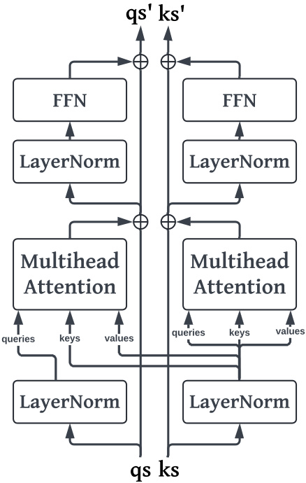  

Figure 1: KRBlock architecture. Queries and keys have their own residual pathways, but keys are used to update queries through cross-attention.  

# 3 TRANSFORMER NEURAL PROCESS - KERNEL REGRESSION (TNP-KR)  

# 3.1KRBlock  

TNP-KR was inspired by TNP-D, which consistently performs well on NP benchmarks and does not make the same assumptions as TNP-A or suffer from miscalibration like TNP-ND. One of the principal limitations of all TNP variants, however, is the $O((n_{C}\!+\!n_{T})^{2})$ attention used by the encoder layers. Recall that $n{\cal C}$ is the number of context points and $n_{T}$ is the number of test points. This also is not strictly necessary because the special mask applied after attention discards many of the calculations, namely, those from context points to test points and those from test points to other test points. Accordingly, we introduce the KRBlock, a transformer block that avoids computing $O(n_{T}^{2}\,+\,n_{C}n T)$ ) attention values altogether. Unlike the original transformer encoder block, TNP-KR also uses pre-normalized residual connections (Xiong et al., 2020), which has been shown to stabilize training and improve performance.  

We call this a KRBlock because the cross-attention from test to context points can be viewed as a form of Nadaraya-Watson kernel regression where the locations are the feature embeddings and the kernel is a dot product softmax kernel. Specifically, if $\alpha$ is the dot product softmax kernel, $\mathbf{q}_{i}$ is a query embedding representing a test point, ${\bf k}_{j}$ is a key embedding representing a context point, and $\mathbf{v}_{j}$ is the value embedding associated with the same context point, crossattention in the KRBlock can be formulated explicitly as Nadaraya-Watson kernel regression:  

$$
f(\mathbf{q}_{i})=\sum_{j}\frac{\alpha(\mathbf{q}_{i},\mathbf{k}_{j})}{\sum_{j}\alpha(\mathbf{q}_{i},\mathbf{k}_{j})}\mathbf{v}_{j}
$$  

Stacking KRBlocks then allows the model to perform iterative kernel regression on increasingly complex internal representations of test and context points. Cross-attention from test to context points costs $O(n_{C}n_{T})$ and the self-attention among contxt points costs $O(n_{C}^{2})$ ), making the total complexity $O(n_{C}^{2}~+$ $n_{C}n_{T}$ ).  

When there are a large number of context points, the $\mathcal{O}(n_{C}^{2})$ ) term can still prove computationally prohibitive. For example, in satellite imagery, a comparatively small image of $300\mathrm{x500}$ results in 150,000 locations or pixels (Heaton et al., 2018). A common application is to inpaint pixels missing due to cloud cover. With 20% of pixels missing, there would still be 120000 context points. This means that even with a KRBlock, the space and time complexity would be on the order of $120000^{2}$ , requiring nearly 60GB of memory and 14.4 billion multiplications per self-attention application. Thus, in order to further scale KRBlocks, we incorporate Performer attention, also known as fast attention (Choromanski et al., 2022).  

# 3.2 Fast Attention  

Fast attention is based on a complete algorithm called Fast Attention with Orthogonal Random features (FAVOR $^+$ ). FAVOR $^+$ allows attention to be calculated in linear space and time complexity without making any assumptions about the sparsity or rank of the attention matrix. It is nearly unbiased and offers uniform converenge and low variance (Choromanski et al., 2022). FAVOR+ constructs an attention matrix $\mathbf{A}^{L\times L}$ where ${\bf A}(i,j)\;=\;K({\bf q}_{i},{\bf k}_{j})$ without ever fully materializing it. For a randomized mapping $\phi:\mathbb{R}^{d}\rightarrow\mathbb{R}_{+}^{r}$ , entries can be estimated with $K(\mathbf{q},\mathbf{k})\,=\,\mathbb{E}\left[\phi(\mathbf{q})^{\mathsf{T}}\phi(\mathbf{k})\right]$ .In fact, most kernels can be modeled using the following mapping:  

$$
\phi(\mathbf{x})=\frac{\mathbf{h}(\mathbf{x})}{\sqrt{m}}\left[f_{1}(\omega_{1}^{\top}\mathbf{x}),\dots,f_{1}(\omega_{m}^{\top}\mathbf{x}),\dots,\right.
$$  

where $f_{1},\dots,f_{l}\,\,\,:\,\,\mathbb{R}\;\,\,\to\;\,\mathbb{R}$ →,$h\ :\ \mathbb{R}^{d}\ \rightarrow\ \mathbb{R}$ →, and $\omega_{1},\ldots,\omega_{m}\ {\overset{\mathrm{iid}}{\sim}}\ D$ ∼D . When $\mathcal{D}=\mathcal{N}(0,\mathbf{I}_{d})$ , this leads to the Gaussian kernel, $K_{\mathrm{gauss}}$ . Ignoring the $\sqrt{d}$ normalization, the softmax kernel is defined as $\mathrm{SM}(\mathbf{q},\mathbf{k}):=$ $\exp(\mathbf{q}^{\mathsf{T}}\mathbf{k})$ . Furthermore, the softmax kernel can be expressed as a function of $K_{\mathrm{gauss}}$ :  

$$
\mathrm{SM}(\mathbf{q},\mathbf{k})=\exp\left(\frac{\|\mathbf{q}\|^{2}}{2}\right)K_{\mathrm{gauss}}(\mathbf{q},\mathbf{k})\exp\left(\frac{\|\mathbf{k}\|^{2}}{2}\right)
$$  

$\begin{array}{r}{h(\mathbf{x})=\exp\left(\frac{||\mathbf{x}||^{2}}{2}\right)}\end{array}$ Thus, the softmax kernel can be defined using ,$f_{1}=\sin$ , and $f_{2}=\mathrm{cos}$ . Unfortu$\phi$ where nately, this representation behaves poorly around zero when the trigonometric functions return negative values, so Choromanski et al. introduce positive random features (PRFs) for softmax. This results in the form:  

$$
\mathrm{SM}(\mathbf{q},\mathbf{k})=\mathbb{E}_{\omega\sim\mathcal{N}(0,\mathbf{I}_{d})}\left[e^{\omega^{\top}\mathbf{q}-\frac{\|\mathbf{q}\|^{2}}{2}}e^{\omega^{\top}\mathbf{k}-\frac{\|\mathbf{k}\|^{2}}{2}}\right]
$$  

which implies h$\begin{array}{r}{h(\mathbf{x})\ =\ \exp\left(-\frac{\left\|\mathbf{x}\right\|^{2}}{2}\right)}\end{array}$ and $f_{1}~=~\mathrm{exp}$ .This approximation is further improved by forcing the $\omega$ random vectors to be normalized and orthogonal (OR $^+$ ).  

Mapping the query and key matrices through these ojections, $\phi(\mathbf{Q})=\mathbf{Q}^{\prime}\in\mathbb{R}^{L\times r}$ and $\phi(\mathbf{K})=$ $\mathbf{K}^{\prime}\in\mathbb{R}^{L\times r}$ ∈, attention can be reexpressed as follows:  

$$
\begin{array}{r}{\widehat{\mathrm{Attention}}(\mathbf{Q},\mathbf{K},\mathbf{V})=\hat{\mathbf{D}}^{-1}(\underbrace{\mathbf{Q}^{\prime}((\mathbf{K}^{\prime})^{\intercal}\mathbf{V})}_{\mathcal{O}(L r d)}),}\\ {\hat{\mathbf{D}}=\mathrm{diag}(\mathbf{Q}^{\prime}((\mathbf{K}^{\prime})^{\intercal}\mathbf{1}_{L})).}\end{array}
$$  

Thus, by carefully controlling the order of matrix multiplications, space complexity can be reduced from $O(L^{2}+L d)$ to $\mathcal{O}(L r+L d+r d)$ and time complexity can be reduced from $O(L^{2}d)$ to $\mathcal{O}(L r d)$ . We demonstrate the impact of the KRBlock and fast attention on runtime and memory in Tables 1 and 2.  

# 4 EXPERIMENTS  

In order to evaluate the performance of TNP-KR, we test its performance across standard benchmarks, which include GPs, image completion, and simple Bayesian Optimization (BO). All experiments were performed on a single 24GB Nvidia RTX 4090 GPU.  

# 4.1 1D Gaussian Processes  

For one-dimensional GPs, we evaluate the principal NP models on the the RBF, periodic, and Mat´ern $3/2$ kernels. For each of these kernels, $\sigma^{2}$ can be factored out and used to standardize the data. Accordingly, in our tests, we assume the data has been standardized so the models can focus on learning and differentiating lengthscales. While standard benchmarks sample lengthscales from 0.1 to 0.6 uniformly to model over domain on the domain $[-2,2]$ , we sample lengthscales according to $\ell\sim\mathrm{Beta}(\alpha=3,\beta=7)$ ), which has both a mean and median of approximately 0.3. This is a more challenging benchmark that allows for greater differentiation among models since more than $50\%$ of lengthscales fall below 0.3 and less than $10\%$ lie above 0.5. (In practice, we found most models could easily learn lengthscales above 0.5). For the periodic kernel, we also sample the period uniformly from 0.5 to 2, which represents between 2 and 8 cycles on the domain $[-2,2]$ .  

Each model is seeded 5 times and trained on 100,000 batches of size 32. For each seed, the models are evaluated on a final test set consisting of 5,000 batches of size 32. Each sample in each batch consists of 50 randomly sampled locations and 100 linearly spaced points throughout the domain. Between 3 and 50 of the randomly sampled points are used as context points, and the test points consist of all 150 points. Because many of these models use different heuristics to prevent the collapse of standard deviation at or near context points in the test set, we add an observation noise of 0.1. This added noise prevents collapse and allows us to avoid using model-dependent heuristics, which could artificially hamper their performance and prevent honest comparison. Lastly, all models are trained with a single cosine annealing learning rate schedule, gradient norm clipping with a max norm of 3.0, and the YOGI optimizer (Zaheer et al., 2018). Table 3 shows the mean and standard errors across these test sets for each model and each kernel.  

Table 1: Microseconds ( $\mu s$ ) per sample by varying number of test points and keeping context points fixed at 100. “OOM” indicates Out of Memory error.   

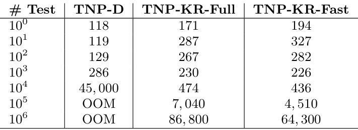  

These models can then be used in a simple onedimensional Bayesian Optimization (BO) setting where each model is given ten observed starting points. BO then uses the model to calculate the expected improvement across the domain and selects the point where that metric is greatest. There is a fixed budget of 50 iterations and the objective is to identify the function’s minimum. Table 4 shows the mean and standard error of regret across 5 seeds for each model Table 2: Microseconds ( $\mu s$ s) per sample by varying number of context points and keeping test points fixed at 100. “OOM” indicates Out of Memory error.  

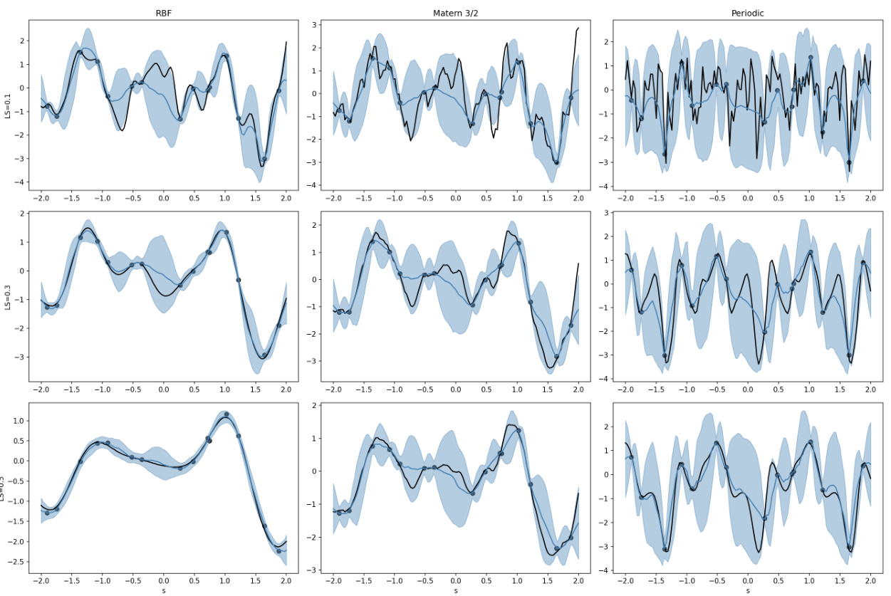  
Figure 2: Posterior predictive samples for TNP-KR-Fast. Black line is the true function, black dots are noisy observations, blue line is model mean prediction, and shaded blue area is $95\%$ confidence region.  

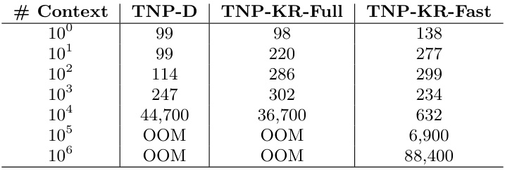  

and each kernel. There are 100 tasks per seed. Here, ConvCNP performs best across the board, which is likely due to the fact that the convolutional kernels in this model introduce a strong local inductive bias, so it is able to identify functional patterns that fall within its kernel width with very few context points.  

# 4.2 2D Gaussian Processes  

For the two-dimensional Gaussian Processes, we test the the RBF kernel on the domain $[-2,2]^{2}$ . The test points consist of 128 randomly selected points on the domain as well as 256 on a uniform grid over the domain. The context points consist of between 12 and Table 3: 1D GP mean and standard error of negative log-likelihoods over 5 runs, where the score for each run consists of the average negative log-likelihood over 5,000 batches of 32. Best model in bold.  

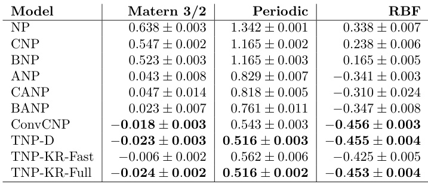  

128 of the randomly selected points, which represents between 5% and 50% of the number on the uniform grid. Each model is trained on 100,000 batches of size 16 and tested on 5,000 batches of size 16. The other training settings remain the same as the onedimensional case. Here TNP-D and TNP-KR with full attention perform best. Although ConvCNP was omitted due to the time required to optimize its kernel and grid for the benchmark, we believe it would also perform competitively here.  

Table 4: 1D Bayesian Optimization mean and standard error of 500 samples on domain [-2, 2]. Best model in bold.  

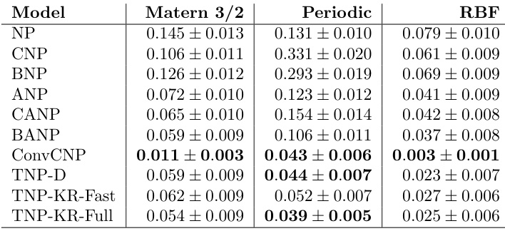  

Table 5: 2D GP mean and standard error of negative log-likelihoods over 5 runs, where the score for each run consists of the average negative log-likelihood over 5,000 batches of 16. Best model in bold.  

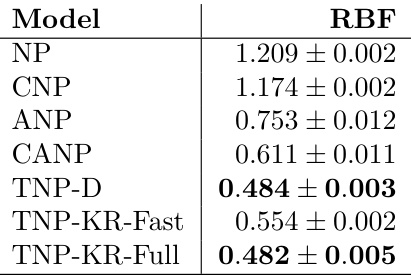  

# 4.3 Image Completion  

The last standard benchmarks consist of image completion. In Tables 6, 7, and 8 we compare the same models on the MNIST, CelebA, and CIFAR-10 benchmarks. Each model is trained on 100,000 batches of size 32 and tested on 5,000 batches of size 32. In each of the samples, the model is presented with 200 test points where anywhere between 3 and 100 of them are provided as context points.  

Table 6: MNIST mean and standard error of negative log-likelihoods over 5 runs, where the score for each run consists of the average negative log-likelihood over 5,000 batches of 32. Best model in bold.  

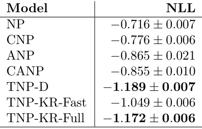  

Table 7: CelebA mean and standard error of negative log-likelihoods over 5 runs, where the score for each run consists of the average negative log-likelihood over 5,000 batches of 32. Best model in bold.  

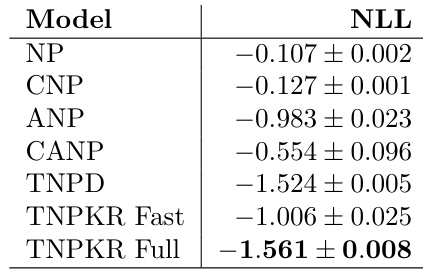  

Table 8: Cifar-10 mean and standard error of negative log-likelihoods over 5 runs, where the score for each run consists of the average negative log-likelihood over 5,000 batches of 32. Best model in bold.  

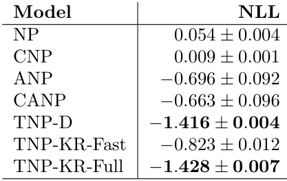  

# 5 CONCLUSION  

In this work, we introduce TNP-KR, an extension to TNP-D that incorporates KRBlocks and fast attention. We believe this represents an important step in scaling transformer-based models for large spatiotemporal applications, which include population genetics, epidemiology, and meteorlology, among others. In the future, we plan to explore alternative kernels in both full and fast attention, as well as attention bias that explicitly takes into account pairwise distances. We also plan to explore mechanisms for sampling transformerbased models that respect covariance structures in such a fashion that we could embed TNP-KR and its variants in inference frameworks such as NumPyro and Stan.  

# Acknowledgements  

D.J. acknowledges his Google DeepMind scholarship. E.S. acknowledges support in part by the AI2050 program at Schmidt Sciences (Grant [G-22-64476]). S.F. acknowledges the EPSRC (EP/V002910/2).  

# References  

Blei, David M., Alp Kucukelbir, and Jon D. McAuliffe (Apr. 3, 2017). “Variational Inference: A Review for Statisticians”. In: Journal of the American Statistical Association 112.518, pp. 859–877. issn : 0162- 1459, 1537-274X. doi :10.1080/01621459.2017. 1285773 . arXiv: 1601 . 00670[cs , stat] .url :http://arxiv.org/abs/1601.00670 (visited on 07/30/2024).   
Choromanski, Krzysztof et al. (Nov. 19, 2022). “Rethinking Attention with Performers”. In: arXiv:2009.14794. doi :10 . 48550 / arXiv . 2009 . 14794 .arXiv: 2009 . 14794[cs , stat] .url :http://arxiv.org/abs/2009.14794 (visited on 05/01/2024).   
Garnelo, Marta, Dan Rosenbaum, et al. (July 4, 2018). “Conditional Neural Processes”. In: arXiv:1807.01613. doi :10 . 48550 / arXiv . 1807 . 01613 .arXiv: 1807 . 01613[cs , stat] .url :http://arxiv.org/abs/1807.01613 (visited on 07/03/2024).   
Garnelo, Marta, Jonathan Schwarz, et al. (2018). Neural Processes . arXiv: 1807 . 01622 [cs.LG] .url :https://arxiv.org/abs/1807.01622 .  
Gordon, Jonathan et al. (June 25, 2020). Convolutional Conditional Neural Processes . arXiv: 1910. 13556[cs,stat] .url :http://arxiv.org/abs/ 1910.13556 (visited on 04/16/2024).   
He, Kaiming et al. (June 2016). “Deep Residual Learning for Image Recognition”. In: pp. 770–778. doi :10.1109/CVPR.2016.90 .  
Heaton, Matthew J. et al. (Apr. 25, 2018). A Case Study Competition Among Methods for Analyzing Large Spatial Data .doi :10.48550/arXiv.1710. 05013 . arXiv: 1710 . 05013[stat] .url :http : / / arxiv . org / abs / 1710 . 05013 (visited on 12/01/2023).   
Hensman, James, Nicolo Fusi, and Neil D Lawrence (2013). “Gaussian processes for big data”. In: arXiv preprint arXiv:1309.6835 .  
Huggins, Jonathan et al. (2020). “Validated variational inference via practical posterior error bounds”. In: International Conference on Artificial Intelligence and Statistics . PMLR, pp. 1792–1802.   
Kim, Hyunjik et al. (July 9, 2019). “Attentive Neural Processes”. In: arXiv:1901.05761. doi :10.48550/ arXiv.1901.05761 . arXiv: 1901.05761[cs,stat] .url :http://arxiv.org/abs/1901.05761 (visited on 04/02/2024).   
Kingma, Diederik P and Max Welling (2022). AutoEncoding Variational Bayes . arXiv: 1312 . 6114 [stat.ML] .url :https://arxiv.org/abs/1312. 6114 .  
Lee, Juho et al. (Oct. 27, 2020). Bootstrapping Neural Processes .doi :10 . 48550 / arXiv . 2008 . 02956 . arXiv: 2008.02956[cs,stat] .url :http: / / arxiv . org / abs / 2008 . 02956 (visited on 05/19/2024).   
Lindgren, Finn, Johan Lindstr¨om, and H˚avard Rue (2010). “An explicit link between gaussian fields and gaussian markov random fields; the spde approach”. In.   
Mishra, Swapnil et al. (Sept. 13, 2022). πVAE: a stochastic process prior for Bayesian deep learning with MCMC .doi :10 . 48550 / arXiv . 2002 . 06873 . arXiv: 2002.06873[cs,stat] .url :http: / / arxiv . org / abs / 2002 . 06873 (visited on 07/30/2024).   
Murphy, Kevin P. (2023). Probabilistic Machine Learning: Advanced Topics . MIT Press. url :http : / / probml.github.io/book2 .  
Nguyen, Tung and Aditya Grover (Feb. 7, 2023). Transformer Neural Processes: Uncertainty-Aware Meta Learning Via Sequence Modeling .doi :10 . 48550 / arXiv . 2207 . 04179 .arXiv: 2207 . 04179[cs] .url :http://arxiv.org/abs/2207. 04179 (visited on 04/13/2024).   
Rue, H˚avard, Sara Martino, and Nicolas Chopin (2009). “Approximate Bayesian inference for latent Gaussian models by using integrated nested Laplace approximations”. In: Journal of the Royal Statistical Society Series B: Statistical Methodology 71.2, pp. 319–392.   
Semenova, Elizaveta, Prakhar Verma, et al. (2023). “PriorCVAE: scalable MCMC parameter inference with Bayesian deep generative modelling”. In: arXiv preprint arXiv:2304.04307 .  
Semenova, Elizaveta, Yidan Xu, et al. (June 2022). “PriorVAE: Encoding spatial priors with VAEs for small-area estimation”. In: Journal of The Royal Society Interface 19.191, p. 20220094. issn : 1742- 5662. doi :10.1098/rsif.2022.0094 . arXiv: 2110. 10422[cs,stat] .url :http://arxiv.org/abs/ 2110.10422 (visited on 07/30/2024).   
Solin, Arno and Simo S¨arkk¨a (2020). “Hilbert space methods for reduced-rank Gaussian process regression”. In: Statistics and Computing 30.2, pp. 419– 446.   
Wilson, Andrew Gordon, Christoph Dann, and Hannes Nickisch (2015). “Thoughts on massively scalable Gaussian processes”. In: arXiv preprint arXiv:1511.01870 .  
Xiong, Ruibin et al. (2020). On Layer Normalization in the Transformer Architecture . arXiv: 2002.04745 [cs.LG] .url :https://arxiv.org/abs/2002. 04745 .  
Yao, Yuling et al. (2018). “Yes, but did it work?: Evaluating variational inference”. In: International  

Conference on Machine Learning . PMLR, pp. 5581– 5590.  

Zaheer, Manzil et al. (2018). “Adaptive Methods for Nonconvex Optimization”. In: Advances in Neural Information Processing Systems . Ed. by S. Bengio et al. Vol. 31. Curran Associates, Inc. url :https : / / proceedings . neurips . cc / paper _ files / paper / 2018 / file / 90365351ccc7437a1309dc64e4db32a3-Paper.pdf .  

# APPENDIX  

ALGORITHMS  

# Algorithm 1 Transformer Encoder Block forward pass.  

1: Input: $\mathbf{x}_{\mathrm{0}}$ , mask, pdropout   
2: $\mathbf{x}_{1}\leftarrow\mathrm{MultiheadAttention}(\mathbf{x},\mathbf{x},\mathbf{x},\mathrm{mask})$   
3: $\mathbf{x}_{2}\gets\mathbf{x}_{0}+\mathrm{Dropout}(\mathbf{x}_{1},p_{\mathrm{dropout}})$ )  
4: $\mathbf{x}_{3}\gets\mathrm{LayerNorm}(\mathbf{x}_{2})$   
5: $\mathbf{x}_{4}\leftarrow\mathrm{FeedForward}(\mathbf{x}_{3})$   
6: x$\mathbf{x}_{5}\gets\mathbf{x}_{3}+\mathrm{Dropout}(\mathbf{x}_{4},p_{\mathrm{dropout}})$ ←  
7: return x $\mathbf{x}_{5}$  

# Algorithm 2 KRBlock forward pass.  

Input: $\mathbf{qs}_{0}$ ,$\mathbf{ks}_{0}$ , mask, $p$ dropout   
$\mathbf{qs}_{1}\leftarrow\mathrm{LayerNorm}_{1}(\mathbf{qs}_{0})$   
$\mathbf{ks}_{1}\leftarrow\mathrm{LayerNorm}_{1}(\mathbf{ks}_{0})$   
$\mathbf{qs}_{2}\gets\mathrm{MultiheadAttention}(\mathbf{qs}_{1},\mathbf{ks}_{1},\mathbf{ks}_{1},\mathrm{maxk}_{2})$ )  
$\mathbf{\boldsymbol{k}}\mathbf{s}_{2}\gets\mathrm{{MultiheadAttention}(\mathbf{k}\mathbf{s}_{1},\mathbf{k}\mathbf{s}_{1},\mathbf{k}\mathbf{s}_{1},\mathrm{{maxk})}}$   
$\mathbf{qs}_{3}\gets\mathbf{qs}_{0}+\mathrm{Dropout}(\mathbf{qs}_{2},p_{\mathrm{dropout}})$   
$\mathbf{ks}_{3}\gets\mathbf{ks}_{0}+\mathrm{Dropout}(\mathbf{ks}_{2},p_{\mathrm{dropout}})$   
$\mathbf{qs}_{4}\leftarrow\mathrm{LayerNorm}_{2}(\mathbf{qs}_{3})$   
$\mathbf{ks}_{4}\leftarrow\mathrm{LayerNorm}_{2}(\mathbf{ks}_{3})$   
$\mathbf{qs}_{5}\leftarrow\operatorname{FeedForward}(\mathbf{qs}_{4})$   
$\mathbf{ks}_{5}\leftarrow\operatorname{FeedForward}(\mathbf{ks}_{4})$   
$\mathbf{qs}_{6}\gets\mathbf{qs}_{3}+\mathrm{Dropout}(\mathbf{qs}_{5},p_{\mathrm{dropout}})$   
$\mathbf{ks}_{6}\gets\mathbf{ks}_{3}+\mathrm{Dropout}(\mathbf{ks}_{5},p_{\mathrm{dropout}})$ ←  
return qs ${\bf q s}_{6},{\bf k s}_{6}$  

# ADDITIONAL FIGURES  

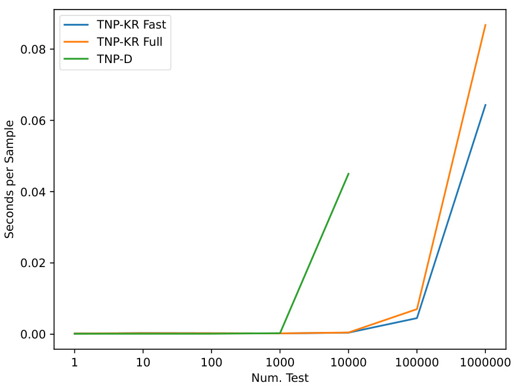  

Figure 3: Scaling test points in TNP models, keeping number of context points fixed at 100.  

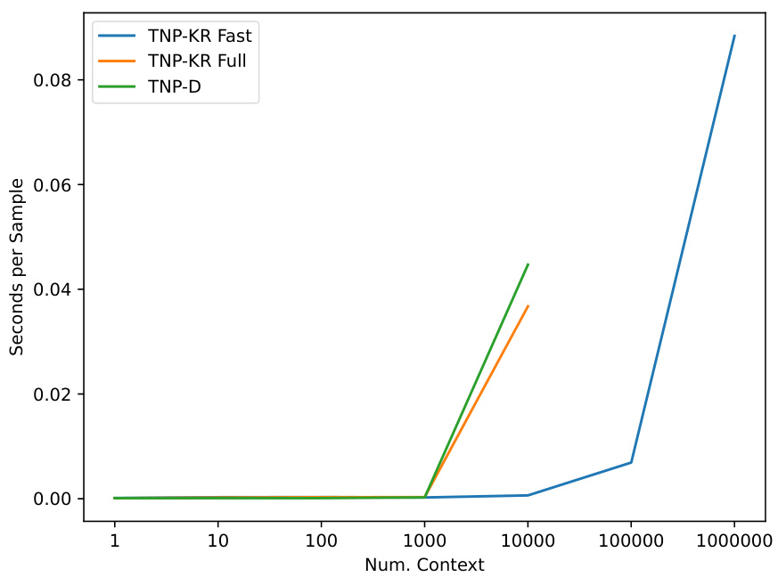  
Figure 4: Scaling context points in TNP, keeping number of test points fixed at 100.  

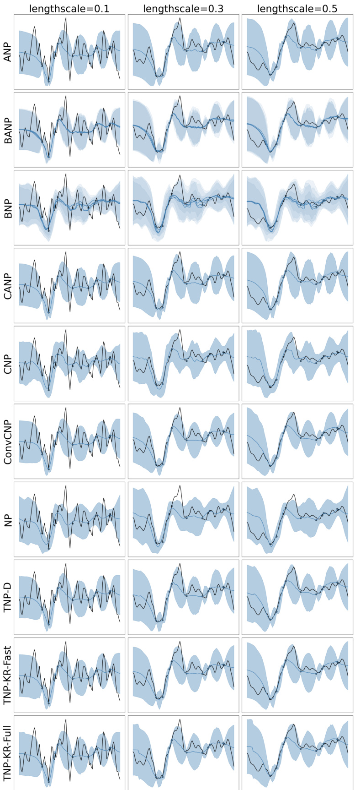  
Figure 5: 1D GP Matern 3/2 samples. The black line is the true function, the black dots are noisy observations, the blue line is the model’s mean prediction, and the shaded blue is the uncertainty. Models perform similarly, but ConvCNP and the TNP variants have the tightest uncertainty bounds.  

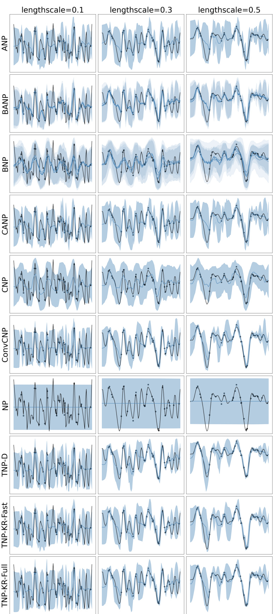  
Figure 6: 1D GP periodic samples. The black line is the true function, the black dots are noisy observations, the blue line is the model’s mean prediction, and the shaded blue is the uncertainty. Some models struggle to model low period periodic functions, particularly NPs. ConvCNP and TNP variants have the tightest uncertainty bounds.  

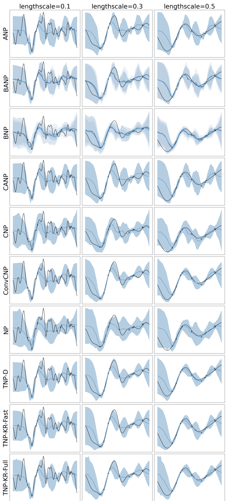  
Figure 7: 1D GP RBF samples. The black line is the true function, the black dots are noisy observations, the blue line is the model’s mean prediction, and the shaded blue is the uncertainty. Most models do well on this task, but ConvCNP and the TNP variants have marginally tighter uncertainty bounds.  

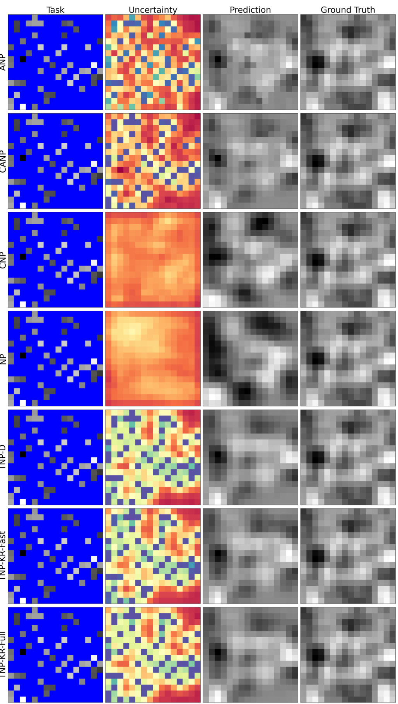  
Figure 8: 2D GP RBF sample. In the Task panel, masked blue pixels are unoberved locations. In the Uncertainty panel, warmer colors signify greater uncertainty. NP and CNP struggle to model in two dimensions. TNP variants perform better than ANP variants, largely due to the increased accuracy of transformer blocks.  

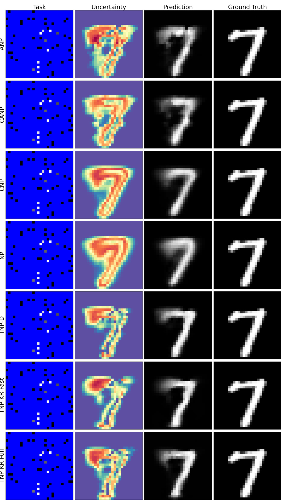  
Figure 9: MNIST sample. In the Task panel, masked blue pixels are unoberved locations. In the Uncertainty panel, warmer colors signify greater uncertainty. Predictions are relatively consistent among models, but the TNP variants have better uncertainty bounds, particularly around observed context points.  

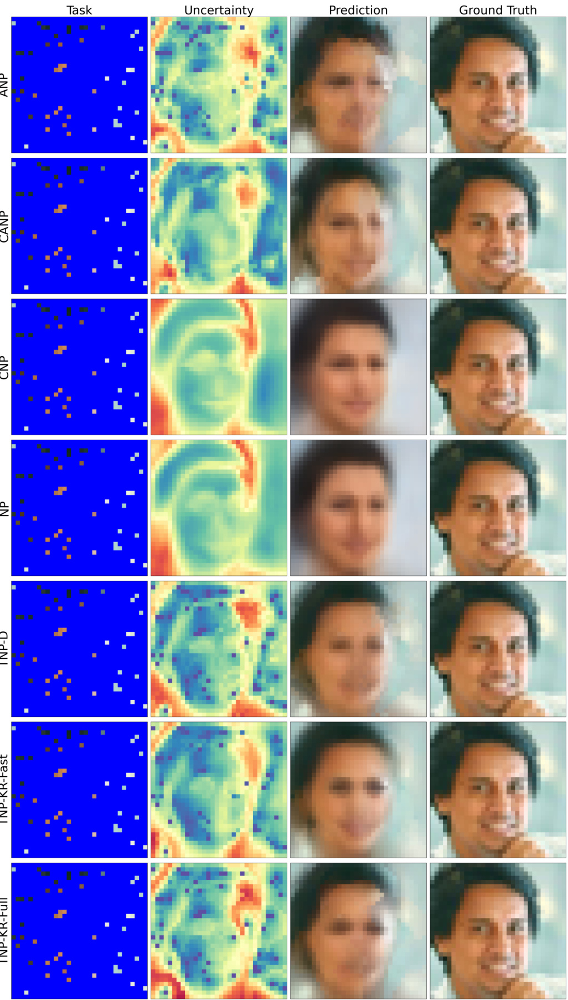  
Figure 10: CelebA sample. In the Task panel, masked blue pixels are unoberved locations. In the Uncertainty panel, warmer colors signify greater uncertainty. NP and CNP tend to oversmooth, while TNP and ANP variants are able to identify more details, particularly at observed context points. There are purple dots for TNP and ANP variants, indicating that the model is highly confident in the uncertainty bounds around observed points, but NP and CNP tend to oversmooth at context points.  

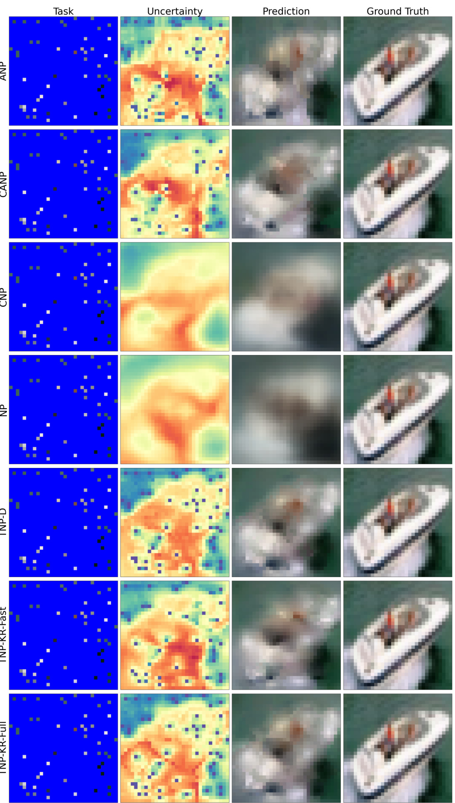  
Figure 11: Cifar 10 sample. In the Task panel, masked blue pixels are unoberved locations. In the Uncertainty panel, warmer colors signify greater uncertainty. NP and CNP models oversmooth, while TNP and ANP variants appear grainy due to attention focusing on pixels in different regions of the image.  