#  

John C. Baez 2024  

To my wife, Lisa Raphals  

# Foreword  

Once there was a thing called Twitter, where people exchanged short messages called ‘tweets’. While it had its flaws, I came to like it and eventually decided to teach a short course on entropy in the form of tweets. This little book is a slightly expanded version of that course.  

It’s easy to wax poetic about entropy, but what is it? I claim it’s the amount of information we don’t know about a situation, which in principle we could learn. But how can we make this idea precise and quantitative? To focus the discussion I decided to tackle a specific puzzle: why does hydrogen gas at room temperature and pressure have an entropy corresponding to about 23 unknown bits of information per molecule? This gave me an excuse to explain these subjects:  

• information   
• Shannon entropy and Gibbs entropy   
• the principle of maximum entropy   
• the Boltzmann distribution   
• temperature and coolness   
• the relation between entropy, expected energy and temperature • the equipartition theorem   
• the partition function   
• the relation between entropy, free energy and expected energy • the entropy of a classical harmonic oscillator   
• the entropy of a classical particle in a box   
• the entropy of a classical ideal gas.  

I have largely avoided the second law of thermodynamics, which says that entropy always increases. While fascinating, this is so problematic that a good explanation would require another book! I have also avoided the role of entropy in biology, black hole physics, etc. Thus, the aspects of entropy most beloved by physics popularizers will not be found here. I also never say that entropy is ‘disorder’.  

I have tried to say as little as possible about quantum mechanics, to keep the physics prerequisites low. However, Planck’s constant shows up in the formulas for the entropy of the three classical systems mentioned above. The reason for this is fascinating: Planck’s constant provides a unit of volume in position-momentum space, which is necessary to define the entropy of these systems. Thus, we need a tiny bit of quantum mechanics to get a good approximate formula for the entropy of hydrogen, even if we are trying our best to treat this gas classically.  

Since I am a mathematical physicist, this book is full of math. I spend more time trying to make concepts precise and looking into strange counterexamples than an actual ‘working’ physicist would. If at any point you feel I am sinking into too many technicalities, don’t be shy about jumping to the next tweet. The really important stu! is in the boxes. It may help to reach the end before going back and learning all the details. It’s up to you.  

# Contents  

THE ENTROPY OF THE OBSERVABLE UNIVERSE . . . . . . . . . . . . 1   
THE ENTROPY OF HYDROGEN . . . . . . . . . . . . . . . . . . . . . . . 2   
WHERE ARE WE GOING? . . . . . . . . . . . . . . . . . . . . . . . . . . . 3   
FIVE KINDS OF ENTROPY . . . . . . . . . . . . . . . . . . . . . . . . . . 4   
FROM PROBABILITY TO INFORMATION . . . . . . . . . . . . . . . . . 5   
UNITS OF INFORMATION . . . . . . . . . . . . . . . . . . . . . . . . . . . 7   
THE INFORMATION IN A LICENSE PLATE NUMBER . . . . . . . . . . 8   
THE INFORMATION IN A LICENSE PLATE . . . . . . . . . . . . . . . . 10   
JUSTIFYING THE FORMULA FOR INFORMATION . . . . . . . . . . . . 11   
WHAT IS PROBABILITY? . . . . . . . . . . . . . . . . . . . . . . . . . . . 13   
PROBABILITY MEASURES . . . . . . . . . . . . . . . . . . . . . . . . . . 14   
SHANNON ENTROPY: A FIRST TASTE . . . . . . . . . . . . . . . . . . . 16   
SHANNON ENTROPY: A SECOND TASTE . . . . . . . . . . . . . . . . . 17   
THE DEFINITION OF SHANNON ENTROPY . . . . . . . . . . . . . . . . 18   
THE PRINCIPLE OF MAXIMUM ENTROPY . . . . . . . . . . . . . . . . 20   
ADMITTING YOUR IGNORANCE . . . . . . . . . . . . . . . . . . . . . . 22   
THE BOLTZMANN DISTRIBUTION . . . . . . . . . . . . . . . . . . . . . 23   
MAXIMIZATION SUBJECT TO A CONSTRAINT . . . . . . . . . . . . . 25   
MAXIMIZING ENTROPY SUBJECT TO A CONSTRAINT . . . . . . . . 26   
THERMAL EQUILIBRIUM . . . . . . . . . . . . . . . . . . . . . . . . . . . 29   
COOLNESS . . . . . . . . . . . . . . . . . . . . . . . . . . . . . . . . . . . . 30   
COOLNESS VERSUS TEMPERATURE . . . . . . . . . . . . . . . . . . . . 31   
TEMPERATURE . . . . . . . . . . . . . . . . . . . . . . . . . . . . . . . . 32   
INFINITE TEMPERATURE . . . . . . . . . . . . . . . . . . . . . . . . . . 34   
NEGATIVE TEMPERATURE . . . . . . . . . . . . . . . . . . . . . . . . . 35   
ABSOLUTE ZERO: THE LIMIT OF INFINITE COOLNESS . . . . . . . . 36   
THE HAGEDORN TEMPERATURE . . . . . . . . . . . . . . . . . . . . . 37   
THE FINITE VERSUS THE CONTINUOUS . . . . . . . . . . . . . . . . . 39   
ENTROPY, ENERGY AND TEMPERATURE . . . . . . . . . . . . . . . . 41   
THE CHANGE IN ENTROPY . . . . . . . . . . . . . . . . . . . . . . . . . 43   
THE THIRD LAW OF THERMODYNAMICS . . . . . . . . . . . . . . . . 44   
MEASURING ENTROPY . . . . . . . . . . . . . . . . . . . . . . . . . . . . 46   
THE EQUIPARTITION THEOREM . . . . . . . . . . . . . . . . . . . . . . 47   
THE EQUIPARTITION THEOREM—BACKGROUND . . . . . . . . . . . 48   
PROOF OF THE EQUIPARTITION THEOREM: 1 . . . . . . . . . . . . . 49   
PROOF OF THE EQUIPARTITION THEOREM: 2 . . . . . . . . . . . . . 50   
PROOF OF THE EQUIPARTITION THEOREM: 3 . . . . . . . . . . . . . 51   
THE AVERAGE ENERGY OF AN ATOM . . . . . . . . . . . . . . . . . . 53   
THE ENERGY OF HYDROGEN . . . . . . . . . . . . . . . . . . . . . . . . 54   
ENTROPY OF THE HARMONIC OSCILLATOR: 1 . . . . . . . . . . . . . 55   
ENTROPY OF THE HARMONIC OSCILLATOR: 2 . . . . . . . . . . . . . 57   
ENTROPY OF THE HARMONIC OSCILLATOR: 3 . . . . . . . . . . . . . 58   
ENTROPY OF THE HARMONIC OSCILLATOR: 4 . . . . . . . . . . . . . 59   
ENTROPY OF THE HARMONIC OSCILLATOR: 5 . . . . . . . . . . . . . 61   
ENTROPY OF THE HARMONIC OSCILLATOR: 6 . . . . . . . . . . . . . 62   
ENTROPY OF THE HARMONIC OSCILLATOR: 7 . . . . . . . . . . . . . 63   
WHERE ARE WE NOW? . . . . . . . . . . . . . . . . . . . . . . . . . . . . 64   
THE PARTITION FUNCTION . . . . . . . . . . . . . . . . . . . . . . . . . 65   
THE PARTITION FUNCTION KNOWS ALL! . . . . . . . . . . . . . . . . 67   
THE PARTITION FUNCTION KNOWS THE EXPECTED ENERGY . . . 68   
THE PARTITION FUNCTION KNOWS THE ENTROPY . . . . . . . . . 69   
THE PARTITION FUNCTION KNOWS THE FREE ENERGY . . . . . . . 70   
THE PARTITION FUNCTION KNOWS ALL: REVISITED . . . . . . . . . 71   
THE MEANING OF THE PARTITION FUNCTION . . . . . . . . . . . . . 72   
ENTROPY COMES IN TWO PARTS . . . . . . . . . . . . . . . . . . . . . 74   
THE POWER OF THE PARTITION FUNCTION . . . . . . . . . . . . . . 75   
HARMONIC OSCILLATOR: PARTITION FUNCTION . . . . . . . . . . . 76   
HARMONIC OSCILLATOR: EXPECTED ENERGY . . . . . . . . . . . . . 77   
HARMONIC OSCILLATOR: FREE ENERGY . . . . . . . . . . . . . . . . 78   
HARMONIC OSCILLATOR: ENTROPY . . . . . . . . . . . . . . . . . . . 79   
PARTICLE IN A BOX: PARTITION FUNCTION . . . . . . . . . . . . . . 80   
PARTICLE IN A BOX: EXPECTED ENERGY . . . . . . . . . . . . . . . . 81   
PARTICLE IN A BOX: FREE ENERGY . . . . . . . . . . . . . . . . . . . 83   
PARTICLE IN A BOX: ENTROPY . . . . . . . . . . . . . . . . . . . . . . 84   
WHERE ARE WE NOW? . . . . . . . . . . . . . . . . . . . . . . . . . . . . 85   
THE WAVELENGTH OF A PARTICLE . . . . . . . . . . . . . . . . . . . . 86   
THE WAVELENGTH OF A WARM PARTICLE . . . . . . . . . . . . . . . 87   
THE PARTITION FUNCTION AND THE THERMAL WAVELENGTH . . 88   
FREE ENERGY AND THE THERMAL WAVELENGTH . . . . . . . . . . 89   
ENTROPY AND THE THERMAL WAVELENGTH . . . . . . . . . . . . . 90   
PARTICLE IN A 3D BOX: PARTITION FUNCTION . . . . . . . . . . . . 92   
PARTICLE IN A 3D BOX: ENTROPY . . . . . . . . . . . . . . . . . . . . 93   
A TALE OF TWO GASES . . . . . . . . . . . . . . . . . . . . . . . . . . . 94   
GAS OF DISTINGUISHABLE PARTICLES: PARTITION FUNCTION . . 95   
GAS OF DISTINGUISHABLE PARTICLES: ENTROPY . . . . . . . . . . 97   
THE GIBBS “PARADOX” . . . . . . . . . . . . . . . . . . . . . . . . . . . 98   
GAS OF INDISTINGUISHABLE PARTICLES: PARTITION FUNCTION .99   
GAS OF INDISTINGUISHABLE PARTICLES: ENTROPY . . . . . . . . . 100   
STIRLING’S FORMULA . . . . . . . . . . . . . . . . . . . . . . . . . . . . 101   
THE SACKUR–TETRODE EQUATION . . . . . . . . . . . . . . . . . . . . 102   
THE ENTROPY OF AN IDEAL MONATOMIC GAS . . . . . . . . . . . . 103   
WHERE ARE WE NOW? . . . . . . . . . . . . . . . . . . . . . . . . . . . . 106   
ENTROPY PER MOLE VERSUS BITS PER MOLECULE . . . . . . . . . 107   
THE ENTROPY OF HELIUM: THEORY . . . . . . . . . . . . . . . . . . . 108   
THE ENTROPY OF HELIUM: EXPERIMENT . . . . . . . . . . . . . . . . 110   
THE IDEAL DIATOMIC GAS . . . . . . . . . . . . . . . . . . . . . . . . 111   
THE ENTROPY OF HYDROGEN: THEORY . . . . . . . . . . . . . . . . . 112   
THE ENTROPY OF HYDROGEN: EXPERIMENT . . . . . . . . . . . . . 114   
WHERE DID WE GO? . . . . . . . . . . . . . . . . . . . . . . . . . . . . . 115   
THE FIRST LAW OF THERMODYNAMICS . . . . . . . . . . . . . . . . . 116   
THE SECOND LAW OF THERMODYNAMICS . . . . . . . . . . . . . . . 119   
THE THIRD LAW OF THERMODYNAMICS: REVISITED . . . . . . . . . 121  

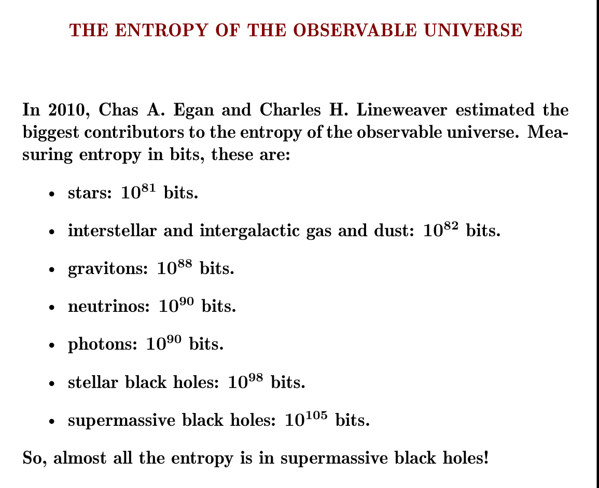  

In 2010, Chas A. Egan and Charles H. Lineweaver estimated the entropy of the observable universe. Entropy corresponds to unknown information, so there’s a heck of a lot we don’t know! For stars, most of this unknown information concerns the details of every single electron and nucleus zipping around in the hot plasma. There’s more entropy in interstellar and intergalactic gas and dust. Most of the gas here is hydrogen—some in molecular form $\mathrm{H_{2}}$ , some individual atoms, and some ionized. For all this stu!, the unknown information again mostly concerns the details, like the position and momentum, of each of these molecules, atoms and ions.  

There’s a lot more we don’t know about the precise details of other particles whizzing through the universe, like gravitons, neutrinos and photons. But there’s even more entropy in black holes! One reason Stephen Hawking is famous is that he figured out how to compute the entropy of black holes. To do that you need a combination of statistical mechanics, general relativity and quantum physics. Statistical mechanics is the study of physical systems where there’s unknown information, which you study using probability theory. I’ll explain some of that in these tweets. General relativity is Einstein’s theory of gravity, and while I’ve explained that elsewhere , I don’t want to get into it here—so I will say nothing about the entropy of black holes.  

Quantum physics was also necessary for Hawking’s calculation, as witnessed by the fact that his answer involves Planck’s constant, which sets the scale of quantum uncertainty in our universe. I will try to steer clear of quantum mechanics in these tweets, but in the end we’ll need a tiny bit of it. There’s a funny sense in which statistical mechanics is somewhat incomplete without quantum mechanics. You’ll eventually see what I mean.  

# THE ENTROPY OF HYDROGEN  

At standard temperature and pressure, hydrogen gas has an entropy of  

130 .68 joule/kelvin per mole But a joule/kelvin of entropy is about $\mathbf{1.0449\cdot10^{23}}$ bits of unknown information and a mole of any chemical is about $\mathbf{6.0221\cdot10^{23}}$ molecules  

So the unknown information about the precise microscopic state of hydrogen is  

130 .68 ·1 6 ..0449 0221 ··10 10 23 23 →23 bits per molecule!  

Egan and Lineweaver estimated the entropy of all the interstellar and intergalactic gas and dust in the observable universe. Entropy corresponds to information we don’t know. Their estimate implies that there are $10^{82}$ bits of information we don’t know about all this gas and dust.  

Most of this stu! is hydrogen. Hydrogen is very simple stu!. So it would be good to understand the entropy of hydrogen. You can measure changes in entropy by doing experiments. If you assume hydrogen has no entropy at absolute zero, you can do experiments to figure out the entropy of hydrogen under other conditions. From this you can calculate that each molecule in a container of hydrogen gas at standard temperature and pressure has about 23 bits of information that we don’t know.  

You can see a sketch of the calculation above. But everything about it is far from obvious! What does ‘missing information’ really mean here? Joules are a unit of energy; kelvin is a unit of temperature. So why is entropy measured in joules per kelvin? Why does one joule per kelvin correspond to $1.0449\cdot10^{23}$ bits of missing information? How can we do experiments to measure changes in entropy? And why is missing information the same as—or more precisely proportional to—entropy?  

The good news: all these questions have answers! You can learn them here. However, you will have to persist. Since I’m starting from scratch it won’t be quick. It takes some math—but luckily, nothing much more than calculus of several variables. When you can calculate the entropy of hydrogen from first principles, and understand what it means, that will count as true success.  

See how it goes! Partial success is okay too.  

The mystery: why does each molecule of hydrogen have of entropy at standard temperature and pressure? $\sim23$ bits The goal: derive and understand the formula for the entropy of a classical ideal monatomic gas:  

$$
S=k N\left({\frac{3}{2}}\ln k T+\ln{\frac{V}{N}}+\gamma\right)
$$  

including the mysterious constant $\gamma$ .  

The subgoal: compute the entropy of a single classical particle in a 1-dimensional box.  

The sub-subgoal: explain entropy from the ground up, and compute the entropy of a classical harmonic oscillator.  

To understand something deeply, it can be good to set yourself a concrete goal. To avoid getting lost in the theory of entropy, let’s try to understand the entropy of hydrogen gas. This is a ‘diatomic’ gas since a hydrogen molecule has two atoms. At standard temperature and pressure it’s close to ‘ideal’, meaning the molecules don’t interact much. It’s also close to ‘classical’, meaning we don’t need to know quantum mechanics to do this calculation. Also, when the hydrogen is not extremely hot, its molecules don’t vibrate much—but they do tumble around.  

Given all this, we can derive a formula for the entropy $S$ of some hydrogen gas as a function of its temperature $T$ , the number $N$ of molecules, the volume $V$ , and a physical constant $k$ called ‘Boltzmann’s constant’. This formula also involves a rather surprising constant which I’m calling $\gamma$ . We’ll figure that out too. It’s so weird I don’t want to give it away!  

As a warmup, we will derive the formula for the entropy of an ideal ‘monatomic’ gas—a gas made of individual atoms, like helium or neon or argon. Sackur and Tetrode worked this out in 1912. Their result, called the Sackur–Tetrode equation, is similar to the one for a diatomic gas.  

But before doing a monatomic gas, we’ll figure out the entropy of a single atom of gas in a box. That turns out to be a good start, since in an ideal monatomic gas the atoms don’t interact, and the entropy of $N$ atoms—as we’ll see—is just $N$ times the entropy of a single atom.  

But before we can do any of this, we need to understand what entropy is, and how to compute it. It will take quite a bit of time to compute the entropy of a classical harmonic oscillator! But from then on, the rest is surprisingly quick.  

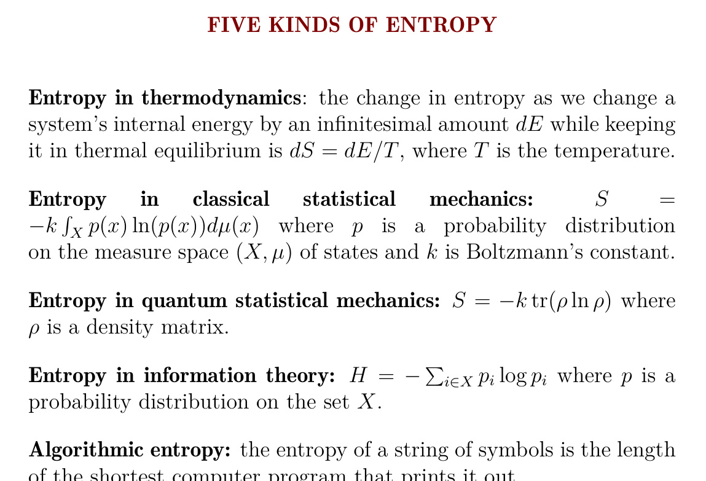  

Before I actually start explaining entropy, a warning: it can be hard at first to learn about entropy because there are many kinds—and people often don’t say which kind they’re talking about. Here are 5 kinds. Luckily, they are closely related!  

In thermodynamics we primarily have a formula for the change in entropy: if you change the internal energy of a system by an infinitesimal amount $d E$ while keeping it in thermal equilibrium, the infinitesimal change in entropy is $d S=d E/T$ where $T$ is the temperature.  

Later, in classical statistical mechanics, Gibbs explained entropy in terms of a probability distribution $p$ on the space of states of a classical system. In this framework, entropy is the integral of $-p\ln p$ times a constant $k$ called Boltzmann’s constant.  

Later von Neumann generalized Gibbs’ formula for entropy from classical to quantum statistical mechanics! He replaced the probability distribution $p$ by a so-called density matrix $\rho$ , and the integral by a trace.  

Later Shannon invented information theory, and a formula for the entropy of a probability distribution on a set (often a finite set). This is often called ‘Shannon entropy’. It’s just a special case of Gibbs’ formula for entropy in classical statistical mechanics, but without the Boltzmann’s constant.  

Later still, Kolmogorov invented a formula for the entropy of a specific string of symbols. It’s just the length of the shortest program, written in bits, that prints out this string. It depends on the computer language, but not too much.  

There’s a network of results connecting all these 5 concepts of entropy. I will first explain Shannon entropy, then entropy in classical statistical mechanics, and then entropy in thermodynamics. While this is the reverse of the historical order, it’s the easiest way to go.  

I will not explain entropy in quantum statistical mechanics: for that I would feel compelled to teach you quantum mechanics first. Nor will I explain algorithmic entropy.  

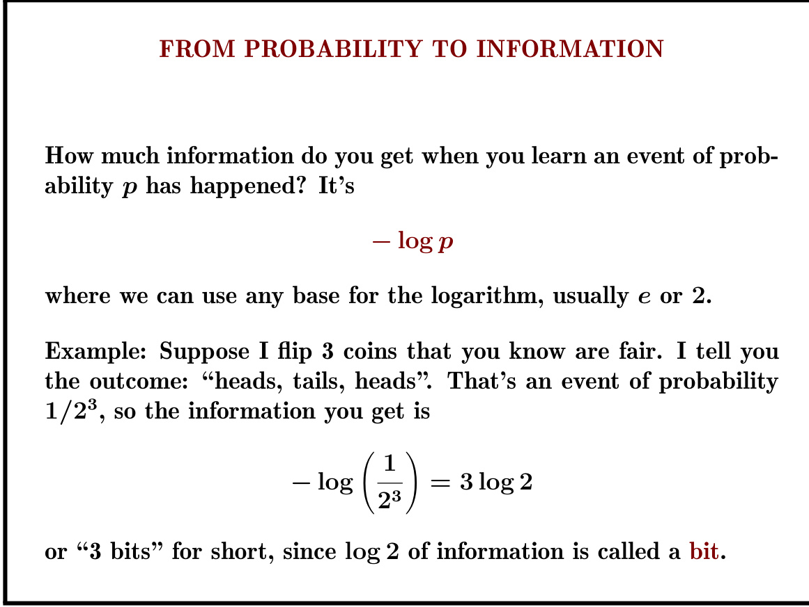  

Here is the simplest link between probability and information: when you learn that an event of probability $p$ has happened, how much information do you get? We say it’s $-\log p$ . We take a logarithm so that when you multiply probabilities, information adds. The minus sign makes information come out positive.  

Beware: when I write ‘ log ’ I don’t necessarily mean the logarithm base 10. I mean that you can use whatever base for the logarithm you want; this choice is like a choice of units. Whatever base $b$ you decide to use, I’ll call $\log_{b}2$ a ‘bit’. For example, if I flip a single coin that you know is fair, and you see that it comes up heads, you learn of an event that’s of probability $1/2$ , so the amount of information you learn is  

$$
-\log_{b}{\frac{1}{2}}=\log_{b}2.
$$  

That’s one bit! Of course if you use base $b=2$ then this logarithm actually equals 1, which is nice.  

To understand the concept of information it helps to do some puzzles.  

Puzzle 1. First I flip 2 fair coins and tell you the outcome. Then I flip 3 more and tell you the outcome. How much information did you get?  

Puzzle 2. I roll a fair 6-sided die and tell you the outcome. Approximately how much information do you get, using logarithms base 2?  

Puzzle 3. When you flip 7 fair coins and tell me the outcome, how much information do I get?  

Puzzle 4. Every day I eat either a cheese sandwich, a salad, or some fried rice for lunch— each with equal probability. I tell you what I had for lunch today. Approximately how many bits of information do you get?  

Puzzle 5. I have a trick coin that always lands heads up. You know this. I flip it 5 times and tell you the outcome. How much information do you receive?  

Puzzle 6. I have a trick coin that always lands heads up. You believe it’s a fair coin. I flip it 5 times and tell you the outcome. How much information do you receive?  

Puzzle 7. I have a trick coin that always lands with the same face up. You know this, but you don’t know which face always comes up. I flip it 5 times and tell you the outcome. How much information do you receive?  

These puzzles raise some questions about the nature of probability, like: is it subjective or objective? People like to argue about those questions. But once we get a probability $p$ , we can convert it to information by computing $-\log p$ .  

# UNITS OF INFORMATION  

An event of probability ${\mathbf{1}}/{\mathbf{2}}$ carries one bit of information. An event of probability $1/e$ carries one nat of information. An event of probability $\mathbf{1/3}$ carries one trit of information.   
An event of probability ${\bf1}/{\bf4}$ carries one crumb of information.   
An event of probability $\mathbf{1}/\mathbf{10}$ carries one hartley of information.   
An event of probability $\mathbf{1}/\mathbf{16}$ carries one nibble of information.   
An event of probability $\mathbf{1}/\mathbf{256}$ carries one byte of information.  

An event of probability $\mathbf{1/2^{8192}}$ carries one kilobyte of information.  

There are many units of information. Using information $=-\log{p}$ we can relate these to probabilities. For example if you see a number in base 10, and each digit shows up with probability $1/10$ , the amount of information you get from each digit is one ‘hartley’.  

How many bits are in a hartley? Remember: no matter what base you use, I call $\log10$ a hartley and $\log2$ a bit. There are $\log10/\log2$ bits in a hartley. This number has the same value no matter what base you use for your logarithms! If you use base 2, it’s  

$$
\log_{2}10/\log_{2}2=\log_{2}10\approx3.32.
$$  

So a hartley is about 3.32 bits.  

If you flip 8 fair coins and tell me what answers you got, I’ve learned of an event that has probability $1/2^{8}=1/256$ . We say I’ve received a ‘byte’ of information. This equals 8 bits of information. Similarly, if you flip $1024\times8$ fair coins and tell me the outcome, I receive a kilobyte of information.  

Or at least that’s the old definition. Now many people define a kilobyte to be 1000 bytes rather than 1024 bytes, in keeping with the usual meaning of the prefix. If you want 1024 bytes you’re supposed to ask for a ‘kibibyte’. When we get to a terabyte, the new definition based on powers of 10 is about $10\%$ less than the old one based on powers of 2: $10^{12}$ bytes rather than $2^{40}\,\approx\,1.0995\,\times\,10^{12}$ . If you want the old larger amount of information you should ask for a ‘tebibyte’.  

Wikipedia has an article that lists many strange units of information . Did you know that 2 bits is a ‘crumb’? Did you even need to know? No, but now you do.  

Feel free to dispose of this unnecessary information! All this is just for fun—but I want you to get used to the formula  

$$
{\mathrm{information}}=-\log p
$$  

# THE INFORMATION IN A LICENSE PLATE NUMBER  

  
If there are $\mathbf{\deltaN}$ di!erent possible license plate numbers, all equally likely, how many bits of information do you learn when you see one?  

If you think $N$ alternatives are equally likely, when you see which one actually occurs, you gain an amount of information equal to $\log_{b}{N}$ . Here the choice of base $b$ is up to you: it’s a choice of units. But what is this in bits? No matter what base you use,  

$$
\log_{b}N=\log_{2}N\times\log_{b}2.
$$  

Since we call $\log_{b}$ 2 a ‘bit’, this means you’ve learned $\log_{2}N$ bits of information. Let’s try it out!  

Puzzle 8. Suppose a license plate has 7 numbers and/or letters on it. If there are 10+26 choices of number and/or letter, there are $36^{7}$ possible license plate numbers. If all license plates are equally likely, what’s the information in a license plate number in bits—approximately?  

  

But wait! Suppose I tell you that all license plate numbers have a number, then 3 letters, then 3 numbers! You have just learned a lot of information. So the remaining information content of each license plate is presumably less. Let’s work it out.  

Puzzle 9. How much information is there in a license plate number if they all have a number, then 3 letters, then 3 numbers? (Assume they’re all equally probable and there are 10 choices of each number and 26 choices of each letter.)  

The moral: when you learn more about the possible choices, the information it takes to describe a choice drops.  

# THE INFORMATION IN A LICENSE PLATE  

How much unknown information do the atoms in a license plate contain?  

Aluminum has an entropy of about 28 joules/kelvin per mole at standard temperature and pressure. A mole of aluminum weighs about 27 grams. A typical license plate might weigh 150 grams, and thus have  

$$
\mathbf{150~g\times\frac{28~J/K\cdotmole}{27~g/m o l e}\approx160~J/K}
$$  

of entropy. But a joule/kelvin of entropy is about $\mathbf{10^{23}}$ bits of unknown information. Thus, the atoms in such a license plate contain about  

$$
160\times10^{23}\;\;\mathrm{{bits}\approx1.6\cdot10^{25}\;\mathrm{{bits}}}
$$  

of unknown information.  

Last time we talked about the information in a license plate number. A license plate number made of 7 numbers and/or letters contains  

$$
\log_{2}(36^{7})\approx36.189
$$  

bits of information if all combinations are equally likely. How does this compare to the information in the actual metal of the license plate?  

These days most license plates are made of aluminum, and they weigh roughly between 100 and 200 grams. Let’s say 150 grams. If we work out the entropy of this much aluminum, and express it in bits of unknown information, we get an enormous number: roughly  

# 16 ,000 ,000 ,000 ,000 ,000 ,000 ,000 ,000 bits !  

Here is the point. While the information on the license plate and the information in the license plate can be studied using similar mathematics, the latter dwarfs the former. Thus, when we are doing chemistry and want to know, for example, how much the entropy of the license plate increases when we dissolve it in hydrochloric acid, the information in the writing on the license plate is irrelevant for all practical purposes.  

Some people get fooled by this, in my opinion, and claim that “information” and “entropy” are fundamentally unrelated. I disagree.  

# JUSTIFYING THE FORMULA FOR INFORMATION  

Why do we say the information of an event of probability $\pmb{p}$ is  

$$
I(p)=-\log_{b}p
$$  

for some base $b>1?$ Here’s why:  

Theorem . Suppose $I\colon(0,1]\rightarrow\mathbb{R}$ is a function that is:  

1. Decreasing: $\pmb{p}<\pmb{q}$ implies $\pmb{I}(p)>\pmb{I}(q)$ . This says less probable events have more information.  

2. Additive: $I(p q)=I(p)\!+\!I(q)$ . This says the information of the combination of two independent events is the sum of their separate informations.  

Then for some $\boldsymbol{b}>1$ we have $I(p)=-\log_{b}p$ .  

The information of an event of probability $p$ is $-\log p$ , where you get to choose the base of the logarithm. But why? This is the only option if we want less probable events to have more information, and information to add for independent events.  

Proving this will take some math—but don’t worry, you won’t need to know this stu! for the rest of this ‘course’.  

Since we’re trying to prove $I(p)$ is a logarithm function, let’s write  

$$
I(p)=f(\ln(p))
$$  

and prove $f$ has to be linear:  

$$
f(x)=c x.
$$  

As we’ll see, this gets the job done.  

Writing $I(p)=f(x)$ where $x=\ln{p}$ , we can check that Condition 1 above is equivalent to  

Similarly, we can check that Condition 2 is equivalent to  

$$
f(x+y)=f(x)+f(y){\mathrm{~for~all~}}x,y\leq0.
$$  

Now what functions $f$ have  

$$
f(x+y)=f(x)+f(y)
$$  

for all $x,y\leq0$ ?  

If we define $f(-x)=-f(x)$ ,$f$ will become a function from the whole real line to the real numbers, and it will still obey $f(x+y)=f(x)+f(y)$ . So what functions obey this equation? The obvious solutions are  

$$
f(x)=c x
$$  

for any real constant c. But are there any other solutions?  

Yes , if you use the axiom of choice !Treat the reals as a vector space over the rationals. Using the axiom of choice, pick a basis. To get $f\colon\ensuremath{\mathbb{R}}\to\ensuremath{\mathbb{R}}$ that’s linear over the rational numbers, just let $f$ send each basis element to whatever real number you want and extend it to a linear function defined on all of $\mathbb{R}$ . This gives a function $f$ that obeys $f(x+y)=f(x)+f(y)$ .  

However, no solutions of $f(x+y)=f(x)+f(y)$ meet our other condition except for the familiar ones $f(x)\;=\;c x$ .For a proof see Wikipedia: they show all solutions except the familiar ones are so discontinuous their graphs are dense in the plane!  

• Wikipedia, Cauchy’s functional equation .  

So, our conditions imply $f(x)=c x$ for some $c$ , and since $f$ is decreasing we need $c<0$ .So our formula $I(p)=f(\ln p)$ says  

$$
I(p)=c\ln p
$$  

but this equals $-\log_{b}p$ if we take $b=\exp(-1/c)$ . And this number $b$ can be any number $>1$ . QED.  

Thus, if we want a more general concept of the information associated to a probability, we need to drop Condition 1 or 2. For example, we could replace additivity by some other rule. People have tried this! Indeed, there is a world of generalized entropy concepts including Tsallis entropies ,Rényi entropies and others.  

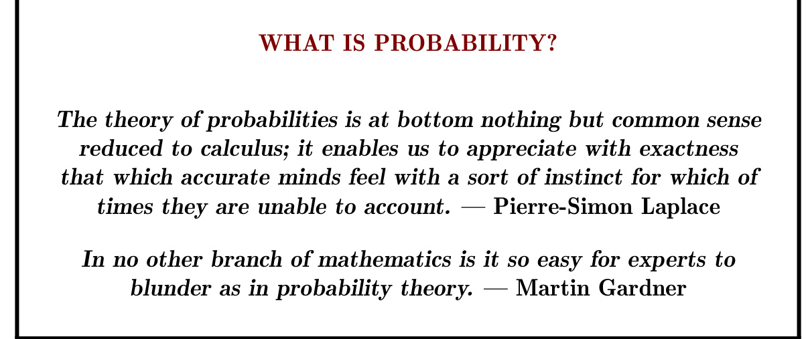  

Since I’ve defined information in terms of probability, you may naturally wonder “what is probability?” I won’t seriously try to answer this. This question has stirred up many debates over the centuries, and even today there’s not a fully accepted answer. It deserves a whole book—and this is not that book. Luckily, we don’t really need to know exactly what probability is to do calculations with it: we mainly need to set up some rules for working with it. This may seem like a cop-out. But it’s a strange and wonderful feature of science that we can achieve great reliability in our results by sidestepping certain di!cult questions, like someone who can make their way safely through a jungle by avoiding the quicksand and snakes.  

One approach to probability goes like this. Suppose you repeat some experiment $N$ times, doing your best to make the conditions the same each time. Suppose that $M$ of these times some event $E$ occurs. You may then say that the probability of event $E$ happening under these conditions is $M/N$ . This approach is called ‘finite frequentism’. Unfortunately, this approach can lead you to say a coin has probability 1 of landing heads up if it does so the first time, or first 3 times, you flip it.  

Another approach goes like this. You may say that some event $E$ has probability $p$ under some conditions if when you set up these conditions $N$ times, and the event $E$ happens $M$ times, the fraction $M/N$ approaches $p$ in the limit $N\rightarrow\infty$ . This approach is called ‘hypothetical frequentism’, because in real experiments you can’t take the limit $N\to\infty$ . But you can hope that when $N$ becomes large enough, the fraction $M/N$ usually becomes close to the limiting probability $p$ —whatever that means.  

Another approach, called ‘Bayesianism’, treats a probability of an event $E$ under some specified conditions as a measure of your degree of belief that $E$ will happen under these conditions. But what is ‘degree of belief’? One answer involves bets. For example, perhaps to believe an event has probability $1/2$ means you’re willing to take a bet where you win more when the event happens than you lose if it does not.  

Bayesians tend to focus on the rules for updating your probabilities as you learn new things, the most famous being ‘ Bayes’ rule ’. Even if agents start by assigning di"erent probabilities to an event, if they follow the same rules for changing these probabilities as they learn new things, under certain circumstances we can prove their probabilities will converge to the same value.  

For a passionate and intelligent discussion of these issues, I recommend E. T. Jaynes’ book Probability Theory: the Logic of Science . Later we’ll meet his ‘principle of maximum entropy’, another important approach to working with probabilities.  

# PROBABILITY MEASURES  

A measure on a set $\boldsymbol{X}$ is a function that assigns to certain so-called measurable subsets $S\ \subseteq\ X$ a number $m(S)\;\in\;[0,\infty]$ , obeying these rules:  

•$\emptyset,X\subseteq X$ are measurable and  

$$
m({\mathfrak{V}})={\mathbf{0}}
$$  

•If $S,T\ \subseteq\ X$ are measurable and $s\subseteq T$ , then $\mathbf{\nabla}T\,-\,S$ is measurable and  

$$
m(T)=m(S)+m(T-S)
$$  

•If a countable collection of disjoint subsets $S_{i}\subseteq X$ are measurable, then their union is measurable and  

$$
m\left(\bigcup_{i=1}^{\infty}S_{i}\right)=\sum_{i=1}^{\infty}m(S_{i})
$$  

We say $\mathbf{\nabla}m$ is a probability measure if $m(X)={\bf1}$ .  

It is easier to do calculations with probabilities than say exactly what they mean! I will take a rough-and-ready approach to working with them, but first let’s take a peek at how mathematicians do it. If you don’t care, it’s safe to move right on to the next tweet.  

We start with any set. We call elements of $X$ ‘outcomes’ and subsets of $X$ ‘events’. We can sometimes get into trouble trying to assign a probability to every subset of $X$ . So, we’ll only try to assign probabilites to events in some collection $\mathcal{M}$ with these properties:  

•$\emptyset\in{\mathcal{M}}$ and $X\in{\mathcal{M}}$ .  

• If $S,T\in M$ d$S\subseteq T$ then the set of elements of $T$ that are not in $S$ , called $T-S$ , is in M.  

• If $S_{i}\in{\mathcal{M}}$ for $i=1,2,\dots$ .then the uni $\cup_{i=1}^{\infty}\,S_{i}$ is in $\mathcal{M}$ .  

We call elements of Mmeasurable subsets of X. A measure is then a function $m\colon\mathcal{M}\rightarrow$ $[0,\infty]$ obeying these rules:  

•$m({\varnothing})=0$  

• If $S,T\in M$ and $S\subseteq M$ then $m(T)=m(S)+m(T-S)$ .  

• If $S_{i}\in{\mathcal{M}}$ then $m\left(\bigcup_{i=1}^{\infty}S_{i}\right)=\sum_{i=1}^{\infty}m(S_{i})$ .  

If $m$ also obeys $m(X)=1$ then we say $m$ is a robability measure , and for any $S\in{\mathcal{M}}$ we say $m(S)$ is the probability of the event S. But we will also be interested in other measures, like the measure on the real line called ‘ Lebesgue measure ’. This is closely connected to the symbol $\cdot\,d x$ ’ that shows up in integrals, because for any measurable set $S\subseteq\mathbb{R}$ , its Lebesgue measure is  

$$
\int_{-\infty}^{\infty}\chi_{S}(x)\,d x
$$  

ere $\chi_{S}(x)$ is $1$ for $x\in S$ and $\boldsymbol{0}$ for $x\not\in S$ . Indeed, people often get sloppy and say dx ‘is’ Lebesgue measure, and I may do that too. By the way, Lebesgue measure is one where we cannot take $\mathcal{M}$ to be the collection of all subsets of $\mathbb{R}$ .  

There is an extensive theory of measures. We will not need it here, but if you’re interested, you can try a book like Halsey Royden’s Real Analysis , where I learned the basics myself, or Terry Tao’s $A n$ Introduction to Measure Theory , which has a legal free version online.  

Here are some puzzles about measures.  

Puzzle 10. Let $X$ be any set and define $\mathcal{M}$ to be the collection of all subsets of $X$ .Show that there is a measure $m\colon\mathcal{M}\rightarrow[0,\infty]$ alled cou ing measure such that for any $S\subseteq X$ ,$m(S)$ is the number of elements of S, or $\infty$ if Sis infinite.  

Puzzle 11. Let $X$ be any set and define $\mathcal{M}$ as before. Suppose $p$ is a probability distribution on $X$ , meaning a $p\colon X\to[0,\infty)$ with $\begin{array}{r}{\sum_{i\in{\cal X}}p(i)=1}\end{array}$ ". Show that there is a probability measure $m\colon\mathcal{M}\rightarrow[0,\infty]$ M ↓ ↔] such that for any $S\subseteq X$ ,  

$$
m(S)=\sum_{i\in S}p(i).
$$  

In this situation we usually write $p(i)$ as $p_{i}$ and call it the probability of the outcome $i\in X$ . For any $S\subseteq M$ we call $m(S)$ the probability of the event $S$ .  

In the next pu es $X$ is any set, $\mathcal{M}$ obeys the three rules for a collection of measurable subsets of X, and $m\colon\mathcal{M}\rightarrow[0,\infty]$ is a measure.  

Puzzle 12. Show that if $S,T\in M$ then the union $S\cup T$ is in $\mathcal{M}$ .  

Puzzle 13. Show that if $S,T\in M$ then the intersection $S\cap T$ is in $\mathcal{M}$ .  

Puzzle 14. Show that if $S_{i}\in\mathcal{M}$ or $i=1,2,\dots$ .the tion $\cap_{i=1}^{\infty}\,S_{i}$ is in $\mathcal{M}$ .  

Puzzle 15. Show that if $S,T\in M$ →M and $S\subseteq T$ ↑then $m(S)\leq m(T)$ ≃).  

Puzzle 16. Show that if $S_{i}\in\mathcal{M}$ for $i=1,2,\dots$ .then  

$$
m\left(\bigcup_{i=1}^{\infty}S_{i}\right)\leq\sum_{i=1}^{\infty}m(S_{i}).
$$  

Puzzle 17. Show that if ${\mathit{m}}$ is a probability measure and $S\in{\mathcal{M}}$ then $0\leq m(S)\leq1$ .  

One of the main uses of a measure $m$ on a space $X$ is that it lets us integrate certain functions $f\colon X\to\mathbb{R}$ . Alas, not all functions! It’s only reasonable to try to integrate measurable functions $f\colon X\to\mathbb{R}$ , which have the property that if $S\subseteq\mathbb{R}$ is measurable, its inverse image $f^{-1}(S)\subseteq X$ is measurable. And even measurable functions can cause trouble, because when we try to integrate them we might get $+\infty$ ,$-\infty$ , or something even worse. For example, what’s  

$$
\int_{-\infty}^{\infty}x^{2}\sin x\,d x?
$$  

There’s no good ans er. We say a function $f\colon X\to\mathbb{R}$ is integrable if it is measurable and its integral over X, defined in a certain way I won’t explain here, gives a well-defined real number.  

# SHANNON ENTROPY: A FIRST TASTE  

When you learn an event of probability $\pmb{p}$ has happened, the amount of information you get is $-\log p$ .  

Question. Suppose you know a coin lands heads up $\frac{2}{3}$ of the time and tails up $\frac{1}{3}$ of the time. What is the average or ‘expected’ amount of information you get when you learn which side landed up?  

Answer. time you get get is $\frac{2}{3}$ of the time you get $-\log{\frac{1}{3}}$ . So, the expected amount of information you $-\log{\frac{2}{3}}$ of information, and $\frac{1}{3}$ of the  

$$
-\textstyle{\frac{2}{3}}\log{\frac{2}{3}}-{\frac{1}{3}}\log{\frac{1}{3}}
$$  

You can do the same thing whenever you have any number of probabilities that add to 1. The expected information is called the Shannon entropy .  

You flip a coin. You know the probability that it lands heads up. How much information do you get, on average, when you discover which side lands up? It’s not hard to work this out. It’s a simple example of ‘Shannon entropy’. Roughly speaking, entropy is information that you don’t know , that you could get if you did enough experiments. Here the experiment is simply flipping the coin and looking at it.  

Puzzle 18. Suppose you know a coin lands heads up $\frac{1}{2}$ of the time and tails up $\frac{1}{2}$ of the time. What is the expected amount of information you get from a coin flip? If you use base 2 for the logarithm, you get the expected information measured in bits. What do you get?  

Puzzle 19. Suppose you know a coin lands heads up $\frac13$ of the time and tails up $\frac{2}{3}$ of the time. What is the expected amount of information you get from a coin flip?  

Puzzle 20. Suppose you know a coin lands heads up $\frac{1}{4}$ of the time and tails up $\frac34$ of the time. What is the expected amount of information you get from a coin flip, in bits?  

If you solve these you’ll see a pattern: the Shannon entropy is biggest when the coin is fair. As it becomes more and more likely for one side to land up than the other, the entropy drops. You’re more sure about what will happen... so you learn less, on average, from seeing what happens!  

We’ve been doing examples where your experiment has just two possible outcomes: heads up or down. But you can do Shannon entropy for any number of outcomes. It measures how ignorant you are of what will happen. That is: how much you learn on average when it does!  

According to the weather report there’s a $\frac14$ chance that it will rain 1 centimeter, a $\frac{1}{2}$ chance it will rain 2 centimeters, and a $\frac14$ chance it will rain 3 centimeters.  

Question. What is the ‘expected’ amount of rainfall?  

Answer. $\textstyle{\frac{1}{4}}\cdot\mathbf{1}+{\frac{1}{2}}\cdot\mathbf{2}+{\frac{1}{4}}\cdot\mathbf{3}=2$ centimeters.  

Question. What is the ‘expected’ amount of information you learn when you find out how much it rains?  

$\frac{3}{2}$ Answer. bits. This is the →$\begin{array}{r}{-\frac{1}{4}\log\frac{1}{4}-\frac{1}{2}\log\frac{1}{2}-\frac{1}{4}\log\frac{1}{4}=\frac{3}{2}\log2}\end{array}$ Shannon entropy of the weather report. , or in other words,  

If the weather report tells you it’ll rain di!erent amounts with di!erent probabilities, you can figure out the ‘expected’ amount of rain. You can also figure out the expected amount of information you’ll learn when it rains. This is called the ‘Shannon entropy’.  

Shannon entropy is closely connected to information, but we can also think of it as a measure of ignorance. This may seem paradoxical. But it’s not. Shannon entropy is the expected amount of information that you don’t know when all you know is a probability distribution, which you will know when you see a specific outcome chosen according to this probability distribution.  

For example, consider a weather report that says it will rain 1 centimeter with probability 0, 2 centimeters with probability 1, and 3 centimeters with probability $0$ .The Shannon entropy of this weather report is  

$$
-0\log0-1\log1-0\log0=0
$$  

since by convention we set $p\log p=0$ when $p=0$ , this being the limit of $p\ln p$ as $p$ approaches 0 from above.  

What does it mean that this weather report has zero Shannon entropy? It means that when we see a specific outcome chosen according to this probability distribution, we learn nothing! The weather report says it will rain 2 centimeters with probability 1. When this happens, we learn nothing that the weather report didn’t already tell us.  

The Shannon entropy doesn’t depend on the amounts of rain, or even whether the forecast is about centimeters of rain or dollars of income. It only depends on the probabilities of the various outcomes. So Shannon entropy is a universal, abstract concept.  

Shannon entropy is closely connected to Gibbs entropy, which was already known in physics. But by lifting entropy to a more general level and connecting it to digital information, Shannon helped jump-start the information age. In fact a paper of his was the first to use the word ‘bit’!  

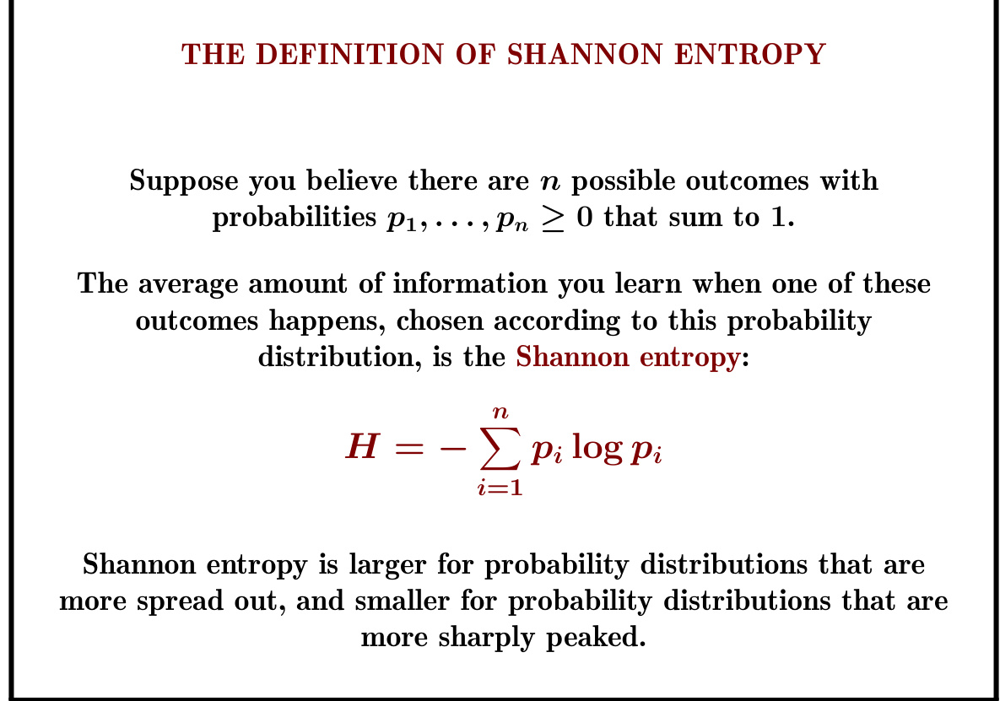  

I’ve been leading up to it with examples, but here it is in general: Shannon entropy! Gibbs had already used a similar formula in physics—but with base $e$ for the logarithm, an integral instead of a sum, and multiplying the answer by Boltzmann’s constant. Shannon applied it to digital information.  

Here’s where the formula for Shannon entropy comes from. We have some set of outcomes, say $X$ . We have a probability distribution on this set, meaning a function $p\colon X\to[0,1]$ such that  

$$
\sum_{i\in X}p_{i}=1.
$$  

If we have any function $A\colon X\rightarrow\mathbb{R}$ , we define its expected value to be  

$$
\langle A\rangle=\sum_{i\in X}p_{i}A_{i}.
$$  

It’s a kind of average of $A$ where each value $A(i)$ is ‘weighted’, i.e. multiplied, by the probability of the $i$ th outcome. We saw an example in the last tweet: the expected amount of rainfall.  

We’ve seen that if you believe the $i$ th outcome has probability $p_{i}$ , the amount of information you learn if the $i$ th outcome actually occurs is $-\log p_{i}$ . Thus, the expected amount of information you learn is  

$$
\langle-\log p\rangle=-\sum_{i\in X}p_{i}\log p_{i}.
$$  

And this is the Shannon entropy ! We denote it by $H$ , or more precisely $H(p)$ , so  

$$
H(p)=-\sum_{i\in X}p_{i}\log p_{i}.
$$  

In the box above I was taking $X$ to be the set $\{1,\ldots,n\}$ . This is often a good thing to do when there are finitely many outcomes.  

Let’s get to know the Shannon entropy a little better.  

Puzzle 21. Let $X\,=\,\{1,2\}$ so that we know a probability distribution $p$ on $X$ if we know $p_{1}$ , since $p_{2}=1-p_{1}$ . Graph the Shannon entropy $H(p)$ as a function of $p_{1}$ . Show that it has a maximum at $\begin{array}{r}{p_{1}=\frac{1}{2}}\end{array}$ and minima at $p_{1}=0$ and $p_{1}=1$ .  

This makes sense: if you believe $p_{1}~=~1$ then you learn nothing when an outcome happens chosen according to the probability distribution $p$ : you are sure outcome 1 will occur, and it does (with probability 1). Similarly, if you believe $p_{1}=0$ you learn nothing when an outcome happens according to this probability distribution, since you are sure outcome 2 will occur. On the other hand, if $\begin{array}{r}{p_{1}=\frac{1}{2}}\end{array}$ you are maximally undecided about what will happens, and you learn 1 bit of information when it does.  

Puzzle 22. Let $X\,=\,\{1,2,3\}$ . Draw the set of probability distributions on $X$ as an equilateral triangle whose corners are the probability distributions $(1,0,0)$ ,$(0,1,0)$ ,and $(0,0,1)$ . Sketch contour lines of $H(p)$ as a function on this triangle. Show it has a maximum at $\begin{array}{r}{p=\left(\frac{1}{3},\frac{1}{3},\frac{1}{3}\right)}\end{array}$ ) and minima at the corners of the triangle.  

Again this should make intuitive sense. Here is a harder puzzle along the same lines:  

Puzzle 23. Let $X=\{1,\ldots,n\}$ . Show that $H(p)$ has a maximum at $\textstyle p=({\frac{1}{n}},\dots,{\frac{1}{n}})$ ) and minima at the probability distributions where $p_{i}=1$ for some particular $i\in X$ .  

Here is one of the big lessons from all this:  

Shannon entropy is larger for probability distributions that are more spread out, and smaller for probability distributions that are more sharply peaked.  

Indeed, you can think of Shannon entropy as a measure of how spread out a probability distribution is! The more spread out it is, the more you learn when an outcome occurs, drawn from that distribution.  

Another important way to think about Shannon entropy is that it sets a limit on how much we can compress messages that are drawn from a given probability distribution. This is made precise by a theorem Shannon proved in his original 1948 paper. I won’t explain it here, but this result is fundamental for understanding the role of entropy in communication and data storage:  

• Wikipedia, Shannon’s source coding theorem .  

• Claude E. Shannon, A mathematical theory of communication ,Bell System Technical Journal 27 (1948), 379–423, 623–656.  

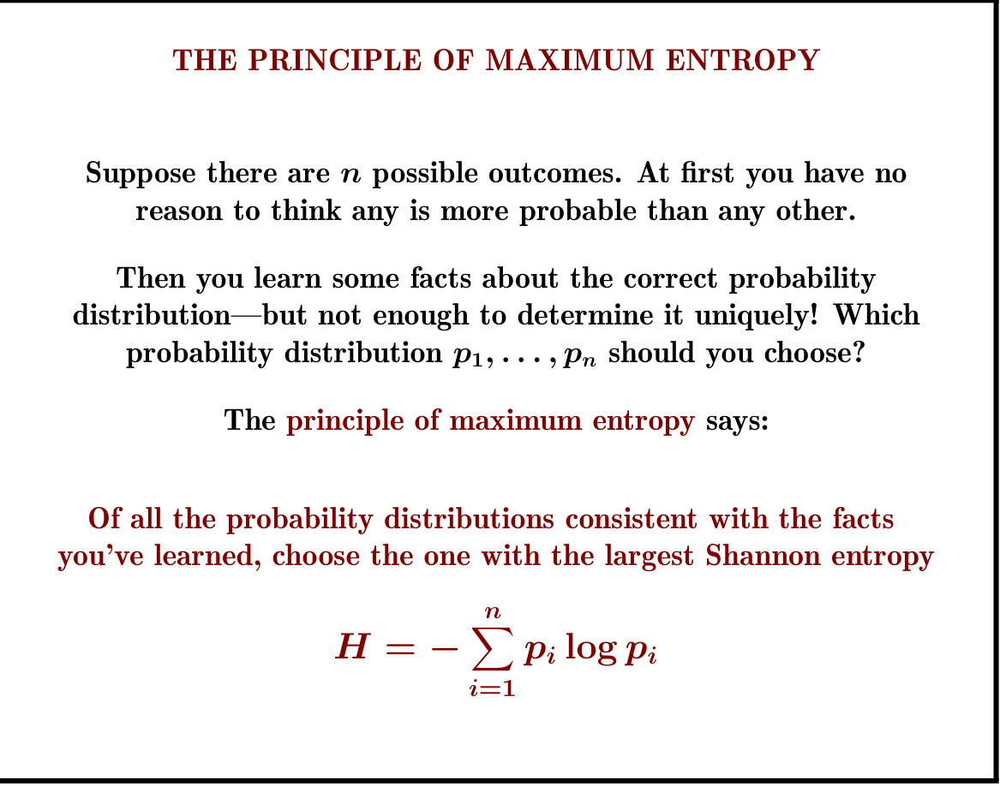  

What’s Shannon entropy good for? For starters, it gives a principle for choosing the ‘best’ probability distribution consistent with what you know. Choose the one that maximizes the Shannon entropy!  

This is called the ‘principle of maximum entropy’. This principle first arose in statistical mechanics, which is the application of probability theory to physics—but we can use it elsewhere too.  

For example: suppose you have a die with faces numbered 1,2,3,4,5,6. At first you think it’s fair. But then you somehow learn that the average of the numbers that comes up when you roll it is 5. Given this, what’s the probability that if you roll it, a 6 comes up?  

Sounds like an unfair question! But you can figure out the probability distribution on $\{1,2,3,4,5,6\}$ that maximizes Shannon entropy subject to the constraint that the mean is 5. According to the principle of maximum entropy, you should use this to answer my question!  

But is this correct?  

The problem is figuring out what ‘correct’ means! But in statistical mechanics we use the principle of maximum entropy all the time, and it seems to work well. The brilliance of E. T. Jaynes was to realize it’s a general principle of reasoning, not just for physics.  

The principle of maximum entropy is widely used outside physics, though still controversial. But I think we should use it to figure out some basic properties of a gas—like its energy or entropy per molecule, as a function of pressure and temperature.  

To do this, we should generalize Shannon entropy to ‘Gibbs entropy’, replacing the sum by an integral. Or else we should ‘discretize’ the gas, assuming each molecule has a finite set of states. It sort of depends on whether you prefer calculus or programming. Either approach is okay if we study our gas using classical statistical mechanics.  

Quantum statistical mechanics gives a more accurate answer. It uses a more general definition of entropy—but the principle of maximum entropy still applies!  

I won’t dive into any calculations just yet. Before doing a gas, we should do some simpler examples—like the die whose average roll is 5. But I can’t resisting mentioning one philosophical point. In the box above I was hinting that maximum entropy works when your ‘prior’ is uniform:  

# Suppose there are $\mathbf{\nabla}^{\mathcal{n}}$ possible outcomes. At first you have no reason to think any is more probable than any other.  

This is an important assumption: when it’s not true, the principle of maximum entropy as we’ve stated it does not apply. But what if our set of events is something like a line? There’s no obvious best probability measure on the line! And even good old Lebesgue measure $d x$ depends on our choice of coordinates. To handle this, we need a generalization of the principle of maximum entropy, called the principle of maximum relative entropy.  

In short, a deeper treatment of the principle of maximum entropy pays more attention to our choice of ‘prior’: what we believe before we learn new facts. And it brings in the concept of ‘ relative entropy ’: entropy relative to that prior. But we won’t get into this here, because we will always be using a very bland prior, like assuming that each of finitely many outcomes is equally likely.  

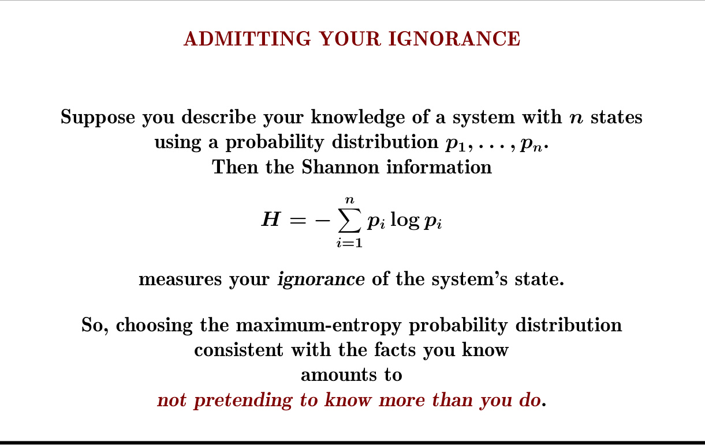  

Remember: if we describe our knowledge using a probability distribution, its Shannon entropy says how much we expect to learn when we find out what’s really going on. We can roughly say it measures our ‘ignorance’—though ordinary language can be misleading here.  

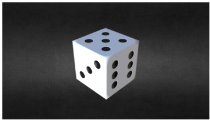  

At first you think this ordinary 6-sided die is fair. But then you learn that no, the average of the numbers that come up is 5. What are the probabilities $p_{1},\ldots,p_{n}$ for the di!erent faces to come up?  

This is tricky: you can imagine di!erent answers!  

You could guess the die lands with 5 up every time. In other words, $p_{5}=1$ . This indeed gives the correct average. But the entropy of this probability distribution is $0$ .So you’re claiming to have no ignorance at all of what happens when you roll the die!  

Next you might guess that it lands with 4 up half the time and 6 up half the time. In other words, $\begin{array}{r}{p_{4}=p_{6}=\frac{1}{2}}\end{array}$ . This probability distribution has 1 bit of entropy. Now you are admitting more ignorance. But how can you be so sure that 5 never comes up?  

Next you might guess that $\begin{array}{r}{p_{4}=p_{6}=\frac{1}{4}}\end{array}$ and $\begin{array}{r}{p_{5}=\frac{1}{2}}\end{array}$ . We can compute the entropy of this probability distribution. It’s higher: 1.5 bits. Good, you’re being more honest now! But how can you be sure that 1, 2, or 3 never come up? You are still pretending to know stu!!  

Keep improving your guess, finding probability distributions with mean 5 with bigger and bigger entropy. The bigger the entropy gets, the more you’re admitting your ignorance! If you do it right, your guess will converge to the unique maximum-entropy solution.  

But there’s a more systematic way to solve this problem.  

# THE BOLTZMANN DISTRIBUTION  

Suppose you want to maximize the Shannon entropy  

$$
-\sum_{i=1}^{n}p_{i}\log p_{i}
$$  

$$
\sum_{i=1}^{n}p_{i}A_{i}=c\qquad(*)
$$  

Then try the Boltzmann distribution:  

$$
p_{i}=\frac{\exp(-\beta A_{i})}{\displaystyle\sum_{i=1}^{n}\exp(-\beta A_{i})}
$$  

If you can find $\beta$ that makes $(*)$ hold, this is the answer you seek!  

How do you actually use the principle of maximum entropy?  

If you know the expected value of some quantity and want to maximize entropy given this, there’s a great formula for the probability distribution that usually does the job! It’s called the ‘Boltzmann distribution’. In physics it also goes by the names ‘Gibbs distribution’ or ‘canonical ensemble’, and in statistics it’s called an ‘exponential family’.  

In the Boltzmann distribution, the probability $p_{i}$ is proportional to $\exp(-\beta A_{i})$ where $A$ is the quantity whose expected value you know. Since probabilities must sum to one, we must have  

$$
p_{i}=\frac{\exp(-\beta A_{i})}{\displaystyle\sum_{i=1}^{n}\exp(-\beta A_{i})}.
$$  

It is then easy to find the expected value of $A$ as a function of the number $\beta$ : just plug these probabilities into the formula  

$$
\langle A\rangle=\sum_{i=1}^{n}A_{i}p_{i}
$$  

The hard part is inverting this process and finding $\beta$ if you know what you want $\langle A\rangle$ to be.  

When and why does the Boltzmann distribution actually work? That’s a bit of a long story, so I’ll explain it later. First, let’s use the Boltzmann distribution to solve the puzzle I mentioned last time:  

At first you think this ordinary 6-sided die is fair. But then you learn that no, the average of the numbers that come up is 5. What are the probabilities $p_{1},\ldots,p_{n}$ for the di!erent faces to come up? You can use the Boltzmann distribution to solve this puzzle!  

formula To do it, take $\textstyle\sum_{i}A_{i}p_{i}\,=\,5$ !$1\leq i\leq6$ and get a polynomial equation for and $A_{i}=i$ . Stick the Boltzmann distribution $\exp(-\beta)$ . You can solve this $p_{i}$ into the with a computer and get $\exp(-\beta)\approx1.877$ .  

So, the probability of rolling the die and getting the number $1\,\leq\,i\,\leq\,6$ is proportional to $\exp(-\beta i)\,\approx\,1.877^{i}$ . You can figure out the constant of proportionality by demanding that the probabilities sum to 1—or just look at the formula for the Boltzmann distribution. You should get these probabilities:  

$$
\approx0.02053,~p_{2}\approx0.03854,~p_{3}\approx0.07232,~p_{4}\approx0.1357,~p_{5}\approx0.2548,~p_{6}\approx0.4781.
$$  

You can compute the entropy of this probability distribution, and you get roughly 1 .97 bits. You’ll remember that last time we got entropies up to 1.5 bits just by making some rather silly guesses.  

So, using the Boltzmann distribution, you can find the maximum-entropy die that rolls 5 on average. Later, we’ll see how the same math lets us find the maximum-entropy state of a box of gas that has some expected value of energy!  

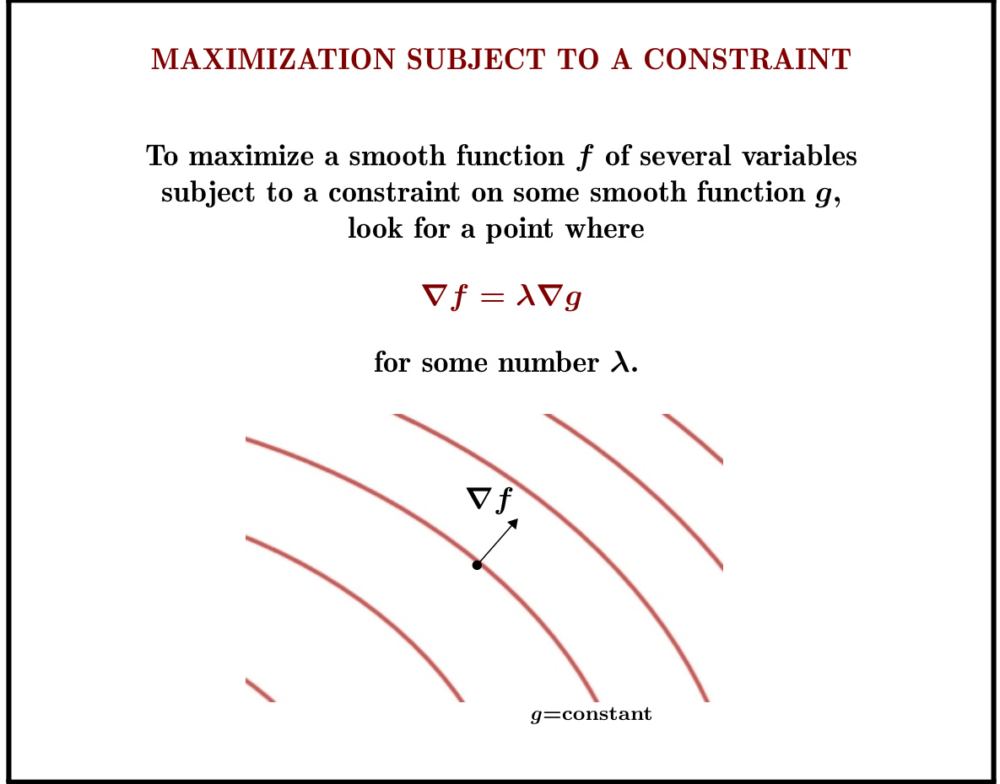  

When we’re trying to maximize entropy subject to a constraint, we’re doing a problem of the above sort. If you don’t know how to do problems like this, it’s time to learn about Lagrange multipliers. You can find this in any book on calculus of several variables. But the idea is in the picture above. Say we’ve got two smooth functions $f,g\colon\mathbb{R}^{n}\rightarrow\mathbb{R}$ and we have a point on the surface $g=$ constant where $f$ is as big as it gets on this surface. The gradient of $f$ must be perpendicular to the surface at this point. Otherwise we could move along the surface in a way that made $f$ bigger! For the same reason, the gradient of $g$ is always perpendicular to the surface $g=$ constant. So $\nabla f$ and $\nabla g$ must point in the same or opposite directions at this point. Thus, as long as the gradient of $g$ is nonzero, we must have  

$$
\nabla f=\lambda\,\nabla g
$$  

for some number $\lambda$ , called a Lagrange multiplier . So, solving this equation along with  

$$
g={\mathrm{constant}}
$$  

is a way to find the point we’re looking for—though we still need to check we’ve found a maximum, not a minimum or something else.  

We can write a formula that means the exact same thing as $\nabla f\;=\;\lambda\nabla g$ using di!erentials:  

$$
d f=\lambda d g
$$  

This is what we’ll do from now on. Gradients are vector fields while di!erentials are 1-forms. If you don’t know what this means, you can probably ignore this for now: the di!erence, while ultimately quite important, will not be significant for anything we’re doing.  

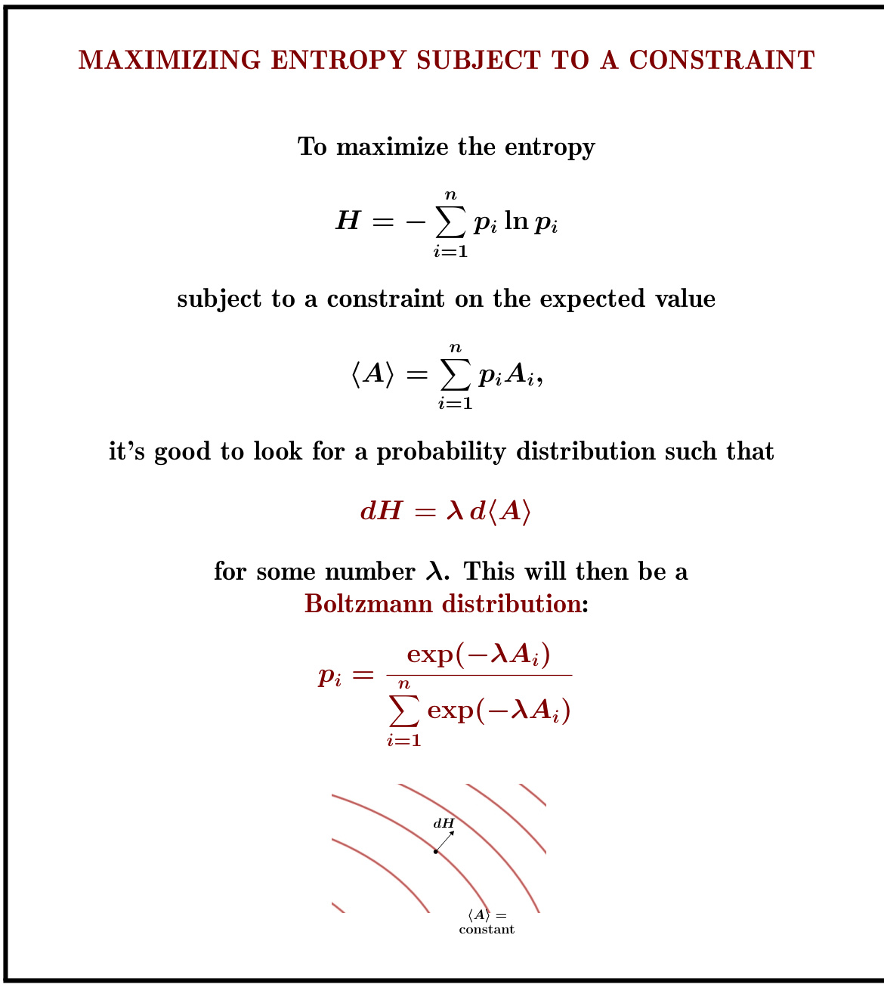  

We’ve seen how to maximize a function subject to a constraint. Now let’s do the case we’re interested in: maximizing entropy subject to a constraint on the expected value of some quantity.  

Suppose we have a finite set of outcomes, say $1,\ldots,n$ . Our ‘quantity’ $A$ is just a number $A_{1},\ldots,A_{n}$ depending on the outcome. For any probability distribution $p$ on the set of outcomes, we can define its Shannon entropy and the expected value of $A$ :  

$$
H=-\sum_{i=1}^{n}p_{i}\ln p_{i},\qquad\langle A\rangle=\sum_{i=1}^{n}p_{i}A_{i}.
$$  

Here we are using base ${e}$ for the Shannon entropy, to simplify the calculations. Let’s try to find the probability distribution that maximizes $H$ on the surface $\langle A\rangle=c$ . We’ll show that if such a probability distribution $p$ exists, and none of the $p_{i}$ are zero, then $p$ must be a Boltzmann distribution  

$$
p_{i}=\frac{\exp(-\lambda A_{i})}{\sum_{i=1}^{n}\exp(-\lambda A_{i})}
$$  

for some $\lambda\in\mathbb R$ . If you’re willing to trust me on this, you can skip this calculation.  

To use the method from last time—the Lagrange multiplier method—we’d like to use the probabilities $p_{i}$ as coordinates on the space of probability distributions. But they aren’t independent, since  

$$
\sum_{i=1}^{n}p_{i}=1.
$$  

To get around this, let’s use all but one of the $p_{i}$ as coordinates, and remember that the remaining one is a function of those. Let’s use $p_{2},p_{3},\ldots,p_{n}$ as coordinates, so that $p_{1}=1-(p_{2}+\cdot\cdot\cdot+p_{n})$ . Furthermore, the space of all probability distributions on our finite set is  

$$
\left\{p\in\mathbb{R}^{n}|\ 0\leq p_{i}\leq1,\ \sum_{i=1}^{n}p_{i}=1\right\}.
$$  

It looks like a closed interval when $n=2$ , or a triangle when $n=3$ , or a tetrahedron when $n=4$ , or some higher-dimensional version of a tetahedron when $n$ is larger. In its interior this space looks locally like $\mathbb{R}^{n-1}$ , so we can use the Lagrange multiplier method, but it also has a boundary where one or more of the $p_{i}$ vanish, and then this method no longer applies. (We’ll see an example of that later.)  

So, let’s assume $p$ is a probability distribution maximizing the Shannon entropy $H$ on the surface $\langle A\rangle\,=\,c$ , and also suppose $p$ has $p_{1},\ldots,p_{n}>0$ . Suppose that not all the values $A_{i}$ are equal, since that makes the problem too easy–see why? Then $d\langle A\rangle$ is never zero, so from what I said last time, we must have  

$$
d H=\lambda\,d\langle A\rangle
$$  

at the point $p$ . So let’s see what this equation actually says.  

Since  

$$
H=-\sum_{i=1}^{n}p_{i}\ln p_{i}
$$  

we have  

$$
d H=-\sum_{i=1}^{n}d(p_{i}\ln p_{i})=-\sum_{i=1}^{n}(1+\ln p_{i})d p_{i}.
$$  

Similarly, since  

$$
\langle A\rangle=\sum_{i=1}^{n}p_{i}A_{i}
$$  

we have  

$$
d\langle A\rangle=\sum_{i=1}^{n}A_{i}d p_{i}.
$$  

So, our equation $d H=\lambda\,d\langle A\rangle$ says  

$$
-\sum_{i=1}^{n}(1+\ln p_{i})d p_{i}=\lambda\sum_{i=1}^{n}A_{i}d p_{i}.
$$  

For these to be equal, the coe!cients of $d p_{i}$ must agree for each of our coordinates $p_{2},\ldots,p_{n}$ . But we have to remember that $p_{1}\,=\,1\,-\,(p_{2}\,+\,\cdot\,\cdot\,+\,p_{n})$ and thus $d p_{1}=$ $-(d p_{2}+\cdot\cdot\cdot+d p_{n})$ . Thus, for each $i=2,\dots n$ we have  

$$
(1+\ln p_{1})-(1+\ln p_{i})=\lambda(-A_{1}+A_{i})
$$  

and fiddling around we get  

$$
{\frac{p_{i}}{p_{1}}}={\frac{\exp(-\lambda A_{i})}{\exp(-\lambda A_{1})}}.
$$  

This says something cool: the probabilities $p_{i}$ are proportional to the exponentials $\exp(-\lambda A_{i})$ . And since the probabilities must sum to $1$ , it’s obvious what the constant of proportionality must be:  

$$
p_{i}=\frac{\exp(-\lambda A_{i})}{\displaystyle\sum_{i=1}^{n}\exp(-\lambda A_{i})}.
$$  

So yes: $p_{i}$ must be given by the Boltzmann distribution!  

In summary, we’ve seen that $i f$ there exists a probability distribution $p$ that maximizes the Shannon entropy among probability distributions with $\langle A\rangle=c$ , and $i f$ all the $p_{i}$ are positive, then $p$ must be a Boltzmann distribution. But this raises other questions. When does such a probability distribution exist? If it exists, is it unique? And what if not all the $p_{i}$ are positive?  

In what follows we’ll dive down this rabbit hole and get to the bottom of it. I’ll just state some facts—you may enjoy trying to see if you can prove them. First, there exists a probability distribution $p_{1},\ldots,p_{n}$ with $\langle A\rangle=c$ if and only if  

$$
A_{\operatorname*{min}}\leq c\leq A_{\operatorname*{max}}
$$  

where $A_{\mathrm{min}}$ is the minimum value and $A_{\mathrm{max}}$ is the maximum value of the numbers $A_{1},\ldots,A_{n}$ . Second, whenever  

$$
A_{\mathrm{min}}\leq c\leq A_{\mathrm{max}},
$$  

there exists a unique probability distribution $\!\,\!p_{1},\,\!\dots,p_{n}$ maximizing Shannon entropy subject to the constraint $\langle A\rangle=c$ . Third, this unique maximizer $p$ has $p_{i}>0$ for all $i$ ,and is thus a Boltzmann distribution, whenever  

$$
A_{\operatorname*{min}}<c<A_{\operatorname*{max}}.
$$  

When $c=A_{\operatorname*{min}}$ , the unique maximizer assigns the same probability $p_{i}$ to each outcome $i$ with $A_{i}=A_{\operatorname*{min}}$ , while $p_{i}=0$ for all other outcomes. Similarly, when $c=A_{\operatorname*{max}}$ , the unique maximizer assigns the same probability $p_{i}$ to each outcome $i$ with $A_{i}=A_{\operatorname*{max}}$ ,while $p_{i}=0$ for all other outcomes.  

It’s good to look at an example:  

Puzzle 24. Suppose there are only two outcomes, with $A_{1}=-1$ and $A_{2}=1$ . Work out the Boltzmann distribution $p$ maximizing Shannon entropy subject to the constraint $\langle A\rangle=c$ for $-1<c<1$ . Show that as $\lambda\to+\infty$ this Boltzmann distribution has  

$$
p_{1}\rightarrow1,p_{2}\rightarrow0
$$  

while as $\lambda\to-\infty$ it has  

$$
p_{1}\rightarrow0,p_{2}\rightarrow1.
$$  

Show the probability distribution $p_{1}=1,p_{2}=0$ maximizes Shannon entropy subject to the constraint $\langle A\rangle=-1$ , while $p_{1}=0,p_{2}=1$ maximizes it subject to the constraint $\langle A\rangle=1$ .Show these two probability distributions are not Boltzmann distributions.  

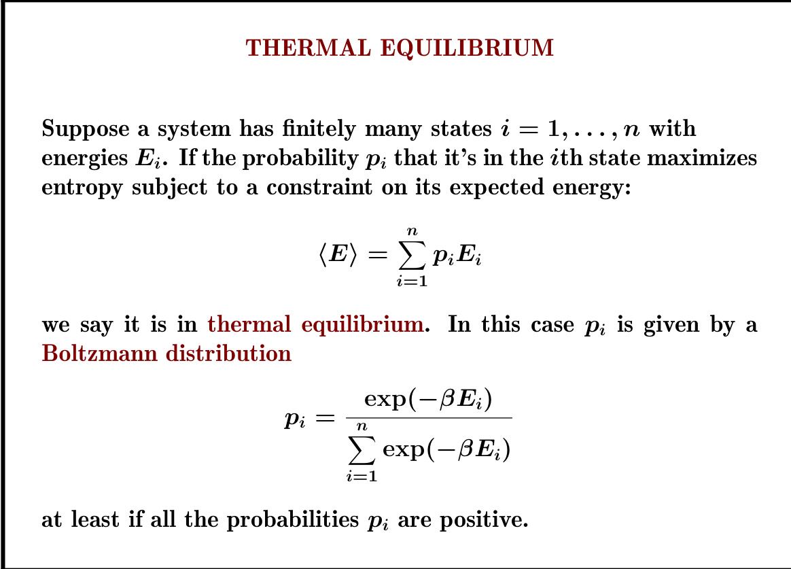  

Don’t worry: the substance of what I’m saying here is almost the same as in the last box. I’m merely attaching new words to the concepts, to make them sound more like physics:  

• Before I said we had a set of $n$ ‘outcomes’ numbered $1,2,\ldots,n$ . Now I’m talking about ‘states’. If we have a system with $n$ states, it means there are $n$ outcomes when we do a measurement to completely determine which state it’s in. A ‘state’ is some way for a physical system to be—that’s vague but it’s all we can say until we consider some specific kind of system. In classical physics the states form a set, usually infinite but sometimes finite.  

• Before I said we had a ‘quantity’ $A$ that depends on the outcome, taking the value $A_{i}$ in the $i$ th outcome. Now I’m calling this quantity the ‘energy’ $E$ . Energy is a particularly interesting quantity in physics, so we’ll focus on that, without demanding that you know anything about it: for our present purposes, we can take any quantity and dub it ‘energy’.  

• Before I called the Lagrange multiplier $\lambda$ . Now I’m calling it $\beta$ , because that’s what physicists do in this particular context.  

When a system maximizes entropy subject to a constraint on the expected value of its energy, and perhaps also some other quantities, we say the system is in thermal equilibrium . This is meant to suggest that an object just sitting there, not heating up or cooling down, is often best modeled this way.  

You may have noticed the annoying clause “at least if all the probabilities $p_{i}$ are positive”. I only said that because I cannot tell a lie. In Puzzle 24 we saw that as $\beta\,\rightarrow\,\pm\infty$ , the Boltzmann distribution can converge to a non-Boltzmann probability distribution where some of the probabilities $p_{i}$ vanish. This still counts as thermal equilibrium, because it’s still maximizing entropy subject to a constraint on expected energy. We’ll learn more about this when we study the concept of ‘absolute zero’.  

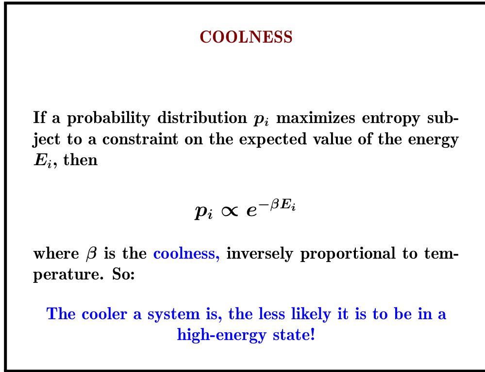  

Say a system with finitely many states maximizes entropy subject to a constraint on the expected value of some quantity $E$ that we choose to call ‘energy’. Then its probability of being in the $i$ th state is proportional to $\exp(-\beta E_{i})$ for some number $\beta$ .  

When $\beta$ is big and positive, the probability of being in a state of high energy is tiny, since $\exp(-\beta E_{i})$ gets very small for large energies $E_{i}$ . This means our system is cold .  

Conversely when $\beta$ is small and positive, $\exp(-\beta E_{i})$ drops o! very slowly as the energy $E_{i}$ gets bigger. So, high-energy states become quite likely when $\beta$ is small and positive. This means our system is hot .  

It turns out $\beta$ is inversely proportional to the temperature—more about that later. But in modern physics $\beta$ is just as important as temperature. It comes straight from the principle of maximum entropy!  

So $\beta$ deserves a name. And its name is ‘ coolness ’.  

By the way, the formula  

$$
p_{i}\propto e^{-\beta E_{i}}
$$  

is only strictly true when $\beta$ is finite. There’s also a limiting case $\beta\to+\infty$ , when $p_{i}=0$ except for states of the very lowest energy. And there’s a limiting case $\beta\to-\infty$ , where $p_{i}\,=\,0$ where except for states of the very highest energy. I’ll say a bit about these oddities later. First I’ll say more about what coolness has to do with temperature.  

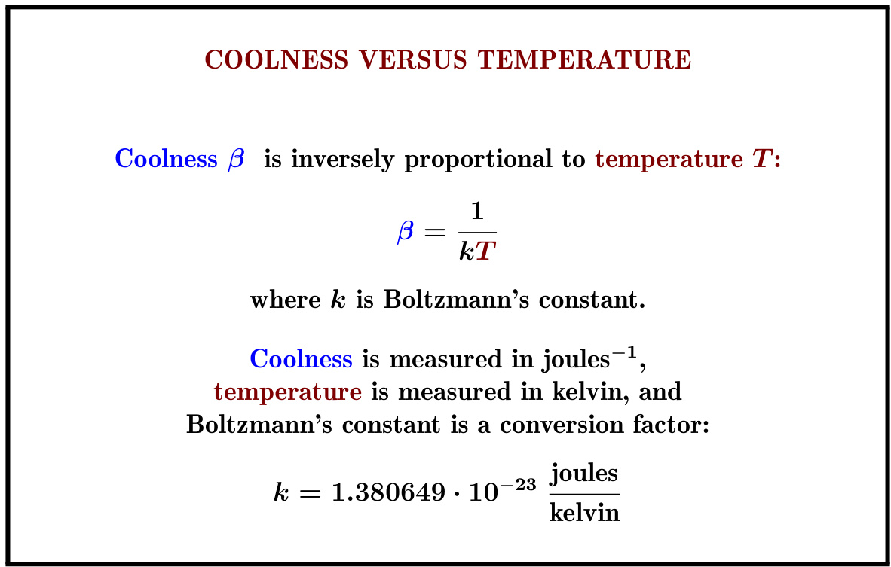  

In statistical mechanics, coolness is inversely proportional to temperature. But coolness has units of energy $^{-1}$ , not temperature $^{-1}$ . So we need a constant to convert between coolness and inverse temperature! And this constant is very interesting.  

Remember: when a system maximizes entropy with a constraint on its expected energy, the probability of it having energy $E$ is proportional to $\exp(-\beta E)$ where $\beta$ is its coolness. But we can only exponentiate dimensionless quantities! (Why?) So $\beta$ has dimensions of 1/energy.  

Since coolness is inversely proportional to temperature, we must have $\beta\,=\,1/k T$ where $k$ is some constant with dimensions of energy/temperature. This constant $k$ is called ‘Boltzmann’s constant’. It’s tiny:  

$$
k=1.380649\cdot10^{-23}\;\mathrm{joules/kelvin}.
$$  

This is mainly because we use units of energy, joules, suited to macroscopic objects like a cup of hot water. Boltzmann’s constant being tiny reveals that such things have enormously many microscopic states!  

Later we’ll see that a single classical point particle, in empty space, has energy $3k T/2$ when it’s maximizing entropy at temperature $T$ . The 3 here is because the atom can move in 3 directions, the $1/2$ because we integrate $x^{2}$ to get this result. The important part is $k T$ . The $k T$ says: if an ideal gas is made of atoms, each atom contributes just a tiny bit of energy per kelvin, or degree Celsius: roughly $10^{-23}$ joules. So a little bit of gas, like a gram of hydrogen, must have roughly $10^{23}$ atoms in it. This is a very rough estimate, but it’s a big deal.  

Indeed, the number of atoms in a gram of hydrogen is about $6\cdot10^{23}$ . You may have heard of Avogadro’s number—this is quite close to that. So Boltzmann’s constant gives a hint that matter is made of atoms—and even better, a nice rough estimate of how many per gram!  

Later we will see that Boltzmann’s constant has another important meaning: it’s a fundamental unit of entropy, a nat, expressed in joules/kelvin.  

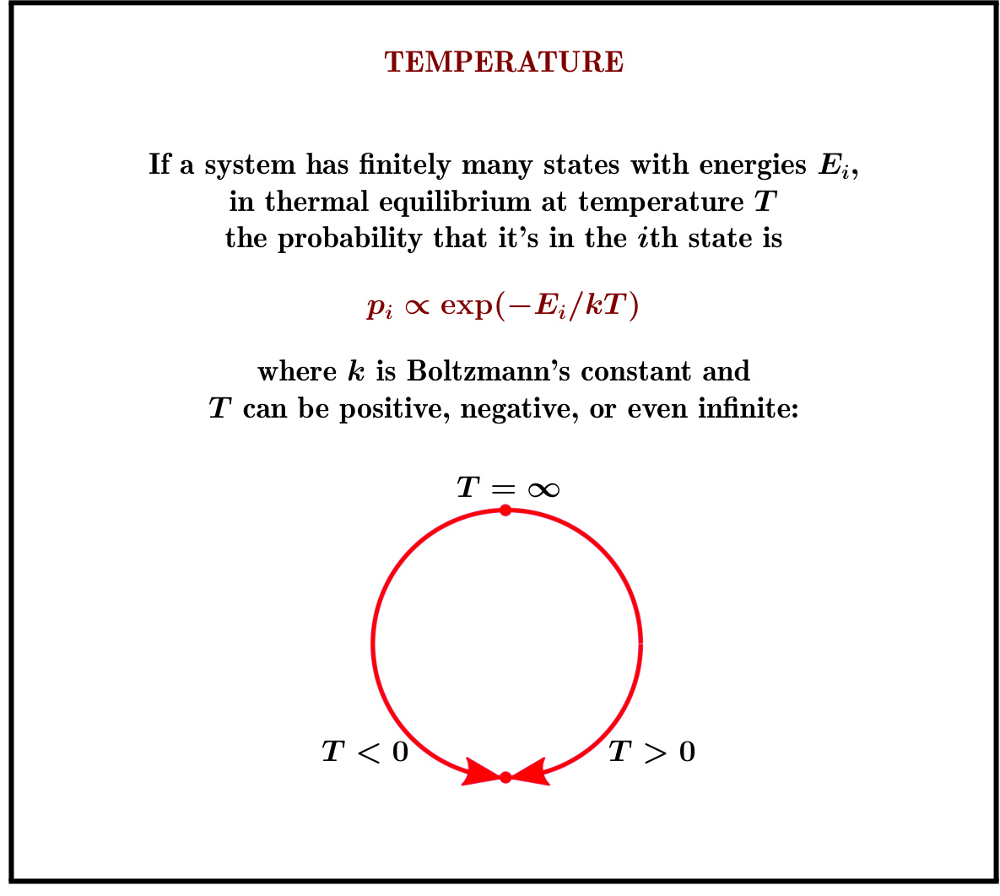  

A system with finitely many states can be pretty weird. It can have negative temperature! Even weirder: as you heat it up, its temperature becomes large and positive, then it reaches infinity, and then it ‘wraps around’ and become large and negative.  

The reason: coolness is more fundamental than temperature. The coolness $\beta$ is inversely proportional to the temperature $T$ :  

$$
\beta=1/k T.
$$  

When the temperature goes up to infinity and then suddenly becomes a large negative number, it’s really just the coolness going down to zero and becoming negative. Temperatures ‘wrap around’ infinity, as shown in the picture.  

A system with finitely many states can have negative or infinite temperature because in thermal equilibrium, its probability of being in the $i$ th state is  

$$
p_{i}=\frac{\exp(-\beta E_{i})}{\displaystyle\sum_{i=1}^{n}\exp(-\beta E_{i})}
$$  

where $E_{i}$ is the energy of the $i$ th state, and this makes sense for any $\beta\in\mathbb R$ . Moreover, the probability $p_{i}$ depends continously on $\beta$ , even as $\beta$ passes through zero. This means a large positive temperature is almost like a large negative temperature!  

But cle of temperature can be misleading. Temperatures wrap around $T=\infty$ but not T= 0. A system with a small positive temperature is very di!erent from one with a small negative temperature! That’s because $p_{i}$ for $\beta\gg0$ is very di!erent than it is for $\beta\ll0$ .  

For a system with finitely many states we can take the limit of the Boltzmann distribution when $\beta\to+\infty$ ; then the system will only occupy its lowest-energy state or states. We can also take the limit when $\beta\to-\infty$ ; then the system will only occupy its highest-energy state or states. In terms of temperature, this means that the limit where $T$ approaches zero from above is very di!erent than the limit where $T$ approaches zero from below.  

So, for a system with finitely many states, the best picture of possible thermal equilibria is not a circle of temperatures but a closed interval of coolness: the coolness $\beta$ can be anything in $[-\infty,+\infty]$ , which topologically is a closed interval. In terms of coolness, $+\infty$ is di!erent from $-\infty$ , but approaching 0 from above is the same as approaching it from below. But in terms of temperature, approaching 0 from above is di!erent from approaching 0 from below, while a temperature of $+\infty$ is the same as a temperature of $-\infty$ .  

Now, if all this seems very weird, here’s why: we often describe physical systems using infinitely many states, with a lowest possible energy but no highest possible energy. In this case the sum in the Boltzmann distribution can’t converge for $\beta<0$ , so negative temperatures are ruled out.  

However, some physical systems can be approximately described using a finite set of states (or in quantum theory, a finite-dimensional Hilbert space of states). Then the things I just said hold true! And people enjoy studying these systems, and their strange properties, in the lab.  

It’s good to look at a simple example, and work everything out explicitly:  

Puzzle 25. Suppose a system has two states with energies $E_{1}\,<\,E_{2}$ . Compute the probabilities $p_{i}$ that it is in either of these states in thermal equilibrium as a function of the coolness $\beta$ . Then express these probabilities as a function of the temperature $T$ .Using these functions $p_{i}(T)$ :  

• Show that when $0<T<+\infty$ the system is more likely to be in the lower-energy state: $p_{1}(T)>p_{2}(T)$ .  

• Show that when $-\infty<T<0$ the system is more likely to be in the higher-energy state: $p_{1}(T)<p_{2}(T)$ .  

• Show that  

$$
\operatorname*{lim}_{T\to+\infty}p_{i}(T)=\operatorname*{lim}_{T\to-\infty}p_{i}(T)
$$  

so we can speak unambiguously of the probabilities $p_{i}$ at infinite temperature.  

• Show that at infinite temperature the system has an equal probability of being in either state.  

• Show that as $T$ approaches zero from above, the probability of the system being in the lower energy state approaches 1.  

• Show that as $T$ approaches zero from below, the probability of the system being in the higher energy state approaches 1.  

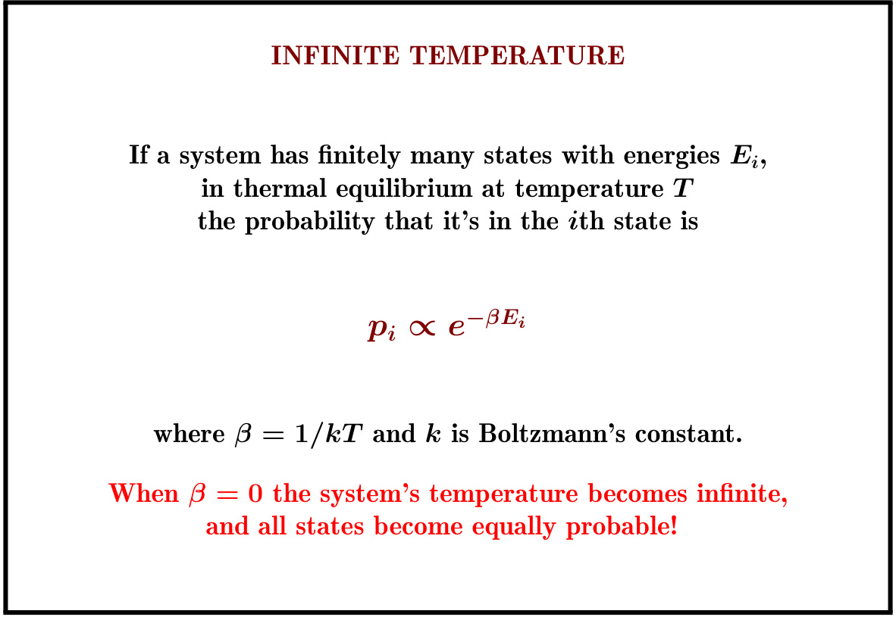  

The probability of finding a system in a particular state decays exponentially with energy when the coolness $\beta$ is positive. But for a system with finitely many states, $\beta$ can be zero. Then it becomes equally probable for the system to be in any state!  

Zero coolness means ‘utter randomness’: that is, maximum entropy.  

Here’s why. The probability distribution with the largest entropy is the one where all probabilities $p_{i}$ are all equal. This happens at zero coolness! When $\beta\:=\:0$ we get $\exp(-\beta E_{i})\,=\,1$ for all $i$ . The probabilities $p_{i}$ are proportional to these numbers $\exp(-\beta E_{i})=1$ , so they’re all equal.  

It seems zero coolness is impossible for a system with infinitely many states. With infinitely many states, all equally probable, the probability of being in any state would be zero. In other words, there’s no uniform probability distribution on an infinite set.  

the Lebesgue measure One way out: replace sums with integrals. For the usual measure on $d x$ , we have $\textstyle\int_{0}^{1}d x=1$ !1 . So this is a ‘probability measure’ that $[0,1]$ , called we could use to describe a system at zero coolness, whose space of states is $[0,1]$ .  

But replacing sums by integrals raises all sorts of interesting issues. For example, there’s a unique way to sum over a finite set of states, but an integral over an infinite set of states depends on a choice of measure. So a choice of measure is a significant extra structure we’re slapping on our set of states.  

We’ll need to think about these issues later, since to compute the entropy of a classical ideal gas we’ll need integrals. But we’ll encounter di!culties, which are ultimately resolved using quantum mechanics.  

Anyway: infinite temperature is really zero coolness, and at least for systems with finitely many states, the entropy becomes as large as possible at zero coolness.  

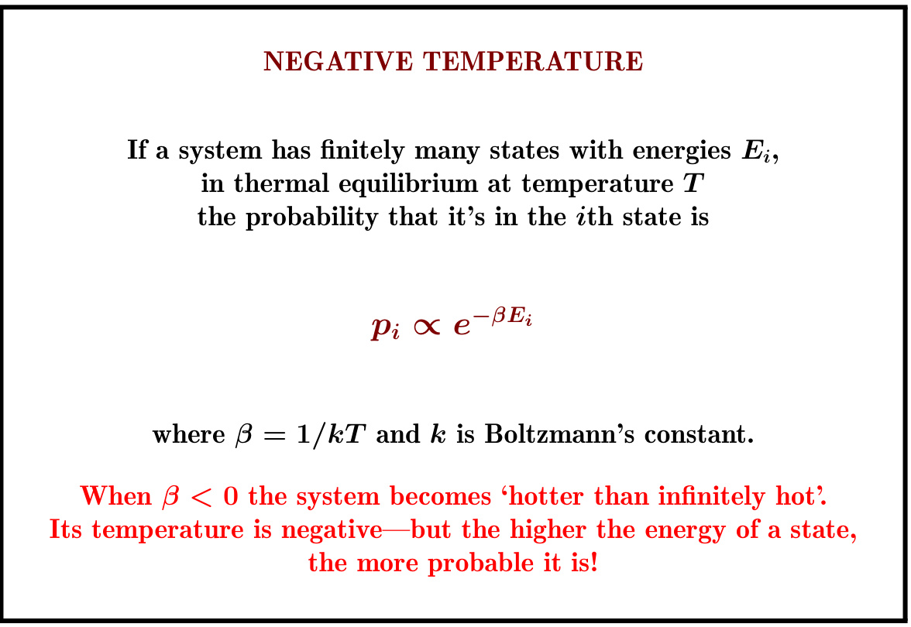  

A system with finitely many states can reach infinite temperature. It can get even hotter, but then its temperature ‘wraps around’ and become negative!  

The possibility of negative temperatures was first discussed by the physicist Lars Onsager in 1949, and they have been created in the lab with a variety of systems that—within some approximation—can be described as having finitely many states. In quantum theory, this happens for systems that have finite basis of ‘energy eigenstates’: states with well-defined energies $E_{i}$ . For example, the nucleus of an atom may have just two spin states, and if we put it in an magnetic field these will have di!erent energies. The result is the system we studied in Puzzle 25 .  

Here is a generalization with more energy states, all equally spaced:  

Puzzle 26. Consider a system with $2N+1$ states labeled by an integer $n$ with $-N\leq$ $n\,\leq\,N$ , where the $n$ th state has energy $E_{n}\,=\,\alpha n$ for some energy $\alpha\,>\,0$ . Compute the Boltzmann distribution for this system at coolness $\beta$ for all $\beta\in\mathbb R$ . Compute the expected energy $\langle E\rangle$ as a function of $\beta$ . What is the qualitative di!erence in your result between the case of positive temperature ( $\beta>0$ ) and negative temperature ( $\beta<0$ )?  

For more, try this:  

• Wikipedia, Negative temperature .  

If a system with finitely many states having energies $E_{i}$ is in thermal equilibrium, the probability $\mathbf{\nabla}p_{i}$ that it’s in the i th state is proportional to $\exp(-\beta E_{i})$ where $\beta$ is the coolness.   
In the limit of infinite coolness, $\beta\to+\infty$ , these probabilities go to zero except for the states of lowest energy, which all become equally probable.  

The limit $\beta\to+\infty$ is also the limit where $_{T}$ approaches zero from above, commonly called absolute zero .  

The limit where $T$ approaches zero from above is often called absolute zero . Why? First people made up various temperature scales like Celsius, where zero was the freezing point of water, and Fahrenheit, where zero is the freezing point of a mixture of water, ice, and ammonium chloride. But researchers discovered that nature had a more fundamental concept of zero temperature: the limit of infinite coolness! This happens as the temperature approaches $-273.15\ ^{\circ}\mathrm{C}$ , or roughly $-459.67\ {}^{\circ}\mathrm{F}$ . This discovery led Kelvin to propose a shifted version of Celsius where zero is absolute zero. This was originally called ‘absolute Celsius’, but now it is called the Kelvin scale . This is the scale of temperature I’ll always use here. The size of the degrees is a somewhat arbitrary convention, but the zero is not: it’s absolute zero.  

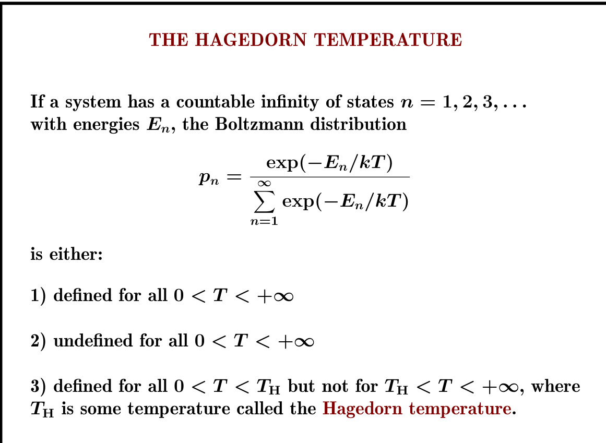  

We’ve been discussing systems with finitely many states, but many physical systems have a countable infinity of states. So let’s think a bit about those. We can copy everything we’ve done so far, but we have to be careful. For thermal equilibrium to be possible at some temperature $T$ , we need the Boltzmann distribution  

$$
p_{n}={\frac{\exp(-E_{n}/k T)}{\displaystyle\sum_{n=1}^{\infty}\exp(-E_{n}/k T)}}
$$  

to make sense. But it might not. Sometimes the sum fails to converge! This happens when the terms $\exp(-E_{n}/k T)$ don’t go to zero fast enough as $n\to+\infty$ .  

Let’s investigate this issue. We’ll assume that  

$$
\sum_{n=1}^{\infty}\exp(-E_{n}/k T)
$$  

converges for some $T>0$ . Then the energies $E_{n}$ must be bounded below: otherwise the terms $\exp(-E_{n}/k T)$ will get bigger and igger. Furthermore for any $E\in\mathbb{R}$ there can be at most finitely many $E_{n}$ less than E: otherwise we’d be adding up infinitely many terms greater than $\exp(-E/k T)$ . As a result, we can reorder the states so their energies are nondecreasing:  

$$
E_{1}\leq E_{2}\leq E_{3}\leq\cdots
$$  

and ${\cal E}_{n}\to+\infty$ .  

Reordering a sum can’t change its convergence or value if it’s a sum of nonnegative numbers, like the sum we have here. So we might as well assume we’ve listed the energies in nondecreasing order as above. Then there are two cases:  

1. $E_{n}$ approach $+\infty$ so fast that $\begin{array}{r}{\sum_{n=1}^{\infty}\exp(-E_{n}/k T)}\end{array}$ "converges for all $0<T<+\infty$ 0 +↓. Then our system can be in thermal equilibrium at any finite positive temperature. This is the nicest situation, and the one we typically expect..  

2. e e ergies $E_{n}$ approach $+\infty$ slowly enough that $\begin{array}{r}{\sum_{n=1}^{\infty}\exp(-E_{n}/k T)}\end{array}$ !converges when Tis small enough, but not otherwise. In this case there is some temperature $T_{\mathrm{H}}$ , called the Hagedorn temperature , such that our system can be in thermal equilibrium at positive temperatures $T$ below $\boldsymbol{\cal I}_{\mathrm{H}}^{\prime}$ , but not above $T_{\mathrm{H}}$ .  

In both cases, $\begin{array}{r}{\sum_{n=1}^{\infty}\exp(-E_{n}/k T)}\end{array}$ !diverges for all $-\infty\,\leq\,T\,<\,0$ and $T\,=\,+\infty$ . So, for a system with a countable infinity of states, if thermal equilibrium exists for some positive temperature, it cannot exist for negative or infinite temperatures.  

The second case is weird and interesting. It’s named after Rolf Hagedorn, who in 1964 noticed that this was a possibility in nuclear physics. He considered a model of nuclear matter where the energies $E_{n}$ approach $+\infty$ in a roughly logarithmic way. As you heat it, its expected energy keeps increasing, but its temperature can never exceed $T_{\mathrm{H}}$ . This model turned out to be incorrect, but it’s interesting anyway.  

Now let’s solve some puzzles on systems with a countable infinity of states. Some of these show up in quantum mechanics, but you don’t need to know quantum mechanics to do these puzzles.  

Puzzle 27. Show that for a system with a countable infinity of states, if thermal equilibrium is possible for some negative temperature, it is impossible for positive or infinite temperatures.  

Puzzle 28. Work out the Boltzmann distribution when $E_{n}\,=\,n E$ for some energy $E$ ,and show that it is well-defined for all temperatures $0<T<+\infty$ .  

The next puzzle is a lot like the previous one—a bit more messy, but worthwhile because of its great importance in physics.  

Puzzle 29. For a system called the quantum harmonic oscillator of frequency $\omega$ we have ${\cal{E}}_{n}=(n+{\textstyle{\frac{1}{2}}})\hbar\omega$ , where $\hbar$ is the reduced Planck’s constant. Work out the Boltzmann distribution in this case, and show it is well-defined for all temperatures $0<T<+\infty$ .  

Puzzle 30. For a system called the primon gas we have $E_{n}=E\ln n$ for some energy $E$ .Show that the Boltzmann distribution is well-defined for small enough positive temperatures, but there is a Hagedorn temperature. Give a formula for the Boltzmann distribution in terms of the Riemann zeta function :  

$$
\zeta(s)=\sum_{n=1}^{\infty}n^{-s}.
$$  

You can show that for the primon gas the sum $\begin{array}{r}{\sum_{n=1}^{\infty}\exp(-E_{n}/k T)}\end{array}$ !diverges at the Hagedorn temperature. But it can go the other way, too:  

Puzzle 31. Find energies $E_{n}$ with a Hagedorn temperature such that $\scriptstyle\sum_{n=1}^{\infty}\exp(-E_{n}/k T)$ !converges at the Hagedorn temperature.  

Various other strange things can happen, as you should expect when dealing with infinite series. For example, it’s possible that the Boltzmann distribution is well-defined at some temperature but the expected value of the energy is infinite! But I’ll resist the lure of these rabbit holes and turn to something much more important: systems with a continuum of states. We will need to get good at these to compute the entropy of hydrogen. Now our sums become integrals, and various new things happen.  

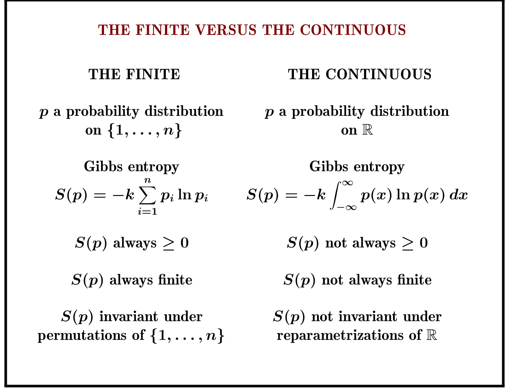  

You can switch from finite sums to integrals in the definition of entropy, and we’ll need to do this to compute the entropy of hydrogen. But be careful: a bunch of things change!  

We need to switch from finite sums to integrals when we switch from a finite set of states to a measure space of states. I’ll illustrate the ideas with the real line, $\mathbb{R}$ . We define a probability distribution on $\mathbb{R}$ to be an integrable function $p\colon\mathbb{R}\rightarrow[0,\infty)$ with  

$$
\int_{-\infty}^{\infty}p(x)\,d x=1.
$$  

Such a probability distribution has a Gibbs entropy given by  

$$
S(p)=-k\int_{-\infty}^{\infty}p(x)\ln p(x)\,d x.
$$  

We can also define Shannon entropy , where we leave out Boltzmann’s constant $k$ and use whatever base we want for the logarithm:  

$$
H(p)=-\int_{-\infty}^{\infty}p(x)\log p(x)\,d x.
$$  

I should warn you that many writers reserve the term ‘Shannon entropy’ only for a sum  

$$
H(p)=-\sum_{i\in X}p_{i}\log p_{i}.
$$  

While that convention has advantages, I want to use the term ‘Shannon entropy’ to signal that I’m leaving out the factor of $k$ .  

Unlike the entropy for a probability distribution on a finite set, the entropy of a probability distribution on $\mathbb{R}$ can be negative! This is disturbing. Earlier I said that the Shannon entropy of a probability distribution is the expected amount of information  

you learn when an outcome is chosen according to that distribution. How can this be negative?  

The answer is that this interpretation of entropy, valid for probability distributions on a finite or even a countably infinite set, is not true in the continuous case! We have to adapt our intuitions.  

Look at an example. Let $p_{\epsilon}$ be the probability distribution on $\mathbb{R}$ given by  

$$
p_{\epsilon}(x)=\left\{\begin{array}{l l}{\displaystyle\frac{1}{\epsilon}\quad\mathrm{if~}0\leq x\leq\epsilon}\\ {\displaystyle\qquad\qquad\qquad\qquad\quad}\\ {0\quad\mathrm{otherwise.}}\end{array}\right.
$$  

For small $\epsilon$ it’s a tall thin spike near 0. Let’s work out its Shannon entropy:  

$$
{\begin{array}{l l l}{H(p)}&{=}&{-\int_{-\infty}^{\infty}p(x)\log p(x)\,d x}\\ &&{=}&{-\int_{0}^{\epsilon}{\frac{1}{\epsilon}}\log{\frac{1}{\epsilon}}\,d x}\\ &{=}&{\log\epsilon.}\end{array}}
$$  

We’re just integrating a constant here, so it’s easy. When $\epsilon=1$ the entropy is zero, and when $\epsilon$ becomes smaller than 1 the entropy becomes negative!  

Why? We need a distance scale to define the entropy of a probability distribution on the real line. If I measure distance in centimeters, I’ll think the entropy of a probability distribution is bigger than you, who measures it in meters. And if I measure it in kilometers, I’ll think the entropy is smaller—and possibly even negative.  

Let’s see how this works. If I measure distance in di!erent units from you, my coordinate $y$ on the real line will not equal your coordinate $x$ : instead we’ll have  

$$
y=c x
$$  

for some $c>0$ . Then my probability distribution, say $q$ , will have  

$$
\int_{-\infty}^{\infty}q(y)\,d y=\int_{-\infty}^{\infty}q(c x)\,d(c x)=c\int_{-\infty}^{\infty}q(c x)\,d x
$$  

so we must have  

$$
q(c x)=\frac1c p(x)
$$  

to make this integral equal 1. In other words, stretching out a probability distribution must also flatten it out, making it less ‘tall’—and its entropy increases. Indeed:  

Puzzle 32. Show that $H(q)=H(p)+\ln c$ .  

Thanks to this formula choosing $0\,<\,c\,<\,1$ compresses a probability distribution and makes it taller, reducing its entropy. Inevitably, this can make the entropy negative if $c$ is small enough.  

In summary: in the continuous case, entropy is not invariant under reparametrizations: our choice of coordinates matters! And this can make entropy negative. This applies not only to $\mathbb{R}$ but many other measure spaces we’ll be considering, like $\mathbb{R}^{n}$ . This issue will be very important.  

After learning this, it should be less of a shock that the entropy of a probability distribution on $\mathbb{R}$ can be infinite, or even undefined:  

Puzzle 33. Find three probability distributions $p$ on the real line that have entropy $+\infty$ ,$-\infty$ , and undefined because it’s of the form $+\infty-\infty$ .  

# ENTROPY, ENERGY AND TEMPERATURE  

Suppose a system has some measure space $\boldsymbol{X}$ of states with energy $E\colon X\rightarrow\mathbb{R}$ . In thermal equilibrium the probability distribution on states, $p\colon X\to\mathbb{R}$ , maximizes the Gibbs entropy  

$$
S=-k\int_{X}p(x)\ln p(x)\,d x
$$  

subject to a constraint on the expected value of energy:  

$$
\langle E\rangle=\int_{X}p(x)E(x)\,d x
$$  

Typically when this happens $\pmb{p}$ is the Boltzmann distribution  

$$
p(x)={\frac{e^{-E(x)/k T}}{\displaystyle\int_{X}e^{-E(x)/k T}\,d x}}
$$  

where ${\bf\nabla}T$ is the temperature and $\pmb{k}$ is Boltzmann’s constant.  

Then as we vary $\langle E\rangle$ we have  

$$
d\langle E\rangle=T d S
$$  

We can now generalize a lot of our work from a finite set of states to a general measure space. I won’t redo all the arguments, just state the results and point out a couple of caveats.  

For any measure space $X$ we say a function $p\colon X\to[0,\infty)$ is a probability distribution if it’s measurable and  

$$
\int_{X}p(x)\,d x=1.
$$  

We can define a version of Shannon entropy for $p$ by  

$$
H=-\int_{X}p(x)\log p(x)\,d x,
$$  

but physicists mainly use the Gibbs entropy , defined by  

$$
S=-k\int_{X}p(x)\ln p(x)\,d x.
$$  

As I warned you last time, this can take values in $[-\infty,\infty]$ , though we are mainly interested in cases when it’s finite. If we think of Xas the space of states of some system, we can pick any measurable function $E\colon X\rightarrow\mathbb{R}$ and call it the ‘energy’. Its expected value is then  

$$
\langle E\rangle=\int_{X}E(x)p(x)\,d x
$$  

at least when this integral converges.  

We say the probability distribution $p$ describes thermal equilibrium if it maximizes $S$ subject to a constraint $\langle E\rangle\,=\,c$ . Typically when this happens $p$ is a Boltzmann distribution  

$$
p(x)={\frac{e^{-\beta E(x)}}{\displaystyle\int_{X}e^{-\beta E(x)}\,d x}}
$$  

where $\beta$ is called the coolness . I say ‘typically’ because even when $X$ is a finite set, we saw in Puzzle 24 that there can be thermal equilibria that are not Boltzmann distributions, but only limits of Boltzmann dis butions as $\beta\,\rightarrow\,+\infty$ or $\beta\,\rightarrow\,-\infty$ .This can also happen for other measure spaces X. I will not delve into this, because my goal now is to get to some physics.  

As before, we can write $\beta=1/k T$ , at least if $\beta\neq0$ , and then write the Boltzmann distribution as  

$$
p(x)={\frac{e^{-E(x)/k T}}{\displaystyle\int_{X}e^{-E(x)/k T}\,d x}}.
$$  

Also as before, the Boltzmann distributions obey the crucial relation  

$$
d H=\beta d\langle E\rangle.
$$  

Rewriting this in terms of Gibbs entropy $\cal S\ =\ k H$ and temperature $T\;=\;1/k\beta$ , it becomes this famous relation between temperature, entropy and the expected energy:  

$$
T d S=d\langle E\rangle.
$$  

Notice that the units match here. The Shannon entropy $H$ is dimensionless, but since $k$ has units of energy/temperature, the Gibbs entropy $\cal S\ =\ k H$ has units of energy/temperature. Thus $T d S$ has units of energy, as does $d\langle E\rangle$ .  

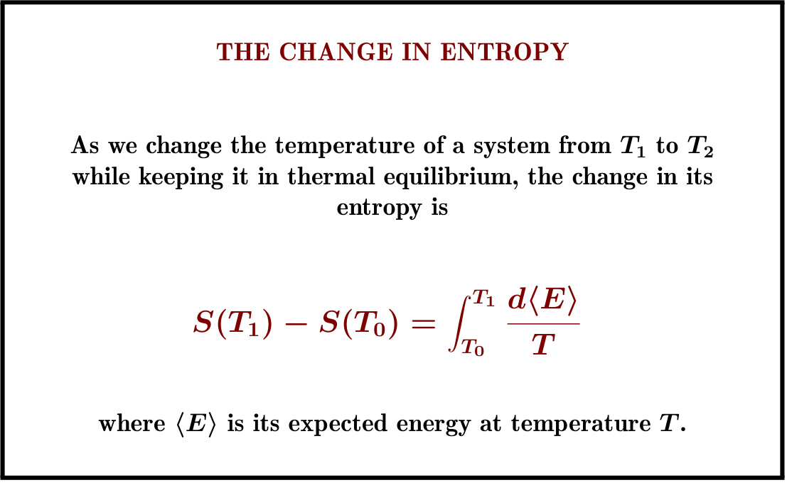  

Last time we saw that as we change the expected energy $\langle E\rangle$ of a system while keeping it in thermal equilibrium, this fundamental relation holds:  

$$
T d S=d\langle E\rangle.
$$  

We can rewrite this as  

$$
d S={\frac{d\langle E\rangle}{T}}
$$  

and then integrate this from one temperature to another—remember, as the expected energy changes, so does the temperature. We get  

$$
\int_{T_{0}}^{T_{1}}\frac{d\langle E\rangle}{T}=S(T_{1})-S(T_{0}).
$$  

This is the main way people do experiments to ‘measure entropy’. Slowly heat something up, keeping track of how much energy it takes to increase its temperature each little bit. Using this data you can approximately calculate the integral at left—and that gives the change in entropy!  

But so far we’re just measuring changes in entropy. How can you figure out the actual value of the entropy? One way is to assume the Third Law of Thermodynamics, which says that in thermal equilibrium the entropy approaches zero as the temperature approaches zero from above. This gives  

$$
\int_{0}^{T_{1}}\frac{d\langle E\rangle}{T}=S(T_{1}).
$$  

This is how people often ‘measure the entropy’ of a system in thermal equibrium. They heat it up starting from absolute zero, very slowly so—they hope—it is close to thermal equilibrium at every moment—and they take data on how much energy is used, and approximately calculate the integral at left!  

But this relies on the Third Law of Thermodynamics. So where does that come from?  