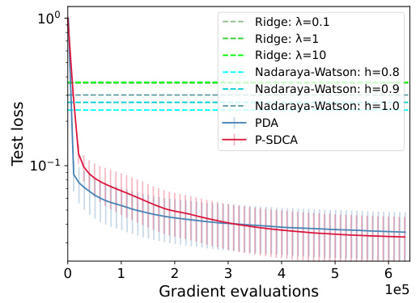

# Two-layer neural network on infinite-dimensional data: global optimization guarantee in the mean-field regime  

Naoki Nishikawa Taiji Suzuki University of Tokyo University of Tokyo nishikawa-naoki259@g.ecc.u-tokyo.ac.jp RIKEN AIP taiji@mist.i.u-tokyo.ac.jp  

Atsushi Nitanda   
Kyushu Institute of Technology RIKEN AIP   
nitanda@ai.kyutech.ac.jp  

Denny Wu University of Toronto Vector Institute dennywu@cs.toronto.edu  

# Abstract  

Analysis of neural network optimization in the mean-field regime is important as the setting allows for feature learning . Existing theory has been developed mainly for neural networks in finite dimensions, i.e., each neuron has a finite-dimensional parameter. However, the setting of infinite-dimensional input naturally arises in machine learning problems such as nonparametric functional data analysis and graph classification. In this paper, we develop a new mean-field analysis of two-layer neural network in an infinite-dimensional parameter space. We first give a generalization error bound, which shows that the regularized empirical risk minimizer properly generalizes when the data size is sufficiently large, despite the neurons being infinite-dimensional. Next, we present two gradient-based optimization algorithms for infinite-dimensional mean-field networks, by extending the recently developed particle optimization framework to the infinite-dimensional setting. We show that the proposed algorithms converge to the (regularized) global optimal solution, and moreover, their rates of convergence are of polynomial order in the online setting and exponential order in the finite sample setting, respectively. To our knowledge this is the first quantitative global optimization guarantee of neural network on infinite-dimensional input and in the presence of feature learning.  

# 1 Introduction  

A variety of machine learning problems need to handle input from infinite-dimensional spaces. For instance, Ling and Vieu (2018); Ferraty et al. (2007) studied non-parametric function regression problems where the input is a function in an infinite-dimensional functional space, and Kriege et al. (2020) studied graph classification problems using kernel method, which can be cast as a learning problem with inputs from an infinite-dimensional reproducing kernel Hilbert space.  

Among various models that deal with those infinite-dimensional input problems, neural networks are particularly interesting due to their ability to learn features and model nonlinear data. For example, Rossi and Conan-Guez (2005) proposed the Functional Multi-Layer Perceptron, where the input of functional data is converted to vector form by basis expansion and then fed into a neural network; the universal approximation and statistical consistency of the proposed model were also analyzed. Recently, Yao et al. (2021) proposed the Adaptive Functional Neural Network, which replaces the fixed basis functions in Rossi and Conan-Guez (2005) with adaptive bases, in order to leverage the power of representation (feature) learning and the flexibility of deep learning. While neural network based models with infinite-dimensional input have been applied in many applications, their optimization using gradient-based methods is not well-understood. In particular, no optimization guarantee has been shown for any algorithm in the presence of feature learning — such theoretical result can be challenging to establish even for finite-dimensional data.  

It is experimentally observed that the gradient-based optimization methods can yield sufficiently small training error in training neural network models, despite the non-convexity of the landscape. Theoretical explanations of this observation often rely on overparameterization , that is, to consider sufficiently wide neural network compared with the data size, and the model parameterization can be divided into the mean-field regime (Nitanda and Suzuki, 2017; Mei et al., 2018; Chizat and Bach, 2018) and the neural tangent kernel regime (Jacot et al., 2018; Du et al., 2018). In this work we focus on the mean-field regime, as it captures the presence of feature learning, which is one of the main advantages of neural network (Chizat et al., 2019; Yang and Hu, 2021).  

In the mean-field analysis, the dynamics of gradient descent is described by Wasserstein gradient flow in the space of probability distributions on the parameters. Mei et al. (2018) showed that the mean-field Langevin dynamics converges to the global optimal solution, and Hu et al. (2019) proved linear convergence with respect to the objective function with sufficiently strong KL divergence regularization. However, those studies mainly analyzed the algorithm in continuous time, and do not establish quantitative convergence rate for discrete time and finite width settings.  

To overcome this limitation, Nitanda et al. (2021) proposed the Particle Dual Averaging (PDA) method that globally optimizes the KL-regularized objective with a polynomial order computational complexity, in a completely discrete time and finite width setting. Furthermore, in the case of finitesum objective, Oko et al. (2022) proposed the Particle Stochastic Dual Coordinate Ascent (P-SDCA) method which further improves the computational complexity to an exponential order with respect to its outer loop iteration. Both PDA and P-SDCA employ a double-loop structure, and make use of Monte Carlo sampling from an intermediate target distribution in the inner loop. In particular, Nitanda et al. (2021) applied the convergence rate of the overdamped Langevin algorithm in Vempala and Wibisono (2019) for their optimization analysis, whereas Oko et al. (2022) also considered the Metropolis-adjusted Langevin algorithm (MALA) (Ma et al., 2019) for the inner loop sampling. However, if we naively apply these algorithms to infinite-dimensional input, then the optimization guarantee becomes meaningless due to the dimension dependence. Therefore, we need to construct a new methodology and theory for the infinite-dimensional problem.  

Our contributions. In this work, we extend the mean-field analysis for neural network training to infinite-dimensional parameter space, which covers two-layer neural network with infinitedimensional inputs. First, we establish a generalization error bound which entails that our model generalizes properly when the number of training data is sufficiently large. Next, we propose two gradient-based algorithms that globally optimize the KL-regularized objective, corresponding to the infinite-dimensional extension of PDA and P-SDCA, respectively.  

As mentioned above, PDA and P-SDCA require Monte Carlo sampling, and in our setting sampling is performed in an infinite-dimensional Hilbert space. We therefore adapt an infinite-dimensional gradient Langevin dynamics (Debussche, 2011; Bréhier, 2014), the weak convergence of which has been established in Muzellec et al. (2022). Our contributions can be summarized as follows:  

•We introduce two-layer neural network in the mean-field regime whose input is infinite-dimensional, and establish a generalization error bound of the regularized empirical risk minimizer. •We propose two optimization algorithms for our infinite-dimensional neural network by incorporating the infinite-dimensional Langevin dynamics in the inner loop of PDA and P-SDCA. •We prove that our infinite-dimensional extension of PDA achieves polynomial order convergence, and that of P-SDCA achieves exponential (outer loop) convergence even in an infinite-dimensional setting 1 . To the best of our knowledge, this is the first quantitative global optimization guarantee of neural network in the infinite-dimensional mean-field regime with the presence of feature learning.  

Other related works. Ferré and Villa (2006) proposed the SIR-NNr, which incorporates the dimension reduction method termed “sliced inverse regression” into a neural network. In addition, Rossi et al. (2005) introduced a radial-basis function network as a nonlinear model whose input is a function. As previously discussed, although statistical properties (e.g., consistency) of these models have been studied, convergence guarantee of gradient-based optimization has not been established.  

# 2 Two-layer neural network with infinite-dimensional input  

In this section we introduce the mean-field two-layer neural network with infinite-dimensional input. We first formulate mathematical notations and prepare assumptions required for our theoretical analyses, and then present a generalization error of the proposed model.  

Neural network model. We consider a setting where the input is included in a (possibly infinite$(e_{j})_{j=0}^{\infty}$ dimensional) separable Hilbert space for which it holds that $\begin{array}{r}{\mathcal{\bar{H}}=\left\{\sum_{j=0}^{\infty}a_{j}e_{j}\;\Big|\;\bar{\sum}_{j=0}^{\infty}\,a_{j}^{2}<\infty\right\}}\end{array}$ $\mathcal{H}$ . Since $\mathcal{H}$ is separable, there is a complete orthonomal system Po,and $\mathcal{H}$ is equipped with the er product give by ⟨$\begin{array}{r}{\langle f,g\rangle_{\mathcal{H}}:=\sum_{j=0}^{\infty}a_{j}b_{j}}\end{array}$ P,where $\begin{array}{r}{f=\sum_{j=0}^{\infty}\overset{\cdot}{a_{j}}e_{j},g=\sum_{j=0}^{\infty}b_{j}e_{j}\in\mathcal{H}}\end{array}$ P. Let $\mathcal{H}_{0}$ set of Hefine Hby H$\begin{array}{r}{\mathcal{H}_{0}:=\{0\cdot e_{0}+\sum_{j=1}^{\infty}a_{j}e_{j}\quad|\quad\sum_{j=1}^{\infty}a_{j}^{2}\,<\,\infty\}}\end{array}$ P|P∞} .We consider a $y\in\mathcal{Y}\subseteq\mathbb{R}$ neural network model that takes an infinite-dimensional input network has parameter ∈Y ⊆ , where X$\theta:=a e_{0}+w\in\mathcal{H}$ $\boldsymbol{\wp}$ ∈H for s of $a\in\mathbb R$ ∈and and $w\in\mathcal{H}_{0}$ ∈H , and is represented by ∈X ⊆H respectively. Each neuron in the and gives an output  

$$
h_{\theta}(x):=\sigma_{1}(a)\sigma_{2}(\langle w,x\rangle_{\mathcal{H}}),
$$  

where $\sigma_{1},\sigma_{2}:\mathbb{R}\rightarrow\mathbb{R}$ ar atio ons, which we assume to be bou d and smooth (such as tanh )2 . We also denote $h_{\theta}(x)$ by $h(\theta,x)$ . Let the number of neurons be Mand denote the set of parameters by $\Theta=(\theta_{r})_{r=1}^{M}$ . Then, in the mean-field regime, the two layer neural network model (with infinite-dimensional input) can be expressed as the average over the $M$ neurons:  

$$
h_{\Theta}(x):=\frac{1}{M}\sum_{r=1}^{M}h_{\theta_{r}}(x).
$$  

This can be seen as a finite sum approximation of the integral form $\mathbb{E}_{\theta\sim\pi}[h_{\theta}(x)]$ for a distribution $\pi$ on the parameter space. Indeed, if $\bar{(\theta_{r})}_{r=1}^{M}$ are i.i.d. realizations from $\pi$ , then $h_{\Theta}(x)$ would converge to the integral form as $M$ increases. This viewpoint motivates us to design optimization algorithms for the distribution of parameters $\pi$ and utilize the convexity of the objective in the space of measures.  

Notations. To introduce our method, def aussian process taking its value in $\mathcal{H}$ .For that operator $T_{K}:\mathcal{H}\rightarrow\mathcal{H}$ Hefine a subspace as $\begin{array}{r}{T_{K}f={\bf\dot{\sum}}_{j=0}^{\infty}\,\mu_{j}a_{j}e_{j}}\end{array}$ H$\mathcal{H}_{K^{\gamma}}\subset\mathcal{H}$ ⊂H for for $\textstyle f=\sum_{j=0}^{\infty}a_{j}e_{j}$ $\gamma\geq0$ ≥as follows. First, we define a linear , where $(\mu_{j})_{j=0}^{\infty}$ corresponds to the spectrum of Note that the orthonormal system $T_{K}$ satisfying $\mu_{j}>0\ (\forall j)$ $(e_{j})_{j=0}^{\infty}$ ∀is taken so that it coincides with the eigen-functions of and is sorted in decreasing order $[\mu_{1}\geq\mu_{2}\geq\cdot\cdot\cdot)$ .$T_{K}$ . Then, we define H$\mathcal{H}_{K^{\gamma}}:=T_{K}^{\frac{\gamma}{2}}\mathcal{H}=\{T_{K}^{\frac{\gamma}{2}}h\mid h\in\mathcal{H}\}$ H{|∈H} and we can naturally equip $\mathcal{H}_{K^{\gamma}}$ with a $\mathcal{H}_{K}:=\mathcal{H}_{K^{1}}$ H$\begin{array}{r}{\|f\|_{\mathcal{H}_{K}\gamma}:=\sum_{j=0}^{\infty}\mu_{j}^{-\gamma}a_{j}^{2}}\end{array}$ H. Next, define an operator fo $\begin{array}{r}{f=\sum_{j=0}^{\infty}a_{j}e_{j}\in\mathcal{H}_{K^{\gamma}}}\end{array}$ $A=\lambda_{1}T_{K}^{-1}$ ∈H for a positive regularization parameter . For concise notation we simply write $\lambda_{1}>0$ ,i.e., $\begin{array}{r}{A f=\lambda_{1}\sum_{j=0}^{\infty}\mu_{j}^{-1}a_{j}e_{j}}\end{array}$ P$\begin{array}{r}{\boldsymbol{f}=\sum_{j=0}^{\infty}a_{j}\boldsymbol{e}_{j}\in\mathcal{H}_{K}}\end{array}$ , and let $\nu$ be a Gaussian measure in $\mathcal{H}$ whose mean is 0 and its covariance is $A^{-1}$ (i. $\langle z,x\rangle_{\mathcal{H}}\left(z\sim\nu\right)$ obeys the Gaussian distribution with with respect to mean divergence from a probability measure 0 and covariance $\nu_{2}$ as $\begin{array}{r}{\mathrm{KL}(\nu_{1}||\nu_{2}):=\mathbb{E}_{\nu_{1}}\left[\log\frac{\mathrm{d}\nu_{1}}{\mathrm{d}\nu_{2}}\right]=\mathbb{E}_{\nu_{2}}\left[\frac{\mathrm{d}\nu_{1}}{\mathrm{d}\nu_{2}}\log\frac{\mathrm{d}\nu_{1}}{\mathrm{d}\nu_{2}}\right].}\end{array}$ ⟨$\langle x,A^{-1}x\rangle_{\mathcal{H}}$ ⟩Hfor $\nu_{2}$ hny to a probability measure $x\in\mathcal{H})^{3}$ ∈H i . Finally, we d h$\nu_{1}$ that is absolutely continuous ne the Kullback-Leibler (KL) i .  

Objective. Now we define the objective of our optimization method. Suppose that the pairs of input and output are independently identically distributed from $\mathcal{D}$ , and let $\ell(\cdot,\cdot):\mathcal{V}\times\mathcal{V}\rightarrow\mathbb{R}$ be a loss function. In the mean-field regime, we optimize the following regularized risk minimization problem with respect to the distribution of parameters where the regularization term is given by the KL-divergence from the Gaussian measure $\nu$ :  

$$
\operatorname*{min}_{\pi\in\mathcal{P}_{2}}\ \mathcal{L}(\pi):=\mathbb{E}_{(X,Y)\sim\mathcal{D}}\left[\ell\left(\mathbb{E}_{\theta\sim\pi}[h_{\theta}(X)],Y\right)\right]+\lambda_{2}\mathrm{KL}(\pi||\nu),
$$  

where and are absolutely continuous with respect to the Gaussian measure $\lambda_{2}~>~0$ and $\mathcal{P}_{2}$ is the entire set of probability measures that s νtisfy . We may consider the $\mathbb{E}_{\theta\sim\pi}[\|\theta\|_{\mathcal{H}}^{2}]\;<\;\infty$ H∞empirical measure of function is written as a regularized empirical risk minimization problem. As for the second term, in a finite-dimensional $n$ $\begin{array}{r}{\frac{1}{n}\sum_{i=1}^{n}\ell\left(\mathbb{E}_{\theta\sim\pi}[h_{\theta}(x_{i})],y_{i}\right)}\end{array}$ training data points P∼$(x_{i},y_{i})_{i=1}^{n}$ . In this setting, the problem can be regarded as as $\mathcal{D}$ , for which the first term of the objective setting where $A\,=\,\lambda_{1}I,$ , we can easily see that the KL divergence is decomposed into the sum of $\ell^{2}$ -regularization $\lambda_{1}\mathbb{E}_{\theta\sim\pi}[\|\theta\|^{2}]$ and negative entropy $\mathbb{E}_{\theta\sim\pi}[\log\mathrm{d}\pi(\theta)/\mathrm{d}\theta]$ . Here the negative entropy naturally arises from the mean-field Langevin dynamics (Hu et al., 2019; Nitanda et al., 2022; Chizat, 2022). Indeed, it is known that, if we optimize a loss function $L(q)$ with respect to a probability distribution $q\in\mathcal{P}_{2}$ by the me in dyna e parameter $\lambda_{2}$ ,then its stationary distribution is given by $q^{*}=\arg\operatorname*{min}_{q}$ :density $L(q)+\lambda_{2}\mathbb{E}_{q}[\log(q)]$ which satisfies $\begin{array}{r}{q^{*}\propto\exp(-\frac{1}{\lambda_{2}}\frac{\delta L(q^{*})}{\delta q})}\end{array}$ ), where $\frac{\delta L(q)}{\delta q}:\mathcal{H}\to\mathbb{R}$ is the derivative with respect to the distribution $q$ such R2 that $\begin{array}{r}{\int\frac{\delta L(q)}{\delta q}(\theta)\mathrm{d}(p-q)(\theta)=\operatorname*{lim}_{\epsilon\to0}\frac{1}{\epsilon}[L(\epsilon p+(1-\epsilon)q)-L(q)]}\end{array}$ for any distribution $p\in\mathcal{P}_{2}$ .  

One important example that we can apply our model to is the non-parametric functional regression problem (Ling and Vieu, 2018; Ferraty et al., 2007). Suppose that the input $x$ is a function on $\mathbb{R}$ (such as time evolution of temperature) included in some reproducing kernel Hilbert space typi and $T_{K}$ is an integral operator given by definition of $\mathcal{H}_{K}$ is given by $\mathcal{H}_{K}=T_{K}^{1/2}\mathcal{H}$ $\begin{array}{r}{T_{K}f(t):=\int K(t,s)f(s)\mathrm{d}\mu(s)}\end{array}$ R$\mathcal{H}=L^{2}(\mu)$ for a probability measure for a positive definite kernel $\mathcal{H}_{K}$ . One $\mu$ $K$ (Caponnetto and De Vito, 2007; Steinwart and Christmann, 2008). The goal is to estimate some non-linear functional from the input $x\in\mathcal{H}_{K}$ to output $y\in\mathbb R$ (using neural network (1)).  

Generalization bound. We now give a generalization error bound for our two-layer neural network in the empirical risk minimization setting, which confirms that the model properly generalizes when the data size is sufficiently large. Specially, we show the generalization bound for two problem settings: binary classification and regression. The following theorem stats the generalization bound for binary classification problems. We defer the regression case to Appendix A due to space limitation.  

Theore t$\mathcal{D}$ b$\mathcal X\times\mathcal X$ ,$\ell$ the smoothed hinge loss, and denote the 0-1 loss by minimization probl exists a distri holds for choice of $\ell_{01}(z,y),$ $S\subset\mathcal{X}$ ⊂X $\theta\in\mathcal{H},\,\,x\in\mathcal{X}$ , i.e., :H$\pi^{\circ}\in\mathcal{P}_{2}$ $\ell_{01}(z,y):=\mathbb{1}[z y<0]$ ∈X such that r a given . Then, the following holds with probability $h_{\pi^{\circ}}(x)y\geq1/2$ $S$ . Let ≥$\pi_{*}$ ∗ng data for all be the optimal solution of $(x,y)\in\mathrm{supp}\mathcal{D}$ ∈$1-\delta$ −om with respect to the nd that D). Su e empirical risk |$\bar{|h_{\theta}(x)|}\leq1$ | ≤  

$$
\mathbb{E}_{(X,Y)\sim\mathcal{D}}[\ell_{01}(h_{\pi_{*}}(X),Y)]\le\lambda_{2}\mathrm{KL}(\pi^{\circ}||\nu)+8\sqrt{2}\sqrt{\frac{\mathrm{KL}(\pi^{\circ}||\nu)}{n}}+5\sqrt{\frac{1}{2n}\log\frac{1}{\delta}}.
$$  

The KL -term is bounded when $\pi^{\circ}$ is a variation of the Gaussian measure $\nu$ such that $\frac{\mathrm{d}\pi^{\circ}}{\mathrm{d}\nu}\log\!\left(\frac{\mathrm{d}\pi^{\circ}}{\mathrm{d}\nu}\right)$ is integrable with respect to $\nu$ . Note that if we set $\lambda_{2}=1/\sqrt{n}$ , the generalization error is $O(1/{\sqrt{n}})$ .This order matches that in the finite-dimensional input setting shown in Nitanda et al. (2021).  

# 3 Mean-field optimization with infinite-dimensional Langevin algorithm  

As previously remarked, the core idea of the mean-field analysis is to directly optimize the distribution of the parameters (2) . For that purpose, the ideal situation would be to maintain infinitely many particles (neurons) to represent the distribution; however, in a tractable algorithm we need to use an approximation with finite number of particles. This finite-particle approximation may lead to instability due to the interaction between particles, which is known to be difficult to control.  

To overcome this difficulty, we employ the linearization technique that was used in the original PDA and P-SDCA algorithms (Nitanda et al., 2021; Oko et al., 2022). We provide a short summary of this idea: given the $t$ -th step solution $\pi_{t}$ , we apply a first-order approximation of the loss function $L(\pi):=\mathbb{E}_{(X,Y)\sim\mathcal{D}}\left[\ell\left(\mathbb{E}_{\theta\sim\pi}[h_{\theta}(X)],Y\right)\right]$ as $\begin{array}{r}{(\bar{\pi}\!-\!\bar{\pi}_{t})\frac{\delta L(\pi_{t})}{\delta\pi}:=\int\frac{\bar{\delta}\bar{L}(\pi_{t})}{\delta\pi}(\theta)\mathrm{d}(\pi\!-\!\pi_{t})(\theta)}\end{array}$ R−. Then, $\pi_{t+1}$ is updated as the minimizer of the linearized loss objective: argm $\begin{array}{r}{\mathrm{in}_{\pi}(\pi-\pi_{t})\frac{\delta L(\pi_{t})}{\delta\pi}+\lambda_{2}\mathrm{KL}(\pi||\nu)}\end{array}$ || ,which can be written as $\begin{array}{r}{\mathrm{d}\pi_{t+1}=\exp(-\frac{1}{\lambda_{2}}\frac{\delta L(\pi_{t})}{\delta\pi})\cdot\mathrm{d}\nu}\end{array}$ . Hence we just need to draw particles from $\pi_{t+1}$ in the inner loop. Importantly, the interaction between particles disappear due to the linearization and we may sample in an i.i.d. manner. The original algorithms of PDA and P-SDCA for (finitedimensional input) employed the gradient Langevin dynamics (GLD) and its variant such as MALA, the convergence rate of which have been extensively studied (Raginsky et al., 2017; Vempala and Wibisono, 2019; Ma et al., 2019). However, in our setting we need to solve an infinite-dimensional sampling problem, which cannot be directly extended from the finite-dimensional counterpart.  

Let $\pi$ be distribution on $\mathcal{H}$ that satisfies $\begin{array}{r}{\frac{\mathrm{d}\pi}{\mathrm{d}\nu}(x)\propto\exp\left(-G(x)\right)}\end{array}$ (e.g., $G=\lambda_{2}^{-1}\delta L(\pi_{t})/\delta\pi)$ ). Then we know πis the stationary distribution of the infinite-dimensional stochastic differential equation,  

$$
\mathrm{d}X_{t}=-\left(\nabla G(X_{t})+A X_{t}\right)\mathrm{d}t+\sqrt{2}\mathrm{d}W_{t},
$$  

where $(W_{t})_{t\geq0}$ is a cylindrical Browni mo on on $\mathcal{H}$ (Da Prato et al., 1996) and $\boldsymbol{\nabla}G$ is the Riesz representer of the Fréchet derivative of Gon H. To discretize the continuous-time SDE, we employ the semi-implicit Euler scheme:  

$$
X_{k+1}=X_{k}-\eta(\nabla G(X_{k})+A X_{k+1})+{\sqrt{2\eta}}\zeta_{k},
$$  

i.e., $X_{k+1}=S_{\eta}\left(X_{k}-\eta\nabla G(X_{k})+{\sqrt{2\eta}}\zeta_{k}\right)$ −∇,where $\zeta_{k}$ is a realization of standard Gaussian process on $\mathcal{H}$ , and $S_{\eta}:=(\mathrm{Id}+\eta A)^{-1}$ where Id is an identity mapping. We remark that our choice of semiimplicit scheme is due to the fact that Euler-Maruyama discretization does not ensure $\zeta_{k}\notin\mathcal{H}$ ∈H in $X_{k+1}\in\mathcal{H}$ ∈H e-dimensional setting, and thus the naive while the semi-implict scheme does.  

In practice, we need to approximate the infinite-dimensional vector $X_{k}$ by a finite-dimensional one. For that purpose, we apply the Galerkin approximation . Let $P_{N}$ be the orthogonal projection from $\mathcal{H}$ to $\mathcal{H}_{N}:=\mathrm{span}\{e_{0},\dots,e_{N}\}$ , and $\nabla\bar{G}_{N}^{~\^{\cdot}}(x):=P_{N}(\nabla G(P_{N}x))$ ). Then the finite-dimensional approximation of the semi-implicit Euler scheme is given as  

$$
X_{k+1}^{N}=S_{\eta}\left(X_{k}^{N}-\eta\nabla G_{N}(X_{k}^{N})+\sqrt{2\eta}P_{N}\zeta_{k}\right).
$$  

A convergence rate analysis of the infinite-dimensional gradient Langevin dynamics (4) with time discretization and finite-dimensional approximation was given by Muzellec et al. (2022), which is an important ingredient of our convergence rate analysis (the details can be found in Appendix B).  

# 4 Infinite-dimensional Particle Dual Averaging  

In this section, we present our first algorithm to solve the risk minimization problem (2) which is an infinite-dimensional extension of the Particle Dual Averaging (PDA) method Nitanda et al. (2021). PDA is a combination of Nesterov’s dual averaging (Nesterov, 2009) and particle sampling; it is guaranteed to converge globally at a sublinear rate, but is tailored to the finite-dimensional setting. Extending the algorithm and convergence analysis to infinite-dimensional input is non-trivial, and to do so we make use of the weak convergence property of the infinite-dimensional gradient Langevin dynamics (GLD) shown in Muzellec et al. (2022).  

Algorithm description of infinite-dimensional PDA. Here we provide the algorithm description of PDA with infinite-dimensional input. Since we are optimizing the expected loss directly, we mploy an online gradient descent approach: we draw one input-output pair $\left({{x}_{t}},{{y}_{t}}\right)$ from $\mathcal{D}$ at the $t$ -th iteration, and update the parameter by replacing the expected loss with a single-sample loss $\ell\left(\mathbb{E}_{\theta\sim\pi}[h_{\theta}(x_{t})],y_{t}\right)$ . In addition, we apply the following linearization to the loss at each outer loop step: suppose that we have $M$ particles $\Theta^{(t)}=(\theta_{m}^{(t)})_{m=1}^{M}$ whose empirical measure is denoted by $\begin{array}{r}{\hat{\pi}^{(t)}=\frac{1}{M}\sum_{m=1}^{M}\delta_{\theta_{m}^{(t)}}}\end{array}$ P(i.e., $h_{\Theta^{(t)}}=\mathbb{E}_{\theta\sim\hat{\pi}^{(t)}}\big[h_{\theta}(\cdot)\big])$ . Then the loss can be linearized around $\hat{\pi}^{(t)}$ as $(\pi-\hat{\pi}^{(t)})\frac{\delta\ell\left(\mathbb{E}_{\theta\sim\pi}[h_{\theta}(x_{t})],y_{t}\right)}{\delta\pi}\Big|_{\pi=\hat{\pi}^{(t)}}=\mathbb{E}_{\theta\sim\pi}\left[\partial_{z}\ell\left(\mathbb{E}_{\hat{\pi}^{(s)}}[h(\theta,x_{s})],y_{t}\right)h(\theta,x_{t})\right]+c o n s t.$  

We denote the gradient component in the right hand side as $g^{(t)}(\theta):=\partial_{z}\ell(h_{\Theta^{(t)}}(x^{(t)}),y_{t})h(\theta,x_{t})$ .The idea of the Nesterov’s dual averaging method is to take its weighted sum of the gradient over its history: $\begin{array}{r}{\bar{g}^{(t)}(\theta):=\frac{2}{\lambda_{2}(t+2)(t+1)}\sum_{s=1}^{t}s\bar{g}^{(s)}(\theta)}\end{array}$ P, and update the distribution as  

$$
\pi_{*}^{(t+1)}:=\operatorname*{argmin}_{\pi}~\mathbb{E}_{\theta\sim\pi}[\lambda_{2}\bar{g}^{(t)}(\theta)]+\lambda_{2}\mathrm{KL}(\pi||\nu).
$$  

$\begin{array}{r}{\frac{\mathrm{d}\pi_{*}^{(t+1)}}{\mathrm{d}\nu}(\theta)\,\propto\,\exp\left(-\bar{g}^{(t)}(\theta)\right)}\end{array}$ As we have seen above, the Radon-Nykodym deriatives of .Hence in the inner loop, we sample particles from $\pi_{*}^{(t+1)}$ ∗with respect to $\nu$ $\pi_{*}^{(t+1)}$ is given by ∗using  

infinite-dimensional gradient Langevin dynamics (4) by setting $G=\bar{g}^{(t)}(\theta)$ . That is, we obtain the $M$ -particle approximation by iteratively calculating the following updates:  

$$
\tilde{\theta}_{N,r}^{(k+1)}=S_{\eta_{t}}\left(\tilde{\theta}_{N,r}^{(k)}-\eta_{t}\nabla\bar{g}_{N}^{(t)}(\tilde{\theta}_{N,r}^{(k)})+\sqrt{2\eta_{t}}P_{N}\zeta_{k}\right),
$$  

where $S_{\eta_{t}}:=(\mathrm{Id}+\eta A)^{-1}$ and $\nabla\bar{g}_{N}^{(t)}(\cdot):=P_{N}(\nabla\bar{g}^{(t)}(P_{N}\cdot))$ ·∇·. We repeat the GLD iterations for $T_{t}$ times in the inner loop and obtain the set of particles $(\theta_{m}^{(t)})_{m=1}^{M}=(\tilde{\theta}_{N,m}^{(T_{t})})_{m=1}^{M}$ for the next outer loop update. We denote by $\pi^{(t+1)}(\theta)$ the distribution of each particle $\tilde{\theta}_{N,m}^{(T_{t})}$ (this is not the empirical distribution $\hat{\pi}_{t+1}$ but its “true” distribution). We will show that $\pi^{(t+1)}(\theta)$ well approximates the ideal update $\pi_{*}^{(t+1)}(\theta)$ ∗in the proof of Theorem 5 below.  

Finally, after $T$ outer loop iterations, the algorithm outputs $M$ parameters $\theta_{1}^{(\hat{t})},\cdot\cdot\cdot,\theta_{M}^{(\hat{t})}$ where $\hat{t}\in\{2,\ldots,T\!+\!1\}$ is randomly chosen according to a distribution $\begin{array}{r}{\mathbb{P}(t)=\frac{2t}{T(T+3)}\left(t=2,\dots,T+1\right)}\end{array}$ .The full algorithm is summarized in Appendix C.  

Convergence Analysis. Now we establish the global convergence rate of our proposed infinitedimensional PDA. Let $P_{\mathcal{X}}$ be the distribution of input $x\in\mathscr{X}$ and $\mathcal{G}:=\mathrm{supp}P_{\mathcal{X}}$ . Our analyses rely on the following assumptions.  

# Assumption 2.  

(A1) $\begin{array}{r}{\mu_{k}\sim\frac{1}{k^{2}}}\end{array}$ , i.e. there exists a constant $\alpha_{1},\alpha_{2}$ such that $\alpha_{1}\leq k^{2}\mu_{k}\leq\alpha_{2}$ .  

(A2 ${\mathcal{D}}\subset[-1,1]$ n, $\ell(z,y)$ is $^{\,l}$ -smooth convex function with respect to $z$ . Moreover, for all $y,z\in\mathcal{D}$ ∈Y ,|$|\partial_{z}\ell(z,y)|\leq2$ | ≤ holds.  

(A3) Both $\sigma_{1}$ and $\sigma_{2}$ are thrice continuously differentiable. Moreover, it holds that $\mathrm{max}\{\|\sigma_{1}\|_{\infty},\|\sigma_{1}^{\prime}\|_{\infty},\|\sigma_{1}^{\prime\prime}\|_{\infty},\|\sigma_{2}\|_{\infty},\|\sigma_{2}^{\prime}\|_{\infty},\|\sigma_{2}^{\prime\prime}\|_{\infty}\}\leq\hat{b}.$ ∥∞∥∥∞∥∥∞∥∥∞∥∥∞} ≤ .(A4) There exists $\textstyle{\frac{1}{2}}<\gamma<2,B_{\mathcal{X}}>0$ such that $\|x\|_{\mathcal{H}_{K^{1+\gamma}}}<B_{\mathcal{X}}$ for all $x\in\mathcal G$ .  

Remark. (A1) is a sufficient condition to guarantee convergence of gradient Langevin dynamics (Muzellec et al., 2022), in which the exponent $k^{-2}$ may be generalized to $k^{-p}$ $\left(p>1\right)$ ), but we present the result only for $p=2$ for simplicity. (A2) is satisfied by common loss functions such as square loss and logistic loss. (A3) is satisfied by several practical activation functions such as sigmoid and tanh .Finally, (A4) is a regularity condition that is used in the convergence guarantee of GLD.  

We show the convergence of infinite-dimensional PDA by the following two steps: (i) bounding the $\hat{t}.$ difference between the optimal solution and its particle approximation -th iteration (Theorem 4), (ii) bounding the difference between the optimum auxiliary solution $\hat{\pi}^{(\hat{t})}$ (Theorem 5). $\pi_{\mathrm{opt}}$ of the objective (2) and the optimal update $\pi_{*}^{(\hat{t})}$ ∗at the $\pi_{*}^{(\hat{t})}$ ∗To begin with, let $\epsilon_{A}^{(t)}$ be the weak convergence error of sampling in terms of the network output, i.e.,  

$$
\epsilon_{A}^{(t)}:=\operatorname*{sup}_{x\in\mathcal{G}}\left|\mathbb{E}_{\theta\sim\pi^{(t)}}[h(\theta,x)]-\mathbb{E}_{\theta\sim\pi_{*}^{(t)}}[h(\theta,x)]\right|.
$$  

This error can be bounded by the following theorem, proof of which can be found in Appendix C.1. Theorem 3. there exists Under assumptions $\begin{array}{r l r}{\hat{C}_{1}}&{{}=}&{O\left(\left(1+\lambda_{1}^{-1}\right)^{2}\exp\left(O\left(\lambda_{2}^{-1}\right)\right)\right)}\end{array}$ (A1) –(A4) , for all  ,$\begin{array}{c c l}{\hat{C}_{2}}&{=}&{O\left(\exp\left(O\left(\lambda_{2}^{-1}\right)\right)\right)}\end{array}$ $\begin{array}{r l r}{t}&{{}=}&{1,\ldots,T}\end{array}$ and $\kappa\quad\in\quad(0,1/2)$  ∈,$\Lambda\ =$ ,$\Omega\left(\operatorname*{min}\{\lambda_{1},{\lambda_{1}}^{2}\lambda_{2}\}\exp\left(-O\left(\lambda_{2}^{-1}\right)\right)\right)$ {}− such that the following holds  

$$
\epsilon_{A}^{(t)}\leq\hat{b}^{2}\left(\hat{C}_{1}\cdot\exp\left(-\Lambda\left(\frac{\eta_{t}}{\lambda_{2}}T_{t}-1\right)\right)+\hat{C}_{2}\left(\mu_{N+1}^{1/2-\kappa}+\eta_{t}^{1/2-\kappa}\right)\right).
$$  

Theorem 3 establishes the convergence rate of sampling via infinite-dimensional GLD in the PDA algorithm. According to this theorem, to achieve sufficiently small sampling error $\epsilon_{A}^{(t)}\,<\,\epsilon$ , it suffices to take $:\mu_{N}=O(\epsilon^{2/(1-2\kappa)}),\;\eta_{t}=O(\epsilon^{2/(1-2\kappa)}),\;T_{t}=\Omega(\epsilon^{-\frac{2}{1-2\kappa}}\log(1/\epsilon)/\Lambda)$ with some $\kappa\in(0,1/2)$ . This result is comparable to the finite-dimensional counterpart in Nitanda et al. (2021), where $\eta_{t}=O(\epsilon^{2})$ and $T_{t}=\Theta(\epsilon^{-2}\log(1/\epsilon)/\Lambda)$ is shown to be sufficient, which is close to our bound up to a factor of $\kappa$ despite the infinite dimensionality. It is worth noting that the finite-dimensional analysis in Nitanda et al. (2021) is based on the convergence result of GLD under KL-divergence (Vempala and Wibisono, 2019). However, in our infinite-dimensional setting, we generally do not expect convergence under the KL metric since the distribution is hardly absolutely continuous with respect to another. Instead, our convergence guarantee is solely based on a weak convergence analysis, which allows us to establish computational complexity bound that is close to that of the finite-dimensional counterpart in Nitanda et al. $(2021)^{4}$ .  

As for objective function value. The proof of this theorem can be found in Appendix C.2. (i) , the following theorem evaluates the difference between $\pi_{*}$ and $\pi_{*}^{(\hat{t})}$ ∗with respect to the Theorem 4. Suppose $\delta>0$ and let $\begin{array}{r}{\bar{\epsilon}_{A}^{(T)}:=\frac{2}{T(T+3)}\sum_{t=2}^{T+1}\epsilon_{A}^{(t)}}\end{array}$ P. Under (A1) ,(A2) ,(A3) , for all distributions $\pi_{*}\in\mathcal{P}_{2}$ , the following inequality holds with probability $1-\delta$ :  

$$
\frac{2}{T(T+3)}\sum_{t=2}^{T+1}\!t\Big(\mathcal{L}(\pi_{*}^{(t)})\!-\!\mathcal{L}(\pi_{*})\Big)\!\le\!O\Bigg(\!\bar{\epsilon}_{A}^{(T)}\!+\!\sqrt{\frac{\log{(\frac{T}{\delta})}}{M}}\!+\!\frac{1\!+\!\mathbb{E}_{\pi_{*}}[g^{(1)}]}{T^{2}}\!+\!\frac{\lambda_{2}\cdot\mathrm{KL}(\pi_{*}||\nu)\!+\!\frac{1}{\lambda_{2}}}{T}\Bigg).
$$  

This theorem shows that when the number of outer iteration $T$ is larger than ${\cal O}(1/\epsilon)$ , the excess $O\bar{(}1/T)$ objective function value of the auxiliary solution rate is the minimax optimal for online first-order methods when the objective is strongly $\pi_{*}^{(\hat{t})}$ ∗becomes smaller than $\epsilon$ . It is known that this convex (Agarwal et al., 2009). We note that the analysis in the original PDA algorithm (Nitanda et al., 2021) heavily relies on the existence of probability density function of the parameters; however, this is not guaranteed in the infinite-dimensional setting. We overcame this difficulty by reformulating the update using the Radon–Nikodym density with respect to the Gaussian measure $\nu$ . Interestingly, this new technique yields a refined analysis that is indeed dimension independent.  

Next we control the particle discretization error (ii) , i.e., the difference between the auxiliary solution and its particle approximation. The proof can be found in Appendix C.3.  

Theorem 5. Under (A1) ,(A2) ,(A3) ,(A4) , the following inequality holds with probability $1-\delta$ :  

$$
\operatorname*{sup}_{x\in\mathcal{G}}\left|\mathbb{E}_{\theta\sim\pi_{*}^{(\bar{t})}}[h(\theta,x)]-\frac{1}{M}\sum_{r=1}^{M}h(\theta_{r}^{(\hat{t})},x)\right|\leq O\left(\epsilon_{A}^{(\hat{t})}+\frac{B_{X}\sqrt{\log B_{X}}+\sqrt{\log\left(\frac{T}{\delta}\right)}}{\sqrt{M}}\right).
$$  

Notice that since the particle approximation does not have a density, the bound above does not control e objective $\mathcal{L}$ including the KL-regularization, but instead the $L^{\infty}$ -norm error and the loss function $L$ of the estimated function. By combining the previous theorems, we know that when the number of outer loops iterations is $O(\mathrm{i}/\epsilon)$ , and the number of particles $M$ is $O((1/\epsilon)^{2}\log(1/\epsilon))$ , then our proposed algorithm achieves $\epsilon_{}$ -error in terms of the output of the model (or the loss function) from a solution with $\epsilon$ -excess objective value.  

Overall, the iteration complexity of our infinite-dimensional PDA to obtain $\epsilon$ -accurate solution is $O(1/(\Lambda\epsilon^{\frac{3-2\kappa}{1-2\kappa}})\log(1/\epsilon))$ for some $\kappa\,\in\,(0,1/2)$ , i.e., it is possible to obtain a solution with the desired accuracy at polynomial order of iteration complexity (but with exponential dependency on $1/\lambda_{2}$ , which would be unavoidable for any mean-field method). We emphasize that our analysis guarantees the convergence to the global optimal solution, not the stationary point or local minimizer.  

# 5 Infinite-dimensional Particle Stochastic Dual Coordinate Ascent  

In the previous section, we considered the expected risk minimization problem. On the other hand, in the case of empirical risk minimization, we can improve the rate of convergence from polynomial to exponential by making use of the finite-sum property. For that purpose, we propose an infinitedimensional extension of Particle Stochastic Dual Coordinate Ascent (P-SDCA) proposed in Oko et al. (2022). As in PDA, the original P-SDCA is also tailored to the finite-dimensional setting. Especially, the lack of density function in the infinite-dimensional parameter space necessitates a careful modification of the update rule. Indeed, we reconstruct the algorithm based on the density with respect to the Gaussian measure $\nu$ .  

4 We also believe that the required $T_{t}$ in (Nitanda et al., 2021) can be improved to $\Theta(\epsilon^{-1}\log(1/\epsilon)/\Lambda)$ .  

Algorithm description of infinite-dimensional P-SDCA. Here we give an algorithmic description of our infinite-dimensional extension of P-SDCA. The main ingredient of SDCA is to execute optimization in the Fenchel dual of the objective function that is derived in the following lemma.  

Lemma 6. t$\ell(\cdot,y_{i}):\mathbb{R}\to\mathbb{R}$ is a proper conve ion $h(\cdot,x_{i}):\mathcal{H}\to\mathbb{R}$ is bounded objective D$D:\mathbb{R}^{n}\rightarrow\mathbb{R}$ $i=1,\hdots,n$ →as . We denote the conjugate function of $\ell(\cdot,y_{i})$ ·by $\ell^{*}(\cdot,y_{i})^{5}$ ·. Define the dual  

$$
\begin{array}{r l}{\mathcal{D}(g):=-\frac{1}{n}\sum_{i=1}^{n}\ell^{*}(g_{i},y_{i})-\lambda_{2}\log\left(\mathbb{E}_{\theta\sim\nu}\left[\exp\left(-\frac{1}{n\lambda_{2}}\sum_{i=1}^{n}g_{i}h(\theta,x_{i})\right)\right]\right)}&{(g\in\mathbb{R}^{n}).}\end{array}
$$  

Then, $i f\mathrm{inf}_{\pi\in\mathcal P_{2}}\,\mathcal L(\pi)>-\infty$ holds, it holds that $\operatorname*{inf}_{\pi\in\mathcal{P}_{2}}\mathcal{L}(\pi)=\operatorname*{sup}_{g\in\mathbb{R}^{n}}\mathcal{D}(g).$ .  

We construct the update rule based on this duality theorem. For a dual variable $g\ \in\ \mathbb{R}^{n}$ , the corresponding primal solution can be retrieved by $\begin{array}{r}{p[g](\theta):=\frac{\exp\left(-\frac{1}{n\lambda_{2}}\sum_{i=1}^{n}g_{i}h(\theta,x_{i})\right)}{\mathbb{E}_{\nu}\left[\exp\left(-\frac{1}{n\lambda_{2}}\sum_{i=1}^{n}g_{i}h(\theta,x_{i})\right)\right]}}\end{array}$ P(indeed, for the dual optimal solution $g^{\ast}$ , the primal optimal solution can be recovered by $p[g^{*}]\mathrm{d}\nu)$ ). In the SDCA algorithm, we randomly pick up one coordinate $i_{t}\in[n]$ from the uniform distribution, and update the corresponding coordinate so that it maximizes the dual objective. Suppose that we have the dual solution $\bar{g}^{(t)}$ at the $t$ -th iteration, then we update its $i_{t}$ -th coordinate by the following formula where $i_{t}\in[n]$ is chosen uniformly at random:  

$$
\begin{array}{r l}&{\quad\mathrm{ware}\;\iota_{t}\gets\{\iota^{\mathrm{r}}\}\bmod\operatorname{sure}\operatorname{surensent}\mathrm{~anntent}\}\mathrm{~an~taneunt}}\\ &{\;g_{i_{t}}^{(t+1)}=\operatorname{argmax}_{g_{i_{t}}^{\prime}}\Big\{-\ell^{*}\big(g_{i_{t}}^{\prime},y_{i_{t}}\big)+\mathbb{E}_{\nu}\left[h\big(\theta,x_{i_{t}}\big)\cdot p\big[g^{(t)}\big](\theta)\right]\cdot\Big(g_{i_{t}}^{\prime}-g_{i_{t}}^{(t)}\Big)-\frac{\big(g_{i_{t}}^{\prime}-g_{i_{t}}^{(t)}\big)^{2}}{2n\lambda_{2}}\Big\},}\\ &{\;g_{j}^{(t+1)}=g_{j}^{(t)}\;\mathrm{~for~}j\neq i_{t}.}\end{array}
$$  

We can see that the update formula requires the expectation proximate this expectation by a weighted average of $M$ particles as $\mathbb{E}_{\nu}\left[h(\theta,x_{i_{t}})\cdot p[g^{(t)}](\theta)\right]$ '$\mathbb{E}_{\nu}$ $\nu\,\left[h(\theta,x_{i_{t}})\cdot p[g^{(t)}](\theta)\right]\,\approx$ '·. We ap'“refreshed” once in every $\frac{\sum_{m=1}^{M}r_{m}^{(t)}h(\theta_{m},x_{i_{t}})}{\sum_{m=1}^{M}r_{m}^{(t)}}$ Pwhere $\tilde{n}$ $r_{m}^{(t)}$ iterations, and in the remaining iterations, we only update the weightings is the weight of the $m$ -th particle. Here, the particles $(\theta_{m})_{m=1}^{M}$ are of the particles $(r_{m})_{m=1}^{M}$ . In particular: (i) at the resampling steps (once in every $\tilde{n}$ iterations), we run the infinite-dimensional GLD to generate by $\frac{\mathrm{d}\pi_{*}^{(t)}}{\mathrm{d}\nu}=p[g^{(t)}]$ , and reset the weights as $M$ particles $r_{m}=1/M$ $(\theta_{m})_{m=1}^{M}$ for all $m\in[M]$ from the distribution ; (ii) in non-refreshing steps, $\pi_{*}^{(t)}$ ∗that is given we update the weights $(r_{m})_{m=1}^{M}$ as $\begin{array}{r}{r_{m}^{(t+1)}\,=\,r_{m}^{(t)}\exp\left[-\frac{h_{i_{t}}(\theta_{m})(g_{i_{t}}^{(t+1)}-g_{i_{t}}^{(t)})}{n\lambda_{2}}\right]}\end{array}$ . This re-weighting scheme allows us to reduce the number of sampling steps, which can be computationally demanding.  

Convergence analysis. Now we establish the convergence rate of the proposed infinite-dimensional P-SDCA. Suppose at the $T$ -th sampling stage, we run the GLD with step size $\eta_{T}$ for $J_{T}$ iterations. Then the sampling error can be bounded as follows: denote by $p^{(\tilde{n}T)}$ the distribution of the particles, under (A1) ,(A2) ,(A3) ,(A4) , for all $\kappa\in(0,1/2)$ , it holds that  

$$
\begin{array}{r l}&{\left|\mathbb{E}_{\theta\sim p^{(\bar{n}T)}}\left[\phi(\theta)\right]-\mathbb{E}_{\nu}\left[\phi(\theta)p[g^{(\hat{n}T)}](\theta)\right]\right|\le\tilde{C}_{1}\mathrm{e}^{-\Lambda\big(\frac{\eta T}{\lambda_{2}}J_{T}-1\big)}+\tilde{C}_{2}\left(\mu_{N+1}^{1/2-\kappa}+\eta_{T}^{1/2-\kappa}\right)\mathrm{=:}\epsilon_{C}^{(\bar{n}T)},}\end{array}
$$  

$\check{C}_{1},\check{C}_{2},\Lambda$ are constants depending on $\hat{b},\lambda_{1},\lambda_{2}$ and $\phi:{\mathcal{H}}\to\mathbb{R}$ is any test function satisfying $\|\phi\|_{\infty}\leq1$ ∥∥∞≤with sufficient smoothness (see Appendix D.3 for more details). Using the sampling error $\epsilon_{C}^{\left(\tilde{n}T\right)}$ , we can now derive the iteration complexity of the algorithm.  

$i~\in~[n]$ Theorem 7. . Let Assume $\begin{array}{r}{\tilde{s}:=\frac{\tilde{n}\lambda_{2}}{1+n\lambda_{2}}}\end{array}$ (A1) –and take any (A4) and $|\ell(x,y_{i})-\operatorname*{inf}_{x^{\prime}}\ell(x^{\prime},y_{i})|\;\leq\;B_{1}$ $\begin{array}{r}{T_{\mathrm{end}}\,\geq\,2\frac{n}{\tilde{n}}\left(1\!+\!\frac{1}{n\lambda_{2}}\right)\log\left(\left(n+\frac{1}{\lambda_{2}}\right)\frac{B_{1}+2+\frac{1}{1-\exp\left(-\tilde{s}\right)}}{\epsilon_{P}}\right)}\end{array}$  for all $x\ \in\ [-\hat{b},\hat{b}]$ and for and $\epsilon_{P}\;\;>\;\;0$ $\begin{array}{r l r}{M}&{{}\!\!\!\!\!\!\!\!\!\!\!\!\!\!\!\!\!\!\!\!\!\!\!\!\geq}&{\!\!\!\!\!\!\!\!\!\frac{\hat{C}_{2}^{2}}{(\epsilon_{C}^{(\tilde{n}T)})^{2}}\log\left(\frac{4n T_{\mathrm{end}}}{\delta}\right)}\end{array}$ .Suppose that $\epsilon_{C}^{\left(\tilde{n}T\right)}$ where and $\begin{array}{r}{\hat{C}_{1}^{-1}\;=\;O\left(\lambda_{2}^{-\frac{1}{2}}\frac{\hat{C}_{2}}{1+\frac{1}{n\lambda_{2}}}\exp\left(\frac{\tilde{n}(2\hat{b}\hat{C}_{2}+1)}{n\lambda_{2}+1}\right)\right)}\end{array}$ $M$ satisfy $\begin{array}{r l r}{\epsilon_{C}^{(\tilde{n}T)}}&{\leq}&{\hat{C}_{1}\exp\left(-\frac{\tilde{s}T}{2}\right)\;\;\left(\forall T\;\;\in\;\;[T_{\mathrm{end}}]\right)}\end{array}$ ≤−∀and ∈$\hat{C}_{2}\;=\;$ $\mathrm{exp}\left(\frac{8\,\mathrm{max}\{\hat{b}^{2},\hat{b}^{4}\}\tilde{n}}{\lambda_{2}n}\right)$ . Then, after $\tilde{n}T_{\mathrm{end}}$ iterations of infinite-dimensional $P{\cdot}S D C A$ , the duality gap can be bounded as $\mathbb{E}\left[\mathcal{L}(p[g^{(\tilde{n}T_{\mathrm{end}})}])-\mathcal{D}(g^{(\tilde{n}T_{\mathrm{end}})})\mid\mathcal{E}\right]\leq\epsilon_{P}$ '',for a high-probability event $\mathcal{E}$ such that $P(\mathcal{E})\ge1-\delta$ .  

The detailed statement and proof of Theorem 7 can be found in Appendix D.4. Here, the expectation is taken over the choic f the coordinates in each step and the event $\mathcal{E}$ corresponds to measure concentration induced by the M-particle sampling. Consequently, P-SDCA can achieve a duality gap smaller than $\epsilon_{P}$ with ${\cal O}(\log(1/\epsilon_{P}))$ outer loop iterations. In combination with the sampling complexity, we see that the total iteration cost to obtain a solution with $\epsilon_{P}$ duality gap is $O((1/\epsilon_{P})^{\frac{2}{1-2\kappa}}\log(1/\epsilon_{P}))$ ,which is much better than that of PDA shown in Section 4.  

# 6 Numerical Experiments  

We al evaluate our proposed methods on a non-linear functio gress problem. Let $\mathcal{H}$ be space $L^{2}([0,1])$ $H^{1}([0,1])$ , which is a set of absolutely continuous functions defined on ich is a set of square integrable functions defined on $[0,1]$ , and H$\mathcal{H}_{K}$ $[0,1]$ he Sobolev satisfying $\bar{u(0)}=0$ and $\dot{u}^{\prime}\in L^{2}([0,1])$ . Then, $\mathcal{H}$ is a Hilbert space equipped with inner product defined by $\begin{array}{r}{\langle x_{1},x_{2}\rangle_{\mathcal{H}}=\int_{0}^{1}x_{1}(t)x_{2}(t)\mathrm{d}t.}\end{array}$ $\begin{array}{r}{\langle x_{1},x_{2}\rangle_{H_{K}}\,=\,\int_{0}^{1}x_{1}^{\prime}(t)x_{2}^{\prime}(t)\mathrm{d}t}\end{array}$ kernel function is given as R$K(s,t)=\operatorname*{min}\{s,t\}$ , and . Consequently, $\mathcal{H}_{K}$ is a Hilbert space equipped with inner product defined by .$\mathcal{H}_{K}$ is a reproducing kernel Hilbert space whose  

a teach tup. as $y_{i}\,=\,\hat{\sigma}_{1}\bigl(a^{\circ}\bigr)\hat{\sigma}_{2}\bigl(\langle w^{\circ},x_{i}\rangle_{\mathcal{H}}\bigr)\,+\,\epsilon_{i}$ $(i=1,\ldots,n)$ ) where $\displaystyle\epsilon_{i}\sim N(0,1)$ ∼and $\hat{\sigma}_{1}(\cdot)=\hat{\sigma}_{2}(\cdot)=\mathrm{sign}(\cdot)$ ···. The true parameters $(a^{\circ},w^{\circ})\in\mathcal{H}$ ∈H are gene ed by $a^{\circ}\sim N(0,5^{2})$ $\begin{array}{r}{w^{\circ}=\sum_{j=1}^{\bar{N}}w^{(j)}e_{j}}\end{array}$ , where $w^{(j)}\sim N(0,5^{2})$ . We omly generate $x_{i}$ from a Gaussian process whose covarianc perator is a kernel function of H$\mathcal{H}_{K^{3}}$ , a accept it bases of Hhen it holds that to efine $w^{\circ}$ (note that ∥$\|\bar{x_{i}}\|_{\mathcal{H}_{K^{2}}}<B_{\mathcal{X}}$ ∥H$w^{\circ}\in\mathcal{H}_{0}$ Xwith some still holds for this implementation). We set $B_{\mathcal{X}}$ X. In our implementation, we o $\bar{N}$ so that it y used $\bar{N}$ is larger than Nthat is the number of bases for the Galerkin approximation.  

In addition to demonstrating the validity of our proposed method, we also illustrate the benefit of feature learning. For that purpose, we compare the performance of the two-layer mean-field neural network against that of non-adaptive estimators: the ridge regression estimator and the Nadaraya-Watson estimator. Here, we use the terminology “non-adaptive” to indicate that they do not perform feature learning. For ridge regression, we implemented the estimator using an $N$ -basis $\begin{array}{r}{\bar{y^{\prime}}=\,\,\langle\sum_{j=0}^{N}\bar{\alpha_{j}}\bar{e_{j}},x\rangle_{\mathcal{H}}}\end{array}$ , where $(\alpha_{1},\ldots,\alpha_{N})\ \in\ \mathbb{R}^{N}$ are chosen to minimize $\begin{array}{r}{\frac{1}{n}\sum_{i=1}^{n}\left(\sum_{j=1}^{N}x_{i}^{(j)}\alpha_{j}-y_{i}\right)^{2}+\lambda\sum_{j=1}^{N}\alpha_{j}^{2}}\end{array}$ PP Pwith regularization parameter $\lambda>0$ . As for the Nadaraya-Watson estimator, the estimator $\hat{y}$ for an input $x$ is given by $\begin{array}{r}{\hat{y}=\frac{\sum_{i=1}^{n}y_{i}k\left(\left\Vert x_{i}-x\right\Vert\varkappa/h\right)}{\sum_{i=1}^{n}k\left(\left\Vert x_{i}-x\right\Vert\varkappa/h\right)}}\end{array}$ P∥−∥H,where $h>0$ is a bandwidth and $k(u)=\operatorname*{max}\{1-u^{2},0\}$ for $u\in\mathbb{R}$ (Epanechnikov kernel).  

We used the squared loss for the optimization of twolayer neural network. We employed tanh for the activation functions $\sigma_{1},\sigma_{2}$ of the student model. Hence, the teacher model is a bit out side of the student model. Our experiments were performed using the following hyperparameters: Upper bound of input data in to generate data: $\mathcal{H}_{K^{2}}\colon B_{\mathcal{X}}=100$ $\bar{N}=300$ Number of basis functions ; Number of training data $n\,=\,100$ ; Number of basis functions for Galerkin approximation: $N\,=\,150$ ; Regularization parameters for PDA and P-SDCA: $\lambda_{1}\stackrel{}{=}10^{-2}$ ,$\lambda_{2}=10^{-5}$ ;Number of particles: $M\,=\,200$ ; Hyperparameters $T_{t}\,=\,10$ $\eta_{t}\,=\,10^{-5}$  

  

,Hyperparameters for P-SDCA: $J_{T}=10$ ,$\tilde{n}=1000$ ,$\eta_{t}=10^{-4}$ ; Regularization parameter for ridge regression: $\lambda=0.1,1,10$ (we observed that $\lambda=1$ achieved the best performance over all choices of $\lambda$ ); Bandwidth for Nadaraya-Watson estimator: $h=0.8,0.9,1.0$ .  

As shown in Figure 1, PDA and P-SDCA converge and achieve small test loss. Moreover, for both algorithms, the eventual test loss is smaller than those of linear estimators (Ridge-regression and Nadaraya-Watson estimator), which illustrates that the mean-field two-layer neural network has better generalization ability than non-adaptive methods. This is mainly due to the feature learning ability of the mean-field networks, whereas the non-adaptive methods are not able to find informative features.  

# 7 Conclusion  

In this work we studied two-layer neural networks in the mean-field regime as a model for machine learning problems with infinite-dimensional input. We proposed two optimization algorithms to learn the neural network, by extending the Particle Dual Averaging and Particle Stochastic Dual Coordinate Ascent method to infinite-dimensional parameter space. Leveraging the convergence guarantee of infinite-dimensional gradient Langevin dynamics, we showed that our proposed methods can globally optimize the training objective at a rate of polynomial order for the online setting and exponential order for the finite-sum setting. Numerical experiments on synthetic data confirmed that mean-field neural network outperforms linear estimators that do not learn features.  

# Acknowledgments  

NN was partially supported by CREST (JPMJCR2015). TS was partially supported by Japan Digital Design and CREST (JPMJCR2115). AN was partially supported by JSPS Kakenhi (22H03650) and JST-PRESTO (JPMJPR1928). DW was partially supported by the Borealis AI Fellowship.  

# References  

A. Agarwal, M. J. Wainwright, P. L. Bartlett, and P. K. Ravikumar. Information-theoretic lower bounds on the oracle complexity of convex optimization. In Advances in Neural Information Processing Systems 22 , pages 1–9, 2009.   
C.-E. Bréhier. Approximation of the invariant measure with an Euler scheme for stochastic PDEs driven by space-time white noise. Potential Analysis , 40(1):1–40, 2014.   
A. Caponnetto and E. De Vito. Optimal rates for the regularized least-squares algorithm. Foundations of Computational Mathematics , 7(3):331–368, 2007.   
Z. Chen, Y. Cao, Q. Gu, and T. Zhang. A generalized neural tangent kernel analysis for two-layer neural networks. arXiv preprint arXiv:2002.04026 , 2020.   
L. Chizat. Mean-field langevin dynamics: Exponential convergence and annealing, 2022. URL https://arxiv.org/abs/2202.01009 .  
L. Chizat and F. Bach. On the global convergence of gradient descent for over-parameterized models using optimal transport. Advances in neural information processing systems , 31, 2018.   
L. Chizat, E. Oyallon, and F. Bach. On lazy training in differentiable programming. Advances in Neural Information Processing Systems , 32, 2019.   
G. Da Prato and J. Zabczyk. Ergodicity for Infinite Dimensional Systems . London Mathematical Society Lecture Note Series. Cambridge University Press, 1996.   
G. Da Prato, J. Zabczyk, and J. Zabczyk. Ergodicity for Infinite Dimensional Systems , volume 229. Cambridge University Press, 1996.   
A. Debussche. Weak approximation of stochastic partial differential equations: the nonlinear case. Mathematics of Computation , 80(273):89–117, 2011.   
M. D. Donsker and S. S. Varadhan. Asymptotic evaluation of certain Markov process expectations for large time—iii. Communications on Pure and Applied Mathematics , 29(4):389–461, 1976.   
S. S. Du, X. Zhai, B. Poczos, and A. Singh. Gradient descent provably optimizes over-parameterized neural networks. In International Conference on Learning Representations , 2018.   
F. Ferraty, A. Mas, and P. Vieu. Nonparametric regression on functional data: inference and practical aspects. Australian & New Zealand Journal of Statistics , 49(3):267–286, 2007.   
L. Ferré and N. Villa. Multilayer perceptron with functional inputs: an inverse regression approach. Scandinavian Journal of Statistics , 33(4):807–823, 2006.   
K. Hu, Z. Ren, D. Siska, and L. Szpruch. Mean-field langevin dynamics and energy landscape of neural networks. arXiv preprint arXiv:1905.07769 , 2019.   
A. Jacot, F. Gabriel, and C. Hongler. Neural tangent kernel: Convergence and generalization in neural networks. Advances in Neural Information Processing Systems , 31, 2018.   
N. M. Kriege, F. D. Johansson, and C. Morris. A survey on graph kernels. Applied Network Science ,5(1):1–42, 2020.   
N. Ling and P. Vieu. Nonparametric modelling for functional data: selected survey and tracks for future. Statistics , 52(4):934–949, 2018.   
Y.-A. Ma, Y. Chen, C. Jin, N. Flammarion, and M. I. Jordan. Sampling can be faster than optimization. Proceedings of the National Academy of Sciences , 116(42):20881–20885, 2019.   
S. Mei, A. Montanari, and P.-M. Nguyen. A mean field view of the landscape of two-layer neural networks. Proceedings of the National Academy of Sciences , 115(33):E7665–E7671, 2018.   
B. Muzellec, K. Sato, M. Massias, and T. Suzuki. Dimension-free convergence rates for gradient langevin dynamics in RKHS. In Proceedings of Thirty Fifth Conference on Learning Theory , page to appear. PMLR, 2022.   
Y. Nesterov. Primal-dual subgradient methods for convex problems. Mathematical programming ,120(1):221–259, 2009.   
A. Nitanda and T. Suzuki. Stochastic particle gradient descent for infinite ensembles. arXiv preprint arXiv:1712.05438 , 2017.   
A. Nitanda, D. Wu, and T. Suzuki. Particle dual averaging: Optimization of mean field neural networks with global convergence rate analysis. In Advances in Neural Information Processing Systems , volume 34, 2021.   
A. Nitanda, D. Wu, and T. Suzuki. Convex analysis of the mean field langevin dynamics. In G. CampsValls, F. J. R. Ruiz, and I. Valera, editors, Proceedings of The 25th International Conference on Artificial Intelligence and Statistics , volume 151 of Proceedings of Machine Learning Research ,pages 9741–9757. PMLR, 28–30 Mar 2022. URL https://proceedings.mlr.press/v151/ nitanda22a.html .  
K. Oko, T. Suzuki, A. Nitanda, and D. Wu. Particle stochastic dual coordinate ascent: Exponential convergent algorithm for mean field neural network optimization. International Conference on Learning Representations , 10, 2022.   
M. Raginsky, A. Rakhlin, and M. Telgarsky. Non-convex learning via stochastic gradient langevin dynamics: a nonasymptotic analysis. In Conference on Learning Theory , pages 1674–1703. PMLR, 2017.   
R. Rockafellar. Duality and stability in extremum problems involving convex functions. Pacific Journal of Mathematics , 21(1):167–187, 1967.   
F. Rossi and B. Conan-Guez. Functional multi-layer perceptron: a non-linear tool for functional data analysis. Neural networks , 18(1):45–60, 2005.   
F. Rossi, N. Delannay, B. Conan-Guez, and M. Verleysen. Representation of functional data in neural networks. Neurocomputing , 64:183–210, 2005.   
S. Shalev-Shwartz and S. Ben-David. Understanding Machine Learning: From Theory to Algorithms .Cambridge university press, 2014.   
I. Steinwart and A. Christmann. Support vector machines . Springer Science & Business Media, 2008.   
S. Vempala and A. Wibisono. Rapid convergence of the unadjusted langevin algorithm: Isoperimetry suffices. Advances in Neural Information Processing Systems , 32:8094–8106, 2019.   
M. J. Wainwright. High-dimensional Statistics: A Non-asymptotic Viewpoint. , volume 48. Cambridge University Press, 2019.  

G. Yang and E. J. Hu. Tensor programs iv: Feature learning in infinite-width neural networks. In International Conference on Machine Learning , pages 11727–11737. PMLR, 2021. J. Yao, J. Mueller, and J.-L. Wang. Deep learning for functional data analysis with adaptive basis layers. In International Conference on Machine Learning , pages 11898–11908. PMLR, 2021.  

# Checklist  

1. For all authors...  

(a) Do the main claims made in the abstract and introduction accurately reflect the paper’s contributions and scope? [Yes]   
(b) Did you describe the limitations of your work? [Yes]   
(c) Did you discuss any potential negative societal impacts of your work? [No]   
(d) Have you read the ethics review guidelines and ensured that your paper conforms to them? [Yes]  

2. If you are including theoretical results...  

(a) Did you state the full set of assumptions of all theoretical results? [Yes] All assumptions are stated in the each theorem statements and Assumption 2.   
(b) Did you include complete proofs of all theoretical results? [Yes] All of the proofs of theoretical results are shown in the appendices.  

3. If you ran experiments...  

(a) Did you include the code, data, and instructions needed to reproduce the main experimental results (either in the supplemental material or as a URL)? [No]   
(b) Did you specify all the training details (e.g., data splits, hyperparameters, how they were chosen)? [Yes] The details of the experiments are shown in Section 6.   
(c) Did you report error bars (e.g., with respect to the random seed after running experiments multiple times)? [Yes] See Figure 1   
(d) Did you include the total amount of compute and the type of resources used (e.g., type of GPUs, internal cluster, or cloud provider)? [N/A]  

4. If you are using existing assets (e.g., code, data, models) or curating/releasing new assets...  

(a) If your work uses existing assets, did you cite the creators? [Yes] The codes we used in the experiments are based on supplemental materials of Oko et al. (2022). (b) Did you mention the license of the assets? [N/A]  

(c) Did you include any new assets either in the supplemental material or as a URL? [N/A]  

(d) Did you discuss whether and how consent was obtained from people whose data you’re using/curating? [N/A]   
(e) Did you discuss whether the data you are using/curating contains personally identifiable information or offensive content? [N/A]  

5. If you used crowdsourcing or conducted research with human subjects...  

(a) Did you include the full text of instructions given to participants and screenshots, if applicable? [N/A]   
(b) Did you describe any potential participant risks, with links to Institutional Review Board (IRB) approvals, if applicable? [N/A]   
(c) Did you include the estimated hourly wage paid to participants and the total amount spent on participant compensation? [N/A]  

# ——Appendix——  

# A Missing proofs in Section 2  

In this section, we show the proofs of theorems about generalization error bound of binary classification problems and regression problems discussed in Section 2.  

# A.1 Auxiliary results  

In this section, we prove Lemma 9, which is commonly used for bounding generalization error of binary classification problems and regression problems. In proof of Lemma 9, we use the following Proposition 8 to evaluate the output of neural networks.  

Proposition 8 (Donsker’s representation of KL divergence; Donsker and Varadhan (1976)) .Assume that $\lambda,\mu$ are probability measures on measureable space $\left(X,\Sigma\right)$ , and $\mu$ is absolutely continuous with respect to $\lambda$ . When $\frac{\mathrm{d}\mu}{\mathrm{d}\lambda}\log{\frac{\mathrm{d}\mu}{\mathrm{d}\lambda}}$ is integrable with respect to $\lambda_{i}$ , the following inequality holds for all bounded measurable functions $\Phi$ on $\left(X,\Sigma\right)$ :  

$$
\mathbb{E}_{\mu}[\Phi(x)]\leq\mathrm{KL}(\mu||\lambda)+\log\mathbb{E}_{\lambda}[\exp(\Phi(x))].
$$  

Next, we set  

$$
{\mathcal{F}}_{\mathrm{KL}}(R):=\left\{\mathbb{E}_{\pi}[h(\theta,x)]\ |\ \mathrm{KL}(\pi||\nu)\leq R\right\}.
$$  

Lemma 9 evaluates the empirical Rademacher complexity of this hypothesis set.  

Assume that Lemma 9 (L $S\subset\mathcal{X}$ ⊂X 5.5 in Chen et al. (2020)) has nelements. Then, it holds that .Suppose that $|h(\theta,x)|\leq1$ holds for all $\theta,x$ . Moreover,  

$$
\hat{\mathcal{R}}_{S}\left(\mathcal{F}_{\mathrm{KL}}(R)\right)\leq\sqrt{\frac{2R}{n}}.
$$  

Proof. For all $\gamma>0$ , it holds that  

$$
\begin{array}{r l}&{\mathcal{\hat{R}}_{S}\left(\mathcal{F}_{\mathrm{KL}}(R)\right)=\displaystyle\frac{1}{\gamma}\mathbb{E}_{s}\left[\operatorname*{sup}_{\pi:\mathrm{KL}(\pi|\nu)\leq R}\mathbb{E}_{\pi}\left[\frac{\gamma}{n}\sum_{i=1}^{n}s_{i}h(\theta,x_{i})\right]\right]}\\ &{\qquad\qquad\qquad\leq\displaystyle\frac{1}{\gamma}\mathbb{E}_{s}\left[\operatorname*{sup}_{\pi:\mathrm{KL}(\pi|\nu)\leq R}\left\{\mathrm{KL}(\pi||\nu)+\log\left(\mathbb{E}_{\nu}\left[\exp\left(\frac{\gamma}{n}\sum_{i=1}^{n}s_{i}h(\theta,x_{i})\right)\right]\right)\right\}\right]}\\ &{\qquad\qquad\leq\displaystyle\frac{1}{\gamma}\left\{R+\log\left(\mathbb{E}_{\nu}\mathbb{E}_{s}\left[\exp\left(\frac{\gamma}{n}\sum_{i=1}^{n}s_{i}h(\theta,x_{i})\right)\right]\right)\right\},}\end{array}
$$  

where $s=\{s_{i}\}_{i\in[n]}$ is a sequence of i.i.d. Rademacher random variables. We used Proposition 8 for first inequality, and concavity of log and Jensen’s inequality for second inequality. Using Hoeffding’s lemma, we obtain  

$$
\mathbb{E}_{s}\left[\exp\left(\frac{\gamma}{n}\sum_{i=1}^{n}s_{i}h(\theta,x_{i})\right)\right]\leq\exp\left(\frac{\gamma^{2}}{2n^{2}}\sum_{i=1}^{n}(h(\theta,x_{i}))^{2}\right).
$$  

Therefore, it holds that,  

$$
\begin{array}{r l}&{\hat{\mathcal{R}}_{S}\left(\mathcal{F}_{\mathrm{KL}}(R)\right)\leq\frac{1}{\gamma}\left\{R+\log\left(\mathbb{E}_{\nu}\left[\exp\left(\frac{\gamma^{2}}{2n^{2}}\displaystyle\sum_{i=1}^{n}(h(\theta,x_{i}))^{2}\right)\right]\right)\right\}}\\ &{\leq\frac{1}{\gamma}\left\{R+\log\left(\exp\left(\frac{\gamma^{2}}{2n}\right)\right)\right\}}\\ &{=\frac{R}{\gamma}+\frac{\gamma}{2n}.}\end{array}
$$  

The right side achieves minimum $\sqrt{\frac{2R}{n}}$ qwhen $\gamma={\sqrt{2R n}}$ . Consequently, it holds that  

$$
\hat{\mathcal{R}}_{S}\left(\mathcal{F}_{\mathrm{KL}}(R)\right)\leq\sqrt{\frac{2R}{n}}.
$$  

# A.2 Generalization bound for binary classification problems (Proof of Theorem 1)  

In this section, we prove Theorem 1, which is about the generalization bound for binary classification problems, using smoothed hinge loss:  

$$
\ell(z,y):=\left\{\!\!\begin{array}{l l}{0}&{\quad(z y\geq1/2)}\\ {(1-2z y)^{2}}&{\quad(0\leq z y<1/2)}\\ {1-4z y}&{\quad\mathrm{(otherwise)}}\end{array}\right.\,.
$$  

Proof of Theorem $^{\,l}$ .By the definition of smoothed hinge loss, $\ell(h_{\pi^{\circ}}(\theta,x_{i}),y_{i})=0$ holds. Therefore,  

$$
\mathrm{KL}(\pi_{*}||\nu)\leq\frac{1}{\lambda_{2}}\mathcal{L}(\pi_{*})\leq\frac{1}{\lambda_{2}}\mathcal{L}(\pi^{\circ})=\mathrm{KL}(\pi^{\circ}||\nu)
$$  

holds. Set $R=\mathrm{KL}(\pi^{\circ}||\nu)$ . Then, it holds that $\pi_{*}\in\mathcal{F}_{\mathrm{KL}}(R)$ .  

Next we define a family of functions ${\mathcal{F}}(R)$ with  

$$
{\mathcal{F}}(R):=\{(x,y)\in{\mathcal{X}}\times{\mathcal{Y}}\longmapsto\ell(h(x),y)~|~h\in{\mathcal{F}}_{\mathrm{KL}}(R)\}\,.
$$  

Since $\ell(z,y)$ is Lipschitz continuous with respect to $z$ , using contraction inequality (Shalev-Shwartz and Ben-David, 2014), we obtain  

$$
\begin{array}{r l}&{\hat{\mathcal{R}}_{S}(\mathcal{F}(R))=\mathbb{E}_{s}\left[\underset{h\in\mathcal{F}_{\mathrm{KL}}(R)}{\operatorname*{sup}}\frac{1}{n}\sum_{i=1}^{n}s_{i}\ell(h(x_{i}),y_{i})\right]}\\ &{\phantom{\hat{\mathcal{R}}_{S}(\mathcal{F}(R))=\mathbb{E}_{s}}\left[\underset{h\in\mathcal{F}_{\mathrm{KL}}(R)}{\operatorname*{sup}}\frac{1}{n}\sum_{i=1}^{n}s_{i}h(x_{i})\right]}\\ &{\leq4\hat{\mathcal{R}}_{S}(\mathcal{F}_{\mathrm{KL}}(R))}\\ &{\leq4\sqrt{2}\sqrt{\frac{R}{n}}.}\end{array}
$$  

Moreover, since following inequality holds with probability $|h_{\pi}(x)|\leq1,0\leq\ell(h_{\pi}(x),y)\leq5$ $1-\delta$ −:holds. Using uniform law of large numbers, the  

$$
\begin{array}{r l}{\lefteqn{\mathbb{E}_{(X,Y)\sim\mathcal{D}}[\ell_{01}(h_{\pi_{*}}(X),Y)]\leq\mathbb{E}_{(X,Y)\sim\mathcal{D}}[\ell(h_{\pi_{*}}(X),Y)]}}\\ &{\leq\frac{1}{n}\sum_{i=1}^{n}\ell(h_{\pi_{*}}(x_{i}),y_{i})+2\hat{\mathcal{R}}_{S}(\mathcal{F}(R))+5\sqrt{\frac{1}{2n}\log\frac{1}{\delta}}}\\ &{\leq\lambda_{2}\mathrm{KL}(\pi^{\circ}||\nu)+8\sqrt{2}\sqrt{\frac{R}{n}}+5\sqrt{\frac{1}{2n}\log\frac{1}{\delta}}}\\ &{=\lambda_{2}\mathrm{KL}(\pi^{\circ}||\nu)+8\sqrt{2}\sqrt{\frac{\mathrm{KL}\left(\pi^{\circ}||\nu)\right)}{n}}+5\sqrt{\frac{1}{2n}\log\frac{1}{\delta}}.}\end{array}
$$  

# A.3 Generalization bound for regression problems  

In this section, we discuss regression problems squared loss:  

$$
\ell(z,y):={\frac{1}{2}}(z-y)^{2}.
$$  

Theorem 10. Let $\mathcal{D}$ be a distribution of $\mathcal X\times\mathcal Y.$ Assume that the set of ndata $S$ is given, and let $\pi_{*}$ the optimal solution of (2) when the ndata in Sare used. Suppose that there exists a distribution $\pi^{\circ}$ on $\mathcal{X}$ satisfying $y=h_{\pi^{\circ}}(x)$ for all $(x,y)\in\mathrm{supp}\mathcal{D}$ . When $|h_{\theta}(x)|\le1$ holds l$\theta\in\Omega,x\in\mathcal{X}$ ,the solution the choice of ⊂X ptimization problem, the following holds with probability :$1-\delta$ −with respect to  

$$
\mathbb{E}_{(X,Y)\sim\mathcal{D}}[\ell(h_{\pi_{*}}(X),Y)]\le\lambda_{2}\mathrm{KL}(\pi^{\circ}||\nu)+4\sqrt{2}\sqrt{\frac{\mathrm{KL}(\pi^{\circ}||\nu)}{n}}+2\sqrt{\frac{1}{2n}\log\frac{1}{\delta}}.
$$  

Proof. Same as roof of Theorem 1, we set $R=\mathrm{KL}(\pi^{\circ}||\nu)$ and it hold $\pi^{\circ}\in{\mathcal{F}}_{\mathrm{KL}}(R)$ $|h_{\pi^{\circ}}(x_{i})|\leq1$ || ≤ eand F${\mathcal{F}}(R)$ $\ell(z,y)$ the same way as in the proof of Theore is 2-Lipschitz continuous with respect to zfor 1. $z\in[-1,1],y\in[-1,1]$ ∈−$|h_{\theta}(x_{i})|\,\leq\,1,|y_{i}|\,=$ ∈−, we |obtain the following result using the contraction inequality (Shalev-Shwartz and Ben-David, 2014).  

$$
\begin{array}{r l}&{\hat{\mathcal{R}}_{S}(\mathcal{F}(R))\leq2\mathbb{E}_{s}\left[\underset{h\in\mathcal{F}_{\mathrm{KL}}(R)}{\operatorname*{sup}}\frac{1}{n}\sum_{i=1}^{n}s_{i}h(x_{i})\right]}\\ &{\qquad\qquad\leq2\sqrt{2}\sqrt{\frac{R}{n}}}\end{array}
$$  

Furthermore, $0\,\leq\,\ell(h_{\pi}(x),y)\,\leq\,2$ true. Using uniform law of large numbers, the following inequality holds with probability $1-\delta$ −:  

$$
\begin{array}{r}{\mathbb{E}_{(X,Y)\sim\mathcal{D}}[\ell(h_{\pi_{*}}(X),Y)]\leq\displaystyle\frac{1}{n}\sum_{i=1}^{n}\ell(h_{\pi_{*}}(x_{i}),y_{i})+2\hat{\mathcal{R}}_{S}(\mathcal{F}(R))+2\sqrt{\frac{1}{2n}\log\frac{1}{\delta}}}\\ {=\lambda_{2}\mathrm{KL}(\pi^{\circ}||\nu)+4\sqrt{2}\sqrt{\frac{\mathrm{KL}(\pi^{\circ}||\nu)}{n}}+2\sqrt{\frac{1}{2n}\log\frac{1}{\delta}}.}\end{array}
$$  

# BConvergence result of infinite-dimensional Langevin dynamics  

In this section, we show the convergence result shown in Muzellec et al. (2022), which we will use in convergence analysis of extension of PDA and P-SDCA.  

We define $\nabla L(x)$ as the Ri z representor of the Fré het derivative of $L$ , i.e., $D L(x)$ for $L:\mathcal{H}\to\mathbb{R}$ .Moreover, we will identify n-order derivatives with nth-linear forms, and with vectors when there is no a ty (e.g., we write $D^{3}L(x)\cdot(h,k)$ for the Riesz representor of $l\in\mathcal{H}\mapsto D^{3}L(x)\cdot(h,k,l))$ .Fix $\lambda>0$ $A^{\prime}\,=\,-\lambda T_{K}^{-1}$ . We define $\nu_{\beta}$ as the Gaussian measure in Hwith mean 0 and covariance ($(-\beta A^{\prime})^{-1}$ −.  

Specifically, we consider discretized semi-implicit scheme below to sample from a probability measure $\pi$ satisfying $\begin{array}{r}{\frac{\mathrm{d}\pi}{\mathrm{d}\nu_{\beta}}\propto\exp(-\beta L(x))}\end{array}$ :  

$$
X_{n+1}=S_{\eta^{\prime}}\left(X_{n}-\eta^{\prime}\nabla L(X_{n})+\sqrt{\frac{2\eta^{\prime}}{\beta}}\epsilon_{n}\right),
$$  

where standard Gaussian (i.e., $\eta^{\prime}>0$ is the step $\begin{array}{r}{\epsilon_{n}\,=\,\sum_{i=0}^{\infty}\epsilon_{n,i}e_{i}}\end{array}$ $\beta\ge\eta^{\prime}$ Pwhere each inverse temp $\epsilon_{n,i}$ obeys the standard Gaussian ure parameter, $\epsilon_{n}$ are i.i.d. cyl $N(0,1)$ independently identically), and described in Section 3, we obtain the scheme below: $\dot{S_{\eta^{\prime}}}^{\prime}=\,(\mathrm{Id}-\eta^{\prime}A^{\prime})^{-1}$ −. When we apply Galerkin approximation  

$$
X_{n+1}^{N}=S_{\eta^{\prime}}\left(X_{n}^{N}-\eta^{\prime}\nabla L_{N}(X_{n}^{N})+\sqrt{\frac{2\eta^{\prime}}{\beta}}P_{N}\epsilon_{n}\right),
$$  

where $X_{0}^{N}\in\mathcal{H}_{N}$ ∈H and $\nabla L_{N}(x):=P_{N}(\nabla L(P_{N}x))$ .  

We put some assumptions when we discuss the convergence of (5).  

# Assumption 11.  

(11-1) $\mu_{k}\sim{\frac{1}{k^{2}}}$ , i.e., there exists $\alpha_{1}$ $,\alpha_{2}>0$ such that it holds that $\alpha_{1}\leq k^{2}\mu_{k}\leq\alpha_{2}$ .  

(11-2) $L$ is $\gamma_{1}$ -smooth; $\begin{array}{r}{\forall x,y\in\mathcal{H},\|\nabla L(x)-\nabla L(y)\|_{\mathcal{H}}\leq\gamma_{1}\|x-y\|_{\mathcal{H}}.}\end{array}$ .  

(11-3) $L$ is three times differentiable, and there exists $\alpha^{\prime}\in[0,1),C_{\alpha^{\prime}}\in(0,\infty)$ such that it holds that  

$$
\|D^{3}L_{N}(x)\cdot(h,k)\|_{\alpha^{\prime}}\leq C_{\alpha^{\prime}}\|h\|_{0}\|k\|_{0},\ {\it a n d}\ \|D^{3}L_{N}(x)\cdot(h,k)\|_{0}\leq C_{\alpha^{\prime}}\|h\|_{-\alpha^{\prime}}\|k\|_{0}
$$  

for all $N\in\mathbb{N}$ and $\boldsymbol{x},\boldsymbol{h},\boldsymbol{k}\in\mathcal{H}_{N}$ , where $\begin{array}{r}{\|x\|_{\epsilon}=\left(\sum_{k\geq0}(\mu_{k})^{2\epsilon}|\langle x,e_{k}\rangle_{\mathcal{H}}|^{2}\right)^{1/2}.}\end{array}$ (11-4) There exists $B_{L}>0$ such that it holds that $\|\nabla L(\cdot)\|_{\mathcal{H}}\leq B_{L}$ .  

Remark (11-2) and (11-4) ensures smoothness and Lipschitz continuity. As for (11-1) , some Sobolev spaces satisfy this assumption as we describe in Section 6. (11-3) imposes a weak smoothness condition. This is satisfied under (A3), (A4) when we discuss infinite-dimensional PDA and P-SDCA, which we will mention in the proof of Theorem 3 and sampling complexity of P-SDCA.  

About the convergence of (3), the following theorem holds.  

Theorem 12 (weak convergence of infinite-dimensional gradient Langevin dynamics; Proposition 14, 17 in M 2022)) .$\phi:{\mathcal{H}}\rightarrow\mathbb{R}$ is a two-time ifferent $(0,\beta),N\in\dot{\mathbb{N}}$ $|\phi(\cdot)|\leq V(\cdot)$ ∈| ≤ , there exists ·, wh $C>0$ $V(x)=\|x\|_{\mathcal{H}}+1$ such that it holds that ∥∥H. Under Assumption 11, for all $\kappa\in(0,1/2),\eta^{\prime}\in$ ∈∈  

$$
\begin{array}{r l}&{\left|\mathbb{E}[\phi(X_{k}^{N})|X_{0}=x_{0}]-\mathbb{E}_{X\sim\pi}[\phi(X)]\right|}\\ &{\qquad\qquad\qquad\qquad\leq C_{x_{0}}\exp(-\Lambda_{\eta^{\prime}}^{*}(\eta^{\prime}k-1))+\frac{C\|\phi\|_{0,2}}{\Lambda_{0}^{*}}\left(\mu_{N+1}^{1/2-\kappa}+\eta^{\prime^{1/2-\kappa}}\right),}\end{array}
$$  

where  

$$
\begin{array}{r l}&{\|\phi\|_{0,2}:=\operatorname*{max}\left\{\|\phi\|_{\infty},\displaystyle\operatorname*{sup}_{x\in\mathcal{H}}\|\nabla\phi(x)\|_{\mathcal{H}},\displaystyle\operatorname*{sup}_{x\in\mathcal{H}}\|D^{2}\phi(x)\|_{\mathcal{H}}\right\},}\\ &{\quad C_{x_{0}}:=\bar{\kappa}[\bar{V}+1]+\displaystyle\frac{\sqrt{2}(V(x_{0})+b)}{\sqrt{\delta}},\Lambda_{\eta^{\prime}}^{*}:=\displaystyle\frac{\operatorname*{min}\left\{\frac{\lambda}{2\mu_{0}},\frac12\right\}}{4\log\left(\frac{\bar{\kappa}(\bar{V}+1)}{1-\delta}\right)}\delta,}\end{array}
$$  

and  

$$
\begin{array}{r l}&{b=\frac{\mu_{0}}{\lambda}B_{L}\!+\!k(1),~\bar{b}\!:=\!\operatorname*{max}\left\{b,1\right\},~\rho\!:=\!\frac{1}{1+\lambda\eta^{\prime}/\mu_{0}},}\\ &{\bar{\kappa}\!:=\!\bar{b}+1,~\bar{V}\!:=\!\frac{4\bar{b}}{\sqrt{(1+\rho^{1/\eta^{\prime}})/2}-\rho^{1/\eta^{\prime}}}.}\end{array}
$$  

Additionally, $\delta\in(0,1)$ satisfies $\delta=\Omega(\exp(-O(\beta)))$ .  

Especially, when $\phi_{0}:\mathcal{H}\rightarrow\mathbb{R}$ satisfies $\phi_{0}(x)\,\leq\,\check{b}$ for a positive constant $\check{b}>0$ , we can apply Theorem 12 by setting $\phi(x)=\phi_{0}(x)/\check{b}$ .  

# CMissing proofs in Section 4  

In this section, we show the proofs of the theorems that we omitted in Section 4. Before we prove the theorems, we give the detailed algorithmic description of the infinite dimensional PDA in Algorithm 1. In the algorithm, we set $\bar{\nu}$ as a Gaussian measure whose mean is 0 and covariance is $T_{K}$ , i.e., whe any $x\in\mathcal{H}$ ∈H $z\sim\nu_{0}$ .,$\langle z,x\rangle_{\mathcal{H}}$ obeys the Gaussian distribution with mean 0 and covariance $\langle x,T_{K}x\rangle_{\mathcal{H}}$ for  

Require: Data distr $\mathcal{D}$ , number of outer iterations $T$ , step size of sampling $(\eta_{t})_{t=1}^{T}$ , number for of i $t=1,\dots,T$ do s{$\{T_{t}\}_{t=1}^{T}$ }Randomly draw a data $(x_{t},y_{t})$ from $\mathcal{D}$ for Randomly initialize $k=1,\ldots,T_{t}$ do $M$ parameters $\tilde{\theta}_{N,1}^{(1)},\dots,\tilde{\theta}_{N,M}^{(1)}\sim\bar{\nu}$ for $r=1,\dots,M$ do $\begin{array}{l}{\displaystyle\nabla\bar{g}_{N}^{(t)}(\tilde{\theta}_{N,r}^{(k)})}\\ {\displaystyle\quad=P_{N}\left(\frac{2}{\lambda_{2}(t+2)(t+1)}\sum_{s=1}^{t}s\partial_{z}\ell\left(\frac{1}{M}\sum_{r=1}^{M}h(\theta_{r}^{(s)},x_{s}),y_{s}\right)\partial_{\theta}h\left(P_{N}\tilde{\theta}_{N,r}^{(k)},x_{s}\right)\right)}\\ {\displaystyle\tilde{\theta}_{N,r}^{(k+1)}=S_{\eta_{t}}\left(\tilde{\theta}_{N,r}^{(k)}-\eta_{t}\nabla\bar{g}_{N}^{(t)}(\tilde{\theta}_{N,r}^{(k)})+\sqrt{2\eta_{t}}P_{N}\zeta_{k}\right)}\\ {\displaystyle\quad\leq}\end{array}$ end for end for $\{\theta_{r}^{(t+1)}\}_{r=1}^{M}\gets\{\tilde{\theta}_{N,r}^{(T_{t}+1)}\}_{r=1}^{M}$ end for Randomly choose index $\hat{t}$ from distribution $\mathbb{P}(t)=\frac{2t}{T(T+3)}$   
$\operatorname{Return}\theta_{1}^{(t)},\ldots,\theta_{M}^{(t)}$  

# C.1 Proof of Theorem 3  

To prove Theorem 3, we apply Theorem 12, i.e. the weak convergence of infinite-dimensional gradient Langevin dynamics by setting $L(\cdot)=\lambda_{2}\cdot\bar{g}^{(t)}(\cdot)$ ,$\beta=\frac{1}{\lambda_{2}}$ ,$\lambda=\lambda_{1}\lambda_{2}$ ,$A^{\prime}=-\lambda_{2}A$ ,$\eta^{\prime}=\frac{\eta}{\lambda_{2}}$ in (6) . The following Lemma 13 is used for checking that Theorem 12 can be applied to the sampling used in our algorithm.  

Lemma 13. Set $L(\cdot)=\lambda_{2}\cdot\bar{g}^{(t)}(\cdot)$ 3), (A4) ,$\dot{C}\in(0,\infty)$ such that the following inequality is satisfied for all $N\in\mathbb{N}$ ∈and $\theta,k_{1},k_{2}\in\mathcal{H}_{N}$ ∈H :  

$$
\|D^{3}L(\theta)\cdot(k_{1},k_{2})\|_{0}\leq\dot{C}\|k_{1}\|_{0}\|k_{2}\|_{0},
$$  

i.e., (11-3) holds with $\alpha^{\prime}=0$ .  

Proof. We denote the $i$ -th-order differential of $\sigma:\mathbb{R}\rightarrow\mathbb{R}$ by $\sigma^{(i)}$ . For $i=0,1,s=1,\ldots,t.$ , we define  

$$
z_{i}^{(s)}:=\left\{{e_{0}\atop x_{s}}\ \ \ \ (i=0)\atop(i=1)}\right..
$$  

Then, by noticing that  

$$
\begin{array}{r l}&{D^{3}L(\theta)\cdot(k_{1},k_{2},k_{3})}\\ &{=\frac{2}{\lambda(t+2)(t+1)}\displaystyle\sum_{s=1}^{t}s\partial_{z}\ell(h_{\Theta^{(s)}}(x^{(s)}),y_{s})}\\ &{\quad\times\displaystyle\sum_{(i_{1},i_{2},i_{3})\in\{0,1\}^{3}}\sigma_{1}^{(3-(i_{1}+i_{2}+i_{3}))}(a)\sigma_{2}^{(i_{1}+i_{2}+i_{3})}(\langle x_{s},\theta\rangle_{\mathcal{H}})\langle z_{i_{1}}^{(s)},k_{1}\rangle_{\mathcal{H}}\langle z_{i_{2}}^{(s)},k_{2}\rangle_{\mathcal{H}}\langle z_{i_{3}}^{(s)},k_{3}\rangle_{\mathcal{H}},}\end{array}
$$  

we have  

$$
\begin{array}{r l}&{\|D^{3}L(\theta)\cdot(k_{1},k_{2})\|_{0}}\\ &{\quad\leq\frac{2}{(t+2)(t+1)}\displaystyle\sum_{s=1}^{t}s\Big|s\Big|_{2}\varepsilon\big(h_{\theta\theta\rightarrow}(x^{(s)}),y_{\theta}\big)\big|}\\ &{\qquad\qquad\qquad\qquad\qquad\times\displaystyle\sum_{(i_{1},i_{2},i_{3})\in\{0,1\}^{3}}\Big|\sigma\Big|_{2}^{(s+(i_{1}+i_{2}+i_{3}))}(a)\Big|\left|\sigma_{2}^{(i_{1}+i_{2}+i_{3})}(\langle x,\theta\rangle_{\theta})\right|\Big|_{0}}\\ &{\qquad\qquad\qquad\qquad\qquad\qquad\qquad\qquad\quad\times\left|\zeta(s_{i}^{(s)},k_{1})\kappa\Big|\left|\sigma_{2}^{(s)},k_{2}\right|\kappa\right|\Big|_{s}^{(s)}\Big|_{n}}\\ &{\quad\leq\frac{4\hat{b}^{2}}{(t+2)(t+1)}\displaystyle\sum_{s=1}^{t}\sum_{(i_{1},i_{2},i_{3})\in\{0,1\}^{3}}s\Big|\zeta(s_{i}^{(s)},k_{1})\kappa\Big|\left|\zeta(s_{i}^{(s)},k_{2})\right|\times\Big|\Big|_{\hat{s}^{(s)}}^{(s)}\Big|_{n}}\\ &{\quad\leq\frac{4\hat{b}^{2}}{(t+2)(t+1)}\displaystyle\sum_{s=1}^{t}\sum_{(i_{1},i_{2},i_{3})\in\{0,1\}^{3}}s\Big|\|x_{i}\|_{\mathbb{H}}\|k_{2}\|_{\mathbb{H}}\|z_{i}^{(s)}\|_{\mathbb{H}}\|z_{i}^{(s)}\|_{\mathbb{H}}\|_{\mathcal{H}}^{(s)}}\\ &{\quad\leq3\hat{2}^{\hat{2}^{\prime}}\operatorname*{max}\big\{1,B_{1}^{3}\}\big\}\|x_{i}\|_{\mathbb{H}}\|y_{k}\|_{\mathbb{H}}\|_{\infty}.}\end{array}
$$  

Using this lemma, we confirm that the assumption of Theorem 12 is valid, and finally prove Theorem 3.  

Proof of Theorem 3. We first confirm that Theorem 12 is applicable to evaluate the sampling complexity in PDA by setting $\phi(\cdot)=\frac{h(\cdot,x)}{\hat{b}^{2}}$ and $L=\lambda_{2}\bar{g}^{(t)}$ .(11-1) holds due to (A1) . Due to (A2), (A3) holds with ,(11-2) $B_{L}=2\hat{b}^{2}\operatorname*{max}\{1,B_{\mathcal{X}}\}$ holds with $\gamma_{1}=4\hat{b}^{2}\operatorname*{max}\{1,B_{\chi}^{2}\}$ due to (A2), (A3) X}. Due to Lemma 13, . Moreover, due to (11-3) (A3) is also true. ,$\left|{\frac{h(\theta,x)}{\hat{b}^{2}}}\right|\leq1$ (11-4) is true also and $\frac{h(\cdot,x)}{\hat{b}^{2}}$ is two-times differentiable with respect to $\theta$ . Therefore, under (A1) ,(A2) ,(A3) ,(A4) ,Theorem 12 is applicable. Then, by setting $\phi=h(\cdot,x)$ we have the following for all $x\in\mathscr{X}$ .  

$$
\mathbb{E}\left[\frac{h(\theta_{N,r}^{(T_{t})}x)}{\hat{b}^{2}}\left|\begin{array}{l}{\theta^{(0)}=\theta_{0}\right]-\mathbb{E}_{\theta\sim\pi_{*}^{(t+1)}}\left[\frac{h(\theta,x)}{\hat{b}^{2}}\right]\right|}\\ {\le C_{\theta_{0}}\exp\left(-\Lambda_{\eta_{t}}^{*}\left(\frac{\eta_{t}}{\lambda_{2}}\cdot T_{t}-1\right)\right)+\frac{C\|\phi\|_{0,2}}{\Lambda_{0}^{*}}\left(\mu_{N+1}^{1/2-\kappa}+\left(\frac{\eta_{t}}{\lambda_{2}}\right)^{1/2-\kappa}\right)
$$  

Therefore, we have that  

$$
\begin{array}{r l}&{\left|\mathbb{E}\left[h(\theta_{N,r}^{(T_{t})}x)\;\middle|\;\theta^{(0)}=\theta_{0}\right]-\mathbb{E}_{\theta\sim\pi_{*}^{(t+1)}}\left[h(\theta,x)\right]\right|}\\ &{\qquad\qquad\quad\le\hat{b}^{2}\left(C_{\theta_{0}}\exp\left(-\Lambda_{\eta_{t}}^{*}\left(\frac{\eta_{t}}{\lambda_{2}}\cdot T_{t}-1\right)\right)+\frac{C\|\phi\|_{0,2}}{\Lambda_{0}^{*}}\left(\mu_{N+1}^{1/2-\kappa}+\left(\frac{\eta_{t}}{\lambda_{2}}\right)^{1/2-\kappa}\right)\right).}\end{array}
$$  

By removing the absolute value of both sides, taking expectations about $\theta^{(0)}$ , and taking the absolute value again, we have  

$$
\begin{array}{r l}&{\mathbb{E}_{\theta\sim\pi^{(t+1)}}[h(\theta,x)]-\mathbb{E}_{\theta\sim\pi_{*}^{(t+1)}}[h(\theta,x)]\Big|}\\ &{\le\hat{b}^{2}\left(\mathbb{E}_{\theta^{(0)}}[C_{\theta^{(0)}}]\cdot\exp\left(-\Lambda_{\eta_{t}}^{*}\left(\frac{\eta_{t}}{\lambda_{2}}\cdot T_{t}-1\right)\right)+\frac{C\|\phi\|_{0,2}}{\Lambda_{0}^{*}}\left(\mu_{N+1}^{1/2-\kappa}+\left(\frac{\eta_{t}}{\lambda_{2}}\right)^{1/2-\kappa}\right)\right)}\\ &{\le\hat{b}^{2}\left(\mathbb{E}_{\theta^{(0)}}[C_{\theta^{(0)}}]\cdot\exp\left(-\Lambda_{\eta_{t}}^{*}\left(\frac{\eta_{t}}{\lambda_{2}}\cdot T_{t}-1\right)\right)+\frac{C\|\phi\|_{0,2}\cdot\operatorname*{max}\left\{1,\frac{1}{\lambda_{2}^{1/2-\kappa}}\right\}}{\Lambda_{0}^{*}}\left(\mu_{N+1}^{1/2-\kappa}+\eta_{t}^{1/2-\kappa}\right)\right).}\end{array}
$$  

Next, we check the dependency of variables on $\lambda_{1},\eta_{t}$ . Since  

$$
b=O\left(1+\frac{1}{\lambda_{1}\lambda_{2}}\right),\bar{b}=O\left(1+\frac{1}{\lambda_{1}\lambda_{2}}\right),\bar{\kappa}=O\left(1+\frac{1}{\lambda_{1}\lambda_{2}}\right),
$$  

$$
\rho^{1/\eta_{t}}=\frac{1}{\left(1+\frac{\lambda_{1}\lambda_{2}\cdot\frac{\eta_{t}}{\lambda_{2}}}{\mu_{0}}\right)^{1/\eta_{t}}}=\frac{1}{\left(1+\frac{\lambda_{1}\eta_{t}}{\mu_{0}}\right)^{1/\eta_{t}}}\leq\frac{1}{1+\frac{\lambda_{1}}{\mu_{0}}}
$$  

we have  

$$
\begin{array}{r l}&{\bar{V}=\frac{4\sqrt{2b}\left(\sqrt{1+\rho^{11}\rho}+\sqrt{2}\rho^{1/n}\right)}{\left(1+2\rho^{1/n}\right)\left(1-\rho^{1/n}\right)}\le O\left(\frac{1}{1-\rho^{1/n}}\right)}\\ &{\quad=O\left(\frac{1}{1-\frac{1}{n+\frac{1}{n}}}\right)=O\left(\left(1+\frac{1}{\lambda_{1}\lambda_{2}}\right)\left(1+\frac{1}{\lambda_{1}}\right)\right)}\\ &{\Lambda_{m}^{*}=\frac{\operatorname*{min}\left\{\frac{3}{2(\rho)},\frac{1}{2},\frac{1}{n}\right\}}{4\log{\left(\frac{\rho}{1-\delta}\right)}^{3}}\le\Omega\left(\frac{\operatorname*{min}\left\{\frac{3}{2(\rho)},\frac{1}{2}\right\}}{\log{\left(\left(1+\frac{1}{\lambda_{1}\lambda_{2}}\right)^{2}\right)}^{2}\left(1+\frac{1}{\lambda_{1}}\right)-\log(1-\delta)}\cdot\delta\right)}\\ &{\quad\ge\Omega\left(\frac{\operatorname*{min}\left\{\frac{3}{2(\rho)},\frac{1}{2}\right\}}{\frac{1}{\lambda_{1}\lambda_{2}}}\cdot\exp\left(-O\left(\frac{1}{\lambda_{2}}\right)\right)\right)}\\ &{\quad\ge\Omega\left(\operatorname*{min}\left(\lambda_{1},\lambda_{2}\right)\cdot\right)}\end{array}
$$  

Moreover, we it holds that  

$$
\begin{array}{r l}&{\mathbb{E}_{\theta^{(0)}}\left[C_{\theta^{(0)}}\right]=\mathbb{E}_{\theta^{(0)}}\left[\bar{\kappa}|\bar{V}+1\right]+\frac{\sqrt{2}\big(V(\theta^{(0)})+b\big)}{\sqrt{\delta}}\Bigg]}\\ &{\quad\quad\quad=\mathbb{E}_{\theta^{(0)}}\left[\bar{\kappa}|\bar{V}+1\right]+\frac{\sqrt{2}\big(\|\theta^{(0)}\|_{\mathcal{H}}+b+1\big)}{\sqrt{\delta}}\Bigg]}\\ &{\quad\quad\quad=\bar{\kappa}|\bar{V}+1\big]+\sqrt{\frac{2}{\delta}}\left(\mathbb{E}_{\theta^{(0)}}\big[\|\theta^{(0)}\|_{\mathcal{H}}\big]+b+1\right)}\\ &{\quad\quad\quad\leq\bar{\kappa}|\bar{V}+1\big]+\sqrt{\frac{2}{\delta}}\left(\sqrt{\mathbb{E}_{\theta^{(0)}}[\|\theta^{(0)}\|_{\mathcal{H}}^{2}]}+b+1\right)}\\ &{\quad\quad\quad\leq\bar{\kappa}|\bar{V}+1|+\sqrt{\frac{2}{\delta}}\left(\sqrt{\mu_{0}+\alpha_{2}}\displaystyle\sum_{k=1}^{\infty}\frac{1}{k^{2}}+b+1\right).}\end{array}
$$  

Therefore, $\mathbb{E}_{\theta^{(0)}}\left[C_{\theta^{(0)}}\right]$ has upper bound which does not dependent on $t$ , and the upper bound is $O\left(\left(1+\frac{1}{\lambda_{1}}\right)^{2}\exp\left(O\left(\frac{1}{\lambda_{2}}\right)\right)\right)$ . Moreover, we have  

$$
\frac{C\|\phi\|_{0,2}\cdot\operatorname*{min}\left\{1,\frac{1}{\lambda_{2}^{1/2-\kappa}}\right\}}{\Lambda_{0}^{*}}=O\left(\operatorname*{max}\left\{\frac{1}{\lambda_{1}},\frac{1}{\lambda_{1}^{2}}\right\}\cdot\exp\left(O\left(\frac{1}{\lambda_{2}}\right)\right)\right)
$$  

Remark Practically, we set $\lambda_{1}=O(1)$ . Then, the terms including $\exp(\lambda_{2}^{-1})$ are basically dominant and hence the $O(\mathrm{poly}(\lambda_{1}^{-1})\exp(O(\lambda_{2}^{-1})))$ term can be regarded as $O(\exp(O(\lambda_{2}^{-1})))$ .  

# C.2 Proof of Theorem 4  

First, we prove two lemmas. Lemma 14 guarantees that the average of $M$ parameters which follow $\pi^{(t)}$ , which is the approximation of $h_{\pi^{(t)}}(x_{t})$ , is close enough to $h_{\pi^{(t)}}(x_{t})$ with high probability.  

Lemma 14 (Appendix $\mathrm{D}$ in Nitanda et al. (2021)) .Let $T$ be a positive integer and $\delta\,>\,0$ . If $\theta_{1},\dots,\theta_{M}$ ollows $\pi^{(t)}$ identically, the following inequality holds with probability $1-\delta$ for all $t=1,\cdot\cdot\cdot,T$ · · · :  

$$
\left|h_{\Theta^{(t)}}(x^{(t)})-h_{\pi^{(t)}}(x_{t})\right|\leq\sqrt{\frac{2}{M}\log\left(\frac{2T}{\delta}\right)}.
$$  

Proof. Using Hoeffding inequality, we obtain  

$$
\mathbb{P}\left[\left|\frac{1}{M}\sum_{r=1}^{M}h_{\theta_{r}}(x_{t})-h_{\pi^{(t)}}(x_{t})\right|>\epsilon\right]\le2\exp\left(-\frac{\epsilon^{2}M}{2\hat{b}^{2}}\right)
$$  

for all $\epsilon>0$ . Especially, setting $\epsilon=\sqrt{\frac{2\hat{b}^{2}}{M}\log\left(\frac{2T}{\delta}\right)}$ , we obtain  

$$
\mathbb{P}\left[\left|\frac{1}{M}\sum_{r=1}^{M}h_{\theta_{r}}(x_{t})-h_{\pi^{(t)}}(x_{t})\right|>\sqrt{\frac{2\hat{b}^{2}}{M}\log\left(\frac{2}{\delta}\right)}\right]\le\frac{\delta}{T}.
$$  

Therefore, $\begin{array}{r}{\left|\frac{1}{M}\sum_{r=1}^{M}h_{\theta_{r}}(x_{t})-h_{\pi^{(t)}}(x_{t})\right|>\sqrt{\frac{2\hat{b}^{2}}{M}\log\left(\frac{2}{\delta}\right)}}\end{array}$ qholds with probability less than $\begin{array}{r}{T\cdot{\frac{\delta}{T}}=}\end{array}$ $\delta$ for all $t=1,\dots,T$ . Consequently, with probability $1-\delta$ −, it holds that  

$$
\left|\frac{1}{M}\sum_{r=1}^{M}h_{\theta_{r}}(x_{t})-h_{\pi^{(t)}}(x_{t})\right|\leq\sqrt{\frac{2\hat{b}^{2}}{M}\log\left(\frac{2T}{\delta}\right)}
$$  

uniformly for all $t=1,\dots,T$ .  

The following Lemma 15 gives a relation of the objective function values that is useful for evaluating the dual averaging method.  

(Appen in Nitanda et al. (2021)) .We define $F:\mathcal{P}_{2}\to\mathbb{R}$ as $F(\pi):=\mathbb{E}_{\pi}[H(\theta)]+$ $\lambda\mathrm{KL}(\pi||\nu)$ || , where $H(\theta)$ is a bounded function. In addition, we set $\begin{array}{r}{f=\frac{\mathrm{d}\pi}{\mathrm{d}\nu},f^{\prime}=\frac{\mathrm{d}\pi^{\prime}}{\mathrm{d}\nu}}\end{array}$ for $\pi\in\mathcal{P}_{2}$ ∈P .Then, the following inequality holds:  

$$
F(\pi)\leq F(\pi^{\prime})+\mathbb{E}_{\theta\sim\nu}[(f-f^{\prime})(H(\theta)+\lambda\log f)]-\frac{\lambda}{2}\|f^{\prime}-f\|_{L_{2}(\ensuremath{\mathrm{d}}\nu)}
$$  

Especially, when  

$$
{\frac{\mathrm{d}\pi}{\mathrm{d}\nu}}\propto\exp\left(-{\frac{H(\theta)}{\lambda}}\right)
$$  

holds, the following inequality holds:  

$$
F(\pi)\leq F(\pi^{\prime})-\frac{\lambda}{2}\|f^{\prime}-f\|_{L_{1}(\mathrm{d}\nu)}.
$$  

Proof. Since we have  

$$
\mathbb{E}_{\pi}[\log f]+\mathbb{E}_{\pi^{\prime}}[\log f]-\mathbb{E}_{\pi}[\log f]+\mathbb{E}_{\pi^{\prime}}\left[\log\frac{f^{\prime}(\theta)}{f(\theta)}\right]=\mathbb{E}_{\pi^{\prime}}[\log f^{\prime}(\theta)],
$$  

we obtain  

$$
\mathbb{E}_{\pi}[\log f]+\mathbb{E}_{\nu}\left[(f^{\prime}-f)\log f\right]+\mathrm{KL}(\pi^{\prime}||\pi)=\mathbb{E}_{\pi^{\prime}}[\log f^{\prime}].
$$  

Using Pinsker’s inequality, we obtain $\mathrm{KL}(\pi^{\prime}||\pi)\geq\frac{1}{2}\|f^{\prime}-f\|_{L_{1}(\mathrm{d}\nu)}^{2}$ . Then, we obtain  

$$
\mathbb{E}_{\pi}[\log f]+\mathbb{E}_{\nu}\left[\left(f^{\prime}-f\right)\log f\right]+\frac{1}{2}\|f^{\prime}-f\|_{L_{1}(\mathrm{d}\nu)}^{2}\le\mathbb{E}_{\pi^{\prime}}[\log f^{\prime}].
$$  

Using this inequality, we obtain the following:  

$$
\begin{array}{r l}&{F(\pi)=\mathbb{E}_{\pi}[H(\theta)]+\lambda\mathrm{KL}(\pi||\nu)}\\ &{\quad\quad=\mathbb{E}_{\pi}[H(\theta)]+\lambda\mathbb{E}_{\nu}[f\log f]}\\ &{\quad\quad=\mathbb{E}_{\pi^{\prime}}[H(\theta)]+\lambda\mathbb{E}_{\nu}[f^{\prime}\log f^{\prime}]+(\mathbb{E}_{\pi}[H(\theta)]-\mathbb{E}_{\pi^{\prime}}[H(\theta)])}\\ &{\quad\quad\quad\quad\quad\quad\quad\quad\quad\quad\quad\quad\quad\quad\quad\quad\quad\quad\quad\quad\quad\quad\quad+\,\lambda\left(\mathbb{E}_{\nu}[f\log f]-\mathbb{E}_{\nu}[f^{\prime}\log f^{\prime}]\right)}\\ &{\quad\quad\quad=\mathbb{E}_{\pi^{\prime}}[H(\theta)]+\lambda\mathbb{E}_{\nu}[f^{\prime}\log f^{\prime}]+(\mathbb{E}_{\pi}[H(\theta)]-\mathbb{E}_{\pi^{\prime}}[H(\theta)])+\lambda\left(\mathbb{E}_{\pi}[\log f]-\mathbb{E}_{\pi^{\prime}}[\log f^{\prime}]\right)}\\ &{\quad\quad\quad\quad\quad\quad\quad\quad\quad\quad\quad\quad\quad\quad\quad\quad\quad\quad\quad\quad\quad\quad\quad\quad\quad\quad}\\ &{\quad\quad\quad\quad\quad\quad\quad\quad\quad\quad\quad\quad\quad\quad\quad\quad\quad\quad\quad\quad\quad\quad}\\ &{\quad\quad=F(\pi^{\prime})+\mathbb{E}_{\nu}[(f-f^{\prime})H(\theta)]-\lambda\left(\mathbb{E}_{\nu}[(f^{\prime}-f)\log f]+\frac{1}{2}\|f^{\prime}-f\|_{L_{1}(\mathrm{d}\nu)}\right)}\\ &{\quad\quad\quad\quad\quad\quad\quad\quad\quad\quad\quad\quad}\\ &{\quad\quad\quad=F(\pi^{\prime})+\mathbb{E}_{\nu}[(f-f^{\prime})(H(\theta)+\lambda\log f)]-\frac{\lambda}{2}\|f^{\prime}-f\|_{L_{1}(\mathrm{d}\nu)}.}\end{array}
$$  

Now we prove Theorem 4 using two lemmas.  

Proof of Theorem 4. Using convexity of $\ell$ , the left hand side of the assertion can be evaluated as follows:  

$$
\begin{array}{r l}&{\displaystyle\frac{2}{T(T+3)}\sum_{t=2}^{T+1}\Big\{\Big(\ell(h_{\pi_{*}^{(t)}}(x_{t}),y_{t})+\lambda_{2}\mathrm{KL}(\pi_{*}^{(t)}||\nu)\Big)-(\ell(h_{\pi_{*}}(x_{t}),y_{t})+\lambda_{2}\mathrm{KL}(\pi_{*}||\nu))\Big\}}\\ &{\qquad\quad\leq\displaystyle\frac{2}{T(T+3)}\sum_{t=2}^{T+1}t\bigg\{\partial_{z}\ell(h_{\pi_{*}^{(t)}}(x_{t}),y_{t})\left(\mathbb{E}_{\pi_{*}^{(t)}}[h(\cdot,x_{t})]-\mathbb{E}_{\pi_{*}}[h(\cdot,x_{t})]\right)}\\ &{\qquad\qquad\quad\qquad\qquad\qquad\qquad\qquad+\lambda_{2}\left(\mathrm{KL}(\pi_{*}^{(t)}||\nu)-\mathrm{KL}(\pi_{*}||\nu)\right)\bigg\}.}\end{array}
$$  

Due to the definition of $\epsilon_{A}^{(t)}$ and Lemma 14, we have  

$$
\begin{array}{r l}&{\left|h_{\Theta^{(t)}}(x^{(t)})-h_{\pi_{*}^{(t)}}(x_{t})\right|\leq\left|h_{\pi^{(t)}}(x_{t})-h_{\pi_{*}^{(t)}}(x_{t})\right|+\left|h_{\Theta^{(t)}}(x^{(t)})-h_{\pi^{(t)}}(x_{t})\right|}\\ &{\qquad\qquad\qquad\qquad\leq\epsilon_{A}^{(t)}+\sqrt{\frac{2\hat{b}^{2}}{M}\log\left(\frac{2T}{\delta}\right)}.}\end{array}
$$  

$\partial_{z}\ell$  

$$
\begin{array}{r l}&{\left|\left(\partial_{z}\ell(h_{\frac{\pi^{(t)}}{\pi_{*}^{(t)}}}(x_{t}),y_{t})-\partial_{z}\ell(h_{\Theta^{(t)}}(x^{(t)}),y_{t})\right)\mathbb{E}_{\boldsymbol\pi}[h(\theta,x_{t})]\right|\leq\hat{b}^{2}\left|h_{\pi_{*}^{(t)}}(x_{t})-h_{\Theta^{(t)}}(x^{(t)})\right|}\\ &{\qquad\qquad\qquad\qquad\qquad\qquad\qquad\qquad\leq\hat{b}^{2}\left(\epsilon_{A}^{(t)}+\sqrt{\frac{2\hat{b}^{2}}{M}\log\left(\frac{2T}{\delta}\right)}\right).}\end{array}
$$  

Then, we can evaluate the right side of (8) as follows:  

$$
\begin{array}{r l}&{\frac{2}{T(T+3)}\displaystyle\sum_{t=2}^{T+1}\Big\{\Big(\ell(h_{\mathfrak{x}_{\varepsilon}}(x_{t}),y_{t})+\lambda_{2}\mathbb{K}\mathrm{L}(\pi_{*}^{(t)}|\nu)\Big)-\big(\ell(h_{\mathfrak{x}_{\varepsilon}}(x_{t}),y_{t})+\lambda_{2}\mathbb{K}\mathrm{L}(\pi_{*}|\nu)\big)\Big\}}\\ &{\leq\displaystyle\frac{2}{T(T+3)}\displaystyle\sum_{t=2}^{T+1}\ell\frac{(\xi)^{2}}{\lambda^{6/2}}\left(\epsilon_{A}^{(t)}+\sqrt{\frac{2\beta^{2}}{M}\log\left(\frac{2T}{\delta}\right)}\right)}\\ &{\qquad\qquad\qquad\qquad\qquad+\partial_{x}\ell(h_{\mathfrak{x}_{\varepsilon}(\mathfrak{x})}(x^{(t)}),y_{t})\left(\mathbb{E}_{\pi_{*}^{(t)}}[h(\cdot,x_{t})]-\mathbb{E}_{\pi_{*}}[h(\cdot,x_{t})]\right)}\\ &{\qquad\qquad\qquad\qquad\qquad\qquad\qquad\qquad\qquad\qquad+\lambda_{2}\left(\mathbb{K}\mathrm{L}(\pi_{*}^{(t)}|\nu)-\mathbb{K}\mathrm{L}(\pi_{*}|\nu)\right)\Bigg\}}\\ &{=\displaystyle\frac{2}{T(T+3)}\displaystyle\sum_{t=2}^{T+1}\ell\frac{\Big(\xi\Big)^{2}}{\lambda^{6/2}}\left(\epsilon_{A}^{(t)}+\sqrt{\frac{2\beta^{2}}{M}\log\left(\frac{2T}{\delta}\right)}\right)}\\ &{\qquad\qquad\qquad\qquad\qquad\qquad\qquad+\mathbb{E}_{\pi_{*}^{(t)}}[\varrho^{(t)}]-\mathbb{E}_{\pi_{*}}[g^{(t)}]+\lambda_{2}\left(\mathbb{K}\mathrm{L}(\pi_{*}^{(t)}|\nu)-\mathbb{K}\mathrm{L}(\pi_{*}|\nu)\right)\Bigg\}.}\end{array}
$$  

We used (A3) in the second inequality. We evaluate the right side of (9). We set  

$$
V_{t}(q):=-\mathbb{E}_{\theta\sim\pi}\left[\sum_{s=1}^{t}s g^{(s)}\right]-\frac{\lambda_{2}(t+2)(t+1)}{2}\mathrm{KL}(\pi||\nu)
$$  

and  

$$
f_{*}^{(t)}=\frac{\mathrm{d}\pi_{*}^{(t+1)}}{\mathrm{d}\nu}.
$$  

By the definition, $\pi_{*}^{(t+1)}$ ∗minimizes $V_{t}$ . Setting $V_{t}^{*}:=V_{t}(\pi_{*}^{(t+1)})$ ∗, we obtain the following for $t\geq2$ :  

$$
\begin{array}{r l}&{:=-\frac{\mathcal{Q}_{q,\ell+1}}{\alpha_{q}!}\left[\sum_{s=0}^{\infty}s^{(\ell+1)}\Bigg]-\frac{\lambda_{\ell}(t+1)!}{2}\mathrm{KL}_{1}(\pi_{s}^{(\ell+1)}||s)-\mathcal{Q}_{q,\ell+1}^{\mathbb{Q}_{q,\ell+1}}[s^{(\ell)}]\right.}\\ &{\qquad\qquad\qquad\left.\qquad\qquad\qquad\qquad\qquad\qquad\left.-\mathcal{Q}_{q}(t+1)\mathrm{KL}_{1}(\pi_{s}^{(\ell+1)}||s)\right.}\\ &{=V_{-1}(\pi_{s}^{(\ell+1)})-\mathcal{Q}_{q,\ell+1}^{\mathbb{Q}_{q,\ell+1}}[s^{(\ell)}]-\lambda_{2}(t+1)\mathrm{KL}_{1}(\pi_{s}^{(\ell+1)}||s)+\Big.t\left(\mathbb{R}_{q}^{\mathbb{Q}_{q,\ell+1}}[s^{(\ell)}]-\mathbb{R}_{q+1}^{\mathbb{Q}_{q,\ell+1}}[s^{(\ell)}]\right)\right.}\\ &{\qquad\qquad\qquad\left.\leq V_{q-1}^{\mathbb{Q}_{q}}(t+1)^{\mathbb{I}}[s^{(\ell)}-f_{\ell}^{(\ell+1)}]\mathbb{L}_{2}(\phi)-\mathbb{R}_{q+1}^{\mathbb{Q}_{q}}[s^{(\ell)}]-\lambda_{2}(t+1)\mathrm{KL}_{2}(\pi_{s}^{(\ell+1)}||s)\right.}\\ &{\qquad\qquad\qquad\qquad\qquad\qquad\qquad\qquad\qquad\qquad\left.+\left.\mathbb{I}_{q}\Big[\sum_{s=0}^{\ell}\mathbb{E}_{q+1}[s^{(\ell)}]-\mathbb{E}_{q+1}^{\mathbb{Q}_{q}}[s^{(\ell)}]\right]\right.}\\ &{\leq V_{q-1}^{\mathbb{Q}_{q}}(t+1)^{\mathbb{I}}[f_{\ell}^{(\ell)}-f_{\ell}^{(\ell-1)}]\mathbb{L}_{1}(\phi)-\mathbb{R}_{q}^{\mathbb{Q}_{q}}[s^{\mathbb{I}}]\mathbb{S}^{(\ell)}[0]-\lambda_{2}(t+1)\mathrm{KL}_{2}(\pi_{s}^
$$  

For the first inequality, we used Lemma 15. Moreover, it holds that  

$$
V_{1}^{*}=\mathbb{E}_{\pi_{*}^{(2)}}[g^{(1)}]-3\lambda_{2}\mathrm{KL}(\pi_{*}^{(2)}||\nu)\leq2-2\lambda_{2}\mathrm{KL}(\pi_{*}^{(2)}||\nu).
$$  

Therefore, we have  

$$
V_{T+1}^{*}\leq2-\sum_{s=2}^{T+1}s\left(\mathbb{E}_{\pi^{(s)}}[g^{(s)}]+\lambda_{2}\mathrm{KL}(\pi^{(s)}||\nu)\right)-\lambda_{2}(T+2)\mathrm{KL}(\pi_{*}^{(T+2)}||\nu)+\sum_{s=2}^{T+1}\frac{4s}{\lambda_{2}(s+1)}
$$  

$$
\leq2-\sum_{s=2}^{T+1}s\left(\mathbb{E}_{\pi^{(s)}}[g^{(s)}]+\lambda_{2}{\mathrm{KL}}(\pi^{(s)}||\nu)\right)+{\frac{4}{\lambda_{2}}}T.
$$  

On the other hand, the following inequality holds for all $\pi_{*}\in\mathcal{P}_{2}$ :  

$$
\begin{array}{r l}&{V_{T+1}^{*}=\underset{\pi\in\mathcal{P}_{2}}{\operatorname*{max}}\left\lbrace-\mathbb{E}_{\pi}\left[\displaystyle\sum_{t=1}^{T+1}t g^{(t)}\right]-\frac{\lambda_{2}(T+3)(T+2)}{2}\mathrm{KL}(\pi||\nu)\right\rbrace}\\ &{\qquad\geq-\mathbb{E}_{\pi_{*}}\left[\displaystyle\sum_{t=1}^{T+1}t g^{(t)}\right]-\frac{\lambda_{2}(T+3)(T+2)}{2}\mathrm{KL}(\pi_{*}||\nu)}\\ &{\qquad=-\mathbb{E}_{\pi_{*}}\left[\displaystyle\sum_{t=2}^{T+1}t\left(g^{(t)}+\lambda_{2}\mathrm{KL}(\pi_{*}||\nu)\right)\right]-\lambda_{2}(T+3)\mathrm{KL}(\pi_{*}||\nu)-\mathbb{E}_{\pi_{*}}[g^{(1)}].}\end{array}
$$  

Combining (10) and (11), we have the following:  

$$
\begin{array}{r l}&{-\;\mathbb{E}_{\pi_{*}}\left[\displaystyle\sum_{t=2}^{T+1}t\left(g^{(t)}+\lambda_{2}\mathrm{KL}(\pi_{*}||\nu)\right)\right]-\lambda_{2}(T+3)\mathrm{KL}(\pi_{*}||\nu)-\mathbb{E}_{\pi_{*}}[g^{(1)}]}\\ &{\phantom{-\frac{T+1}{\sum_{s=2}^{T+1}}t}\leq2-\displaystyle\sum_{s=2}^{T+1}s\left(\mathbb{E}_{\pi^{(s)}}[g^{(s)}]+\lambda_{2}\mathrm{KL}(\pi^{(s)}||\nu)\right)+\frac{4}{\lambda_{2}}T.}\\ {\therefore}&{\displaystyle\sum_{t=2}^{T+1}t\left\lbrace\mathbb{E}_{\pi^{(t)}}[g^{(t)}]-\mathbb{E}_{\pi_{*}}[g^{(t)}]+\lambda_{2}\left(\mathrm{KL}(\pi^{(t)}||\nu)-\mathrm{KL}(\pi_{*}||\nu)\right)\right\rbrace}\\ &{\phantom{-\frac{T+1}{\sum_{s=2}^{T+1}}t}\leq2+\lambda_{2}(T+3)\mathrm{KL}(\pi_{*}||\nu)+\mathbb{E}_{\pi_{*}}[g^{(1)}]+\frac{4}{\lambda_{2}}T}\end{array}
$$  

Using this inequality and (9), we obtain  

$$
\begin{array}{r l}&{\frac{2}{T(T+3)}\displaystyle\sum_{t=2}^{T+1}\Big\{\Big(\ell(h_{\pi_{*}^{(t)}}(x_{t}),y_{t})+\lambda_{2}\mathrm{KL}(\pi_{*}^{(t)}||\nu)\Big)-(\ell(h_{\pi_{*}}(x_{t}),y_{t})+\lambda_{2}\mathrm{KL}(\pi_{*}||\nu))\Big\}}\\ &{\leq2\hat{b}^{2}\left(\epsilon_{A}^{(t)}+\sqrt{\frac{2\hat{b}^{2}}{M}\log\left(\frac{2T}{\delta}\right)}\right)}\\ &{\qquad\qquad\qquad+\,\frac{2}{T(T+3)}\displaystyle\sum_{t=2}^{T+1}t\left\{\mathbb{E}_{\pi_{*}^{(t)}}[g^{(t)}]-\mathbb{E}_{\pi_{*}}[g^{(t)}]+\lambda_{2}\left(\mathrm{KL}(\pi_{*}^{(t)}||\nu)-\mathrm{KL}(\pi_{*}||\nu)\right)\right\}}\end{array}
$$  

$$
\begin{array}{r l}&{\leq2\hat{b}^{2}\left(\epsilon_{A}^{(t)}+\sqrt{\frac{2\hat{b}^{2}}{M}\log\left(\frac{2T}{\delta}\right)}\right)+\frac{2}{T(T+3)}\Bigg(2+\lambda_{2}(T+3)\mathrm{KL}(\pi_{*}\|\nu)+\mathbb{E}_{\pi_{*}}[g^{(1)}]+\frac{4}{\lambda_{2}}T\Bigg)}\\ &{=2\hat{b}^{2}\left(\epsilon_{A}^{(t)}+\sqrt{\frac{2\hat{b}^{2}}{M}\log\left(\frac{2T}{\delta}\right)}\right)+O\left(\frac{1}{T^{2}}(1+\mathbb{E}_{\pi_{*}}[g^{(1)}])+\frac{1}{T}\left(\lambda_{2}\cdot\mathrm{KL}(\pi_{*}\|\nu)+\frac{1}{\lambda_{2}}\right)\right).}\end{array}
$$  

# C.3 Proof of Theorem 5  

Theorem 5 can be easily proved from the following Lemma 16.  

Lemma 16 (Uniform bound for all input) .Assume Assumption 2. Suppose $\theta_{1}^{(t)},\dots,\theta_{M}^{(t)}$ random variables which follow $\pi^{(t)}$ independently for $t=2,\ldots,T+1$ e set $\bar{\mu}:=\operatorname*{max}\{\alpha_{2},\mu_{0}\}$ and $\begin{array}{r}{\bar{C}=\sum_{j=0}^{\infty}\mu_{j}^{2}}\end{array}$ . The following inequality holds with probability $1-\delta$ −:  

$$
\begin{array}{r l r}{\lefteqn{\operatorname*{sup}_{x\in\mathcal{X}}\bigg|\mathbb{E}_{\theta\sim\pi^{(t)}}\big[h(\theta,x)\big]-\displaystyle\sum_{r=1}^{M}h(\theta_{r}^{(t)},x)\bigg|}}\\ &{}&{\le64\sqrt{\frac{C_{2}(1+\bar{C})(\log4+\gamma\log B_{\chi}^{2}\bar{\mu})}{M}}\left(\frac{2}{2-\gamma}+\sqrt{2}\right)B_{\chi}\bar{\mu}^{\frac{1}{2}}\hat{b}^{2}+2\sqrt{\frac{\log(2T/\delta)}{2M}}.}\end{array}
$$  

Lemma 16 argues that the expectations of the output of neurons and the average output of $M$ neurons are close enough in the $t$ -th step.  

In the remainder of this section, we prove Lemma 16. Let $N(\epsilon;\mathbb{T},\rho)$ be the covering number of the set $\mathbb{T}$ with respect to a metric $\rho$ on $\mathbb{T}$ .  

Pis 0 with respect to position 17 (Dudley’s entropy integral b $\rho_{X}$ which is a metric on T. For all nd) .$\{X_{\tau}\}_{\tau\in\mathbb{T}}$ $\bar{\delta}\geq\bar{0}$ ≥, it holds is a sub-Gaussian process whose mean  

$$
\mathbb{E}\left[\operatorname*{sup}_{\tau,\tilde{\tau}\in\mathbb{T}}(X_{\tau}-X_{\tilde{\tau}})\right]\leq2\mathbb{E}\left[\operatorname*{sup}_{\tau,\tau^{\prime}\in\mathbb{T}}\left(X_{\tau}-X_{\tau^{\prime}}\right)\right]+32\int_{\frac{\delta}{4}}^{\infty}\sqrt{\log N(\epsilon;\mathbb{T},\rho_{X})}\mathrm{d}\epsilon.
$$  

Using this proposition, we can obtain the following lemma to evaluate Rademacher complexity.  

Lemma 18 (Theorem 5.22 in Wainwright (2019)) .We define $\hat{\rho}_{2}(f,f^{\prime})$ , which is a metric on a family of functions $\mathcal{F}$ , as follows:  

$$
\hat{\rho}_{2}(f,f^{\prime}):=\sqrt{\frac{1}{M}\sum_{r=1}^{M}(f(\theta_{r})-f^{\prime}(\theta_{r}))^{2}}.
$$  

Let $s_{1},\ldots,s_{M}$ be independent Rademacher random variables. Then, for all $\delta\geq0$ , it holds that  

$$
\mathbb{E}_{\{s_{r}\}}\left[\operatorname*{sup}_{f\in\mathcal{F}}\frac{1}{M}\sum_{r=1}^{M}s_{r}f(\theta_{r})\right]\le2\delta+\frac{32}{\sqrt{M}}\int_{\frac\delta4}^{\infty}\sqrt{\log N(\epsilon;\mathcal{F},\hat{\rho}_{2})}\mathrm{d}\epsilon.
$$  

Proof. The left side of Proposition 17 can be evaluated as follows:  

$$
\mathbb{E}\left[\operatorname*{sup}_{\tau\in\mathbb{T}}X_{\tau}\right]=\mathbb{E}\left[\operatorname*{sup}_{\tau\in\mathbb{T}}X_{\tau}-X_{\tau_{0}}\right]\leq\mathbb{E}\left[\operatorname*{sup}_{\tau,\tilde{\tau}\in\mathbb{T}}(X_{\tau}-X_{\tilde{\tau}})\right]
$$  

For each $f\in\mathcal F$ , we define  

$$
X_{f}=\frac{1}{\sqrt{M}}\sum_{r=1}^{M}s_{r}f\big(\theta_{r}\big).
$$  

If $\hat{\rho}_{2}\!\left(f,f^{\prime}\right)\le\delta$ holds, it holds that  

$$
\begin{array}{r l}&{X_{f}-X_{f^{\prime}}=\displaystyle\frac{1}{\sqrt{M}}\displaystyle\sum_{r=1}^{M}s_{r}\left(f(\theta_{r})-f^{\prime}(\theta_{r})\right)}\\ &{\qquad\qquad\leq\displaystyle\frac{1}{\sqrt{M}}\displaystyle\sum_{r=1}^{M}|f(\theta_{r})-f^{\prime}(\theta_{r})|}\\ &{\qquad\qquad\leq\sqrt{\displaystyle\frac{1}{M}\displaystyle\sum_{r=1}^{M}\left(f(\theta_{r})-f^{\prime}(\theta_{r})\right)^{2}}}\\ &{\qquad\qquad\leq\delta.}\end{array}
$$  

Therefore, it holds  

$$
\mathbb{E}\left[\operatorname*{sup}_{f\in\mathcal{F}}\frac{1}{\sqrt{M}}\sum_{r=1}^{M}s_{r}f(\theta_{r})\right]\leq2\sqrt{M}\delta+32\int_{\frac{\delta}{4}}^{\infty}\sqrt{\log N(\epsilon;\mathcal{F},\hat{\rho}_{2})}\mathrm{d}\epsilon,
$$  

i.e.,  

$$
\mathbb{E}\left[\operatorname*{sup}_{f\in\mathcal{F}}\frac{1}{M}\sum_{r=1}^{M}s_{r}f(\theta_{r})\right]\leq2\delta+\frac{32}{\sqrt{M}}\int_{\frac{\delta}{4}}^{\infty}\sqrt{\log N(\epsilon;\mathcal{F},\hat{\rho}_{2})}\mathrm{d}\epsilon.
$$  

The following lemma is useful to calculate Rademacher complexity related to reproducing kernel Hilbert space.  

Lemma 19 (Example 5.12 in Wainwright (2019)) .We define $S\subset\ell^{2}(\mathbb{N})$ as follows:  

$$
S:=\left\{(\theta_{j})_{j=1}^{\infty}\left|\,\sum_{j=0}^{\infty}\frac{\theta_{j}^{2}}{\mu_{j}}\leq C\right.\right\}.
$$  

$\mu_{0},\mu_{1},\ldots\in\mathrm{~\mathbb{R}~}$ are constant which satisfy $\mu_{j}~\le~\bar{\mu}/j^{2\alpha}$ for all $j\ =\ 1,2,...$ for some $\alpha>1/2,\Bar{\mu}>0$ . Then, it holds that  

$$
\log N(\epsilon;S,\|\cdot\|_{\ell^{2}(\mathbb{N})})\leq\left\{\left(\frac{(C\bar{\mu})^{1/2}}{\epsilon}\right)^{\alpha}+1\right\}(\log4+\alpha\log C\bar{\mu})+\frac12\log C\mu_{0}.
$$  

$\theta_{1},\dots,\theta_{M}$ are parameters which can be obtained with infinite-dimensional Langevin dynamics. The following lemma is stated in Muzellec et al. (2022).  

Lemma 20 (Lemma 26 in Muzellec et al. (2022)) .For all positive integer $N,k$ , there exists $C_{2}$ such that it holds that  

$$
\begin{array}{r}{\mathbb{E}\left[\left\|\tilde{\theta}_{N,r}^{(k)}\right\|^{2}\biggm|\tilde{\theta}_{N,r}^{(0)}=\theta_{0}\right]\leq C_{2}(1+\|\theta_{0}\|^{2}).}\end{array}
$$  

Using these lemmas, we obtain the following Lemma 21.  

ma 21. Fix $t\in\{2,\ldots,T+1\}$ . Suppose that $\theta_{1}^{(t)},\cdot\cdot\cdot,\theta_{M}^{(t)}$ are random variables which follows $\pi^{(t)}$ independently. We set $\bar{\mu}:=\operatorname*{max}\{\alpha_{2},\mu_{0}\}$ . The following inequality holds with probability $1-\delta$ :  

$$
\begin{array}{r l r}{\lefteqn{\operatorname*{sup}_{x\in\mathcal{X}}\left|\mathbb{E}_{\theta\sim\pi^{(t)}}[h(\theta,x)]-\frac{1}{M}\sum_{r=1}^{M}h(\theta_{r}^{(t)},x)\right|}}\\ &{}&{\le64\sqrt{\frac{C_{2}(1+\bar{C})(\log4+\gamma\log B_{\mathcal{X}}^{2}\bar{\mu})}{M}}\left(\frac{2}{2-\gamma}+\sqrt{2}\right)B_{\mathcal{X}}\bar{\mu}^{\frac{1}{2}}\beta+2\sqrt{\frac{\log(2/\delta)}{2M}}.}\end{array}
$$  

Proof. First, we derive an upper bound of empirical Rademacher complexity of function family $\{\theta\mapsto h(\theta,x)|x\in\mathcal{X}\}$ , i.e.,  

$$
\hat{\mathcal{R}}_{M}(\{\theta\mapsto h(\theta,x)\mid x\in\mathcal{G}\}):=\mathbb{E}_{\{s_{r}\}}\left[\operatorname*{sup}_{x\in\mathcal{X}}\frac{1}{M}\sum_{r=1}^{M}s_{r}h(\theta_{r}^{(t)},x)\right],
$$  

where $s_{1},\ldots,s_{M}$ are Rademacher random variables. Let $\hat{\rho}_{2}$ be a metric on $\mathcal{X}$ defined as  

$$
\hat{\rho}_{2}(x,x^{\prime}):=\sqrt{\frac{1}{M}\sum_{r=1}^{M}(h_{x}(\theta)-h_{x^{\prime}}(\theta))^{2}}.
$$  

Then, using Lemma 18, we obtain  

$$
\hat{\mathcal{R}}_{M}\left(\left\{h_{x}(\theta)\ |\ x\in\mathcal{G}\right\}\right)\leq\frac{32}{\sqrt{M}}\int_{0}^{\infty}\sqrt{\log N(\epsilon;\mathcal{G},\hat{\rho}_{2})}\mathrm{d}\epsilon.
$$  

Due to $\|\sigma_{1}\|\leq\hat{b}$ and $\|\sigma_{2}^{\prime}\|\leq\hat{b}$ ∥≤ , it holds that  

$$
\begin{array}{r l}&{\dot{\rho}_{2}(x,x^{\prime})\leq\sqrt{\frac{(\sigma_{1}(a))^{2}}{M}\displaystyle\sum_{r=1}^{M}(\sigma_{2}(\langle\theta_{r}^{(t)},x\rangle_{\mathcal{H}})-\sigma_{2}(\langle\theta_{r}^{(t)},x^{\prime}\rangle_{\mathcal{H}}))^{2}}}\\ &{\qquad\leq\sqrt{\frac{\hat{b}_{M}^{4}}{M}\displaystyle\sum_{r=1}^{M}\langle\theta_{r}^{(t)},x-x^{\prime}\rangle_{\mathcal{H}}^{2}}}\\ &{\qquad\leq\sqrt{\frac{\hat{b}_{M}^{4}}{M}\displaystyle\sum_{r=1}^{M}\langle T_{\mathcal{H}}^{\frac{1}{4}}\theta_{r}^{(t)},T_{\kappa}^{-\frac{1}{4}}(x-x^{\prime})\rangle_{\mathcal{H}}^{2}}}\\ &{\qquad\leq\hat{b}^{2}\|x-x^{\prime}\|_{\mathcal{H}_{\kappa}}\sqrt{\displaystyle\frac{1}{M}\displaystyle\sum_{r=1}^{M}\|T_{\kappa}^{\frac{1}{4}}\theta_{r}^{(t)}\|_{\mathcal{H}}^{2}}.}\end{array}
$$  

We set $\tilde{\beta}=\hat{b}^{2}\sqrt{\frac{1}{M}\sum_{r=1}^{M}\|T_{K}^{\frac{1}{2}}\theta_{r}^{(t)}\|^{2},\rho_{K}(x,x^{\prime}):=\|x-x^{\prime}\|_{\mathcal{H}_{K}}$ . Then, we have  

$$
\hat{\rho}_{2}(x,x^{\prime})\leq\tilde{\beta}\rho_{K}(x,x^{\prime}).
$$  

Let $B(\epsilon;x_{0},\rho)$ is $x_{0}\in\mathcal{X}$ and radius is $\epsilon$ with respect to metric $\rho$ . The above result means that $B(\epsilon/\tilde{\beta};x_{0},\hat{\rho}_{2})\subseteq B(\epsilon;x_{0},\rho_{K^{2}})$ ⊆. Therefore, it holds that  

$$
N(\epsilon;\mathcal{G},\hat{\rho}_{2})\leq N(\epsilon/\tilde{\beta};\mathcal{G},\rho_{K^{2}}).
$$  

$x\in\mathcal G\subset\mathcal H_{K}$ can be expressed as follows using the orthonormal basis $e_{0},e_{1},\ldots$ and $\mu_{0},\mu_{1},\ldots\colon$  

$$
x=\sum_{k=0}^{\infty}\alpha_{k}(x)\cdot{\sqrt{\mu_{k}}}e_{k},
$$  

where $\textstyle\sum_{i=0}^{\infty}\alpha_{k}(x)^{2}<\infty$ ∞. Then, it holds that  

$$
\|x\|_{{\mathcal{H}}_{K^{1+\gamma}}}^{2}=\left\|\sum_{k=0}^{\infty}\alpha_{k}(x)\cdot{\sqrt{\mu_{k}}}e_{k}\right\|_{{\mathcal{H}}_{K}^{1+\gamma}}^{2}=\left\|\sum_{k=0}^{\infty}{\frac{\alpha_{k}(x)}{\mu_{k}^{\frac{\gamma}{2}}}}\cdot\mu_{k}^{\frac{1+\gamma}{2}}e_{k}\right\|_{{\mathcal{H}}_{K}^{1+\gamma}}^{2}=\sum_{k=0}^{\infty}{\frac{(\alpha_{k}(x))^{2}}{\mu_{k}^{\gamma}}}.
$$  

Therefore, when $\|x\|_{\mathcal{H}_{K^{1+\gamma}}}<B_{\mathcal{X}}$ holds for all $x\in\mathcal G$ , it holds that  

$$
\sum_{k=0}^{\infty}\frac{(\alpha_{k}(x))^{2}}{\mu_{k}^{\gamma}}<B_{\chi}^{2}.
$$  

Using Lemma 19, we have  

$$
\log N(\epsilon/\tilde{\beta};\mathcal{G},\rho_{K^{2}})\leq\left\{\left(\frac{B_{\chi}\alpha_{2}^{1/2}}{\epsilon/\tilde{\beta}}\right)^{\gamma}+1\right\}\left(\log4+\gamma\log B_{\chi}^{2}\alpha_{2}\right)+\frac{1}{2}\log B_{\chi}^{2}\mu_{0}.
$$  

We set $\bar{\mu}:=\operatorname*{max}\{\alpha_{2},\mu_{0}\}$ . Then, using $\gamma>\frac{1}{2}$ , we have  

$$
\log N(\epsilon/\tilde{\beta};\mathrm{supp}P_{\mathcal{X}},\rho_{K^{2}})\leq\left\{\left(\frac{B_{\mathcal{X}}\bar{\mu}^{1/2}}{\epsilon/\tilde{\beta}}\right)^{\gamma}+2\right\}\left(\log4+\gamma\log B_{\mathcal{X}}^{2}\bar{\mu}\right).
$$  

(12), we obtain On the other hand, when $\epsilon>B_{\mathcal{X}}\bar{\mu}^{\frac{1}{2}}\tilde{\beta}$ holds, it holds that $N(\epsilon/\tilde{\beta};\mathcal{G},\rho_{\mathcal{X}}^{\prime})=1$ X. Using this result and  

$$
\begin{array}{r l}{\widehat{N}_{M}\left(\dot{N}_{x}(\theta)|\geq\epsilon\right)}&{}\\ &{\leq\frac{32}{\sqrt{M}}\displaystyle\int_{0}^{\infty}\sqrt{\log{N(\epsilon/\beta)}\zeta_{\epsilon}\rho_{\epsilon,N}}\mathrm{d}\epsilon}\\ &{\leq32\sqrt{\frac{\log(4-\gamma)\log\bar{\beta}_{\epsilon}^{2}}{M}}\int_{0}^{\log\bar{\alpha}}{\sqrt{\left(\frac{B_{M}\bar{\mu}^{2}\}{c/\beta}\right)^{\epsilon}+2\epsilon}}}\\ &{\leq32\sqrt{\frac{\log(4-\gamma)\log\bar{\beta}_{\epsilon}^{2}}{M}}\int_{0}^{\log\bar{\alpha}}{\sqrt{\left(\frac{B_{M}\bar{\mu}^{2}\}{c/\beta}\right)^{\epsilon}+2\epsilon}}\mathrm{d}\epsilon}\\ &{\leq32\sqrt{\frac{\log(4-\gamma)\log\bar{\beta}_{\epsilon}^{2}}{M}}\left(\int_{0}^{\log\bar{\alpha}}{\sqrt{\left(\frac{B_{M}\bar{\mu}^{2}\}{c/\beta}\right)^{\epsilon}}}\mathrm{d}\epsilon+\sqrt{2B_{M}\bar{\mu}^{2}\bar{\beta}}\right)}\\ &{=32\sqrt{\frac{\log(4-\gamma)\log\bar{\beta}_{\epsilon}^{2}}{M}}\left(\frac{2}{2-\gamma}B_{M}\bar{\mu}^{3}+\sqrt{2B_{M}\bar{\mu}^{3}\bar{\beta}}\right)}\\ &{=32\sqrt{\frac{\log(4-\gamma)\log\bar{\beta}_{\epsilon}^{2}}{M}}\left(\frac{2}{2-\gamma}+\sqrt{2}\right)B_{M}\bar{\mu}^{3}\sqrt{\frac{1}{M}}\sum_{r=1}^{M}|T_{\overline{{\mu}}}^{1}\theta^{\prime\prime}|_{\mathcal{V}_{\epsilon}}^{2}}\end{array}
$$  

Moreover, it holds that  

$$
\begin{array}{r l r}{\lefteqn{\mathbb{E}_{\{\theta_{r}^{(\varepsilon)}\}}\left[\sqrt{\displaystyle\frac{1}{M}\displaystyle\sum_{r=1}^{M}\|T_{K}^{\frac{1}{2}}\theta_{r}^{(t)}\|_{\mathcal{H}}^{2}}\right]\leq\mathbb{E}_{\{\theta_{r}^{(\varepsilon)}\}}\left[\sqrt{\displaystyle\frac{1}{M}\displaystyle\sum_{r=1}^{M}\|\theta_{r}^{(t)}\|_{\mathcal{H}}^{2}}\right]}}\\ &{}&{\leq\sqrt{\displaystyle\frac{1}{M\displaystyle\sum_{r=1}^{M}\mathbb{E}_{\{\theta_{r}^{(\varepsilon)}\}}\left[\|\theta_{r}^{(t)}\|_{\mathcal{H}}^{2}\right]}}}\\ &{}&{\leq\sqrt{C_{2}\left(1+\mathbb{E}_{\tilde{\theta}_{N,r}^{(0)}}\left[\|\tilde{\theta}_{N,r}^{(0)}\|_{\mathcal{H}}^{2}\right]\right)}}\\ &{}&{=\sqrt{C_{2}(1+\bar{C})}.}\end{array}
$$  

For the first inequality, we used Jensen’s inequality. For the second inequality, we used Lemma 20. In addition, we used $\bar{\theta}_{N,r}^{(0)}\sim\nu$ for the equality. Therefore, we have  

$$
\mathcal{R}_{S^{(t)}}\left(\{h_{x}(\theta)\mid x\in\mathcal{X}\}\right)\leq32\sqrt{\frac{C_{2}(1+\bar{C})(\log{4}+\gamma\log{B_{\mathcal{X}}^{2}\bar{\mu}})}{M}}\left(\frac{2}{2-\gamma}+\sqrt{2}\right)B_{\mathcal{X}}\bar{\mu}^{\frac{1}{2}}\hat{b}^{2},
$$  

where $S^{(t)}$ is a distribution of $(\theta_{1},\cdot\cdot\cdot,\theta_{M})$ , which means that $\theta_{r}^{(t)}(i\,=\,1,\ldots,M)$ follows $\pi^{(t)}$ independently.  

Due to the uniform law of large number, the following inequality holds with probability $1-\delta$ :  

$$
\begin{array}{r l r}{\lefteqn{\operatorname*{sup}_{x\in\mathcal{X}}\left|\mathbb{E}_{\theta\sim\pi^{(t)}}[h(\theta,x)]-\frac{1}{M}\sum_{r=1}^{M}h(\theta_{r}^{(t)},x)\right|}}\\ &{}&{\le64\sqrt{\frac{C_{2}(1+\bar{C})(\log4+\gamma\log B_{\chi}^{2}\bar{\mu})}{M}}\left(\frac{2}{2-\gamma}+\sqrt{2}\right)B_{\chi}\bar{\mu}^{\frac{1}{2}}\hat{b}^{2}+2\sqrt{\frac{\log(2/\delta)}{2M}}.}\end{array}
$$  

Lemma 21 is stating about the parameters obtained in fixed one step. The algorithm finally outputs Taking into account this, we eventually complete the proof of Lemma 16. the $M$ parameters obtained in the $\hat{t}$ -th step, where $\hat{t}$ is an index randomly chosen from $\{2,\ldots,T+1\}$ .  

Require: training data $\{(x_{i},y_{i})\}_{i=1}^{n}$ , number of inner loops $\tilde{n}$ ,number of outer loops $T_{\mathrm{end}}$ , number of steps for sampling $(J_{T})_{T=0}^{T_{\mathrm{end}}-1}$ .for Choose $T=0,1,\ldots,T_{\mathrm{end}}\mathrm{~-~}1$ $g_{i}^{(0)}$ satisfying |$|\partial_{z}\bar{\ell}^{*}(\bar{g}_{i}^{(0)},y_{i})|\leq1(i=1,\dots,n),\ell^{*}(g_{i}^{(0)},y_{i})\leq\ell^{*}(0,y_{i}).$ do for $j=1,\dots,J_{T}$ do Randomly initialize $M$ parameters $\tilde{\theta}_{N,1}^{(1)},\dots,\tilde{\theta}_{N,M}^{(1)}\sim\bar{\nu}$ $\begin{array}{r l}&{\tilde{\theta}_{N,m}^{(j+1)}=S_{\eta r}\left(\tilde{\theta}_{N,m}^{(j)}-\eta_{T}\nabla p_{N}[g^{(t)}](\tilde{\theta}_{N,m}^{(j)})+\sqrt{2\eta_{T}}P_{N}\zeta_{m}^{(j)}\right)(m=1,\dots,M^{(\tilde{n}T)})}\\ &{\mathbf{end}\mathbf{\,for\,}}\\ &{\theta_{m}^{(T)}\leftarrow\tilde{\theta}_{m}^{(J_{t}+1)}(m=1,\dots,M^{(\tilde{n}T)})}\\ &{r_{m}^{(\tilde{n}T)}\leftarrow M^{(\tilde{n}T)}(m=1,\dots,M^{(\tilde{n}T)})}\\ &{\mathbf{ene}^{\prime}\leftarrow\tilde{\omega}T\quad\tilde{\mathbf{\omega}}^{(T)}\overset{\sim}\tilde{\mathbf{\omega}}^{(T)}\cdots\overset{1}{1+\mathbf{\omega}}^{(J)}}\end{array}$ for $t=\Tilde{n}T,\dots,\Tilde{n}T+\Tilde{n}-1$ do Choose $i_{t}$ from $\{1,\ldots,n\}$ uniformly randomly. $\begin{array}{l}{{g_{i_{t}}^{(t+1)}\longleftarrow\mathrm{argmax}\left\{-\ell^{*}(g_{i_{t}})+\frac{\sum_{m=1}^{\ell^{(t)}}r_{m}^{(t)}h\overline{{{(\theta_{m}^{(T)},x_{i_{t}}})}}(g_{i_{t}}-g_{i_{t}}^{(t)})-\frac{1}{2n\lambda_{2}}(g_{i_{t}}-g_{i_{t}}^{(t)})^{2}\right\}}}\\ {{r_{m}^{(t+1)}\longleftarrow r_{m}^{(t)}\exp\left(-\frac{1}{n\lambda_{2}}h(\theta_{m}^{(T)},x_{i_{t}})(g_{i_{t}}^{(t+1)}-g_{i_{t}}^{(t)})\right)(m=1,\ldots,M^{(\bar{T})})}}\end{array}$ end for end for Output $g^{(\tilde{n}T_{\mathrm{end}})}$ .  

Proof of Lemma 16. Due to Lemma 21, the following inequality holds for all $t=2,\ldots,T+1$ with probability $\begin{array}{r}{1-T\cdot\frac{\delta}{T}=1-\delta}\end{array}$ −:  

$$
\begin{array}{r l r}{\lefteqn{\operatorname*{sup}_{x\in\mathcal{X}}\left|\mathbb{E}_{\theta\sim\pi^{(t)}}[h(\theta,x)]-\frac{1}{M}\sum_{r=1}^{M}h(\theta_{r}^{(t)},x)\right|}}\\ &{}&{\le64\sqrt{\frac{C_{2}\left(1+\bar{C}\right)\left(\log4+\gamma\log B_{\mathcal{X}}^{2}\bar{\mu}\right)}{M}}\left(\frac{2}{2-\gamma}+\sqrt{2}\right)B_{\mathcal{X}}\bar{\mu}^{\frac{1}{2}}\hat{b}^{2}+2\sqrt{\frac{\log\left(2/(\delta/T)\right)}{2M}}}\\ &{}&{\le64\sqrt{\frac{C_{2}\left(1+\bar{C}\right)\left(\log4+\gamma\log B_{\mathcal{X}}^{2}\bar{\mu}\right)}{M}}\left(\frac{2}{2-\gamma}+\sqrt{2}\right)B_{\mathcal{X}}\bar{\mu}^{\frac{1}{2}}\hat{b}^{2}+2\sqrt{\frac{\log\left(2T/\delta\right)}{2M}}.}\end{array}
$$  

# DMissing proofs and details in Section 5  

In this section, we show the proofs for the theorems in Section 5. At first, we give the detailed algorithmic description of our infinite-dimensional P-SDCA in Algorithm 2. In the algorithm, same as in the infinite-dimensional PDA, we set $\bar{\nu}$ as a Gaussian measure whose mean is 0 and covariance is $T_{K}$ .  

# D.1 Proof of Lemma 23  

Proposition 22 (Fenchel’s duality theorem,Theorem 3 and 8 in Rockafellar (1967)) .Let $X,Y$ be real vector spaces with locally convex Hausdorff topology, and let $X^{*}$ ,$Y^{*}$ be the dual spaces of $X,Y$ respectively. Moreover, suppose thet $f:X\to\mathbb{R}\cup\{\infty\},g:X\to\mathbb{R}\cup\{\infty\}$ are both lower semi-continuous convex fu $A:X\to Y$ s bounded ear operator. We o ass that there exists $x\in X$ ∈su that $f(x)<\infty,g(A x)<\infty$ ∞A ∞holds and gis continuous on A $\boldsymbol{A x}$ . Let A $\mathcal{A}^{*}$ be the adjoint operator of A . Then, it holds that  

$$
\operatorname*{inf}_{x\in X}\left\{g(A x)+f(x)\right\}=\operatorname*{sup}_{y\in Y^{*}}\left\{-g^{*}(y)-f^{*}(-A^{*}y)\right\}.
$$  

Moreover, ${\hat{x}}\in X$ is the optimal s ution of primary problem, and ${\hat{y}}\in Y^{*}$ is the optimal solution of dual problem problem if and only if  

$$
A{\hat{x}}\in\partial g^{*}({\hat{y}}),\,A^{*}{\hat{y}}\in\partial f({\hat{x}})
$$  

holds.  

Using this proposition, we prove the following Lemma 23, which is the detailed version of Lemma 6. Lemma 23. t$\ell(\cdot,y_{i}):\mathcal{H}\rightarrow\mathbb{R}$ is a proper convex function a $h(\cdot,x_{i}):\mathcal{H}\rightarrow\mathbb{R}$ is bound define D$\mathcal{D}(g)$ ras $i=1,\hdots,n.$ . In addition, we denote the conjugate function of $\ell(\cdot,y_{i})$ ·by $\ell^{*}(\cdot,y_{i})$ ·. We  

$$
\mathcal{D}(g):=-\frac{1}{n}\sum_{i=1}^{n}\ell^{*}(g_{i},y_{i})-\lambda_{2}\log\left(\mathbb{E}_{\nu}\left[\exp\left(-\frac{1}{n\lambda_{2}}\sum_{i=1}^{n}g_{i}h(\theta,x_{i})\right)\right]\right).
$$  

If inf ${\mathcal{L}}(\pi)\,>\,-\infty$ holds, $\operatorname*{inf}_{\pi\in{\mathcal P}_{2}}{\mathcal L}(\pi)\,=\,\operatorname*{sup}_{g\in\mathbb R^{n}}{\mathcal D}(g)$ holds. In addition, $\pi^{\circ}\in\mathcal{P}_{2}$ is the optimal solution of the primary problem and π∈P 2 $g^{\circ}\in\mathbb{R}^{n}$ ∈is the optimal solution of the dual problem if and only if it holds that  

$$
\mathbb{E}_{\pi}\left[h(\theta,x_{i})\right]\in\partial\ell^{*}(g_{j}^{\circ},y_{i})\;\left(i=1,\dots,n\right)\;a n d\;\frac{\,\mathrm{d}\pi}{\mathrm{d}\nu}=\frac{\exp\left(-\frac{1}{n\lambda_{2}}\sum_{i=1}^{n}g_{i}^{\circ}h(\theta,x_{i})\right)}{\int\exp\left(-\frac{1}{n\lambda_{2}}\sum_{i=1}^{n}g_{i}^{\circ}h(\theta,x_{i})\right)\mathrm{d}\nu(\theta)}.
$$  

Proof. We set $Y=\mathbb{R}^{n}$ ,$Y^{*}=\mathbb{R}^{n}$ . Then, $Y$ and $Y^{*}$ are dual with respect to the linear operator given $M\})\,=\,0\}$ $f:\mathcal{H}\to\mathbb{R}$ that, we set }}$X=L^{1}(\mathcal{H};\nu)$ ). Then, satisfyi $\begin{array}{r}{\langle u,v\rangle=\sum_{i=1}^{n}u_{i}v_{i}}\end{array}$ $X^{*}$ H$\|f\|_{\infty}<\infty$ ∥and ∥∞$X^{\ast}:=L^{\infty}(\mathcal{H};\nu)$ ∞(here, w , where ce of HX$u=(u_{i})_{i=1}^{n}\in Y,v=(v_{i})_{i=1}^{n}\in Y^{*}$ define with respect to the bilinear function defined as , wher ∥$\|f\|_{\infty}\,:=\,\operatorname*{inf}\{M\,>\,0\,\mid\,\nu(\{x\,\mid\,|f(x)|\,\geq\,\,$ $L^{\infty}(\mathcal{H};\nu)$ ∥∞{∈|{. In addition to | | | ≥ $\textstyle\langle g,{\^f\rangle}_{X^{*},X}=\int g f\mathrm{d}\nu$ for $f\in X,g\in X^{*}$ ∈∈.  

Let A $A:L^{1}(\mathcal H)\to\mathbb R^{n}$ H→be a linear operator which is given as  

$$
A f=\left(\int h(\theta,x_{i})f(\theta)\mathrm{d}\nu(\theta)\right)_{i=1}^{n},
$$  

for $f\in L^{1}(\mathcal H)$ . Due to t dedness of $h,A$ is a bounded linear operator. Let $A^{*}$ be the adjoint operator of A . Then, for $y\in\mathbb{R}^{n}$ ∈, it holds that  

$$
A^{*}y=\sum_{i=1}^{n}y_{i}h(\theta,x_{i}).
$$  

KL di e is lower semi-continu $L^{1}$ mer, since $\mathrm{KL}(\cdot||\nu)$ is convex and there exists $\pi\in\mathcal{P}_{2}$ ∈P such that it holds that $\mathrm{KL}(\pi||\nu)<\infty$ || ∞,$\mathrm{KL}(\cdot||\nu)$ ·|| is a proper convex function.  

$$
F(f):={\left\{\alpha{\mathrm{kL}}(\pi||\nu)\right.}\quad({\mathrm{when~there~exists~}}\pi\in\mathcal{P}{\mathrm{~satisfying~}}f=\mathrm{d}\pi/\mathrm{d}\nu)}\\ {\infty\quad\quad\quad\quad\quad\quad\quad\quad\quad\quad\quad\quad\quad({\mathrm{otherwise}})}\end{array}\right.}
$$  

Then, we have  

$$
\operatorname*{inf}_{\pi\in{\mathcal{P}}_{2}}{\mathcal{L}}(\pi)=\operatorname*{inf}_{f\in X}\{G(A f)+F(f)\}.
$$  

Th if we set $f(\cdot)=1$ , i lds that $F(f)=0<\infty$ . Moreover, since $G$ is a convex function defined on have $\mathbb{R}^{n}$ , it is continuous at A $A f$ . Therefore, the assumptions of Proposition 22 holds. Consequently, we  

$$
\operatorname*{inf}_{f\in X}\{G(A f)+F(f)\}=\operatorname*{sup}_{g\in\mathbb{R}^{n}}\{-G^{*}(g)-F^{*}(-A^{*}g)\}.
$$  

For $f^{\prime}\in L^{\infty}(\mathcal{H};\nu)$ , we have  

$$
F^{*}(f^{\prime})=\lambda_{2}\log\left(\mathbb{E}_{\nu}\left[\exp\left(\frac{f^{\prime}(\theta)}{\lambda_{2}}\right)\right]\right).
$$  

Moreover, for $\acute{g}=(\acute{g}_{i})_{i=1}^{n}\in\mathbb{R}^{n}$ ∈, we have  

$$
G^{*}(\acute{g})=\frac{1}{n}\sum_{i=1}^{n}\ell^{*}(n\acute{g}_{i},y_{i}).
$$  

Then, due to Proposition 22, we obtain  

$$
\operatorname*{inf}_{\pi\in\mathcal{P}_{2}}\mathcal{L}(\pi)=\operatorname*{sup}_{\hat{g}\in\mathbb{R}^{n}}\left\{-\frac{1}{n}\sum_{i=1}^{n}\ell^{*}(n\hat{g}_{i},y_{i})-\lambda_{2}\log\left(\mathbb{E}_{\nu}\left[\exp\left(-\frac{1}{\lambda_{2}}\sum_{i=1}^{n}\hat{g}_{i}h(\theta,x_{i})\right)\right]\right)\right\}.
$$  

By replacing $n\acute{g}$ by $g$ , we obtain  

$$
\operatorname*{inf}_{\pi\in\mathcal{P}_{2}}\mathcal{L}(\pi)=\operatorname*{sup}_{g\in\mathbb{R}^{n}}\left\{-\frac{1}{n}\sum_{i=1}^{n}\ell^{*}(g_{i},y_{i})-\lambda_{2}\log\left(\mathbb{E}_{\nu}\left[\exp\left(-\frac{1}{n\lambda_{2}}\sum_{i=1}^{n}g_{i}h(\theta,x_{i})\right)\right]\right)\right\}.
$$  

Proposition 22 also asserts that $f^{\circ}\in L^{1}(\mathcal{H})$ and $g^{\circ}\in\mathbb{R}^{n}$ are the optimal solutions of the primary and dual problems respectively if and only if it holds that  

$$
\begin{array}{l}{\displaystyle\left(\int h(\theta,x_{i})f^{\circ}(\theta)\mathrm{d}\nu(\theta)\right)_{i=1}^{n}\in\partial_{\dot{g}}G^{\ast}(g^{\circ}),}\\ {\displaystyle\sum_{i=1}^{n}g_{i}^{\circ}h(\theta,x_{i})\in\partial_{f}F(f),}\end{array}
$$  

i.e.,  

$$
\begin{array}{r l}&{\left\{\int h(\theta,x_{i})f^{\circ}(\theta)\mathrm{d}\nu(\theta)\in\partial\ell^{\ast}(g_{j}^{\circ},y_{i})\qquad(i=1,\ldots,n),\right.}\\ &{\left.f^{\circ}(\theta)=\frac{\exp\Big({-\frac{1}{n\lambda_{2}}\sum_{i=1}^{n}g_{i}^{\circ}h\big(\theta,x_{i}\big)}\Big)}{\int\exp\Big({-\frac{1}{n\lambda_{2}}\sum_{i=1}^{n}g_{i}^{\circ}h\big(\theta,x_{i}\big)}\Big)\,\mathrm{d}\nu\big(\theta\big)}.}\end{array}
$$  

# D.2 Derivation of updates in each steps  

We set  

$$
q[g](\theta):=\exp\left(-\frac{1}{\hat{b}m\lambda_{2}}\sum_{i=1}^{n}g_{i}h(\theta,x_{i})\right).
$$  

Note that it holds that $p[g](\theta)=q[g](\theta)/\mathbb{E}_{\nu}[q[g](\theta)]$ . The ideal update formula of P-SDCA is derived as a maximizer of the lower bound of objective $\mathcal{D}$ below:  

$$
\begin{array}{r l}&{\mathcal{D}(\widetilde{g}+\delta g)}\\ &{\quad\ge\mathcal{D}(\widetilde{g})+\displaystyle\frac{1}{n}\left(\ell^{*}(\check{g}_{i_{t}},y_{i_{t}})-\ell^{*}(\check{g}_{i_{t}}+\delta g_{i_{t}},y_{i_{t}})\right)+\frac{1}{n}\mathbb{E}_{\boldsymbol\nu}\left[h(\theta,x_{i_{t}})\cdot p[\check{g}](\theta)\right]\delta g_{i_{t}}-\frac{1}{2n^{2}\lambda_{2}}\delta g_{i_{t}}^{2},}\end{array}
$$  

where $\delta g\,\in\,\mathbb{R}^{n}$ satisfies $\delta g_{j}\,=\,0(j\,\neq\,i_{t})$ for a randomly chosen index $i_{t}\,\in\,[n]$ . To prove lower bound (13), we first prove the following Lemma 24.  

Lemma 24. Under (A2) , the following two inequality holds for all $g,\delta g\in\mathbb{R}^{n}$ :  

$$
\begin{array}{r l}&{\lambda_{2}\log\left\{\mathbb{E}_{\boldsymbol{\nu}}\left[q[g+\delta g](\theta)\right]\right\}}\\ &{\qquad\qquad\leq\lambda_{2}\log\left\{\mathbb{E}_{\boldsymbol{\nu}}\left[q[g](\theta)\right]\right\}-\frac{1}{n}\sum_{i=1}^{n}\mathbb{E}_{\boldsymbol{\nu}}\left[h(\theta,x_{i})\cdot p[g](\theta)\right]\delta g_{i}+\frac{1}{2n^{2}\lambda_{2}}\|\delta g\|_{1}^{2}.}\end{array}
$$  

Proof. Since it holds that  

$$
\frac{\partial}{\partial g_{i}}\mathbb{E}_{\boldsymbol{\nu}}\left[\boldsymbol{q}[\boldsymbol{g}](\boldsymbol{\theta})\right]=-\frac{1}{\hat{b}n\lambda_{2}}\mathbb{E}_{\boldsymbol{\nu}}\left[\boldsymbol{h}(\boldsymbol{\theta},\boldsymbol{x}_{i})\cdot\boldsymbol{q}[\boldsymbol{g}](\boldsymbol{\theta})\right],
$$  

we have  

$$
\frac{\partial}{\partial g_{i}}\left[\lambda_{2}\log\left\{\mathbb{E}_{\nu}\left[q[g](\theta)\right]\right\}\right]=-\frac{\mathbb{E}_{\nu}\left[h(\theta,x_{i})\cdot q[g](\theta)\right]}{\hat{b}n\mathbb{E}_{\nu}\left[q[g](\theta)\right]}=-\frac{1}{\hat{b}n}\mathbb{E}_{\nu}\left[h(\theta,x_{i})\cdot p[g](\theta)\right].
$$  

By differentiating by $g_{j}$ , we obtain  

$$
\begin{array}{r l}&{\frac{\partial^{2}}{\partial g_{j}\partial g_{j}}\left[\lambda_{2}\log\left\{\mathbb{E}_{\nu}\left[q[g](\theta)\right]\right\}\right]}\\ &{\quad=-\frac{\mathbb{E}_{\nu}\left[h(\theta,x_{i})h(\theta,x_{j})\cdot q[g](\theta)\right]\mathbb{E}_{\nu}\left[q[g](\theta)\right]-\mathbb{E}_{\nu}\left[h(\theta,x_{i})\cdot q[g](\theta)\right]\mathbb{E}_{\nu}\left[h(\theta,x_{j})\cdot q[g](\theta)\right]}{\hat{b}^{2}n^{2}\lambda_{2}\mathbb{E}_{\nu}\left[q[g](\theta)\right]^{2}}}\\ &{\quad=\frac{\mathbb{E}_{\nu}\left[h(\theta,x_{i})h(\theta,x_{j})\cdot p[g](\theta)\right]-\mathbb{E}_{\nu}\left[h(\theta,x_{i})\cdot p[g](\theta)\right]\mathbb{E}_{\nu}\left[h(\theta,x_{j})\cdot p[g](\theta)\right]}{\hat{b}^{2}n^{2}\lambda_{2}}.}\end{array}
$$  

Therefore, Hessian matrix $\nabla_{g}^{2}\left[\lambda_{2}\log\left\{\mathbb{E}_{\nu}\left[q[g](\theta)\right]\right\}\right]$ is a covariance matrix of a random variable $\theta$ which follows a distribution \` satisfying $\mathrm{d}\dot{\pi}/\mathrm{d}\nu=p[g]$ . Then, we have  

$$
\begin{array}{r l}&{\frac{\partial^{2}}{\partial g_{j}\partial g_{i}}[\lambda_{2}\log\{\mathbb{E}_{\nu}[q[g](\theta)]\}]}\\ &{\quad=\frac{\mathbb{E}_{\tilde{\pi}}[[h(\theta,x_{i})-\mathbb{E}_{\tilde{\pi}}[h(\theta,x_{i})])(h(\theta,x_{j})-\mathbb{E}_{\tilde{\pi}}[h(\theta,x_{j})])]}{\tilde{b}^{2}n^{2}\lambda_{2}}}\\ &{\quad\le\frac{\mathbb{E}_{\tilde{\pi}}\big[(h(\theta,x_{i})-\mathbb{E}_{\tilde{\pi}}[h(\theta,x_{i})])\big]^{2}\big]^{\frac{1}{2}}\mathbb{E}_{\tilde{\pi}}\big[(h(\theta,x_{j})-\mathbb{E}_{\tilde{\pi}}[h(\theta,x_{j})])^{2}\big]^{\frac{1}{2}}}{\tilde{b}^{2}n^{2}\lambda_{2}}}\\ &{\quad=\frac{\big(\mathbb{E}_{\tilde{\pi}}\big[(h(\theta,x_{i}))^{2}\big]-(\mathbb{E}_{\tilde{\pi}}[h(\theta,x_{i})])^{2}\big)^{\frac{1}{2}}\big(\mathbb{E}_{\tilde{\pi}}\big[(h(\theta,x_{j}))^{2}\big]-(\mathbb{E}_{\tilde{\pi}}[h(\theta,x_{j})])^{2}\big)^{\frac{1}{2}}}{\tilde{b}^{2}n^{2}\lambda_{2}}}\\ &{\quad\le\frac{1}{n^{2}\lambda_{2}}.}\end{array}
$$  

We used Hölder’s inequality rst inequality, and $|h(\theta,x_{i})|\leq\hat{b},|h(\theta,x_{j})|\leq\hat{b}$ for the second inequality. Therefore, for all $\grave{g}\in\mathbb{R}^{n}$ ∈, it holds that  

$$
\delta g^{\top}\left(\nabla_{g}^{2}\left[\lambda_{2}\log\left\{\mathbb{E}_{\nu}\left[q[\hat{g}](\theta)\right]\right\}\right]\right)\delta g\leq\sum_{i=1}^{n}\sum_{j=1}^{n}\frac{1}{n^{2}\lambda_{2}}\delta g_{i}\delta g_{j}=\frac{1}{n^{2}\lambda_{2}}\|\delta g\|_{1}^{2}.
$$  

Then we have the following inequality:  

$$
\begin{array}{r l}&{\lambda_{2}\log\big\{\mathbb{E}_{\nu}\left[q[g+\delta g](\theta)\right]\big\}}\\ &{\qquad\qquad\qquad\qquad\leq\lambda_{2}\log\big\{\mathbb{E}_{\nu}\left[q[g](\theta)\right]\big\}-\frac{1}{n}\sum_{i=1}^{n}\mathbb{E}_{\nu}\left[h(\theta,x_{i})\cdot p[g](\theta)\right]\delta g_{i}+\frac{1}{2n^{2}\lambda_{2}}\|\delta g\|_{1}^{2}.}\end{array}
$$  

In the $t$ -th step of P-SDCA, we use $\delta g$ that satisfies $\delta g_{j}=0\;(j\neq i_{t})$ where $i_{t}\in\{1,\ldots,n\}$ . Using (14), we can get the lower bound (13).  

Replacing $\check{g}$ by $\check{g}^{(t)}$ and $\delta g_{i_{t+1}}$ by $g_{i_{t}}-\check{g}_{i_{t}}^{(t)}$ , we obtain the following update formula which makes the right side of (13) maximum:  

$$
\dot{l}_{i}^{(t+1)}\!=\!\operatorname*{argmax}_{g_{i_{t}}}\left\{-\ell^{*}(g_{i_{t}},y_{i_{t}})\!+\!\mathbb{E}_{\nu}\left[h(\theta,x_{i_{t}})\cdot p[\check{g}^{(t)}](\theta)\right]\cdot\left(g_{i_{t}}-\check{g}_{i_{t}}^{(t)}\right)\!-\!\frac{1}{2n\lambda_{2}}\left(g_{i_{t}}\!-\!\check{g}_{i_{t}}^{(t)}\right)^{2}\right\},
$$  

while we keep the value of other coordinates, i.e., $\check{g}_{j}^{(t+1)}=\check{g}_{j}^{(t)}$ for $j\neq i_{t}$ . Accordingly, the solution of the primary problem is updated by $\check{p}^{(t)}=p[\check{g}^{(t)}]$ .  

As mentioned in Section 5, the ideal updating rule contains expected values and cannot be computed exactly, so an approximation by weighted sums is used. In the following, the variables obtained by the ideal updating rule are referred to as $\check{g}$ , and the variables obtained in the actual algorithm are referred to as $g$ .  

# D.3 Derivation of sampling complexity of P-SDCA  

In this section, we provide the sampling complexity in the extension of P-SDCA using Theorem 12. In infinite-dimensional P-SDCA, we use the following update formula to obtain the parameters $\theta_{1},\dots,\theta_{M}$ :  

$$
\begin{array}{r}{\tilde{\theta}_{N,m}^{(j+1)}=S_{\eta_{T}}\left(\tilde{\theta}_{N,m}^{(j)}-\eta_{T}\nabla p_{N}[g^{(t)}](\tilde{\theta}_{N,m}^{(j)})+\sqrt{2\eta_{T}}P_{N}\zeta_{m}^{(j)}\right).}\end{array}
$$  

We evaluate the iteration complexity to achieve a sufficiently small error of sampling when we use this update formula. To do so, we apply Theorem 12, which is the weak convergence result of infinite-dimensional Langevin dynamics. Before starting the proof, we rewrite the claim about the computational complexity of sampling as a theorem.  

Theor .Suppose that $\phi:{\mathcal{H}}\to\mathbb{R}$ is a twontiable function satisfying $|\phi(\theta)|\leq1$ for all ∈H . Under (A1) ,(A2) ,(A3) ,(A4) , for all $\kappa\in(0,1/2)$ ∈, there exists  

$$
\begin{array}{l l}{\check{C}_{1}=O\left(\left(1+\displaystyle\frac{1}{\lambda_{1}}\right)^{2}\exp\left(O\left(\displaystyle\frac{1}{\lambda_{2}}\right)\right)\right),}\\ {\check{C}_{2}=O\left(\operatorname*{max}\left\{\displaystyle\frac{1}{\lambda_{1}},\displaystyle\frac{1}{\lambda_{1}^{2}}\right\}\exp\left(O\left(\displaystyle\frac{1}{\lambda_{2}}\right)\right)\right),}\\ {\Lambda=\Omega\left(\operatorname*{min}\{\lambda_{1},\lambda_{1}^{2}\lambda_{2}\}\cdot\exp\left(-O\left(\displaystyle\frac{1}{\lambda_{2}}\right)\right)\right)}\end{array}
$$  

$$
\begin{array}{r l}&{\left|\mathbb{E}_{\nu}\left[\phi(\theta)p^{(\bar{n}T)}(\theta)\right]-\mathbb{E}_{\nu}\left[\phi(\theta)p[g^{(\bar{n}T)}](\theta)\right]\right|}\\ &{\qquad\qquad\qquad\qquad\qquad\leq\bar{C}_{1}\exp\left(-\Lambda\left(\frac{\eta_{T}}{\lambda_{2}}J_{T}-1\right)\right)+\check{C}_{2}\left(\mu_{N+1}^{1/2-\kappa}+\eta_{t}^{1/2-\kappa}\right)}\end{array}
$$  

holds.  

The following Lemma 26 guarantees the boundedness of the dual variables obtained in the algorithm.  

Lemma 26. For all $t=1,\ldots,T_{\mathrm{end}},i\in\{1,\ldots,n\}$ , it holds that $\lvert g_{i}^{(t)}\rvert\leq\operatorname*{max}\{2,2\hat{b}^{2}\}$ }.  

Proof. Let $H_{i}(i=1,\cdot\cdot\cdot,n)$ be constants satisfying $|H_{i}|\leq\hat{b}^{2}$ . Suppose that $z,z_{0}\in\mathbb{R}$ ∈satisfy  

$$
z:=\underset{z^{\prime}\in\mathbb{R}}{\mathrm{argmax}}\left\{-\ell^{*}(z^{\prime},y_{i})+H_{i}(z^{\prime}-z_{0})\right\}
$$  

for an arbitrary $i=\{1,\dotsc,n\}$ . Then, it holds that  

$$
0\in\partial_{z^{\prime}}\left(-\ell^{*}(z^{\prime},y_{i})+H_{i}(z^{\prime}-z_{0})\right)(z).
$$  

Since $|H_{i}|\leq\hat{b}^{2}$ , we have  

$$
\partial\ell^{*}(z,x_{i})\cap[-\hat{b}^{2},\hat{b}^{2}]\neq\emptyset.
$$  

Due to a property of conjugate functions, $z=\ell^{\prime}(w,y_{i})\Leftrightarrow w\in\partial\ell^{*}(z,y_{i})$ holds. Then, we have  

$$
\operatorname*{sup}_{i,z}\{|z|\;|\;\partial\ell^{*}(z,y_{i})\cap[-\hat{b}^{2},\hat{b}^{2}]\neq\emptyset\}=\operatorname*{sup}_{i,w}\{|\ell^{\prime}(w,y_{i})|\;|\;|\;|w|\leq\hat{b}^{2}\}\leq2\hat{b}^{2}.
$$  

Next, suppose that the following equation holds:  

$$
z:=\underset{z^{\prime}\in\mathbb{R}}{\operatorname{argmax}}\left\lbrace-\ell^{*}(z^{\prime},y_{i})+(z^{\prime}-z_{0})\mathbb{E}_{\pi}[h(\theta,x_{i})]-\frac{2}{n\lambda_{2}}(z^{\prime}-z_{0})^{2}\right\rbrace.
$$  

Since functions defined on $\mathbb{R}$ that are expressed as the sum of two concave functions achieve the maximum at the point between the points where each concave function achieves the maximum, it holds that  

$$
|z|\leq\operatorname*{max}\{2\hat{b}^{2},|z_{0}|\}.
$$  

Due to a property of conjugate functions, Since $|w|\leq1$ , using (A2) , we have $\left|g_{i}^{(0)}\right|\,\leq\,2$ $g_{i}^{(0)}\;=\;\partial_{z}\ell(w,y_{i})$ .Therefore, the target inequality can be proved holds, where $w\;=\;\partial_{z}\ell^{*}(g_{i}^{(0)},y_{i})$ .  
inductively.  

The following lemma is used to check that the assumptions of Theorem 12 is valid.  

a 27 A4) , there exists $\dot{C}\in(0,\infty)$ satisfying the following inequality for all $N\in\mathbb{N}$ ∈and $\theta,k_{1},k_{2}\in\mathcal{H}_{N}$ ∈H :  

$$
\left\|D^{3}\left(\frac{1}{n}\sum_{i=1}^{n}g_{i}^{(t)}h(\cdot,x_{i})\right)(\theta)\cdot(k_{1},k_{2})\right\|_{0}\leq\dot{C}\|k_{1}\|_{0}\|k_{2}\|_{0},
$$  

i.e., $(I I{-}3)$ holds with $\alpha^{\prime}=0$ .  

Proof. We set  

$$
z_{j}^{(i)}:={\left\{\begin{array}{l l}{e_{0}\ }&{\ (j=0)}\\ {x_{i}\ }&{\ (j=1)}\end{array}\right.}
$$  

for $j=0,1$ and $i=1,\hdots,n$ . Then, by noticing that  

$$
\begin{array}{r l r}{\lefteqn{D^{3}\bar{g}^{(t)}(\theta)\cdot(k_{1},k_{2},k_{3})}}\\ &{}&{=\frac{1}{n}\displaystyle\sum_{i=1}^{n}g_{i}^{(t)}}\\ &{}&{\times\displaystyle\sum_{(j_{1},j_{2},j_{3})\in\{0,1\}^{3}}\sigma_{1}^{(3-(j_{1}+j_{2}+j_{3}))}(a)\sigma_{2}^{(j_{1}+j_{2}+j_{3})}(\langle x_{i},\theta\rangle_{\mathcal{H}})\langle z_{j_{1}}^{(i)},k_{1}\rangle\varkappa\langle z_{j_{2}}^{(i)},k_{2}\rangle_{\mathcal{H}}\langle z_{j_{3}}^{(i)},k_{3}\rangle_{\mathcal{H}},}\end{array}
$$  

we obtain  

$$
\begin{array}{r l}&{\|D^{3}\bar{y}^{(t)}(\theta)\cdot(k_{1},k_{2})\|\varkappa}\\ &{\quad\le\displaystyle\frac{1}{n}\sum_{i=1}^{n}\left|g_{i}^{(t)}\right|_{(i_{1},j_{2},j_{3})\in\{0,1\}^{3}}\left|\sigma_{1}^{(3-(i_{1}+j_{2}+j_{3}))}(a)\right|\left|\sigma_{2}^{(i_{1}+j_{2}+j_{3})}(\langle x_{i},\theta\rangle)\right|}\\ &{\qquad\qquad\qquad\qquad\qquad\qquad\qquad\qquad\qquad\qquad\qquad\qquad\times\left|\langle z_{j_{1}}^{(i)},k_{1}\rangle\mathcal{H}\right|\left|\langle z_{j_{2}}^{(i)},k_{2}\rangle\mathcal{H}\right|\left\|z_{j_{3}}^{(i)}\right\|_{\mathcal{H}}}\\ &{\quad\le\displaystyle\frac{\operatorname*{max}\{2\bar{b}^{2},2\}^{4}}{n}\sum_{i=1}^{n}\sum_{\substack{(i_{1},j_{2},j_{3})\in\{0,1\}^{3}}}\left|\langle z_{j_{1}}^{(i)},k_{1}\rangle\mathcal{H}\right|\left|\langle z_{j_{2}}^{(i)},k_{2}\rangle\mathcal{H}\right|\left\|z_{j_{3}}^{(i)}\right\|_{\mathcal{H}}}\\ &{\quad\le\displaystyle\frac{\operatorname*{max}\{2\bar{b}^{2},2\}^{4}}{n}\sum_{i=1}^{n}\sum_{\substack{(i_{1},j_{2},j_{3})\in\{0,1\}^{3}}}\left\|k_{1}\|\varkappa\|k_{2}\|_{\mathcal{H}}\|z_{j_{1}}^{(i)}\|_{\mathcal{H}}\|z_{j_{2}}^{(i)}\|_{\mathcal{H}}\|z_{j_{3}}^{(i)}\|_{\mathcal{H}}}\\ &{\quad\le\operatorname*{max}\{16\bar{b}^{2},16\}^{4}\operatorname*{max}\{1,B_{1}^{3}\}\|\varkappa\|\varkappa\|k_{2}\|_{\mathcal{H}}\|\varkappa\|z_{j_{1}}^{(i)}\|_{\mathcal{H}}\|z_{j_{2}}^{(i) 
$$  

We used (A3) and Lemma 29 for the first inequality, and (A4) for the last inequality.  

Using Lemma 27, we can show that Theorem 12 is applicable to bound the sampling complexity in P-SDCA, and then we prove Theorem 25.  

Proof of Theorem 25. We use Theorem 12 by setting $\beta\,=\,{\frac{1}{\lambda_{2}}}$ ,$\lambda\,=\,\lambda_{1}\lambda_{2}$ ,${\cal A}^{\prime}\,=\,-\lambda_{2}{\cal A}$ ,$\eta^{\prime}\,=$ ηt,$L(\cdot)=\frac{1}{n}\sum_{i=1}^{n}g_{i}h(\cdot,x_{i})$ . As for Assumption 11, (11-1) holds due to (A1) .(11-2) also holds since λ2 $L$ 27. In addition, using Lemma 26, we have is $4\hat{b}^{2}\operatorname*{max}\{1,B_{\chi}^{2}\}$ X}-smooth due to (A3) . Moreover, $\frac{1}{n}\sum_{i=1}^{n}g_{i}^{(t)}\partial_{\theta}h(\theta,x_{i})\leq\operatorname*{max}\{4\hat{b}^{2},4\hat{b}^{4}\}\operatorname*{max}\{1,B_{X}\}$ (11-3) holds under (A3), (A4) due to Lemma , so  

$$
\begin{array}{r l}&{\left|\mathbb{E}\left[\phi(\theta_{N,m}^{(J_{T})})\;\middle|\;\theta^{(0)}=\theta_{0}\right]-\mathbb{E}_{\theta\sim\pi_{*}^{(t)}}\left[\phi(\theta_{N,m}^{(J_{T})})\right]\right|}\\ &{\qquad\qquad\qquad\qquad\leq C_{\theta_{0}}\exp\left(-\Lambda_{\eta_{T}}^{*}\left(\frac{\eta_{T}}{\lambda_{2}}J_{T}-1\right)\right)+\frac{C\|\phi\|_{0,2}}{\Lambda_{0}^{*}}\left(\mu_{N+1}^{1/2-\kappa}+\left(\frac{\eta_{T}}{\lambda_{2}}\right)^{1/2-\kappa}\right).}\end{array}
$$  

By removing the absolute value, taking the expectation with respect to $\theta^{(0)}$ , and then taking the absolute value again, we obtain the following equation:  

$$
\begin{array}{r l}&{\left|\mathbb{E}_{\theta\sim\pi^{(t)}}\left[\phi(\theta_{N,m}^{(J_{T})})\right]-\mathbb{E}_{\theta\sim\pi_{*}^{(t)}}\left[\phi(\theta_{N,m}^{(J_{T})})\right]\right|}\\ &{\leq\mathbb{E}_{\theta^{(0)}}\left[C_{\theta^{(0)}}\right]\exp\left(-\Lambda_{\eta_{T}}^{*}\left(\frac{\eta_{T}}{\lambda_{2}}J_{T}-1\right)\right)+\frac{C\|\phi\|_{0,2}}{\Lambda_{0}^{*}}\left(\mu_{N+1}^{1/2-\kappa}+\left(\frac{\eta_{T}}{\lambda_{2}}\right)^{1/2-\kappa}\right)}\\ &{\leq\mathbb{E}_{\theta^{(0)}}\left[C_{\theta^{(0)}}\right]\exp\left(-\Lambda_{\eta_{T}}^{*}\left(\frac{\eta_{T}}{\lambda_{2}}J_{T}-1\right)\right)+\frac{C\|\phi\|_{0,2}\operatorname*{max}\left\{1,\frac{1}{\lambda_{2}^{1/2-\kappa}}\right\}}{\Lambda_{0}^{*}}\left(\mu_{N+1}^{1/2-\kappa}+\eta_{T}^{1/2-\kappa}\right).}\end{array}
$$  

Next, we evaluate the dependence of each variables appearing in (7) to $\lambda_{1},\lambda_{2},\eta_{t}$ . It holds that  

$$
b=O\left(1+\frac{1}{\lambda_{1}\lambda_{2}}\right),\,\bar{b}=O\left(1+\frac{1}{\lambda_{1}\lambda_{2}}\right),\,\bar{\kappa}=O\left(1+\frac{1}{\lambda_{1}\lambda_{2}}\right),
$$  

$$
\rho^{1/\eta_{t}}=\frac{1}{\left(1+\frac{\lambda_{1}\lambda_{2}\cdot\frac{\eta_{t}}{\lambda_{2}}}{\mu_{0}}\right)^{1/\eta_{t}}}=\frac{1}{\left(1+\frac{\lambda_{1}\eta_{t}}{\mu_{0}}\right)^{1/\eta_{t}}}\leq\frac{1}{1+\frac{\lambda_{1}}{\mu_{0}}},
$$  

we have  

$$
\begin{array}{r l}&{\bar{V}=\frac{4\sqrt{2b}\left(\sqrt{1+\rho^{11}\rho}+\sqrt{2}\rho^{1/n}\right)}{\left(1+2\rho^{1/n}\right)\left(1-\rho^{1/n}\right)}\le O\left(\frac{1}{1-\rho^{1/n}}\right)}\\ &{\quad=O\left(\frac{1}{1-\frac{1}{n+\frac{3}{n}}}\right)=O\left(\left(1+\frac{1}{\lambda_{1}\lambda_{2}}\right)\left(1+\frac{1}{\lambda_{1}}\right)\right),}\\ &{\Lambda_{m}^{*}=\frac{\operatorname*{min}\left\{\frac{3}{2(n-\frac{1}{n})},\frac{1}{2}\right\}}{4\log{\left(\frac{\rho(1-\rho)}{1-\lambda_{1}}\right)}^{3}}\ge\Omega\left(\frac{\operatorname*{min}\left\{\frac{3}{2(n-\frac{1}{n})},\frac{1}{2}\right\}}{\log{\left(\left(1+\frac{1}{\lambda_{1}\lambda_{2}}\right)^{2}\left(1+\frac{1}{\lambda_{1}}\right)\right)}-\log(1-\delta)}\cdot\delta\right)}\\ &{\quad\ge\Omega\left(\frac{\operatorname*{min}\left\{\frac{3}{2(n-\frac{1}{2})},\frac{1}{2}\right\}}{\frac{1}{\lambda_{1}\lambda_{2}}^{2}}\cdot\exp{\left(-O\left(\frac{1}{\lambda_{2}}\right)\right)}\right)}\\ &{\quad\ge\Omega\left(\operatorname*{min}\{\lambda_{1},\frac{1}{2(n-\frac{1}{n})}\}\cdot\exp{\left(-O\left(\frac{1}{\lambda_{2}}\right)\right)}\right).}\end{array}
$$  

Moreover, we it holds that  

$$
\begin{array}{r l}&{\mathbb{E}_{\theta^{(0)}}\left[C_{\theta^{(0)}}\right]=\mathbb{E}_{\theta^{(0)}}\left[\bar{\kappa}|\bar{V}+1\right]+\frac{\sqrt{2}\big(V(\theta^{(0)})+b\big)}{\sqrt{\delta}}\Bigg]}\\ &{\quad\quad\quad=\mathbb{E}_{\theta^{(0)}}\left[\bar{\kappa}|\bar{V}+1\right]+\frac{\sqrt{2}\big(\|\theta^{(0)}\|_{\mathcal{H}}+b+1\big)}{\sqrt{\delta}}\Bigg]}\\ &{\quad\quad\quad=\bar{\kappa}|\bar{V}+1\big]+\sqrt{\frac{2}{\delta}}\left(\mathbb{E}_{\theta^{(0)}}[\|\theta^{(0)}\|_{\mathcal{H}}]+b+1\right)}\\ &{\quad\quad\quad\leq\bar{\kappa}|\bar{V}+1\big]+\sqrt{\frac{2}{\delta}}\left(\sqrt{\mathbb{E}_{\theta^{(0)}}[\|\theta^{(0)}\|_{\mathcal{H}}^{2}]}+b+1\right)}\\ &{\quad\quad\quad\leq\bar{\kappa}|\bar{V}+1|+\sqrt{\frac{2}{\delta}}\left(\sqrt{\mu_{0}+\alpha_{2}}\displaystyle\sum_{k=1}^{\infty}\frac{1}{k^{2}}+b+1\right).}\end{array}
$$  

Therefore, $\mathbb{E}_{\theta^{(0)}}\left[C_{\theta^{(0)}}\right]$ has upper bound which does not dependent on $t$ , and the upper bound is $O\left(\left(1+\frac{1}{\lambda_{1}}\right)^{2}\exp\left(O\left(\frac{1}{\lambda_{2}}\right)\right)\right)$ . Consequently, we have  

$$
\mathbb{E}_{\theta^{(0)}}\left[C_{\theta^{(0)}}\right]\leq O\left(\left(1+\frac{1}{\lambda_{1}}\right)^{2}\exp\left(O\left(\frac{1}{\lambda_{2}}\right)\right)\right)
$$  

Moreover, we have  

$$
\frac{C\|\phi\|_{0,2}\operatorname*{max}\left\{1,\frac{1}{\lambda_{2}^{1/2-\kappa}}\right\}}{\Lambda_{0}^{*}}\leq O\left(\operatorname*{max}\left\{\frac{1}{\lambda_{1}},\frac{1}{\lambda_{1}^{2}}\right\}\exp\left(O\left(\frac{1}{\lambda_{2}}\right)\right)\right)
$$  

# D.4 Proof of Theorem 7  

To prove Theorem 7, we define $\tilde{\boldsymbol g}^{(t)}$ by Algorithm 3. In addition, we define $\bar{g}^{(t)}$ by Algorithm 4. Note that $\tilde{g}^{(0)}=\bar{g}^{(0)}=g^{(0)}$ and $\delta g^{(\bar{t})}:=\bar{g}_{i_{t}}^{(t+\bar{1})}-g_{i_{t}}^{(t)},\delta\tilde{g}^{(t)}:=\tilde{g}_{i_{t}}^{(t+1)}-\tilde{g}_{i_{t}}^{(t)},\delta\bar{g}^{(t)}:=\bar{g}_{i_{t}}^{(t+1)}-\bar{g}_{i_{t}}^{(t)}$ .  

$\tilde{\boldsymbol{g}}^{(t)}$ is a variable when the update of dual variable in each step is ideally using variable of the one step before. $\bar{g}^{(t)}$ lies between $\tilde{g}^{(t)}$ and $g^{(t)}$ . Both $\tilde{g}^{(t)}$ and $\bar{g}^{(t)}$ are updated with  

$$
\begin{array}{r l r}{\lefteqn{p[\tilde{g}^{(t+1)}](\theta)\propto p[\tilde{g}^{(t)}](\theta)\cdot\exp\left(-\frac{1}{n\lambda_{2}}h(\theta,x_{i_{t}})\delta\tilde{g}^{(t)}\right),}}\\ &{}&{\bar{p}^{(t+1)}(\theta)\propto\bar{p}^{(t)}(\theta)\cdot\exp\left(-\frac{1}{n\lambda_{2}}h(\theta,x_{i_{t}})\delta\bar{g}^{(t)}\right)}\end{array}
$$  

However, while $\tilde{p}^{(\tilde{n}T)}$ which is used for updating $\tilde{g}^{(t+1)}$ is initialized with ideal distribution each $\tilde{n}$ steps, $\bar{p}^{(\tilde{n}T)}$ which is used for updating $\bar{g}^{(t+1)}$ is initialized with distribution of $\theta$ which is sampled from ideal distribution each $\tilde{n}$ steps.  

We prove Theorem 7 by the following steps:  

(1) prove that $g^{(t)}$ converges to the global optimal solution when $\tilde{g}^{(t)}$ , the variable obtained with ideal update, and $g^{(t)}$ , the variable obtained with the algorithm, is close enough. (Section D.4.1)  

(2) prove that gap between $\tilde{g}^{(t)}$ and ${\bar{g}}^{(t)}$ is small enough. (Section D.4.2)  

(3) prove that gap between $\bar{g}^{(t)}$ and $g^{(t)}$ is small enough. (Section D.4.3)  

Using the result of Section D.4.1, D.4.2, D.4.3, we prove Theorem 7 in Section D.4.4.  

$\tilde{p}^{(\tilde{n}T)}\gets p[g^{(\tilde{n}T)}]$ ˜i (˜ nT nT +1) ←argmax (−ℓ∗(˜ i nT , y i nT ) + Eνhh(θ, x i nT )˜ (˜ nT )(θ)i (˜ i nT −gi (˜ nT nT ))˜i nT )−2 nλ 1 (˜ i nT −gi (˜ nT nT ))2 2   
for $t=\tilde{n}T+1,\dots,\tilde{n}(T+1)-1$ do   
$\tilde{p}^{(t)}\gets p[\tilde{g}^{(t)}]$  

$$
\tilde{g}_{i_{t}}^{(t+1)}\stackrel{\star\rightarrow}{\leftarrow}\operatorname{argmax}\left\{-\ell^{*}(\tilde{g}_{i_{t}},y_{i_{\bar{n}}T})+\mathbb{E}_{\nu}\left[h(\theta,x_{i_{t}})\tilde{p}^{(t)}(\theta)\right](\tilde{g}_{i_{t}}-\tilde{g}_{i_{t}}^{(t)})-\frac{1}{2n\lambda_{2}}(\tilde{g}_{i_{t}}-\tilde{g}_{i_{t}}^{(t)})^{2}\right\}
$$  

end for  

# Algorithm 4 Definition of $\bar{\boldsymbol{g}}^{(t)}$  

$$
\begin{array}{r l}&{\frac{\langle\tilde{n}T+1\rangle}{\hbar\tau}:=\underset{\tilde{\mathcal{G}}_{i_{k T}}}{\mathrm{argmax}}\Bigg\{-\ell^{*}(\bar{g}_{i_{k T}},y_{i_{k T}})+\mathbb{E}_{\boldsymbol{\nu}}\left[h(\theta,x_{i_{k T}})\bar{p}^{(k T)}(\theta)\right](\bar{g}_{i_{k T}}-g_{i_{k T}}^{(\tilde{n}T)})}\\ &{\qquad\qquad\qquad\quad\times\frac{1}{2n\lambda_{2}}(\bar{g}_{i_{k T}}-g_{i_{k T}}^{(\tilde{n}T)})^{2}\Bigg\}}\\ &{\mathbf{r}\,t=\tilde{n}T+1,\dots,\tilde{n}(T+1)-1\,\mathbf{d0}}\\ &{\bar{p}^{(t)}\longleftarrow\frac{p^{(\tilde{n}T)}(\theta)\exp{\Big(-\frac{1}{n\lambda_{2}}\sum_{\tau=\tilde{n}T}^{t-1}h(\theta,x_{i_{\tau}})\delta\bar{g}_{i_{\tau}}^{(\tau)}\Big)}}{\mathbb{E}_{\boldsymbol{\nu}}\left[p^{(\tilde{n}T)}(\theta^{\prime})\exp{\Big(-\frac{1}{n\lambda_{2}}\sum_{\tau=\tilde{n}T}^{t-1}h(\theta^{\prime},x_{i_{\tau}})\delta\bar{g}_{i_{\tau}}^{(\tau)}\Big)}\right]}}\\ &{\bar{g}_{i_{t}}^{(t+1)}:=\underset{\tilde{\mathcal{G}}_{i_{t}}}{\mathrm{argmax}}\left\{-\ell^{*}(\bar{g}_{i_{t}},y_{i_{t}})+\mathbb{E}_{\boldsymbol{\nu}}\left[h(\theta,x_{i_{t}})\bar{p}^{(t)}(\theta)\right](\bar{g}_{i_{t}}-\bar{g}_{i_{t}}^{(t)})-\frac{1}{2n\lambda_{2}}(\bar{g}_{i_{t}}-\bar{g}_{i_{t}}^{(t)})^{2}\right\}}\end{array}
$$  

end for  

# D.4.1 Convergence of $g^{(t)}$ when $\tilde{g}^{(t)}$ and $g^{(t)}$ are close enough  

Lemma 28. Assume (A2) . For all nonnegative integer $t$ and $s\in[0,1]$ , it holds that  

$$
\mathbb{E}_{i_{t}}\left[\mathcal{D}(\tilde{g}^{(t+1)})-\mathcal{D}(\tilde{g}^{(t)})\right]\ge\frac{s}{n}\left(\mathcal{L}(\tilde{p}^{(t)})-\mathcal{D}(\tilde{g}^{(t)})\right)-\left(\frac{s}{n}\right)^{2}\frac{G^{(t)}}{2\lambda_{2}},
$$  

where  

$$
\begin{array}{c}{\displaystyle\tilde{p}^{(t)}=p[\tilde{g}^{(t)}]}\\ {\displaystyle G^{(t)}:=\left(1-\frac{(1-s)\lambda_{2}n}{s}\right)\mathbb{E}_{i_{t}}\left[\left(u_{i_{t}}^{(t)}-\tilde{g}_{i_{t}}^{(t)}\right)^{2}\right]}\\ {\displaystyle u_{i}^{(t)}:=\frac{\partial}{\partial z}\ell\left(\mathbb{E}_{\nu}\left[\tilde{p}^{(t)}h(\theta,x_{i})\right],y_{i}\right).}\end{array}
$$  

Proof. We abbreviate $i_{t}$ as $i$ in this proof. For all $s\in[0,1]$ and $u_{i}^{(t)}\in\mathbb{R}^{n}$ ∈, it holds that  

$$
\begin{array}{r l}&{n\,\Big[\mathcal{D}(\tilde{g}^{(t+1)})-\mathcal{D}(\tilde{g}^{(t)})\Big]}\\ &{\quad=-\ell^{*}(\tilde{g}_{i}^{(t+1)},y_{i})+\ell^{*}(\tilde{g}_{i}^{(t)},y_{i})-n\lambda_{2}\log\Big(\mathbb{E}_{\nu}[q[\tilde{g}^{(t+1)}](\theta)]\Big)+n\lambda_{2}\log\Big(\mathbb{E}_{\nu}[q[\tilde{g}^{(t)}](\theta)]\Big)}\\ &{\quad\ge-\ell^{*}(\tilde{g}_{i}^{(t+1)},y_{i})+\displaystyle\sum_{i=1}^{n}\mathbb{E}_{\nu}\,\Big[h(\theta,x_{i})\cdot p[\tilde{g}^{(t)}](\theta)\Big]\,(\tilde{g}_{i}^{(t+1)}-\tilde{g}_{i}^{(t)})}\\ &{\qquad\qquad\qquad\qquad\qquad\qquad\qquad\qquad\qquad\qquad-\,\displaystyle\frac{1}{2n\lambda_{2}}(\tilde{g}_{i}^{(t+1)}-\tilde{g}_{i}^{(t)})^{2}+\ell^{*}(\tilde{g}_{i}^{(t)},y_{i})}\end{array}
$$  

$$
\begin{array}{r l r}&{\geq-\ell^{*}(\tilde{g}_{i}^{(t)}+s(u_{i}^{(t)}-\tilde{g}_{i}^{(t)}),y_{i})+s\displaystyle\sum_{i=1}^{n}\mathbb{E}_{\nu}\left[h(\theta,x_{i})\cdot p[\tilde{g}^{(t)}](\theta)\right](u_{i}^{(t)}-\tilde{g}_{i}^{(t)})}&\\ &{\qquad\qquad\qquad\qquad\qquad\qquad\qquad\qquad-\displaystyle\frac{s^{2}}{2n\lambda_{2}}(u_{i}^{(t)}-\tilde{g}_{i}^{(t)})^{2}+\ell^{*}(\tilde{g}_{i}^{(t)},y_{i}).}\end{array}
$$  

We used (14) in Lemma 24 for the first inequality, and the definition of $\tilde{g}^{(t)}$ for the second inequality. Moreover, due to 1-smoothness of $\ell(\cdot,y_{i}),\bar{\ell}^{*}(\cdot,\dot{y}_{i})$ is 1-strongly convex. Then, it holds that  

$$
\begin{array}{r l}&{\ell^{*}(\tilde{g}_{i}^{(t)}+s(u_{i}^{(t)}-\tilde{g}_{i}^{(t)}),y_{i})}\\ &{\qquad\qquad\qquad\qquad\le s\ell^{*}(u_{i}^{(t)},y_{i})+(1-s)\ell^{*}(\tilde{g}_{i}^{(t)},y_{i})-\frac{s(1-s)}{2}\left(u_{i}^{(t)}-\tilde{g}_{i}^{(t)}\right)^{2}.}\end{array}
$$  

We set $\begin{array}{r}{u_{i}^{(t)}=\frac{\partial}{\partial z}\ell\left(\mathbb{E}_{\nu}[\tilde{p}^{(t)}(\theta)h(\theta,x_{i})],y_{i}\right)}\end{array}$ . Then, using a property of conjugate functions, we obtain  

$$
\ell\left(\mathbb{E}_{\nu}[\tilde{p}^{(t)}(\theta)h(\theta,x_{i})],y_{i}\right)+\ell^{*}(u_{i}^{(t)},y_{i})=\mathbb{E}_{\nu}[h(\theta,x_{i})\tilde{p}^{(t)}(\theta)]u_{i}^{(t)}.
$$  

Similarly, due to the duality of the regularization term, we have  

$$
\lambda_{2}\mathbb{E}_{\nu}\left[\tilde{p}^{(t)}(\theta)\log\tilde{p}^{(t)}(\theta)\right]+\lambda_{2}\log\left(\mathbb{E}_{\nu}\left[q[\tilde{g}^{(t)}\right]\right)=-\frac{1}{n}\sum_{i=1}^{n}\mathbb{E}_{\nu}\left[h(\theta,x_{i})\tilde{p}^{(t)}(\theta)\right]\tilde{g}_{i}^{(t)}.
$$  

Using (16),(17),(18), we obtain  

$$
\begin{array}{r l}&{n\,\Big[\mathcal{D}\big(\tilde{g}^{(t+1)}\big)-\mathcal{D}\big(\tilde{g}^{(t)}\big)\Big]}\\ &{\geq-s\,\Big(\ell^{*}(u_{i}^{(t)},y_{i})-\mathbb{E}_{\nu}\left[h(\theta,x_{i})\tilde{p}^{(t)}(\theta)\right]u_{i}^{(t)}\Big)+\frac{s}{2}\left((1-s)-\frac{s}{n\lambda_{2}}\right)\left(u_{i}^{(t)}-\tilde{g}_{i}^{(t)}\right)^{2}}\\ &{\qquad\qquad\qquad\qquad\qquad\qquad\qquad\qquad\qquad\qquad+\,s\left(\ell^{*}(\tilde{g}_{i}^{(t)},y_{i})-\tilde{g}_{i}^{(t)}\mathbb{E}_{\nu}\left[h(\theta,x_{i})\tilde{p}^{(t)}(\theta)\right]\right)}\\ &{=s\,\Big\{\ell\left(\mathbb{E}_{\nu}\left[\tilde{p}^{(t)}(\theta)h(\theta,x_{i})\right],y_{i}\right)+\ell^{*}(\tilde{g}_{i}^{(t)},y_{i})-\mathbb{E}_{\nu}\left[h(\theta,x_{i})\tilde{p}^{(t)}(\theta)\right]\tilde{g}_{i}^{(t)}\Big\}}\\ &{\qquad\qquad\qquad\qquad\qquad\qquad\qquad\qquad+\,\frac{s}{2}\left((1-s)-\frac{s}{n\lambda_{2}}\right)(u_{i}^{(t)}-\tilde{g}_{i}^{(t)})^{2}.}\end{array}
$$  

Taking the expectation with respect to $i$ , we obtain  

$$
\begin{array}{r l}&{\mathbb{E}_{i}\left[\left.\ln\left(\mathcal{D}(\hat{\varepsilon}^{(i+1)})-\mathcal{D}(\hat{\varepsilon}^{(i)})\right)\right]\right.}\\ &{\qquad\geq\left\lbrace\frac{1}{n}\sum_{i=1}^{n}\left(\mathbb{E}_{n}\left[\hat{\gamma}^{(i)(i)}(\theta)h(\theta,x_{i})\right]\right)+\frac{1}{n}\sum_{i=1}^{n}\mathcal{C}(\hat{\varepsilon}_{i}^{(i)},y_{i})-\frac{1}{n}\sum_{i=1}^{n}\mathbb{E}_{n}\left[h(\theta,x_{i})\hat{\gamma}^{(i)}(\theta)\right]\hat{\varepsilon}_{i}^{(i)}\right\rbrace}\\ &{\qquad\qquad\qquad\qquad\qquad\qquad\qquad+\frac{\varepsilon}{2n}\left((1-s)-\frac{s}{n\lambda_{2}}\right)\frac{1}{n}\sum_{i=1}^{n}(u_{i}^{(i)}-\hat{g}_{i}^{(i)})^{2}}\\ &{\qquad\geq s\Bigg\lbrace\frac{1}{n}\sum_{i=1}^{n}\mathbb{E}_{n}\left(\mathbb{E}_{n}\left[\hat{\gamma}^{(i)}(\theta)h(\theta,x_{i})\right]\right)+\frac{1}{n}\sum_{i=1}^{n}\mathcal{C}(\hat{g}_{i}^{(i)},y_{i})}\\ &{\qquad\qquad\qquad\qquad\qquad\qquad+\lambda_{2}\mathbb{E}_{n}\left[\hat{\gamma}^{(i)}(\theta)\log\hat{\gamma}^{(i)}(\theta)\right]+\lambda_{2}\log\left(\mathbb{E}_{n}\left[\hat{\gamma}^{(i)}\right]\right)\Bigg\rbrace}\\ &{\qquad\qquad\qquad\qquad\qquad\qquad\qquad\qquad\qquad+\frac{\varepsilon}{2n}\left((1-s)-\frac{s}{n\lambda_{2}}\right)\frac{1}{n}\frac{\sqrt{n}}{\ln\left(u_{i}^{(i)}-\hat{g}_{i}^{(i)}\right)^{2}}}\\ &{=s\left(\mathcal{L}(\hat{\gamma}^{(i)})-\mathcal{D}(\hat{\varepsilon}^{(i)})\right)-\frac{s^{2}}{n}\sum_{i=1}^{n}\mathcal{L}_{2}^{(i)},}\end{array}
$$  

where we used (19) in the second inequality.  

Lemma 29. For all $t=1,\dots,T_{\mathrm{end}}$ and $i\in\{1,\ldots,n\}$ , it holds that $\left|\bar{g}_{i}^{(t)}\right|,\left|\tilde{g}_{i}^{(t)}\right|\leq\operatorname*{max}\{2,2\hat{b}^{2}\}.$ .  

Lemma 30. Assume (A2) ,(A3) ,(A5) hold. Then, it holds that  

$$
\mathcal{L}(p[g^{(0)}])-\mathcal{D}(g^{(0)})\leq B_{1}+2.
$$  

Proof. Using the property of conjugate functions, we have  

$$
\begin{array}{l}{{\lambda_{2}\mathbb{E}_{\boldsymbol\nu}\left[p[g^{(t)}](\theta)\log p[g^{(t)}](\theta)\right]+\lambda_{2}\log\left(\mathbb{E}_{\boldsymbol\nu}\left[q[g^{(t)}](\theta)\right]\right)}}\\ {{\qquad\qquad\qquad\qquad\qquad\qquad\qquad=-\displaystyle\frac{1}{n}\sum_{i=1}^{n}\mathbb{E}_{\boldsymbol\nu}\left[h(\theta,x_{i})p[g^{(t)}](\theta)\right]g_{i}^{(t)}.}}\end{array}
$$  

Therefore, we obain  

$$
\begin{array}{l}{\displaystyle\mathcal{L}(p|q^{(0)}|)-\mathcal{D}(g^{(0)})}\\ {\displaystyle=\frac{1}{n}\sum_{i=1}^{n}\ell\left(\mathbb{E}_{s}|h_{i}(\theta)p^{(0)}(\theta)|,y_{i}\right)+\frac{1}{n}\sum_{i=1}^{n}\ell^{*}(g_{i}^{(0)},y_{i})}\\ {\displaystyle\qquad\qquad\qquad\qquad+\lambda_{2}\mathbb{E}_{s}\left[p|g^{(0)}|\theta\right]\log p|g^{(0)}|(\theta)\Big)+\lambda_{2}\log\left(\mathbb{E}_{s}\left[q|g^{(0)}|(\theta)\right]\right)}\\ {\displaystyle=\frac{1}{n}\sum_{i=1}^{n}\ell\left(\mathbb{E}_{s}|h_{i}(\theta)p^{(0)}(\theta)|,y_{i}\right)+\frac{1}{n}\sum_{i=1}^{n}\ell^{*}(g_{i}^{(0)},y_{i})-\frac{1}{n}\sum_{i=1}^{n}\mathbb{E}_{s}\left[h(\theta,x_{i})p|g^{(0)}|(\theta)\right]g_{i}^{(0)}}\\ {\displaystyle\leq\frac{1}{n}\sum_{i=1}^{n}\Big[\ell\left(\mathbb{E}_{s}|h_{i}(\theta)p^{(0)}(\theta)|,y_{i}\right)-\operatorname*{inf}\ell(x,y_{i})\Big]+\frac{1}{n}\sum_{i=1}^{n}|g_{i}^{(0)}|}\\ {\displaystyle\leq\frac{1}{n}\sum_{i=1}^{n}B_{1}+2=B_{1}+2.}\end{array}
$$  

In the last inequality, we used the fact that $|g_{i}^{(0)}|\leq2$ | ≤ we mentioned in the proof of Lemma 26.  

We set  

$$
\begin{array}{c}{\tilde{s}:=\frac{\tilde{n}\lambda_{2}}{1+n\lambda_{2}}}\\ {\epsilon_{B}^{(t)}:=\mathbb{E}\left[\mathcal{D}(\tilde{g}^{(t)})-\mathcal{D}(g^{(t)})\right]}\end{array}
$$  

The following Lemma 31 shows the sufficient number of outer loops when it is assumed that the gap between $D(\bar{g}^{(t)})$ and $\mathcal{D}(g^{(t)})$ is small enough.  

Lemma 31. Assume (A2) ,(A3) ,(A4) . Suppose that  

$$
\epsilon_{B}^{(\tilde{n}T)}<\mathrm{e}^{-\tilde{s}T}
$$  

holds for all $t=1,\ldots,T_{\mathrm{end}}$ . Then, if $T_{\mathrm{end}}$ satisfies  

$$
T_{\mathrm{end}}\ge2\frac{n}{\tilde{n}}\left(1+\frac{1}{n\lambda_{2}}\right)\log\left(\left(n+\frac{1}{\lambda_{2}}\right)\frac{B_{1}+2+\frac{1}{1-\exp(-\tilde{s})}}{\epsilon_{P}}\right),
$$  

the duality gap satisfies $\sharp\left[\mathcal{L}(\tilde{p}^{(\tilde{n}T)})-\mathcal{D}(g^{(\tilde{n}T)})\right]\leq\epsilon_{P}$ .  

Proof. By setting $s=\frac{n\lambda_{2}}{1+n\lambda_{2}}\in[0,1]$ , we have  

$$
1-{\frac{(1-s)n\lambda_{2}}{s}}=0.
$$  

Therefore, using Lemma 28, we obtain  

$$
\mathbb{E}\left[\mathcal{D}(\tilde{g}^{(t+1)})-\mathcal{D}(\tilde{g}^{(t)})\right]\ge\frac{s}{n}\mathbb{E}\left[\mathcal{L}(\tilde{p}^{(t)})-\mathcal{D}(\tilde{g}^{(t)})\right].
$$  

Especially, it holds that  

$$
\begin{array}{r}{\mathbb{E}\left[\mathcal{D}(\tilde{g}^{(\tilde{n}T+1)})-\mathcal{D}(\tilde{g}^{(\tilde{n}T)})\right]\ge\frac{s}{n}\mathbb{E}\left[\mathcal{L}(\tilde{p}^{(\tilde{n}T)})-\mathcal{D}(g^{(\tilde{n}T)})\right].}\end{array}
$$  

Using (20), we have  

$$
\begin{array}{r l}&{\frac{s}{n}\mathbb{E}\left[\mathcal{D}(g^{\circ})-\mathcal{D}(\tilde{g}^{(t)})\right]\leq\frac{s}{n}\mathbb{E}\left[\mathcal{L}(\tilde{p}^{(t)})-\mathcal{D}(\tilde{g}^{(t)})\right]\leq\mathbb{E}\left[\mathcal{D}(\tilde{g}^{(t+1)})-\mathcal{D}(\tilde{g}^{(t)})\right]}\\ &{\quad=\mathbb{E}\left[\mathcal{D}(g^{\circ})-\mathcal{D}(\tilde{g}^{(t)})\right]-\mathbb{E}\left[\mathcal{D}(g^{\circ})-\mathcal{D}(\tilde{g}^{(t+1)})\right].}\end{array}
$$  

Then, we have  

$$
\mathbb{E}\left[\mathcal{D}(g^{\circ})-\mathcal{D}(\tilde{g}^{(t+1)})\right]\le\left(1-\frac{s}{n}\right)\mathbb{E}\left[\mathcal{D}(g^{\circ})-\mathcal{D}(\tilde{g}^{(t)})\right].
$$  

Using this inequality iteratively, we obtain  

$$
\begin{array}{r l}{\mathbb{E}\left[\mathcal{D}(g^{\circ})-\mathcal{D}(\tilde{g}^{(\tilde{n}(T+1))})\right]\le\left(1-\frac{s}{n}\right)^{\tilde{n}}\mathbb{E}\left[\mathcal{D}(g^{\circ})-\mathcal{D}(g^{(\tilde{n}T)})\right]}&{}\\ {=\left(1-\frac{s}{n}\right)^{\frac{n}{s}\cdot\frac{s\tilde{n}}{n}}\mathbb{E}\left[\mathcal{D}(g^{\circ})-\mathcal{D}(g^{(\tilde{n}T)})\right]}&{}\\ {\le\exp(-2\tilde{s})\mathbb{E}\left[\mathcal{D}(g^{\circ})-\mathcal{D}(g^{(\tilde{n}T)})\right].}\end{array}
$$  

By the definition of $\epsilon_{B}^{(\tilde{n}(T+1))}$ , it holds that  

$$
\begin{array}{r l}{\mathbb{E}\left[\mathcal{D}(g^{\circ})-\mathcal{D}(g^{(\tilde{n}(T+1))})\right]\leq\mathbb{E}\left[\mathcal{D}(g^{\circ})-\mathcal{D}(\tilde{g}^{(\tilde{n}(T+1))})\right]+\epsilon_{B}^{(\tilde{n}(T+1))}}&{}\\ {\leq\exp(-2\tilde{s})\mathbb{E}\left[\mathcal{D}(g^{\circ})-\mathcal{D}(g^{(\tilde{n}T)})\right]+\epsilon_{B}^{(\tilde{n}(T+1))}.}&{}\end{array}
$$  

Therefore, using Gronwall’s lemma (described in Lemma 37), we have  

$$
\mathbb{E}\left[\mathcal{D}(g^{\circ})-\mathcal{D}(g^{(\tilde{n}T)})\right]\leq\exp(-2\tilde{s}T)\mathbb{E}\left[\mathcal{D}(g^{\circ})-\mathcal{D}(g^{(0)})\right]+\exp(-2\tilde{s}T)\sum_{T^{\prime}=1}^{T}\exp(2\tilde{s}T^{\prime})\epsilon_{B}^{(n T^{\prime})}.
$$  

Due to the assumption that it holds that $\epsilon_{B}^{(n T)}\leq\exp(-\tilde{s}T)$ ≤−, we obtain  

$$
\begin{array}{r l}&{\mathbb{E}\left[\mathcal{D}(g^{\circ})-\mathcal{D}(g^{(\widetilde{n}T)})\right]\leq\exp(-\widetilde{s}T)\mathbb{E}\left[\mathcal{D}(g^{\circ})-\mathcal{D}(g^{(0)})\right]+\frac{\mathrm{e}^{-\widetilde{s}T}-\mathrm{e}^{-2\widetilde{s}T}}{1-\mathrm{e}^{-\widetilde{s}}}}\\ &{\phantom{\sum}\leq\mathrm{e}^{-\widetilde{s}T}\left(\mathbb{E}\left[\mathcal{L}(g^{(t)}-\mathcal{D}(g^{(0)})\right]+\frac{1}{1-\mathrm{e}^{-\widetilde{s}}}\right)\right.}\\ &{\left.\leq\mathrm{e}^{-\widetilde{s}T}\left(B_{1}+2+\frac{1}{1-\mathrm{e}^{-\widetilde{s}}}\right).}\end{array}
$$  

We used Lemma 30 for the third inequality. Due to (21), it holds that  

$$
\begin{array}{r}{\frac{s}{n}\mathbb{E}\left[\mathcal{L}(\tilde{p}^{(\tilde{n}T)})-\mathcal{D}(g^{(\tilde{n}T)})\right]\leq\mathbb{E}\left[\mathcal{D}(\tilde{g}^{(\tilde{n}T+1)})-\mathcal{D}(\tilde{g}^{(\tilde{n}T)})\right]\leq\mathbb{E}\left[\mathcal{D}(g^{\circ})-\mathcal{D}(\tilde{g}^{(\tilde{n}T)})\right].}\end{array}
$$  

Using (22) and (23), we have  

$$
{\mathbb E}\left[{\mathcal L}(\tilde{p}^{(\tilde{n}T)})-{\mathcal D}(g^{(\tilde{n}T)})\right]\le\mathrm{e}^{-\tilde{s}T}\frac{n}{s}\left(B_{1}+2+\frac{1}{1-\mathrm{e}^{-\tilde{s}}}\right).
$$  

Therefore, if $T_{\mathrm{end}}$ satisfies  

$$
T_{\mathrm{end}}\ge2\frac{n}{\tilde{n}}\left(1+\frac{1}{n\lambda_{2}}\right)\log\left(\left(n+\frac{1}{\lambda_{2}}\right)\frac{B_{1}+2+\frac{1}{1-\exp(-\tilde{s})}}{\epsilon_{P}}\right),
$$  

about the duality gap $\mathbb{E}\left[{\mathcal{L}}({\tilde{p}}^{({\tilde{n}}T)})-{\mathcal{D}}(g^{({\tilde{n}}T)})\right]$ is not greater than $\epsilon_{P}$ .  

# D.4.2 The gap between $\tilde{g}^{(t)}$ and $\bar{g}^{(t)}$  

To evaluate the gap between $\tilde{\boldsymbol{g}}^{(t)}$ and $\bar{g}^{(t)}$ , we use the following lemma:  

Lemma 32 (Lemma 9 in Oko et al. (2022)) .For an arbitary $i\in\{1,\ldots,n\}$ , we define $z_{1},z_{2}$ as follows:  

$$
\begin{array}{r l r}&{}&{z_{1}:=\underset{z_{1}^{\prime}\in\mathbb{R}}{\operatorname{argmax}}\left\lbrace-\ell^{*}(z_{1}^{\prime},y_{i})+H_{1}(z_{1}^{\prime}-w_{1})-\cfrac{1}{2n\lambda_{2}}(z_{1}^{\prime}-w_{1})^{2}\right\rbrace,}\\ &{}&{z_{2}:=\underset{z_{2}^{\prime}\in\mathbb{R}}{\operatorname{argmax}}\left\lbrace-\ell^{*}(z_{2}^{\prime},y_{i})+H_{2}(z_{2}^{\prime}-w_{2})-\cfrac{1}{2n\lambda_{2}}(z_{2}^{\prime}-w_{2})^{2}\right\rbrace.}\end{array}
$$  

Then, we have that  

$$
\left|z_{2}-z_{1}\right|\leq{\frac{1}{1+{\frac{1}{n\lambda_{2}}}}}\left(\left|H_{2}-H_{1}\right|+{\frac{1}{n\lambda_{2}}}\left|w_{2}-w_{1}\right|\right).
$$  

We define  

$$
C_{1}:=\exp\left(\frac{4\operatorname*{max}\{\hat{b}^{2},\hat{b}^{4}\}\tilde{n}}{n\lambda_{2}}\right),\;C_{2}:=\frac{2\hat{b}C_{1}^{2}}{1+\frac{1}{n\lambda_{2}}}\exp\left(\frac{\tilde{n}(2\hat{b}C_{1}^{2}+1)}{1+n\lambda_{2}}\right).
$$  

The gap between $\tilde{\boldsymbol{g}}^{(t)}$ and $\bar{g}^{(t)}$ can be evaluated like the following lemma Lemma 33.  

Lemma 33. Under (A1) ,(A2) ,(A3) ,(A4) , it holds that  

$$
\left|\bar{g}_{i}^{(t+1)}-\tilde{g}_{i}^{(t+1)}\right|\leq C_{2}\epsilon_{C}^{(\tilde{n}T)}.
$$  

Proof. Using Lemma 32, we have  

$$
\bar{g}_{i_{t}}^{(t+1)}-\tilde{g}_{i_{t}}^{(t+1)}\Big|\le\frac{1}{1+\frac{1}{n\lambda_{2}}}\left(\left|\mathbb{E}_{\nu}\left[h(\theta,x_{i_{t}})\bar{p}^{(t)}(\theta)-h(\theta,x_{i_{t}})p[\tilde{g}^{(t)}](\theta)\right]\right|+\frac{1}{n\lambda_{2}}\left|\bar{g}_{i_{t}}^{(t)}-\tilde{g}_{i_{t}}^{(t)}\right|\right).
$$  

$4\operatorname*{max}\{1,\hat{b}^{2}\}$ We evaluate the first term of the right side. Due to Lemma 29, holds. Then, we have $|\delta\bar{g}_{i_{t}}^{(t)}|\,\le\,4\,\mathrm{max}\{1,\hat{b}^{2}\},|\delta\tilde{g}_{i_{t}}^{(t)}|\,\le\,$  

$$
\begin{array}{l}{\displaystyle\frac{1}{C_{1}}\leq\exp\left(-\frac{1}{n\lambda_{2}}\sum_{\tau=\tilde{n}T}^{t-1}h(\theta,x_{i_{\tau}})\delta\bar{g}_{i_{\tau}}^{(\tau)}\right)\leq C_{1},}\\ {\displaystyle\frac{1}{C_{1}}\leq\exp\left(-\frac{1}{n\lambda_{2}}\sum_{\tau=\tilde{n}T}^{t-1}h(\theta,x_{i_{\tau}})\delta\tilde{g}_{i_{\tau}}^{(\tau)}\right)\leq C_{1}.}\end{array}
$$  

For the sake of simplicity, we define  

$$
\begin{array}{l}{\displaystyle\bar{H}_{t}(\theta):=-\frac{1}{n\lambda_{2}}\sum_{\tau=\tilde{n}T}^{t-1}{h(\theta,x_{i_{\tau}})\bar{\delta}g_{i_{\tau}}^{(\tau)}},}\\ {\displaystyle\tilde{H}_{t}(\theta):=-\frac{1}{n\lambda_{2}}\sum_{\tau=\tilde{n}T}^{t-1}{h(\theta,x_{i_{\tau}})\tilde{\delta}g_{i_{\tau}}^{(\tau)}}.}\end{array}
$$  

#  

$$
\begin{array}{r l}&{\mathbb{E}\left[\left\langle R_{s},\eta_{s},R_{\alpha}^{[0]}(\theta^{[0]}\!-\!\theta^{[1]}\!,x_{0}),\theta_{\alpha}^{[0]}(\theta^{[0]}\!\right)\right]}\\ &{\leq\bigg|\mathcal{E}\left[\Bigg[\frac{\theta^{[0]}}{\theta_{0}}\Bigg[\Bigg\langle R_{s}^{[0]}(\theta^{[0]}\!-\!\theta^{[1]}\!,x_{0})\!-\!\frac{\theta^{[0]}}{\theta_{0}}\Bigg[\frac{\theta^{[0]}}{\theta_{0}}\Bigg]\!-\!\frac{\theta^{[0]}}{\theta_{0}}\Bigg[\theta^{[0]}\!-\!\theta^{[1]}\!\Bigg]\right]\Bigg|}\\ &{\leq\bigg|\mathcal{E}\left[\Bigg[\theta^{[0]}\!-\!\frac{\theta^{[0]}}{\theta_{0}}\Bigg[\frac{\theta^{[0]}}{\theta_{0}}\!-\!\frac{\theta^{[0]}}{\theta_{0}}\Bigg[\theta^{[0]}\!-\!\frac{\theta^{[0]}}{\theta_{0}}\Bigg[\theta^{[0]}\!-\!\frac{\theta^{[0]}}{\theta_{0}}\Bigg[\theta^{[0]}\!\right]\Bigg]\Bigg]}\\ &{\quad+\bigg|\mathrm{e}\left[\Bigg[\theta^{[0]}\!-\!\frac{\theta^{[0]}}{\theta_{0}}\!-\!\frac{\theta^{[0]}}{\theta_{0}}\Bigg[\theta^{[0]}\!-\!\theta^{[0]}\!\right]\!-\!\frac{\theta^{[0]}}{\theta_{0}}\Bigg[\theta^{[0]}\!\right]\!\Bigg]\bigg]\bigg|}\\ &{\leq\bigg|\mathbb{E}\Bigg[\Bigg[\frac{\theta^{[0]}}{\theta_{0}}\Bigg]\!-\!\frac{\theta^{[0]}}{\theta_{0}}\Bigg[\frac{\theta^{[0]}}{\theta_{0}}\Bigg[\theta^{[0]}\!-\!\frac{\theta^{[0]}}{\theta_{0}}\Bigg[\theta^{[0]}\!-\!\theta^{[0]}\!\Bigg]\!\Bigg]\Bigg]}\\ &{\quad\quad\times\bigg[\bigg\langle\theta^{[0]}\!-\!\frac{\theta^{[0]}}{
$$  

Moreover, since $\frac{\left|h(\theta,x_{i_{t}})\exp(\bar{H}_{t}(\theta))\right|}{\hat{b}C_{1}}\leq1$  

$$
\begin{array}{r l}&{\left|\frac{\mathbb{E}_{\nu}\left[h(\theta,x_{i})\left(p^{(\tilde{n}T)}(\theta)\exp\left(\bar{H}_{t}(\theta)\right)-p[g^{(\tilde{n}T)}](\theta)\exp\left(\tilde{H}_{t}(\theta)\right)\right)\right]}{\hat{b}C_{1}}\right|}\\ &{\qquad\qquad\qquad\leq\left|\frac{\mathbb{E}_{\nu}\left[h(\theta,x_{i+1})\left(p^{(\tilde{n}T)}(\theta)-p[g^{(\tilde{n}T)}](\theta)\right)\exp\left(\bar{H}_{t}(\theta)\right)\right]}{\hat{b}C_{1}}\right|}\\ &{\qquad\qquad\qquad+\frac{1}{\hat{b}C_{1}}\left|\mathbb{E}_{\nu}\left[h(\theta,x_{i})p[g^{(\tilde{n}T)}](\theta)\left(\exp\left(\bar{H}_{t}(\theta)\right)-\exp\left(\tilde{H}_{t}(\theta)\right)\right)\right]\right|}\\ &{\qquad\qquad\qquad\leq\epsilon_{C}^{(\tilde{n}T)}+\frac{1}{\hat{b}}\mathbb{E}_{\nu}\left[\left|\bar{H}_{t}(\theta)-\tilde{H}_{t}(\theta)\right|\right].}\end{array}
$$  

Then, by noticing that  

$$
\begin{array}{r l}&{\left|\bar{H}_{t}(\theta)-\tilde{H}_{t}(\theta)\right|=\displaystyle\frac{1}{n\lambda_{2}}\left|\sum_{\tau=\bar{n}T}^{t-1}h(\theta,x_{i\tau})\left\{\left(\bar{g}_{i_{\tau}}^{(\tau+1)}-\bar{g}_{i_{\tau}}^{(\tau)}\right)-\left(\tilde{g}_{i_{\tau}}^{(\tau+1)}-\tilde{g}_{i_{\tau}}^{(\tau)}\right)\right\}\right|}\\ &{\qquad\qquad\qquad\qquad\leq\displaystyle\frac{\hat{b}}{n\lambda_{2}}\sum_{\tau=\bar{n}T}^{t-1}\left|\bar{g}_{i_{\tau}}^{(\tau+1)}-\tilde{g}_{i_{\tau}}^{(\tau+1)}\right|,}\end{array}
$$  

we have  

$$
\begin{array}{r l}{\lefteqn{\left|\frac{\mathbb{E}_{\boldsymbol\nu}\left[h(\theta,x_{i_{t}})\left(p^{(\widetilde\boldsymbol\pi T)}(\theta)\exp\left(\bar{H}_{t}(\theta)\right)-p[g^{(\widetilde\pi T)}](\theta)\exp\left(\tilde{H}_{t}(\theta)\right)\right)\right]}{\hat{b}C_{1}}\right|}}\\ &{\qquad\qquad\qquad\qquad\qquad\leq\epsilon_{C}^{(\widetilde n T)}+\displaystyle\frac{1}{n\lambda_{2}}\sum_{\tau=\bar{n}T}^{t-1}\left|\bar{g}_{i_{\tau}}^{(\tau+1)}-\tilde{g}_{i_{\tau}}^{(\tau+1)}\right|.}\end{array}
$$  

Consequently, we have  

$$
\Big|\mathbb{E}_{\nu}\left[h(\theta,x_{i_{t}})\bar{p}^{(t)}(\theta)-h(\theta,x_{i_{t}})p[\tilde{g}^{(t)}](\theta)\right]\Big|\le2\hat{b}C_{1}^{2}\left(\epsilon_{C}^{(\tilde{n}T)}+\frac{1}{n\lambda_{2}}\sum_{\tau=\tilde{n}T}^{t-1}\left|\bar{g}_{i_{\tau}}^{(\tau+1)}-\tilde{g}_{i_{\tau}}^{(\tau+1)}\right|\right).
$$  

Therefore, it holds that  

$$
\begin{array}{r l}&{\left|\bar{g}_{i_{t}}^{(t+1)}-\tilde{g}_{i_{t}}^{(t+1)}\right|}\\ &{\qquad\le\displaystyle\frac{1}{1+\frac{1}{n\lambda_{2}}}\left(2\hat{b}C_{1}^{2}\left(\epsilon_{C}^{(\tilde{n}T)}\!+\!\frac{1}{n\lambda_{2}}\sum_{\tau=\tilde{n}T}^{t-1}\left|\bar{g}_{i_{\tau}}^{(\tau+1)}-\tilde{g}_{i_{\tau}}^{(\tau+1)}\right|\right)\!+\!\frac{1}{n\lambda_{2}}\left|\bar{g}_{i_{t}}^{(t)}-\tilde{g}_{i_{t}}^{(t)}\right|\right)}\\ &{\qquad\qquad\le\displaystyle\frac{1}{1+\frac{1}{n\lambda_{2}}}\left(2\hat{b}C_{1}^{2}\epsilon_{C}^{(\tilde{n}T)}+\frac{2\hat{b}C_{1}^{2}+1}{n\lambda_{2}}\sum_{\tau=\tilde{n}T}^{t-1}\left|\bar{g}_{i_{\tau}}^{(\tau+1)}-\tilde{g}_{i_{\tau}}^{(\tau+1)}\right|\right).}\end{array}
$$  

Moreover, since it holds that  

$$
\begin{array}{r l}&{\left|\bar{g}_{i_{\bar{n}T}}^{(\tilde{n}T+1)}-\tilde{g}_{i_{\bar{n}T}}^{(\tilde{n}T+1)}\right|\leq\frac{\hat{b}}{1+\frac{1}{n\lambda_{2}}}\left|\mathbb{E}_{\nu}\left[h(\theta,x_{i_{\bar{n}T}})p^{(\tilde{n}T)}(\theta)-h(\theta,x_{i_{\bar{n}T}})p[g^{(\tilde{n}T)}](\theta)\right]\right|}\\ &{\qquad\qquad\qquad\qquad\leq\frac{\hat{b}}{1+\frac{1}{n\lambda_{2}}}\epsilon_{C}^{(\tilde{n}T)},}\end{array}
$$  

using (A1) ,(A2) ,(A3) ,(A4) and Gronwall’s lemma, the following inequality holds for $t\ =$ $\tilde{n}T,\dots,\tilde{n}(T+1)-1$ :  

$$
\begin{array}{r l}&{\left|\bar{g}_{i_{t}}^{(t+1)}-\tilde{g}_{i_{t}}^{(t+1)}\right|\leq\left(1+\displaystyle\frac{2\hat{b}C_{1}^{2}+1}{1+n\lambda_{2}}\right)^{(t-\bar{n}T)-1}\left(\frac{2\hat{b}C_{1}^{2}\epsilon_{C}^{(\bar{n}T)}}{1+\displaystyle\frac{1}{n\lambda_{2}}}+\frac{\hat{b}(2\hat{b}C_{1}^{2}+1)}{n\lambda_{2}}\frac{\epsilon_{C}^{(\bar{n}T)}}{\left(1+\displaystyle\frac{1}{n\lambda_{2}}\right)^{2}}\right)}\\ &{\qquad\qquad\qquad\leq\displaystyle\frac{2\hat{b}C_{1}^{2}}{1+\displaystyle\frac{1}{n\lambda_{2}}}\left(1+\displaystyle\frac{2\hat{b}C_{1}^{2}+1}{1+n\lambda_{2}}\right)^{\bar{n}-1}\epsilon_{C}^{(\bar{n}T)}}\\ &{\qquad\qquad\qquad\leq\displaystyle\frac{2\hat{b}C_{1}^{2}}{1+\displaystyle\frac{1}{n\lambda_{2}}}\exp\left(\frac{\hat{n}(2\hat{b}C_{1}^{2}+1)}{1+n\lambda_{2}}\right)\epsilon_{C}^{(\bar{n}T)}.}\end{array}
$$  

We used in $i_{\tilde{n}T},\ldots,i_{(\tilde{n}+1)T-1},\left|\bar{g}_{i}^{(t+1)}-\tilde{g}_{i}^{(t+1)}\right|=0$ $C_{1}\geq1$ for the second inequality. On the other hand, for index holds. Consequently, the lemma is proved. $i\in[n]$ which is not included  

# D.4.3 The gap between $\bar{g}^{(t)}$ and $g^{(t)}$  

The difference of the objective functions at $\bar{g}^{(t)}$ and $g^{(t)}$ can be evaluated in the same way as Oko et al. (2022). That will be presented in Lemma 34 below. We define $\epsilon_{D}$ as follows:  

$$
\epsilon_{D}:=7C_{1}^{2}\sqrt{\frac{1}{M}\log\left(\frac{4n}{\delta}\right)}.
$$  

Lemma 34 (Lemma 13 in Oko et al. (2022)) .With the probability $1-\delta$ ,  

$$
\left|\bar{g}_{i}^{(t)}-g_{i}^{(t)}\right|\leq C_{2}C_{1}^{2}\epsilon_{D}
$$  

$\left(i_{\tau}\right)_{\tau=\tilde{n}T}^{\tilde{n}(T+1)-1}$ holds uniformly with respect to .$t=\tilde{T},\dots,\tilde{n}(T+1)-1,\,i=1,\dots,\tilde{n}$ −and the choice of the index  

# D.4.4 Proof of Theorem 7  

We define  

$$
\epsilon_{D}^{(\widetilde{n}T)}:=7C_{1}^{2}\sqrt{\frac{1}{M}\log\left(\frac{4n}{\delta/T_{\mathrm{end}}}\right)}=7C_{1}^{2}\sqrt{\frac{1}{M}\log\left(\frac{4n T_{\mathrm{end}}}{\delta}\right)}.
$$  

Then, the bound in Lemma 34 with with $\epsilon_{D}=\epsilon_{D}^{(\tilde{n}T)}$ holds with probability not less t an $1-T_{\mathrm{end}}~.$ ·$\begin{array}{r}{\frac{\delta}{T_{\mathrm{end}}}=1-\delta}\end{array}$ . We denote this event by $\mathcal{E}$ . Due to Lemma 33, Lemma 34, under event E, it holds that  

$$
\left|\bar{g}_{i}^{(t)}-g_{i}^{(t)}\right|\leq C_{2}\epsilon_{C}^{(\tilde{n}T)}+C_{2}C_{1}^{2}\epsilon_{D}^{(\tilde{n}T)},
$$  

where $\begin{array}{r}{T=\left\lceil\frac{t}{\tilde{n}}\right\rceil}\end{array}$ . Using this result, we obtain the following lemma about $\epsilon_{B}$ with the same procedure as in Oko et al. (2022). In the discussion below, we set $C_{3}\leq\frac{\sqrt{(2-\iota)\iota}}{C_{2}\sqrt{2\mathrm{e}^{\tilde{s}}(\gamma^{\prime}+\frac{1}{\lambda_{2}})}}.$ .  

Lemma 35 (Lemma 15 in Oko et al. (2022)) .Suppose that $n\geq{\frac{4}{\lambda_{2}}}$ holds. We take an arbitrary $T$ . Assume that $\mathbb{E}[D(\tilde{g}^{(\tilde{n}T^{\prime})})-\mathcal{D}(g^{(\tilde{n}T^{\prime})})]\leq\exp(-\tilde{s}T^{\prime})$ holds for all $T^{\prime}\leq T$ . Then, the following inequality holds for all $t=\Tilde{n}T+1,\dots,\Tilde{n}(T+1)$ :  

$$
\mathbb{E}\left[\mathcal{D}(\tilde{g}^{(t)})-\mathcal{D}(g^{(t)})\right]\leq\frac{1}{2}\exp\left(\tilde{s}(T+1)\right)+\frac{1}{(2-\iota)\iota}\left(\gamma^{\prime}+\frac{1}{\lambda_{2}}\right)\left(C_{2}\epsilon_{C}^{(n T)}+C_{2}C_{1}^{2}\epsilon_{D}^{(n T)}\right)^{2},
$$  

where $\iota:=\frac{2}{1+2\mathrm{e}^{\tilde{s}}\left(B_{1}+2+\frac{1}{1-\mathrm{e}^{-\tilde{s}}}\right)}$ . Especially, if it holds that  

$$
\epsilon_{C}^{(\tilde{n}T)}\leq C_{3}\exp\left(-\frac{\tilde{s}T}{2}\right),\;\epsilon_{D}^{(\tilde{n}T)}\leq\frac{C_{3}}{C_{1}^{2}}\exp\left(-\frac{\tilde{s}T}{2}\right)
$$  

for all $T=0,\ldots,T_{\mathrm{end}}$ , then the following inequality holds for all $t=\Tilde{n}T+1,\dots,\Tilde{n}(T+1)$ :  

$$
\mathbb{E}\left[\mathcal{D}(\tilde{g}^{(t)})-\mathcal{D}(\tilde{g}^{(t)})\right]\le\exp\left(-\tilde{s}\left[\frac{t}{\tilde{n}}\right]\right).
$$  

Using Lemma 31 and Lemma 35, we can easily prove the following theorem:  

Theorem 36. Assume that the following equality holds for $T_{\mathrm{end}},n,\epsilon_{C}^{(\tilde{n}T)},\epsilon_{D}^{(\tilde{n}T)}.$ :  

$$
\begin{array}{r l}&{\left(T_{\mathrm{end}}\ge2\displaystyle\frac{n}{\tilde{n}}\left(1+\displaystyle\frac{1}{n\lambda_{2}}\right)\log\left(\left(n+\displaystyle\frac{1}{\lambda_{2}}\right)\displaystyle\frac{B_{1}+2+\displaystyle\frac{1}{1-\exp(-\tilde{s})}}{\epsilon_{P}}\right),\right.}\\ &{\left.\left.\left(n\ge\displaystyle\frac{4}{\lambda_{2}},\right.\right.}\\ &{\left.\epsilon_{C}^{(\tilde{n}T)}\le\hat{C}_{1}\exp\left(-\displaystyle\frac{\tilde{s}T}{2}\right),\right.}\\ &{\left.\epsilon_{D}^{(\tilde{n}T)}\le\displaystyle\frac{C_{3}}{C_{1}^{2}}\exp\left(-\displaystyle\frac{\tilde{s}T}{2}\right)\Leftrightarrow M^{(\tilde{n}T)}\ge\displaystyle\frac{49C_{1}^{4}}{C_{3}^{2}}\log\left(\displaystyle\frac{4n T_{\mathrm{end}}}{\delta}\right)\exp(\tilde{s}T).\right.}\end{array}
$$  

Then, the assumptions imposed on Lemma $3l$ hold. Therefore, for $\hat{g}$ , which is the output of algorithm, $\mathbb{E}\left[P(p[\hat{g}])-\bar{D(g)}\mid\mathcal{E}\right]\leq\epsilon_{P}$ .  

Finally, we prove $\mathbb{E}\left[P(p[\hat{g}])-D(\hat{g})\mid\mathcal{E}\right]\leq\epsilon_{P}$ .  

Proof of Theorem 7. Suppose that (24) holds. Due to Theorem 36 and Lemma 31, there exists an event $\mathcal{E}$ satisfying $P(\mathcal{E})\ge1-\delta$ such that the following inequality holds:  

$$
\mathbb{E}\left[P(p[g^{(\tilde{n}T_{\mathrm{end}})}])-D(g^{(\tilde{n}T_{\mathrm{end}})})\mid\mathcal{E}\right]\leq\epsilon_{P}.
$$  

We set ${\hat{C}}_{1}\;\;=\;\;\frac{C_{3}}{7}$ and $\hat{C}_{2}\ \ =\ \ C_{1}^{2}\ \ =\ \ \exp\left(\frac{8\operatorname*{max}\{\hat{b}^{2},\hat{b}^{4}\}\tilde{n}}{n\lambda_{2}}\right)$ .Remember that ${\cal C}_{2}~=$ $\frac{2\hat{b}C_{1}^{2}}{1+\frac{1}{n\lambda_{2}}}\exp{\left(\frac{\tilde{n}(2\hat{b}C_{1}^{2}+1)}{n\lambda_{2}+1}\right)}.$ . Then, by noticing that  

$$
\begin{array}{r l}&{C_{3}^{-1}=\frac{\sqrt{2\mathrm{e}^{\tilde{s}}\left(\gamma^{\prime}+\frac{1}{\lambda_{2}}\right)}}{\sqrt{(2-\iota)\iota}}C_{2}=O\left(\lambda_{2}^{-\frac{1}{2}}\frac{2C_{1}^{2}}{1+\frac{1}{n\lambda_{2}}}\exp{\left(\frac{\tilde{n}(2\hat{b}C_{1}^{2}+1)}{n\lambda_{2}+1}\right)}\right)}\\ &{\phantom{A_{2}^{-1}=}=O\left(\lambda_{2}^{-\frac{1}{2}}\frac{\hat{C}_{2}}{1+\frac{1}{n\lambda_{2}}}\exp{\left(\frac{\tilde{n}(2\hat{b}\hat{C}_{2}+1)}{n\lambda_{2}+1}\right)}\right),}\end{array}
$$  

we have  

$$
\hat{C}_{1}^{-1}=O\left(\lambda_{2}^{-\frac{1}{2}}\frac{\hat{C}_{2}}{1+\frac{1}{n\lambda_{2}}}\exp{\left(\frac{\tilde{n}(2\hat{b}\hat{C}_{2}+1)}{n\lambda_{2}+1}\right)}\right).
$$  

# D.4.5 Gronwall’s lemma  

We used following Lemma 37, called Gronwall’s lemma, in the proof of Lemma 31, Lemma 34.   
Lemma 37 (Lemma 18 in Oko et al. (2022)) .  

$(I)$ Suppose that a real number sequence $\left(u_{n}\right)$ satisfies the inequality below for all $n=0,1,\ldots.$ :  

$$
u_{n+1}\leq a u_{n}+b_{n+1},
$$  

where $a>0$ and $\left(b_{n}\right)$ is a real number sequence. Then, the following inequality holds:  

$$
u_{n}\leq a^{n}u_{0}+a^{n}\sum_{k=1}^{n}{\frac{b_{k}}{a^{k}}}.
$$  

(2) Suppose that a real number sequence $\left(u_{n}\right)$ satisfies the inequality below:  

$$
u_{n}\leq\sum_{k=0}^{n-1}a u_{k}+B,
$$  

where $B>0$ and $B\in\mathbb{R}$ . Then, the following inequality holds:  

$$
u_{n}\leq(1+a)^{n-1}(B+a u_{0}).
$$  