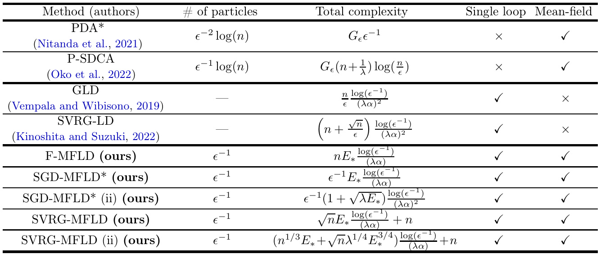

# Convergence of mean-field Langevin dynamics: Time and space discretization, stochastic gradient, and variance reduction  

Taiji Suzuki $^{1,\dag}$ , Denny Wu $^{2,\ddagger}$ , Atsushi Nitanda $^{3,\star}$  

$^{1}$ University of Tokyo and RIKEN Center for Advanced Intelligence Project $^2$ University of Toronto and Vector Institute for Artificial Intelligence $^3$ Kyushu Institute of Technology and RIKEN Center for Advanced Intelligence Project Email: $^\dagger$ taiji@mist.i.u-tokyo.ac.jp, $^\ddagger$ dennywu@cs.toronto.edu, $\star$ nitanda@ai.kyutech.ac.jp  

# Abstract  

The mean-field Langevin dynamics (MFLD) is a nonlinear generalization of the Langevin dynamics that incorporates a distribution-dependent drift, and it naturally arises from the optimization of two-layer neural networks via (noisy) gradient descent. Recent works have shown that MFLD globally minimizes an entropy-regularized convex functional in the space of measures. However, all prior analyses assumed the infinite-particle or continuous-time limit, and cannot handle stochastic gradient updates. We provide an general framework to prove a uniform-in-time propagation of chaos for MFLD that takes into account the errors due to finite-particle approximation, timediscretization, and stochastic gradient approximation. To demonstrate the wide applicability of this framework, we establish quantitative convergence rate guarantees to the regularized global optimal solution under (i )a wide range of learning problems such as neural network in the meanfield regime and MMD minimization, and $(i i)$ different gradient estimators including SGD and SVRG. Despite the generality of our results, we achieve an improved convergence rate in both the SGD and SVRG settings when specialized to the standard Langevin dynamics.  

# 1 Introduction  

In this work we consider the mean-field Langevin dynamics (MFLD) given by the following McKeanVlasov stochastic differential equation:  

$$
\mathrm{d}X_{t}=-\nabla\frac{\delta F({\mu_{t}})}{\delta\mu}(X_{t})\mathrm{d}t+\sqrt{2\lambda}\mathrm{d}W_{t},
$$  

where $\mu_{t}\,=\,\operatorname{Law}(X_{t})$ ,$F\,:\,\mathcal{P}_{2}(\mathbb{R}^{d})\,\to\,\mathbb{R}$ is a convex fu tional, $W_{t}$ is the $d$ -dimensional standard Brownian motion, and $\frac{\delta F}{\delta\mu}$ denotes the first-variation of F. Importantly, MFLD is the Wasserstein gradient flow that minimizes an entropy-regularized convex functional as follows:  

$$
\operatorname*{min}_{\mu\in\mathcal{P}_{2}}\{F(\mu)+\lambda\mathrm{Ent}(\mu)\}.
$$  

While the above objective can also be solved using other methods such as double-loop algorithms based on iterative linearization ( Nitanda et al. ,2020 ;Oko et al. ,2022 ), MFLD remains attractive due to its simple structure and connection to neural network optimization. Specifically, the learning of two-layer neural networks can be lifted into an infinite-dimensional optimization problem in the space of measures (i.e., the mean-field limit ), for which the convexity of loss function can be exploited to show the global convergence of gradient-based optimization methods ( Nitanda and Suzuki ,2017 ;Mei et al. ,2018 ;Chizat and Bach ,2018 ;Rotskoffand Vanden-Eijnden ,2018 ;Sirignano and Spiliopoulos ,2020 ). Under this viewpoint, MFLD Eq. ( 1 ) corresponds to the continuous-time limit of the noisy gradient descent update on an infinite-width neural network, where the injected Gaussian noise encourages “exploration” and facilities global convergence ( Mei et al. ,2018 ;Hu et al. ,2019 ).  

Quantitative analysis of MFLD. Most existing convergence results of neural networks in the mean-field regime are qualitative in nature, that is, they do not characterize the rate of convergence nor the discretization error. A noticeable exception is the recent analysis of MFLD by Nitanda et al. (2022 ); Chizat (2022 ), where the authors proved exponential convergence to the optimal solution of Eq. ( 2 ) under a logarithmic Sobolev inequality (LSI) that can be verified in various settings including regularized empirical risk minimization using neural networks. This being said, there is still a large gap between the ideal MFLD analyzed in prior works and a feasible algorithm. In practice, we parameterize $\mu$ as a mixture of $N$ particles $(X^{i})_{i=1}^{N}$ — this corresponds to a neural network with $N$ neurons, and perform a discrete-time update: at time step $k$ , the update to the $i$ -th particle is given as  

$$
X_{k+1}^{i}=X_{k}^{i}-\eta_{k}\tilde{\nabla}\frac{\delta F(\mu_{k})}{\delta\mu}(X_{k}^{i})+\sqrt{2\lambda\eta_{k}}\xi_{k}^{i},
$$  

where $\eta_{k}$ is the step size at the $k$ -th iteration, $\xi_{k}^{i}$ is an i.i.d. standard Gaussian vector, and $\tilde{\nabla}\frac{\delta F(\mu)}{\delta\mu}$ represents a potentially inexact (e.g., stochastic) gradient.  

Comparing Eq. ( 1 ) and Eq. ( 3 ), we observe the following discrepancies between the ideal MFLD and the implementable noisy particle gradient descent algorithm.  

(i) Particle approximation. $\mu$ is entirely represented by a finite set of particles: µ$\begin{array}{r}{\mu_{k}=\frac{1}{N}\sum_{i=1}^{N}\delta_{X_{k}^{i}}}\end{array}$ P.(ii) Time discretization. We employ discrete gradient descent update as opposed to gradient flow. (iii) Stochastic gradient. In many practical settings, it is computationally prohibitive to obtain the exact gradient update, and hence it is preferable to adopt a stochastic estimate of the gradient.  

The control of finite-particle error (point (i )) is referred to as propagation of chaos (Sznitman ,1991 ) (see also Lacker (2021 ) and references therein). In the context of mean-field neural networks, discretization error bounds in prior works usually grow exponentially in time (Mei et al. ,2018 ;Javanmard et al. ,2019 ;De Bortoli et al. ,2020 ), unless one introduces additional assumptions on the dynamics that are difficult to verify ( Chen et al. ,2020 ). Consequently, convergence guarantee in the continuous limit cannot be transferred to the finite-particle setting unless the time horizon is very short (e.g., Abbe et al. (2022 )), which limits the applicability of the theory.  

Very recently, Chen et al. (2022 ); Suzuki et al. (2023 ) established a uniform-in-time propagation of chaos for MFLD, i.e., the “distance” between the $N$ -particle system and the infinite-particle limit is of order $\mathcal{O}(1/N)$ for all $t>0$ . While this represents a significant step towards an optimization theory for practical finite-width neural networks in the mean-field regime, these results assumed the continuoustime limit and access to exact gradient, thus cannot cover points $(i i)$ and $(i i i)$ .  

In contrast, for the standard gradient Langevin dynamics (LD) without the mean-field interactions (which is a special case of MFLD Eq. ( 1 ) by setting $F$ to be a linear functional), the time discretization is well-understood (see e.g. ( Dalalyan ,2014 ;Vempala and Wibisono ,2019 ;Chewi et al. ,2021 )), and its stochastic gradient variant ( Welling and Teh ,2011 ;Ma et al. ,2015 ), including ones that employ variance-reduced gradient estimators ( Dubey et al. ,2016 ;Zou et al. ,2018 ;Kinoshita and Suzuki ,2022 ), have also been extensively studied.  

The gap between convergence analyses of LD and MFLD motivates us to ask the following question.  

  

Table 1: Comparison of computational complexity to optimize an entropy-regularized finite-sum objective up to excess objective value $\epsilon$ , in terms of dataset size $_n$ , entropy regularization $\lambda$ , and LSI constant $\alpha$ .Label \* indicates the online setting, and the unlabeled methods are tailored to the finite-sum setting. “Meanfield” indicates the presence of particle interactions. “Single loop” indicates whether the algorithm requires an inner-loop MCMC sampling sub-routine at every step. “(ii)” indicates convergence rate under additional smoothness condition (Assumption 4 ), where $\begin{array}{r}{E_{*}\,=\,\frac{\bar{L}^{2}}{\alpha\epsilon}+\frac{\bar{L}}{\sqrt{\lambda\alpha\epsilon}}}\end{array}$ .For double-loop algorithms (PDA and PSDCA), $G^{*}$ is the number of gradient evaluations required for MCMC sampling; for example, for MALA (Metropolis-adjusted Langevin algorithm) $G_{\epsilon}=O(n\alpha^{-5/2}\log(1/\epsilon)^{3/2})$ , and for LMC (Langevin Monte Carlo) $G_{\epsilon}=O(n(\alpha\epsilon)^{-2}\log(\epsilon))$ .  

Can we develop a complete non-asymptotic convergence theory for MFLD that takes into account points $(i)~-~(i i i)$ , and provide further refinement over existing results when specialized to LD?  

# 1.1 Our Contributions  

We present a unifying framework to establish uniform-in-time convergence guarantees for the meanfield Langevin dynamics under time and space discretization, simultaneously addressing points (i )-(iii ).The convergence rate is exponential up to an error that vanishes when the step size and stochastic gradient variance tend to 0 , and the number of particles $N$ tends to infinity. Moreover, our proof is based on an LSI condition analogous to Nitanda et al. (2022 ); Chizat (2022 ), which is satisfied in a wide range of regularized risk minimization problems. The advantages of our analysis is summarized as follows.  

• Our framework provides a unified treatment of different gradient estimators. Concretely, we establish convergence rate of MFLD with stochastic gradient and stochastic variance reduced gradient (Johnson and Zhang ,2013 ). While it is far from trivial to derive a tight bound on the stochastic gradient approximation error because it requires evaluating the correlation between the randomness of each gradient and the updated parameter distribution, we are able to show that a stochastic gradient effectively improves the computational complexity.  

Noticeably, despite the fact that our theorem simultaneously handles a much wider class of $F$ , when specialized to standard Langevin dynamics (i.e., when $F$ is linear), we recover state-of-the-art convergence rates for LD; moreover, by introducing an additional mild assumption on the smoothness of the objective, our analysis can significantly improve upon existing convergence guarantees.  

• Our analysis greatly extends the recent works of ( Chen et al. ,2022 ;Suzuki et al. ,2023 ), in that our propagation of chaos result covers the discrete time setting while the discretization error can still be controlled uniformly over time, i.e., the finite particle approximation error does not blow up as $t$ increases. Noticeably, we do not impose weak interaction / large noise conditions that are common in the literature (e.g., Delarue and Tse (2021 ); Lacker and Flem (2022 )); instead, our theorem remains valid for any regularization strength.  

# 2 Problem Setting  

Consider the set of probability measure $\mathcal{P}$ on $\mathbb{R}^{d}$ where the Borel $\sigma$ -algebra is equipped. Our goal is to find a probability measure $\mu\in\mathcal P$ that approximately minimizes the objective given by  

$$
F(\mu)=U(\mu)+\mathbb{E}_{\mu}[r],
$$  

where $U:\mathcal{P}\rightarrow\mathbb{R}$ is a (convex) loss function, and $r:\mathbb{R}^{d}\rightarrow\mathbb{R}$ is a regularization term. Let $\mathcal{P}_{2}$ be the set of probability measures with the finite second moment. In the following, we consider the setting where $F(\mu)\leq C(1+\mathbb{E}_{\mu}[\|X\|^{2}])$ , and focus on $\mathcal{P}_{2}$ so that $F$ is well-defined.  

As previously mentioned, an important application of this minimization problem is the learning of twolayer neural network in the mean-field regime . Suppose that $h_{x}(\cdot)$ is a neuron with a parameter $x\in\mathbb{R}^{d}$ ,e.g., $h_{x}(z)\,=\,\sigma(w\,^{\prime}\,z+b)$ , where $w\,\in\,\mathbb{R}^{d-1},b\,\in\,\mathbb{R}$ , and $x\,=\,(w,v)$ . The mean-field neural network data corresponding to a probability measure $(z_{i},y_{i})_{i=1}^{n}\in\mathbb{R}^{d-1}\times\mathbb{R}$ we may define the em $\mu\in\mathcal P$ can be written as ical risk of $f_{\mu}$ $\begin{array}{r}{f_{\mu}(\cdot)=\int h_{x}(\cdot)\mu(\mathrm{d}x)}\end{array}$ as $\begin{array}{r}{U(\mu)=\frac{1}{n}\sum_{i=1}^{n}\ell(f_{\mu}(z_{i}),y_{i})}\end{array}$ ·P. Given training for a loss function ℓ$\ell:\mathbb{R}\times\mathbb{R}\to\mathbb{R}$ ×→R. Then, the objective Fbecomes  

$$
F(\mu)=\frac{1}{n}\sum_{i=1}^{n}\ell(f_{\mu}(z_{i}),y_{i})+\lambda_{1}\int\|x\|^{2}\mathrm{d}\mu(x),
$$  

where the regularization term is $r(x)\;=\;\lambda_{1}\Vert x\Vert^{2}$ . Note that the same objective can be defined for expected risk minimization. We defer additional examples to the last of this section.  

One effective way to solve the above objective is the mean-field Langevin dynamics (MFLD), which optimizes $F$ via a noisy gradient descent update. To define MFLD, we need to introduce the firstvariation of the functional $F$ .  

Definition 1. Let $G:\mathcal{P}_{2}\to\mathbb{R}$ . The first-variation $\frac{\delta G}{\delta\mu}$ of $a$ functional $G:\mathcal{P}_{2}\to\mathbb{R}$ at $\mu\in\mathcal Ḋ P Ḍ _{2}$ is defined as a continuous functional $\mathcal{P}_{2}\times\mathbb{R}^{d}\rightarrow\mathbb{R}$ that satisfies $\begin{array}{r}{\operatorname*{lim}_{\epsilon\to0}\frac{G(\epsilon\nu+(1-\epsilon)\mu)}{\epsilon}=\int\frac{\delta G}{\delta\mu}(\mu)(x)\mathrm{d}(\nu-\mu)}\end{array}$ Rfor any $\nu\in\mathcal Ḋ P Ḍ _{2}$ . If there exists such a functional $\frac{\delta G}{\delta\mu}$ , we say $G$ admits $a$ first-variation at $\mu$ , or simply $G$ is differentiable at $\mu$ .  

To avoid the ambiguity of $\frac{\delta G}{\delta\mu}$ up to constant shift, we follow the convention of imposing $\begin{array}{r}{\int\frac{\delta G}{\delta\mu}(\mu)\mathrm{d}\mu=0}\end{array}$ R.Using the first-variation of $F$ , the MFLD is given by the following stochastic differential equation:  

$$
\mathrm{d}X_{t}=-\nabla\frac{\delta F(\mu_{t})}{\delta\mu}(X_{t})\mathrm{d}t+\sqrt{2\lambda}\mathrm{d}W_{t},\quad\mu_{t}=\mathrm{Law}(X_{t}),
$$  

where $X_{0}\,\sim\,\mu_{0}$ ,$\operatorname{Law}(X)$ denotes the distribution of the random variable $X$ and $(W_{t})_{t\geq0}$ is the $d$ -dimensional standard Brownian motion. Readers may refer to Huang et al. (2021 ) for the existence and uniqueness of the solution. MFLD is an instance of distribution-dependent SDE because the drift term $\begin{array}{r}{\frac{\delta F(\mu_{t})}{\delta\mu}(\cdot)}\end{array}$ depends on the distribution $\mu_{t}$ of the current solution $X_{t}$ (Kahn and Harris ,1951 ;Kac ,1956 ;McKean ,1966 ). It is known that the MFLD is a Wasserstein gradient flow to minimize the following entropy-regularized objective ( Mei et al. ,2018 ;Hu et al. ,2019 ;Nitanda et al. ,2022 ;Chizat ,2022 ):  

$$
\mathcal{F}(\mu)=F(\mu)+\lambda\mathrm{Ent}(\mu),
$$  

where $\begin{array}{r}{\mathrm{Ent}(\mu)=-\int\log(\mathrm{d}\mu(z)/\mathrm{d}z)\mathrm{d}\mu(z)}\end{array}$ is the negative entropy of $\mu$ .  

Reduction to standard Langevin dynamics. Note that the MFLD reduces to the standard $\begin{array}{r}{F(\mu)=\int V(x)\mathrm{d}\mu(x)}\end{array}$ gradient Langevin dynamics (LD) when R. In this case, $\begin{array}{r}{\frac{\delta F}{\delta\mu}=V}\end{array}$ $F$ for any is a linear functional, that is, there exists $\mu$ and the MFLD Eq. ( 4 ) simplifies to $V$ such that  

$$
\mathrm{d}X_{t}=-\nabla V(X_{t})\mathrm{d}t+\sqrt{2\lambda}\mathrm{d}W_{t}.
$$  

This is exactly the gradient Langevin dynamics for optimizing $V$ or sampling from $\mu\propto\exp(-V/\lambda)$ .  

# 2.1 Some Applications of MFLD  

Here, we introduce a few examples that can be approximately solved via MFLD.  

Example 1 (Two-layer neural network in mean-field regime.) .Let $h_{x}(z)$ be a neuron with a parameter $x\in\mathbb{R}^{d}$ , e.g., $h_{x}(z)=\operatorname{tanh}(r\sigma(w^{\top}x))$ ,$h_{x}(z)=\operatorname{tanh}(r)\sigma(w^{\top}x)$ for $x=(r,w)$ , or simply $h_{x}(z)=\sigma(x^{\top}z)$ .$\begin{array}{r}{U(\mu)=\frac{1}{n}\sum_{i=1}^{n}\ell(f_{\mu}(z_{i}),y_{i})}\end{array}$ the squared loss P$\ell(f,y)=(f-y)^{z}$ with a convex loss (e.g., the logistic loss −) falls into our framework. ural network $\begin{array}{r}{f_{\mu}(\cdot)=\int h_{x}(\cdot)\mu(\mathrm{d}x)}\end{array}$ v$\ell(f,y)=\log(1+\exp(-y f))$ −risk , or Example 2 (Density estimation via MMD minimization) .For a positive definite kernel $k$ , the Maximum Mean Discrepancy (MMD) ( estimation by fitting a Gaussian mixture model as $\begin{array}{r}{\mathrm{MMD}^{2}(\mu,\nu)\,:=\,\int\int(k(x,x)-2k(x,y)+k(y,y))\mathrm{d}\mu(x)\mathrm{d}\nu(y)}\end{array}$ R R Gretton et al. −,2006 ) between two probability measures $f_{\mu}(z)~=~\textstyle\int g_{x}(z)\mathrm{d}\mu(x)$ R. We perform nonparametric density , where $g_{x}$ $\mu$ is the Gaussian and $\nu$ is defined density with mean $x$ and a given variance $\sigma^{2}~>~0$ .The mixture model is learned by minimizing $\mathrm{MMD}^{2}(f_{\mu},p^{*})$ where $p^{*}$ is the target distribution. If we observe a set of training data $(z_{i})_{i=1}^{n}$ from $p^{*}$ ,then the empirical version of MMD is one suitable loss function $U(\mu)$ given as  

$$
\widetilde{\mathrm{MD}}^{2}(\mu):=\!\!\int\!\int\left[\int\!\!\int g_{x}(z)g_{x^{\prime}}(z^{\prime})k(z,z^{\prime})\mathrm{d}z\mathrm{d}z^{\prime}\right]\mathrm{d}\mu(x)\mathrm{d}\mu(x^{\prime})-2\int\left(\frac{1}{n}\sum_{i=1}^{n}\int g_{x}(z)k(z,z_{i})\mathrm{d}z\right)\mathrm{d}z\mathrm{d}z^{\prime}\mathrm{d}\mu(x^{\prime})\mathrm{d}\mu(x^{\prime}),
$$  

Note that we may also choose to directly fit the particles to the data (instead of a Gaussian mixture model), that is, we use a Dirac measure for each particle, as in Chizat (2022 , Section 5.2) and Arbel et al. (2019 ). Here we state the Gaussian parameterization for the purpose of density estimation.  

Example 3 (Kernel Stein discrepancy minimization) .In settings where we have access to the target distribution through the score function (e.g., sampling from a posterior distribution in Bayesian inference), we may employ the kernel Stein discrepancy (KSD) as the discrepancy measure ( Chwialkowski et al. ,2016 ;Lu et al. ,2016 ). Suppose that we can compute $s(z)=\nabla\log(\mu^{*})(z)$ , then for a positive definite kernel k, we define the Stein kernel as  

$$
\begin{array}{r}{W_{\mu^{*}}(z,z^{\prime}):=s(z)^{\top}s(z^{\prime})k(z,z^{\prime})+s(z)^{\top}\nabla_{z^{\prime}}k(z,z^{\prime})+\nabla_{z}^{\top}k(z,z^{\prime})s(z^{\prime})+\nabla_{z^{\prime}}^{\top}\nabla_{z}k(z,z^{\prime}).}\end{array}
$$  

We take $U(\mu)$ as the KSD between $\mu$ and $\mu^{*}$ defined as $\begin{array}{r}{\mathrm{KSD}(\mu)\,=\,\int\int W_{\mu^{*}}(z,z^{\prime})\mathrm{d}\mu(z)\mathrm{d}\mu(z^{\prime})}\end{array}$ R R . By minimizing this objective via MFLD, we attain kernel Stein variational inference with convergence guarantees. This can be seen as a “Langevin” version of KSD descent in Korba et al. (2021 ).  

Remark 1. In the above examples, we introduce additional regularization terms in the objective Eq. (5 )to establish the convergence rate of MFLD, in exchange for a slight optimization bias. Note that these added regularizations often have a statistical benefit due to the smoothing effect.  

# 2.2 Practical implementations of MFLD  

Although the convergence of MFLD (Eq. ( 4 )) has been studied in prior works ( Hu et al. ,2019 ;Nitanda et al. ,2022 ;Chizat ,2022 ), there is a large gap between the ideal dynamics and a practical implementable algorithm. Specifically, we need to consider $(i)$ the finite-particle approximation, $(i i)$ the time discretization, and $(i i i)$ stochastic gradient.  

To this end, we consider the following space- and time-discretized version of the MFLD with stochastic gradient update. For a finite set of particles $\mathcal{X}=(X^{i})_{i=1}^{N}\subset\mathbb{R}^{d}$ ,define its corres onding empirical distribution as $\begin{array}{r}{\mu_{\mathcal{X}}=\frac{1}{N}\sum_{i=1}^{N}\delta_{X_{i}}}\end{array}$ P.Let $\mathcal{X}_{k}\,=\,(X_{k}^{i})_{i=1}^{N}\,\subset\,\mathbb{R}^{d}$ ⊂be Nparticles at the k-th update, and define $\mu_{k}~=~\mu_{\mathcal{X}_{k}}$ as a finite particle approximation of the population counterpart. Starting from $X_{0}^{i}\sim\mu_{0}$ ∼, we update $\mathcal{X}_{k}$ as,  

$$
X_{k+1}^{i}=X_{k}^{i}-\eta_{k}v_{k}^{i}+\sqrt{2\lambda\eta_{k}}\xi_{k}^{i},
$$  

where $\eta_{k}>0$ is the step size, $\xi_{k}^{i}$ is an i.i.d. standard normal random variable $\xi_{k}^{i}\sim N(0,I)$ ∼, and $v_{k}^{i}=$ $v_{k}^{i}(\mathcal{X}_{0:k},\omega_{k}^{i})$ generating the randomness of stochastic gradient. is a stochastic approximation of $\nabla\frac{\delta F(\mu_{k})}{\delta\mu}(X_{k}^{i})$ $v_{k}^{\i}$ can depend on the history where $\omega_{k}=(\omega_{k}^{i})_{i=1}^{N}$ $\mathcal X_{0:k}=(\mathcal X_{0},\ldots,\mathcal X_{k})$ is a random variable ,and $\begin{array}{r}{\mathbb{E}_{\omega_{k}^{i}}[v_{k}^{i}|\mathcal{X}_{0:k}]=\nabla\frac{\delta F(\mu_{k})}{\delta\mu}(X_{k}^{i})}\end{array}$ . We analyze three versions of $v_{k}^{i}$ .  

(1) Full gradient: F-MFLD. If we have access to the exact gradient, we may compute  

$$
v_{k}^{i}=\nabla\frac{\delta F(\mu_{k})}{\delta\mu}(X_{k}^{i}).
$$  

(2) Stochastic gradient: SGD-MFLD. Suppose the loss function $U$ is given by an expectation as $U(\mu)\,=\,\mathbb{E}_{Z\sim P_{Z}}[\ell(\mu,Z)]$ ,where $Z\ \in\ Z$ is a random observation obeying a distribution $P_{Z}$ and $\ell:\mathcal{P}\times\mathcal{Z}\to\mathbb{R}$ is a loss function. In this setting, we construct the stochastic gradient as  

$$
\boldsymbol{v}_{k}^{i}=\frac{1}{B}\sum_{j=1}^{B}\nabla\frac{\delta\ell(\mu_{k},z_{k}^{(j)})}{\delta\mu}(\boldsymbol{X}_{k}^{i})+\nabla{r}(\boldsymbol{X}_{k}^{i}),
$$  

where $(z_{k}^{(j)})_{j=1}^{B}$ is a mini-batch of size $B$ generated from $P_{Z}$ in an i.i.d. manner.  

(3) Stochastic variance reduced gradient: SVRG-MFLD. Suppose that the loss function $U$ is given by a finite sum of loss functions $\ell_{i}$ :$\begin{array}{r}{U(\mu)=\frac{1}{n}\sum_{i=1}^{n}\ell_{i}(\mu)}\end{array}$ P),which corresponds to the empirical risk in a usual machine learning setting. Then, the variance reduced stochastic gradient (SVRG) (Johnson and Zhang ,2013 ) is defined as follows:  

(i) When $k\equiv0\;\mathrm{mod}\;m$ , where $m$ is the update frequency, we set $\dot{\mathcal{X}}\,=\,(\dot{X}^{i})_{i=1}^{n}\,=\,(X_{k}^{i})_{i=1}^{n}$ as the anchor point and refresh the stochastic gradient as $\begin{array}{r}{v_{k}^{i}=\nabla\frac{\delta F(\mu_{k})}{\delta\mu}(X_{k}^{i})}\end{array}$ .  

(ii) When $k\neq0$ mod $m$ , we use the anchor point to construct a control variate and compute  

$$
v_{k}^{i}=\frac{1}{B}\sum_{j\in I_{k}}\nabla\left(\frac{\delta\ell_{j}(\mu_{\mathcal{X}_{k}})}{\delta\mu}(X_{k}^{i})+r(X_{k}^{i})-\frac{\delta\ell_{j}(\mu_{\mathcal{X}})}{\delta\mu}(\dot{X}^{i})+\frac{\delta U(\mu_{\mathcal{X}})}{\delta\mu}(\dot{X}^{i})\right),
$$  

where $I_{k}$ is a uniformly drawn random subset of $\{1,\ldots,n\}$ with size $B$ without duplication.  

# 3 Main Assumptions and Theoretical Tools  

For our convergence analysis, we make the following assumptions which are inherited from prior works in the literature ( Nitanda et al. ,2020 ,2022 ;Chizat ,2022 ;Oko et al. ,2022 ;Chen et al. ,2022 ).  

Assumption 1. The loss function $U$ and the regularization term $r$ are convex. Specifically, 1. $U:\mathcal{P}\rightarrow\mathbb{R}$ is a convex functional $\mathcal{P}$ , that is, $U(\theta\mu+(1-\theta)\nu)\le\theta U(\mu)+(1-\theta)U(\nu)$ for any $\theta\in[0,1]$ and $\mu,\nu\in\mathcal P$ . Moreover, Uadmits a first-variation at any $\mu\in\mathcal Ḋ P Ḍ _{2}$ .2. $r(\cdot)$ bl there exist constants $\lambda_{1},\lambda_{2}>0$ and $c_{r}>0$ that $\lambda_{1}I\preceq\nabla\nabla^{\top}{r(x)}\preceq\lambda_{2}I$ $\nabla r(0)=0$ ⪯∇∇ .⪯,$x^{\top}\nabla r(x)\geq\lambda_{1}\|x\|^{2}$ ∇≥∥∥, and $0\,\leq\,r(x)\,\leq\,\lambda_{2}(c_{r}+\|x\|^{2})$ for any $x\in\mathbb{R}^{d}$ ∈, and and Assumption 2. $\begin{array}{r}{\left|\frac{\delta^{2}U(\mu)}{\delta\mu^{2}}(x,x^{\prime})\right|\leq L(1+c_{L}(\|x\|^{2}+\|x^{\prime}\|^{2}))}\end{array}$ There exists $L>0$ such that $\begin{array}{r}{\left\|\nabla\frac{\delta U(\mu)}{\delta\mu}(x)-\nabla\frac{\delta U(\mu^{\prime})}{\delta\mu}(x^{\prime})\right\|\leq L(W_{2}(\mu,\mu^{\prime})+\|x-x^{\prime}\|)~~~~~~}\end{array}$ r an $\mu,\mu^{\prime}\,\in\,\mathcal{P}_{2}$ and $x,x^{\prime}\in\mathbb R^{d}$ . Also, there exists $R>0$ such that ∥∇ $\begin{array}{r}{\|\nabla\frac{\delta U(\mu)}{\delta\mu}(x)\|\leq R}\end{array}$ for any $\mu\in\mathcal P$ ∈P and x$\boldsymbol{x}\in\mathbb{R}^{d}$ ∈.  

Verification of this assumption in the three examples (Examples 1 ,2 and 3 ) is given in Appendix A in the supplementary material. We remark that the assumption on the second order variation is only required to derive the discretization error corresponding to the uniform-in-time propagation of chaos (Lemma 8 in Appendix E.4 ). Under these assumptions, Proposition 2.5 of Hu et al. (2019 ) yields that $\mathcal{F}$ measure. Moreover, has a unique minimizer $\mu^{*}$ satisfies the self-consistent condition: $\mu^{*}$ in $\mathcal{P}$ and $\mu^{*}$ is absolutely continuous with respect to the Lebesgue $\begin{array}{r}{\mu^{*}(X)\propto\exp\left(-\frac{1}{\lambda}\frac{\delta F(\mu^{*})}{\delta\mu}(X)\right)}\end{array}$ .  

# 3.1 Proximal Gibbs Measure $\&$ Logarithmic Sobolev inequality  

The aforementioned self-consistent relation motivates us to introduce the proximal Gibbs distribution (Nitanda et al. ,2022 ;Chizat ,2022 ) whose density is given by  

$$
p_{\mathcal{X}}(X)\propto\exp\left(-\frac{1}{\lambda}\frac{\delta F(\mu_{\mathcal{X}})}{\delta\mu}(X)\right),
$$  

where $\mathcal{X}\,=\,(X^{i})_{i=1}^{N}\,\subset\,\mathbb{R}^{d}$ ⊂is a set of $N$ particles and $X\,\in\,\mathbb{R}^{d}$ . As we will see, the convergence of MFLD heavily depends on a logarithmic Sobolev inequality (LSI) on the proximal Gibbs measure.  

Definition 2 (Logarithmic S v inequality) .Let $\mu$ be a probability measure on $(\mathbb{R}^{d},B(\mathbb{R}^{d}))$ .$\mu$ satisfies the LSI with constant α > if for any smooth function $\phi:\mathbb{R}^{d}\rightarrow\mathbb{R}$ with $\mathbb{E}_{\mu}[\phi^{2}]<\infty$ , we have  

$$
\mathbb{E}_{\mu}[\phi^{2}\log(\phi^{2})]-\mathbb{E}_{\mu}[\phi^{2}]\log(\mathbb{E}_{\mu}[\phi^{2}])\leq\frac{2}{\alpha}\mathbb{E}_{\mu}[\|\nabla\phi\|_{2}^{2}].
$$  

$\begin{array}{r}{\int\log(\mathrm{d}\nu/\mathrm{d}\mu)\mathrm{d}\nu\leq\frac{1}{2\alpha}\int\|\nabla\log(\mathrm{d}\nu/\mathrm{d}\mu)\|^{2}\mathrm{d}\nu}\end{array}$ This is equivalent to the condition that the KL divergence from Rfor any $\nu\in\mathcal{P}$ which is absolutely continuous with respect $\mu$ is bounded by the Fisher divergence: to $\mu$ . Our analysis requires that the proximal Gibbs distribution satisfies the LSI as follows.  

Assumption 3. $\mu^{*}$ and $p_{\mathcal{X}}$ satisfy the LSI with $\alpha>0$ for any set of particles $\mathcal{X}=(X^{i})_{i=1}^{N}\subset\mathbb{R}^{d}$ ⊂.  

Verification of LSI. The LSI of proximal Gibbs measure can be established via standard perturbation criteria. For $U(\mu)$ with bounded first-variation, we may apply the classical Bakry-Emery and Holley-Stroock arguments ( Bakry and $\mathrm{\Delta\hat{E}}$ mery ,1985a ;Holley and Stroock ,1987 ) (see also Corollary 5.7.2 and 5.1.7 of Bakry et al. (2014 )). Whereas for Lipschitz perturbations, we employ Miclo’s trick (Bardet et al. ,2018 ) or the more recent perturbation results in ( Cattiaux and Guillin ,2022 ).  

Theorem 1. Under Assumptions 1 and 2 ,$\mu^{*}$ and pXsatisfy the log-Sobolev inequality with  

$$
\alpha\geq\frac{\lambda_{1}}{2\lambda}\exp\!\left(\!-\frac{4R^{2}}{\lambda_{1}\lambda}\sqrt{2d/\pi}\right)\vee\left\lbrace\frac{4\lambda}{\lambda_{1}}+e^{\frac{R^{2}}{2\lambda_{1}\lambda}}\!\!\left(\frac{R}{\lambda_{1}}\!+\!\sqrt{\frac{2\lambda}{\lambda_{1}}}\right)^{2}\left[2\!+\!d\!+\!\frac{d}{2}\log\left(\frac{\lambda_{2}}{\lambda_{1}}\right)\!+\!4\frac{R^{2}}{\lambda_{1}\lambda}\right]\right\rbrace^{-1}.
$$  

Furthermore, if ∥$\begin{array}{r}{\|\frac{\delta U(\mu)}{\delta\mu}\|_{\infty}\,\le\,R}\end{array}$ is satisfied for any $\mu\,\in\,\mathcal P_{2}$ , then $\mu^{*}$ and pXsatisfy the LSI with $\begin{array}{r}{\alpha\geq\frac{\lambda_{1}}{\lambda}\exp\left(-\frac{4R}{\lambda}\right)}\end{array}$ .  

See Lemma 5 for the proof of the first assertion, and Section A.1 of Nitanda et al. (2022 ) or Proposition 5.1 of Chizat (2022 ) for the proof of the second assertion.  

# 4 Main Result: Convergence Analysis  

In this section, we present our the convergence rate analysis of the discretized dynamics Eq. ( 6 ). To derive the convergence rate, we need to evaluate the errors induced by three approximations: (i) time discretization, (ii) particle approximation, and (iii) stochastic gradient.  

# 4.1 General Recipe for Discretization Error Control  

Note that for the finite-particle setting, the KL term does not make sense because the negative entropy is not well-defined for a discrete empirical measure. Instead, we consider the distribution of the $N$ particles, that is, let $\mu^{(N)}\in\mathcal{P}^{(N)}$ be a distribution of $N$ particles $\mathcal{X}=(X^{i})_{i=1}^{N}$ where $\mathcal{P}^{(N)}$ is t tof probability measures on $(\mathbb{R}^{d\times N},\mathcal{B}(\mathbb{R}^{d\times N}))$ . Similarly, we introduce the following objective on P$\mathcal{P}^{(N)}$ :  

$$
\mathcal{F}^{N}(\mu^{(N)})=N\mathbb{E}_{\mathcal{X}\sim\mu^{(N)}}[F(\mu_{\mathcal{X}})]+\lambda\mathrm{Ent}(\mu^{(N)}).
$$  

One can easily v ify that if $\mu^{(N)}$ is a product measure of $\mu\,\in\,\mathcal P$ , then $\mathcal{F}^{N}(\mu^{(N)})\,\geq\,N\mathcal{F}(\mu)$ by the convexity of F.Propagation of chaos (Sznitman ,1991 ) refers to the phenomenon that, as the number of particles $N$ increases, the particles behave as if they are independent; in other words, the joint distribution of the $N$ particles becomes “close” to the product measure. Consequently, the minimum of $\mathcal{F}^{N}\big(\mu^{(N)}\big)$ (which can be obtained by the particle-approximated MFLD) is close to $N{\mathcal{F}}(\mu^{*})$ .Specifically, it has been shown in Chen et al. (2022 ) that  

$$
0\leq\operatorname*{inf}_{\mu^{(N)}\in\mathcal{P}^{(N)}}\frac{1}{N}\mathcal{F}^{N}(\mu^{(N)})-\mathcal{F}(\mu^{*})\leq\frac{C_{\lambda}}{N},
$$  

for some constant $C_{\lambda}>0$ (see Section Efor more details). Importantly, if we consider the Wasserstein (Assumption gradient flow on 3 ), we need to ensure that the LSI constant does not deteriorate as $\mathcal{P}^{(N)}$ , the convergence rate of which depends on the logarithmic Nincreases. Fortuobolev inequality nately, the propagation of chaos and the tensorization of LSI entail that the LSI constant with respect to the objective $\mathcal{F}^{N}$ can be uniformly bounded over all choices of $N$ (see Eq. ( 11 ) in the appendix).  

To deal with the time discretization error, we build upon the one-step interpolation argument from Vempala and Wibisono (2019 ) which analyzed the vanilla gradient Langevin dynamics (see also Nitanda et al. (2022 ) for its application to the infinite-particle MFLD).  

Bounding the error induced by the stochastic gradient approximation is also challenging because the objective is defined on the space of probability measures, and thus techniques in finite-dimensional settings cannot be utilized in a straightforward manner. Roughly speaking, this error is characterized by the variance of also incorporate the following smoothness assumption. $v_{k}^{i}$ :$\begin{array}{r}{\sigma_{v,k}^{2}:=\mathbb{E}_{\omega_{k}}[\|v_{k}^{i}-\nabla\frac{\delta F(\mu_{k})}{\delta\mu}\|^{2}]}\end{array}$ . In addition, to obtain a refined evaluation, we Assumption 4. $v_{k}^{i}(\mathcal{X}_{0:k},\omega_{k}^{i})$ and $\begin{array}{r}{D_{m}^{i}F(\mathcal{X}_{k})=\nabla\frac{\delta F(\mu_{\mathcal{X}_{k}})}{\delta\mu}(X_{k}^{i})}\end{array}$ are differentiable w.r.t. $(X_{k}^{j})_{j=1}^{N}$ and, for either $G(\mathcal{X}_{k})\,=\,v_{k}^{i}(\mathcal{X}_{0:k},\omega_{k}^{i})$ or $G(\mathcal{X}_{k})\,=\,D_{m}^{i}F(\mathcal{X}_{k})$ as a function of $\mathcal{X}_{k}$ , it is satisfied that $\begin{array}{r}{\|G(\mathcal{X}_{k}^{\prime})-G(\mathcal{X}_{k})-\sum_{j=1}^{N}\nabla_{X_{k}^{j}}^{\top}G(\mathcal{X}_{k})\cdot(X_{k}^{\prime j}-X_{k}^{j})\|\leq Q\frac{\sum_{j\neq i}\|X_{k}^{\prime\prime}-X_{k}^{j}\|^{2}+N\|X_{k}^{\prime\prime}-X_{k}^{\prime}\|^{2}}{2N}}\end{array}$ Pfor some $Q>0$ and $\mathcal{X}_{k}=(X_{k}^{j})_{j=1}^{N}$ and $\begin{array}{r l}&{!\mathcal{X}_{k}^{\prime}=(X_{k}^{\prime\prime})_{j=1}^{N}\cdot\textit{W e a l s o}a s s u m e\mathbb{E}_{\omega_{k}}\bigcup\!|\nabla_{X_{k}^{j}}v_{k}^{i}(\mathcal{X}_{0:k},\omega_{k}^{i})\!|\cdot\!-\!\nabla_{X_{k}^{j}}D_{m}^{i}F(\mathcal{X}_{k})^{\textit{\xi}}\|_{\mathrm{op}}^{\varepsilon}\big]\leq}\\ &{|v_{k}^{i}((\mathcal{X}_{k},\mathcal{X}_{0:k-1}),\omega_{k}^{i})-v_{k}^{i}((\mathcal{X}_{k}^{\prime},\mathcal{X}_{0:k-1}),\omega_{k}^{i})||\leq L(W_{2}(\mu_{\mathcal{X}_{k}},\mu_{\mathcal{X}_{k}^{\prime}})+\|X_{k}^{i}-X_{k}^{\prime\prime}\|).}\end{array}$ $\frac{1\!+\!\delta_{i,j}\,N^{2}}{N^{2}}\tilde{\sigma}_{v,k}^{2}$ ,and ∥  

Note that this assumption is satisfied if the gradient is twice differentiable and the second derivative is bounded. The factor $N$ appears because the contribution of each particle is $O(1/N)$ unless $i=j$ .In the following, we present both the basic convergence result under Assumption 2 , and the improved rate under the additional Assumption 4 .  

Taking these factors into consideration, we can evaluate the decrease in the objective by one-step update. Let $\mu_{k}^{(N)}\,\in\,\mathcal{P}^{(N)}$ ∈P be the distribution of $\mathcal{X}_{k}$ conditioned on the sequence $\omega_{0:k}\,=\,\left(\omega_{k^{\prime}}\right)_{k^{\prime}=0}^{k}$ .Define  

$$
\bar{R}^{2}:=\mathbb{E}[\|X_{0}^{i}\|^{2}]+\frac{1}{\lambda_{1}}\Bigg[\bigg(\frac{\lambda_{1}}{4\lambda_{2}}+\frac{1}{\lambda_{1}}\bigg)\,(R^{2}+\lambda_{2}c_{r})\!+\!\lambda d\bigg]\,,\quad\delta_{\eta}:=C_{1}\bar{L}^{2}(\eta^{2}+\lambda\eta),
$$  

where $C_{1}=8[R^{2}+\lambda_{2}(c_{r}+\bar{R}^{2})+d]$ and ${\cal L}={\cal L}+\lambda_{2}$ .1  

Theorem 2. Under Assumptions $\mathit{1}$ ,$\mathcal{Q}$ and $\mathcal{J}$ , if $\eta_{k}\leq\lambda_{1}/(4\lambda_{2})$ , we have  

$$
\frac{1}{N}\mathbb{E}\left[\mathcal{F}^{N}(\mu_{k+1}^{(N)})\right]-\mathcal{F}(\mu^{*})\!\leq\!\exp(-\lambda\alpha\eta_{k}/2)\left(\frac{1}{N}\mathbb{E}\left[\mathcal{F}^{N}(\mu_{k}^{(N)})\right]-\mathcal{F}(\mu^{*})\right)\!+\!\eta_{k}\left(\delta_{\eta_{k}}\!+\!\frac{C_{\lambda}}{N}\right)\!+\!\Upsilon
$$  

where $\Upsilon_{k}=4\eta_{k}\delta_{\eta_{k}}+\left(R+\lambda_{2}\bar{R}\right)\left(1+\sqrt{\lambda/\eta_{k}}\right)\left(\eta_{k}^{2}\tilde{\sigma}_{v,k}\sigma_{v,k}+Q\eta_{k}^{3}\sigma_{v,k}^{2}\right)+\eta_{k}^{2}(L+\lambda_{2})^{2}\sigma_{v,k}^{2}$ pwith Assumption $\slash$ , and $\Upsilon_{k}=\sigma_{v,k}^{2}\eta_{k}$ without this additional assumption; the expectation is taken with respect to the randomness $(\omega_{k^{\prime}})_{k^{\prime}=1}^{k}=((\omega_{k^{\prime}}^{i})_{i=1}^{N})_{k^{\prime}=1}^{k}$ of the stochastic gradient; and $C_{\lambda}=2\lambda L\alpha(1+2c_{L}\bar{R}^{2})+2\lambda^{2}L^{2}\bar{R}^{2}$ .  

The proof can be found in Appendix B. We remark that to derive the bound for $\Upsilon_{k}\:=\:\sigma_{v,k}^{2}\eta_{k}$ is relatively straightforward, but to derive a tighter bound with Assumption 4 is technically challenging, because we need to evaluate how the next-step distribution $\mu_{k+1}^{(N)}$ is correlated with the stochastic gradient $v_{k}^{i}$ . Evaluating such correlations is non-trivial because the randomness is induced not only by $\omega_{k}$ but also by the Gaussian noise. Thanks to this general result, we only need to evaluate the variance $\sigma_{v,k}$ and $\tilde{\sigma}_{v,k}$ for each method to obtain the specific convergence rate.  

Conversion to a Wasserstein distance bound. As a consequence of the bound on $\begin{array}{r}{\frac{1}{N}\mathcal{F}^{N}(\mu_{k}^{(N)})-}\end{array}$ −$\mathcal{F}(\mu^{\ast})$ , we can control the Wasserstein distance between $\mu_{k}^{(N)}$ and $\mu^{*N}$ , where $\mu^{*N}\in\mathcal{P}^{(N)}$ is the ( $N$ -times) product measure of $\mu^{*}$ . Let $W_{2}(\mu,\nu)$ be the 2-Wasserstein distance between $\mu$ and $\nu$ , then  

$$
W_{2}^{2}(\mu_{k}^{(N)},\mu^{\ast N})\leq\frac{2}{\lambda\alpha}(\mathcal{F}^{N}(\mu_{k}^{(N)})-N\mathcal{F}(\mu^{\ast})),
$$  

under Assumptions $1$ and 3 (see Lemma 3 in the Appendix). Hence, if $\begin{array}{r}{\frac{1}{N}\mathcal{F}^{N}(\mu_{k}^{(N)})-\mathcal{F}(\mu^{*})}\end{array}$ is small, network setting, if the particles $(X_{k}^{i})_{i=1}^{N}$ $|h_{x}(z)-h_{x^{\prime}}(z)|\leq L\|x-x^{\prime}\|\,\left(\forall x,x^{\prime}\in\mathbb{R}^{d}\right)$ behaves like an i.i.d. sample from $\mu^{*}$ . As an example, for the mean-field neural and $\begin{array}{r}{V_{\mu^{*}}=\int(f_{\mu^{*}}(z)\!-\!h_{x}(z))^{2}\mathrm{d}\mu^{*}(x)<\infty}\end{array}$ R∞for a fixed $z$ , then Lemma 4 in the appendix yields that  

$$
\mathbb{E}_{\mathcal{X}_{k}\sim\mu_{k}^{(N)}}[(f_{\mu_{\mathcal{X}_{k}}}(z)-f_{\mu^{*}}(z))^{2}]\le\frac{2L^{2}}{N}W_{2}^{2}(\mu_{k}^{(N)},\mu^{*N})+\frac{2}{N}V_{\mu^{*}},
$$  

which also gives $\begin{array}{r}{\mathbb{E}_{\mathcal{X}_{k}\sim\mu_{k}^{(N)}}[(f_{\mu,\mathcal{X}_{k}}(z)-f_{\mu^{*}}(z))^{2}]\le\frac{4L^{2}}{\lambda\alpha}\left(N^{-1}\mathcal{F}^{N}(\mu_{k}^{(N)})-\mathcal{F}(\mu^{*})\right)+\frac{2}{N}V_{\mu^{*}}}\end{array}$ . This allows us to monitor the convergence of the finite-width neural network to the optimal solution $\mu^{*}$ in terms of the model output (up to $1/N$ error).  

# 4.2 F-MFLD and SGD-MFLD  

Here, we present the convergence rate for F-MFLD and SGD-MFLD simultaneously. F-MFLD can be seen as a special case of SGD-MFLD where the variance $\sigma_{v,k}^{2}\,=\,0$ . We specialize the previous assumptions to the stochastic gradient setting as follows.  

# Assumption 5.  

(i) $\begin{array}{r}{\operatorname*{sup}_{x\in\mathbb{R}^{d}}\|\nabla\frac{\delta\ell(\mu,z)}{\delta\mu}(x)\|\leq R}\end{array}$ for all $\mu\in\mathcal P$ and $z\in{\mathcal{Z}}$ .(ii) sup $\begin{array}{r}{\operatorname*{sup}_{x}\|\nabla_{x}\nabla_{x}^{\top}\frac{\delta\ell(\mu,z)}{\delta\mu}(x)\|_{\mathrm{op}},\ \operatorname*{sup}_{x,x^{\prime}}\|\nabla_{x}\nabla_{x^{\prime}}^{\top}\frac{\delta^{2}\ell(\mu,z)}{\delta^{2}\mu}(x,x^{\prime})\|_{\mathrm{op}}\leq R.}\end{array}$  

Note that point corresponds to the additional Assumption $(i)$ is required to bound the variance 4 required for the improved convergence rate. Let $\sigma_{v,k}^{2}$ (i.e., $\sigma_{v,k}^{2}\,\leq\,R^{2}/B_{.}$ ), whereas poi $\Delta_{0}:=$ $(i i)$ $\begin{array}{r}{\frac{1}{N}\mathbb{E}[\mathcal{F}^{N}(\mu_{0}^{(N)})]-\mathcal{F}(\mu^{*})}\end{array}$ the evaluation for F-MFLD by formally setting −. We have the following B$B=\infty$ ∞tion of the objective. Note that we can recover so that $\sigma_{v,k}^{2}=0$ and $\tilde{\sigma}_{v,k}^{2}=0$ .  

Theorem .Suppose that $\eta_{k}=\eta$ $\forall k\in\mathbb{N}_{0})$ )and $\lambda\alpha\eta\leq1/4$ and $\eta\le\lambda_{1}/(4\lambda_{2})$ . Under Assumptions 1 ,2 ,3 and 5 , it holds that  

$$
\frac{1}{N}\mathbb{E}[\mathcal{F}^{N}(\mu_{k}^{(N)})]-\mathcal{F}(\mu^{*})\leq\exp\left(-\lambda\alpha\eta k/2\right)\Delta_{0}+\frac{4}{\lambda\alpha}\bar{L}^{2}C_{1}\left(\lambda\eta+\eta^{2}\right)+\frac{4}{\lambda\alpha\eta}\bar{\Upsilon}+\frac{4C_{\lambda}}{\lambda\alpha N},
$$  

where $\bar{\Upsilon}=4\eta\delta_{\eta}+\left[R+\lambda_{2}\bar{R}+(L+\lambda_{2})^{2}\right](1+\sqrt{\frac{\lambda}{\eta}})\eta^{2}\frac{R^{2}}{B}+\left(R+\lambda_{2}\bar{R}\right)R(1+\sqrt{\frac{\lambda}{\eta}})\eta^{3}\frac{R^{2}}{B}$ 'qqunder Assumption 5 -(ii), and $\begin{array}{r}{\bar{\Upsilon}=\frac{R^{2}}{B}\eta}\end{array}$ without this additional assumption.  

The proof is given in Appendix C.This can be seen as a mean-field generalization of Vempala and Wibisono (2019 ) which provides a convergence rate of discrete time vanilla GLD with respect to the KL divergence. Indeed, their derived rate $\begin{array}{r}{O(\exp(-\lambda\alpha\eta k)\Delta_{0}+\frac{\eta}{\alpha\lambda})}\end{array}$ is consistent to ours, since Eq. ( 26 ) in the Appendix implies that the objective $\begin{array}{r}{\frac{1}{\lambda}\big(\frac{1}{N}\mathbb{E}\big[\mathcal{F}^{N}(\mu_{k}^{(N)})\big]-\mathcal{F}(\mu^{*})\big)}\end{array}$ upper bounds the KL divergence between $\mu_{k}^{(N)}$ and $\mu^{*N}$ . This being said, our result also handles the stochastic approximation which can give better total computational complexity even in the vanilla GLD setting as shown below.  

For a given $\epsilon>0$ , if we take  

$$
\eta\leq\frac{\alpha\epsilon}{40\bar{L}^{2}C_{1}}\wedge\frac{1}{\bar{L}}\sqrt{\frac{\lambda\alpha\epsilon}{40C_{1}}}\wedge1,\ \ k\geq\frac{2}{\lambda\alpha\eta}\log(2\Delta_{0}/\epsilon),
$$  

with $B\,\geq\,4\left|(1+R)(R+\lambda_{2}\bar{R})+(L+\lambda_{2})^{2}\right|R^{2}(\eta+\sqrt{\eta\lambda})/(\lambda\alpha\epsilon)$ ''√under Assumption 5 -(ii) and $B\ \geq$ $4R^{2}/(\lambda\alpha\epsilon)$ without this additional assumption, then the right hand side of ( 8 ) can be bounded as $\begin{array}{r}{\frac{1}{N}\mathbb{E}[\mathcal{F}^{N}(\mu_{k}^{(N)})]-\mathcal{F}(\mu^{*})=\epsilon+\frac{4C_{\lambda}}{\lambda\alpha N}}\end{array}$ .Hence we achieve $\epsilon+O(1/N)$ error with iteration complexity:  

$$
k={\cal O}\left(\frac{\bar{L}^{2}}{\alpha\epsilon}+\frac{\bar{L}}{\sqrt{\lambda\alpha\epsilon}}\right)\frac{1}{\lambda\alpha}\log(\epsilon^{-1}).
$$  

If we neglect $O(1/\sqrt{\lambda\alpha\epsilon})$ √as a second order term, then the above can be simplified as $O\Big(\frac{\bar{L}^{2}}{\lambda\alpha^{2}}\frac{\log\big(\epsilon^{-1}\big)}{\epsilon}\Big)$  

Noticeably, the mini-batch size $B$ can be significantly reduced under the additional smoothness condition Assumption 5 -(ii) (indeed, we have $O(\eta+\sqrt{\eta\lambda})$ factor reduction). Recall that when the objective is an empirical risk, the gradient complexity per iteration required by F-MFLD is $O(n)$ . Hence, the total complexity of F-MFLD is $O(n k)$ where $k$ is given in Eq. ( 9 ). Comparing this with SGD-MFLD with mini-batch size $B$ , we see that SGD-MFLD has better total computational complexity $(B k)$ when $n>B$ . In particular, if $B=\Omega((\eta+\sqrt{\eta\lambda})/(\lambda\alpha\epsilon))\geq\Omega(\lambda^{-1}+\sqrt{(\epsilon\lambda\alpha)^{-1}})$ which yields the objective value of order $O(\epsilon)$ , SGD-MFLD achieves $O(n/B)=O(n(\lambda\wedge\sqrt{\epsilon\lambda\alpha}))$ ∧√times smaller total complexity. For example, when $\lambda=\alpha\epsilon=1/\sqrt{n}$ , a $O({\sqrt{n}})$ -factor reduction of total complexity can be achieved by SGD-MFLD, which is a significant improvement.  

# 4.3 SVRG-MFLD  

Now we present the convergence rate of SVRG-MFLD in the fixed step size setting where $\eta_{k}=\eta~(\forall k)$ .  
Instead of Assumption 5 , we introduce the following two assumptions.  

# Assumption 6.  

(i) For any $i\;\in\;[n]$ , it holds that $\begin{array}{r}{\left\|\nabla\frac{\delta\ell_{i}(\mu)}{\delta\mu}(x)-\nabla\frac{\delta\ell_{i}(\mu^{\prime})}{\delta\mu}(x^{\prime})\right\|\,\leq\,L(W_{2}(\mu,\mu^{\prime})+\|x-x^{\prime}\|)\,}\end{array}$ for any $\mu,\mu^{\prime}\in\mathcal{P}_{2}$ and $x,x^{\prime}\in\mathbb R^{d}$ , and $\begin{array}{r}{\operatorname*{sup}_{x\in\mathbb{R}^{d}}\|\nabla\frac{\delta\ell_{i}(\mu)}{\delta\mu}(x)\|\leq R}\end{array}$ for any $\mu\in\mathcal P$ ∈P .(ii) Additionally, we have sup $\begin{array}{r}{\operatorname*{sup}_{x}\|\nabla_{x}\nabla_{x}^{\top}\frac{\delta\ell_{i}(\mu)}{\delta\mu}(x)\|_{\mathrm{op}},\operatorname*{sup}_{x,x^{\prime}}\|\nabla_{x}\nabla_{x^{\prime}}^{\top}\frac{\delta^{2}\ell_{i}(\mu)}{\delta^{2}\mu}(x,x^{\prime})\|_{\mathrm{op}}\leq R.}\end{array}$  

Here again, point (i) is required to bound $\sigma_{v,k}^{2}$ and point (ii) yields Assumption 4 .We have the following computational complexity bound for SVRG-MFLD.  

Theorem 4. Suppose that $\lambda\alpha\eta\leq1/4$ and $\eta\le\lambda_{1}/(4\lambda_{2})$ . Let $\begin{array}{r}{\Xi=\frac{n-B}{B(n-1)}}\end{array}$ . Then, under Assumptions −  
1 ,$\scriptstyle\mathcal{Q}$ ,$\mathcal{J}$ and $\it6$ , we have the same error bound as Eq. (8 )with different $\bar{\Upsilon}$ :  

$$
\begin{array}{r}{\bar{\Upsilon}=4\eta\delta_{\eta}+\left(1+\sqrt{\frac{\lambda}{\eta}}\right)\left\{\left(R+\lambda_{2}\bar{R}\right)\eta^{2}\sqrt{C_{1}\Xi L^{2}m(\eta^{2}+\eta\lambda)R^{2}\Xi}+\left[\left(R+\lambda_{2}\bar{R}\right)R\eta^{3}+\left(L+\lambda_{2}\right)^{2}\eta^{2}\right]\right.}\end{array}
$$  

under Assumption $\it6$ -(ii), and $\Upsilon=C_{1}\Xi L^{2}m\eta^{2}(\eta+\lambda)$ without Assumption $\it6$ -(ii).  

The proof is given in Appendix D. Therefore, to achieve $\begin{array}{r}{\frac{1}{N}\mathbb{E}[\mathcal{F}^{N}(\mu_{k}^{(N)})]-\mathcal{F}(\mu^{*})\leq O(\epsilon)+\frac{4C_{\lambda}}{\lambda\alpha N}}\end{array}$ for a given $\epsilon>0$ , it suffices to set  

$$
\eta=\frac{\alpha\epsilon}{40\bar{L}^{2}C_{1}}\wedge\frac{\sqrt{\lambda\alpha\epsilon}}{40\bar{L}\sqrt{C_{1}}},~~k=\frac{2\log(2\Delta_{0}/\epsilon)}{\lambda\alpha\eta}=O\left(\frac{\bar{L}^{2}}{\alpha\epsilon}+\frac{\bar{L}}{\sqrt{\lambda\alpha\epsilon}}\right)\frac{\log(\epsilon^{-1})}{(\lambda\alpha)},
$$  

with $\begin{array}{r}{B\ge\left[\sqrt{m}\frac{(\eta+\sqrt{\eta/\lambda})^{2}}{\eta\lambda}\lor m\frac{(\eta+\sqrt{\eta/\lambda})^{3}}{\eta\lambda}\right]\land n}\end{array}$ . In this setting, the total gradient complexity can be bounded as  

$$
B k+\frac{n k}{m}+n\lesssim\operatorname*{max}\left\{n^{\frac{1}{3}}\left(1+\sqrt{\frac{\eta}{\lambda}}\right)^{\frac{4}{3}},\sqrt{n}(\eta\lambda)^{\frac{1}{4}}\left(1+\sqrt{\frac{\eta}{\lambda}}\right)^{\frac{3}{2}}\right\}\frac{1}{\eta}\frac{\log(\epsilon^{-1})}{\lambda\alpha}+n,
$$  

$\begin{array}{r}{O\left(\left[n^{\frac{1}{3}}\left(1+\sqrt{\frac{\eta}{\lambda}}\right)^{\frac{4}{3}}\vee\sqrt{n}(\eta\lambda)^{\frac{1}{4}}\left(1+\sqrt{\frac{\eta}{\lambda}}\right)^{\frac{3}{2}}\right]\wedge n\right)}\end{array}$ where h $m\;=\;\Omega(n/B)\;=\;\Omega([n^{2/3}(1+\sqrt{\eta/\lambda})^{-4/3}\wedge\sqrt{n}(1+\sqrt{\eta/\lambda})^{-3/2}(\sqrt{\eta\lambda})^{-1/2})]\vee1)$ pp. When ∧$\epsilon$ is small, the first term in the right hand p∨and $B\;=\;$ full batch gradient method (F-MFLD), SVRG-MFLD achieves at least side becomes the main term which is $\begin{array}{r}{\operatorname*{max}\lbrace n^{1/3},\sqrt{n}(\alpha\epsilon\lambda)^{1/4}\rbrace\frac{\log(\epsilon^{-1})}{\lambda\alpha^{2}\epsilon}}\end{array}$ {}. Therefore, comparing with the $\operatorname*{min}\left\{n^{\frac{2}{3}},\sqrt{n}(\alpha\epsilon\lambda)^{-\frac{1}{4}}\right\}$ notimes better total computational complexity when tion 6 -(ii), we still obtain a $\sqrt{n}$ -factor improvement (see Appendix $\eta\le\lambda$ . Note that even without the additional AssumpD). This indicates that variance reduction is indeed effective to improve the computational complexity, especially in a large sample size setting.  

Finally, we compare the convergence rate in Theorem 4 (setting $F$ to be linear) against prior analysis of standard gradient Langevin dynamics (LD) under LSI. To our knowledge, the current best conver$\begin{array}{r}{O\left(\left(n+\frac{\sqrt{n}}{\epsilon}\right)\frac{\log\left(\epsilon^{-1}\right)}{(\lambda\alpha)^{2}}\right)}\end{array}$ gence rate of LD in terms of KL divergence was given in  iteration complexity to achieve $\epsilon$ error. This corresponds to our analysis under Kinoshita and Suzuki (2022 ), which yields a Assumption -(i) (without (ii)) (see Appendix D). Note that in this setting, our bound recovers their rate even though our analysis is generalized to nonlinear mean-field functionals (the $O(\lambda)$ -factor discrepancy is due to the difference in the objective – their bound considers the KL divergence while our objective corresponds to $\lambda$ times the KL divergence). Furthermore, our analysis gives an even faster convergence rate under an additional mild assumption (Assumption 6 -(ii)).  

# 5 Conclusion  

We gave a unified theoretical framework to bound the optimization error of the single-loop meanfield Langevin dynamics (MFLD) that is applicable to the finite-particle, discrete-time, and stochastic gradient algorithm. Our analysis is general enough to cover several important learning problems such as the optimization of mean-field neural networks, density estimation via MMD minimization, and variational inference via KSD minimization. We considered three versions of the algorithms (F-MFLD, SGD-MFLD, SGLD-MFLD); and despite the fact that our analysis deals with a more general setting (mean-field interactions), we are able to recover and even improve existing convergence guarantees when specialized to the standard gradient Langevin dynamics.  

# Acknowledgment  

TS was partially supported by JSPS KAKENHI (20H00576) and JST CREST. DW was partially supported by a Borealis AI Fellowship. AN was partially supported by JSPS Kakenhi (22H03650).  

# References  

E. Abbe, E. B. Adsera, and T. Misiakiewicz. The merged-staircase property: a necessary and nearly sufficient condition for sgd learning of sparse functions on two-layer neural networks. In Conference on Learning Theory , pages 4782–4887. PMLR, 2022.   
M. Arbel, A. Korba, A. SALIM, and A. Gretton. Maximum mean discrepancy gradient flow. In H. Wallach, H. Larochelle, A. Beygelzimer, F. d'Alché-Buc, E. Fox, and R. Garnett, editors, Advances in Neural Information Processing Systems , volume 32. Curran Associates, Inc., 2019. URL https://proceedings.neurips.cc/paper/2019/file/944a5ae3483ed5c1e10bbccb7942a279-Paper.pdf .  
D. Bakry and M. Émery. Diffusions hypercontractives. In J. Azéma and M. Yor, editors, Séminaire de Probabilités XIX 1983/84 , pages 177–206, Berlin, Heidelberg, 1985a. Springer Berlin Heidelberg. ISBN 978-3-540-39397-9.   
D. Bakry and M. Émery. Diffusions hypercontractives in sem. probab. xix lnm 1123, 1985b.   
D. Bakry, I. Gentil, M. Ledoux, et al. Analysis and geometry of Markov diffusion operators , volume 103. Springer, 2014.   
J.-B. Bardet, N. Gozlan, F. Malrieu, and P.-A. Zitt. Functional inequalities for Gaussian convolutions of compactly supported measures: Explicit bounds and dimension dependence. Bernoulli , 24(1):333 – 353, 2018. doi: 10.3150/16-BEJ879. URL https://doi.org/10.3150/16-BEJ879 .  
P. Cattiaux and A. Guillin. Semi Log-Concave Markov Diffusions , pages 231–292. Springer International Publishing, Cham, 2014.   
P. Cattiaux and A. Guillin. Functional inequalities for perturbed measures with applications to logconcave measures and to some Bayesian problems. Bernoulli , 28(4):2294 – 2321, 2022. doi: 10.3150/ 21-BEJ1419. URL https://doi.org/10.3150/21-BEJ1419 .  
F. Chen, Z. Ren, and S. Wang. Uniform-in-time propagation of chaos for mean field langevin dynamics. arXiv preprint arXiv:2212.03050v1 , 2022.   
Z. Chen, G. M. Rotskoff, J. Bruna, and E. Vanden-Eijnden. A dynamical central limit theorem for shallow neural networks. arXiv preprint arXiv:2008.09623 , 2020.   
S. Chewi, M. A. Erdogdu, M. B. Li, R. Shen, and M. Zhang. Analysis of langevin monte carlo from poincar \’e to log-sobolev. arXiv preprint arXiv:2112.12662 , 2021.   
L. Chizat. Mean-field langevin dynamics : Exponential convergence and annealing. Transactions on Machine Learning Research , 2022. URL https://openreview.net/forum?id=BDqzLH1gEm .  
L. Chizat and F. Bach. On the global convergence of gradient descent for over-parameterized models using optimal transport. In Advances in Neural Information Processing Systems 31 , pages 3040–3050, 2018.   
K. Chwialkowski, H. Strathmann, and A. Gretton. A kernel test of goodness of fit. In M. F. Balcan and K. Q. Weinberger, editors, Proceedings of The 33rd International Conference on Machine Learning , volume 48 of Proceedings of Machine Learning Research ,pages 2606–2615, New York, New York, USA, 20–22 Jun 2016. PMLR. URL https://proceedings.mlr.press/v48/chwialkowski16.html .  
A. S. Dalalyan. Theoretical guarantees for approximate sampling from smooth and log-concave densities. arXiv preprint arXiv:1412.7392 , 2014.   
V. De Bortoli, A. Durmus, X. Fontaine, and U. Simsekli. Quantitative propagation of chaos for sgd in wide neural networks. Advances in Neural Information Processing Systems , 33:278–288, 2020.   
F. Delarue and A. Tse. Uniform in time weak propagation of chaos on the torus. arXiv preprint arXiv:2104.14973 , 2021.   
K. A. Dubey, S. J. Reddi, S. A. Williamson, B. Poczos, A. J. Smola, and E. P. Xing. Variance reduction in stochastic gradient langevin dynamics. In D. Lee, M.Sugiyama,U.Luxburg,I.Guyon,andR.Garnett,editors,AdvancesinNeu-ral Information Processing Systems ,volume 29. Curran Associates, Inc., 2016. URL https://proceedings.neurips.cc/paper/2016/file/9b698eb3105bd82528f23d0c92dedfc0-Paper.pdf   
A. Gretton, K. Borgwardt, M. Rasch, B. Schölkopf, and A. Smola. A kernel method for the two-sample-problem. In B. Schölkopf, J. Platt, and T. Hoffman, editors, Advances in Neural Information Processing Systems ,volume 19. MIT Press, 2006. URL https://proceedings.neurips.cc/paper/2006/file/e9fb2eda3d9c55a0d89c98d6c54b5b3e-Paper.pdf   
R. Holley and D. Stroock. Logarithmic sobolev inequalities and stochastic ising models. Journal of statistical physics , 46(5-6):1159–1194, 1987.   
K. Hu, Z. Ren, D. Siska, and L. Szpruch. Mean-field langevin dynamics and energy landscape of neural networks. arXiv preprint arXiv:1905.07769 , 2019.   
X. Huang, P. Ren, and F.-Y. Wang. Distribution dependent stochastic differential equations. Frontiers of Mathematics in China , 16(2):257–301, 2021.   
A. Javanmard, M. Mondelli, and A. Montanari. Analysis of a two-layer neural network via displacement convexity. arXiv preprint arXiv:1901.01375 , 2019.   
R. Johnson and T. Zhang. Accelerating stochastic gradient descent using predictive variance reduction. In C. Burges, L. Bottou, M. Welling, Z. Ghahramani, and K. Weinberger, editors, Advances in Neural Information Processing Systems , volume 26. Curran Associates, Inc., 2013. URL https://proceedings.neurips.cc/paper/2013/file/ac1dd209cbcc5e5d1c6e28598e8cbbe8-Paper.pdf   
M. Kac. Foundations of kinetic theory. In Proceedings of The third Berkeley symposium on mathematical statistics and probability , volume 3, pages 171–197, 1956.   
H. Kahn and T. E. Harris. Estimation of particle transmission by random sampling. National Bureau of Standards applied mathematics series , 12:27–30, 1951.   
Y. Kinoshita and T. Suzuki. Improved convergence rate of stochastic gradient langevin dynamics with variance reduction and its application to optimization. In A. H. Oh, A. Agarwal, D. Belgrave, and K. Cho, editors, Advances in Neural Information Processing Systems , 2022. URL https://openreview.net/forum?id=Sj2z__i1wX.  
A. Korba, P.-C. Aubin-Frankowski, S. Majewski, and P. Ablin. Kernel stein discrepancy descent. In M. Meila and T. Zhang, editors, Proceedings of the 38th International Conference on Machine Learning , volume 139 of Proceedings of Machine Learning Research , pages 5719–5730. PMLR, 18–24 Jul 2021. URL https://proceedings.mlr.press/v139/korba21a.html .  
D. Lacker. Hierarchies, entropy, and quantitative propagation of chaos for mean field diffusions. arXiv preprint arXiv:2105.02983 , 2021.   
D. Lacker and L. L. Flem. Sharp uniform-in-time propagation of chaos. arXiv preprint arXiv:2205.12047 , 2022.   
Q. Liu, J. Lee, and M. Jordan. A kernelized stein discrepancy for goodness-of-fit tests. In M. F. Balcan and K. Q. Weinberger, editors, Proceedings of The 33rd International Conference on Machine Learning , volume 48 of Proceedings of Machine Learning Research , pages 276–284, New York, New York, USA, 20–22 Jun 2016. PMLR. URL https://proceedings.mlr.press/v48/liub16.html .  
Y.-A. Ma, T. Chen, and E. Fox. A complete recipe for stochastic gradient mcmc. Advances in neural information processing systems , 28, 2015.   
H. P. McKean. A class of markov processes associated with nonlinear parabolic equations. Proceedings of the National Academy of Sciences , 56(6):1907–1911, 1966.   
S. Mei, A. Montanari, and P.-M. Nguyen. A mean field view of the landscape of two-layer neural networks. Proceedings of the National Academy of Sciences , 115(33):E7665–E7671, 2018.   
S. Mischler. An introduction to evolution PDEs, Chapter 0: On the Gronwall lemma, 2019. URL https://www.ceremade.dauphine.fr/\~mischler/Enseignements/M2evol2018/chap0.pdf .  
A. Nitanda and T. Suzuki. Stochastic particle gradient descent for infinite ensembles. arXiv preprint arXiv:1712.05438 , 2017.   
A. Nitanda, D. Wu, and T. Suzuki. Particle dual averaging: Optimization of mean field neural networks with global convergence rate analysis, 2020.   
A. Nitanda, D. Wu, and T. Suzuki. Particle dual averaging: Optimization of mean field neural network with global convergence rate analysis. In M. Ranzato, A. Beygelzimer, Y. Dauphin, P. Liang, and J. W. Vaughan, editors, Advances in Neural Information Processing Systems , volume 34, pages 19608–19621. Curran Associates, Inc., 2021. URL https://proceedings.neurips.cc/paper/2021/file/a34e1ddbb4d329167f50992ba59fe45a-Paper.pdf   
A. Nitanda, D. Wu, and T. Suzuki. Convex analysis of the mean field langevin dynamics. In G. CampsValls, F. J. R. Ruiz, and I. Valera, editors, Proceedings of The 25th International Conference on Artificial Intelligence and Statistics , volume 151 of Proceedings of Machine Learning Research , pages 9741–9757. PMLR, 28–30 Mar 2022.   
K. Oko, T. Suzuki, A. Nitanda, and D. Wu. Particle stochastic dual coordinate ascent: Exponential convergent algorithm for mean field neural network optimization. In International Conference on Learning Representations , 2022. URL https://openreview.net/forum?id=PQQp7AJwz3 .  
F. Otto and C. Villani. Generalization of an inequality by talagrand and links with the logarithmic sobolev inequality. Journal of Functional Analysis , 173(2):361–400, 2000.   
G. M. Rotskoffand E. Vanden-Eijnden. Trainability and accuracy of neural networks: An interacting particle system approach. arXiv preprint arXiv:1805.00915 , 2018.   
J. Sirignano and K. Spiliopoulos. Mean field analysis of neural networks: A central limit theorem. Stochastic Processes and their Applications , 130(3):1820–1852, 2020.   
T. Suzuki, A. Nitanda, and D. Wu. Uniform-in-time propagation of chaos for the mean field gradient langevin dynamics. In Submitted to The Eleventh International Conference on Learning Representations , 2023. URL https://openreview.net/forum?id=_JScUk9TBUn .  
A.-S. Sznitman. Topics in propagation of chaos. In Ecole d’été de probabilités de Saint-Flour XIX-1989 ,pages 165–251. Springer, 1991.   
S. Vempala and A. Wibisono. Rapid convergence of the unadjusted langevin algorithm: Isoperimetry suffices. In Advances in Neural Information Processing Systems , pages 8094–8106, 2019.   
M. Welling and Y. W. Teh. Bayesian learning via stochastic gradient langevin dynamics. In Proceedings of the 28th international conference on machine learning (ICML-11) , pages 681–688, 2011.   
D. Zou, P. Xu, and Q. Gu. Subsampled stochastic variance-reduced gradient langevin dynamics. In International Conference on Uncertainty in Artificial Intelligence , 2018.  

# Table of Contents  

1 Introduction 1   
1.1 Our Contributions . . . . . . . . . . . . . . . . . . . . . . . . . . . . . . . . . . . . . . . 3  

# 2 Problem Setting 4  

2.1 Some Applications of MFLD . . . . . . . . . . . . . . . . . . . . . . . . . . . . . . . . . 5   
2.2 Practical implementations of MFLD . . . . . . . . . . . . . . . . . . . . . . . . . . . . . 6   
3 Main Assumptions and Theoretical Tools 6   
3.1 Proximal Gibbs Measure & Logarithmic Sobolev inequality . . . . . . . . . . . . . . . . 7  

# 4 Main Result: Convergence Analysis 8  

4.1 General Recipe for Discretization Error Control . . . . . . . . . . . . . . . . . . . . . . . 8   
4.2 F-MFLD and SGD-MFLD . . . . . . . . . . . . . . . . . . . . . . . . . . . . . . . . . . . 10   
4.3 SVRG-MFLD . . . . . . . . . . . . . . . . . . . . . . . . . . . . . . . . . . . . . . . . . . 11  

5 Conclusion 12  

A Verification of Assumptions 17  

# B Proof of Theorem 2 17  

B.1 Evaluation of Objective Decrease . . . . . . . . . . . . . . . . . . . . . . . . . . . . . . . 17   
B.2 Stochastic Gradient Error (Term $C$ ). . . . . . . . . . . . . . . . . . . . . . . . . . . . . 19   
B.2.1 Analysis under Assumption 4 . . . . . . . . . . . . . . . . . . . . . . . . . . . . . 19   
B.3 Putting Things Together . . . . . . . . . . . . . . . . . . . . . . . . . . . . . . . . . . . . 25  

C Proof of Theorem 3: F-MFLD and SGD-MFLD 25 D Proof of Theorem 4: SVRG-MFLD 27 E Auxiliary lemmas 29  

E.1 Properties of the MFLD Iterates . . . . . . . . . . . . . . . . . . . . . . . . . . . . . . . 29   
E.2 Wasserstein Distance Bound . . . . . . . . . . . . . . . . . . . . . . . . . . . . . . . . . . 31   
E.3 Logarithmic Sobolev Inequality . . . . . . . . . . . . . . . . . . . . . . . . . . . . . . . . 32   
E.4 Uniform Log-Sobolev Inequality . . . . . . . . . . . . . . . . . . . . . . . . . . . . . . . . 34  

#  

# A Verification of Assumptions  

Assumption 2 can be satisfied in the following settings for the three examples presented in Section 2.1 .  

(i) mean-field neural network. The neurons $h_{x}(\cdot)$ and their gradients are bounded (e.g., tanh activation), and the first derivative of the loss is Lipschitz continuous (e.g., squared loss, logistic loss) $C\ >\ 0$ uch that $\begin{array}{r}{\operatorname*{sup}_{z}\operatorname*{sup}_{x}|h_{x}(z)|\,\le\,C}\end{array}$ $\begin{array}{r}{\operatorname*{sup}_{z}\operatorname*{sup}_{x}\|\nabla_{x}h_{x}(z)\|\,\le\,C}\end{array}$ $|\partial_{f}\ell(f_{\mu}(z),y)-\partial_{f}\ell(f_{\mu^{\prime}}(z),y)|\leq C|f_{\mu}(z)-f_{\mu^{\prime}}(z)|$ $\|\nabla h(x)-\nabla h(x^{\prime})\|\,\leq\,C\|x-x^{\prime}\|$ −| ≤ |−$x,x^{\prime}\,\in\,\mathbb{R}^{d}$ |and ∈|$|\partial_{f}^{2}\ell(f_{\mu}(z),y)|\leq C$ $\begin{array}{r}{\operatorname*{sup}_{y,z}\operatorname*{sup}_{\mu\in\mathcal{P}}|\partial_{f}\ell(f_{\mu}(z),y)|\,\le\,C}\end{array}$ for all ∈P |$(y,z)$ and $\mu,\mu^{\prime}\in$ ∈P.  

(ii) MMD minimization. The kernel $k$ is smooth and has light tail, e.g., the Gaussian RBF kernel.  

(iii) KSD minimization. The kernel $k$ has a light tail such that $\operatorname*{sup}_{z,z^{\prime}}\operatorname*{max}\{|W_{{\mu^{*}}}(z,z^{\prime})|$ ,$\|\nabla_{z}W_{\mu^{*}}(z,z^{\prime})\|$ and $\operatorname*{max}\{\|\nabla\log(\mu^{*}(z))\|,\|\nabla^{\otimes2}\log(\mu^{*}(z))\|_{\mathrm{op}}$ ,$\|\nabla_{z}\nabla_{z}^{\top}W_{\mu^{*}}(z,z^{\prime})\|_{\mathrm{op}}\}\leq C$ ∥} ≤ ; for example, ,∥∇ $\|\nabla^{\otimes3}\log(\mu^{*}(z))\|_{\mathrm{op}}\}\leq C(1+\|z\|)$ $\begin{array}{r}{k(z,z^{\prime})=\exp\big(-\frac{\|z\|^{2}}{2\sigma_{1}^{2}}-\frac{\|z^{\prime}\|^{2}}{2\sigma_{1}^{2}}-\frac{\|z-z^{\prime}\|^{2}}{2\sigma_{2}^{2}}\big)}\end{array}$ ∥} ≤ ∥∥.,  

# BProof of Theorem 2  

This section gives the proof of Theorem 2 . For notation simplicity, we write $\eta$ to indicate $\eta_{k}$ . Recall that for $\mathcal{X}=(X^{i})_{i=1}^{N}$ , the proximal Gibbs distribution $\mu{\mathcal{X}}$ is defined by  

$$
p_{\mathcal{X}^{\prime}}(X)\propto\exp\left(-\frac{1}{\lambda}\frac{\delta F(\mu_{\mathcal{X}^{\prime}})}{\delta\mu}(X)\right).
$$  

We also define another version of the proximal Gibbs distribution corresponding to $\mathcal{F}^{N}$ as  

$$
p^{(N)}(\mathcal{X})\propto\exp\left(-\frac{N}{\lambda}F(\mu_{\mathcal{X}})\right).
$$  

# B.1 Evaluation of Objective Decrease  

By the same argument as Chen et al. (2022 ), we have that  

$$
-\frac{1}{\lambda}\nabla\frac{\delta F(\mu_{\mathcal{X}})}{\delta\mu}(X^{i})=\nabla\log(p_{\mathcal{X}}(X_{i}))=\nabla_{i}\log(p^{(N)}(\mathcal{X}))=-\frac{N}{\lambda}\nabla_{i}F(\mu_{\mathcal{X}}),
$$  

where $\nabla_{i}$ is the partial derivative with respect to $X_{i}$ . Therefore, we have  

$$
\begin{array}{r l}&{\nabla_{i}\frac{\delta\mathcal{F}^{N}(\mu^{(N)})}{\delta\mu}(\mathcal{X})=N\nabla_{i}F(\mu\mathcal{X})+\lambda\nabla_{i}\log(\mu^{(N)}(\mathcal{X}))}\\ &{\qquad\qquad\qquad\qquad=\nabla\frac{\delta F(\mu\mathcal{X})}{\delta\mu}(X_{i})+\lambda\nabla_{i}\log(\mu^{(N)}(\mathcal{X}))}\\ &{\qquad\qquad\qquad\qquad=-\lambda\nabla_{i}\log(p^{(N)}(\mathcal{X}))+\lambda\nabla_{i}\log(\mu^{(N)}(\mathcal{X})).}\end{array}
$$  

$X_{k+1}^{i}$ Remembering that can be interpolated by the following continuous time dynamics: $\mathcal{X}_{k}=(X_{k}^{i})_{i=1}^{N}$ is updated by $X_{k+1}^{i}=X_{k}^{i}-\eta v_{k}^{i}+\sqrt{2\lambda\eta}\xi_{k}^{i}$ √, the solutions $X_{k}^{i}$ and  

$$
\widetilde{\mathcal{X}_{0}}=\mathcal{X}_{k},
$$  

$$
\mathrm{d}\widetilde{X}_{t}^{i}=-v_{k}^{i}\mathrm{d}t+\sqrt{2\lambda}\mathrm{d}W_{t}^{i},
$$  

for $0\,\leq\,t\,\leq\,\eta$ . Then, $\widetilde{\mathcal{X}_{\eta}}$ obeys the same distribution as $\mathcal{X}_{k+1}$ . Let $\tilde{\mu}_{t}^{(N)}$ be the law of $\widetilde{\mathcal X_{t}}$ . The Fokker-Planck equation of the dynamics yields that  

$$
\frac{\mathrm{d}\tilde{\mu}_{t}^{(N)}}{\mathrm{d}t}(\mathcal{X}|\mathcal{X}_{0:k},\omega_{0:k})=\sum_{i=1}^{N}\nabla_{i}\cdot\Big(\tilde{\mu}_{t}^{(N)}(\mathcal{X}|\mathcal{X}_{0:k},\omega_{0:k})v_{k}^{i}\Big)+\lambda\sum_{i=1}^{n}\Delta_{i}\tilde{\mu}_{t}^{(N)}(\mathcal{X}|\mathcal{X}_{0:k},\omega_{0:k}).
$$  

Hence, by taking expectation with respect to $\mathcal{X}_{0:k}$ conditioned by $\widetilde{\mathcal X_{t}}$ , it holds that  

$$
\begin{array}{r l}&{\frac{\mathrm{d}\tilde{\mu}_{t}^{(N)}}{\mathrm{d}t}(\mathcal{X})}\\ &{=\displaystyle\sum_{i=1}^{N}\lambda\nabla_{i}\cdot\left(\tilde{\mu}_{t}^{(N)}(\mathcal{X})\left(\nabla_{i}\log\left(\frac{\tilde{\mu}_{t}^{(N)}}{p^{(N)}}(\mathcal{X})\right)\right)\right)}\\ &{\quad\,+\displaystyle\sum_{i=1}^{N}\nabla_{i}\cdot\left\{\tilde{\mu}_{t}^{(N)}(\mathcal{X})\left(\mathbb{E}_{\mathcal{X}_{0:k}\mid\mathcal{\widetilde{X}}_{t}}\left[v_{i}^{i}(\mathcal{X}_{0:k},\omega_{k}^{i})\mid\mathcal{\widetilde{X}}_{t}=\mathcal{X},\omega_{k}\right]-\nabla\frac{\delta F(\mu_{\mathcal{\widetilde{X}}_{t}})}{\delta\mu}(X^{i})\right)\right\},}\end{array}
$$  

where we omitted the influence of $\omega_{0:k}$ to $\tilde{\mu}_{t}^{(N)}$ , which should be written as $\tilde{\mu}_{t}^{(N)}(\mathcal{X}|\omega_{0:k})$ |in a more precise manner. Combining this and Eq. ( 10 ) yields the following decomposition,  

$$
\begin{array}{r l}&{\frac{\mathrm{d}\mathcal{F}^{N}(\hat{\mu}_{t}^{(N)})}{\mathrm{d}t}}\\ &{\leq-\underbrace{\frac{3\lambda^{2}}{4}\sum_{i=1}^{N}\mathbb{E}_{\chi_{\mathcal{N}}\sim\hat{\mu}_{t}^{(N)}}\left[\left\|\nabla_{i}\log\left(\frac{\hat{\mu}_{t}^{(N)}}{p^{(N)}}(\mathcal{X})\right)\right\|^{2}\right]}_{=A}}\\ &{\quad+\underbrace{\sum_{i=1}^{N}\mathbb{E}_{\chi_{\mathcal{N}},\mathcal{Z}_{\mathcal{R}}}\left[\left\|\nabla_{i}\frac{\delta F(\hat{\mu}_{0}^{(N)})}{\delta\mu}(\tilde{X}_{0}^{(i)})-\nabla_{i}\frac{\delta F(\hat{\mu}_{t}^{(N)})}{\delta\mu}(\tilde{X}_{t}^{(i)})\right\|^{2}\right]}_{=:B}}\\ &{\quad-\underbrace{\sum_{i=1}^{N}\lambda\mathbb{E}_{\chi_{\mathcal{N}},\mathcal{Z}_{\mathcal{R}}}\left[\left\langle\nabla_{i}\log\left(\frac{\hat{\mu}_{t}^{(N)}}{p^{(N)}}(\tilde{\mathcal{X}}_{t}^{\mathcal{N}})\right),v_{t}_{\mathcal{N}}^{i}(\mathcal{Z}_{\Phi;t},\omega_{k}^{i})-\nabla\frac{\delta F(\mu_{\mathcal{F}}\tilde{\mathcal{Z}}_{\Phi})}{\delta\mu}(\tilde{X}_{0}^{i})\right\rangle\right]}_{=:Q}.}\end{array}
$$  

Evaluation of term $A$ :By the leave-one-out argument in the proof of Theorem 2.1 of Chen et al. (2022 ), the first term of the right hand side can be upper bounded by  

$$
\begin{array}{r l}&{-\;\frac{3\lambda^{2}}{4N}\displaystyle\sum_{i=1}^{N}\mathbb{E}_{\mathcal{X}\sim\tilde{\mu}_{t}^{(N)}}\left[\left\|\nabla_{i}\log\left(\frac{\tilde{\mu}_{t}^{(N)}}{p^{(N)}}(\mathcal{X})\right)\right\|^{2}\right]}\\ &{\leq-\frac{\lambda^{2}}{4N}\displaystyle\sum_{i=1}^{N}\mathbb{E}_{\mathcal{X}\sim\tilde{\mu}_{t}^{(N)}}\left[\left\|\nabla_{i}\log\left(\frac{\tilde{\mu}_{t}^{(N)}}{p^{(N)}}(\mathcal{X})\right)\right\|^{2}\right]}\\ &{\phantom{\leq}-\frac{\lambda\alpha}{2}\left(\displaystyle\frac{1}{N}\mathcal{F}^{N}(\tilde{\mu}_{t}^{(N)})-\mathcal{F}(\mu^{*})\right)+\frac{C_{\lambda}}{N},}\end{array}
$$  

with a constant $C_{\lambda}$ . The proof is given in Lemma 7 for completeness, where we see that the inequality holds with $C_{\lambda}=2\lambda L\alpha(1+2c_{L}R^{2})+2\lambda^{2}L^{2}R^{2}$ .  

Evaluation of term $B$ :By Lemma 2 , we have  

$$
\mathbb{E}_{\widetilde{\mathcal{X}}_{t},\widetilde{\mathcal{X}}_{0}}\left[\left\|\nabla\frac{\delta F(\widetilde{\mu}_{0}^{(N)})}{\delta\mu}(\widetilde{X}_{0}^{i})-\nabla\frac{\delta F(\widetilde{\mu}_{t}^{(N)})}{\delta\mu}(\widetilde{X}_{t}^{i})\right\|^{2}\right]\leq\delta_{\eta_{k}},
$$  

for $\delta_{\eta_{k}}=C_{1}L^{2}(\eta_{k}^{2}+\lambda\eta_{k})=O(L^{2}(\eta_{k}^{2}+\eta_{k}\lambda))$ .  

# B.2 Stochastic Gradient Error (Term $C$ )  

Now we evaluate the final term C. First, we derive a bound without Assumption 4 . By the CauchySchwarz inequality, we have that  

$$
\begin{array}{r l}&{\quad\lambda\mathbb{E}_{\widetilde{\mathcal{X}}_{t},\widetilde{\mathcal{X}}_{0}}\left[\left\langle\nabla_{i}\log\left(\frac{\widetilde{\mu}_{t}^{(N)}}{p^{(N)}}(\widetilde{\mathcal{X}}_{t})\right),v_{k}^{i}(\mathcal{X}_{0;k},\omega_{k}^{i})-\nabla\frac{\delta F(\mu_{\widetilde{\mathcal{X}}_{0}})}{\delta\mu}(\widetilde{X}_{0}^{i})\right\rangle\right]}\\ &{\leq\!\frac{\lambda^{2}}{4}\mathbb{E}_{\widetilde{\mathcal{X}}_{t},\widetilde{\mathcal{X}}_{0}}\left[\left\|\nabla_{i}\log\left(\frac{\widetilde{\mu}_{t}^{(N)}}{p^{(N)}}(\widetilde{\mathcal{X}}_{t})\right)\right\|^{2}\right]+\mathbb{E}_{\widetilde{\mathcal{X}}_{t},\widetilde{\mathcal{X}}_{0}}\left[\left\|v_{k}^{i}(\mathcal{X}_{0;k},\omega_{k}^{i})-\nabla\frac{\delta F(\mu_{\widetilde{\mathcal{X}}_{0}})}{\delta\mu}(\widetilde{X}_{0}^{i})\right\|^{2}\right]}\\ &{\leq\!\frac{\lambda^{2}}{4}\mathbb{E}_{\widetilde{\mathcal{X}}_{t},\widetilde{\mathcal{X}}_{0}}\left[\left\|\nabla_{i}\log\left(\frac{\widetilde{\mu}_{t}^{(N)}}{p^{(N)}}(\widetilde{\mathcal{X}}_{t})\right)\right\|^{2}\right]+\sigma_{v,k}^{2}.}\end{array}
$$  

# B.2.1 Analysis under Assumption 4  

Next, we derive a tighter result under the additional Assumption 4 . We decompose term $C$ as follows:  

$$
\begin{array}{r l}&{\quad\mathbb{E}_{\widetilde{\mathcal{X}}_{t},\widetilde{\mathcal{X}}_{0}}\left[\left\langle\nabla_{i}\log\left(\frac{\widetilde{\mu}_{t}^{(N)}}{p^{(N)}}(\widetilde{\mathcal{X}}_{t})\right),v_{k}^{i}(\mathcal{X}_{0:k},\omega_{k}^{i})-\nabla\frac{\delta F(\mu_{\widetilde{\mathcal{X}}_{0}})}{\delta\mu}(\widetilde{X}_{0}^{i})\right\rangle\right]}\\ &{=\!\mathbb{E}_{\widetilde{\mathcal{X}}_{t},\widetilde{\mathcal{X}}_{0}}\left[\left\langle\nabla_{i}\log\left(\widetilde{\mu}_{t}^{(N)}(\widetilde{\mathcal{X}}_{t})\right),v_{k}^{i}(\mathcal{X}_{0:k},\omega_{k}^{i})-\nabla\frac{\delta F(\mu_{\widetilde{\mathcal{X}}_{0}})}{\delta\mu}(\widetilde{X}_{0}^{i})\right\rangle\right]}\\ &{\quad-\mathbb{E}_{\widetilde{\mathcal{X}}_{t},\widetilde{\mathcal{X}}_{0}}\left[\left\langle\nabla_{i}\log\left(p^{(N)}(\widetilde{\mathcal{X}}_{t})\right),v_{k}^{i}(\mathcal{X}_{0:k},\omega_{k}^{i})-\nabla\frac{\delta F(\mu_{\widetilde{\mathcal{X}}_{0}})}{\delta\mu}(\widetilde{X}_{0}^{i})\right\rangle\right].}\end{array}
$$  

Since $\nabla_{i}\log(\tilde{\mu}_{t}^{(N)})=\nabla_{i}\tilde{\mu}_{t}^{(N)}/\tilde{\mu}_{t}^{(N)}$ ∇, this is equivalent to  

$$
\begin{array}{r l}&{\mathbb{E}_{\widetilde{\mathcal{X}}_{t},\widetilde{\mathcal{X}}_{0}}\bigg[\bigg\langle\Big(\widetilde{\mu}_{t}^{(N)}(\widetilde{\mathcal{X}}_{t})^{-1}\nabla_{i}\widetilde{\mu}_{t}^{(N)}(\widetilde{\mathcal{X}}_{t})-\nabla_{i}\log(p^{(N)})(\widetilde{\mathcal{X}}_{t})\Big),v_{k}^{i}(\mathcal{X}_{0:k},\omega_{k}^{i})-\nabla\frac{\delta F(\mu_{\widetilde{\mathcal{X}}_{0}})}{\delta\mu}(\widetilde{X}_{0}^{i})\bigg\rangle\bigg]}\\ &{=\displaystyle\int\mathbb{E}_{\widetilde{\mathcal{X}}_{0}|\widetilde{\mathcal{X}}_{t}}\left[\left\langle\int\nabla_{i}\widetilde{\mu}_{t}^{(N)}(\widetilde{\mathcal{X}}_{t}|\mathcal{X}_{0:k}^{\prime})\mu^{(N)}(\mathrm{d}\mathcal{X}_{0:k}^{\prime}),v_{k}^{i}(\mathcal{X}_{0:k},\omega_{k}^{i})-\nabla\frac{\delta F(\mu_{\mathcal{X}_{k}})}{\delta\mu}(\boldsymbol{X}_{k}^{i})\right\rangle\right]\mathrm{d}\widetilde{\mathcal{X}}_{t}}\end{array}
$$  

where $\mathcal{X}_{0:k}^{\prime}$ is an independent copy of X$\mathcal{X}_{0:k}$ .  

Evaluation of $C$ -(I):  

(1) The first term ( $C$ -(I)) of the right hand side of Eq. ( 12 ) can be evaluated as  

$$
\begin{array}{r l}&{\quad\int\mathbb{E}_{\widetilde{\mathcal{X}}_{0}|\widetilde{\mathcal{X}}_{t}}\left[\left\langle\int\nabla_{i}\tilde{\mu}_{t}^{(N)}(\widetilde{\mathcal{X}}_{t}|\mathcal{X}_{0;k}^{\prime})\mu^{(N)}(\mathrm{d}\mathcal{X}_{0;k}^{\prime}),v_{k}^{i}(\mathcal{X}_{0;k}^{\prime},\omega_{k}^{i})-\nabla\frac{\delta F(\mu_{\mathcal{X}_{k}})}{\delta\mu}(X_{k}^{i})\right\rangle\right]\mathrm{d}\widetilde{\mathcal{X}}_{t}}\\ &{=\!\int\!\mathbb{E}_{\widetilde{\mathcal{X}}_{0}|\widetilde{\mathcal{X}}_{t}}\!\left[\!\left\langle\int\nabla_{i}\tilde{\mu}_{t}^{(N)}(\widetilde{\mathcal{X}}_{t}|\mathcal{X}_{0;k}^{\prime})\mu^{(N)}(\mathrm{d}\mathcal{X}_{0;k}^{\prime}),v_{k}^{i}((\widetilde{\mathcal{X}}_{t},\mathcal{X}_{0;k-1}),\omega_{k}^{i})\!-\!\nabla\frac{\delta F(\mu_{\widetilde{\mathcal{X}}_{t}})}{\delta\mu}(\widetilde{X}_{t}^{i})\!\right\rangle\!\!\right]\mathrm{d}\widetilde{\mathcal{X}}_{t}}\\ &{\quad+\int\mathbb{E}_{\widetilde{\mathcal{X}}_{0}|\widetilde{\mathcal{X}}_{t}}\left[\left\langle\int\nabla_{i}\tilde{\mu}_{t}^{(N)}(\widetilde{\mathcal{X}}_{t}|\mathcal{X}_{0;k}^{\prime})\mathrm{d}\mu^{(N)}(\mathcal{X}_{0;k}^{\prime}),~~~~~~~~~~~~~~~~~~~~~~~~~~~~~~~~~~~~~~~~~~~~~~~~~}\right.}\\ &{\quad\qquad\left.v_{k}^{i}(\mathcal{X}_{0;k},\omega_{k}^{i})-\nabla\frac{\delta F(\mu_{\mathcal{X}_{k}})}{\delta\mu}(X_{k}^{i})-v_{k}^{i}((\widetilde{\mathcal{X}}_{t},\mathcal{X}_{0;k-1}),\omega_{k}^{i})+\nabla\frac{\delta F(\mu_{\widetilde{\mathcal{X}}_{t}})} 
$$  

where $(\widetilde{\mathcal{X}}_{t},\mathcal{X}_{0:k-1})=(\mathcal{X}_{0},\mathcal{X}_{1},\ldots,\mathcal{X}_{k-1},\widetilde{\mathcal{X}}_{t})$ −−fwhich is obtained by replacing $\mathcal{X}_{k}$ of $\mathcal{X}_{0:k}$ to $\widetilde{\mathcal X_{t}}$ . First, we evaluate the first term in the right hand side of Eq. ( 13 ). Let  

$$
D_{m}^{i}F(\mathcal{X}):=\frac{\delta F(\mu_{\mathcal{X}})}{\delta\mu}(X^{i}),
$$  

for $\mathcal{X}=(X^{i})_{i=1}^{N}$ , and let $D_{m}F(\mathcal{X})=(D_{m}^{i}F(\mathcal{X}))_{i=1}^{N}$ . Let  

$$
\Delta v^{i}:=v_{k}^{i}(\mathcal{X}_{0:k}^{\prime},\omega_{k}^{i})-D_{m}^{i}F(\mathcal{X}_{k}^{\prime}),
$$  

and let $\Delta v=(\Delta v^{i})_{i=1}^{N}$ . We also define  

$$
Z_{i}=(\sqrt{2\lambda t})^{-1}[\widetilde{X}_{t}^{i}-(X_{k}^{\prime i}-t D_{m}^{i}F(\mathcal{X}_{k}^{\prime}))].
$$  

Then $Z_{i}\sim N(0,1)$ conditioned by $\mathcal{X}_{k}^{\prime}$ . We also define  

$$
v_{k}^{i}(\hat{\mathcal{X}},\omega_{k}^{i}):=\mathbb{E}_{\mathcal{X}_{0:k-1}|\hat{\mathcal{X}},\omega_{1:k}}[v_{k}^{i}((\hat{\mathcal{X}},\mathcal{X}_{0:k-1}),\omega_{k}^{i})],
$$  

where the expectation is taken conditioned by $\omega_{1:k}$ but we omit $\omega_{1:k-1}$ from the left hand side for the simplicity of notation. Since the density of the conditional distribution to $\begin{array}{r}{\exp\left(-\sum_{i=1}^{N}\frac{\|\tilde{X}_{t}^{i}-(X_{k}^{\prime i}-t v_{k}^{i}(\mathcal{X}_{0:k}^{\prime},\omega_{k}^{i}))\|^{2}}{2(2\lambda t)}\right)}\end{array}$ P, it holds that, under second order differentiability of $\widetilde{\mu}_{t}^{(N)}(\mathcal{\widetilde{X}}_{t}|\mathcal{X}_{0:k}^{\prime})$ f|is proportional $v_{k}^{i}$ and $D_{m}F$ ,  

$$
\begin{array}{r l}&{\int\bigg\langle\int-\frac{\tilde{X}_{i}^{\prime}}{2}-(X_{i}^{\prime}-(Y_{i}^{\prime}-\ell_{w}^{\prime})\binom{\mathcal{X}_{i}^{\prime}}{2}\bar{\mathcal{H}}_{i}^{(\mathcal{X})}(\mathcal{Z}_{i}^{\prime})\mathcal{H}_{i}^{(\mathcal{X})})d\mathcal{H}_{i}^{(\mathcal{Y})}(\mathcal{Z}_{i}^{\prime})d\mathcal{H}_{i}^{(\mathcal{Y})}(\mathrm{d}\mathcal{Z}_{\mathrm{ob}}^{\prime})\bigg\rangle}\\ &{\qquad\qquad\qquad v_{i}^{\prime}\langle\tilde{\mathcal{X}}_{i}^{\prime},\omega_{i}^{\prime}\rangle-\nabla\frac{\tilde{\mathcal{H}}(\mathcal{H}_{i}^{\mathcal{X}})}{\tilde{\mathcal{H}}_{i}}\langle\tilde{X}_{i}^{\prime}\rangle\bigg\rangle\,\mathrm{d}\mathcal{\bar{X}}_{i}^{\prime}}\\ &{=\Xi_{\mathcal{Z},\mathcal{X}_{i}^{\prime}}\left\langle\left\langle-\frac{Z_{i}}{\sqrt{2}\tilde{\mathcal{X}}_{i}^{\prime}},v_{i}^{\prime}(\mathcal{X}_{i}^{\prime}-t D_{m}F(\mathcal{X}_{i}^{\prime})+\sqrt{2\mathcal{M}}Z-t\Delta v,\omega_{i}^{\prime})-\right.\right.}\\ &{\qquad\qquad\qquad\left.\left.D_{m}^{\mathcal{Y}}F(\mathcal{X}_{i}^{\prime}-t D_{m}F(\mathcal{X}_{i}^{\prime})+\sqrt{2\mathcal{M}}Z-t\Delta v)\right\rangle\right]}\\ &{=\Xi_{\mathcal{Z},\mathcal{X}_{i}^{\prime}}\left\langle\left\langle-\frac{Z_{i}}{\sqrt{2}\tilde{\mathcal{X}}_{i}^{\prime}},\frac{Z_{i}}{2}\right\rangle}\\ &{\quad\nu_{i}^{\prime}(\mathcal{X}_{i}^{\prime}-t D_{m}F(\mathcal{X}_{i}^{\prime})+\sqrt{2\mathcal{M}}Z,\omega_{i}^{\prime})-D_{m}^{i}F(\mathcal{X}_{i}^{\prime}-t D_{m}F(\mathcal{X}_{i}^{\prime})+\sqrt{2\mathcal{M}}Z)}\\ &{\quad\left.+\nu_{i}^{\prime}(\mathcal{
$$  

By Assumption 4 , we can evaluate  

$$
\begin{array}{r l}&{\mathbb{E}_{\omega_{k}}[\big(\|\nu_{k}^{\top}(\mathcal{X}_{t}^{\star}-t v_{k}(\mathcal{X}_{\sigma_{k}^{\prime},\omega_{k}}^{\prime\ast})+\sqrt{2\lambda t}Z,\omega_{k}^{\ast})-v_{k}^{\ast}(\mathcal{X}_{t}^{\prime}-t D_{m}F(\mathcal{X}_{t}^{\prime})+\sqrt{2\lambda t}Z,\omega_{k}^{\ast})}\\ &{-D_{\sigma_{k}}^{\prime}F(\mathcal{X}_{t}^{\prime}-t v_{k}(\mathcal{X}_{\sigma_{k}^{\prime},\omega_{k}}^{\prime\ast})+\sqrt{2\lambda t}Z)+D_{\sigma}^{\prime}F(\mathcal{X}_{t}^{\prime}-t v_{m}F(\mathcal{X}_{t}^{\prime})+\sqrt{2\lambda t}Z)\|]}\\ &{\le\!\mathbb{E}_{\mathcal{X}_{\sigma_{k}-1}^{\prime\prime},\omega_{k}}[\big\|\nu_{k}^{\top}((\mathcal{X}_{t}^{\prime}-t v_{k}(\mathcal{X}_{\sigma_{k}}^{\prime\ast},\omega_{k})+\sqrt{2\lambda t}Z,\mathcal{X}_{\sigma_{k}^{\prime\prime}-1}^{\prime\prime}),\omega_{k}^{\ast})}\\ &{\quad-v_{k}^{\ast}((\mathcal{X}_{t}^{\prime}-t D_{m}F(\mathcal{X}_{t}^{\prime})+\sqrt{2\lambda t}Z,\mathcal{X}_{\sigma_{k}-1}^{\prime\ast}),\omega_{k}^{\ast})}\\ &{\quad-D_{\sigma}^{\prime}F(\mathcal{X}_{t}^{\prime}-t v_{k}(\mathcal{X}_{\sigma_{k}^{\prime},\omega_{k}}^{\prime\ast})+\sqrt{2\lambda t}Z)+D_{\sigma}^{\prime}F(\mathcal{X}_{t}^{\prime}-t D_{m}F(\mathcal{X}_{t}^{\prime})+\sqrt{2\lambda t}Z)\|]}\\ &{\le\!\mathbb{E}_{\mathcal{X}_{\sigma_{k}-1}^{\prime\prime},\omega_{k}}^{\sigma_{k}}\left[\displaystyle\sum_{j=1}^{N}\|\nabla_{j}^{\top}v_{k}^{\ast}((\mathcal{X}_{t}^{\prime}-t D_{m}F(\
$$  

where Jensen’s inequality is used in the first inequality. By using Assumption 4 again, the first term in the right hand side can be evaluated as  

$$
\begin{array}{r l}&{\displaystyle\sum_{j=1}^{N}\mathbb{E}_{\mathcal{X}_{0:k-1}^{\prime\prime},\omega_{k}}\left[\frac{a_{j}}{2}\|\nabla_{j}^{\top}v_{k}^{i}((\mathcal{X}_{k}^{\prime}-t D_{m}F(\mathcal{X}_{k}^{\prime})+\sqrt{2\lambda t}Z,\mathcal{X}_{0:k-1}^{\prime\prime}),\omega_{k}^{i})\right.}\\ &{\qquad\qquad\qquad\left.-\nabla_{j}^{\top}D_{m}^{i}F((\mathcal{X}_{k}^{\prime}-t D_{m}F(\mathcal{X}_{k}^{\prime})+\sqrt{2\lambda t}Z,\mathcal{X}_{0:k-1}^{\prime\prime}))\|_{\mathrm{op}}^{2}+\displaystyle\frac{1}{2a_{j}}\|t\Delta v_{j}\|^{2}\right]}\\ &{\leq(N-1)\left(\frac{a_{-i}}{2N^{2}}\tilde{\sigma}_{v,k}^{2}+\frac{1}{2a_{-i}}t^{2}\sigma_{v,k}^{2}\right)+\left(\frac{a_{i}}{2}\tilde{\sigma}_{v,k}^{2}+\displaystyle\frac{1}{2a_{i}}t^{2}\sigma_{v,k}^{2}\right),}\end{array}
$$  

for $a_{j}>0\ (j=1,\ldots,N)$ where $a_{j}=a_{-i}\,\left(j\neq i\right)$ . By taking $a_{-i}=N t\sigma_{v,k}/\tilde{\sigma}_{v,k}$ and $a_{i}=t\sigma_{v,k}/\tilde{\sigma}_{v,k}$ ,the right hand side can be bounded as  

$$
2t\tilde{\sigma}_{v,k}\sigma_{v,k}.
$$  

Then, we return to the right hand side of Eq. ( 14 ). First, we note that  

$$
\left.\left.\right\langle\left\langle-\frac{Z_{i}}{\sqrt{2\lambda t}},v_{k}^{i}(\mathcal{X}_{k}^{\prime}-t D_{m}F(\mathcal{X}_{k}^{\prime})\!+\!\sqrt{2\lambda t}Z,\omega_{k}^{i})\!-\!D_{m}^{i}F(\mathcal{X}_{k}^{\prime}\!-\!t D_{m}F(\mathcal{X}_{k}^{\prime})+\sqrt{2\lambda t}Z)\right\rangle\right]=0,
$$  

for fixed $Z$ and $\mathcal{X}_{k}^{\prime}$ . Hence, by taking this and Eq. ( 15 ) into account, the expectation of the right hand side Eq. ( 14 ) with respect to $\omega_{k}$ can be further bounded as  

$$
\sqrt{2\frac{t}{\lambda}}\tilde{\sigma}_{v,k}\sigma_{v,k}+\sqrt{2}Q t^{3/2}\lambda^{-1/2}\sigma_{v,k}^{2}.
$$  

(2) Next, we evaluate the second term of the right hand side of Eq. ( 13 ). We have  

$$
\begin{array}{r l}&{\quad\int\mathbb{E}_{\widetilde{\mathcal{X}_{0}}|\mathcal{\widetilde{X}_{t}}}\left[\left\langle\int\nabla_{i}\tilde{\mu}_{t}^{(N)}(\widetilde{\mathcal{X}_{t}}|\mathcal{X}_{0:k}^{\prime})\mathrm{d}\mu^{(N)}(\mathcal{X}_{0:k}^{\prime}),\right.\right.}\\ &{\quad\quad\quad\quad\left.\left.v_{k}^{i}(\mathcal{X}_{k},\omega_{k}^{i})-\nabla\frac{\delta F\left(\mu_{\mathcal{X}_{k}}\right)}{\delta\mu}(X_{k}^{i})-v_{k}^{i}(\widetilde{\mathcal{X}_{t}},\omega_{k}^{i})+\nabla\frac{\delta F(\mu_{\widetilde{\mathcal{X}_{t}}})}{\delta\mu}(\widetilde{X}_{t}^{i})\right\rangle\right]\mathrm{d}\widetilde{\mathcal{X}_{t}}}\\ &{=\mathbb{E}_{\widetilde{\mathcal{X}_{0}},\widetilde{\mathcal{X}_{t}}}\left[\left\langle\nabla_{i}\log\left(\tilde{\mu}_{t}^{(N)}(\widetilde{\mathcal{X}_{t}})/p^{(N)}(\mathcal{\widetilde{X}_{t}})\right),\right.}\end{array}
$$  

$$
\begin{array}{r l}&{v_{k}^{i}(\mathcal{X}_{k},\omega_{k}^{i})-\nabla\frac{\delta F(\mu_{\mathcal{X}_{k}})}{\delta\mu}(X_{k}^{i})-v_{k}^{i}(\widetilde{\mathcal{X}}_{t},\omega_{k}^{i})+\nabla\frac{\delta F(\mu_{\widetilde{\mathcal{X}}_{t}})}{\delta\mu}(\widetilde{X}_{t}^{i})\Bigg\rangle\Bigg]}\\ &{+\mathbb{E}_{\widetilde{\mathcal{X}}_{0},\widetilde{\mathcal{X}}_{t}}\left[\left\langle\nabla_{i}\log\left(p^{(N)}(\widetilde{\mathcal{X}}_{t})\right),\right.\right.}\\ &{\qquad\left.v_{k}^{i}(\mathcal{X}_{k},\omega_{k}^{i})-\nabla\frac{\delta F(\mu_{\mathcal{X}_{k}})}{\delta\mu}(X_{k}^{i})-v_{k}^{i}(\widetilde{\mathcal{X}}_{t},\omega_{k}^{i})+\nabla\frac{\delta F(\mu_{\widetilde{\mathcal{X}}_{t}})}{\delta\mu}(\widetilde{X}_{t}^{i})\right\rangle\right].}\end{array}
$$  

The first term in the right hand side of this inequality (Eq. ( 17 )) can be upper bounded by  

$$
\begin{array}{r l}&{\frac{\lambda}{4}\mathbb{E}\left[\Big\|\nabla_{i}\log\Big(\tilde{\mu}_{t}^{(N)}(\widetilde{\mathcal{X}}_{t})/p^{(N)}(\widetilde{\mathcal{X}}_{t})\Big)\Big\|^{2}\right]}\\ &{\quad+\frac{1}{\lambda}\int\mathbb{E}\frac{\int_{\widetilde{\mathcal{X}}_{\widetilde{\mathcal{X}}_{0}}}}{\tilde{\mathcal{X}}_{0}\tilde{\mathcal{X}}_{t}}\Bigg[\Bigg\|v_{k}^{i}(\mathcal{X}_{k}^{\prime},\omega_{k}^{i})-\nabla\frac{\delta F(\mu_{\mathcal{X}_{k}})}{\delta\mu}(X_{k}^{i})-v_{k}^{i}(\widetilde{\mathcal{X}}_{t},\omega_{k}^{i})+\nabla\frac{\delta F(\mu_{\widetilde{\mathcal{X}}_{t}})}{\delta\mu}(\widetilde{X}_{t}^{i})\Bigg\|^{2}\Bigg]}\\ &{\leq\!\frac{\lambda}{4}\mathbb{E}\left[\Big\|\nabla_{i}\log\Big(\tilde{\mu}_{t}^{(N)}(\widetilde{\mathcal{X}}_{t})/p^{(N)}(\widetilde{\mathcal{X}}_{t})\Big\|^{2}\right]}\\ &{\quad+\frac{1}{\lambda}\!\int\!\mathbb{E}_{\widetilde{\mathcal{X}}_{0}}\_{\widetilde{\mathcal{X}}_{t}}\!\left[\Bigg\|v_{k}^{i}((\mathcal{X}_{k},\mathcal{X}_{0:k-1}^{\prime}),\omega_{k}^{i})\!-\!\nabla\frac{\delta F(\mu_{\mathcal{X}_{k}})}{\delta\mu}(X_{k}^{i})\!-\!v_{k}^{i}((\widetilde{\mathcal{X}}_{t},\mathcal{X}_{0:k-1}^{\prime}),\omega_{k}^{i})\!+\!\nabla\frac{\delta F(\mu_{\widetilde{\mathcal{X}}_{t}})}{\delta\mu}}\end{array}
$$  

where we used Jensen’s inequality. By Lemma 2 (the same bound applies to $v_{k}^{i}$ by the same proof), we see that the second term in the right hand side is bounded by  

$$
\frac{2}{\lambda}\delta_{\eta_{k}}.
$$  

Finally, we evaluate the second term in the right hand side of Eq. ( 17 ). Note that  

$$
\begin{array}{r l}&{\mathbb{E}_{\widetilde{\mathcal{X}}_{0}^{c},\widetilde{\mathcal{H}}_{1}^{c}}\left[\left\langle\nabla_{i}\log\left(p^{(N)}(\widetilde{\mathcal{X}}_{i})\right),\right.\right.}\\ &{\qquad\qquad\left.v_{k}^{i}(\mathcal{X}_{k},\omega_{k}^{i})-\nabla\frac{\delta F(\mu_{\mathcal{X}_{k}})}{\delta\mu}(X_{k}^{i})-v_{k}^{i}(\widetilde{\mathcal{X}}_{i},\omega_{k}^{i})+\nabla\frac{\delta F(\mu_{\widetilde{\mathcal{X}}_{i}})}{\delta\mu}(\widetilde{X}_{i}^{i})\right\rangle\right]}\\ &{=\mathbb{E}_{\widetilde{\mathcal{X}}_{0}^{c},\widetilde{\mathcal{H}}_{1}^{c}}\left[\left\langle\nabla_{i}\log\left(p^{(N)}(\widetilde{\mathcal{X}}_{i})\right)-\nabla_{i}\log\left(p^{(N)}(\widetilde{\mathcal{X}}_{0})\right)+\nabla_{i}\log\left(p^{(N)}(\widetilde{\mathcal{X}}_{0}^{i})\right),\right.}\\ &{\qquad\qquad\quad\left.v_{k}^{i}(\mathcal{X}_{k},\omega_{k}^{i})-\nabla\frac{\delta F(\mu_{\mathcal{X}_{k}})}{\delta\mu}(X_{k}^{i})-v_{k}^{i}(\widetilde{\mathcal{X}}_{i}^{c},\omega_{k}^{i})+\nabla\frac{\delta F(\mu_{\widetilde{\mathcal{X}}_{i}})}{\delta\mu}(\widetilde{X}_{i}^{i})\right\rangle\right]}\\ &{\le\frac{2\delta_{m_{k}}}{\lambda}+\mathbb{E}_{\widetilde{\mathcal{X}}_{0}^{c},\widetilde{\mathcal{H}}_{1}^{c}}\left[\left\langle\nabla_{i}\log\left(p^{(N)}(\widetilde{\mathcal{X}}_{0})\right),\right.}\\ &{\qquad\qquad\quad\left.v_{k}^{i}(\mathcal{X}_{k},\omega_{k}^{i})-\nabla\frac{\delta F(\mu_{\mathcal{X}_{k}})}{\delta\mu}(X_{k}^{i})-v_{k}^{i}(\widetilde{\mathcal{X}}_{i}^{c},\omega_{k}^{i})+\nabla\frac{\delta F(\mu_{\widetilde{\mathcal{X}}_{i}}
$$  

where we used Lemma 2 with the same argument as Eq. ( 18 ) and Young’s inequality. Taking the expectation with respect to $\omega_{k}^{i}$ , it holds that  

$$
\mathbb{E}_{\omega_{k}^{i}}\left\{\mathbb{E}_{\widetilde{\mathcal{X}}_{0},\widetilde{\mathcal{X}}_{t}}\left[\left\langle\nabla_{i}\log\left(p^{(N)}(\widetilde{\mathcal{X}}_{0})\right),v_{k}^{i}(\mathcal{X}_{k},\omega_{k}^{i})-\nabla\frac{\delta F(\mu_{\mathcal{X}_{k}})}{\delta\mu}(X_{k}^{i})\right\rangle\right]\right\}=0.
$$  

Hence, it suffices to evaluate the term  

$$
-\mathbb{E}_{\widetilde{\mathcal{X}}_{0},\widetilde{\mathcal{X}}_{t}}\left[\left\langle\nabla_{i}\log\left(p^{(N)}(\widetilde{\mathcal{X}}_{0})\right),v_{k}^{i}(\widetilde{\mathcal{X}}_{t},\omega_{k}^{i})-\nabla\frac{\delta F(\mu_{\widetilde{\mathcal{X}}_{t}})}{\delta\mu}(\widetilde{X}_{t}^{i})\right\rangle\right].
$$  

Here, let $\hat{\mathcal X}_{t}=(\hat{X}_{t}^{i})_{i=1}^{n}$ be the following stochastic process:  

$$
\begin{array}{r l}&{\hat{\mathcal{X}}_{0}=\mathcal{X}_{k},}\\ &{\mathrm{d}\hat{X}_{t}^{i}=-\nabla\frac{\delta F(\mu_{k})}{\delta\mu}(X_{k}^{i})\mathrm{d}t+\sqrt{2\lambda}\mathrm{d}W_{t}^{i},}\end{array}
$$  

for $0\leq t\leq\eta$ , where $(W_{t}^{i})_{t}$ is the same Brownian motion as that drives ${\widetilde{X}}_{t}^{i}$ . Then, the term we are interested in can be evaluated as  

$$
\begin{array}{r l}&{-\mathbb{E}_{\mathcal{F}_{s},\widetilde{\mathcal{K}}_{s+\epsilon}}\Bigg[\bigg\langle\nabla_{s}\log\Big(p^{(N)}(\widetilde{\mathcal{X}}_{0})\Big),v_{k}^{\star}(\widetilde{\mathcal{X}}_{t},\omega_{k}^{\star})-\nabla\frac{\delta F(\mu_{\widetilde{\mathcal{X}}_{t}})}{\delta\mu_{t}}(\widetilde{\mathcal{X}}_{t}^{t})\bigg\rangle\Bigg]}\\ &{=-\mathbb{E}_{\mathcal{F}_{s},\widetilde{\mathcal{K}}_{s},\mathcal{F}_{s+\epsilon}}\Bigg[\bigg\langle\nabla_{s}\log\Big(p^{(N)}(\widetilde{\mathcal{X}}_{0})\Big),v_{k}^{\star}(\widetilde{\mathcal{X}}_{t},\omega_{k}^{\star})-\nabla\frac{\delta F(\mu_{\widetilde{\mathcal{X}}_{t}})}{\delta\mu_{t}}(\widetilde{\mathcal{X}}_{t}^{t})}\\ &{\qquad-v_{k}^{\star}(\widetilde{\mathcal{X}}_{t},\omega_{k}^{\star})-\nabla\frac{\delta F(\mu_{\widetilde{\mathcal{X}}_{t}})}{\delta\mu_{t}}(\widetilde{\mathcal{X}}_{t}^{t})+v_{k}^{\star}(\widetilde{\mathcal{X}}_{t},\omega_{k}^{\star})-\nabla\frac{\delta F(\mu_{\mathcal{X}})}{\delta\mu_{t}}(\widetilde{\mathcal{X}}_{t}^{t})\bigg\rangle\Bigg]}\\ &{=-\mathbb{E}_{\mathcal{F}_{s},\widetilde{\mathcal{K}}_{s},\mathcal{F}_{s+\epsilon}}\Bigg[\bigg\langle\nabla_{s}\log\Big(p^{(N)}(\widetilde{\mathcal{X}}_{0})\Big),v_{k}^{\star}(\widetilde{\mathcal{X}}_{t},\omega_{k}^{\star})-\nabla\frac{\delta F(\mu_{\mathcal{X}})}{\delta\mu_{t}}(\widetilde{\mathcal{X}}_{t}^{t})}\\ &{\qquad-v_{k}^{\star}(\widetilde{\mathcal{X}}_{t},\omega_{k}^{\star})-\nabla\frac{\delta F(\mu_{\mathcal{X}})}{\delta\mu_{t}}(\widetilde{\mathcal{X}}_{t}^{t})\Bigg\rangle\Bigg]}\\ &{\le\mathbb{E}_{\widetilde{\mathcal{F}}_{s},\widetilde 
$$  

With the same reasoning as in Eq. ( 16 ), it holds that  

$$
\begin{array}{r l}&{\mathbb{E}_{\omega_{k}}\left[\left\|v_{k}^{i}(\widetilde{\mathcal{X}}_{t},\omega_{k}^{i})-\nabla\frac{\delta F(\mu_{\widetilde{\mathcal{X}}_{t}})}{\delta\mu}(\hat{X}_{t}^{i})-v_{k}^{i}(\hat{\mathcal{X}}_{t},\omega_{k}^{i})-\nabla\frac{\delta F(\mu_{\hat{\mathcal{X}}_{t}})}{\delta\mu}(\tilde{X}_{t}^{i})\right\|\right]}\\ &{\ \ \leq2t\tilde{\sigma}_{v,k}\sigma_{v,k}+2Q t^{2}\sigma_{v,k}^{2}.}\end{array}
$$  

Moreover, Assumption 2 and Lemm 1 yield that  

$$
\begin{array}{r l}{\mathbb{E}\left[\left\Vert\nabla_{i}\log\left(p^{(N)}(\widetilde{\mathcal{X}}_{0})\right)\right\Vert\right]\leq\frac{1}{\lambda}\left(\underset{\mu\in\mathcal{P},x\in\mathbb{R}^{d}}{\operatorname*{sup}}\left\Vert\nabla\frac{\delta U(\mu)}{\delta\mu}(x)\right\Vert+\mathbb{E}[\Vert\nabla r(\widetilde{X}_{0}^{i})\Vert]\right)}&{}\\ {\leq\frac{1}{\lambda}\left(R+\mathbb{E}[\Vert\nabla r(\widetilde{X}_{0}^{i})-r(0)+r(0)\Vert]\right)}&{}\\ {\leq\frac{1}{\lambda}\left(R+\lambda_{2}\mathbb{E}[\Vert\widetilde{X}_{0}^{i}\Vert]\right)}&{}\\ {\leq\frac{1}{\lambda}\left(R+\lambda_{2}\sqrt{\mathbb{E}[\Vert\widetilde{X}_{0}^{i}\Vert^{2}]}\right)}&{}\\ {\leq\frac{1}{\lambda}\left(R+\lambda_{2}\bar{R}\right),}\end{array}
$$  

where the second and third inequalities are due to Assumption 2 and the last inequality is by Lemma 1 . Then, the right hand side of Eq. ( 19 ) can be bounded by  

$$
\frac{1}{\lambda}\left(R+\lambda_{2}\bar{R}\right)\left(2t\tilde{\sigma}_{v,k}\sigma_{v,k}+2Q t^{2}\sigma_{v,k}^{2}\right).
$$  

where we used Assumption 2 and Lemm 1 . Hence, the second term of the right hand side of Eq. ( 13 )(which is same as Eq. ( 17 )) can be bounded by  

$$
\frac{4}{\lambda}\delta_{\eta_{k}}+\frac{1}{\lambda}\left(R+\lambda_{2}\bar{R}\right)\left(2t\tilde{\sigma}_{v,k}\sigma_{v,k}+2Q t^{2}\sigma_{v,k}^{2}\right).
$$  

(3) By summing up the results in (1) and (2), we have that  

$$
\begin{array}{r l}&{C\!-\!(\mathrm{I})\leq\!\frac{\lambda}{4}\mathbb{E}\left[\left\|\nabla_{i}\log\left(\tilde{\mu}_{t}^{(N)}(\widetilde{\mathcal{X}}_{t})/p^{(N)}(\widetilde{\mathcal{X}}_{t}\right)\right\|^{2}\right]}\\ &{\qquad\quad+\,4\delta_{\eta_{k}}+\left(R+\lambda_{2}\bar{R}\right)\left(1+\sqrt{\frac{\lambda}{t}}\right)\left(2\frac{t}{\lambda}\tilde{\sigma}_{v,k}\sigma_{v,k}+2\frac{Q t^{2}}{\lambda}\sigma_{v,k}^{2}\right).}\end{array}
$$  

Evaluation of $C$ -$(I I)$ :  

Next, we evaluate the term $C$ -(II). Here, let $\hat{\mathcal X}_{t}=(\hat{X}_{t}^{i})_{i=1}^{n}$ be the following stochastic process:  

$$
\begin{array}{r l}&{\hat{\mathcal{X}}_{0}=\mathcal{X}_{k},}\\ &{\mathrm{d}\hat{X}_{t}^{i}=-\nabla\frac{\delta F(\mu_{k})}{\delta\mu}(X_{k}^{i})\mathrm{d}t+\sqrt{2\lambda}\mathrm{d}W_{t}^{i},}\end{array}
$$  

for $0\leq t\leq\eta$ , where $(\boldsymbol{W}_{t}^{i})_{t}$ is the same Brownian motion as that drives ${\widetilde{X}}_{t}^{i}$ . By definition, we notice that  

$$
\mathrm{d}(\widetilde{X}_{t}^{i}-\hat{X}_{t}^{i})=\left(\nabla\frac{\delta F(\mu_{k})}{\delta\mu}(X_{k}^{i})-v_{k}^{i}\right)\mathrm{d}t,
$$  

which yields that  

$$
\widetilde{X}_{t}^{i}-\hat{X}_{t}^{i}=t\left(\nabla\frac{\delta F(\mu_{k})}{\delta\mu}(X_{k}^{i})-v_{k}^{i}\right).
$$  

By subtracting and adding the derivative at $\mathcal{\hat{X}}_{t}$ from $\nabla_{i}\log(p^{(N)}(\widetilde{\mathcal{X}_{t}}))$ , we have  

$$
\begin{array}{r l}&{\nabla_{i}\log\Big(p^{(N)}(\widetilde{\mathcal{X}_{t}})\Big)=-\,\frac{1}{\lambda}\nabla\frac{\delta F(\mu_{\widetilde{\mathcal{X}}_{t}})}{\delta\mu}(\widetilde{X}_{t}^{i})}\\ &{\qquad\qquad\qquad\qquad=-\,\frac{1}{\lambda}\left(\nabla\frac{\delta F(\mu_{\widetilde{\mathcal{X}}_{t}})}{\delta\mu}(\widetilde{X}_{t}^{i})-\nabla\frac{\delta F(\mu_{\mathcal{X}_{t}})}{\delta\mu}(\dot{X}_{t}^{i})\right)-\frac{1}{\lambda}\nabla\frac{\delta F(\mu_{\mathcal{X}_{t}})}{\delta\mu}(\dot{X}_{t}^{i}).}\end{array}
$$  

By Assumptions 1 and 2 , the first two terms in the right hand side can be bounded as  

$$
\begin{array}{r l}&{\left\|\nabla\frac{\delta F(\mu_{\widehat{\mathcal{X}}_{t}})}{\delta\mu}(\tilde{X}_{t}^{i})-\nabla\frac{\delta F(\mu_{\widehat{\mathcal{X}}_{t}})}{\delta\mu}(\dot{X}_{t}^{i})\right\|}\\ &{=\left\|\nabla\frac{\delta L(\mu_{\widehat{\mathcal{X}}_{t}})}{\delta\mu}(\tilde{X}_{t}^{i})+\nabla r(\tilde{X}_{t}^{i})-\nabla\frac{\delta L(\mu_{\widehat{\mathcal{X}}_{t}})}{\delta\mu}(\hat{X}_{t}^{i})-\nabla r(\hat{X}_{t}^{i})\right\|}\\ &{\leq\!L(W_{2}(\mu_{\widehat{\mathcal{X}}_{t}},\mu_{\widehat{\mathcal{X}}_{t}})+\|\tilde{X}_{t}^{i}-\hat{X}_{t}^{i}\|)+\lambda_{2}\|\widetilde{X}_{t}^{i}-\hat{X}_{t}^{i}\|}\\ &{\leq\!t(L+\lambda_{2})\left(\sqrt{\frac{1}{N}\displaystyle\sum_{i=1}^{N}\left\|v_{k}^{i}-\nabla\frac{\delta F(\mu_{k})}{\delta\mu}(X_{k}^{i})\right\|^{2}}+\left\|v_{k}^{i}-\nabla\frac{\delta F(\mu_{k})}{\delta\mu}(X_{k}^{i})\right\|\right),}\end{array}
$$  

where the first inequality follows from  

$$
\|\nabla r(\boldsymbol{x})-\nabla r(\boldsymbol{x}^{\prime})\|=\left\|\int_{0}^{1}[\nabla\nabla^{\top}r(\theta\boldsymbol{x}+(1-t)\boldsymbol{x})](\boldsymbol{x}-\boldsymbol{x}^{\prime})\mathrm{d}\theta\right\|
$$  

$$
\leq\lambda_{2}\int_{0}^{1}\|x-x^{\prime}\|\mathrm{d}\theta=\lambda_{2}\|x-x^{\prime}\|
$$  

by Assumption 1 and we used Eq. ( 20 ) in the last inequality. Therefore, by noticing $\widetilde{\mathcal X_{0}}=\mathcal X_{k}$ , we can obtain the following evaluation:  

$$
\begin{array}{r l}&{\displaystyle\sum_{i=1}^{N}{C_{*}(\mathrm{II})}}\\ &{=\displaystyle\sum_{i=1}^{N}{\left|\mathbb{E}_{v_{i}^{*}}\left[\mathbb{E}_{\widetilde{\mathcal{K}}_{i},\mathcal{K}_{0,k}}\left[\left\langle\nabla_{i}\log\left(p^{(N)}(\widetilde{\mathcal{X}}_{i})\right),v_{k}^{i}(\mathcal{X}_{0,k})-\nabla\frac{\delta F(\mu_{\widetilde{\mathcal{X}}_{0}})}{\delta\mu}(\widetilde{X}_{0}^{i})\right\rangle\right]\right]}\right|}\\ &{\displaystyle\leq\frac{2(L+\lambda_{2})^{2}}{\lambda}t\sum_{i=1}^{N}{\mathbb{E}_{(v_{k}^{i})_{i=1}^{N},\mathcal{X}_{0,k}}\left[\left\|v_{k}^{i}(\mathcal{X}_{0;k})-\nabla\frac{\delta F(\mu_{\widetilde{\mathcal{X}}_{0}})}{\delta\mu}(\widetilde{X}_{0}^{i})\right\|^{2}\right]}}\\ &{\displaystyle\leq t N\frac{2(L+\lambda_{2})^{2}}{\lambda}\sigma_{v,k}^{2}.}\end{array}
$$  

Combining the bounds on $C$ -$(I)$ and $C{\cdot}(I I)$ :  

$$
\begin{array}{r l r}{\lefteqn{\sum_{i=1}^{N}\lambda C\leq\lambda\displaystyle\sum_{i=1}^{N}(C-(\ I)+C-(\ I))}}\\ &{}&{\leq\frac{\lambda^{2}}{4}\displaystyle\sum_{i=1}^{N}\mathbb{E}\left[\left\|\nabla_{i}\log\left(\tilde{\mu}_{t}^{(N)}(\widetilde{\mathcal{X}}_{t})/p^{(N)}(\widetilde{\mathcal{X}}_{t})\right\|^{2}\right]\right.}\\ &{}&{\left.\quad+\ N\left\{4\delta_{\eta_{k}}+\left(R+\lambda_{2}\bar{R}\right)\left(1+\sqrt{\frac{\lambda}{t}}\right)\left(2t\tilde{\sigma}_{v,k}\sigma_{v,k}+2Q t^{2}\sigma_{v,k}^{2}\right)+t[2(L+\lambda_{2})^{2}\sigma_{v,k}^{2}]\right\}\right.}\end{array}
$$  

# B.3 Putting Things Together  

By Gronwall lemma (see Mischler (2019 ), for example), we arrive at  

$$
\begin{array}{r l}&{\displaystyle\frac1N\mathbb E_{\omega_{0:k}}[\mathcal F^{N}(\mu_{k+1}^{(N)})]-\mathcal F(\mu^{*})}\\ &{\leq\exp(-\lambda\alpha\eta_{k}/2)\left(\frac1N\mathbb E_{\omega_{0:k-1}}[\mathcal F^{N}(\mu_{k}^{(N)})]-\mathcal F(\mu^{*})\right)+\eta_{k}\left(\delta_{\eta_{k}}+\frac{C_{\lambda}}N\right)+\sigma_{v,k}^{2}\eta_{k}.}\end{array}
$$  

In addition, if Assumption 4 is satisfied, we have  

$$
\begin{array}{r l}&{\frac1N\mathbb{E}_{\omega_{0:\cdot}}[\mathcal{F}^{N}(\mu_{k+1}^{(N)})]-\mathcal{F}(\mu^{*})}\\ &{\le\exp(-\lambda\alpha\eta_{k}/2)\left(\frac1N\mathbb{E}_{\omega_{0:k-1}}[\mathcal{F}^{N}(\mu_{k}^{(N)})]-\mathcal{F}(\mu^{*})\right)+\eta_{k}\left(\delta_{\eta_{k}}+\frac{C_{\lambda}}N\right)}\\ &{\quad+\left[4\eta_{k}\delta_{\eta_{k}}+\big(R+\lambda_{2}\bar{R}\big)\left(1+\sqrt{\frac\lambda{\eta_{k}}}\right)\left(\eta_{k}^{2}\tilde{\sigma}_{v,k}\sigma_{v,k}+Q\eta_{k}^{3}\sigma_{v,k}^{2}\right)+\eta_{k}^{2}(L+\lambda_{2})^{2}\sigma_{v,k}^{2}\right].}\end{array}
$$  

# CProof of Theorem 3 : F-MFLD and SGD-MFLD  

Applying the Gronwall lemma ( Mischler ,2019 ) with Theorem 2 , we have that  

$$
\frac{1}{N}\mathbb{E}_{\omega_{0:k-1}}[\mathcal{F}^{N}(\mu_{k}^{(N)})]-\mathcal{F}(\mu^{*})
$$  

$$
\leq\exp\left(-\lambda\alpha\sum_{j=0}^{k-1}\eta_{j}/2\right)\Delta_{0}+\sum_{i=0}^{k-1}\exp\left(-\lambda\alpha\sum_{j=i}^{k-1}\eta_{j}/2\right)\left[\Upsilon_{i}+\eta_{i}\left(\delta_{\eta_{i}}+\frac{C_{\lambda}}{N}\right)\right].
$$  

Here, remember that Assumption 5 yields that  

$$
\sigma_{v,k}^{2}\leq\frac{R^{2}}{B},\quad\tilde{\sigma}_{v,k}^{2}\leq\frac{R^{2}}{B}.
$$  

Under Assumption 5 , we can easily check that Assumption 4 holds with $Q=R$ . When $\eta_{k}=\eta$ for all $k\geq0$ , we have a uniform upper bound of $\Upsilon_{k}$ as  

$$
\Upsilon_{k}\leq\left\{\begin{array}{l l}{4\eta\delta_{\eta}+\left[R+\lambda_{2}\bar{R}+(L+\lambda_{2})^{2}\right]\left(1+\sqrt{\frac{\lambda}{\eta}}\right)\eta^{2}\frac{R^{2}}{B}}&\\ {+\left(R+\lambda_{2}\bar{R}\right)R\left(1+\sqrt{\frac{\lambda}{\eta}}\right)\eta^{3}\frac{R^{2}}{B},}&{\mathrm{with~Assumption~5-(ii),}}\\ {\frac{R^{2}}{B}\eta,}&{\mathrm{without~Assumption~5-(ii).}}\end{array}\right.
$$  

We denote the right hand side as $\Upsilon$ . Then we have  

$$
\begin{array}{r l}&{\displaystyle\frac1N\mathbb{E}_{\omega_{0,k-1}}[\mathcal{F}^{N}(\mu_{k}^{(N)})]-\mathcal{F}(\mu^{*})}\\ &{\le\exp\left(-\lambda\alpha\eta k/2\right)\Delta_{0}+\displaystyle\sum_{i=0}^{k-1}\exp\left(-\lambda\alpha(k-1-i)\eta/2\right)\left[\bar{\Upsilon}+\eta\left(\delta_{\eta}+\frac{{\cal C}_{\lambda}}{N}\right)\right]}\\ &{\displaystyle\le\exp\left(-\lambda\alpha\eta k/2\right)\Delta_{0}+\displaystyle\frac1{1-\exp(-\lambda\alpha k\eta/2)}\left[\bar{\Upsilon}+\eta\left(\delta_{\eta}+\frac{{\cal C}_{\lambda}}{N}\right)\right]}\\ &{\displaystyle\le\exp\left(-\lambda\alpha\eta k/2\right)\Delta_{0}+\frac4{\lambda\alpha\eta}\left[\bar{\Upsilon}+\eta\left(\delta_{\eta}+\frac{{\cal C}_{\lambda}}{N}\right)\right]\qquad(\cdot\cdot\lambda\alpha\eta/2\le1/2)}\\ &{=\exp\left(-\lambda\alpha\eta k/2\right)\Delta_{0}+\frac4{\lambda\alpha}\bar{L}^{2}C_{1}\left(\lambda\eta+\eta^{2}\right)+\frac{4}{\lambda\alpha\eta}\bar{\Upsilon}+\frac{4C_{\lambda}}{\lambda\alpha N}.}\end{array}
$$  

Then, by taking  

$$
k\ge\frac{2}{\lambda\alpha\eta}\log(\Delta_{0}/\epsilon),
$$  

then the right hand side can be bounded as  

$$
\begin{array}{l}{\displaystyle\frac{1}{N}\mathbb{E}[\mathcal{F}^{N}(\mu_{k}^{(N)})]-\mathcal{F}(\mu^{*})}\\ {\displaystyle\leq\epsilon+\frac{4}{\lambda\alpha}\bar{L}^{2}C_{1}\left(\lambda\eta+\eta^{2}\right)+\frac{4}{\lambda\alpha\eta}\bar{\Upsilon}+\frac{4C_{\lambda}}{\lambda\alpha N}.}\end{array}
$$  

(1) Hence, without Assumption 5 -(ii), if we take  

$$
\eta\leq\frac{\lambda\alpha\epsilon}{8\bar{L}^{2}}\left(C_{1}\lambda\right)^{-1}\wedge\frac{1}{8\bar{L}}\sqrt{\frac{2\lambda\alpha\epsilon}{C_{1}}},\quad B\geq4R^{2}/(\lambda\alpha\epsilon)
$$  

then the right hand side can be bounded as  

$$
\frac{1}{N}\mathbb{E}[\mathcal{F}^{N}(\mu_{k}^{(N)})]-\mathcal{F}(\mu^{*})\leq3\epsilon+\frac{4C_{\lambda}}{\lambda\alpha N}.
$$  

We can easily check that the number of iteration $k$ satisfies  

$$
k={\cal O}\left(\frac{\bar{L}^{2}}{\lambda\alpha\epsilon}\lambda+\frac{\bar{L}}{\sqrt{\lambda\alpha\epsilon}}\right)\frac{1}{\lambda\alpha}\log(\epsilon^{-1}),
$$  

in this setting.  

(2) On the other hand, under Assumption 5 -(ii), if we take  

$$
\begin{array}{l}{\displaystyle\eta\le\frac{\lambda\alpha\epsilon}{40\bar{L}^{2}}\,(C_{1}\lambda)^{-1}\wedge\frac1{\bar{L}}\sqrt{\frac{\lambda\alpha\epsilon}{40C_{1}}}\wedge1,}\\ {\displaystyle B\ge4\left[(1+R)(R+\lambda_{2}\bar{R})+(L+\lambda_{2})^{2}\right]R^{2}(\eta+\sqrt{\eta\lambda})/(\lambda\alpha\epsilon),}\end{array}
$$  

then the right hand side can be bounded as  

$$
\frac{1}{N}\mathbb{E}[\mathcal{F}^{N}(\mu_{k}^{(N)})]-\mathcal{F}(\mu^{*})\leq3\epsilon+\frac{4C_{\lambda}}{\lambda\alpha N}.
$$  

We can again check that it suffices to take the number of iteration $k$ as  

$$
k={\cal O}\left(\frac{\bar{L}^{2}}{\lambda\alpha\epsilon}\lambda+\frac{\bar{L}}{\sqrt{\lambda\alpha\epsilon}}\right)\frac{1}{\lambda\alpha}\log(\epsilon^{-1}),
$$  

to achieve the targe accuracy.  

# DProof of Theorem 4 : SVRG-MFLD  

The standard argument of variance yields  

$$
\sigma_{v,k}^{2}\leq\operatorname*{max}_{1\leq i\leq N}\frac{n-B}{B(n-1)}\frac{1}{n}\sum_{j=1}^{n}\mathbb{E}[\|\Delta_{k}^{i,j}\|^{2}],
$$  

where $\begin{array}{r}{\Delta_{k}^{i,j}=\nabla\frac{\delta\ell_{j}(\mu_{k}^{(N)})}{\delta\mu}(X_{k}^{i})-\nabla\frac{\delta L(\mu_{k}^{(N)})}{\delta\mu}(X_{k}^{i})-\nabla\frac{\delta\ell_{i}(\mu_{s}^{(N)})}{\delta\mu}(X_{s}^{i})+\nabla\frac{\delta L(\mu_{s}^{(N)})}{\delta\mu}(X_{s}^{i})}\end{array}$ . Here, Assumption 2 gives that  

$$
|\Delta_{k}^{i,j}|\|^{2}\leq4(L^{2}W_{2}^{2}(\mu_{k}^{(N)},\mu_{s}^{(N)})+L^{2}\|X_{k}^{i}-X_{s}^{i}\|^{2})\leq4L^{2}\left(\frac{1}{N}\sum_{j^{\prime}=1}^{N}\|X_{k}^{j^{\prime}}-X_{s}^{j^{\prime}}\|^{2}+\|X_{k}^{i}-X_{s}^{i}\|^{2}\right)
$$  

Taking the expectation, we have  

$$
\begin{array}{r l}&{\displaystyle\frac{1}{n}\sum_{j=1}^{n}\mathbb{E}[\|\Delta_{k}^{i,j}\|^{2}]\leq4L^{2}\frac{1}{n}\sum_{j=1}^{n}\sum_{l=s}^{k-1}(\eta^{2}\mathbb{E}[\|v_{l}^{i}\|^{2}]+2\eta\lambda d)}\\ &{\quad\quad\quad\quad\quad\quad\leq C_{1}L^{2}\underbrace{(k-s)}_{\leq m}(\eta^{2}+\eta\lambda),}\end{array}
$$  

where we used that that $\mathbb{E}[\|v_{k}^{i}\|^{2}]\le2(R^{2}+\lambda_{2}(c_{r}+\bar{R}^{2}))\le C_{1}$ ∥≤≤by Eq. ( 24 ) with Lemma 1 . Hence, we have  

$$
\sigma_{v,k}^{2}\leq C_{1}\Xi L^{2}m(\eta^{2}+\eta\lambda),
$$  

where $\begin{array}{r}{\Xi=\frac{n-B}{B(n-1)}}\end{array}$ .−  

On the other hand, we have  

$$
\tilde{\sigma}_{v,k}^{2}\leq\frac{n-B}{B(n-1)}R^{2}=\Xi R^{2},
$$  

by the same argument with SGD-MFLD. We have a uniform upper bound of $\Upsilon_{k}$ as  

$$
\leq\left\{\begin{array}{l l}{4\eta\delta_{\eta}+\left(R+\lambda_{2}\bar{R}\right)\left(1+\sqrt{\frac{\lambda}{\eta}}\right)\eta^{2}\sqrt{C_{1}\Xi L^{2}m(\eta^{2}+\eta\lambda)}\sqrt{R^{2}\Xi}}\\ {+\left[(R+\lambda_{2}\bar{R})R\eta^{3}+(L+\lambda_{2})^{2}\eta^{2}\right]\left(1+\sqrt{\frac{\lambda}{\eta}}\right)C_{1}\Xi L^{2}m(\eta^{2}+\eta\lambda),}&{\mathrm{with~Assumption~6-0~}}\\ {\eta C_{1}\Xi L^{2}m(\eta^{2}+\eta\lambda),}&{\mathrm{without~Assumption}}\end{array}\right.
$$  

We again let the right hand side be $\bar{\Upsilon}$ . Then, we have that  

$$
\begin{array}{r l}&{\displaystyle\frac1N\mathbb{E}[\mathcal{F}^{N}(\mu_{k}^{(N)})]-\mathcal{F}(\mu^{*})}\\ &{\displaystyle\leq\exp(-\lambda\alpha\eta/2)\left(\frac1N\mathbb{E}[\mathcal{F}^{N}(\mu_{k-1}^{(N)})]-\mathcal{F}(\mu^{*})\right)+\bar{\Upsilon}+\eta\left(\delta_{\eta}+\frac{C_{\lambda}}N\right).}\end{array}
$$  

Then, by the Gronwall’s lemma yields that  

$$
\begin{array}{r l}&{\displaystyle\frac1N\mathbb{E}[\mathcal{F}^{N}(\mu_{k}^{(N)})]-\mathcal{F}(\mu^{*})}\\ &{\leq\exp(-\lambda\alpha\eta k/2)\left(\frac1N\mathbb{E}[\mathcal{F}^{N}(\mu_{0}^{(N)})]-\mathcal{F}(\mu^{*})\right)+\displaystyle\sum_{l=1}^{k}\exp(-\lambda\alpha\eta(k-l)/2)\left[\bar{\Upsilon}+\eta\left(\delta_{\eta}+\frac{C_{\lambda}}{N}\right)\right]}\\ &{\leq\exp(-\lambda\alpha\eta k/2)\left(\frac1N\mathbb{E}[\mathcal{F}^{N}(\mu_{0}^{(N)})]-\mathcal{F}(\mu^{*})\right)+\frac{1-\exp(-\lambda\alpha\eta k/2)}{1-\exp(-\lambda\alpha\eta/2)}\left[\bar{\Upsilon}+\eta\left(\delta_{\eta}+\frac{C_{\lambda}}{N}\right)\right]}\\ &{\leq\exp(-\lambda\alpha\eta k/2)\left(\frac1N\mathbb{E}[\mathcal{F}^{N}(\mu_{0}^{(N)})]-\mathcal{F}(\mu^{*})\right)+\frac{4}{\lambda\alpha\eta}\bar{\Upsilon}+\frac{4}{\alpha\lambda}\left(\delta_{\eta}+\frac{C_{\lambda}}{N}\right),}\end{array}
$$  

where we used $\lambda\alpha\eta/2\le1/2$ in the last inequality.  

(1) Without Assumption 6 -(ii), we have  

$$
\frac{1}{\lambda\alpha\eta}\bar{\Upsilon}=\frac{C_{1}}{\lambda\alpha\eta}\Xi L^{2}m\eta^{2}(\eta+\lambda)=\frac{C_{1}}{\lambda\alpha}L^{2}m\eta(\eta+\lambda)\frac{(n-B)}{B(n-1)},
$$  

we obtain that  

$$
\begin{array}{r l}&{\displaystyle\frac1N\mathbb{E}[\mathcal{F}^{N}(\mu_{k}^{(N)})]-\mathcal{F}(\mu^{*})\leq\epsilon+\frac{4C_{1}\bar{L}^{2}(\eta^{2}+\lambda\eta)+4C_{\lambda}/N}{\lambda\alpha}+\frac{4C_{1}}{\lambda\alpha}L^{2}m\eta(\eta+\lambda)\frac{(n-B)}{B(n-1)}}\\ &{\quad\quad\quad\quad\quad\quad\quad\quad=\epsilon+\frac{4C_{1}\bar{L}^{2}(\eta^{2}+\lambda\eta)(1+\frac{(n-B)}{B(n-1)}m)}{\lambda\alpha}+\frac{4C_{\lambda}}{\lambda\alpha N}}\end{array}
$$  

when  

$$
k\gtrsim\frac{1}{\lambda\alpha\eta}\log(\epsilon^{-1}),
$$  

and $\lambda\alpha\eta/2\le1/2$ . In particular, if we set $B\geq m$ and  

$$
\eta=\frac{\alpha\epsilon}{4\bar{L}^{2}C_{1}}\wedge\frac{\sqrt{\lambda\alpha\epsilon}}{4\bar{L}\sqrt{C_{1}}},
$$  

we have  

$$
\frac{1}{N}\mathbb{E}[\mathcal{F}^{N}(\mu_{k}^{(N)})]-\mathcal{F}(\mu^{*})\leq\epsilon+\frac{4C_{\lambda}}{\alpha\lambda N},
$$  

with the iteration complexity and the total gradient computation complexity:  

$$
k\stackrel{<}{\sim}\left(\frac{\bar{L}^{2}}{\alpha\epsilon}+\frac{\bar{L}}{\sqrt{\lambda\alpha\epsilon}}\right)\frac{1}{(\lambda\alpha)}\log(\epsilon^{-1}),
$$  

$$
B k+\frac{n k}{m}+n\lesssim\sqrt{n}k+n\lesssim\sqrt{n}\left(\frac{\bar{L}^{2}}{\alpha\epsilon}+\frac{\bar{L}}{\sqrt{\lambda\alpha\epsilon}}\right)\frac{1}{(\lambda\alpha)}\log(\epsilon^{-1})+n,
$$  

where $m=B={\sqrt{n}}$ .  

(2) With Assumption 6 -(ii), we have  

$$
\frac{1}{\lambda\alpha\eta}\bar{\Upsilon}=\frac{4}{\lambda\alpha}\delta_{\eta}+\frac{1}{\lambda\alpha}O\left(\eta\sqrt{m(\eta^{2}+\lambda\eta)}+\eta m(\eta^{2}+\lambda\eta)\right)\left(1+\sqrt{\frac{\lambda}{\eta}}\right)\frac{(n-B)}{B(n-1)}.
$$  

Then, we obtain that  

$$
\begin{array}{r l}&{\frac{1}{\nabla}\mathbb{E}[\mathcal{F}^{N}(\mu_{k}^{(N)})]-\mathcal{F}(\mu^{*})}\\ &{\leq\epsilon+\displaystyle\frac{20C_{1}\bar{L}^{2}(\eta^{2}+\lambda\eta)+4C_{\lambda}/N}{\lambda\alpha}+\frac{1}{\lambda\alpha}O\left(\eta\sqrt{m(\eta^{2}+\lambda\eta)}+\eta m(\eta^{2}+\lambda\eta)\right)\left(1+\sqrt{\frac{\lambda}{\eta}}\right)\frac{(n-1)^{2}}{B(n-1)}.}\end{array}
$$  

when  

$$
k\gtrsim\frac{1}{\lambda\alpha\eta}\log(\epsilon^{-1}),
$$  

and $\lambda\alpha\eta/2\le1/2$ . In particular, if we set $\begin{array}{r}{B\geq\left[\sqrt{m}\frac{(\eta+\sqrt{\eta/\lambda})^{2}}{\eta\lambda}\vee m\frac{(\eta+\sqrt{\eta/\lambda})^{3}}{\eta\lambda}\right]\wedge n~\mathrm{a}}\end{array}$ and  

$$
\eta=\frac{\alpha\epsilon}{40\bar{L}^{2}C_{1}}\wedge\frac{\sqrt{\lambda\alpha\epsilon}}{\bar{L}\sqrt{40C_{1}}},
$$  

we have  

$$
\frac{1}{N}\mathbb{E}[\mathcal{F}^{N}(\mu_{k}^{(N)})]-\mathcal{F}(\mu^{*})\leq O(\epsilon)+\frac{4C_{\lambda}}{\alpha\lambda N},
$$  

with the iteration complexity and the total gradient computation complexity:  

$$
\begin{array}{r l}&{\therefore\lesssim\left(\frac{\bar{L}^{2}}{\alpha\epsilon}+\frac{\bar{L}}{\sqrt{\lambda\alpha\epsilon}}\right)\frac{1}{(\lambda\alpha)}\log(\epsilon^{-1}),}\\ &{3k+\frac{n k}{m}+n\lesssim\operatorname*{max}\left\{n^{1/3}\left(1+\sqrt{\eta/\lambda}\right)^{4/3},\sqrt{n}\left(1+\sqrt{\eta/\lambda}\right)^{3/2}(\sqrt{\eta\lambda})^{1/2}\right\}k+n}\\ &{\qquad\qquad\lesssim\operatorname*{max}\left\{n^{1/3}\left(1+\sqrt{\eta/\lambda}\right)^{4/3},\sqrt{n}\left(1+\sqrt{\eta/\lambda}\right)^{3/2}(\sqrt{\eta\lambda})^{1/2}\right\}\eta^{-1}\frac{1}{(\lambda\alpha)}\log(\epsilon^{-1})\,.}\end{array}
$$  

where $\begin{array}{r l}&{m\ =\ \Omega(n/B)\ =\ \Omega([n^{2/3}(1+\sqrt{\eta/\lambda})^{-4/3}\wedge\sqrt{n}(1+\sqrt{\eta/\lambda})^{-3/2}(\sqrt{\eta\lambda})^{-1/2})]\ \vee\ 1)}\\ &{+\ \sqrt{\frac{\eta}{\lambda}})^{\frac43}\vee\sqrt{n}(\eta\lambda)^{\frac14}\left(1+\sqrt{\frac{\eta}{\lambda}}\right)^{\frac32}\Big|\wedge n.}\end{array}$ and $B\ \geq$ hppi  

# EAuxiliary lemmas  

# E.1 Properties of the MFLD Iterates  

Under Assumption 2 with Assumption 5 for SGD-MFLD or 6 for SVRG-MFLD, we can easily verify that  

$$
\bigg\|\nabla\frac{\delta U(\mu_{k})}{\delta\mu}(X_{k}^{i})\bigg\|\leq R,\ \ \mathbb{E}_{\omega_{k}^{i}|\mathcal{X}_{0:k}}[\|v_{k}^{i}\|^{2}]\leq2(R^{2}+\lambda_{2}(c_{r}+\|X_{k}^{i}\|^{2})).
$$  

Lemma 1. Under Assumption 2 with Assumption 5 for SGD-MFLD or Assumption 6 for SVRGMFLD, if $\eta\le\lambda_{1}/(4\lambda_{2})$ , we have the following uniform bound of the second moment of $X_{k}^{i}$ :  

$$
\mathbb{E}[\|X_{k}^{i}\|^{2}]\le\mathbb{E}[\|X_{0}^{i}\|^{2}]+\frac{2}{\lambda_{1}}\left[\left(\frac{\lambda_{1}}{8\lambda_{2}}+\frac{1}{2\lambda_{1}}\right)\left(R^{2}+\lambda_{2}c_{r}\right)+\lambda d\right],
$$  

for any $k\geq1$ .  

Proof. By the update rule of $X_{k}^{i}$ and Assumption 1 , we have  

$$
\begin{array}{r l}&{\[\|X_{k+1}^{i}\|^{2}]=\mathbb{E}[\|X_{k}^{i}\|^{2}]-2\mathbb{E}[\langle X_{k}^{i},\eta v_{k}^{i}+\sqrt{2\eta\lambda}\xi_{k}^{i}\rangle]+\mathbb{E}[\|\eta v_{k}^{i}+\sqrt{2\eta\lambda}\xi_{k}^{i}\|^{2}]}\\ &{\quad\quad\quad=\mathbb{E}[\|X_{k}^{i}\|^{2}]-2\eta\mathbb{E}\left[\left\langle X_{k}^{i},\nabla\frac{\delta U(\mu_{k})}{\delta\mu}(X_{k}^{i})+\nabla r(X_{k}^{i})\right\rangle\right]+\mathbb{E}[\eta^{2}\|v_{k}^{i}\|^{2}]+2\eta\lambda d}\\ &{\quad\quad\quad\leq\mathbb{E}[\|X_{k}^{i}\|^{2}]+2\eta R\mathbb{E}[\|X_{k}^{i}\|]-2\eta\lambda_{1}\mathbb{E}[\|X_{k}^{i}\|^{2}]+2\eta^{2}(R^{2}+\lambda_{2}(c_{r}+\|X_{k}^{i}\|^{2}))+2\eta\lambda d}\\ &{\quad\quad\quad\leq(1-2\eta\lambda_{1}+2\eta^{2}\lambda_{2})\mathbb{E}[\|X_{k}^{i}\|^{2}]+2\eta R\mathbb{E}[\|X_{k}^{i}\|]+2\eta(\eta(R^{2}+\lambda_{2}c_{r})+\lambda d)}\\ &{\quad\quad\quad\leq(1-\eta\lambda_{1})\mathbb{E}[\|X_{k}^{i}\|^{2}]+2\eta(\eta(R^{2}+\lambda_{2}c_{r})+\lambda d+R^{2}/\lambda_{1})}\\ &{\quad\quad\quad\quad\langle\cdot\,2R\mathbb{E}[\|X_{k}^{i}\|]\leq\lambda_{1}\mathbb{E}[\|X_{k}^{i}\|^{2}]/2+2R^{2}/\lambda_{1}).}\end{array}
$$  

where we used the assumption $\eta\le\lambda_{1}/(4\lambda_{2})$ . Then, by the Gronwall lemma, it holds that  

$$
\begin{array}{r l}&{\mathbb{E}[\|X_{k}^{i}\|^{2}]\le(1-\eta\lambda_{1})^{k}\mathbb{E}[\|X_{0}^{i}\|^{2}]+\displaystyle\frac{1-(1-\eta\lambda_{1})^{k}}{\eta\lambda_{1}}\eta[\eta(R^{2}+\lambda_{2}c_{r})+\lambda d+R^{2}/\lambda_{1}]}\\ &{\qquad\qquad\le\mathbb{E}[\|X_{0}^{i}\|^{2}]+\displaystyle\frac{1}{\lambda_{1}}[\eta(R^{2}+\lambda_{2}c_{r})+\lambda d+R^{2}/(\lambda_{1})].}\end{array}
$$  

This with the assumption $\eta\le\lambda_{1}/(4\lambda_{2})$ yields the assertion.  

Lemma 2. Let $\begin{array}{r}{\bar{R}^{2}:=\mathbb{E}[\|X_{0}^{i}\|^{2}]+\frac{1}{\lambda_{1}}\left[\left(\frac{\lambda_{1}}{4\lambda_{2}}+\frac{1}{\lambda_{1}}\right)\left(R^{2}+\lambda_{2}c_{r}\right)+\lambda d\right],}\end{array}$ h i . Under Assumptions 1 and 2 , if $\eta\le\lambda_{1}/(4\lambda_{2})$ and we define  

$$
\delta_{\eta}=8[R^{2}+\lambda_{2}(c_{r}+\bar{R}^{2})+d]\bar{L}^{2}(\eta^{2}+\lambda\eta),
$$  

then it holds that  

$$
\mathbb{E}_{\widetilde{\mathcal{X}}_{t},\widetilde{\mathcal{X}}_{0}}\left[\left\lVert\nabla\frac{\delta F(\tilde{\mu}_{0}^{(N)})}{\delta\mu}(\widetilde{X}_{0}^{i})-\nabla\frac{\delta F(\tilde{\mu}_{t}^{(N)})}{\delta\mu}(\widetilde{X}_{t}^{i})\right\rVert^{2}\right]\leq\delta_{\eta}.
$$  

Proof. The proof is basically a mean field generalization of Nitanda et al. (2022 ). By Assumptions 1 and 2 , the first two terms in the right hand side can be bounded as  

$$
\begin{array}{r l}&{\left|\left|\nabla\frac{\delta F(\tilde{\mu}_{0}^{(N)})}{\delta\mu}(\tilde{X}_{0}^{i})-\nabla\frac{\delta F(\tilde{\mu}_{t}^{(N)})}{\delta\mu}(\tilde{X}_{t}^{i})\right|\right|}\\ &{=\left|\left|\nabla\frac{\delta U(\tilde{\mu}_{0}^{(N)})}{\delta\mu}(\tilde{X}_{0}^{i})+\nabla r(\widetilde{X}_{0}^{i})-\nabla\frac{\delta U(\tilde{\mu}_{t}^{(N)})}{\delta\mu}(\widetilde{X}_{t}^{i})-\nabla r(\widetilde{X}_{t}^{i})\right|\right|}\\ &{\leq\!\!\!L(W_{2}(\tilde{\mu}_{0}^{(N)},\tilde{\mu}_{t}^{(N)})+\|\widetilde{X}_{0}^{i}-\widetilde{X}_{t}^{i}\|)+\lambda_{2}\|\widetilde{X}_{t}^{i}-\hat{X}_{t}^{i}\|.}\end{array}
$$  

Therefore, the right hand side can be further bounded as  

$$
\left\|\nabla\frac{\delta F(\tilde{\mu}_{0}^{(N)})}{\delta\mu}(\widetilde{X}_{0}^{i})-\nabla\frac{\delta F(\tilde{\mu}_{t}^{(N)})}{\delta\mu}(\widetilde{X}_{t}^{i})\right\|^{2}
$$  

$$
\begin{array}{l}{{\displaystyle\leq(L+\lambda_{2})^{2}(W_{2}(\tilde{\mu}_{0}^{(N)},\tilde{\mu}_{t}^{(N)})+\|\tilde{X}_{0}^{i}-\widetilde{X}_{t}^{i}\|)^{2}}}\\ {{\displaystyle\leq2\bar{L}^{2}\frac{1}{N}\sum_{i=1}^{N}\|\widetilde{X}_{0}^{i}-\widetilde{X}_{t}^{i}\|^{2}+2\bar{L}^{2}\|\widetilde{X}_{0}^{i}-\widetilde{X}_{t}^{i}\|^{2}}}\\ {{\displaystyle\leq2\bar{L}^{2}\frac{1}{N}\sum_{i=1}^{N}\left\|t v_{k}^{i}-\sqrt{2t\lambda}\xi_{k}^{i}\right\|^{2}+2\bar{L}^{2}\|t v_{k}^{i}-\sqrt{2t\lambda}\xi_{k}^{i}\|^{2}}.}\end{array}
$$  

Then, by taking the expectation, it holds that  

$$
\begin{array}{r l}&{\mathbb{E}_{\widetilde{\mathcal{H}}_{\epsilon},\mathcal{\widetilde{X}}_{0}}\left[\left\|\nabla\frac{\delta F(\tilde{\mu}_{0}^{(N)})}{\delta\mu}(\tilde{X}_{0}^{i})-\nabla\frac{\delta F(\tilde{\mu}_{t}^{(N)})}{\delta\mu}(\tilde{X}_{t}^{i})\right\|^{2}\right]}\\ &{\le2\bar{L}^{2}\displaystyle\frac{1}{N}\sum_{i=1}^{N}(t^{2}\mathbb{E}[\|v_{k}^{i}\|^{2}]+2t\lambda d)+2\bar{L}^{2}(t^{2}\mathbb{E}[\|v_{k}^{i}\|^{2}]+2t\lambda d)}\\ &{\le4\bar{L}^{2}[t^{2}2(R^{2}+\lambda_{2}(c_{r}+\bar{R}^{2}))+2t\lambda d]\qquad\mathrm{(:Lemma~1)}}\\ &{=\!\!\!8\bar{L}^{2}[t^{2}(R^{2}+\lambda_{2}(c_{r}+\bar{R}^{2}))+t\lambda d]}\\ &{\le\!\!8[R^{2}+\lambda_{2}(c_{r}+\bar{R}^{2})+d]\bar{L}^{2}(t^{2}+t\lambda).}\end{array}
$$  

Then, by noticing $t\leq\eta$ , we obtain the assertion.  

# E.2 Wasserstein Distance Bound  

Recall that $W_{2}(\mu,\nu)$ is the 2-Wasserstein distance between $\mu$ and $\nu$ . We let $\begin{array}{r}{D(\mu,\nu)=\int\log\left(\frac{\nu}{\mu}\right)\mathrm{d}\nu}\end{array}$ Rbe the KL-divergence between $\mu$ and $\nu$ .  

Lemma 3. Under Assumptions 1 and 3 , it holds that  

$$
W_{2}^{2}(\mu^{(N)},\mu^{\ast{N}})\leq\frac{2}{\lambda\alpha}(\mathcal{F}^{N}(\mu^{(N)})-N\mathcal{F}(\mu^{\ast})).
$$  

Proof. By Assumption 3 ,$\mu^{*}$ satisfies the LSI condition with a constant $\alpha>0$ . Then, it is known that its tensor product $\mu^{*N}$ also satisfies the LSI condition with the same constant $\alpha$ (see, for example, Proposition 5.2.7 of Bakry et al. (2014 )). Then, Otto-Villani theorem Otto and Villani (2000 ) yields the Talagrand’s inequality of the tensorized measure $\mu^{*N}$ :  

$$
W_{2}^{2}(\mu^{(N)},\mu^{\ast N})\leq\frac{2}{\alpha}D(\mu^{(N)},\mu^{\ast N}).
$$  

Moreover, the proof of Theorem 2.11 of Chen et al. (2022 ) yields that, under Assumption 1 , it holds that  

$$
D(\mu^{(N)},\mu^{\ast N})\leq\frac{1}{\lambda}(\mathcal{F}^{N}(\mu^{(N)})-N\mathcal{F}(\mu^{\ast})).
$$  

Lemma 4. Suppose that $|h_{x}(z)-h_{x^{\prime}}(z)|\,\le\,L\|x-x^{\prime}\|$ $(\forall x,x^{\prime}\in\mathbb{R}^{d})$ and let $V_{\mu^{*}}\;:=\;\operatorname{Var}_{\mu^{*}}(f_{\mu^{*}})\;=$ $\int(f_{\mu^{*}}(z)-h_{x}(z))^{2}\mathrm{d}\mu^{*}(x)$ , then it holds that  

$$
\mathbb{E}_{\mathcal{X}_{k}\sim\mu_{k}^{(N)}}[(f_{\mu_{\mathcal{X}_{k}}}(z)-f_{\mu^{*}}(z))^{2}]\le\frac{2L^{2}}{N}W_{2}^{2}(\mu_{k}^{(N)},\mu^{*N})+\frac{2}{N}V_{\mu^{*}}.
$$  

variable obeying the law Proof. Consider a coupling $\gamma$ . Then, $\gamma$ of $\mu_{\mathcal{X}_{k}}^{(N)}$ and $\mu^{*N}$ and let $(\mathcal{X}_{k},\mathcal{X}_{*})=((X_{k}^{i})_{i=1}^{N},(X_{*}^{i})_{i=1}^{N})$ ∗be a random  

$$
\begin{array}{r l}{\lefteqn{\left(f_{\mu_{x_{k}}}(z)-f_{\mu^{*}}(z)\right)^{2}=\left(\frac{1}{N}\sum_{i=1}^{N}x_{k_{k}}(z)-\int h_{x}(z)\mathrm{d}\mu^{*}(x)\right)^{2}}\quad}\\ &{=\left(\frac{1}{N}\sum_{i=1}^{N}h_{x_{k}}(z)-h_{x_{k}}(z)\right)+\frac{1}{N}\sum_{i=1}^{N}h_{x_{k}}(z)-\int h_{x}(z)\mathrm{d}\mu^{*}(x)\right)^{2}}\\ &{\leq2\left(\frac{1}{N}\sum_{i=1}^{N}(h_{x_{k}}(z)-h_{x_{k}}(z))\right)^{2}+2\left(\frac{1}{N}\sum_{i=1}^{N}h_{x_{k}}(z)-\int h_{x}(z)\mathrm{d}\mu^{*}(x)\right)}\\ &{\leq2\left(\frac{1}{N}\sum_{i=1}^{N}\|X_{k}^{i}-X_{k}^{i}\|\right)^{2}+2\left(\frac{1}{N}\sum_{i=1}^{N}h_{x_{k}}(z)-\int h_{x}(z)\mathrm{d}\mu^{*}(x)\right)^{2}}\\ &{\leq2L^{2}\frac{1}{N}\sum_{i=1}^{N}\|X_{k}^{i}-X_{k}^{i}\|^{2}+2\left(\frac{1}{N}\sum_{i=1}^{N}h_{x_{k}}(z)-\int h_{x}(z)\mathrm{d}\mu^{*}(x)\right)^{2}.}\end{array}
$$  

Then, by taking the expectation of the both side with respect to $(\mathcal{X}_{k},\mathcal{X}_{*})$ , we have that  

$$
\begin{array}{r l}&{\mathbb{E}_{\mathcal{X}\sim\mu_{k}^{(N)}}[(f_{\mu_{\mathcal{X}_{k}}}(z)-f_{\mu^{*}}(z))^{2}]}\\ &{\leq2L^{2}\mathbb{E}_{\gamma}\left[\displaystyle\frac{1}{N}\sum_{i=1}^{N}\|X_{k}^{i}-X_{*}^{i}\|^{2}\right]+\displaystyle\frac{2}{N}V_{\mu^{*}}.}\end{array}
$$  

Hence, taking the infimum of the coupling $\gamma$ yields that  

$$
\mathbb{E}_{\mathcal{X}_{k}\sim\mu_{k}^{(N)}}[(f_{\mu_{\mathcal{X}_{k}}}(z)-f_{\mu^{*}}(z))^{2}]\le\frac{2L^{2}}{N}W_{2}^{2}(\mu_{k}^{(N)},\mu^{*N})+\frac{2}{N}V_{\mu^{*}}.
$$  

Remark 2. By the self-consistent condition of $\mu^{*}$ , we can see that $\mu^{*}$ is sub-Gaussian. Therefore, $V_{\mu^{*}}<\infty$ is always satisfied.  

# E.3 Logarithmic Sobolev Inequality  

Lemma 5. Under Assumptions 1 and $\scriptstyle\mathcal{Q}$ ,$\mu^{*}$ and pXsatisfy the LSI condition with a constant  

$$
\tau\geq\frac{\lambda_{1}}{2\lambda}\exp\left(-4\frac{R^{2}}{\lambda_{1}\lambda}\sqrt{2d/\pi}\right)\vee\left\{\frac{4\lambda}{\lambda_{1}}+\left(\frac{R}{\lambda_{1}}+\sqrt{\frac{2\lambda}{\lambda_{1}}}\right)^{2}e^{\frac{R^{2}}{2\lambda_{1}\lambda}}\left[2+d+\frac{d}{2}\log\left(\frac{\lambda_{2}}{\lambda_{1}}\right)+4\frac{R^{2}}{\lambda_{1}\lambda}\right]\right\}
$$  

Proof. In the following, we give two lower bounds of $\alpha$ . By taking the maximum of the two, we obtain the assertion.  

(1) By Assumption 2 ,$\frac{\delta L(\mu)}{\delta\mu}$ is Lipschitz continuous with the Lipschitz constant $R$ , which implies that $\frac{1}{\lambda}\frac{\delta L(\mu)}{\delta\mu}$ is $R/\lambda$ -Lipschitz continuous. Hence, $\mu^{*}$ and $p_{\mathcal{X}}$ is a Lipshitz perturbation of $\nu(x)\,\propto$ $\exp(-\lambda^{-1}r(x))$ . Since $\begin{array}{r}{\lambda^{-1}\nabla\nabla^{\top}{r}(x)\succeq\frac{\lambda_{1}}{\lambda}I}\end{array}$ by Assumption 1 , Miclo’s trick (Lemma 2.1 of Bardet et al. (2018 )) yields that $\mu^{*}$ and $p_{\mathcal{X}}$ satisfy the LSI with a constant  

$$
\alpha\geq\frac{\lambda_{1}}{2\lambda}\exp\left(-4\frac{\lambda}{\lambda_{1}}\left(\frac{R}{\lambda}\right)^{2}\sqrt{2d/\pi}\right)=\frac{\lambda_{1}}{2\lambda}\exp\left(-4\frac{R^{2}}{\lambda_{1}\lambda}\sqrt{2d/\pi}\right).
$$  

(2) We can easily check that $\begin{array}{r}{V(x)=\frac{r(x)}{\lambda}}\end{array}$ and $\begin{array}{r}{H(x)=\frac{1}{\lambda}\frac{\delta(\tilde{\mu})}{\delta\mu}(x)}\end{array}$ , for appropriately chosen $\tilde{\mu}$ , satisfies the conditions in Lemma 6 with $\begin{array}{r}{c_{1}=\frac{\lambda_{1}}{\lambda}}\end{array}$ ,$\begin{array}{r}{c_{2}=\frac{\lambda_{2}}{\lambda}}\end{array}$ ,$c_{V}=c_{r}$ , and $\begin{array}{r}{\bar{L}=\frac{R}{\lambda}}\end{array}$ . Hence, $\mu^{*}$ and $p_{\mathcal{X}}$ satisfy the LSI with a constant $\alpha$ such that  

$$
\alpha\geq\left\{\frac{4\lambda}{\lambda_{1}}+\left(\frac{L}{\lambda_{1}}+\sqrt{\frac{2\lambda}{\lambda_{1}}}\right)^{2}e^{\frac{R^{2}}{2\lambda_{1}\lambda}}\left[2+d+\frac{d}{2}\log\left(\frac{\lambda_{2}}{\lambda_{1}}\right)+4\frac{R^{2}}{\lambda_{1}\lambda}\right]\right\}^{-1}.
$$  

Lemma 6 (Log Sobolev inequality with Lipschitz perturbation) .Let $\nu(x)\;\propto\;\exp(-V(x))$ where $\nabla\nabla^{\top}V(x)\,\succeq\,c_{1}I$ ,$x^{\top}\nabla V(x)\,\geq\,c_{1}\|x\|^{2}$ and $0\,\leq\,V\,\leq\,c_{2}(c_{V}\,+\,\|x\|^{2})$ with w h$c_{1},c_{2},c_{V}~>~0$ , and let H$H:\mathbb{R}^{d}\rightarrow\mathbb{R}$ →is a Lipschitz continuous function with the Lipschitz constant $\bar{L}$ . Suppose that $\mu\in\mathcal P$ is given by $\mu(x)\propto\exp(-H(x))\nu(x)$ . Then, $\mu$ satisfies the LSI with a constanat $\alpha$ such that  

$$
\alpha\geq\left\{\frac{4}{c_{1}}+\left(\frac{\bar{L}}{c_{1}}+\sqrt{\frac{2}{c_{1}}}\right)^{2}e^{\frac{\bar{L}^{2}}{2c_{1}}}\left[2+d+\frac{d}{2}\log\left(\frac{c_{2}}{c_{1}}\right)+4\frac{\bar{L}^{2}}{c_{1}}\right]\right\}^{-1}.
$$  

Proof. Since $\nu$ is a strongly log-concave distribution, the Bakry–Emery argument ( Bakry and $\mathrm{\Delta\hat{E}}$ mery ,$c_{1}I$ 1985b .) yields that it satisfies the LSI condition with a constant $\alpha^{\prime}=c_{1}$ by the assumption $\nabla\nabla^{\top}V(x)\succeq$  

know that Next, we evaluate the second moment of $\nu$ is the stationary distribution of the SDE $\nu$ because it is required in the following analysis. Since we $\mathrm{d}X_{t}=-\nabla V(X_{t})\mathrm{d}+{\sqrt{2}}\mathrm{d}W_{t}$ √, its corresponding infinitesimal generator gives that  

$$
\frac{\mathrm{d}}{\mathrm{d}t}\mathbb{E}[\|X_{t}\|^{2}]=\mathbb{E}[-2X_{t}^{\top}\nabla V(X_{t})]+2d\leq-2c_{1}\mathbb{E}[\|X_{t}\|^{2}]+2d.
$$  

Then, by the Gronwall lemma, we have  

$$
\begin{array}{r l}&{\mathbb{E}[\|X_{t}\|^{2}]\le\exp(-2c_{1}t)\mathbb{E}[\|X_{0}\|^{2}]+\displaystyle\int_{0}^{t}\exp(-2c_{1}(t-s)))\mathrm{d}s2d}\\ &{\qquad\qquad=\exp(-2c_{1}t)\mathbb{E}[\|X_{0}\|^{2}]+(1-\exp(-2c_{1}t))\frac{d}{c_{1}}.}\end{array}
$$  

Hence, by taking $X_{0}=0$ (a.s.), we see that $\operatorname*{lim}\operatorname*{sup}_{t}\mathbb{E}[\|X_{t}\|^{2}]\leq d/c_{1}$ that yields $\mathbb{E}_{\nu}[\|X^{2}\|]\leq d/c_{1}$ .  

A distribution $\tilde{\mu}$ satisfies the Poincare inequality with a constant $\tilde{\alpha}$ if it holds that  

$$
\mathbb{E}_{\tilde{\mu}}[(f-\mathbb{E}_{\tilde{\mu}}[f])^{2}]\leq\frac{1}{\tilde{\alpha}}\mathbb{E}_{\tilde{\mu}}[\|\nabla f\|^{2}],
$$  

for all bounded $f$ with bounded derivatives. By Example (3) in Section 7.1 of Cattiaux and Guillin (2014 ), $\mu$ satisfies the Poincare inequality with a constant $\tilde{\alpha}$ such that  

$$
\frac{1}{\tilde{\alpha}}\leq\frac{1}{2}\left(\frac{2\bar{L}}{c_{1}}+\sqrt{\frac{8}{c_{1}}}\right)^{2}e^{\frac{\bar{L}^{2}}{2c c_{1}}}.
$$  

Here, let $G(x)=H(x)-H(0)$ . We can see that $\mu(x)$ can be expressed as $\begin{array}{r}{\mu(x)=\frac{\exp(-G(x))\nu(x)}{Z_{G}}}\end{array}$ with a normalizing constant $Z_{G}>0$ . Note that, by the Lipschitz continuity assumption of H, we have  

$$
|G(x)|\leq{\bar{L}}\|x\|.
$$  

Hence, we have the following evaluation of the normalizing constant $Z_{G}$ :  

$$
\begin{array}{l}{\displaystyle Z_{G}=\int\exp(-G(x))\nu(x)\mathrm{d}x}\\ {\displaystyle\quad\ge\int\exp\left(-\bar{L}\|x\|-c_{2}(c_{V}+\|x\|^{2})\right)\frac{1}{\sqrt{(2\pi(1/c_{1}))^{d}}}\mathrm{d}x}\\ {\displaystyle\quad\ge\int\exp\left(-\frac{3c_{2}}{2}\|x\|^{2}-\frac{\bar{L}^{2}}{2c_{2}}-c_{2}c_{V}\right)\frac{1}{\sqrt{(2\pi(1/c_{1}))^{d}}}\mathrm{d}x}\\ {\displaystyle\quad=\left(\frac{c_{1}}{3c_{2}}\right)^{d/2}\exp\left(-\frac{\bar{L}^{2}}{2c_{2}}-c_{2}c_{V}\right).}\end{array}
$$  

Theorem 2.7 of Cattiaux and Guillin (2022 ) claims that $\mu$ satisfies the LSI with a constant $\alpha$ such that  

$$
\frac{2}{\alpha}\leq\frac{(\beta+1)(1+\theta^{-1})}{\beta}\frac{2}{\alpha^{\prime}}+\frac{1}{\tilde{\alpha}}(2+\mathbb{E}_{\nu}[G-\log(Z_{G})])+\bar{L}^{2}\frac{2}{\tilde{\alpha}\alpha^{\prime}}\left(\frac{(1+\theta)(1+\beta)}{4\beta}+\frac{\beta^{2}}{2}\right),
$$  

for any $\beta>0$ and $\theta>0$ . The right hand side can be bounded by  

$$
\begin{array}{r l}&{\frac{(\beta+1)(1+\theta^{-1})}{\beta}\frac{2}{c_{1}}+\frac{1}{\tilde{\alpha}}\left(2+{\bar{L}}\mathbb{E}_{\nu}[\|X\|]+\frac{{\bar{L}}^{2}}{2c_{2}}+\frac{d}{2}\log(3c_{2}/c_{1})\right)+{\bar{L}}^{2}\frac{2}{\tilde{\alpha}c_{1}}\left(\frac{(1+\theta)(1+\beta)}{4\beta}+\right.}\\ &{\frac{(\beta+1)(1+\theta^{-1})}{\beta}\frac{2}{c_{1}}+\frac{1}{\tilde{\alpha}}\left(2+{\bar{L}}\sqrt{\frac{d}{c_{1}}}+\frac{{\bar{L}}^{2}}{2c_{1}}+\frac{d}{2}\log(3c_{2}/c_{1})\right)+{\bar{L}}^{2}\frac{2}{\tilde{\alpha}c_{1}}\left(\frac{(1+\theta)(1+\beta)}{4\beta}+\frac{\beta^{2}}{2}\right.}\\ &{\frac{(\beta+1)(1+\theta^{-1})}{\beta}\frac{2}{c_{1}}+\frac{1}{\tilde{\alpha}}\left(2+\frac{{\bar{L}}^{2}}{c_{1}}+\frac{d}{2}(\log(3c_{2}/c_{1})+1)\right)+{\bar{L}}^{2}\frac{2}{\tilde{\alpha}c_{1}}\left(\frac{(1+\theta)(1+\beta)}{4\beta}+\frac{\beta^{2}}{2}\right)}\\ &{\frac{(\beta+1)(1+\theta^{-1})}{\beta}\frac{2}{c_{1}}+\frac{1}{\tilde{\alpha}}\left[2+\frac{d}{2}(\log(c_{2}/c_{1})+2)+\frac{{\bar{L}}^{2}}{c_{1}}\left(1+\frac{(1+\theta)(1+\beta)}{2\beta}+\beta^{2}\right)\right].}\end{array}
$$  

Hence, if we set $\beta=1$ and $\theta=1$ , we have  

$$
\begin{array}{c}{{\displaystyle\frac{1}{\alpha}\leq2\frac{2}{c_{1}}+\frac{1}{2\tilde{\alpha}}\left[2+\frac{d}{2}(\log(c_{2}/c_{1})+2)+\frac{\bar{L}^{2}}{c_{1}}\left(1+2+1\right)\right],}}\\ {{\displaystyle\leq\frac{4}{c_{1}}+\left(\frac{\bar{L}}{c_{1}}+\sqrt{\frac{2}{c_{1}}}\right)^{2}e^{\frac{\bar{L}^{2}}{2c_{1}}}\left[2+d+\frac{d}{2}\log\left(\frac{c_{2}}{c_{1}}\right)+4\frac{\bar{L}^{2}}{c_{1}}\right].}}\end{array}
$$  

# E.4 Uniform Log-Sobolev Inequality  

Lemma 7 (Uniform log-Sobolev inequality) .Under the same condition as Theorem 2 , it holds that  

$$
-\frac{\lambda^{2}}{2N}\sum_{i=1}^{N}\mathbb{E}_{\mathcal{X}\sim\tilde{\mu}_{t}^{(N)}}\left[\left\|\nabla_{i}\log\left(\frac{\tilde{\mu}_{t}^{(N)}}{p_{\mathcal{X}}}(\mathcal{X})\right)\right\|^{2}\right]\leq-\frac{\lambda\alpha}{2}\left(\frac{1}{N}\mathcal{F}^{N}(\tilde{\mu}_{t}^{(N)})-\mathcal{F}(\mu^{*})\right)+\frac{C_{\lambda}}{N},
$$  

with a constant $C_{\lambda}=2\lambda L\alpha(1+2c_{L}\bar{R}^{2})+2\lambda^{2}L^{2}\bar{R}^{2}$ .  

Proof. The derivation is analogous to Chen et al. (2022 ), but we present the full proof for the sake of the completeness. For $\mathcal{X}=(X_{i})_{i=1}^{N}$ , let $\mathcal{X}^{-i}:=(X_{j})_{j\neq i}$ . Then, it holds that  

$$
-\sum_{i=1}^{N}\mathbb{E}_{\mathcal{X}\sim\tilde{\mu}_{t}^{(N)}}\left[\left\|\nabla_{i}\log\left(\frac{\tilde{\mu}_{t}^{(N)}}{p^{(N)}}(\mathcal{X})\right)\right\|^{2}\right]
$$  

$$
\begin{array}{r l}&{-\frac{1}{\sqrt{2}}\frac{\mathcal{E}_{x}}{\sqrt{2}}\nu_{x}\exp\left[\left\|\nabla_{y}\left(\rho_{t}^{(\nu)}(x)\right)-\frac{1}{\sqrt{2}}\frac{\nu_{y}\tilde{\mathcal{E}}(\rho_{t},\cdot)}{\sqrt{2}}(x)\right\|^{2}\right]}\\ &{=-\frac{1}{\sqrt{2}}\frac{\mathcal{E}_{x}}{\nu_{x}\rho_{t}}\exp\left[\left\|\nabla_{y}\left(\rho_{t}^{(\nu)}(x)\right)-\frac{1}{\sqrt{2}}\frac{\nu_{y}\tilde{\mathcal{E}}(\rho_{t},\cdot)}{\sqrt{2}}(x)\right\|^{2}\right]}\\ &{\qquad\qquad-\frac{1}{\sqrt{2}}\frac{1}{\sqrt{2}}\nu_{y}^{2}\exp\left[\mathcal{E}_{y}\right]\Bigg[\mathcal{I}_{\mathcal{E}}\Bigg[\mathcal{I}_{\mathcal{E}}\Bigg[\mathcal{I}_{\mathcal{E}}\Bigg[\mathcal{R}_{y}\Bigg[\nu_{x}-\frac{1}{\sqrt{2}}\nu_{y}\left(x\right)\mathcal{I}_{\mathcal{E}}\Bigg]+\frac{1}{\sqrt{2}}\frac{\nu_{y}\tilde{\mathcal{E}}(\rho_{t},\cdot)}{\sqrt{2}}(x)\mathcal{I}_{\mathcal{E}}\Bigg]}\\ &{\qquad\qquad-\frac{1}{\sqrt{2}}\frac{\mathcal{E}_{y}}{\nu_{x}\rho_{t}}}\\ &{\leq-\frac{1}{\sqrt{2}}\frac{\mathcal{E}_{y}}{\nu_{x}\rho_{t}}\Bigg[\bigg\|\nabla_{y}\left(\rho_{t}^{(\nu)}(x)\right)-\frac{1}{\sqrt{2}}\nu_{y}^{2}\frac{\nu_{y}\tilde{\mathcal{E}}(\rho_{t},\cdot)}{\sqrt{2}}(x)\bigg\|^{2}\Bigg]}\\ &{\qquad+\frac{1}{\sqrt{2}}\frac{\mathcal{E}_{x}}{\nu_{x}\rho_{t}}\Bigg[\bigg\|\nabla_{y}\frac{\mathcal{E}(\rho_{t},\cdot)}{\mathcal{I}_{\mathcal{E}}}\bigg[\mathcal{I}_{\mathcal{E}}\Bigg[\mathcal{I}_{\mathcal{E}}\Bigg[\mathcal{I}_{\mathcal{E}}\Bigg[\mathcal{R}_{y}\Bigg]+\
$$  

where the second inequality is due to the Lipschitz continuity of $\nabla\frac{\delta\boldsymbol{U}}{\delta\mu}$ in terms of the Wasserstein distance (Assumption 2 ). Here, the term corresponding to the Wasserstein distance can be upper bounded as  

$$
\begin{array}{r l}&{\mathbb{E}_{\mathcal{X}\sim\tilde{\mu}_{t}^{(N)}}[W_{2}^{2}(\mu_{\mathcal{X}},\mu_{\mathcal{X}^{-i}})]\leq\mathbb{E}_{\mathcal{X}\sim\tilde{\mu}_{t}^{(N)}}\left[\frac{1}{N(N-1)}\displaystyle\sum_{j\neq i}\|X_{j}-X_{i}\|^{2}\right]}\\ &{\qquad\qquad\qquad\qquad\qquad\leq\mathbb{E}_{\mathcal{X}\sim\tilde{\mu}_{t}^{(N)}}\left[\frac{2}{N(N-1)}\displaystyle\sum_{j\neq i}\|X_{j}\|^{2}+\frac{2}{N}\|X_{i}\|^{2}\right]}\\ &{\qquad\qquad\qquad\qquad\leq\frac{4}{N}\bar{R}^{2}.}\end{array}
$$  

Denote by $P_{X_{i}|\mathcal{X}^{-i}}$ the conditional law of $X_{i}$ conditioned by $\mathcal{X}^{-i}$ and denote by $P_{\mathcal{X}^{-}i}$ the marginal law of $\mathcal{X}^{-i}$ where the joint law of $\mathcal{X}$ is $\tilde{\mu}_{t}^{(N)}$ . Then, it holds that  

$$
\nabla_{i}\log(\tilde{\mu}_{t}^{(N)}(\mathcal{X}))=\frac{\nabla_{i}(P_{X_{i}|\mathcal{X}^{-i}}(X_{i})P_{\mathcal{X}^{-i}}(\mathcal{X}^{-i}))}{P_{X_{i}|\mathcal{X}^{-i}}(X_{i})P_{\mathcal{X}^{-i}}(\mathcal{X}^{-i})}=\frac{\nabla_{i}P_{X_{i}|\mathcal{X}^{-i}}(X_{i})}{P_{X_{i}|\mathcal{X}^{-i}}(X_{i})}=\nabla_{i}\log(P_{X_{i}|\mathcal{X}^{-i}}(X_{i})),
$$  

$$
\begin{array}{r l}&{\quad-\displaystyle\sum_{i=1}^{N}\mathbb{E}_{\mathcal{X}^{-i}\sim P_{\mathcal{X}^{-i}}}\left[\mathbb{E}_{X_{i}\sim P_{X_{i}|\mathcal{X}^{-i}}}\left[\left\|\nabla_{i}\log\left(P_{X_{i}|\mathcal{X}^{-i}}(X_{i})\right)-\frac{1}{\lambda}\nabla\frac{\delta F(\mu_{\mathcal{X}^{-i}})}{\delta\mu}(X_{i})\right\|^{2}|\mathcal{X}^{-i}\right]\right.}\\ &{\left.\leq-2\alpha\displaystyle\sum_{i=1}^{N}\mathbb{E}_{\mathcal{X}\sim\tilde{\mu}_{t}^{(N)}}\left[D(p_{\mathcal{X}^{-i}},P_{X_{i}|\mathcal{X}^{-i}})\right],}\end{array}
$$  

by the LSI condition of the proximal Gibbs measure (Assumption 3 ). Let $\nu_{r}$ be the distribution with the density $\nu_{r}\propto\exp(-r(x)/\lambda)$ . Note that the proximal Gibbs measure is the minimizer of the linearized objective:  

$$
\begin{array}{r l}&{p_{\mathcal{X}^{-i}}=\underset{\mu\in\mathcal{P}}{\operatorname{argmin}}\left\{\int\frac{\delta U(\mu_{\mathcal{X}^{-i}})}{\delta\mu}(X_{i})\mathrm{d}\mu+\mathbb{E}_{\mu}[r]+\lambda\mathrm{Ent}(\mu)\right\}}\\ &{\qquad=\underset{\mu\in\mathcal{P}}{\operatorname{argmin}}\left\{\int\frac{\delta U(\mu_{\mathcal{X}^{-i}})}{\delta\mu}(X_{i})\mathrm{d}\mu+\lambda D(\nu_{r},\mu)\right\}.}\end{array}
$$  

Then, by the optimality of the proximal Gibbs measure, it holds that  

$$
\begin{array}{r l}&{\quad\lambda D(p_{\mathcal{X}^{-i}},P_{X_{i}|\mathcal{X}^{-i}})}\\ &{=\displaystyle\int\frac{\delta U(\mu_{\mathcal{X}^{-i}})}{\delta\mu}(x_{i})(P_{X_{i}|\mathcal{X}^{-i}}-p_{\mathcal{X}^{-i}})(\mathrm{d}x_{i})+\lambda D(\nu_{r},P_{X_{i}|\mathcal{X}^{-i}})-\lambda D(\nu_{r},p_{\mathcal{X}^{-i}})}\\ &{\ge\displaystyle\int\frac{\delta U(\mu_{\mathcal{X}^{-i}})}{\delta\mu}(x_{i})(P_{X_{i}|\mathcal{X}^{-i}}-\mu^{*})(\mathrm{d}x_{i})+\lambda D(\nu_{r},P_{X_{i}|\mathcal{X}^{-i}})-\lambda D(\nu_{r},\mu^{*}).}\end{array}
$$  

The expectation of the first term of the right hand side can be further evaluated as  

$$
\begin{array}{r l}&{\quad\displaystyle\sum_{i=1}^{N}\mathbb{E}_{x\sim\hat{x}_{i}^{(k)}}\left[\int\frac{\delta U(\mu,\varepsilon_{i}-\cdot)}{\delta\mu}(x_{i})(P_{x,i},\vert x-\cdot-\mu^{*})(\Phi\vert)\right]}\\ &{=\displaystyle\sum_{i=1}^{N}\mathbb{E}_{x\sim\hat{x}_{i}^{(k)}}\left[\int\frac{\delta U(\mu,\varepsilon-\cdot)}{\delta\mu}(x_{i})\delta_{x_{i}}(\Phi\vert)-\int\frac{\delta U(\mu,\varepsilon-)}{\delta\mu}(x_{i})\mu^{*}(\Phi\vert)d x\right]}\\ &{\ge\displaystyle\sum_{i=1}^{N}\mathbb{E}_{x\sim\hat{x}_{i}^{(k)}}\left\{\int\frac{\delta U(\mu,\varepsilon_{i})}{\delta\mu}(x_{i})\delta_{x_{i}}(\Phi\vert)-\int\frac{\delta U(\mu,\varepsilon_{i})}{\delta\mu}(x_{i})\mu^{*}(\Phi\vert)\right.}\\ &{\quad\left.-\frac{2L}{N}\left[2+c_{L}(\vert\mathbf{X}\vert^{2}+\mathbb{E}_{x\sim\hat{x}^{\ast}}\vert\mathbb{I}\vert X\vert^{2}+\vert\mathbf{X}\vert^{2}+\frac{1}{N-1}\sum_{j\neq1}^{1}\vert\mathbf{X}\vert)^{2}\right]\right\}}\\ &{\ge\mathbb{E}\mathbb{E}_{x\sim\hat{x}_{i}^{(k)}}\left[\int\frac{\delta U(\mu,\varepsilon_{i})}{\delta\mu}(x_{i})\vert\alpha_{x}(\Phi\vert)-\int\frac{\delta U(\mu,\varepsilon_{i})}{\delta\mu}(x_{i})\vert\alpha^{*}(\mathrm{d}\nu)\right]-2L\left(2+4c_{L}R^{2}\right)}\\ &{\ge\!N\mathbb{E}_{x\sim\hat{\mu}^{(k)}}\left\{[\sigma(\mu,\varepsilon)-U(\mu^{*})-2L\left(2+4c_{L}R^{2}\right)]\right.}\\ &{\left.2N\mathbb{E}_{x\sim\hat{\mu}^{(k)}}\left[U(\mu,\varepsilon)-U(\mu^{*})\right]-2L\left(1+2c_{L}R^{2}\right)}\\ &{\ge\!N\mathbb{E}_{x\sim\hat{\mu}^{(k)}}\left\{[\sigma(\mu,
$$  

where the first inequality is due to Lemma 8 and the second inequality is due to Lemma 1 (we also notice that $\mathbb{E}_{X\sim\mu^{*}}[\|X\|^{2}]\leq R^{2})$ ). The second term in the right hand side of Eq. ( 28 ) can be evaluated as  

$$
\begin{array}{r l}&{\displaystyle\sum_{i=1}^{N}\mathbb{E}_{\tilde{\mu}_{t}^{(N)}}[D(\nu_{r},P_{X_{i}|\mathcal{X}^{-i}})]=\displaystyle\sum_{i=1}^{N}\mathbb{E}_{\tilde{\mu}_{t}^{(N)}}[\mathrm{Ent}(P_{X_{i}|\mathcal{X}^{-i}})]-\mathbb{E}_{\tilde{\mu}_{t}^{(N)}}\left[\sum_{i=1}^{N}\log(\nu_{r}(X_{i}))\right]}\\ &{\displaystyle\qquad\qquad\qquad\qquad\geq\mathrm{Ent}(\tilde{\mu}_{t}^{(N)})-\mathbb{E}_{\tilde{\mu}_{t}^{(N)}}\left[\sum_{i=1}^{N}\log(\nu_{r}(X_{i}))\right]=D(\nu_{r}^{N},\tilde{\mu}_{t}^{(N)}),}\end{array}
$$  

where we used Lemma 3.6 of Chen et al. (2022 ) in the first inequality. Combining all of them, we arrive at  

$$
-\sum_{i=1}^{N}\mathbb{E}_{\mathcal{X}\sim\tilde{\mu}_{t}^{(N)}}\left[\left\|\nabla_{i}\log\left(\frac{\tilde{\mu}_{t}^{(N)}}{p^{(N)}}(\mathcal{X})\right)\right\|^{2}\right]
$$  

$$
\begin{array}{l}{\displaystyle-\,\frac{\alpha}{\lambda}\left[N\mathbb{E}_{\mathcal{X}\sim\tilde{\mu}_{t}^{(N)}}[U(\mu_{\mathcal{X}})]+\lambda D(\nu_{r}^{N},\tilde{\mu}_{t}^{(N)})-N(U(\mu^{*})+\lambda D(\nu_{r},\mu^{*}))-4L\left(1+2c_{L}\bar{R}^{2}\right)\right]+4L^{2}}\\ {\displaystyle-\,\frac{\alpha}{\lambda}\left[N\mathbb{E}_{\mathcal{X}\sim\tilde{\mu}_{t}^{(N)}}[F(\mu_{\mathcal{X}})]+\lambda\mathrm{Ent}(\tilde{\mu}_{t}^{(N)})-N(F(\mu^{*})+\lambda\mathrm{Ent}(\mu^{*}))-4L\left(1+2c_{L}\bar{R}^{2}\right)\right]+4L^{2}\bar{R}}\\ {\displaystyle-\,\frac{\alpha}{\lambda}\left(\mathcal{F}^{N}(\tilde{\mu}_{t}^{(N)})-N\mathcal{F}(\mu^{*})\right)+\frac{4L\alpha}{\lambda}\left(1+2c_{L}\bar{R}^{2}\right)+4L^{2}\bar{R}^{2}.}\end{array}
$$  

Then, we have the assertion with  

$$
C_{\lambda}=2\lambda L\alpha(1+2c_{L}\bar{R}^{2})+2\lambda^{2}L^{2}\bar{R}^{2}.
$$  

Lemma 8. With the same setting as Lemma 7 , it holds that  

$$
\left|{\frac{\delta U(\mu_{\mathcal{X}})}{\delta\mu}}(x)-{\frac{\delta U(\mu_{\mathcal{X}^{-i}})}{\delta\mu}}(x)\right|\leq{\frac{L}{N}}\left[2+c_{L}\left(2\|x\|^{2}+\|X_{i}\|^{2}+{\frac{1}{N-1}}\sum_{j\neq i}\|X_{j}\|^{2}\right)\right]
$$  

Proof. Let $\mu_{\mathcal{X},\theta}:=\theta\mu_{\mathcal{X}}+(1-\theta)\mu_{\mathcal{X}-i}$ . Then, we see that  

$$
\begin{array}{r l r}{\lefteqn{\frac{\mathcal{\colon}U(\mu_{\mathcal{X}})}{\delta\mu}(x)-\frac{\delta U(\mu_{\mathcal{X}^{-+}})}{\delta\mu}(x)\Bigg|=\int_{0}^{1}\Bigg|-\frac{1}{N}\frac{\delta^{2}U(\mu_{\mathcal{X},\theta})}{\delta\mu^{2}}(x,X_{i})+\frac{1}{N(N-1)}\sum_{j\neq i}\frac{\delta^{2}U(\mu_{\mathcal{X},\theta})}{\delta\mu^{2}}(x,X_{j})\Bigg|_{0}^{2}}\\ &{}&{\leq\frac{L}{N}\left[2+c_{L}\left(2\|x\|^{2}+\|X_{i}\|^{2}+\frac{1}{N-1}\sum_{j\neq i}\|X_{j}\|^{2}\right)\right],\quad}\end{array}
$$  

where we used Assumption 2 (this is the only place where the boundedness of the second order variation of $U$ is used). Hence, we obtain the assertion.  